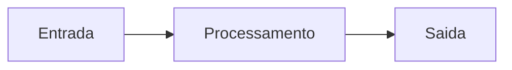
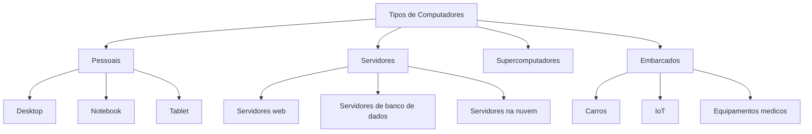
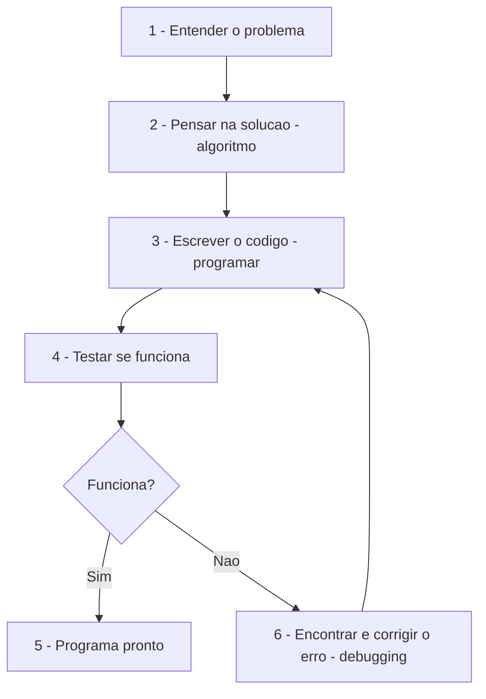
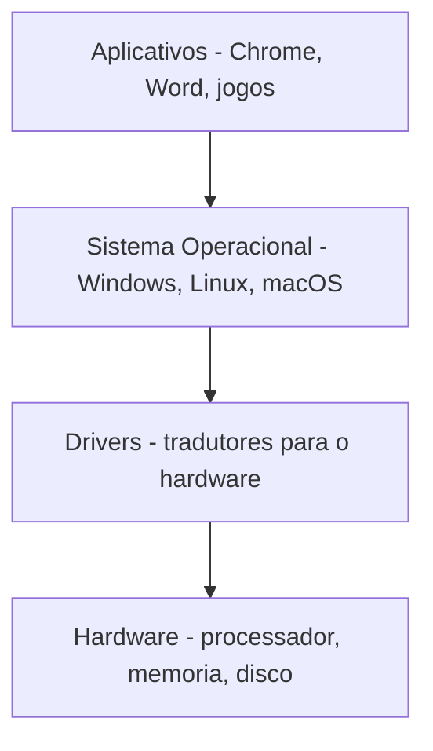
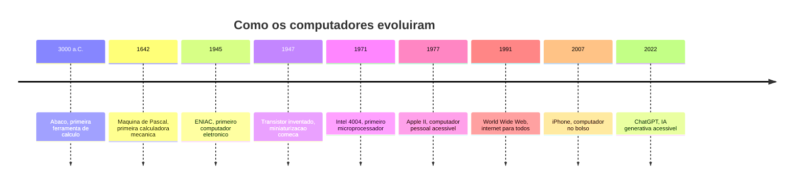

# 1.1 — O que é um Computador e o que ele faz

[← Voltar ao README](../readme.md) · [Próximo: Componentes Básicos →](cap01-mod02-componentes-basicos.md)

---

## Introdução

Bem-vindo ao primeiro módulo do livro!

Antes de falar sobre programação, Linux, bancos de dados ou qualquer outra coisa, precisamos responder uma pergunta que parece simples, mas que esconde muita coisa por trás: **o que é um computador?**

Você provavelmente usa um computador todos os dias — seja um notebook, um celular ou até uma smart TV. Mas já parou para pensar no que ele realmente faz? Como ele "sabe" o que fazer quando você clica em um botão ou digita uma mensagem?

Este módulo é puramente teórico. Não precisa abrir nenhum programa, instalar nada ou escrever código. Apenas leia, reflita e se prepare para a jornada.

O objetivo deste livro é te transformar em um desenvolvedor — alguém que escreve programas para computadores. Para isso, o primeiro passo é entender a máquina para a qual você vai escrever instruções. Não precisa ser um especialista em eletrônica, mas precisa entender os conceitos fundamentais. É como aprender a dirigir: você não precisa ser mecânico, mas precisa saber que o carro tem motor, freio e volante.

Neste módulo, vamos responder perguntas como: o que um computador realmente faz? Por que ele é tão rápido? O que são dados? Qual a diferença entre hardware e software? E, principalmente, por que tudo isso importa para quem quer programar?

Se você nunca estudou nada sobre tecnologia, está no lugar certo. Vamos começar do zero absoluto e construir cada conceito tijolo por tijolo. Sem pressa, sem pular etapas.

---

## Afinal, o que é um Computador?

Um computador é uma **máquina que processa informações**. Ele recebe dados, faz alguma coisa com esses dados (processa) e devolve um resultado.

Parece simples, e é. Na essência, todo computador faz apenas três coisas:

1. **Recebe dados** (entrada) — pode ser o que você digita no teclado, um clique do mouse, um arquivo que você abre, um sinal de internet
2. **Processa esses dados** — faz cálculos, comparações, transformações
3. **Devolve um resultado** (saída) — mostra algo na tela, toca um som, salva um arquivo, envia uma mensagem

Esse ciclo de **entrada → processamento → saída** é o coração de tudo que um computador faz. Absolutamente tudo. Desde a calculadora mais simples até o ChatGPT mais avançado — todos seguem esse mesmo padrão.

### Exemplos do dia a dia

| O que você faz | Entrada | Processamento | Saida |
|----------------|---------|---------------|-------|
| Digita uma mensagem no WhatsApp | Texto digitado no teclado | Codifica e envia pela internet | Mensagem aparece na tela do destinatario |
| Pesquisa no Google | Texto digitado na barra de busca | Busca em bilhoes de páginas | Lista de resultados na tela |
| Tira uma foto no celular | Luz captada pela camera | Converte luz em dados digitais | Imagem salva na galeria |
| Usa a calculadora | Números e operação | Calcula o resultado | Número na tela |
| Assiste um video no YouTube | Clique no video | Busca o video no servidor e transmite | Video tocando na tela |
| Pede comida por aplicativo | Seleção do restaurante e prato | Processa pedido e envia ao restaurante | Confirmacao e rastreamento |
| Usa o GPS do celular | Sinal de satelites | Calcula sua posição | Mapa com sua localização |

Perceba: em todos os casos, o padrão é o mesmo. Entrada, processamento, saída. Esse conceito é tão fundamental que vai aparecer em praticamente tudo que estudarmos daqui para frente. Quando você aprender a programar no capítulo 5, vai escrever programas que seguem exatamente esse padrão: recebem dados, processam e devolvem resultados.

---

## O Computador não Pensa

Essa é uma das coisas mais importantes que você precisa entender logo no início: **o computador não pensa**. Ele não tem vontade própria, não tem criatividade, não toma decisões por conta própria.

O computador faz **exatamente** o que alguém mandou ele fazer. Nem mais, nem menos. Se alguém deu uma instrução errada, ele vai executar a instrução errada sem questionar. Se ninguém deu instrução nenhuma, ele fica parado.

Pense no computador como um assistente extremamente obediente e extremamente rápido, mas que não tem nenhuma iniciativa. Ele precisa que alguém diga **cada passo** do que deve ser feito, na **ordem correta**.

### O que isso significa na prática?

Quando algo "dá errado" no computador, quase sempre o problema não é do computador — é das instruções que ele recebeu. O computador fez exatamente o que mandaram. O problema é que mandaram errado.

Isso é um conceito fundamental para programadores. Quando seu programa não funciona como esperado, o computador não errou — você é que deu instruções que não fazem o que você queria. Encontrar e corrigir esses erros é uma das habilidades mais importantes de um programador, e tem até um nome: **debugging** (depuração, ou "caça aos bugs").

A palavra "bug" (inseto, em inglês) vem de uma história real: em 1947, os engenheiros do computador Harvard Mark II encontraram uma mariposa presa dentro da máquina, causando mau funcionamento. Eles colaram o inseto no caderno de registros e escreveram "First actual case of bug being found" (Primeiro caso real de bug encontrado). Desde então, erros em programas são chamados de "bugs".

### E a Inteligência Artificial?

Você pode estar pensando: "Mas e a IA? Ela não pensa?" Boa pergunta!

Mesmo a IA mais avançada é, no fundo, um programa — um conjunto de instruções que alguém escreveu. Ela simula comportamento inteligente, mas não "pensa" como nós. O ChatGPT, por exemplo, não entende o que está dizendo — ele calcula qual é a próxima palavra mais provável com base em padrões que aprendeu de bilhões de textos.

Isso não diminui o que a IA faz — é impressionante e útil. Mas é importante entender que, por baixo de tudo, é um computador seguindo instruções. Instruções muito sofisticadas, escritas por milhares de programadores, mas ainda assim instruções.

Vamos explorar IA em detalhes no módulo 1.10. Por enquanto, guarde essa ideia: computadores não pensam, eles processam.

### Lógica: A Habilidade Mais Importante

Se o computador não pensa, quem pensa é o programador. E a ferramenta que o programador usa para pensar é a **lógica** — a capacidade de organizar ideias em passos claros e sequenciais.

Quando você escreve um programa, está traduzindo uma solução lógica para uma linguagem que o computador entende. Se sua lógica está errada, o programa vai estar errado — não importa quão bem você escreva o código.

Por isso, o capítulo 5 deste livro é dedicado à **lógica de programação**. Antes de aprender qualquer linguagem sofisticada, você precisa aprender a pensar de forma lógica e estruturada. Essa habilidade é mais valiosa do que qualquer linguagem de programação — porque linguagens mudam, mas a lógica é para sempre.

Exemplos de pensamento lógico no dia a dia:

| Situação | Pensamento logico |
|----------|-------------------|
| Fazer um bolo | Seguir a receita passo a passo, na ordem certa |
| Dar direcoes para alguem | Descrever cada curva e referência em sequência |
| Organizar uma mudanca | Planejar o que embalar primeiro, o que vai em qual caixa |
| Resolver um problema de matemática | Dividir em etapas menores e resolver uma de cada vez |

Se você consegue seguir uma receita de bolo, consegue programar. A lógica é a mesma — só muda a linguagem.

---

## Computadores estão em Todo Lugar

Quando falamos "computador", a maioria das pessoas pensa em um notebook ou desktop. Mas computadores estão em muito mais lugares do que você imagina. Na verdade, você provavelmente interage com dezenas de computadores todos os dias sem perceber.

| Dispositivo | E um computador? | O que ele processa? |
|-------------|-------------------|---------------------|
| Notebook e Desktop | Sim | Programas, jogos, documentos, internet |
| Celular e Smartphone | Sim | Aplicativos, chamadas, fotos, mensagens |
| Smart TV | Sim | Streaming de video, aplicativos |
| Relogio inteligente | Sim | Notificacoes, saude, exercícios |
| Caixa eletronico | Sim | Transações bancarias |
| Semaforo inteligente | Sim | Controle de trafego |
| Geladeira smart | Sim | Temperatura, inventario, alertas |
| Carro moderno | Sim | Motor, freios, navegação, entretenimento |
| Roteador Wi-Fi | Sim | Distribuição de internet |
| Console de jogos | Sim | Jogos, streaming, aplicativos |
| Drone | Sim | Navegação, estabilizacao, camera |
| Máquina de lavar moderna | Sim | Ciclos de lavagem, sensores |

Todos esses dispositivos seguem o mesmo princípio: recebem dados, processam e devolvem um resultado. A diferença está no **tamanho**, na **potência** e no **propósito** de cada um.

### A Internet das Coisas (IoT)

Essa tendência de colocar computadores em tudo tem um nome: **IoT** (Internet of Things, ou Internet das Coisas). A ideia é que cada vez mais objetos do dia a dia tenham um computador dentro, conectado à internet.

Seu relógio mede seus batimentos cardíacos e envia para o celular. Sua geladeira avisa quando um alimento está acabando. Seu carro atualiza o mapa de navegação automaticamente. Tudo isso é IoT — computadores pequenos, conectados, processando dados o tempo todo.

Para programadores, IoT é um mercado enorme e crescente. Alguém precisa escrever os programas que rodam nesses dispositivos. E os conceitos que você vai aprender neste livro — lógica de programação, estruturas de dados, comunicação entre sistemas — são exatamente o que você precisa para trabalhar com IoT.

### Números que Impressionam

Para ter uma ideia de quantos computadores existem no mundo:

| Tipo de dispositivo | Quantidade estimada em 2024 |
|--------------------|---------------------------|
| Smartphones | 6.8 bilhoes |
| Computadores pessoais | 2 bilhoes |
| Dispositivos IoT | 15 bilhoes |
| Servidores | 100 milhoes |

São mais de 20 bilhões de computadores ativos no mundo — quase 3 para cada pessoa no planeta. E esse número cresce a cada ano. Cada um desses dispositivos precisa de software para funcionar, e alguém precisa escrever esse software.

---

## Tipos de Computadores

Nem todo computador é igual. Existem diferentes categorias, cada uma projetada para resolver um tipo de problema:

### Computadores Pessoais (PCs)

São os notebooks e desktops que usamos no dia a dia. Projetados para uma pessoa usar de cada vez, com tela, teclado e mouse. É nesse tipo de computador que você vai programar durante este livro.

| Tipo | Vantagem | Desvantagem | Melhor para |
|------|----------|-------------|-------------|
| Desktop | Mais potente, mais barato, fácil de atualizar | Não e portátil | Trabalho fixo, jogos pesados |
| Notebook | Portátil, tela e teclado integrados | Mais caro, mais difícil de atualizar | Trabalho móvel, estudos |
| Tablet | Muito portátil, tela touch | Menos potente, teclado virtual | Consumo de conteúdo, leitura |

### Servidores

Servidores são computadores projetados para atender muitas pessoas ao mesmo tempo. Quando você acessa o Google, o Netflix ou o Instagram, está se conectando a servidores — computadores potentes que ficam ligados 24 horas por dia em grandes prédios chamados **data centers** (centros de dados).

O **problema** que servidores resolvem: se cada pessoa precisasse ter todos os dados e programas no seu próprio computador, seria impossível ter serviços como redes sociais, streaming de vídeo ou e-mail. Servidores centralizam os dados e os programas, e qualquer pessoa pode acessar de qualquer lugar.

Quando você se tornar desenvolvedor, seus programas provavelmente vão rodar em servidores. Vamos aprofundar esse tema no módulo 1.8.

### Supercomputadores

São os computadores mais potentes do mundo, projetados para resolver problemas extremamente complexos: previsão do tempo, simulação de moléculas para criar remédios, pesquisa científica, inteligência artificial.

O supercomputador mais rápido do mundo em 2024 (Frontier, nos EUA) consegue fazer mais de um **quintilhão** de cálculos por segundo. Para ter uma ideia: se cada pessoa no planeta fizesse um cálculo por segundo, levariam mais de 4 anos para fazer o que o Frontier faz em 1 segundo.

### Computadores Embarcados

São computadores pequenos que ficam dentro de outros dispositivos: carros, eletrodomésticos, equipamentos médicos, aviões. Eles são projetados para fazer uma tarefa específica de forma confiável.

O computador do freio ABS do seu carro, por exemplo, precisa funcionar perfeitamente todas as vezes — uma falha pode custar vidas. Por isso, computadores embarcados são projetados com foco em **confiabilidade**, não em potência.

---

## O que faz um Computador ser Útil?

Um computador sozinho, sem instruções, é apenas um monte de peças eletrônicas. O que torna ele útil são os **programas** — conjuntos de instruções que dizem ao computador o que fazer.

Quando você abre o navegador de internet, está executando um programa. Quando usa uma planilha, está executando outro programa. Quando joga um jogo, está executando mais um programa.

Esses programas são escritos por pessoas — **programadores** — usando **linguagens de programação**. E é exatamente isso que você vai aprender a fazer neste livro.

### Programas são Receitas

Lembra da analogia da cozinha? Um programa é como uma receita. Ele diz ao computador (o cozinheiro) exatamente o que fazer, passo a passo:

1. Pegue este ingrediente (dado)
2. Misture com aquele outro
3. Aqueça por X minutos
4. Sirva o resultado

Se a receita está errada, o prato sai errado — mesmo que o cozinheiro seja excelente. Da mesma forma, se o programa tem um erro, o resultado sai errado — mesmo que o computador seja potente.

Essa é a essência da programação: escrever receitas (programas) claras, corretas e eficientes para que o computador (cozinheiro) produza o resultado desejado.

### Tipos de Programas

Existem diferentes tipos de programas, cada um com um propósito:

| Tipo | O que faz | Exemplos |
|------|-----------|----------|
| Sistema operacional | Gerência o hardware e permite rodar outros programas | Windows, Linux, macOS, Android |
| Aplicativo de desktop | Programa que roda no seu computador | Word, Excel, Photoshop, VSCode |
| Aplicativo mobile | Programa que roda no celular | WhatsApp, Instagram, Uber |
| Aplicativo web | Programa que roda no navegador | Gmail, Google Docs, Netflix |
| Jogo | Programa de entretenimento interativo | Minecraft, Fortnite, CS |
| Servico de servidor | Programa que roda em servidores | Google Search, APIs, bancos de dados |
| Script | Programa pequeno que automatiza tarefas | Backup automático, processamento de dados |
| IA e Machine Learning | Programa que aprende com dados | ChatGPT, reconhecimento facial, traducao |

Ao longo deste livro, você vai aprender a criar vários desses tipos. No capítulo 5, vai criar scripts em Python. No capítulo 7, vai criar um aplicativo CRUD (que cria, lê, atualiza e deleta dados). No capítulo 10, vai criar uma API (um serviço que outros programas podem usar).

### Linguagens de Programação: Os Idiomas dos Computadores

Assim como existem diferentes idiomas humanos (português, inglês, japonês), existem diferentes **linguagens de programação**. Cada uma foi criada para resolver um tipo de problema:

| Linguagem | Criada em | Para que serve | Usamos neste livro? |
|-----------|-----------|---------------|---------------------|
| Python | 1991 | Programação geral, IA, automacao | Sim, capítulos 5, 7 e 10 |
| C | 1972 | Sistemas operacionais, hardware, performance | Sim, capítulo 6 |
| C# | 2000 | Aplicações empresariais, jogos | Sim, capítulo 8 |
| JavaScript | 1995 | Sites e aplicações web | Não neste livro |
| Java | 1995 | Aplicações empresariais, Android | Não neste livro |
| Go | 2009 | Servidores, sistemas distribuidos | Não neste livro |
| Rust | 2010 | Sistemas de alta performance e segurança | Não neste livro |

Não se preocupe com essas linguagens agora — vamos chegar lá no capítulo 5. O importante é saber que existem muitas linguagens, cada uma com suas vantagens, e que neste livro vamos aprender três delas: Python (para lógica e conceitos básicos), C (para entender memória e estruturas de dados) e C# (para orientação a objetos).

A escolha da linguagem depende do problema que você quer resolver. Lembre-se do nosso mantra: **"Qual problema você quer resolver?"** — a resposta a essa pergunta guia a escolha da ferramenta.

### Como Programas são Criados

O processo de criar um programa segue etapas que vamos aprender ao longo do livro:

Esse ciclo — entender, pensar, escrever, testar, corrigir — é o dia a dia de todo programador. E a parte mais importante não é escrever código — é **entender o problema** e **pensar na solução**. O código é apenas a tradução da solução para uma linguagem que o computador entende.

Por isso, antes de aprender qualquer linguagem de programação, vamos passar pelos fundamentos: como computadores funcionam (este capítulo), como sistemas operacionais organizam tudo (capítulo 2), como usar o terminal (capítulo 3) e como versionar código (capítulo 4). Esses fundamentos são a base sobre a qual tudo mais é construído.

---

## A Relação entre Hardware e Software

Existem dois conceitos fundamentais que você vai ouvir o tempo todo:

- **Hardware** — é a parte física do computador. As peças que você pode tocar: teclado, tela, processador, memória, disco rígido, placa de vídeo. É o "corpo" do computador.

- **Software** — é a parte lógica. Os programas, aplicativos, sistemas operacionais. São as instruções que dizem ao hardware o que fazer. É a "mente" do computador.

Um sem o outro não funciona:
- Hardware sem software é uma máquina inútil — como um carro sem motorista
- Software sem hardware não existe — como um motorista sem carro

| Conceito | O que e | Exemplos |
|----------|---------|----------|
| Hardware | Parte fisica, pecas | Teclado, mouse, processador, memória RAM, HD/SSD, placa de video |
| Software | Parte lógica, programas | Windows, Linux, Chrome, Word, WhatsApp, jogos, Python |

### As Camadas de Software

O software não é uma coisa só — ele é organizado em camadas, cada uma com uma responsabilidade:

1. **Hardware** — as peças físicas
2. **Drivers** — programas que traduzem entre o sistema operacional e o hardware específico. Cada placa de vídeo, impressora ou teclado precisa de um driver
3. **Sistema Operacional** — o programa que gerência tudo: distribui recursos, controla acesso, permite rodar outros programas
4. **Aplicativos** — os programas que você usa no dia a dia

Quando você clica em um botão no navegador, acontece uma cadeia: o aplicativo (navegador) pede ao sistema operacional, que pede ao driver, que fala com o hardware (placa de vídeo) para desenhar o resultado na tela. Tudo isso acontece em milissegundos.

Vamos aprofundar cada uma dessas camadas nos próximos módulos. No módulo 1.2, vamos ver o hardware em detalhe. No módulo 1.6, vamos ver o sistema operacional.

---

## Uma Breve História: Como Chegamos Até Aqui

Computadores não surgiram do nada. A ideia de criar máquinas que processam informações é muito antiga — e entender essa evolução ajuda a entender por que os computadores de hoje são como são.

Vamos ver os marcos mais importantes (no módulo 1.3, vamos aprofundar essa história):

O que levou milhares de anos para evoluir do ábaco ao ENIAC, levou apenas décadas para ir do ENIAC ao smartphone. E a velocidade de evolução só aumenta. Quando você terminar este livro, provavelmente já existirão tecnologias que não existem hoje.

Por isso, o mais importante não é decorar ferramentas — é entender **conceitos**. Ferramentas mudam o tempo todo. Conceitos são para sempre. Esse é um dos mantras deste livro: **"Conceitos são para sempre, ferramentas apenas os implementam."**

### O Computador Mais Importante: O Que Você Tem

Não importa se você tem um notebook potente ou um computador simples. O computador mais importante é o que você tem disponível agora. Todos os conceitos deste livro podem ser praticados em qualquer computador que rode Linux — e Linux roda em praticamente qualquer máquina.

No capítulo 2, vamos instalar e configurar Linux. No capítulo 3, vamos aprender a usar o terminal. E a partir do capítulo 5, vamos começar a programar. Tudo isso funciona em qualquer computador dos últimos 10 anos.

---

## Uma Breve Analogia: O Computador como uma Cozinha

Para fixar esses conceitos, pense no computador como uma cozinha. Essa analogia vai nos acompanhar durante todo o livro, então vale a pena entender bem:

| Elemento da cozinha | Equivalente no computador | Função |
|---------------------|---------------------------|--------|
| A cozinha em si | O hardware | Estrutura fisica onde tudo acontece |
| As receitas | O software - programas | Instruções do que fazer |
| O cozinheiro | O processador - CPU | Quem executa as instruções |
| A bancada de trabalho | A memória RAM | Espaco de trabalho temporário |
| A despensa e armarios | O armazenamento - HD e SSD | Onde as coisas ficam guardadas permanentemente |
| Os ingredientes | Os dados | O que e processado |
| O prato pronto | O resultado | A saida do processamento |
| O cardapio | A interface do usuario | Como você interage com o sistema |
| O gerente do restaurante | O sistema operacional | Quem organiza tudo e distribui tarefas |

O cozinheiro (CPU) pega os ingredientes (dados) da despensa (armazenamento), coloca na bancada (memória RAM), segue a receita (programa) e produz o prato pronto (resultado). O gerente (sistema operacional) garante que tudo funcione sem conflito — que dois cozinheiros não usem a mesma bancada ao mesmo tempo, que os ingredientes não acabem, que os pedidos sejam atendidos na ordem certa.

Essa analogia vai fazer cada vez mais sentido conforme avançamos nos próximos módulos. Sempre que um conceito novo aparecer, vamos conectar com a cozinha.

### Por que analogias importam?

Analogias são uma das ferramentas mais poderosas para aprender conceitos novos. Quando você conecta algo desconhecido (computador) com algo familiar (cozinha), seu cérebro cria pontes que facilitam a memorização e o entendimento.

Ao longo deste livro, vamos usar muitas analogias. Não são simplificações — são formas de tornar conceitos abstratos em algo concreto e tangível. Quando você entender profundamente a analogia, vai entender profundamente o conceito.

### Estendendo a Analogia

Vamos levar a analogia da cozinha um pouco mais longe, porque ela vai nos acompanhar por todo o livro:

| Conceito de computacao | Analogia da cozinha | Onde vamos ver |
|----------------------|---------------------|----------------|
| Processador com multiplos nucleos | Cozinha com vários cozinheiros | Módulo 1.5 |
| Memória cache | Ingredientes que o cozinheiro mantem na mao | Módulo 1.5 |
| Sistema operacional | Gerente do restaurante que organiza tudo | Módulo 1.6 |
| Rede e internet | Sistema de delivery entre restaurantes | Módulo 1.9 |
| Banco de dados | Livro de receitas e inventario da despensa | Capítulo 7 |
| API | Cardapio padronizado entre restaurantes | Capítulo 10 |
| Bug | Erro na receita que faz o prato sair errado | Capítulo 5 |
| Variável | Pote etiquetado com um ingrediente | Capítulo 5 |
| Função | Uma receita que pode ser reutilizada | Capítulo 5 |
| Classe e objeto | Modelo de prato e o prato real servido | Capítulo 8 |

Não se preocupe se esses termos não fazem sentido agora — vamos explicar cada um no momento certo. O importante é saber que a analogia da cozinha vai crescer junto com seu conhecimento.

### O Computador como Ferramenta

Uma última reflexão antes de seguir: o computador é uma **ferramenta**. Assim como um martelo não constrói uma casa sozinho (precisa de um pedreiro), um computador não resolve problemas sozinho (precisa de um programador).

A ferramenta mais poderosa não é o computador — é a sua capacidade de pensar, analisar problemas e criar soluções. O computador apenas executa suas soluções em velocidade sobre-humana.

Ao longo deste livro, vamos desenvolver essa capacidade de pensar como programador. Os primeiros capítulos são sobre entender a ferramenta (o computador). Os capítulos seguintes são sobre aprender a usar a ferramenta (programação). E o projeto final é sobre usar tudo junto para resolver um problema real.

---

## Dados: A Matéria-Prima do Computador

Falamos muito em "dados", mas o que exatamente são dados?

**Dados** são qualquer informação que pode ser representada e processada por um computador. Podem ser:

| Tipo de dado | Exemplos | Como o computador armazena |
|-------------|----------|---------------------------|
| Texto | Seu nome, uma mensagem, um livro | Sequência de caracteres codificados em números |
| Números | Sua idade, preco de um produto, temperatura | Valores numericos em formato binário |
| Imagens | Fotos, prints, gráficos | Milhoes de pontos coloridos - pixels |
| Audio | Musicas, podcasts, chamadas de voz | Ondas sonoras convertidas em números |
| Video | Filmes, lives, chamadas de video | Sequência de imagens com audio |
| Localização | Coordenadas GPS | Números representando latitude e longitude |
| Booleano | Verdadeiro ou falso | Um único bit: 0 ou 1 |

No fundo, **tudo** dentro de um computador é representado como números. Texto? Cada letra tem um número (A = 65, B = 66, etc.). Imagens? Cada ponto da tela tem um número para a cor. Música? Ondas sonoras convertidas em números.

E esses números, por sua vez, são representados como **zeros e uns** — o famoso sistema **binário**. Por que zeros e uns? Porque os componentes eletrônicos do computador (transistores) só têm dois estados: ligado (1) ou desligado (0). É como um interruptor de luz — só tem duas posições.

### Como Texto Vira Números

Cada letra, número e símbolo que você digita tem um código numérico. O sistema mais básico se chama **ASCII** (American Standard Code for Information Interchange):

| Caractere | Código ASCII | Em binário |
|-----------|-------------|-----------|
| A | 65 | 01000001 |
| B | 66 | 01000010 |
| a | 97 | 01100001 |
| 0 | 48 | 00110000 |
| ! | 33 | 00100001 |
| espaco | 32 | 00100000 |

Quando você digita "Oi", o computador armazena os números 79 (O) e 105 (i). Quando precisa mostrar na tela, converte de volta: 79 → O, 105 → i.

O ASCII só cobre letras do inglês. Para acentos, caracteres japoneses, emojis e outros símbolos, existe o **Unicode** — um sistema que cobre praticamente todos os caracteres de todos os idiomas do mundo, incluindo emojis. O emoji 😀 tem o código Unicode 128512.

Vamos aprofundar como texto e dados são representados quando chegarmos ao capítulo 5 (programação) e especialmente ao capítulo 6 (C e memória). Por enquanto, guarde essa ideia: tudo no computador é número, e todo número é zeros e uns.

### Como Imagens Viram Números

Uma imagem digital é composta por milhões de pontos minúsculos chamados **pixels** (picture elements). Cada pixel tem uma cor, e cada cor é representada por números.

O sistema mais comum usa três números para cada pixel: um para vermelho (R), um para verde (G) e um para azul (B) — o sistema **RGB**. Cada número vai de 0 a 255:

| Cor | R | G | B |
|-----|---|---|---|
| Vermelho puro | 255 | 0 | 0 |
| Verde puro | 0 | 255 | 0 |
| Azul puro | 0 | 0 | 255 |
| Branco | 255 | 255 | 255 |
| Preto | 0 | 0 | 0 |
| Amarelo | 255 | 255 | 0 |

Uma foto de celular com 12 megapixels tem 12 milhões de pixels. Cada pixel precisa de 3 bytes (um para cada cor). Isso dá 36 milhões de bytes (36 MB) de dados brutos para uma única foto. Na prática, as fotos são menores porque usam **compressão** — técnicas matemáticas que reduzem o tamanho sem perder muita qualidade.

### Dados vs Informação

Existe uma diferença sutil mas importante:

- **Dados** são fatos brutos, sem contexto: "25", "São Paulo", "37.5"
- **Informação** é dados com contexto e significado: "A temperatura em São Paulo é 25°C" ou "O paciente tem 37.5°C de febre"

O computador trabalha com dados. Quem transforma dados em informação é o programa — e quem escreve o programa é o programador. Essa transformação de dados brutos em informação útil é uma das tarefas mais importantes da programação.

Quando você criar um sistema CRUD no capítulo 7, vai trabalhar exatamente com isso: receber dados do usuário, armazenar, organizar e apresentar como informação útil.

### O Volume de Dados no Mundo

Para ter uma ideia da escala de dados que existem hoje:

| Fato | Número |
|------|--------|
| Dados gerados por dia no mundo | 2.5 quintilhoes de bytes |
| Emails enviados por dia | 300 bilhoes |
| Fotos postadas no Instagram por dia | 100 milhoes |
| Horas de video enviadas ao YouTube por minuto | 500 horas |
| Pesquisas no Google por dia | 8.5 bilhoes |

Todos esses dados precisam ser armazenados, processados e transformados em informação útil. E quem faz isso? Programas escritos por programadores. O mercado de trabalho para desenvolvedores é enorme justamente porque o volume de dados não para de crescer.

---

## A Velocidade dos Computadores

Uma coisa que diferencia computadores de humanos é a **velocidade**. Computadores são absurdamente rápidos.

Para ter uma ideia:

| Operação | Tempo para um humano | Tempo para um computador |
|----------|---------------------|-------------------------|
| Somar dois números | 1-2 segundos | 0.000000001 segundos - 1 nanossegundo |
| Ler uma página de texto | 2-3 minutos | 0.00001 segundos |
| Buscar uma palavra em um livro | Vários minutos | 0.001 segundos |
| Comparar duas fotos | Alguns segundos | 0.01 segundos |

Um processador moderno executa bilhões de operações por segundo. Isso significa que, no tempo que você leva para piscar os olhos (cerca de 300 milissegundos), um computador pode fazer centenas de milhões de cálculos.

Essa velocidade é o que permite que computadores façam coisas que parecem mágica: traduzir idiomas em tempo real, reconhecer rostos em fotos, gerar imagens a partir de texto. Não é mágica — é velocidade bruta aplicada a instruções bem escritas.

### Unidades de Medida de Velocidade

Para falar sobre velocidade de computadores, usamos unidades específicas:

| Unidade | Significado | Exemplo |
|---------|------------|---------|
| Hz - Hertz | 1 operação por segundo | Relogio de parede |
| KHz - Quilohertz | 1.000 operações por segundo | Primeiro processador Intel 4004 |
| MHz - Megahertz | 1.000.000 operações por segundo | Processadores dos anos 1990 |
| GHz - Gigahertz | 1.000.000.000 operações por segundo | Processadores atuais |

Quando você vê que um processador roda a "3.5 GHz", significa que ele faz 3.5 bilhões de ciclos por segundo. Cada ciclo pode executar uma ou mais instruções, dependendo da arquitetura do processador. Vamos aprofundar isso nos módulos 1.4 e 1.5.

### Unidades de Medida de Armazenamento

Dados ocupam espaço, e medimos esse espaço em bytes:

| Unidade | Tamanho | Exemplo do que cabe |
|---------|---------|---------------------|
| 1 Byte | 8 bits - zeros e uns | Uma única letra |
| 1 KB - Kilobyte | 1.024 bytes | Um paragrafo de texto |
| 1 MB - Megabyte | 1.024 KB | Uma foto de celular |
| 1 GB - Gigabyte | 1.024 MB | Um filme em qualidade media |
| 1 TB - Terabyte | 1.024 GB | Centenas de filmes |

Seu celular provavelmente tem 64-256 GB de armazenamento. Seu notebook pode ter 256 GB a 1 TB. Servidores podem ter dezenas de terabytes. Essas unidades vão aparecer constantemente quando falarmos de memória RAM e armazenamento no próximo módulo.

### Por que velocidade importa para programadores?

Quando você escreve um programa, a forma como escreve afeta a velocidade. Um programa bem escrito pode fazer a mesma tarefa em 1 segundo. Um programa mal escrito pode levar 1 hora. A diferença está nas instruções — no algoritmo.

Imagine que você precisa encontrar um nome em uma lista telefônica com 1 milhão de nomes. Você pode:
- **Método 1**: olhar nome por nome, do início ao fim. No pior caso, vai olhar 1 milhão de nomes.
- **Método 2**: abrir no meio, ver se o nome que procura vem antes ou depois, e repetir. Em no máximo 20 passos, encontra qualquer nome.

Ambos os métodos funcionam, mas o segundo é absurdamente mais rápido. Essa é a diferença entre um algoritmo ruim e um algoritmo bom. No capítulo 5, vamos aprender sobre **algoritmos** — sequências de passos para resolver problemas. E no módulo 5.12, vamos aprender sobre **Big O** — uma forma de medir a eficiência de um algoritmo. Esses conceitos são fundamentais para escrever programas rápidos.

---

## Por que Isso Importa para Você?

Você pode estar pensando: "Tá, mas eu quero aprender a programar, não a montar computador." E você tem razão — não vamos montar computadores neste livro.

Mas entender o que um computador é e como ele funciona é **fundamental** para programar bem. Aqui estão situações reais onde esse conhecimento faz diferença:

| Situação | Sem entender o computador | Entendendo o computador |
|----------|--------------------------|------------------------|
| Programa lento | Não sabe por que esta lento | Sabe que pode ser falta de RAM ou algoritmo ruim |
| Arquivo não encontrado | Não sabe onde procurar | Entende como o armazenamento funciona |
| Programa trava | Reinicia e torce para funcionar | Investiga o que esta consumindo recursos |
| Escolher servidor | Escolhe o mais caro achando que e melhor | Escolhe baseado no que o programa precisa |
| Erro de memória | Não entende a mensagem de erro | Sabe que o programa esta usando mais RAM do que tem |
| Site lento | Acha que e a internet | Sabe que pode ser o servidor, o algoritmo ou a rede |
| App consome bateria | Não sabe por que | Entende que o app esta usando muito processador |

Cada conceito que vamos ver neste capítulo — processador, memória, armazenamento, sistema operacional — vai aparecer de novo quando começarmos a programar. Você vai entender por que certas coisas acontecem e como resolver problemas.

### O Mapa do Livro

Para você ter uma visão geral de para onde estamos indo:

| Capítulo | Tema | O que você vai aprender |
|----------|------|------------------------|
| 1 | Fundamentos da Computacao | Como computadores funcionam - você esta aqui |
| 2 | Linux | O sistema operacional que roda a internet |
| 3 | Terminal | A ferramenta mais poderosa do programador |
| 4 | Git | Como versionar e compartilhar código |
| 5 | Python | Lógica de programação e algoritmos |
| 6 | C | Memória e estruturas de dados |
| 7 | Bancos de Dados | Como armazenar e consultar dados |
| 8 | C# e .NET | Orientacao a objetos e design de software |
| 9 | Arquitetura | Como organizar sistemas complexos |
| 10 | APIs | Como sistemas se comunicam |
| 11 | Projeto Final | Tudo junto em um projeto real |

Cada capítulo constrói sobre o anterior. Os conceitos deste primeiro capítulo são a fundação de tudo que vem depois. Por isso, não tenha pressa — entenda bem cada módulo antes de seguir para o próximo.

---

## Como a IA pode te ajudar aqui

Ao longo deste livro, vamos mostrar como usar Inteligência Artificial como ferramenta de estudo. Para este módulo, por exemplo, você poderia perguntar a uma IA:

**Prompt 1 — Explorar o conceito:**
> "Explique de forma simples o que é um computador e como funciona o ciclo de entrada, processamento e saída. Dê exemplos do dia a dia."

**Prompt 2 — Comparar alternativas:**
> "Qual a diferença entre hardware e software? Me dê 5 exemplos de cada."

**Prompt 3 — Ver exemplos práticos:**
> "Explique a diferença entre dados e informação com exemplos práticos."

---

## Resumo do Módulo

| Conceito | Definição |
|----------|-----------|
| Computador | Máquina que recebe dados, processa e devolve resultados |
| Entrada | Dados que o computador recebe - teclado, mouse, camera, internet |
| Processamento | O que o computador faz com os dados - cálculos, comparacoes |
| Saida | O resultado do processamento - tela, som, arquivo, mensagem |
| Hardware | Parte fisica do computador - pecas |
| Software | Parte lógica do computador - programas |
| Programa | Conjunto de instruções que dizem ao computador o que fazer |
| Dados | Qualquer informação que pode ser processada por um computador |
| Informação | Dados com contexto e significado |
| Bug | Erro em um programa |
| IoT | Internet das Coisas, computadores em objetos do dia a dia |
| Driver | Programa que traduz entre o sistema operacional e o hardware |

---

## Glossário do Módulo

| Termo | Definição |
|-------|-----------|
| Algoritmo | Sequência de passos ordenados para resolver um problema |
| Aplicativo | Programa que o usuario usa diretamente |
| Binário | Sistema numerico com apenas dois digitos: 0 e 1 |
| Bug | Erro em um programa, termo vem de um inseto encontrado em um computador em 1947 |
| Computador | Máquina que recebe dados, processa e devolve resultados |
| Computador embarcado | Computador pequeno dentro de outro dispositivo |
| CRUD | Create, Read, Update, Delete - operações básicas de manipulação de dados |
| Dados | Informações que o computador recebe e processa |
| Data center | Predio com muitos servidores |
| Debugging | Processo de encontrar e corrigir erros em programas |
| Desktop | Computador de mesa, não portátil |
| Driver | Programa que traduz entre o sistema operacional e um hardware específico |
| Entrada | Dados que o computador recebe |
| Hardware | Parte fisica do computador, pecas que você pode tocar |
| Informação | Dados com contexto e significado |
| IoT | Internet of Things, Internet das Coisas, computadores em objetos do dia a dia |
| Linguagem de programação | Idioma que humanos usam para escrever instruções para o computador |
| Notebook | Computador portátil com tela e teclado integrados |
| Pixel | Menor ponto de uma imagem digital |
| Processamento | O que o computador faz com os dados |
| Programa | Conjunto de instruções que dizem ao computador o que fazer |
| Programador | Pessoa que escreve programas |
| Programar | Ato de escrever instruções em uma linguagem de programação |
| Saida | Resultado do processamento |
| Script | Programa pequeno que automatiza tarefas |
| Servidor | Computador projetado para atender muitas pessoas ao mesmo tempo |
| Sistema operacional | Programa que gerência o hardware e permite rodar outros programas |
| Software | Parte lógica do computador, programas e instruções |
| Supercomputador | Computador extremamente potente para tarefas cientificas |
| Tablet | Computador portátil com tela touch |
| Transistor | Componente eletronico básico do computador, tem dois estados: ligado e desligado |
| Unicode | Sistema de codificacao que cobre caracteres de todos os idiomas e emojis |
| RGB | Sistema de cores que usa vermelho, verde e azul para representar qualquer cor |
| Compressao | Técnica matemática para reduzir o tamanho de arquivos |
| ASCII | American Standard Code for Information Interchange, sistema básico de codificacao de texto |
| Byte | Unidade básica de armazenamento, equivale a 8 bits |
| Bit | Menor unidade de informação, pode ser 0 ou 1 |
| Kilobyte | 1.024 bytes, suficiente para um paragrafo de texto |
| Megabyte | 1.024 kilobytes, suficiente para uma foto |
| Gigabyte | 1.024 megabytes, suficiente para um filme |
| Terabyte | 1.024 gigabytes, suficiente para centenas de filmes |
| GHz | Gigahertz, medida de velocidade do processador, bilhoes de ciclos por segundo |
| Lógica | Capacidade de organizar ideias em passos claros e sequenciais |

## Na Cultura Popular

- **Matrix** (filme, 1999) — explora a ideia de que tudo pode ser representado como dados em um computador. A famosa "chuva de código verde" é uma representação visual de dados sendo processados. O filme levanta questões sobre o que é real e o que é simulação — conceitos que se conectam com a ideia de que computadores processam representações do mundo real.
- **O Jogo da Imitação** (filme, 2014) — mostra Alan Turing criando uma das primeiras máquinas de computação. Turing é considerado o pai da ciência da computação e formulou a pergunta "máquinas podem pensar?" — exatamente o que discutimos neste módulo.
- **O Dilema das Redes** (documentário, 2020) — mostra como computadores processam dados sobre nosso comportamento online. Ilustra perfeitamente o ciclo entrada-processamento-saída: seus cliques (entrada) são processados por algoritmos (processamento) que decidem o que mostrar para você (saída).

## Para Saber Mais

- [Como funciona um computador — Khan Academy](https://pt.khanacademy.org/computing/computer-science) — Curso gratuito sobre ciência da computação
- [Computer Science — Crash Course](https://www.youtube.com/playlist?list=PL8dPuuaLjXtNlUrzyH5r6jN9ulIgZBpdo) — Série de vídeos sobre fundamentos
- [Code.org — Como computadores funcionam](https://www.youtube.com/watch?v=OAx_6-wdslM) — Vídeo curto e didático
- [GitHub do Fino — learn-ops-content](https://github.com/RafaelFino/learn-ops-content) — Material complementar

---

## Perguntas Frequentes (FAQ)

**P: Preciso saber montar um computador para programar?**
R: Não! Você precisa entender os conceitos básicos de como ele funciona, mas não precisa saber montar ou consertar. É como dirigir: você não precisa ser mecânico.

**P: Celular é um computador?**
R: Sim! Um smartphone é um computador completo — tem processador, memória, armazenamento e roda programas (aplicativos). A diferença é o tamanho e o formato. Na verdade, o celular no seu bolso é mais potente que os computadores que levaram o homem à Lua em 1969.

**P: O que é mais importante, hardware ou software?**
R: Os dois são igualmente importantes. Um não funciona sem o outro. Hardware é o corpo, software é a mente. Um carro sem motorista não vai a lugar nenhum. Um motorista sem carro também não.

**P: Computadores podem errar?**
R: Computadores executam instruções com precisão absoluta. Quando algo "dá errado", quase sempre é porque as instruções (o programa) tinham um erro. O computador fez exatamente o que mandaram — o problema é que mandaram errado. Encontrar esses erros é uma das habilidades mais importantes de um programador.

**P: Preciso de um computador potente para este livro?**
R: Não! Qualquer computador que consiga rodar Linux e abrir um editor de texto é suficiente. As linguagens que vamos usar (Python, C, C#) são leves. Um computador com 4 GB de RAM e qualquer processador dos últimos 10 anos funciona perfeitamente.

**P: E se eu não entender algo?**
R: Releia o módulo com calma, consulte os materiais complementares e use a IA para tirar dúvidas. Não existe pergunta boba. Todo mundo começa sem saber nada — inclusive os melhores programadores do mundo começaram exatamente onde você está agora.

**P: O que é um programa, exatamente?**
R: É um conjunto de instruções escritas por um programador que dizem ao computador o que fazer. Quando você abre o navegador, está executando um programa. Quando joga um jogo, está executando outro. Neste livro, você vai aprender a escrever seus próprios programas.

**P: Por que preciso entender o que é um computador se quero aprender a programar?**
R: Porque quando você programa, está escrevendo instruções para essa máquina. Se seu programa está lento, pode ser porque está usando muita memória RAM. Se um arquivo não é encontrado, pode ser um problema de armazenamento. Entender a máquina te ajuda a entender o que seu código faz.

**P: O que significa "processar dados"?**
R: Significa fazer alguma operação com os dados: calcular, comparar, transformar, organizar. Quando a calculadora soma 2 + 3, ela está processando. Quando o Google busca resultados, está processando. Todo programa processa dados de alguma forma.

**P: Computadores entendem português?**
R: Não diretamente. Computadores só entendem zeros e uns (linguagem de máquina). As linguagens de programação (como Python) servem como tradutoras — você escreve em algo parecido com inglês, e o computador traduz para zeros e uns. Vamos ver isso em detalhes no capítulo 5.

**P: O que é um bug?**
R: É um erro em um programa. O nome vem de 1947, quando uma mariposa real foi encontrada dentro de um computador, causando mau funcionamento. Desde então, erros em programas são chamados de "bugs" e o processo de corrigi-los é chamado de "debugging" (depuração).

**P: O que é IoT?**
R: IoT (Internet of Things, ou Internet das Coisas) é a tendência de colocar computadores conectados à internet em objetos do dia a dia: relógios, geladeiras, carros, lâmpadas. Cada um desses dispositivos tem um pequeno computador dentro que processa dados e se comunica com outros dispositivos.

**P: Qual a diferença entre dados e informação?**
R: Dados são fatos brutos sem contexto: "25", "São Paulo". Informação é dados com significado: "A temperatura em São Paulo é 25°C". O trabalho do programador é transformar dados em informação útil.

**P: Por que tudo no computador é zeros e uns?**
R: Porque os componentes eletrônicos básicos do computador (transistores) só têm dois estados: ligado (1) ou desligado (0). É como um interruptor de luz. Combinando bilhões desses interruptores, o computador consegue representar qualquer tipo de dado: texto, imagens, sons, vídeos.

**P: O que é um servidor?**
R: É um computador projetado para atender muitas pessoas ao mesmo tempo. Quando você acessa o Google ou o Netflix, está se conectando a servidores. Eles ficam ligados 24 horas por dia em grandes prédios chamados data centers. Vamos aprofundar isso no módulo 1.8.

---

## Exercícios Práticos

**Exercício 1 — Pesquisa: O Computador no Dia a Dia**

Escreva um texto de pelo menos 15 linhas explicando, com suas próprias palavras:
1. O que é um computador
2. O que significa o ciclo de entrada → processamento → saída
3. Dê 5 exemplos do seu dia a dia que seguem esse ciclo (diferentes dos que estão no módulo)
4. Qual a diferença entre hardware e software
5. Qual a diferença entre dados e informação

Dica: Use a analogia da cozinha para ajudar na explicação. Se quiser, use uma IA para tirar dúvidas, mas escreva o texto com suas próprias palavras.

**Exercício 2 — Reflexão: Computadores Invisíveis**

Liste pelo menos 10 dispositivos ou situações do seu dia a dia que envolvem computadores que você normalmente não percebe. Para cada um, explique:
1. Qual é a entrada (dados que o dispositivo recebe)
2. Qual é o processamento (o que ele faz com os dados)
3. Qual é a saída (o resultado)

Dica: Pense em eletrodomésticos, transporte, saúde, entretenimento, segurança.

**Exercício 3 — Pesquisa: Tipos de Computadores**

Pesquise e compare os quatro tipos de computadores que vimos (pessoal, servidor, supercomputador, embarcado):
1. Dê 3 exemplos de cada tipo
2. Explique qual problema cada tipo resolve
3. Pesquise: qual é o supercomputador mais rápido do mundo atualmente? Quantos cálculos por segundo ele faz?

**Exercício 4 — Reflexão: Dados ao Seu Redor**

Pense em 5 situações do seu dia a dia onde dados são coletados sobre você (mesmo sem você perceber). Para cada situação:
1. Quais dados são coletados?
2. Quem coleta esses dados?
3. Como esses dados são transformados em informação útil?
4. Quem se beneficia dessa informação?

Dica: Pense em redes sociais, aplicativos de transporte, cartão de crédito, câmeras de segurança, aplicativos de saúde.

**Exercício 5 — Pesquisa: A Evolução do Computador**

Pesquise e compare:
1. O ENIAC (1945) — tamanho, peso, capacidade de processamento, custo
2. O smartphone que você usa hoje — tamanho, peso, capacidade de processamento, custo

Monte uma tabela comparativa e escreva um parágrafo explicando o que mudou e por que essa evolução foi possível. Dica: pesquise sobre a Lei de Moore (vamos ver isso no módulo 1.3).

**Exercício 6 — Prática: Identificando Entrada, Processamento e Saída**

Para cada programa abaixo, identifique a entrada, o processamento e a saída:
1. Aplicativo de previsão do tempo
2. Tradutor automático (como Google Tradutor)
3. Aplicativo de navegação GPS (como Waze)
4. Rede social (como Instagram)
5. Jogo online (como Fortnite)

Monte uma tabela com três colunas (Entrada, Processamento, Saída) para cada programa.

### Nota sobre a Evolução Contínua

A computação é um campo que evolui constantemente. Os conceitos que você aprendeu neste módulo — entrada, processamento, saída, armazenamento — são os mesmos desde os primeiros computadores, mas a forma como são implementados muda a cada década. Processadores ficam mais rápidos, memórias ficam maiores, e novas formas de interação surgem (toque, voz, gestos). O importante é entender os fundamentos, porque eles permanecem mesmo quando as ferramentas mudam.

---

[← Voltar ao README](../readme.md) · [Próximo: Componentes Básicos →](cap01-mod02-componentes-basicos.md)
