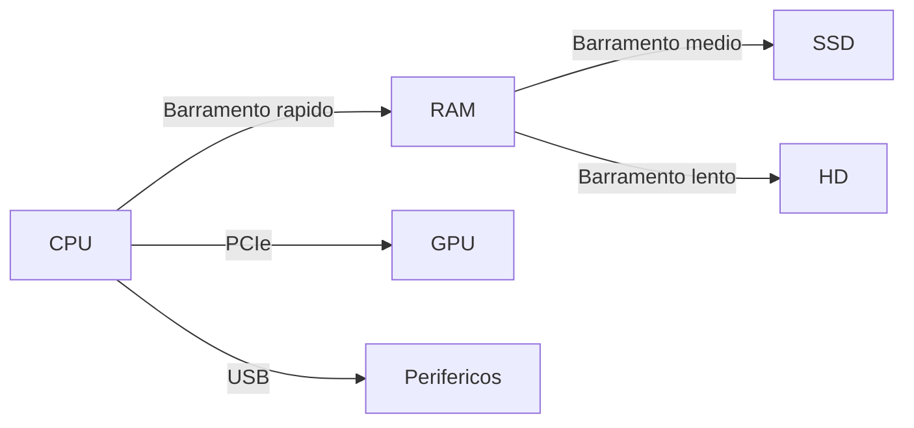
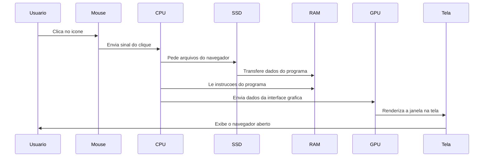

# 1.2 — Componentes Básicos: CPU, Memória e Armazenamento

[← Anterior: O que é um Computador](cap01-mod01-o-que-e-computador.md) · [Próximo: História da Computação →](cap01-mod03-historia-computacao.md)

---

## Introdução

No módulo anterior, vimos que um computador é uma máquina que recebe dados, processa e devolve resultados. Usamos a analogia da cozinha para entender isso: o computador é a cozinha, os dados são os ingredientes, o programa é a receita e o resultado é o prato pronto.

Agora vamos abrir essa cozinha e olhar cada peça por dentro. Quais são os componentes que fazem um computador funcionar? O que cada um faz? Por que uns são mais rápidos que outros? Por que um computador de R$ 2.000 é diferente de um de R$ 10.000?

Não se preocupe com detalhes técnicos demais — o objetivo aqui é que você entenda o papel de cada componente e como eles trabalham juntos. Esse conhecimento vai ser fundamental quando começarmos a programar, porque tudo que um programa faz acontece dentro dessas peças. Quando seu programa estiver lento, quando ele travar, quando ele consumir memória demais — entender os componentes vai te ajudar a diagnosticar o problema.

Pense neste módulo como um tour guiado pela cozinha. Vamos abrir cada armário, olhar cada equipamento e entender para que serve. No final, você vai saber ler as especificações de um computador e entender o que cada número significa.

---

## Os Três Componentes Fundamentais

Todo computador, do mais simples ao mais potente, tem pelo menos três componentes essenciais:

1. **CPU** (Processador) — o cérebro que executa as instruções
2. **Memória RAM** — a bancada de trabalho temporária
3. **Armazenamento** (HD/SSD) — a despensa onde as coisas ficam guardadas

Esses três componentes existem em qualquer dispositivo que você possa chamar de "computador": seu notebook, seu celular, o servidor que hospeda o Google, o computador de bordo de um carro, até a calculadora científica da escola. A diferença entre eles é a quantidade e a velocidade de cada componente.

Vamos entender cada um em profundidade.

---

## CPU — O Cérebro do Computador

A **CPU** (Central Processing Unit, ou Unidade Central de Processamento) é o componente que executa as instruções dos programas. É o "cozinheiro" da nossa analogia — quem realmente faz o trabalho.

Sem a CPU, o computador seria apenas um monte de peças inertes. É ela que lê cada instrução do programa, interpreta o que precisa ser feito e executa a operação. Tudo que acontece no computador — desde mover o cursor do mouse até calcular a trajetória de um foguete — passa pela CPU.

### O que a CPU faz?

A CPU faz basicamente duas coisas, bilhões de vezes por segundo:

1. **Cálculos matemáticos** — soma, subtração, multiplicação, divisão, comparações
2. **Decisões lógicas** — "este número é maior que aquele?", "este valor é verdadeiro ou falso?"

Parece pouco, mas absolutamente tudo que um computador faz se resume a cálculos e decisões. Quando você assiste um vídeo, a CPU está fazendo milhões de cálculos por segundo para decodificar cada frame. Quando você digita uma mensagem, a CPU está processando cada tecla pressionada. Quando você abre o Instagram, a CPU está calculando a posição de cada elemento na tela, decodificando cada imagem e decidindo o que mostrar primeiro.

Para entender como isso funciona, imagine o cozinheiro da nossa cozinha. Ele recebe uma receita (programa) e segue passo a passo:

1. Pegue 2 ovos (buscar dado da memória)
2. Quebre os ovos na tigela (operação)
3. Adicione 1 xícara de farinha (buscar outro dado)
4. Misture tudo (operação)
5. Se a massa estiver lisa, vá para o passo 7 (decisão)
6. Misture mais um pouco e volte ao passo 5 (repetição)
7. Coloque no forno (operação final)

A CPU faz exatamente isso, mas em vez de ovos e farinha, ela trabalha com números. E em vez de fazer um passo por minuto, ela faz bilhões de passos por segundo.

### Velocidade da CPU — O Clock

A velocidade de uma CPU é medida em **GHz** (Gigahertz, ou Giga-hertz). Essa medida indica a frequência do **clock** (relógio) interno da CPU — um sinal elétrico que pulsa bilhões de vezes por segundo, como um metrônomo que marca o ritmo do trabalho.

A cada pulso do clock, a CPU pode executar uma ou mais operações. Então:

| Velocidade | Significado |
|------------|-------------|
| 1 GHz | ~1 bilhão de pulsos por segundo |
| 2 GHz | ~2 bilhões de pulsos por segundo |
| 3.5 GHz | ~3.5 bilhões de pulsos por segundo |
| 5.0 GHz | ~5 bilhões de pulsos por segundo |

Para colocar em perspectiva: uma CPU rodando a 3 GHz executa mais operações em 1 segundo do que você conseguiria fazer manualmente em toda a sua vida. Se você fizesse uma conta de soma por segundo, sem parar, 24 horas por dia, levaria mais de 95 anos para fazer o que uma CPU faz em 1 segundo.

Mas atenção: GHz não é a única medida de desempenho. Uma CPU de 3 GHz não é necessariamente mais rápida que uma de 2.5 GHz. Isso porque CPUs diferentes podem fazer quantidades diferentes de trabalho por pulso de clock. É como comparar dois cozinheiros: um pode ser mais rápido nos movimentos, mas o outro pode cortar mais ingredientes a cada movimento. O que importa é o resultado final, não apenas a velocidade dos movimentos.

### Núcleos — Vários Cozinheiros na Mesma Cozinha

CPUs modernas têm múltiplos **núcleos** (cores, em inglês), que são como ter vários cozinheiros na mesma cozinha — cada um pode executar instruções ao mesmo tempo, de forma independente.

Nos anos 2000, os fabricantes perceberam que não conseguiam mais aumentar a velocidade do clock indefinidamente (o chip esquentava demais). A solução foi colocar mais processadores dentro do mesmo chip. Em vez de um cozinheiro super-rápido, a ideia passou a ser ter vários cozinheiros trabalhando em paralelo.

| CPU | Núcleos | Analogia |
|-----|---------|----------|
| 1 núcleo | 1 cozinheiro | Faz uma coisa por vez |
| 2 núcleos | 2 cozinheiros | Faz 2 coisas ao mesmo tempo |
| 4 núcleos | 4 cozinheiros | Faz 4 coisas ao mesmo tempo |
| 8 núcleos | 8 cozinheiros | Faz 8 coisas ao mesmo tempo |
| 16 núcleos | 16 cozinheiros | Faz 16 coisas ao mesmo tempo |

Quando você abre vários programas ao mesmo tempo — navegador, editor de texto, música — cada programa pode rodar em um núcleo diferente. É por isso que computadores com mais núcleos conseguem fazer mais coisas simultaneamente sem ficar lentos.

Mas nem tudo se beneficia de mais núcleos. Se você está fazendo apenas uma tarefa (como abrir uma página da internet), ter 16 núcleos não vai ser muito diferente de ter 4. É como ter 16 cozinheiros para fazer um único ovo frito — a maioria vai ficar parada esperando.

### Threads — Dividindo o Trabalho de Cada Cozinheiro

Além dos núcleos, CPUs modernas têm uma tecnologia chamada **threads** (fios de execução). Cada núcleo pode ter 2 threads, o que significa que ele consegue alternar entre duas tarefas muito rapidamente, dando a impressão de que está fazendo as duas ao mesmo tempo.

A Intel chama isso de **Hyper-Threading** e a AMD chama de **SMT** (Simultaneous Multi-Threading). Na prática, uma CPU com 8 núcleos e 16 threads pode lidar com 16 tarefas simultaneamente.

Voltando à analogia: é como se cada cozinheiro tivesse duas bancadas e ficasse alternando entre elas. Enquanto espera a água ferver em uma, ele prepara ingredientes na outra.

### Cache — A Prateleira ao Lado do Fogão

Dentro da CPU existe uma memória ultra-rápida chamada **cache** (pronuncia-se "quésh"). O cache guarda os dados que a CPU está usando com mais frequência, para não precisar buscar na RAM toda hora.

Pense assim: o cozinheiro tem uma prateleira pequena bem ao lado do fogão, onde coloca o sal, a pimenta e o azeite — os ingredientes que usa o tempo todo. Ele não precisa ir até a despensa (armazenamento) nem até a bancada (RAM) toda vez que precisa de sal. Está ali, ao alcance da mão.

O cache tem três níveis, cada um maior e um pouco mais lento que o anterior:

| Nível | Tamanho típico | Velocidade | Analogia |
|-------|---------------|------------|----------|
| L1 | 32-64 KB por núcleo | Ultra-rápido | Ingrediente na mão do cozinheiro |
| L2 | 256 KB - 1 MB por núcleo | Muito rápido | Prateleira ao lado do fogão |
| L3 | 8-64 MB compartilhado | Rápido | Armário na cozinha |

Quando a CPU precisa de um dado, ela procura primeiro no L1. Se não encontra, procura no L2. Depois no L3. Só se não encontrar em nenhum cache é que vai buscar na RAM. Esse processo é chamado de **cache miss** (falha de cache) e é mais lento.

Você não precisa se preocupar com cache no dia a dia, mas é bom saber que ele existe. Quando estudarmos programação em C no capítulo 6, vamos ver como a forma que você organiza os dados na memória pode afetar o desempenho do programa por causa do cache.

### Como Ler as Especificações de uma CPU

Quando você vê algo como "Intel Core i7-13700K, 16 núcleos, 24 threads, 3.4 GHz base, 5.4 GHz turbo", pode parecer um código secreto. Vamos decifrar:

| Parte | Significado |
|-------|-------------|
| Intel | Fabricante |
| Core | Linha de produtos (para consumidores) |
| i7 | Nível de desempenho (i3 = básico, i5 = intermediário, i7 = avançado, i9 = topo) |
| 13700K | 13 = geração 13, 700 = modelo, K = desbloqueado para overclock |
| 16 núcleos | 16 processadores independentes dentro do chip |
| 24 threads | Pode lidar com 24 tarefas simultâneas |
| 3.4 GHz base | Velocidade normal de operação |
| 5.4 GHz turbo | Velocidade máxima quando precisa de mais desempenho |

A AMD segue uma lógica parecida:

| Parte | Significado |
|-------|-------------|
| AMD | Fabricante |
| Ryzen | Linha de produtos |
| 7 | Nível (3 = básico, 5 = intermediário, 7 = avançado, 9 = topo) |
| 7800X3D | 7 = geração 7, 800 = modelo, X3D = com cache extra |

### Fabricantes de CPU

Os dois principais fabricantes de CPUs para computadores são:

| Fabricante | Linha principal | Onde é mais comum | Destaque |
|------------|----------------|-------------------|----------|
| Intel | Core i3, i5, i7, i9 | Notebooks e desktops | Dominou o mercado por décadas |
| AMD | Ryzen 3, 5, 7, 9 | Notebooks e desktops | Ganhou força a partir de 2017 com a linha Ryzen |

Para celulares e tablets, os principais são:

| Fabricante | Chip | Usado em |
|------------|------|----------|
| Apple | M1, M2, M3, A17 | iPhones, iPads, Macs |
| Qualcomm | Snapdragon | Maioria dos celulares Android |
| Samsung | Exynos | Alguns celulares Samsung |
| MediaTek | Dimensity | Celulares Android intermediários |

Uma curiosidade: os chips da Apple (M1, M2, M3) revolucionaram o mercado em 2020 porque conseguiram ser muito rápidos gastando pouca energia. Antes disso, todo mundo achava que chips de notebook precisavam ser mais lentos que chips de desktop. A Apple provou que não.

### Por que a CPU importa para quem programa?

Quando você escreve um programa, cada linha de código que você escreve vai ser transformada em instruções que a CPU executa. Se seu programa faz muitos cálculos (como processar uma planilha com milhões de linhas), a velocidade da CPU faz diferença direta.

No capítulo 5, quando começarmos a programar em Python, você vai escrever seus primeiros programas e ver a CPU trabalhando. No capítulo 6, com C, vai entender como as instruções chegam até a CPU. E no capítulo 8, com C#, vai aprender a usar múltiplos núcleos para fazer seu programa rodar mais rápido.

Por enquanto, o importante é entender: a CPU é quem executa seu código. Quanto mais eficiente for seu código, menos trabalho a CPU precisa fazer, e mais rápido seu programa roda.

---

## Memória RAM — A Bancada de Trabalho

A **RAM** (Random Access Memory, ou Memória de Acesso Aleatório) é o espaço de trabalho temporário do computador. É a "bancada" da cozinha — onde o cozinheiro coloca os ingredientes que está usando no momento.

O nome "acesso aleatório" significa que a CPU pode acessar qualquer posição da memória diretamente, sem precisar percorrer tudo sequencialmente. É como se a bancada tivesse etiquetas em cada posição, e o cozinheiro pudesse pegar qualquer ingrediente instantaneamente, sem precisar procurar.

### O que a RAM faz?

Quando você abre um programa, ele é carregado do armazenamento (HD/SSD) para a RAM. Enquanto o programa está aberto, seus dados ficam na RAM para que a CPU possa acessá-los rapidamente.

Por que não acessar direto do armazenamento? Porque o armazenamento é lento demais para a CPU. Lembra da hierarquia de velocidade? A RAM é centenas de vezes mais rápida que um SSD e milhares de vezes mais rápida que um HD. Se a CPU tivesse que buscar cada dado no armazenamento, o computador seria incrivelmente lento.

A RAM é **muito mais rápida** que o armazenamento, mas tem duas características importantes:

1. **É volátil** — quando você desliga o computador, tudo que estava na RAM desaparece. É como limpar a bancada no final do dia: tudo que estava ali é descartado
2. **É limitada** — tem um tamanho fixo (4 GB, 8 GB, 16 GB, etc.). Você não pode colocar mais coisas na bancada do que ela comporta

### Quanta RAM você precisa?

A quantidade de RAM que você precisa depende do que você faz com o computador. Cada programa que você abre ocupa um pedaço da RAM:

| Programa | Uso aproximado de RAM |
|----------|----------------------|
| Sistema operacional (Windows/Linux/macOS) | 1.5 - 4 GB |
| Navegador com 5 abas | 500 MB - 1.5 GB |
| Navegador com 20 abas | 2 - 4 GB |
| Editor de texto simples | 50 - 200 MB |
| VS Code (editor de programação) | 300 MB - 1 GB |
| Spotify | 200 - 400 MB |
| Jogo simples | 2 - 4 GB |
| Jogo pesado | 8 - 16 GB |
| Photoshop com imagem grande | 2 - 8 GB |

Somando tudo, fica claro por que a quantidade de RAM importa:

| RAM total | O que consegue fazer confortavelmente |
|-----------|--------------------------------------|
| 4 GB | Navegar na internet com poucas abas, editar textos simples. Vai ficar lento com frequência |
| 8 GB | Programar, usar vários programas ao mesmo tempo, navegar com muitas abas. Suficiente para a maioria dos iniciantes |
| 16 GB | Desenvolvimento profissional, edição de vídeo leve, jogos, múltiplos ambientes de desenvolvimento abertos |
| 32 GB | Edição de vídeo pesada, máquinas virtuais, servidores de desenvolvimento, compilação de projetos grandes |
| 64 GB+ | Servidores, processamento de dados massivos, machine learning, ambientes corporativos |

Para aprender a programar, 8 GB é o mínimo confortável. Com 4 GB você consegue, mas vai sentir o computador engasgar quando abrir o editor de código, o navegador e o terminal ao mesmo tempo.

### Gerações de RAM — DDR

Assim como CPUs evoluem, a RAM também tem gerações. A tecnologia usada na RAM se chama **DDR** (Double Data Rate, ou Taxa de Dados Dupla). Cada geração é mais rápida e eficiente que a anterior:

| Geração | Ano de lançamento | Velocidade típica | Status atual |
|---------|-------------------|-------------------|--------------|
| DDR2 | 2003 | 400-800 MHz | Obsoleta |
| DDR3 | 2007 | 800-2133 MHz | Encontrada em PCs antigos |
| DDR4 | 2014 | 2133-5333 MHz | Ainda muito comum |
| DDR5 | 2020 | 4800-8400 MHz | Padrão em PCs novos |

Um detalhe importante: você não pode misturar gerações. Se sua placa-mãe aceita DDR4, você só pode usar memória DDR4. Se aceita DDR5, só DDR5. Os encaixes físicos são diferentes justamente para evitar que alguém coloque a memória errada.

Na prática, quando for comprar um computador para programar, não se preocupe tanto com a geração da RAM. A diferença de velocidade entre DDR4 e DDR5 existe, mas para programação do dia a dia é quase imperceptível. O que importa mais é a quantidade (8 GB no mínimo, 16 GB ideal).

### O que acontece quando a RAM fica cheia — Swap e Memória Virtual

Lembra que a RAM tem tamanho limitado? Quando todos os programas abertos juntos precisam de mais memória do que a RAM disponível, o sistema operacional usa um truque: ele pega uma parte do armazenamento (SSD ou HD) e finge que é RAM. Isso se chama **swap** (troca) ou **memória virtual**.

É como se a bancada da cozinha ficasse lotada e o cozinheiro começasse a usar o chão como extensão da bancada. Funciona? Mais ou menos. Mas é muito mais desconfortável e lento.

O swap é centenas de vezes mais lento que a RAM real. Quando o computador começa a usar swap intensamente, você percebe imediatamente: tudo fica lento, os programas demoram para responder, o cursor do mouse pode até travar por alguns instantes. Esse fenômeno é chamado de **thrashing** — o computador gasta mais tempo movendo dados entre RAM e swap do que fazendo trabalho útil.

Se você perceber que seu computador está constantemente lento e o armazenamento está trabalhando sem parar (a luz do HD piscando freneticamente, ou o SSD com uso alto), provavelmente a RAM está cheia e o sistema está usando swap. A solução mais simples é fechar programas que você não está usando, ou adicionar mais RAM ao computador.

### RAM ECC — Memória para Servidores

Existe um tipo especial de RAM chamado **ECC** (Error-Correcting Code, ou Código de Correção de Erros). Essa memória consegue detectar e corrigir erros que acontecem naturalmente nos chips de memória.

Erros de memória são raros, mas acontecem — raios cósmicos (sim, partículas vindas do espaço) podem alterar um bit na memória. Para o seu computador pessoal, isso quase nunca causa problemas. Mas para um servidor de banco que processa milhões de transações financeiras, um único bit errado pode ser catastrófico.

Por isso, servidores e computadores profissionais usam RAM ECC. Você não precisa se preocupar com isso agora, mas é bom saber que existe. Quando falarmos sobre servidores e infraestrutura nos capítulos finais, esse conceito vai fazer mais sentido.

### RAM vs Armazenamento — A Confusão Mais Comum

Muita gente confunde RAM com armazenamento. É a confusão mais comum entre iniciantes, e não é à toa — ambos são medidos em GB e ambos "guardam coisas". Mas são componentes completamente diferentes:

| Característica | RAM | Armazenamento - HD e SSD |
|---------------|-----|------------------------|
| Velocidade | Muito rápida - 25 a 50 GB por segundo | Mais lenta - 0.1 a 7 GB por segundo |
| Permanência | Volátil, apaga ao desligar | Permanente, mantém ao desligar |
| Função | Trabalho em andamento | Guardar arquivos |
| Tamanho típico | 4-32 GB | 128 GB - 4 TB |
| Preço por GB | Caro - R$ 15 a 25 por GB | Barato - R$ 0.20 a 0.80 por GB |
| Analogia | Bancada da cozinha | Despensa e armário |

Uma forma simples de lembrar: a RAM é onde as coisas estão sendo usadas agora. O armazenamento é onde as coisas ficam guardadas para depois.

### Por que a RAM importa para quem programa?

Quando você escreve um programa, todas as variáveis que você cria, todas as listas de dados, todos os objetos — tudo isso fica na RAM enquanto o programa está rodando. Se seu programa cria uma lista com 1 milhão de itens, essa lista ocupa espaço na RAM.

No capítulo 5, quando começarmos a programar em Python, você vai criar variáveis e ver que elas ocupam memória. No capítulo 6, com C, vai aprender a gerenciar a memória manualmente — alocar e liberar espaço na RAM com suas próprias mãos. Essa é uma das habilidades mais importantes (e desafiadoras) da programação.

Programadores profissionais precisam pensar em memória o tempo todo. Um programa que usa memória demais pode derrubar o servidor inteiro. Um programa que não libera memória quando deveria causa o que chamamos de **memory leak** (vazamento de memória) — a RAM vai enchendo aos poucos até o sistema travar.

---

## Armazenamento — A Despensa

O **armazenamento** é onde o computador guarda tudo de forma permanente: seus arquivos, fotos, programas instalados, o sistema operacional. É a "despensa" da cozinha — onde os ingredientes ficam guardados até serem necessários.

A diferença fundamental entre armazenamento e RAM é a permanência. Quando você desliga o computador, tudo que estava na RAM desaparece. Mas tudo que está no armazenamento continua lá, esperando você ligar o computador de novo. É por isso que seus arquivos não somem quando você desliga o notebook.

### HD — O Disco Rígido

O **HD** (Hard Disk, ou Disco Rígido) foi inventado pela IBM em 1956 e foi o principal tipo de armazenamento por mais de 50 anos. Para entender como ele funciona, imagine um toca-discos de vinil.

Dentro de um HD existem discos metálicos que giram em alta velocidade — geralmente 5.400 ou 7.200 rotações por minuto. Uma agulha magnética (chamada de cabeça de leitura) se move sobre os discos para ler e gravar dados. Os dados são armazenados como padrões magnéticos na superfície dos discos.

O problema do HD é justamente essa parte mecânica. A agulha precisa se mover fisicamente até a posição correta no disco para ler um dado. Isso leva tempo — milissegundos, que para um computador é uma eternidade. Além disso, as partes mecânicas podem quebrar com impactos. Se você derrubar um notebook com HD ligado, pode perder todos os seus dados.

Características do HD:

| Aspecto | Detalhe |
|---------|---------|
| Como funciona | Discos magneticos girando com agulha de leitura |
| Velocidade de leitura | 80-160 MB por segundo |
| Velocidade de escrita | 80-160 MB por segundo |
| Capacidade comum | 500 GB a 4 TB |
| Preco por TB | R$ 150 a 300 |
| Durabilidade | Fragil, partes mecanicas podem quebrar |
| Ruido | Faz barulho, disco girando e agulha se movendo |
| Melhor uso | Backup, armazenamento em massa, arquivos que você não acessa com frequência |

### SSD — A Revolução do Armazenamento

O **SSD** (Solid State Drive, ou Unidade de Estado Sólido) é a evolução do HD. Em vez de discos girando e agulhas se movendo, o SSD usa **memória flash** — a mesma tecnologia do seu pen drive e do cartão de memória do celular, só que muito mais rápida e durável.

Como não tem partes mecânicas, o SSD pode acessar qualquer dado instantaneamente — não precisa esperar um disco girar ou uma agulha se mover. É como a diferença entre procurar uma palavra em um livro físico (folheando página por página) e procurar com Ctrl+F em um documento digital (instantâneo).

O SSD foi o componente que mais transformou a experiência de usar um computador nos últimos 15 anos. Um computador antigo com HD que levava 2 minutos para ligar passa a ligar em 15 segundos com um SSD. Programas que demoravam 30 segundos para abrir abrem em 3 segundos. A diferença é brutal.

Características do SSD:

| Aspecto | Detalhe |
|---------|---------|
| Como funciona | Chips de memória flash, sem partes moveis |
| Velocidade de leitura | 500-7.000 MB por segundo |
| Velocidade de escrita | 500-5.000 MB por segundo |
| Capacidade comum | 128 GB a 2 TB |
| Preco por TB | R$ 300 a 800 |
| Durabilidade | Resistente a impactos, sem partes mecanicas |
| Ruido | Totalmente silencioso |
| Melhor uso | Sistema operacional, programas, tudo que você usa no dia a dia |

### SATA vs NVMe — Tipos de Conexão do SSD

Nem todo SSD é igual. Existem dois tipos principais, que se diferenciam pela forma como se conectam à placa-mãe:

**SSD SATA** — usa a mesma conexão que os HDs antigos. É mais barato, mas limitado pela velocidade da conexão SATA (máximo de ~550 MB/s). Ainda assim, é muito mais rápido que um HD.

**SSD NVMe** (Non-Volatile Memory Express) — usa uma conexão direta com a placa-mãe chamada **M.2** (pronuncia-se "eme ponto dois"), que é muito mais rápida. Um SSD NVMe pode atingir 7.000 MB/s — mais de 10 vezes mais rápido que um SSD SATA.

| Tipo | Velocidade máxima | Formato físico | Preço |
|------|-------------------|----------------|-------|
| SSD SATA | ~550 MB/s | Caixa de 2.5 polegadas ou M.2 | Mais barato |
| SSD NVMe | ~7.000 MB/s | M.2, pequeno como um chiclete | Mais caro |
| HD | ~160 MB/s | Caixa de 3.5 ou 2.5 polegadas | O mais barato |

Para programar, um SSD SATA já é excelente. O NVMe é melhor, mas a diferença no dia a dia de programação é pequena. O salto gigante é sair do HD para qualquer SSD.

### Comparação Completa — HD vs SSD SATA vs SSD NVMe

Para deixar bem claro a diferença entre os três tipos:

| Operação | HD | SSD SATA | SSD NVMe |
|----------|-----|----------|----------|
| Ligar o computador | 45-120 segundos | 15-25 segundos | 8-15 segundos |
| Abrir o navegador | 10-30 segundos | 2-5 segundos | 1-3 segundos |
| Copiar 10 GB de arquivos | 1-2 minutos | 20-30 segundos | 3-5 segundos |
| Instalar um programa | 5-15 minutos | 1-3 minutos | 30 segundos a 1 minuto |
| Compilar um projeto grande | 10-30 minutos | 3-8 minutos | 1-4 minutos |

Esses números são aproximados e variam conforme o modelo específico, mas dão uma ideia clara da diferença. Se você for comprar um computador para programar, priorize um com SSD. A diferença de velocidade é enorme e faz tudo no computador parecer mais rápido.

### Unidades de Medida — Bytes, KB, MB, GB e TB

Antes de seguir, vamos entender as unidades de medida que usamos para falar de armazenamento e memória. Tudo no computador é medido em **bytes**:

Um **byte** é a unidade básica de informação digital. Um byte guarda um único caractere — uma letra, um número ou um símbolo. A palavra "casa" tem 4 caracteres, então ocupa 4 bytes.

A partir do byte, usamos múltiplos para quantidades maiores:

| Unidade | Abreviação | Equivalência | Exemplo do mundo real |
|---------|------------|-------------|----------------------|
| Byte | B | 1 caractere | Uma letra |
| Kilobyte | KB | ~1.000 bytes | Um parágrafo de texto |
| Megabyte | MB | ~1.000 KB | Uma foto do celular |
| Gigabyte | GB | ~1.000 MB | Um filme em HD |
| Terabyte | TB | ~1.000 GB | Centenas de filmes |

Na verdade, a conversão exata é 1.024 (e não 1.000), porque computadores trabalham em base 2 (binário). Mas para o dia a dia, arredondar para 1.000 funciona bem. Vamos entender binário em detalhes no módulo sobre representação de dados.

Alguns exemplos práticos para você ter noção de tamanho:

| Tipo de arquivo | Tamanho típico |
|----------------|---------------|
| Uma mensagem de texto no WhatsApp | Alguns bytes |
| Um e-mail simples | 5-20 KB |
| Uma página de texto no Word | 20-50 KB |
| Uma foto do celular | 2-5 MB |
| Uma música em MP3 | 3-10 MB |
| Um episódio de série em HD | 500 MB - 1.5 GB |
| Um filme em 4K | 10-30 GB |
| Um jogo moderno | 30-150 GB |
| O sistema operacional Windows | 20-40 GB |

### Por que o armazenamento importa para quem programa?

Todo código que você escreve é salvo no armazenamento. Seus projetos, suas bibliotecas, suas ferramentas de desenvolvimento — tudo fica no SSD ou HD. Quando você compila um programa (transforma código em algo que o computador entende), o compilador lê arquivos do armazenamento, processa na RAM e grava o resultado de volta no armazenamento.

Projetos profissionais podem ter milhares de arquivos. Um projeto grande em uma empresa pode ocupar vários gigabytes. Ferramentas de desenvolvimento como o Docker (que vamos ver no capítulo 9) podem facilmente consumir 20-50 GB de armazenamento.

Para aprender a programar, 256 GB de SSD é suficiente. Para trabalhar profissionalmente, 512 GB é mais confortável. Se puder, tenha pelo menos 512 GB.

---

## Placa-Mãe — A Estrutura da Cozinha

A **placa-mãe** (motherboard, em inglês) é a placa principal do computador, onde todos os outros componentes se conectam. É a "estrutura da cozinha" — as paredes, o piso, as instalações elétricas e hidráulicas que permitem que tudo funcione junto.

Sem a placa-mãe, os componentes seriam peças soltas sem conexão entre si. É ela que fornece os caminhos elétricos para que a CPU converse com a RAM, para que o armazenamento envie dados para a memória, para que a placa de vídeo mostre imagens na tela.

### O que tem na placa-mãe?

A placa-mãe é uma placa de circuito impresso (uma placa verde ou preta cheia de trilhas metálicas) que contém:

| Elemento | O que faz |
|----------|-----------|
| Soquete da CPU | Encaixe onde a CPU é instalada |
| Slots de RAM | Encaixes para os pentes de memória RAM |
| Slots M.2 e SATA | Conexões para SSDs e HDs |
| Slot PCIe | Encaixe para placa de video e outras placas de expansao |
| Chipset | Chip que gerência a comunicação entre os componentes |
| BIOS e UEFI | Firmware que inicializa o computador antes do sistema operacional |
| Conectores de energia | Recebem energia da fonte de alimentacao |
| Portas traseiras | USB, HDMI, rede, audio e outras conexões externas |

### Chipset — O Gerente da Cozinha

O **chipset** é um chip na placa-mãe que funciona como um gerente de tráfego. Ele coordena a comunicação entre a CPU, a RAM, o armazenamento e todos os outros componentes. Sem ele, cada componente tentaria falar ao mesmo tempo e nada funcionaria.

Pense no chipset como o gerente da cozinha que organiza quem usa o fogão, quem usa a pia e quem usa o forno. Sem ele, os cozinheiros ficariam se esbarrando o tempo todo.

### Tamanhos de Placa-Mãe — Form Factors

Placas-mãe vêm em tamanhos diferentes, chamados de **form factors** (fatores de forma):

| Tamanho | Nome | Uso típico |
|---------|------|-----------|
| Grande | ATX | Desktops comuns, mais slots de expansao |
| Medio | Micro-ATX | Desktops compactos, menos slots |
| Pequeno | Mini-ITX | Computadores ultra-compactos |

O tamanho da placa-mãe determina o tamanho do gabinete (a "caixa" do computador) e quantos componentes extras você pode instalar. Uma placa ATX tem mais espaço para placas de vídeo grandes, mais slots de RAM e mais conexões de armazenamento.

Para quem está começando, isso é apenas curiosidade. Quando você compra um notebook, a placa-mãe já vem com tudo integrado e você não precisa se preocupar com isso.

---

## Fonte de Alimentação — A Rede Elétrica da Cozinha

A **fonte de alimentação** (power supply ou PSU, em inglês) é o componente que converte a energia elétrica da tomada em energia que o computador pode usar. É a "rede elétrica da cozinha" — sem ela, nada funciona.

A tomada da sua casa fornece energia em corrente alternada (AC) a 110V ou 220V. Mas os componentes do computador precisam de corrente contínua (DC) em voltagens baixas: 3.3V, 5V e 12V. A fonte faz essa conversão.

### Por que a potência importa?

A potência da fonte é medida em **watts** (W). Cada componente do computador consome uma quantidade de energia:

| Componente | Consumo típico |
|------------|---------------|
| CPU básica | 35-65 W |
| CPU potente | 65-170 W |
| Placa de video básica | 75-150 W |
| Placa de video potente | 200-450 W |
| RAM por pente | 3-5 W |
| SSD | 2-7 W |
| HD | 5-10 W |
| Ventoinhas e outros | 10-30 W |

A fonte precisa ter potência suficiente para alimentar todos os componentes. Um computador básico para programar funciona bem com uma fonte de 400-500W. Um computador gamer com placa de vídeo potente pode precisar de 750-1000W.

Em notebooks, a fonte é o carregador externo. Você já deve ter notado que carregadores de notebooks gamers são maiores e mais pesados — é porque precisam fornecer mais energia.

---

## GPU — O Cozinheiro Especialista

A **GPU** (Graphics Processing Unit, ou Unidade de Processamento Gráfico) é um processador especializado em fazer muitos cálculos simples ao mesmo tempo. Se a CPU é um cozinheiro versátil que sabe fazer qualquer prato, a GPU é uma equipe de 100 cozinheiros que só sabem cortar legumes — mas cortam 100 legumes ao mesmo tempo.

### CPU vs GPU — Qual a diferença?

A diferença fundamental é a abordagem:

| Característica | CPU | GPU |
|---------------|-----|-----|
| Nucleos | Poucos, 4-24 | Muitos, 1.000-16.000 |
| Tipo de tarefa | Tarefas complexas e variadas | Tarefas simples e repetitivas |
| Velocidade por nucleo | Muito rápida | Mais lenta |
| Melhor para | Lógica, decisoes, tarefas sequenciais | Cálculos massivos em paralelo |
| Analogia | 1 cozinheiro que faz qualquer prato | 1.000 cozinheiros que so cortam legumes |

A CPU é boa em fazer uma coisa complexa de cada vez. A GPU é boa em fazer milhares de coisas simples ao mesmo tempo. Cada uma tem seu papel.

### Integrada vs Dedicada

Existem dois tipos de GPU:

**GPU integrada** — vem embutida dentro da CPU. Todo processador Intel e AMD moderno tem uma GPU integrada. Ela é suficiente para uso básico: navegar na internet, assistir vídeos, programar, usar aplicativos de escritório. Não precisa de nenhuma placa extra.

**GPU dedicada** — é uma placa separada, instalada na placa-mãe. Tem sua própria memória (chamada VRAM) e é muito mais potente que a integrada. Necessária para jogos pesados, edição de vídeo profissional e inteligência artificial.

| Tipo | Exemplos | Quando precisa |
|------|----------|---------------|
| Integrada | Intel UHD, Intel Iris, AMD Radeon integrada | Uso básico, programação, escritorio |
| Dedicada básica | NVIDIA GTX 1650, AMD RX 6500 | Jogos leves, edicao de foto |
| Dedicada intermediaria | NVIDIA RTX 4060, AMD RX 7600 | Jogos modernos, edicao de video |
| Dedicada potente | NVIDIA RTX 4090, AMD RX 7900 XTX | Jogos em 4K, IA, renderizacao 3D |

Os dois principais fabricantes de GPUs dedicadas são **NVIDIA** e **AMD**. A NVIDIA domina o mercado de inteligência artificial com suas GPUs da linha RTX e os chips especializados da linha Tesla e H100.

### Por que a GPU importa para quem programa?

Para a maioria dos programadores iniciantes, a GPU integrada é mais que suficiente. Você não precisa de uma placa de vídeo dedicada para aprender a programar.

Porém, se você se interessar por inteligência artificial e machine learning, a GPU se torna essencial. Treinar modelos de IA envolve fazer bilhões de cálculos matemáticos simples — exatamente o tipo de tarefa em que a GPU brilha. É por isso que empresas como Google, Meta e OpenAI compram milhares de GPUs NVIDIA para treinar seus modelos.

Quando falarmos sobre IA nos capítulos finais, vamos revisitar a GPU com mais profundidade.

---

## Periféricos — Os Utensílios e a Janela de Atendimento

**Periféricos** são todos os dispositivos conectados ao computador que permitem a interação com o mundo externo. São os "utensílios da cozinha" e a "janela de atendimento" — as ferramentas que o cozinheiro usa e o meio pelo qual o prato chega ao cliente.

Os periféricos se dividem em três categorias:

### Dispositivos de Entrada — Como os dados entram

Dispositivos de entrada são os que enviam informações para o computador:

| Dispositivo | O que faz | Tipo de dado que envia |
|-------------|-----------|----------------------|
| Teclado | Captura teclas pressionadas | Texto e comandos |
| Mouse | Captura movimentos e cliques | Posição e ações |
| Microfone | Captura som | Audio |
| Camera e webcam | Captura imagens | Video e foto |
| Scanner | Digitaliza documentos | Imagem |
| Leitor biometrico | Captura impressao digital | Dados biometricos |
| Touchscreen | Captura toques na tela | Posição e gestos |

### Dispositivos de Saída — Como os resultados saem

Dispositivos de saída são os que mostram os resultados do processamento:

| Dispositivo | O que faz | Tipo de dado que mostra |
|-------------|-----------|------------------------|
| Monitor | Exibe imagens e texto | Video |
| Caixas de som e fones | Reproduzem audio | Som |
| Impressora | Imprime em papel | Texto e imagem |
| Projetor | Projeta imagem em superficie | Video |

### Dispositivos de Entrada e Saída

Alguns dispositivos fazem as duas coisas:

| Dispositivo | Entrada | Saida |
|-------------|---------|-------|
| Tela touchscreen | Recebe toques | Mostra imagens |
| Headset com microfone | Captura voz | Reproduz audio |
| Pen drive | Recebe arquivos | Fornece arquivos |
| Placa de rede | Recebe dados da internet | Envia dados para a internet |

### Portas de Conexão

Os periféricos se conectam ao computador através de portas. As mais comuns hoje são:

| Porta | Uso principal | Velocidade |
|-------|--------------|------------|
| USB-A | Teclado, mouse, pen drive | Até 10 Gbps no USB 3.2 |
| USB-C | Tudo, carregamento, video | Até 40 Gbps no USB4 |
| HDMI | Monitor, TV | Video ate 8K |
| DisplayPort | Monitor profissional | Video ate 8K |
| P2 de 3.5mm | Fone de ouvido, microfone | Audio analogico |
| Ethernet RJ-45 | Internet cabeada | 1-10 Gbps |
| Wi-Fi | Internet sem fio | Até 9.6 Gbps no Wi-Fi 6E |
| Bluetooth | Perifericos sem fio | Até 2 Mbps |

O **USB-C** merece destaque especial. Ele está se tornando o padrão universal — um único cabo USB-C pode carregar o notebook, conectar um monitor, transferir arquivos e conectar periféricos. A União Europeia inclusive obrigou que todos os celulares vendidos na Europa usem USB-C a partir de 2024.

---

## Como os Componentes se Comunicam — Barramentos

Agora que conhecemos cada componente, uma pergunta natural é: como eles conversam entre si? A resposta são os **barramentos** (buses, em inglês).

Um barramento é um caminho elétrico que transporta dados entre componentes. Pense nele como os corredores da cozinha — os caminhos por onde os cozinheiros se movem levando ingredientes de um lugar para outro.

### Largura de Banda — A Largura do Corredor

A **largura de banda** (bandwidth, em inglês) é a quantidade de dados que um barramento consegue transportar por segundo. É como a largura do corredor da cozinha: um corredor estreito só permite que uma pessoa passe por vez, enquanto um corredor largo permite que várias passem ao mesmo tempo.

Cada conexão entre componentes tem uma largura de banda diferente:

| Conexão | Largura de banda típica | Analogia |
|---------|------------------------|----------|
| CPU para Cache L1 | ~1 TB/s | Corredor enorme dentro da cozinha |
| CPU para RAM | 25-50 GB/s | Corredor largo ate a bancada |
| RAM para SSD NVMe | 3.5-7 GB/s | Corredor medio ate a despensa |
| RAM para SSD SATA | ~0.55 GB/s | Corredor estreito ate a despensa |
| RAM para HD | ~0.16 GB/s | Trilha de terra ate o deposito |
| USB 3.0 | ~0.6 GB/s | Porta de entrega lateral |
| Wi-Fi 6 | ~1.2 GB/s | Janela de entrega |

Perceba a diferença brutal: a conexão entre CPU e cache é milhares de vezes mais rápida que a conexão com um HD. É por isso que a hierarquia de velocidade existe — cada nível é um gargalo em relação ao anterior.

### O Gargalo — O Elo Mais Fraco

Um conceito importante em computação é o **gargalo** (bottleneck, em inglês). O desempenho do sistema é limitado pelo componente mais lento na cadeia.

Se você tem uma CPU ultra-rápida mas um HD lento, o computador vai parecer lento — porque a CPU fica esperando o HD entregar os dados. É como ter um cozinheiro que prepara tudo em 1 segundo, mas a despensa fica a 10 minutos de caminhada. Não importa quão rápido o cozinheiro é, ele vai ficar parado esperando os ingredientes.

Por isso, ao montar ou comprar um computador, é importante que os componentes sejam equilibrados. Não adianta ter a melhor CPU do mundo com apenas 4 GB de RAM e um HD antigo.

---

## O que Acontece Quando Você Abre um Programa

Agora que conhecemos todos os componentes e como eles se comunicam, vamos acompanhar o que acontece fisicamente dentro do computador quando você faz algo simples, como abrir o navegador de internet.

Esse processo acontece em milissegundos, mas envolve uma coreografia complexa entre todos os componentes:

**Passo 1 — Você clica no ícone do navegador**
O mouse (periférico de entrada) detecta o clique e envia um sinal elétrico pela porta USB até a placa-mãe, que repassa para a CPU.

**Passo 2 — A CPU recebe o comando**
A CPU, que estava executando o sistema operacional, recebe a informação de que você clicou no ícone do navegador. Ela identifica qual programa precisa ser aberto e onde ele está armazenado.

**Passo 3 — Os dados são carregados do SSD para a RAM**
A CPU pede ao SSD que envie os arquivos do navegador. O SSD lê os dados e os transfere para a RAM através do barramento. Isso pode envolver centenas de arquivos e dezenas de megabytes de dados.

**Passo 4 — A CPU começa a executar o programa**
Com o programa na RAM, a CPU começa a ler as instruções uma por uma, executando cada uma. Ela configura a janela do navegador, carrega as preferências do usuário, prepara a interface gráfica.

**Passo 5 — A GPU renderiza a tela**
A CPU envia instruções para a GPU dizendo o que mostrar na tela: a janela do navegador, os botões, a barra de endereço. A GPU processa essas instruções e envia o resultado para o monitor.

**Passo 6 — O resultado aparece na tela**
O monitor (periférico de saída) recebe o sinal da GPU e exibe a janela do navegador. Tudo isso aconteceu em menos de 1 segundo (com SSD) ou em alguns segundos (com HD).

Esse fluxo pode ser visualizado assim:

Esse mesmo processo acontece para tudo que você faz no computador: abrir um arquivo, salvar um documento, assistir um vídeo, rodar um programa que você escreveu. Os componentes são sempre os mesmos, o que muda é a quantidade de dados e a complexidade do processamento.

---

## Como Ler as Especificações de um Computador

Quando você vai comprar um computador ou olha as configurações de um que já tem, encontra uma lista de especificações que pode parecer confusa. Vamos aprender a ler essas especificações como um profissional.

Imagine que você vê o seguinte anúncio:

> Notebook com Intel Core i5-1340P, 16 GB DDR5 4800 MHz, SSD NVMe 512 GB, tela 14" Full HD, Intel Iris Xe Graphics

Vamos decifrar cada parte:

| Especificação | O que significa | É bom? |
|--------------|----------------|--------|
| Intel Core i5-1340P | CPU Intel, nível intermediario, geração 13, modelo para notebook | Sim, ótimo para programar |
| 16 GB DDR5 4800 MHz | 16 GB de RAM, geração DDR5, velocidade 4800 MHz | Sim, quantidade ideal |
| SSD NVMe 512 GB | Armazenamento rápido de 512 GB, conexão NVMe | Sim, rápido e espaco suficiente |
| Tela 14 polegadas Full HD | Monitor com resolução 1920x1080 | Bom, tamanho confortavel |
| Intel Iris Xe Graphics | GPU integrada da Intel | Suficiente para programar |

### Guia Prático — O que Priorizar ao Comprar

Se você está comprando um computador para aprender a programar, aqui vai um guia de prioridades:

| Prioridade | Componente | Mínimo | Ideal | Por que |
|-----------|------------|--------|-------|---------|
| 1 | SSD | 256 GB SSD SATA | 512 GB SSD NVMe | Faz TUDO mais rápido |
| 2 | RAM | 8 GB | 16 GB | Permite rodar editor mais navegador mais terminal |
| 3 | CPU | Intel i3 ou AMD Ryzen 3 | Intel i5 ou AMD Ryzen 5 | Executa compilação e testes |
| 4 | Tela | 14 polegadas Full HD | 15.6 polegadas Full HD | Conforto para ler código |
| 5 | GPU | Integrada | Integrada | Não precisa de dedicada para programar |

A ordem pode surpreender: o SSD é mais importante que a CPU para a experiência do dia a dia. Um computador com CPU potente mas HD mecânico vai parecer mais lento que um com CPU básica e SSD.

---

## Como a IA pode te ajudar aqui

**Prompt 1 — Explorar o conceito:**
> "Explique a diferença entre RAM e armazenamento (SSD/HD) de forma simples. Por que preciso dos dois?"

**Prompt 2 — Aprofundar o tema:**
> "Meu computador tem 8 GB de RAM e um SSD de 256 GB. Isso é suficiente para aprender a programar em Python e C?"

**Prompt 3 — Entender o porquê:**
> "O que é cache de CPU e por que ele é mais rápido que a RAM? Use uma analogia para explicar."

---

## Resumo do Módulo

| Conceito | Definição |
|----------|-----------|
| CPU | Processador, o cerebro que executa instruções |
| Clock e GHz | Velocidade do processador, bilhoes de ciclos por segundo |
| Nucleos | Processadores independentes dentro da CPU |
| Threads | Linhas de execução, cada nucleo pode ter 1 ou 2 |
| Cache | Memória ultra-rápida dentro da CPU |
| RAM | Memória de trabalho temporária, volátil |
| HD | Armazenamento mecanico com discos girando |
| SSD | Armazenamento rápido com chips de memória flash |
| NVMe | Tipo de conexão rápida para SSDs |
| Placa-mae | Placa principal que conecta todos os componentes |
| GPU | Processador especializado em cálculos paralelos |
| Perifericos | Dispositivos de entrada e saida |
| Barramento | Caminho eletrico entre componentes |
| Gargalo | Componente mais lento que limita o desempenho do sistema |

## Glossário do Módulo

| Termo | Definição |
|-------|-----------|
| ATX | Tamanho padrão de placa-mae para desktops |
| Barramento | Caminho eletrico que transporta dados entre componentes |
| BIOS | Basic Input Output System, firmware que inicializa o computador |
| Bluetooth | Tecnologia de conexão sem fio de curto alcance |
| Cache | Memória ultra-rápida dentro da CPU organizada em níveis L1, L2 e L3 |
| Cache miss | Quando o dado não esta na cache e precisa ser buscado na RAM |
| Chipset | Chip na placa-mae que coordena comunicação entre componentes |
| Clock | Relogio interno da CPU que marca o ritmo das operações |
| Core | Nucleo, processador independente dentro da CPU |
| CPU | Central Processing Unit, processador central do computador |
| DDR | Double Data Rate, tecnologia usada na RAM |
| DisplayPort | Porta de conexão para monitores profissionais |
| ECC | Error-Correcting Code, tipo de RAM que corrige erros |
| Ethernet | Conexão de rede cabeada |
| Form factor | Tamanho padronizado de um componente |
| Gargalo | Componente mais lento que limita o desempenho geral |
| GHz | Gigahertz, bilhoes de ciclos por segundo |
| GPU | Graphics Processing Unit, processador gráfico |
| HD | Hard Disk, disco rigido mecanico |
| HDMI | Porta de conexão para monitores e TVs |
| Hyper-Threading | Tecnologia Intel que permite 2 threads por nucleo |
| Largura de banda | Quantidade de dados que um barramento transporta por segundo |
| M.2 | Formato de conexão para SSDs NVMe |
| Memory leak | Vazamento de memória, quando um programa não libera RAM |
| Memória flash | Tecnologia de armazenamento usada em SSDs e pen drives |
| Memória virtual | Técnica que usa armazenamento como extensão da RAM |
| Mini-ITX | Tamanho compacto de placa-mae |
| Motherboard | Placa-mae, placa principal do computador |
| NVMe | Non-Volatile Memory Express, conexão rápida para SSDs |
| PCIe | Barramento de alta velocidade para placas de expansao |
| Periferico | Dispositivo externo conectado ao computador |
| Placa-mae | Placa principal que conecta todos os componentes |
| PSU | Power Supply Unit, fonte de alimentacao |
| RAM | Random Access Memory, memória de trabalho temporária |
| SATA | Conexão para HDs e SSDs mais antigos |
| SMT | Simultaneous Multi-Threading, versão AMD do Hyper-Threading |
| SSD | Solid State Drive, armazenamento rápido sem partes moveis |
| Swap | Técnica que usa armazenamento como extensão da RAM |
| Thread | Linha de execução dentro de um nucleo |
| Thrashing | Quando o computador gasta mais tempo movendo dados entre RAM e swap do que trabalhando |
| UEFI | Unified Extensible Firmware Interface, substituto moderno da BIOS |
| USB | Universal Serial Bus, porta de conexão universal |
| USB-C | Conector USB moderno e universal |
| Volátil | Que perde dados ao desligar |
| VRAM | Video RAM, memória dedicada da GPU |
| Wi-Fi | Conexão de rede sem fio |

## Na Cultura Popular

- **Piratas do Vale do Silício** (filme, 1999) — mostra como Steve Wozniak projetou o Apple II escolhendo cada componente cuidadosamente. A cena em que ele demonstra o computador na feira de eletrônicos ilustra como hardware e software precisam trabalhar juntos.
- **Silicon Valley** (série, 2014-2019) — os personagens frequentemente discutem especificações de hardware, servidores e performance. Mostra como programadores profissionais pensam sobre componentes.
- **Halt and Catch Fire** (série, 2014-2017) — a primeira temporada gira em torno da engenharia reversa de um IBM PC e a construção de um clone. Mostra em detalhes como os componentes de um computador são escolhidos e montados.

## Para Saber Mais

- [Como funciona um computador por dentro — TecMundo](https://www.tecmundo.com.br/produto/2157-a-historia-dos-processadores.htm) — Explicação visual dos componentes
- [Guia de compra de notebook para programar — Diolinux](https://www.youtube.com/c/Diolinux) — Dicas práticas em português
- [PC Part Picker](https://pcpartpicker.com/) — Site para montar configurações de PC e verificar compatibilidade
- [GitHub do Fino](https://github.com/RafaelFino/learn-ops-content) — Material complementar

---

## Perguntas Frequentes (FAQ)

**P: Preciso de um computador potente para aprender a programar?**
R: Não! Qualquer computador com 8 GB de RAM e um SSD é suficiente. As linguagens que vamos usar (Python, C, C#) são leves. O mais importante é ter um SSD — ele faz tudo parecer mais rápido.

**P: Qual a diferença entre RAM e armazenamento?**
R: RAM é memória temporária e rápida — como a bancada da cozinha. Armazenamento (SSD/HD) é permanente e mais lento — como a despensa. Quando você abre um programa, ele sai do armazenamento e vai para a RAM. Quando desliga o computador, a RAM é limpa mas o armazenamento mantém tudo.

**P: SSD ou HD? Qual escolher?**
R: SSD, sem dúvida. A diferença de velocidade é brutal — o computador liga mais rápido, programas abrem mais rápido, tudo é mais fluido. HD só faz sentido para armazenamento em massa de arquivos que você não acessa com frequência.

**P: 8 GB de RAM é suficiente?**
R: Para começar, sim. Você consegue rodar o editor de código, o navegador e o terminal ao mesmo tempo. Mas se puder, escolha 16 GB — dá mais folga e evita que o computador fique lento quando você abre muitas coisas.

**P: Preciso de placa de vídeo dedicada?**
R: Não para programar. A GPU integrada que vem com qualquer processador moderno é suficiente. Só precisa de GPU dedicada se for trabalhar com jogos, edição de vídeo profissional ou inteligência artificial.

**P: O que é mais importante: CPU rápida ou mais RAM?**
R: Depende do uso. Para programação no dia a dia, RAM suficiente (8-16 GB) é mais importante que uma CPU top de linha. Uma CPU intermediária (i5 ou Ryzen 5) com 16 GB de RAM é melhor que uma CPU topo (i9 ou Ryzen 9) com 8 GB de RAM.

**P: O que acontece quando a RAM fica cheia?**
R: O sistema operacional usa o armazenamento (SSD/HD) como extensão da RAM — isso se chama swap ou memória virtual. Funciona, mas é muito mais lento. Você percebe porque o computador fica lento e os programas demoram para responder.

**P: Posso adicionar mais RAM depois?**
R: Em desktops, quase sempre sim — basta comprar mais pentes de RAM compatíveis. Em notebooks, depende do modelo — alguns permitem, outros têm a RAM soldada na placa-mãe e não podem ser atualizados. Verifique antes de comprar.

**P: O que é NVMe?**
R: NVMe (Non-Volatile Memory Express) é um tipo de conexão para SSDs que é muito mais rápida que a conexão SATA antiga. Um SSD NVMe pode ser 10x mais rápido que um SSD SATA. Se seu computador suporta NVMe, prefira esse tipo.

**P: O que é gargalo?**
R: Gargalo (bottleneck) é quando um componente lento limita o desempenho de todo o sistema. Se você tem uma CPU potente mas um HD lento, o HD é o gargalo — a CPU fica esperando dados. Por isso é importante ter componentes equilibrados.

**P: Meu computador é antigo. Posso melhorá-lo?**
R: Muitas vezes sim! As duas melhorias com maior impacto são: trocar o HD por um SSD (diferença brutal) e adicionar mais RAM. Essas duas mudanças podem fazer um computador antigo parecer novo.

**P: O que é memória cache?**
R: Cache é uma memória ultra-rápida dentro da CPU que guarda cópias dos dados mais usados. Tem três níveis (L1, L2, L3), cada um maior e um pouco mais lento. Sem cache, a CPU ficaria parada esperando dados da RAM 98% do tempo.

---

## Exercícios Práticos

**Exercício 1 — Descubra as Especificações do Seu Computador**

Descubra e anote as especificações do computador que você está usando:
1. Qual é o processador? (modelo, velocidade, número de núcleos)
2. Quanta RAM tem? (quantidade e tipo, se possível)
3. Qual tipo de armazenamento? (HD, SSD SATA ou SSD NVMe)
4. Qual o tamanho do armazenamento?
5. Tem GPU dedicada ou integrada?

Dica: No Windows, clique com botão direito em "Este Computador" e vá em "Propriedades". No macOS, clique no menu Apple e em "Sobre Este Mac". No Linux, use o comando `lscpu` para CPU e `free -h` para RAM.

**Exercício 2 — Analogia Completa**

Usando a analogia da cozinha, explique com suas palavras o que acontece quando você abre um programa no computador. Inclua todos os componentes: CPU, RAM, armazenamento, GPU e monitor. Descreva cada passo, desde o clique do mouse até a janela aparecer na tela.

**Exercício 3 — Montando um Computador para Programar**

Imagine que você tem R$ 3.000 para comprar um notebook para aprender a programar. Com base no que aprendeu neste módulo, defina:
1. Qual a prioridade de cada componente (CPU, RAM, SSD, tela, GPU)?
2. Qual o mínimo aceitável para cada componente?
3. Onde você investiria mais e onde economizaria?
4. Justifique cada escolha usando os conceitos deste módulo.

---

[← Anterior: O que é um Computador](cap01-mod01-o-que-e-computador.md) · [Próximo: História da Computação →](cap01-mod03-historia-computacao.md)
