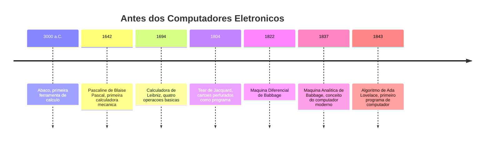
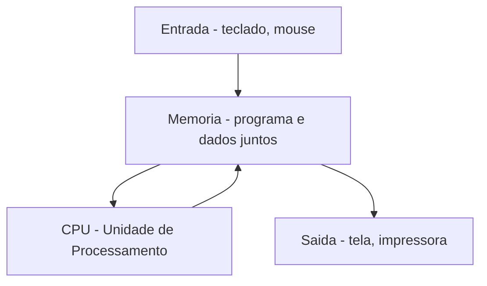
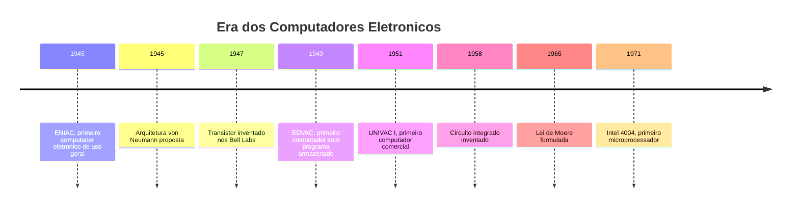
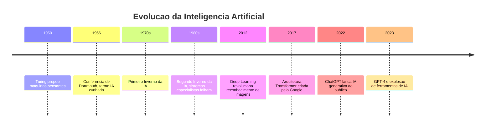

# 1.3 — A História da Computação: Como Chegamos Até Aqui

[← Anterior: Componentes Básicos](cap01-mod02-componentes-basicos.md) · [Próximo: Evolução dos Processadores →](cap01-mod04-evolucao-processadores.md)

---

## Introdução

No módulo anterior, vimos os componentes que fazem um computador funcionar: CPU, memória RAM e armazenamento. Vimos como eles trabalham juntos, cada um com seu papel — o cozinheiro, a bancada e a despensa.

Agora vamos dar um passo atrás no tempo. Entender a história da computação não é apenas curiosidade — é entender **por que** as coisas são como são hoje.

Muitas decisões que parecem estranhas na tecnologia atual fazem total sentido quando você conhece o contexto histórico. Por que computadores usam zeros e uns? Por que o teclado tem esse layout? Por que existem tantas linguagens de programação? Por que a internet funciona do jeito que funciona? A história responde essas perguntas.

Mais do que isso: a história da computação é uma história de **problemas sendo resolvidos**. Cada invenção que vamos ver nasceu porque alguém olhou para uma limitação e pensou: "tem que existir um jeito melhor de fazer isso". Esse é o mesmo pensamento que move todo programador. Quando você programa, está resolvendo problemas — exatamente como as pessoas que construíram os computadores que usamos hoje.

Lembra do mantra do curso? **"Qual problema você quer resolver?"** Cada marco da história da computação é a resposta a essa pergunta. Vamos ver como.

---

## Antes dos Computadores Eletronicos

A ideia de criar máquinas que fazem cálculos é muito mais antiga do que você imagina. Milhares de anos antes de existir eletricidade, as pessoas já buscavam formas de automatizar o trabalho mental. E cada invenção que vamos ver resolveu um problema real da sua época.

### O Abaco — 3000 a.C.

O ábaco é considerado o primeiro "computador" da história — uma ferramenta de cálculo usada há mais de 5.000 anos. Não era eletrônico, não tinha tela, mas fazia o que todo computador faz: processava dados (números) e devolvia resultados.

Pense no problema que existia antes do ábaco: comerciantes precisavam fazer contas de compra e venda, governos precisavam calcular impostos, construtores precisavam medir terrenos. Fazer tudo de cabeça era lento e cheio de erros. O ábaco resolveu isso — era uma ferramenta portátil que permitia fazer somas, subtrações, multiplicações e divisões movendo contas em hastes.

O ábaco foi usado por civilizações na Mesopotâmia, China, Grécia e Roma. Na China, ele é chamado de **suanpan** e ainda é usado até hoje em algumas escolas para ensinar aritmética. No Japão, o **soroban** é tão eficiente que operadores treinados conseguem fazer cálculos mais rápido do que com calculadora.

O que o ábaco nos ensina? Que a necessidade de **processar informação** é tão antiga quanto a civilização. E que ferramentas simples, bem projetadas, podem durar milênios.

### A Pascaline — A Máquina de Pascal — 1642

Avance mais de 4.000 anos. Estamos na França do século XVII. Blaise Pascal tinha apenas 19 anos quando criou a **Pascaline** — a primeira calculadora mecânica da história.

Qual era o problema? O pai de Pascal era coletor de impostos. Passava horas e horas fazendo cálculos repetitivos à mão, somando valores, conferindo totais. Era um trabalho exaustivo e propenso a erros. O jovem Pascal, que era um gênio da matemática, decidiu construir uma máquina que fizesse esse trabalho.

A Pascaline era do tamanho de uma caixa de sapatos e usava um sistema de engrenagens interligadas. Cada engrenagem representava uma casa decimal — unidades, dezenas, centenas. Quando uma engrenagem completava uma volta (passava do 9 para o 0), ela automaticamente girava a engrenagem seguinte em uma posição — exatamente como funciona o "vai um" que você aprendeu na escola.

Pascal construiu cerca de 50 unidades da Pascaline ao longo de sua vida. Poucas sobreviveram, mas as que existem estão em museus na França. A máquina conseguia somar e subtrair, mas não multiplicar nem dividir diretamente.

A importância da Pascaline vai além do que ela fazia. Ela provou que era possível **mecanizar o pensamento** — que uma máquina podia fazer algo que antes só um cérebro humano fazia. Essa ideia revolucionária abriu caminho para tudo que veio depois.

### A Calculadora de Leibniz — 1694

Gottfried Wilhelm Leibniz, um matemático e filósofo alemão, olhou para a Pascaline e pensou: "bom, mas e a multiplicação?". Esse é um padrão que você vai ver se repetir ao longo de toda a história da computação — alguém cria algo, e outra pessoa melhora.

Leibniz inventou o **Stepped Drum** (tambor escalonado) — um mecanismo com dentes de tamanhos diferentes que permitia fazer multiplicações e divisões mecanicamente. Sua calculadora, chamada **Stepped Reckoner**, foi a primeira máquina capaz de realizar as quatro operações básicas: soma, subtração, multiplicação e divisão.

Leibniz também fez outra contribuição enorme que só seria reconhecida séculos depois: ele estudou e documentou o **sistema binário** — a representação de números usando apenas 0 e 1. Na época, isso parecia uma curiosidade matemática sem uso prático. Mas como veremos mais adiante, o sistema binário é a base de TODOS os computadores modernos. Leibniz estava 250 anos à frente do seu tempo.

### O Tear de Jacquard — 1804

Essa é uma das histórias mais surpreendentes da computação, porque envolve... tecidos.

Joseph Marie Jacquard era um tecelão francês. Na época, criar tecidos com padrões complexos (flores, paisagens, desenhos geométricos) exigia um operador altamente treinado que manualmente controlava cada fio. Era lento, caro e poucos sabiam fazer.

Jacquard inventou um tear que usava **cartoes perfurados** para controlar automaticamente o padrão do tecido. Cada cartão tinha furos em posições específicas. Onde havia furo, o fio passava; onde não havia, o fio ficava parado. Uma sequência de cartões criava um padrão completo.

Pense nisso: os cartões perfurados eram **programas**. Cada cartão era uma instrução. A sequência de cartões era um programa completo. O tear era a máquina que executava esse programa. Jacquard, sem saber, tinha criado o conceito de **programação** — décadas antes de existir qualquer computador.

Os cartões perfurados de Jacquard influenciaram diretamente Charles Babbage e, mais tarde, os primeiros computadores eletrônicos. Até os anos 1970, computadores ainda usavam cartões perfurados para receber programas. Uma invenção de 1804 durou quase 170 anos.

### A Máquina Analitica de Babbage — 1837

Charles Babbage, um matemático inglês, é considerado o **pai do computador**. E com razão.

Babbage primeiro criou a **Máquina Diferencial** (Difference Engine) em 1822 — uma máquina mecânica para calcular tabelas matemáticas automaticamente. Na época, tabelas de logaritmos e trigonometria eram calculadas à mão por equipes de pessoas chamadas "computadores" (sim, antes de ser o nome de uma máquina, "computador" era o nome de uma profissão). Essas tabelas tinham muitos erros, e Babbage queria eliminar o erro humano.

Mas Babbage era ambicioso demais. Antes de terminar a Máquina Diferencial, ele já estava projetando algo muito mais poderoso: a **Máquina Analitica** (Analytical Engine), em 1837.

A Máquina Analítica nunca foi completamente construída na época de Babbage — era complexa demais para a tecnologia do século XIX. Mas seu projeto já continha TODOS os conceitos fundamentais de um computador moderno:

| Componente da Máquina Analitica | Equivalente moderno |
|--------------------------------|-------------------|
| Mill - unidade de cálculo | CPU - processador |
| Store - armazem de números | RAM - memória |
| Cartoes de operação | Programa - software |
| Cartoes de variáveis | Dados de entrada |
| Impressora de resultados | Dispositivo de saida |

Babbage projetou uma máquina com entrada de dados, processamento, memória e saída — exatamente a estrutura que todo computador usa até hoje, quase 200 anos depois.

### Ada Lovelace — A Primeira Programadora — 1843

**Ada Lovelace** (Augusta Ada King, Condessa de Lovelace) era uma matemática inglesa que trabalhou com Babbage na Máquina Analítica. Enquanto Babbage focava no hardware (a máquina em si), Ada focou no que a máquina poderia **fazer**.

Em 1843, Ada publicou um artigo traduzindo o trabalho de um matemático italiano sobre a Máquina Analítica. Mas ela não apenas traduziu — adicionou suas próprias notas, que eram mais extensas que o artigo original. Nessas notas, Ada escreveu um algoritmo detalhado para calcular os números de Bernoulli usando a Máquina Analítica.

Esse algoritmo é considerado o **primeiro programa de computador da história**. Ada não apenas escreveu instruções — ela entendeu que a máquina poderia ir além de simples cálculos. Ela escreveu:

> "A Máquina Analítica não tem a pretensão de originar nada. Ela pode fazer qualquer coisa que soubermos como ordenar que ela faça."

Essa frase é profética. Até hoje, computadores fazem exatamente isso: executam o que programadores mandam. Eles não "pensam" por conta própria (pelo menos não no sentido humano). Ada entendeu isso em 1843 — mais de 100 anos antes do primeiro computador eletrônico existir.

Em homenagem a Ada, o Departamento de Defesa dos Estados Unidos nomeou uma linguagem de programação de "Ada" nos anos 1980. E todo dia 15 de outubro é celebrado o **Ada Lovelace Day**, reconhecendo mulheres na ciência e tecnologia.



---

## Alan Turing — O Pai da Ciência da Computacao

Se Babbage é o pai do computador (a máquina), Alan Turing é o pai da **ciência da computacao** (a teoria por trás de tudo).

### A Máquina de Turing — 1936

Em 1936, Alan Turing, um matemático britânico de apenas 24 anos, publicou um artigo que mudou o mundo. Ele não construiu uma máquina física — ele imaginou uma.

A **Máquina de Turing** (Turing Machine) é um conceito teórico: uma máquina imaginária com uma fita infinita dividida em células, onde cada célula contém um símbolo (como 0 ou 1). A máquina tem uma "cabeça" que lê e escreve símbolos na fita, seguindo um conjunto de regras.

Parece simples demais, certo? Mas Turing provou algo extraordinário: essa máquina simples, com regras simples, pode resolver **qualquer problema computável**. Qualquer cálculo que qualquer computador do mundo pode fazer — do seu celular ao supercomputador mais potente — pode ser feito pela Máquina de Turing. A diferença é apenas a velocidade.

Isso significa que todos os computadores, independente de marca, tamanho ou tecnologia, são fundamentalmente equivalentes. Um smartphone e um supercomputador podem resolver os mesmos problemas — o supercomputador apenas faz mais rápido.

Por que isso importa para programadores? Porque a Máquina de Turing define os **limites** do que é computável. Existem problemas que nenhum computador pode resolver, não importa quão potente seja. Turing provou isso matematicamente. Quando você programa, está trabalhando dentro desses limites — mesmo que na prática nunca os alcance.

### Enigma e a Segunda Guerra Mundial — 1939-1945

A contribuição mais dramática de Turing veio durante a Segunda Guerra Mundial. A Alemanha nazista usava uma máquina chamada **Enigma** para criptografar suas comunicações militares. As mensagens eram codificadas de forma tão complexa que os Aliados não conseguiam decifrá-las.

Turing foi recrutado para trabalhar em **Bletchley Park**, o centro de inteligência britânico. Lá, ele liderou a equipe que construiu a **Bombe** — uma máquina eletromecânica projetada especificamente para quebrar o código da Enigma.

A Enigma tinha um problema: ela nunca codificava uma letra como ela mesma (a letra A nunca virava A no código). Turing explorou essa fraqueza. A Bombe testava milhares de combinações possíveis, eliminando as impossíveis, até encontrar a configuração correta do dia.

Historiadores estimam que o trabalho de Turing e sua equipe encurtou a guerra em pelo menos dois anos, salvando milhões de vidas. Mas o trabalho era tão secreto que só foi revelado ao público décadas depois.

A história de Turing em Bletchley Park é contada no filme **O Jogo da Imitação** (2014), com Benedict Cumberbatch. Se você assistir apenas um filme sobre a história da computação, que seja esse.

### O Teste de Turing — 1950

Em 1950, Turing publicou outro artigo revolucionário: "Computing Machinery and Intelligence" (Maquinaria Computacional e Inteligência). Nele, ele propôs uma pergunta que ainda debatemos hoje: **"As máquinas podem pensar?"**

Para responder, ele criou o **Teste de Turing**: uma pessoa conversa por texto com dois interlocutores — um humano e uma máquina. Se a pessoa não conseguir distinguir qual é qual, a máquina "passou" no teste.

Esse conceito é a base de toda a área de **Inteligência Artificial** (Artificial Intelligence ou AI). Quando você conversa com o ChatGPT e às vezes esquece que está falando com uma máquina, está experimentando exatamente o que Turing imaginou em 1950 — mais de 70 anos antes.

### O Legado Tragico de Turing

Apesar de suas contribuições imensas, Turing foi perseguido pelo governo britânico por ser homossexual — algo que era crime na Inglaterra da época. Em 1952, ele foi condenado e submetido a castração química. Em 1954, Turing morreu aos 41 anos, provavelmente por suicídio.

Somente em 2013, a Rainha Elizabeth II concedeu um perdão real póstumo a Turing. Em 2021, seu rosto passou a estampar a nota de 50 libras britânicas. O maior prêmio da ciência da computação — equivalente ao Nobel da área — se chama **Turing Award** (Premio Turing), em sua homenagem.

---

## John von Neumann — A Arquitetura que Usamos Até Hoje

Se Turing definiu a teoria, **John von Neumann** definiu a prática. A arquitetura que ele propôs em 1945 é usada em praticamente TODOS os computadores que existem hoje — do seu celular ao servidor do Google.

### O Problema do ENIAC

O ENIAC (que veremos em detalhes na próxima seção) era programado de uma forma muito trabalhosa: para mudar o programa, era preciso reconectar fisicamente os cabos da máquina. Imagine que para trocar de receita na cozinha, você precisasse desmontar e remontar o fogão inteiro. Era assim.

Von Neumann olhou para esse problema e propôs uma solução elegante: e se o programa ficasse armazenado na **memória** do computador, junto com os dados? Assim, para mudar o programa, bastaria mudar o que estava na memória — sem mexer em nenhum cabo.

### A Arquitetura von Neumann — 1945

Essa ideia, chamada de **conceito de programa armazenado** (stored program concept), é a base da **Arquitetura von Neumann**. Ela define que um computador tem:

1. **Unidade de processamento** (CPU) — executa as instruções
2. **Memória** — armazena tanto o programa quanto os dados
3. **Dispositivos de entrada** — recebem dados do mundo externo
4. **Dispositivos de saida** — enviam resultados para o mundo externo
5. **Barramento** — conecta tudo, permitindo que dados fluam entre os componentes



Percebeu algo familiar? Essa é exatamente a estrutura que vimos no módulo 1.2 — entrada, processamento, memória, saída. A analogia da cozinha que usamos (ingredientes entram, cozinheiro processa, prato sai) é uma versão simplificada da Arquitetura von Neumann.

A grande sacada de von Neumann foi colocar programa e dados **no mesmo lugar** — na memória. Antes disso, o programa era "fixo" na máquina (como um fogão que só faz um prato). Depois de von Neumann, o programa virou flexível (como um cozinheiro que pode seguir qualquer receita).

Isso é tão fundamental que vale repetir: **todo computador que você usa hoje segue a Arquitetura von Neumann**. Seu notebook, seu celular, o servidor que roda o Google, o computador de bordo de um avião — todos seguem o mesmo princípio de 1945.

### Von Neumann Além da Computacao

John von Neumann foi um dos maiores gênios do século XX. Além da arquitetura de computadores, ele fez contribuições fundamentais em matemática pura, física quântica, teoria dos jogos e até no projeto da bomba atômica (Projeto Manhattan). Dizem que ele conseguia fazer cálculos de cabeça mais rápido do que seus colegas com calculadoras mecânicas.

---

## A Era dos Computadores Eletronicos

### ENIAC — 1945

O **ENIAC** (Electronic Numerical Integrator and Computer, ou Integrador e Computador Numérico Eletrônico) foi um dos primeiros computadores eletrônicos de uso geral. Foi construído na Universidade da Pensilvânia, nos Estados Unidos, para calcular tabelas de artilharia para o Exército americano durante a Segunda Guerra Mundial.

Alguns números para você ter uma ideia do que era o ENIAC:

| Caracteristica | ENIAC - 1945 | Smartphone atual |
|---------------|-------------|------------------|
| Peso | 30 toneladas | Cerca de 200 gramas |
| Tamanho | 167 metros quadrados | Cabe no bolso |
| Consumo de energia | 150.000 watts | Cerca de 5 watts |
| Operações por segundo | 5.000 | Bilhoes |
| Custo ajustado | Cerca de R$ 30 milhoes | Cerca de R$ 2.000 |
| Valvulas eletronicas | 17.468 | Zero |
| Programação | Reconectar cabos fisicamente | Tocar na tela |

O ENIAC usava **valvulas eletronicas** (vacuum tubes) — componentes do tamanho de uma lâmpada que funcionavam como interruptores eletrônicos. O problema das válvulas era que elas esquentavam muito, queimavam com frequência e consumiam energia absurda. A equipe do ENIAC precisava trocar válvulas queimadas quase diariamente.

Mas apesar de todas as limitações, o ENIAC era revolucionário. Ele podia fazer em 30 segundos um cálculo que levaria 20 horas para um humano fazer à mão. Para a época, era como ter um superpoder.

As "programadoras" originais do ENIAC eram seis mulheres: Kay McNulty, Betty Jennings, Betty Snyder, Marlyn Meltzer, Fran Bilas e Ruth Lichterman. Elas programavam a máquina reconectando cabos e ajustando interruptores — um trabalho que exigia profundo conhecimento matemático e lógico. Por décadas, a contribuição delas foi ignorada pela história, mas hoje são reconhecidas como pioneiras da programação.

### EDVAC — O Primeiro Computador com Programa Armazenado — 1949

O **EDVAC** (Electronic Discrete Variable Automatic Computer) foi o sucessor do ENIAC e o primeiro computador a implementar a Arquitetura von Neumann na prática. Em vez de ser programado por cabos, o EDVAC armazenava o programa na memória — exatamente como von Neumann havia proposto.

Essa mudança parece pequena, mas foi gigantesca. Com o ENIAC, mudar o programa levava dias de trabalho manual reconectando cabos. Com o EDVAC, bastava carregar um novo programa na memória. Era a diferença entre desmontar o fogão para trocar de receita e simplesmente abrir outro livro de receitas.

### UNIVAC — O Computador que Previu uma Eleicao — 1951

O **UNIVAC I** (Universal Automatic Computer) foi o primeiro computador comercial produzido em série nos Estados Unidos. Ele ficou famoso em 1952, quando a rede de televisão CBS o usou para prever o resultado da eleição presidencial americana.

O UNIVAC previu corretamente que Dwight Eisenhower venceria com ampla margem — algo que os analistas humanos não esperavam. Os apresentadores da CBS ficaram tão desconfiados que inicialmente se recusaram a divulgar a previsão. Quando o resultado confirmou o UNIVAC, o computador virou celebridade nacional.

Esse momento é importante porque mostrou ao público geral que computadores podiam fazer coisas úteis além de cálculos militares. Foi o início da ideia de que computadores poderiam ser ferramentas para a sociedade.

### Do Vacuo ao Silicio — A Invencao do Transistor — 1947

O **transistor** foi inventado em 1947 nos **Laboratorios Bell** (Bell Labs) por William Shockley, John Bardeen e Walter Brattain. Os três receberam o Prêmio Nobel de Física em 1956 por essa invenção.

Qual era o problema? As válvulas eletrônicas usadas nos computadores como o ENIAC eram grandes, quentes, caras e queimavam o tempo todo. Um computador com 17.000 válvulas significava que, estatisticamente, alguma válvula queimava a cada poucas horas. Manter o ENIAC funcionando era um pesadelo de manutenção.

O transistor resolveu todos esses problemas de uma vez:

| Caracteristica | Valvula eletronica | Transistor |
|---------------|-------------------|-----------|
| Tamanho | Como uma lampada | Como uma ervilha |
| Consumo de energia | Alto | Muito baixo |
| Calor gerado | Muito | Pouco |
| Confiabilidade | Queima frequente | Muito duravel |
| Custo | Caro | Barato em escala |
| Velocidade | Lenta | Muito mais rápida |

O transistor funciona como um interruptor eletrônico microscópico — ele pode estar **ligado** (1) ou **desligado** (0). É por isso que computadores usam o sistema binário: porque a peça fundamental que os compõe só tem dois estados. Não foi uma escolha arbitrária — foi uma consequência da física.

Voltando à analogia da cozinha: imagine que antes você cozinhava com um fogão a lenha enorme que pegava fogo sozinho de vez em quando. O transistor foi como trocar por um fogão a gás compacto, seguro e eficiente. A comida (os cálculos) é a mesma, mas o processo ficou incomparavelmente melhor.

### O Circuito Integrado — 1958

O próximo salto veio em 1958, quando **Jack Kilby** (da Texas Instruments) e **Robert Noyce** (da Fairchild Semiconductor) inventaram, independentemente, o **circuito integrado** (integrated circuit ou IC) — a ideia de colocar vários transistores em um único chip de silício.

Antes do circuito integrado, cada transistor era um componente separado que precisava ser soldado individualmente em uma placa. Montar um computador era como montar um quebra-cabeça com milhares de peças minúsculas. O circuito integrado permitiu fabricar centenas, depois milhares, depois milhões de transistores em um único pedaço de silício do tamanho de uma unha.

Jack Kilby recebeu o Prêmio Nobel de Física em 2000 por essa invenção. Robert Noyce, infelizmente, já havia falecido e não pôde receber o prêmio (o Nobel não é concedido postumamente). Noyce, aliás, foi cofundador da **Intel** — a empresa que dominaria o mercado de processadores por décadas.

### A Lei de Moore — 1965

**Gordon Moore**, cofundador da Intel junto com Noyce, fez uma observação em 1965 que se tornou uma das "leis" mais famosas da tecnologia: o número de transistores em um chip dobra aproximadamente a cada dois anos, enquanto o custo permanece relativamente constante.

Essa observação, conhecida como **Lei de Moore** (Moore's Law), não é uma lei da física — é uma observação empírica que se manteve válida por mais de 50 anos. E ela explica por que a tecnologia evolui tão rápido:

| Ano | Transistores em um chip | Exemplo |
|-----|------------------------|---------|
| 1971 | 2.300 | Intel 4004 - primeiro microprocessador |
| 1978 | 29.000 | Intel 8086 |
| 1989 | 1.200.000 | Intel 486 |
| 1999 | 9.500.000 | Pentium III |
| 2006 | 291.000.000 | Intel Core 2 |
| 2010 | 1.170.000.000 | Intel Core i7 |
| 2020 | 16.000.000.000 | Apple M1 |
| 2023 | 114.000.000.000 | Apple M2 Ultra |

De 2.300 para 114 bilhões de transistores em 50 anos. Para ter uma ideia do que isso significa: se carros tivessem evoluído no mesmo ritmo, um carro de 1971 que andava a 100 km/h hoje andaria a 5 bilhões de km/h — mais rápido que a velocidade da luz.

Nos últimos anos, a Lei de Moore está desacelerando. Estamos chegando nos limites físicos de quão pequeno um transistor pode ser — os menores transistores atuais têm apenas alguns nanômetros (bilionésimos de metro), pouco maiores que átomos individuais. A indústria está buscando alternativas: novos materiais, novas arquiteturas de chip e até computação quântica. Vamos falar mais sobre isso no módulo 1.4.



---

## A Revolucao do Software — De Zeros e Uns a Linguagens Humanas

Até agora, falamos muito sobre **hardware** — as máquinas físicas. Mas existe outra revolução igualmente importante que aconteceu em paralelo: a revolução do **software** — os programas que dizem ao hardware o que fazer.

Lembra da analogia da cozinha? O hardware é a cozinha (fogão, panelas, bancada). O software é a receita. Sem receita, a cozinha mais equipada do mundo não produz nada. A história do software é a história de como as "receitas" ficaram cada vez mais fáceis de escrever.

### Código de Máquina — A Linguagem dos Computadores

Os primeiros computadores eram programados diretamente em **código de máquina** (machine code) — sequências de zeros e uns que o processador entende diretamente. Cada instrução era um número binário.

Por exemplo, para somar dois números em um processador antigo, você escreveria algo como:

```
10110000 00000101
00000100 00000011
```

Isso significa "coloque o número 5 no registrador A, depois some 3". Para um humano, isso é praticamente impossível de ler, escrever e depurar. Imagine escrever um programa inteiro — milhares de instruções — nesse formato. Um único 0 trocado por 1 e o programa inteiro falhava.

O problema era claro: **humanos não pensam em binário**. Precisávamos de uma forma mais humana de escrever programas.

### Assembly — O Primeiro Passo — Anos 1950

A primeira solução foi o **Assembly** (linguagem de montagem). Em vez de escrever números binários, programadores podiam usar abreviações em inglês chamadas **mnemonicos** (mnemonics):

```
MOV A, 5    ; coloque 5 no registrador A
ADD A, 3    ; some 3 ao registrador A
```

Isso faz exatamente a mesma coisa que o código de máquina acima, mas é muito mais legível para humanos. Um programa chamado **assembler** (montador) traduzia essas abreviações para código de máquina.

Assembly foi um avanço enorme, mas ainda tinha um problema: cada tipo de processador tinha seu próprio Assembly. Um programa escrito para um processador Intel não funcionava em um processador IBM. Era como se cada marca de fogão exigisse receitas escritas em um idioma diferente.

### FORTRAN — A Primeira Linguagem de Alto Nível — 1957

Em 1957, uma equipe da IBM liderada por **John Backus** criou o **FORTRAN** (FORmula TRANslation, ou Tradução de Fórmulas). Foi a primeira **linguagem de alto nível** (high-level language) — uma linguagem mais próxima do inglês e da matemática do que do código de máquina.

Em FORTRAN, para somar dois números, você escrevia:

```
RESULTADO = 5 + 3
```

Simples assim. Um programa chamado **compilador** (compiler) traduzia isso para código de máquina automaticamente. O programador não precisava mais saber os detalhes do processador — o compilador cuidava disso.

FORTRAN foi criado para cientistas e engenheiros que precisavam fazer cálculos complexos. Ele é tão bom nisso que ainda é usado hoje, mais de 65 anos depois, em simulações científicas, previsão do tempo e física nuclear.

### COBOL — Computadores para Negocios — 1959

Se FORTRAN era para cientistas, **COBOL** (COmmon Business-Oriented Language, ou Linguagem Comum Orientada a Negócios) era para empresas. Criado em 1959 por um comitê que incluía **Grace Hopper** — uma das mulheres mais importantes da história da computação — COBOL foi projetado para ser legível quase como inglês:

```
ADD PRECO TO TOTAL.
IF TOTAL IS GREATER THAN 1000 THEN DISPLAY "DESCONTO APLICADO".
```

Grace Hopper, aliás, é creditada por popularizar o termo **bug** (inseto) para erros de computador. Em 1947, ela encontrou uma mariposa presa dentro de um computador que estava causando mau funcionamento. Ela colou o inseto no livro de registros com a anotação: "First actual case of bug being found" (Primeiro caso real de bug encontrado).

COBOL se tornou a linguagem dominante em bancos, seguradoras e governos. Estima-se que ainda existam mais de 200 bilhões de linhas de código COBOL em uso no mundo — processando transações bancárias, folhas de pagamento e sistemas governamentais. Muitos dos sistemas que movem seu dinheiro no banco foram escritos em COBOL nos anos 1960 e 1970.

### C — A Linguagem que Mudou Tudo — 1972

Em 1972, **Dennis Ritchie** criou a linguagem **C** nos Laboratórios Bell. C foi projetada para ser poderosa o suficiente para escrever sistemas operacionais (software de baixo nível) mas legível o suficiente para programadores humanos.

C é tão importante que merece destaque especial:

- O sistema operacional **Unix** foi reescrito em C (antes era em Assembly)
- **Linux**, que roda a maior parte da internet, é escrito em C
- **Windows** tem partes fundamentais escritas em C
- As linguagens **C++**, **Java**, **C#**, **JavaScript** e **Python** foram todas influenciadas por C
- Você vai aprender C no capítulo 6 deste curso, justamente para entender como computadores funcionam por dentro

A evolução das linguagens de programação é um exemplo perfeito do mantra "qual problema você quer resolver?":

| Problema | Solução | Ano |
|---------|---------|-----|
| Programar em binário e impossível | Assembly com mnemonicos | Anos 1950 |
| Assembly e diferente para cada processador | FORTRAN, linguagem de alto nível | 1957 |
| Cientistas precisam de cálculo, empresas de negocios | COBOL para negocios | 1959 |
| Precisamos de uma linguagem poderosa e portavel | C | 1972 |
| Programas ficaram complexos demais | C++ com orientacao a objetos | 1983 |
| Precisamos de linguagens mais simples e seguras | Java, Python | Anos 1990 |
| Precisamos programar para a web | JavaScript | 1995 |

Cada linguagem nasceu para resolver um problema que as anteriores não resolviam. E novas linguagens continuam surgindo — porque novos problemas continuam aparecendo.

---

## O Computador Pessoal — A Tecnologia Sai dos Laboratorios

### O Problema — Computadores Eram para Poucos

Até os anos 1970, computadores eram máquinas enormes e caríssimas que ficavam em universidades, grandes empresas e órgãos militares. Para usar um computador, você precisava ir até o local onde ele estava, agendar um horário e compartilhar a máquina com dezenas de outras pessoas. Era como se existissem apenas 10 cozinhas no país inteiro e todo mundo tivesse que ir até lá para cozinhar.

Algumas pessoas visionárias achavam que isso era absurdo. Elas acreditavam que computadores deveriam ser pessoais — que cada pessoa deveria ter o seu. Na época, essa ideia era considerada ridícula. Ken Olsen, presidente da Digital Equipment Corporation (uma das maiores fabricantes de computadores), disse em 1977: "Não há razão para qualquer pessoa ter um computador em casa." Ele estava espetacularmente errado.

### O Altair 8800 — O Estopim — 1975

Em janeiro de 1975, a revista Popular Electronics publicou na capa o **Altair 8800** — um kit de computador que custava 397 dolares (cerca de R$ 2.000 em valores atuais). Não tinha tela, não tinha teclado, não tinha nada além de interruptores e luzes. Você programava ligando e desligando interruptores, e o resultado era mostrado por luzes que acendiam e apagavam.

Parece inútil? Para a maioria das pessoas, era. Mas para um grupo de entusiastas — os **hobbyistas** — era um sonho realizado: um computador que cabia em uma mesa e que você podia ter em casa.

Dois jovens que ficaram fascinados pelo Altair foram **Bill Gates** e **Paul Allen**. Eles escreveram um interpretador da linguagem BASIC para o Altair e fundaram uma empresa para vendê-lo. O nome da empresa? **Microsoft**.

### Apple II — O Computador para Todos — 1977

**Steve Jobs** e **Steve Wozniak** eram dois jovens da Califórnia que frequentavam o **Homebrew Computer Club** — um clube de hobbyistas de computadores. Wozniak era o gênio técnico; Jobs era o visionário de negócios.

Em 1976, eles criaram o Apple I na garagem dos pais de Jobs. Era basicamente uma placa de circuito — você precisava adicionar teclado, tela e gabinete por conta própria. Venderam cerca de 200 unidades.

Mas o **Apple II**, lançado em 1977, foi diferente. Era um computador completo: vinha com teclado, podia ser conectado a uma TV, tinha gráficos coloridos e, crucialmente, era fácil de usar. O Apple II se tornou um sucesso comercial enorme, especialmente depois que o programa **VisiCalc** — a primeira planilha eletrônica — foi lançado exclusivamente para ele em 1979. Empresas compraram Apple IIs aos milhares só para usar o VisiCalc.

### IBM PC — O Padrão da Industria — 1981

A **IBM** (International Business Machines) era a gigante dos computadores corporativos. Quando viu o mercado de computadores pessoais crescendo, decidiu entrar nele. Em 1981, lançou o **IBM PC** (Personal Computer).

A IBM tomou uma decisão que mudou a história: em vez de criar tudo internamente (como fazia normalmente), usou componentes de outras empresas. O processador veio da **Intel**. O sistema operacional veio da **Microsoft** (o MS-DOS, que Bill Gates licenciou para a IBM em um dos negócios mais lucrativos da história).

Como a IBM publicou as especificações do PC abertamente, outras empresas puderam criar computadores compatíveis — os chamados **clones de PC** ou **IBM-compatíveis**. Empresas como Compaq, Dell e HP começaram a fabricar PCs mais baratos que o original da IBM. Isso criou um mercado competitivo que barateou os computadores e os tornou acessíveis para milhões de pessoas.

A ironia é que a IBM perdeu o controle do mercado que ela mesma criou. Quem realmente lucrou foram a Intel (que vendia os processadores para todos os fabricantes) e a Microsoft (que vendia o sistema operacional para todos os fabricantes).

### Xerox PARC — A Invencao que a Xerox Não Soube Usar

Essa é uma das histórias mais fascinantes (e frustrantes) da tecnologia.

Nos anos 1970, o centro de pesquisa da Xerox em Palo Alto, Califórnia — o **Xerox PARC** (Palo Alto Research Center) — inventou praticamente tudo que define a computação moderna:

- A **interface gráfica** (GUI - Graphical User Interface): janelas, ícones, menus, botões
- O **mouse**: dispositivo para apontar e clicar na tela
- A **impressora a laser**
- A **rede Ethernet**: tecnologia para conectar computadores entre si
- O conceito de **WYSIWYG** (What You See Is What You Get): o que você vê na tela é o que sai na impressora

Tudo isso foi inventado no Xerox PARC. Mas a Xerox era uma empresa de copiadoras — seus executivos não entenderam o potencial dessas invenções. Eles literalmente mostraram tudo para Steve Jobs em uma visita em 1979.

Jobs ficou obcecado. Ele voltou para a Apple e disse à sua equipe: "Vamos fazer isso, mas melhor." O resultado foi o **Macintosh**, lançado em 1984.

### Macintosh — O Computador com Interface Gráfica — 1984

O **Macintosh** (ou Mac) foi o primeiro computador pessoal popular com interface gráfica e mouse. Antes dele, computadores usavam **linha de comando** — você digitava comandos de texto para fazer qualquer coisa. Com o Mac, você podia clicar em ícones, arrastar arquivos e usar menus visuais.

O Macintosh foi anunciado com um comercial de TV lendário durante o Super Bowl de 1984, dirigido por Ridley Scott (o diretor de Blade Runner e Alien). O comercial mostrava uma mulher destruindo uma tela gigante que representava a conformidade — uma referência ao livro "1984" de George Orwell.

### Windows vs Mac — A Guerra que Definiu a Computacao Pessoal

A Microsoft viu o sucesso da interface gráfica do Mac e criou o **Windows** — uma interface gráfica que rodava sobre o MS-DOS nos PCs IBM-compatíveis. A primeira versão (Windows 1.0, 1985) era rudimentar, mas o **Windows 3.1** (1992) e especialmente o **Windows 95** (1995) se tornaram enormes sucessos.

Steve Jobs acusou Bill Gates de copiar a interface do Mac. Gates respondeu com uma frase que ficou famosa: "Nós dois tivemos um vizinho rico chamado Xerox, e eu entrei na casa dele para roubar a TV e descobri que você já tinha roubado."

A rivalidade Apple vs Microsoft definiu a computação pessoal por décadas:

| Aspecto | Apple - Mac | Microsoft - Windows |
|---------|-----------|-------------------|
| Filosofia | Hardware e software integrados | Software para qualquer hardware |
| Preco | Premium, mais caro | Variado, opcoes baratas |
| Mercado | Design, midia, educação | Empresas, uso geral |
| Controle | Apple controla tudo | Ecossistema aberto de fabricantes |
| Participacao de mercado | Menor, mas fiel | Dominante, mais de 70 porcento |

Essa rivalidade é contada em detalhes no filme **Piratas do Vale do Silício** (1999) — altamente recomendado.

---

## A Internet — O Mundo Conectado

### ARPANET — A Rede que Sobreviveria a uma Guerra Nuclear — 1969

A internet nasceu de uma preocupação militar. Durante a Guerra Fria, o Departamento de Defesa dos Estados Unidos temia que um ataque nuclear soviético destruísse o sistema de comunicação americano, que era centralizado. Se o centro fosse destruído, tudo parava.

A solução? Criar uma rede **descentralizada** — sem um ponto central. Se um nó da rede fosse destruído, os dados encontrariam outro caminho. Essa ideia foi implementada na **ARPANET** (Advanced Research Projects Agency Network), que conectou os primeiros quatro computadores em 1969: UCLA, Stanford, UC Santa Barbara e Universidade de Utah.

A primeira mensagem enviada pela ARPANET, em 29 de outubro de 1969, deveria ser "LOGIN". Mas o sistema travou depois de enviar apenas "LO". Então, tecnicamente, a primeira mensagem da internet foi "LO" — um começo humilde para algo que mudaria o mundo.

### TCP/IP — A Lingua Franca da Internet — 1983

Para que computadores diferentes pudessem se comunicar, era preciso um **protocolo** — um conjunto de regras que todos seguissem. **Vint Cerf** e **Bob Kahn** criaram o **TCP/IP** (Transmission Control Protocol / Internet Protocol) nos anos 1970, e ele se tornou o padrão oficial da ARPANET em 1983.

TCP/IP é como o idioma da internet. Não importa se o computador é um Mac, um PC com Windows ou um servidor Linux — todos "falam" TCP/IP. É como se todos os países do mundo concordassem em usar um único idioma para comércio internacional.

O TCP/IP funciona dividindo dados em pequenos **pacotes** que viajam independentemente pela rede e são remontados no destino. Se um pacote se perde, ele é reenviado. Esse sistema é incrivelmente robusto — é por isso que a internet continua funcionando mesmo quando partes da rede caem.

### DNS — O Catalogo Telefonico da Internet — 1984

Cada computador na internet tem um endereço numérico chamado **endereco IP** (Internet Protocol address), como 142.250.80.46. Mas ninguém quer decorar números para acessar sites. O **DNS** (Domain Name System, ou Sistema de Nomes de Domínio) resolve isso: ele traduz nomes legíveis como "google.com" para endereços IP.

Quando você digita "google.com" no navegador, seu computador pergunta a um servidor DNS: "qual é o IP de google.com?". O servidor responde com o número, e seu computador se conecta. É como uma lista telefônica automática — você procura pelo nome, ela te dá o número.

### A World Wide Web — A Internet que Você Conhece — 1991

Muita gente confunde "internet" com "web", mas são coisas diferentes. A **internet** é a rede física que conecta computadores. A **World Wide Web** (WWW ou simplesmente "web") é um sistema de páginas interligadas que roda **sobre** a internet.

A web foi inventada por **Tim Berners-Lee**, um cientista britânico que trabalhava no **CERN** (o laboratório europeu de física de partículas) na Suíça. Em 1991, ele criou três tecnologias que formam a base da web até hoje:

1. **HTML** (HyperText Markup Language) — a linguagem para criar páginas web
2. **HTTP** (HyperText Transfer Protocol) — o protocolo para transferir páginas pela internet
3. **URL** (Uniform Resource Locator) — o sistema de endereços (como www.exemplo.com)

Berners-Lee tomou uma decisão crucial: ele não patenteou nenhuma dessas tecnologias. Ele as disponibilizou gratuitamente para qualquer pessoa usar. Se ele tivesse cobrado royalties, a web provavelmente não teria crescido como cresceu. Essa decisão de manter a web aberta e gratuita é uma das razões pelas quais a internet se tornou o que é hoje.

### A Bolha das Pontocom — 1995-2000

Nos anos 1990, a web explodiu. Milhões de pessoas começaram a acessar a internet, e investidores ficaram loucos com as possibilidades. Qualquer empresa com ".com" no nome recebia milhões em investimento, mesmo sem ter lucro ou um plano de negócios viável.

Empresas como Amazon, eBay e Google surgiram nessa época — e sobreviveram. Mas centenas de outras, como Pets.com, Webvan e Kozmo.com, queimaram bilhões de dólares e faliram. Em março de 2000, a bolha estourou. O índice NASDAQ (bolsa de tecnologia) perdeu 78% do seu valor entre 2000 e 2002.

A bolha das pontocom ensinou uma lição importante: tecnologia sozinha não basta — é preciso resolver um problema real de forma sustentável. Muitas das empresas que faliram tinham tecnologia interessante, mas não tinham um modelo de negócio que funcionasse. As que sobreviveram (Amazon, Google, eBay) tinham algo em comum: resolviam problemas reais de forma eficiente.

---

## O Movimento Open Source — Software Livre para Todos

### O Problema — Software como Propriedade Fechada

Nos primeiros anos da computação, software era compartilhado livremente entre pesquisadores e universidades. Mas nos anos 1970 e 1980, empresas começaram a tratar software como propriedade intelectual fechada. Você comprava um programa, mas não podia ver como ele funcionava, não podia modificá-lo e não podia compartilhá-lo.

Para muitos programadores, isso era um problema. Imagine que você compra um livro de receitas, mas as receitas estão escritas em código secreto — você pode fazer os pratos seguindo as instruções, mas não pode entender por que cada ingrediente está ali, não pode adaptar a receita ao seu gosto e não pode compartilhar com amigos.

### GNU e Richard Stallman — 1983

**Richard Stallman**, um programador do MIT (Massachusetts Institute of Technology), ficou tão frustrado com software proprietário que em 1983 lançou o **Projeto GNU** (GNU's Not Unix — um acrônimo recursivo, típico do humor de programadores). O objetivo era criar um sistema operacional completamente livre — onde qualquer pessoa pudesse ver o código, modificá-lo e distribuí-lo.

Stallman também criou a **GPL** (General Public License, ou Licença Pública Geral) — uma licença que garante que software livre permaneça livre. Se você usa código GPL e distribui seu programa, precisa disponibilizar o código-fonte também. Isso criou um efeito cascata de software livre.

### Linux e Linus Torvalds — 1991

O Projeto GNU criou muitas ferramentas, mas faltava a peça central: o **kernel** (núcleo do sistema operacional). Em 1991, **Linus Torvalds**, um estudante finlandês de 21 anos, criou o **Linux** — um kernel que completou o quebra-cabeça.

Linus postou uma mensagem em um fórum da internet que ficou famosa:

> "Estou fazendo um sistema operacional livre (apenas um hobby, não será grande e profissional como o GNU)..."

Ele estava espetacularmente errado sobre o "não será grande". Hoje, o Linux:

- Roda em **mais de 90% dos servidores** da internet (Google, Amazon, Facebook, Netflix)
- É a base do **Android**, o sistema operacional de celular mais usado do mundo
- Roda em **100% dos 500 supercomputadores mais potentes** do mundo
- É usado na **Estação Espacial Internacional**
- Roda nos carros da **Tesla**

O Linux é o exemplo mais bem-sucedido de software livre da história. Milhares de programadores ao redor do mundo contribuem voluntariamente com código. Empresas como Google, Microsoft, IBM e Red Hat empregam desenvolvedores para trabalhar no Linux.

### Apache, MySQL e a Web Livre

O movimento open source não parou no Linux. Outros projetos fundamentais surgiram:

- **Apache** (1995) — servidor web que por anos rodou a maioria dos sites da internet
- **MySQL** (1995) — banco de dados usado por milhões de aplicações
- **PHP** (1995) — linguagem de programação para web (Facebook foi escrito em PHP)
- **Firefox** (2004) — navegador web que quebrou o monopólio do Internet Explorer
- **Git** (2005) — sistema de controle de versão criado por Linus Torvalds (vamos usar muito no capítulo 4)

Hoje, praticamente toda a infraestrutura da internet roda em software open source. Quando você acessa qualquer site, há uma probabilidade enorme de que ele esteja rodando em Linux, usando um servidor web open source, com um banco de dados open source.

Para programadores, o open source é fundamental. Quase tudo que você vai usar na sua carreira — linguagens, frameworks, bibliotecas, ferramentas — é open source. Saber trabalhar com projetos open source é uma habilidade essencial.

O documentário **Revolution OS** (2001) conta a história do movimento open source em detalhes — desde Richard Stallman até Linus Torvalds. Vale muito a pena assistir.

---

## O Smartphone — O Computador no Bolso

### Antes do iPhone — O Mundo dos Celulares Burros

Antes de 2007, celulares eram basicamente telefones que também mandavam mensagens de texto. Alguns modelos mais avançados — como o Nokia N95 ou o BlackBerry — tinham acesso limitado à internet e alguns aplicativos, mas a experiência era péssima. Navegar na internet pelo celular era tão frustrante que quase ninguém fazia.

O problema era que celulares e computadores eram mundos separados. No computador, você tinha uma experiência rica — navegador, e-mail, fotos, música, vídeos. No celular, você tinha uma versão miserável de tudo isso.

### iPhone — O Dia que Tudo Mudou — 2007

Em 9 de janeiro de 2007, Steve Jobs subiu ao palco da Macworld Conference e disse: "Hoje a Apple vai reinventar o telefone." Ele apresentou o **iPhone** — um dispositivo que combinava três coisas: um iPod (tocador de música), um telefone e um "comunicador de internet".

O que tornava o iPhone revolucionário não era nenhuma tecnologia individual — telas sensíveis ao toque já existiam, navegadores de internet já existiam, tocadores de música já existiam. A revolução foi **como** tudo foi combinado. A interface era intuitiva, a tela era grande e bonita, o navegador mostrava sites reais (não versões simplificadas) e tudo funcionava com toques dos dedos.

Mas a verdadeira revolução veio em 2008, com a **App Store** — a loja de aplicativos. De repente, qualquer programador do mundo podia criar um aplicativo e distribuí-lo para milhões de pessoas. Isso criou uma indústria inteira que não existia antes: a indústria de **apps**.

### Android — O Linux dos Celulares — 2008

O **Google** respondeu ao iPhone com o **Android** — um sistema operacional para celulares baseado em Linux e disponibilizado como open source. Enquanto o iPhone rodava apenas em hardware da Apple, o Android podia ser usado por qualquer fabricante: Samsung, LG, Motorola, Xiaomi e dezenas de outras.

Essa estratégia é muito parecida com o que aconteceu nos anos 1980 com PCs: a Apple controlava hardware e software (Mac), enquanto a Microsoft fornecia o software para qualquer fabricante (Windows). O resultado foi o mesmo: o sistema "aberto" (Android/Windows) dominou em volume, enquanto o sistema "fechado" (iPhone/Mac) dominou em lucro.

Hoje, Android tem cerca de 72% do mercado global de smartphones, e iOS (sistema do iPhone) tem cerca de 27%. Juntos, eles representam 99% do mercado — praticamente não existe alternativa.

### Como o Smartphone Mudou Tudo

O smartphone não foi apenas um novo gadget — ele transformou a sociedade:

| Antes do smartphone | Depois do smartphone |
|--------------------|---------------------|
| Camera fotografica separada | Camera no bolso, sempre disponível |
| GPS era equipamento caro de carro | Navegação gratuita no celular |
| Banco so no horario comercial | Banco 24 horas no aplicativo |
| Musica em CDs ou MP3 players | Streaming ilimitado |
| Taxi so por telefone ou na rua | Uber e 99 no aplicativo |
| Noticias no jornal ou TV | Noticias em tempo real |
| Mapa de papel | Google Maps |
| Enciclopedia em livros | Wikipedia no bolso |

Para programadores, o smartphone criou um mercado gigantesco. Existem mais de 5 milhões de apps na Google Play Store e mais de 2 milhões na App Store. Desenvolvimento mobile é uma das áreas mais demandadas do mercado de trabalho.

---

## Inteligência Artificial — De Sonho a Realidade

### Os Primeiros Sonhos — Anos 1950

A ideia de máquinas inteligentes é tão antiga quanto os computadores. Em 1950, Alan Turing publicou seu artigo sobre máquinas pensantes. Em 1956, um grupo de pesquisadores se reuniu na **Conferencia de Dartmouth** e cunhou oficialmente o termo **Inteligência Artificial** (Artificial Intelligence ou AI).

Os pesquisadores de Dartmouth eram extremamente otimistas. Eles acreditavam que em 20 anos, máquinas seriam tão inteligentes quanto humanos. Estavam errados por pelo menos 60 anos.

### Os Invernos da IA — Anos 1970 e 1980

Depois do entusiasmo inicial, a realidade bateu. Os computadores da época simplesmente não tinham poder suficiente para executar os algoritmos de IA. Os resultados ficaram muito abaixo das promessas, e os investimentos secaram. Esses períodos de desencanto são chamados de **Invernos da IA** (AI Winters).

O primeiro inverno veio nos anos 1970, quando ficou claro que tradução automática de idiomas e reconhecimento de fala eram muito mais difíceis do que se imaginava. O segundo inverno veio nos anos 1980, quando os **sistemas especialistas** (expert systems) — programas que tentavam replicar o conhecimento de especialistas humanos — se mostraram frágeis e caros demais.

### O Que Faltava — Tres Ingredientes

Para a IA funcionar de verdade, três coisas precisavam acontecer ao mesmo tempo:

1. **Poder computacional**: processadores potentes o suficiente para executar algoritmos complexos
2. **Dados**: volumes enormes de dados para treinar os algoritmos
3. **Algoritmos**: técnicas matemáticas sofisticadas o suficiente para aprender com os dados

Nos anos 1950-2000, faltavam os três. Os computadores eram lentos, os dados eram escassos e os algoritmos eram limitados.

### Deep Learning — A Revolucao de 2012

Em 2012, algo mudou. Uma rede neural chamada **AlexNet**, criada por Alex Krizhevsky, Ilya Sutskever e Geoffrey Hinton, venceu uma competição de reconhecimento de imagens com uma margem absurda sobre todos os outros métodos. Ela usava uma técnica chamada **Deep Learning** (Aprendizado Profundo) — redes neurais com muitas camadas que aprendem padrões diretamente dos dados.

O que permitiu o Deep Learning funcionar em 2012 e não antes?

1. **GPUs** (Graphics Processing Units, ou Unidades de Processamento Gráfico): placas de vídeo originalmente criadas para jogos se mostraram perfeitas para os cálculos massivamente paralelos que redes neurais exigem
2. **Internet**: bilhões de imagens, textos e vídeos disponíveis online para treinar os algoritmos
3. **Algoritmos melhores**: décadas de pesquisa em redes neurais finalmente deram fruto

A partir de 2012, a IA explodiu. Reconhecimento de imagem, tradução automática, assistentes de voz (Siri, Alexa), carros autônomos, diagnóstico médico — tudo começou a funcionar de verdade.

### ChatGPT e a IA Generativa — 2022

Em novembro de 2022, a empresa **OpenAI** lançou o **ChatGPT** — um modelo de linguagem capaz de conversar, escrever textos, explicar conceitos, gerar código e muito mais. Em apenas dois meses, o ChatGPT atingiu 100 milhões de usuários — o crescimento mais rápido de qualquer aplicação na história.

O ChatGPT é baseado em uma arquitetura chamada **Transformer**, criada por pesquisadores do Google em 2017. O nome GPT significa **Generative Pre-trained Transformer** (Transformador Generativo Pré-treinado). Ele foi treinado com uma quantidade imensa de texto da internet e aprendeu padrões de linguagem que permitem gerar respostas coerentes.

A IA generativa não se limita a texto. Ferramentas como **DALL-E**, **Midjourney** e **Stable Diffusion** geram imagens a partir de descrições em texto. **GitHub Copilot** gera código de programação. **Suno** e **Udio** geram música.

Para programadores, a IA é uma ferramenta poderosa. Ela não substitui o programador — mas amplifica enormemente sua capacidade. Um programador com IA pode ser 2 a 10 vezes mais produtivo do que sem. Vamos explorar isso em detalhes no módulo 1.7.



---

## Licoes da História para Programadores

A história da computação não é apenas uma coleção de fatos curiosos. Ela revela **padrões** que se repetem — e entender esses padrões te torna um programador melhor.

### Padrão 1 — Proprietario vs Aberto

Esse conflito aparece em toda a história:

- IBM controlava mainframes vs PCs abertos democratizaram a computação
- Software proprietário vs movimento open source (GNU, Linux)
- Apple fechada vs Android aberto
- Modelos de IA fechados (GPT) vs modelos abertos (LLaMA, Mistral)

A lição: sistemas abertos tendem a vencer em adoção, mas sistemas fechados podem vencer em qualidade e experiência. Como programador, você vai trabalhar com ambos.

### Padrão 2 — Centralizado vs Distribuido

- Mainframes centralizados vs PCs distribuídos
- Servidores locais vs computação em nuvem
- Aplicativos desktop vs aplicações web
- Redes centralizadas vs blockchain e descentralização

A lição: a computação oscila entre centralização e distribuição. Cada modelo tem vantagens. Entender quando usar cada um é uma habilidade valiosa.

### Padrão 3 — Complexidade Escondida

Cada geração de tecnologia esconde a complexidade da anterior:

- Assembly escondeu o código de máquina
- Linguagens de alto nível esconderam o Assembly
- Interfaces gráficas esconderam a linha de comando
- Frameworks esconderam código repetitivo
- IA está escondendo a programação manual

A lição: como programador, você trabalha em uma camada de abstração. Mas entender as camadas abaixo te dá superpoderes para resolver problemas que outros não conseguem. É por isso que este curso ensina desde os fundamentos.

### Padrão 4 — Problemas Geram Soluções que Geram Novos Problemas

- Válvulas resolveram o problema de cálculos manuais, mas criaram o problema de calor e confiabilidade
- Transistores resolveram o problema das válvulas, mas criaram o problema de conectar milhares deles
- Circuitos integrados resolveram a conexão, mas criaram o problema de miniaturização extrema
- A internet resolveu a comunicação, mas criou problemas de segurança e privacidade
- IA resolve muitos problemas, mas cria questões éticas e de emprego

A lição: todo problema resolvido gera novos problemas. Isso não é um defeito — é como a tecnologia evolui. E é por isso que sempre haverá trabalho para programadores.

---

## Os Marcos que Mudaram Tudo — Linha do Tempo Completa

```mermaid
timeline
    title Marcos da Historia da Computacao
    3000 a.C. : Abaco, primeira ferramenta de calculo
    1642 : Pascaline de Pascal, primeira calculadora mecanica
    1694 : Calculadora de Leibniz, quatro operacoes
    1804 : Tear de Jacquard, cartoes perfurados
    1837 : Maquina Analitica de Babbage
    1843 : Programa de Ada Lovelace
    1936 : Maquina de Turing, teoria da computacao
    1945 : ENIAC e Arquitetura von Neumann
    1947 : Transistor inventado
    1957 : FORTRAN, primeira linguagem de alto nivel
    1958 : Circuito integrado
    1969 : ARPANET, precursora da internet
    1971 : Intel 4004, primeiro microprocessador
    1977 : Apple II, computador pessoal
    1981 : IBM PC
    1983 : Projeto GNU, software livre
    1984 : Macintosh, interface grafica
    1991 : Linux e World Wide Web
    1995 : Windows 95, Java, JavaScript, Apache
    2007 : iPhone, era mobile
    2008 : Android e App Store
    2012 : Deep Learning revoluciona IA
    2022 : ChatGPT, IA generativa acessivel
```



---

## Linha do Tempo Resumida

| Ano | Marco | Importância |
|-----|-------|-------------|
| 3000 a.C. | Abaco | Primeira ferramenta de cálculo |
| 1642 | Pascaline de Pascal | Primeira calculadora mecanica |
| 1694 | Calculadora de Leibniz | Quatro operações e sistema binário |
| 1804 | Tear de Jacquard | Cartoes perfurados como programa |
| 1837 | Máquina Analitica de Babbage | Conceito do computador moderno |
| 1843 | Programa de Ada Lovelace | Primeiro programa de computador |
| 1936 | Máquina de Turing | Fundamentos teoricos da computacao |
| 1945 | ENIAC | Primeiro computador eletronico de uso geral |
| 1945 | Arquitetura von Neumann | Programa armazenado na memória |
| 1947 | Transistor | Miniaturizacao dos computadores |
| 1957 | FORTRAN | Primeira linguagem de alto nível |
| 1958 | Circuito integrado | Multiplos transistores em um chip |
| 1959 | COBOL | Computadores para negocios |
| 1969 | ARPANET | Precursora da internet |
| 1971 | Intel 4004 | Primeiro microprocessador |
| 1972 | Linguagem C | Base de quase tudo que veio depois |
| 1977 | Apple II | Computador pessoal acessível |
| 1981 | IBM PC | Padrão da industria |
| 1983 | Projeto GNU | Inicio do software livre |
| 1984 | Macintosh | Interface gráfica para todos |
| 1991 | Linux | Sistema operacional livre |
| 1991 | World Wide Web | Internet acessível ao público |
| 1995 | Windows 95, Java, JavaScript | Explosao da computacao pessoal e web |
| 2007 | iPhone | Computador no bolso |
| 2008 | Android | Linux nos celulares |
| 2012 | Deep Learning | Revolucao da IA |
| 2022 | ChatGPT | IA generativa acessível |

---

## Por que a História Importa para Programadores?

Conhecer a história te ajuda a entender:

- **Por que computadores usam binário (0 e 1)** — porque transistores só têm dois estados: ligado ou desligado. Leibniz documentou o sistema binário em 1694, mas só ganhou uso prático 250 anos depois
- **Por que existem tantas linguagens de programação** — cada época e necessidade gerou novas linguagens, do Assembly ao Python, cada uma resolvendo problemas que as anteriores não resolviam
- **Por que Linux e tao importante** — nasceu da filosofia de software livre e roda a maior parte da internet, dos celulares Android aos supercomputadores
- **Por que IA esta mudando tudo agora** — o poder computacional, os dados e os algoritmos finalmente convergiram depois de 70 anos de tentativas
- **Por que programadores são tao valorizados** — toda essa evolução depende de pessoas que escrevem código. Cada marco que vimos neste módulo foi possível porque alguém programou algo
- **Por que a Arquitetura von Neumann importa** — todo computador que você vai programar segue o mesmo princípio de 1945: programa e dados na memória, CPU executando instruções
- **Por que open source domina** — a colaboração aberta produz software melhor e mais rápido do que qualquer empresa sozinha

A história da computação é, no fundo, a história de pessoas resolvendo problemas. E é exatamente isso que você vai aprender a fazer neste curso.

---

## Como a IA pode te ajudar aqui

A história da computação é um tema riquíssimo, e a IA pode ser uma ótima parceira para explorar mais a fundo. Experimente perguntar:

**Prompt 1 — Explorar o conceito:**
> "Me conte a história de Ada Lovelace e por que ela é considerada a primeira programadora do mundo. Explique como se eu tivesse 12 anos."

**Prompt 2 — Comparar alternativas:**
> "Explique a diferença entre a Arquitetura von Neumann e como o ENIAC funcionava antes dela. Use uma analogia simples."

**Prompt 3 — Listar e descobrir:**
> "Quais foram os Invernos da IA? Por que a Inteligência Artificial demorou tanto para funcionar de verdade?"

---

## Resumo do Módulo

| Conceito | Definição |
|----------|-----------|
| Abaco | Primeira ferramenta de cálculo da história, usada ha mais de 5.000 anos |
| Pascaline | Primeira calculadora mecanica, criada por Blaise Pascal em 1642 |
| Tear de Jacquard | Tear automatizado por cartoes perfurados, precursor da programação |
| Máquina Analitica | Projeto de Babbage com entrada, processamento, memória e saida |
| Ada Lovelace | Primeira programadora da história, escreveu algoritmo para a Máquina Analitica |
| Máquina de Turing | Conceito teorico que define os limites da computacao |
| Arquitetura von Neumann | Modelo com programa armazenado na memória, usado ate hoje |
| ENIAC | Um dos primeiros computadores eletronicos de uso geral, 1945 |
| Transistor | Componente que substituiu valvulas e permitiu miniaturizacao |
| Circuito integrado | Vários transistores em um único chip de silicio |
| Lei de Moore | Transistores em um chip dobram a cada 2 anos aproximadamente |
| FORTRAN | Primeira linguagem de programação de alto nível, 1957 |
| COBOL | Linguagem para negocios, ainda usada em bancos hoje |
| Linguagem C | Base de quase todas as linguagens modernas, criada em 1972 |
| ARPANET | Rede militar precursora da internet |
| TCP/IP | Protocolo que permite comunicação entre computadores na internet |
| DNS | Sistema que traduz nomes de sites para enderecos IP |
| World Wide Web | Sistema de páginas interligadas criado por Tim Berners-Lee |
| Open source | Software com código aberto, livre para usar e modificar |
| Linux | Sistema operacional livre que roda a maior parte da internet |
| Deep Learning | Técnica de IA com redes neurais profundas |
| ChatGPT | Modelo de IA generativa que popularizou a IA em 2022 |

---

## Glossário do Módulo

| Termo | Definição |
|-------|-----------|
| Ada Lovelace | Matemática inglesa que escreveu o primeiro programa de computador em 1843 |
| Alan Turing | Matemático britanico, pai da ciência da computacao e criador da Máquina de Turing |
| Android | Sistema operacional para celulares baseado em Linux, criado pelo Google |
| App Store | Loja de aplicativos da Apple, lancada em 2008 |
| ARPANET | Advanced Research Projects Agency Network, rede precursora da internet |
| Assembly | Linguagem de programação de baixo nível que usa mnemonicos em vez de binário |
| Bolha das pontocom | Período de especulacao financeira em empresas de internet, 1995-2000 |
| Charles Babbage | Matemático ingles que projetou a Máquina Analitica, considerado o pai do computador |
| ChatGPT | Modelo de linguagem da OpenAI que popularizou a IA generativa em 2022 |
| Circuito integrado | Chip que contem vários transistores em um único componente de silicio |
| COBOL | Common Business-Oriented Language, linguagem para aplicações comerciais |
| Código de máquina | Sequências de zeros e uns que o processador entende diretamente |
| Compilador | Programa que traduz código de alto nível para código de máquina |
| Deep Learning | Aprendizado Profundo, técnica de IA com redes neurais de muitas camadas |
| DNS | Domain Name System, sistema que traduz nomes de sites para enderecos IP |
| EDVAC | Electronic Discrete Variable Automatic Computer, primeiro computador com programa armazenado |
| ENIAC | Electronic Numerical Integrator and Computer, um dos primeiros computadores eletronicos |
| Enigma | Máquina de criptografia usada pela Alemanha na Segunda Guerra Mundial |
| FORTRAN | FORmula TRANslation, primeira linguagem de programação de alto nível |
| Git | Sistema de controle de versão criado por Linus Torvalds em 2005 |
| GPL | General Public License, licença que garante que software livre permaneca livre |
| GPU | Graphics Processing Unit, processador gráfico usado também para IA |
| Grace Hopper | Pioneira da computacao, contribuiu para a criação do COBOL |
| GUI | Graphical User Interface, interface gráfica com janelas, icones e mouse |
| HTML | HyperText Markup Language, linguagem para criar páginas web |
| HTTP | HyperText Transfer Protocol, protocolo para transferir páginas na internet |
| IA generativa | Inteligência Artificial capaz de gerar texto, imagens, código e outros conteúdos |
| IBM PC | Personal Computer da IBM lancado em 1981, que se tornou padrão da industria |
| Inteligência Artificial | Area da computacao que busca criar máquinas capazes de realizar tarefas inteligentes |
| Inverno da IA | Período de redução de investimentos e interesse em Inteligência Artificial |
| John von Neumann | Matemático que propôs a arquitetura de computadores usada ate hoje |
| Lei de Moore | Observacao de que transistores em um chip dobram a cada 2 anos |
| Linguagem de alto nível | Linguagem de programação mais próxima do ingles, como Python ou Java |
| Linux | Sistema operacional livre criado por Linus Torvalds em 1991 |
| Macintosh | Computador da Apple lancado em 1984, primeiro popular com interface gráfica |
| Microprocessador | Processador completo em um único chip |
| Mnemonico | Abreviacao em ingles usada em Assembly para representar instruções |
| Open source | Modelo de desenvolvimento onde o código-fonte e aberto e livre |
| Pascaline | Calculadora mecanica criada por Blaise Pascal em 1642 |
| Programa armazenado | Conceito de von Neumann onde programa e dados ficam na mesma memória |
| TCP/IP | Transmission Control Protocol e Internet Protocol, protocolos base da internet |
| Teste de Turing | Teste proposto por Turing para avaliar se uma máquina pode pensar |
| Transformer | Arquitetura de rede neural criada em 2017, base do GPT e outros modelos |
| Transistor | Componente eletronico que funciona como interruptor microscopico |
| Turing Award | Maior premio da ciência da computacao, equivalente ao Nobel da area |
| UNIVAC | Universal Automatic Computer, primeiro computador comercial dos EUA |
| URL | Uniform Resource Locator, sistema de enderecos da web |
| Valvula eletronica | Componente usado nos primeiros computadores, substituida pelo transistor |
| World Wide Web | Sistema de páginas interligadas na internet, criado por Tim Berners-Lee em 1991 |
| Xerox PARC | Centro de pesquisa que inventou a interface gráfica, o mouse e a rede Ethernet |

---

## Na Cultura Popular

- **O Jogo da Imitacao** (filme, 2014) — conta a história de Alan Turing quebrando o código Enigma durante a Segunda Guerra Mundial. Com Benedict Cumberbatch no papel principal, é provavelmente o melhor filme para entender as origens da computação e o conceito de algoritmo. Cobre diretamente as seções sobre Turing deste módulo.

- **Piratas do Vale do Silicio** (filme, 1999) — narra a rivalidade entre Steve Jobs e Bill Gates nos anos 1970-80, mostrando como os computadores pessoais nasceram. Cobre a história do Apple II, IBM PC, Macintosh e Windows. Essencial para entender a seção sobre computadores pessoais.

- **Halt and Catch Fire** (série, 2014-2017) — acompanha personagens fictícios durante a revolução dos computadores pessoais (anos 1980) e o nascimento da internet (anos 1990). Mostra como a tecnologia evoluiu na prática, com dramas humanos reais por trás das inovações.

- **Revolution OS** (documentário, 2001) — conta a história do movimento open source, desde Richard Stallman e o Projeto GNU até Linus Torvalds e o Linux. Fundamental para entender a seção sobre software livre deste módulo.

- **O Quinto Poder** (filme, 2013) — sobre o WikiLeaks e Julian Assange, mostra o poder da internet como ferramenta de transparência e liberdade de informação. Conecta com a seção sobre a internet e seus impactos na sociedade.

- **O Dilema das Redes** (documentário, 2020) — explora como algoritmos e IA são usados pelas redes sociais para manipular comportamento. Conecta com a seção sobre Inteligência Artificial e levanta questões éticas importantes.

---

## Para Saber Mais

- [Computer History Museum](https://computerhistory.org/) — *Museu virtual com a maior coleção de artefatos da história da computação. Tem vídeos, fotos e documentos de todas as eras que cobrimos neste módulo.*
- [A História do Computador — TecMundo](https://www.tecmundo.com.br/infografico/9421-a-historia-dos-computadores-e-da-computacao-infografico-.htm) — *Infográfico completo em português sobre a evolução dos computadores.*
- [Ada Lovelace — Wikipedia](https://pt.wikipedia.org/wiki/Ada_Lovelace) — *Biografia detalhada da primeira programadora da história, em português.*
- [The Birth of the Web — CERN](https://home.cern/science/computing/birth-web) — *A história da World Wide Web contada pelo próprio CERN, onde Tim Berners-Lee a criou.*
- [GitHub do Fino](https://github.com/RafaelFino/learn-ops-content) — *Material complementar do Fino com conteúdo adicional sobre fundamentos da computação.*

---

## Perguntas Frequentes (FAQ)

**P: Preciso decorar todas essas datas e nomes?**
R: Não! O importante é entender a **evolução** e os **conceitos**. As datas são referência para você situar os eventos no tempo, mas ninguém vai te cobrar que saiba o ano exato em que o transistor foi inventado. O que importa é entender **por que** o transistor foi importante e **como** ele mudou a computação.

**P: A Lei de Moore ainda vale?**
R: Está desacelerando. Estamos chegando nos limites físicos de quão pequeno um transistor pode ser — os menores atuais têm poucos nanômetros, pouco maiores que átomos. A indústria está buscando alternativas: novos materiais, arquiteturas de chip diferentes (como chiplets), e até computação quântica. Vamos falar mais sobre isso no módulo 1.4.

**P: Quem inventou a internet?**
R: Não foi uma pessoa só. A ARPANET (precursora) foi criada pelo Departamento de Defesa dos EUA nos anos 1960. O protocolo TCP/IP foi criado por Vint Cerf e Bob Kahn nos anos 1970. A World Wide Web (o que usamos hoje para navegar) foi criada por Tim Berners-Lee no CERN em 1991. A internet é resultado do trabalho de centenas de pessoas ao longo de décadas.

**P: Por que computadores usam zeros e uns?**
R: Porque os transistores — a peça fundamental de todo computador — só têm dois estados: ligado (1) ou desligado (0). Não foi uma escolha arbitrária — foi uma consequência da física. Todo o resto (textos, imagens, vídeos, programas) é representado como combinações de zeros e uns. Leibniz documentou o sistema binário em 1694, mas ele só ganhou uso prático 250 anos depois, com os transistores.

**P: Ada Lovelace realmente foi a primeira programadora?**
R: Sim! Em 1843, ela escreveu um algoritmo detalhado para calcular os números de Bernoulli usando a Máquina Analítica de Babbage. Essas instruções são consideradas o primeiro programa de computador da história. Além disso, Ada foi uma das primeiras pessoas a perceber que computadores poderiam ir além de simples cálculos — uma visão que estava décadas à frente do seu tempo.

**P: Por que existem tantas linguagens de programação?**
R: Cada época e necessidade gerou novas linguagens. Assembly era muito difícil para humanos. FORTRAN resolveu isso para cientistas, mas não para empresas. COBOL resolveu para empresas, mas não era bom para sistemas operacionais. C resolveu para sistemas, mas era complexo para iniciantes. Python resolveu para iniciantes. Cada linguagem nasceu para resolver um problema que as anteriores não resolviam — assim como existem diferentes tipos de ferramentas para diferentes trabalhos.

**P: O que a história da computação tem a ver com programação?**
R: Tudo. Entender por que as coisas são como são te ajuda a tomar melhores decisões como programador. Saber que computadores usam binário explica por que números decimais às vezes dão resultados estranhos em programas. Saber que a internet foi criada para ser descentralizada explica por que a web funciona como funciona. Saber que a Arquitetura von Neumann coloca programa e dados na mesma memória explica por que vírus de computador existem.

**P: O ENIAC era realmente do tamanho de uma sala?**
R: Sim! Pesava 30 toneladas, ocupava 167 metros quadrados (maior que muitos apartamentos), usava 17.468 válvulas eletrônicas e consumia 150.000 watts de energia. Hoje, seu celular é milhões de vezes mais potente e cabe no bolso. Essa evolução absurda é o que a Lei de Moore descreve.

**P: O que é computação quântica?**
R: É uma nova forma de computação que usa princípios da física quântica. Em vez de **bits** (que são 0 OU 1), usa **qubits** (quantum bits) que podem ser 0 E 1 ao mesmo tempo — um fenômeno chamado superposição. Ainda está em fase experimental e não vai substituir computadores normais para tarefas do dia a dia, mas promete resolver problemas específicos (como criptografia e simulação molecular) que computadores normais levariam milhões de anos para resolver.

**P: Por que o open source é tão importante?**
R: Porque praticamente toda a infraestrutura da internet moderna roda em software open source. Linux roda nos servidores, Android roda nos celulares, Apache e Nginx servem os sites, MySQL e PostgreSQL guardam os dados, Git controla o código. Como programador, você vai usar ferramentas open source todos os dias. Além disso, contribuir com projetos open source é uma das melhores formas de aprender e construir reputação profissional.

**P: A IA vai substituir os programadores?**
R: Essa é a pergunta de um bilhão de dólares. No momento, a IA é uma **ferramenta** que amplifica a capacidade dos programadores — não os substitui. Um programador com IA é muito mais produtivo do que sem. Mas a IA ainda não consegue entender contexto de negócio, tomar decisões arquiteturais complexas ou lidar com requisitos ambíguos. O que provavelmente vai acontecer é que programadores que usam IA vão substituir programadores que não usam. Vamos explorar isso em detalhes no módulo 1.7.

**P: Por que a Xerox não aproveitou as invenções do PARC?**
R: Essa é uma das maiores lições de negócios da história da tecnologia. A Xerox era uma empresa de copiadoras — seus executivos pensavam em termos de papel e tinta, não de software e interfaces. Eles não entenderam o potencial do que seus próprios pesquisadores tinham criado. Steve Jobs entendeu imediatamente. A lição é que ter a melhor tecnologia não basta — é preciso ter visão para aplicá-la.

**P: O que é a Arquitetura von Neumann e por que ela importa?**
R: É o modelo que define como praticamente todos os computadores funcionam: programa e dados ficam armazenados na mesma memória, e a CPU busca instruções e dados dessa memória para executar. Antes de von Neumann, mudar o programa significava reconectar cabos fisicamente. Depois dele, bastava carregar um novo programa na memória. Isso importa porque quando você escreve código, está criando instruções que serão armazenadas na memória e executadas pela CPU — exatamente como von Neumann propôs em 1945.

**P: Qual foi a contribuição mais importante de toda a história da computação?**
R: Depende de quem você pergunta, mas muitos diriam que foi o **transistor** (1947). Sem ele, não existiriam circuitos integrados, microprocessadores, computadores pessoais, celulares ou internet. Outros diriam que foi a **Arquitetura von Neumann** (1945), porque definiu como todos os computadores funcionam. E outros ainda diriam que foi a **World Wide Web** (1991), porque conectou bilhões de pessoas. A verdade é que cada invenção dependeu das anteriores — nenhuma existiria sozinha.

**P: Como posso aprender mais sobre a história da computação?**
R: Assista aos filmes e documentários da seção "Na Cultura Popular" — eles são a forma mais envolvente de absorver essa história. O filme "O Jogo da Imitação" sobre Turing e "Piratas do Vale do Silício" sobre Jobs e Gates são excelentes pontos de partida. O site do Computer History Museum (computerhistory.org) tem uma coleção incrível de fotos, vídeos e documentos. E, claro, use a IA como parceira — peça para ela contar histórias detalhadas sobre os personagens e eventos que mais te interessaram.

---

## Exercícios Práticos

**Exercício 1 — Linha do Tempo Pessoal da Computacao**

Crie uma linha do tempo com pelo menos 8 marcos históricos da computação que você achou mais importantes. Para cada marco, escreva:
1. O que aconteceu (em uma frase)
2. Qual problema existia antes dessa invenção
3. Como essa invenção resolveu o problema
4. Como isso impacta a tecnologia que você usa hoje

Dica: não precisa escolher os mesmos marcos do módulo. Pesquise e descubra outros que te interessem. Use a IA para explorar marcos que não foram cobertos aqui.

**Exercício 2 — Carta para um Inventor**

Escolha uma das pessoas mencionadas neste módulo (Ada Lovelace, Alan Turing, John von Neumann, Grace Hopper, Tim Berners-Lee, Linus Torvalds ou qualquer outra) e escreva uma carta curta (10-15 linhas) contando como a invenção dela impacta sua vida hoje. Por exemplo: "Querida Ada, você escreveu o primeiro programa em 1843, e hoje eu estou aprendendo a programar por causa disso..."

Esse exercício parece simples, mas te obriga a conectar o passado com o presente — que é exatamente o objetivo deste módulo.

**Exercício 3 — Padrões que se Repetem**

Releia a seção "Lições da História para Programadores" e escolha um dos quatro padrões (Proprietário vs Aberto, Centralizado vs Distribuído, Complexidade Escondida, ou Problemas Geram Soluções). Pesquise um exemplo atual (de 2020 em diante) desse padrão se repetindo na tecnologia. Escreva um parágrafo explicando:
1. Qual é o exemplo atual
2. Como ele se parece com o padrão histórico
3. O que você acha que vai acontecer no futuro

Dica: pense em debates atuais como IA aberta vs fechada, computação em nuvem vs local, ou redes sociais centralizadas vs descentralizadas.

**Exercício 4 — Pesquisa: Mulheres na Computacao**

Este módulo mencionou Ada Lovelace, Grace Hopper e as programadoras do ENIAC. Mas existem muitas outras mulheres que fizeram contribuições fundamentais para a computação. Pesquise sobre pelo menos duas mulheres não mencionadas neste módulo e escreva um parágrafo sobre cada uma, explicando:
1. Quem era ela
2. O que ela fez
3. Por que a contribuição dela foi importante

Sugestões para pesquisa: Hedy Lamarr, Margaret Hamilton, Katherine Johnson, Radia Perlman, Fei-Fei Li.

---

[← Anterior: Componentes Básicos](cap01-mod02-componentes-basicos.md) · [Próximo: Evolução dos Processadores →](cap01-mod04-evolucao-processadores.md)
