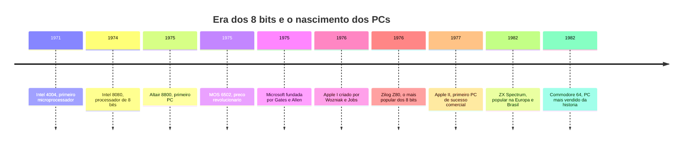
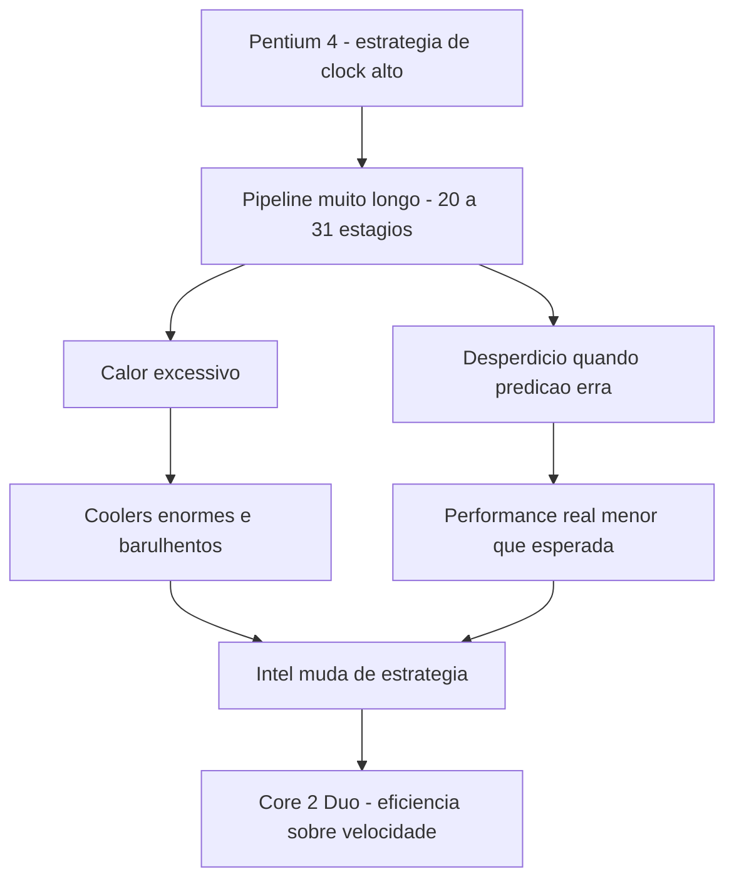
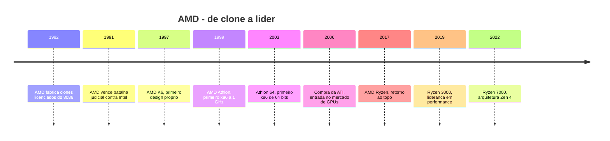
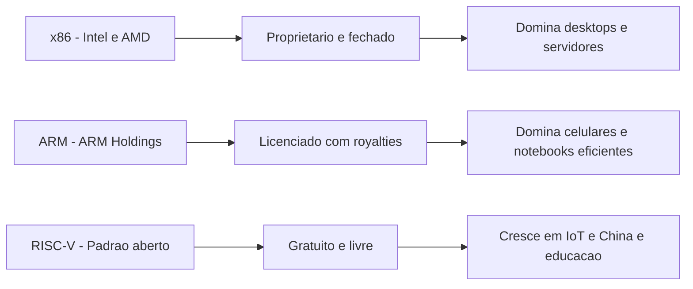
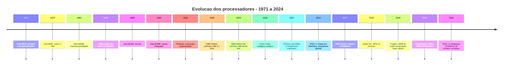

# 1.4 — A Evolução dos Processadores: Do Intel 4004 ao Apple M4

[← Anterior: História da Computação](cap01-mod03-historia-computacao.md) · [Próximo: CPU e Arquiteturas →](cap01-mod05-cpu-arquiteturas.md)

---

## Introdução

No módulo 1.3, vimos a história da computação em linhas gerais — do ábaco ao ChatGPT. Agora vamos aprofundar em uma parte dessa história que é fundamental para entender como os computadores que usamos hoje chegaram até aqui: a **evolução dos processadores**.

Entender essa evolução não é apenas curiosidade histórica. Quando você programa, seu código roda em um processador. Saber como eles evoluíram te ajuda a entender por que certas decisões de design existem, por que existem diferentes arquiteturas e por que performance importa.

A história dos processadores é também a história de como a computação saiu de salas enormes e chegou ao seu bolso. E é uma história de problemas sendo resolvidos, um após o outro.

---

## O Começo: Intel 4004 e o Nascimento do Microprocessador

Antes de 1971, processadores eram construídos com muitos chips separados conectados em uma placa. Era caro, grande e complexo. O **problema** era claro: como colocar toda a lógica de processamento em um único chip?

A resposta veio da Intel. Em 1971, os engenheiros Federico Faggin, Ted Hoff e Stanley Mazor criaram o **Intel 4004** — o primeiro microprocessador comercial do mundo. Pela primeira vez, um processador completo cabia em um único chip.

| Caracteristica | Intel 4004 |
|---------------|-----------|
| Ano | 1971 |
| Transistores | 2.300 |
| Velocidade | 740 KHz |
| Bits | 4 bits |
| Uso original | Calculadoras |

Para comparação: o processador do seu celular hoje tem bilhões de transistores e roda a bilhões de hertz. O 4004 era primitivo, mas revolucionário — provou que era possível colocar um processador inteiro em um chip.

---

## A Era do 8 Bits: Intel 8080 e o Primeiro PC

Em 1974, a Intel lançou o **8080** — um processador de 8 bits que se tornou o cérebro do **Altair 8800**, considerado o primeiro computador pessoal (1975). O Altair não tinha tela nem teclado — você programava usando interruptores e lia resultados em luzes piscando. Mas foi o suficiente para inspirar dois jovens: **Bill Gates** e **Paul Allen**.

Gates e Allen viram o Altair e pensaram: "Esse computador precisa de software." Eles criaram um interpretador da linguagem BASIC para o Altair e fundaram a **Microsoft**. Essa decisão mudou o mundo.

Ao mesmo tempo, na Califórnia, **Steve Wozniak** e **Steve Jobs** estavam construindo o **Apple I** (1976) e depois o **Apple II** (1977) — computadores pessoais que qualquer pessoa podia usar, com tela e teclado.

### Outros Processadores de 8 Bits: Z80 e MOS 6502

O Intel 8080 não foi o único processador de 8 bits importante. Dois outros chips marcaram profundamente essa era e merecem destaque.

O **Zilog Z80** (1976) foi criado por **Federico Faggin** — o mesmo engenheiro que liderou o Intel 4004. Faggin saiu da Intel, fundou a Zilog e projetou um processador que era compatível com o 8080 (rodava os mesmos programas), mas tinha mais recursos e era mais fácil de programar. O Z80 se tornou o processador mais popular da era dos 8 bits. Ele foi o cérebro de computadores como o **TRS-80** (da Radio Shack, um dos primeiros PCs de sucesso nos EUA), o **ZX Spectrum** (da Sinclair, extremamente popular na Europa e no Brasil) e o **MSX** (padrão criado pela Microsoft no Japão, muito popular no Brasil nos anos 1980). Além de computadores, o Z80 também foi usado em consoles de videogame como o **Sega Master System** e em calculadoras científicas da Texas Instruments que são vendidas até hoje.

O **MOS 6502** (1975) foi outro processador revolucionário, mas por um motivo diferente: o preço. Enquanto o Intel 8080 custava cerca de 150 dólares, o 6502 custava apenas **25 dólares**. Essa diferença brutal de preço aconteceu porque a MOS Technology, empresa que o fabricava, usou técnicas de produção mais eficientes e tinha custos menores. O 6502 foi o processador do **Apple II** (o computador que fez a Apple crescer), do **Commodore 64** (o computador pessoal mais vendido de todos os tempos, com mais de 17 milhões de unidades), do **Atari 2600** (o console que popularizou os videogames) e do **Nintendo Entertainment System** (NES/Famicom, que ressuscitou a indústria de videogames nos anos 1980). Uma variante do 6502 também foi usada na **BBC Micro**, o computador educacional britânico que deu origem à ARM — conectando diretamente a era dos 8 bits com a revolução ARM que veremos mais adiante.

| Processador | Ano | Preco na epoca | Computadores famosos | Destaque |
|-------------|-----|----------------|---------------------|----------|
| Intel 8080 | 1974 | ~150 dolares | Altair 8800 | Primeiro PC |
| Zilog Z80 | 1976 | ~25 dolares | TRS-80, ZX Spectrum, MSX | Mais popular da era 8 bits |
| MOS 6502 | 1975 | ~25 dolares | Apple II, Commodore 64, NES | Preco revolucionario |

### Por que 8 Bits Era uma Limitação

Mas por que 8 bits era um problema? Um processador de 8 bits só consegue trabalhar com números de 0 a 255 em uma única operação. Se você precisa representar um número maior — como 1.000 ou 50.000 — o processador precisa fazer várias operações para lidar com ele, o que é mais lento. Além disso, processadores de 8 bits só conseguiam endereçar no máximo **64 KB de memória** (65.536 bytes). Para os programas simples da época, isso era suficiente. Mas conforme os programas ficaram mais complexos — planilhas, processadores de texto, jogos com gráficos — 64 KB se tornou um gargalo insuportável. Era como ter uma bancada de cozinha tão pequena que você só consegue preparar um prato por vez, e ainda assim apertado.

Essa limitação empurrou a indústria para os 16 bits (Intel 8086, em 1978) e depois para os 32 bits (Intel 80386, em 1985), cada salto permitindo trabalhar com números maiores e endereçar muito mais memória.

---

## O x86: A Arquitetura que Dominou o Mundo

Em 1978, a Intel lançou o **8086** — o processador que deu origem à arquitetura **x86**, a mesma que está no seu notebook hoje (se ele tem Intel ou AMD).

O nome "x86" vem dos números dos processadores: 8086, 80186, 80286, 80386, 80486... Todos terminavam em "86", então a família ficou conhecida como x86.

### Por que o x86 dominou?

O **problema** que o x86 resolveu foi a **compatibilidade**. Cada novo processador da família x86 era compatível com os anteriores. Isso significava que programas escritos para o 8086 continuavam funcionando no 80286, no 80386 e assim por diante. Empresas e usuários não precisavam recomprar todo o software a cada novo processador.

Essa decisão de manter compatibilidade foi genial do ponto de vista comercial, mas criou uma complexidade técnica enorme. Até hoje, processadores x86 modernos carregam instruções que existem desde 1978 — é como um prédio que foi reformado dezenas de vezes mas nunca demolido.

### MS-DOS: O Sistema que Colocou a Microsoft no Mapa

Em 1981, a IBM decidiu entrar no mercado de computadores pessoais e criou o **IBM PC**. Precisavam de um sistema operacional e procuraram a Microsoft. Bill Gates não tinha um sistema pronto, mas comprou um chamado QDOS (Quick and Dirty Operating System) por 50 mil dólares, adaptou e vendeu para a IBM como **MS-DOS** (Microsoft Disk Operating System).

O golpe de mestre de Gates foi negociar para que a Microsoft mantivesse os direitos do MS-DOS e pudesse vendê-lo para outros fabricantes. Essa decisão parece simples, mas mudou a história da tecnologia.

### A Arquitetura Aberta do IBM PC e os Clones

A IBM cometeu um erro estratégico que, paradoxalmente, criou a indústria de PCs como a conhecemos. Para lançar o IBM PC rapidamente, a IBM usou componentes de prateleira (peças que qualquer empresa podia comprar) em vez de criar hardware proprietário. Além disso, publicou as especificações técnicas do IBM PC em um manual aberto — qualquer engenheiro podia ler exatamente como o computador funcionava.

Isso significava que outras empresas podiam construir computadores idênticos ao IBM PC. Bastava comprar os mesmos componentes, montar da mesma forma e instalar o MS-DOS. Empresas como **Compaq**, **Dell**, **HP** e dezenas de outras começaram a fabricar "clones" do IBM PC — computadores compatíveis que custavam menos que o original da IBM.

Um componente fundamental dessa arquitetura aberta era o barramento **ISA** (Industry Standard Architecture). O barramento ISA era o sistema de comunicação interno do IBM PC — a "estrada" por onde dados trafegavam entre o processador, a memória e os periféricos. Como a especificação do ISA era pública, qualquer fabricante podia criar placas de expansão (placas de vídeo, placas de som, modems) que encaixavam no barramento ISA de qualquer PC compatível. Isso criou um ecossistema enorme de acessórios e periféricos, todos intercambiáveis entre diferentes marcas de PC.

O resultado foi devastador para a IBM, mas transformador para o mundo: a IBM perdeu o controle do mercado que ela mesma criou. Mas o padrão "PC compatível" — processador x86 da Intel, sistema operacional da Microsoft, barramento ISA — se tornou o padrão mundial. Até hoje, quando você compra um "PC", está comprando um descendente direto daquela arquitetura aberta de 1981.

| Evento | Ano | Impacto |
|--------|-----|---------|
| IBM PC lancado | 1981 | Padronizou o mercado de PCs |
| MS-DOS vendido com IBM PC | 1981 | Microsoft se torna fornecedora padrão |
| Especificacoes do IBM PC publicadas | 1981 | Permite fabricacao de clones |
| Compaq lanca primeiro clone | 1982 | Prova que clones funcionam |
| Barramento ISA se torna padrão | 1982+ | Perifericos intercambiaveis entre marcas |
| Clones do IBM PC surgem em massa | 1983+ | x86 + MS-DOS se torna o padrão mundial |
| Windows 1.0 | 1985 | Microsoft adiciona interface gráfica ao MS-DOS |
| IBM perde lideranca no mercado de PCs | Final dos 1980s | Clones mais baratos dominam |

---

## A Evolução do x86: Cada Geração em Profundidade

Cada geração de processador x86 não foi apenas "mais rápida" — cada uma resolveu um problema específico que limitava a geração anterior. Vamos ver cada uma em detalhe.

### Intel 80286 (1982) — Memória Protegida

O 8086 original tinha um problema sério: todos os programas compartilhavam a mesma memória sem nenhuma proteção. Se um programa tivesse um bug e escrevesse dados no lugar errado, podia corromper outro programa ou até travar o sistema inteiro. Era como se todos os cozinheiros de uma cozinha usassem a mesma bancada sem nenhuma divisão — um podia derrubar os ingredientes do outro.

O **80286** resolveu isso com o conceito de **memória protegida** (protected mode). Cada programa ganhava seu próprio espaço de memória isolado. Se um programa tentasse acessar a memória de outro, o processador bloqueava a operação.

| Caracteristica | 8086 | 80286 |
|---------------|------|-------|
| Ano | 1978 | 1982 |
| Bits | 16 | 16 |
| Transistores | 29.000 | 134.000 |
| Memória máxima | 1 MB | 16 MB |
| Proteção de memória | Não | Sim |
| Velocidade | 5-10 MHz | 6-25 MHz |

O 286 foi o processador do **IBM PC/AT**, que se tornou o padrão corporativo. Mas ainda tinha uma limitação importante: era de 16 bits, o que significava que só podia processar dados em blocos de 16 bits por vez e endereçar no máximo 16 MB de RAM. Para os programas que estavam ficando cada vez maiores e mais complexos, isso era um gargalo.

### Intel 80386 (1985) — A Revolução dos 32 Bits

O **80386** (ou simplesmente "386") foi talvez o salto mais importante de toda a linha x86. Pela primeira vez, um processador x86 era de **32 bits**. Isso mudou tudo.

O que 32 bits significava na prática:

- **Mais memória**: podia endereçar até 4 GB de RAM (contra 16 MB do 286). Na época, 4 GB parecia infinito — a maioria dos computadores tinha 1-4 MB de RAM
- **Dados maiores**: podia processar números de até 4 bilhões em uma única operação
- **Memória virtual**: o processador podia "fingir" que tinha mais RAM do que realmente existia, usando o disco rígido como extensão da memória
- **Multitarefa real**: podia rodar vários programas ao mesmo tempo de verdade, cada um isolado em seu próprio espaço

| Caracteristica | 80286 | 80386 |
|---------------|-------|-------|
| Ano | 1982 | 1985 |
| Bits | 16 | 32 |
| Transistores | 134.000 | 275.000 |
| Memória máxima | 16 MB | 4 GB |
| Memória virtual | Não | Sim |
| Multitarefa real | Limitada | Sim |

O 386 foi tão importante que o **Windows 3.0** (1990) e depois o **Windows 95** foram projetados especificamente para aproveitar suas capacidades de 32 bits. O Linux, criado por Linus Torvalds em 1991, também foi desenvolvido originalmente para o 386.

A Intel também lançou uma versão mais barata chamada **386SX**, que tinha barramento externo de 16 bits (mais lento, mas mais barato). Essa estratégia de ter versões "completas" e "econômicas" do mesmo processador se tornou padrão na indústria — até hoje Intel e AMD fazem isso.

### Intel 80486 (1989) — Cache e Coprocessador Integrados

O **80486** (ou "486") trouxe duas inovações que mudaram a forma como processadores funcionam:

1. **Cache L1 integrada**: pela primeira vez, uma memória ultra-rápida de 8 KB ficava dentro do próprio processador. Antes, a cache ficava em chips separados na placa-mãe. Colocar a cache dentro do processador significava acesso muito mais rápido aos dados mais usados.

2. **Coprocessador matemático integrado**: o 486 incluía uma unidade de ponto flutuante (FPU) dentro do chip. Antes, se você precisava fazer cálculos com números decimais (como 3.14 ou 2.718), precisava comprar um chip separado chamado "coprocessador matemático" (o 387). Isso era caro e nem todo mundo tinha. Com o 486, todo mundo ganhou capacidade de cálculos decimais.

Pense assim: antes do 486, o cozinheiro (CPU) precisava ir até outra sala para pegar ingredientes frequentes (sem cache interna) e precisava chamar um assistente especializado para fazer contas com frações (sem FPU). O 486 colocou tudo na mesma cozinha.

| Caracteristica | 80386 | 80486 |
|---------------|-------|-------|
| Ano | 1985 | 1989 |
| Transistores | 275.000 | 1.200.000 |
| Cache interna | Não | 8 KB L1 |
| FPU integrada | Não | Sim |
| Velocidade | 16-33 MHz | 25-100 MHz |
| Pipeline | Não | Sim, 5 estagios |

O 486 também introduziu o conceito de **pipeline** — dividir a execução de uma instrução em estágios, permitindo que várias instruções estejam em diferentes estágios ao mesmo tempo. É como uma linha de montagem: enquanto uma instrução está sendo executada, a próxima já está sendo decodificada e a seguinte já está sendo buscada.

A versão econômica, o **486SX**, vinha sem o coprocessador matemático — era mais barata, mas não fazia cálculos decimais tão rápido. Muitos estudantes e famílias compraram o 486SX como primeiro computador.

### Pentium (1993) — Execução Superescalar

A Intel não podia chamar o próximo processador de "586" porque números não podem ser registrados como marca. Então criou o nome **Pentium** (do grego "penta", cinco — a quinta geração).

O Pentium trouxe a **execução superescalar**: dois pipelines que podiam executar duas instruções ao mesmo tempo. Era como ter dois cozinheiros trabalhando em paralelo na mesma cozinha, cada um com sua própria bancada.

| Caracteristica | 80486 | Pentium |
|---------------|-------|---------|
| Ano | 1989 | 1993 |
| Transistores | 1.200.000 | 3.100.000 |
| Pipelines | 1 | 2 |
| Velocidade | 25-100 MHz | 60-200 MHz |
| Barramento de dados | 32 bits | 64 bits |
| Predicao de desvio | Não | Sim |

O Pentium também introduziu a **predição de desvio** (branch prediction). Quando o processador encontra uma decisão no código (tipo "se X, faça A; senão, faça B"), ele tenta adivinhar qual caminho será tomado e já começa a executar antes de saber a resposta. Se acertar, ganha tempo. Se errar, descarta o trabalho e recomeça. Processadores modernos acertam mais de 95% das vezes.

O Pentium ficou famoso também por um bug: o **Pentium FDIV bug** (1994). Certos cálculos de divisão com números decimais davam resultados errados. A Intel inicialmente minimizou o problema, mas a pressão pública forçou uma troca gratuita de todos os processadores afetados. Esse episódio ensinou à indústria que bugs em hardware são muito mais graves que bugs em software — você não pode "atualizar" um processador com um patch.

### Pentium II e III (1997-1999) — Multimídia e Internet

O final dos anos 1990 foi um período de transformação radical na forma como as pessoas usavam computadores. Antes, o computador era uma ferramenta de trabalho — planilhas, documentos, bancos de dados. Mas três fenômenos mudaram tudo ao mesmo tempo: a **explosão da internet**, a **revolução multimídia** e o **boom dos jogos 3D**.

A internet comercial chegou ao grande público entre 1995 e 1997. De repente, as pessoas queriam navegar em sites com imagens, ouvir música em formato MP3, assistir vídeos (mesmo que pequenos e de baixa qualidade) e fazer download de arquivos. O navegador Netscape Navigator e depois o Internet Explorer se tornaram os programas mais usados do mundo. E tudo isso exigia mais poder de processamento do que o Pentium original oferecia.

O **Pentium II** (1997) foi a resposta da Intel para essa nova realidade. Ele trouxe as instruções **MMX** (MultiMedia eXtensions) — operações especializadas para processar áudio, vídeo e gráficos de forma muito mais eficiente. Antes do MMX, processar um arquivo de áudio ou decodificar um vídeo exigia que a CPU fizesse muitas operações genéricas. Com o MMX, essas tarefas tinham instruções dedicadas que faziam o mesmo trabalho em menos ciclos.

O Pentium II também mudou fisicamente: em vez de encaixar em um soquete como os processadores anteriores, ele vinha em um cartucho chamado **Slot 1** — parecido com um cartucho de videogame. Isso permitiu incluir a cache L2 mais perto do processador, melhorando a performance.

Ao mesmo tempo, a internet discada (aqueles modems que faziam barulho ao conectar) estava sendo substituída por conexões mais rápidas como ADSL e cabo. Sites ficavam mais pesados, com mais imagens e conteúdo interativo em Flash. Cada avanço na internet puxava a demanda por hardware mais potente, e cada hardware mais potente permitia sites e aplicações mais complexas — um ciclo que continua até hoje.

O **Pentium III** (1999) deu o próximo passo com as instruções **SSE** (Streaming SIMD Extensions). O SSE era especialmente importante para **jogos 3D** — a grande febre do final dos anos 1990. Jogos como Quake III Arena, Half-Life, Unreal Tournament e Counter-Strike exigiam cálculos intensos de geometria 3D, e o SSE acelerava exatamente esse tipo de operação.

O Pentium III também foi o processador que acompanhou o nascimento do **e-commerce**. Sites como Amazon e eBay estavam crescendo, e os servidores que rodavam esses sites precisavam de processadores capazes de lidar com milhares de conexões simultâneas. O Pentium III Xeon (versão para servidores) foi amplamente adotado em data centers da época.

Uma curiosidade controversa: o Pentium III incluía um número de série único chamado **PSN** (Processor Serial Number) que podia ser lido por software. A ideia era usar para segurança e identificação, mas grupos de privacidade protestaram — era como se cada processador tivesse uma "impressão digital" que sites podiam rastrear. A Intel acabou desativando o recurso por padrão nas versões seguintes.

| Caracteristica | Pentium | Pentium II | Pentium III |
|---------------|---------|------------|-------------|
| Ano | 1993 | 1997 | 1999 |
| Transistores | 3.1M | 7.5M | 9.5M |
| Instruções especiais | - | MMX | MMX + SSE |
| Cache L2 | Externa | 512 KB integrada | 256 KB integrada |
| Velocidade | 60-200 MHz | 233-450 MHz | 450-1400 MHz |
| Contexto de mercado | PCs corporativos | Internet e multimidia | Jogos 3D e e-commerce |

### Pentium 4 e o Muro de Calor (2000-2006)

O **Pentium 4** (2000) apostou em uma estratégia agressiva: velocidades de clock altíssimas. Chegou a 3.8 GHz — números impressionantes no papel. Mas havia um problema grave: **calor**.

Para atingir essas velocidades, o Pentium 4 usava um pipeline muito longo (20-31 estágios). Pipelines longos permitem velocidades altas, mas desperdiçam muito trabalho quando a predição de desvio erra. E o processador esquentava tanto que precisava de coolers enormes e barulhentos.

A Intel aprendeu uma lição dolorosa: **velocidade de clock não é tudo**. Um processador a 3.8 GHz que desperdiça muitos ciclos pode ser mais lento que um a 2 GHz que aproveita cada ciclo. Essa lição mudou toda a indústria.

---

## A Era dos Múltiplos Núcleos: Core 2 Duo em Diante

### Core 2 Duo (2006) — Dois Cérebros São Melhor que Um

Depois do fracasso da estratégia "mais GHz" do Pentium 4, a Intel mudou completamente de direção. Em vez de fazer um processador mais rápido, colocou **dois processadores** dentro do mesmo chip. Nasceu o **Core 2 Duo**.

O **problema** que os múltiplos núcleos resolveram: a física impunha limites. Aumentar a velocidade de clock gerava calor demais. A solução foi fazer mais trabalho em paralelo — dois núcleos a 2 GHz fazem mais que um núcleo a 3.8 GHz, gastando menos energia e gerando menos calor.

| Caracteristica | Pentium 4 | Core 2 Duo |
|---------------|-----------|------------|
| Ano | 2000 | 2006 |
| Nucleos | 1 | 2 |
| Velocidade | Até 3.8 GHz | 1.8-3.0 GHz |
| Consumo de energia | Alto, 115W+ | Moderado, 65W |
| Transistores | 42M-125M | 291M |
| Arquitetura | NetBurst, pipeline longo | Core, pipeline curto e eficiente |

O Core 2 Duo foi um marco. Pela primeira vez, ter "dois núcleos" virou argumento de venda. Mas havia um detalhe importante: para aproveitar dois núcleos, os programas precisavam ser escritos para isso. Um programa que faz tudo em sequência (uma coisa de cada vez) não fica mais rápido com dois núcleos — é como ter dois cozinheiros, mas só um deles tem receita para seguir.

### Core i3, i5, i7 e i9 — A Família que Conhecemos Hoje

Em 2008, a Intel lançou a família **Core** que usamos até hoje: i3, i5, i7 e depois i9. Cada um para um público diferente:

| Linha | Nucleos tipicos | Para quem | Analogia |
|-------|----------------|-----------|----------|
| Core i3 | 2-4 nucleos | Uso básico, escritorio | Cozinha pequena, 2 cozinheiros |
| Core i5 | 4-6 nucleos | Uso geral, programação | Cozinha media, 4-6 cozinheiros |
| Core i7 | 6-8 nucleos | Trabalho pesado, edicao de video | Cozinha grande, 6-8 cozinheiros |
| Core i9 | 8-24 nucleos | Extremo, servidores, IA | Cozinha industrial |

A Intel também introduziu o **Hyper-Threading**: uma tecnologia que faz cada núcleo físico parecer dois núcleos para o sistema operacional. Não é a mesma coisa que ter dois núcleos reais, mas melhora o aproveitamento — quando um thread está esperando dados da memória, o outro pode usar o núcleo.

### Gerações Intel Core — O Número que Importa

Quando você vê "Intel Core i7-13700K", o número "13" indica a **geração**. Cada geração traz melhorias na eficiência, no consumo de energia e na velocidade. A diferença entre gerações pode ser significativa:

| Geração | Ano | Codinome | Novidade principal |
|---------|-----|----------|-------------------|
| 1a | 2008 | Nehalem | Controlador de memória integrado |
| 2a | 2011 | Sandy Bridge | GPU integrada, grande salto de performance |
| 4a | 2013 | Haswell | Foco em eficiência energetica |
| 8a | 2017 | Coffee Lake | Mais nucleos no mainstream, 6 nucleos no i7 |
| 12a | 2021 | Alder Lake | Nucleos hibridos, Performance + Eficiência |
| 13a | 2022 | Raptor Lake | Mais nucleos eficientes |
| 14a | 2023 | Raptor Lake Refresh | Refinamento da 13a geração |

A partir da 12a geração (Alder Lake), a Intel adotou uma arquitetura **híbrida**: núcleos de Performance (P-cores) para tarefas pesadas e núcleos de Eficiência (E-cores) para tarefas leves. Isso é inspirado no que ARM já fazia em celulares há anos — ter núcleos grandes para quando precisa de potência e núcleos pequenos para economizar bateria.

---

## A AMD: De Clone a Líder

A história da AMD é uma das mais fascinantes da tecnologia. Começou como fabricante de clones dos processadores Intel e se tornou uma concorrente que, em vários momentos, superou a Intel.

### Os Primeiros Anos: Clones Licenciados (1982-1995)

A AMD começou fabricando cópias exatas dos processadores Intel, com licença oficial. A IBM exigia que o IBM PC tivesse pelo menos dois fornecedores de cada componente (para não depender de um só), então a Intel licenciou seus designs para a AMD.

Quando a Intel lançou o 386, tentou cancelar a licença da AMD. Isso gerou uma batalha judicial que durou anos. A AMD venceu e continuou fabricando processadores compatíveis com x86.

### K6 e Athlon: A AMD Encontra Sua Identidade (1997-2003)

O **AMD K6** (1997) foi o primeiro processador com design próprio da AMD — não era mais um clone da Intel. Era mais barato que o Pentium II e oferecia performance competitiva, especialmente para jogos.

O **AMD Athlon** (1999) foi o momento em que a AMD provou que podia superar a Intel. O Athlon foi o primeiro processador x86 a atingir 1 GHz — chegou antes do Pentium III. Isso foi um choque para a indústria.

### Athlon 64: O Primeiro x86 de 64 Bits (2003)

Em 2003, a AMD fez algo que mudou a indústria para sempre: lançou o **Athlon 64**, o primeiro processador x86 de **64 bits** para desktop. A AMD chamou sua extensão de **AMD64** (ou x86-64).

O **problema** que 64 bits resolvia: processadores de 32 bits só podiam endereçar 4 GB de RAM. Com programas e dados ficando cada vez maiores, 4 GB estava se tornando insuficiente. 64 bits permitia endereçar até 16 exabytes de RAM (um número tão grande que é praticamente infinito).

A Intel tinha sua própria solução de 64 bits chamada **Itanium** (IA-64), mas ela não era compatível com programas x86 de 32 bits. A solução da AMD era compatível — rodava programas de 32 bits sem problemas. O mercado escolheu a AMD, e a Intel foi forçada a adotar a mesma abordagem, licenciando a tecnologia AMD64. Até hoje, quando você vê "x86-64" ou "amd64" no seu sistema operacional, é a tecnologia que a AMD criou.

### A Era Sombria da AMD (2006-2016)

Depois do sucesso do Athlon 64, a AMD comprou a **ATI** (fabricante de placas de vídeo) em 2006 por 5.4 bilhões de dólares. A ideia era combinar CPU e GPU, mas a integração foi difícil e cara. A AMD quase faliu.

Durante quase uma década, os processadores AMD da série **FX** (baseados na arquitetura Bulldozer) ficaram muito atrás da Intel. A estratégia da AMD de usar muitos núcleos fracos não funcionou — a maioria dos programas preferia poucos núcleos fortes. Foi um período difícil, e muitas pessoas acharam que a AMD não sobreviveria.

### AMD Ryzen: O Retorno Triunfal (2017-presente)

Em 2017, a AMD lançou o **Ryzen** — e tudo mudou. A nova arquitetura **Zen**, projetada por uma engenheira brilhante chamada **Lisa Su** (CEO da AMD) e sua equipe liderada por **Jim Keller** (um dos maiores projetistas de processadores da história), era completamente nova.

O Ryzen oferecia:
- Performance competitiva com Intel pela primeira vez em uma década
- Mais núcleos pelo mesmo preço (Ryzen 7 com 8 núcleos competia com Intel i7 de 4 núcleos)
- Melhor eficiência energética
- Preços mais acessíveis

| Geração Ryzen | Ano | Arquitetura | Destaque |
|--------------|-----|-------------|----------|
| Ryzen 1000 | 2017 | Zen | Retorno competitivo, 8 nucleos acessiveis |
| Ryzen 2000 | 2018 | Zen+ | Refinamento, melhor eficiência |
| Ryzen 3000 | 2019 | Zen 2 | Lideranca em performance, chiplets |
| Ryzen 5000 | 2020 | Zen 3 | Melhor processador para jogos |
| Ryzen 7000 | 2022 | Zen 4 | DDR5, 5nm |
| Ryzen 9000 | 2024 | Zen 5 | Eficiência e IPC recordes |

A partir do Ryzen 3000 (2019), a AMD introduziu o conceito de **chiplets**: em vez de fabricar um chip monolítico enorme (caro e com mais defeitos), a AMD fábrica vários chips menores e os conecta dentro do mesmo pacote. Isso reduziu custos e aumentou a quantidade de núcleos possíveis. A Intel só adotou abordagem similar anos depois.

### Por que a Competição Intel vs AMD Importa

A competição entre Intel e AMD é um dos melhores exemplos de como a concorrência beneficia todo mundo:

| Período | Situação | Resultado para consumidores |
|---------|----------|---------------------------|
| 1998-2005 | AMD competitiva | Precos caem, inovacao acelera |
| 2006-2016 | Intel sem concorrência real | Precos altos, melhorias incrementais |
| 2017-presente | AMD Ryzen competitivo | Precos caem, mais nucleos, mais inovacao |

Quando a Intel não tinha concorrência real (2006-2016), cada nova geração trazia melhorias de apenas 5-10%. Quando o Ryzen apareceu, a Intel foi forçada a dobrar o número de núcleos e baixar preços. Competição gera inovação — esse é um conceito que se aplica tanto a hardware quanto a software.

---

## A Revolução ARM: De Celulares a Supercomputadores

### A Origem: Acorn e o BBC Micro (1983-1990)

A história da ARM começa na Inglaterra, em um lugar improvável. A empresa **Acorn Computers** fabricava computadores educacionais para a BBC (a emissora pública britânica). Em 1983, a equipe de engenheiros da Acorn, liderada por **Sophie Wilson** e **Steve Furber**, projetou um processador próprio para seus computadores: o **Acorn RISC Machine** — ARM.

A filosofia era radicalmente diferente da Intel. Enquanto a Intel adicionava instruções cada vez mais complexas ao x86 (abordagem **CISC** — Complex Instruction Set Computer), a ARM usava instruções simples e rápidas (abordagem **RISC** — Reduced Instruction Set Computer).

| Abordagem | CISC - x86 | RISC - ARM |
|-----------|-----------|-----------|
| Filosofia | Instruções complexas que fazem muito | Instruções simples que fazem pouco |
| Vantagem | Menos instruções por programa | Cada instrução executa mais rápido |
| Desvantagem | Cada instrução demora mais | Precisa de mais instruções por programa |
| Analogia | Cozinheiro que sabe receitas complexas | Cozinheiro que faz passos simples muito rápido |
| Consumo de energia | Alto | Baixo |

Na prática, a abordagem RISC permite processadores menores, mais simples e que consomem muito menos energia. Isso não importava muito para desktops ligados na tomada, mas se tornaria crucial para dispositivos que funcionam com bateria.

### ARM Holdings: A Empresa que Não Fábrica Nada (1990)

Em 1990, a Acorn, a Apple e a VLSI Technology fundaram a **ARM Holdings** como empresa independente. E aqui está o modelo de negócio mais incomum da indústria de tecnologia: a ARM **não fábrica processadores**. Ela projeta a arquitetura e **licencia** os designs para outras empresas fabricarem.

Isso significa que Qualcomm, Apple, Samsung, MediaTek, Nvidia e dezenas de outras empresas pagam uma taxa para usar os designs da ARM e criar seus próprios chips. Cada uma pode modificar e otimizar o design para seu uso específico.

| Empresa | Chip ARM | Onde e usado |
|---------|----------|-------------|
| Qualcomm | Snapdragon | Celulares Android, notebooks Windows |
| Apple | A-series, M-series | iPhones, iPads, Macs |
| Samsung | Exynos | Celulares Samsung |
| MediaTek | Dimensity | Celulares Android acessiveis |
| Nvidia | Grace | Servidores e IA |

### ARM nos Celulares: O Domínio Absoluto

Quando os smartphones surgiram nos anos 2000, o **problema** era claro: processadores x86 consumiam energia demais para caber em um dispositivo com bateria pequena. ARM era a solução perfeita — eficiente, compacta e poderosa o suficiente para rodar um sistema operacional completo.

Hoje, **praticamente 100% dos smartphones do mundo** usam processadores ARM. Isso inclui todos os iPhones, todos os Androids, todos os tablets. São mais de 3 bilhões de dispositivos ARM ativos no mundo — muito mais do que computadores x86.

### Apple Silicon: ARM Invade o Desktop (2020)

Em 2020, a Apple fez algo que a indústria inteira estava observando: abandonou os processadores Intel x86 nos seus Macs e criou seus próprios chips ARM — o **Apple M1**.

O **problema** que a Apple queria resolver: notebooks com Intel esquentavam, tinham bateria curta e a Apple dependia do calendário de lançamentos da Intel. Criando seus próprios chips, a Apple controlava tudo — design, fabricação, otimização.

O resultado surpreendeu até os mais otimistas:

| Caracteristica | MacBook Pro 2019 com Intel | MacBook Pro 2020 com M1 |
|---------------|---------------------------|------------------------|
| Processador | Intel Core i5, 4 nucleos | Apple M1, 8 nucleos |
| Bateria | 10 horas | 20 horas |
| Ventilador | Sim, barulhento sob carga | Silencioso, quase nunca liga |
| Performance single-core | Base | 50% mais rápido |
| Performance multi-core | Base | 2x mais rápido |
| Consumo de energia | 28W | 10W |

O M1 era mais rápido que o Intel que substituiu, consumia um terço da energia e permitia o dobro de duração de bateria. Isso destruiu o mito de que ARM era "só para celulares".

A Apple continuou evoluindo:

| Chip | Ano | Nucleos CPU | Nucleos GPU | Para qual produto |
|------|-----|-------------|-------------|-------------------|
| M1 | 2020 | 8 | 7-8 | MacBook Air, MacBook Pro 13 |
| M1 Pro | 2021 | 8-10 | 14-16 | MacBook Pro 14 e 16 |
| M1 Max | 2021 | 10 | 24-32 | MacBook Pro 16, Mac Studio |
| M1 Ultra | 2022 | 20 | 48-64 | Mac Studio, Mac Pro |
| M2 | 2022 | 8 | 8-10 | MacBook Air, MacBook Pro 13 |
| M3 | 2023 | 8 | 10 | MacBook Air, MacBook Pro |
| M3 Pro | 2023 | 11-12 | 14-18 | MacBook Pro 14 e 16 |
| M3 Max | 2023 | 14-16 | 30-40 | MacBook Pro 16, Mac Studio |
| M4 | 2024 | 10 | 10 | MacBook Air, iPad Pro |
| M4 Pro | 2024 | 12-14 | 16-20 | MacBook Pro 14 e 16 |
| M4 Max | 2024 | 14-16 | 32-40 | MacBook Pro 16, Mac Studio |

A estratégia da Apple é clara: o mesmo design base (M4) é escalado para diferentes produtos. O M4 básico vai no MacBook Air. O M4 Max, com mais núcleos de CPU e GPU, vai nas máquinas profissionais. É como ter a mesma receita base, mas em porções diferentes.

### Qualcomm Snapdragon: ARM no Windows (2024)

A Apple não foi a única a apostar em ARM para computadores. A **Qualcomm**, que já dominava o mercado de chips para celulares Android com a linha **Snapdragon**, lançou em 2024 o **Snapdragon X Elite** — um processador ARM para notebooks Windows.

O **problema** que a Qualcomm queria resolver: notebooks Windows com Intel tinham bateria curta comparados aos MacBooks com Apple Silicon. A Qualcomm queria trazer a mesma eficiência energética do ARM para o ecossistema Windows.

Os primeiros resultados foram promissores: notebooks com Snapdragon X Elite ofereciam bateria de 15-20 horas com performance competitiva. Mas havia um desafio: nem todos os programas Windows foram feitos para ARM. A Microsoft criou uma camada de **emulação** que permite rodar programas x86 em ARM, mas com alguma perda de performance.

### Graviton: ARM nos Servidores

ARM também chegou aos servidores. A Amazon desenvolveu seus próprios processadores ARM chamados **Graviton** para usar em seus data centers. O **problema**: servidores x86 consumiam muita energia, e em data centers com milhares de servidores, a conta de energia é enorme.

| Geração | Ano | Nucleos | Destaque |
|---------|-----|---------|----------|
| Graviton | 2018 | 16 | Primeira geração, prova de conceito |
| Graviton 2 | 2020 | 64 | Performance competitiva com x86 |
| Graviton 3 | 2022 | 64 | 25% mais rápido que Graviton 2 |
| Graviton 4 | 2023 | 96 | 30% mais rápido que Graviton 3 |

Servidores com Graviton custam menos para operar (menos energia) e oferecem performance competitiva. Muitas empresas já migraram parte de seus serviços para instâncias ARM na nuvem.

### Fugaku: ARM no Supercomputador Mais Rápido do Mundo

Em 2020, o supercomputador **Fugaku**, do Japão, se tornou o mais rápido do mundo — e ele usa processadores ARM (Fujitsu A64FX). Isso provou definitivamente que ARM não é "fraco" — é eficiente. Com o design certo, ARM pode competir com qualquer coisa.

---

## RISC-V: A Terceira Via

Enquanto x86 e ARM dominam o mercado, uma terceira arquitetura está ganhando força silenciosamente: o **RISC-V** (pronuncia-se "risc five", ou "risc cinco").

### O Problema que o RISC-V Resolve

Para usar a arquitetura x86, você precisa de licença da Intel ou AMD — e eles não vendem licenças para terceiros. Para usar ARM, você precisa pagar royalties para a ARM Holdings. Nos dois casos, você depende de uma empresa privada que pode mudar os termos, aumentar preços ou até negar acesso.

O **problema** ficou especialmente claro para a **China**. Em 2019, quando os Estados Unidos impuseram sanções comerciais contra empresas chinesas de tecnologia, a ARM (que é britânica, mas tem operações americanas) foi pressionada a cortar relações com a Huawei. De repente, uma das maiores empresas de tecnologia do mundo ficou sem acesso à arquitetura que usava em seus celulares.

Isso acelerou a busca por uma alternativa que ninguém pudesse controlar.

### O que e o RISC-V

O RISC-V nasceu em 2010 na **Universidade da California, Berkeley**, como um projeto academico dos professores Krste Asanovic e David Patterson (o mesmo David Patterson que co-inventou o conceito RISC nos anos 1980). A ideia era criar uma arquitetura de processador completamente **aberta e gratuita** — qualquer pessoa ou empresa pode usar, modificar e fabricar processadores RISC-V sem pagar nada a ninguem.

Pense assim: x86 e ARM são como receitas patenteadas — você precisa de permissão (e dinheiro) para usa-las. RISC-V e como uma receita de dominio público — qualquer um pode usar, adaptar e ate vender pratos feitos com ela.

| Aspecto | x86 | ARM | RISC-V |
|---------|-----|-----|--------|
| Tipo | Proprietario | Licenciado | Aberto e gratuito |
| Quem controla | Intel e AMD | ARM Holdings | Ninguem, e um padrão aberto |
| Custo de licença | Não disponível | Royalties por chip | Zero |
| Quem pode fabricar | Apenas Intel e AMD | Quem pagar licença | Qualquer empresa |
| Filosofia | CISC | RISC | RISC |

### Onde o RISC-V ja esta sendo usado

O RISC-V ainda não compete com x86 e ARM em desktops ou celulares, mas esta crescendo rapidamente em nichos específicos:

- **IoT e dispositivos embarcados**: microcontroladores RISC-V ja estao em bilhoes de dispositivos simples como sensores, relogios inteligentes e eletrodomesticos conectados. A empresa chinesa **Espressif** (criadora do popular ESP32) lancou chips RISC-V para IoT
- **China**: o governo chines adotou RISC-V como estrategia nacional para reduzir dependência de tecnologia estrangeira. Empresas como **Alibaba** (T-Head) e **StarFive** ja fabricam processadores RISC-V
- **Pesquisa e educação**: universidades do mundo inteiro usam RISC-V para ensinar arquitetura de computadores, porque o design e aberto e pode ser estudado em detalhes
- **Aceleradores especializados**: empresas estao criando chips RISC-V otimizados para tarefas especificas como IA, criptografia e processamento de sinais

O RISC-V provavelmente não vai substituir x86 ou ARM no curto prazo, mas representa algo importante: a ideia de que a arquitetura de um processador pode ser um **bem público**, assim como o Linux e um sistema operacional aberto. E assim como o Linux levou decadas para se tornar dominante em servidores, o RISC-V pode seguir um caminho similar.

A história do RISC-V ainda esta sendo escrita. Mas o fato de que uma arquitetura aberta esta ganhando tracao real mostra que o modelo de "código aberto" — que revolucionou o software com o Linux — pode fazer o mesmo com o hardware.

---

## x86 vs ARM Hoje: A Comparação Detalhada

A rivalidade entre x86 e ARM não é mais "desktop vs celular". Ambas as arquiteturas competem em todos os segmentos. Aqui está uma comparação honesta:

| Aspecto | x86 - Intel e AMD | ARM - Apple, Qualcomm, etc |
|---------|-------------------|---------------------------|
| Compatibilidade de software | Enorme, decadas de programas | Crescendo, mas ainda menor |
| Eficiência energetica | Boa, melhorando | Excelente, lider |
| Performance bruta máxima | Muito alta | Muito alta |
| Performance por watt | Boa | Excelente |
| Ecossistema de servidores | Dominante | Crescendo rápido |
| Jogos | Dominante | Limitado |
| IA e Machine Learning | Forte com GPUs dedicadas | Forte com NPUs integradas |
| Preco | Variado | Variado |

### O Conceito de Performance por Watt

Um conceito importante para entender a comparação moderna é **performance por watt** — quanta performance você obtém para cada watt de energia consumido.

Imagine dois carros: um faz 200 km/h mas gasta 30 litros por 100 km. Outro faz 180 km/h mas gasta apenas 5 litros por 100 km. Qual é "melhor"? Depende do que você precisa. Se precisa da velocidade máxima absoluta, o primeiro. Se precisa de eficiência, o segundo.

ARM lidera em performance por watt. x86 ainda lidera em performance bruta máxima em alguns cenários (especialmente servidores com muitos núcleos). Mas a diferença está diminuindo a cada ano.

### NPU: O Novo Componente dos Processadores

Processadores modernos, tanto x86 quanto ARM, estão incluindo um novo componente: a **NPU** (Neural Processing Unit, ou Unidade de Processamento Neural). A NPU é um processador especializado em operações de Inteligência Artificial.

Enquanto a GPU faz muitos cálculos simples em paralelo (bom para IA), a NPU é ainda mais especializada — projetada especificamente para as operações matemáticas que modelos de IA usam (multiplicação de matrizes, por exemplo).

| Componente | Especialidade | Analogia |
|-----------|--------------|----------|
| CPU | Tarefas gerais e complexas | Cozinheiro chefe, faz de tudo |
| GPU | Muitos cálculos simples em paralelo | Exercito de ajudantes |
| NPU | Operações de IA | Especialista em um tipo de receita |

A Apple foi pioneira em incluir NPU (que ela chama de "Neural Engine") nos seus chips desde o A11 (2017). Intel e AMD estão adicionando NPUs aos seus processadores mais recentes. Isso mostra como a IA está se tornando tão importante que merece hardware dedicado.

### O que a NPU faz na prática

Você provavelmente ja usa a NPU do seu celular ou notebook sem saber. Aqui estao exemplos concretos do que ela faz no dia a dia:

- **Fotos**: quando você tira uma foto no celular e ela fica automaticamente mais bonita (cores ajustadas, ruido removido, fundo desfocado no modo retrato), e a NPU processando a imagem em tempo real. Sem a NPU, esse processamento seria lento demais ou gastaria bateria demais
- **Reconhecimento de voz**: quando você fala "Ok Google" ou "E aí, Siri", a NPU esta constantemente ouvindo e processando o audio para detectar a palavra de ativacao — sem enviar nada para a internet. Isso so e possível porque a NPU faz esse processamento localmente, com baixo consumo de energia
- **Traducao em tempo real**: aplicativos como Google Tradutor conseguem traduzir texto pela camera do celular em tempo real (você aponta a camera para uma placa em japones e ve a traducao sobreposta). A NPU processa a imagem, reconhece os caracteres e roda o modelo de traducao — tudo no dispositivo
- **Digitacao preditiva**: quando o teclado do celular sugere a próxima palavra ou corrige erros, modelos de IA rodando na NPU estao analisando o contexto da sua frase
- **Segurança**: o Face ID da Apple usa a NPU para processar o mapa 3D do seu rosto e compara-lo com o modelo armazenado. Isso acontece em milissegundos

O conceito importante aqui e **IA no dispositivo** (on-device AI). Em vez de enviar seus dados para um servidor na nuvem para processar (o que e lento e levanta questoes de privacidade), a NPU permite que a IA rode diretamente no seu celular ou notebook. Isso e mais rápido, funciona sem internet e mantem seus dados privados.

---

## A Linha do Tempo Completa

---

## O Futuro dos Processadores

A evolução dos processadores que vimos até aqui seguiu uma lógica relativamente previsível: mais transistores, mais velocidade, mais núcleos. Mas estamos chegando a limites físicos que vão forçar mudanças radicais na forma como processadores são projetados.

### O Fim da Lei de Moore

Em 1965, Gordon Moore (co-fundador da Intel) observou que o número de transistores em um chip dobrava a cada dois anos. Essa observação ficou conhecida como **Lei de Moore** e se manteve válida por mais de 50 anos. Mas estamos chegando ao limite.

Transistores modernos já têm apenas **3 nanômetros** de tamanho — isso é cerca de 15 átomos de largura. Quando você chega nessa escala, a física quântica começa a atrapalhar: elétrons "vazam" de um transistor para outro por um fenômeno chamado **tunelamento quântico**. É como se as paredes entre os cômodos da cozinha ficassem tão finas que os ingredientes passassem de um lado para o outro sozinhos.

A indústria ainda consegue reduzir o tamanho dos transistores, mas cada redução é mais cara e mais difícil. O custo de construir uma fábrica de chips de última geração já ultrapassa **20 bilhões de dólares**. Poucas empresas no mundo conseguem fabricar chips nos menores tamanhos — basicamente a **TSMC** (Taiwan), a **Samsung** (Coreia do Sul) e a **Intel** (EUA).

### Computação Quântica: Uma Abordagem Completamente Diferente

Enquanto processadores tradicionais trabalham com **bits** (0 ou 1), computadores quânticos trabalham com **qubits** (quantum bits), que podem ser 0, 1 ou ambos ao mesmo tempo — um fenômeno chamado **superposição**. Isso permite que computadores quânticos explorem muitas possibilidades simultaneamente.

Pense assim: um computador tradicional tentando encontrar a saída de um labirinto testa um caminho de cada vez. Um computador quântico, em teoria, pode testar todos os caminhos ao mesmo tempo.

Mas computação quântica não vai substituir seu notebook. Ela é útil para problemas muito específicos: simulação de moléculas (para criar novos medicamentos), criptografia, otimização de rotas logísticas e alguns tipos de inteligência artificial. Para tarefas do dia a dia — navegar na internet, editar documentos, programar — processadores tradicionais continuam sendo a melhor opção.

Empresas como **IBM**, **Google** e **Microsoft** estão investindo bilhões em computação quântica. O Google anunciou em 2019 que seu processador quântico **Sycamore** resolveu em 200 segundos um problema que levaria 10.000 anos em um supercomputador tradicional. Mas computadores quânticos ainda são enormes, caríssimos e precisam operar a temperaturas próximas do zero absoluto (-273 graus Celsius). Estamos nos primeiros passos dessa tecnologia.

### Computação Neuromórfica: Processadores que Imitam o Cérebro

Outra abordagem promissora é a **computação neuromórfica** — processadores projetados para funcionar como o cérebro humano. Em vez de executar instruções sequenciais como uma CPU tradicional, chips neuromórficos usam redes de "neurônios artificiais" que processam informações em paralelo, de forma similar aos neurônios biológicos.

O chip **Loihi 2** da Intel é um exemplo. Ele tem 1 milhão de neurônios artificiais e consome uma fração da energia que uma GPU consumiria para fazer tarefas similares de IA. A vantagem principal é a **eficiência energética**: o cérebro humano consome apenas 20 watts de energia (menos que uma lâmpada) para fazer coisas que os melhores computadores do mundo ainda não conseguem. Chips neuromórficos tentam se aproximar dessa eficiência.

### Computação Fotônica: Processadores que Usam Luz

Processadores tradicionais usam elétrons (corrente elétrica) para transmitir dados. Processadores **fotônicos** usam **fótons** (partículas de luz). A vantagem é que a luz viaja mais rápido, gera menos calor e pode carregar mais dados simultaneamente.

Empresas como **Lightmatter** e **Intel** (com seu projeto de interconexões fotônicas) estão desenvolvendo chips que usam luz para comunicação entre componentes. Isso não significa que teremos "processadores de luz" amanhã, mas a fotônica provavelmente será usada primeiro para conectar componentes dentro de data centers, onde a velocidade de comunicação entre servidores é um gargalo.

### O que Isso Significa para Você

Essas tecnologias ainda estão em estágio inicial, e nenhuma delas vai substituir seu computador nos próximos anos. Mas é importante saber que elas existem porque mostram que a evolução dos processadores não vai parar — ela vai mudar de direção. Em vez de apenas "mais transistores menores", o futuro provavelmente terá processadores especializados para diferentes tarefas: CPUs para lógica geral, GPUs para gráficos e cálculos paralelos, NPUs para IA, chips quânticos para problemas específicos e chips neuromórficos para tarefas que imitam o cérebro.

Como programador, o conceito mais importante aqui é: **o hardware está se tornando cada vez mais especializado**. Saber qual tipo de processador é melhor para cada tarefa será uma habilidade valiosa no futuro.

---

## Por que Isso Importa para Programadores?

Quando você escreve um programa, ele roda em um processador. Entender a evolução dos processadores te ajuda a:

1. **Entender compatibilidade** — por que programas compilados para x86 não rodam em ARM e vice-versa. Quando você compilar código em C no Capítulo 6, vai ver isso na prática
2. **Entender performance** — por que múltiplos núcleos importam e como seu código pode aproveitá-los. No Capítulo 9, quando falarmos de arquitetura de sistemas, vamos ver como servidores usam múltiplos núcleos para atender milhares de usuários
3. **Entender o mercado** — por que servidores na nuvem oferecem opções x86 e ARM com preços diferentes. Saber a diferença te ajuda a escolher o melhor para seu projeto
4. **Entender decisões de design** — por que a memória protegida do 286 existe (para que programas não corrompam uns aos outros), por que cache existe (para acelerar acesso a dados frequentes), por que 64 bits importa (para usar mais de 4 GB de RAM)
5. **Entender a importância da competição** — Intel vs AMD, x86 vs ARM. Competição gera inovação e preços melhores. Isso vale para hardware, software e para o mercado de trabalho

---

## Como a IA pode te ajudar aqui
**Prompt 1 — Explorar o conceito:**
> "Explique a diferença entre processadores de 32 bits e 64 bits e por que isso importa para programas."

**Prompt 2 — Listar e descobrir:**
> "Por que a Apple decidiu criar seus proprios processadores ARM em vez de continuar usando Intel? Quais foram os resultados?"

**Prompt 3 — Ver exemplos práticos:**
> "Como a competicao entre Intel e AMD beneficiou os consumidores ao longo dos anos? De exemplos concretos."

---

## Resumo do Módulo

| Conceito | Definição |
|----------|-----------|
| Microprocessador | Processador completo em um único chip |
| x86 | Familia de arquiteturas de processadores da Intel, compatível desde 1978 |
| Compatibilidade retroativa | Programas antigos continuam funcionando em processadores novos |
| MS-DOS | Sistema operacional da Microsoft para o IBM PC |
| ARM | Arquitetura de processadores focada em eficiência energetica |
| Multiplos nucleos | Vários processadores independentes em um único chip |
| CISC | Complex Instruction Set Computer, instruções complexas como x86 |
| RISC | Reduced Instruction Set Computer, instruções simples como ARM |
| RISC-V | Arquitetura aberta e gratuita, alternativa a x86 e ARM |
| Chiplets | Técnica de fabricar vários chips menores e conecta-los |
| Performance por watt | Quanta performance se obtem para cada watt de energia |
| NPU | Neural Processing Unit, processador especializado em IA |
| On-device AI | IA que roda no proprio dispositivo, sem enviar dados para a nuvem |
| Pipeline | Técnica de dividir execução em estagios para processar várias instruções |
| MMX | Instruções especializadas para processamento multimidia |
| SSE | Instruções especializadas para processamento 3D e midia avancada |
| Lei de Moore | Observacao de que o número de transistores em um chip dobra a cada dois anos |
| Computacao quantica | Abordagem que usa qubits para resolver problemas específicos muito mais rápido |
| Computacao neuromorfca | Processadores projetados para funcionar como o cerebro humano |
| Computacao fotonica | Processadores que usam fotons em vez de eletrons |
| ISA | Industry Standard Architecture, barramento padrão do IBM PC |
| Zilog Z80 | Processador de 8 bits mais popular da era dos PCs, usado no ZX Spectrum e MSX |
| MOS 6502 | Processador de 8 bits barato, usado no Apple II e Commodore 64 |

## Glossário do Módulo

| Termo | Definição |
|-------|-----------|
| 80286 | Processador Intel de 1982, introduziu memória protegida |
| 80386 | Processador Intel de 1985, primeiro x86 de 32 bits |
| 80486 | Processador Intel de 1989, primeiro com cache e FPU integradas |
| Altair 8800 | Primeiro computador pessoal comercial, 1975 |
| AMD | Advanced Micro Devices, concorrente da Intel em processadores x86 |
| AMD64 | Extensão de 64 bits criada pela AMD, adotada por toda a industria |
| Apple M1 | Primeiro processador ARM da Apple para Macs, 2020 |
| ARM | Arquitetura de processadores focada em eficiência energetica |
| Branch prediction | Predicao de desvio, técnica onde o processador tenta adivinhar o próximo caminho do código |
| Cache | Memória ultra-rápida dentro do processador |
| Chiplets | Técnica de fabricacao com vários chips menores conectados |
| CISC | Complex Instruction Set Computer, abordagem com instruções complexas |
| Commodore 64 | Computador pessoal com MOS 6502, o mais vendido da história com mais de 17 milhoes de unidades |
| Compaq | Empresa que fabricou o primeiro clone bem-sucedido do IBM PC em 1982 |
| Compatibilidade retroativa | Capacidade de rodar programas antigos em hardware novo |
| Computacao fotonica | Abordagem que usa fotons em vez de eletrons para processar e transmitir dados |
| Computacao neuromorfca | Processadores projetados para funcionar como o cerebro humano |
| Computacao quantica | Abordagem que usa qubits para resolver problemas específicos muito mais rápido |
| Core 2 Duo | Primeiro processador Intel com dois nucleos, 2006 |
| David Patterson | Professor que co-inventou o conceito RISC e co-criou o RISC-V |
| Espressif | Empresa chinesa fabricante de chips IoT, incluindo modelos RISC-V |
| Face ID | Sistema de reconhecimento facial da Apple que usa NPU |
| Federico Faggin | Engenheiro que liderou a criação do Intel 4004 |
| FPU | Floating Point Unit, unidade de cálculo com números decimais |
| Fugaku | Supercomputador japones com ARM, foi o mais rápido do mundo |
| Graviton | Processador ARM da Amazon para servidores na nuvem |
| Hyper-Threading | Tecnologia Intel que faz cada nucleo parecer dois |
| IBM PC | Computador pessoal da IBM lancado em 1981, padronizou o mercado |
| Intel 4004 | Primeiro microprocessador comercial, 1971 |
| Intel 8086 | Processador que originou a arquitetura x86, 1978 |
| ISA | Industry Standard Architecture, barramento padrão do IBM PC que permitiu perifericos intercambiaveis |
| IoT | Internet of Things, rede de dispositivos conectados como sensores e eletrodomesticos |
| Jim Keller | Engenheiro que projetou a arquitetura Zen da AMD |
| Krste Asanovic | Professor de Berkeley que co-criou a arquitetura RISC-V |
| Lei de Moore | Observacao de Gordon Moore de que o número de transistores em um chip dobra a cada dois anos |
| Lightmatter | Empresa que desenvolve processadores fotonicos |
| Lisa Su | CEO da AMD, liderou o retorno da empresa com Ryzen |
| Loihi 2 | Chip neuromorfco da Intel com 1 milhao de neuronios artificiais |
| Memória protegida | Isolamento de memória entre programas para evitar corrupcao |
| Memória virtual | Técnica que usa o disco como extensão da RAM |
| Microprocessador | Processador completo em um único chip de silicio |
| MOS 6502 | Processador de 8 bits de 1975, revolucionario pelo preco baixo, usado no Apple II e Commodore 64 |
| MMX | MultiMedia eXtensions, instruções para processamento de midia |
| MP3 | Formato de audio digital comprimido, popular nos anos 1990 |
| MS-DOS | Microsoft Disk Operating System, sistema operacional de linha de comando |
| MSX | Padrão de computador pessoal criado pela Microsoft no Japao, popular no Brasil |
| Neural Engine | Nome que a Apple usa para a NPU nos seus chips |
| NPU | Neural Processing Unit, processador especializado em IA |
| On-device AI | Processamento de IA diretamente no dispositivo, sem enviar dados para a nuvem |
| Pentium | Linha de processadores Intel lancada em 1993 |
| Pentium FDIV bug | Bug de divisao no Pentium original, 1994 |
| Performance por watt | Metrica que mede eficiência energetica de um processador |
| Pipeline | Técnica de dividir execução de instruções em estagios sequenciais |
| PSN | Processor Serial Number, número de serie único do Pentium III |
| QDOS | Quick and Dirty Operating System, comprado pela Microsoft e renomeado para MS-DOS |
| Qubit | Quantum bit, unidade básica de informação em computacao quantica |
| RISC | Reduced Instruction Set Computer, abordagem com instruções simples |
| RISC-V | Arquitetura de processador aberta e gratuita, criada em Berkeley em 2010 |
| Ryzen | Linha de processadores AMD lancada em 2017 |
| Slot 1 | Formato de encaixe em cartucho usado pelo Pentium II |
| Snapdragon | Linha de processadores ARM da Qualcomm |
| Snapdragon X Elite | Processador ARM da Qualcomm para notebooks Windows, 2024 |
| Sophie Wilson | Engenheira que projetou a arquitetura ARM original |
| SSE | Streaming SIMD Extensions, instruções para processamento de midia e 3D |
| Steve Furber | Engenheiro que co-projetou a arquitetura ARM original |
| Superescalar | Capacidade de executar mais de uma instrução por ciclo de clock |
| Sycamore | Processador quantico do Google que demonstrou supremacia quantica em 2019 |
| TRS-80 | Computador pessoal da Radio Shack com Z80, um dos primeiros PCs de sucesso nos EUA |
| TSMC | Taiwan Semiconductor Manufacturing Company, maior fabricante de chips do mundo |
| Tunelamento quantico | Fenomeno fisico onde eletrons vazam entre transistores muito pequenos |
| x86 | Familia de arquiteturas de processadores compatível desde o Intel 8086 |
| x86-64 | Extensão de 64 bits do x86, criada pela AMD |
| Zen | Arquitetura de processadores AMD usada na linha Ryzen |
| Zilog Z80 | Processador de 8 bits criado por Federico Faggin em 1976, o mais popular da era dos PCs |
| ZX Spectrum | Computador pessoal britanico com Z80, popular na Europa e no Brasil |

## Na Cultura Popular

- **Piratas do Vale do Silício** (filme, 1999) — mostra em detalhes como Bill Gates negociou o MS-DOS com a IBM e como Steve Jobs criou o Macintosh. Cobre exatamente o período em que o x86 se tornou padrão.
- **Halt and Catch Fire** (série, 2014-2017) — a primeira temporada gira em torno da criação de um clone do IBM PC nos anos 1980. Mostra a corrida dos processadores e a guerra dos PCs por dentro.
- **Steve Jobs** (filme, 2015) — foca nos bastidores dos lançamentos da Apple e nas decisões de design que moldaram a indústria, incluindo a transição para processadores próprios.
- **General Magic** (documentário, 2018) — conta a história de uma empresa dos anos 1990 que tentou criar um smartphone antes da tecnologia estar pronta. Mostra como processadores ARM ainda não eram poderosos o suficiente na época.

## Para Saber Mais

- [História dos processadores Intel — Tecmundo](https://www.tecmundo.com.br/produto/2157-a-historia-dos-processadores.htm) — Linha do tempo detalhada
- [ARM vs x86 — Explicacao detalhada](https://www.youtube.com/watch?v=AADZo73yrq4) — Video comparativo
- [A história da AMD — Techquickie](https://www.youtube.com/watch?v=bwjUe9Nbd3c) — Como a AMD quase faliu e voltou ao topo
- [Apple Silicon explicado — Marques Brownlee](https://www.youtube.com/watch?v=OuF9weSkS68) — Por que o M1 surpreendeu todo mundo
- [GitHub do Fino](https://github.com/RafaelFino/learn-ops-content) — Material complementar

---

## Perguntas Frequentes (FAQ)

**P: Preciso saber tudo isso para programar?**
R: Não precisa decorar datas e modelos, mas entender os conceitos (compatibilidade, arquiteturas, eficiência vs potência, múltiplos núcleos) vai te ajudar a tomar melhores decisões como desenvolvedor.

**P: Meu computador usa x86 ou ARM?**
R: Se é um PC com Intel ou AMD, é x86. Se é um Mac com chip M1/M2/M3/M4, é ARM. Se é um celular, é ARM. No Linux, o comando `uname -m` mostra a arquitetura. No Windows, vá em Configurações, Sistema, Sobre.

**P: Por que a Microsoft ficou tão grande?**
R: Porque Bill Gates entendeu que o valor estava no software, não no hardware. Ao manter os direitos do MS-DOS e vendê-lo para todos os fabricantes de PCs, a Microsoft se tornou fornecedora obrigatória de praticamente todo computador pessoal.

**P: O x86 vai desaparecer?**
R: Provavelmente não tão cedo, mas ARM está ganhando espaço em todos os segmentos. Servidores na nuvem já oferecem opções ARM. Notebooks Windows com ARM estão chegando. A tendência é coexistência — cada arquitetura para o cenário onde faz mais sentido.

**P: O que significa "32 bits" e "64 bits"?**
R: É a quantidade de dados que o processador manipula por vez. 32 bits limita a RAM a 4 GB. 64 bits permite endereçar muito mais RAM (terabytes). Hoje praticamente tudo é 64 bits. A AMD foi quem criou a extensão de 64 bits para x86, e a Intel foi forçada a adotar.

**P: Por que compatibilidade retroativa é tão importante?**
R: Porque empresas investem milhões em software. Se um novo processador não roda o software antigo, as empresas não vão comprar. A Intel entendeu isso desde o início e manteve compatibilidade por décadas. É por isso que um processador Intel moderno ainda entende instruções de 1978.

**P: O que a evolução dos processadores tem a ver com a nuvem?**
R: Tudo. Servidores na nuvem usam processadores. Existem opções com processadores Intel, AMD e ARM, cada um com preço e performance diferentes. Saber a diferença te ajuda a escolher o melhor para seu projeto e economizar dinheiro.

**P: ARM é melhor que x86?**
R: Depende do problema. ARM é melhor em eficiência energética (celulares, notebooks com bateria longa, servidores que precisam economizar energia). x86 é melhor em compatibilidade com software legado e em alguns cenários de performance bruta máxima. Para novos projetos, ARM está se tornando cada vez mais competitivo.

**P: O que é o bug do Pentium FDIV?**
R: Em 1994, descobriram que o Pentium original dava resultados errados em certas divisões com números decimais. A Intel inicialmente disse que o problema era raro, mas a pressão pública forçou uma troca gratuita. Esse episódio mostrou que bugs em hardware são muito mais graves que em software — você não pode "atualizar" um processador com um patch.

**P: Por que a AMD quase faliu?**
R: Depois de comprar a ATI em 2006, a AMD ficou endividada e seus processadores da série FX (2011-2016) não conseguiam competir com a Intel. A empresa quase faliu, mas a CEO Lisa Su e o engenheiro Jim Keller criaram a arquitetura Zen, que deu origem ao Ryzen e salvou a empresa.

**P: O que são chiplets?**
R: Em vez de fabricar um chip enorme (caro e com mais chance de defeitos), a AMD fábrica vários chips menores e os conecta dentro do mesmo pacote. Isso reduz custos e permite mais núcleos. É como construir uma casa com blocos pré-fabricados em vez de fazer tudo de uma vez.

**P: O que é NPU e por que está nos processadores novos?**
R: NPU (Neural Processing Unit) é um processador especializado em operações de Inteligência Artificial. Com a IA se tornando cada vez mais presente (assistentes virtuais, tradução, geração de imagens), faz sentido ter hardware dedicado para essas tarefas, assim como a GPU é dedicada para gráficos.

**P: Preciso de um processador ARM para programar?**
R: Não. Para este livro, qualquer processador moderno (Intel, AMD ou ARM) funciona perfeitamente. O importante é entender os conceitos — eles se aplicam independente da arquitetura.

**P: O que é pipeline?**
R: Pipeline é uma técnica onde a execução de uma instrução é dividida em estágios. Enquanto uma instrução está no estágio 3, outra está no estágio 2 e outra no estágio 1. É como uma linha de montagem de fábrica — várias coisas sendo feitas ao mesmo tempo, cada uma em um estágio diferente.

**P: Por que a Apple conseguiu fazer chips ARM tão bons?**
R: A Apple controla tudo: o hardware (chip), o software (macOS/iOS) e o design do produto. Isso permite otimizar cada camada para trabalhar perfeitamente com as outras. Intel e AMD fazem chips genéricos que precisam funcionar com qualquer software. A Apple faz chips específicos para seus produtos.

---

## Exercícios Práticos

**Exercício 1 — Pesquisa: A Linha do Tempo dos Processadores**

Crie uma linha do tempo com pelo menos 10 marcos da evolução dos processadores, desde o Intel 4004 até os chips ARM modernos. Para cada marco, explique qual problema ele resolveu. Use as informações deste módulo como base, mas pesquise detalhes adicionais.

**Exercício 2 — Reflexão: Compatibilidade vs Inovação**

A Intel manteve compatibilidade retroativa por décadas — programas de 1978 ainda rodam em processadores de 2024. A Apple, ao mudar de Intel para ARM, quebrou essa compatibilidade (precisou criar uma camada de emulação). Escreva um texto discutindo:
1. Quais são as vantagens de manter compatibilidade?
2. Quais são as desvantagens?
3. Quando vale a pena quebrar compatibilidade e começar do zero?
4. Dê exemplos de outras situações (fora de processadores) onde essa decisão acontece.

**Exercício 3 — Pesquisa: Seu Processador**

Descubra qual processador seu computador ou celular usa. Pesquise:
1. Qual arquitetura ele usa (x86 ou ARM)?
2. Quantos núcleos tem?
3. Qual a velocidade (GHz)?
4. Em que ano foi lançado?
5. Quantos transistores tem?
6. Qual geração é (se for Intel Core ou AMD Ryzen)?

**Exercício 4 — Reflexão: O Futuro das Arquiteturas**

Pesquise sobre o RISC-V e escreva um texto curto (10-15 linhas) respondendo:
1. Por que um pais como a China tem tanto interesse em uma arquitetura aberta de processadores?
2. Qual a semelhanca entre o RISC-V no mundo dos processadores e o Linux no mundo dos sistemas operacionais?
3. Você acha que daqui a 10 anos teremos tres arquiteturas competindo (x86, ARM e RISC-V) ou uma delas vai dominar? Justifique.

Dica: pense no conceito de "software livre" que vamos ver no Capítulo 2 — a mesma filosofia se aplica ao hardware.

**Exercício 5 — Pesquisa: IA no Seu Dispositivo**

Descubra se o seu celular ou computador tem uma NPU. Pesquise:
1. Qual o modelo do processador do seu dispositivo?
2. Ele tem NPU? Se sim, qual o nome que o fabricante usa (Neural Engine, NPU, etc.)?
3. Liste 3 funcionalidades do seu dispositivo que provavelmente usam a NPU (dica: pense em camera, assistente de voz, teclado preditivo).
4. Pesquise: qual a diferença entre processar IA na nuvem e processar IA no dispositivo? Quais as vantagens de cada abordagem?

**Exercício 6 — Pesquisa: Os Processadores de 8 Bits no Brasil**

O Brasil teve uma relação especial com os processadores de 8 bits. Nos anos 1980, a reserva de mercado de informática proibia a importação de computadores, então empresas brasileiras fabricavam versões nacionais. Pesquise:
1. O que foi a reserva de mercado de informática no Brasil e em que período ela vigorou?
2. Quais computadores de 8 bits foram populares no Brasil (dica: pesquise sobre TK-85, MSX, ZX Spectrum nacional)?
3. Qual processador cada um desses computadores usava (Z80, 6502 ou outro)?
4. Na sua opinião, a reserva de mercado ajudou ou atrapalhou o desenvolvimento tecnológico do Brasil? Justifique.

Dica: essa pesquisa vai te ajudar a entender como decisões políticas afetam a tecnologia — um tema que aparece várias vezes ao longo deste livro.

**Exercício 7 — Reflexão: O Futuro dos Processadores**

Neste módulo, vimos três tecnologias emergentes: computação quântica, computação neuromórfica e computação fotônica. Pesquise sobre uma delas e escreva um texto curto (10-15 linhas) respondendo:
1. Qual problema específico essa tecnologia resolve melhor que processadores tradicionais?
2. Quais são as limitações atuais dessa tecnologia (por que ainda não está no seu computador)?
3. Em que prazo você acha que essa tecnologia vai impactar o dia a dia das pessoas?
4. Como essa tecnologia poderia mudar a forma como programadores trabalham?

Dica: use a IA como parceira de pesquisa — peça para ela explicar os conceitos mais difíceis em linguagem simples.

---

[← Anterior: História da Computação](cap01-mod03-historia-computacao.md) · [Próximo: CPU e Arquiteturas →](cap01-mod05-cpu-arquiteturas.md)
