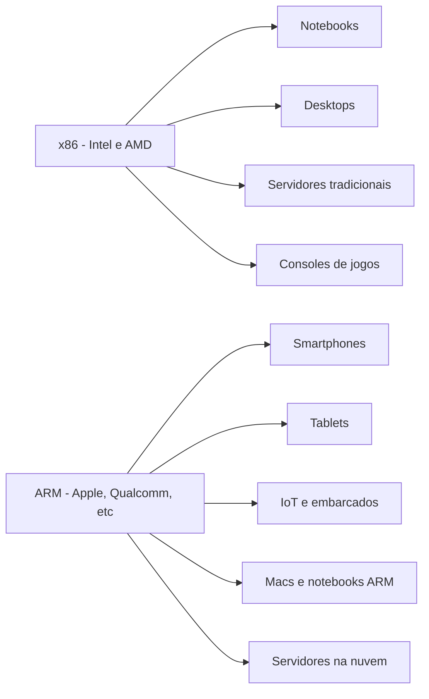
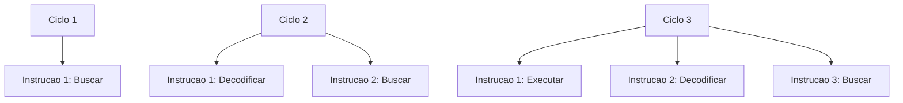
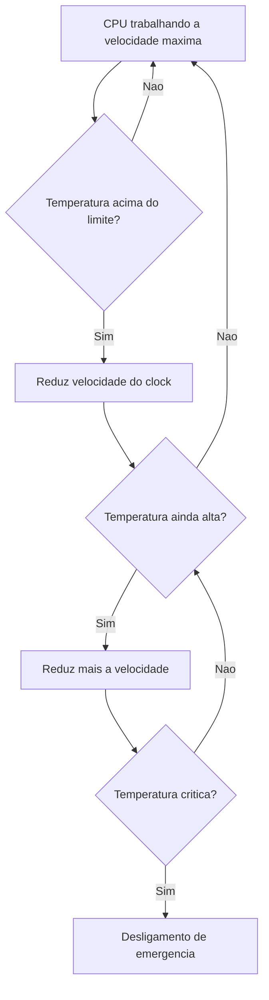

# 1.5 — CPU e Arquiteturas: x86, ARM e o Cérebro do Computador

[← Anterior: Evolução dos Processadores](cap01-mod04-evolucao-processadores.md) · [Próximo: Sistemas Operacionais →](cap01-mod06-sistemas-operacionais.md)

---

## Introdução

No módulo 1.4, acompanhamos a evolução dos processadores — do Intel 4004 com seus 2.300 transistores até os chips modernos com bilhões deles. Vimos como cada geração resolveu um problema da anterior, como a competição entre Intel e AMD beneficiou todo mundo, e como a ARM saiu de computadores educacionais britânicos para dominar o mundo dos smartphones e invadir os desktops.

Agora vamos mudar o foco. Em vez de olhar para a *história* dos processadores, vamos olhar para *como eles funcionam por dentro*. O que acontece quando a CPU executa uma instrução? O que é, afinal, uma "instrução"? Por que um processador de 3 GHz pode ser mais lento que um de 2 GHz? O que são núcleos, threads, cache, pipeline?

Esses conceitos são fundamentais para quem vai programar. Quando seu programa estiver lento, entender como a CPU funciona vai te ajudar a descobrir por quê. Quando você precisar escolher entre um processador com mais núcleos ou mais velocidade, vai saber qual faz mais sentido para o seu caso. E quando ouvir termos como "CISC", "RISC", "IPC" ou "thermal throttling" em uma conversa técnica, vai entender do que estão falando.

Vamos voltar à nossa analogia da cozinha. No módulo 1.1, estabelecemos que a CPU é o cozinheiro — quem executa as receitas (programas). Agora vamos entrar na cozinha e ver *como* esse cozinheiro trabalha, passo a passo.

---

## O Ciclo de Instrução: Como a CPU Realmente Trabalha

Tudo que um computador faz — desde mostrar uma letra na tela até treinar um modelo de inteligência artificial — se resume a um ciclo que a CPU repete bilhões de vezes por segundo. Esse ciclo tem quatro etapas:

1. **Buscar** (Fetch) — a CPU vai até a memória RAM e pega a próxima instrução que precisa executar
2. **Decodificar** (Decode) — a CPU lê a instrução e entende o que ela manda fazer
3. **Executar** (Execute) — a CPU faz o que a instrução pede (somar, comparar, mover dados)
4. **Armazenar** (Store) — a CPU guarda o resultado em algum lugar (um registrador, a memória RAM, etc.)


Esse ciclo é chamado de **ciclo de instrução** (instruction cycle) ou **ciclo fetch-decode-execute**. Vamos entender cada etapa em profundidade.

### Etapa 1: Buscar (Fetch)

A CPU tem um componente interno chamado **PC** (Program Counter, ou Contador de Programa) — não confunda com "PC" de computador pessoal. O Program Counter é como um marcador de página: ele guarda o endereço da próxima instrução que precisa ser executada.

Na etapa de busca, a CPU:
1. Olha o endereço que está no Program Counter
2. Vai até esse endereço na memória RAM
3. Copia a instrução que está lá para dentro da CPU
4. Atualiza o Program Counter para apontar para a próxima instrução

Na analogia da cozinha: é como o cozinheiro olhando a próxima linha da receita. Ele sabe em qual linha parou (Program Counter), vai até o livro de receitas (memória RAM), lê a próxima instrução e marca onde parou.

### Etapa 2: Decodificar (Decode)

A instrução que veio da memória é apenas uma sequência de zeros e uns. A CPU precisa interpretar esses bits para entender o que fazer. Essa interpretação é feita por um componente chamado **decodificador de instruções** (instruction decoder).

O decodificador analisa a instrução e identifica:
- **Qual operação** deve ser feita (somar? comparar? mover dados?)
- **Quais dados** serão usados (quais números? de onde vêm?)
- **Onde guardar** o resultado

Na analogia da cozinha: é como o cozinheiro lendo "bata 3 ovos em uma tigela". Ele precisa entender que a ação é "bater", os ingredientes são "3 ovos" e o destino é "uma tigela". Sem essa interpretação, a instrução é apenas texto sem sentido.

### Etapa 3: Executar (Execute)

Agora a CPU sabe o que fazer e faz. A execução acontece na **ULA** (Unidade Lógica e Aritmética, ou ALU em inglês — Arithmetic Logic Unit). A ULA é o componente que realmente faz os cálculos.

A ULA sabe fazer operações simples:
- **Aritméticas**: somar, subtrair, multiplicar, dividir
- **Lógicas**: comparar dois valores (igual? maior? menor?), operações AND, OR, NOT
- **Deslocamento de bits**: mover bits para a esquerda ou direita (útil para multiplicar e dividir por potências de 2)

Na analogia da cozinha: é o momento em que o cozinheiro realmente bate os ovos. Ele pega os ingredientes, usa a ferramenta certa e executa a ação.

### Etapa 4: Armazenar (Store)

Depois de executar a operação, o resultado precisa ir para algum lugar. Pode ser:
- Um **registrador** (memória minúscula dentro da CPU, extremamente rápida)
- A **memória RAM** (mais lenta, mas com muito mais espaço)
- Uma **flag** (um indicador de status, como "o resultado foi zero" ou "houve overflow")

Na analogia da cozinha: é colocar os ovos batidos na tigela. O resultado da operação precisa ser guardado em algum lugar para ser usado depois.

### O Ciclo Completo em Ação

Vamos ver um exemplo concreto. Imagine que seu programa tem a instrução "some 5 + 3":

| Etapa | O que acontece | Analogia da cozinha |
|-------|---------------|---------------------|
| Buscar | CPU vai ate a RAM e pega a instrução ADD 5, 3 | Cozinheiro le a próxima linha da receita |
| Decodificar | CPU entende: operação = soma, operandos = 5 e 3 | Cozinheiro entende: bater 3 ovos na tigela |
| Executar | ULA calcula 5 + 3 = 8 | Cozinheiro bate os ovos |
| Armazenar | Resultado 8 vai para um registrador | Ovos batidos vao para a tigela |

E esse ciclo inteiro acontece em **frações de nanossegundo**. Um nanossegundo é um bilionésimo de segundo. Para ter uma ideia: a luz percorre apenas 30 centímetros em um nanossegundo. A CPU faz bilhões desses ciclos por segundo.

---

## O que é uma Instrução, Afinal?

Quando falamos que a CPU "executa instruções", o que exatamente é uma instrução? Uma instrução é a menor unidade de trabalho que a CPU entende. É um comando extremamente simples — tão simples que parece inútil sozinho, mas que combinado com bilhões de outros comandos cria tudo que vemos na tela.

### Tipos de Instruções

As instruções que uma CPU entende se dividem em categorias:

| Categoria | O que faz | Exemplos | Analogia |
|-----------|-----------|----------|----------|
| Aritmeticas | Cálculos matematicos | ADD, SUB, MUL, DIV | Somar ingredientes, dividir porcoes |
| Logicas | Comparacoes e decisoes | CMP, AND, OR, NOT | Verificar se o forno esta quente o suficiente |
| Movimentacao | Mover dados entre lugares | MOV, LOAD, STORE | Pegar ingrediente da despensa e colocar na bancada |
| Salto | Pular para outra parte do programa | JMP, JE, JNE | Pular para outra página da receita |
| Controle | Gerenciar o processador | NOP, HALT, INT | Pausar, parar, chamar ajuda |

Vamos ver cada tipo com mais detalhe:

**ADD (somar)**: pega dois valores e soma. Por exemplo, `ADD R1, R2` soma o conteúdo do registrador R1 com o conteúdo do registrador R2 e guarda o resultado em R1.

**CMP (comparar)**: compara dois valores sem modificá-los. Por exemplo, `CMP R1, 10` compara o valor em R1 com 10. O resultado da comparação fica em flags internas (igual, maior, menor).

**MOV (mover)**: copia um valor de um lugar para outro. Por exemplo, `MOV R1, 42` coloca o número 42 no registrador R1. Apesar do nome "mover", na verdade é uma cópia — o valor original não é apagado.

**JMP (saltar)**: muda o fluxo do programa, pulando para outra instrução. Por exemplo, `JMP 200` faz a CPU pular para a instrução no endereço 200 da memória. Isso é fundamental para loops e condicionais.

**JE (saltar se igual)**: pula para outro endereço apenas se a última comparação deu "igual". Combinado com CMP, permite criar decisões: "se X é igual a Y, faça isso; senão, faça aquilo".

### Como um Programa Simples Vira Instruções

Imagine que você escreveu em Python:

```python
# "result" = resultado
# "a" = primeiro numero
# "b" = segundo numero
a = 5
b = 3
result = a + b
```

O computador traduz isso para algo parecido com:

```
MOV R1, 5       -- Coloca 5 no registrador R1 (a = 5)
MOV R2, 3       -- Coloca 3 no registrador R2 (b = 3)
ADD R1, R2      -- Soma R1 + R2, resultado fica em R1 (result = a + b)
STORE R1, [200] -- Guarda o resultado no endereco 200 da memoria
```

Quatro instruções para fazer algo que em Python é uma linha. Isso mostra por que linguagens de programação existem — seria impraticável escrever programas inteiros nesse nível de detalhe. Mas é exatamente isso que a CPU executa por baixo dos panos.

### Registradores: A Memória Mais Rápida que Existe

Você deve ter notado os "R1" e "R2" nos exemplos acima. Esses são **registradores** (registers) — pequenas áreas de memória dentro da própria CPU. São a memória mais rápida que existe em um computador.

| Tipo de memória | Tamanho tipico | Velocidade | Analogia |
|----------------|---------------|------------|----------|
| Registradores | Dezenas de bytes | Instantanea | Ingrediente na mao do cozinheiro |
| Cache L1 | 32-64 KB | Menos de 1 nanossegundo | Ingrediente na bancada ao lado |
| Cache L2 | 256 KB - 1 MB | Poucos nanossegundos | Ingrediente na prateleira próxima |
| Cache L3 | 4-64 MB | Mais nanossegundos | Ingrediente no armario da cozinha |
| RAM | 8-64 GB | Dezenas de nanossegundos | Ingrediente na despensa |
| SSD | 256 GB - 4 TB | Milhares de nanossegundos | Ingrediente no supermercado |

A CPU tem poucos registradores (tipicamente 16 a 32 de uso geral), mas eles são absurdamente rápidos porque estão fisicamente dentro do processador, a nanômetros de distância da ULA. Não há fio, não há barramento — é acesso direto.

---

## Arquitetura do Conjunto de Instruções (ISA)

Agora que você sabe o que são instruções, podemos entender o que é uma **arquitetura de CPU**. O nome técnico é **ISA** (Instruction Set Architecture, ou Arquitetura do Conjunto de Instruções). A ISA define:

- Quais instruções a CPU entende
- Quantos registradores ela tem
- Como os dados são organizados na memória
- Como as instruções são codificadas em binário

Pense na ISA como o "idioma" da CPU. Assim como existem diferentes idiomas humanos (português, inglês, japonês), existem diferentes ISAs. E assim como um texto em português não é entendido por quem só fala japonês, um programa compilado para uma ISA não roda em outra.

### CISC vs RISC: Duas Filosofias Opostas

No módulo 1.4, mencionamos brevemente CISC e RISC quando falamos da origem da ARM. Agora vamos aprofundar, porque essa diferença é fundamental para entender por que existem arquiteturas diferentes.

**CISC** (Complex Instruction Set Computer — Computador com Conjunto de Instruções Complexas) é a filosofia usada pelo x86. A ideia é: "vamos dar à CPU instruções poderosas que fazem muita coisa de uma vez".

**RISC** (Reduced Instruction Set Computer — Computador com Conjunto de Instruções Reduzidas) é a filosofia usada pela ARM. A ideia é: "vamos dar à CPU instruções simples que executam muito rápido".

Vamos usar uma analogia para entender a diferença. Imagine dois restaurantes:

**Restaurante CISC**: o cozinheiro sabe fazer pratos complexos. Você pede "lasanha completa" e ele faz tudo — massa, molho, recheio, montagem, forno — em um único comando. É conveniente, mas cada prato demora mais e o cozinheiro precisa ser muito habilidoso (complexo).

**Restaurante RISC**: o cozinheiro só sabe fazer operações simples — cortar, misturar, aquecer, montar. Para fazer uma lasanha, você precisa dar muitos comandos separados. Mas cada comando é executado muito rápido, e o cozinheiro é mais simples (eficiente).

| Aspecto | CISC - x86 | RISC - ARM |
|---------|-----------|-----------|
| Filosofia | Instruções complexas e poderosas | Instruções simples e rapidas |
| Número de instruções | Centenas a milhares | Dezenas a centenas |
| Tamanho da instrução | Variável, 1 a 15 bytes | Fixo, geralmente 4 bytes |
| Ciclos por instrução | Variável, 1 a muitos | Geralmente 1 ciclo |
| Complexidade do hardware | Alta | Baixa |
| Consumo de energia | Maior | Menor |
| Decodificacao | Complexa e lenta | Simples e rápida |
| Exemplo | Intel Core, AMD Ryzen | Apple M4, Snapdragon, Graviton |

### Por que o Tamanho Fixo da Instrução Importa

Uma diferença técnica que parece pequena mas tem consequências enormes: no RISC, todas as instruções têm o mesmo tamanho (geralmente 4 bytes). No CISC, o tamanho varia de 1 a 15 bytes.

Por que isso importa? Porque quando a CPU precisa buscar a próxima instrução na memória, ela precisa saber onde essa instrução começa. Se todas têm o mesmo tamanho, é fácil — basta somar 4 ao endereço atual. Se o tamanho varia, a CPU precisa primeiro decodificar a instrução atual para saber onde a próxima começa. Isso complica o hardware e gasta energia.

Na analogia da cozinha: imagine que as receitas do restaurante RISC têm todas as instruções em cartões do mesmo tamanho, empilhados. O cozinheiro pega o próximo cartão e pronto. No restaurante CISC, as instruções estão escritas em tiras de papel de tamanhos diferentes — o cozinheiro precisa ler cada tira inteira para saber onde a próxima começa.

### Na Prática: CISC e RISC se Aproximaram

Aqui está algo interessante que a maioria das pessoas não sabe: processadores x86 modernos (Intel e AMD) são, por dentro, mais parecidos com RISC do que com CISC.

O que acontece é o seguinte: o processador recebe instruções CISC complexas, mas internamente as quebra em micro-operações simples (chamadas **micro-ops** ou **uops**) que são executadas por um núcleo RISC interno. É como se o restaurante CISC tivesse um recepcionista que recebe pedidos complexos ("lasanha completa") e os traduz em comandos simples para os cozinheiros internos ("cortar", "misturar", "aquecer").

Da mesma forma, processadores ARM modernos adicionaram instruções mais complexas para melhorar a performance em certas tarefas. A linha entre CISC e RISC ficou borrada.

| Realidade moderna | x86 | ARM |
|-------------------|-----|-----|
| Interface externa | CISC, instruções complexas | RISC, instruções simples |
| Execução interna | Micro-ops simples, estilo RISC | Instruções simples, mas com extensões |
| Resultado | Compatibilidade com software antigo | Eficiência energetica com boa performance |

---

## x86 e ARM: As Duas Arquiteturas que Dominam o Mundo

Agora que você entende a diferença entre CISC e RISC, vamos ver as duas arquiteturas mais importantes do mundo atual em detalhe.

### x86 (e x86-64)

A arquitetura x86 foi criada pela Intel em 1978 com o processador 8086 (como vimos no módulo 1.4). O nome "x86" vem da família de processadores 8086, 80186, 80286, 80386, 80486 — todos terminando em "86".

Em 2003, a AMD estendeu o x86 para 64 bits, criando o **x86-64** (também chamado AMD64 ou x64). Hoje, quando alguém fala "x86", geralmente se refere à versão de 64 bits.

Onde o x86 domina:
- Notebooks e desktops (Intel Core, AMD Ryzen)
- Servidores (Intel Xeon, AMD EPYC)
- Consoles de videogame (PlayStation 5 e Xbox Series usam AMD)
- Estações de trabalho profissionais

A grande vantagem do x86 é a **compatibilidade de software**. Décadas de programas foram escritos para x86. Sistemas operacionais, jogos, ferramentas profissionais — tudo funciona. Essa base instalada é tão grande que mesmo com as vantagens do ARM, muitas empresas continuam no x86 porque migrar todo o software seria caro e arriscado.

### ARM

A arquitetura ARM foi criada pela Acorn Computers na Inglaterra em 1983 (como vimos no módulo 1.4). O nome original era "Acorn RISC Machine", depois mudou para "Advanced RISC Machine".

A ARM Holdings não fábrica processadores — ela projeta a arquitetura e licencia para outras empresas. Isso criou um ecossistema enorme:

| Empresa | Chip ARM | Onde e usado |
|---------|----------|-------------|
| Apple | A-series e M-series | iPhones, iPads, Macs |
| Qualcomm | Snapdragon | Celulares Android, notebooks Windows |
| Samsung | Exynos | Celulares Samsung em alguns mercados |
| MediaTek | Dimensity | Celulares Android acessiveis |
| Amazon | Graviton | Servidores na nuvem AWS |
| Nvidia | Grace | Servidores para IA |
| Fujitsu | A64FX | Supercomputador Fugaku |
| Ampere | Altra | Servidores na nuvem |

Onde o ARM domina:
- Smartphones (praticamente 100% do mercado mundial)
- Tablets
- Dispositivos IoT (Internet das Coisas)
- Macs da Apple (desde 2020)
- Servidores na nuvem (crescendo rapidamente)

A grande vantagem do ARM é a **eficiência energética**. Processadores ARM fazem mais trabalho por watt de energia consumido. Isso é crucial para dispositivos com bateria (celulares, notebooks) e para data centers onde a conta de energia é enorme.

### Comparação Direta



| Caracteristica | x86 | ARM |
|---------------|-----|-----|
| Foco | Potência máxima e compatibilidade | Eficiência energetica |
| Filosofia | CISC | RISC |
| Consumo de energia | Alto a moderado | Baixo |
| Performance por watt | Boa | Excelente |
| Compatibilidade de software | Enorme, decadas de programas | Crescendo, mas ainda menor |
| Fabricantes de chips | Intel e AMD | Dezenas de empresas licenciadas |
| Custo de licenciamento | Intel e AMD fabricam e vendem | ARM licencia, outros fabricam |
| Mercado dominante | PCs e servidores tradicionais | Mobile e dispositivos portateis |

### RISC-V: O Novato Promissor

Além de x86 e ARM, existe uma terceira arquitetura que está ganhando atenção: **RISC-V** (pronuncia-se "RISC five"). Criada na Universidade da Califórnia em Berkeley em 2010, a RISC-V é uma arquitetura **aberta e gratuita** — qualquer empresa pode usá-la sem pagar licença.

Isso é revolucionário porque tanto x86 quanto ARM exigem licenciamento pago. A RISC-V permite que empresas e universidades criem seus próprios processadores sem custos de propriedade intelectual.

A RISC-V ainda está nos estágios iniciais para uso em computadores pessoais, mas já é usada em microcontroladores, dispositivos IoT e está sendo adotada por empresas como a China, que quer reduzir sua dependência de tecnologias americanas (x86 da Intel/AMD) e britânicas (ARM).

### Por que Arquitetura Importa para Programadores?

Quando você escreve um programa, ele precisa ser traduzido para as instruções que a CPU entende. Essa tradução pode acontecer de duas formas:

**Compilação**: o programa inteiro é traduzido de uma vez para instruções da CPU. Linguagens como C, C++ e Rust funcionam assim. Um programa compilado para x86 **não roda** em ARM, e vice-versa — você precisa compilar separadamente para cada arquitetura.

**Interpretação**: um programa intermediário (o interpretador) lê seu código linha por linha e traduz na hora. Linguagens como Python e JavaScript funcionam assim. O interpretador cuida da tradução, então seu código Python roda em x86 e ARM sem mudanças — desde que o interpretador esteja instalado.

| Abordagem | Linguagens | Precisa recompilar para cada arquitetura? | Performance |
|-----------|-----------|------------------------------------------|-------------|
| Compilada | C, C++, Rust, Go | Sim | Alta |
| Interpretada | Python, JavaScript, Ruby | Não, o interpretador cuida | Menor |
| Hibrida | Java, C# | Parcialmente, usa máquina virtual | Media a alta |

No capítulo 5, quando você programar em Python, não vai precisar se preocupar com arquitetura — o interpretador Python cuida de tudo. Mas no capítulo 6, quando programar em C, vai compilar seu código e entender na prática o que significa "compilar para uma arquitetura".

---

## Velocidade do Clock: Por que GHz Não é Tudo

Quando você olha as especificações de um processador, uma das primeiras coisas que vê é a velocidade em **GHz** (Gigahertz). Mas o que isso realmente significa?

### O que é o Clock

Dentro de toda CPU existe um componente chamado **clock** (relógio). Ele gera pulsos elétricos em intervalos regulares — como um metrônomo que marca o ritmo para uma orquestra. Cada pulso é um **ciclo de clock**.

A velocidade do clock é medida em **Hertz** (Hz):
- **1 Hz** = 1 ciclo por segundo
- **1 MHz** (Megahertz) = 1 milhão de ciclos por segundo
- **1 GHz** (Gigahertz) = 1 bilhão de ciclos por segundo

Um processador de 4 GHz gera 4 bilhões de pulsos por segundo. Cada pulso sincroniza as operações internas da CPU — é como o "tique-taque" que mantém tudo funcionando em ordem.

Na analogia da cozinha: o clock é como o ritmo de trabalho do cozinheiro. Um cozinheiro que trabalha a "4 GHz" faz 4 bilhões de movimentos por segundo. Mas a velocidade dos movimentos não é tudo — o que importa é quanto trabalho útil cada movimento produz.

### IPC: Instruções Por Ciclo

Aqui está o conceito que explica por que GHz não é tudo: **IPC** (Instructions Per Cycle, ou Instruções Por Ciclo). O IPC mede quantas instruções a CPU consegue completar em cada ciclo de clock.

Um processador com IPC alto faz mais trabalho em cada ciclo. Um processador com IPC baixo precisa de mais ciclos para fazer o mesmo trabalho.

A performance real de um processador é:

**Performance = Velocidade do Clock x IPC**

Vamos ver um exemplo com números:

| Processador | Clock | IPC | Instruções por segundo |
|-------------|-------|-----|----------------------|
| Processador A | 4 GHz | 2 IPC | 8 bilhoes |
| Processador B | 3 GHz | 4 IPC | 12 bilhoes |

O Processador B é mais lento em GHz (3 vs 4), mas faz mais trabalho por ciclo (4 vs 2 IPC). No total, o Processador B executa 50% mais instruções por segundo. É como comparar dois cozinheiros: um faz movimentos rápidos mas pouco produtivos, enquanto o outro faz movimentos mais lentos mas cada um produz mais resultado.

### Por que a Intel Aprendeu Isso da Pior Forma

Lembra do Pentium 4 que vimos no módulo 1.4? A Intel apostou em velocidades de clock altíssimas (até 3.8 GHz), mas com IPC baixo por causa do pipeline muito longo. O resultado: um Pentium 4 a 3.8 GHz era mais lento em muitas tarefas que um AMD Athlon 64 a 2.4 GHz, porque o Athlon tinha IPC muito maior.

Essa lição mudou a indústria. Desde então, os fabricantes focam em melhorar o IPC (fazer mais trabalho por ciclo) em vez de apenas aumentar o clock. Cada nova geração de processadores Intel e AMD traz melhorias de IPC de 10-20%, mesmo que a velocidade de clock não mude muito.

### Turbo Boost e Velocidade Dinâmica

Processadores modernos não rodam sempre na mesma velocidade. Eles têm uma velocidade base e uma velocidade máxima (turbo):

| Especificacao | Significado | Exemplo |
|--------------|-------------|---------|
| Clock base | Velocidade normal de operação | 3.0 GHz |
| Clock turbo | Velocidade máxima por curtos periodos | 5.0 GHz |

Quando você está fazendo algo leve (navegando na internet), o processador roda na velocidade base para economizar energia. Quando precisa de mais potência (compilando código, jogando), ele aumenta automaticamente para a velocidade turbo. Mas não consegue manter o turbo por muito tempo porque gera calor demais.

A Intel chama isso de **Turbo Boost**. A AMD chama de **Precision Boost**. O conceito é o mesmo: velocidade dinâmica que se adapta à demanda.

---

## Pipeline: A Linha de Montagem da CPU

Uma das inovações mais importantes na história dos processadores é o **pipeline** (linha de montagem). Vimos no módulo 1.4 que o 486 introduziu o pipeline de 5 estágios. Agora vamos entender em profundidade como isso funciona e por que faz tanta diferença.

### O Problema Sem Pipeline

Sem pipeline, a CPU faz uma coisa de cada vez. Ela busca uma instrução, decodifica, executa, armazena o resultado, e só então começa a buscar a próxima instrução. Cada instrução precisa esperar a anterior terminar completamente.

Na analogia da cozinha: imagine um cozinheiro que só faz uma coisa de cada vez. Ele pega o ingrediente, prepara, cozinha, serve, e só então começa o próximo prato. Enquanto está cozinhando, a bancada de preparo fica vazia. Enquanto está servindo, o fogão fica vazio. Muito desperdício.

### A Solução: Linha de Montagem

O pipeline divide o trabalho em estágios, e cada estágio trabalha em uma instrução diferente ao mesmo tempo. Enquanto a instrução 1 está sendo executada, a instrução 2 está sendo decodificada e a instrução 3 está sendo buscada.



Na analogia da cozinha: agora imagine uma linha de montagem com três cozinheiros. O primeiro só prepara ingredientes. O segundo só cozinha. O terceiro só monta e serve. Enquanto o terceiro está servindo o prato 1, o segundo está cozinhando o prato 2 e o primeiro está preparando o prato 3. Todos trabalham ao mesmo tempo, cada um em um prato diferente.

### Ganho de Performance

Sem pipeline, cada instrução leva 4 ciclos (buscar + decodificar + executar + armazenar). Com pipeline de 4 estágios, depois que o pipeline está cheio, sai uma instrução pronta a cada ciclo.

| Ciclo | Sem pipeline | Com pipeline de 4 estagios |
|-------|-------------|---------------------------|
| 1 | Instrução 1: Buscar | Instrução 1: Buscar |
| 2 | Instrução 1: Decodificar | Instrução 1: Decodificar + Instrução 2: Buscar |
| 3 | Instrução 1: Executar | Instrução 1: Executar + Instrução 2: Decodificar + Instrução 3: Buscar |
| 4 | Instrução 1: Armazenar | Instrução 1: Armazenar + Instrução 2: Executar + Instrução 3: Decodificar + Instrução 4: Buscar |
| 5 | Instrução 2: Buscar | Instrução 2: Armazenar + Instrução 3: Executar + Instrução 4: Decodificar + Instrução 5: Buscar |

Sem pipeline: 4 instruções em 16 ciclos. Com pipeline: 4 instruções em 7 ciclos (4 para encher o pipeline + 1 por instrução adicional). Quase o dobro de velocidade.

### O Problema dos Desvios (Branch Hazards)

O pipeline funciona perfeitamente quando as instruções são sequenciais. Mas o que acontece quando o programa tem uma decisão? Por exemplo: "se X > 10, vá para a linha 50; senão, continue na linha 20".

Quando a CPU encontra essa decisão, ela ainda não sabe qual caminho seguir (precisa executar a comparação primeiro). Mas o pipeline já começou a buscar as próximas instruções. Se buscou as instruções erradas, precisa descartar tudo e recomeçar — isso se chama **pipeline flush** (esvaziamento do pipeline) e desperdiça ciclos.

A solução é a **predição de desvio** (branch prediction): a CPU tenta adivinhar qual caminho será tomado e já começa a executar. Processadores modernos acertam mais de 95% das vezes, usando algoritmos sofisticados que aprendem com o histórico de decisões anteriores.

Na analogia da cozinha: é como o cozinheiro que, ao ver que o cliente pediu entrada, já começa a preparar o prato principal mais popular — porque 95% das vezes é o que o cliente pede. Se errar, descarta e prepara o correto. Mas na maioria das vezes, ganha tempo.

### Pipelines Modernos

Processadores modernos têm pipelines muito mais longos que os 4-5 estágios do exemplo:

| Processador | Estagios do pipeline |
|-------------|---------------------|
| Intel 486 | 5 estagios |
| Pentium | 5 estagios |
| Pentium 4 | 20 a 31 estagios |
| Intel Core moderno | 14 a 19 estagios |
| Apple M4 | Estimado 12 a 16 estagios |

Pipelines mais longos permitem velocidades de clock mais altas (cada estágio faz menos trabalho, então pode ser mais rápido). Mas pipelines muito longos desperdiçam mais trabalho quando a predição de desvio erra — foi exatamente o problema do Pentium 4.

O equilíbrio ideal está em pipelines de comprimento moderado (14-19 estágios) com predição de desvio muito precisa. É o que os processadores modernos fazem.

---

## Núcleos (Cores): Vários Cérebros em um Chip

No módulo 1.4, vimos que a era dos múltiplos núcleos começou com o Core 2 Duo em 2006, quando a Intel percebeu que aumentar o clock gerava calor demais. A solução foi colocar vários processadores independentes dentro do mesmo chip. Cada um desses processadores é chamado de **núcleo** (core).

### Como Múltiplos Núcleos Funcionam

Cada núcleo é um processador completo e independente, com seu próprio:
- Ciclo de instrução (fetch-decode-execute-store)
- Pipeline
- Registradores
- Cache L1 e L2 (geralmente)

Os núcleos compartilham:
- Cache L3
- Controlador de memória (acesso à RAM)
- Barramento de dados

Na analogia da cozinha: ter 4 núcleos é como ter 4 cozinheiros na mesma cozinha. Cada um tem sua própria bancada (cache L1/L2) e seus próprios utensílios (registradores), mas todos compartilham a despensa (RAM) e a geladeira (cache L3).

### Quantos Núcleos Fazem Diferença?

A resposta depende do que você está fazendo. Nem todas as tarefas conseguem usar vários núcleos ao mesmo tempo.

**Tarefas single-threaded** (usam 1 núcleo): a maioria dos programas simples, jogos antigos, scripts Python básicos, navegação web simples. Para essas tarefas, ter 16 núcleos não ajuda — é como ter 16 cozinheiros, mas só um tem receita para seguir.

**Tarefas multi-threaded** (usam vários núcleos): compilação de código, edição de vídeo, renderização 3D, servidores web atendendo muitos usuários, treinamento de IA. Para essas tarefas, mais núcleos significam mais trabalho feito ao mesmo tempo.

| Tarefa | Nucleos usados | Mais nucleos ajuda? |
|--------|---------------|---------------------|
| Navegar na internet | 1-2 | Pouco |
| Editar texto e documentos | 1 | Não |
| Compilar código grande | Todos disponiveis | Muito |
| Editar video | Todos disponiveis | Muito |
| Jogar jogos modernos | 4-8 | Sim, ate certo ponto |
| Rodar servidor web | Todos disponiveis | Muito |
| Treinar modelo de IA | Todos disponiveis | Muito |
| Programar no dia a dia | 2-4 | Moderado |

Para programadores no dia a dia, 4 a 8 núcleos são mais que suficientes. Você vai usar múltiplos núcleos quando estiver compilando código, rodando testes automatizados ou executando vários programas ao mesmo tempo (editor de código + navegador + terminal + banco de dados).

### Escalabilidade: A Lei de Amdahl

Existe um limite para o quanto múltiplos núcleos podem acelerar um programa. Esse limite é descrito pela **Lei de Amdahl** (formulada por Gene Amdahl em 1967).

A ideia é simples: se 50% do seu programa precisa rodar em sequência (não pode ser paralelizado), então mesmo com infinitos núcleos, o máximo de aceleração que você consegue é 2x. A parte sequencial é o gargalo.

Na analogia da cozinha: se uma receita exige que o bolo asse por 30 minutos no forno, não importa quantos cozinheiros você tenha — o bolo ainda vai levar 30 minutos. Você pode paralelizar a preparação dos ingredientes, mas não pode paralelizar o tempo de forno.

| Parte paralelizavel do programa | Aceleracao máxima com nucleos infinitos |
|--------------------------------|---------------------------------------|
| 50% | 2x |
| 75% | 4x |
| 90% | 10x |
| 95% | 20x |
| 99% | 100x |

Isso explica por que simplesmente adicionar mais núcleos não resolve tudo. O programa precisa ser escrito para aproveitar múltiplos núcleos — e isso é uma das partes mais difíceis da programação. Vamos tocar nesse assunto quando chegarmos ao capítulo 5 (Python) e especialmente no capítulo 8 (C#), onde veremos conceitos de programação concorrente.

---

## Threads e Hyper-Threading

### O que é uma Thread

Uma **thread** (fio de execução) é uma sequência de instruções que a CPU executa. Cada programa tem pelo menos uma thread. Programas mais complexos podem ter várias threads rodando ao mesmo tempo.

Na analogia da cozinha: se o núcleo é o cozinheiro, a thread é a tarefa que ele está executando. Um cozinheiro pode estar fazendo uma tarefa (uma thread) ou alternando entre duas tarefas (duas threads).

### Hyper-Threading (SMT)

A Intel criou uma tecnologia chamada **Hyper-Threading** (HT), e a AMD tem uma equivalente chamada **SMT** (Simultaneous Multi-Threading). A ideia é fazer cada núcleo físico parecer dois núcleos para o sistema operacional.

Como funciona: quando uma thread está esperando dados da memória (o que acontece frequentemente — a RAM é muito mais lenta que a CPU), o núcleo ficaria ocioso. Com Hyper-Threading, o núcleo pode executar instruções de outra thread enquanto a primeira espera. Isso melhora o aproveitamento do núcleo.

Na analogia da cozinha: é como um cozinheiro que, enquanto espera a água ferver para o prato 1, começa a cortar os ingredientes do prato 2. Ele não está fazendo dois pratos ao mesmo tempo de verdade — está alternando entre eles nos momentos de espera.

| Conceito | Nucleos fisicos | Threads por nucleo | Threads totais |
|----------|----------------|-------------------|---------------|
| Sem Hyper-Threading | 4 | 1 | 4 |
| Com Hyper-Threading | 4 | 2 | 8 |
| Sem Hyper-Threading | 8 | 1 | 8 |
| Com Hyper-Threading | 8 | 2 | 16 |

Hyper-Threading não dobra a performance — o ganho típico é de 15-30%, dependendo da tarefa. Mas é "de graça" em termos de hardware (não precisa de mais núcleos físicos), então é uma otimização que vale a pena.

Quando você vê nas especificações "8 núcleos / 16 threads", significa 8 núcleos físicos com Hyper-Threading, totalizando 16 threads simultâneas.

---

## A Cache: Memória Ultra-Rápida Dentro da CPU

A cache é um dos componentes mais importantes para a performance de um processador, mas é frequentemente ignorada nas comparações. Vamos entender em profundidade por que ela existe e como funciona.

### O Problema: A RAM é Lenta

Parece estranho dizer que a RAM é "lenta" — afinal, ela é muito mais rápida que um SSD. Mas comparada à velocidade da CPU, a RAM é extremamente lenta.

Uma CPU moderna pode executar uma instrução em menos de 1 nanossegundo. Mas buscar um dado na RAM leva 50-100 nanossegundos. Isso significa que, sem cache, a CPU ficaria parada esperando dados da RAM durante 98% do tempo. É como um cozinheiro que prepara cada ingrediente em 1 segundo, mas precisa esperar 100 segundos toda vez que vai buscar algo na despensa.

### A Solução: Hierarquia de Cache

A cache resolve esse problema guardando cópias dos dados mais usados em memórias pequenas mas ultra-rápidas dentro da CPU. A cache é organizada em níveis (L1, L2, L3), cada um maior e um pouco mais lento que o anterior:

| Nível | Tamanho tipico | Latencia | Onde fica | Compartilhamento |
|-------|---------------|----------|-----------|-----------------|
| L1 | 32-64 KB por nucleo | Menos de 1 ns | Dentro de cada nucleo | Privada por nucleo |
| L2 | 256 KB - 1 MB por nucleo | 3-10 ns | Dentro ou próximo ao nucleo | Privada por nucleo |
| L3 | 4-64 MB total | 10-30 ns | No chip, fora dos nucleos | Compartilhada entre nucleos |
| RAM | 8-64 GB | 50-100 ns | Fora do chip, na placa mae | Compartilhada por tudo |

Na analogia da cozinha expandida:
- **L1** = ingrediente na mão do cozinheiro (instantâneo)
- **L2** = ingrediente na bancada ao lado (1 passo)
- **L3** = ingrediente no armário da cozinha (alguns passos)
- **RAM** = ingrediente na despensa do restaurante (precisa sair da cozinha)
- **SSD** = ingrediente no supermercado (precisa sair do restaurante)

### Cache Hit vs Cache Miss

Quando a CPU precisa de um dado, ela procura primeiro na L1. Se encontrar, é um **cache hit** (acerto de cache) — rápido e eficiente. Se não encontrar, procura na L2, depois na L3, e finalmente na RAM. Cada nível que precisa consultar adiciona latência.

Um **cache miss** (erro de cache) acontece quando o dado não está em nenhum nível de cache e precisa ser buscado na RAM. Isso é caro em termos de tempo.

| Evento | Latencia aproximada | Analogia |
|--------|-------------------|----------|
| Cache hit L1 | Menos de 1 ns | Ingrediente ja esta na mao |
| Cache hit L2 | 3-10 ns | Ingrediente esta na bancada ao lado |
| Cache hit L3 | 10-30 ns | Ingrediente esta no armario da cozinha |
| Cache miss, vai para RAM | 50-100 ns | Precisa ir ate a despensa |

Processadores modernos têm taxas de acerto de cache L1 acima de 95%. Isso significa que 95% das vezes, o dado que a CPU precisa já está na cache mais rápida. Essa taxa alta é possível porque programas tendem a acessar os mesmos dados repetidamente (princípio da **localidade temporal**) e dados próximos na memória (princípio da **localidade espacial**).

### Por que Cache Importa para Programadores

Quando você escreve código, a forma como organiza os dados pode afetar drasticamente a performance por causa da cache. Dados organizados sequencialmente na memória (como arrays) são muito mais rápidos de acessar do que dados espalhados (como listas encadeadas), porque a cache carrega blocos contíguos de memória.

Isso é um conceito avançado que vamos explorar no capítulo 6 (C e memória), mas é bom saber desde já: a cache é uma das razões pelas quais a escolha da estrutura de dados importa tanto para performance.

---

## GPU: O Processador de Milhares de Núcleos

No módulo 1.4, mencionamos a GPU brevemente. Agora vamos entender em profundidade como ela funciona e por que é tão diferente da CPU.

### CPU vs GPU: Filosofias Opostas

A CPU é projetada para fazer **poucas tarefas complexas** muito rápido. Ela tem poucos núcleos (4-24), mas cada núcleo é extremamente poderoso, com pipeline sofisticado, predição de desvio avançada e cache grande.

A GPU é projetada para fazer **muitas tarefas simples** ao mesmo tempo. Ela tem milhares de núcleos, mas cada núcleo é muito mais simples que um núcleo de CPU.

| Caracteristica | CPU | GPU |
|---------------|-----|-----|
| Nucleos | 4-24, complexos | Milhares, simples |
| Clock por nucleo | 3-5 GHz | 1-2 GHz |
| Cache por nucleo | Grande | Pequena |
| Tipo de tarefa ideal | Tarefas variadas e complexas | Muitas tarefas identicas e simples |
| Predicao de desvio | Sofisticada | Mínima ou inexistente |
| Consumo de energia | 65-125W tipico | 150-450W tipico |

Na analogia da cozinha: a CPU é como ter 8 chefs experientes que sabem fazer qualquer prato complexo. A GPU é como ter 5.000 ajudantes que só sabem fazer uma coisa (cortar legumes, por exemplo), mas fazem isso incrivelmente rápido porque trabalham todos ao mesmo tempo.

### Por que a GPU Foi Criada

A GPU (Graphics Processing Unit — Unidade de Processamento Gráfico) foi criada originalmente para renderizar gráficos. Quando você joga um jogo, cada frame (quadro) da tela é composto por milhões de pixels. Cada pixel precisa ter sua cor calculada com base na iluminação, texturas, sombras e posição dos objetos 3D.

O cálculo de cada pixel é relativamente simples (multiplicações de matrizes, interpolações), mas precisa ser feito para milhões de pixels, 60 vezes por segundo. A CPU não consegue fazer isso sozinha — ela é boa em tarefas complexas, não em milhões de tarefas simples. A GPU foi projetada exatamente para isso.

### GPU e Inteligência Artificial

A grande revolução da GPU veio quando pesquisadores perceberam que treinar modelos de IA envolve exatamente o mesmo tipo de cálculo que renderizar gráficos: milhões de multiplicações de matrizes simples, feitas em paralelo.

Treinar um modelo como o ChatGPT envolve ajustar bilhões de parâmetros, cada ajuste sendo uma operação matemática simples. Uma CPU faria isso em meses. Milhares de GPUs trabalhando em paralelo fazem em semanas.

| Tarefa | CPU | GPU | Diferença |
|--------|-----|-----|-----------|
| Treinar modelo de IA grande | Meses | Dias a semanas | 10-100x mais rápido na GPU |
| Renderizar cena 3D complexa | Segundos a minutos | Milissegundos | 100-1000x mais rápido na GPU |
| Processar planilha Excel | Milissegundos | Não se aplica | CPU e melhor |
| Compilar código | Segundos | Não se aplica | CPU e melhor |

### CUDA e Compute Shaders

Para usar a GPU para cálculos que não são gráficos (como IA), a Nvidia criou o **CUDA** (Compute Unified Device Architecture) em 2007. CUDA é uma plataforma que permite programadores escreverem código que roda na GPU.

Antes do CUDA, a GPU só servia para gráficos. Depois do CUDA, a GPU se tornou um processador de propósito geral para cálculos paralelos. Isso é chamado de **GPGPU** (General-Purpose computing on Graphics Processing Units — Computação de Propósito Geral em GPUs).

A AMD tem uma alternativa chamada **ROCm**, e existe um padrão aberto chamado **OpenCL** que funciona em GPUs de qualquer fabricante. Mas na prática, CUDA da Nvidia domina o mercado de IA porque tem mais ferramentas, mais bibliotecas e mais suporte da comunidade.

### Fabricantes de GPU

| Fabricante | Linha principal | Foco | Mercado |
|-----------|----------------|------|---------|
| Nvidia | GeForce, RTX, Tesla, H100 | Jogos e IA | Lider em IA e jogos |
| AMD | Radeon, Instinct | Jogos e computacao | Alternativa competitiva |
| Intel | Arc, Gaudi | Jogos e IA | Entrante recente |
| Apple | GPU integrada nos chips M | Uso geral | Integrada nos Macs |

A Nvidia é a empresa mais valiosa do mundo em 2024, em grande parte por causa da demanda explosiva por GPUs para treinar modelos de IA. Seus chips H100 e H200 são tão disputados que empresas fazem fila para comprá-los.

---

## TPU e NPU: Processadores Especializados para IA

Se a GPU é boa para IA, por que não criar um processador feito *exclusivamente* para IA? Essa é a ideia por trás dos TPUs e NPUs.

### TPU (Tensor Processing Unit)

O **TPU** (Tensor Processing Unit — Unidade de Processamento de Tensores) foi criado pelo Google em 2016. Um **tensor** é uma estrutura matemática (basicamente uma matriz multidimensional) que é a base dos cálculos de redes neurais.

O TPU é otimizado para fazer multiplicações de tensores com eficiência máxima. Ele não serve para jogos, não serve para edição de vídeo — só serve para IA. Mas para IA, é extremamente eficiente.

| Caracteristica | CPU | GPU | TPU |
|---------------|-----|-----|-----|
| Proposito | Geral | Gráficos e cálculos paralelos | Exclusivamente IA |
| Flexibilidade | Máxima | Alta | Baixa |
| Eficiência para IA | Baixa | Alta | Máxima |
| Quem fábrica | Intel, AMD | Nvidia, AMD | Google |
| Disponibilidade | Qualquer computador | Qualquer computador com placa de video | Apenas na nuvem do Google |

### NPU (Neural Processing Unit)

O **NPU** (Neural Processing Unit — Unidade de Processamento Neural) é uma versão menor e mais eficiente do conceito de processador para IA, projetada para ser integrada dentro de chips de celulares e notebooks.

Processadores modernos como o Apple M4, Qualcomm Snapdragon X Elite e Intel Core Ultra já incluem NPUs. Elas são usadas para tarefas de IA que rodam localmente no seu dispositivo:

- Reconhecimento facial para desbloquear o celular
- Melhorar fotos automaticamente (modo noturno, desfoque de fundo)
- Transcrição de voz em tempo real
- Tradução offline
- Recursos de IA generativa local

| Chip | NPU incluida | TOPS estimados |
|------|-------------|---------------|
| Apple M4 | Sim, Neural Engine 16 nucleos | 38 TOPS |
| Qualcomm Snapdragon X Elite | Sim, Hexagon NPU | 45 TOPS |
| Intel Core Ultra | Sim, Intel AI Boost | 10-34 TOPS |
| AMD Ryzen AI | Sim, XDNA NPU | 16-50 TOPS |

**TOPS** (Tera Operations Per Second — Trilhões de Operações Por Segundo) é a unidade usada para medir a capacidade de processamento de IA de uma NPU.

A tendência é clara: no futuro, todo processador terá uma NPU integrada, assim como hoje todo processador tem uma GPU integrada. IA está se tornando uma capacidade básica do hardware.

---

## Thermal Throttling: Quando o Calor Limita a Performance

Processadores geram calor quando trabalham. Quanto mais rápido trabalham, mais calor geram. E quando a temperatura sobe demais, coisas ruins acontecem.

### O que é Thermal Throttling

**Thermal throttling** (limitação térmica) é quando o processador reduz automaticamente sua velocidade para evitar superaquecimento. É um mecanismo de proteção — sem ele, o processador poderia se danificar permanentemente.

Na analogia da cozinha: é como um cozinheiro que precisa desacelerar porque a cozinha está quente demais. Se ele continuar no ritmo máximo, pode se queimar ou causar um incêndio. Então ele reduz o ritmo até a temperatura baixar.

### Como Funciona

Todo processador tem sensores de temperatura internos. Quando a temperatura atinge um limite (geralmente 90-100 graus Celsius), o processador:

1. Reduz a velocidade do clock (de 4.5 GHz para 3 GHz, por exemplo)
2. Se a temperatura continuar subindo, reduz mais
3. Em casos extremos, desliga completamente para se proteger



### Por que Cooling Importa

O sistema de refrigeração (cooling) do computador determina quanto tempo o processador consegue manter sua velocidade máxima. Existem vários tipos:

| Tipo de cooling | Como funciona | Eficiência | Barulho | Custo |
|----------------|---------------|------------|---------|-------|
| Passivo, sem ventilador | Dissipa calor por conducao | Baixa | Silencioso | Baixo |
| Cooler de ar com ventilador | Ventilador sopra ar no dissipador | Media a alta | Moderado | Baixo a medio |
| Water cooling, refrigeracao liquida | Liquido circula levando calor embora | Alta | Baixo a moderado | Alto |
| Cooling industrial, data centers | Sistemas dedicados de refrigeracao | Máxima | Não se aplica | Muito alto |

Notebooks finos como o MacBook Air usam cooling passivo (sem ventilador). Isso significa que sob carga pesada prolongada, o processador vai sofrer thermal throttling. Notebooks mais grossos como o MacBook Pro têm ventiladores que permitem manter a velocidade alta por mais tempo.

Para programadores, isso importa quando você faz tarefas pesadas como compilar projetos grandes ou rodar testes extensivos. Se seu notebook está esquentando e ficando lento, provavelmente é thermal throttling em ação.

### TDP: Thermal Design Power

O **TDP** (Thermal Design Power — Potência Térmica de Projeto) é um número em watts que indica quanta energia (e calor) o processador consome sob carga típica. É usado para dimensionar o sistema de refrigeração.

| Processador | TDP | Tipo de cooling necessário |
|-------------|-----|--------------------------|
| Intel Core i5 de notebook | 15-28W | Cooler fino de notebook |
| Intel Core i7 de desktop | 65-125W | Cooler de ar medio ou water cooling |
| Intel Core i9 de desktop | 125-253W | Water cooling recomendado |
| Apple M4 | 10-22W | Passivo ou ventilador pequeno |
| AMD Ryzen 9 de desktop | 120-170W | Cooler de ar grande ou water cooling |

Note como os chips ARM (Apple M4) têm TDP muito menor que os x86 equivalentes. Essa é a vantagem da eficiência energética do ARM — menos calor, menos necessidade de refrigeração, mais silêncio, mais duração de bateria.

---

## Benchmarks: Medindo Performance de Verdade

Se GHz não conta toda a história, como saber qual processador é realmente mais rápido? A resposta são os **benchmarks** — testes padronizados que medem a performance real.

### O que é um Benchmark

Um **benchmark** (referência de desempenho) é um programa que executa uma série de tarefas padronizadas e mede quanto tempo o processador leva para completá-las. Como todos os processadores executam as mesmas tarefas, os resultados são comparáveis.

Na analogia da cozinha: é como uma competição onde todos os cozinheiros precisam preparar os mesmos 10 pratos. O que terminar primeiro (com qualidade) vence. Não importa se um cozinheiro tem facas mais caras ou fogão mais bonito — o que importa é o resultado final.

### Tipos de Benchmark

| Tipo | O que mede | Exemplo | Quando importa |
|------|-----------|---------|----------------|
| Single-core | Performance de 1 nucleo | Geekbench Single-Core | Programas que usam 1 nucleo |
| Multi-core | Performance de todos os nucleos | Geekbench Multi-Core | Programas que usam vários nucleos |
| Sintetico | Tarefas artificiais padronizadas | Cinebench, 3DMark | Comparação geral |
| Real-world | Tarefas reais do dia a dia | PCMark, compilação de código | Uso prático |
| Específico | Uma tarefa específica | Blender render, compilação do kernel Linux | Uso profissional |

### Single-Core vs Multi-Core

Essa distinção é crucial. Um processador pode ter pontuação multi-core altíssima (muitos núcleos) mas pontuação single-core mediana (cada núcleo individual não é tão rápido).

Para programadores no dia a dia, a pontuação **single-core** geralmente importa mais, porque a maioria das tarefas de desenvolvimento (editar código, rodar scripts, navegar na documentação) usa poucos núcleos. A pontuação multi-core importa quando você compila projetos grandes ou roda suítes de testes extensivas.

| Cenário | Benchmark que importa mais |
|---------|--------------------------|
| Programação geral | Single-core |
| Compilação de projetos grandes | Multi-core |
| Jogos | Single-core, principalmente |
| Edicao de video | Multi-core |
| Servidores web | Multi-core |
| Machine Learning e IA | Multi-core e GPU |

### Exemplos de Pontuações Reais

Para dar uma ideia concreta, aqui estão pontuações aproximadas do Geekbench 6 (um dos benchmarks mais populares) para processadores comuns em 2024:

| Processador | Single-Core | Multi-Core | Tipo |
|-------------|-------------|------------|------|
| Apple M4 | 3800 | 15000 | ARM, notebook |
| Apple M4 Pro | 3900 | 22000 | ARM, notebook profissional |
| Intel Core i7-14700K | 2900 | 20000 | x86, desktop |
| AMD Ryzen 7 7800X3D | 2800 | 16000 | x86, desktop |
| Intel Core i5-1340P | 2400 | 12000 | x86, notebook |
| Qualcomm Snapdragon X Elite | 2700 | 14000 | ARM, notebook |
| Apple M1 | 2400 | 8500 | ARM, notebook |

Note como o Apple M4 lidera em single-core apesar de ser ARM (que historicamente era visto como "mais fraco"). Isso mostra que a arquitetura por si só não determina a performance — o design específico do chip importa muito.

---

## Como Verificar as Especificações do Seu Processador

Saber qual processador você tem e suas características é útil para entender o que sua máquina consegue fazer. Veja como verificar em cada sistema operacional:

### No Linux

Abra o terminal e use o comando:

```bash
# Mostra informacoes detalhadas do processador
# "model name" = nome do modelo
# "cpu cores" = nucleos fisicos
# "siblings" = threads totais (nucleos x threads por nucleo)
cat /proc/cpuinfo | grep -E "model name|cpu cores|siblings" | head -6
```

Saída esperada (exemplo):
```
model name : Intel(R) Core(TM) i7-10750H CPU @ 2.60GHz
cpu cores  : 6
siblings   : 12
```

Outro comando útil:

```bash
# Mostra resumo da arquitetura da CPU
# "Architecture" = arquitetura (x86_64 = x86 de 64 bits)
# "CPU(s)" = total de threads
# "Model name" = nome do processador
lscpu
```

### No Windows

1. Pressione `Ctrl + Shift + Esc` para abrir o Gerenciador de Tarefas
2. Clique na aba "Desempenho" (Performance)
3. Clique em "CPU"
4. Você verá o nome do processador, velocidade, núcleos e threads

Ou pelo terminal (PowerShell):

```bash
# Mostra o nome do processador no Windows
# "Name" = nome do modelo
wmic cpu get name, numberofcores, numberoflogicalprocessors
```

### No macOS

1. Clique no menu Apple (canto superior esquerdo)
2. Clique em "Sobre Este Mac" (About This Mac)
3. Você verá o chip (ex: "Apple M4") e outras informações

Ou pelo terminal:

```bash
# Mostra informacoes do processador no macOS
# "machdep.cpu.brand_string" = nome do processador
# "hw.ncpu" = total de threads
sysctl -n machdep.cpu.brand_string
sysctl -n hw.ncpu
```

---

## CPU e Programação: Quando a Arquitetura Importa para Você

Depois de tudo que vimos, uma pergunta natural é: "Tá, mas quando eu estiver programando, preciso me preocupar com tudo isso?"

A resposta curta: depende do que você está fazendo. A resposta longa:

### Quando NÃO Precisa se Preocupar

Para a maioria das tarefas de programação do dia a dia, você não precisa pensar em arquitetura de CPU:

- Escrevendo scripts Python para automatizar tarefas
- Criando APIs web com frameworks como FastAPI ou Flask
- Trabalhando com bancos de dados
- Desenvolvendo aplicações web front-end
- Escrevendo testes automatizados

Nesses casos, o interpretador Python, o framework web ou o banco de dados cuidam dos detalhes de baixo nível para você.

### Quando PRECISA se Preocupar

Existem situações onde entender a CPU faz diferença real:

**Compilação cruzada**: quando você escreve código em C (capítulo 6) e precisa compilar para diferentes arquiteturas. Um programa compilado para x86 não roda em ARM.

**Performance crítica**: quando seu programa precisa ser muito rápido (processamento de dados em tempo real, jogos, sistemas embarcados), entender cache, pipeline e paralelismo ajuda a escrever código mais eficiente.

**Escolha de hardware**: quando você precisa escolher um servidor para rodar sua aplicação, entender a diferença entre mais núcleos vs núcleos mais rápidos ajuda a fazer a escolha certa.

**Programação concorrente**: quando você escreve código que usa múltiplos núcleos (threads, processos paralelos), entender como núcleos e threads funcionam evita bugs difíceis de encontrar.

**Deploy em diferentes plataformas**: quando sua aplicação precisa rodar em x86 (servidores tradicionais) e ARM (servidores Graviton na AWS, Macs com Apple Silicon), você precisa testar em ambas as arquiteturas.

### Linguagens Compiladas vs Interpretadas e a CPU

| Tipo de linguagem | Relação com a CPU | Exemplos | Quando veremos |
|-------------------|-------------------|----------|----------------|
| Compilada | Código traduzido diretamente para instruções da CPU | C, C++, Rust, Go | Capítulo 6 |
| Interpretada | Interpretador traduz na hora, você não ve a CPU | Python, JavaScript, Ruby | Capítulo 5 |
| Hibrida com VM | Compilada para bytecode, VM traduz para a CPU | Java, C# | Capítulo 8 |

No capítulo 5, quando você programar em Python, o interpretador Python vai cuidar de toda a tradução para instruções da CPU. Você não vai precisar pensar em registradores, cache ou pipeline.

No capítulo 6, quando programar em C, vai estar muito mais perto do hardware. Vai alocar memória manualmente, vai entender ponteiros (endereços de memória) e vai compilar seu código para instruções específicas da CPU. É aí que os conceitos deste módulo vão fazer mais sentido.

---

## Como a IA pode te ajudar aqui

Esses são exemplos de prompts que você pode usar com uma IA (como o ChatGPT) para aprofundar os conceitos deste módulo:

**Prompt 1 — Explorar o conceito:**
> "Explique o ciclo fetch-decode-execute como se eu fosse uma criança de 10 anos. Use uma analogia diferente da cozinha."

**Prompt 2 — Comparar alternativas:**
> "Qual a diferença prática entre CISC e RISC para quem está começando a programar? Preciso me preocupar com isso?"

**Prompt 3 — Aprofundar o tema:**
> "Meu notebook tem um Intel Core i5-1240P. Quantos núcleos ele tem, qual a velocidade, e ele é bom o suficiente para programar em Python e C?"

---

## Resumo do Módulo

| Conceito | Definição |
|----------|-----------|
| Ciclo de instrução | Sequência Buscar, Decodificar, Executar, Armazenar que a CPU repete bilhoes de vezes por segundo |
| Instrução | Menor unidade de trabalho que a CPU entende, como somar, comparar ou mover dados |
| ISA | Instruction Set Architecture, o conjunto de instruções que define o idioma da CPU |
| CISC | Complex Instruction Set Computer, filosofia com instruções complexas, usada pelo x86 |
| RISC | Reduced Instruction Set Computer, filosofia com instruções simples, usada pelo ARM |
| x86 | Arquitetura CISC criada pela Intel, dominante em PCs e servidores |
| ARM | Arquitetura RISC criada pela Acorn, dominante em celulares e crescendo em PCs |
| RISC-V | Arquitetura RISC aberta e gratuita, alternativa emergente |
| Clock e GHz | Velocidade do relogio interno da CPU, medida em bilhoes de ciclos por segundo |
| IPC | Instructions Per Cycle, quantas instruções a CPU completa por ciclo de clock |
| Pipeline | Técnica de linha de montagem que permite executar várias instruções simultaneamente em estagios diferentes |
| Predicao de desvio | Técnica onde a CPU tenta adivinhar qual caminho um programa vai seguir |
| Nucleo e Core | Processador independente dentro da CPU |
| Thread | Linha de execução dentro de um nucleo |
| Hyper-Threading e SMT | Tecnologia que permite 2 threads por nucleo fisico |
| Cache L1, L2 e L3 | Memorias ultra-rapidas dentro da CPU organizadas em níveis |
| Cache hit e miss | Acerto ou erro ao buscar dados na cache |
| GPU | Processador com milhares de nucleos simples para cálculos paralelos |
| CUDA | Plataforma da Nvidia para programar GPUs para cálculos gerais |
| TPU | Processador do Google especializado em IA |
| NPU | Processador neural integrado em chips modernos para IA local |
| Thermal throttling | Redução automática de velocidade quando a CPU esquenta demais |
| TDP | Thermal Design Power, potência termica do processador em watts |
| Benchmark | Teste padronizado para medir performance real |
| Registrador | Memória minuscula e ultra-rápida dentro da CPU |
| ULA e ALU | Unidade Lógica e Aritmetica, componente que faz os cálculos |

---

## Glossário do Módulo

| Termo | Definição |
|-------|-----------|
| ALU (Arithmetic Logic Unit) | Unidade Lógica e Aritmetica, componente da CPU que realiza cálculos e comparacoes |
| ARM (Advanced RISC Machine) | Arquitetura de CPU baseada em RISC, focada em eficiência energetica |
| Benchmark | Teste padronizado que mede a performance real de um processador |
| Branch prediction (predicao de desvio) | Técnica onde a CPU tenta adivinhar qual caminho um programa vai seguir para evitar desperdicar ciclos |
| Cache | Memória ultra-rápida dentro da CPU que guarda copias dos dados mais usados |
| Cache hit (acerto de cache) | Quando o dado que a CPU precisa ja esta na cache |
| Cache miss (erro de cache) | Quando o dado não esta na cache e precisa ser buscado na RAM |
| CISC (Complex Instruction Set Computer) | Filosofia de design de CPU com instruções complexas e poderosas |
| Clock | Relogio interno da CPU que gera pulsos eletricos para sincronizar operações |
| Core (nucleo) | Processador independente dentro da CPU, cada um com seu proprio ciclo de instrução |
| CUDA (Compute Unified Device Architecture) | Plataforma da Nvidia para programar GPUs para cálculos de proposito geral |
| Decode (decodificar) | Etapa do ciclo de instrução onde a CPU interpreta o que a instrução manda fazer |
| Execute (executar) | Etapa do ciclo de instrução onde a CPU realiza a operação |
| Fetch (buscar) | Etapa do ciclo de instrução onde a CPU busca a próxima instrução na memória |
| GHz (Gigahertz) | Unidade de medida de velocidade do clock, 1 GHz = 1 bilhao de ciclos por segundo |
| GPGPU (General-Purpose computing on GPU) | Uso da GPU para cálculos que não são gráficos |
| GPU (Graphics Processing Unit) | Processador especializado em muitos cálculos simples simultaneos |
| Hyper-Threading | Tecnologia da Intel que permite 2 threads por nucleo fisico |
| Instruction cycle (ciclo de instrução) | Sequência Buscar, Decodificar, Executar, Armazenar que a CPU repete continuamente |
| IPC (Instructions Per Cycle) | Número de instruções que a CPU completa em cada ciclo de clock |
| ISA (Instruction Set Architecture) | Conjunto de instruções que define o idioma de uma CPU |
| L1, L2, L3 | Níveis de cache dentro da CPU, do mais rápido e menor ao mais lento e maior |
| Lei de Amdahl | Principio que define o limite de aceleracao ao adicionar mais nucleos |
| Micro-ops (micro-operações) | Instruções simples internas em que processadores x86 quebram instruções CISC complexas |
| MHz (Megahertz) | Unidade de medida de velocidade, 1 MHz = 1 milhao de ciclos por segundo |
| NPU (Neural Processing Unit) | Processador neural integrado em chips modernos para tarefas de IA local |
| OpenCL | Padrão aberto para programação de GPUs de qualquer fabricante |
| Pipeline | Técnica que divide a execução de instruções em estagios para processar várias ao mesmo tempo |
| Pipeline flush (esvaziamento) | Descarte de instruções no pipeline quando a predicao de desvio erra |
| Program Counter (PC) | Registrador que guarda o endereco da próxima instrução a ser executada |
| Register (registrador) | Memória minuscula e ultra-rápida dentro da CPU para dados em uso imediato |
| RISC (Reduced Instruction Set Computer) | Filosofia de design de CPU com instruções simples e rapidas |
| RISC-V | Arquitetura RISC aberta e gratuita criada na UC Berkeley |
| ROCm | Plataforma da AMD para programação de GPUs, alternativa ao CUDA |
| SMT (Simultaneous Multi-Threading) | Versão da AMD do Hyper-Threading |
| Store (armazenar) | Etapa do ciclo de instrução onde a CPU guarda o resultado |
| TDP (Thermal Design Power) | Potência termica de projeto do processador, medida em watts |
| Thermal throttling (limitacao termica) | Redução automática de velocidade da CPU para evitar superaquecimento |
| Thread (fio de execução) | Sequência de instruções que a CPU executa, um nucleo pode ter 1 ou 2 threads |
| TOPS (Tera Operations Per Second) | Trilhoes de operações por segundo, unidade para medir capacidade de NPUs |
| TPU (Tensor Processing Unit) | Processador do Google especializado em cálculos de IA |
| Turbo Boost | Tecnologia da Intel que aumenta temporariamente a velocidade do clock |
| x86 | Arquitetura de CPU CISC criada pela Intel em 1978, dominante em PCs |
| x86-64 (AMD64) | Extensão de 64 bits do x86, criada pela AMD em 2003 |

---

## Na Cultura Popular

- **Piratas do Vale do Silício** (filme, 1999) — mostra a rivalidade entre Steve Jobs e Bill Gates nos primórdios dos computadores pessoais. Quando o filme mostra os primeiros PCs, todos usavam processadores x86 — a arquitetura que dominou o mundo por décadas. Excelente para entender o contexto em que o x86 se tornou padrão.

- **Halt and Catch Fire** (série, 2014-2017) — a série se passa nos anos 1980 e 1990 e acompanha engenheiros tentando criar computadores pessoais e depois navegadores de internet. O nome da série é uma referência a uma instrução real de processador (HCF — Halt and Catch Fire) que fazia a CPU travar. A série mostra como decisões de hardware (qual processador usar, quanta memória incluir) afetavam diretamente o que o software podia fazer.

- **Matrix** (filme, 1999) — embora seja ficção científica, Matrix levanta questões sobre processamento de informação e simulação. A "Matrix" do filme é essencialmente um programa gigantesco rodando em processadores — e os conceitos de ciclo de instrução, processamento paralelo e arquitetura de computadores são a base real de tudo que o filme imagina.

---

## Para Saber Mais

- [How a CPU Works — Computerphile](https://www.youtube.com/watch?v=cNN_tTXABUA) — *Vídeo excelente que mostra visualmente o ciclo fetch-decode-execute*
- [RISC vs CISC — Computerphile](https://www.youtube.com/watch?v=g16wZWKcao4) — *Explicação clara da diferença entre as duas filosofias*
- [x86 vs ARM — Explicação simples](https://www.youtube.com/watch?v=AADZo73yrq4) — *Vídeo comparativo acessível para iniciantes*
- [Como funciona a cache — Computerphile](https://www.youtube.com/watch?v=6JpLD3PUAZk) — *Explicação visual de como a cache funciona por dentro*
- [GitHub do Fino](https://github.com/RafaelFino/learn-ops-content) — *Material complementar do autor do livro*

---

## Perguntas Frequentes (FAQ)

**P: Preciso escolher entre x86 e ARM para programar?**
R: Para este livro, qualquer um serve. Se você tem um notebook com Intel/AMD (x86) ou um Mac com chip M (ARM), ambos funcionam perfeitamente. Python, que é a primeira linguagem que vamos usar, roda em ambas as arquiteturas sem nenhuma diferença. Só no capítulo 6, quando programarmos em C, a arquitetura vai importar um pouco mais — mas mesmo assim, o compilador cuida da tradução para você.

**P: Por que a Apple mudou de x86 para ARM nos Macs?**
R: Eficiência energética e controle. Os chips ARM da Apple (M1, M2, M3, M4) consomem muito menos energia e geram menos calor, permitindo notebooks mais finos, silenciosos e com bateria que dura o dia todo — sem perder desempenho. Além disso, ao projetar seus próprios chips, a Apple não depende mais do calendário de lançamentos da Intel e pode otimizar hardware e software juntos.

**P: O que é 32 bits vs 64 bits?**
R: Refere-se à largura dos registradores e do barramento de dados da CPU. Um processador de 32 bits processa dados em blocos de 32 bits e pode endereçar no máximo 4 GB de RAM. Um de 64 bits processa blocos maiores e pode endereçar uma quantidade praticamente ilimitada de RAM. Hoje, praticamente todos os computadores e celulares são de 64 bits. Quando você vê "x86-64" ou "amd64", é a versão de 64 bits da arquitetura x86.

**P: Mais GHz significa mais rápido?**
R: Não necessariamente. GHz mede a velocidade do clock (quantos ciclos por segundo), mas o que importa é quanto trabalho a CPU faz em cada ciclo (IPC — Instructions Per Cycle). Um processador com 3 GHz e IPC alto pode ser mais rápido que um com 5 GHz e IPC baixo. É como comparar dois cozinheiros: um faz movimentos rápidos mas pouco produtivos, enquanto o outro faz movimentos mais lentos mas cada um produz mais resultado. Por isso, comparar processadores apenas por GHz é enganoso.

**P: Mais núcleos significa mais rápido?**
R: Depende do programa. Se o programa foi escrito para usar vários núcleos ao mesmo tempo (paralelismo), sim — mais núcleos ajudam. Mas muitos programas usam apenas 1 ou 2 núcleos. É como ter 16 cozinheiros na cozinha: se só tem receita para 2, os outros 14 ficam parados. Na prática, para programação no dia a dia, 4 a 8 núcleos são mais que suficientes. Mais núcleos fazem diferença real em compilação de projetos grandes, edição de vídeo e treinamento de IA.

**P: O que a GPU tem a ver com programação?**
R: Para programação comum (web, scripts, APIs), pouco. A GPU é importante para três áreas: jogos (renderização gráfica), Inteligência Artificial (treinamento de modelos) e computação científica (simulações). Se você seguir carreira em IA ou ciência de dados, a GPU será sua melhor amiga. Para desenvolvimento web ou aplicações empresariais, a CPU é o que importa.

**P: O que é "compilar para uma arquitetura"?**
R: Quando você escreve um programa em uma linguagem compilada como C, ele precisa ser traduzido para as instruções que a CPU entende. Essa tradução é a compilação. Como x86 e ARM falam "idiomas" diferentes, um programa compilado para x86 não roda em ARM, e vice-versa. Linguagens interpretadas como Python não têm esse problema porque o interpretador (que já foi compilado para a arquitetura correta) cuida da tradução na hora.

**P: Cache é a mesma coisa que memória RAM?**
R: Não. Cache é uma memória muito menor (megabytes) mas muito mais rápida que a RAM (gigabytes). Ela fica dentro da CPU e guarda cópias dos dados mais usados no momento. A RAM fica fora do chip, na placa-mãe. Na analogia da cozinha: cache é o ingrediente na mão do cozinheiro ou na bancada ao lado (acesso instantâneo), enquanto RAM é o ingrediente na despensa (precisa ir buscar).

**P: O que é thermal throttling e devo me preocupar?**
R: Thermal throttling é quando o processador reduz sua velocidade automaticamente porque está esquentando demais. É um mecanismo de proteção normal. Se seu notebook fica lento quando está fazendo algo pesado (compilando código, por exemplo) e você sente que ele está quente, provavelmente é thermal throttling. Não é um defeito — é o processador se protegendo. Usar o notebook em uma superfície plana e ventilada ajuda. Se acontece com frequência, pode valer a pena um suporte com ventilação.

**P: Preciso de uma GPU potente para aprender a programar?**
R: Não. Para tudo que vamos fazer neste livro (Python, C, C#), a GPU integrada que vem com qualquer processador moderno é mais que suficiente. Você só precisaria de uma GPU dedicada se fosse trabalhar com jogos 3D, edição de vídeo profissional ou treinamento de modelos de IA. Para aprender programação, invista em um processador decente e RAM suficiente (8 GB mínimo, 16 GB ideal).

**P: O que é RISC-V e devo me preocupar com isso agora?**
R: RISC-V é uma arquitetura de processador aberta e gratuita — qualquer empresa pode usá-la sem pagar licença. É promissora para o futuro, especialmente em dispositivos IoT e em países que querem independência tecnológica. Mas para uso em computadores pessoais, ainda está nos estágios iniciais. Você não precisa se preocupar com RISC-V agora, mas é bom saber que existe — pode ser relevante na sua carreira futura.

**P: Por que processadores ARM consomem menos energia que x86?**
R: Principalmente por causa da filosofia RISC. Instruções simples e de tamanho fixo precisam de circuitos mais simples para decodificar, o que consome menos energia. Além disso, chips ARM modernos usam arquitetura híbrida com núcleos de alta performance e núcleos de alta eficiência — os núcleos eficientes cuidam de tarefas leves gastando pouquíssima energia, e os núcleos potentes só entram em ação quando necessário.

**P: O que são os "nm" (nanômetros) que aparecem nas especificações dos processadores?**
R: Os nanômetros referem-se ao tamanho do processo de fabricação dos transistores. Quanto menor o número, menores são os transistores, o que geralmente significa mais transistores no mesmo espaço, menor consumo de energia e menos calor. Processadores modernos usam processos de 3 a 7 nm. Para comparação: um fio de cabelo humano tem cerca de 80.000 nm de espessura. Os transistores de um chip moderno são dezenas de milhares de vezes menores que um fio de cabelo.

**P: Meu computador é antigo. Consigo acompanhar este livro?**
R: Quase certamente sim. Tudo que vamos fazer neste livro (programar em Python, C e C#) roda em qualquer computador dos últimos 10 anos. O mais importante é ter Linux instalado (vamos fazer isso no capítulo 2) e pelo menos 4 GB de RAM (8 GB é ideal). Não precisa de processador potente, não precisa de GPU dedicada, não precisa de SSD (embora ajude). O computador mais importante é o que você tem disponível agora.

**P: Qual a diferença entre NPU e GPU para IA?**
R: A GPU é um processador poderoso com milhares de núcleos, capaz de treinar modelos de IA grandes — mas consome muita energia e geralmente é uma placa separada. A NPU é um processador menor, integrado dentro do chip principal, otimizado para rodar modelos de IA já treinados (inferência) com baixo consumo de energia. A GPU treina o modelo (processo pesado). A NPU usa o modelo treinado no dia a dia (processo leve). É como a diferença entre a fábrica que produz um carro (GPU) e o motor que faz o carro andar (NPU).

---

## Exercícios Práticos

**Exercício 1 — Descubra seu Processador**

Descubra as especificações do processador do seu computador ou celular:

1. Qual é o modelo do processador? (ex: Intel Core i5-1240P, Apple M2, AMD Ryzen 5 5600)
2. Qual arquitetura ele usa? (x86-64 ou ARM)
3. Quantos núcleos ele tem?
4. Quantas threads ele suporta? (se tiver Hyper-Threading/SMT, será o dobro dos núcleos)
5. Qual a velocidade do clock base e turbo?
6. Quanto de cache L3 ele tem?

Se você tem Linux instalado, use os comandos `lscpu` ou `cat /proc/cpuinfo` que mostramos neste módulo. Se usa Windows ou macOS, siga as instruções da seção "Como Verificar as Especificações do Seu Processador".

Dica: pesquise o modelo do seu processador no site do fabricante (Intel, AMD ou Apple) para encontrar todas as especificações detalhadas.

---

**Exercício 2 — Comparação de Arquiteturas**

Pesquise e responda com suas palavras:

1. Explique a diferença entre CISC e RISC usando uma analogia do dia a dia (pode ser a da cozinha ou criar uma nova)
2. Dê 3 exemplos de dispositivos que usam x86 e 3 que usam ARM
3. Por que um programa compilado para x86 não roda em ARM? O que precisaria acontecer para ele funcionar?
4. Pesquise: o console PlayStation 5 usa x86 ou ARM? E o Nintendo Switch? Por que cada um escolheu sua arquitetura?

---

**Exercício 3 — Entendendo Performance**

Dois processadores fictícios têm as seguintes especificações:

| Especificacao | Processador Alpha | Processador Beta |
|--------------|-------------------|------------------|
| Clock | 4.5 GHz | 3.2 GHz |
| IPC | 2 | 5 |
| Nucleos | 4 | 8 |
| Cache L3 | 8 MB | 32 MB |
| TDP | 95W | 65W |

Responda:

1. Qual processador executa mais instruções por segundo em um único núcleo? Mostre o cálculo (Clock x IPC)
2. Qual processador é melhor para um programa que usa apenas 1 núcleo? Por quê?
3. Qual processador é melhor para compilar um projeto grande que usa todos os núcleos? Por quê?
4. Qual processador esquenta mais e precisa de melhor refrigeração? Como você sabe?
5. Se você fosse escolher um para um notebook (onde bateria importa), qual escolheria? Justifique

---

[← Anterior: Evolução dos Processadores](cap01-mod04-evolucao-processadores.md) · [Próximo: Sistemas Operacionais →](cap01-mod06-sistemas-operacionais.md)
