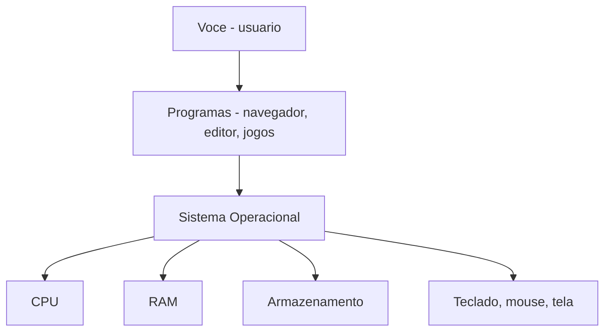
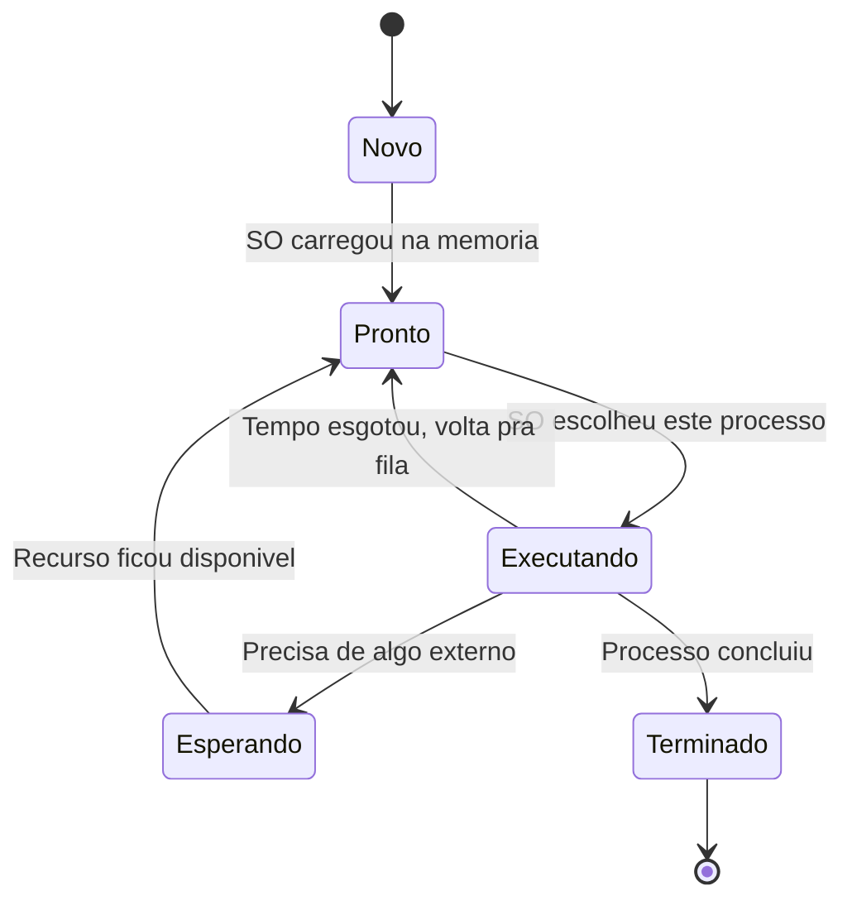
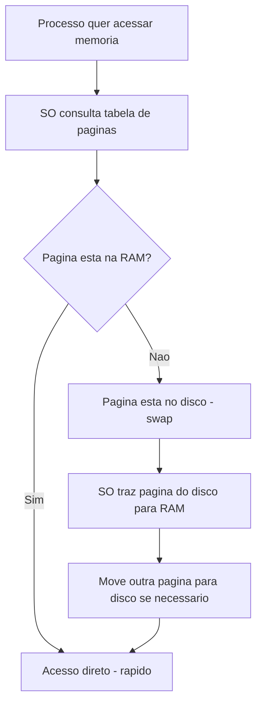
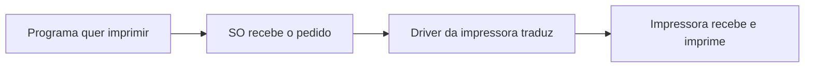
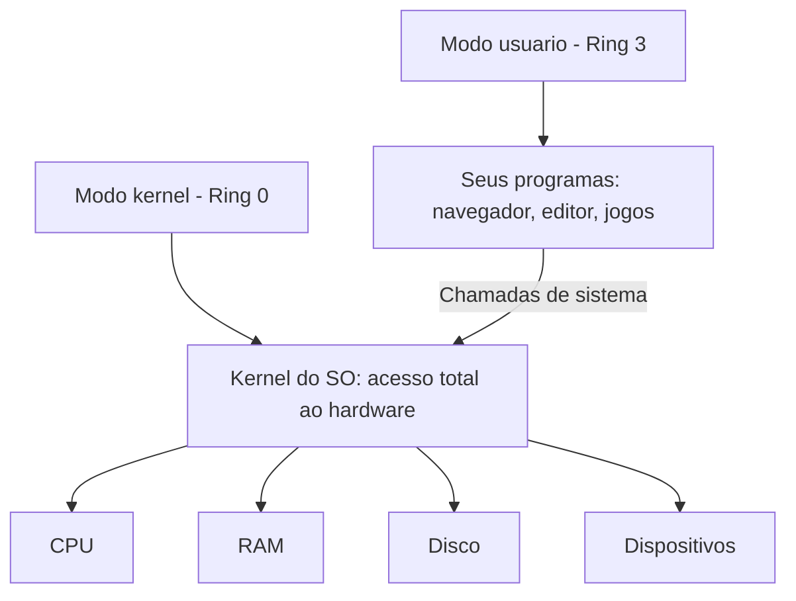
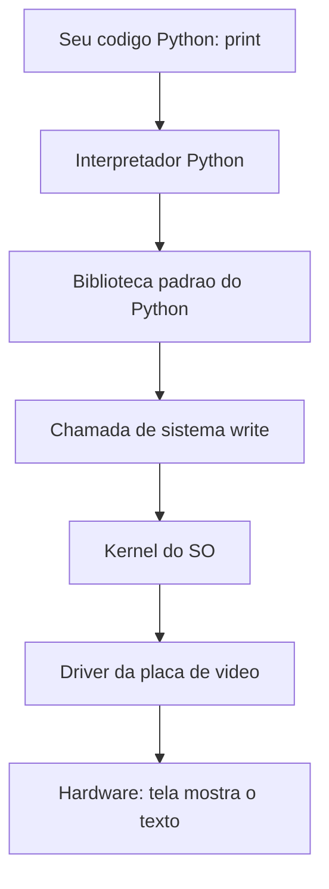
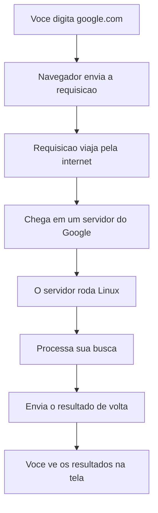
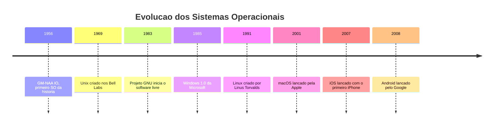

# 1.6 — Sistemas Operacionais: O Maestro do Computador

[← Anterior: CPU e Arquiteturas](cap01-mod05-cpu-arquiteturas.md) · [Próximo: Evolução dos Sistemas Operacionais →](cap01-mod07-evolucao-sistemas-operacionais.md)

---

## Introdução

Nos módulos anteriores, vimos que um computador é composto por peças físicas (hardware): CPU, memória RAM, armazenamento, placa de vídeo. Vimos que a CPU é o cozinheiro, a RAM é a bancada e o armazenamento é a despensa. No módulo 1.5, entramos na cozinha e vimos como o cozinheiro trabalha — o ciclo de instrução, os núcleos, o cache, o pipeline.

Mas quem organiza tudo isso? Quem decide qual programa pode usar a CPU agora? Quem controla o acesso à memória? Quem faz o teclado funcionar, a tela mostrar imagens e os arquivos ficarem organizados?

A resposta é o **sistema operacional** — o maestro que rege toda a orquestra do computador.

Neste módulo, vamos entender em profundidade o que é um sistema operacional, por que ele existe, quais problemas ele resolve e como ele funciona por dentro. Esse conhecimento é fundamental para quem vai programar, porque todo programa que você escrever vai rodar dentro de um sistema operacional — e entender como ele funciona vai te ajudar a escrever programas melhores e a resolver problemas quando algo der errado.

---

## O Problema: O que Acontece Sem um Sistema Operacional?

Antes de entender o que um sistema operacional faz, vamos entender o problema que ele resolve. Porque, como vimos ao longo do curso, ninguém cria tecnologia "porque sim" — toda tecnologia nasce para resolver um problema real.

Imagine que você tem um computador com CPU, RAM, armazenamento, teclado e tela. Mas sem nenhum sistema operacional. O que acontece?

Primeiro, você precisaria escrever seu programa diretamente em linguagem de máquina — aqueles zeros e uns que a CPU entende. Não haveria nenhuma camada intermediária para facilitar sua vida.

Segundo, seu programa precisaria saber exatamente como conversar com cada peça de hardware. Quer mostrar uma letra na tela? Você precisaria saber o endereço exato de memória da placa de vídeo, o formato exato dos pixels, e enviar os dados bit a bit. Quer ler uma tecla do teclado? Precisaria monitorar a porta de comunicação do teclado manualmente, verificando a cada instante se alguma tecla foi pressionada.

Terceiro, se você quisesse rodar dois programas ao mesmo tempo, teria que resolver isso sozinho. Quem decide quando cada programa usa a CPU? Quem garante que um programa não invade a memória do outro? Quem impede que um programa com erro derrube todos os outros?

Nos primeiros computadores, era exatamente assim. Cada programa era escrito para uma máquina específica, controlava o hardware diretamente e rodava sozinho — um programa de cada vez. Se você quisesse rodar outro programa, precisava parar o primeiro, carregar o segundo manualmente e iniciar de novo.

Isso era extremamente ineficiente. A CPU ficava ociosa a maior parte do tempo, esperando operações lentas como leitura de cartões perfurados ou impressão de resultados. Programadores gastavam mais tempo lidando com detalhes de hardware do que resolvendo problemas reais.

O sistema operacional nasceu para resolver todos esses problemas de uma vez. Ele criou uma camada de abstração entre os programas e o hardware — uma camada que esconde a complexidade do hardware e oferece uma interface simples e padronizada para os programas usarem. Em vez de cada programa saber como conversar com cada modelo de placa de vídeo, o programa simplesmente pede ao SO "mostre isso na tela", e o SO se vira para fazer acontecer.

Essa ideia de criar camadas de abstração é um dos conceitos mais importantes da computação, e você vai encontrá-la repetidamente ao longo da sua carreira como desenvolvedor.

---

## O que é um Sistema Operacional?

Imagine um restaurante movimentado. Você tem vários cozinheiros (CPUs), uma bancada de trabalho (RAM), uma despensa (armazenamento), ingredientes chegando de fornecedores (dados de entrada) e pratos saindo para os clientes (dados de saída). Sem alguém coordenando, seria o caos: cozinheiros disputando a mesma bancada, ingredientes misturados, pedidos perdidos.

O **gerente do restaurante** é quem organiza tudo: distribui os pedidos entre os cozinheiros, controla o estoque da despensa, organiza a bancada de trabalho, garante que os pratos saiam na ordem certa e que nenhum cozinheiro atrapalhe o outro.

O **sistema operacional** (ou **SO**, em inglês **Operating System** ou **OS**) é o gerente do restaurante do computador. Ele é o programa que:

1. **Gerência processos** — decide qual programa roda quando e por quanto tempo
2. **Gerência memória** — controla quanto de RAM cada programa pode usar
3. **Gerência o sistema de arquivos** — organiza seus documentos, fotos e programas no armazenamento
4. **Gerência dispositivos** — faz o teclado, mouse, impressora e outros periféricos funcionarem
5. **Fornece segurança** — controla quem pode acessar o quê, protege programas uns dos outros

Sem o sistema operacional, o hardware seria um monte de peças eletrônicas sem utilidade — como um restaurante sem gerente, onde ninguém sabe o que fazer.



Repare no diagrama: você nunca fala diretamente com o hardware. Você fala com os programas, os programas falam com o sistema operacional, e o sistema operacional fala com o hardware. O SO é o intermediário que traduz suas intenções em ações concretas no hardware.

---

## As 5 Funções Principais de um Sistema Operacional

Vamos detalhar cada uma das cinco funções do SO em profundidade, porque entender isso vai ser fundamental quando você começar a programar.

### 1. Gerenciamento de Processos

Esta é talvez a função mais importante do sistema operacional. Para entendê-la, primeiro precisamos distinguir dois conceitos que parecem iguais mas são diferentes: **programa** e **processo**.

Um **programa** é um arquivo no seu armazenamento. É uma receita escrita em um papel, guardada na gaveta. Ele não está fazendo nada — é apenas um conjunto de instruções esperando para ser executado. O navegador Chrome, por exemplo, é um programa — um arquivo chamado `chrome.exe` (no Windows) ou `chrome` (no Linux) guardado no seu disco.

Um **processo** é um programa em execução. É quando o cozinheiro pega a receita da gaveta e começa a preparar o prato. Quando você clica duas vezes no ícone do Chrome, o SO cria um processo — carrega o programa na memória RAM, aloca recursos e começa a executar as instruções.

A diferença é crucial: você pode ter um programa e vários processos dele. Se você abrir três janelas do Chrome, terá um programa (o arquivo do Chrome) e três processos (três instâncias rodando na memória, cada uma com suas abas e dados).

| Conceito | O que e | Analogia da cozinha |
|----------|---------|---------------------|
| Programa | Arquivo com instruções, guardado no disco | Receita escrita no papel, guardada na gaveta |
| Processo | Programa em execução na memória | Cozinheiro preparando a receita na bancada |

#### Estados de um Processo

Um processo não está simplesmente "rodando" ou "parado". Ele passa por vários estados ao longo da sua vida, e o SO controla essas transições:

- **Novo** (New) — o processo acabou de ser criado. O SO está preparando tudo: alocando memória, carregando o programa do disco para a RAM
- **Pronto** (Ready) — o processo está na memória, pronto para rodar, mas está esperando sua vez de usar a CPU. É como um cozinheiro com todos os ingredientes na bancada, esperando o fogão ficar livre
- **Executando** (Running) — o processo está usando a CPU neste exato momento. O cozinheiro está no fogão, preparando o prato
- **Esperando** (Waiting/Blocked) — o processo está esperando algo externo: um arquivo ser lido do disco, dados chegarem da internet, o usuário digitar algo. O cozinheiro está esperando a água ferver
- **Terminado** (Terminated) — o processo terminou sua execução. O prato ficou pronto, a bancada foi liberada



#### Multitarefa e Troca de Contexto

Seu computador parece rodar dezenas de programas ao mesmo tempo. Mas na realidade, cada núcleo da CPU só pode executar um processo por vez. Como isso funciona?

O SO usa uma técnica chamada **multitarefa** (multitasking): ele dá um pedacinho de tempo para cada processo, alternando entre eles tão rapidamente que você tem a impressão de que todos rodam simultaneamente. Cada pedacinho de tempo se chama **fatia de tempo** (time slice), e geralmente dura apenas alguns milissegundos — milésimos de segundo.

Quando o SO decide trocar de um processo para outro, ele precisa salvar todo o estado do processo atual (em que instrução estava, quais valores estavam nos registradores da CPU, quais dados estavam sendo processados) e carregar o estado do próximo processo. Essa operação se chama **troca de contexto** (context switch).

Voltando à analogia do restaurante: imagine que o gerente tem apenas um fogão (um núcleo de CPU) e três pratos para preparar. Ele coloca o primeiro prato no fogão por 30 segundos, anota exatamente em que ponto parou, tira do fogão, coloca o segundo prato por 30 segundos, anota, troca pelo terceiro, e assim por diante. Se a troca for rápida o suficiente, os três clientes acham que seus pratos estão sendo preparados ao mesmo tempo.

#### Escalonamento: Quem Roda Primeiro?

Quando vários processos estão prontos para rodar, o SO precisa decidir qual vai usar a CPU primeiro. Essa decisão é feita pelo **escalonador** (scheduler), um componente do SO que usa algoritmos para distribuir o tempo da CPU de forma justa e eficiente.

Existem várias estratégias de escalonamento. Aqui estão as principais, explicadas de forma simples:

| Estrategia | Como funciona | Analogia |
|------------|---------------|----------|
| FIFO - First In First Out | Primeiro a chegar, primeiro a ser atendido | Fila do banco - quem chegou antes, atende antes |
| Round Robin | Cada processo recebe uma fatia de tempo igual | Rodizio - cada um come um pouco por vez |
| Prioridade | Processos mais importantes rodam primeiro | Fila do hospital - emergencias passam na frente |
| Menor trabalho primeiro | Processos rapidos rodam antes dos demorados | Caixa rápido do supermercado - quem tem poucos itens passa primeiro |

Na prática, sistemas operacionais modernos usam combinações dessas estratégias. O Linux, por exemplo, usa um escalonador chamado CFS (Completely Fair Scheduler), que tenta dar tempo de CPU proporcional à prioridade de cada processo — processos interativos (como seu navegador) recebem prioridade sobre processos em segundo plano (como uma atualização baixando).

| Situação | O que o SO faz |
|----------|---------------|
| Você abre o navegador | Cria um processo, aloca memória, carrega o programa |
| Você abre o editor de texto também | Cria outro processo, divide o tempo da CPU entre os dois |
| O navegador trava | Detecta que o processo parou de responder, oferece opção de encerrar |
| Você fecha o editor | Encerra o processo, libera a memória que ele usava |


### 2. Gerenciamento de Memória

A RAM é limitada. Se você tem 8 GB de RAM e abre 10 programas, o SO precisa decidir quanto de memória cada um recebe. Mas o problema vai muito além de simplesmente dividir a memória — o SO precisa garantir segurança, eficiência e a ilusão de que cada programa tem a memória toda para si.

#### Por que Programas Não Podem Acessar o Hardware Diretamente?

Imagine que dois programas pudessem escrever diretamente na RAM, sem nenhum controle. O programa A poderia, por acidente ou por maldade, escrever em cima dos dados do programa B. Um jogo com bug poderia corromper os dados do seu editor de texto. Um vírus poderia ler suas senhas diretamente da memória do navegador.

Por isso, o SO cria uma camada de proteção: cada processo recebe seu próprio "espaço de memória virtual", e não pode acessar a memória de outros processos. É como se cada cozinheiro tivesse sua própria bancada com divisórias — ele só pode usar a parte dele.

#### Memória Virtual: A Grande Ilusão

Um dos conceitos mais engenhosos dos sistemas operacionais modernos é a **memória virtual** (virtual memory). Funciona assim: cada processo acha que tem a memória toda do computador só para ele. O processo A acha que tem 4 GB de memória começando no endereço 0. O processo B também acha que tem 4 GB começando no endereço 0. Mas na realidade, o SO está mapeando esses endereços "virtuais" para endereços "reais" na RAM física.

Pense assim: imagine que você mora em um prédio de apartamentos. Cada apartamento tem a mesma numeração interna — sala, quarto 1, quarto 2, cozinha, banheiro. Quando você diz "vou para o quarto 1", você vai para o SEU quarto 1, não para o quarto 1 do vizinho. O prédio (SO) garante que cada apartamento (processo) tem seu próprio espaço isolado, mesmo que todos usem a mesma numeração.

Essa técnica resolve vários problemas de uma vez:

| Problema | Como a memória virtual resolve |
|----------|-------------------------------|
| Segurança | Cada processo so ve sua propria memória, não pode acessar a de outros |
| Simplicidade | Programas não precisam saber onde estao na RAM fisica |
| Flexibilidade | O SO pode mover dados na RAM sem o programa perceber |
| Mais memória | O SO pode usar o disco como extensão da RAM |

#### Paginação: Dividindo a Memória em Pedaços

Para gerenciar a memória virtual, o SO divide tanto a memória virtual quanto a RAM física em blocos de tamanho fixo chamados **páginas** (pages). Cada página tem tipicamente 4 KB (4.096 bytes). O SO mantém uma tabela que mapeia cada página virtual para uma página física na RAM.

Quando um processo precisa acessar um endereço de memória, o SO consulta essa tabela para descobrir onde aquele dado realmente está na RAM física. Isso acontece bilhões de vezes por segundo, então o hardware tem um componente especial chamado **MMU** (Memory Management Unit, ou Unidade de Gerenciamento de Memória) que faz essa tradução automaticamente, sem precisar do SO a cada acesso.

#### Swap: Quando a RAM Acaba

O que acontece quando a RAM fica cheia? O SO não simplesmente para de funcionar. Ele usa uma técnica chamada **swap** (troca): pega páginas de memória que não estão sendo usadas no momento e as move para o armazenamento (disco rígido ou SSD). Quando o processo precisa daqueles dados de volta, o SO os traz de volta para a RAM.

Voltando à analogia da cozinha: quando a bancada (RAM) fica lotada, o gerente (SO) pega ingredientes que não estão sendo usados agora e os guarda temporariamente na despensa (disco). Quando o cozinheiro precisa deles de novo, o gerente vai buscar na despensa. O problema é que a despensa é muito mais longe que a bancada — ir e voltar leva tempo. Por isso, quando o computador usa muito swap, ele fica lento. Você já deve ter percebido isso: quando abre muitos programas e o computador começa a "engasgar", provavelmente a RAM encheu e o SO está usando swap.



### 3. Gerenciamento do Sistema de Arquivos

Seus arquivos — documentos, fotos, músicas, programas, vídeos — ficam organizados no armazenamento. Mas o armazenamento é apenas um monte de zeros e uns. Quem dá estrutura e organização a esses dados é o **sistema de arquivos** (file system).

#### O que é um Sistema de Arquivos?

Um sistema de arquivos é a forma como o SO organiza os dados no disco. Pense assim: o disco é como um terreno vazio enorme. O sistema de arquivos é o projeto arquitetônico que divide esse terreno em lotes, ruas e quadras, e mantém um registro de quem mora em cada endereço.

Sem um sistema de arquivos, o disco seria apenas uma sequência gigante de bytes sem nenhuma organização. Você não teria como encontrar seus arquivos, não saberia onde um arquivo termina e outro começa, e não teria como organizar nada em pastas.

O sistema de arquivos fornece:

- **Hierarquia de diretórios** — pastas dentro de pastas, formando uma árvore de organização
- **Nomes de arquivos** — cada arquivo tem um nome legível por humanos (em vez de apenas um número)
- **Metadados** — informações sobre cada arquivo: tamanho, data de criação, data de modificação, permissões de acesso
- **Alocação de espaço** — controle de quais blocos do disco pertencem a qual arquivo
- **Integridade** — mecanismos para evitar perda de dados em caso de falha

#### A Hierarquia de Diretórios

Todos os sistemas operacionais organizam arquivos em uma estrutura de árvore — pastas que contêm arquivos e outras pastas. Mas a forma como essa árvore é organizada varia entre sistemas:

No **Windows**, cada disco tem uma letra (C:, D:, E:) e a árvore começa em cada letra:
```
C:\
├── Users\
│   └── joao\
│       ├── Documents\
│       ├── Downloads\
│       └── Desktop\
├── Program Files\
└── Windows\
```

No **Linux** e **macOS**, tudo começa em uma única raiz, representada por `/` (barra):
```
/
├── home/
│   └── joao/
│       ├── documentos/
│       └── downloads/
├── usr/
│   └── bin/
├── etc/
└── var/
```

Cada arquivo tem um **caminho** (path) — o endereço completo que diz onde ele está. No Windows: `C:\Users\joao\Documents\trabalho.txt`. No Linux: `/home/joao/documentos/trabalho.txt`. Quando você começar a programar, vai usar caminhos o tempo todo para abrir, ler e salvar arquivos.

#### Tipos de Sistemas de Arquivos

Existem vários sistemas de arquivos diferentes, cada um com suas características. Diferentes sistemas operacionais usam diferentes sistemas de arquivos:

| Sistema de arquivos | Usado por | Tamanho máximo de arquivo | Journaling | Observacoes |
|--------------------|-----------|-----------------------------|------------|-------------|
| NTFS | Windows | 16 TB | Sim | Padrão do Windows desde 2001 |
| ext4 | Linux | 16 TB | Sim | Padrão da maioria das distribuicoes Linux |
| APFS | macOS | 8 EB | Sim | Padrão do macOS desde 2017, otimizado para SSD |
| FAT32 | Universal | 4 GB | Não | Usado em pen drives, compatível com tudo |
| exFAT | Universal | 16 EB | Não | Evolução do FAT32, sem limite prático de tamanho |

Você já deve ter encontrado o FAT32 na prática: se alguma vez tentou copiar um filme grande (mais de 4 GB) para um pen drive e recebeu um erro, é porque o pen drive estava formatado em FAT32, que não suporta arquivos maiores que 4 GB.

#### Journaling: Proteção Contra Falhas

O que acontece se a energia acaba no meio de uma gravação de arquivo? Sem proteção, o arquivo pode ficar corrompido — metade escrito, metade não. Para evitar isso, sistemas de arquivos modernos usam uma técnica chamada **journaling** (registro de diário).

O journaling funciona assim: antes de fazer qualquer alteração no disco, o SO escreve em um "diário" o que pretende fazer. Se a operação for interrompida (queda de energia, travamento), o SO pode consultar o diário quando reiniciar e completar ou desfazer a operação. É como um cozinheiro que anota cada passo da receita antes de executar — se for interrompido, sabe exatamente onde parou.

### 4. Gerenciamento de Dispositivos

Seu computador tem dezenas de dispositivos conectados: teclado, mouse, tela, impressora, placa de rede, placa de som, webcam, pen drive, disco externo. Cada um desses dispositivos é fabricado por uma empresa diferente, com tecnologias diferentes. Como o SO faz todos funcionarem?

A resposta são os **drivers** (controladores de dispositivo). Um driver é um programa especial que sabe como conversar com um dispositivo específico. O driver traduz os comandos genéricos do SO ("mostre esta imagem na tela") para os comandos específicos que aquele hardware entende.

Pense nos drivers como tradutores em uma conferência internacional. O SO fala uma "língua universal", e cada dispositivo fala sua própria língua. O driver traduz entre os dois.



#### Plug and Play

Nos primeiros computadores, instalar um novo dispositivo era um pesadelo. Você precisava configurar manualmente endereços de memória, interrupções e portas de comunicação. Um erro e nada funcionava.

Hoje, a maioria dos dispositivos usa **Plug and Play** (PnP, literalmente "conecte e use"): você conecta o dispositivo, o SO detecta automaticamente, encontra ou baixa o driver correto e configura tudo sozinho. Quando você conecta um pen drive e ele aparece automaticamente no seu computador, isso é Plug and Play em ação.

### 5. Segurança e Controle de Acesso

O SO é responsável por proteger o computador e os dados dos usuários. Isso envolve três aspectos principais:

**Autenticação** — verificar quem é o usuário. Quando você digita sua senha para entrar no computador, o SO está autenticando você. Autenticação responde à pergunta: "Você é quem diz ser?"

**Autorização** — controlar o que cada usuário pode fazer. Mesmo depois de autenticado, nem todo usuário pode fazer tudo. Um usuário comum não pode instalar programas do sistema, por exemplo. Autorização responde à pergunta: "Você tem permissão para fazer isso?"

**Isolamento** — garantir que programas não interfiram uns nos outros. Um programa com vírus não deve conseguir acessar os dados do seu navegador. Um jogo com bug não deve derrubar o sistema inteiro.

| Aspecto | O que protege | Exemplo |
|---------|--------------|---------|
| Autenticação | Identidade do usuario | Senha de login, biometria |
| Autorização | Acesso a recursos | Permissões de arquivo, conta de administrador |
| Isolamento | Processos entre si | Cada programa em seu espaco de memória |

No Linux, o sistema de permissões é especialmente importante. Cada arquivo tem três tipos de permissão (ler, escrever, executar) para três categorias de usuários (dono, grupo, outros). Vamos aprender isso em detalhes no capítulo 3.

---

## O Kernel e o Espaço do Usuário

Você vai ouvir muito a palavra **kernel** ao longo deste curso. O kernel é o núcleo do sistema operacional — a parte que fala diretamente com o hardware. Mas por que essa separação existe?

### O Problema da Confiança

Imagine que qualquer programa pudesse fazer qualquer coisa no computador: acessar toda a memória, controlar todos os dispositivos, modificar o próprio sistema operacional. Um único programa com bug poderia destruir tudo. Um vírus teria poder total sobre a máquina.

Para evitar isso, os processadores modernos têm **níveis de privilégio** — modos de operação com diferentes permissões. Os dois mais importantes são:

- **Modo kernel** (Ring 0, anel 0) — acesso total ao hardware. Apenas o kernel do SO roda neste modo. Pode acessar qualquer endereço de memória, controlar qualquer dispositivo, executar qualquer instrução da CPU
- **Modo usuário** (Ring 3, anel 3) — acesso restrito. Todos os programas normais rodam neste modo. Não podem acessar hardware diretamente, não podem acessar memória de outros processos, não podem executar instruções privilegiadas

Pense assim: o kernel é como o gerente do restaurante que tem a chave de todas as portas — da cozinha, do estoque, do cofre, da sala de controle. Os cozinheiros (programas) só têm acesso à cozinha. Se precisam de algo do estoque, pedem ao gerente.



Essa separação é fundamental para a estabilidade e segurança do computador. Se um programa trava no modo usuário, o kernel pode encerrá-lo sem afetar o resto do sistema. Mas se o kernel trava, o sistema inteiro cai — é a famosa "tela azul da morte" do Windows ou o "kernel panic" do Linux.

| Camada | O que roda | Privilegio | Se travar |
|--------|-----------|------------|-----------|
| Modo usuario - Ring 3 | Navegador, editor, jogos | Restrito | SO encerra o programa, resto continua |
| Modo kernel - Ring 0 | Kernel, drivers | Total | Sistema inteiro cai |

---

## Chamadas de Sistema: Como Programas Pedem Coisas ao SO

Se os programas rodam no modo usuário e não podem acessar o hardware diretamente, como eles fazem coisas como abrir arquivos, enviar dados pela rede ou mostrar algo na tela?

A resposta são as **chamadas de sistema** (system calls ou syscalls). Uma chamada de sistema é um pedido formal que um programa faz ao kernel: "Ei, kernel, preciso que você faça isso para mim."

Funciona assim:

1. O programa precisa de algo que só o kernel pode fazer (abrir um arquivo, por exemplo)
2. O programa faz uma chamada de sistema — uma instrução especial que muda temporariamente para o modo kernel
3. O kernel verifica se o programa tem permissão para fazer aquilo
4. Se tiver, o kernel executa a operação (abre o arquivo)
5. O kernel retorna o resultado para o programa e volta para o modo usuário

Pense nas chamadas de sistema como um balcão de atendimento. O programa (cliente) vai até o balcão e faz um pedido. O atendente (kernel) verifica se o pedido é válido, executa e entrega o resultado. O cliente nunca entra na área restrita — tudo passa pelo balcão.

Alguns exemplos de chamadas de sistema comuns:

| Chamada de sistema | O que faz | Quando e usada |
|-------------------|-----------|----------------|
| open | Abre um arquivo | Quando um programa precisa ler ou escrever um arquivo |
| read | Le dados de um arquivo | Quando um programa precisa ler conteúdo |
| write | Escreve dados em um arquivo | Quando um programa precisa salvar algo |
| fork | Cria um novo processo | Quando o SO precisa iniciar um novo programa |
| exec | Substitui o processo atual por outro programa | Quando você abre um programa |
| malloc | Aloca memória | Quando um programa precisa de mais espaco na RAM |
| socket | Cria uma conexão de rede | Quando um programa precisa se comunicar pela internet |

Quando você começar a programar em Python e escrever `print("Olá, mundo!")`, por baixo dos panos acontece uma cadeia de eventos que envolve chamadas de sistema. Vamos ver isso na próxima seção.

---

## Como o SO se Conecta com a Programação

Este é um dos pontos mais importantes deste módulo para quem vai ser desenvolvedor. Quando você escreve um programa, ele não roda no vácuo — ele roda dentro de um sistema operacional, e depende do SO para fazer praticamente tudo.

### O que Acontece Quando Você Executa print("Ola, mundo!")?

Vamos rastrear o caminho completo, desde o seu código Python até o hardware:

1. **Seu código**: você escreve `print("Ola, mundo!")` em um arquivo `.py`
2. **Interpretador Python**: o Python lê seu código e entende que precisa mostrar texto na tela
3. **Biblioteca padrão**: o Python chama sua função interna de escrita, que prepara os dados
4. **Chamada de sistema**: o Python faz uma chamada de sistema `write()` ao kernel, pedindo para escrever os bytes "Ola, mundo!" no dispositivo de saída padrão (a tela)
5. **Kernel**: o kernel recebe o pedido, verifica as permissões, e encaminha os dados para o driver da tela
6. **Driver**: o driver traduz os dados para o formato que a placa de vídeo entende
7. **Hardware**: a placa de vídeo atualiza os pixels na tela, e você vê "Ola, mundo!"



Tudo isso acontece em frações de milissegundo. Você digita `print("Ola, mundo!")` e o texto aparece instantaneamente. Mas por trás dessa simplicidade, há uma cadeia complexa de software e hardware trabalhando juntos, orquestrada pelo sistema operacional.

O mesmo tipo de cadeia acontece quando seu programa abre um arquivo. Se você escrever em Python `arquivo = open("dados.txt")`, o interpretador Python faz uma chamada de sistema `open()` ao kernel, que consulta o sistema de arquivos, localiza o arquivo no disco, verifica suas permissões, e retorna um identificador que o programa pode usar para ler o conteúdo. Tudo isso em milissegundos, invisível para você — mas orquestrado pelo SO.

### Por que Isso Importa para Programadores?

Entender essa cadeia te ajuda em várias situações práticas:

- **Quando seu programa está lento**: pode ser que ele esteja fazendo muitas chamadas de sistema (abrindo e fechando arquivos repetidamente, por exemplo). Saber disso te ajuda a otimizar
- **Quando algo dá erro de permissão**: o SO negou uma chamada de sistema porque seu programa não tem permissão. Saber sobre permissões te ajuda a resolver
- **Quando você precisa escolher entre Windows e Linux para um servidor**: entender como cada SO gerência processos e memória te ajuda a decidir
- **Quando você precisa debugar um problema**: saber que existe kernel, modo usuário, chamadas de sistema te dá vocabulário para pesquisar soluções

---

## Tipos de Sistemas Operacionais

Até agora falamos de sistemas operacionais de computadores pessoais, mas SOs existem em muitos tipos de dispositivos. Cada tipo de dispositivo tem necessidades diferentes, e por isso existem tipos diferentes de SO:

### Desktop e Laptop

São os SOs que você mais conhece: Windows, macOS, Linux (Ubuntu, Fedora, etc.). Projetados para uso interativo — você clica, digita, arrasta, e o SO responde. Priorizam a experiência do usuário e a capacidade de rodar muitos programas ao mesmo tempo. Precisam lidar com uma grande variedade de hardware (diferentes placas de vídeo, impressoras, webcams) e com usuários que abrem e fecham programas o tempo todo.

### Servidor

Servidores são computadores que ficam ligados 24 horas por dia, 7 dias por semana, atendendo requisições de outros computadores. O servidor do Google, por exemplo, recebe milhões de buscas por segundo. SOs de servidor priorizam estabilidade, segurança e desempenho sob carga pesada. Geralmente não têm interface gráfica — são controlados apenas pelo terminal, porque a interface gráfica consumiria recursos que poderiam ser usados para atender mais requisições. Linux domina esse mercado — mais de 90% dos servidores web rodam Linux.

### Mobile

Android e iOS. Projetados para telas sensíveis ao toque, economia de bateria e conectividade constante. Precisam gerenciar recursos de forma muito eficiente porque celulares têm menos RAM e processadores menos potentes que computadores. Também precisam lidar com situações que desktops não enfrentam: perda de sinal, bateria acabando, sensores de movimento e localização.

### Embarcado

Sistemas operacionais que rodam em dispositivos pequenos e específicos: roteadores, smart TVs, geladeiras inteligentes, relógios, câmeras de segurança. São versões enxutas, otimizadas para hardware limitado e tarefas específicas. Muitos desses dispositivos usam versões reduzidas do Linux. Quando você ouve falar em **IoT** (Internet of Things, ou Internet das Coisas) — dispositivos conectados à internet — a maioria deles roda algum tipo de SO embarcado.

### Tempo Real (RTOS)

**RTOS** (Real-Time Operating System, ou Sistema Operacional de Tempo Real) é um tipo especial de SO onde o tempo de resposta é garantido. Usado em sistemas onde atrasos podem ser perigosos: freios ABS de carros, equipamentos médicos, sistemas de controle de aviões, robôs industriais. Nesses sistemas, não basta que o SO responda "rápido" — ele precisa responder dentro de um prazo exato, sempre. Se o freio ABS do seu carro demorasse meio segundo a mais para responder, as consequências poderiam ser fatais.

| Tipo | Exemplos | Prioridade | Onde e usado |
|------|----------|------------|-------------|
| Desktop | Windows, macOS, Ubuntu | Experiência do usuario | Computadores pessoais |
| Servidor | Linux, Windows Server | Estabilidade e desempenho | Data centers, nuvem |
| Mobile | Android, iOS | Economia de bateria | Celulares, tablets |
| Embarcado | Linux embarcado, FreeRTOS | Eficiência em hardware limitado | IoT, roteadores, smart TVs |
| Tempo Real | FreeRTOS, VxWorks, QNX | Resposta garantida no prazo | Carros, avioes, equipamentos medicos |

---

## Os Principais Sistemas Operacionais

Existem vários sistemas operacionais, mas três dominam o mercado de desktops:

### Windows

- Criado pela Microsoft (1985)
- O mais usado em computadores pessoais no mundo (cerca de 72% dos desktops)
- Interface gráfica amigável, focada em facilidade de uso
- Muito usado em empresas e jogos
- Código fechado (você não pode ver como ele funciona por dentro)
- Usa o sistema de arquivos NTFS

### macOS

- Criado pela Apple (2001, baseado em Unix)
- Exclusivo para computadores da Apple (MacBook, iMac, Mac Mini)
- Interface elegante e integrada com outros produtos Apple (iPhone, iPad)
- Muito usado por designers, músicos e desenvolvedores
- Código fechado (mas o kernel, Darwin, é parcialmente aberto)
- Usa o sistema de arquivos APFS

### Linux

- Criado por Linus Torvalds (1991)
- Código aberto e gratuito (qualquer pessoa pode ver, modificar e distribuir)
- Roda a maior parte dos servidores da internet (mais de 90%)
- Muito usado por programadores e em servidores
- Tem centenas de "versões" diferentes (chamadas distribuições): Ubuntu, Fedora, Debian, Arch
- Usa o sistema de arquivos ext4 (entre outros)
- É o sistema que vamos usar neste curso

### Comparação Detalhada

| Caracteristica | Windows | macOS | Linux |
|---------------|---------|-------|-------|
| Criador | Microsoft | Apple | Comunidade, Linus Torvalds |
| Preco | Pago | Incluido no Mac | Gratuito |
| Código | Fechado | Fechado | Aberto |
| Uso principal | Desktop, jogos, empresas | Desktop Apple, design | Servidores, programação |
| Personalizacao | Limitada | Limitada | Total |
| Segurança | Boa, alvo frequente de virus | Muito boa | Excelente |
| Sistema de arquivos | NTFS | APFS | ext4 |
| Terminal | PowerShell, CMD | Terminal, baseado em Unix | Bash, Zsh |
| Mercado desktop | Cerca de 72% | Cerca de 15% | Cerca de 4% |
| Mercado servidor | Cerca de 20% | Menos de 1% | Mais de 75% |

### E os celulares?

Celulares também têm sistemas operacionais:

| SO | Criador | Baseado em | Usado em | Mercado |
|----|---------|-----------|----------|---------|
| Android | Google | Linux | Samsung, Motorola, Xiaomi | Cerca de 72% |
| iOS | Apple | Unix | iPhone | Cerca de 27% |

Sim, o Android é baseado em Linux. Isso significa que quando você usa um celular Android, por baixo de tudo está rodando um kernel Linux adaptado para dispositivos móveis.

---

## Por que Linux é tão Importante para Programadores?

Você pode estar se perguntando: "Se Windows é o mais usado em desktops, por que vamos aprender Linux?"

Ótima pergunta. Aqui estão os motivos:

1. **A internet roda em Linux** — a grande maioria dos servidores web, bancos de dados e serviços que você usa todos os dias (Google, Netflix, Amazon, Instagram) rodam em Linux. Quando você trabalhar como desenvolvedor, vai interagir com servidores Linux diariamente

2. **É gratuito e aberto** — você pode instalar, estudar, modificar e distribuir sem pagar nada. Isso é fundamental para aprender — você pode olhar o código-fonte do sistema operacional e entender como ele funciona

3. **O terminal é poderoso** — o terminal do Linux é uma ferramenta extremamente poderosa para programadores. Muitas tarefas que levariam vários cliques na interface gráfica podem ser feitas com um único comando

4. **Ferramentas de desenvolvimento** — a maioria das ferramentas de programação funciona melhor (ou só funciona) em Linux. Docker, Git, compiladores, servidores web — tudo foi projetado primeiro para Linux

5. **É o padrão da indústria** — quando você trabalhar como desenvolvedor, vai interagir com servidores Linux. Conhecer Linux é requisito básico em praticamente toda vaga de desenvolvimento




---

## Código Aberto vs Código Fechado

Esse é um conceito importante que aparece muito no mundo da tecnologia, e que vai acompanhar você por toda a sua carreira como desenvolvedor. A escolha entre código aberto e fechado afeta não só o preço do software, mas também a segurança, a transparência e a liberdade que você tem como usuário e como programador.

**Código fechado** (proprietário): o código-fonte do programa não é público. Você usa o programa, mas não pode ver como ele foi feito. A empresa controla tudo: quem pode usar, como pode usar, e cobra por isso. Exemplos: Windows, macOS, Microsoft Office, Adobe Photoshop.

**Código aberto** (open source): o código-fonte é público. Qualquer pessoa pode ler, estudar, modificar e distribuir. A comunidade inteira pode contribuir para melhorar o software. Exemplos: Linux, Firefox, Python, VSCode, Git.

Pense assim:
- Código fechado é como uma receita secreta de restaurante — você come o prato, mas não sabe como foi feito. Se quiser mudar alguma coisa, não pode
- Código aberto é como uma receita publicada em um livro — qualquer pessoa pode ler, fazer em casa, adaptar ao seu gosto e até publicar sua versão melhorada

| Aspecto | Código Fechado | Código Aberto |
|---------|---------------|---------------|
| Quem pode ver o código | Só a empresa | Qualquer pessoa |
| Quem pode modificar | Só a empresa | Qualquer pessoa |
| Preco | Geralmente pago | Geralmente gratuito |
| Exemplos | Windows, macOS, Office | Linux, Python, Firefox |
| Suporte | Empresa responsável | Comunidade e empresas |
| Transparência | Você não sabe o que o programa faz | Você pode verificar tudo |
| Segurança | Depende da empresa | Milhares de olhos revisando o código |

O movimento de código aberto é uma das coisas mais importantes da história da tecnologia. Sem ele, não existiriam Linux, Python, a maioria dos servidores web, e muitas das ferramentas que vamos usar neste curso. A linguagem Python que você vai aprender é código aberto. O Git que você vai usar para versionar seu código é código aberto. O Linux onde você vai rodar seus programas é código aberto.

---

## A História dos Sistemas Operacionais (Resumida)



A história é fascinante e vale a pena conhecer:

- **GM-NAA I/O** (1956) — considerado o primeiro sistema operacional da história, criado pela General Motors para o computador IBM 704. Antes dele, cada programa controlava o hardware diretamente
- **Unix** (1969) — criado por Ken Thompson e Dennis Ritchie nos Laboratórios Bell da AT&T. Foi o "avô" de quase todos os sistemas operacionais modernos. Introduziu conceitos que usamos até hoje: sistema de arquivos hierárquico, permissões de usuário, pipes, e a filosofia de "fazer uma coisa bem feita"
- **GNU** (1983) — Richard Stallman iniciou o projeto GNU (GNU is Not Unix — "GNU Não é Unix") para criar um sistema operacional completamente livre. GNU criou muitas ferramentas essenciais (compilador GCC, editor Emacs, shell Bash), mas faltava o "coração" do sistema — o kernel
- **Linux** (1991) — Linus Torvalds, um estudante finlandês de 21 anos na Universidade de Helsinki, criou o kernel que faltava. Combinado com as ferramentas do GNU, nasceu o sistema GNU/Linux — que todo mundo chama simplesmente de "Linux"
- **Windows** (1985) — a Microsoft criou sua própria linha de sistemas operacionais, que se tornou dominante em computadores pessoais. O Windows 95 foi um marco que popularizou a interface gráfica e o botão "Iniciar" que existe até hoje
- **macOS** (2001) — a Apple criou seu sistema baseado em Unix (especificamente no NeXTSTEP, sistema da empresa NeXT de Steve Jobs), exclusivo para seus computadores. A base Unix deu ao macOS a robustez e segurança que o tornaram popular entre desenvolvedores

---

## O Kernel: O Coração do Sistema Operacional

Já falamos sobre o kernel em várias seções, mas vale consolidar esse conceito porque ele é central para tudo que vem depois no curso.

O kernel é o núcleo do sistema operacional — a parte que fala diretamente com o hardware. Ele é o primeiro programa que roda quando você liga o computador (depois do BIOS/UEFI) e o último a parar quando você desliga.

Pense no kernel como o motor de um carro:
- O carro (sistema operacional) tem volante, pedais, painel, bancos (interface, programas, ferramentas)
- Mas quem realmente faz o carro andar é o motor (kernel)
- Você não interage diretamente com o motor — usa o volante e os pedais
- Mas sem o motor, nada funciona

| Camada | O que e | Analogia |
|--------|---------|----------|
| Hardware | Pecas fisicas: CPU, RAM, disco | Rodas, eixo, chassi |
| Kernel | Nucleo do SO, fala com o hardware | Motor |
| Sistema Operacional | Kernel mais ferramentas mais interface | Carro completo |
| Programas | Aplicativos que você usa | Passageiros e carga |

O Linux, tecnicamente, é apenas o kernel. Quando dizemos "Linux", geralmente estamos falando do kernel Linux + todas as ferramentas ao redor (GNU, interface gráfica, gerenciador de pacotes, etc.). Por isso, puristas preferem chamar de "GNU/Linux" — reconhecendo tanto o kernel (Linux) quanto as ferramentas (GNU). Na prática, todo mundo diz apenas "Linux", e é assim que vamos usar neste curso.

---

## Como a IA pode te ajudar aqui

Experimente perguntar a uma IA:

**Prompt 1 — Comparar alternativas:**
> "Explique a diferença entre programa e processo usando uma analogia simples. Dê exemplos do que acontece quando abro o Chrome três vezes."

**Prompt 2 — Explorar o conceito:**
> "O que é memória virtual e por que o sistema operacional precisa dela? Explique como se eu nunca tivesse estudado computação."

**Prompt 3 — Aprender passo a passo:**
> "Quando meu computador fica lento com muitos programas abertos, o que está acontecendo por dentro? Explique o conceito de swap."

---

## Resumo do Módulo

| Conceito | Definição |
|----------|-----------|
| Sistema Operacional | Programa que gerência hardware, processos, memória, arquivos e segurança |
| Programa | Arquivo com instruções, guardado no disco |
| Processo | Um programa em execução na memória |
| Multitarefa | Técnica de alternar rapidamente entre processos |
| Troca de contexto | Salvar estado de um processo e carregar outro |
| Escalonador | Componente que decide qual processo usa a CPU |
| Memória virtual | Cada processo acha que tem a memória toda para si |
| Paginacao | Divisao da memória em blocos de tamanho fixo |
| Swap | Usar o disco como extensão da RAM quando ela enche |
| Sistema de Arquivos | Forma como dados são organizados no armazenamento |
| Journaling | Técnica de proteção contra perda de dados em falhas |
| Driver | Programa que traduz comandos do SO para um dispositivo |
| Kernel | Nucleo do SO que fala diretamente com o hardware |
| Modo kernel - Ring 0 | Nível de privilegio total, so o kernel roda aqui |
| Modo usuario - Ring 3 | Nível restrito, programas normais rodam aqui |
| Chamada de sistema | Pedido formal de um programa ao kernel |
| GUI | Interface gráfica com janelas, icones e mouse |
| CLI | Interface de linha de comando, terminal com texto |
| Código Aberto | Código-fonte público, livre para ler e modificar |
| Código Fechado | Código-fonte privado, controlado pela empresa |

---

## Glossário do Módulo

| Termo | Definição |
|-------|-----------|
| Android | Sistema operacional móvel do Google, baseado em Linux |
| APFS | Apple File System, sistema de arquivos padrão do macOS desde 2017 |
| Autenticação | Processo de verificar a identidade de um usuario |
| Autorização | Processo de verificar se um usuario tem permissão para uma ação |
| Chamada de sistema (system call) | Pedido formal de um programa ao kernel do SO |
| CLI | Command Line Interface, interface de linha de comando |
| Código aberto (open source) | Software cujo código-fonte e público e pode ser lido, modificado e distribuido |
| Código fechado (proprietario) | Software cujo código-fonte e privado e controlado pela empresa |
| Context switch (troca de contexto) | Operação de salvar o estado de um processo e carregar outro |
| Daemon | Programa que roda em segundo plano no sistema operacional |
| Distribuição Linux | Versão do Linux empacotada com ferramentas e interface especificas |
| Driver | Programa que traduz comandos do SO para um dispositivo de hardware |
| Dual boot | Ter dois sistemas operacionais no mesmo computador |
| ext4 | Fourth Extended Filesystem, sistema de arquivos padrão do Linux |
| FAT32 | File Allocation Table 32, sistema de arquivos universal para pen drives |
| Fork | Chamada de sistema que cria um novo processo |
| GNU | Projeto de software livre iniciado por Richard Stallman em 1983 |
| GUI | Graphical User Interface, interface gráfica com janelas e icones |
| iOS | Sistema operacional móvel da Apple, baseado em Unix |
| Journaling | Técnica de registro em diario para proteger dados contra falhas |
| Kernel | Nucleo do sistema operacional que fala diretamente com o hardware |
| Linux | Kernel de código aberto criado por Linus Torvalds em 1991 |
| macOS | Sistema operacional da Apple, baseado em Unix |
| Memória virtual (virtual memory) | Técnica que da a cada processo a ilusao de ter toda a memória |
| MMU | Memory Management Unit, hardware que traduz enderecos virtuais em fisicos |
| Multitarefa (multitasking) | Capacidade de rodar vários processos alternando rapidamente entre eles |
| NTFS | New Technology File System, sistema de arquivos padrão do Windows |
| Paginacao (paging) | Divisao da memória em blocos de tamanho fixo chamados páginas |
| Plug and Play (PnP) | Tecnologia que permite conectar dispositivos sem configuração manual |
| Processo | Instância de um programa em execução na memória |
| Ring 0 | Nível de privilegio máximo do processador, usado pelo kernel |
| Ring 3 | Nível de privilegio restrito, usado por programas normais |
| RTOS | Real-Time Operating System, SO com tempo de resposta garantido |
| Scheduler (escalonador) | Componente do SO que decide qual processo usa a CPU |
| Sistema de arquivos (file system) | Forma como dados são organizados no armazenamento |
| Sistema operacional (SO) | Programa que gerência hardware, processos, memória e arquivos |
| Swap | Técnica de usar o disco como extensão da RAM |
| Time slice (fatia de tempo) | Período de tempo que cada processo recebe para usar a CPU |
| Unix | Sistema operacional criado em 1969, base de Linux e macOS |
| Windows | Sistema operacional da Microsoft, o mais usado em desktops |

---

## Na Cultura Popular

- **Revolution OS** (documentário, 2001) — conta a história do movimento de software livre e do Linux, desde Richard Stallman até Linus Torvalds. Essencial para entender código aberto e por que o Linux existe.
- **Mr. Robot** (série, 2015-2019) — o protagonista usa Linux e terminal extensivamente. Mostra na prática como programadores e hackers interagem com sistemas operacionais, processos e permissões.
- **Piratas do Vale do Silício** (filme, 1999) — além da história dos PCs, mostra a rivalidade entre os sistemas operacionais da Apple e da Microsoft, e como a interface gráfica mudou a computação.
- **Halt and Catch Fire** (série, 2014-2017) — acompanha a evolução dos computadores pessoais e da internet, mostrando como os sistemas operacionais evoluíram junto com o hardware.

---

## Para Saber Mais

- [O que é um Sistema Operacional — Diolinux (YouTube)](https://www.youtube.com/c/Diolinux) — *Canal brasileiro sobre Linux com explicações acessíveis*
- [História do Linux — Wikipedia](https://pt.wikipedia.org/wiki/Linux) — *Artigo completo sobre a história e evolução do Linux*
- [O que é Open Source — Red Hat](https://www.redhat.com/pt-br/topics/open-source/what-is-open-source) — *Explicação detalhada sobre código aberto por uma das maiores empresas Linux*
- [Como funciona a memória virtual — Computerphile (YouTube)](https://www.youtube.com/c/Computerphile) — *Canal com explicações visuais sobre conceitos de computação*
- [GitHub do Fino](https://github.com/RafaelFino/learn-ops-content) — *Material complementar sobre Linux e operações*

---

## Perguntas Frequentes (FAQ)

**P: Preciso trocar meu Windows por Linux para fazer este curso?**
R: Não necessariamente agora. Nos próximos capítulos, vamos ensinar como instalar Linux. Você pode usar Linux dentro do Windows (via WSL ou máquina virtual) sem precisar apagar nada. Muitos desenvolvedores profissionais usam essa abordagem no dia a dia.

**P: Linux é difícil de usar?**
R: Depende da distribuição. Ubuntu, por exemplo, tem uma interface gráfica tão amigável quanto Windows. O terminal pode parecer intimidador no início, mas com prática se torna natural — e muito mais eficiente. Lembre-se: tudo que parece difícil hoje vai parecer fácil depois de praticar.

**P: Se Linux é gratuito, como as empresas ganham dinheiro com ele?**
R: Empresas como Red Hat, Canonical (Ubuntu) e SUSE vendem suporte, consultoria e versões empresariais com garantias. O sistema em si é gratuito, mas o suporte profissional é pago. É como um livro de receitas gratuito — a receita é de graça, mas se você quiser um chef para cozinhar para você, precisa pagar.

**P: Posso jogar no Linux?**
R: Sim, cada vez mais. A Steam tem milhares de jogos compatíveis com Linux, e o Steam Deck (console portátil da Valve) roda Linux. Mas para jogos, Windows ainda é a melhor opção pela compatibilidade. Para programar, Linux é a melhor opção.

**P: O que é uma "distribuição" Linux?**
R: É uma versão do Linux empacotada com ferramentas, interface gráfica e configurações específicas. Ubuntu, Fedora, Debian e Arch são distribuições diferentes do mesmo sistema base — como diferentes marcas de carro que usam o mesmo motor. Vamos detalhar isso no capítulo 2.

**P: macOS é parecido com Linux?**
R: Sim, ambos são baseados em Unix. Muitos comandos de terminal funcionam igual nos dois. Por isso muitos programadores gostam de Mac — é parecido com Linux, mas com a interface da Apple. Porém, macOS é código fechado e só roda em hardware da Apple.

**P: O que é Unix?**
R: Unix é um sistema operacional criado em 1969 nos Laboratórios Bell por Ken Thompson e Dennis Ritchie. Ele é o "avô" de Linux, macOS, Android e muitos outros sistemas. Os conceitos e a filosofia do Unix influenciam a tecnologia até hoje — inclusive a forma como você vai programar.

**P: Android é Linux?**
R: O Android usa o kernel Linux, mas tem muitas camadas próprias do Google por cima. É como dizer que um bolo de chocolate e um bolo de morango usam a mesma receita de massa base, mas são bolos diferentes. O kernel é o mesmo, mas a experiência do usuário é completamente diferente.

**P: O que acontece se o sistema operacional travar?**
R: Depende da gravidade. Se um programa trava no modo usuário, o SO pode encerrá-lo sem afetar o resto — você perde o que estava fazendo naquele programa, mas o computador continua funcionando. Se o kernel trava (modo kernel), o sistema inteiro cai — é a famosa "tela azul" do Windows ou o "kernel panic" do Linux. Geralmente, reiniciar resolve.

**P: Posso ter dois sistemas operacionais no mesmo computador?**
R: Sim! Isso se chama **dual boot**. Você pode ter Windows e Linux no mesmo computador e escolher qual usar quando liga a máquina. Outra opção é usar uma máquina virtual ou o WSL (Windows Subsystem for Linux) para rodar Linux dentro do Windows. Vamos falar sobre isso no capítulo 2.

**P: O que é swap e por que meu computador fica lento quando uso muitos programas?**
R: Swap é quando o SO usa o disco como extensão da RAM. Quando a RAM enche, o SO move dados menos usados para o disco. Como o disco é muito mais lento que a RAM, o computador fica lento. A solução é fechar programas que não está usando ou adicionar mais RAM ao computador.

**P: O que são drivers e por que às vezes preciso instalá-los?**
R: Drivers são programas que ensinam o SO a conversar com um dispositivo específico. Cada placa de vídeo, impressora ou webcam precisa de um driver. Sistemas modernos já vêm com drivers para a maioria dos dispositivos (Plug and Play), mas dispositivos mais novos ou especializados podem precisar de instalação manual.

**P: Por que existem tantos sistemas de arquivos diferentes?**
R: Porque cada um foi projetado para resolver problemas diferentes. FAT32 é simples e universal, mas não suporta arquivos grandes. NTFS é robusto para Windows. ext4 é eficiente para Linux. APFS é otimizado para SSDs da Apple. Não existe um sistema de arquivos perfeito para tudo — cada um tem seus pontos fortes.

**P: O que é o terminal e por que programadores preferem ele à interface gráfica?**
R: O terminal (CLI) é uma interface onde você digita comandos em texto. Programadores preferem porque é mais rápido para muitas tarefas (renomear 100 arquivos, buscar texto em milhares de arquivos, automatizar tarefas repetitivas), pode ser automatizado com scripts, e funciona em servidores que não têm interface gráfica. Vamos aprender a usar o terminal nos capítulos 2 e 3.

**P: Quando eu programar em Python, vou precisar me preocupar com chamadas de sistema?**
R: Na maioria das vezes, não diretamente. O Python e suas bibliotecas fazem as chamadas de sistema por você. Mas entender que elas existem te ajuda a entender erros (como "Permission denied" — o SO negou uma chamada de sistema) e a escrever programas mais eficientes.

---

## Exercícios Práticos

**Exercício 1 — Pesquisa: Sistemas Operacionais no Seu Dia a Dia**

Liste todos os dispositivos eletrônicos que você usa no dia a dia (computador, celular, tablet, smart TV, videogame, roteador, relógio inteligente, etc.) e identifique qual sistema operacional cada um usa. Para cada dispositivo, responda:
1. Qual é o dispositivo?
2. Qual sistema operacional ele usa?
3. O sistema é código aberto ou fechado?
4. Em qual categoria de SO ele se encaixa (desktop, mobile, embarcado, etc.)?

**Dica:** Pesquise na internet se não souber qual SO um dispositivo usa. Você pode se surpreender ao descobrir quantos dos seus dispositivos rodam Linux.

**Exercício 2 — Reflexão: A Vida Sem Sistema Operacional**

Escreva um texto curto (10-15 linhas) explicando, com suas palavras:
1. O que aconteceria se computadores não tivessem sistema operacional — como seria usar um computador assim?
2. Quais das 5 funções do SO (processos, memória, arquivos, dispositivos, segurança) você acha mais importante e por quê?
3. Por que a separação entre modo kernel e modo usuário é importante para a segurança?

**Dica:** Pense na analogia do restaurante. O que aconteceria se não houvesse gerente e cada cozinheiro fizesse o que quisesse?

**Exercício 3 — Investigação: O Caminho de um Clique**

Quando você clica em um arquivo no seu computador para abri-lo, uma cadeia de eventos acontece envolvendo o sistema operacional. Pesquise e descreva, passo a passo, o que acontece desde o momento em que você clica até o arquivo aparecer na tela. Tente incluir:
1. O que o mouse envia ao computador
2. Como o SO recebe essa informação (driver)
3. Como o SO identifica qual arquivo você clicou
4. Como o SO decide qual programa usar para abrir o arquivo
5. Como o SO cria um processo para esse programa
6. Como o programa lê o arquivo do disco (chamada de sistema)
7. Como o conteúdo aparece na tela

**Dica:** Não precisa ser tecnicamente perfeito — o objetivo é exercitar o pensamento sobre as camadas de software que existem entre você e o hardware.

---

[← Anterior: CPU e Arquiteturas](cap01-mod05-cpu-arquiteturas.md) · [Próximo: Evolução dos Sistemas Operacionais →](cap01-mod07-evolucao-sistemas-operacionais.md)
