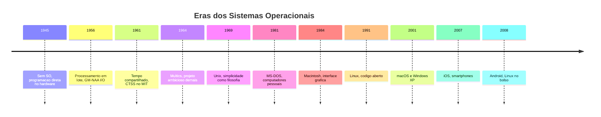
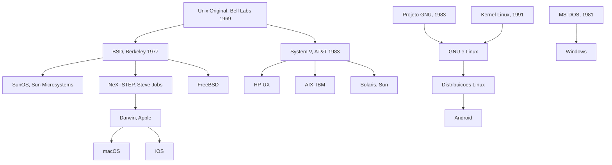
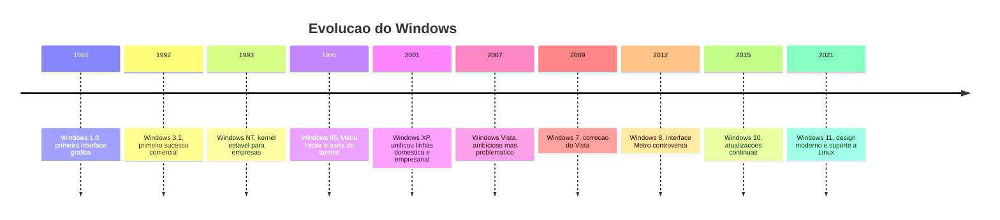
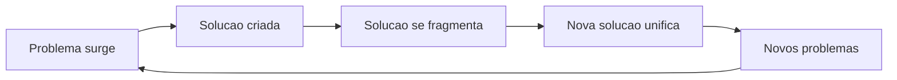
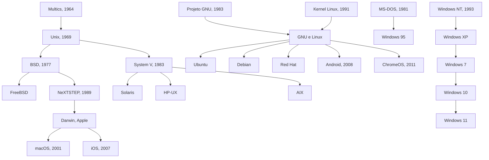

# 1.7 — A Evolução dos Sistemas Operacionais: De Unix ao Android

[← Anterior: Sistemas Operacionais](cap01-mod06-sistemas-operacionais.md) · [Próximo: Servidores e Virtualização →](cap01-mod08-servidores-virtualizacao.md)

---

## Introdução

No módulo anterior, vimos que o sistema operacional é o maestro do computador — ele coordena hardware, programas, arquivos e a interface com o usuário. Conhecemos os três grandes sistemas: Windows, macOS e Linux. Mas de onde eles vieram? Por que existem três e não apenas um? Por que são tão diferentes entre si?

Neste módulo, vamos mergulhar na história de como os sistemas operacionais nasceram, evoluíram e se transformaram no que conhecemos hoje. Essa não é uma aula de história por curiosidade — é uma aula de história para entender o presente. Cada decisão tomada décadas atrás ainda afeta como você vai programar amanhã.

Lembre-se do mantra: **qual problema você quer resolver?** Cada sistema operacional que vamos estudar nasceu como resposta a um problema real. E entender esses problemas é entender por que o terminal do Linux funciona de um jeito, por que o Windows tem o registro, por que o macOS é exclusivo da Apple, e por que o Android dominou os celulares.

Vamos começar do começo — de uma época em que computadores ocupavam salas inteiras e não tinham sistema operacional nenhum.

---

## Antes dos Sistemas Operacionais: A Era do Caos

Para entender por que os sistemas operacionais foram criados, precisamos entender como era a vida sem eles. Nos anos 1940 e 1950, os primeiros computadores eletrônicos — como o ENIAC (1945) e o UNIVAC (1951) — não tinham sistema operacional. Nenhum.

Imagine a nossa analogia da cozinha, mas sem o gerente do restaurante. Cada cozinheiro (programa) precisava saber exatamente onde ficava cada ingrediente na despensa, como ligar o fogão, como controlar a temperatura do forno. Se dois cozinheiros quisessem usar o fogão ao mesmo tempo, eles tinham que resolver entre si — não havia ninguém coordenando.

Na prática, isso significava que:

- Apenas **uma pessoa** podia usar o computador por vez
- O programador precisava conhecer cada detalhe do hardware
- Para rodar um programa, era preciso configurar fisicamente o computador (trocar cabos, ajustar chaves)
- Se o programa travasse, o computador inteiro parava
- Trocar de um programa para outro levava minutos ou até horas

O computador custava milhões de dólares, mas ficava parado a maior parte do tempo — esperando o operador humano preparar o próximo programa. Era como ter um restaurante caríssimo onde o cozinheiro fica parado enquanto alguém vai buscar os ingredientes na despensa, um por um.

Esse desperdício era o **problema** que motivou a criação dos primeiros sistemas operacionais.

---

## A Era do Processamento em Lote: Os Primeiros SOs (1950-1960)

O primeiro passo para resolver o problema do desperdício foi o **processamento em lote** (em inglês, **batch processing**). A ideia era simples: em vez de rodar um programa por vez com um operador humano no meio, vamos empilhar vários programas em sequência e deixar o computador executar um atrás do outro, automaticamente.

Pense assim: em vez de o gerente do restaurante esperar cada cliente pedir, preparar, servir e só depois atender o próximo, ele coleta todos os pedidos de uma vez e manda a cozinha preparar em sequência, sem pausa entre um e outro.

### Como Funcionava

Os programadores escreviam seus programas em **cartões perfurados** — cartões de papel com furos que representavam instruções. Esses cartões eram entregues a um operador, que os empilhava em uma bandeja. O computador lia os cartões um a um, executava cada programa e imprimia o resultado.

O primeiro sistema operacional de verdade foi o **GM-NAA I/O**, criado em 1956 pela General Motors em parceria com a North American Aviation para o computador IBM 704. Ele fazia exatamente isso: lia um programa dos cartões, executava, e automaticamente carregava o próximo.

### O Problema do Lote

O processamento em lote resolveu o desperdício de tempo entre programas, mas criou novos problemas:

| Problema | Descrição |
|----------|-----------|
| Sem interatividade | O programador entregava os cartoes e voltava horas depois para ver o resultado |
| Erros custosos | Um erro de digitacao no cartao significava esperar horas para tentar de novo |
| Sem prioridade | Todos os programas esperavam na fila, não importava a urgencia |
| Um programa por vez | Enquanto um programa rodava, a CPU ficava ociosa esperando o disco ou a impressora |

Esse último problema era especialmente grave. A CPU era milhares de vezes mais rápida que os dispositivos de entrada e saída (disco, impressora, leitora de cartões). Enquanto o computador esperava o disco ler dados, a CPU ficava literalmente sem fazer nada. Era como o cozinheiro ficar parado olhando a água ferver, sem poder fazer mais nada enquanto isso.

---

## A Era do Tempo Compartilhado: Vários Usuários ao Mesmo Tempo (1960-1970)

O próximo grande salto veio com o **tempo compartilhado** (em inglês, **time-sharing**). A ideia era revolucionária: e se o computador pudesse atender vários usuários ao mesmo tempo, dando a cada um a ilusão de que tinha o computador só para si?

Voltando à analogia do restaurante: em vez de um cozinheiro preparar um prato inteiro antes de começar o próximo, ele dá uma mexida na panela do cliente A, depois corta os legumes do cliente B, depois tempera a carne do cliente C, e volta para o cliente A. Cada cliente acha que o cozinheiro está dedicado a ele, mas na verdade o cozinheiro está alternando rapidamente entre todos.

### O CTSS e o Multics

O primeiro sistema de tempo compartilhado importante foi o **CTSS** (Compatible Time-Sharing System), criado no **MIT** (Massachusetts Institute of Technology) em 1961. Ele permitia que até 30 usuários usassem o mesmo computador simultaneamente, cada um com seu terminal (uma tela e um teclado conectados ao computador central).

O sucesso do CTSS inspirou um projeto muito mais ambicioso: o **Multics** (Multiplexed Information and Computing Service), iniciado em 1964 como uma parceria entre o MIT, os Bell Labs da AT&T e a General Electric. O Multics queria ser o sistema operacional definitivo — seguro, multiusuário, com sistema de arquivos hierárquico (pastas dentro de pastas) e memória virtual.

O Multics era brilhante em conceito, mas sofria de um problema comum em projetos ambiciosos demais: era **complexo demais**. O desenvolvimento se arrastou por anos, consumiu recursos enormes e o sistema final era lento e difícil de manter.

Em 1969, os Bell Labs desistiram do Multics e saíram do projeto. Mas dois engenheiros dos Bell Labs — **Ken Thompson** e **Dennis Ritchie** — tinham aprendido muito com o Multics. Eles gostaram das ideias, mas acharam que a execução era errada. O Multics tentava fazer tudo; eles queriam fazer algo simples que funcionasse bem.

Essa frustração com o Multics foi o que deu origem ao Unix — e mudou a história da computação para sempre.

---

## Unix: O Avô de Quase Tudo (1969)

Tudo começa com o **Unix**, criado em 1969 nos Laboratórios Bell por **Ken Thompson** e **Dennis Ritchie**. Mas por que eles criaram o Unix?

O **problema**: os sistemas operacionais da época eram enormes, complexos e feitos para um único tipo de computador. Se você trocasse de máquina, precisava de um sistema diferente. Além disso, eram difíceis de usar e de modificar. O Multics, que eles tinham acabado de abandonar, era o exemplo perfeito de complexidade excessiva.

A **solução**: Thompson e Ritchie criaram um sistema simples, elegante e — crucialmente — escrito em **C** (uma linguagem que Ritchie criou especificamente para isso). Como C podia ser compilado para diferentes máquinas, o Unix podia rodar em diferentes computadores com poucas modificações. Isso era revolucionário.

### A Origem do Nome

O nome "Unix" é um trocadilho com "Multics". Enquanto o Multics era "multiplexado" (tentava fazer muitas coisas ao mesmo tempo), o Unix era "uniplexado" — fazia uma coisa de cada vez, mas fazia bem. O nome original era "Unics" (Uniplexed Information and Computing Service), que depois virou "Unix".

Essa brincadeira com o nome já revelava a filosofia: simplicidade em vez de complexidade.

### Ken Thompson e Dennis Ritchie: Os Criadores

**Ken Thompson** nasceu em 1943 em Nova Orleans, nos Estados Unidos. Formou-se em engenharia elétrica e ciência da computação na Universidade da Califórnia em Berkeley. Nos Bell Labs, ele era conhecido por sua habilidade excepcional em programação. A lenda diz que ele escreveu a primeira versão do Unix em apenas três semanas, durante as férias da esposa, usando um computador PDP-7 que estava encostado no laboratório.

**Dennis Ritchie** nasceu em 1941 em Bronxville, Nova York. Seu pai trabalhava nos Bell Labs, então Dennis cresceu cercado por tecnologia. Ele se formou em física e matemática aplicada em Harvard. Ritchie criou a linguagem **C** entre 1969 e 1973, especificamente para poder reescrever o Unix de forma portável. Antes de C, o Unix era escrito em Assembly — linguagem de máquina específica para cada processador.

A parceria entre Thompson e Ritchie é uma das mais importantes da história da tecnologia. Thompson era o arquiteto de sistemas, Ritchie era o criador de linguagens. Juntos, criaram tanto o Unix quanto a linguagem C — duas invenções que moldaram praticamente toda a computação moderna.

Infelizmente, Dennis Ritchie faleceu em outubro de 2011, apenas uma semana após a morte de Steve Jobs. Enquanto a morte de Jobs foi notícia mundial, a de Ritchie passou quase despercebida pelo público geral — apesar de suas contribuições serem, em muitos aspectos, ainda mais fundamentais para a tecnologia que usamos todos os dias.

### A Filosofia Unix: Princípios que Duram para Sempre

Unix não era apenas um sistema operacional — era uma **filosofia de design**. Os princípios do Unix influenciam como programadores pensam até hoje. Lembre-se do mantra do curso: **conceitos são para sempre, ferramentas apenas os implementam**. A filosofia Unix é um conceito que transcende qualquer ferramenta.

| Principio | Significado | Exemplo prático |
|-----------|------------|-----------------|
| Faca uma coisa bem | Cada programa tem uma única função | O comando `ls` so lista arquivos, nada mais |
| Programas trabalham juntos | A saida de um vira entrada de outro | `ls` lista arquivos, `grep` filtra, juntos fazem busca |
| Texto como interface | Programas se comunicam via texto | Arquivos de configuração são texto puro |
| Simplicidade | A solução mais simples que funciona | Prefira 10 programas simples a 1 programa complexo |
| Prototipe rápido | Construa algo que funciona, depois melhore | Primeira versão do Unix feita em 3 semanas |
| Portabilidade | Prefira portabilidade a eficiência | Unix reescrito em C para rodar em qualquer máquina |

Esses princípios são tão importantes que vamos aplicá-los quando começarmos a programar. Quando você aprender a criar funções no capítulo 5, vai usar o princípio "faça uma coisa bem". Quando aprender sobre arquitetura no capítulo 9, vai usar "programas trabalham juntos". Quando aprender sobre APIs no capítulo 10, vai usar "texto como interface".

Doug McIlroy, chefe do departamento onde Unix foi criado, resumiu a filosofia em três regras:

1. Escreva programas que fazem uma coisa e fazem bem
2. Escreva programas que trabalham juntos
3. Escreva programas que lidam com fluxos de texto, porque texto é uma interface universal

Essas três regras, escritas nos anos 1970, continuam sendo a base de como software moderno é construído. Quando você usa o terminal do Linux e encadeia comandos com o pipe (`|`), está usando a filosofia Unix na prática.

### A Linguagem C: A Chave da Portabilidade

Para entender por que o Unix foi tão revolucionário, precisamos entender o problema da **portabilidade**. Antes do Unix, sistemas operacionais eram escritos em **Assembly** — uma linguagem que fala diretamente com o processador. O problema é que cada processador tem seu próprio Assembly. Um programa escrito em Assembly para um IBM 360 não funcionava em um PDP-11. Era como se cada marca de fogão exigisse receitas escritas em idiomas diferentes.

Dennis Ritchie criou a linguagem **C** para resolver isso. C é uma linguagem de **alto nível** (mais próxima do inglês do que do código de máquina), mas que ainda permite controlar o hardware de perto. O mais importante: um programa em C pode ser **compilado** (traduzido) para diferentes processadores. Escreva uma vez, compile para qualquer máquina.

Em 1973, Thompson e Ritchie reescreveram o Unix inteiro em C. Isso significava que, para rodar Unix em um computador novo, bastava criar um compilador C para aquele computador e recompilar o Unix. Antes disso, portar um sistema operacional para uma nova máquina significava reescrever tudo do zero.

Vamos aprender C no capítulo 6 deste curso. Quando chegarmos lá, você vai entender por que C é tão importante — não é apenas uma linguagem de programação, é a linguagem que tornou possível a computação moderna como conhecemos.

### O Problema da Fragmentação: Muitos Unix, Nenhum Padrão

Unix era excelente, mas a AT&T (dona dos Bell Labs) tinha um problema legal: por ser uma empresa de telecomunicações regulada pelo governo americano, não podia vender software comercialmente. Então a AT&T distribuiu o Unix para universidades a preço de custo, incluindo o código-fonte completo.

Isso foi uma bênção e uma maldição. A bênção: universidades e empresas puderam estudar, modificar e melhorar o Unix. A maldição: cada uma criou sua própria versão, e essas versões foram se tornando incompatíveis entre si.

As duas principais "famílias" do Unix eram:

**BSD (Berkeley Software Distribution)** — criado na Universidade da Califórnia em Berkeley. Bill Joy, um estudante de pós-graduação que depois co-fundou a Sun Microsystems, foi um dos principais desenvolvedores. O BSD introduziu muitas inovações importantes, incluindo o suporte a redes TCP/IP (o protocolo que faz a internet funcionar). Sem o BSD, a internet como conhecemos talvez não existisse.

**System V (pronuncia-se "System Five")** — a versão oficial da AT&T, lançada em 1983 quando a empresa finalmente pôde comercializar software. System V era mais conservador e focado em estabilidade para empresas.

A rivalidade entre BSD e System V ficou conhecida como as **Unix Wars** (Guerras do Unix). Cada empresa pegava uma das duas bases e criava sua própria versão:

| Versão Unix | Base | Empresa | Ano |
|-------------|------|---------|-----|
| BSD | Berkeley | Universidade de Berkeley | 1977 |
| System V | AT&T | AT&T | 1983 |
| SunOS e Solaris | BSD, depois System V | Sun Microsystems | 1983 |
| HP-UX | System V | Hewlett-Packard | 1984 |
| AIX | System V | IBM | 1986 |
| IRIX | System V | Silicon Graphics | 1988 |
| NeXTSTEP | BSD | NeXT, de Steve Jobs | 1989 |

O resultado era um caos: programas feitos para SunOS não funcionavam no HP-UX. Empresas gastavam fortunas adaptando software para cada versão. Clientes ficavam presos a um fornecedor porque migrar significava reescrever tudo.

Essa fragmentação é um dos motivos pelos quais o Linux teve tanto sucesso décadas depois — ele ofereceu uma versão unificada e gratuita de Unix, eliminando o problema das versões incompatíveis e caras.

---

## MS-DOS e Windows: O Caminho da Microsoft

No módulo 1.3a, vimos como Bill Gates comprou o QDOS e o transformou em MS-DOS para o IBM PC. Agora vamos ver em detalhes como o MS-DOS evoluiu para o Windows que conhecemos hoje — uma jornada de quase 40 anos, cheia de acertos, erros e reviravoltas.

### MS-DOS: Linha de Comando Pura (1981)

O **MS-DOS** (Microsoft Disk Operating System) era um sistema de **linha de comando** — sem janelas, sem mouse, sem ícones. Você digitava comandos em texto para fazer tudo. Para abrir um programa, digitava o nome dele. Para listar arquivos, digitava `dir`. Para copiar um arquivo, digitava `copy origem.txt destino.txt`.

O **problema** do MS-DOS: era difícil para pessoas comuns. Você precisava memorizar dezenas de comandos. Não havia como "clicar" em nada. Cada programa tinha sua própria interface, sem padrão. Se você errasse um comando, o sistema mostrava uma mensagem críptica como "Bad command or file name" e não ajudava em nada.

Mas o MS-DOS tinha uma vantagem enorme: era o sistema do **IBM PC**, o computador que dominou o mercado empresarial. E como a IBM permitiu que outras empresas fabricassem computadores compatíveis (os "clones"), o MS-DOS se espalhou rapidamente. Em poucos anos, era o sistema operacional mais usado do mundo.

### A Inspiração da Interface Gráfica

Em 1979, engenheiros da Apple visitaram o **Xerox PARC** (Palo Alto Research Center), o lendário laboratório de pesquisa da Xerox. Lá, viram algo que mudaria a computação: um computador com **interface gráfica** — janelas, ícones, menus e um dispositivo chamado mouse. O computador se chamava **Xerox Alto** e havia sido criado em 1973, mas a Xerox nunca o comercializou com sucesso.

Steve Jobs ficou obcecado com o que viu. A Apple lançou o **Lisa** em 1983 (caro demais, fracassou) e depois o **Macintosh** em 1984 — o primeiro computador popular com interface gráfica. O famoso comercial do Macintosh no Super Bowl, dirigido por Ridley Scott (diretor de Blade Runner e Alien), é considerado um dos melhores anúncios da história.

A Microsoft viu o Macintosh e pensou: "Precisamos de algo assim para o MS-DOS." Bill Gates já tinha visto demonstrações da interface gráfica e sabia que era o futuro. Em 1985, a Microsoft lançou o **Windows 1.0**.

### A Evolução do Windows: Versão por Versão

A história do Windows é uma história de resolver problemas um a um, aprendendo com erros e acertos. Vamos ver cada versão importante e o problema que ela resolveu:

**Windows 1.0 (1985)** — A primeira tentativa. Não era um sistema operacional novo, era uma camada gráfica em cima do MS-DOS. As janelas não podiam se sobrepor (ficavam lado a lado como azulejos). Era lento, feio e limitado. A imprensa ridicularizou. Mas era o começo.

**Windows 2.0 (1987)** — Janelas agora podiam se sobrepor. Melhor, mas ainda dependia do MS-DOS por baixo e era instável. A Apple processou a Microsoft por copiar a interface do Macintosh — o caso durou anos e a Apple perdeu.

**Windows 3.0 e 3.1 (1990-1992)** — O primeiro Windows que realmente funcionava. Tinha cores, ícones bonitos, multitarefa básica e rodava programas mais complexos. O Windows 3.1 vendeu mais de 10 milhões de cópias nos primeiros dois meses. Foi o momento em que o Windows deixou de ser uma curiosidade e virou um produto sério.

**Windows 95 (1995)** — Este merece um destaque especial. O Windows 95 foi um marco na história da computação pessoal. Ele introduziu:

- O **Menu Iniciar** — antes, você precisava saber onde os programas estavam. Agora, clicava em "Iniciar" e via tudo organizado
- A **barra de tarefas** — mostrava quais programas estavam abertos, facilitando alternar entre eles
- O conceito de **plug and play** — conectar um dispositivo (impressora, mouse) e ele funcionar automaticamente, sem instalar drivers manualmente
- Nomes de arquivo longos — antes, arquivos só podiam ter 8 caracteres. Agora podiam ter nomes descritivos
- Suporte nativo a redes e internet

O lançamento do Windows 95 foi um evento cultural. A Microsoft gastou 300 milhões de dólares em marketing, incluindo a licença da música "Start Me Up" dos Rolling Stones. Pessoas fizeram fila em lojas à meia-noite para comprar o software. Vendeu 7 milhões de cópias nas primeiras cinco semanas.

**Windows NT (1993)** — Enquanto o Windows 95 era para consumidores, o Windows NT (New Technology) era para empresas. Ele foi construído do zero por **Dave Cutler**, um engenheiro que a Microsoft contratou da Digital Equipment Corporation (DEC). O NT não dependia do MS-DOS — tinha seu próprio kernel, muito mais estável e seguro. O NT é a base de todos os Windows modernos.

**Windows 98 e ME (1998-2000)** — Melhorias incrementais sobre o Windows 95. O Windows ME (Millennium Edition) é considerado uma das piores versões do Windows — instável, cheio de bugs, e foi o último Windows baseado no MS-DOS.

**Windows XP (2001)** — Outro marco histórico. O XP (Experience) uniu as duas linhas do Windows: a linha doméstica (95/98/ME) e a linha empresarial (NT/2000). Pela primeira vez, consumidores e empresas usavam o mesmo sistema, com o kernel estável do NT. O XP foi tão bom que muitas empresas continuaram usando por mais de uma década — a Microsoft só encerrou o suporte em 2014, treze anos depois do lançamento.

**Windows Vista (2007)** — A Microsoft tentou modernizar tudo de uma vez: nova interface (Aero), novo sistema de segurança (UAC), novo modelo de drivers. O resultado foi um sistema bonito mas lento, que exigia hardware potente e irritava os usuários com perguntas constantes de segurança. Vista é considerado um dos maiores fracassos da Microsoft.

**Windows 7 (2009)** — A correção do Vista. Mais rápido, mais estável, menos intrusivo. O Windows 7 é frequentemente citado como a melhor versão do Windows. Ele fez o que o Vista prometeu, mas sem os problemas.

**Windows 8 (2012)** — A Microsoft tentou unificar a interface de desktops e tablets com a interface "Metro" (tela inicial com blocos coloridos). Removeu o Menu Iniciar, o que enfureceu os usuários. Foi outro tropeço — a Microsoft aprendeu que forçar mudanças radicais na interface não funciona.

**Windows 10 (2015)** — Trouxe de volta o Menu Iniciar, introduziu atualizações contínuas (em vez de lançar versões novas a cada poucos anos), a assistente virtual Cortana e a loja de aplicativos. Foi oferecido como atualização gratuita para usuários do Windows 7 e 8, uma estratégia inédita para a Microsoft.

**Windows 11 (2021)** — Interface redesenhada com cantos arredondados, Menu Iniciar centralizado, melhor suporte a múltiplos monitores e integração com o Microsoft Teams. Também trouxe suporte a aplicativos Android (via Amazon Appstore) e o subsistema Windows para Linux (WSL), que permite rodar Linux dentro do Windows — algo impensável décadas atrás, quando Microsoft e Linux eram rivais declarados.

### As Duas Linhagens do Windows

Um detalhe importante que muita gente não sabe: existiram duas linhagens paralelas do Windows por quase uma década.

| Linhagem | Versões | Base | Público | Caracteristica |
|----------|---------|------|---------|----------------|
| Linha 9x | 95, 98, ME | MS-DOS | Consumidores | Fácil de usar, instavel |
| Linha NT | NT 3.1, NT 4.0, 2000 | Kernel proprio | Empresas | Estavel, seguro, mais pesado |

O Windows XP foi o momento em que essas duas linhagens se fundiram. A partir do XP, todos os Windows usam o kernel NT. Isso é importante porque explica por que o Windows moderno é muito mais estável que o Windows 98 — são sistemas fundamentalmente diferentes por dentro, apesar de parecerem similares por fora.

---

## macOS: Unix com Roupa da Apple

A história do macOS é fascinante porque envolve uma das maiores reviravoltas da história da tecnologia — e mostra como decisões tomadas décadas atrás ainda afetam o que usamos hoje.

### O Mac OS Clássico (1984-2001)

Quando a Apple lançou o Macintosh em 1984, ele veio com o **System 1** — um sistema operacional com interface gráfica revolucionária para a época. Janelas, ícones, menus, mouse — tudo o que hoje parece óbvio era novidade absoluta.

O sistema evoluiu ao longo dos anos:

| Versão | Ano | Novidade principal |
|--------|-----|-------------------|
| System 1 | 1984 | Interface gráfica original do Macintosh |
| System 6 | 1988 | MultiFinder, multitarefa cooperativa |
| System 7 | 1991 | Cores, memória virtual, rede integrada |
| Mac OS 8 | 1997 | Nova interface Platinum, melhor estabilidade |
| Mac OS 9 | 1999 | Última versão classica, multiplos usuarios |

Mas o Mac OS clássico tinha um problema fundamental: **não tinha proteção de memória**. Isso significa que um programa com bug podia corromper a memória de outro programa, ou até do próprio sistema operacional. O resultado era travamentos frequentes — o famoso "bomb icon" (ícone de bomba) que aparecia quando o sistema travava era uma visão comum para usuários de Mac nos anos 1990.

Na nossa analogia da cozinha: era como se todos os cozinheiros trabalhassem na mesma bancada sem divisórias. Se um cozinheiro derrubasse farinha, sujava o prato de todos os outros.

### A Crise da Apple nos Anos 1990

Nos anos 1990, a Apple estava em sérios problemas. O Mac OS clássico era instável e ultrapassado. A empresa tentou criar um sistema novo — o projeto **Copland** — mas fracassou após anos de desenvolvimento e bilhões gastos. A Apple estava perdendo mercado para o Windows 95, que era mais barato e rodava em hardware de vários fabricantes.

A empresa precisava desesperadamente de um sistema operacional moderno, mas não tinha tempo nem recursos para criar um do zero. Duas opções surgiram:

1. **BeOS** — um sistema operacional moderno criado por Jean-Louis Gassée, ex-executivo da Apple. Era rápido e elegante, mas a empresa Be Inc. pediu um preço alto demais.

2. **NeXTSTEP** — o sistema operacional da **NeXT**, empresa fundada por Steve Jobs depois de ser demitido da Apple em 1985.

### NeXT: O Exílio Produtivo de Steve Jobs

Quando Steve Jobs foi demitido da Apple em 1985, ele fundou a NeXT Computer. A empresa criou computadores sofisticados e caros, voltados para universidades e empresas. Mas o verdadeiro tesouro da NeXT era seu sistema operacional: o **NeXTSTEP**.

O NeXTSTEP era baseado em **BSD Unix** (a versão de Berkeley) e tinha características avançadíssimas para a época:

- **Orientação a objetos** nativa — o sistema inteiro era construído com objetos reutilizáveis
- **Interface gráfica elegante** — muito à frente do que Windows ou Mac OS ofereciam
- **Display PostScript** — renderização de texto e gráficos com qualidade profissional
- **Ferramentas de desenvolvimento poderosas** — o Interface Builder, criado na NeXT, é o ancestral direto do Xcode que a Apple usa até hoje

Um fato curioso: **Tim Berners-Lee** criou a World Wide Web (a internet como conhecemos) usando um computador NeXT no CERN, em 1990. O primeiro servidor web e o primeiro navegador web rodaram em NeXTSTEP.

### A Compra que Mudou Tudo (1997)

Em dezembro de 1996, a Apple comprou a NeXT por 429 milhões de dólares. Oficialmente, a Apple comprou a NeXT pelo sistema operacional. Na prática, a NeXT comprou a Apple — Steve Jobs voltou como "consultor", rapidamente se tornou CEO interino, e depois CEO definitivo.

Jobs trouxe consigo não apenas o NeXTSTEP, mas toda a equipe de engenharia da NeXT. O resultado foi o **Mac OS X** (lançado em 2001), que depois foi renomeado para **macOS**. Por dentro, é um sistema Unix de verdade, baseado no **Darwin** — um kernel de código aberto derivado do BSD e do Mach (um microkernel da Carnegie Mellon University).

### Por que macOS é Unix — e Por que Isso Importa

Quando você abre o Terminal no Mac, está usando um shell Unix de verdade. Os mesmos comandos que funcionam no Linux funcionam no Mac (com pequenas diferenças). Comandos como `ls`, `cd`, `grep`, `cat` — todos vêm da herança Unix.

Isso é extremamente importante para programadores. Muitas ferramentas de desenvolvimento foram criadas para Unix/Linux. Como o macOS é Unix por dentro, essas ferramentas funcionam nativamente. É por isso que muitos desenvolvedores preferem Mac — é Unix com uma interface bonita, hardware bem integrado e acesso ao ecossistema Apple.

Em 2020, a Apple deu outro passo importante: migrou os Macs do processador Intel para o **Apple Silicon** (chip M1 e sucessores), baseado na arquitetura ARM. Isso tornou os Macs mais rápidos e eficientes energeticamente, mas manteve a compatibilidade com o sistema Unix por baixo.

---

## Linux no Panorama dos Sistemas Operacionais

A história do Linux já foi contada em detalhes no módulo 2.1, mas vale posicioná-lo na linha do tempo e entender onde ele se encaixa no panorama geral dos sistemas operacionais.

### A Origem: Frustração com o Minix (1991)

Em 1991, **Linus Torvalds**, um estudante finlandês de 21 anos na Universidade de Helsinki, estava frustrado com o **Minix** — um sistema operacional educacional criado pelo professor Andrew Tanenbaum. O Minix era bom para aprender, mas tinha limitações que Tanenbaum se recusava a remover (ele queria manter o sistema simples para fins didáticos).

Torvalds queria um sistema Unix de verdade para seu PC, mas as versões comerciais custavam milhares de dólares. Então ele decidiu criar o seu próprio. Em 25 de agosto de 1991, postou uma mensagem no grupo de notícias comp.os.minix:

> "Estou fazendo um sistema operacional livre (apenas um hobby, não será grande e profissional como o GNU)..."

Essa mensagem modesta deu início ao que se tornaria o sistema operacional mais usado do mundo em servidores, supercomputadores, dispositivos embarcados e celulares.

### Onde o Linux Domina — e Onde Não Domina

O Linux tem uma posição curiosa no mundo dos sistemas operacionais: domina absolutamente em algumas áreas e é quase invisível em outras.

| Area | Participacao do Linux | Por que |
|------|----------------------|---------|
| Supercomputadores | 100% dos Top 500 | Performance, customizacao total |
| Servidores web | Mais de 80% | Gratuito, estavel, seguro |
| Nuvem e cloud | Mais de 90% | AWS, Google Cloud, Azure rodam Linux |
| Dispositivos embarcados | Maioria | Leve, customizavel, sem licença |
| Smartphones via Android | Mais de 70% | Kernel Linux no Android |
| Desktops | Cerca de 3-4% | Falta de software comercial, curva de aprendizado |

O paradoxo do Linux no desktop é um tema debatido há décadas. Por que um sistema que domina servidores, supercomputadores e celulares não consegue conquistar o desktop? As razões são várias:

1. **Efeito de rede** — a maioria dos programas comerciais (Microsoft Office, Adobe Photoshop, jogos) são feitos para Windows. Sem esses programas, usuários não migram. Sem usuários, desenvolvedores não portam seus programas. É um ciclo difícil de quebrar.

2. **Pré-instalação** — computadores vêm com Windows pré-instalado. O usuário teria que ativamente remover o Windows e instalar Linux — algo que a maioria das pessoas não sabe ou não quer fazer.

3. **Fragmentação** — existem centenas de distribuições Linux, cada uma com interface e ferramentas diferentes. Isso confunde usuários iniciantes que não sabem qual escolher.

4. **Hardware** — nem todo hardware tem drivers para Linux. Placas de vídeo, impressoras e periféricos às vezes não funcionam bem.

Apesar disso, o Linux no desktop tem crescido lentamente, especialmente entre programadores e entusiastas de tecnologia. E com o **Steam Deck** (console portátil da Valve que roda Linux) e o **Proton** (camada de compatibilidade que permite rodar jogos Windows no Linux), a situação está melhorando.

---

## Sistemas Operacionais Móveis: O Computador no Bolso

A última grande revolução em sistemas operacionais veio com os smartphones. Mas antes do iPhone e do Android, houve uma geração inteira de sistemas móveis que a maioria das pessoas esqueceu.

### Antes do iPhone: Os Pioneiros Esquecidos

Nos anos 2000, smartphones já existiam — mas eram muito diferentes do que conhecemos hoje. Os principais sistemas eram:

**Palm OS (1996)** — criado pela Palm Inc., foi um dos primeiros sistemas para dispositivos portáteis. Os PDAs (Personal Digital Assistants) da Palm eram populares entre executivos e médicos. O Palm OS era simples, rápido e usava uma caneta stylus para interação. Mas não tinha conectividade com internet de verdade.

**Symbian (1998)** — criado por um consórcio liderado pela Nokia, foi o sistema operacional móvel mais popular do mundo durante quase uma década. Celulares Nokia como o N95 e o E71 rodavam Symbian. O sistema era capaz, mas sua interface era complexa e o desenvolvimento de aplicativos era difícil.

**BlackBerry OS (1999)** — criado pela Research In Motion (RIM), era o sistema dos famosos BlackBerry, os celulares com teclado físico que dominaram o mercado corporativo. O BlackBerry era imbatível em e-mail — executivos e políticos eram viciados nele. O presidente Barack Obama era famoso por se recusar a largar seu BlackBerry.

**Windows Mobile (2000)** — a tentativa da Microsoft de colocar o Windows em celulares. Funcionava, mas a interface era basicamente o Windows desktop encolhido para uma tela pequena — desajeitado e pouco intuitivo.

### O iPhone: O Momento que Mudou Tudo (2007)

Em 9 de janeiro de 2007, Steve Jobs subiu ao palco da Macworld Conference e disse: "Hoje a Apple vai reinventar o telefone." Ele apresentou o **iPhone** — um dispositivo com tela sensível ao toque, sem teclado físico, sem stylus, controlado apenas com os dedos.

O **iOS** (originalmente chamado "iPhone OS") era baseado no **Darwin**, o mesmo núcleo Unix do macOS. A Apple adaptou seu sistema para telas pequenas, criou uma interface totalmente nova baseada em toques e gestos, e lançou a **App Store** em 2008 — uma loja centralizada de aplicativos que revolucionou a distribuição de software.

O iPhone não foi o primeiro smartphone, mas foi o primeiro que pessoas comuns realmente queriam usar. A interface era tão intuitiva que crianças de dois anos conseguiam operá-lo. Isso mudou as expectativas de todo o mercado.

### Android: Linux no Bolso de Bilhões (2008)

O **Android** foi criado por **Andy Rubin**, Rich Miner, Nick Sears e Chris White em 2003, originalmente como um sistema para câmeras digitais. O Google comprou a empresa Android Inc. em 2005 por 50 milhões de dólares — uma das melhores aquisições da história da tecnologia.

O Android é baseado no **kernel Linux**. O Google pegou o Linux, adicionou uma máquina virtual Java (primeiro Dalvik, depois ART), uma camada de interface para telas touch e criou um ecossistema aberto de aplicativos. O primeiro celular Android foi o **HTC Dream** (também conhecido como T-Mobile G1), lançado em outubro de 2008.

A estratégia do Google com o Android foi oposta à da Apple: enquanto o iOS roda apenas em dispositivos Apple, o Android é **aberto** — qualquer fabricante pode usá-lo. Samsung, Motorola, Xiaomi, LG, Huawei — todos usam Android. Isso fez o Android se espalhar rapidamente e dominar o mercado global.

### Por que Só Dois Sobreviveram?

Dos muitos sistemas operacionais móveis que existiram, apenas iOS e Android sobreviveram. Os outros — Symbian, BlackBerry OS, Windows Phone, Palm OS, Firefox OS, Ubuntu Touch — todos desapareceram ou se tornaram irrelevantes. Por quê?

| Sistema | O que aconteceu | Licao |
|---------|----------------|-------|
| Symbian | Nokia demorou a reagir ao iPhone, interface ultrapassada | Inovacao tardia e fatal |
| BlackBerry OS | Apostou no teclado fisico, ignorou telas touch | Não ouvir o mercado |
| Windows Phone | Chegou tarde, poucos aplicativos na loja | Ecossistema de apps e crucial |
| Palm webOS | Tecnologia excelente, marketing e hardware fracos | Bom produto não basta sem execução |
| Firefox OS | Tentou usar apenas tecnologias web, performance ruim | Limitacoes técnicas reais |

A lição principal é sobre **ecossistema**: não basta ter um bom sistema operacional. Você precisa de aplicativos. E para ter aplicativos, precisa de desenvolvedores. E para ter desenvolvedores, precisa de usuários. É um ciclo que se auto-reforça — quem consegue iniciá-lo primeiro, vence.

| Aspecto | Android | iOS |
|---------|---------|-----|
| Base | Kernel Linux | Darwin, baseado em Unix |
| Código | Aberto, com partes fechadas do Google | Fechado |
| Fabricantes | Samsung, Motorola, Xiaomi, etc. | Apenas Apple |
| Loja | Google Play Store | App Store |
| Customizacao | Alta | Limitada |
| Mercado global | Cerca de 72% | Cerca de 27% |
| Mercado premium | Menor fatia | Domina o segmento premium |
| Linguagem de apps | Kotlin e Java | Swift e Objective-C |

---

## Sistemas Operacionais de Tempo Real: Quando Milissegundos Importam

Até agora, falamos de sistemas operacionais para computadores pessoais, servidores e celulares. Mas existe uma categoria inteira de sistemas operacionais que a maioria das pessoas nunca ouviu falar: os **RTOS** (Real-Time Operating Systems, ou Sistemas Operacionais de Tempo Real).

### O que é "Tempo Real"?

Quando dizemos "tempo real" em computação, não estamos falando de "rápido". Estamos falando de **previsível**. Um sistema de tempo real garante que uma tarefa será concluída dentro de um prazo específico — sempre, sem exceção.

Pense na diferença entre um restaurante comum e um pronto-socorro. No restaurante, se o prato atrasar 5 minutos, o cliente fica irritado mas ninguém se machuca. No pronto-socorro, se o monitor cardíaco atrasar 5 milissegundos para detectar uma arritmia, o paciente pode morrer.

Sistemas operacionais como Windows, macOS e Linux são como o restaurante — fazem o melhor possível, mas não garantem prazos exatos. Um RTOS é como o pronto-socorro — garante que cada tarefa será executada no tempo certo, custe o que custar.

### Onde RTOS São Usados

Você interage com sistemas de tempo real todos os dias, mesmo sem saber:

| Area | Exemplo | Por que precisa de tempo real |
|------|---------|------------------------------|
| Automotivo | Freio ABS, airbag, controle de estabilidade | Atraso de milissegundos pode causar acidente |
| Aviacao | Piloto automático, controle de voo | Falha significa queda do aviao |
| Medicina | Marcapasso, monitor cardiaco, bomba de insulina | Vidas dependem de precisao temporal |
| Industrial | Robos de fábrica, controle de processos quimicos | Atraso pode causar defeitos ou explosoes |
| Espacial | Controle de satelites, sistemas de foguetes | Não da para reiniciar no espaco |
| Telecomunicacoes | Roteadores, estacoes base de celular | Atrasos causam queda de chamadas |

### Exemplos de RTOS

Os RTOS mais conhecidos incluem:

- **FreeRTOS** — gratuito e de código aberto, muito usado em dispositivos IoT (Internet das Coisas). A Amazon comprou o projeto em 2017 e o integrou ao AWS IoT.
- **VxWorks** — usado em missões da NASA, incluindo os rovers Spirit e Opportunity em Marte. Também usado em aviões Boeing e equipamentos médicos.
- **QNX** — usado em sistemas automotivos (painel de carros da BMW, Audi, Ford), equipamentos médicos e sistemas nucleares. Pertence à BlackBerry (sim, a mesma empresa dos celulares).
- **RTEMS** — usado pela Agência Espacial Europeia e em aceleradores de partículas.

A próxima vez que você pisar no freio do carro e o ABS funcionar perfeitamente, lembre-se: tem um RTOS garantindo que cada sensor e atuador responda em microssegundos.

---

## O Futuro dos Sistemas Operacionais

Os sistemas operacionais continuam evoluindo. Algumas tendências já estão moldando o futuro:

### ChromeOS: O Sistema Operacional na Nuvem

O **ChromeOS**, criado pelo Google em 2011, representa uma ideia radical: e se o sistema operacional fosse apenas um navegador web? Em vez de instalar programas no computador, você usa tudo pela internet — documentos no Google Docs, e-mail no Gmail, planilhas no Google Sheets.

Os **Chromebooks** (computadores com ChromeOS) são baratos, leves, ligam em segundos e quase não precisam de manutenção. Eles se tornaram extremamente populares em escolas nos Estados Unidos — em 2020, mais de 40% dos computadores vendidos para educação eram Chromebooks.

O ChromeOS mostra uma tendência importante: a migração do processamento local para a **nuvem** (servidores remotos na internet). Quando você usa o Google Docs, o documento não está no seu computador — está em um servidor do Google. Seu computador é apenas uma janela para acessar dados que vivem em outro lugar.

### Sistemas Operacionais Containerizados

Outra tendência é o uso de **containers** — ambientes isolados que empacotam um programa com tudo que ele precisa para funcionar. O **Docker**, criado em 2013, popularizou essa ideia. Sistemas como **Fedora CoreOS** e **Bottlerocket** (da Amazon) são projetados especificamente para rodar containers, com o mínimo de sistema operacional necessário.

Na analogia da cozinha: em vez de ter uma cozinha enorme com todos os equipamentos, você tem várias mini-cozinhas independentes, cada uma com exatamente o que precisa para preparar um prato específico. Se uma mini-cozinha pega fogo, as outras continuam funcionando normalmente.

Vamos falar mais sobre containers e Docker no capítulo 9, quando estudarmos infraestrutura e deploy.

### IA Integrada ao Sistema Operacional

A tendência mais recente é a integração de **inteligência artificial** diretamente no sistema operacional. A Microsoft lançou o **Copilot** integrado ao Windows 11, que pode ajudar a configurar o sistema, resumir documentos e gerar conteúdo. A Apple anunciou o **Apple Intelligence** para macOS, iOS e iPadOS, com recursos de IA generativa integrados ao sistema.

Essa tendência vai se intensificar nos próximos anos. O sistema operacional do futuro provavelmente vai entender linguagem natural — em vez de clicar em menus e configurações, você vai simplesmente dizer ao computador o que quer fazer.

### O Ciclo Continua

Olhando para a história, percebemos um padrão que se repete:

1. Um problema surge (computadores são difíceis de usar, sistemas são incompatíveis, celulares precisam de um SO)
2. Alguém cria uma solução (Unix, Windows, Android)
3. A solução se fragmenta (versões do Unix, versões do Windows)
4. Uma nova solução unifica (Linux, Windows XP, Android)
5. Novos problemas surgem e o ciclo recomeça

Esse padrão é importante porque mostra que a evolução da tecnologia não é linear — é cíclica. Os problemas mudam de forma, mas a essência permanece: como fazer computadores mais úteis, mais acessíveis e mais confiáveis para as pessoas.

---

## Como Tudo se Conecta: A Árvore Genealógica Completa

Olhando a história completa, percebemos que quase todos os sistemas operacionais modernos descendem do Unix:

O Windows é o único grande sistema operacional que NÃO descende do Unix. Ele tem sua própria linhagem, vinda do MS-DOS e do kernel NT. Isso explica muitas das diferenças entre Windows e Linux/macOS — são "famílias" diferentes, com filosofias diferentes, que resolveram os mesmos problemas de maneiras diferentes.

---

## Por que Isso Importa para Programadores?

Você pode estar pensando: "Tudo isso é interessante, mas por que eu, que quero aprender a programar, preciso saber a história dos sistemas operacionais?"

A resposta é que a história dos SOs não é apenas história — ela explica o presente. Cada decisão que você vai tomar como programador é influenciada por escolhas feitas décadas atrás. Vamos ver como:

### 1. O Terminal Vem do Unix

Quando você abrir o terminal no Linux ou no macOS (e vamos fazer isso muito neste curso), estará usando uma interface que descende diretamente do Unix de 1969. Os comandos `ls`, `cd`, `mkdir`, `grep`, `cat` — todos foram criados para o Unix original. Entender a filosofia Unix (faça uma coisa bem, programas trabalham juntos, texto como interface) te ajuda a usar o terminal de forma eficiente.

### 2. Compatibilidade Entre Sistemas

Programas feitos para Linux geralmente funcionam no macOS com poucas mudanças, porque ambos são Unix. Windows é diferente — tem suas próprias APIs (interfaces de programação) e convenções. Saber disso te ajuda a entender por que certas ferramentas funcionam melhor em um sistema do que em outro, e por que projetos de código aberto frequentemente são desenvolvidos primeiro para Linux.

### 3. Escolha de Ferramentas

Muitas ferramentas de desenvolvimento foram criadas primeiro para Unix/Linux: Git, Docker, Node.js, Python, compiladores C. Saber disso te ajuda a entender por que certas coisas funcionam melhor em Linux, por que o macOS é popular entre desenvolvedores (é Unix por dentro), e por que o Windows criou o WSL (Windows Subsystem for Linux) — para dar aos desenvolvedores acesso ao ecossistema Unix sem sair do Windows.

### 4. Entender o Mercado

Saber que servidores usam Linux, desktops usam Windows, celulares usam Android/iOS e dispositivos embarcados usam RTOS te ajuda a decidir para qual plataforma desenvolver e quais tecnologias aprender. Se você quer trabalhar com servidores e cloud, Linux é essencial. Se quer fazer apps móveis, precisa conhecer Android ou iOS. Se quer trabalhar com IoT, precisa entender RTOS.

### 5. A Linguagem C Está em Todo Lugar

Dennis Ritchie criou C para escrever o Unix. Hoje, C e suas descendentes (C++, C#, Java, Go, Rust) são as linguagens mais usadas do mundo. O kernel do Linux é escrito em C. O kernel do Windows é escrito em C e C++. O kernel do macOS é escrito em C e C++. Python, que vamos aprender no capítulo 5, é implementado em C. Entender a origem de C te ajuda a entender por que ela é tão fundamental.

---

## Como a IA pode te ajudar aqui

A inteligência artificial é uma excelente parceira para explorar a história da tecnologia. Aqui estão alguns prompts que você pode usar para aprofundar o que aprendeu neste módulo:

**Prompt 1 — Explorar o conceito:**
> "Explique a árvore genealógica dos sistemas operacionais, mostrando como Unix influenciou Linux, macOS e Android. Use uma linguagem simples, como se estivesse explicando para alguém que nunca estudou computação."

**Prompt 2 — Comparar alternativas:**
> "Por que o Windows é tão diferente do Linux se ambos são sistemas operacionais? O que na história deles explica essas diferenças?"

**Prompt 3 — Explorar a história:**
> "Como a compra da NeXT pela Apple mudou a história do macOS? Explique como se fosse uma história, com começo, meio e fim."

**Prompt 4 — Ver exemplos práticos:**
> "O que é um sistema operacional de tempo real e por que ele é diferente do Windows ou Linux? Dê exemplos do dia a dia onde RTOS são usados."

---

## Resumo do Módulo

| Conceito | Definição |
|----------|-----------|
| Processamento em lote | Primeira forma de automacao, programas executados em sequência sem interação |
| Tempo compartilhado | Vários usuarios compartilham o mesmo computador simultaneamente |
| Unix | SO criado em 1969 nos Bell Labs, base filosofica de quase todos os SOs modernos |
| Filosofia Unix | Principios de design: simplicidade, modularidade, texto como interface |
| Linguagem C | Criada por Dennis Ritchie para tornar o Unix portavel entre diferentes máquinas |
| Fragmentacao | Problema de versões incompativeis do mesmo sistema, como BSD vs System V |
| MS-DOS | SO de linha de comando da Microsoft para o IBM PC |
| Windows | SO gráfico da Microsoft, evoluiu do MS-DOS e do kernel NT |
| Kernel NT | Base estavel do Windows moderno, criado do zero em 1993 |
| Mac OS classico | SO da Apple de 1984 a 2001, sem proteção de memória |
| NeXTSTEP | SO da NeXT baseado em Unix, comprado pela Apple, base do macOS |
| macOS | SO da Apple lancado em 2001, Unix por dentro com interface elegante |
| Android | SO móvel do Google, baseado no kernel Linux, mais de 3 bilhoes de dispositivos |
| iOS | SO móvel da Apple, baseado em Darwin e Unix |
| RTOS | SO de tempo real, garante execução dentro de prazos rigidos |
| ChromeOS | SO do Google baseado em navegador web e computacao na nuvem |
| Containers | Ambientes isolados que empacotam programas com suas dependências |

---

## Glossário do Módulo

| Termo | Definição |
|-------|-----------|
| AIX | Versão do Unix da IBM, baseada em System V |
| Android | SO móvel do Google baseado no kernel Linux, lancado em 2008 |
| Andy Rubin | Criador do Android, comprado pelo Google em 2005 |
| Apple Intelligence | Recursos de IA generativa integrados ao macOS e iOS |
| Apple Silicon | Processadores ARM projetados pela Apple para Macs, como o chip M1 |
| App Store | Loja de aplicativos da Apple para iOS, lancada em 2008 |
| Assembly | Linguagem de programação de baixo nível, específica para cada processador |
| Batch processing | Processamento em lote, execução sequencial de programas sem interação |
| BeOS | SO moderno dos anos 1990, concorrente do NeXTSTEP na compra pela Apple |
| Bill Joy | Co-criador do BSD e co-fundador da Sun Microsystems |
| BlackBerry OS | SO dos celulares BlackBerry, dominante no mercado corporativo nos anos 2000 |
| Bottlerocket | SO da Amazon projetado para rodar containers |
| BSD | Berkeley Software Distribution, versão do Unix da Universidade de Berkeley |
| ChromeOS | SO do Google baseado em navegador web para Chromebooks |
| Compilador | Programa que traduz código de uma linguagem para código de máquina |
| Container | Ambiente isolado que empacota um programa com tudo que ele precisa |
| Copilot | Assistente de IA da Microsoft integrado ao Windows 11 |
| CTSS | Compatible Time-Sharing System, primeiro sistema de tempo compartilhado do MIT |
| Darwin | Nucleo de código aberto do macOS e iOS, baseado em BSD e Mach |
| Dave Cutler | Engenheiro que criou o kernel Windows NT |
| Dennis Ritchie | Co-criador do Unix e criador da linguagem C, falecido em 2011 |
| Docker | Plataforma de containers criada em 2013 |
| ENIAC | Um dos primeiros computadores eletronicos, criado em 1945 |
| Fedora CoreOS | SO Linux projetado para rodar containers |
| Fragmentacao | Existência de versões incompativeis do mesmo sistema |
| FreeRTOS | RTOS gratuito e de código aberto, popular em dispositivos IoT |
| GM-NAA IO | Primeiro sistema operacional de processamento em lote, criado em 1956 |
| HP-UX | Versão do Unix da Hewlett-Packard |
| HTC Dream | Primeiro celular com Android, lancado em 2008 |
| Interface gráfica | Forma de interagir com o computador usando janelas, icones e mouse |
| iOS | SO móvel da Apple baseado em Darwin, lancado em 2007 |
| Ken Thompson | Co-criador do Unix nos Bell Labs |
| Kernel | Nucleo do sistema operacional, parte que controla o hardware diretamente |
| Kernel NT | Nucleo do Windows moderno, criado do zero por Dave Cutler em 1993 |
| Linha de comando | Forma de interagir com o computador digitando comandos em texto |
| Linus Torvalds | Criador do kernel Linux em 1991 |
| Mac OS classico | SO da Apple de 1984 a 2001, anterior ao macOS |
| macOS | SO da Apple lancado em 2001, baseado em Unix via NeXTSTEP e Darwin |
| Menu Iniciar | Elemento do Windows 95 para acessar programas e configurações |
| Minix | SO educacional criado por Andrew Tanenbaum, inspiracao para o Linux |
| MS-DOS | Microsoft Disk Operating System, SO de linha de comando lancado em 1981 |
| Multics | Projeto ambicioso de SO dos anos 1960, predecessor do Unix |
| NeXT | Empresa fundada por Steve Jobs apos sair da Apple em 1985 |
| NeXTSTEP | SO da NeXT baseado em BSD Unix, base do macOS |
| Palm OS | SO para dispositivos portateis da Palm, popular nos anos 1990 |
| Plug and play | Conectar um dispositivo e ele funcionar automaticamente |
| Portabilidade | Capacidade de um programa rodar em diferentes sistemas sem reescrita |
| QNX | RTOS usado em sistemas automotivos e medicos, pertence a BlackBerry |
| RTOS | Real-Time Operating System, SO que garante execução dentro de prazos rigidos |
| RTEMS | RTOS usado pela Agencia Espacial Europeia |

| Shell | Programa que interpreta comandos digitados no terminal |
| SunOS | Versão do Unix da Sun Microsystems |
| Symbian | SO móvel da Nokia, dominante antes do iPhone |
| System V | Versão comercial do Unix da AT&T, lancada em 1983 |
| TCP/IP | Protocolo de comunicação da internet, implementado primeiro no BSD |
| Time-sharing | Tempo compartilhado, técnica que permite vários usuarios simultaneos |
| Tim Berners-Lee | Criador da World Wide Web, usando um computador NeXT |
| Unix | SO criado em 1969 nos Bell Labs por Thompson e Ritchie |
| Unix Wars | Rivalidade entre BSD e System V nos anos 1980 |
| VxWorks | RTOS usado em missoes da NASA e avioes Boeing |
| Windows 95 | Versão do Windows que popularizou a interface gráfica em PCs |
| Windows XP | Versão que unificou as linhas domestica e empresarial do Windows |
| WSL | Windows Subsystem for Linux, permite rodar Linux dentro do Windows |
| Xerox Alto | Primeiro computador com interface gráfica, criado em 1973 no Xerox PARC |
| Xerox PARC | Laboratorio de pesquisa da Xerox onde a interface gráfica foi inventada |

---

## Na Cultura Popular

- **Piratas do Vale do Silício** (filme, 1999) — cobre em detalhes a rivalidade entre Apple e Microsoft, a visita ao Xerox PARC, o lançamento do Macintosh e do Windows. Essencial para entender a guerra das interfaces gráficas que discutimos neste módulo.

- **Steve Jobs** (filme, 2015) — mostra os bastidores dos lançamentos da Apple, incluindo o Macintosh original e o retorno de Jobs com a tecnologia da NeXT. O filme captura bem a obsessão de Jobs com design e simplicidade.

- **Revolution OS** (documentário, 2001) — conta a história do Linux e do movimento de software livre como resposta ao software proprietário. Inclui entrevistas com Linus Torvalds, Richard Stallman e outros protagonistas da história que contamos neste módulo.

- **Halt and Catch Fire** (série, 2014-2017) — ambientada nos anos 1980 e 1990, acompanha personagens fictícios na corrida dos computadores pessoais, da internet e dos primeiros navegadores. Excelente para sentir o clima da época em que MS-DOS, Windows e a internet estavam nascendo.

- **O Jogo da Imitação** (filme, 2014) — embora foque em Alan Turing e a Segunda Guerra Mundial, mostra as origens da computação que eventualmente levaram à criação dos sistemas operacionais. Ajuda a entender o contexto histórico mais amplo.

---

## Para Saber Mais

- [História do Unix — Bell Labs](https://www.bell-labs.com/usr/dmr/www/hist.html) — *Pelos próprios criadores, Dennis Ritchie e Ken Thompson. Documento histórico fundamental.*
- [História do Windows — Microsoft](https://news.microsoft.com/facts-about-microsoft/) — *Linha do tempo oficial da Microsoft com marcos de cada versão do Windows.*
- [História do macOS — Wikipedia](https://pt.wikipedia.org/wiki/MacOS) — *Evolução completa do sistema da Apple, desde o System 1 até o macOS atual.*
- [The Unix Heritage Society](https://www.tuhs.org/) — *Preservação da história do Unix, incluindo código-fonte das primeiras versões.*
- [GitHub do Fino](https://github.com/RafaelFino/learn-ops-content) — *Material complementar sobre sistemas operacionais e infraestrutura.*

---

## Perguntas Frequentes (FAQ)

**P: Se macOS é Unix, por que não é igual ao Linux?**
R: Porque são "primos", não "irmãos". Ambos descendem do Unix, mas seguiram caminhos diferentes. O macOS vem do BSD via NeXTSTEP e Darwin. O Linux foi criado do zero por Linus Torvalds, inspirado no Unix mas sem usar código do Unix original. Os conceitos e muitos comandos são parecidos, mas as implementações internas são diferentes — como dois carros de marcas diferentes que usam o mesmo tipo de combustível.

**P: Por que o Windows domina desktops mas não servidores?**
R: Historicamente, Windows foi otimizado para facilidade de uso em desktops — interface gráfica bonita, plug and play, compatibilidade com jogos e programas comerciais. Linux foi otimizado para estabilidade e performance em servidores — leve, configurável, sem interface gráfica desnecessária. Além disso, Linux é gratuito — em um data center com milhares de servidores, não pagar licença faz uma diferença enorme no custo total.

**P: O que aconteceu com o MS-DOS?**
R: Ele foi gradualmente absorvido pelo Windows. Até o Windows ME (2000), o Windows rodava em cima do MS-DOS — era literalmente uma camada gráfica sobre o DOS. A partir do Windows XP (2001), o MS-DOS foi substituído pelo kernel NT, que é muito mais estável e seguro. Hoje, o "Prompt de Comando" do Windows simula alguns comandos do DOS por compatibilidade, mas o sistema por baixo é completamente diferente.

**P: Android é realmente Linux?**
R: O Android usa o kernel Linux — a parte que controla o hardware, gerência memória e processos. Mas tudo que você vê na tela (a interface, os aplicativos, a Google Play Store) são camadas criadas pelo Google em cima do kernel. É como dizer que um bolo de chocolate e um bolo de morango usam a mesma massa base — tecnicamente sim, mas o resultado final é bem diferente. Um aplicativo feito para Ubuntu não roda no Android, e vice-versa.

**P: Por que a Apple comprou a NeXT?**
R: Porque precisava desesperadamente de um sistema operacional moderno. O Mac OS clássico estava ultrapassado — sem proteção de memória, sem multitarefa real, travando constantemente. O projeto interno (Copland) fracassou. O NeXTSTEP era avançado, baseado em Unix, estável e elegante. A compra resolveu o problema técnico e trouxe Steve Jobs de volta — o que acabou salvando a Apple da falência.

**P: Posso rodar programas de Windows no Linux?**
R: Não diretamente, porque são sistemas com APIs (interfaces de programação) diferentes. Mas existem ferramentas como **Wine** e **Proton** que traduzem as chamadas do Windows para Linux, permitindo rodar muitos programas e jogos. O Steam Deck, console portátil da Valve, usa Linux com Proton para rodar jogos de Windows. Para programação, isso raramente é necessário — as ferramentas que vamos usar neste curso funcionam nativamente em Linux, macOS e Windows.

**P: Por que Dennis Ritchie criou a linguagem C?**
R: Para poder escrever o Unix de forma portável. Antes de C, sistemas operacionais eram escritos em Assembly, que é específica para cada processador. Isso significava que, para rodar o Unix em um computador novo, era preciso reescrever tudo. C permitiu escrever o Unix uma vez e compilar para diferentes máquinas — uma revolução. Vamos aprender C no capítulo 6 deste curso e entender na prática por que ela é tão importante.

**P: O que é "portabilidade" em software?**
R: É a capacidade de um programa rodar em diferentes sistemas ou máquinas sem precisar ser reescrito do zero. C tornou o Unix portável. Java foi criado com o lema "escreva uma vez, rode em qualquer lugar". Python também é portável — o mesmo script roda em Windows, Linux e macOS. Portabilidade é um conceito fundamental em desenvolvimento de software e vamos encontrá-lo muitas vezes ao longo do curso.

**P: O que é um RTOS e por que eu nunca ouvi falar?**
R: RTOS (Real-Time Operating System) é um sistema operacional que garante que tarefas serão executadas dentro de prazos rígidos. Você nunca ouviu falar porque eles são invisíveis — estão dentro do freio ABS do seu carro, no marcapasso de um paciente, no piloto automático de um avião. Você não interage com eles diretamente, mas eles estão por toda parte, garantindo que sistemas críticos funcionem com precisão de milissegundos.

**P: Por que existem tantas versões de Linux (distribuições) mas só um Windows?**
R: Porque o Linux é de código aberto — qualquer pessoa pode pegar o código, modificar e criar sua própria versão. Isso gerou centenas de distribuições (Ubuntu, Fedora, Debian, Arch, etc.), cada uma com foco diferente. O Windows é proprietário — só a Microsoft pode criar e distribuir. Isso tem vantagens (consistência, suporte centralizado) e desvantagens (menos liberdade, custo de licença). Vamos explorar as distribuições Linux em detalhes no capítulo 2.

**P: O que foi o Multics e por que ele é importante?**
R: O Multics foi um projeto ambicioso dos anos 1960 que tentou criar o sistema operacional definitivo — multiusuário, seguro, com sistema de arquivos hierárquico. O projeto era brilhante em conceito mas complexo demais na prática. Sua importância é indireta: a frustração de Ken Thompson e Dennis Ritchie com a complexidade do Multics os motivou a criar o Unix — um sistema que fazia menos coisas, mas fazia bem. Sem o fracasso do Multics, talvez o Unix nunca tivesse existido.

**P: O Windows 11 roda Linux dentro dele? Como assim?**
R: Sim, através do **WSL** (Windows Subsystem for Linux). O WSL permite instalar distribuições Linux (como Ubuntu) dentro do Windows e usar o terminal Linux, ferramentas Linux e até aplicativos gráficos Linux sem sair do Windows. Isso é uma mudança enorme — nos anos 2000, a Microsoft chamava o Linux de "câncer". Hoje, a Microsoft é uma das maiores contribuidoras do Linux e integrou o Linux ao Windows. O mundo da tecnologia muda rápido.

**P: Por que só Android e iOS sobreviveram no mercado de celulares?**
R: Por causa do efeito de ecossistema. Para um SO móvel ter sucesso, precisa de aplicativos. Para ter aplicativos, precisa de desenvolvedores. Para ter desenvolvedores, precisa de usuários. Android e iOS conseguiram criar esse ciclo virtuoso primeiro — o Android por ser aberto e gratuito para fabricantes, o iOS por oferecer uma experiência premium. Quando outros sistemas tentaram entrar (Windows Phone, Firefox OS), já era tarde — os desenvolvedores estavam comprometidos com Android e iOS, e sem aplicativos, ninguém queria os outros sistemas.

**P: Qual sistema operacional devo usar para aprender a programar?**
R: Qualquer um dos três principais funciona. Neste curso, vamos usar Linux como referência principal porque é gratuito, aberto, e é o sistema que domina servidores e cloud — onde a maioria dos programadores trabalha. Mas tudo que aprendermos funciona também no macOS (que é Unix por dentro) e no Windows (usando o WSL ou ferramentas nativas). O importante é começar — o sistema operacional é uma ferramenta, não um obstáculo.

**P: O que Tim Berners-Lee tem a ver com a NeXT?**
R: Tim Berners-Lee, o inventor da World Wide Web, criou o primeiro servidor web e o primeiro navegador web usando um computador NeXT no CERN (laboratório de física na Suíça) em 1990. O NeXTSTEP tinha ferramentas de desenvolvimento tão avançadas que permitiram a Berners-Lee criar a web rapidamente. Então, indiretamente, o sistema operacional da empresa de Steve Jobs ajudou a criar a internet como conhecemos.

---

## Exercícios Práticos

**Exercício 1 — Pesquisa: A Árvore Genealógica dos SOs**

Desenhe (pode ser no papel, em um editor de texto ou usando uma ferramenta online como draw.io) a árvore genealógica completa dos sistemas operacionais. Sua árvore deve incluir:

- O Multics como ponto de partida
- O Unix e suas duas famílias (BSD e System V)
- Pelo menos 3 versões comerciais do Unix (escolha entre SunOS, HP-UX, AIX, Solaris, IRIX)
- O caminho do BSD até o macOS e iOS (passando por NeXTSTEP e Darwin)
- O caminho do GNU + Linux até as distribuições e o Android
- A linhagem separada do MS-DOS ao Windows (incluindo a divisão entre linha 9x e linha NT)

Para cada "ramo" da árvore, escreva uma frase explicando qual problema motivou sua criação. Por exemplo: "O BSD foi criado porque a Universidade de Berkeley queria melhorar o Unix original, especialmente o suporte a redes."

**Exercício 2 — Reflexão: Conceitos vs Ferramentas**

O Unix foi criado em 1969, mas seus princípios de design são usados até hoje — mais de 50 anos depois. Escreva um texto de pelo menos 15 linhas explicando:

1. Quais são os quatro princípios principais da filosofia Unix (liste e explique cada um com suas palavras)
2. Por que esses princípios continuam relevantes mais de meio século depois — o que eles têm de especial que os torna atemporais?
3. Dê dois exemplos de como o princípio "faça uma coisa bem" se aplica fora da tecnologia (pode ser na cozinha, no esporte, na música, em qualquer área)
4. Explique a diferença entre um conceito (como a filosofia Unix) e uma ferramenta (como o próprio Unix). Por que conceitos duram mais que ferramentas?

**Exercício 3 — Análise Comparativa: A Guerra dos SOs Móveis**

Pesquise sobre a história dos sistemas operacionais móveis e escreva uma análise comparando a estratégia do Android (aberto, múltiplos fabricantes) com a estratégia do iOS (fechado, apenas Apple). Seu texto deve abordar:

1. As vantagens e desvantagens de cada estratégia
2. Por que o Android tem mais participação de mercado global, mas o iOS domina o segmento premium
3. O que aconteceu com os concorrentes (Symbian, BlackBerry OS, Windows Phone) — escolha pelo menos um e explique em detalhes por que fracassou
4. Sua opinião: qual estratégia você acha mais inteligente do ponto de vista de negócios? E do ponto de vista do usuário? Justifique

**Exercício 4 — Linha do Tempo Pessoal**

Crie uma linha do tempo dos sistemas operacionais que VOCÊ já usou na vida. Para cada um, responda:

1. Qual foi o primeiro sistema operacional que você usou? (pode ser no celular, no computador da escola, no computador de casa)
2. Você sabia que estava usando um sistema operacional na época?
3. Quais sistemas você usa hoje (no celular, no computador, no tablet)?
4. Depois de ler este módulo, algo mudou na forma como você enxerga esses sistemas?

Este exercício não tem resposta certa ou errada — o objetivo é conectar a história que estudamos com a sua experiência pessoal.

---

[← Anterior: Sistemas Operacionais](cap01-mod06-sistemas-operacionais.md) · [Próximo: Servidores e Virtualização →](cap01-mod08-servidores-virtualizacao.md)
