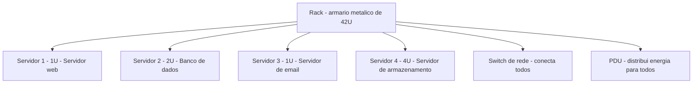
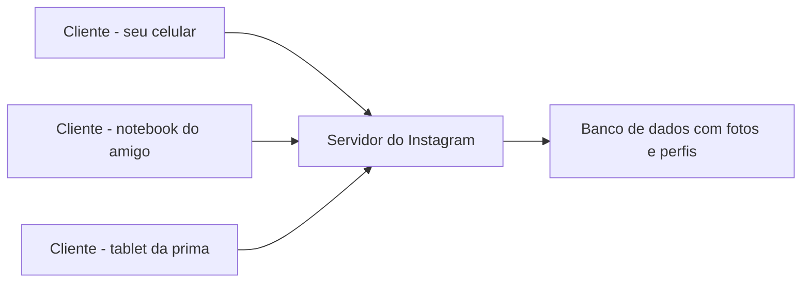
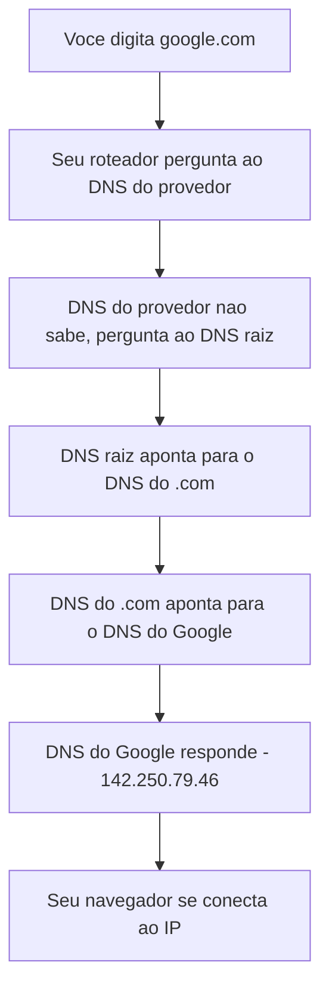
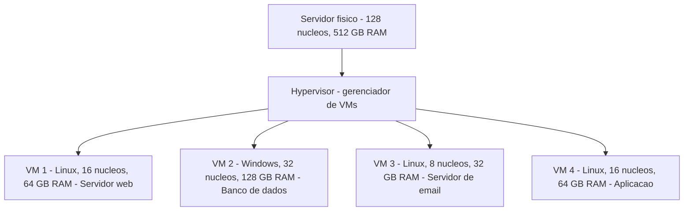
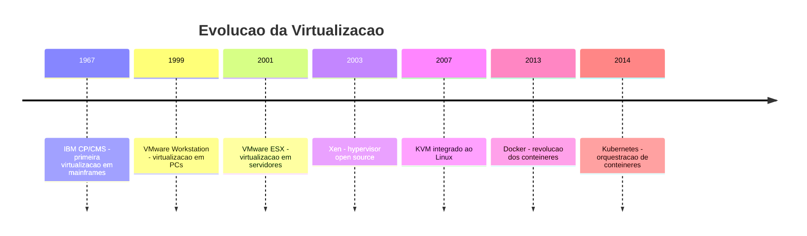
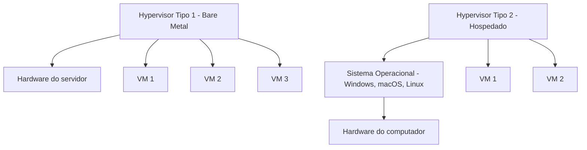
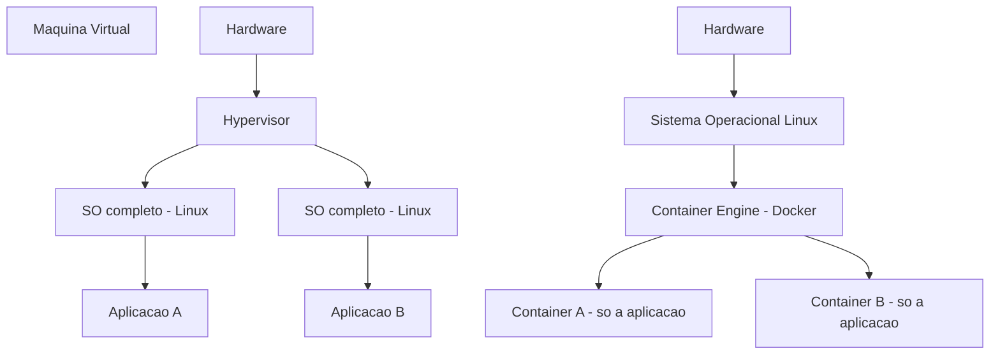
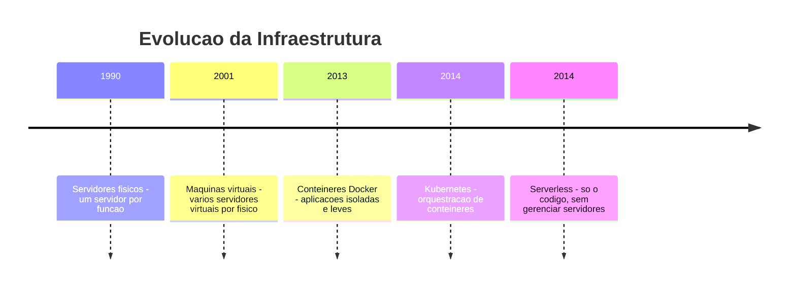
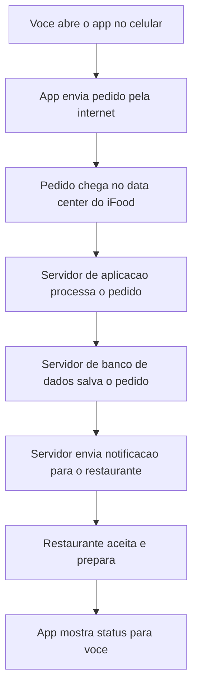

# 1.8 — Servidores, Redes, Data Centers e Virtualização

[← Anterior: Evolução dos SOs](cap01-mod07-evolucao-sistemas-operacionais.md) · [Próximo: Internet e Cloud →](cap01-mod09-internet-cloud.md)

---

## Introdução

No módulo anterior, vimos que o sistema operacional é o maestro que coordena tudo dentro de um computador. Aprendemos sobre Windows, macOS e Linux, e entendemos por que Linux é tão importante para programadores.

Agora vamos expandir a visão. Até aqui, falamos de computadores individuais — o seu notebook, o seu celular. Mas quando você acessa o Google, assiste Netflix ou envia uma mensagem pelo WhatsApp, seu computador está conversando com outros computadores. Computadores muito mais potentes, que ficam ligados 24 horas por dia, 7 dias por semana, em prédios especiais espalhados pelo mundo.

Esses computadores são chamados de **servidores**. E os prédios onde eles ficam são os **data centers**. Vamos entender como tudo isso funciona.

Este é um dos módulos mais importantes do capítulo 1, porque tudo que você vai construir como desenvolvedor — sites, aplicativos, APIs, bancos de dados — vai rodar em servidores. Entender o que são, como funcionam e como evoluíram é fundamental para a sua formação.

---

## O que é um Servidor?

Lembra da analogia da cozinha? Até agora, falamos de uma cozinha doméstica — a sua cozinha em casa, onde você prepara suas refeições. Um servidor é como a cozinha de um restaurante: muito maior, mais potente, preparada para atender centenas ou milhares de pedidos ao mesmo tempo.

Um **servidor** (server, em inglês) é um computador projetado para fornecer serviços a outros computadores. A palavra "servidor" vem exatamente disso: ele serve. Ele recebe pedidos de outros computadores e responde com o que foi solicitado — uma página web, um arquivo, o resultado de uma consulta ao banco de dados.

Mas aqui vai algo importante: um servidor não é uma máquina mágica ou fundamentalmente diferente do seu computador. Ele tem os mesmos componentes que você já conhece — CPU (o cozinheiro), RAM (a bancada de trabalho) e armazenamento (a despensa). A diferença está na escala e no propósito.

### A Diferença entre um Computador Pessoal e um Servidor

Pense assim: seu computador pessoal é como a cozinha da sua casa. Você cozinha para você e talvez para sua família. Se a geladeira quebrar, você compra outra no dia seguinte — não é o fim do mundo.

Agora imagine a cozinha de um hospital que serve 3.000 refeições por dia. Essa cozinha precisa de:

- **Fogões industriais** que não param nunca (equivalente a CPUs mais potentes)
- **Bancadas enormes** para preparar muitos pratos ao mesmo tempo (equivalente a mais RAM)
- **Câmaras frigoríficas** com capacidade para toneladas de alimentos (equivalente a mais armazenamento)
- **Gerador de energia** para o caso de faltar luz (equivalente a fontes de energia redundantes)
- **Fogões reserva** para o caso de um quebrar (equivalente a componentes redundantes)

Essa é exatamente a diferença entre seu computador e um servidor.

### Hardware de Servidor: O que Muda na Prática

Vamos olhar as diferenças concretas entre o hardware do seu computador e o de um servidor:

| Característica | Seu computador | Servidor |
|---------------|---------------|----------|
| CPU | 4-8 nucleos | 32-128 nucleos, as vezes 2 ou 4 CPUs fisicas |
| RAM | 8-16 GB | 64-512 GB, podendo chegar a vários TB |
| Tipo de RAM | DDR4 ou DDR5 comum | ECC - com correcao de erros |
| Armazenamento | 256 GB - 1 TB, 1 disco | 10-100 TB, vários discos em RAID |
| Fonte de energia | 1 fonte | 2 ou mais fontes redundantes |
| Formato fisico | Torre ou notebook | Rack - formato de prateleira |
| Disponibilidade | Liga quando você usa | Ligado 24 horas, 7 dias, 365 dias |
| Usuarios | 1 pessoa | Milhares simultaneamente |
| Ventilacao | 1-2 ventoinhas silenciosas | Ventoinhas industriais, muito barulhentas |
| Preco | R$ 3.000 - R$ 10.000 | R$ 30.000 - R$ 500.000+ |

Vamos entender alguns desses termos novos:

**ECC RAM** (Error-Correcting Code, ou Código de Correção de Erros) — é um tipo especial de memória RAM que consegue detectar e corrigir erros automaticamente. Na sua RAM comum, se um bit virar de 0 para 1 por causa de uma interferência elétrica, seu programa pode travar ou dar um resultado errado. Em um servidor que processa transações bancárias de milhões de pessoas, um erro desses seria catastrófico. A RAM ECC previne isso.

**RAID** (Redundant Array of Independent Disks, ou Conjunto Redundante de Discos Independentes) — é uma técnica que usa vários discos de armazenamento trabalhando juntos. Se um disco queimar, os dados não se perdem porque estão copiados nos outros discos. Imagine que você tem 4 despensas idênticas na cozinha — se uma pegar fogo, os ingredientes ainda estão nas outras três.

**Fontes redundantes** — servidores têm duas ou mais fontes de energia. Se uma queimar, a outra assume instantaneamente, sem que o servidor desligue. Imagine um restaurante com dois geradores de energia — se um falhar, o outro liga automaticamente e ninguém percebe.

**Formato rack** — servidores profissionais não parecem computadores comuns. Eles são finos e largos, projetados para serem empilhados em armários metálicos chamados **racks**. Um rack padrão tem 42 unidades de espaço (chamadas de "U"), e cada servidor ocupa entre 1U e 4U. Isso permite colocar dezenas de servidores em um único armário.

### Por que Servidores Existem: O Problema da Centralização

Antes de existirem servidores, cada computador era uma ilha isolada. Se você criasse um documento no seu computador, a única forma de compartilhar era copiar para um disquete e levar fisicamente até outro computador.

Nos anos 1960 e 1970, as empresas perceberam que precisavam de um lugar central para guardar dados e rodar programas que todos os funcionários pudessem acessar. Nasceu o conceito de **cliente-servidor**: um computador central (o servidor) fornece serviços, e os outros computadores (os clientes) consomem esses serviços.

Esse modelo é a base de praticamente tudo que existe na internet hoje. Quando você abre o Instagram no celular, seu celular é o cliente e os computadores do Instagram são os servidores.

---

## Tipos de Servidores em Profundidade

Servidores podem ter diferentes funções, dependendo do que precisam fazer. Vamos conhecer cada tipo em detalhes, porque quando você for desenvolvedor, vai interagir com todos eles.

### Servidor Web

O **servidor web** (web server) é o tipo mais conhecido. Ele recebe pedidos do seu navegador e responde com páginas da internet — o HTML, CSS e JavaScript que formam os sites que você visita.

Quando você digita `www.google.com` no navegador, o que acontece nos bastidores é:

1. Seu navegador envia um pedido HTTP para o servidor web do Google
2. O servidor web recebe o pedido e monta a página
3. O servidor web envia a página de volta para o seu navegador
4. Seu navegador exibe a página na tela

Os servidores web mais usados no mundo são:

| Servidor web | Criado em | Quem usa | Curiosidade |
|-------------|-----------|----------|-------------|
| Apache | 1995 | Milhoes de sites | Foi o servidor mais popular por quase 20 anos |
| Nginx | 2004 | Netflix, WordPress | Pronuncia-se engine-x, criado por um russo |
| IIS | 1995 | Sites Microsoft | Vem junto com o Windows Server |
| Caddy | 2015 | Projetos modernos | Configura HTTPS automaticamente |

Quando você aprender a criar sites e APIs nos capítulos 7 e 10, seus programas vão rodar dentro de um servidor web. Entender o que ele faz é essencial.

### Servidor de Banco de Dados

O **servidor de banco de dados** (database server) é responsável por armazenar, organizar e consultar dados. Ele é como o arquivista de uma biblioteca gigante — sabe exatamente onde cada informação está e consegue encontrá-la em milissegundos.

Quando você vê seu saldo no aplicativo do banco, o aplicativo pergunta ao servidor de banco de dados: "qual é o saldo da conta 12345?" E o servidor responde com o valor.

Bancos de dados populares:

| Banco de dados | Tipo | Quem usa | Para que serve |
|---------------|------|----------|---------------|
| PostgreSQL | Relacional | Uber, Spotify | Dados estruturados com relações complexas |
| MySQL | Relacional | Facebook, Twitter | Sites e aplicações web |
| MongoDB | Documento | eBay, Adobe | Dados flexiveis sem estrutura fixa |
| Redis | Em memória | GitHub, StackOverflow | Cache e dados que precisam ser ultra rapidos |
| SQLite | Embutido | Seu celular | Banco de dados local, sem servidor separado |

Você vai aprender a trabalhar com bancos de dados nos capítulos 7 e 10. Por enquanto, o importante é saber que eles existem e que são fundamentais para qualquer aplicação.

### Servidor de Arquivos

O **servidor de arquivos** (file server) guarda e compartilha arquivos entre vários computadores. É como um armário compartilhado no escritório — todos podem guardar e pegar documentos.

Exemplos que você usa no dia a dia:
- **Google Drive** — seus arquivos ficam em servidores de arquivos do Google
- **Dropbox** — mesma ideia, servidores da Dropbox
- **OneDrive** — servidores da Microsoft
- **iCloud** — servidores da Apple

Em empresas, servidores de arquivos internos permitem que todos os funcionários acessem documentos compartilhados sem precisar enviar por email.

### Servidor de Email

O **servidor de email** (mail server) é responsável por enviar, receber e armazenar emails. Ele funciona como uma agência dos correios digital.

Quando você envia um email do Gmail para alguém que usa Outlook, o caminho é:

1. Seu email sai do seu computador para o servidor de email do Gmail
2. O servidor do Gmail descobre onde fica o servidor do Outlook (usando DNS)
3. O servidor do Gmail envia o email para o servidor do Outlook
4. O servidor do Outlook guarda o email na caixa de entrada do destinatário
5. Quando o destinatário abre o Outlook, o email aparece

Os protocolos (regras de comunicação) usados por servidores de email são:

| Protocolo | Nome completo | O que faz |
|-----------|--------------|-----------|
| SMTP | Simple Mail Transfer Protocol | Envia emails entre servidores |
| IMAP | Internet Message Access Protocol | Permite ler emails mantendo no servidor |
| POP3 | Post Office Protocol v3 | Baixa emails para o computador local |

### Servidor de Aplicação

O **servidor de aplicação** (application server) é onde a lógica do seu programa roda. Ele é o "cérebro" por trás dos aplicativos.

Quando você faz um pedido no iFood, o servidor de aplicação é quem:
- Verifica se o restaurante está aberto
- Calcula o preço total com taxa de entrega
- Encontra um entregador disponível
- Processa o pagamento
- Envia notificações para você e para o restaurante

É aqui que o código que você vai aprender a escrever vai rodar. Quando você criar uma API em Python no capítulo 10, estará criando um servidor de aplicação.

### Servidor DNS

O **servidor DNS** (Domain Name System, ou Sistema de Nomes de Domínio) é como uma lista telefônica da internet. Ele traduz nomes legíveis por humanos (como `google.com`) em endereços IP que os computadores entendem (como `142.250.79.46`).

Sem o DNS, você teria que decorar o endereço IP de cada site que quisesse visitar. Imagine ter que digitar `142.250.79.46` toda vez que quisesse acessar o Google!

O DNS funciona em hierarquia:

Existem 13 grupos de servidores DNS raiz no mundo, identificados pelas letras A até M. Eles são a base de toda a internet — se todos caíssem ao mesmo tempo, ninguém conseguiria acessar nenhum site pelo nome.

### Servidor de Jogos

O **servidor de jogos** (game server) é responsável por manter o estado de um jogo online e sincronizar as ações de todos os jogadores.

Quando você joga Fortnite, Minecraft ou League of Legends online, existe um servidor que:
- Sabe a posição de cada jogador no mapa
- Processa cada tiro, cada movimento, cada ação
- Garante que todos os jogadores vejam a mesma coisa ao mesmo tempo
- Detecta trapaças e comportamentos suspeitos

Servidores de jogos precisam ser extremamente rápidos — a latência (o tempo de resposta) precisa ser menor que 50 milissegundos para que o jogo pareça fluido. Por isso, empresas de jogos colocam servidores em muitos países diferentes, para que os jogadores sempre tenham um servidor próximo.

### Resumo dos Tipos de Servidores

| Tipo | O que faz | Exemplo do dia a dia | Por que importa para programadores |
|------|-----------|---------------------|-----------------------------------|
| Servidor web | Entrega páginas de internet | Acessar google.com | Você vai criar sites que rodam neles |
| Banco de dados | Armazena e consulta dados | Ver saldo no banco | Você vai guardar dados dos seus apps neles |
| Servidor de arquivos | Guarda e compartilha arquivos | Google Drive | Você vai lidar com upload e download de arquivos |
| Servidor de email | Envia e recebe emails | Gmail | Você pode criar sistemas que enviam emails |
| Servidor de aplicação | Roda lógica de programas | Fazer pedido no iFood | Seu código vai rodar aqui |
| Servidor DNS | Traduz nomes em IPs | Digitar google.com | Você precisa entender como a internet encontra servidores |
| Servidor de jogos | Sincroniza jogos online | Jogar Fortnite | Se quiser criar jogos online, vai precisar de um |

Na prática, um único computador físico pode rodar vários tipos de servidor ao mesmo tempo. Vamos entender como isso funciona quando falarmos de virtualização.

---

## O que é uma Rede?

Para que seu computador converse com um servidor, eles precisam estar conectados. Essa conexão é feita por uma **rede** (network, em inglês).

Pense em uma rede de computadores como o sistema de correios. Quando você envia uma carta, ela sai da sua casa, passa pelo correio local, viaja por caminhões e aviões, e chega na casa do destinatário. Com computadores, a "carta" são os dados, e o "sistema de correios" é a rede.

### Tipos de Rede

| Tipo | Significado | Alcance | Exemplo |
|------|------------|---------|---------|
| LAN | Local Area Network - Rede Local | Um predio ou casa | Sua rede Wi-Fi em casa |
| MAN | Metropolitan Area Network - Rede Metropolitana | Uma cidade | Rede de cameras de segurança de uma prefeitura |
| WAN | Wide Area Network - Rede de Longa Distancia | Cidades ou paises | Rede de uma empresa com escritorios em várias cidades |
| Internet | Rede mundial | O mundo inteiro | A internet que você usa todo dia |

A **internet** é, na essência, uma rede gigante que conecta bilhões de computadores no mundo inteiro. Quando você acessa um site, seu computador envia uma mensagem pela internet até o servidor onde o site está hospedado, e o servidor envia a página de volta.

### IP: O Endereço do Computador

Assim como cada casa tem um endereço para receber cartas, cada computador conectado a uma rede tem um endereço chamado **IP** (Internet Protocol, ou Protocolo de Internet). O IP é um número que identifica o computador na rede.

Existem duas versões de endereços IP:

- **IPv4** — formato antigo, com 4 números separados por pontos: `192.168.1.100`. Permite cerca de 4,3 bilhões de endereços. Parece muito, mas já acabaram — existem mais dispositivos conectados do que endereços IPv4 disponíveis.
- **IPv6** — formato novo, com 8 grupos de caracteres hexadecimais: `2001:0db8:85a3:0000:0000:8a2e:0370:7334`. Permite um número absurdamente grande de endereços — o suficiente para dar um IP para cada grão de areia do planeta.

Quando você digita `google.com` no navegador, o computador precisa descobrir qual é o IP do servidor do Google. Quem faz essa tradução é o **DNS** (Domain Name System, ou Sistema de Nomes de Domínio) — é como uma lista telefônica que traduz nomes em números.

| O que você digita | O que o DNS traduz | O que acontece |
|-------------------|-------------------|----------------|
| google.com | 142.250.79.46 | Seu navegador se conecta a esse IP |
| netflix.com | 54.74.73.31 | Seu navegador se conecta a esse IP |
| github.com | 140.82.121.4 | Seu navegador se conecta a esse IP |

### Portas: As Portas do Prédio

Além do endereço IP, existe o conceito de **porta** (port). Se o IP é o endereço do prédio, a porta é o número do apartamento.

Um servidor pode rodar vários serviços ao mesmo tempo — um servidor web, um banco de dados e um servidor de email, por exemplo. Cada serviço "escuta" em uma porta diferente:

| Porta | Servico | Exemplo |
|-------|---------|---------|
| 80 | HTTP - páginas web sem criptografia | http://site.com |
| 443 | HTTPS - páginas web com criptografia | https://site.com |
| 22 | SSH - acesso remoto seguro | Conectar ao servidor via terminal |
| 25 | SMTP - envio de email | Servidor de email enviando mensagens |
| 3306 | MySQL - banco de dados | Aplicação consultando dados |
| 5432 | PostgreSQL - banco de dados | Aplicação consultando dados |
| 27017 | MongoDB - banco de dados | Aplicação consultando dados |

Quando você aprender a criar APIs no capítulo 10, vai escolher uma porta para o seu servidor. A porta mais comum para desenvolvimento local é a `8080` ou `3000`.

O endereço completo de um serviço na rede é: `IP:porta`. Por exemplo, `192.168.1.100:8080` significa "o serviço que está rodando na porta 8080 do computador com IP 192.168.1.100".

### O que é localhost?

**Localhost** é o endereço que o computador usa para se referir a si mesmo. O IP de localhost é sempre `127.0.0.1`. Quando você roda um servidor no seu computador para testar, acessa ele via `localhost:8080` (ou a porta que escolher).

Isso é extremamente útil durante o desenvolvimento. Você vai criar um servidor no seu computador, testar tudo localmente, e só depois colocar em um servidor de verdade na internet.

---

## O que é um Data Center?

Um **data center** (centro de dados) é um prédio projetado especificamente para abrigar servidores. Pense nele como um "hotel para computadores" — um lugar com energia elétrica garantida, refrigeração potente e segurança física.

### Por que Data Centers Existem?

Servidores precisam de condições especiais que a maioria dos escritórios e casas não consegue oferecer. Vamos entender cada uma dessas necessidades:

**Energia ininterrupta** — se a energia cai, os servidores desligam e os serviços param. Imagine o caos se o sistema do Pix parasse por causa de uma queda de energia. Data centers têm múltiplas camadas de proteção:
- Conexão com duas ou mais concessionárias de energia diferentes
- **UPS** (Uninterruptible Power Supply, ou Fonte de Energia Ininterrupta) — baterias gigantes que mantêm tudo funcionando por minutos enquanto os geradores ligam
- **Geradores a diesel** — motores enormes que podem manter o data center funcionando por dias, desde que tenham combustível

**Refrigeração** — servidores geram uma quantidade absurda de calor. Uma sala com centenas de servidores pode chegar a 50-60 graus Celsius sem refrigeração. Data centers gastam quase tanta energia com refrigeração quanto com os próprios servidores. Algumas técnicas usadas:
- Ar condicionado industrial com corredores quentes e frios alternados
- Resfriamento líquido direto nos processadores (como o radiador de um carro)
- Localização em países frios (a Microsoft e o Facebook têm data centers na Suécia e na Finlândia)
- O Google já experimentou colocar servidores em navios no oceano para usar a água do mar como refrigeração

**Segurança física** — os dados de milhões de pessoas estão nesses servidores. Data centers têm:
- Cercas, muros e guaritas
- Controle de acesso biométrico (impressão digital, reconhecimento facial)
- Câmeras 24 horas em todos os ângulos
- Sistemas de detecção e combate a incêndio (usando gás inerte, não água, para não danificar os equipamentos)
- Alguns data centers militares ficam dentro de montanhas ou bunkers subterrâneos

**Conexão de rede ultra rápida** — data centers têm conexões de internet de altíssima velocidade, medidas em **Gbps** (Gigabits por segundo) ou até **Tbps** (Terabits por segundo). Para comparação, sua internet em casa provavelmente é de 100-500 Mbps. Um data center grande pode ter conexões milhares de vezes mais rápidas.

### Classificação de Data Centers: Tiers

A organização **Uptime Institute** criou um sistema de classificação de data centers em 4 níveis, chamados **Tiers** (camadas). Quanto maior o Tier, mais confiável e mais caro:

| Tier | Disponibilidade | Tempo máximo fora do ar por ano | Caracteristicas |
|------|----------------|-------------------------------|-----------------|
| Tier 1 | 99,671% | 28,8 horas | Infraestrutura básica, sem redundancia |
| Tier 2 | 99,741% | 22 horas | Componentes redundantes parciais |
| Tier 3 | 99,982% | 1,6 horas | Manutenção sem parar os servicos |
| Tier 4 | 99,995% | 26 minutos | Tolerante a falhas, tudo duplicado |

Um data center Tier 4 pode ficar fora do ar no máximo 26 minutos por ano inteiro. Isso significa que praticamente nunca para. Bancos, governos e grandes empresas de tecnologia usam Tier 3 ou Tier 4.

Para atingir Tier 4, tudo precisa ser duplicado: duas entradas de energia, dois sistemas de refrigeração, dois caminhos de rede, dois de tudo. Se qualquer componente falhar, o outro assume instantaneamente.

### Escala dos Maiores Data Centers do Mundo

Para ter uma ideia da escala:

| Empresa | Data centers no mundo | Servidores estimados | Curiosidade |
|---------|----------------------|---------------------|-------------|
| Google | 30+ | Milhoes | Projeta e fábrica seus proprios servidores |
| Amazon AWS | 30+ regioes, 100+ zonas | Milhoes | Maior provedor de nuvem do mundo |
| Microsoft | 60+ regioes | Milhoes | Tem data centers ate debaixo do mar |
| Meta | 20+ | Centenas de milhares | Cada foto no Instagram esta em pelo menos 3 data centers |
| Apple | 10+ | Centenas de milhares | Suas fotos do iCloud estao la |

O data center da Microsoft em Quincy, Washington (EUA), ocupa uma área equivalente a vários campos de futebol. O Google consome tanta energia em seus data centers que investe pesado em energia solar e eólica para compensar.

Quando você faz uma busca no Google, sua requisição pode ser processada por qualquer um dos milhões de servidores espalhados pelo mundo. O Google escolhe automaticamente o servidor mais próximo de você para responder mais rápido.

### O Projeto Natick da Microsoft

Em 2018, a Microsoft fez algo inusitado: colocou um data center dentro de um cilindro selado no fundo do mar, na costa da Escócia. O projeto se chamava **Natick**. A ideia era usar a água fria do oceano para refrigeração natural e ficar perto dos cabos submarinos de internet.

O resultado? O data center submarino teve uma taxa de falhas 8 vezes menor que um data center em terra. O ambiente selado, sem oxigênio e sem umidade, protegeu os equipamentos. Embora o projeto tenha sido encerrado como experimento, ele mostrou que o futuro dos data centers pode ser bem diferente do que imaginamos.

---

## A História da Virtualização: O Problema que Precisava ser Resolvido

Agora vamos a um conceito que mudou completamente a forma como usamos computadores: a **virtualização** (virtualization, em inglês).

Para entender por que a virtualização foi inventada, precisamos entender o problema que existia antes dela.

### O Mundo Antes da Virtualização

Nos anos 1990 e início dos anos 2000, a regra era: **um servidor físico para cada função**. Se uma empresa precisava de um servidor web, um servidor de email e um servidor de banco de dados, ela comprava três computadores físicos separados.

O problema? A maioria desses servidores usava apenas 10-15% da sua capacidade. O servidor de email, por exemplo, ficava ocioso a maior parte do dia, só trabalhando de verdade quando alguém enviava ou recebia emails. Mas a empresa tinha que pagar pela energia, refrigeração e manutenção de um servidor inteiro para uma tarefa que usava uma fração mínima dos recursos.

Voltando à analogia da cozinha: imagine que você tem uma cozinha industrial enorme, com 10 fogões, 5 fornos e 3 geladeiras. Mas você só usa 1 fogão para fazer arroz, 1 forno para assar pão e 1 geladeira para guardar leite. O resto fica desligado, ocupando espaço e custando dinheiro. Que desperdício!

Esse era o cenário dos data centers antes da virtualização:

| Problema | Impacto |
|----------|---------|
| Servidores subutilizados, 10-15% de uso | Desperdicio de hardware caro |
| Um servidor por função | Muitos servidores fisicos para gerenciar |
| Cada servidor com seu proprio SO | Muitas licenças de software |
| Espaco fisico para todos os servidores | Data centers enormes e caros |
| Energia e refrigeracao para todos | Conta de luz altissima |
| Se um servidor quebra, o servico para | Sem flexibilidade para mover servicos |

### A Solução: Virtualização

A virtualização resolve esse problema permitindo criar **vários computadores virtuais dentro de um único computador físico**. Cada computador virtual (chamado de **máquina virtual** ou **VM**, de Virtual Machine) funciona como se fosse um computador independente, com seu próprio sistema operacional e programas.

Imagine que você tem uma casa muito grande, com 10 quartos, mas mora sozinho. Seria um desperdício, certo? A virtualização é como dividir essa casa em 10 apartamentos independentes — cada um com sua porta, sua cozinha e seu banheiro. Cada morador acha que tem uma casa só para ele, mas na verdade todos compartilham o mesmo prédio.

Com a virtualização, aquele servidor que usava apenas 15% da capacidade agora pode rodar 5 ou 6 máquinas virtuais, cada uma fazendo uma tarefa diferente, usando 80-90% da capacidade total. O mesmo hardware faz muito mais trabalho.

### A Origem da Virtualização

A virtualização não é uma ideia nova. Na verdade, ela nasceu nos anos 1960, na IBM. Os mainframes da IBM (computadores gigantes que ocupavam salas inteiras) já permitiam criar "partições" que funcionavam como computadores independentes. O sistema **CP/CMS** da IBM, de 1967, é considerado o primeiro sistema de virtualização da história.

Mas a virtualização só se tornou popular para servidores comuns nos anos 2000, quando a empresa **VMware** lançou produtos que permitiam virtualizar servidores x86 (os mesmos processadores que estão no seu computador). Antes disso, virtualização era coisa de mainframes caríssimos.

---

## O Hypervisor: O Gerente dos Computadores Virtuais

O software que cria e gerência máquinas virtuais é chamado de **hypervisor** (ou hipervisor, em português). Ele é como o gerente de um hotel — distribui os quartos (recursos) entre os hóspedes (máquinas virtuais) e garante que ninguém invada o quarto do outro.

Existem dois tipos de hypervisor:

### Hypervisor Tipo 1: Direto no Hardware

O hypervisor Tipo 1 (também chamado de **bare-metal**, ou "metal nu") roda diretamente no hardware do servidor, sem precisar de um sistema operacional por baixo. Ele É o sistema operacional, mas um sistema operacional especializado em gerenciar máquinas virtuais.

É como um gerente de hotel que mora no próprio hotel e cuida de tudo diretamente.

Exemplos de hypervisors Tipo 1:

| Hypervisor | Empresa | Uso principal |
|-----------|---------|--------------|
| VMware ESXi | VMware, agora Broadcom | Data centers corporativos |
| Microsoft Hyper-V | Microsoft | Servidores Windows |
| KVM | Comunidade Linux | Servidores Linux, base da nuvem |
| Xen | Comunidade open source | Base original da Amazon AWS |

### Hypervisor Tipo 2: Em Cima de um SO

O hypervisor Tipo 2 roda como um programa dentro de um sistema operacional comum (Windows, macOS ou Linux). Ele é mais lento que o Tipo 1, mas muito mais fácil de usar.

É como um gerente de hotel que trabalha de casa e administra o hotel remotamente — funciona, mas não é tão eficiente quanto estar lá presencialmente.

Exemplos de hypervisors Tipo 2:

| Hypervisor | Empresa | Uso principal |
|-----------|---------|--------------|
| VirtualBox | Oracle | Aprendizado e testes, gratuito |
| VMware Workstation | VMware | Desenvolvimento profissional |
| Parallels | Parallels | Rodar Windows no Mac |
| QEMU | Comunidade open source | Emulacao e virtualização em Linux |

Quando você aprender Linux no capítulo 2, provavelmente vai usar o **VirtualBox** para criar uma máquina virtual Linux dentro do seu Windows ou macOS. Isso permite aprender Linux sem precisar instalar nada no seu computador principal.

---

## Máquinas Virtuais em Detalhes

Uma **máquina virtual** (VM) é um computador completo simulado por software. Ela tem tudo que um computador físico tem — CPU, RAM, disco, placa de rede — mas tudo é virtual, criado pelo hypervisor.

### Como uma VM Funciona por Dentro

Quando você cria uma máquina virtual, precisa definir:

- **Quantos núcleos de CPU** ela vai ter (o hypervisor "empresta" núcleos do servidor físico)
- **Quanta RAM** ela vai usar (o hypervisor reserva uma parte da RAM física)
- **Quanto espaço em disco** ela vai ter (o hypervisor cria um arquivo grande que simula um disco)
- **Qual sistema operacional** vai ser instalado (Windows, Linux, etc.)

A VM não sabe que é virtual. Do ponto de vista do sistema operacional que roda dentro dela, ela é um computador real. Isso é chamado de **isolamento** — cada VM é completamente separada das outras.

### Snapshots: A Máquina do Tempo

Uma das funcionalidades mais úteis das máquinas virtuais é o **snapshot** (instantâneo). Um snapshot salva o estado completo da VM em um momento específico — memória, disco, configurações, tudo.

Se algo der errado depois (uma atualização que quebrou o sistema, um vírus, um teste que deu errado), você pode voltar ao snapshot e a VM retorna exatamente ao estado que estava antes. É literalmente uma máquina do tempo para computadores.

Isso é extremamente útil para:
- **Testar software** — tira um snapshot, instala o software, testa. Se não gostar, volta ao snapshot
- **Aprender** — tira um snapshot, experimenta comandos perigosos no Linux, volta ao snapshot se quebrar algo
- **Segurança** — analistas de segurança usam snapshots para estudar vírus em ambiente seguro

### Migração: Mudando de Casa sem Desligar

Outra funcionalidade incrível é a **migração ao vivo** (live migration). Ela permite mover uma máquina virtual de um servidor físico para outro sem desligá-la. Os usuários nem percebem que a VM mudou de lugar.

Isso é como mudar de apartamento enquanto você está dormindo — quando acorda, está em outro prédio, mas tudo funciona igual.

A migração ao vivo é essencial para:
- **Manutenção** — precisa trocar uma peça do servidor? Migra as VMs para outro servidor, faz a manutenção e migra de volta
- **Balanceamento de carga** — se um servidor está sobrecarregado, migra algumas VMs para servidores menos ocupados
- **Economia de energia** — à noite, quando a demanda cai, concentra todas as VMs em poucos servidores e desliga os outros

### Por que Virtualização é Importante para Programadores

| Sem virtualização | Com virtualização |
|-------------------|-------------------|
| 1 servidor fisico = 1 função | 1 servidor fisico = várias funções |
| Muito hardware subutilizado | Hardware usado de forma eficiente |
| Precisa comprar mais servidores | Cria mais VMs no mesmo servidor |
| Difícil de testar coisas novas | Cria uma VM, testa, apaga se não der certo |
| Ambiente de desenvolvimento diferente do servidor | Pode replicar o servidor exato no seu computador |
| Demora dias para preparar um novo servidor | Cria uma VM em minutos |

---

## Contêineres: A Evolução da Virtualização

Máquinas virtuais resolveram o problema do desperdício de hardware, mas trouxeram um novo problema: cada VM carrega um sistema operacional completo. Se você tem 10 VMs rodando Linux, são 10 cópias do Linux na memória, cada uma ocupando gigabytes de espaço.

Voltando à analogia: máquinas virtuais são como apartamentos completos — cada um tem sua própria cozinha, banheiro, sala. Mas e se você só precisa de um quarto? Não faz sentido construir um apartamento inteiro.

É aí que entram os **contêineres** (containers, em inglês).

### O que é um Contêiner?

Um contêiner é uma forma mais leve de isolar aplicações. Em vez de simular um computador completo com seu próprio sistema operacional, o contêiner compartilha o sistema operacional do servidor e isola apenas a aplicação e suas dependências.

Se a máquina virtual é um apartamento completo, o contêiner é um quarto de hotel — mais leve, mais rápido de preparar, mas compartilha a estrutura do hotel (elevadores, recepção, encanamento).

### Docker: A Revolução dos Contêineres

O **Docker** é a ferramenta que popularizou os contêineres. Lançado em 2013 por Solomon Hykes, o Docker tornou incrivelmente fácil criar, distribuir e rodar contêineres.

Antes do Docker, configurar um servidor para rodar uma aplicação era um processo demorado e propenso a erros. Você precisava instalar o sistema operacional, instalar as dependências, configurar tudo manualmente. E o pior: o que funcionava no seu computador muitas vezes não funcionava no servidor, porque as versões das dependências eram diferentes.

O Docker resolve isso com o conceito de **imagem**. Uma imagem Docker é como uma receita completa que inclui tudo que a aplicação precisa para rodar — o código, as dependências, as configurações. Você cria a imagem uma vez e ela roda igual em qualquer lugar: no seu computador, no servidor de testes, no servidor de produção.

A frase mais famosa do mundo Docker é: **"Works on my machine"** (funciona na minha máquina) — que era o pesadelo dos desenvolvedores antes dos contêineres. Com Docker, se funciona no seu computador, funciona em qualquer lugar.

Você vai aprender a usar Docker no capítulo 9. Por enquanto, o importante é entender o conceito.

### Máquina Virtual vs Contêiner: Comparação Detalhada

| Característica | Máquina Virtual | Container |
|---------------|----------------|-----------|
| Peso | Pesada, vários GB de tamanho | Leve, dezenas de MB |
| Tempo para iniciar | Minutos | Segundos ou menos |
| Sistema operacional | Proprio, completo | Compartilha com o host |
| Isolamento | Total - cada VM e um mundo separado | Parcial - compartilha o kernel do SO |
| Uso de recursos | Alto - cada VM reserva CPU e RAM | Baixo - compartilha recursos dinamicamente |
| Quantidade por servidor | Dezenas de VMs | Centenas ou milhares de conteineres |
| Segurança | Mais seguro - isolamento total | Menos isolado - compartilha o kernel |
| Portabilidade | Media - depende do hypervisor | Alta - roda em qualquer lugar com Docker |
| Uso principal | Ambientes completos, SOs diferentes | Aplicações individuais, microservicos |
| Exemplo de uso | Rodar Windows dentro do Linux | Rodar uma API Python isolada |

### Quando Usar Cada Um?

- **Use máquinas virtuais quando**: precisa rodar sistemas operacionais diferentes (Windows e Linux no mesmo servidor), precisa de isolamento total por segurança, ou precisa simular um ambiente completo
- **Use contêineres quando**: precisa rodar muitas instâncias da mesma aplicação, precisa de deploy rápido, ou quer garantir que a aplicação rode igual em todos os ambientes

Na prática moderna, muitas empresas usam os dois: máquinas virtuais para separar grandes ambientes e contêineres dentro das VMs para rodar as aplicações.

---

## A Evolução: De Servidores Físicos ao Serverless

A história da infraestrutura de computação é uma história de abstração crescente — cada geração esconde mais complexidade do desenvolvedor, permitindo que ele foque no que realmente importa: o código.

### Fase 1: Servidores Físicos (anos 1990-2000)

No começo, cada aplicação rodava em seu próprio servidor físico. Se você precisava de mais capacidade, comprava mais servidores. Simples, mas caro e inflexível.

- Tempo para ter um novo servidor: semanas ou meses (comprar, entregar, instalar, configurar)
- Custo: alto (hardware + energia + espaço + manutenção)
- Flexibilidade: zero (se comprou demais, desperdiça; se comprou de menos, não aguenta a demanda)

### Fase 2: Máquinas Virtuais (anos 2000-2010)

A virtualização permitiu rodar várias aplicações no mesmo servidor físico. Melhor uso dos recursos, mais flexibilidade.

- Tempo para ter um novo servidor: minutos (criar uma VM)
- Custo: menor (compartilha hardware entre várias VMs)
- Flexibilidade: boa (cria e destrói VMs conforme necessidade)

### Fase 3: Contêineres (anos 2013-presente)

Contêineres tornaram o deploy ainda mais rápido e leve. Com ferramentas como **Kubernetes** (criado pelo Google em 2014), é possível gerenciar milhares de contêineres automaticamente.

- Tempo para ter um novo servidor: segundos (iniciar um contêiner)
- Custo: ainda menor (contêineres são muito mais leves que VMs)
- Flexibilidade: excelente (escala automaticamente conforme a demanda)

### Fase 4: Serverless (anos 2014-presente)

O **serverless** (sem servidor, em tradução literal) é o nível mais alto de abstração. Você escreve apenas o código da sua função, e a nuvem cuida de todo o resto — servidores, escalabilidade, disponibilidade.

O nome é enganoso: ainda existem servidores por trás. Mas você não precisa saber nada sobre eles. É como pedir comida por delivery — você não precisa saber onde fica a cozinha, quantos cozinheiros tem, nem como a comida é preparada. Você só faz o pedido e recebe o prato pronto.

Exemplos de serviços serverless:
- **AWS Lambda** — roda funções em Python, JavaScript, Go e outras linguagens
- **Google Cloud Functions** — similar ao Lambda, do Google
- **Azure Functions** — similar, da Microsoft

---

## A Nuvem: Data Centers de Aluguel

Você já ouviu falar em "nuvem" (cloud)? A nuvem não é nada mágico — são simplesmente data centers de outras empresas que você pode alugar.

Em vez de comprar seus próprios servidores e montar seu próprio data center, você pode alugar servidores na nuvem de empresas como Amazon (AWS), Google (Google Cloud) ou Microsoft (Azure). Você paga pelo que usa, como uma conta de luz.

### Antes da Nuvem vs Depois da Nuvem

| Ter seu proprio servidor | Usar a nuvem |
|--------------------------|-------------|
| Comprar hardware caro, investimento inicial alto | Alugar por hora ou mes, sem investimento inicial |
| Manter refrigeracao e energia | A empresa cuida disso |
| Contratar equipe de manutenção | Suporte incluido |
| Capacidade fixa, mesmo se não usar tudo | Aumenta ou diminui conforme necessidade |
| Demora semanas para expandir | Expande em minutos |
| Se o hardware quebra, você resolve | A empresa troca automaticamente |
| Você e responsável pela segurança fisica | A empresa cuida da segurança |

### Os Três Grandes da Nuvem

| Provedor | Nome do servico | Participacao no mercado | Fundado em |
|----------|----------------|------------------------|------------|
| Amazon | AWS - Amazon Web Services | Cerca de 31% | 2006 |
| Microsoft | Azure | Cerca de 25% | 2010 |
| Google | Google Cloud Platform - GCP | Cerca de 11% | 2008 |

A Amazon AWS foi a pioneira e continua sendo a líder. A história é curiosa: a Amazon criou a AWS porque tinha infraestrutura sobrando. Nos meses fora da Black Friday, seus servidores ficavam ociosos. Então decidiram alugar essa capacidade para outras empresas. O que começou como um projeto secundário se tornou o negócio mais lucrativo da Amazon.

A maioria das empresas de tecnologia hoje usa a nuvem. Startups, em particular, não precisam mais investir milhões em infraestrutura — podem começar com poucos reais por mês e crescer conforme a demanda.

---

## Como Tudo se Conecta com Programação

Tudo que vimos neste módulo pode parecer distante do ato de programar, mas na verdade é o alicerce de tudo que você vai construir como desenvolvedor.

Quando você criar sua primeira API em Python no capítulo 10, ela vai rodar em um servidor. Provavelmente um servidor virtual, dentro de um contêiner Docker, hospedado em um data center de algum provedor de nuvem. Entender essa cadeia é fundamental.

Vamos ver um cenário real completo. Quando você pede uma pizza pelo aplicativo do iFood:

Cada etapa envolve servidores, redes, data centers e provavelmente virtualização ou contêineres. Tudo isso acontece em frações de segundo, de forma invisível para você.

### O Caminho do Seu Código

Quando você terminar este livro e criar seu primeiro projeto real, o caminho do seu código será mais ou menos assim:

1. Você escreve o código no seu computador (o **ambiente de desenvolvimento**)
2. Testa localmente usando `localhost` (seu computador vira um servidor temporário)
3. Empacota o código em um contêiner Docker (para garantir que rode igual em qualquer lugar)
4. Envia o contêiner para um serviço de nuvem (AWS, Google Cloud ou Azure)
5. O serviço de nuvem roda seu contêiner em um servidor virtual, dentro de um data center
6. Usuários do mundo inteiro acessam sua aplicação pela internet

Entender cada peça desse quebra-cabeça é o que separa um programador iniciante de um desenvolvedor profissional.

---

## Como a IA pode te ajudar aqui

A inteligência artificial pode ser uma ótima parceira para aprofundar os conceitos deste módulo. Experimente estes prompts:

**Prompt 1 — Explorar o conceito:**
> "Explique o que é um servidor de forma simples, como se eu nunca tivesse ouvido falar nisso. Use uma analogia com restaurante."

**Prompt 2 — Comparar alternativas:**
> "Qual a diferença entre uma máquina virtual e um contêiner Docker? Me dê exemplos práticos de quando usar cada um."

**Prompt 3 — Entender o porquê:**
> "O que é um data center Tier 4? Por que bancos e governos precisam desse nível de confiabilidade?"

**Prompt 4 — Aprofundar o tema:**
> "Explique a evolução de servidores físicos até serverless, como se fosse uma linha do tempo. O que mudou em cada fase e por quê?"

**Prompt 5 — Praticar o aprendizado:**
> "O que é um hypervisor? Qual a diferença entre Tipo 1 e Tipo 2? Qual eu usaria para aprender Linux no meu computador?"

---

## Resumo do Módulo

| Conceito | Definição |
|----------|-----------|
| Servidor | Computador potente que fornece servicos a outros computadores, projetado para ficar ligado 24 horas |
| ECC RAM | Memória com correcao de erros, usada em servidores para evitar falhas |
| RAID | Técnica que usa vários discos juntos para proteger contra perda de dados |
| Rack | Armario metalico padronizado onde servidores são empilhados |
| Cliente-servidor | Modelo onde um computador central serve e outros consomem servicos |
| Servidor web | Servidor que entrega páginas de internet usando HTTP e HTTPS |
| Servidor de banco de dados | Servidor que armazena, organiza e consulta dados |
| Servidor de aplicação | Servidor que roda a lógica dos programas |
| Servidor DNS | Servidor que traduz nomes de sites em enderecos IP |
| Rede | Conexão entre computadores para troca de dados |
| LAN | Rede local, dentro de um predio ou casa |
| WAN | Rede de longa distancia, entre cidades ou paises |
| Internet | Rede mundial que conecta bilhoes de computadores |
| IP | Endereco numerico que identifica um computador na rede |
| IPv4 | Versão antiga do IP, com 4 números separados por pontos |
| IPv6 | Versão nova do IP, com capacidade para muito mais enderecos |
| Porta | Número que identifica um servico específico em um computador |
| Localhost | Endereco que o computador usa para se referir a si mesmo, IP 127.0.0.1 |
| DNS | Sistema que traduz nomes de sites em enderecos IP |
| Data center | Predio especializado para abrigar servidores com energia, refrigeracao e segurança |
| Tier | Classificação de confiabilidade de data centers, de 1 a 4 |
| UPS | Baterias que mantem servidores ligados durante queda de energia |
| Virtualização | Tecnologia que cria vários computadores virtuais dentro de um fisico |
| Hypervisor | Software que cria e gerência máquinas virtuais |
| Hypervisor Tipo 1 | Roda direto no hardware, sem SO por baixo |
| Hypervisor Tipo 2 | Roda como programa dentro de um SO |
| Máquina virtual - VM | Computador completo simulado por software |
| Snapshot | Foto instantanea do estado de uma VM, permite voltar no tempo |
| Migração ao vivo | Mover uma VM entre servidores sem desliga-la |
| Container | Forma leve de isolar aplicações, compartilhando o SO |
| Docker | Ferramenta popular para criar e gerenciar conteineres |
| Imagem Docker | Pacote completo com tudo que uma aplicação precisa para rodar |
| Kubernetes | Ferramenta para gerenciar milhares de conteineres automaticamente |
| Serverless | Modelo onde você so escreve código e a nuvem cuida do resto |
| Nuvem - Cloud | Data centers de aluguel de empresas como AWS, Google e Azure |
| AWS | Amazon Web Services, maior servico de nuvem do mundo |
| Azure | Servico de nuvem da Microsoft |
| GCP | Google Cloud Platform, servico de nuvem do Google |

---

## Glossário do Módulo

| Termo | Definição |
|-------|-----------|
| Apache | Servidor web open source, um dos mais usados no mundo desde 1995 |
| AWS | Amazon Web Services, servico de nuvem da Amazon, lancado em 2006 |
| Azure | Servico de nuvem da Microsoft, lancado em 2010 |
| Bare-metal | Hardware fisico sem virtualização, ou hypervisor que roda direto no hardware |
| Cache | Armazenamento temporário de dados para acesso mais rápido |
| Cliente | Computador ou programa que consome servicos de um servidor |
| Cloud | Nuvem, data centers de aluguel |
| Container | Forma leve de empacotar e isolar aplicações, compartilhando o kernel do SO |
| Data center | Predio especializado para abrigar servidores |
| DNS | Domain Name System, traduz nomes de sites em enderecos IP |
| Docker | Ferramenta criada em 2013 para criar e gerenciar conteineres |
| ECC | Error-Correcting Code, tipo de RAM que corrige erros automaticamente |
| ESXi | Hypervisor Tipo 1 da VMware, usado em data centers corporativos |
| Gbps | Gigabits por segundo, unidade de velocidade de rede |
| GCP | Google Cloud Platform, servico de nuvem do Google |
| Host | Computador fisico que hospeda máquinas virtuais ou conteineres |
| HTTP | HyperText Transfer Protocol, protocolo para transferir páginas web |
| HTTPS | Versão segura do HTTP, com criptografia |
| Hypervisor | Software que gerência máquinas virtuais |
| IMAP | Internet Message Access Protocol, protocolo para ler emails no servidor |
| Internet | Rede mundial de computadores |
| IP | Internet Protocol, endereco numerico de um computador na rede |
| IPv4 | Versão 4 do IP, formato 192.168.1.1, com 4,3 bilhoes de enderecos |
| IPv6 | Versão 6 do IP, formato mais longo, com enderecos praticamente ilimitados |
| Kernel | Nucleo do sistema operacional, parte que controla o hardware |
| Kubernetes | Ferramenta do Google para orquestrar conteineres em escala, lancada em 2014 |
| KVM | Kernel-based Virtual Machine, hypervisor integrado ao Linux |
| LAN | Local Area Network, rede local |
| Latencia | Tempo que um dado leva para ir e voltar entre dois pontos da rede |
| Live migration | Migração ao vivo, mover uma VM sem desliga-la |
| Localhost | Endereco 127.0.0.1, o computador referenciando a si mesmo |
| Máquina virtual | Computador simulado por software dentro de outro computador |
| Mbps | Megabits por segundo, unidade de velocidade de rede |
| Nginx | Servidor web criado em 2004, pronuncia-se engine-x |
| POP3 | Post Office Protocol v3, protocolo para baixar emails |
| Porta | Número que identifica um servico em um computador, de 0 a 65535 |
| RAID | Redundant Array of Independent Disks, técnica de proteção de dados com vários discos |
| Rack | Armario metalico padronizado de 42U para empilhar servidores |
| Rede | Conexão entre computadores para troca de dados |
| Redundancia | Ter componentes duplicados para que se um falhar o outro assuma |
| Servidor | Computador que fornece servicos a outros computadores |
| Servidor de aplicação | Servidor que roda programas e lógica de negocios |
| Servidor de banco de dados | Servidor que armazena e consulta dados |
| Servidor DNS | Servidor que traduz nomes de dominio em enderecos IP |
| Servidor web | Servidor que entrega páginas de internet |
| Serverless | Modelo de computacao onde o desenvolvedor so escreve código |
| Snapshot | Instantaneo do estado completo de uma máquina virtual |
| SMTP | Simple Mail Transfer Protocol, protocolo para enviar emails |
| Tbps | Terabits por segundo, unidade de velocidade de rede muito alta |
| Tier | Nível de classificação de confiabilidade de data centers, de 1 a 4 |
| U | Unidade de medida de espaco em racks, equivale a 4,45 cm de altura |
| UPS | Uninterruptible Power Supply, bateria que mantem servidores ligados |
| VirtualBox | Hypervisor Tipo 2 gratuito da Oracle, usado para aprendizado |
| Virtualização | Tecnologia que cria computadores virtuais dentro de um fisico |
| VM | Virtual Machine, máquina virtual |
| VMware | Empresa pioneira em virtualização de servidores x86 |
| WAN | Wide Area Network, rede de longa distancia |
| Xen | Hypervisor open source, base original da Amazon AWS |

---

## Na Cultura Popular

- **Matrix** (filme, 1999) — a premissa do filme é que toda a realidade é uma simulação rodando em servidores gigantes. Embora seja ficção científica, o conceito de "simular um mundo inteiro em computadores" conecta diretamente com virtualização e data centers. Quando Neo descobre que vive dentro de uma máquina virtual gigante, é uma versão extrema do que hypervisors fazem todos os dias.

- **O Quinto Poder** (filme, 2013) — mostra os bastidores do WikiLeaks e como servidores espalhados pelo mundo foram usados para hospedar informações que governos queriam esconder. Ilustra bem o conceito de servidores distribuídos, redundância e a importância de data centers em múltiplos países.

- **Silicon Valley** (série, 2014-2019) — os personagens lidam constantemente com servidores, nuvem e infraestrutura. Em um episódio memorável, eles precisam decidir entre comprar servidores próprios ou usar a nuvem — exatamente o dilema que discutimos neste módulo. Mostra de forma cômica os desafios reais de escalar aplicações.

- **Halt and Catch Fire** (série, 2014-2017) — acompanha a evolução da computação dos anos 1980 aos 1990, incluindo a criação de redes, servidores e os primórdios da internet. Excelente para entender como chegamos ao mundo de data centers e nuvem que temos hoje.

---

## Para Saber Mais

- [O que é um servidor — Hostinger](https://www.hostinger.com.br/tutoriais/o-que-e-um-servidor) — *Explicação simples e visual sobre o que são servidores e como funcionam*
- [Como funciona a internet — Curso em Vídeo](https://www.youtube.com/watch?v=nlO5hySqJFA) — *Vídeo didático que explica redes e internet de forma acessível*
- [O que é virtualização — Red Hat](https://www.redhat.com/pt-br/topics/virtualization/what-is-virtualization) — *Explicação detalhada sobre VMs, contêineres e hypervisors*
- [O que é Docker — Docker Docs](https://docs.docker.com/get-started/overview/) — *Documentação oficial do Docker com explicações conceituais*
- [Projeto Natick da Microsoft](https://natick.research.microsoft.com/) — *O data center submarino da Microsoft, com fotos e vídeos*
- [GitHub do Fino](https://github.com/RafaelFino/learn-ops-content) — *Material complementar sobre infraestrutura e operações*

---

## Perguntas Frequentes (FAQ)

**P: Servidor é um computador especial ou é igual ao meu?**
R: Na essência, é o mesmo tipo de máquina — tem CPU, RAM e armazenamento. A diferença é que servidores são projetados para ficar ligados 24 horas, atender muitos usuários ao mesmo tempo e ter componentes mais potentes e redundantes (fontes duplas, RAM com correção de erros, vários discos em RAID). Mas qualquer computador pode funcionar como servidor — quando você rodar uma API no seu notebook no capítulo 10, ele estará atuando como servidor.

**P: Eu posso transformar meu computador em um servidor?**
R: Sim! Qualquer computador pode funcionar como servidor. Na verdade, quando você aprender a criar APIs no capítulo 10, seu computador vai funcionar como um servidor local. A diferença é que servidores profissionais são otimizados para isso — têm hardware redundante, ficam em data centers com energia garantida e conexão rápida. Seu notebook em casa não tem essas garantias, mas para aprender e testar, funciona perfeitamente.

**P: O que acontece quando um data center pega fogo ou sofre um desastre?**
R: Empresas sérias mantêm cópias dos dados em vários data centers diferentes, em cidades ou países diferentes. Se um data center tem problemas, outro assume automaticamente. Isso se chama redundância geográfica. Em 2021, um incêndio destruiu um data center da OVH na França, e sites que não tinham backup em outros data centers ficaram fora do ar por dias. Já sites com redundância nem foram afetados.

**P: A nuvem é segura?**
R: Geralmente sim — empresas como AWS, Google e Microsoft investem bilhões em segurança. Na maioria dos casos, seus dados estão mais seguros na nuvem do que em um servidor próprio, porque essas empresas têm equipes inteiras dedicadas à segurança 24 horas por dia. Mas nenhum sistema é 100% seguro, e a responsabilidade pela segurança é compartilhada: a empresa cuida da infraestrutura, mas você precisa cuidar do seu código e das suas senhas.

**P: Preciso entender redes para programar?**
R: Não precisa ser especialista em redes, mas entender o básico (IP, DNS, portas, como dados viajam pela internet) é muito útil e, na verdade, essencial. Quando seu programa se conecta a um banco de dados ou a uma API, você está usando redes. Quando algo não funciona e você precisa debugar, saber o básico de redes vai te salvar horas de frustração.

**P: O que é localhost e por que vou usar tanto?**
R: Localhost é o endereço que o computador usa para se referir a si mesmo. O IP é sempre `127.0.0.1`. Durante o desenvolvimento, você vai rodar servidores no seu próprio computador para testar antes de colocar na internet. Acessar `localhost:8080` significa "conecte ao serviço que está rodando na porta 8080 do meu próprio computador". Você vai usar isso centenas de vezes ao longo do curso.

**P: Docker é uma máquina virtual?**
R: Não exatamente. Docker cria contêineres, que são mais leves que máquinas virtuais. A diferença principal é que contêineres compartilham o kernel (núcleo) do sistema operacional do computador, enquanto VMs têm seu próprio SO completo. Isso torna contêineres muito mais rápidos para iniciar (segundos vs minutos) e muito mais leves (megabytes vs gigabytes).

**P: Posso usar a nuvem de graça?**
R: Sim! AWS, Google Cloud e Azure oferecem níveis gratuitos (free tier) com recursos limitados. É suficiente para aprender e fazer projetos pequenos. A AWS, por exemplo, oferece 12 meses de uso gratuito de vários serviços. O Google Cloud dá créditos iniciais. Isso é ótimo para praticar sem gastar nada.

**P: O que é latência e por que importa?**
R: Latência é o tempo que um dado leva para ir do seu computador até o servidor e voltar. Quanto mais longe o servidor, maior a latência. Por isso empresas colocam data centers em vários países — para ficar mais perto dos usuários. Se você está no Brasil e o servidor está no Japão, a latência pode ser de 300 milissegundos. Se o servidor está em São Paulo, pode ser de 10 milissegundos. Para jogos online e aplicações em tempo real, essa diferença é enorme.

**P: Wi-Fi e internet são a mesma coisa?**
R: Não! Wi-Fi é a tecnologia que conecta seu computador ao roteador sem fio (rede local, LAN). Internet é a rede mundial. Você pode ter Wi-Fi funcionando sem internet (se o provedor cair, seus dispositivos ainda se conectam ao roteador, mas não acessam sites). E pode ter internet sem Wi-Fi (usando cabo de rede ou dados móveis do celular).

**P: O que é Kubernetes e por que todo mundo fala nisso?**
R: Kubernetes (muitas vezes abreviado como K8s) é uma ferramenta criada pelo Google para gerenciar contêineres em grande escala. Imagine que você tem 500 contêineres rodando sua aplicação. Kubernetes cuida de tudo automaticamente: se um contêiner cai, ele cria outro; se a demanda aumenta, ele cria mais contêineres; se diminui, ele remove os extras. É como ter um gerente de hotel automatizado que nunca dorme.

**P: Serverless significa que não existem servidores?**
R: Não! O nome é enganoso. Servidores ainda existem — a diferença é que você não precisa se preocupar com eles. O provedor de nuvem cuida de tudo: provisionar servidores, escalar, manter disponível. Você só escreve o código da sua função e faz o deploy. É o nível mais alto de abstração — você foca 100% no código e 0% na infraestrutura.

**P: Quanto custa manter um servidor na nuvem?**
R: Depende muito do tamanho e do uso. Um servidor pequeno na AWS (equivalente a um computador básico) custa cerca de 10-30 dólares por mês. Servidores maiores podem custar centenas ou milhares de dólares. A vantagem é que você paga só pelo que usa — se seu site tem pouco tráfego, paga pouco. Se tem muito, paga mais, mas também está ganhando mais.

**P: Por que Linux domina os servidores se Windows é mais popular em desktops?**
R: Porque Linux é gratuito (não precisa pagar licença para cada servidor), é mais estável (servidores Linux ficam meses ou anos sem reiniciar), consome menos recursos (não tem interface gráfica pesada), e é mais seguro por padrão. Quando você tem milhares de servidores, a economia de não pagar licença Windows para cada um é enorme. Além disso, a maioria das ferramentas de servidor (Docker, Kubernetes, Nginx) foi criada para Linux primeiro.

**P: O que é um CDN e como se relaciona com data centers?**
R: **CDN** (Content Delivery Network, ou Rede de Distribuição de Conteúdo) é uma rede de servidores espalhados pelo mundo que guardam cópias do conteúdo de um site. Quando você acessa um site com CDN, o conteúdo vem do servidor mais próximo de você, não do servidor original. É como ter filiais de uma loja em cada bairro — em vez de todo mundo ir à matriz, cada um vai à filial mais perto. Netflix, YouTube e praticamente todo site grande usa CDN.

---

## Exercícios Práticos

**Exercício 1 — Pesquisa: Servidores no Seu Dia a Dia**

Escolha 5 aplicativos ou sites que você usa diariamente e, para cada um, responda:

1. Que tipos de servidor provavelmente estão por trás (web, banco de dados, aplicação, email, DNS)? Pode ser mais de um tipo.
2. Onde você acha que os data centers ficam? No Brasil, nos EUA, em vários países?
3. Você acha que usam nuvem (AWS, Google Cloud, Azure) ou servidores próprios?
4. Qual seria o impacto se os servidores desse serviço ficassem fora do ar por 1 hora?

Dica: pesquise no Google "{nome do serviço} infrastructure" ou "{nome do serviço} data center" para descobrir informações reais. Muitas empresas publicam artigos técnicos sobre sua infraestrutura.

**Exercício 2 — Reflexão: A Evolução da Infraestrutura**

Escreva um texto de pelo menos 15 linhas explicando, com suas próprias palavras:

1. O que é virtualização e qual problema ela resolve (use a analogia do prédio com apartamentos)
2. A diferença entre máquina virtual e contêiner (use a analogia de apartamento vs quarto de hotel)
3. Por que a nuvem mudou a forma como empresas de tecnologia funcionam
4. Como a evolução de servidores físicos para serverless beneficia programadores iniciantes como você

Dica: pense em como seria se você quisesse criar um aplicativo hoje. Você precisaria comprar servidores? Montar um data center? Ou bastaria criar uma conta na AWS e começar a programar?

**Exercício 3 — Investigação: Mapeando a Infraestrutura**

Faça o seguinte experimento no seu computador:

1. Abra o terminal (Prompt de Comando no Windows, Terminal no macOS ou Linux)
2. Digite `ping google.com` e observe o resultado. Anote o endereço IP que aparece e a latência (tempo em milissegundos)
3. Digite `ping netflix.com` e faça o mesmo
4. Digite `ping github.com` e faça o mesmo
5. Compare as latências. Qual servidor respondeu mais rápido? Por que você acha que isso acontece?

Agora pesquise:
- Em que país fica o data center mais próximo do Google para o Brasil?
- E o da Netflix?
- E o do GitHub?

Dica: a latência está diretamente relacionada à distância física entre você e o servidor. Servidores mais próximos respondem mais rápido.

**Exercício 4 — Diagrama: Desenhando a Infraestrutura**

Escolha um serviço que você usa (pode ser Instagram, Spotify, WhatsApp ou qualquer outro) e desenhe um diagrama mostrando:

1. O dispositivo do usuário (celular, computador)
2. A rede (Wi-Fi, internet)
3. O data center
4. Os tipos de servidores envolvidos (web, aplicação, banco de dados)
5. O fluxo de uma ação específica (por exemplo: "enviar uma mensagem no WhatsApp" ou "dar play em uma música no Spotify")

Pode desenhar no papel, em um programa de desenho, ou usando a sintaxe Mermaid que vimos neste módulo. O importante é visualizar como as peças se conectam.

---

[← Anterior: Evolução dos SOs](cap01-mod07-evolucao-sistemas-operacionais.md) · [Próximo: Internet e Cloud →](cap01-mod09-internet-cloud.md)
