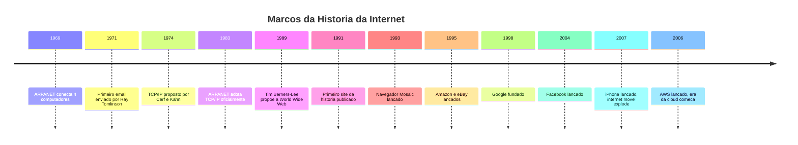
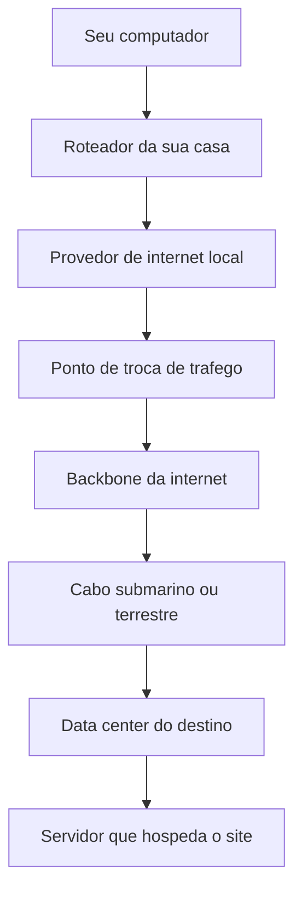
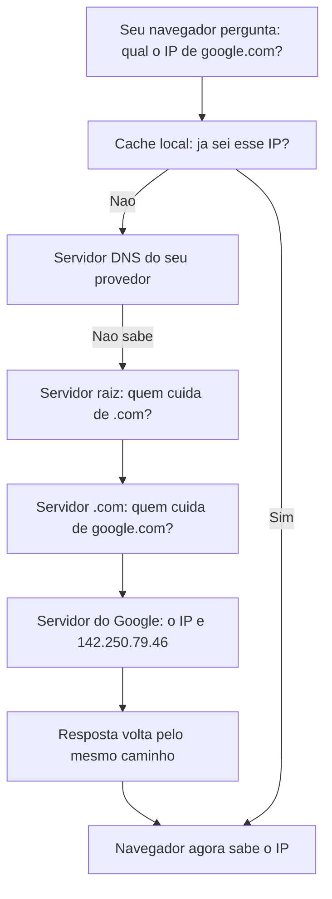
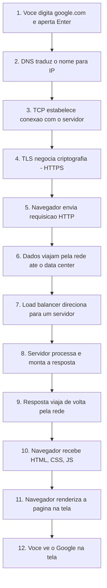
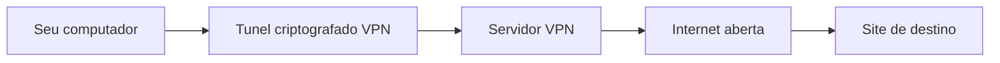
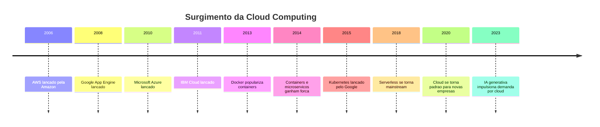
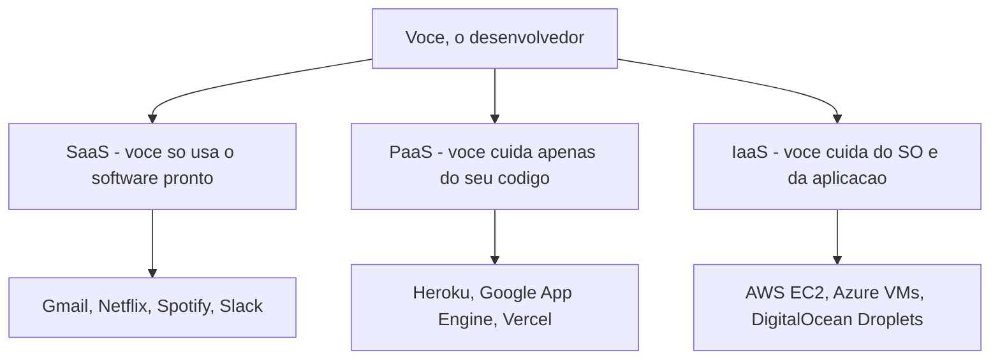
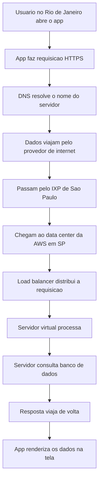

# 1.9 — Internet, Data Centers e Cloud: Onde as Coisas Ficam

[← Anterior: Servidores e Virtualização](cap01-mod08-servidores-virtualizacao.md) · [Próximo: Introdução à IA →](cap01-mod10-intro-ia.md)

---

## Introdução

No módulo anterior, vimos o que são servidores, virtualização e como máquinas virtuais permitem rodar vários sistemas em um único hardware. Agora vamos dar um passo além e entender três conceitos que são absolutamente fundamentais para qualquer desenvolvedor: **internet**, **data centers** e **cloud**.

Pense assim: no módulo anterior, aprendemos sobre os "cozinheiros" (servidores) e como eles trabalham. Agora vamos entender o "restaurante inteiro" — como os pedidos chegam até a cozinha, onde ficam as cozinhas profissionais (data centers) e como você pode alugar uma cozinha pronta em vez de construir a sua (cloud).

Quando você digita `google.com` no navegador, o que acontece? Por onde seus dados viajam? Onde ficam os servidores? Como a "nuvem" funciona de verdade? Essas perguntas parecem simples, mas as respostas envolvem uma infraestrutura física gigantesca que a maioria das pessoas nunca vê.

Neste módulo, vamos desmontar cada uma dessas camadas. Ao final, você vai entender exatamente o que acontece entre o momento em que você aperta Enter no navegador e o momento em que a página aparece na sua tela — e vai entender por que isso importa tanto para quem programa.

---

## A História da Internet: De Projeto Militar a Rede Global

Para entender a internet de hoje, precisamos voltar no tempo. A internet não surgiu do nada — ela foi o resultado de décadas de pesquisa, tentativa e erro, e muita colaboração entre universidades, governos e empresas.

### O Mundo Antes da Internet

Nos anos 1960, computadores eram máquinas enormes que ocupavam salas inteiras. Cada computador era uma ilha isolada — não conversava com nenhum outro. Se um pesquisador na Universidade da Califórnia queria compartilhar dados com um colega no MIT (Massachusetts Institute of Technology), ele precisava gravar os dados em fita magnética, colocar num envelope e enviar pelo correio. Literalmente.

Isso era um problema enorme. O governo dos Estados Unidos investia milhões em computadores para pesquisa, mas cada máquina só podia ser usada por quem estava fisicamente presente. Era como ter cozinhas incríveis espalhadas pelo país, mas nenhuma estrada conectando elas — cada cozinheiro só podia usar os ingredientes da sua própria despensa.

### ARPANET: O Avô da Internet

Em 1969, a **ARPA** (Advanced Research Projects Agency), uma agência do Departamento de Defesa dos Estados Unidos, criou a **ARPANET** — a primeira rede de computadores de longa distância do mundo.

A motivação tinha dois lados. O lado oficial era permitir que pesquisadores em universidades diferentes compartilhassem recursos computacionais. O lado estratégico, em plena Guerra Fria, era criar uma rede de comunicação que sobrevivesse a um ataque nuclear — se um ponto da rede fosse destruído, as mensagens encontrariam outro caminho.

A primeira mensagem enviada pela ARPANET foi em 29 de outubro de 1969, entre a UCLA (Universidade da Califórnia em Los Angeles) e o SRI (Stanford Research Institute). O pesquisador Charley Kline tentou digitar "LOGIN", mas o sistema travou depois de enviar apenas "LO". A primeira mensagem da internet foi, literalmente, "LO". Vinte minutos depois, conseguiram enviar a palavra completa.

No final de 1969, a ARPANET conectava apenas 4 computadores. Em 1971, já eram 15. Em 1973, a rede cruzou o Atlântico pela primeira vez, conectando computadores na Noruega e na Inglaterra.

### A Revolução da Comutação de Pacotes

Antes da ARPANET, a comunicação entre computadores funcionava como uma ligação telefônica: era preciso estabelecer uma conexão direta e exclusiva entre dois pontos. Isso se chamava **comutação de circuitos** — enquanto dois computadores conversavam, a linha ficava ocupada e ninguém mais podia usá-la.

A ARPANET introduziu um conceito revolucionário: a **comutacao de pacotes** (packet switching). Em vez de enviar dados por uma linha exclusiva, a mensagem era dividida em pequenos pedaços chamados **pacotes**. Cada pacote recebia um endereço de destino e era enviado independentemente pela rede. Os pacotes podiam seguir caminhos diferentes e ser remontados na ordem correta no destino.

Imagine que você precisa enviar um livro de São Paulo para o Rio de Janeiro. Na comutação de circuitos, seria como reservar uma estrada inteira só para o seu caminhão — ninguém mais poderia usar aquela estrada até o livro chegar. Na comutação de pacotes, você arranca as páginas do livro, numera cada uma, e envia cada página por um motoboy diferente. Cada motoboy pode pegar a estrada que estiver mais livre. No destino, as páginas são reorganizadas na ordem correta.

Essa ideia foi proposta independentemente por dois pesquisadores: **Paul Baran** nos Estados Unidos e **Donald Davies** no Reino Unido. É um dos conceitos mais importantes da história da computação — e é exatamente assim que a internet funciona até hoje.

### TCP/IP: A Linguagem Universal da Internet

Nos anos 1970, a ARPANET crescia, mas havia um problema: diferentes redes usavam protocolos diferentes. Era como se cada país falasse uma língua diferente e não houvesse tradutores.

Em 1974, **Vint Cerf** e **Bob Kahn** publicaram um artigo propondo o **TCP/IP** (Transmission Control Protocol / Internet Protocol) — um conjunto de regras que permitiria que qualquer rede conversasse com qualquer outra rede. Essa foi a verdadeira invenção da "internet" como conceito: uma rede de redes.

O TCP/IP funciona em camadas, como uma cebola. Cada camada tem uma responsabilidade específica:


| Camada | Nome | O que faz | Analogia |
|--------|------|-----------|----------|
| 4 | Aplicação | Define como programas se comunicam | A conversa entre duas pessoas |
| 3 | Transporte | Garante que dados cheguem completos e na ordem | O servico de entrega que rastreia pacotes |
| 2 | Internet | Endereca e roteia pacotes entre redes | O sistema de CEP dos Correios |
| 1 | Acesso a rede | Transmite bits pelo meio fisico | A estrada, o caminhao, o aviao |

Quando você envia uma mensagem, ela desce pelas camadas: a aplicação cria a mensagem, o transporte divide em pacotes e numera, a camada de internet coloca o endereço de destino, e a camada de acesso à rede envia pelos cabos. No destino, o processo é invertido: os bits chegam, são reorganizados em pacotes, remontados na ordem correta e entregues à aplicação.

Em 1983, a ARPANET adotou oficialmente o TCP/IP. Essa data — 1 de janeiro de 1983 — é considerada por muitos como o "nascimento da internet".

### A World Wide Web: A Internet que Você Conhece

A internet existia desde 1983, mas era usada quase exclusivamente por pesquisadores e militares. Não havia sites, não havia navegadores, não havia links clicáveis. Para usar a internet, você precisava digitar comandos em um terminal.

Em 1989, **Tim Berners-Lee**, um cientista britânico trabalhando no CERN (o laboratório europeu de física de partículas), propôs um sistema para compartilhar documentos entre pesquisadores. Ele inventou três coisas que mudaram o mundo:

1. **HTML** (HyperText Markup Language) — a linguagem para criar páginas
2. **HTTP** (HyperText Transfer Protocol) — o protocolo para transferir páginas
3. **URL** (Uniform Resource Locator) — o sistema de endereços (como `www.exemplo.com/página`)

Em 1991, o primeiro site da história foi publicado: `info.cern.ch`. Era uma página simples explicando o que era a World Wide Web.

Em 1993, o navegador **Mosaic** foi lançado — o primeiro navegador com interface gráfica que permitia ver imagens junto com texto. A internet deixou de ser coisa de especialista e começou a chegar ao público geral.



---

## O que é a Internet, de Verdade?

A internet não é uma "nuvem" mágica flutuando no ar. A internet é uma **rede física de cabos, roteadores e servidores** que conecta computadores no mundo inteiro. Vamos entender cada pedaço dessa infraestrutura.

### A Infraestrutura Física

A maior parte do tráfego da internet viaja por **cabos submarinos** — cabos de fibra óptica que cruzam oceanos no fundo do mar. Existem mais de 500 cabos submarinos ativos no mundo, totalizando mais de 1,3 milhão de quilômetros de cabo. Se você esticasse todos esses cabos em linha reta, daria para ir da Terra à Lua mais de três vezes.

Quando você envia uma mensagem para alguém nos Estados Unidos, seus dados viajam por cabos que cruzam o Oceano Atlântico no fundo do mar. Não é satélite — é cabo físico, com a espessura de uma mangueira de jardim, protegido por camadas de aço e plástico, repousando no fundo do oceano a milhares de metros de profundidade.

Esses cabos são instalados por navios especializados que custam centenas de milhões de dólares. O processo de instalação pode levar meses. E quando um cabo quebra — por âncora de navio, terremoto submarino ou até mordida de tubarão (sim, isso acontece) — navios de reparo precisam ir até o local, pescar o cabo do fundo do oceano e consertá-lo.

| Componente | O que faz | Onde fica |
|-----------|-----------|-----------|
| Cabos submarinos | Conectam continentes | Fundo do oceano |
| Cabos terrestres | Conectam cidades e regioes | Enterrados ou em postes |
| Pontos de troca de trafego | Conectam provedores entre si | Predios em grandes cidades |
| Provedores de internet | Conectam você a rede | Torres, postes, centrais |
| Roteadores | Direcionam dados pelo melhor caminho | Em cada no da rede |
| Servidores DNS | Traduzem nomes em enderecos IP | Data centers espalhados pelo mundo |
| CDNs | Armazenam copias de conteúdo perto dos usuarios | Data centers regionais |

### Pontos de Troca de Tráfego: Onde Provedores se Encontram

Um conceito importante que muita gente não conhece são os **IXPs** (Internet Exchange Points), ou **pontos de troca de tráfego**. São locais físicos — geralmente prédios em grandes cidades — onde diferentes provedores de internet se conectam entre si.

Sem os IXPs, se você usasse o provedor A e quisesse acessar um site hospedado no provedor B, seus dados teriam que viajar até um ponto central (possivelmente em outro país) e voltar. Com os IXPs, os provedores se conectam diretamente, e os dados ficam na mesma cidade.

O Brasil tem um dos maiores IXPs do mundo: o **IX.br** (antigo PTT.br), operado pelo NIC.br. O ponto de São Paulo é um dos maiores do planeta em volume de tráfego, chegando a mais de 20 Tbps (terabits por segundo) de pico. Isso significa que uma quantidade absurda de dados passa por esse ponto todos os dias.

### Como os Dados Viajam

Quando você acessa um site, seus dados passam por vários "saltos" até chegar ao destino:



Cada "salto" adiciona um pouco de tempo. Esse tempo é chamado de **latência** (latency) — o atraso entre enviar um dado e receber a resposta. Quanto mais longe o servidor, maior a latência. É por isso que empresas colocam servidores em vários países — para ficar mais perto dos usuários.

Para ter uma ideia concreta: a latência entre São Paulo e um servidor em São Paulo é de cerca de 1-5 milissegundos. Entre São Paulo e Nova York, cerca de 120-150 milissegundos. Entre São Paulo e Tóquio, cerca de 250-300 milissegundos. Parece pouco, mas quando uma página web precisa fazer dezenas de requisições, esses milissegundos se acumulam.

---

## Como a Internet Funciona: O que Acontece Quando Você Digita google.com

Vamos acompanhar, passo a passo, o que acontece desde o momento em que você digita `google.com` no navegador até ver a página de busca na tela. Cada etapa envolve conceitos que vamos aprofundar ao longo do curso.

### Passo 1: O DNS Traduz o Nome em Número

Computadores não entendem nomes como `google.com`. Eles trabalham com números — endereços **IP** (Internet Protocol). Cada computador conectado à internet tem um endereço IP único, como `142.250.79.46`.

O **DNS** (Domain Name System, ou Sistema de Nomes de Domínio) é como a agenda de contatos do seu celular. Quando você quer ligar para a Maria, não digita o número de telefone — procura pelo nome "Maria" e o celular encontra o número. O DNS faz a mesma coisa: você digita `google.com` e o DNS encontra o IP `142.250.79.46`.

Mas o DNS não é um único servidor. É um sistema hierárquico distribuído pelo mundo inteiro:



Existem apenas 13 grupos de **servidores raiz** (root servers) no mundo, identificados pelas letras A até M. Eles são a base de toda a resolução de nomes na internet. Se todos os servidores raiz parassem de funcionar ao mesmo tempo, a internet como conhecemos deixaria de funcionar em poucas horas. Por isso, cada "servidor raiz" é na verdade um conjunto de centenas de servidores espalhados pelo mundo, usando uma técnica chamada **anycast** para garantir redundância.

### Passo 2: A Conexão TCP é Estabelecida

Agora que o navegador sabe o IP do Google, ele precisa estabelecer uma conexão. Isso é feito usando o protocolo **TCP** (Transmission Control Protocol).

O TCP funciona como uma ligação telefônica: antes de começar a conversar, os dois lados precisam confirmar que estão prontos. Isso é feito em três passos, chamados de **three-way handshake** (aperto de mão em três vias):

1. Seu computador envia: "Oi, quero conversar" (SYN)
2. O servidor responde: "Oi, estou pronto, e você?" (SYN-ACK)
3. Seu computador confirma: "Estou pronto também, vamos la" (ACK)

Só depois desse "aperto de mão" os dados começam a ser transmitidos. Isso garante que ambos os lados estão prontos e que a conexão é confiável.

### Passo 3: A Requisição HTTP/HTTPS é Enviada

Com a conexão TCP estabelecida, o navegador envia uma **requisição HTTP** (ou HTTPS, a versão segura). Essa requisição é basicamente uma mensagem dizendo: "Por favor, me envie a página principal do Google."

Uma requisição HTTP simplificada se parece com isso:

```
GET / HTTP/1.1
Host: www.google.com
Accept: text/html
```

Isso diz: "Quero obter (GET) a página raiz (/) usando HTTP versão 1.1, do servidor www.google.com, e aceito receber HTML."

No caso do HTTPS, antes de enviar a requisição, acontece mais uma etapa: a **negociação TLS** (Transport Layer Security). Nessa etapa, o navegador e o servidor combinam uma chave de criptografia para que ninguém no meio do caminho consiga ler os dados. Vamos falar mais sobre isso na seção de segurança.

### Passo 4: O Servidor Processa e Responde

A requisição chega ao data center do Google. Um **load balancer** (balanceador de carga) recebe a requisição e decide qual dos milhares de servidores vai processá-la. O servidor escolhido monta a página HTML com os resultados e envia de volta.

A resposta se parece com isso:

```
HTTP/1.1 200 OK
Content-Type: text/html

<html>
  <head><title>Google</title></head>
  <body>...</body>
</html>
```

O `200 OK` significa que deu tudo certo. Existem outros códigos que você vai aprender no capítulo 10: `404` significa "página não encontrada", `500` significa "erro no servidor", `301` significa "essa página mudou de endereço".

### Passo 5: O Navegador Renderiza a Página

O navegador recebe o HTML e começa a **renderizar** (desenhar) a página na tela. Mas uma página moderna não é só HTML — ela também precisa de:

- **CSS** (Cascading Style Sheets) — define as cores, fontes, layout
- **JavaScript** — adiciona interatividade (botões que funcionam, animações)
- **Imagens, fontes, ícones** — recursos visuais

Para cada um desses recursos, o navegador faz uma nova requisição HTTP. Uma página típica pode fazer 50 a 100 requisições para carregar completamente. É por isso que sites pesados demoram mais para carregar — não é uma requisição, são dezenas.

### O Caminho Completo



Tudo isso acontece em menos de 1 segundo. Cada etapa envolve conceitos que vamos aprofundar ao longo do curso: protocolos (capítulo 10), servidores (capítulo 9), HTML/CSS (capítulo 10), JavaScript (mencionado no capítulo 10).

---

## Protocolos da Internet: As Regras da Comunicação

Para que computadores diferentes consigam conversar, eles precisam seguir regras — chamadas **protocolos** (protocols). É como o idioma: se você fala português e a outra pessoa fala japonês, vocês não vão se entender. Protocolos são o "idioma" que os computadores combinam de usar.

Já vimos TCP/IP e HTTP brevemente. Agora vamos conhecer os principais protocolos que fazem a internet funcionar:

### HTTP e HTTPS: O Protocolo da Web

**HTTP** (HyperText Transfer Protocol) é o protocolo que seu navegador usa para pedir páginas web. Toda vez que você acessa um site, seu navegador está "falando HTTP" com o servidor.

O HTTP funciona no modelo **requisição-resposta**: o cliente (seu navegador) pede algo, e o servidor responde. É como um restaurante: você faz o pedido (requisição) e o garçom traz o prato (resposta).

**HTTPS** é o HTTP com uma camada de segurança chamada **TLS** (Transport Layer Security). A diferença é que no HTTPS, todos os dados são criptografados — mesmo que alguém intercepte a comunicação no meio do caminho, não consegue ler o conteúdo. Hoje, praticamente todos os sites usam HTTPS. Seu navegador mostra um cadeado na barra de endereço quando a conexão é segura.

### FTP: Transferência de Arquivos

**FTP** (File Transfer Protocol, ou Protocolo de Transferência de Arquivos) é um protocolo antigo, criado em 1971, usado para transferir arquivos entre computadores. Antes da web existir, o FTP era a principal forma de compartilhar arquivos pela internet.

Hoje o FTP ainda é usado em alguns cenários, como enviar arquivos para servidores web, mas está sendo substituído por alternativas mais seguras como **SFTP** (SSH File Transfer Protocol) e transferências via HTTPS.

### SSH: Acesso Remoto Seguro

**SSH** (Secure Shell) é o protocolo que desenvolvedores usam para acessar servidores remotamente. Quando você precisa configurar um servidor Linux na cloud, você usa SSH para se conectar a ele pelo terminal, como se estivesse sentado na frente do computador.

O SSH criptografa toda a comunicação, então é seguro usar mesmo pela internet pública. Você vai usar SSH bastante quando começar a trabalhar com servidores no capítulo 9.

### SMTP, POP3 e IMAP: Email

O email usa três protocolos diferentes:

| Protocolo | O que faz | Analogia |
|-----------|-----------|----------|
| SMTP | Envia emails | O carteiro que leva sua carta ate o correio |
| POP3 | Baixa emails para seu computador | Você vai ao correio e retira suas cartas |
| IMAP | Acessa emails no servidor | Você le suas cartas no correio sem levar para casa |

**SMTP** (Simple Mail Transfer Protocol) é usado para enviar emails. **POP3** (Post Office Protocol) baixa os emails para o seu computador e os remove do servidor. **IMAP** (Internet Message Access Protocol) permite que você leia os emails diretamente no servidor, sem baixar — é por isso que quando você lê um email no celular, ele também aparece como lido no computador.

### WebSocket: Comunicação em Tempo Real

Os protocolos que vimos até agora funcionam no modelo requisição-resposta: o cliente pede, o servidor responde. Mas e quando o servidor precisa enviar dados para o cliente sem ser perguntado? Por exemplo, em um chat ao vivo ou em uma partida de jogo online?

Para isso existe o **WebSocket** — um protocolo que mantém uma conexão aberta entre cliente e servidor, permitindo que ambos enviem dados a qualquer momento. É como uma ligação telefônica em vez de troca de cartas.

### Resumo dos Protocolos

| Protocolo | Significado | O que faz | Porta padrão |
|-----------|------------|-----------|-------------|
| HTTP | HyperText Transfer Protocol | Acessar páginas web | 80 |
| HTTPS | HTTP Secure | Acessar páginas web com criptografia | 443 |
| FTP | File Transfer Protocol | Transferir arquivos | 21 |
| SSH | Secure Shell | Acesso remoto seguro a servidores | 22 |
| SMTP | Simple Mail Transfer Protocol | Enviar emails | 25 e 587 |
| POP3 | Post Office Protocol v3 | Baixar emails | 110 |
| IMAP | Internet Message Access Protocol | Acessar emails no servidor | 143 |
| DNS | Domain Name System | Traduzir nomes em IPs | 53 |
| WebSocket | WebSocket Protocol | Comunicação bidirecional em tempo real | 80 e 443 |

A coluna "porta padrão" pode parecer estranha agora, mas faz sentido com uma analogia: se o endereço IP é o endereço de um prédio, a **porta** é o número do apartamento. Um servidor pode ter vários serviços rodando ao mesmo tempo — o serviço web atende na porta 80, o email na porta 25, o SSH na porta 22. Quando seu navegador acessa `https://google.com`, ele está na verdade acessando `https://google.com:443` — a porta 443 é implícita para HTTPS.

---


## Segurança na Internet: Protegendo Dados em Trânsito

Quando seus dados viajam pela internet, eles passam por dezenas de roteadores, cabos e equipamentos que pertencem a empresas diferentes. Qualquer um desses pontos intermediários poderia, em teoria, interceptar e ler seus dados. É como enviar uma carta aberta pelo correio — qualquer pessoa que manuseie a carta pode ler o conteúdo.

Para resolver esse problema, existem várias camadas de segurança.

### HTTPS e Certificados SSL/TLS

Quando você acessa um site com HTTPS (aquele cadeado no navegador), seus dados são **criptografados** — transformados em uma sequência de caracteres que só o destinatário consegue decifrar.

Isso é feito usando **TLS** (Transport Layer Security), que substituiu o antigo **SSL** (Secure Sockets Layer). O processo funciona assim:

1. Seu navegador pede ao servidor seu **certificado digital** — um documento eletrônico que prova que o servidor é quem diz ser
2. O navegador verifica se o certificado foi emitido por uma **autoridade certificadora** (CA - Certificate Authority) confiável
3. Se o certificado é válido, navegador e servidor combinam uma **chave de criptografia** temporária
4. A partir desse momento, todos os dados trocados são criptografados com essa chave

É como se, antes de trocar cartas, você e seu amigo combinassem um código secreto que só vocês dois conhecem. Mesmo que alguém intercepte a carta, não consegue entender o conteúdo.

### Firewalls: Os Porteiros da Rede

Um **firewall** (parede de fogo) é um sistema que controla o tráfego de rede, decidindo o que pode entrar e o que pode sair. Funciona como o porteiro de um prédio: verifica quem está tentando entrar e só permite acesso autorizado.

Firewalls existem em vários níveis:
- No seu computador (firewall pessoal)
- No roteador da sua casa
- Na entrada de redes corporativas
- Na entrada de data centers

Eles analisam cada pacote de dados e decidem se ele deve ser permitido ou bloqueado, baseado em regras como: "permitir tráfego na porta 443 (HTTPS), bloquear tráfego na porta 23 (Telnet, inseguro)".

### VPN: Túnel Seguro pela Internet

Uma **VPN** (Virtual Private Network, ou Rede Privada Virtual) cria um "túnel" criptografado entre seu computador e um servidor VPN. Todo o seu tráfego de internet passa por esse túnel, de forma que ninguém no meio do caminho — nem seu provedor de internet — consegue ver o que você está acessando.



VPNs são muito usadas por empresas para permitir que funcionários acessem a rede interna de casa, como se estivessem no escritório. Também são usadas por desenvolvedores para acessar servidores em ambientes de produção de forma segura.

### Por que Segurança Importa para Desenvolvedores

Quando você criar aplicações no capítulo 10, vai precisar pensar em segurança desde o início:

- Suas APIs devem usar HTTPS, nunca HTTP
- Senhas de usuários devem ser armazenadas de forma criptografada (nunca em texto puro)
- Conexões com bancos de dados devem ser protegidas
- Dados sensíveis (cartões de crédito, documentos) precisam de criptografia extra

Segurança não é algo que você "adiciona depois" — é algo que precisa estar no design desde o começo. Vamos aprofundar esses conceitos nos capítulos de programação.

---

## Data Centers: Os Prédios da Internet

Um **data center** é um prédio (ou conjunto de prédios) projetado especificamente para abrigar servidores. Não é um escritório com alguns computadores — é uma instalação industrial com requisitos muito específicos.

### O que tem dentro de um Data Center?

Imagine uma cozinha industrial gigantesca. Não é a cozinha da sua casa — é a cozinha de um restaurante que serve milhões de refeições por dia. Tudo é projetado para eficiência, redundância e segurança.

| Componente | Função | Por que e necessário |
|-----------|--------|---------------------|
| Racks de servidores | Armarios com dezenas de servidores empilhados | Organizar e otimizar espaco |
| Sistema de refrigeracao | Manter temperatura entre 18-27 graus | Servidores geram muito calor |
| Geradores diesel | Fornecer energia se a rede eletrica falhar | Servidores não podem desligar |
| Baterias UPS | Manter energia nos segundos entre a queda e o gerador ligar | Zero interrupcao |
| Conexões de rede redundantes | Multiplas conexões de internet | Se uma cair, outra assume |
| Segurança fisica | Cameras, biometria, guardas | Proteger dados e equipamentos |
| Sistema contra incendio | Detectar e apagar fogo sem agua | Agua destruiria os servidores |

Um detalhe interessante: o sistema contra incêndio de um data center não usa água (que destruiria os servidores). Em vez disso, usa gases especiais que removem o oxigênio do ambiente, apagando o fogo sem danificar os equipamentos. Alguns data centers modernos usam sistemas que detectam fumaça em estágios tão iniciais que conseguem agir antes mesmo de haver chamas visíveis.

### O Custo de Manter um Data Center

Para ter uma ideia da escala: um data center de grande porte consome tanta energia quanto uma cidade pequena. O Google, por exemplo, consumiu mais de 18,3 terawatts-hora de eletricidade em 2022 — mais do que muitos países inteiros.

A refrigeração é um dos maiores custos. Servidores geram tanto calor que, sem refrigeração, a temperatura de uma sala de servidores pode ultrapassar 40 graus em minutos. Algumas empresas estão experimentando soluções criativas:
- A Microsoft testou colocar data centers no fundo do mar, usando a água fria do oceano para refrigeração
- O Facebook construiu data centers no norte da Suécia, onde o ar frio natural ajuda na refrigeração
- O Google usa inteligência artificial para otimizar seus sistemas de refrigeração, economizando 30% de energia

### Níveis de Data Center: Tiers

Data centers são classificados em níveis (tiers) pelo Uptime Institute, uma organização que define padrões globais:

| Tier | Disponibilidade | Tempo máximo fora do ar por ano | Redundancia | Uso tipico |
|------|----------------|--------------------------------|-------------|-----------|
| Tier I | 99.671% | 28.8 horas | Nenhuma | Pequenas empresas |
| Tier II | 99.741% | 22 horas | Parcial | Empresas medias |
| Tier III | 99.982% | 1.6 horas | N+1 | Grandes empresas |
| Tier IV | 99.995% | 26 minutos | 2N | Bancos, governos, big tech |

Um data center Tier IV fica fora do ar no máximo 26 minutos por ano. Para conseguir isso, tudo é duplicado: dois sistemas de energia, dois de refrigeração, duas conexões de rede. Se qualquer componente falhar, o backup assume instantaneamente. A redundância "2N" significa que existe o dobro de tudo que é necessário.

Esses números podem parecer abstratos, mas pense assim: se o sistema de pagamentos de um banco ficar fora do ar por 1 hora, milhões de transações são perdidas. Se o sistema de emergência de um hospital parar, vidas estão em risco. É por isso que esses ambientes exigem Tier IV.

### Onde ficam os Data Centers?

Data centers são construídos em locais estratégicos, e a escolha do local não é aleatória:

- **Perto de fontes de energia barata** — energia é o maior custo de um data center (pode representar 40-60% do custo operacional)
- **Em climas frios** — reduz o custo de refrigeração (por isso muitos ficam na Escandinávia, Irlanda e norte dos EUA)
- **Perto de cabos submarinos** — para ter conexão rápida com o resto do mundo
- **Em regiões geologicamente estáveis** — longe de terremotos, furacões e enchentes
- **Perto de centros urbanos** — para reduzir a latência para os usuários

O Brasil tem data centers importantes em São Paulo (principal hub de internet da América Latina, com o maior IXP do hemisfério sul), Rio de Janeiro e Fortaleza (ponto de chegada de cabos submarinos que conectam o Brasil à Europa e à África).

---

## Cloud: Data Centers de Aluguel

Agora que você entende o que é um data center, fica fácil entender o que é **cloud** (nuvem): são data centers de empresas como Amazon, Google e Microsoft que você pode alugar. Em vez de comprar e manter seus próprios servidores, você usa os deles e paga pelo uso.

### O Problema que a Cloud Resolve

Antes da cloud, se você quisesse colocar um site ou aplicação no ar, precisava:

1. **Comprar servidores** — milhares de reais em hardware
2. **Alugar espaço em um data center** — milhares de reais por mês
3. **Contratar equipe** para instalar, configurar e manter os servidores
4. **Planejar capacidade para o pico** — se seu site tem 1000 acessos por dia mas 100.000 na Black Friday, você precisava de servidores para 100.000 o ano inteiro, desperdiçando 99% da capacidade nos outros 364 dias
5. **Lidar com falhas de hardware** — se um disco quebrasse às 3 da manhã, alguém precisava ir ao data center trocar

Voltando à analogia da cozinha: era como se, para abrir um restaurante, você precisasse construir o prédio, comprar todos os equipamentos, contratar uma equipe de manutenção e ter uma cozinha grande o suficiente para o dia mais movimentado do ano — mesmo que na maioria dos dias ela ficasse quase vazia.

A cloud resolveu tudo isso: você aluga a cozinha por hora, paga só pelas bocas de fogão que usar, e a empresa dona do prédio cuida de toda a manutenção.

### A História da Cloud: Como a Amazon Mudou Tudo

A história da cloud computing moderna começa com a Amazon. No início dos anos 2000, a Amazon enfrentava um problema: sua infraestrutura de servidores precisava ser dimensionada para a Black Friday — o dia de maior tráfego do ano. Nos outros 364 dias, a maior parte dessa infraestrutura ficava ociosa.

Em 2003, um engenheiro da Amazon chamado **Chris Pinkham** foi enviado para a África do Sul (onde morava sua esposa) com a missão de criar um serviço que permitisse a qualquer pessoa alugar capacidade computacional pela internet. Em 2006, a **AWS** (Amazon Web Services) foi lançada oficialmente com dois serviços: **S3** (armazenamento) e **EC2** (servidores virtuais).

A ideia era revolucionária: em vez de comprar servidores, você podia alugar capacidade computacional por hora, como alugar um carro. Precisa de mais? Aluga mais. Não precisa mais? Devolve e para de pagar.

Hoje, a AWS é maior que o próprio e-commerce da Amazon em termos de lucro. O que começou como uma forma de aproveitar infraestrutura ociosa se tornou o negócio mais lucrativo da empresa.

### Os Três Grandes Provedores

| Provedor | Nome do servico | Lancamento | Posição no mercado | Diferencial |
|----------|----------------|-----------|-------------------|-------------|
| Amazon | AWS | 2006 | Lider de mercado | Maior variedade de servicos |
| Microsoft | Azure | 2010 | Segundo lugar | Integração com produtos Microsoft |
| Google | Google Cloud | 2008 | Terceiro lugar | Forca em IA e dados |

Existem outros provedores menores mas relevantes: **IBM Cloud**, **Oracle Cloud**, **DigitalOcean** (popular entre desenvolvedores independentes por ser mais simples), **Alibaba Cloud** (líder na China) e provedores brasileiros como **Locaweb** e **UOL Host**.



### Como a Cloud Funciona na Prática

Quando uma startup cria um aplicativo hoje, ela não compra servidores. Ela faz o seguinte:

1. Cria uma conta na AWS, Azure ou Google Cloud
2. Escolhe o tipo de servidor virtual que precisa (CPU, RAM, armazenamento)
3. O provedor cria uma máquina virtual em segundos
4. A startup coloca seu código nessa máquina
5. Se precisar de mais capacidade, cria mais máquinas em minutos
6. Se não precisar mais, desliga e para de pagar

Isso é revolucionário. Uma startup pode começar gastando 10 reais por mês e escalar para milhões de usuários sem comprar um único servidor físico. O Netflix, por exemplo, roda inteiramente na AWS — são milhares de servidores virtuais que aumentam e diminuem automaticamente conforme a demanda. No horário de pico (à noite, quando todo mundo está assistindo), o Netflix usa muito mais servidores do que de madrugada.

### Modelos de Serviço na Cloud: IaaS, PaaS e SaaS

A cloud oferece diferentes níveis de serviço. A diferença entre eles é o quanto de responsabilidade fica com você e o quanto fica com o provedor.

Vamos usar a analogia da cozinha:

- **IaaS** (Infrastructure as a Service) — Você aluga o espaço da cozinha com fogão, geladeira e pia. Mas você traz seus próprios ingredientes, suas receitas e cozinha tudo. Se o fogão quebrar, o dono do espaço conserta. Mas a comida é problema seu.

- **PaaS** (Platform as a Service) — Você aluga uma cozinha que já vem com ingredientes básicos, utensílios e até um ajudante. Você só precisa trazer sua receita e cozinhar. O dono cuida de tudo mais.

- **SaaS** (Software as a Service) — Você não cozinha nada. Vai a um restaurante, senta e pede o prato pronto. Não precisa saber cozinhar, não precisa de cozinha, não precisa de ingredientes.

| Modelo | Significado | O que você gerência | O que o provedor gerência | Exemplo |
|--------|------------|--------------------|--------------------------| --------|
| IaaS | Infrastructure as a Service | SO, aplicação, dados, configuração | Hardware, rede, virtualização | AWS EC2, Azure VMs, Google Compute |
| PaaS | Platform as a Service | Apenas aplicação e dados | Tudo mais: SO, runtime, middleware | Heroku, Google App Engine, Azure App Service |
| SaaS | Software as a Service | Nada, so usa | Tudo | Gmail, Netflix, Spotify, Slack |



Quando você usar o Gmail, está usando SaaS. Quando criar uma API no capítulo 10 e colocá-la no Heroku, estará usando PaaS. Quando configurar um servidor Linux na AWS, estará usando IaaS.

Para desenvolvedores iniciantes, o PaaS é geralmente o melhor ponto de partida: você foca no código e a plataforma cuida do resto. Conforme você ganha experiência, pode migrar para IaaS para ter mais controle.

### Conceitos Importantes da Cloud

Além dos modelos de serviço, existem alguns conceitos que todo desenvolvedor precisa conhecer:

**Regiões e Zonas de Disponibilidade**: Os provedores de cloud têm data centers em várias regiões do mundo. A AWS, por exemplo, tem regiões em São Paulo, Virgínia, Irlanda, Tóquio e muitas outras. Cada região tem múltiplas "zonas de disponibilidade" — data centers separados fisicamente mas conectados por rede de alta velocidade. Se um data center pegar fogo, os outros na mesma região continuam funcionando.

**Escalabilidade automática** (auto-scaling): A cloud pode criar ou destruir servidores automaticamente baseado na demanda. Se seu site recebe 100 acessos por minuto, roda em 2 servidores. Se de repente recebe 10.000 acessos por minuto (porque viralizou no Twitter), a cloud cria automaticamente 20 servidores. Quando o tráfego volta ao normal, os servidores extras são desligados.

**Pay-as-you-go** (pague pelo uso): Na cloud, você paga por hora, por minuto ou até por segundo de uso. Se seu servidor ficou ligado por 3 horas, você paga 3 horas. Se ficou ligado por 3 meses, paga 3 meses. Não há contrato de longo prazo obrigatório (embora existam descontos para quem se compromete).

---


## APIs e Como Sistemas se Comunicam

Você já deve ter ouvido a palavra **API** em algum lugar. API é a sigla para **Application Programming Interface** (Interface de Programação de Aplicações). Parece complicado, mas o conceito é simples.

Uma API é um "contrato" que define como dois sistemas podem conversar entre si. É como o cardápio de um restaurante: o cardápio define o que você pode pedir (os endpoints), como pedir (o formato da requisição) e o que vai receber (o formato da resposta). Você não precisa saber como a cozinha funciona por dentro — só precisa saber ler o cardápio.

### Um Exemplo do Dia a Dia

Quando você usa o aplicativo de previsão do tempo no celular, ele não tem um meteorologista dentro do aparelho. O que acontece é:

1. O app envia uma requisição HTTP para a API de um serviço de meteorologia: "Qual a previsão para São Paulo?"
2. O servidor processa a requisição, consulta seus dados e responde: "Ensolarado, 28 graus, umidade 45%"
3. O app recebe a resposta e mostra na tela de forma bonita

O app é o **cliente**. O serviço de meteorologia é o **servidor**. A API é o "contrato" entre eles — define como o app deve perguntar e como o servidor vai responder.

### REST: O Estilo Mais Comum de API

A maioria das APIs na internet hoje segue um estilo chamado **REST** (Representational State Transfer). APIs REST usam os mesmos protocolos da web (HTTP/HTTPS) e são organizadas em torno de **recursos** — coisas que você pode criar, ler, atualizar e deletar.

Por exemplo, uma API de uma loja online poderia ter:

| Ação | Método HTTP | Endpoint | O que faz |
|------|------------|----------|-----------|
| Listar produtos | GET | /produtos | Retorna todos os produtos |
| Ver um produto | GET | /produtos/42 | Retorna o produto com ID 42 |
| Criar produto | POST | /produtos | Cria um novo produto |
| Atualizar produto | PUT | /produtos/42 | Atualiza o produto 42 |
| Deletar produto | DELETE | /produtos/42 | Remove o produto 42 |

Esses métodos HTTP (GET, POST, PUT, DELETE) correspondem às quatro operações básicas que chamamos de **CRUD**: Create (criar), Read (ler), Update (atualizar), Delete (deletar). Vamos construir uma API REST completa no capítulo 10 — este é apenas um preview para você entender o conceito.

### Por que APIs são Importantes

APIs são a cola que conecta a internet moderna. Quando você usa o Uber:
- O app se comunica com a API do Uber para encontrar motoristas
- A API do Uber se comunica com a API do Google Maps para calcular rotas
- A API do Google Maps se comunica com APIs de tráfego para estimar o tempo
- A API do Uber se comunica com a API do gateway de pagamento para cobrar

Cada um desses sistemas foi construído por equipes diferentes, em linguagens diferentes, rodando em servidores diferentes. Mas todos conversam entre si através de APIs, usando HTTP/HTTPS como protocolo de comunicação.

Entender APIs é uma das habilidades mais importantes para um desenvolvedor moderno. No capítulo 10, vamos construir APIs do zero usando Python e FastAPI.

---

## Como Tudo se Conecta: A Visão Completa

Vamos juntar todos os conceitos deste módulo em um cenário completo. Imagine que você criou um aplicativo e colocou na cloud. Um usuário no Rio de Janeiro abre o app:



Nesse cenário, você usou: DNS (para resolver o nome), TCP/IP (para transportar os dados), HTTPS (para criptografar), cloud (AWS para hospedar), load balancer (para distribuir tráfego), API REST (para o app se comunicar com o servidor) e um data center (onde tudo roda fisicamente).

Cada um desses conceitos é uma peça do quebra-cabeça. Ao longo do curso, vamos aprender a construir cada peça.

---

## Por que Isso Importa para Programadores?

Quando você cria um programa que vai para produção, ele precisa rodar em algum lugar. Entender a infraestrutura te ajuda a tomar decisões melhores em todas as etapas do desenvolvimento:

1. **Escolher onde hospedar** — cloud, servidor próprio, qual provedor, qual região. Se seus usuários estão no Brasil, faz sentido hospedar em São Paulo, não em Tóquio.

2. **Entender latência** — por que seu app é rápido para usuários no Brasil mas lento para usuários no Japão. Cada milissegundo importa: estudos mostram que um atraso de 100ms no carregamento de uma página pode reduzir as vendas em 1%.

3. **Projetar para falhas** — servidores falham, redes caem, data centers têm problemas. Seu código precisa lidar com isso. Um bom desenvolvedor assume que tudo pode falhar e projeta o sistema para se recuperar automaticamente.

4. **Otimizar custos** — na cloud, cada recurso custa dinheiro. Código eficiente usa menos CPU e menos memória, o que significa menos servidores e menos custo. Um loop mal escrito pode custar centenas de reais a mais por mês em cloud.

5. **Entender escalabilidade** — como seu sistema vai se comportar quando tiver 10x mais usuários. Se você entende como load balancers e auto-scaling funcionam, pode projetar seu código para escalar desde o início.

6. **Comunicação com a equipe** — em uma empresa, desenvolvedores trabalham junto com equipes de infraestrutura (DevOps, SRE). Entender os conceitos deste módulo permite que você converse com essas equipes de igual para igual.

7. **Segurança** — entender HTTPS, TLS, firewalls e VPNs te ajuda a construir aplicações seguras desde o início, em vez de tentar "adicionar segurança depois" (o que quase nunca funciona bem).

---

## Como a IA pode te ajudar aqui

A inteligência artificial pode ser uma parceira poderosa para aprofundar os conceitos deste módulo. Aqui estão alguns exemplos de prompts que você pode usar:

**Prompt 1 — Explorar o conceito:**
> "Explique como funciona a internet fisicamente, desde o meu computador ate um servidor nos Estados Unidos. Descreva cada etapa do caminho."

**Prompt 2 — Comparar alternativas:**
> "Qual a diferença entre IaaS, PaaS e SaaS? Me de exemplos práticos de cada um e me ajude a decidir qual usar para um projeto simples."

**Prompt 3 — Aprofundar o tema:**
> "Explique o que e DNS como se eu tivesse 10 anos. Depois explique de forma técnica com mais detalhes."

**Prompt 4 — Criar com ajuda da IA:**
> "O que acontece tecnicamente quando eu digito https://google.com no navegador? Descreva cada protocolo envolvido."

**Prompt 5 — Listar e descobrir:**
> "Por que empresas preferem usar cloud em vez de ter seus proprios data centers? Quais são as vantagens e desvantagens?"

---

## Resumo do Módulo

| Conceito | Definição |
|----------|-----------|
| Internet | Rede fisica de cabos, roteadores e servidores conectando o mundo |
| ARPANET | Primeira rede de computadores, criada em 1969, precursora da internet |
| Comutacao de pacotes | Técnica de dividir dados em pacotes que viajam independentemente |
| TCP/IP | Conjunto de protocolos que permite comunicação entre redes diferentes |
| DNS | Sistema que traduz nomes de sites em enderecos IP |
| HTTP/HTTPS | Protocolos para acessar páginas web, com e sem criptografia |
| Cabo submarino | Cabo de fibra otica no fundo do oceano conectando continentes |
| Latencia | Tempo entre enviar um dado e receber a resposta |
| IXP | Ponto de troca de trafego onde provedores se conectam |
| Data center | Predio especializado para abrigar servidores |
| Tier | Nível de classificação de disponibilidade de um data center |
| Cloud | Data centers de aluguel de empresas como AWS, Azure e Google Cloud |
| IaaS | Infraestrutura como servico, você gerência o SO e aplicação |
| PaaS | Plataforma como servico, você gerência apenas a aplicação |
| SaaS | Software como servico, você apenas usa |
| TLS/SSL | Protocolos de criptografia para comunicação segura |
| Firewall | Sistema que controla trafego de rede, permitindo ou bloqueando |
| VPN | Rede privada virtual, cria tunel criptografado pela internet |
| API | Interface que define como dois sistemas se comunicam |
| REST | Estilo de arquitetura de APIs baseado em HTTP |
| CRUD | Create, Read, Update, Delete, as quatro operações básicas |

## Glossário do Módulo

| Termo | Definição |
|-------|-----------|
| ACK | Acknowledgment, confirmacao de recebimento no protocolo TCP |
| Anycast | Técnica de rede onde multiplos servidores compartilham o mesmo IP |
| API | Application Programming Interface, interface para comunicação entre sistemas |
| ARPA | Advanced Research Projects Agency, agencia do governo dos EUA |
| ARPANET | Primeira rede de computadores de longa distancia, criada em 1969 |
| Auto-scaling | Capacidade da cloud de criar ou destruir servidores automaticamente |
| AWS | Amazon Web Services, maior provedor de cloud do mundo |
| Azure | Servico de cloud da Microsoft |
| Backbone | Infraestrutura principal de alta capacidade da internet |
| CA | Certificate Authority, autoridade que emite certificados digitais |
| Cabo submarino | Cabo de fibra otica no fundo do oceano |
| CDN | Content Delivery Network, rede de servidores que armazena copias de conteúdo |
| Cloud | Computacao em nuvem, data centers de aluguel |
| Comutacao de circuitos | Método antigo de comunicação com linha exclusiva entre dois pontos |
| Comutacao de pacotes | Método de dividir dados em pacotes independentes |
| CRUD | Create, Read, Update, Delete, as quatro operações básicas de dados |
| CSS | Cascading Style Sheets, linguagem para estilizar páginas web |
| DNS | Domain Name System, traduz nomes de sites em IPs |
| EC2 | Elastic Compute Cloud, servico de servidores virtuais da AWS |
| Fibra otica | Cabo que transmite dados usando luz, muito rápido |
| Firewall | Sistema que controla trafego de rede |
| FTP | File Transfer Protocol, protocolo para transferencia de arquivos |
| Google Cloud | Servico de cloud do Google |
| HTML | HyperText Markup Language, linguagem para criar páginas web |
| HTTP | HyperText Transfer Protocol, protocolo para transferencia de páginas web |
| HTTPS | HTTP com criptografia TLS, versão segura |
| IaaS | Infrastructure as a Service |
| IMAP | Internet Message Access Protocol, acessa emails no servidor |
| IP | Internet Protocol, endereco numerico de um computador na rede |
| ISP | Internet Service Provider, provedor de internet |
| IXP | Internet Exchange Point, ponto de troca de trafego |
| JavaScript | Linguagem de programação para interatividade em páginas web |
| Latencia | Tempo de ida e volta de um dado na rede |
| Load balancer | Distribuidor de trafego entre vários servidores |
| PaaS | Platform as a Service |
| Pacote | Pedaco de dados com endereco de destino que viaja pela rede |
| Pay-as-you-go | Modelo de cobranca por uso da cloud |
| POP3 | Post Office Protocol v3, baixa emails para o computador |
| Porta | Número que identifica um servico específico em um servidor |
| Protocolo | Conjunto de regras para comunicação entre computadores |
| Rack | Armario padronizado para empilhar servidores |
| Redundancia | Duplicacao de componentes para evitar falhas |
| Regiao | Localização geografica de data centers de um provedor de cloud |
| Renderizar | Processo do navegador de desenhar a página na tela |
| REST | Representational State Transfer, estilo de arquitetura de APIs |
| Root server | Servidor raiz do DNS, base da resolução de nomes |
| S3 | Simple Storage Service, servico de armazenamento da AWS |
| SaaS | Software as a Service |
| SFTP | SSH File Transfer Protocol, transferencia segura de arquivos |
| SMTP | Simple Mail Transfer Protocol, protocolo para envio de emails |
| SSH | Secure Shell, protocolo para acesso remoto seguro |
| SSL | Secure Sockets Layer, protocolo antigo de criptografia, substituido por TLS |
| SYN | Synchronize, primeiro passo do handshake TCP |
| TCP | Transmission Control Protocol, garante entrega confiavel de dados |
| Three-way handshake | Processo de tres passos para estabelecer conexão TCP |
| Tier | Nível de classificação de disponibilidade de data centers |
| TLS | Transport Layer Security, protocolo de criptografia que substituiu SSL |
| UPS | Uninterruptible Power Supply, bateria de emergência |
| URL | Uniform Resource Locator, endereco de um recurso na web |
| VPN | Virtual Private Network, rede privada virtual |
| WebSocket | Protocolo para comunicação bidirecional em tempo real |
| Zona de disponibilidade | Data centers separados fisicamente dentro de uma mesma regiao |

## Na Cultura Popular

- **O Quinto Poder** (filme, 2013) — mostra como o WikiLeaks usou servidores espalhados pelo mundo para hospedar informações. Ilustra conceitos de data centers, redundância e distribuição geográfica. Quando Julian Assange fala sobre "espelhar" os dados em vários países, ele está descrevendo exatamente o conceito de redundância que vimos neste módulo.

- **O Dilema das Redes** (documentário, 2020) — mostra os bastidores das grandes empresas de tecnologia e como seus data centers processam dados de bilhões de usuários. Dá uma dimensão real da escala da infraestrutura que sustenta a internet.

- **Silicon Valley** (série, 2014-2019) — os personagens lidam constantemente com cloud, servidores e a decisão entre infraestrutura própria vs cloud. Em vários episódios, discutem custos de AWS, escalabilidade e problemas de latência — exatamente os conceitos deste módulo.

- **Halt and Catch Fire** (série, 2014-2017) — acompanha a evolução da computação pessoal e da internet desde os anos 1980. A terceira temporada mostra os primeiros dias da internet comercial e como as pessoas começaram a criar serviços online. Excelente para entender o contexto histórico da internet.

- **Lo and Behold: Reveries of the Connected World** (documentário, 2016) — dirigido por Werner Herzog, explora a história da internet desde a ARPANET até os dias atuais. Inclui entrevistas com pioneiros da internet e reflexões sobre o impacto da conectividade na sociedade.

## Para Saber Mais

- [Submarine Cable Map](https://www.submarinecablemap.com/) — *Mapa interativo de todos os cabos submarinos do mundo. Clique em cada cabo para ver quem o opera, quando foi instalado e quais países conecta.*
- [Como funciona a internet — NIC.br](https://www.youtube.com/watch?v=HNQD0qJ0TC4) — *Video didatico em portugues explicando a infraestrutura da internet no Brasil.*
- [O que e Cloud Computing — AWS](https://aws.amazon.com/pt/what-is-cloud-computing/) — *Explicacao da Amazon sobre cloud computing, com exemplos práticos.*
- [A Brief History of the Internet — Internet Society](https://www.internetsociety.org/internet/history-internet/) — *História completa da internet contada pela Internet Society, organização que ajuda a governar a internet.*
- [GitHub do Fino](https://github.com/RafaelFino/learn-ops-content) — *Material complementar sobre infraestrutura e operações.*

---

## Perguntas Frequentes (FAQ)

**P: A internet funciona por satélite?**
R: Muito pouco. Mais de 95% do tráfego da internet viaja por cabos submarinos e terrestres de fibra óptica. Satélites são usados em áreas remotas onde não há cabos (alto-mar, regiões rurais isoladas), mas são mais lentos por causa da distância — o sinal precisa subir até o satélite (a 36.000 km de altitude para satélites geoestacionários) e voltar. Projetos como o Starlink da SpaceX usam satélites em órbita baixa (550 km) para reduzir essa latência, mas ainda não substituem os cabos para tráfego de alta capacidade.

**P: O que acontece se um cabo submarino quebrar?**
R: O tráfego é redirecionado por outros cabos. Existem múltiplos cabos entre continentes exatamente para isso — é o conceito de redundância. Mas quando um cabo importante quebra, a internet pode ficar mais lenta em certas regiões até o reparo, que pode levar semanas. Navios especializados precisam ir até o local, localizar o cabo no fundo do oceano (às vezes a milhares de metros de profundidade), trazê-lo à superfície e consertá-lo.

**P: Cloud é segura?**
R: Geralmente mais segura que infraestrutura própria. AWS, Azure e Google investem bilhões em segurança — equipes dedicadas, certificações internacionais, criptografia em múltiplas camadas. Mas a responsabilidade é compartilhada: o provedor cuida da segurança da infraestrutura (hardware, rede, data center), e você cuida da segurança da sua aplicação (código, senhas, permissões, dados dos usuários).

**P: Quanto custa usar cloud?**
R: Depende do uso. Um servidor básico na AWS custa a partir de poucos dólares por mês. Todos os grandes provedores têm níveis gratuitos (free tier) para aprender e testar — a AWS, por exemplo, oferece 12 meses de uso gratuito de vários serviços. Para projetos pessoais e aprendizado, é possível usar cloud sem gastar nada.

**P: O que é "escalabilidade"?**
R: É a capacidade de um sistema crescer para atender mais usuários sem perder desempenho. Na cloud, escalar significa criar mais servidores quando a demanda aumenta e desligá-los quando diminui. Existem dois tipos: escalabilidade vertical (aumentar a potência de um servidor — mais CPU, mais RAM) e escalabilidade horizontal (adicionar mais servidores). A cloud facilita especialmente a escalabilidade horizontal.

**P: Por que a Amazon criou a AWS?**
R: A Amazon precisava de infraestrutura massiva para seu e-commerce, especialmente na Black Friday. Percebeu que essa infraestrutura ficava ociosa na maior parte do ano e decidiu alugá-la para outras empresas. O engenheiro Chris Pinkham liderou o projeto que se tornou a AWS, lançada em 2006. Hoje, a AWS gera mais lucro que o próprio e-commerce da Amazon.

**P: O que é um "load balancer"?**
R: É um componente que distribui o tráfego entre vários servidores. Se 1000 pessoas acessam seu site ao mesmo tempo, o load balancer divide essas requisições entre, por exemplo, 10 servidores — cada um atende 100 pessoas. Isso evita que um único servidor fique sobrecarregado. Vamos ver isso na prática no capítulo 9.

**P: Preciso entender tudo isso para programar?**
R: Não precisa ser especialista em redes, mas entender o básico é fundamental. Quando seu programa se conecta a um banco de dados, está usando TCP/IP. Quando sua API recebe requisições, está usando HTTP. Quando você faz deploy na cloud, está usando tudo isso junto. Quanto mais você entende da infraestrutura, melhores decisões toma como desenvolvedor.

**P: O que é uma CDN?**
R: CDN significa Content Delivery Network (Rede de Distribuição de Conteúdo). É uma rede de servidores espalhados pelo mundo que armazenam cópias do conteúdo de um site. Quando você acessa o Netflix, o vídeo não vem de um servidor nos EUA — vem de um servidor CDN no Brasil, muito mais perto de você. Isso reduz a latência e melhora a experiência. Empresas como Cloudflare, Akamai e Amazon CloudFront oferecem serviços de CDN.

**P: Qual a diferença entre HTTP e HTTPS?**
R: A diferença é a segurança. HTTP envia dados em texto puro — qualquer pessoa que intercepte a comunicação pode ler tudo. HTTPS adiciona uma camada de criptografia (TLS) que transforma os dados em código ilegível para quem não tem a chave. Hoje, praticamente todos os sites usam HTTPS. Seu navegador mostra um cadeado quando a conexão é segura e um aviso quando não é.

**P: O que é serverless?**
R: Serverless (sem servidor) é um modelo de cloud onde você não gerência nenhum servidor — nem virtual. Você escreve apenas o código da sua função, faz upload para o provedor, e ele executa automaticamente quando necessário. Você paga apenas pelo tempo de execução. O nome é enganoso: servidores ainda existem, mas você não precisa se preocupar com eles. AWS Lambda, Google Cloud Functions e Azure Functions são exemplos.

**P: Wi-Fi é internet?**
R: Não. Wi-Fi é uma tecnologia de rede sem fio que conecta seu dispositivo ao roteador da sua casa. O roteador é que está conectado à internet (via cabo do provedor). Wi-Fi é o "último metro" — a conexão entre seu dispositivo e o roteador. Você pode ter Wi-Fi sem internet (se o provedor cair) e internet sem Wi-Fi (usando cabo ethernet direto no computador).

**P: O que é um endereço IP?**
R: É o "endereço" de um computador na internet — um número único que identifica cada dispositivo conectado. Existem dois formatos: IPv4 (como `192.168.1.1`, com cerca de 4 bilhões de endereços possíveis) e IPv6 (como `2001:0db8:85a3::8a2e:0370:7334`, com um número praticamente infinito de endereços). O IPv4 está esgotando, e o mundo está migrando gradualmente para IPv6.

**P: Posso criar meu próprio servidor em casa?**
R: Sim, tecnicamente é possível. Você pode instalar Linux em um computador velho e configurá-lo como servidor web. Mas para uso profissional, não é recomendado: sua conexão doméstica não tem a velocidade, estabilidade e redundância de um data center. Para aprender, é ótimo. Para produção, use cloud.

**P: O que é "deploy"?**
R: Deploy (implantação) é o processo de colocar seu código para rodar em um servidor acessível pela internet. Quando você termina de programar no seu computador e quer que outras pessoas usem sua aplicação, você faz o deploy — envia o código para um servidor na cloud, configura tudo e "liga" a aplicação. Vamos praticar deploy no capítulo 10.

---

## Exercícios Práticos

**Exercício 1 — Pesquisa: A Infraestrutura da Internet**

Acesse o site [Submarine Cable Map](https://www.submarinecablemap.com/) e responda:
1. Quantos cabos submarinos chegam ao Brasil?
2. Quais cidades brasileiras são pontos de chegada?
3. Por onde passam os cabos que conectam Brasil aos Estados Unidos?
4. Escolha um cabo e descubra: quem é o dono, quando foi instalado, qual a capacidade e quais países conecta.
5. O que aconteceria se todos os cabos que chegam ao Brasil fossem cortados ao mesmo tempo?

**Exercício 2 — Reflexão: Cloud vs Infraestrutura Própria**

Uma startup está criando um aplicativo de delivery de comida. Ela espera ter 1.000 usuários no primeiro mês, mas sonha em chegar a 1 milhão em um ano. Ela precisa decidir: montar seus próprios servidores ou usar cloud?

Escreva um texto de pelo menos 15 linhas argumentando a favor de uma das opções, considerando:
- Custo inicial (quanto precisa investir antes de ter o primeiro usuário)
- Escalabilidade (como lidar com o crescimento de 1.000 para 1 milhão de usuários)
- Manutenção (quem cuida dos servidores às 3 da manhã quando algo quebra)
- Risco (o que acontece se o aplicativo não der certo e a startup fechar)

**Exercício 3 — Rastreando o Caminho dos Dados**

Escolha um site que você usa todos os dias (Instagram, YouTube, Google, etc.) e descreva, passo a passo, o caminho que seus dados percorrem desde o momento que você digita o endereço até ver a página na tela. Use os conceitos de DNS, TCP/IP, HTTPS, roteadores, IXP, cabos e servidores. Tente incluir pelo menos 8 etapas no seu caminho.

**Exercício 4 — Comparação de Provedores de Cloud**

Pesquise os três grandes provedores de cloud (AWS, Azure, Google Cloud) e preencha uma tabela comparativa com:
- Ano de lançamento
- Número aproximado de regiões no mundo
- Se tem região no Brasil
- Nível gratuito disponível (free tier)
- Um serviço exclusivo ou diferencial de cada um

Depois, escreva um parágrafo explicando qual você escolheria para um projeto pessoal de aprendizado e por quê.

---

[← Anterior: Servidores e Virtualização](cap01-mod08-servidores-virtualizacao.md) · [Próximo: Introdução à IA →](cap01-mod10-intro-ia.md)