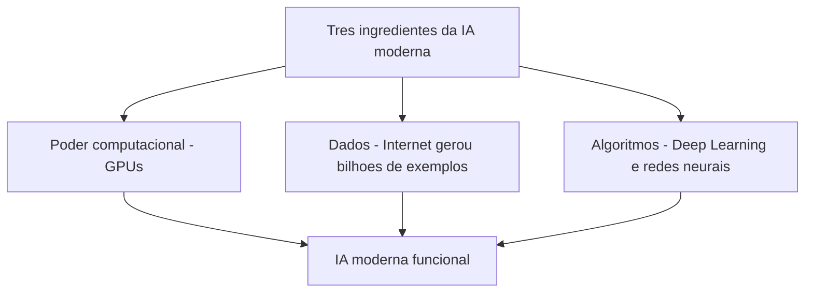
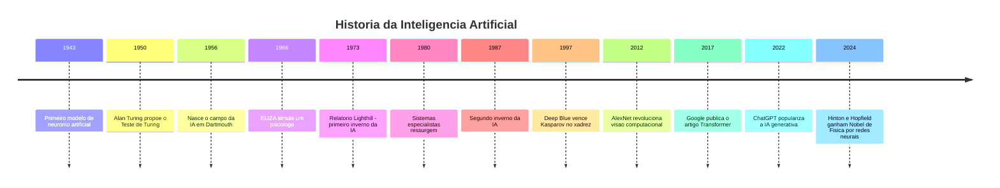
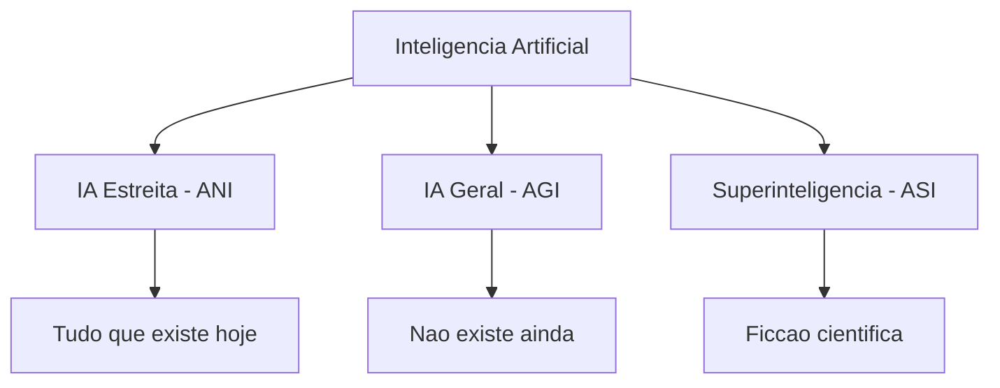
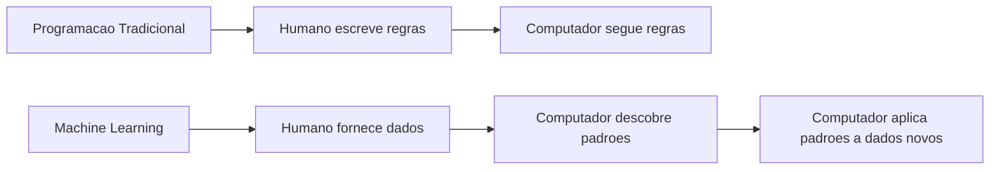
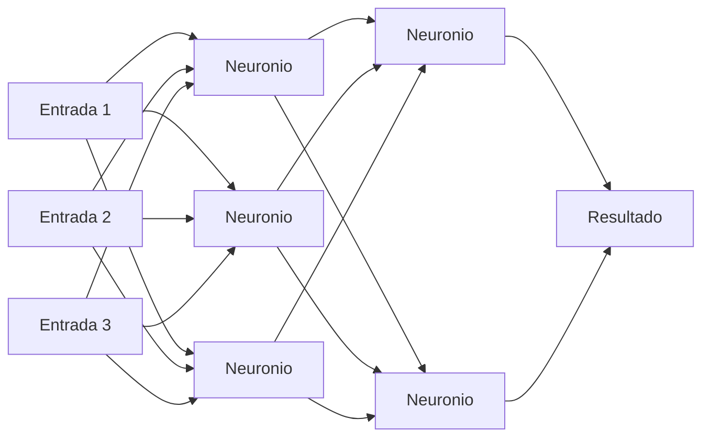
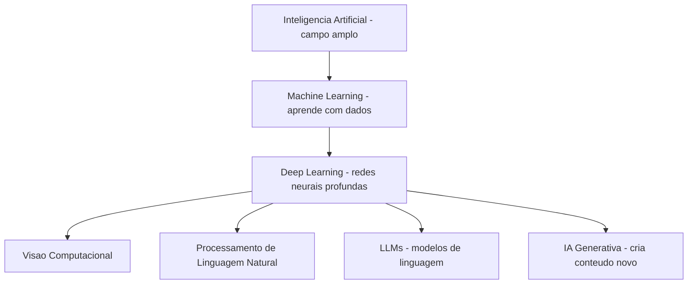
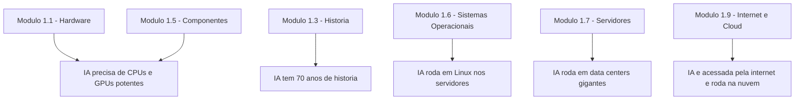

# 1.10 — IA no Dia a Dia: O que é Inteligência Artificial?

[← Anterior: Internet e Cloud](cap01-mod09-internet-cloud.md) · [Próximo: O que é Linux →](cap02-mod01-o-que-e-linux.md)

---

## Introdução

Nos módulos anteriores, construímos uma base sólida: você já sabe o que é um computador, como seus componentes funcionam (CPU, RAM, armazenamento), a história da computação, o que são sistemas operacionais, servidores, redes e como a internet e a nuvem funcionam. Agora vamos falar sobre algo que está transformando o mundo da tecnologia neste exato momento: a **Inteligência Artificial**.

Você provavelmente já ouviu falar de IA muitas vezes. Talvez tenha usado o ChatGPT, pedido algo para a Alexa ou recebido uma recomendação de filme na Netflix. Tudo isso envolve IA. Mas o que é IA de verdade? Como ela funciona? Ela realmente "pensa"?

Este módulo vai responder essas perguntas de forma clara e honesta. Vamos desmistificar o que a IA é, entender sua história cheia de altos e baixos, conhecer as técnicas por trás dela e, principalmente, entender por que ela importa para quem está aprendendo a programar.

E ao longo de todo o restante do curso, vamos usar IA como ferramenta de estudo — então entender o que ela é e o que ela não é vai te ajudar muito. Pense neste módulo como o mapa que vai te guiar para usar essa ferramenta com inteligência (a sua, não a artificial).

---

## O que é Inteligência Artificial?

**Inteligência Artificial** (IA, ou em inglês **AI** — Artificial Intelligence) é um campo da ciência da computação dedicado a criar sistemas que executam tarefas que, quando feitas por humanos, exigem inteligência.

Preste atenção na definição: não estamos dizendo que a máquina "pensa" ou "entende". Estamos dizendo que ela executa tarefas que normalmente precisariam de inteligência humana. Essa diferença é fundamental.

Lembra que no módulo 1.1 dissemos que o computador não pensa? Isso continua sendo verdade. A IA é um programa — um conjunto de instruções muito sofisticado que consegue simular comportamentos inteligentes, mas não tem consciência, sentimentos ou compreensão real do mundo.

### O que as pessoas pensam que IA é vs. o que ela realmente é

Existe um abismo enorme entre a IA que aparece nos filmes e a IA que existe de verdade. Vamos separar ficção de realidade:

| O que as pessoas imaginam | O que a IA realmente e |
|---------------------------|------------------------|
| Um robo consciente que pensa e sente | Um programa de computador que identifica padrões em dados |
| Uma entidade que pode dominar o mundo | Uma ferramenta que faz tarefas especificas muito bem |
| Algo que entende o que você diz | Algo que calcula a resposta mais provavel estatisticamente |
| Uma mente digital como nos filmes | Matemática muito sofisticada rodando em computadores potentes |
| Algo que surgiu do nada recentemente | Um campo de estudo com mais de 70 anos de história |

Quando você conversa com o ChatGPT e ele responde algo que parece inteligente, o que está acontecendo por dentro é matemática. Muita matemática. O modelo calculou, entre bilhões de possibilidades, qual sequência de palavras tem a maior probabilidade de ser uma boa resposta para o que você perguntou. Ele não "entendeu" sua pergunta — ele processou padrões.

Isso não diminui o que a IA faz. É impressionante que cálculos matemáticos consigam produzir respostas tão boas. Mas é importante entender a diferença entre "simular inteligência" e "ser inteligente".

Voltando à nossa analogia da cozinha: imagine que o cozinheiro (CPU) recebeu um livro de receitas gigantesco com bilhões de receitas (os dados de treinamento). Quando você pede um prato, ele não inventa algo novo — ele procura nos bilhões de receitas qual combinação de ingredientes e técnicas tem mais chance de agradar você, baseado no que funcionou antes. Ele é muito rápido e muito bom nisso, mas não "sabe" o que é gostoso. Ele apenas segue padrões.

### Exemplos de IA no dia a dia

Você já usa IA todos os dias, mesmo sem perceber. Vamos olhar com mais detalhe:

| Onde você usa | O que a IA faz | Tipo de IA |
|---------------|---------------|------------|
| Netflix e Spotify | Recomenda filmes e musicas baseado no que você ja assistiu | Machine Learning |
| Google Maps | Calcula a melhor rota considerando transito em tempo real | ML com dados em tempo real |
| Filtro de spam do email | Identifica emails indesejados automaticamente | ML supervisionado |
| Desbloqueio facial do celular | Reconhece seu rosto entre milhoes de rostos possiveis | Deep Learning |
| Autocorretor do teclado | Sugere palavras e corrige erros enquanto você digita | Modelo de linguagem |
| ChatGPT e similares | Gera textos, responde perguntas, ajuda a programar | LLM - Large Language Model |
| Assistentes de voz - Alexa e Siri | Entendem comandos de voz e executam ações | Reconhecimento de fala com Deep Learning |
| Traducao automática - Google Translate | Traduz textos entre idiomas em tempo real | Redes neurais Transformer |
| Carros com piloto automático | Identificam faixas, pedestres e obstaculos | Visao computacional com Deep Learning |
| Filtros de redes sociais | Aplicam efeitos no rosto em tempo real | Redes neurais convolucionais |

Perceba algo importante: cada um desses exemplos é uma IA que faz **uma coisa específica**. O filtro de spam não sabe recomendar filmes. O Google Maps não sabe traduzir textos. Cada sistema é especializado. Isso é o que chamamos de **IA Estreita** — e é tudo que existe hoje.

---

## Uma Breve (e Turbulenta) História da IA

A ideia de criar máquinas inteligentes não é nova. Na verdade, a história da IA é uma montanha-russa de otimismo exagerado, decepções profundas e, finalmente, avanços reais. Entender essa história é fundamental para não cair no hype — e para apreciar o quão longe chegamos.

### Os Primeiros Sonhos: Anos 1940-1950

Tudo começou com uma pergunta simples e profunda. Em 1950, o matemático britânico **Alan Turing** — o mesmo que quebrou os códigos nazistas na Segunda Guerra Mundial (lembra do filme "O Jogo da Imitação"?) — publicou um artigo chamado "Computing Machinery and Intelligence". Nele, Turing fez a pergunta: **"Máquinas podem pensar?"**

Para responder, ele propôs o que ficou conhecido como **Teste de Turing**: se uma pessoa conversa com uma máquina por texto e não consegue distinguir se está falando com um humano ou com uma máquina, então a máquina "passou no teste". Turing não estava dizendo que a máquina pensa de verdade — estava propondo um critério prático para avaliar comportamento inteligente.

Nessa mesma época, outros pesquisadores começaram a explorar a ideia. Em 1943, Warren McCulloch e Walter Pitts criaram o primeiro modelo matemático de um neurônio artificial — a semente do que décadas depois se tornaria as redes neurais. Em 1951, Marvin Minsky construiu o SNARC, a primeira máquina com rede neural, usando 3.000 válvulas e um motor de bombardeiro B-24.

### O Nascimento Oficial: Dartmouth 1956

O momento que marcou o nascimento oficial da IA como campo de estudo aconteceu no verão de 1956, no Dartmouth College, nos Estados Unidos. O jovem professor **John McCarthy** organizou uma conferência de dois meses com um grupo seleto de pesquisadores. Na proposta da conferência, McCarthy usou pela primeira vez o termo **"Artificial Intelligence"** (Inteligência Artificial).

A proposta era ambiciosa: "Cada aspecto do aprendizado ou qualquer outra característica da inteligência pode, em princípio, ser descrito com tanta precisão que uma máquina pode ser feita para simulá-lo." Em outras palavras, eles acreditavam que poderiam criar máquinas verdadeiramente inteligentes.

Os participantes incluíam nomes que se tornariam lendas da computação: Marvin Minsky, Claude Shannon (o pai da teoria da informação), Nathaniel Rochester (da IBM) e Herbert Simon. Eles saíram da conferência convencidos de que a IA seria resolvida em uma ou duas décadas.

Estavam errados. Muito errados.

### A Era do Otimismo: Anos 1960

Nos anos seguintes a Dartmouth, o otimismo era contagiante. Os primeiros programas de IA pareciam promissores:

- **ELIZA** (1966) — criada por Joseph Weizenbaum no MIT, era um programa que simulava um psicólogo. Ela reformulava as frases do usuário como perguntas. Se você dissesse "Estou triste", ela responderia "Por que você está triste?". Era simples, mas as pessoas ficavam impressionadas — algumas até acreditavam que estavam conversando com um terapeuta real.

- **SHRDLU** (1970) — criado por Terry Winograd, conseguia entender comandos em inglês sobre um mundo virtual de blocos coloridos. Você podia dizer "coloque o bloco vermelho em cima do azul" e ele fazia. Parecia mágico.

Herbert Simon declarou em 1965: "Máquinas serão capazes, dentro de vinte anos, de fazer qualquer trabalho que um homem pode fazer." Marvin Minsky disse em 1970: "Em três a oito anos teremos uma máquina com a inteligência geral de um ser humano."

Essas previsões não se concretizaram. Nem de perto.

### O Primeiro Inverno da IA: Anos 1970

O problema era que os programas da época funcionavam apenas em cenários muito controlados. SHRDLU entendia comandos sobre blocos coloridos, mas não conseguia entender nada sobre o mundo real. ELIZA não entendia nada — apenas reformulava frases.

Quando os pesquisadores tentaram aplicar essas técnicas a problemas reais, tudo desmoronava. Os computadores da época eram lentos demais, a memória era escassa demais, e os algoritmos eram simples demais para lidar com a complexidade do mundo real.

Em 1973, o governo britânico encomendou o **Relatório Lighthill**, que avaliou o progresso da IA. A conclusão foi devastadora: a IA não havia cumprido nenhuma de suas promessas grandiosas. O relatório levou ao corte de financiamento para pesquisa em IA no Reino Unido e em outros países.

Esse período ficou conhecido como o **primeiro inverno da IA** — uma época em que o financiamento secou, os pesquisadores perderam credibilidade e o campo quase morreu. A lição? Prometer demais e entregar de menos tem consequências.

### Sistemas Especialistas: Anos 1980

Nos anos 1980, a IA ressurgiu com uma abordagem diferente: os **sistemas especialistas** (em inglês, **expert systems**). Em vez de tentar criar uma inteligência geral, os pesquisadores focaram em criar programas que imitavam o conhecimento de especialistas humanos em áreas específicas.

O mais famoso foi o **MYCIN** (desenvolvido na década de 1970, mas popularizado nos anos 1980), que diagnosticava infecções bacterianas. Ele usava regras do tipo "SE o paciente tem febre E a cultura mostra bactéria X, ENTÃO o diagnóstico é Y". Funcionava surpreendentemente bem — em testes, acertava mais que alguns médicos.

Empresas investiram bilhões em sistemas especialistas. O Japão lançou o ambicioso "Projeto de Quinta Geração" para criar computadores inteligentes. A indústria de IA movimentou mais de 1 bilhão de dólares por ano.

Mas os sistemas especialistas tinham problemas sérios:
- Eram **frágeis**: funcionavam apenas no domínio específico para o qual foram programados
- Eram **caros de manter**: cada nova regra precisava ser adicionada manualmente por especialistas
- **Não aprendiam**: se encontravam uma situação não prevista nas regras, falhavam completamente
- Eram **difíceis de escalar**: um sistema com 10.000 regras se tornava impossível de gerenciar

### O Segundo Inverno da IA: Final dos Anos 1980 e Anos 1990

Quando ficou claro que os sistemas especialistas não eram a solução mágica, o ciclo se repetiu. O financiamento secou novamente, empresas faliram, e o campo entrou no **segundo inverno da IA**. O Projeto de Quinta Geração do Japão foi considerado um fracasso. Mencionar "Inteligência Artificial" em uma proposta de pesquisa era quase garantia de não receber financiamento.

Mas algo importante aconteceu durante esse inverno: pesquisadores continuaram trabalhando silenciosamente em uma abordagem diferente — o **aprendizado de máquina** (Machine Learning). Em vez de programar regras manualmente, eles estavam desenvolvendo algoritmos que aprendiam padrões a partir de dados.

### O Marco Silencioso: Deep Blue (1997)

Em 1997, algo aconteceu que capturou a imaginação do mundo: o computador **Deep Blue**, da IBM, venceu **Garry Kasparov**, o campeão mundial de xadrez, em uma partida oficial. Foi a primeira vez que uma máquina venceu o melhor humano em um jogo de estratégia complexo.

Mas aqui vai um detalhe importante: Deep Blue não usava Machine Learning. Ele usava **força bruta** — analisava 200 milhões de posições de xadrez por segundo e escolhia a melhor jogada. Era impressionante, mas não era "inteligente" no sentido que imaginamos. Era um computador muito rápido com regras muito boas.

Mesmo assim, o evento mostrou ao mundo que computadores podiam superar humanos em tarefas complexas. E plantou a semente para o que viria a seguir.

### A Revolução Silenciosa: Anos 2000-2010

Enquanto o público geral não prestava muita atenção, três coisas estavam mudando silenciosamente — e essas três coisas são a razão pela qual a IA funciona hoje.

Vamos entender cada um:

**1. Poder computacional (GPUs)**

Lembra do módulo 1.5, onde falamos sobre GPUs? As placas de vídeo que foram criadas para renderizar gráficos de jogos se mostraram perfeitas para os cálculos que a IA precisa. Uma GPU pode fazer milhares de cálculos matemáticos simples ao mesmo tempo (em paralelo), e é exatamente isso que redes neurais precisam.

Em 2007, pesquisadores da Universidade de Stanford descobriram que GPUs da NVIDIA podiam treinar redes neurais até 70 vezes mais rápido que CPUs tradicionais. Isso mudou tudo. O que antes levava meses para treinar agora levava dias.

**2. Dados (a internet como fonte)**

A internet explodiu nos anos 2000. Bilhões de pessoas começaram a produzir textos, fotos, vídeos e dados de todos os tipos. Redes sociais, Wikipedia, fóruns, blogs, lojas online — tudo isso gerou uma quantidade absurda de dados.

E Machine Learning precisa de dados. Muitos dados. Quanto mais exemplos o algoritmo vê, melhor ele fica. A internet forneceu esses exemplos em escala nunca antes imaginada.

**3. Algoritmos (Deep Learning)**

Pesquisadores como **Geoffrey Hinton**, **Yann LeCun** e **Yoshua Bengio** — que mais tarde ganhariam o Prêmio Nobel de Física em 2024 por suas contribuições — continuaram aperfeiçoando as redes neurais durante os invernos da IA, quando quase ninguém acreditava nelas. Eles desenvolveram técnicas que permitiam treinar redes com muitas camadas (o "deep" de Deep Learning), algo que antes era considerado impossível.

### O Momento ImageNet: 2012

O ano de 2012 é considerado o ponto de virada da IA moderna. Em uma competição chamada **ImageNet Large Scale Visual Recognition Challenge** (ILSVRC), onde programas competiam para identificar objetos em fotos, algo extraordinário aconteceu.

Um sistema chamado **AlexNet**, criado por Alex Krizhevsky (aluno de Geoffrey Hinton), usou Deep Learning com GPUs e reduziu a taxa de erro de 26% para 16% — uma melhoria gigantesca em um único ano. Todos os outros competidores usavam técnicas tradicionais.

A partir desse momento, Deep Learning dominou. Em poucos anos, a taxa de erro caiu para menos de 3% — melhor que humanos em identificar objetos em fotos.

### A Era dos Transformers: 2017

Em 2017, pesquisadores do Google publicaram um artigo que mudaria tudo novamente. O título era "Attention Is All You Need" (Atenção é Tudo que Você Precisa), e apresentava uma nova arquitetura de rede neural chamada **Transformer**.

O Transformer resolveu um problema fundamental: como processar sequências longas de texto de forma eficiente. Antes dele, as redes neurais tinham dificuldade em "lembrar" o início de um texto longo quando chegavam ao final. O mecanismo de **atenção** (attention) permitiu que o modelo olhasse para qualquer parte do texto a qualquer momento, como se pudesse "prestar atenção" em tudo ao mesmo tempo.

Essa arquitetura é a base de todos os grandes modelos de linguagem que usamos hoje: GPT, Claude, Gemini, Llama — todos são Transformers.

### ChatGPT e a Explosão: 2022-2024

Em 30 de novembro de 2022, a empresa OpenAI lançou o **ChatGPT**. Em cinco dias, o serviço atingiu 1 milhão de usuários. Em dois meses, 100 milhões. Foi o aplicativo com crescimento mais rápido da história.

O ChatGPT não era uma tecnologia fundamentalmente nova — era a aplicação de técnicas que vinham sendo desenvolvidas há anos. Mas foi a primeira vez que uma IA conversacional foi disponibilizada gratuitamente para qualquer pessoa. De repente, todo mundo podia conversar com uma IA e ver o que ela era capaz de fazer.

Isso desencadeou uma corrida entre empresas de tecnologia: Google lançou o Gemini, Anthropic lançou o Claude, Meta lançou o Llama (como código aberto), e dezenas de outras empresas entraram na disputa.

### O que a história nos ensina

A história da IA tem um padrão claro: **otimismo exagerado → decepção → progresso real silencioso → novo ciclo**. Isso nos ensina algumas coisas:

1. **Desconfie do hype**: quando alguém diz que a IA vai resolver tudo em 5 anos, lembre-se que disseram isso em 1956, 1965 e 1985
2. **Progresso real leva tempo**: as técnicas que funcionam hoje foram desenvolvidas ao longo de décadas por pesquisadores persistentes
3. **Tecnologia precisa de infraestrutura**: a IA só decolou quando teve poder computacional (GPUs), dados (internet) e algoritmos (Deep Learning) ao mesmo tempo
4. **Ferramentas específicas funcionam melhor que soluções gerais**: sistemas especialistas falharam tentando ser gerais; IA Estreita funciona porque foca em tarefas específicas

---

## Os Três Tipos de IA

A IA é classificada em três categorias, baseadas na sua capacidade. Essa classificação é importante para separar o que existe de verdade do que ainda é ficção científica.

### IA Estreita (ANI — Artificial Narrow Intelligence)

É toda IA que existe hoje. Ela faz **uma coisa específica** muito bem, mas não consegue fazer nada fora do seu domínio. O ChatGPT é incrível para gerar texto, mas não sabe jogar xadrez (a menos que simule usando texto). O AlphaGo venceu o campeão mundial de Go, mas não sabe escrever um email.

Exemplos de IA Estreita:
- Reconhecimento facial do celular
- Recomendações da Netflix
- Filtro de spam
- Tradução automática
- Assistentes de voz
- Carros com piloto automático
- Geração de imagens (DALL-E, Midjourney)
- Modelos de linguagem (ChatGPT, Claude, Gemini)

Mesmo os modelos mais impressionantes de hoje são IA Estreita. O ChatGPT parece "geral" porque consegue falar sobre muitos assuntos, mas ele está fazendo uma única tarefa: prever a próxima palavra em uma sequência de texto. Ele é extremamente bom nessa tarefa, e isso produz resultados que parecem inteligência geral — mas não é.

### IA Geral (AGI — Artificial General Intelligence)

É a IA hipotética que seria capaz de realizar **qualquer tarefa intelectual** que um ser humano pode fazer. Ela aprenderia coisas novas sozinha, raciocinaria sobre problemas que nunca viu, teria senso comum e se adaptaria a qualquer situação.

AGI **não existe**. Nenhuma empresa tem AGI, apesar do que algumas manchetes sensacionalistas possam sugerir. Há um debate intenso na comunidade científica sobre quando (ou se) AGI será alcançada. Algumas estimativas vão de 10 a 100 anos. Outros pesquisadores acreditam que pode nunca acontecer com as abordagens atuais.

### Superinteligência (ASI — Artificial Superintelligence)

É a ideia de uma IA que superaria a inteligência humana em todos os aspectos — criatividade, resolução de problemas, habilidades sociais, tudo. Isso está firmemente no território da ficção científica. Não há nenhum caminho claro de como chegar lá, e muitos pesquisadores questionam se é sequer possível.

| Tipo | O que faz | Existe hoje | Exemplo |
|------|-----------|-------------|---------|
| IA Estreita - ANI | Faz UMA coisa muito bem | Sim | ChatGPT, reconhecimento facial |
| IA Geral - AGI | Faria QUALQUER tarefa intelectual humana | Não | Nenhum |
| Superinteligencia - ASI | Superaria humanos em tudo | Não | Ficcao cientifica |

---

## Machine Learning: Como a IA Aprende

Agora que você conhece a história e os tipos de IA, vamos entender **como** ela funciona. A resposta está no **Machine Learning** (Aprendizado de Máquina, abreviado como **ML**) — a técnica que permite que computadores aprendam a partir de dados, em vez de serem programados com regras fixas.

### Qual problema o Machine Learning resolve?

Antes do Machine Learning, a única forma de fazer um computador executar uma tarefa era escrever regras explícitas. Isso funciona para tarefas simples e bem definidas (como calcular impostos), mas falha miseravelmente para tarefas complexas e ambíguas (como reconhecer um gato em uma foto).

Pense assim: como você explicaria para um computador o que é um gato? Você poderia dizer "tem quatro patas, orelhas pontudas e bigodes". Mas e um gato sem uma pata? E um gato de orelhas caídas? E uma foto de um gato de costas onde você não vê as orelhas? As exceções são infinitas.

Machine Learning resolve isso de outra forma: em vez de escrever regras, você mostra milhares de exemplos. "Aqui estão 100.000 fotos de gatos. Aqui estão 100.000 fotos de coisas que não são gatos. Aprenda a diferença."

### A diferença entre programação tradicional e Machine Learning

Imagine que você quer ensinar um computador a identificar se um email é spam:

**Programação tradicional** — você escreve regras manualmente:
- Se o email contem "ganhe dinheiro fácil", e spam
- Se o email contem "clique aqui para ganhar", e spam
- Se o email vem de um remetente desconhecido, e spam

O problema: existem infinitas formas de escrever spam. Spammers mudam as palavras o tempo todo. Você nunca vai conseguir escrever todas as regras.

**Machine Learning** — você da exemplos ao computador:
- Aqui estao 100.000 emails marcados como "spam"
- Aqui estao 100.000 emails marcados como "não spam"
- Computador, aprenda os padrões sozinho

O computador analisa os exemplos e descobre padrões que nem você perceberia — combinacoes de palavras, horarios de envio, formatacao, links suspeitos. E quanto mais exemplos ele recebe, melhor ele fica.

| Abordagem | Como funciona | Vantagem | Limitacao |
|-----------|--------------|----------|-----------|
| Regras fixas | Humano escreve as regras | Previsivel e explicavel | Não cobre todos os casos |
| Machine Learning | Computador aprende dos dados | Descobre padrões complexos | Precisa de muitos dados |

### Os tres tipos de aprendizado

Machine Learning se divide em tres abordagens principais. Cada uma resolve um tipo diferente de problema:

**1. Aprendizado Supervisionado (Supervised Learning)**

E o tipo mais comum. Funciona assim: você da ao computador milhares de exemplos **rotulados** — ou seja, exemplos onde você ja sabe a resposta certa. O computador aprende a relação entre os dados de entrada e a resposta.

Analogia: imagine um professor que mostra flashcards para uma crianca. De um lado tem a foto de um animal, do outro tem o nome. "Isso e um gato." "Isso e um cachorro." "Isso e um gato." Depois de ver centenas de exemplos, a crianca aprende a identificar gatos e cachorros sozinha, mesmo em fotos que nunca viu.

Exemplos reais:
- Filtro de spam: treinado com milhares de emails rotulados como "spam" ou "não spam"
- Diagnostico medico: treinado com milhares de radiografias rotuladas como "saudavel" ou "doente"
- Reconhecimento de voz: treinado com milhares de audios rotulados com o texto correspondente
- Previsao de precos: treinado com dados historicos de precos e suas variacoes

**2. Aprendizado Não Supervisionado (Unsupervised Learning)**

Aqui, o computador recebe dados **sem rotulos** e precisa encontrar padrões sozinho. Ninguem diz qual e a resposta certa — o algoritmo descobre agrupamentos e estruturas nos dados.

Analogia: imagine que você recebe uma caixa com 1.000 botoes de cores, tamanhos e formatos diferentes, sem nenhuma instrução. Naturalmente, você comecaria a separar por cor, ou por tamanho, ou por formato. Você esta encontrando padrões sem que ninguem te diga quais padrões procurar.

Exemplos reais:
- Segmentacao de clientes: agrupar clientes com comportamentos parecidos para marketing
- Deteccao de anomalias: identificar transações bancarias suspeitas que fogem do padrão
- Organização de noticias: agrupar artigos sobre o mesmo tema automaticamente

**3. Aprendizado por Reforco (Reinforcement Learning)**

O computador aprende por **tentativa e erro**. Ele executa ações em um ambiente, recebe recompensas quando acerta e punicoes quando erra, e vai ajustando seu comportamento para maximizar as recompensas.

Analogia: pense em como uma crianca aprende a andar de bicicleta. Ninguem explica a fisica do equilibrio — ela tenta, cai, tenta de novo, ajusta o equilibrio, e eventualmente aprende. Cada queda e uma "punicao" e cada metro pedalado sem cair e uma "recompensa".

Exemplos reais:
- AlphaGo (Google DeepMind): aprendeu a jogar Go jogando milhoes de partidas contra si mesmo
- Robos que aprendem a andar: tentam movimentos aleatorios ate descobrir como se equilibrar
- Sistemas de recomendacao: ajustam sugestoes baseado no que você clica ou ignora

| Tipo | Dados | Como aprende | Analogia | Exemplo |
|------|-------|-------------|----------|---------|
| Supervisionado | Com rotulos | Professor mostra a resposta certa | Flashcards com respostas | Filtro de spam |
| Não supervisionado | Sem rotulos | Encontra padrões sozinho | Separar botoes por cor | Segmentacao de clientes |
| Por reforco | Sem rotulos | Tentativa e erro com recompensas | Aprender a andar de bicicleta | AlphaGo |

---

## Redes Neurais: O Cerebro Artificial

Agora vamos entender a tecnologia que esta por tras dos avancos mais impressionantes da IA: as **redes neurais artificiais** (em ingles, **artificial neural networks**).

### De onde veio a ideia?

O cerebro humano tem aproximadamente 86 bilhoes de **neuronios** — celulas especializadas em transmitir sinais eletricos. Cada neuronio recebe sinais de outros neuronios, processa esses sinais e, se o estimulo for forte o suficiente, dispara um sinal para os proximos neuronios. E assim que pensamos, lembramos e aprendemos.

Nos anos 1940, pesquisadores se perguntaram: "E se criarmos uma versão matemática simplificada de um neuronio?" A ideia era criar "neuronios artificiais" — funções matematicas que recebem números como entrada, fazem um cálculo e produzem um número como saida.

### Como funciona um neuronio artificial?

Um neuronio artificial e surpreendentemente simples. Ele faz tres coisas:

1. **Recebe entradas**: números que representam dados (pixels de uma imagem, palavras de um texto, etc.)
2. **Multiplica cada entrada por um peso**: os pesos determinam a importância de cada entrada
3. **Soma tudo e aplica uma função**: se o resultado passar de um certo limite, o neuronio "dispara"

Analogia com a cozinha: imagine que o cozinheiro (CPU) esta decidindo se um prato esta bom. Ele avalia vários fatores — sabor (peso 0.4), aparência (peso 0.3), aroma (peso 0.2), textura (peso 0.1). Cada fator recebe uma nota, multiplicada pelo peso. Se a soma total passar de 7, o prato e aprovado. Isso e basicamente o que um neuronio artificial faz.

### O que e uma rede neural?

Um único neuronio artificial não faz muita coisa. Mas quando você conecta milhares ou milhoes deles em **camadas**, algo magico acontece: a rede consegue aprender padrões extremamente complexos.

Uma rede neural tem tres tipos de camadas:

| Camada | Função | Analogia |
|--------|--------|----------|
| Entrada | Recebe os dados brutos | Ingredientes chegando na cozinha |
| Ocultas | Processam e transformam os dados | Cozinheiro preparando etapas intermediarias |
| Saida | Produz o resultado final | Prato pronto sendo servido |

### Como a rede aprende?

O processo de aprendizado de uma rede neural e chamado de **treinamento**. Funciona assim:

1. A rede recebe um exemplo (por exemplo, uma foto de um gato)
2. Ela processa o exemplo e da uma resposta (por exemplo, "cachorro" — errou!)
3. O erro e calculado: a diferença entre a resposta da rede e a resposta correta
4. Os pesos de todos os neuronios são ajustados um pouquinho para reduzir o erro
5. Repete-se isso milhoes de vezes com milhoes de exemplos

Esse processo de ajustar os pesos para reduzir o erro se chama **backpropagation** (retropropagacao) — o erro "volta" pela rede, ajustando cada neuronio no caminho. E como se o cozinheiro provasse o prato, percebesse que esta salgado demais, e ajustasse a quantidade de sal na próxima vez. Depois de milhares de pratos, ele acerta a medida perfeita.

---

## Deep Learning: O que Torna o Aprendizado "Profundo"

**Deep Learning** (Aprendizado Profundo) e uma técnica de Machine Learning que usa redes neurais com **muitas camadas ocultas** — por isso o "deep" (profundo). Enquanto uma rede neural simples pode ter 2-3 camadas, uma rede de Deep Learning pode ter dezenas ou ate centenas de camadas.

### Por que mais camadas importam?

Cada camada aprende algo diferente, em níveis crescentes de complexidade:

**Exemplo: reconhecimento de imagem**
- Camada 1: aprende a detectar **bordas** (linhas horizontais, verticais, diagonais)
- Camada 2: aprende a combinar bordas em **formas** (circulos, retangulos, curvas)
- Camada 3: aprende a combinar formas em **partes** (olhos, orelhas, narizes)
- Camada 4: aprende a combinar partes em **objetos** (rosto de gato, rosto de cachorro)
- Camada 5: aprende a classificar o objeto final ("isso e um gato")

**Exemplo: processamento de linguagem**
- Camadas iniciais: aprendem **palavras** e seus significados básicos
- Camadas intermediarias: aprendem **relações entre palavras** e estrutura de frases
- Camadas finais: aprendem **significados complexos**, ironia, contexto e intencao

Quanto mais camadas, mais abstrato e complexo e o padrão que a rede consegue aprender. E por isso que Deep Learning funciona tao bem para tarefas que parecem "inteligentes" — reconhecer rostos, entender linguagem, gerar imagens.

### Como tudo se encaixa

Pense nisso como bonecas russas: IA e o campo mais amplo. Dentro dele esta Machine Learning. Dentro de ML esta Deep Learning. E dentro de Deep Learning estao as aplicações especificas como visao computacional, processamento de linguagem e modelos generativos.

| Conceito | O que e | Exemplo |
|----------|---------|---------|
| IA | Qualquer sistema que simula inteligência | Chatbot com regras fixas |
| Machine Learning | Sistema que aprende padrões com dados | Filtro de spam que melhora com o tempo |
| Deep Learning | ML com redes neurais de muitas camadas | Reconhecimento facial |
| LLM | Deep Learning aplicado a linguagem | ChatGPT, Claude, Gemini |
| IA Generativa | IA que cria conteúdo novo | DALL-E gerando imagens, ChatGPT gerando texto |

---

## LLMs: Os Modelos de Linguagem que Mudaram Tudo

**LLM** significa **Large Language Model** (Modelo de Linguagem de Grande Escala). São os modelos por tras do ChatGPT, Claude, Gemini e outras IAs com as quais você pode conversar. Eles representam o avanco mais visível da IA nos ultimos anos, então vale a pena entender como funcionam.

### Como um LLM e treinado?

O treinamento de um LLM acontece em etapas:

**Etapa 1 — Pre-treinamento**: o modelo le uma quantidade absurda de texto da internet — livros, artigos, páginas web, código, conversas, documentos. Estamos falando de trilhoes de palavras. Durante essa leitura, ele aprende padrões estatisticos: quais palavras tendem a aparecer juntas, como frases são estruturadas, como argumentos são construidos.

**Etapa 2 — Ajuste fino (Fine-tuning)**: o modelo e refinado com exemplos específicos de perguntas e respostas de alta qualidade, escritas por humanos. Isso ensina o modelo a ser útil, seguir instruções e responder de forma adequada.

**Etapa 3 — Alinhamento (RLHF)**: humanos avaliam as respostas do modelo e dao feedback. O modelo aprende a gerar respostas que humanos consideram boas, seguras e úteis. RLHF significa **Reinforcement Learning from Human Feedback** (Aprendizado por Reforco a partir de Feedback Humano).

### O segredo: prever a próxima palavra

No fundo, o que um LLM faz e surpreendentemente simples de explicar (embora seja extremamente complexo de implementar): ele **preve a próxima palavra**.

Quando você digita "O gato sentou no", o modelo calcula a probabilidade de cada palavra possível vir a seguir. "tapete" tem alta probabilidade. "sol" tem probabilidade media. "matemática" tem probabilidade baixa. Ele escolhe a palavra mais provavel (ou uma das mais provaveis, com alguma aleatoriedade) e repete o processo para a próxima palavra.

Fazendo isso palavra por palavra, ele gera textos inteiros que parecem escritos por humanos. E como um jogo de completar frases jogado bilhoes de vezes com bilhoes de textos como referência.

### Os principais LLMs hoje

| Modelo | Empresa | Caracteristica principal |
|--------|---------|------------------------|
| GPT-4o | OpenAI | Modelo por tras do ChatGPT, multimodal |
| Claude | Anthropic | Foco em segurança e respostas longas, usado no Kiro |
| Gemini | Google | Integrado ao ecossistema Google |
| Llama | Meta | Código aberto, qualquer pessoa pode usar e modificar |
| Mistral | Mistral AI | Empresa francesa, modelos eficientes e abertos |
| DeepSeek | DeepSeek | Empresa chinesa, modelos competitivos de código aberto |

### O que LLMs conseguem fazer

| Capacidade | Exemplo |
|-----------|---------|
| Gerar texto | Escrever emails, resumos, historias, artigos |
| Responder perguntas | Explicar conceitos, tirar duvidas técnicas |
| Traduzir | Converter texto entre dezenas de idiomas |
| Gerar código | Escrever programas em Python, JavaScript, C e outras linguagens |
| Analisar texto | Resumir documentos, classificar sentimentos, extrair informações |
| Conversar | Manter dialogos coerentes e contextuais |
| Raciocinar | Resolver problemas logicos e matematicos passo a passo |

### O que LLMs NAO conseguem fazer

Isso e tao importante quanto saber o que eles fazem:

| Limitacao | Explicacao |
|-----------|-----------|
| Não pensam de verdade | Identificam padrões estatisticos, não entendem significado |
| Alucinam | Geram texto plausivel mesmo quando não sabem a resposta |
| Não tem memória permanente | Cada conversa comeca do zero, a menos que o sistema salve o histórico |
| Conhecimento tem data de corte | Sabem apenas o que estava nos dados de treinamento ate certa data |
| Podem ter vieses | Refletem preconceitos presentes nos dados de treinamento |
| Não verificam fatos | Geram texto que parece correto sem confirmar se e verdade |
| Não entendem o mundo fisico | Podem descrever como andar de bicicleta, mas não sabem o que e equilibrio |

O fenomeno de "inventar coisas" e chamado de **alucinacao** (em ingles, **hallucination**) — a IA gera uma resposta que parece correta mas e completamente inventada. Ela pode citar um livro que não existe, inventar uma estatistica ou atribuir uma frase a alguem que nunca a disse. Por isso, **sempre verifique informações importantes que uma IA te da**.

---

## IA Generativa: Máquinas que Criam

Um dos avancos mais impressionantes dos ultimos anos e a **IA generativa** (em ingles, **generative AI**) — sistemas de IA capazes de **criar conteúdo novo**: textos, imagens, musicas, videos e código.

Antes da IA generativa, computadores eram bons em **analisar** e **classificar** coisas. "Isso e um gato ou um cachorro?" "Esse email e spam?" Agora, eles também conseguem **criar** coisas. "Gere uma imagem de um gato astronauta." "Escreva um poema sobre programação."

### Tipos de IA generativa

| Tipo | O que cria | Exemplos de ferramentas |
|------|-----------|------------------------|
| Texto | Artigos, emails, código, historias | ChatGPT, Claude, Gemini |
| Imagens | Fotos, ilustracoes, arte digital | DALL-E, Midjourney, Stable Diffusion |
| Audio | Musica, voz sintetica, efeitos sonoros | Suno, ElevenLabs |
| Video | Clips, animacoes | Sora, Runway |
| Código | Programas, funções, testes | GitHub Copilot, Kiro, Cursor |

A IA generativa funciona porque os modelos aprenderam tantos padrões durante o treinamento que conseguem **combinar esses padrões de formas novas**. Quando você pede "uma imagem de um gato astronauta", o modelo sabe como e um gato (aprendeu com milhoes de fotos de gatos) e sabe como e um astronauta (aprendeu com milhoes de fotos de astronautas), e combina os dois conceitos em algo que nunca existiu antes.

---

## IA como Ferramenta para Desenvolvedores

Se você esta aprendendo a programar em 2025, a IA ja faz parte do seu dia a dia profissional. Vamos conhecer as principais ferramentas:

### GitHub Copilot

Criado pela GitHub (que pertence a Microsoft) em parceria com a OpenAI, o **GitHub Copilot** e um assistente de código que funciona dentro do seu editor de texto. Enquanto você programa, ele sugere linhas de código, funções inteiras e ate testes automatizados.

Como funciona: você escreve um comentário descrevendo o que quer fazer (por exemplo, "função que calcula a media de uma lista de números") e o Copilot gera o código. Você pode aceitar, rejeitar ou modificar a sugestao.

### Kiro

O **Kiro** e um ambiente de desenvolvimento (IDE) que integra IA diretamente no fluxo de trabalho do programador. Ele vai além de sugerir código — ajuda a planejar, estruturar e revisar projetos inteiros. E como ter um colega experiente ao seu lado o tempo todo.

### ChatGPT, Claude e outros assistentes

Você pode usar qualquer LLM como assistente de programação. Basta descrever o que quer fazer e pedir ajuda. Eles podem:
- Explicar código que você não entende
- Sugerir soluções para problemas
- Gerar exemplos de código
- Ajudar a encontrar erros (bugs)
- Explicar mensagens de erro

### A regra de ouro: IA e ferramenta, não substituto

Aqui vai algo fundamental que você precisa entender agora, no inicio da sua jornada como desenvolvedor:

**A IA não substitui o programador. Ela e uma ferramenta — como uma calculadora não substitui o matemático.**

Um programador que não entende lógica de programação não vai conseguir usar IA para programar bem. Por que? Porque:

1. Você precisa saber **o que pedir** — se não entende o problema, não sabe o que perguntar
2. Você precisa **avaliar a resposta** — a IA pode gerar código com erros, e você precisa identificar
3. Você precisa **integrar o código** — o código gerado precisa funcionar dentro do seu projeto
4. Você precisa **depurar problemas** — quando algo da errado, você precisa entender por que

E por isso que este curso ensina os fundamentos primeiro. Nos capítulos 5 a 10, você vai aprender a programar de verdade. E ai, quando usar IA como ferramenta, vai saber exatamente o que esta fazendo.

A frase que resume tudo: **"Programadores que usam IA vao substituir programadores que não usam IA."** Não e a IA que substitui o programador — e o programador com IA que substitui o programador sem IA.

---

## Etica e Limitacoes da IA

A IA e uma ferramenta poderosa, mas como toda ferramenta poderosa, vem com responsabilidades e riscos. Vamos falar sobre os principais:

### Alucinacoes

Como ja vimos, LLMs podem gerar informações falsas com total confianca. Isso e perigoso em areas como medicina, direito e jornalismo. Imagine um medico usando uma IA que inventa um tratamento que não existe, ou um advogado citando uma lei que a IA inventou (isso ja aconteceu de verdade — em 2023, um advogado nos Estados Unidos citou casos juridicos inventados pelo ChatGPT em um processo real).

### Vieses (Bias)

A IA aprende com dados criados por humanos. Se esses dados contem preconceitos — racismo, sexismo, discriminacao — a IA vai reproduzir esses preconceitos. Por exemplo, sistemas de reconhecimento facial ja mostraram taxas de erro muito maiores para pessoas negras do que para pessoas brancas, porque foram treinados com dados que tinham mais fotos de pessoas brancas.

### Direitos autorais e propriedade intelectual

LLMs foram treinados com textos, imagens e codigos da internet — muitos deles protegidos por direitos autorais. Isso levanta questoes serias: se a IA gera um texto baseado em livros que leu durante o treinamento, quem e o autor? O criador do modelo? O usuario que fez o prompt? O autor original do livro? Essas questoes ainda estao sendo debatidas em tribunais ao redor do mundo.

### Custo ambiental

Treinar um grande modelo de IA consome uma quantidade enorme de energia. O treinamento do GPT-4, por exemplo, consumiu energia equivalente a centenas de casas durante um ano. Os data centers que rodam esses modelos precisam de refrigeracao constante e consomem muita agua. A medida que modelos ficam maiores, esse custo ambiental aumenta.

### Privacidade

Quando você conversa com uma IA, seus dados podem ser usados para melhorar o modelo. Isso levanta preocupacoes sobre privacidade — especialmente se você compartilha informações sensiveis. Sempre leia os termos de uso e evite compartilhar dados pessoais ou confidenciais com IAs.

| Risco | Descrição | Como se proteger |
|-------|-----------|-----------------|
| Alucinacoes | IA inventa informações falsas | Sempre verificar fatos importantes |
| Vieses | IA reproduz preconceitos dos dados | Questionar resultados, buscar diversidade |
| Direitos autorais | Conteúdo gerado pode infringir direitos | Não usar conteúdo gerado como se fosse original sem verificar |
| Custo ambiental | Treinamento consome muita energia | Usar modelos menores quando possível |
| Privacidade | Dados podem ser usados para treinamento | Não compartilhar dados sensiveis |

---

## IA e o Mercado de Trabalho

Uma das perguntas mais comuns que iniciantes fazem e: **"A IA vai substituir os programadores?"**

A resposta curta e: **não**. Mas a resposta completa e mais interessante.

### O que a história nos ensina

Toda nova tecnologia gera medo de desemprego. Quando surgiram os caixas eletronicos nos anos 1970, as pessoas acharam que bancarios seriam extintos. O que aconteceu? O número de agencias bancarias aumentou (porque ficou mais barato operar uma agencia) e os bancarios passaram a fazer trabalhos mais complexos — consultoria financeira, vendas de produtos, atendimento especializado.

Quando surgiram as planilhas eletronicas nos anos 1980, as pessoas acharam que contadores seriam extintos. O que aconteceu? Contadores passaram a fazer analises mais sofisticadas, porque a parte mecanica do trabalho foi automatizada.

O mesmo padrão se repete com a IA: **ela automatiza tarefas, não profissoes inteiras**. Um programador faz muitas coisas — entender o problema do cliente, projetar a solução, escrever código, testar, depurar, colaborar com a equipe, tomar decisoes de arquitetura. A IA pode ajudar em algumas dessas tarefas (especialmente escrever código), mas não substitui o conjunto completo.

### O que muda de verdade

O que a IA muda e a **produtividade**. Um programador usando IA pode ser 2 a 5 vezes mais produtivo em certas tarefas. Isso significa que:

- Empresas vao esperar mais produtividade de cada programador
- Tarefas repetitivas e mecanicas serao cada vez mais automatizadas
- Habilidades como pensamento critico, resolução de problemas e comunicação se tornam ainda mais valiosas
- Saber usar ferramentas de IA se torna uma habilidade essencial

### O perfil do programador do futuro

| Habilidade | Por que importa com IA |
|-----------|----------------------|
| Lógica de programação | Para avaliar e corrigir código gerado por IA |
| Resolução de problemas | Para definir O QUE a IA deve fazer |
| Comunicação | Para escrever bons prompts e explicar soluções |
| Pensamento critico | Para questionar respostas da IA e identificar erros |
| Fundamentos de computacao | Para entender como e por que as coisas funcionam |
| Aprendizado continuo | Para acompanhar ferramentas que mudam rapidamente |

Perceba que todas essas habilidades são exatamente o que este curso ensina. Lógica de programação (capítulos 5-6), resolução de problemas (capítulo 7), estruturacao de soluções (capítulo 8), fundamentos (capítulos 1-4). Você esta construindo a base certa.

---

## Como a IA se Conecta com Tudo que Você Aprendeu

Este e o último módulo do Capítulo 1 — Fundamentos da Computacao. E não e por acaso que ele vem no final. A IA não existe no vacuo. Ela depende de tudo que você aprendeu nos módulos anteriores:

Vamos conectar cada ponto:

**Hardware (módulo 1.1 e 1.5)**: a IA precisa de poder computacional massivo. Lembra que falamos sobre CPUs e GPUs? Os modelos de IA modernos são treinados em clusters com milhares de GPUs trabalhando juntas. Sem o hardware que você aprendeu no módulo 1.5, a IA não existiria.

**Sistemas operacionais (módulo 1.6)**: a grande maioria dos servidores que rodam IA usa **Linux** — o sistema operacional que você vai aprender no Capítulo 2. Quando você usa o ChatGPT, sua pergunta viaja pela internet ate um servidor Linux que roda o modelo.

**Servidores e data centers (módulo 1.7)**: os modelos de IA rodam em data centers enormes, com milhares de servidores. Empresas como Google, Microsoft e Amazon investem bilhoes em infraestrutura para rodar seus modelos de IA.

**Internet e cloud (módulo 1.9)**: você acessa a IA pela internet. O modelo roda na nuvem (cloud) e você interage com ele através de uma API ou interface web. Sem a infraestrutura de internet e cloud que você aprendeu no módulo anterior, a IA seria inacessivel.

**Programação (capítulos 5-10)**: a IA e construida com código. Os modelos são escritos em linguagens como Python (que você vai aprender no capítulo 5). As bibliotecas de Machine Learning, os frameworks de Deep Learning, as APIs que conectam tudo — tudo e código. Entender programação e entender como a IA e feita por dentro.

Essa conexão e o ponto mais importante deste módulo: **a IA não e magia. E tecnologia construida sobre tudo que você esta aprendendo.** Cada conceito deste capítulo — hardware, software, redes, servidores, cloud — e um tijolo na fundacao que sustenta a IA.

---

## IA como Ferramenta de Estudo

Ao longo deste curso, vamos usar IA como parceira de aprendizado. Não como substituta do estudo, mas como uma ferramenta que complementa e acelera seu aprendizado. Aqui estao algumas formas práticas:

| Como usar | Exemplo de prompt |
|-----------|------------------|
| Pedir explicacoes alternativas | "Explique o que e RAM de uma forma diferente da que eu ja vi" |
| Tirar duvidas especificas | "Não entendi a diferença entre HD e SSD, pode explicar de novo?" |
| Pedir mais exemplos | "Me de 5 exemplos de entrada, processamento e saida no dia a dia" |
| Verificar entendimento | "Eu entendi que a CPU e o cerebro do computador. Isso esta certo?" |
| Pedir exercícios extras | "Crie 3 exercícios sobre sistemas operacionais para eu praticar" |
| Explorar curiosidades | "Como funciona o algoritmo de recomendacao da Netflix?" |
| Simplificar conceitos | "Explique redes neurais como se eu tivesse 10 anos" |

### Regras importantes ao usar IA para estudar

1. **Não copie respostas** — use a IA para entender, não para fazer o trabalho por você. Se você copia sem entender, não aprendeu nada.
2. **Verifique as informações** — a IA pode errar ou inventar coisas. Sempre confirme informações importantes com outras fontes.
3. **Tente primeiro sozinho** — so peca ajuda depois de tentar resolver. O esforco de tentar e parte essencial do aprendizado.
4. **Reformule se não entender** — se a explicacao da IA não ficou clara, peca para explicar de outra forma, com outra analogia, ou com um exemplo diferente.
5. **Use como ponto de partida** — a IA pode te dar uma direcao, mas o aprofundamento vem do seu estudo e prática.

---

## Como a IA pode te ajudar aqui

Aqui estao alguns prompts que você pode usar com uma IA para aprofundar os temas deste módulo:

**Prompt 1 — Explorar o conceito:**
> "Explique a diferença entre Inteligência Artificial, Machine Learning e Deep Learning como se eu tivesse 12 anos. Use uma analogia com comida."

**Prompt 2 — Ver exemplos práticos:**
> "O que e um LLM e como ele funciona por dentro? Explique o conceito de prever a próxima palavra com um exemplo prático."

**Prompt 3 — Entender erros comuns:**
> "Quais são os riscos de confiar cegamente em respostas de uma IA? Me de 3 exemplos reais de problemas que ja aconteceram."

---

## Resumo do Módulo

| Conceito | Definição |
|----------|-----------|
| Inteligência Artificial | Campo da computacao que cria sistemas que simulam inteligência |
| Machine Learning | Técnica onde computadores aprendem padrões a partir de dados |
| Aprendizado supervisionado | ML com exemplos rotulados, como flashcards com respostas |
| Aprendizado não supervisionado | ML sem rotulos, o modelo encontra padrões sozinho |
| Aprendizado por reforco | ML por tentativa e erro com recompensas e punicoes |
| Rede neural | Estrutura matemática em camadas inspirada no cerebro |
| Deep Learning | ML com redes neurais de muitas camadas |
| Transformer | Arquitetura de rede neural com mecanismo de atencao, base dos LLMs |
| LLM | Modelo de linguagem treinado em bilhoes de textos |
| IA generativa | IA capaz de criar conteúdo novo como texto, imagens e código |
| IA Estreita - ANI | IA especializada em uma tarefa, tudo que existe hoje |
| IA Geral - AGI | IA hipotetica capaz de qualquer tarefa humana |
| Superinteligencia - ASI | IA hipotetica que superaria humanos em tudo |
| Alucinacao | Quando a IA gera informação plausivel mas inventada |
| Vies | Preconceito nos dados que a IA reproduz em suas respostas |
| Teste de Turing | Critério para avaliar se uma máquina simula inteligência |
| Backpropagation | Processo de ajustar pesos da rede neural para reduzir erros |
| RLHF | Treinamento de IA com feedback humano |

## Glossário do Módulo

| Termo | Definição |
|-------|-----------|
| AGI | Artificial General Intelligence, IA geral hipotetica |
| Alucinacao | Quando a IA gera informação que parece correta mas e inventada |
| AlexNet | Rede neural que revolucionou visao computacional em 2012 |
| ANI | Artificial Narrow Intelligence, IA estreita especializada |
| Aprendizado não supervisionado | ML onde o modelo encontra padrões sem rotulos |
| Aprendizado por reforco | ML onde o modelo aprende por tentativa e erro |
| Aprendizado supervisionado | ML onde o modelo aprende com exemplos rotulados |
| ASI | Artificial Superintelligence, superinteligencia hipotetica |
| Attention | Mecanismo que permite ao modelo focar em partes relevantes dos dados |
| Backpropagation | Retropropagacao, processo de ajustar pesos para reduzir erros |
| Bias | Vies, tendência nos dados que pode gerar resultados injustos |
| ChatGPT | LLM da OpenAI que popularizou a IA generativa em 2022 |
| Claude | LLM da Anthropic, usado em ferramentas como o Kiro |
| Deep Blue | Computador da IBM que venceu Kasparov no xadrez em 1997 |
| Deep Learning | Técnica de ML que usa redes neurais com muitas camadas |
| ELIZA | Programa de 1966 que simulava um psicologo por texto |
| Fine-tuning | Ajuste fino, refinamento de um modelo com dados específicos |
| Gemini | LLM do Google |
| Geoffrey Hinton | Pesquisador pioneiro em redes neurais, Nobel de Fisica 2024 |
| GitHub Copilot | Assistente de código com IA da GitHub e Microsoft |
| GPU | Graphics Processing Unit, essencial para treinar modelos de IA |
| Hallucination | Alucinacao em ingles, quando a IA inventa informações |
| IA | Inteligência Artificial |
| IA generativa | IA capaz de gerar conteúdo novo como texto, imagens e código |
| ImageNet | Competicao de reconhecimento de imagens que marcou a era do Deep Learning |
| John McCarthy | Cientista que cunhou o termo Inteligência Artificial em 1956 |
| Kiro | IDE com IA integrada para desenvolvimento de software |
| Llama | LLM de código aberto da Meta |
| LLM | Large Language Model, modelo de linguagem de grande escala |
| Machine Learning | Aprendizado de Máquina, técnica onde computadores aprendem com dados |
| ML | Abreviacao de Machine Learning |
| MYCIN | Sistema especialista dos anos 1970 para diagnostico medico |
| Rede neural | Estrutura matemática em camadas inspirada no cerebro |
| RLHF | Reinforcement Learning from Human Feedback, treinamento com feedback humano |
| Sistemas especialistas | Programas baseados em regras que imitam conhecimento de especialistas |
| Teste de Turing | Critério proposto por Alan Turing para avaliar inteligência de máquinas |
| Transformer | Arquitetura de rede neural criada pelo Google em 2017, base dos LLMs |
| Vies | Tendência nos dados de treinamento que pode gerar resultados injustos |
| Yann LeCun | Pesquisador pioneiro em redes neurais convolucionais |
| Yoshua Bengio | Pesquisador pioneiro em Deep Learning |

## Na Cultura Popular

- **O Jogo da Imitacao** (filme, 2014) — conta a história de Alan Turing, que propos o Teste de Turing e e considerado um dos pais da computacao e da IA. O filme mostra como ele criou uma máquina para quebrar codigos na Segunda Guerra Mundial. Essencial para entender as origens do campo.

- **Ex Machina** (filme, 2014) — explora o conceito de IA Geral (AGI) através de um robo que parece ter consciência. Levanta questoes profundas sobre o que significa "ser inteligente" e os limites entre simular inteligência e realmente possuir inteligência. Excelente para refletir sobre a diferença entre ANI e AGI.

- **Her** (filme, 2013) — um homem se apaixona por uma IA assistente virtual chamada Samantha. O filme explora de forma sensivel a relação entre humanos e máquinas inteligentes, e levanta a questao: se uma IA conversa como humano, isso e suficiente para ser considerada "real"? Conecta diretamente com o Teste de Turing.

- **O Dilema das Redes** (documentario, 2020) — mostra como algoritmos de IA são usados em redes sociais para recomendar conteúdo e influenciar comportamento. Ilustra IA Estreita aplicada em escala massiva e os problemas eticos que isso gera — vieses, manipulação e dependência.

- **2001: Uma Odisseia no Espaco** (filme, 1968) — dirigido por Stanley Kubrick, apresenta HAL 9000, uma IA que controla uma nave espacial e toma decisoes autonomas com consequências dramaticas. Lancado apenas 12 anos depois da conferencia de Dartmouth, o filme capturou os medos e esperancas da epoca sobre IA. HAL e um dos exemplos mais iconicos de IA na ficcao.

- **Matrix** (filme, 1999) — apresenta um futuro onde máquinas inteligentes dominaram o mundo e usam humanos como fonte de energia. Embora seja ficcao cientifica, o filme levanta questoes sobre simulacao, realidade e o poder da tecnologia — temas que ganham nova relevancia com o avanco da IA generativa.

## Para Saber Mais

- [Elements of AI — Curso gratuito](https://www.elementsofai.com/) — *Curso da Universidade de Helsinki sobre fundamentos de IA, disponível em portugues*
- [But what is a neural network? — 3Blue1Brown](https://www.youtube.com/watch?v=aircAruvnKk) — *Video visual e intuitivo sobre redes neurais, em ingles com legendas*
- [Machine Learning Crash Course — Google](https://developers.google.com/machine-learning/crash-course) — *Curso gratuito do Google sobre Machine Learning*
- [AI for Everyone — Andrew Ng](https://www.coursera.org/learn/ai-for-everyone) — *Curso introdutorio sobre IA para não-técnicos, por um dos maiores nomes da area*
- [GitHub do Fino](https://github.com/RafaelFino/learn-ops-content) — *Material complementar de referência*

---

## Perguntas Frequentes (FAQ)

**P: A IA vai substituir os programadores?**
R: Não no futuro próximo. A IA e uma ferramenta que ajuda programadores a serem mais produtivos, mas não substitui o raciocinio, a criatividade e o entendimento do problema. O que vai acontecer e que programadores que sabem usar IA serao mais valorizados do que os que não sabem. E como a calculadora: ela não substituiu matematicos, mas matematicos que não usam calculadora ficam em desvantagem.

**P: Preciso saber matemática avancada para entender IA?**
R: Para usar IA como ferramenta, não. Para criar modelos de IA, sim — envolve estatistica, algebra linear e cálculo. Neste curso, vamos focar em usar IA como ferramenta de desenvolvimento e estudo, não em criar modelos do zero.

**P: ChatGPT e IA são a mesma coisa?**
R: Não. ChatGPT e um produto específico (um LLM da empresa OpenAI). IA e o campo inteiro. ChatGPT e um exemplo de IA, assim como o filtro de spam do seu email também e IA, e o reconhecimento facial do seu celular também e IA. Dizer que "ChatGPT e IA" e como dizer que "Ferrari e carro" — e verdade, mas carro e muito mais do que so Ferrari.

**P: A IA pode errar?**
R: Sim, e erra com frequência. A IA pode gerar informações incorretas com total confianca (alucinacao). Pode reproduzir preconceitos dos dados de treinamento (vieses). Pode inventar referências, estatisticas e fatos. Sempre verifique informações importantes com outras fontes.

**P: O que e "treinar" uma IA?**
R: E o processo de mostrar milhoes ou bilhoes de exemplos para o modelo, para que ele aprenda padrões. E como estudar para uma prova — quanto mais exemplos, melhor o desempenho. O treinamento de um grande LLM pode levar meses e custar milhoes de dolares em computacao.

**P: A IA tem consciência?**
R: Não. Nenhuma IA atual tem consciência, sentimentos ou entendimento real. Ela simula comportamento inteligente através de cálculos matematicos muito sofisticados. Quando o ChatGPT diz "eu acho que...", ele não esta "achando" nada — esta gerando a sequência de palavras mais provavel.

**P: Posso confiar em tudo que a IA diz?**
R: Não. Trate a IA como um colega muito inteligente que as vezes inventa coisas. Use como ponto de partida, mas sempre verifique informações criticas. Especialmente em areas como saude, direito e financas, nunca tome decisoes baseadas apenas no que uma IA disse.

**P: O que e um prompt?**
R: E a mensagem ou instrução que você envia para a IA. A qualidade do prompt influencia muito a qualidade da resposta. Um prompt vago gera uma resposta vaga. Um prompt específico e bem estruturado gera uma resposta muito melhor. Vamos aprender a escrever bons prompts ao longo do curso.

**P: IA e robo são a mesma coisa?**
R: Não. IA e software — programas que simulam inteligência. Robo e hardware — uma máquina fisica. Um robo pode usar IA para tomar decisoes, mas IA existe sem robos (como o ChatGPT, que e puro software). E robos podem existir sem IA (como robos industriais que seguem movimentos pre-programados).

**P: Desde quando existe IA?**
R: O campo nasceu oficialmente em 1956 na conferencia de Dartmouth, mas os conceitos vem dos anos 1940-1950 com Alan Turing e os primeiros modelos de neuronios artificiais. O que mudou recentemente e que o poder computacional (GPUs), a quantidade de dados (internet) e os algoritmos (Deep Learning) finalmente se combinaram para fazer a IA funcionar bem na prática.

**P: O que são os "invernos da IA"?**
R: São periodos na história em que o financiamento e o interesse em IA caiu drasticamente porque as promessas não foram cumpridas. Houve dois invernos principais: nos anos 1970 (apos o Relatório Lighthill) e no final dos anos 1980 (apos o fracasso dos sistemas especialistas). A licao e que hype exagerado leva a decepcao.

**P: Qual a diferença entre IA Estreita e IA Geral?**
R: IA Estreita (ANI) faz uma tarefa específica muito bem — como reconhecer rostos ou gerar texto. E tudo que existe hoje. IA Geral (AGI) seria capaz de fazer qualquer tarefa intelectual humana — aprender coisas novas, raciocinar sobre problemas desconhecidos, ter senso comum. AGI não existe e não ha consenso sobre quando (ou se) sera alcancada.

**P: A IA pode criar arte de verdade?**
R: A IA pode gerar imagens, musicas e textos que parecem arte. Mas o debate sobre se isso e "arte de verdade" e filosofico, não técnico. O que a IA faz e combinar padrões aprendidos de milhoes de obras existentes. Ela não tem intencao, emocao ou experiência de vida — elementos que muitos consideram essenciais para a arte. E um debate fascinante que ainda esta em andamento.

**P: Por que a IA precisa de tantos dados?**
R: Porque Machine Learning funciona por estatistica. Quanto mais exemplos o modelo ve, melhor ele identifica padrões. E como aprender um idioma: se você ouve apenas 10 frases, não vai falar bem. Se ouve milhoes de frases em contextos diferentes, vai entender a lingua muito melhor. LLMs foram treinados com trilhoes de palavras exatamente por isso.

**P: O que e código aberto em IA?**
R: Significa que o código do modelo e disponibilizado publicamente para qualquer pessoa usar, estudar e modificar. O Llama da Meta, por exemplo, e código aberto — qualquer empresa ou pesquisador pode baixar o modelo e usa-lo. Isso e importante porque democratiza o acesso a IA e permite que mais pessoas contribuam para o avanco da tecnologia.

---

## Exercícios Práticos

**Exercício 1 — Pesquisa: IA no Seu Dia a Dia**

Liste pelo menos 5 situações do seu dia a dia onde você interage com Inteligência Artificial. Para cada uma, explique:
1. Qual e a situação (ex: "recebo recomendacoes de videos no YouTube")
2. Que tipo de IA provavelmente esta por tras (regras fixas, Machine Learning, Deep Learning, LLM)
3. O que aconteceria se essa IA não existisse (como era antes?)
4. Essa IA e um exemplo de IA Estreita, IA Geral ou Superinteligencia?

**Dica:** pense em aplicativos que você usa no celular, servicos de streaming, redes sociais, buscadores, assistentes de voz e ate o teclado do celular.

**Exercício 2 — Experimentacao: Conversando com uma IA**

Acesse o ChatGPT (chat.openai.com), Claude (claude.ai) ou outra IA gratuita e faca o seguinte:
1. Peca para ela explicar o que e um computador (compare com o que você aprendeu no módulo 1.1)
2. Peca para ela explicar algo que você sabe que esta errado e veja se ela corrige ou concorda com o erro
3. Faca uma pergunta sobre um assunto muito específico e verifique se a resposta esta correta pesquisando em outra fonte
4. Peca para ela inventar uma referência bibliografica sobre um tema qualquer — ela provavelmente vai inventar um livro que não existe (alucinacao)
5. Escreva suas observacoes: a IA acertou tudo? Errou algo? Inventou algo? O que você aprendeu sobre as limitacoes da IA?

**Dica:** Este exercício e para você experimentar e formar sua propria opiniao sobre IA. Não existe resposta certa ou errada — o objetivo e desenvolver senso critico.

**Exercício 3 — Reflexao: Conectando os Pontos**

Escreva um texto curto (1-2 paragrafos para cada item) respondendo:
1. O que e Inteligência Artificial, com suas palavras — sem copiar definições
2. Qual a diferença entre IA, Machine Learning e Deep Learning — use uma analogia propria
3. Por que a IA precisou de GPUs, dados da internet e algoritmos de Deep Learning para funcionar — o que faltava antes?
4. O que são alucinacoes de IA e por que elas acontecem
5. Como você pretende usar IA como ferramenta de estudo neste curso — e quais cuidados vai tomar

**Exercício 4 — Linha do Tempo**

Crie uma linha do tempo da história da IA com pelo menos 10 marcos, desde os anos 1940 ate 2024. Para cada marco, escreva:
1. O ano
2. O que aconteceu
3. Por que foi importante
4. Se foi um momento de otimismo ou de decepcao para o campo

**Dica:** use as informações deste módulo como base, mas pesquise mais detalhes se quiser. Você pode fazer a linha do tempo em papel, em um documento de texto ou ate pedir para uma IA te ajudar a organizar — mas escreva as explicacoes com suas proprias palavras.

---

[← Anterior: Internet e Cloud](cap01-mod09-internet-cloud.md) · [Próximo: O que é Linux →](cap02-mod01-o-que-e-linux.md)
