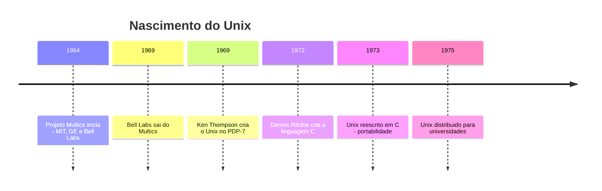
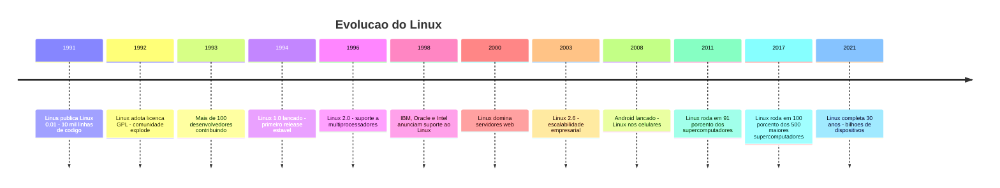
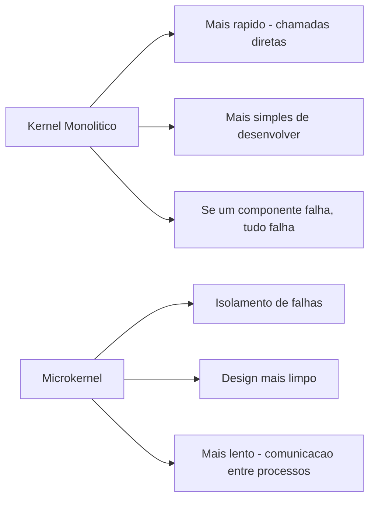
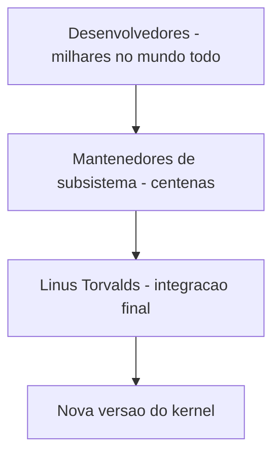
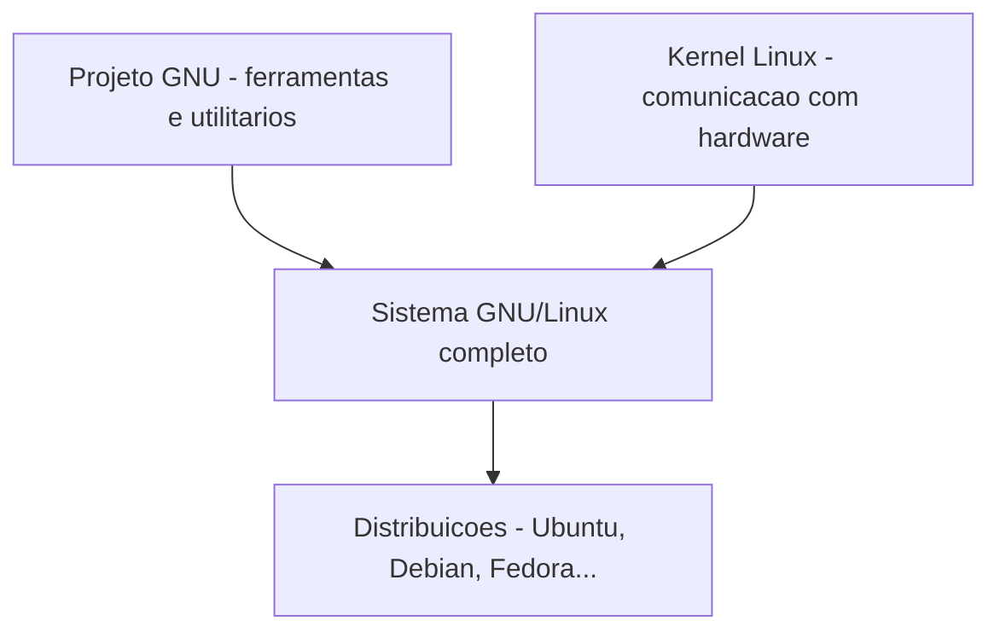
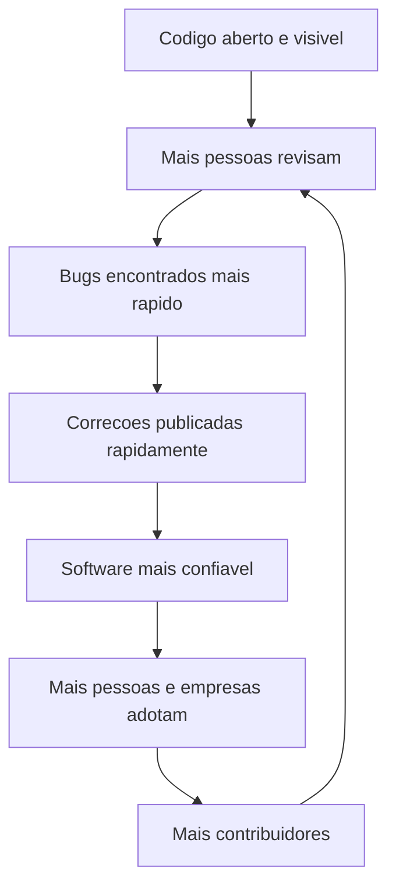
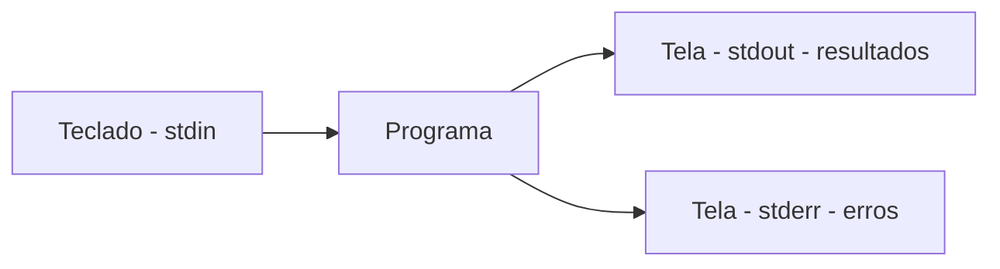
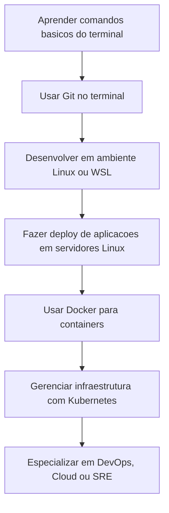

# 2.1 — O que é Linux e sua História

[← Anterior: IA no Dia a Dia](cap01-mod10-intro-ia.md) · [Próximo: Distribuições Linux →](cap02-mod02-distribuicoes.md)

---

## Introdução

No módulo 1.5, vimos que existem três grandes sistemas operacionais: Windows, macOS e Linux. Vimos que Linux é de código aberto, gratuito e roda a maior parte dos servidores da internet. No módulo anterior, conhecemos a Inteligência Artificial e como ela está transformando a tecnologia. Agora vamos mergulhar fundo no sistema que vai ser seu companheiro durante todo o restante do curso — e que, por sinal, é o sistema onde a maioria dos modelos de IA são treinados e executados.

Mas antes de falar sobre comandos, pastas e configurações, precisamos entender uma coisa fundamental: **por que Linux existe?** Qual problema ele resolve? Por que alguém criaria um sistema operacional inteiro e daria de graça?

A resposta está em uma das histórias mais fascinantes da tecnologia. E entender essa história vai te ajudar a entender não só o Linux, mas toda a filosofia por trás do software livre — uma filosofia que moldou a internet, as linguagens de programação que vamos usar e a forma como desenvolvedores trabalham no mundo inteiro.

Prepare-se: este módulo é uma viagem no tempo. Vamos passar pelos anos 1960, 1970, 1980 e 1990, conhecer personagens reais que mudaram o mundo e entender como decisões tomadas décadas atrás afetam o seu dia a dia como futuro desenvolvedor.

---

## A Origem de Tudo: Unix e os Laboratórios Bell

Para entender por que Linux existe, precisamos voltar muito antes dele — até 1969.

### O Contexto: Como era a Computação nos Anos 1960

Nos anos 1960, computadores eram máquinas enormes que ocupavam salas inteiras. Cada fabricante tinha seu próprio sistema operacional, incompatível com todos os outros. Se você escrevia um programa para o computador da IBM, ele não funcionava no computador da GE. Se aprendia a usar o sistema da Honeywell, esse conhecimento não servia para nada no sistema da DEC.

Imagine que cada marca de fogão tivesse suas próprias receitas, escritas em uma língua diferente. A receita do fogão Brastemp não funcionaria no fogão Consul. Você teria que reaprender a cozinhar toda vez que trocasse de fogão. Era exatamente assim com computadores naquela época.

Além disso, a maioria dos computadores só fazia uma coisa de cada vez. Você entregava seu programa em um cartão perfurado, esperava horas (às vezes dias) e recebia o resultado impresso. Não existia interação em tempo real com a máquina.

### O Projeto Multics: A Ambição que Falhou

Em 1964, três organizações se juntaram para criar o sistema operacional definitivo: o **MIT** (Massachusetts Institute of Technology, a universidade de tecnologia mais famosa do mundo), a **General Electric** (fabricante de computadores) e os **Laboratórios Bell** (o braço de pesquisa da AT&T, a gigante de telecomunicações americana).

O projeto se chamava **Multics** (Multiplexed Information and Computing Service). A ideia era revolucionária para a época: criar um sistema que permitisse múltiplos usuários trabalharem ao mesmo tempo no mesmo computador, cada um com seu próprio espaço e seus próprios programas.

Mas o Multics era ambicioso demais. O projeto ficou enorme, complexo, lento e caro. Depois de anos de trabalho, os Laboratórios Bell desistiram e saíram do projeto em 1969. Os pesquisadores que tinham trabalhado no Multics voltaram para seus laboratórios frustrados — mas com a cabeça cheia de ideias sobre como um sistema operacional deveria funcionar.

### Ken Thompson, Dennis Ritchie e o Nascimento do Unix

Dois desses pesquisadores eram **Ken Thompson** e **Dennis Ritchie**. Eles tinham aprendido muito com o Multics — tanto o que funcionava quanto o que não funcionava. E decidiram criar algo diferente: em vez de um sistema gigante que tentava fazer tudo, eles queriam algo simples, elegante e prático.

Ken Thompson começou escrevendo um sistema operacional novo em um computador PDP-7 que estava encostado em um canto do laboratório. A história conta que ele aproveitou as férias da esposa (que viajou com o filho para visitar os pais) para ter três semanas de programação ininterrupta. Em três semanas, ele criou a base do que se tornaria o Unix.

O nome "Unix" é um trocadilho com "Multics". Enquanto Multics significava "multiplexado" (muitas coisas ao mesmo tempo), Unix era "uni" — uma brincadeira dizendo que o sistema fazia "uma coisa de cada vez, mas fazia bem". Esse nome foi sugerido por outro pesquisador, Brian Kernighan.

Dennis Ritchie contribuiu de uma forma que mudou a computação para sempre: ele criou a **linguagem C** especificamente para reescrever o Unix. Antes disso, sistemas operacionais eram escritos em **Assembly** (linguagem de montagem), uma linguagem extremamente próxima do hardware e diferente para cada tipo de processador. Ao reescrever o Unix em C, Ritchie tornou possível algo inédito: o mesmo sistema operacional podia ser adaptado para rodar em computadores diferentes. Isso é o que chamamos de **portabilidade**.

Vamos aprender C no capítulo 6 deste curso. Quando chegarmos lá, lembre-se: essa linguagem foi criada para escrever um sistema operacional. É por isso que C é tão poderosa para falar diretamente com o hardware.

### Por que Unix era Revolucionário

Unix trouxe ideias que parecem óbvias hoje, mas eram revolucionárias em 1969:

| Inovacao do Unix | O que significava | Por que importava |
|------------------|-------------------|-------------------|
| Multi-usuario | Várias pessoas usavam o mesmo computador ao mesmo tempo | Computadores eram caros, compartilhar era essencial |
| Multi-tarefa | O computador executava vários programas simultaneamente | Não precisava esperar um programa terminar para iniciar outro |
| Sistema de arquivos hierarquico | Pastas dentro de pastas, organização em árvore | Antes disso, arquivos ficavam todos misturados |
| Pipes | A saida de um programa alimenta a entrada de outro | Programas pequenos podiam ser combinados para tarefas complexas |
| Portabilidade | Escrito em C, podia rodar em diferentes hardwares | Antes, cada computador precisava de seu proprio sistema |
| Texto como interface | Tudo era texto, legivel por humanos e máquinas | Facilitava automacao e comunicação entre programas |

Lembra da nossa analogia da cozinha? Antes do Unix, cada cozinha tinha seus próprios utensílios incompatíveis. O Unix criou um padrão: todas as cozinhas usam os mesmos tipos de panelas, facas e talheres. Isso significava que um cozinheiro (programador) que aprendia a trabalhar em uma cozinha Unix podia trabalhar em qualquer outra cozinha Unix.

### A Era de Ouro do Unix nas Universidades

Nos anos 1970, a AT&T (dona dos Laboratórios Bell) não podia vender software comercialmente por causa de um acordo antitruste com o governo americano. Então ela distribuiu o Unix para universidades por um preço simbólico, incluindo o código-fonte completo.

Isso foi transformador. Professores e estudantes podiam estudar como um sistema operacional real funcionava por dentro. Podiam modificar, experimentar, aprender. A Universidade da Califórnia em Berkeley (UC Berkeley) criou sua própria versão melhorada, chamada **BSD** (Berkeley Software Distribution). Outras universidades fizeram o mesmo.

Uma geração inteira de programadores cresceu estudando, modificando e melhorando o Unix. Esses programadores depois criaram a internet, as linguagens de programação modernas e as empresas de tecnologia que conhecemos hoje.

### As Guerras do Unix: Quando Tudo Deu Errado

No início dos anos 1980, o acordo antitruste da AT&T foi encerrado. A empresa percebeu que tinha um produto valioso e começou a cobrar caro pelo Unix. Muito caro.

O que aconteceu depois é conhecido como as **Guerras do Unix** (Unix Wars). Diferentes empresas criaram suas próprias versões incompatíveis do Unix:

| Versão | Empresa | Período |
|--------|---------|---------|
| System V | AT&T | 1983 em diante |
| BSD | UC Berkeley | 1977 em diante |
| SunOS e Solaris | Sun Microsystems | 1983 em diante |
| HP-UX | Hewlett-Packard | 1984 em diante |
| AIX | IBM | 1986 em diante |
| IRIX | Silicon Graphics | 1988 em diante |

Cada empresa adicionava suas próprias extensões e modificações, tornando as versões incompatíveis entre si. Um programa escrito para o Unix da Sun não necessariamente funcionava no Unix da IBM. O sonho da portabilidade estava se desfazendo.

Além disso, as licenças eram caríssimas. Uma licença do Unix podia custar milhares de dólares — um valor absurdo para estudantes e pequenas empresas. O conhecimento que antes era livre e acessível nas universidades agora estava trancado atrás de contratos comerciais.

Foi nesse cenário de fragmentação e restrição que dois movimentos surgiram para mudar tudo: o projeto GNU de Richard Stallman e, anos depois, o kernel Linux de Linus Torvalds.

### O BSD e a Batalha Legal que Quase Matou uma Alternativa

Enquanto as empresas brigavam com suas versões comerciais do Unix, a Universidade de Berkeley continuava desenvolvendo o BSD. No final dos anos 1980, o BSD tinha evoluído tanto que quase todo o código original da AT&T tinha sido substituído por código escrito em Berkeley. Os desenvolvedores do BSD decidiram criar uma versão completamente livre, sem nenhum código da AT&T.

Mas a AT&T não gostou. Em 1992, a empresa processou a Universidade de Berkeley, alegando que o BSD ainda continha código proprietário. A universidade contra-processou, dizendo que a AT&T tinha usado código do BSD sem dar crédito.

A batalha legal durou até 1994 e teve consequências enormes para a história da tecnologia. Durante esses dois anos de incerteza jurídica, ninguém sabia se era seguro usar o BSD. Desenvolvedores e empresas que queriam um sistema Unix livre tinham medo de serem processados.

E foi exatamente nesse período — 1991 a 1994 — que Linus Torvalds criou e popularizou o Linux. O Linux não tinha nenhuma relação com o código da AT&T, então não havia risco legal. Muitos historiadores da tecnologia acreditam que se o processo contra o BSD não tivesse acontecido, o Linux talvez nunca tivesse se tornado tão popular. O BSD teria ocupado esse espaço.

Quando o processo foi resolvido em 1994, o BSD já tinha perdido momentum. O Linux tinha uma comunidade enorme e crescente. Hoje, o BSD sobrevive em projetos como **FreeBSD**, **OpenBSD** e **NetBSD**, que são excelentes sistemas operacionais usados em nichos específicos (o Netflix, por exemplo, usa FreeBSD em seus servidores de streaming). Mas o Linux domina o mercado geral.

Essa história ilustra como fatores não-técnicos — neste caso, uma batalha legal — podem determinar o destino de tecnologias. O BSD era tecnicamente tão bom quanto o Linux (alguns argumentam que era melhor). Mas o timing e as circunstâncias favoreceram o Linux.

---

## O Problema: Software Proprietário e a Perda da Liberdade

Para entender a motivação por trás do software livre, precisamos sentir a frustração que os programadores sentiam nos anos 1980.

Imagine a seguinte situação: você é um cozinheiro talentoso. Durante anos, você trabalhou em uma cozinha comunitária onde todos compartilhavam receitas, melhoravam os pratos uns dos outros e ensinavam técnicas livremente. Um dia, o dono da cozinha tranca todas as receitas em um cofre e diz: "A partir de agora, vocês podem cozinhar, mas não podem ver as receitas. Se encontrarem um erro em uma receita, não podem corrigir. Se quiserem adaptar um prato, não podem. E para usar esta cozinha, cada um vai pagar uma taxa mensal."

Isso é exatamente o que aconteceu com o software nos anos 1980. O que antes era compartilhado livremente nas universidades se tornou propriedade de empresas. Programadores que tinham crescido em uma cultura de colaboração se viram presos em um mundo de licenças, restrições e código fechado.

Os problemas concretos eram:

- **Bugs sem correção**: se você encontrava um erro no software, não podia corrigi-lo. Tinha que reportar para a empresa e esperar — às vezes meses, às vezes para sempre
- **Impossibilidade de aprender**: sem acesso ao código-fonte, estudantes não podiam entender como os programas funcionavam por dentro
- **Dependência total**: se a empresa decidisse descontinuar o produto, você perdia tudo. Seu trabalho dependia de decisões de negócio de outra empresa
- **Incompatibilidade proposital**: empresas criavam formatos proprietários para prender os clientes. Se você usava o software da empresa A, era difícil migrar para a empresa B
- **Custo proibitivo**: licenças caras excluíam estudantes, pesquisadores e países em desenvolvimento

Esse era o mundo que Richard Stallman decidiu mudar.

---

## Richard Stallman e o Projeto GNU: A Revolução da Liberdade

### Quem é Richard Stallman

**Richard Matthew Stallman** (frequentemente chamado apenas de **RMS**, suas iniciais) é uma das figuras mais importantes e controversas da história da computação. Nascido em 1953 em Nova York, Stallman era um programador brilhante que trabalhava no Laboratório de Inteligência Artificial do MIT desde os anos 1970.

Stallman é conhecido por sua personalidade intensa e inflexível quando se trata de princípios. Ele não usa celular (por questões de privacidade), não tem conta em redes sociais, e se recusa a usar qualquer software proprietário. Para ele, a liberdade do software não é uma preferência técnica — é uma questão moral e ética, tão importante quanto a liberdade de expressão.

Essa intensidade é o que torna Stallman tão importante. Enquanto outros programadores reclamavam da situação mas se adaptavam, Stallman decidiu que o mundo precisava mudar — e dedicou sua vida inteira a essa causa.

### O Incidente da Impressora: A Gota d'Água

A história que desencadeou tudo é surpreendentemente simples. No início dos anos 1980, o laboratório de IA do MIT recebeu uma nova impressora a laser da Xerox. A impressora anterior tinha um problema: às vezes o papel enroscava e ninguém sabia até ir buscar sua impressão e encontrar tudo parado. Um programador do laboratório tinha resolvido isso modificando o software da impressora para enviar uma notificação a todos quando o papel enroscava.

Quando a nova impressora da Xerox chegou com o mesmo problema de enroscar papel, Stallman tentou fazer a mesma coisa: modificar o software para notificar os usuários. Mas dessa vez, a Xerox não forneceu o código-fonte. O software era proprietário, fechado, intocável.

Stallman pediu o código-fonte a um professor da Carnegie Mellon University que tinha acesso. O professor recusou — ele tinha assinado um acordo de confidencialidade (NDA, Non-Disclosure Agreement) com a Xerox e não podia compartilhar o código.

Para Stallman, isso foi um choque. Um colega programador, que normalmente compartilharia código sem pensar duas vezes, estava impedido por um contrato corporativo. A cultura de colaboração que ele conhecia estava sendo destruída por acordos legais.

Esse incidente aparentemente trivial — uma impressora que enroscava papel — foi o catalisador que levou Stallman a dedicar sua vida ao software livre. Ele percebeu que se não fizesse algo, toda a cultura de compartilhamento e colaboração da computação seria destruída pelo software proprietário.

### O Manifesto GNU e o Início do Projeto

Em 27 de setembro de 1983, Stallman publicou o **Manifesto GNU** no grupo de discussão net.unix-wizards. Nele, ele anunciava sua intenção de criar um sistema operacional completo e totalmente livre, compatível com Unix. O nome **GNU** é um acrônimo recursivo: **GNU's Not Unix** ("GNU Não é Unix"). Programadores adoram esse tipo de humor — um nome que se define referenciando a si mesmo.

O manifesto era ao mesmo tempo técnico e filosófico. Stallman não estava apenas propondo um projeto de software — estava propondo uma nova forma de pensar sobre software. Alguns trechos centrais da filosofia do manifesto:

- Software é conhecimento, e conhecimento deve ser compartilhado
- Restringir o acesso ao código-fonte é restringir a liberdade das pessoas
- A cooperação entre programadores é mais valiosa do que a competição
- Ninguém deveria ser forçado a escolher entre ter amigos (compartilhar) e obedecer a lei (respeitar licenças restritivas)

Em 1985, Stallman fundou a **FSF** (Free Software Foundation, ou Fundação para o Software Livre) para dar suporte organizacional e legal ao movimento. E deixou seu emprego no MIT para se dedicar integralmente ao projeto GNU.

### "Free as in Freedom, not Free as in Beer"

Uma das maiores confusões sobre software livre vem da palavra "free" em inglês, que significa tanto "livre" quanto "grátis". Stallman sempre fez questão de esclarecer:

> "Free software is a matter of liberty, not price. Think of free as in free speech, not as in free beer."
> ("Software livre é uma questão de liberdade, não de preço. Pense em livre como em liberdade de expressão, não como em cerveja grátis.")

Em português, essa confusão não existe — "livre" e "grátis" são palavras diferentes. Mas em inglês, a ambiguidade causou (e ainda causa) muita confusão. Por isso, muitas pessoas preferem usar o termo **FOSS** (Free and Open Source Software) ou **FLOSS** (Free/Libre and Open Source Software), onde "Libre" (do espanhol/francês) deixa claro que se trata de liberdade.

Na prática, a maioria dos softwares livres também é gratuita. Mas o ponto de Stallman é que o importante não é o preço — é a liberdade. Você pode cobrar dinheiro por software livre, desde que mantenha as quatro liberdades.

### As Quatro Liberdades do Software Livre

Stallman definiu quatro liberdades fundamentais que todo software deveria respeitar. Elas são numeradas a partir de zero (porque programadores contam a partir de zero — você vai entender por que quando chegarmos ao capítulo 5):

| Liberdade | O que significa | Analogia da cozinha |
|-----------|----------------|---------------------|
| 0 | Liberdade de usar o programa para qualquer proposito | Você pode cozinhar a receita quando quiser, para quem quiser |
| 1 | Liberdade de estudar como o programa funciona e adapta-lo | Você pode ler a receita, entender cada ingrediente e modificar ao seu gosto |
| 2 | Liberdade de redistribuir copias para ajudar outros | Você pode dar copias da receita para seus amigos |
| 3 | Liberdade de modificar e distribuir suas modificacoes | Você pode melhorar a receita e compartilhar a versão melhorada |

A Liberdade 1 e a Liberdade 3 exigem acesso ao **código-fonte** — o texto original escrito pelo programador. Sem o código-fonte, você pode usar o programa, mas não pode entender como ele funciona nem modificá-lo. É como ter um prato pronto mas não ter a receita.

Essas quatro liberdades são a base de todo o movimento de software livre e código aberto. Python, que vamos usar neste curso, é software livre. O editor VSCode é baseado em código aberto. Git, que vamos aprender no capítulo 4, é software livre. A maior parte das ferramentas que desenvolvedores usam no mundo inteiro é software livre.

### A Licença GPL: Protegendo a Liberdade com a Lei

Stallman percebeu que não bastava criar software livre — era preciso proteger legalmente essa liberdade. Se alguém pegasse código livre, modificasse e distribuísse como software proprietário, a liberdade se perderia.

Para resolver isso, ele criou a **GPL** (General Public License, ou Licença Pública Geral). A GPL é uma licença de software que usa o próprio sistema legal de direitos autorais para garantir a liberdade. A ideia é brilhante: em vez de usar o copyright para restringir, a GPL usa o copyright para garantir que o software permaneça livre.

A regra principal da GPL é o **copyleft** (um trocadilho com copyright): se você usa código GPL no seu programa, seu programa também deve ser GPL. Isso significa que a liberdade se propaga — ninguém pode pegar código livre e torná-lo proprietário.

Stallman compara o copyleft a uma corrente de liberdade: cada elo garante que o próximo também será livre.

### O que o Projeto GNU Criou

Ao longo dos anos 1980 e início dos 1990, o projeto GNU criou um arsenal impressionante de ferramentas:

| Ferramenta | O que faz | Importância | Usamos neste curso? |
|-----------|-----------|-------------|---------------------|
| GCC | Compilador de C e C++ | Permite transformar código em programas executaveis | Sim, no capítulo 6 |
| Bash | Interpretador de comandos do terminal | A interface principal para interagir com Linux | Sim, nos capítulos 2 e 3 |
| GNU Core Utils | Comandos básicos como ls, cp, mv, rm | As ferramentas do dia a dia no terminal | Sim, no capítulo 3 |
| Emacs | Editor de texto programavel | Um dos editores mais poderosos ja criados | Não, vamos usar VSCode |
| Make | Ferramenta de automacao de compilação | Automatiza o processo de compilar programas | Sim, no capítulo 6 |
| GDB | Depurador de programas | Permite encontrar e corrigir bugs | Mencionado no capítulo 6 |
| GNU C Library | Biblioteca padrão de C | Base para quase todos os programas Linux | Indiretamente, no capítulo 6 |

Mas faltava uma peça crucial: o **kernel** — o coração do sistema operacional, a parte que fala diretamente com o hardware (lembra? O kernel é como o gerente da cozinha que decide quem usa cada equipamento e quando). O GNU estava desenvolvendo um kernel chamado **Hurd**, mas ele era extremamente ambicioso em seu design e estava cronicamente atrasado. O Hurd usava uma arquitetura de **microkernel** — uma abordagem elegante mas complexa que fragmentava o kernel em muitos processos pequenos. Na teoria era superior, na prática era muito difícil de fazer funcionar.

O projeto GNU tinha tudo — menos o coração. E foi aí que entrou um estudante finlandês de 21 anos.

---

## Linus Torvalds e o Nascimento do Linux

### Quem é Linus Torvalds

**Linus Benedict Torvalds** nasceu em 28 de dezembro de 1969 em Helsinki, Finlândia. Ele vem de uma família de jornalistas — seu avô era poeta e jornalista, e seus pais também trabalhavam com comunicação. Linus foi o "diferentão" da família que se apaixonou por computadores.

Seu primeiro computador foi um Commodore VIC-20, que ele ganhou do avô aos 11 anos. Desde então, Linus passava horas programando. Na universidade (Universidade de Helsinki), ele estudou Ciência da Computação e se interessou profundamente por sistemas operacionais.

Linus tem uma personalidade muito diferente de Stallman. Enquanto Stallman é idealista e filosófico, Linus é pragmático e direto. Ele não criou o Linux por uma causa moral — criou porque queria um sistema operacional que funcionasse no seu PC e não encontrou nenhum que o satisfizesse. Nas palavras dele: "Eu fiz isso porque era divertido."

Essa diferença de personalidade é importante para entender a história do Linux. Stallman criou o GNU por princípio. Linus criou o Linux por diversão e necessidade prática. Juntos, sem planejar, criaram algo que mudou o mundo.

### A Conexão com o Minix

Na universidade, Linus usava um sistema chamado **Minix**, criado pelo professor holandês **Andrew Tanenbaum**. Minix era um sistema operacional educacional, feito para ensinar estudantes como sistemas operacionais funcionam. Era baseado em Unix, mas tinha limitações sérias:

- Era projetado para ensino, não para uso real
- Tinha restrições de licença que impediam modificações livres
- Não aproveitava bem os recursos dos processadores Intel 386, que eram os PCs mais comuns da época
- Tanenbaum não aceitava contribuições externas — ele queria manter o Minix simples para fins didáticos

Linus queria mais. Ele queria um sistema Unix-like real, que rodasse no seu PC Intel 386, que aproveitasse todo o poder do processador e que ele pudesse modificar livremente. Como não encontrou nenhum que o satisfizesse, decidiu criar o seu próprio.

### A Mensagem que Mudou o Mundo

Em 25 de agosto de 1991, Linus postou uma mensagem no grupo de discussão comp.os.minix da Usenet (a "internet" da época, antes da World Wide Web se popularizar). A mensagem dizia:

> "Hello everybody out there using minix - I'm doing a (free) operating system (just a hobby, won't be big and professional like gnu) for 386(486) AT clones. This has been brewing since april, and is starting to get ready."
>
> ("Olá a todos que usam minix - Estou fazendo um sistema operacional (livre/gratuito) (apenas um hobby, não vai ser grande e profissional como o gnu) para clones AT 386(486). Isso está em desenvolvimento desde abril e está começando a ficar pronto.")

Essa mensagem é uma das mais famosas da história da tecnologia. E é deliciosamente irônica: Linus disse que seu projeto "não vai ser grande e profissional como o GNU". Hoje, o Linux roda em bilhões de dispositivos, enquanto o kernel do GNU (Hurd) nunca foi amplamente adotado.

Em 17 de setembro de 1991, Linus publicou a versão 0.01 do Linux na internet. O código tinha cerca de 10.000 linhas. Hoje, o kernel Linux tem mais de 30 milhões de linhas de código.

### Como o Linux Cresceu: De Hobby a Dominação Mundial

O que aconteceu depois da publicação do Linux é um dos fenômenos mais impressionantes da história da tecnologia. Linus publicou o código na internet e convidou outros programadores a contribuir. E eles vieram — aos montes.

A cronologia do crescimento:

Um momento crucial foi em 1992, quando Linus decidiu relicenciar o Linux sob a **GPL** (a licença criada por Stallman). Antes disso, o Linux tinha uma licença própria que proibia uso comercial. Ao adotar a GPL, Linus garantiu que o Linux seria livre para sempre — e abriu as portas para que empresas pudessem usar e contribuir com o projeto.

Essa decisão foi pragmática, não ideológica. Linus não era (e não é) um ativista do software livre como Stallman. Ele simplesmente percebeu que a GPL era a melhor forma de garantir que o Linux continuasse recebendo contribuições da comunidade.

### O Debate Torvalds vs. Tanenbaum: Monolítico vs. Microkernel

Uma das discussões mais famosas da história da computação aconteceu em janeiro de 1992, poucos meses depois de Linus publicar o Linux. Andrew Tanenbaum — o professor holandês que criou o Minix e que era uma autoridade mundial em sistemas operacionais — publicou uma mensagem no grupo comp.os.minix com o título provocativo: "LINUX is obsolete" ("LINUX está obsoleto").

O argumento de Tanenbaum era técnico e, do ponto de vista acadêmico, sólido. Ele dizia que o Linux usava uma arquitetura **monolítica** — onde todo o kernel roda em um único bloco, com todas as funcionalidades (drivers, sistema de arquivos, rede, gerenciamento de memória) juntas no mesmo espaço. Tanenbaum defendia que o futuro era a arquitetura de **microkernel** — onde o kernel é mínimo e cada funcionalidade roda como um processo separado, comunicando-se por troca de mensagens.

Para entender a diferença, pense na nossa analogia da cozinha:

- **Kernel monolítico**: é como uma cozinha onde o gerente faz tudo — controla o estoque, coordena os cozinheiros, atende os pedidos, limpa a bancada. Tudo acontece no mesmo espaço, com comunicação direta e rápida. Se o gerente erra, a cozinha inteira para.

- **Microkernel**: é como uma cozinha onde o gerente só coordena. O estoque é controlado por uma pessoa separada, os pedidos são atendidos por outra, a limpeza por outra. Cada um trabalha de forma independente e se comunica por bilhetes. Se um deles falha, os outros continuam funcionando. Mas a comunicação por bilhetes é mais lenta do que falar diretamente.

Tanenbaum argumentava que o microkernel era superior porque:
- **Isolamento de falhas**: se um driver de hardware trava, ele não derruba o sistema inteiro
- **Modularidade**: componentes podem ser atualizados independentemente
- **Segurança**: cada componente tem apenas as permissões que precisa
- **Design limpo**: separação clara de responsabilidades

Linus respondeu de forma direta e pragmática (como é seu estilo). Seus argumentos:
- **Performance**: a comunicação entre processos no microkernel adiciona overhead (custo extra de processamento). No kernel monolítico, as chamadas são diretas e rápidas
- **Simplicidade prática**: um kernel monolítico é mais simples de desenvolver e depurar
- **Resultados reais**: o Linux funcionava e estava melhorando rapidamente. O Hurd (microkernel do GNU) e o Minix (microkernel de Tanenbaum) não tinham a mesma adoção
- **Pragmatismo**: "O que importa é o que funciona, não o que é teoricamente elegante"

A troca de mensagens ficou acalorada. Tanenbaum chegou a dizer que se Linus fosse seu aluno, tiraria nota baixa pelo design do Linux. Linus respondeu que preferia um sistema que funcionasse a um que fosse academicamente perfeito.

Quem venceu o debate? Na teoria, Tanenbaum tinha razão — microkernels são arquiteturalmente superiores. Na prática, Linus venceu de forma esmagadora. O Linux (monolítico) domina o mundo. O Hurd (microkernel) nunca saiu do laboratório. O Minix é usado apenas para ensino.

Mas a história tem uma ironia deliciosa: em 2006, descobriu-se que a Intel incluiu o Minix dentro de todos os seus processadores modernos, no subsistema **Intel Management Engine**. Tanenbaum nem sabia. Então, tecnicamente, o Minix roda em mais computadores do que qualquer outro sistema operacional — só que escondido dentro do processador, invisível para o usuário.

Esse debate é importante para você como futuro desenvolvedor porque ilustra uma tensão que aparece em toda a engenharia de software: **pureza teórica vs. pragmatismo**. Às vezes, a solução "imperfeita" que funciona é melhor do que a solução "perfeita" que nunca fica pronta. Vamos revisitar esse tema quando falarmos sobre arquitetura de software nos capítulos mais avançados.

### Como o Desenvolvimento do Linux Funciona: Mailing Lists, Patches e Mantenedores

Outro aspecto fascinante do Linux é como ele é desenvolvido. Diferente da maioria dos projetos de software modernos que usam plataformas como GitHub, o kernel Linux ainda usa um sistema baseado em **mailing lists** (listas de e-mail) e **patches** (arquivos com as mudanças propostas).

O processo funciona assim:

1. Um desenvolvedor identifica um bug ou uma melhoria necessária
2. Ele escreve o código da correção (o **patch**)
3. O patch é formatado como um e-mail e enviado para a lista de discussão relevante (existe uma lista para cada subsistema do kernel: rede, drivers, sistema de arquivos, etc.)
4. Outros desenvolvedores revisam o código publicamente na lista, fazem comentários e sugerem melhorias
5. O desenvolvedor ajusta o patch com base no feedback e reenvia
6. O **mantenedor** (maintainer) da área relevante aprova e integra o patch em sua árvore de código
7. O patch sobe na hierarquia de mantenedores até chegar a Linus Torvalds
8. Linus faz a integração final na árvore principal do kernel

Esse processo pode parecer antiquado comparado ao GitHub, mas tem vantagens:

- **Transparência total**: toda discussão é pública e arquivada permanentemente
- **Sem dependência de plataforma**: e-mail funciona em qualquer lugar, não depende de uma empresa específica
- **Revisão rigorosa**: o processo de revisão por e-mail tende a ser mais detalhado do que pull requests em plataformas web
- **Escala**: o kernel recebe milhares de patches por mês, e o sistema de listas distribuídas lida bem com esse volume

Linus pessoalmente revisa e integra as mudanças finais. Ele não escreve a maioria do código — seu papel principal é ser o "guardião da qualidade", decidindo o que entra e o que não entra. Ele usa o **Git** (que ele mesmo criou em 2005, justamente porque precisava de uma ferramenta melhor para gerenciar o código do kernel) para gerenciar todo o processo.

A hierarquia de mantenedores funciona como uma pirâmide:

Quando você aprender Git no capítulo 4, vai entender melhor como esse fluxo funciona. E quando começar a contribuir com projetos de código aberto (algo que recomendamos fortemente para sua carreira), vai usar um processo similar — embora provavelmente via GitHub, não por e-mail.

### A Personalidade de Linus e seu Estilo de Liderança

Linus Torvalds é conhecido por ser extremamente direto — às vezes até rude — em suas comunicações. Ele não tem paciência para código mal escrito e não hesita em criticar publicamente contribuições que considera ruins. Isso gerou controvérsias ao longo dos anos, e em 2018 Linus tirou uma pausa do desenvolvimento do kernel para trabalhar em suas habilidades interpessoais.

Apesar do estilo abrasivo, Linus é amplamente respeitado como um dos melhores engenheiros de software do mundo. Além do Linux, ele criou o **Git** — o sistema de controle de versão que vamos aprender no capítulo 4 e que é usado por praticamente todos os desenvolvedores do planeta.

Uma frase famosa de Linus resume bem sua filosofia: "Talk is cheap. Show me the code." ("Conversa é barata. Me mostre o código.") Para Linus, o que importa não são discursos ou teorias — é o código que funciona.

---

## Linux + GNU = Sistema Completo

O kernel de Linus era exatamente a peça que faltava ao projeto GNU. Quando combinados:

- **GNU** fornecia as ferramentas: compilador, shell, utilitários, bibliotecas
- **Linux** fornecia o kernel: a parte que fala com o hardware

Juntos, formavam um sistema operacional completo, funcional e totalmente livre.

### O Debate GNU/Linux: Uma Polêmica que Dura Décadas

Aqui entra uma das polêmicas mais duradouras do mundo da tecnologia. Richard Stallman insiste que o sistema deveria ser chamado de **GNU/Linux**, não apenas "Linux". O argumento dele é lógico: o kernel é apenas uma parte do sistema. Sem as ferramentas GNU (compilador, shell, utilitários, bibliotecas), o kernel sozinho não serve para nada. Chamar o sistema inteiro de "Linux" é como chamar um carro pelo nome do motor, ignorando a carroceria, os pneus, o volante e tudo mais.

Linus Torvalds, por outro lado, acha essa discussão irrelevante. Para ele, o nome "Linux" pegou, todo mundo entende o que significa, e ficar insistindo em "GNU/Linux" é pedantismo.

Na prática, a maioria das pessoas e empresas chama o sistema de "Linux". Algumas distribuições, como o Debian, oficialmente usam o nome "Debian GNU/Linux" em respeito ao projeto GNU. Neste curso, vamos usar "Linux" no dia a dia (porque é assim que o mercado de trabalho usa), mas é importante que você saiba que o nome completo é GNU/Linux e entenda por quê.

Independente do nome, o importante é entender que o sistema que usamos é resultado do trabalho de duas comunidades: a do GNU (liderada por Stallman, focada em liberdade) e a do Linux (liderada por Torvalds, focada em qualidade técnica). Sem qualquer uma das duas, o sistema como conhecemos não existiria.

---

## Como o Linux é Desenvolvido Hoje

O desenvolvimento do kernel Linux é um dos maiores projetos colaborativos da história humana. Na seção anterior, vimos como o processo de patches e mailing lists funciona. Agora vamos olhar para o lado organizacional e corporativo.

### A Linux Foundation e os Contribuidores Corporativos

Em 2000, foi criada a **Linux Foundation** (Fundacao Linux), uma organização sem fins lucrativos que coordena o desenvolvimento do Linux e de outros projetos de código aberto. A Linux Foundation é financiada por empresas que dependem do Linux.

E aqui está um fato que surpreende muita gente: a maioria do código do kernel Linux hoje é escrita por programadores pagos por empresas. As maiores contribuidoras incluem:

| Empresa | Por que contribui | Exemplos de contribuição |
|---------|-------------------|--------------------------|
| Intel | Fábrica processadores, precisa que Linux funcione bem neles | Drivers, otimizacoes de performance |
| Red Hat e IBM | Vendem servicos baseados em Linux | Sistemas de arquivos, segurança, containers |
| Google | Usa Linux no Android e em seus servidores | Kernel para dispositivos moveis, segurança |
| Microsoft | Usa Linux no Azure e no WSL | Drivers Hyper-V, melhorias para nuvem |
| Samsung | Usa Linux no Android e em dispositivos IoT | Drivers para hardware Samsung |
| Huawei | Usa Linux em seus servidores e dispositivos | Sistemas de arquivos, rede |
| SUSE | Distribui Linux empresarial | Kernel empresarial, estabilidade |

Sim, você leu certo: a **Microsoft**, que durante décadas foi a maior rival do Linux, hoje é uma das maiores contribuidoras do kernel. O ex-CEO da Microsoft, Steve Ballmer, chegou a chamar o Linux de "câncer" em 2001. Hoje, a Microsoft ama o Linux — porque seus clientes usam Linux no Azure (a nuvem da Microsoft), e quanto melhor o Linux funcionar no Azure, mais clientes a Microsoft atrai.

Essa transformação mostra algo importante: no mundo do software, pragmatismo vence ideologia. Empresas contribuem com o Linux não por altruísmo, mas porque é bom para seus negócios. E isso é perfeitamente compatível com o modelo de código aberto — todos ganham.

### Números do Desenvolvimento

Para ter uma ideia da escala do projeto:

- Mais de **30 milhões de linhas de código** no kernel
- Mais de **20.000 desenvolvedores** já contribuíram
- Uma nova versão do kernel é lançada a cada **9-10 semanas**
- Cada versão recebe entre **12.000 e 16.000 mudanças** (commits)
- Mais de **1.500 empresas** já contribuíram com código
- O kernel suporta mais de **30 arquiteturas de processador** diferentes

---

## O Poder do Código Aberto: Por que Funciona

Antes de falarmos sobre as diferenças filosóficas entre software livre e código aberto, vale a pena entender por que o modelo de desenvolvimento aberto funciona tão bem na prática. Porque, convenhamos, a ideia parece contraintuitiva: como é possível que milhares de voluntários e empresas concorrentes, trabalhando sem um chefe central, produzam software de qualidade superior ao de empresas bilionárias com equipes dedicadas?

### A Lei de Linus: "Dados Olhos Suficientes, Todos os Bugs São Rasos"

Em 1997, Eric Raymond publicou um ensaio que se tornou um dos textos mais influentes da história da tecnologia: **"The Cathedral and the Bazaar"** ("A Catedral e o Bazar"). Nele, Raymond comparava dois modelos de desenvolvimento de software:

- **A Catedral**: software desenvolvido por uma equipe fechada, em segredo, com lançamentos cuidadosamente planejados. O código só é revelado quando está "pronto". É assim que a maioria das empresas de software proprietário trabalha.

- **O Bazar**: software desenvolvido abertamente, com o código disponível para qualquer pessoa ver, usar e modificar a qualquer momento. Novas versões são lançadas frequentemente, mesmo que imperfeitas. É assim que o Linux e a maioria dos projetos de código aberto funcionam.

Raymond observou que o modelo do Bazar, apesar de parecer caótico, produzia software mais confiável. E formulou o que chamou de **Lei de Linus** (em homenagem a Linus Torvalds):

> "Given enough eyeballs, all bugs are shallow."
> ("Dados olhos suficientes, todos os bugs são rasos.")

O que isso significa? Quando milhares de pessoas podem ler o código-fonte de um programa, a probabilidade de alguém encontrar um erro é muito maior do que quando apenas uma equipe pequena tem acesso. E não é só encontrar — é também corrigir. Em software proprietário, se você encontra um bug, precisa reportar para a empresa e esperar. Em software aberto, você pode corrigir o bug e enviar a correção.

Para entender com uma analogia: imagine que você escreveu um texto longo e precisa encontrar erros de ortografia. Se apenas você revisar, vai perder vários erros — seus olhos se acostumam com o texto e "pulam" os problemas. Se 5 amigos revisarem, vão encontrar mais erros. Se 500 pessoas revisarem, praticamente todos os erros serão encontrados. É o mesmo princípio com código.

### Exemplos Concretos de Como o Código Aberto Encontra e Corrige Problemas

**Heartbleed (2014)**: uma vulnerabilidade gravíssima foi descoberta no OpenSSL, a biblioteca de segurança usada por mais de 60% dos servidores web do mundo. A falha existia há dois anos sem ser detectada. Quando foi descoberta, a correção foi publicada em menos de uma semana. Em software proprietário, a empresa poderia levar meses para reconhecer o problema e lançar uma correção — e os usuários não teriam como verificar se a correção realmente resolveu o problema.

**Log4Shell (2021)**: uma vulnerabilidade crítica foi encontrada no Log4j, uma biblioteca Java usada por milhões de aplicações. A comunidade open source mobilizou milhares de desenvolvedores ao redor do mundo para criar correções, testar e distribuir atualizações em questão de dias. Empresas que usavam versões proprietárias de bibliotecas similares demoraram semanas para reagir.

**Kernel Linux — correções diárias**: o kernel Linux recebe centenas de correções por semana. Bugs são reportados, discutidos publicamente e corrigidos de forma transparente. Qualquer pessoa pode acompanhar o processo. Compare isso com o Windows, onde bugs são reportados para a Microsoft e os usuários precisam esperar pelo próximo "Patch Tuesday" (a Microsoft lança correções de segurança apenas uma vez por mês, na segunda terça-feira).

### O Efeito da Transparência

A transparência do código aberto cria um ciclo virtuoso:

Esse ciclo explica por que projetos como Linux, Python, PostgreSQL e Kubernetes são considerados mais confiáveis do que muitas alternativas proprietárias. Não é porque programadores de código aberto são melhores — é porque o modelo de desenvolvimento permite que mais pessoas encontrem e corrijam problemas.

### O Modelo de Contribuição: Como Pessoas e Empresas Colaboram

Na prática, o desenvolvimento de código aberto funciona com diferentes níveis de contribuição:

| Nível | Quem | O que faz | Exemplo |
|-------|------|-----------|---------|
| Usuarios | Qualquer pessoa | Reportam bugs, sugerem melhorias | Você reporta que um comando não funciona |
| Contribuidores ocasionais | Desenvolvedores voluntarios | Corrigem bugs simples, melhoram documentação | Um programador corrige um erro de digitacao no manual |
| Contribuidores regulares | Desenvolvedores dedicados | Implementam funcionalidades, revisam código | Um desenvolvedor adiciona suporte a novo hardware |
| Mantenedores | Lideres de subsistema | Revisam e aprovam mudancas, definem direcao técnica | O mantenedor do subsistema de rede do kernel |
| Patrocinadores | Empresas | Pagam desenvolvedores, doam infraestrutura | Google paga engenheiros para trabalhar no kernel |

Esse modelo em camadas permite que qualquer pessoa contribua no nível que puder. Você não precisa ser um gênio da programação para ajudar — reportar um bug, melhorar uma documentação ou traduzir uma interface já é uma contribuição valiosa.

Quando você começar a programar nos capítulos 5 e 6, vai poder contribuir com projetos de código aberto. Muitos projetos têm issues marcadas como "good first issue" (boa primeira contribuição) — problemas simples reservados para iniciantes. Contribuir com código aberto é uma das melhores formas de aprender, ganhar experiência e construir um portfólio visível para empregadores.

---

## Open Source vs. Software Livre: Mesma Coisa ou Não?

Você já deve ter notado que usamos dois termos parecidos neste módulo: **software livre** e **código aberto** (open source). Muita gente acha que são sinônimos. Na prática, são quase a mesma coisa — mas a diferença filosófica entre eles é importante e revela uma das maiores tensões do mundo da tecnologia.

### A Origem da Divisão

Nos anos 1990, o movimento de software livre liderado por Stallman estava crescendo, mas tinha um problema de marketing. Muitas empresas tinham medo do termo "software livre" por dois motivos:

1. A confusão com "grátis" em inglês (free = livre ou grátis)
2. A retórica de Stallman, que falava em termos morais e éticos — "liberdade", "direitos", "justiça" — o que assustava executivos corporativos

Em 1998, a Netscape (empresa que criou um dos primeiros navegadores web) decidiu liberar o código-fonte do seu navegador. Esse foi um momento histórico — uma grande empresa comercial adotando o modelo de código aberto. Mas os executivos da Netscape não queriam se associar à retórica de Stallman sobre "liberdade" e "ética". Eles queriam falar sobre benefícios práticos: melhor qualidade de código, desenvolvimento mais rápido, inovação.

Nesse contexto, um grupo de pessoas — incluindo **Eric Raymond** (autor do famoso ensaio "The Cathedral and the Bazaar"), **Bruce Perens** e **Tim O'Reilly** — cunhou o termo **Open Source** (código aberto) e fundou a **OSI** (Open Source Initiative) como alternativa à FSF de Stallman.

### As Duas Visões

| Aspecto | Software Livre - FSF | Open Source - OSI |
|---------|---------------------|-------------------|
| Fundador | Richard Stallman, 1985 | Eric Raymond e Bruce Perens, 1998 |
| Foco | Liberdade como direito moral | Beneficios práticos do modelo aberto |
| Motivacao | Etica e justica social | Qualidade, inovacao, eficiência |
| Linguagem | Direitos, liberdade, comunidade | Colaboracao, meritocracia, pragmatismo |
| Visao sobre software proprietario | Moralmente errado | Apenas menos eficiente |
| Público-alvo | Usuarios e sociedade | Empresas e desenvolvedores |
| Licenças preferidas | GPL e copyleft | Aceita qualquer licença aprovada pela OSI |

Stallman ficou furioso com o termo "open source". Para ele, remover a palavra "livre" era remover o coração do movimento. Ele argumenta que falar apenas em "código aberto" esconde a questão fundamental: a liberdade do usuário. Nas palavras dele:

> "Open source is a development methodology; free software is a social movement."
> ("Código aberto é uma metodologia de desenvolvimento; software livre é um movimento social.")

Para Stallman, não basta que o código seja aberto — é preciso que os usuários tenham liberdade. Um programa pode ter código aberto mas impor restrições que violam as quatro liberdades. Nesse caso, seria "open source" mas não "software livre".

### Na Prática: Quase a Mesma Coisa

Apesar da diferença filosófica, na prática a sobreposição é enorme. Quase todo software que é "livre" também é "open source", e vice-versa. As licenças aprovadas pela FSF e pela OSI são quase idênticas. A grande maioria dos projetos que você vai usar na sua carreira — Linux, Python, Git, Docker, Node.js, React — são tanto software livre quanto open source.

A diferença importa mais em conversas filosóficas e em casos extremos. Por exemplo:

- **Tivoização**: a empresa TiVo usava Linux (GPL) em seus gravadores de vídeo, mas o hardware impedia que os usuários instalassem versões modificadas do software. Tecnicamente, o código era aberto (open source), mas os usuários não tinham liberdade real de modificar o sistema. Stallman considerou isso uma violação do espírito do software livre e criou a GPLv3 para proibir essa prática. Linus Torvalds discordou e manteve o kernel Linux na GPLv2.

- **Licenças "source available"**: algumas empresas publicam seu código-fonte mas com restrições de uso (por exemplo, proibindo uso comercial por concorrentes). Isso é "código visível" mas não é nem software livre nem open source.

### Qual Termo Usar?

No dia a dia, a maioria das pessoas usa "open source" porque é o termo mais popular no mercado de trabalho. Stallman prefere "software livre" ou "FLOSS" (Free/Libre and Open Source Software). Neste curso, vamos usar os dois termos de forma intercambiável quando a diferença não for relevante, e vamos especificar quando a distinção importar.

O importante é que você entenda que por trás de uma simples escolha de palavras existe uma tensão filosófica real entre **idealismo** (Stallman: software deve ser livre por princípio) e **pragmatismo** (Raymond/Torvalds: software aberto é melhor na prática). Essa tensão aparece em muitas áreas da tecnologia e da vida — e não tem resposta certa.

---

## Licenças de Software: As Regras do Jogo

Quando você começar a programar e criar seus próprios projetos, vai precisar escolher uma licença. Licenças definem as regras de como outras pessoas podem usar, modificar e distribuir seu código. Entender as principais licenças é fundamental para qualquer desenvolvedor.

### Por que Licenças Importam

Sem uma licença, o código que você pública na internet está protegido por direitos autorais por padrão — ninguém pode usá-lo legalmente. Parece contraditório, mas é assim que a lei funciona: se você não diz explicitamente que as pessoas podem usar seu código, elas não podem.

Por isso, todo projeto de software precisa de uma licença. A licença é como um contrato que diz: "Você pode usar meu código, desde que siga estas regras."

### As Principais Licenças de Código Aberto

| Licença | Criada por | Regra principal | Quem usa |
|---------|-----------|-----------------|----------|
| GPL v2 e v3 | Richard Stallman e FSF | Copyleft - código derivado deve ser GPL também | Linux kernel, GCC, Bash |
| MIT | MIT | Muito permissiva - faca o que quiser, so mantenha o aviso de copyright | jQuery, Node.js, React |
| Apache 2.0 | Apache Software Foundation | Permissiva com proteção de patentes | Android, Kubernetes, TensorFlow |
| BSD | Universidade de Berkeley | Muito permissiva, similar a MIT | FreeBSD, macOS usa código BSD |
| LGPL | FSF | Copyleft mais leve - permite uso em software proprietario | GNU C Library, Qt |
| AGPL | FSF | Como GPL mas inclui uso via rede e servidores | MongoDB, Grafana |

As licenças se dividem em dois grandes grupos:

**Licenças copyleft** (GPL, LGPL, AGPL): exigem que código derivado mantenha a mesma licença. Se você usa código GPL no seu projeto, seu projeto deve ser GPL também. Isso garante que a liberdade se propaga.

**Licenças permissivas** (MIT, Apache, BSD): permitem que você use o código em qualquer projeto, inclusive proprietário. Você pode pegar código MIT, modificar e vender como software fechado. A única exigência é manter o aviso de copyright original.

A escolha entre copyleft e permissiva é uma das decisões mais importantes que um desenvolvedor faz ao criar um projeto. Não existe resposta certa — depende dos seus objetivos.

### Como o Copyleft Funciona na Prática

O conceito de copyleft merece uma explicação mais detalhada, porque é uma das ideias mais engenhosas da história do direito e da tecnologia.

Normalmente, o **copyright** (direito autoral) é usado para restringir: "Eu sou o dono deste código, você não pode copiar nem modificar sem minha permissão." O copyleft inverte essa lógica: usa o próprio copyright para garantir liberdade. É como usar as regras do jogo contra o próprio jogo.

Funciona assim: o autor do código mantém o copyright (é legalmente o dono), mas concede uma licença que diz: "Você pode usar, copiar, modificar e distribuir este código, MAS qualquer versão modificada que você distribuir também deve usar a mesma licença." Essa condição é chamada de **cláusula viral** — a liberdade se "espalha" para todo código derivado, como um vírus (no bom sentido).

Exemplo prático: imagine que você cria um programa usando código GPL. Você pode vender esse programa, pode modificá-lo como quiser, pode usá-lo para qualquer propósito. Mas se você distribuir o programa (vender, dar, publicar), deve incluir o código-fonte e manter a licença GPL. Isso impede que alguém pegue código livre, modifique e distribua como software proprietário fechado.

A GPL tem diferentes versões, cada uma mais rigorosa:

| Versão | Ano | Novidade principal |
|--------|-----|-------------------|
| GPLv1 | 1989 | Primeira versão, estabeleceu o copyleft básico |
| GPLv2 | 1991 | Versão mais usada, adotada pelo kernel Linux |
| GPLv3 | 2007 | Combate tivoizacao e patentes de software |

A **GPLv3** foi criada em resposta à prática de "tivoização" — quando a empresa TiVo usava Linux (GPLv2) em seus aparelhos mas impedia fisicamente que os usuários instalassem versões modificadas do software. Stallman considerou isso uma violação do espírito da GPL e adicionou cláusulas na v3 para proibir essa prática. Linus Torvalds discordou e manteve o kernel Linux na GPLv2, argumentando que a GPLv3 era restritiva demais.

### Escolhendo uma Licença para Seu Projeto

Quando você criar seus primeiros projetos (e vai criar — nos capítulos 7, 8 e 10), vai precisar escolher uma licença. Aqui está um guia simplificado:

- **Quer que seu código sempre permaneça livre?** Use GPL
- **Quer máxima adoção e não se importa se empresas usarem em software fechado?** Use MIT ou Apache
- **Quer proteção contra patentes?** Use Apache 2.0
- **Não sabe o que escolher?** MIT é a escolha mais segura para projetos pessoais — é simples, permissiva e amplamente aceita

Vamos revisitar esse tema quando você criar seus primeiros projetos.

---

## A Filosofia Unix: Conceitos que Duram para Sempre

Linux herdou do Unix uma filosofia de design que é uma das coisas mais importantes que você vai aprender neste curso. Essa filosofia influencia como programadores pensam e trabalham até hoje — e vai influenciar como você escreve código quando chegarmos aos capítulos de programação.

Lembre-se do nosso mantra: **conceitos são para sempre, ferramentas apenas os implementam**. A filosofia Unix é um conceito. Linux, Bash e os comandos são ferramentas que implementam esse conceito.

### Os Princípios da Filosofia Unix

Em 1978, Doug McIlroy (outro pesquisador dos Laboratórios Bell e inventor do conceito de pipes) resumiu a filosofia Unix em três regras:

1. **Faça uma coisa e faça bem** — cada programa deve ter uma única responsabilidade, e executá-la com excelência
2. **Programas devem trabalhar juntos** — a saída de um programa pode ser a entrada de outro, permitindo combinar ferramentas simples para resolver problemas complexos
3. **Use texto como interface universal** — texto simples é o formato mais flexível e universal para comunicação entre programas

Vamos explorar cada princípio em profundidade, porque eles vão aparecer repetidamente ao longo do curso.

### Princípio 1: Faça Uma Coisa e Faça Bem

No mundo Unix, cada programa é especialista em uma tarefa. O comando `ls` lista arquivos — e só isso. O comando `grep` busca texto — e só isso. O comando `sort` ordena linhas — e só isso. Nenhum desses comandos tenta fazer tudo.

Isso é o oposto do que muitos iniciantes fazem quando começam a programar: criar um programa gigante que faz tudo. A filosofia Unix ensina que é melhor ter muitas ferramentas pequenas e especializadas do que uma ferramenta enorme e genérica.

Analogia da cozinha: uma faca de chef é melhor para cortar legumes do que um canivete suíço. O canivete tem faca, tesoura, abridor e saca-rolhas — mas nenhuma dessas funções é tão boa quanto a ferramenta dedicada. Na cozinha profissional, cada utensílio tem uma função específica.

Quando você aprender sobre **funções** no capítulo 5, vai aplicar esse princípio: cada função deve fazer uma coisa e fazer bem.

### Princípio 2: Programas Devem Trabalhar Juntos

O poder do Unix não está em programas individuais — está na capacidade de combiná-los. O mecanismo que permite isso é o **pipe** (representado pelo caractere `|`), que conecta a saída de um programa à entrada de outro.

Por exemplo, imagine que você quer encontrar as 5 palavras mais frequentes em um texto. No Unix, você combinaria vários programas simples:

1. `cat` lê o arquivo
2. `tr` quebra o texto em palavras (uma por linha)
3. `sort` ordena as palavras alfabeticamente
4. `uniq -c` conta quantas vezes cada palavra aparece
5. `sort -rn` ordena por frequência (maior primeiro)
6. `head -5` mostra apenas as 5 primeiras

Cada programa faz uma coisa simples. Juntos, resolvem um problema complexo. Vamos praticar isso extensivamente no capítulo 3.

### Princípio 3: Texto como Interface Universal

No Unix, quase tudo é texto. Configurações são arquivos de texto. Logs são arquivos de texto. A comunicação entre programas é texto. Isso pode parecer primitivo comparado a interfaces gráficas bonitas, mas é incrivelmente poderoso.

Por que texto é tão importante?

- **Qualquer programa pode ler e escrever texto** — não precisa de bibliotecas especiais
- **Humanos podem ler texto** — você pode abrir um arquivo de configuração e entender o que está acontecendo
- **Texto é universal** — funciona em qualquer sistema, qualquer época, qualquer linguagem
- **Texto é fácil de processar** — ferramentas como `grep`, `sed` e `awk` manipulam texto com facilidade

Quando você aprender sobre APIs no capítulo 10, vai ver que a internet moderna usa **JSON** (JavaScript Object Notation) — que é basicamente texto estruturado. A filosofia Unix de "texto como interface" está viva e forte na web moderna.

### Princípio 4: Tudo é um Arquivo

Uma das ideias mais radicais e elegantes do Unix — que o Linux herdou — é o conceito de que **tudo é um arquivo**. No Unix, praticamente tudo no sistema é representado como se fosse um arquivo:

- Arquivos de texto? São arquivos (óbvio).
- Diretórios (pastas)? São arquivos especiais que contêm listas de outros arquivos.
- O teclado? É um arquivo de onde o sistema lê dados.
- A tela do terminal? É um arquivo onde o sistema escreve dados.
- Uma impressora? É um arquivo onde você escreve e o conteúdo sai impresso.
- Um disco rígido? É um arquivo.
- Uma conexão de rede? É um arquivo.
- Um processo rodando no sistema? Tem uma representação como arquivo.

Por que isso é tão poderoso? Porque se tudo é um arquivo, você pode usar as mesmas ferramentas para trabalhar com qualquer coisa. O comando que lê um arquivo de texto também pode ler dados do teclado. O comando que escreve em um arquivo também pode enviar dados para uma impressora ou para a rede.

Voltando à analogia da cozinha: imagine que todos os ingredientes, utensílios e até os pedidos dos clientes fossem representados como fichas padronizadas. Qualquer cozinheiro que sabe ler uma ficha pode trabalhar com qualquer coisa na cozinha. Não precisa aprender um sistema diferente para cada tipo de ingrediente.

Na prática, o Linux organiza tudo em um sistema de arquivos que começa na raiz `/`. Alguns diretórios especiais:

| Diretório | O que contem | Exemplo |
|-----------|-------------|---------|
| /dev | Dispositivos de hardware representados como arquivos | /dev/sda e o disco rigido |
| /proc | Informações sobre processos em execução | /proc/cpuinfo mostra dados da CPU |
| /sys | Informações sobre o hardware do sistema | /sys/class/net lista interfaces de rede |
| /tmp | Arquivos temporarios | Programas guardam dados temporarios aqui |

Vamos explorar essa estrutura em detalhes nos próximos módulos. Por enquanto, o importante é entender o conceito: no Linux, tudo é tratado de forma uniforme como arquivo. Isso simplifica enormemente o design do sistema e das ferramentas.

### Princípio 5: Entrada Padrão, Saída Padrão e Saída de Erro

Outro conceito fundamental que o Unix introduziu — e que você vai usar extensivamente quando começar a programar — é o sistema de **três canais padrão** de comunicação de todo programa:

- **stdin** (standard input, ou entrada padrão): de onde o programa recebe dados. Por padrão, é o teclado.
- **stdout** (standard output, ou saída padrão): para onde o programa envia seus resultados. Por padrão, é a tela do terminal.
- **stderr** (standard error, ou saída de erro): para onde o programa envia mensagens de erro. Por padrão, também é a tela do terminal, mas é um canal separado do stdout.

Por que separar a saída normal da saída de erro? Porque isso permite que você redirecione cada uma para um lugar diferente. Por exemplo, você pode mandar os resultados de um programa para um arquivo e as mensagens de erro para outro arquivo. Ou pode mandar os resultados para outro programa (via pipe) enquanto as mensagens de erro aparecem na tela.

Esse conceito é tão fundamental que todas as linguagens de programação modernas o implementam. Quando você aprender Python no capítulo 5, vai usar `print()` para escrever no stdout e `input()` para ler do stdin. Quando aprender C no capítulo 6, vai usar `printf()` para stdout e `fprintf(stderr, ...)` para stderr.

E lembra do pipe (`|`) que mencionamos antes? Ele conecta o stdout de um programa ao stdin de outro. É por isso que programas Unix podem trabalhar juntos — a saída de um alimenta a entrada do próximo, como uma linha de montagem.

Vamos praticar tudo isso no capítulo 3. Por enquanto, guarde esses três nomes: **stdin**, **stdout** e **stderr**. Eles vão aparecer muitas vezes ao longo do curso.

### A Filosofia Unix Resumida em Uma Tabela

| Principio | O que significa | Exemplo no Linux | Exemplo na programação |
|-----------|----------------|-------------------|------------------------|
| Faca uma coisa e faca bem | Cada programa tem uma única responsabilidade | ls so lista, grep so busca | Cada função faz uma coisa |
| Programas trabalham juntos | Saida de um e entrada de outro | Pipes conectam comandos | Funções chamam outras funções |
| Texto como interface | Comunicação via texto simples | Arquivos de configuração em texto | JSON, CSV, logs em texto |
| Tudo e um arquivo | Hardware, processos e recursos são representados como arquivos | /dev/sda e o disco, /proc/cpuinfo e a CPU | Abrir arquivo e ler do teclado usam a mesma lógica |
| stdin, stdout, stderr | Todo programa tem 3 canais padrão de comunicação | Pipes conectam stdout ao stdin do próximo | print envia para stdout, input le do stdin |
| Prefira simplicidade | A solução mais simples que funciona | Comandos curtos e diretos | Código limpo e legivel |
| Prototipe rápido | Faca funcionar primeiro, otimize depois | Scripts rapidos em Bash | MVP antes de otimizar |

---

## Onde Linux Está Hoje: Números e Fatos

Quando dizemos que "Linux está em todo lugar", não é exagero. Vamos ver os números concretos.

### Servidores e Internet

Mais de **96% dos servidores web** do mundo rodam Linux. Quando você acessa o Google, o YouTube, a Netflix, o Instagram, o Twitter, a Amazon, o Spotify — todos esses serviços rodam em servidores Linux.

Por que? Porque Linux é:
- **Estável**: servidores Linux podem ficar ligados por anos sem precisar reiniciar
- **Seguro**: o modelo de permissões do Unix é robusto, e a comunidade corrige vulnerabilidades rapidamente
- **Gratuito**: não há custo de licença, o que importa quando você tem milhares de servidores
- **Customizável**: você pode otimizar o sistema para a tarefa específica do servidor
- **Leve**: Linux pode rodar com pouquíssimos recursos, maximizando o uso do hardware

### Celulares: Android

O **Android**, sistema operacional de mais de 70% dos smartphones do mundo, é baseado no kernel Linux. Quando você usa um celular Samsung, Motorola, Xiaomi ou qualquer outro Android, está usando Linux.

O Google pegou o kernel Linux, adicionou suas próprias bibliotecas e frameworks, e criou o Android. Isso foi possível porque o Linux é software livre — o Google tinha a liberdade de pegar o código, modificar e usar como quisesse.

### Supercomputadores

**100% dos 500 supercomputadores mais poderosos do mundo** rodam Linux. Não 99%. Não "a maioria". Todos. Cem por cento.

Supercomputadores são usados para simulações climáticas, pesquisa nuclear, modelagem de proteínas, inteligência artificial e outras tarefas que exigem poder computacional extremo. Linux domina esse segmento porque é o único sistema que pode ser customizado no nível necessário para essas máquinas.

### Nuvem (Cloud)

Os três maiores provedores de nuvem do mundo — **AWS** (Amazon), **Google Cloud** e **Microsoft Azure** — rodam Linux em seus servidores. Mesmo o Azure, da Microsoft, roda mais máquinas virtuais Linux do que Windows.

### Internet das Coisas (IoT)

Roteadores, smart TVs, câmeras de segurança, geladeiras inteligentes, assistentes de voz, sistemas de carros — uma quantidade enorme de dispositivos conectados roda Linux ou sistemas baseados em Linux.

### Espaço

O helicóptero **Ingenuity** da NASA, que voou em Marte em 2021, roda Linux. A Estação Espacial Internacional migrou seus laptops de Windows para Linux em 2013, citando necessidade de "um sistema operacional estável e confiável".

### Resumo: Onde Linux Está

| Segmento | Presença do Linux | Detalhe |
|----------|-------------------|---------|
| Servidores web | Mais de 96% | Google, Amazon, Netflix, Facebook |
| Smartphones | Mais de 70% via Android | Samsung, Motorola, Xiaomi |
| Supercomputadores | 100% dos Top 500 | Pesquisa cientifica, IA, simulacoes |
| Nuvem | Dominante nos 3 maiores provedores | AWS, Google Cloud, Azure |
| IoT | Bilhoes de dispositivos | Roteadores, TVs, cameras, carros |
| Espacial | Marte e Estacao Espacial | Ingenuity, ISS |
| Desktops | Cerca de 3-4% | Menor presença, mas crescendo |

---

## Por que Linux Venceu a Guerra dos Servidores

A dominação do Linux em servidores não aconteceu por acaso. Foi resultado de uma combinação de fatores técnicos, econômicos e culturais que se reforçaram mutuamente ao longo de duas décadas.

### Razões Técnicas

**Estabilidade excepcional**: servidores Linux podem ficar ligados por meses ou anos sem precisar reiniciar. No mundo dos servidores, cada minuto fora do ar significa perda de dinheiro. Um servidor que roda o Google precisa estar disponível 24 horas por dia, 7 dias por semana, 365 dias por ano. Linux entrega essa confiabilidade.

**Segurança robusta**: o modelo de permissões herdado do Unix é sólido. Cada arquivo e cada processo tem um dono e permissões específicas. Além disso, como o código é aberto, vulnerabilidades são encontradas e corrigidas rapidamente por milhares de olhos ao redor do mundo. No software proprietário, você depende da equipe interna da empresa para encontrar e corrigir problemas.

**Performance e eficiência**: Linux é leve. Ele pode rodar em servidores com pouquíssima memória RAM e processamento, ou escalar para máquinas com centenas de processadores e terabytes de RAM. Essa flexibilidade é crucial em ambientes de servidor, onde cada recurso desperdiçado custa dinheiro.

**Customização total**: como o código é aberto, empresas podem otimizar o Linux para suas necessidades específicas. O Google, por exemplo, modificou o kernel Linux para funcionar melhor em seus data centers. A Netflix otimizou o Linux para streaming de vídeo. Isso seria impossível com um sistema proprietário.

### Razões Econômicas

**Custo zero de licença**: quando você tem 10 servidores, o custo da licença do sistema operacional é gerenciável. Quando você tem 10.000 servidores (como muitas empresas de tecnologia), o custo de licenças proprietárias se torna astronômico. Linux elimina esse custo completamente.

**Sem vendor lock-in**: com software proprietário, você fica preso ao fornecedor. Se ele aumentar o preço, mudar as condições ou descontinuar o produto, você tem poucas opções. Com Linux, você sempre pode trocar de fornecedor de suporte ou manter o sistema por conta própria.

**Ecossistema de ferramentas gratuitas**: não é só o Linux que é gratuito. Todo o ecossistema ao redor — servidores web (Apache, Nginx), bancos de dados (MySQL, PostgreSQL), linguagens de programação (Python, PHP, Ruby, Node.js) — também é software livre. O custo total de operação é drasticamente menor.

### Razões Culturais

**A internet foi construída em Unix**: os protocolos da internet (TCP/IP, HTTP, DNS, SMTP) foram desenvolvidos em sistemas Unix. As ferramentas para trabalhar com internet foram feitas primeiro para Unix/Linux. Quando a web explodiu nos anos 1990, Linux era a escolha natural para servidores web.

**Desenvolvedores preferem Linux**: a maioria das ferramentas de desenvolvimento funciona melhor em Linux. Quando os desenvolvedores escolhem a tecnologia, eles tendem a escolher o que conhecem e preferem. E a maioria dos desenvolvedores de backend conhece e prefere Linux.

**Efeito de rede**: quanto mais empresas usam Linux, mais ferramentas são criadas para Linux, mais profissionais aprendem Linux, mais empresas adotam Linux. É um ciclo que se auto-reforça.

---

## Por que Linux Não Venceu a Guerra do Desktop

Se Linux é tão bom, por que apenas 3-4% dos computadores pessoais usam Linux? Por que Windows domina os desktops com mais de 70% de participação? Essa é uma das perguntas mais debatidas no mundo da tecnologia, e a resposta envolve história, economia e psicologia.

### O Problema do "Ovo e da Galinha"

Para um sistema operacional de desktop ter sucesso, ele precisa de dois ingredientes: **aplicativos** e **usuários**. Mas desenvolvedores de aplicativos só criam programas para sistemas que têm muitos usuários, e usuários só adotam sistemas que têm muitos aplicativos. É um ciclo vicioso.

Windows quebrou esse ciclo nos anos 1990 porque veio pré-instalado nos PCs. Quando você comprava um computador, ele já vinha com Windows. Você não precisava escolher — a escolha já estava feita. E como todo mundo tinha Windows, todo mundo criava programas para Windows.

Linux nunca teve essa vantagem. Você precisava ativamente escolher instalar Linux, o que exigia conhecimento técnico que a maioria das pessoas não tinha.

### Compatibilidade de Hardware

Nos anos 1990 e 2000, instalar Linux em um PC era uma aventura. Muitos fabricantes de hardware não criavam drivers (programas que permitem o sistema operacional se comunicar com o hardware) para Linux. Sua placa de vídeo podia não funcionar. Sua impressora podia não ser reconhecida. Seu Wi-Fi podia não conectar.

Isso melhorou enormemente nos últimos anos, mas o trauma coletivo permanece. Muitas pessoas ainda acham que "Linux não funciona direito no desktop" — uma percepção que era verdadeira em 2005 mas é muito menos verdadeira em 2024.

### Aplicativos Essenciais

Alguns aplicativos que muitas pessoas consideram essenciais não existem para Linux:

- **Microsoft Office**: o pacote Office é padrão em empresas. Existem alternativas (LibreOffice), mas a compatibilidade não é perfeita
- **Adobe Photoshop, Premiere, etc.**: profissionais criativos dependem dessas ferramentas, que não rodam nativamente em Linux
- **Jogos**: historicamente, poucos jogos eram lançados para Linux. Isso mudou muito com o Steam Deck (que roda Linux) e o Proton (camada de compatibilidade), mas Windows ainda é a plataforma principal para jogos

### O Meme do "Ano do Linux no Desktop"

Desde os anos 2000, todo ano alguém declara que "este é o ano do Linux no desktop". E todo ano, Linux continua com participação pequena. Isso virou um meme na comunidade de tecnologia — uma piada recorrente sobre uma promessa que nunca se concretiza.

A verdade é que Linux no desktop melhorou enormemente. Distribuições como Ubuntu e Linux Mint são tão fáceis de usar quanto Windows. Mas a inércia é poderosa: as pessoas usam o que já conhecem, e a maioria conhece Windows.

### Mas Linux Venceu de Outra Forma

Aqui está a ironia: Linux pode não ter vencido no desktop tradicional, mas venceu em praticamente todas as outras categorias de "computador pessoal":

- **Celulares**: Android (Linux) tem mais de 70% do mercado
- **Chromebooks**: Chrome OS é baseado em Linux
- **Steam Deck**: o console portátil mais popular roda Linux
- **Smart TVs**: muitas rodam Linux
- **Tablets**: Android (Linux) domina

Se você contar todos os dispositivos pessoais (não apenas PCs de mesa e notebooks), Linux é o sistema operacional mais usado do mundo, por uma margem enorme.

---

## Linux vs Windows vs macOS: Comparação Honesta

Agora que você conhece a história e o contexto, vamos fazer uma comparação direta e honesta entre os três grandes sistemas operacionais. Não existe "melhor" em absoluto — cada um tem pontos fortes e fracos, e a escolha depende do que você precisa fazer.

### Origens e Filosofia

Cada sistema tem uma origem e uma filosofia muito diferentes, e isso explica por que são como são:

**Windows**: criado pela Microsoft nos anos 1980, nasceu como uma interface gráfica sobre o MS-DOS. A filosofia é facilidade de uso para o maior número possível de pessoas e compatibilidade com software comercial. A Microsoft controla tudo — o código é fechado, as atualizações são decididas pela empresa, e o modelo de negócio é baseado em venda de licenças e serviços.

**macOS**: criado pela Apple, baseado no **Darwin**, que por sua vez é baseado no BSD (lembra do BSD que vimos na história do Unix?). Sim, o macOS tem raízes Unix! A filosofia da Apple é integração total entre hardware e software — o macOS só roda oficialmente em computadores Apple. Isso permite otimização extrema, mas limita a escolha do usuário.

**Linux**: como vimos neste módulo, nasceu da combinação do kernel de Linus Torvalds com as ferramentas do projeto GNU. A filosofia é liberdade, transparência e customização. Qualquer pessoa pode ver, modificar e distribuir o código.

### Tabela Comparativa Detalhada

| Critério | Linux | Windows | macOS |
|----------|-------|---------|-------|
| Custo | Gratuito | Pago - incluso no preco do PC ou licença separada | Gratuito, mas so roda em hardware Apple caro |
| Código-fonte | Aberto - qualquer pessoa pode ver e modificar | Fechado - so a Microsoft tem acesso | Parcialmente aberto - Darwin e aberto, mas interface e apps são fechados |
| Customizacao | Total - você pode mudar qualquer coisa, ate o kernel | Limitada - você muda aparência mas não o funcionamento interno | Moderada - mais opcoes que Windows, menos que Linux |
| Hardware compatível | Quase qualquer PC, servidores, embarcados, supercomputadores | PCs e servidores, melhor suporte a hardware de consumo | Apenas hardware Apple |
| Facilidade de uso | Distribuicoes modernas são faceis, mas terminal e importante | Muito fácil para tarefas básicas | Muito fácil, interface intuitiva |
| Software disponível | Enorme ecossistema open source, menos apps comerciais | Maior catalogo de software comercial e jogos | Bom catalogo, especialmente para criação de conteúdo |
| Jogos | Melhorando muito com Steam Proton, mas ainda atras | Melhor plataforma para jogos | Limitado, poucos jogos AAA |
| Desenvolvimento | Excelente - ferramentas nativas, terminal poderoso | Bom com WSL, mas não e nativo | Excelente - base Unix, terminal nativo |
| Servidores | Dominante - mais de 96% dos servidores web | Presente em servidores corporativos | Quase inexistente em servidores |
| Segurança | Modelo de permissões robusto, atualizacoes rapidas | Alvo principal de malware, melhorando | Bom histórico, menos visado que Windows |
| Privacidade | Você controla tudo, sem telemetria forcada | Coleta dados extensivamente, difícil desativar | Melhor que Windows, mas Apple coleta dados |
| Atualizacoes | Você decide quando e o que atualizar | Atualizacoes forcadas, podem reiniciar sem aviso | Atualizacoes sugeridas, menos intrusivas |
| Suporte profissional | Comunidade e empresas como Red Hat e Canonical | Suporte Microsoft, enorme ecossistema de suporte | Suporte Apple, Genius Bar |
| Curva de aprendizado | Moderada a alta para uso avancado | Baixa para uso básico | Baixa para uso básico |

### Para Quem Cada Sistema é Melhor

**Escolha Linux se você**:
- Quer se tornar desenvolvedor (especialmente backend, DevOps, cloud)
- Valoriza privacidade e controle sobre seu computador
- Quer entender como o computador funciona por dentro
- Tem hardware antigo que precisa de um sistema leve
- Trabalha com servidores, containers ou infraestrutura
- Quer aprender sem gastar dinheiro com licenças

**Escolha Windows se você**:
- Precisa de software comercial específico (Office, Adobe, etc.)
- Joga muitos jogos de PC
- Trabalha em ambiente corporativo que exige Windows
- Prefere não aprender terminal e quer interface gráfica para tudo
- Precisa de compatibilidade máxima com hardware de consumo

**Escolha macOS se você**:
- Trabalha com design, vídeo ou música (ferramentas Apple são excelentes)
- Quer uma experiência Unix com interface gráfica polida
- Desenvolve aplicativos para iPhone/iPad (precisa de macOS para isso)
- Valoriza integração entre dispositivos (iPhone, iPad, Mac, Apple Watch)
- Não se importa em pagar mais pelo hardware

### A Realidade do Desenvolvedor Moderno

Na prática, muitos desenvolvedores usam mais de um sistema. Uma combinação muito comum é:

- **macOS ou Linux** no computador de trabalho (para desenvolvimento)
- **Linux** nos servidores (para produção)
- **Windows com WSL** em casa (para ter o melhor dos dois mundos)

O importante não é escolher um e rejeitar os outros — é entender as forças de cada um e usar a ferramenta certa para cada situação. E o conhecimento de Linux que você vai adquirir neste curso é valioso independente de qual sistema você use no dia a dia, porque os conceitos (terminal, permissões, processos, filosofia Unix) se aplicam em todos eles.

---

## Linux e o Desenvolvedor Moderno

Qual problema Linux resolve para você, como futuro desenvolvedor? Por que estamos dedicando um capítulo inteiro a ele? Vamos ser bem concretos aqui — com exemplos reais de ferramentas e situações do dia a dia.

### 1. Ambiente de Desenvolvimento Superior

A maioria das ferramentas de programação foi criada em ambientes Unix/Linux e funciona melhor neles. Veja exemplos concretos:

**Python** (que vamos usar no capítulo 5): no Linux, Python já vem instalado. Você abre o terminal, digita `python3` e começa a programar. No Windows, precisa baixar o instalador, configurar variáveis de ambiente, lidar com conflitos de versão. No Linux, gerenciar múltiplas versões de Python é simples com ferramentas como `pyenv`.

**Git** (que vamos aprender no capítulo 4): Git foi criado por Linus Torvalds para gerenciar o código do kernel Linux. Ele funciona nativamente no terminal Linux. No Windows, você precisa instalar o "Git for Windows", que basicamente emula um ambiente Linux (Git Bash) para funcionar.

**Docker** (tecnologia de containers): Docker usa funcionalidades nativas do kernel Linux (namespaces e cgroups) para criar containers. No Linux, Docker roda nativamente. No Windows e macOS, Docker precisa criar uma máquina virtual Linux escondida para funcionar. Isso significa mais consumo de memória e mais complexidade.

**Compiladores C/C++** (que vamos usar no capítulo 6): o GCC (GNU Compiler Collection) é nativo do Linux. No Windows, você precisa instalar ambientes como MinGW ou usar o Visual Studio, que tem seu próprio compilador. No Linux, é um comando: `sudo apt install gcc`.

**Node.js e npm** (JavaScript no servidor): embora funcione em todos os sistemas, o ecossistema Node.js foi construído assumindo um ambiente Unix. Muitos pacotes npm usam scripts que dependem de comandos Unix. No Windows, isso frequentemente causa problemas.

**Banco de dados**: PostgreSQL, MySQL, MongoDB, Redis — todos foram desenvolvidos primeiro para Linux. Instalar e gerenciar bancos de dados no Linux é significativamente mais simples do que no Windows.

| Ferramenta | No Linux | No Windows |
|-----------|----------|------------|
| Python | Já vem instalado, gerenciamento simples | Precisa instalar, configurar PATH |
| Git | Nativo, funciona no terminal | Precisa do Git for Windows |
| Docker | Nativo, usa kernel Linux | Precisa de VM Linux escondida |
| GCC | Um comando para instalar | Precisa de MinGW ou Visual Studio |
| Node.js | Instalacao simples via gerenciador de pacotes | Instalador separado, possiveis conflitos |
| PostgreSQL | Um comando para instalar e configurar | Instalador complexo, servico Windows |

### 2. Servidores de Produção

Quando seu programa for para produção (quando for usado por pessoas reais), provavelmente vai rodar em um servidor Linux. Mais de 96% dos servidores web rodam Linux. Conhecer o ambiente onde seu código vai rodar é fundamental.

Imagine um cozinheiro que treina em uma cozinha elétrica mas vai trabalhar em uma cozinha a gás — ele precisa conhecer os dois ambientes. Se você desenvolve no Windows mas seu código roda em Linux, pode ter surpresas desagradáveis: caminhos de arquivo diferentes (Windows usa `\`, Linux usa `/`), diferenças em como o sistema lida com maiúsculas e minúsculas em nomes de arquivo, comportamento diferente de processos e permissões.

Desenvolver em Linux elimina essa classe inteira de problemas. Seu ambiente de desenvolvimento é idêntico ao ambiente de produção.

### 3. Terminal Poderoso

O terminal do Linux (que vamos explorar nos próximos módulos) permite automatizar tarefas, gerenciar arquivos e controlar o sistema de formas que a interface gráfica não permite. Desenvolvedores profissionais passam grande parte do tempo no terminal.

Exemplos do que você pode fazer no terminal Linux que seria muito mais difícil ou impossível na interface gráfica:

- Renomear 500 arquivos de uma vez seguindo um padrão
- Buscar uma palavra específica em milhares de arquivos de código em segundos
- Monitorar o uso de memória e CPU de cada processo em tempo real
- Automatizar tarefas repetitivas com scripts
- Conectar-se a servidores remotos e gerenciá-los como se estivesse sentado na frente deles
- Combinar múltiplas ferramentas para resolver problemas complexos (filosofia Unix dos pipes)

### 4. Containers e DevOps

**Docker** e **Kubernetes** — as tecnologias que revolucionaram a forma como software é implantado — são baseados em funcionalidades do kernel Linux. Containers são, essencialmente, uma forma de isolar processos usando recursos nativos do Linux. Se você quer trabalhar com DevOps (a área que cuida da infraestrutura de software), Linux é obrigatório.

O conceito de container é simples: em vez de instalar seu programa diretamente no servidor, você empacota o programa com todas as suas dependências em um "container" que funciona de forma isolada. É como se cada programa tivesse sua própria mini-cozinha dentro da cozinha principal, com seus próprios ingredientes e utensílios, sem interferir nos outros.

### 5. Comunidade e Documentação

A comunidade Linux é enorme e ativa. Quando você tiver um problema, provavelmente alguém já teve o mesmo problema e publicou a solução. Sites como Stack Overflow, fóruns de distribuições e wikis comunitárias são recursos inestimáveis.

A cultura de documentação no mundo Linux é forte. Quase todo comando tem um manual acessível pelo terminal (`man nome_do_comando`). Distribuições como Arch Linux têm wikis tão detalhadas que servem como referência mesmo para usuários de outras distribuições.

### 6. Gratuito e Aberto

Você pode instalar, estudar e modificar sem pagar nada. Isso é especialmente importante para quem está aprendendo. Não existe barreira financeira para começar. Compare com ferramentas proprietárias que podem custar centenas ou milhares de reais por ano.

### 7. Entendimento Profundo do Computador

Usar Linux te força a entender como um computador realmente funciona. No Windows, muita coisa é escondida atrás de interfaces gráficas. No Linux, você vê as engrenagens. Isso te torna um desenvolvedor melhor, independente de qual sistema você use no dia a dia.

Quando você instala um programa no Linux pelo terminal, vê exatamente o que está acontecendo: quais pacotes estão sendo baixados, onde estão sendo instalados, quais dependências são necessárias. No Windows, você clica "Próximo, Próximo, Instalar" e torce para dar certo. No Linux, você entende o processo.

Esse entendimento profundo é o que separa desenvolvedores medianos de desenvolvedores excelentes. Quando algo dá errado (e vai dar errado — sempre dá), o desenvolvedor que entende o sistema por baixo consegue diagnosticar e resolver o problema. O que não entende fica perdido.

---

## Linux no Mercado de Trabalho

Se você está lendo este material, provavelmente quer se tornar um desenvolvedor profissional. Então vamos falar sobre algo muito prático: como o conhecimento de Linux afeta sua carreira e seu salário.

### Áreas que Exigem Linux

Praticamente toda área de desenvolvimento de software usa Linux de alguma forma, mas algumas áreas exigem conhecimento profundo:

| Area | Nível de Linux necessário | O que você precisa saber |
|------|--------------------------|--------------------------|
| DevOps e SRE | Avancado | Administracao de servidores, containers, automacao, monitoramento |
| Backend Development | Intermediario a avancado | Terminal, deploy, logs, processos, permissões |
| Cloud Engineering | Avancado | Infraestrutura como código, redes, segurança |
| Data Engineering | Intermediario | Pipelines de dados, processamento distribuido, Spark, Hadoop |
| Cybersecurity | Avancado | Forense, análise de vulnerabilidades, hardening |
| Embedded Systems | Avancado | Kernel customizado, cross-compilation, drivers |
| Data Science e IA | Intermediario | Ambientes de desenvolvimento, GPUs, treinamento de modelos |
| Frontend Development | Básico a intermediario | Terminal, Git, ferramentas de build |
| Mobile Development | Básico | Android usa Linux, mas o desenvolvimento em si não exige muito |

### Certificações Linux

Para quem quer se especializar em Linux, existem certificações reconhecidas pelo mercado:

**LPIC** (Linux Professional Institute Certification): certificação internacional, independente de distribuição. Tem três níveis:
- LPIC-1: administração básica de Linux (linha de comando, gerenciamento de arquivos, processos)
- LPIC-2: administração avançada (redes, segurança, serviços)
- LPIC-3: especialização (segurança, virtualização, ambientes mistos)

**RHCSA e RHCE** (Red Hat Certified System Administrator / Engineer): certificações da Red Hat, muito valorizadas em empresas que usam Red Hat Enterprise Linux. São certificações práticas — você precisa resolver problemas reais em um servidor, não apenas responder perguntas de múltipla escolha.

**CompTIA Linux+**: certificação de nível básico a intermediário, boa para quem está começando.

**CKA e CKAD** (Certified Kubernetes Administrator / Developer): embora não sejam certificações "de Linux", Kubernetes roda em Linux e essas certificações exigem conhecimento sólido de Linux.

Você não precisa de certificação para conseguir um emprego como desenvolvedor. Mas ter uma certificação Linux no currículo mostra que você investiu tempo para aprender o sistema de verdade, e isso é valorizado por recrutadores.

### Linux como Diferencial Competitivo

No mercado brasileiro, muitos desenvolvedores juniores sabem programar mas não sabem Linux. Eles conseguem escrever código em Python ou JavaScript, mas não sabem fazer deploy em um servidor, não sabem ler logs, não sabem diagnosticar problemas de infraestrutura.

Se você sai do curso sabendo programar E sabendo Linux, você tem uma vantagem significativa sobre candidatos que só sabem programar. Empresas valorizam desenvolvedores que entendem o sistema inteiro — do código ao servidor.

Além disso, o conhecimento de Linux abre portas para áreas de alta demanda e bons salários como DevOps, Cloud Engineering e SRE (Site Reliability Engineering). Essas áreas estão entre as mais bem pagas da tecnologia porque exigem uma combinação rara de habilidades: programação + infraestrutura + Linux.

### O Caminho do Desenvolvedor com Linux

Aqui está um caminho realista de como o Linux vai aparecer na sua carreira:

Neste curso, vamos cobrir os passos A até D. Os passos E, F e G são para depois que você já estiver trabalhando e quiser se especializar. Mas a base que você constrói aqui — entender o terminal, os comandos, as permissões, os processos — é o alicerce para tudo que vem depois.

---

## Como a IA pode te ajudar aqui

A Inteligência Artificial é uma excelente parceira para aprofundar os temas deste módulo. Aqui estão alguns prompts que você pode usar:

**Prompt 1 — Explorar o conceito:**
> "Explique a diferença entre software livre e software de código aberto. São a mesma coisa? Quais são as diferenças filosóficas entre a visão de Stallman e a visão de Torvalds?"

**Prompt 2 — Ver exemplos práticos:**
> "Por que Linux domina os servidores mas não os desktops? Me dê uma explicação detalhada com exemplos históricos e econômicos."

**Prompt 3 — Criar com ajuda da IA:**
> "Explique a filosofia Unix de forma simples e como ela se aplica a programação moderna. Dê exemplos práticos de como o princípio 'faça uma coisa e faça bem' aparece em código Python."

**Prompt 4 — Comparar alternativas:**
> "Quais são as diferenças entre as licenças GPL, MIT e Apache? Se eu estou criando um projeto pessoal, qual devo escolher e por quê?"

---

## Resumo do Módulo

| Conceito | Definição |
|----------|-----------|
| Unix | Sistema operacional criado em 1969 nos Bell Labs por Ken Thompson e Dennis Ritchie |
| Multics | Projeto ambicioso que precedeu o Unix e inspirou seu design simplificado |
| Linguagem C | Linguagem criada por Dennis Ritchie para reescrever o Unix, permitindo portabilidade |
| GNU | Projeto de software livre iniciado por Stallman em 1983 para criar um sistema livre |
| GPL | Licença copyleft criada por Stallman que garante que software livre permaneca livre |
| Linux | Kernel criado por Linus Torvalds em 1991, a peca que faltava ao GNU |
| Kernel | Nucleo do SO que fala diretamente com o hardware |
| Software livre | Software que respeita as 4 liberdades: usar, estudar, redistribuir, modificar |
| Código aberto | Código-fonte público, qualquer pessoa pode ver e modificar |
| Copyleft | Mecanismo legal que garante que código derivado permaneca livre |
| Clausula viral | Condição da GPL que exige que código derivado mantenha a mesma licença |
| Lei de Linus | Principio de que com olhos suficientes, todos os bugs são rasos |
| Tudo e um arquivo | Conceito Unix onde hardware, processos e recursos são representados como arquivos |
| stdin, stdout, stderr | Tres canais padrão de comunicação de todo programa Unix |
| Filosofia Unix | Principios de design: simplicidade, composicao, foco, texto como interface |
| FreeBSD | Sistema operacional livre derivado do BSD, usado em servidores de alto desempenho |
| Linux Foundation | Organização que coordena o desenvolvimento do Linux |
| Microkernel | Arquitetura de kernel com funcionalidades separadas em processos independentes |
| Kernel monolitico | Arquitetura de kernel onde tudo roda em um único bloco, como o Linux |
| Open Source Initiative | Organização que promove o código aberto com foco em beneficios práticos |
| Pipe | Mecanismo que conecta a saida de um programa a entrada de outro |
| Portabilidade | Capacidade de um programa rodar em diferentes tipos de hardware |

## Glossário do Módulo

| Termo | Definição |
|-------|-----------|
| AGPL | Affero General Public License, versão da GPL que cobre uso via rede |
| Apache License | Licença permissiva com proteção de patentes, criada pela Apache Foundation |
| Assembly | Linguagem de programação de baixo nível, próxima do hardware |
| Andrew Tanenbaum | Professor holandes criador do Minix, debateu com Linus sobre arquitetura de kernel |
| AT&T | American Telephone and Telegraph, empresa dona dos Laboratorios Bell |
| Bash | Bourne Again Shell, interpretador de comandos padrão do Linux |
| BSD | Berkeley Software Distribution, versão do Unix criada na UC Berkeley |
| CKA | Certified Kubernetes Administrator, certificacao de administracao Kubernetes |
| Código aberto | Software cujo código-fonte e público e pode ser inspecionado |
| Código-fonte | Texto escrito por programadores que forma um programa |
| Copyleft | Mecanismo legal que exige que código derivado mantenha a mesma licença livre |
| Darwin | Nucleo open source do macOS, baseado no BSD |
| Dennis Ritchie | Co-criador do Unix e criador da linguagem C |
| Driver | Programa que permite o sistema operacional se comunicar com um hardware específico |
| Eric Raymond | Autor de The Cathedral and the Bazaar, co-fundador da OSI |
| FLOSS | Free/Libre and Open Source Software, termo que combina software livre e código aberto |
| FreeBSD | Sistema operacional livre baseado no BSD, usado pelo Netflix entre outros |
| FSF | Free Software Foundation, fundacao criada por Stallman para promover software livre |
| GCC | GNU Compiler Collection, compilador de C e C++ do projeto GNU |
| GNU | Projeto de software livre, acronimo recursivo de GNUs Not Unix |
| GPL | General Public License, licença copyleft criada por Stallman |
| Heartbleed | Vulnerabilidade critica no OpenSSL descoberta em 2014 |
| Hurd | Kernel do projeto GNU baseado em microkernel, nunca amplamente adotado |
| Intel Management Engine | Subsistema dentro dos processadores Intel que roda Minix |
| IoT | Internet of Things, Internet das Coisas, dispositivos conectados a internet |
| Ken Thompson | Co-criador do Unix nos Laboratorios Bell |
| Kernel | Nucleo do sistema operacional, gerência hardware e recursos |
| Kernel monolitico | Arquitetura onde todo o kernel roda em um único bloco |
| Lei de Linus | Principio formulado por Eric Raymond: dados olhos suficientes, todos os bugs são rasos |
| LGPL | Lesser General Public License, versão mais permissiva da GPL |
| Licença | Documento legal que define como um software pode ser usado e distribuido |
| Linus Torvalds | Criador do kernel Linux em 1991 e do Git |
| Linux | Kernel de código aberto criado por Linus Torvalds |
| Linux Foundation | Organização sem fins lucrativos que coordena o desenvolvimento do Linux |
| LPIC | Linux Professional Institute Certification, certificacao internacional de Linux |
| Mailing list | Lista de discussao por e-mail usada para comunicação no desenvolvimento do kernel |
| Mantenedor | Desenvolvedor responsável por revisar e aprovar mudancas em uma area do kernel |
| Microkernel | Arquitetura de kernel onde funcionalidades são separadas em processos independentes |
| Minix | Sistema operacional educacional criado por Andrew Tanenbaum |
| MIT | Massachusetts Institute of Technology, universidade onde Stallman trabalhava |
| MIT License | Licença de software muito permissiva criada no MIT |
| Multics | Projeto de SO ambicioso dos anos 1960 que inspirou o Unix |
| NDA | Non-Disclosure Agreement, acordo de confidencialidade |
| Open Source | Código aberto, modelo de desenvolvimento com código-fonte público |
| OSI | Open Source Initiative, organização que promove o código aberto |
| Overhead | Custo extra de processamento causado por uma operação adicional |
| Patch | Modificacao de código submetida para revisao e integração |
| Pipe | Mecanismo que conecta a saida de um programa a entrada de outro |
| Portabilidade | Capacidade de software rodar em diferentes plataformas de hardware |
| RHCSA | Red Hat Certified System Administrator, certificacao prática da Red Hat |
| Richard Stallman | Fundador do projeto GNU e do movimento de software livre |
| SRE | Site Reliability Engineering, area que combina desenvolvimento e infraestrutura |
| Software livre | Software que respeita as 4 liberdades: usar, estudar, redistribuir, modificar |
| Software proprietario | Software cujo código e fechado e controlado por uma empresa |
| stderr | Standard error, canal padrão de saida de erros de um programa |
| stdin | Standard input, canal padrão de entrada de dados de um programa |
| stdout | Standard output, canal padrão de saida de resultados de um programa |
| The Cathedral and the Bazaar | Ensaio de Eric Raymond comparando modelos de desenvolvimento de software |
| Tivoizacao | Prática de usar software livre em hardware que impede modificacoes pelo usuario |
| Tudo e um arquivo | Conceito Unix onde dispositivos, processos e recursos são representados como arquivos |
| Unix | Sistema operacional criado nos Bell Labs em 1969 |
| Unix Wars | Período de fragmentacao do Unix nos anos 1980 com versões incompativeis |
| Unix-like | Sistema que se comporta como Unix sem usar seu código original |
| Usenet | Sistema de discussao em grupo anterior a World Wide Web |
| Vendor lock-in | Dependência de um fornecedor específico que dificulta a troca |
| WSL | Windows Subsystem for Linux, permite rodar Linux dentro do Windows |

## Na Cultura Popular

- **Revolution OS** (documentário, 2001) — conta a história completa do movimento de software livre e do Linux, com entrevistas de Linus Torvalds, Richard Stallman e outros protagonistas. É praticamente o "filme" deste módulo. Mostra as tensões entre a visão idealista de Stallman e a visão pragmática de Torvalds.
- **The Code: Story of Linux** (documentário, 2001) — documentário finlandês que foca na história de Linus Torvalds e como o Linux nasceu. Disponível gratuitamente online. Excelente para ver o lado humano da história.
- **Mr. Robot** (série, 2015-2019) — o protagonista Elliot Alderson usa Linux extensivamente (especificamente Kali Linux). Mostra na prática como o terminal e o sistema são usados por profissionais de segurança. Atenção: a série tem conteúdo adulto.
- **Halt and Catch Fire** (série, 2014-2017) — embora não seja especificamente sobre Linux, retrata a era dos computadores pessoais e da internet nos anos 1980 e 1990, o mesmo período em que Unix, GNU e Linux nasceram. Ajuda a entender o contexto histórico.
- **Pirates of Silicon Valley** (filme, 1999) — conta a história de Steve Jobs e Bill Gates. Embora foque em Apple e Microsoft, mostra o mundo do software proprietário contra o qual Stallman se rebelou.

## Para Saber Mais

- [A história do Linux — Diolinux](https://www.youtube.com/c/Diolinux) — *Canal brasileiro com muito conteúdo sobre Linux, desde tutoriais até análises de distribuições*
- [The Linux Foundation](https://www.linuxfoundation.org/) — *Organização que coordena o desenvolvimento do Linux e de outros projetos open source*
- [GNU Project](https://www.gnu.org/) — *Site oficial do projeto GNU, com a filosofia completa de Stallman*
- [The Cathedral and the Bazaar](http://www.catb.org/~esr/writings/cathedral-bazaar/) — *Ensaio clássico de Eric Raymond sobre modelos de desenvolvimento open source*
- [GitHub do Fino](https://github.com/RafaelFino/learn-ops-content) — *Material complementar do Fino sobre Linux e operações*

---

## Perguntas Frequentes (FAQ)

**P: Linux é difícil de aprender?**
R: Não mais do que qualquer outra coisa nova. O terminal pode parecer intimidador no início, mas com prática se torna natural. Muitos desenvolvedores dizem que depois de aprender Linux, não querem voltar. Pense assim: dirigir um carro manual parece difícil no começo, mas depois que você aprende, percebe que tem mais controle. Linux é parecido.

**P: Preciso abandonar o Windows para usar Linux?**
R: Não! Você pode usar Linux dentro do Windows (via WSL — Windows Subsystem for Linux), instalar em uma máquina virtual, ou fazer dual boot (dois sistemas no mesmo computador, você escolhe qual usar ao ligar). Vamos ver as opções nos próximos módulos.

**P: Se Linux é gratuito, quem paga os desenvolvedores?**
R: Empresas como Google, Microsoft, Red Hat, Intel e Samsung pagam desenvolvedores para trabalhar no Linux. Elas usam Linux em seus produtos e serviços, então investir no desenvolvimento é bom para seus negócios. Mais de 75% do código do kernel é escrito por desenvolvedores pagos por empresas.

**P: Linux e Ubuntu são a mesma coisa?**
R: Não. Linux é o kernel (o coração do sistema). Ubuntu é uma distribuição — um pacote que inclui o kernel Linux mais ferramentas, interface gráfica e configurações. É como a diferença entre um motor e um carro completo. Vamos detalhar isso no próximo módulo.

**P: Por que Linus Torvalds criou o Linux se já existia o GNU?**
R: O GNU tinha todas as ferramentas (compilador, shell, utilitários), mas faltava o kernel. O kernel do GNU (Hurd) estava atrasado e cheio de problemas. Linus criou o kernel que faltava. Não foi planejado como complemento ao GNU — foi um feliz acidente da história que as duas peças se encaixaram perfeitamente.

**P: O que significa "código aberto" na prática?**
R: Significa que qualquer pessoa pode ler o código-fonte do programa, entender como funciona, encontrar e corrigir bugs, e criar versões modificadas. É como ter acesso à planta de um prédio em vez de só poder olhar de fora. Você pode estudar a estrutura, encontrar problemas e propor melhorias.

**P: Software livre significa que não posso ganhar dinheiro com ele?**
R: Não! "Livre" se refere a liberdade, não a preço. Você pode vender software livre. Empresas como Red Hat faturam bilhões vendendo suporte e serviços em cima de software livre. O modelo de negócio muda: em vez de vender o software em si, você vende serviços ao redor dele (suporte, consultoria, treinamento, hospedagem).

**P: A filosofia Unix se aplica a outras linguagens além de C?**
R: Sim! Os princípios de simplicidade, composição e foco são universais. Quando você aprender Python no capítulo 5, vai ver que funções bem escritas seguem o princípio "faça uma coisa e faça bem". Quando aprender sobre APIs no capítulo 10, vai ver o princípio de "programas trabalhando juntos" em ação. A filosofia Unix transcende qualquer linguagem.

**P: Por que 100% dos supercomputadores usam Linux?**
R: Porque Linux é altamente customizável. Supercomputadores precisam de sistemas otimizados para tarefas específicas — simulações climáticas, pesquisa genética, inteligência artificial. Com Linux, os engenheiros podem modificar qualquer parte do sistema para extrair o máximo de performance. Com Windows ou macOS, você está limitado ao que a empresa oferece.

**P: O que é uma "licença" de software?**
R: É um documento legal que define as regras de uso do software. Sem licença, ninguém pode usar seu código legalmente (direitos autorais se aplicam por padrão). A licença GPL (usada pelo Linux) diz que o código deve permanecer livre. A licença MIT é mais permissiva. Quando você criar seus próprios projetos, vai precisar escolher uma licença — vamos falar mais sobre isso nos capítulos de programação.

**P: Qual a diferença entre "software livre" e "código aberto"?**
R: Na prática, são quase a mesma coisa — ambos significam que o código-fonte é público e pode ser modificado. A diferença é filosófica: "software livre" (termo de Stallman) enfatiza a liberdade como valor moral. "Código aberto" (termo cunhado em 1998 por Eric Raymond e outros) enfatiza os benefícios práticos do modelo de desenvolvimento aberto. Stallman não gosta do termo "código aberto" porque acha que ele esconde a questão da liberdade.

**P: Se eu aprender Linux, preciso aprender Windows também?**
R: Depende da sua área. Para desenvolvimento web, backend, DevOps, ciência de dados e IA, Linux é o mais importante. Para desenvolvimento de aplicativos desktop ou jogos, Windows é mais relevante. Na prática, a maioria dos desenvolvedores sabe usar os dois. E os conceitos que você aprende em Linux (terminal, permissões, processos) se aplicam em qualquer sistema.

**P: O que é o debate "monolítico vs. microkernel"?**
R: É uma discussão sobre como o kernel deve ser organizado internamente. No kernel monolítico (como o Linux), tudo roda junto em um único bloco — é mais rápido mas se uma parte falha, tudo pode falhar. No microkernel (como o Hurd ou o Minix), cada parte roda separada — é mais seguro mas mais lento. Linus Torvalds e Andrew Tanenbaum tiveram um debate famoso sobre isso em 1992. Na prática, o kernel monolítico do Linux venceu, mas o Linux moderno usa módulos que podem ser carregados e descarregados, o que traz algumas vantagens do microkernel.

**P: Preciso de certificação Linux para conseguir emprego?**
R: Não é obrigatório, mas ajuda. Para vagas de desenvolvimento, o que importa mais é demonstrar que você sabe usar Linux na prática — terminal, Git, deploy, Docker. Para vagas de infraestrutura, DevOps ou SRE, certificações como LPIC ou RHCSA são um diferencial significativo. Muitas empresas valorizam experiência prática mais do que certificações.

**P: O que é o WSL que todo mundo fala?**
R: WSL significa Windows Subsystem for Linux (Subsistema Windows para Linux). É uma funcionalidade do Windows 10 e 11 que permite rodar Linux dentro do Windows, sem precisar de máquina virtual ou dual boot. É a forma mais fácil de começar a usar Linux se você tem Windows. Vamos configurar isso nos próximos módulos.

---

## Exercícios Práticos

**Exercício 1 — Pesquisa: A Linha do Tempo do Software Livre**

Crie uma linha do tempo (pode ser em texto, desenho ou tabela) com os seguintes eventos, colocando-os em ordem cronológica e explicando com suas palavras por que cada um foi importante:

- Criação do Unix (1969)
- Projeto Multics (1964)
- Manifesto GNU de Stallman (1983)
- Primeira mensagem de Linus sobre o Linux (1991)
- Linux adota a licença GPL (1992)
- Criação da linguagem C (1972)
- Fundação da Free Software Foundation (1985)
- IBM, Oracle e Intel anunciam suporte ao Linux (1998)
- Android é lançado (2008)
- Microsoft declara que "ama Linux" (2014)

**Dica:** Para cada evento, pense no mantra "qual problema essa pessoa ou empresa estava tentando resolver?"

**Exercício 2 — Reflexão: Filosofia Unix no Dia a Dia**

A filosofia Unix diz "faça uma coisa e faça bem". Pense em 5 exemplos do seu dia a dia (fora da tecnologia) onde esse princípio se aplica e 3 exemplos onde ele é violado. Para cada exemplo, explique:

- Qual é a "coisa" que a ferramenta/pessoa faz
- Por que ser especialista é melhor (ou pior) do que ser generalista nesse caso
- O que aconteceria se tentasse fazer tudo ao mesmo tempo

Exemplo para começar: uma faca de cozinha é melhor que um canivete suíço para cortar legumes, porque foi feita para fazer uma coisa bem. Mas um canivete suíço é melhor para levar em uma trilha, porque você precisa de várias ferramentas e não pode carregar uma cozinha inteira.

**Exercício 3 — Exploração: Linux ao Seu Redor**

Pesquise e liste pelo menos 8 dispositivos ou serviços que você usa no dia a dia que rodam Linux. Para cada um, responda:

1. Qual dispositivo ou serviço é?
2. Ele usa Linux diretamente ou uma versão baseada em Linux (como Android)?
3. Por que Linux foi escolhido em vez de Windows ou macOS para esse caso?
4. Qual princípio da filosofia Unix se aplica a esse uso?

**Dica:** Pense em seu celular, nos sites que acessa, nos dispositivos da sua casa, nos serviços de streaming que usa.

**Exercício 4 — Debate: Livre vs. Proprietário**

Escreva um texto de pelo menos 15 linhas argumentando a favor do software livre OU a favor do software proprietário. Depois, escreva outro texto de pelo menos 10 linhas argumentando o lado oposto. O objetivo não é "ganhar" o debate, mas entender os dois lados.

Considere os seguintes pontos:
- Custo para o usuário
- Qualidade do software
- Segurança
- Inovação
- Sustentabilidade econômica (como os desenvolvedores são pagos?)
- Liberdade do usuário

**Dica:** Não existe resposta certa. O mundo real usa uma mistura dos dois modelos, e entender os prós e contras de cada um é uma habilidade importante para qualquer desenvolvedor.

**Exercício 5 — Comparação: Linux vs Windows vs macOS**

Crie uma tabela comparando Linux, Windows e macOS em pelo menos 8 critérios que sejam importantes para você pessoalmente. Para cada critério, dê uma nota de 1 a 5 para cada sistema e justifique brevemente.

Depois, responda:
1. Se você fosse montar um servidor web, qual sistema escolheria e por quê?
2. Se você fosse criar um jogo, qual sistema seria sua plataforma principal e por quê?
3. Se você fosse trabalhar com ciência de dados e inteligência artificial, qual sistema usaria e por quê?
4. Qual sistema você usaria no seu computador pessoal hoje, considerando o que aprendeu neste módulo?

**Dica:** Não existe resposta errada. O objetivo é que você pense criticamente sobre as forças e fraquezas de cada sistema, em vez de simplesmente repetir que "Linux é melhor" ou "Windows é melhor".

---

[← Anterior: IA no Dia a Dia](cap01-mod10-intro-ia.md) · [Próximo: Distribuições Linux →](cap02-mod02-distribuicoes.md)
