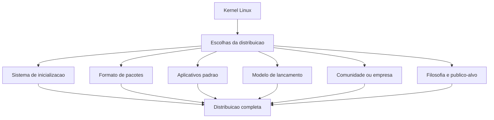
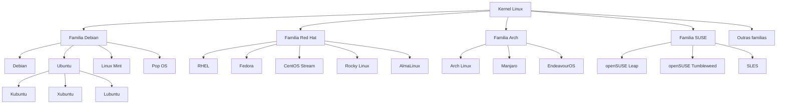
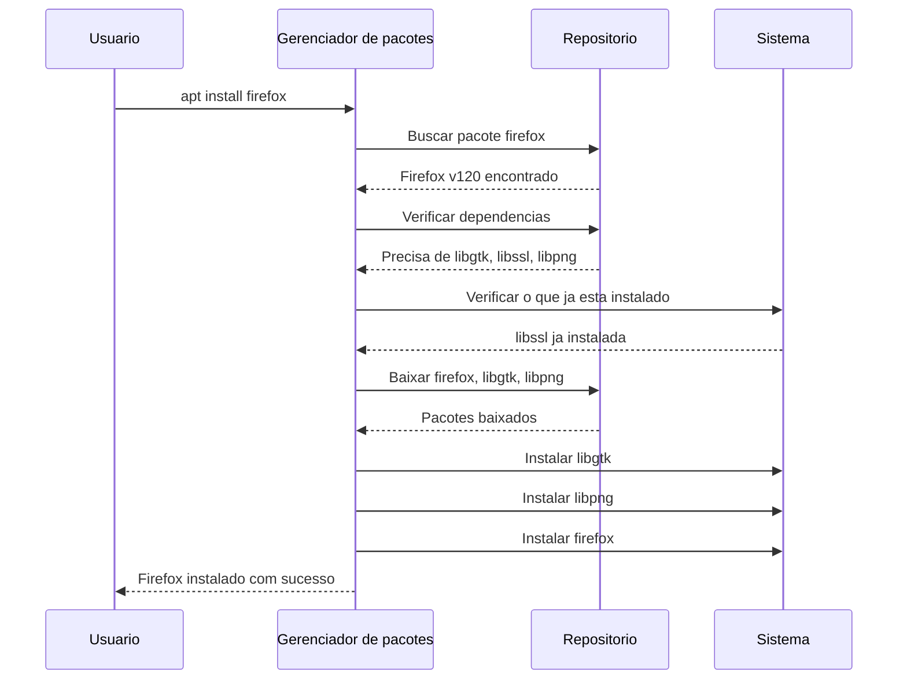
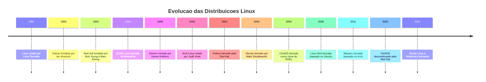

# 2.2 — Distribuições Linux: Debian, Ubuntu, Fedora e Arch

[← Anterior: O que é Linux](cap02-mod01-o-que-e-linux.md) · [Próximo: Kernel, DE e WM →](cap02-mod03-kernel-de-wm.md)

---

## Introdução

No módulo anterior, vimos que Linux é um kernel — o coração do sistema operacional — e que o projeto GNU fornece as ferramentas ao redor. Juntos, formam um sistema completo. Vimos também que esse sistema nasceu de uma filosofia de liberdade: qualquer pessoa pode estudar, modificar e redistribuir o código.

Mas quando você vai "instalar Linux", não instala apenas o kernel e as ferramentas GNU. Você instala uma **distribuição** — um pacote completo que inclui o kernel, ferramentas, interface gráfica, programas pré-instalados e configurações específicas.

Pense assim: o kernel Linux é como a massa de uma pizza. A massa é a mesma, mas cada pizzaria faz uma pizza diferente — com coberturas, temperos e apresentações diferentes. Cada "pizza" é uma distribuição.

Existem centenas de distribuições Linux. Isso pode parecer confuso no início, mas faz total sentido quando você entende **qual problema cada uma resolve**. E essa é a beleza do software livre: como o código é aberto, qualquer grupo de pessoas pode pegar o kernel Linux, adicionar o que quiser ao redor e criar uma distribuição nova, otimizada para um público ou necessidade específica.

Neste módulo, vamos entender o que é uma distribuição, conhecer as grandes famílias, mergulhar na história de cada uma e entender por que escolhemos Ubuntu para este curso. Ao final, você vai saber navegar esse universo com confiança — e, mais importante, vai entender que os conceitos que aprender aqui funcionam em qualquer distribuição.

---

## O que e uma Distribuição?

Uma **distribuição** (ou "distro", como a comunidade costuma chamar) é um sistema operacional completo construído em cima do kernel Linux. Mas o que significa "completo"? Significa que alguém pegou o kernel, juntou com centenas de outros programas, configurou tudo para funcionar junto e empacotou de uma forma que você pode instalar no seu computador.

Para entender por que existem tantas distribuições, pense no seguinte: quando você monta um computador, precisa tomar dezenas de decisões. Qual processador? Quanta memória? Qual placa de vídeo? Com distribuições Linux é a mesma coisa — mas as decisões são sobre software.

### As Escolhas que Definem uma Distribuição

Cada distribuição faz escolhas em várias áreas. Vamos entender cada uma:

**1. Sistema de inicialização (init system)**

Quando você liga o computador, algo precisa "acordar" todos os serviços do sistema — rede, som, interface gráfica, relógio. O **init system** é o primeiro programa que roda depois do kernel e é responsável por iniciar tudo mais. Hoje, a maioria das distribuições usa o **systemd**, mas algumas usam alternativas como **OpenRC** ou **runit**. Essa escolha afeta como o sistema inicia, como serviços são gerenciados e até a velocidade de boot.

**2. Formato de pacotes**

Programas no Linux são distribuídos em "pacotes" — arquivos que contêm o programa, suas configurações e informações sobre do que ele depende. Diferentes famílias usam formatos diferentes:

| Formato | Extensão | Usado por | Ferramenta |
|---------|----------|-----------|------------|
| DEB | .deb | Debian, Ubuntu, Mint | apt, dpkg |
| RPM | .rpm | Red Hat, Fedora, SUSE | dnf, rpm |
| Pacman | .pkg.tar.zst | Arch, Manjaro | pacman |
| Portage | ebuild | Gentoo | emerge |

**3. Aplicativos padrão**

Qual navegador vem instalado? Qual editor de texto? Qual player de música? Cada distribuição escolhe um conjunto diferente de aplicativos que vêm pré-instalados. Ubuntu vem com Firefox e LibreOffice. Outras distribuições podem vir com aplicativos diferentes — ou quase nenhum, deixando você escolher tudo.

**4. Modelo de lancamento (release model)**

Essa é uma das decisões mais importantes. Existem dois modelos principais:

- **Versões fixas (point release)**: a distribuição lança uma versão nova a cada período (6 meses, 2 anos). Você instala a versão 22.04, depois atualiza para a 24.04. Entre as versões, só recebe correções de segurança. Ubuntu e Debian usam esse modelo.
- **Lancamento contínuo (rolling release)**: não existem "versões". O sistema é atualizado continuamente, pacote por pacote. Você sempre tem a versão mais recente de tudo. Arch Linux e openSUSE Tumbleweed usam esse modelo.

**5. Comunidade vs corporacao**

Algumas distribuições são mantidas por comunidades de voluntários (Debian, Arch). Outras são mantidas por empresas (Ubuntu pela Canonical, RHEL pela Red Hat/IBM, SUSE pela SUSE LLC). Isso afeta o ritmo de desenvolvimento, o tipo de suporte disponível e as decisões sobre o futuro da distribuição.

**6. Filosofia**

Talvez a escolha mais fundamental. Algumas distribuições priorizam estabilidade absoluta (Debian). Outras priorizam ter sempre o software mais recente (Arch). Algumas focam em facilidade de uso (Ubuntu). Outras focam em dar controle total ao usuário (Gentoo). Essa filosofia permeia todas as outras decisões.

---

## As Grandes Familias de Distribuicoes

As distribuições Linux se organizam em "famílias" — distribuições que compartilham a mesma base e o mesmo gerenciador de pacotes. Entender as famílias é mais importante do que decorar nomes individuais. Se você aprende a usar uma distribuição de uma família, consegue usar qualquer outra da mesma família com facilidade.

---

## Familia Debian — Estabilidade Acima de Tudo

### A História do Debian

A história do Debian começa em 1993, quando um estudante universitário chamado **Ian Murdock** publicou o "Manifesto Debian". Ian tinha 20 anos e estava frustrado com as distribuições Linux da época — eram desorganizadas, difíceis de manter e não tinham um processo claro de desenvolvimento.

O nome "Debian" é uma combinação do nome de Ian com o nome de sua namorada na época, **Debra**. Deb + Ian = Debian.

O que Ian propôs era revolucionário para a época: uma distribuição Linux desenvolvida de forma aberta e colaborativa, mantida por uma comunidade de voluntários, com um processo rigoroso de qualidade. Não seria controlada por uma empresa — seria um projeto da comunidade, para a comunidade.

Essa visão atraiu desenvolvedores do mundo inteiro. Hoje, o Debian é mantido por mais de mil desenvolvedores voluntários espalhados por dezenas de países. É um dos maiores projetos colaborativos de software livre do mundo.

### O Contrato Social do Debian

Uma das coisas que torna o Debian único é o **Debian Social Contract** (Contrato Social do Debian) — um documento que define os princípios fundamentais do projeto. Os pontos principais são:

1. **Debian será 100% software livre**: todo software incluído no Debian deve ser livre para usar, estudar, modificar e redistribuir
2. **Contribuições de volta para a comunidade**: melhorias feitas no Debian são compartilhadas com todos
3. **Transparência**: problemas não são escondidos — bugs e discussões são públicos
4. **Prioridade aos usuários e ao software livre**: decisões são tomadas pensando nos usuários, não em interesses comerciais

Esse contrato existe desde 1997 e nunca foi quebrado. É por isso que muitas pessoas confiam no Debian para servidores críticos — sabem que o projeto não vai mudar de direção por pressão comercial.

### Como o Debian Organiza seus Pacotes

O Debian tem um sistema fascinante de organização. Em vez de ter apenas uma versão, ele mantém três "ramos" simultâneos:

| Ramo | Nome | Caracteristica | Para quem |
|------|------|---------------|-----------|
| Stable | Nome de personagem do Toy Story | Extremamente testado e confiavel | Servidores, produção |
| Testing | Próximo nome do Toy Story | Pacotes mais recentes, em teste | Desktops avancados |
| Unstable | Sempre se chama Sid | Pacotes mais novos, podem ter bugs | Desenvolvedores do Debian |

Sim, as versões do Debian são nomeadas com personagens do filme **Toy Story**! A versão estável atual se chama "Bookworm" (o verme de livro). Versões anteriores foram "Bullseye" (o alvo), "Buster" (o cachorro) e "Stretch" (o polvo). A versão instável sempre se chama "Sid" — o garoto que destruía brinquedos no filme. Faz sentido: Sid é onde as coisas podem "quebrar".

Um pacote novo entra primeiro no Sid (unstable). Se não causar problemas por um período, migra para Testing. Quando Testing acumula pacotes suficientes e passa por testes rigorosos, é "congelada" e se torna a nova versão Stable. Esse processo pode levar dois anos ou mais — e é exatamente por isso que Debian é tão estável.

### O Formato .deb e o APT

O Debian criou o formato de pacote **.deb** e o gerenciador de pacotes **APT** (Advanced Package Tool, ou Ferramenta Avançada de Pacotes). Esses dois inventos foram tão bons que se tornaram padrão para toda a família Debian — incluindo Ubuntu, Mint e dezenas de outras distribuições.

Um arquivo .deb é como um pacote de presente bem organizado: contém o programa em si, informações sobre de quais outros programas ele depende, scripts que rodam durante a instalação e metadados como versão e descrição.

O APT é a ferramenta que gerência esses pacotes. Quando você digita `apt install firefox`, o APT:

1. Consulta uma lista de repositórios (servidores com pacotes disponíveis)
2. Encontra o pacote do Firefox
3. Verifica quais outros pacotes o Firefox precisa para funcionar (dependências)
4. Baixa o Firefox e todas as dependências necessárias
5. Instala tudo na ordem correta
6. Configura o programa para funcionar

Tudo isso com um único comando. Antes dos gerenciadores de pacotes, instalar um programa no Linux significava baixar o código-fonte, compilar manualmente e resolver dependências uma por uma. O APT transformou isso em algo simples.

### Qual Problema o Debian Resolve?

Debian resolve o problema de quem precisa de um sistema **absolutamente confiável**. Se você tem um servidor que precisa ficar ligado 24 horas por dia, 365 dias por ano, sem surpresas, Debian é uma das melhores escolhas. Os pacotes podem não ser os mais recentes, mas foram testados exaustivamente.

Muitos dos maiores sites do mundo rodam em servidores Debian. A própria Estação Espacial Internacional já usou Debian em seus computadores de bordo. Quando a confiabilidade é questão de vida ou morte (literalmente, no caso da estação espacial), Debian é uma escolha natural.

---

## Ubuntu — Linux para Seres Humanos

### A História do Ubuntu

Em 2004, um empresário sul-africano chamado **Mark Shuttleworth** teve uma visão: Linux era incrível, mas difícil demais para pessoas comuns. Debian era estável e confiável, mas a instalação era complicada e a interface não era amigável. Shuttleworth queria criar uma distribuição que qualquer pessoa pudesse usar — não apenas programadores e administradores de sistemas.

Mark Shuttleworth não era um empresário qualquer. Ele tinha fundado a empresa Thawte (de certificados de segurança para internet), vendido para a VeriSign por 575 milhões de dólares, e depois se tornado o segundo turista espacial da história, viajando para a Estação Espacial Internacional em 2002. Com parte dessa fortuna, ele fundou a empresa **Canonical** e criou o **Ubuntu**.

O nome "Ubuntu" vem de uma filosofia sul-africana que significa "eu sou porque nós somos" — a ideia de que uma pessoa existe através de suas conexões com outras pessoas. O slogan do Ubuntu era "Linux for Human Beings" (Linux para Seres Humanos). A mensagem era clara: Linux não precisa ser difícil.

### O que Ubuntu Mudou

Ubuntu fez várias coisas que nenhuma distribuição tinha feito antes:

1. **Instalação gráfica simples**: em vez de telas de texto com perguntas técnicas, Ubuntu tinha um instalador visual com poucos passos
2. **CDs gratuitos pelo correio**: nos primeiros anos, a Canonical enviava CDs do Ubuntu gratuitamente para qualquer lugar do mundo. Milhões de CDs foram distribuídos. Isso foi revolucionário numa época em que muitas pessoas não tinham internet rápida para baixar uma distribuição
3. **Foco na experiência do usuário**: Ubuntu investiu em design, usabilidade e em fazer as coisas "simplesmente funcionarem" — Wi-Fi, som, impressoras
4. **Ciclo previsível de lançamentos**: uma versão nova a cada 6 meses (em abril e outubro), com versões LTS a cada 2 anos
5. **Comunidade acolhedora**: o código de conduta do Ubuntu enfatiza respeito e inclusão, tornando a comunidade mais acessível para iniciantes

### O Ciclo de Lancamentos do Ubuntu

Ubuntu segue um ciclo muito organizado:

| Tipo | Frequência | Suporte | Exemplo | Para quem |
|------|-----------|---------|---------|-----------|
| Regular | A cada 6 meses | 9 meses | 23.04, 23.10 | Quem quer novidades |
| LTS | A cada 2 anos | 5 anos | 22.04, 24.04 | Servidores, produção, estabilidade |

Os números das versões seguem o formato **ano.mês**. Ubuntu 24.04 foi lançado em abril de 2024. Ubuntu 22.04 foi lançado em abril de 2022. Simples e previsível.

**LTS** significa **Long Term Support** (Suporte de Longo Prazo). Versões LTS recebem atualizações de segurança por 5 anos. Isso é fundamental para servidores — você não quer ficar atualizando o sistema operacional a cada 6 meses em um servidor de produção que precisa estar sempre disponível.

### A Controversia dos Snaps

Nos últimos anos, a Canonical introduziu um novo formato de pacotes chamado **Snap**. Snaps são pacotes que incluem o programa e todas as suas dependências em um único arquivo isolado. A ideia é boa: um snap funciona em qualquer distribuição Linux, sem conflitos de dependências.

Mas a comunidade teve reações mistas. As principais críticas são:

- **Snaps são mais lentos para abrir** do que pacotes tradicionais .deb
- **Ocupam mais espaço em disco** porque cada snap carrega suas próprias dependências
- **A loja de snaps é controlada pela Canonical** — não é totalmente aberta como os repositórios tradicionais
- **Algumas versões do Ubuntu substituíram pacotes .deb por snaps** sem avisar claramente o usuário

Essa controvérsia é um bom exemplo de como decisões técnicas em distribuições Linux geram debates intensos na comunidade. O software livre dá poder aos usuários — e os usuários usam esse poder para questionar decisões que não concordam.

### Ubuntu Hoje

Apesar das controvérsias, Ubuntu continua sendo a distribuição Linux mais popular para desktops e uma das mais usadas em servidores. Segundo pesquisas, Ubuntu é usado em mais de 30% dos servidores na nuvem. Empresas como Netflix, Uber e Tesla usam Ubuntu em suas infraestruturas.

Para iniciantes, Ubuntu continua sendo a porta de entrada mais acessível para o mundo Linux. E é por isso que escolhemos Ubuntu para este curso.

| Caracteristica | Debian | Ubuntu |
|---------------|--------|--------|
| Fundacao | 1993, Ian Murdock | 2004, Mark Shuttleworth |
| Mantido por | Comunidade de voluntarios | Canonical + comunidade |
| Foco | Estabilidade máxima | Facilidade de uso |
| Público | Servidores, usuarios avancados | Iniciantes, desktops, servidores |
| Atualizacoes | Lentas e muito testadas | A cada 6 meses, com versões LTS |
| Gerenciador de pacotes | apt | apt |
| Interface padrão | Varia | GNOME |
| Pacotes extras | Apenas .deb | .deb e Snap |

---

## Familia Red Hat — O Linux Corporativo

### A História da Red Hat

A **Red Hat** foi fundada em 1993 por **Bob Young** e **Marc Ewing**. O nome vem de um boné vermelho de lacrosse que Marc Ewing usava na universidade — as pessoas o reconheciam pelo chapéu vermelho, e o nome pegou.

A Red Hat resolveu um problema que parecia impossível: **como ganhar dinheiro com software livre?** Se o código é aberto e qualquer pessoa pode usar de graça, como uma empresa sobrevive?

A resposta da Red Hat foi brilhante: **vender suporte, não software**. O sistema operacional em si é gratuito e de código aberto. Mas se uma grande empresa precisa de garantia de que alguém vai resolver problemas às 3 da manhã de um domingo, precisa de certificação de que o sistema funciona com determinado hardware, precisa de atualizações de segurança garantidas por 10 anos — aí ela paga pela assinatura do **RHEL** (Red Hat Enterprise Linux).

Esse modelo de negócio foi tão bem-sucedido que a Red Hat se tornou a primeira empresa de software livre a atingir 1 bilhão de dólares em receita anual. Em 2019, a **IBM comprou a Red Hat por 34 bilhões de dólares** — a maior aquisição da história da IBM e uma das maiores da história da tecnologia.

### RHEL e o Mundo Corporativo

**RHEL** (Red Hat Enterprise Linux) é a distribuição Linux mais usada em grandes empresas no mundo. Bancos, hospitais, governos, companhias aéreas — organizações que não podem ter seus sistemas fora do ar usam RHEL.

Por que empresas pagam por algo que poderiam ter de graça? Vários motivos:

1. **Suporte 24/7**: se algo quebrar, a Red Hat tem engenheiros disponíveis para resolver
2. **Certificação de hardware**: a Red Hat testa e certifica que RHEL funciona com servidores específicos de fabricantes como Dell, HP e Lenovo
3. **Certificação de software**: muitos softwares empresariais (Oracle, SAP) só são oficialmente suportados em RHEL
4. **Atualizações de segurança por 10 anos**: muito mais que as 5 anos do Ubuntu LTS
5. **Conformidade regulatória**: em setores como financeiro e saúde, usar um sistema com suporte profissional pode ser exigência legal

A certificação **RHCSA** (Red Hat Certified System Administrator) e **RHCE** (Red Hat Certified Engineer) são duas das certificações mais valorizadas no mercado de administração de sistemas Linux. Muitas vagas de emprego em infraestrutura exigem essas certificações.

### Fedora — O Laboratorio de Inovacao

**Fedora** é a distribuição "comunitária" patrocinada pela Red Hat. Pense no Fedora como o laboratório de pesquisa da Red Hat: é onde novas tecnologias são testadas antes de serem incorporadas ao RHEL.

Fedora lança uma versão nova a cada 6 meses aproximadamente e sempre traz as versões mais recentes de tudo — kernel, interface gráfica, ferramentas de desenvolvimento. Muitas tecnologias que hoje são padrão no Linux foram testadas primeiro no Fedora:

- **systemd** (o sistema de inicialização usado pela maioria das distribuições hoje) foi adotado primeiro pelo Fedora
- **Wayland** (o novo servidor de display que está substituindo o X11) foi testado extensivamente no Fedora
- **PipeWire** (o novo sistema de áudio) estreou no Fedora

Fedora é uma excelente escolha para desenvolvedores que querem ter acesso às tecnologias mais recentes sem a complexidade do Arch Linux. Curiosidade: **Linus Torvalds**, o criador do Linux, usa Fedora como sua distribuição principal.

### O Drama do CentOS

Essa é uma das histórias mais polêmicas do mundo Linux recente, e vale a pena entender porque ilustra as tensões entre software livre e interesses corporativos.

**CentOS** (Community Enterprise Operating System) nasceu em 2004 como uma versão gratuita do RHEL. A ideia era simples: como o código do RHEL é aberto (por obrigação da licença GPL), um grupo de voluntários pegava esse código, removia as marcas da Red Hat e compilava uma distribuição idêntica ao RHEL, mas gratuita.

CentOS se tornou extremamente popular em servidores. Empresas que não podiam (ou não queriam) pagar pela assinatura do RHEL usavam CentOS e tinham essencialmente o mesmo sistema. Provedores de hospedagem, universidades e startups adoravam CentOS.

Em 2014, a Red Hat "adotou" o projeto CentOS, prometendo dar mais recursos e suporte. A comunidade ficou cautelosamente otimista.

Mas em dezembro de 2020, a Red Hat anunciou uma mudança bombástica: **CentOS como conhecíamos seria descontinuado**. Em vez de ser uma cópia do RHEL (recebendo atualizações depois do RHEL), CentOS se tornaria **CentOS Stream** — uma versão que ficaria *à frente* do RHEL, servindo como campo de testes.

A diferença é fundamental:

| Aspecto | CentOS classico | CentOS Stream |
|---------|----------------|---------------|
| Relação com RHEL | Copia do RHEL, recebe atualizacoes depois | Fica a frente do RHEL, serve de teste |
| Estabilidade | Identica ao RHEL | Menos estavel, recebe mudancas antes |
| Uso em produção | Ideal para servidores | Arriscado para servidores criticos |
| Ciclo de vida | Suporte longo e previsivel | Suporte mais curto |

A reação da comunidade foi intensa. Milhares de servidores no mundo rodavam CentOS em produção, confiando na estabilidade idêntica ao RHEL. De um dia para o outro, essa garantia desapareceu.

### Rocky Linux e AlmaLinux — A Resposta da Comunidade

A comunidade não ficou parada. Duas novas distribuições surgiram rapidamente para preencher o vazio deixado pelo CentOS:

**Rocky Linux** foi criado por **Gregory Kurtzer** — que, ironicamente, era um dos fundadores originais do CentOS. O nome é uma homenagem a Rocky McGaugh, um dos co-fundadores do CentOS que havia falecido. Rocky Linux se propõe a ser exatamente o que CentOS era: uma cópia gratuita e compatível do RHEL.

**AlmaLinux** foi criado pela empresa CloudLinux, que já tinha experiência com distribuições baseadas em RHEL. "Alma" significa "alma" em espanhol e em latim, representando a essência do que CentOS era.

Ambas as distribuições ganharam adoção rápida. Organizações que rodavam CentOS migraram para Rocky Linux ou AlmaLinux com relativa facilidade, já que são compatíveis com RHEL.

Essa história é um lembrete importante: no mundo do software livre, quando uma empresa toma uma decisão que a comunidade não concorda, a comunidade tem o poder de criar alternativas. O código é aberto — ninguém pode impedir isso.

| Caracteristica | RHEL | Fedora | Rocky Linux | AlmaLinux |
|---------------|------|--------|-------------|-----------|
| Foco | Empresas, suporte pago | Novidades, inovacao | Servidores, substituto do CentOS | Servidores, substituto do CentOS |
| Custo | Assinatura paga | Gratuito | Gratuito | Gratuito |
| Mantido por | Red Hat e IBM | Comunidade + Red Hat | Comunidade | CloudLinux + comunidade |
| Gerenciador de pacotes | dnf | dnf | dnf | dnf |
| Atualizacoes | Lentas, muito estaveis | Rapidas, a cada 6 meses | Seguem o RHEL | Seguem o RHEL |
| Suporte | 10 anos | 13 meses | Segue ciclo RHEL | Segue ciclo RHEL |

---

## Familia Arch — Controle Total

### A Filosofia Arch: The Arch Way

**Arch Linux** foi criado em 2002 por **Judd Vinet**, um programador canadense que queria uma distribuição que seguisse o princípio **KISS** — Keep It Simple, Stupid (Mantenha Simples, Estúpido). Mas "simples" aqui não significa "fácil". Significa "sem complexidade desnecessária".

A filosofia do Arch, conhecida como **The Arch Way** (O Jeito Arch), se baseia em alguns princípios:

1. **Simplicidade**: nada de ferramentas automáticas que escondem o que está acontecendo. Se você quer configurar a rede, edita o arquivo de configuração diretamente — não usa uma interface gráfica que faz isso por você sem você entender o que mudou
2. **Centrado no usuário**: o Arch não tenta adivinhar o que você quer. Ele te dá as ferramentas e você decide. Isso exige mais conhecimento, mas dá mais controle
3. **Pragmatismo**: o Arch não é dogmático sobre software livre. Se um driver proprietário funciona melhor que o livre, o Arch disponibiliza os dois e deixa você escolher
4. **Documentação acima de tudo**: em vez de automatizar, o Arch documenta. E documenta muito bem

### A Instalacao do Arch

Instalar Arch Linux é uma experiência completamente diferente de instalar Ubuntu. Não existe instalador gráfico com botões bonitos. Quando você inicia o Arch, vê uma tela preta com um cursor piscando. A partir daí, você precisa:

1. Configurar o teclado manualmente
2. Conectar à internet manualmente
3. Particionar o disco manualmente
4. Formatar as partições manualmente
5. Instalar o sistema base com um comando
6. Configurar o idioma, fuso horário e hostname manualmente
7. Instalar e configurar o bootloader manualmente
8. Criar seu usuário manualmente
9. Instalar a interface gráfica manualmente (se quiser uma)

Parece assustador? É proposital. O objetivo não é dificultar — é **ensinar**. Quando você termina de instalar Arch, entende exatamente como cada peça do sistema funciona, porque você configurou cada uma delas. Não existe "mágica" — você sabe o que está rodando e por quê.

Existe até uma piada na comunidade Linux: "Como você sabe que alguém usa Arch? Não se preocupe, ele vai te contar." A instalação do Arch é vista como um rito de passagem, e quem consegue completá-la tem orgulho disso.

### A Arch Wiki — Um Tesouro da Documentação

Se o Arch tem uma joia da coroa, é a **Arch Wiki**. É considerada uma das melhores documentações técnicas de toda a internet — não apenas do mundo Linux, mas de toda a tecnologia.

A Arch Wiki é uma enciclopédia colaborativa que documenta praticamente tudo sobre Linux. Quer configurar uma impressora? Tem um artigo detalhado. Quer entender como funciona o sistema de arquivos? Tem um artigo. Quer configurar uma VPN? Tem um artigo com múltiplas opções e comparações.

O mais interessante é que a Arch Wiki é útil mesmo para quem não usa Arch. Se você usa Ubuntu e tem um problema com Wi-Fi, muitas vezes a melhor documentação que vai encontrar está na Arch Wiki. Os conceitos são os mesmos — o Linux por baixo é o mesmo kernel.

### AUR — Arch User Repository

O **AUR** (Arch User Repository, ou Repositório de Usuários do Arch) é outro diferencial. É um repositório mantido pela comunidade onde qualquer pessoa pode publicar "receitas" para instalar programas que não estão nos repositórios oficiais.

O AUR tem mais de 80 mil pacotes — muito mais do que os repositórios oficiais de qualquer distribuição. Se um programa existe para Linux, provavelmente tem um pacote no AUR. A desvantagem é que esses pacotes não são verificados oficialmente, então é preciso ter cuidado.

### Rolling Release na Prática

Arch usa o modelo **rolling release** — não existem versões como "Arch 2024" ou "Arch 23.04". Você instala uma vez e atualiza continuamente. O sistema que você instalou em 2020 é o mesmo que roda em 2024, só que com todos os pacotes atualizados.

A vantagem é que você sempre tem a versão mais recente de tudo — kernel, drivers, aplicativos. A desvantagem é que atualizações podem, ocasionalmente, quebrar algo. Por isso, a comunidade Arch recomenda ler as notícias do projeto antes de atualizar e manter backups.

### Manjaro e EndeavourOS — Arch para Mais Pessoas

Nem todo mundo quer passar pela instalação manual do Arch, mas muitos querem as vantagens do rolling release e do acesso ao AUR. É aí que entram as distribuições baseadas em Arch:

**Manjaro** é a mais popular. Oferece instalação gráfica, vem com interface gráfica pré-configurada e segura as atualizações por um período antes de liberá-las (para garantir que não vão quebrar nada). É como ter o Arch com uma rede de segurança.

**EndeavourOS** é mais próximo do Arch puro. Oferece um instalador gráfico, mas depois da instalação o sistema é essencialmente um Arch com poucos extras. É para quem quer a experiência Arch sem a instalação manual.

| Caracteristica | Arch | Manjaro | EndeavourOS |
|---------------|------|---------|-------------|
| Foco | Controle total, aprendizado | Arch facilitado | Arch com instalador |
| Instalacao | Manual, linha de comando | Gráfica, automatizada | Gráfica, minimalista |
| Atualizacoes | Rolling release imediato | Rolling release com atraso | Rolling release imediato |
| AUR | Sim | Sim | Sim |
| Gerenciador de pacotes | pacman | pacman | pacman |
| Público | Usuarios avancados | Intermediarios | Intermediarios a avancados |

---

## Outras Distribuicoes Importantes

Além das três grandes famílias, existem outras distribuições que merecem destaque por resolverem problemas específicos de formas únicas.

### openSUSE — A Flexibilidade Alema

**openSUSE** é uma distribuição alemã com uma história que remonta a 1994. É mantida pela comunidade com patrocínio da empresa SUSE. O diferencial do openSUSE é oferecer duas versões com filosofias opostas:

- **openSUSE Leap**: versão com lançamentos fixos, baseada no código do SUSE Linux Enterprise (SLE). Estável e previsível, similar ao Ubuntu LTS
- **openSUSE Tumbleweed**: versão rolling release, sempre atualizada. Similar ao Arch, mas com testes automatizados mais rigorosos antes de liberar atualizações

O openSUSE também é conhecido pelo **YaST** (Yet another Setup Tool), uma ferramenta gráfica de administração do sistema que permite configurar praticamente tudo — rede, firewall, usuários, partições — de forma visual. É uma das ferramentas de administração mais completas do mundo Linux.

### Gentoo — Compile Tudo do Zero

**Gentoo** leva a filosofia de controle total ao extremo. Em vez de instalar pacotes pré-compilados (como .deb ou .rpm), no Gentoo você **compila cada programa a partir do código-fonte** diretamente no seu computador.

Isso significa que cada programa é otimizado especificamente para o seu hardware. O resultado pode ser um sistema ligeiramente mais rápido, mas o processo de instalação e atualização é muito mais demorado — compilar um navegador como o Firefox pode levar horas.

Gentoo é para entusiastas que querem entender absolutamente tudo sobre como software é construído. Não é prático para o dia a dia da maioria das pessoas, mas é uma experiência de aprendizado incrível.

O nome "Gentoo" vem do pinguim-gentoo, a espécie de pinguim mais rápida do mundo — uma referência à otimização de performance que a distribuição busca.

### NixOS — Configuração Declarativa

**NixOS** é uma das distribuições mais inovadoras e representa uma abordagem completamente diferente para gerenciar um sistema operacional. Em vez de instalar pacotes e configurar o sistema passo a passo (abordagem "imperativa"), no NixOS você descreve como quer que o sistema seja em um único arquivo de configuração (abordagem "declarativa").

É como a diferença entre dar instruções passo a passo para alguém montar um móvel ("primeiro pegue o parafuso A, depois encaixe na peça B...") versus mostrar uma foto do móvel montado e dizer "quero que fique assim". O NixOS olha para sua configuração e faz o que for necessário para o sistema ficar no estado descrito.

A grande vantagem é a **reprodutibilidade**: você pode pegar seu arquivo de configuração, levar para outro computador e ter exatamente o mesmo sistema. Isso é extremamente valioso para desenvolvedores e administradores de sistemas.

### Alpine Linux — O Minimalista dos Containers

**Alpine Linux** é uma distribuição ultra-minimalista. Uma instalação básica ocupa menos de 8 megabytes. Para comparação, uma instalação mínima do Ubuntu ocupa cerca de 2 gigabytes — 250 vezes mais.

Alpine consegue ser tão pequena porque usa alternativas mais leves para componentes padrão: **musl** em vez de glibc (a biblioteca C padrão), **BusyBox** em vez das ferramentas GNU tradicionais, e **OpenRC** em vez de systemd.

Por que isso importa? Porque Alpine se tornou a distribuição mais popular para **containers Docker**. Quando você cria um container (vamos falar sobre isso em módulos futuros), quer que ele seja o menor possível — inicia mais rápido, usa menos recursos e tem menos superfície de ataque para problemas de segurança. Alpine é perfeita para isso.

Se você seguir carreira em desenvolvimento de software, vai encontrar Alpine Linux dentro de containers Docker com muita frequência. É uma daquelas distribuições que você talvez nunca instale no seu computador, mas que roda silenciosamente em milhões de servidores pelo mundo.

| Distribuição | Diferencial | Público | Gerenciador de pacotes |
|-------------|------------|---------|----------------------|
| openSUSE Leap | Estabilidade com YaST | Desktops e servidores | zypper |
| openSUSE Tumbleweed | Rolling release testado | Desktops avancados | zypper |
| Gentoo | Compilação do código-fonte | Entusiastas e aprendizado | emerge e portage |
| NixOS | Configuração declarativa | Desenvolvedores avancados | nix |
| Alpine | Ultra-minimalista | Containers Docker | apk |

---

## Linux no Brasil

O Brasil tem uma relação especial com o Linux e o software livre. O país foi um dos pioneiros mundiais na adoção de software livre em governos e instituições públicas.

### O Governo Brasileiro e o Software Livre

Em 2003, o governo federal brasileiro criou o **Comitê Técnico de Implementação do Software Livre**, com o objetivo de migrar órgãos públicos para software livre. A motivação era tripla:

1. **Economia**: licenças de software proprietário custavam milhões de reais por ano para o governo
2. **Soberania tecnológica**: depender de software de empresas estrangeiras significava que dados sensíveis do governo passavam por sistemas que o Brasil não controlava
3. **Inclusão digital**: software livre permitia que escolas e telecentros públicos tivessem computadores funcionais sem custo de licença

Vários órgãos públicos migraram para Linux, incluindo o Banco do Brasil, a Caixa Econômica Federal, o Serpro (Serviço Federal de Processamento de Dados) e os Correios. O Exército Brasileiro também adotou Linux em parte de sua infraestrutura.

### A Comunidade Linux Brasileira

O Brasil tem uma das maiores comunidades Linux da América Latina. Alguns marcos importantes:

- **Diolinux**: um dos maiores canais de YouTube sobre Linux em português, com centenas de milhares de inscritos. Excelente recurso para quem está começando
- **Viva o Linux**: um dos sites mais antigos sobre Linux em português, com fóruns, artigos e tutoriais
- **FISL** (Fórum Internacional de Software Livre): evento que acontecia em Porto Alegre e foi um dos maiores eventos de software livre do mundo, reunindo milhares de participantes

### Distribuicoes com Participacao Brasileira

Embora não existam grandes distribuições "brasileiras" no sentido estrito, a comunidade brasileira contribui ativamente para traduções, documentação e desenvolvimento de distribuições internacionais. O Ubuntu, por exemplo, tem uma equipe de tradução brasileira muito ativa que garante que a interface e a documentação estejam disponíveis em português.

O **BigLinux**, baseado no Manjaro, é uma distribuição com forte participação da comunidade brasileira, focada em oferecer uma experiência desktop completa e amigável em português.

---

## Gerenciadores de Pacotes em Profundidade

Já mencionamos gerenciadores de pacotes várias vezes neste módulo. Agora vamos entender esse conceito em profundidade, porque ele é fundamental para usar qualquer distribuição Linux — e também para entender como software é distribuído no mundo da programação.

### O Problema que Gerenciadores de Pacotes Resolvem

Imagine que você quer instalar um programa — digamos, um editor de texto chamado "SuperEditor". Sem um gerenciador de pacotes, você precisaria:

1. Encontrar o site oficial do SuperEditor
2. Baixar o código-fonte ou um arquivo compilado
3. Descobrir que o SuperEditor precisa de uma biblioteca chamada "libtext" versão 2.0 ou superior
4. Ir ao site da libtext, baixar e instalar
5. Descobrir que a libtext precisa de outra biblioteca chamada "libcore"
6. Ir ao site da libcore, baixar e instalar
7. Voltar e tentar instalar o SuperEditor novamente
8. Descobrir que a versão da libtext que você instalou é incompatível com outro programa que já estava no sistema
9. Entrar em desespero

Esse problema é tão comum que tem um nome: **dependency hell** (inferno das dependências). Gerenciadores de pacotes existem para resolver exatamente isso.

### O que e um Pacote?

Um **pacote** é um arquivo que contém:

- O programa em si (arquivos executáveis, bibliotecas, configurações)
- **Metadados**: nome, versão, descrição, autor
- **Lista de dependências**: quais outros pacotes são necessários para funcionar
- **Scripts de instalação**: comandos que rodam durante a instalação (criar pastas, configurar permissões)

### O que e um Repositório?

Um **repositório** é um servidor na internet que armazena milhares de pacotes. Cada distribuição mantém seus próprios repositórios oficiais. Quando você pede para instalar um programa, o gerenciador de pacotes consulta esses repositórios.

Pense no repositório como um supermercado de software. Em vez de ir a cada fazenda comprar cada ingrediente, você vai ao supermercado e encontra tudo organizado nas prateleiras. O gerenciador de pacotes é como um assistente de compras que pega tudo que você precisa, verifica se os produtos são compatíveis entre si e leva para sua casa.

### Como Funciona a Resolução de Dependências

Quando você pede para instalar o pacote A, o gerenciador de pacotes:

1. Consulta o repositório e encontra o pacote A
2. Lê a lista de dependências do pacote A (precisa de B e C)
3. Verifica se B e C já estão instalados no sistema
4. Se não estão, verifica as dependências de B e C
5. Constrói uma "árvore" completa de tudo que precisa ser instalado
6. Verifica se não há conflitos (dois pacotes que não podem coexistir)
7. Baixa tudo na ordem correta
8. Instala tudo na ordem correta

Tudo isso acontece automaticamente com um único comando. É por isso que gerenciadores de pacotes são considerados uma das maiores inovações do Linux.

### Comparação entre os Principais Gerenciadores

| Aspecto | apt - Debian e Ubuntu | dnf - Fedora e RHEL | pacman - Arch | zypper - openSUSE |
|---------|----------------------|--------------------|--------------|--------------------|
| Instalar pacote | apt install nome | dnf install nome | pacman -S nome | zypper install nome |
| Remover pacote | apt remove nome | dnf remove nome | pacman -R nome | zypper remove nome |
| Atualizar tudo | apt upgrade | dnf upgrade | pacman -Syu | zypper update |
| Buscar pacote | apt search nome | dnf search nome | pacman -Ss nome | zypper search nome |
| Formato de pacote | .deb | .rpm | .pkg.tar.zst | .rpm |

Perceba que os comandos são diferentes, mas o conceito é o mesmo. Se você entende o que "instalar um pacote" significa, consegue usar qualquer gerenciador — só precisa consultar qual é o comando específico. Mais uma vez: **conceitos são para sempre, ferramentas apenas os implementam**.

---

## Distribuicoes e Programação

Se você está lendo este curso, seu objetivo é se tornar um desenvolvedor. Então é importante entender como as distribuições Linux se encaixam no mundo da programação.

### Distribuicoes para Servidores

A maioria dos servidores no mundo roda Linux. Quando você acessa um site, envia uma mensagem ou assiste a um vídeo, há uma chance enorme de que o servidor que processou sua requisição esteja rodando Linux. As distribuições mais usadas em servidores são:

| Distribuição | Uso em servidores | Por que |
|-------------|-------------------|---------|
| Ubuntu Server | Muito popular na nuvem | Fácil de configurar, grande comunidade, suporte LTS |
| Debian | Popular em servidores dedicados | Estabilidade máxima, sem surpresas |
| Rocky Linux e AlmaLinux | Popular em empresas | Compatibilidade com RHEL, gratuito |
| RHEL | Padrão em grandes corporacoes | Suporte profissional, certificacoes |
| Alpine | Dominante em containers Docker | Ultra-leve, seguro, rápido |

### Distribuicoes para Desenvolvimento

Para trabalhar como desenvolvedor no dia a dia, você precisa de uma distribuição que tenha boas ferramentas de desenvolvimento, seja estável o suficiente para não atrapalhar seu trabalho, mas atualizada o suficiente para ter as versões recentes das linguagens de programação:

| Distribuição | Vantagem para devs | Desvantagem |
|-------------|-------------------|-------------|
| Ubuntu | Grande comunidade, fácil de configurar | Snaps podem incomodar |
| Fedora | Sempre atualizado, usado por Linus Torvalds | Ciclo curto de suporte |
| Arch e Manjaro | Pacotes mais recentes, AUR | Pode quebrar em atualizacoes |
| Pop OS | Otimizado para produtividade | Menor comunidade |

### Distribuicoes em Containers

Se você seguir carreira em desenvolvimento, vai trabalhar com **containers** (vamos aprender sobre isso em módulos futuros). Containers são como "mini-sistemas operacionais" isolados que rodam dentro do seu sistema. A distribuição mais usada dentro de containers é o **Alpine Linux**, por ser extremamente pequena e eficiente.

Quando um desenvolvedor cria um container para rodar sua aplicação, geralmente começa com uma imagem base de Alpine ou Ubuntu. Saber navegar nessas distribuições é uma habilidade valiosa no mercado de trabalho.

---

## Linha do Tempo das Distribuicoes

Para visualizar como as distribuições surgiram ao longo do tempo:

---

## Por que Ubuntu para Este Curso?

Escolhemos Ubuntu por razões práticas e pedagógicas:

1. **Mais fácil de instalar**: instalação gráfica, passo a passo, sem precisar digitar comandos. Em 20 minutos você tem um sistema funcionando
2. **Maior comunidade do mundo**: quando você tiver um problema, vai encontrar a solução facilmente. Pesquise qualquer erro do Ubuntu no Google e vai encontrar dezenas de respostas
3. **Mais documentação em português**: muitos tutoriais, vídeos e guias em português brasileiro, graças à comunidade ativa no Brasil
4. **Usado em empresas**: muitas empresas usam Ubuntu em servidores e estações de trabalho. Aprender Ubuntu tem valor direto no mercado de trabalho
5. **Base Debian**: o que você aprender em Ubuntu funciona em Debian, Mint, Pop!_OS e dezenas de outras distribuições da família Debian
6. **Gerenciador apt**: simples, bem documentado e com a maior quantidade de pacotes disponíveis
7. **Versões LTS**: você pode instalar uma versão LTS e ter 5 anos de atualizações de segurança sem precisar reinstalar
8. **Compatibilidade com WSL**: se você usa Windows, pode rodar Ubuntu dentro do Windows usando WSL (vamos ver isso a seguir)
9. **Padrão na nuvem**: a maioria dos tutoriais de cloud computing (AWS, Google Cloud, Azure) usa Ubuntu como exemplo

Mas lembre-se do mantra: **conceitos são para sempre, ferramentas apenas os implementam**. O que você vai aprender sobre Linux neste curso — terminal, permissões, processos, shell scripting, redes — funciona em qualquer distribuição. Se amanhã você precisar usar Fedora ou Arch, os conceitos são os mesmos. Só muda o gerenciador de pacotes e alguns detalhes de configuração.

---

## Como Instalar Ubuntu

Você não precisa instalar Ubuntu agora — vamos fazer isso juntos em um módulo dedicado. Mas é útil ter uma visão geral do processo para saber o que esperar.

### Opcao 1 — Instalacao em Máquina Virtual

A forma mais segura de experimentar Ubuntu sem mexer no seu sistema atual. Uma **máquina virtual** (VM, de Virtual Machine) é um programa que simula um computador inteiro dentro do seu computador. Você instala Ubuntu dentro dessa máquina virtual e pode usar os dois sistemas ao mesmo tempo.

Programas populares para criar máquinas virtuais:
- **VirtualBox** (gratuito, funciona em Windows, macOS e Linux)
- **VMware** (versão gratuita disponível)
- **UTM** (gratuito, para macOS com chip Apple Silicon)

### Opcao 2 — WSL no Windows

**WSL** (Windows Subsystem for Linux, ou Subsistema Windows para Linux) permite rodar Ubuntu dentro do Windows sem máquina virtual. É mais leve e mais integrado — você pode acessar seus arquivos do Windows de dentro do Ubuntu e vice-versa.

WSL é uma excelente opção para quem usa Windows e quer aprender Linux sem complicação. A Microsoft criou o WSL justamente porque percebeu que muitos desenvolvedores precisavam de Linux no dia a dia.

### Opcao 3 — Dual Boot

Instalar Ubuntu ao lado do Windows no mesmo computador. Quando ligar o computador, você escolhe qual sistema quer usar. Essa opção dá a experiência completa do Ubuntu, mas exige mais cuidado na instalação.

### Opcao 4 — Instalacao Única

Substituir o Windows por Ubuntu completamente. Só recomendado se você tem certeza de que não precisa do Windows para nada.

### O Processo Básico de Instalacao

Independente da opção escolhida, o processo geral é:

1. **Baixar a imagem ISO** do Ubuntu no site oficial (ubuntu.com)
2. **Criar uma mídia de instalação** (pendrive USB bootável ou configurar na VM)
3. **Iniciar o computador pela mídia** de instalação
4. **Seguir o assistente gráfico**: escolher idioma, fuso horário, nome de usuário e senha
5. **Aguardar a instalação** (geralmente 15-30 minutos)
6. **Reiniciar** e começar a usar

Vamos detalhar cada passo em um módulo futuro. Por enquanto, o importante é saber que existem várias formas de usar Ubuntu e que nenhuma delas é complicada.

---

## Sabores de Ubuntu

Ubuntu tem variantes oficiais chamadas "sabores" (flavors) que usam interfaces gráficas diferentes. A base é a mesma — mesmo kernel, mesmos repositórios, mesmo gerenciador de pacotes. Só muda a aparência e os programas pré-instalados:

| Sabor | Interface | Peso | Para quem |
|-------|-----------|------|-----------|
| Ubuntu | GNOME | Medio-pesado, precisa de 4GB+ RAM | Uso geral, padrão |
| Kubuntu | KDE Plasma | Medio, precisa de 2GB+ RAM | Quem gosta de customizacao visual |
| Xubuntu | XFCE | Leve, funciona com 1GB RAM | Computadores mais antigos |
| Lubuntu | LXQt | Muito leve, funciona com 512MB RAM | Computadores com pouca RAM |
| Ubuntu MATE | MATE | Leve-medio | Quem prefere interface classica |
| Ubuntu Budgie | Budgie | Medio | Quem quer interface moderna e elegante |
| Ubuntu Studio | KDE Plasma + ferramentas | Pesado | Produção de audio, video e imagem |
| Ubuntu Server | Sem interface gráfica | Mínimo, menos de 1GB RAM | Servidores |

Para este curso, **Ubuntu** (com GNOME) é a melhor opção se seu computador tem 4GB de RAM ou mais. Se seu computador é mais antigo, **Xubuntu** ou **Lubuntu** são alternativas mais leves que funcionam igualmente bem para aprender.

---

## Como Escolher uma Distribuição

A pergunta certa não é "qual é a melhor distribuição?" — é **"qual problema eu quero resolver?"**

| Seu objetivo | Distribuição recomendada | Por que |
|-------------|-------------------------|---------|
| Aprender Linux pela primeira vez | Ubuntu | Fácil, documentada, grande comunidade |
| Servidor de produção estavel | Debian ou Rocky Linux | Estabilidade máxima, suporte longo |
| Servidor corporativo com suporte | RHEL | Suporte profissional garantido, certificacoes |
| Entender Linux profundamente | Arch | Você constroi tudo do zero e aprende cada peca |
| Computador antigo com pouca RAM | Lubuntu ou Xubuntu | Leves e funcionais |
| Desktop bonito e customizavel | Kubuntu ou Manjaro | Interfaces ricas e configuraveis |
| Desenvolvimento com software recente | Fedora | Sempre atualizado, usado por Linus Torvalds |
| Containers Docker | Alpine | Ultra-leve, segura, rápida |
| Reproducibilidade e automacao | NixOS | Configuração declarativa |
| Aprender como software e compilado | Gentoo | Compila tudo do código-fonte |

---

## Como a IA pode te ajudar aqui

A inteligência artificial pode ser uma parceira excelente para explorar o mundo das distribuições Linux. Aqui estão alguns exemplos de prompts que você pode usar:

**Prompt 1 — Comparar alternativas:**
> "Compare Debian, Ubuntu e Fedora para alguém que está começando a aprender Linux. Qual você recomendaria e por quê?"

**Prompt 2 — Explorar o conceito:**
> "O que é rolling release e qual a diferença para distribuições com versões fixas? Dê exemplos de cada modelo."

**Prompt 3 — Entender o porquê:**
> "Explique o que é LTS e por que isso importa para servidores. Qual a diferença entre Ubuntu 24.04 e Ubuntu 24.10?"

**Prompt 4 — Explorar a história:**
> "O que aconteceu com o CentOS em 2020? Por que a comunidade ficou irritada e o que surgiu como alternativa?"

**Prompt 5 — Aprender passo a passo:**
> "Explique como funciona o gerenciador de pacotes apt. O que acontece quando eu digito 'apt install firefox'?"

---

## Resumo do Módulo

| Conceito | Definição |
|----------|-----------|
| Distribuição | Sistema completo construido em cima do kernel Linux |
| Familia Debian | Distribuicoes baseadas em Debian, usam apt e pacotes .deb |
| Familia Red Hat | Distribuicoes baseadas em RHEL, usam dnf e pacotes .rpm |
| Familia Arch | Distribuicoes baseadas em Arch, usam pacman |
| Debian | Distribuição de 1993, focada em estabilidade, mantida por voluntarios |
| Ubuntu | Distribuição de 2004, focada em facilidade, mantida pela Canonical |
| RHEL | Distribuição corporativa da Red Hat e IBM, com suporte pago |
| Fedora | Distribuição comunitaria da Red Hat, laboratorio de inovacao |
| CentOS | Clone gratuito do RHEL, descontinuado em 2020 |
| Rocky Linux | Substituto do CentOS, mantido pela comunidade |
| Arch Linux | Distribuição minimalista com controle total e rolling release |
| Manjaro | Arch facilitado com instalacao gráfica |
| Alpine | Distribuição ultra-leve, popular em containers Docker |
| LTS | Long Term Support, versão com suporte prolongado de 5 anos |
| Rolling release | Atualização continua, sem versões fixas |
| Gerenciador de pacotes | Ferramenta para instalar, atualizar e remover programas |
| Repositório | Servidor que armazena pacotes disponiveis para instalacao |
| Dependência | Pacote que outro pacote precisa para funcionar |
| Pacote | Arquivo que contem um programa e suas informações de instalacao |
| Snap | Formato de pacote da Canonical que inclui todas as dependências |
| AUR | Arch User Repository, repositório comunitario do Arch |
| WSL | Windows Subsystem for Linux, roda Linux dentro do Windows |

## Glossário do Módulo

| Termo | Definição |
|-------|-----------|
| AlmaLinux | Distribuição substituta do CentOS, compatível com RHEL, mantida pela CloudLinux |
| Alpine Linux | Distribuição ultra-minimalista, popular em containers Docker, ocupa menos de 8MB |
| APT | Advanced Package Tool, gerenciador de pacotes do Debian e Ubuntu |
| Arch Linux | Distribuição focada em simplicidade e controle total, usa rolling release |
| Arch Wiki | Documentação colaborativa do Arch Linux, considerada uma das melhores da internet |
| AUR | Arch User Repository, repositório comunitario com mais de 80 mil pacotes |
| BigLinux | Distribuição baseada no Manjaro com forte participacao da comunidade brasileira |
| BusyBox | Conjunto de ferramentas Unix compactas, usado pelo Alpine Linux |
| Canonical | Empresa fundada por Mark Shuttleworth que desenvolve e mantem o Ubuntu |
| CentOS | Community Enterprise Operating System, clone gratuito do RHEL descontinuado em 2020 |
| CentOS Stream | Versão do CentOS que fica a frente do RHEL, servindo como campo de testes |
| Debian | Uma das distribuicoes mais antigas de 1993, focada em estabilidade absoluta |
| Debian Social Contract | Documento que define os principios fundamentais do projeto Debian |
| Dependência | Pacote que outro pacote precisa para funcionar corretamente |
| Dependency hell | Inferno das dependências, problema de conflitos entre versões de bibliotecas |
| Distribuição ou distro | Sistema operacional completo baseado no kernel Linux |
| dnf | Gerenciador de pacotes do Fedora, RHEL e distribuicoes da familia Red Hat |
| Dual boot | Instalacao de dois sistemas operacionais no mesmo computador |
| EndeavourOS | Distribuição baseada em Arch com instalador gráfico, próxima do Arch puro |
| Fedora | Distribuição comunitaria da Red Hat, laboratorio de inovacao |
| Gentoo | Distribuição onde todo software e compilado a partir do código-fonte |
| GNOME | Interface gráfica padrão do Ubuntu |
| Ian Murdock | Fundador do Debian em 1993 |
| Init system | Sistema de inicialização, primeiro programa que roda apos o kernel |
| ISO | Arquivo de imagem de disco usado para instalar sistemas operacionais |
| KDE Plasma | Interface gráfica rica e altamente customizavel |
| KISS | Keep It Simple Stupid, principio de simplicidade seguido pelo Arch Linux |
| Kubuntu | Ubuntu com interface KDE Plasma |
| Lubuntu | Ubuntu com interface LXQt, muito leve |
| LTS | Long Term Support, versão com suporte de longo prazo de 5 anos |
| LXQt | Interface gráfica muito leve, usada pelo Lubuntu |
| Manjaro | Distribuição baseada em Arch com instalacao facilitada |
| Mark Shuttleworth | Fundador da Canonical e criador do Ubuntu em 2004 |
| MATE | Interface gráfica que continua o projeto GNOME 2 |
| Máquina virtual | Programa que simula um computador inteiro dentro do seu computador |
| Metadados | Informações sobre um pacote como nome, versão e descrição |
| musl | Biblioteca C alternativa usada pelo Alpine Linux, mais leve que a glibc |
| NixOS | Distribuição com configuração declarativa e reproducibilidade |
| openSUSE Leap | Versão estavel do openSUSE com lancamentos fixos |
| openSUSE Tumbleweed | Versão rolling release do openSUSE |
| OpenRC | Sistema de inicialização alternativo ao systemd |
| Pacman | Gerenciador de pacotes do Arch Linux e derivados |
| Pacote | Arquivo que contem um programa e suas informações de instalacao |
| PipeWire | Sistema de audio moderno do Linux, testado primeiro no Fedora |
| Point release | Modelo de lancamento com versões fixas periodicas |
| Red Hat | Empresa fundada em 1993, comprada pela IBM em 2019 por 34 bilhoes de dolares |
| Repositório | Servidor na internet que armazena pacotes disponiveis para instalacao |
| RHCSA | Red Hat Certified System Administrator, certificacao profissional |
| RHCE | Red Hat Certified Engineer, certificacao profissional avancada |
| RHEL | Red Hat Enterprise Linux, distribuição corporativa com suporte pago |
| Rocky Linux | Distribuição substituta do CentOS, criada por Gregory Kurtzer |
| Rolling release | Modelo de atualização continua sem versões fixas |
| Snap | Formato de pacote da Canonical que inclui todas as dependências |
| systemd | Sistema de inicialização usado pela maioria das distribuicoes modernas |
| The Arch Way | Filosofia do Arch Linux baseada em simplicidade e controle do usuario |
| Ubuntu | Distribuição baseada em Debian, focada em facilidade de uso |
| Ubuntu Server | Versão do Ubuntu sem interface gráfica, otimizada para servidores |
| Wayland | Novo servidor de display que esta substituindo o X11 |
| WSL | Windows Subsystem for Linux, permite rodar Linux dentro do Windows |
| XFCE | Interface gráfica leve, usada pelo Xubuntu |
| Xubuntu | Ubuntu com interface XFCE, leve |
| YaST | Yet another Setup Tool, ferramenta de administracao do openSUSE |
| zypper | Gerenciador de pacotes do openSUSE |

---

## Na Cultura Popular

- **Revolution OS** (documentário, 2001) — conta a história do movimento de software livre e do Linux, incluindo entrevistas com Linus Torvalds, Richard Stallman e outros protagonistas. Mostra como a filosofia de código aberto permitiu que centenas de distribuições surgissem. Diretamente relacionado com tudo que vimos neste módulo.

- **The Code: Story of Linux** (documentário, 2001) — documentário finlandês que conta a história do Linux desde a perspectiva de Linus Torvalds e da comunidade que se formou ao redor do projeto. Mostra como um projeto de um estudante universitário se transformou no sistema operacional que roda a maior parte dos servidores do mundo.

- **Halt and Catch Fire** (série, 2014-2017) — embora não seja especificamente sobre Linux, essa série mostra a evolução dos computadores pessoais e da internet nos anos 1980 e 1990. Ajuda a entender o contexto em que Linux e as primeiras distribuições surgiram — uma época de experimentação e competição intensa entre sistemas operacionais.

---

## Para Saber Mais

- [DistroWatch](https://distrowatch.com/) — *Site que acompanha todas as distribuições Linux do mundo, com rankings, reviews e notícias*
- [Ubuntu — Site oficial](https://ubuntu.com/) — *Download, documentação e tutoriais oficiais do Ubuntu*
- [Arch Wiki](https://wiki.archlinux.org/) — *Uma das melhores documentações técnicas da internet, útil mesmo para quem não usa Arch*
- [Diolinux no YouTube](https://www.youtube.com/c/Diolinux) — *Canal brasileiro com vídeos comparativos e tutoriais sobre distribuições Linux em português*
- [GitHub do Fino](https://github.com/RafaelFino/learn-ops-content) — *Material complementar do autor deste curso*

---

## Perguntas Frequentes (FAQ)

**P: Preciso testar todas as distribuições?**
R: Não! Para este curso, Ubuntu é suficiente. Depois, quando tiver mais experiência, pode experimentar outras. O importante é aprender os conceitos — eles funcionam em qualquer distro.

**P: Posso trocar de distribuição depois?**
R: Sim! Seus arquivos pessoais podem ser mantidos se estiverem em uma partição separada. O que muda são os programas instalados e as configurações do sistema. Os conceitos que você aprendeu continuam valendo.

**P: Qual a diferença entre apt, dnf e pacman?**
R: São gerenciadores de pacotes de famílias diferentes. Fazem a mesma coisa (instalar, atualizar e remover programas), mas com comandos diferentes. É como ter três marcas de controle remoto — todos ligam a TV, mas os botões são diferentes.

**P: O que acontece se eu escolher a distribuição "errada"?**
R: Não existe escolha errada para aprender. Qualquer distribuição Linux ensina os mesmos conceitos fundamentais. A diferença está nos detalhes, não nos fundamentos. Se depois você quiser mudar, pode reinstalar outra distribuição sem problemas.

**P: Ubuntu é bom para servidores?**
R: Sim! Ubuntu Server é uma das distribuições mais usadas em servidores no mundo, especialmente na nuvem. A versão LTS é especialmente popular por ter suporte de 5 anos. Empresas como Netflix e Uber usam Ubuntu em suas infraestruturas.

**P: O que é um "gerenciador de pacotes"?**
R: É uma ferramenta que facilita instalar, atualizar e remover programas. Em vez de baixar um arquivo da internet e instalar manualmente (como no Windows), você digita um comando e o gerenciador faz tudo — inclusive instala as dependências necessárias. Vamos aprender a usar o apt em módulos futuros.

**P: Arch Linux é melhor que Ubuntu?**
R: Não é "melhor" — é diferente. Arch é para quem quer controle total e está disposto a configurar tudo manualmente. Ubuntu é para quem quer algo que funcione logo de cara. Cada um resolve um problema diferente. É como perguntar se uma bicicleta é melhor que um carro — depende de para onde você quer ir.

**P: Por que existem tantas distribuições?**
R: Porque diferentes pessoas têm diferentes necessidades. Um servidor precisa de estabilidade. Um desktop precisa de facilidade. Um computador antigo precisa de leveza. Um container Docker precisa de tamanho mínimo. Cada distribuição otimiza para um cenário diferente. Essa diversidade é uma força do ecossistema Linux, não uma fraqueza.

**P: O que é WSL? Posso usar Linux sem sair do Windows?**
R: WSL significa Windows Subsystem for Linux. É uma ferramenta da Microsoft que permite rodar Linux dentro do Windows, sem precisar de máquina virtual ou dual boot. É uma ótima opção para quem quer aprender Linux sem abandonar o Windows. Funciona especialmente bem com Ubuntu.

**P: O que significa LTS e por que devo me importar?**
R: LTS significa Long Term Support (Suporte de Longo Prazo). Versões LTS do Ubuntu recebem atualizações de segurança por 5 anos. Isso é importante porque significa que você não precisa reinstalar o sistema a cada 6 meses. Para servidores, é essencial — ninguém quer ficar atualizando o sistema operacional de um servidor que precisa estar sempre disponível.

**P: Posso instalar Ubuntu ao lado do Windows?**
R: Sim! Isso se chama "dual boot". Quando você liga o computador, aparece um menu onde você escolhe qual sistema quer usar. Seus arquivos do Windows continuam intactos. Mas a forma mais fácil de começar é usando uma máquina virtual ou WSL — assim você não precisa mexer nas partições do disco.

**P: O que é rolling release? É melhor ou pior que versões fixas?**
R: Rolling release significa que o sistema é atualizado continuamente, sem "versões" como Ubuntu 22.04 ou 24.04. Você sempre tem o software mais recente. A vantagem é ter tudo atualizado. A desvantagem é que atualizações podem ocasionalmente causar problemas. Não é melhor nem pior — é uma escolha diferente. Arch usa rolling release, Ubuntu usa versões fixas.

**P: Preciso saber inglês para usar Linux?**
R: Não para começar! Ubuntu tem tradução completa para português brasileiro. Mas conforme você avança, vai encontrar muita documentação em inglês. Isso é verdade para toda a área de tecnologia, não só para Linux. Neste curso, sempre traduzimos os termos técnicos em inglês quando aparecem pela primeira vez.

**P: O que é um container Docker e por que Alpine é popular neles?**
R: Um container é como uma "caixinha" isolada que contém um programa e tudo que ele precisa para funcionar. Alpine é popular em containers porque é extremamente pequena (menos de 8MB), o que significa que os containers iniciam mais rápido e usam menos recursos. Vamos aprender sobre containers em módulos futuros — por enquanto, só saiba que é uma tecnologia muito usada no mercado.

**P: Se o Linux é gratuito, como a Red Hat ganha dinheiro?**
R: A Red Hat vende suporte profissional, não o software em si. O código do RHEL é aberto e gratuito. Mas se uma empresa precisa de garantia de que alguém vai resolver problemas 24 horas por dia, precisa de certificação de compatibilidade com hardware específico e precisa de atualizações de segurança garantidas por 10 anos — aí ela paga pela assinatura. Esse modelo foi tão bem-sucedido que a IBM comprou a Red Hat por 34 bilhões de dólares.

---

## Exercícios Práticos

**Exercício 1 — Pesquisa: A Árvore Genealógica das Distribuições**

Acesse o site [DistroWatch](https://distrowatch.com/) e explore:
1. Quais são as 10 distribuições mais populares no ranking atual?
2. Quantas distribuições baseadas em Debian existem? E baseadas em Ubuntu?
3. Encontre uma distribuição que você nunca ouviu falar e descubra: para quem foi feita, qual gerenciador de pacotes usa e qual problema específico ela resolve
4. Escreva um parágrafo explicando por que você acha que existem tantas distribuições Linux, usando os conceitos de "famílias" e "filosofias" que aprendemos neste módulo

**Exercício 2 — Reflexão: Qual Problema Você Quer Resolver?**

Pense no seu caso pessoal e responda:
1. Qual computador você tem disponível (potente, médio, antigo)? Quanta memória RAM ele tem?
2. Qual seu objetivo principal com Linux (aprender, programar, servidor, uso diário)?
3. Você prefere algo que "funcione logo de cara" ou quer configurar tudo manualmente?
4. Com base nas respostas acima, qual distribuição e qual sabor de Ubuntu faria mais sentido para você?
5. Justifique sua escolha usando os conceitos deste módulo (família, gerenciador de pacotes, modelo de lançamento, filosofia)

**Exercício 3 — Comparação: Três Famílias, Três Filosofias**

Monte uma tabela comparando as três grandes famílias (Debian, Red Hat e Arch) nos seguintes critérios:
1. Ano de fundação da distribuição principal
2. Quem mantém (comunidade ou empresa)
3. Gerenciador de pacotes
4. Modelo de lançamento (fixo ou rolling)
5. Público-alvo principal
6. Um ponto forte e um ponto fraco de cada família
7. Uma situação real onde cada família seria a melhor escolha

**Exercício 4 — Investigação: O Drama do CentOS**

Pesquise sobre a mudança do CentOS para CentOS Stream em 2020 e responda:
1. O que era o CentOS antes de 2020?
2. O que mudou com o CentOS Stream?
3. Por que a comunidade ficou irritada?
4. Quais distribuições surgiram como alternativa?
5. O que essa história ensina sobre a importância do software livre e do código aberto?

Dica: a Arch Wiki e artigos do Diolinux são boas fontes para essa pesquisa.

---

[← Anterior: O que é Linux](cap02-mod01-o-que-e-linux.md) · [Próximo: Kernel, DE e WM →](cap02-mod03-kernel-de-wm.md)
