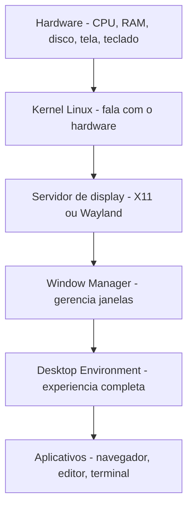
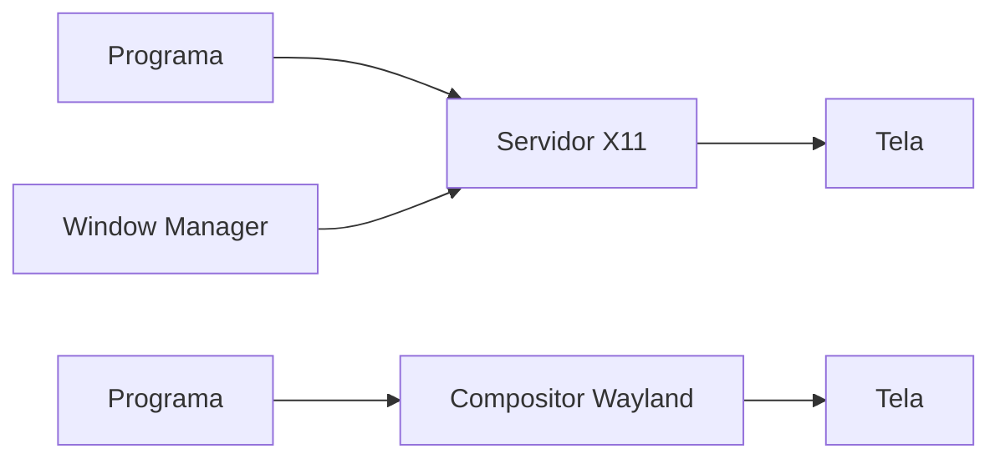
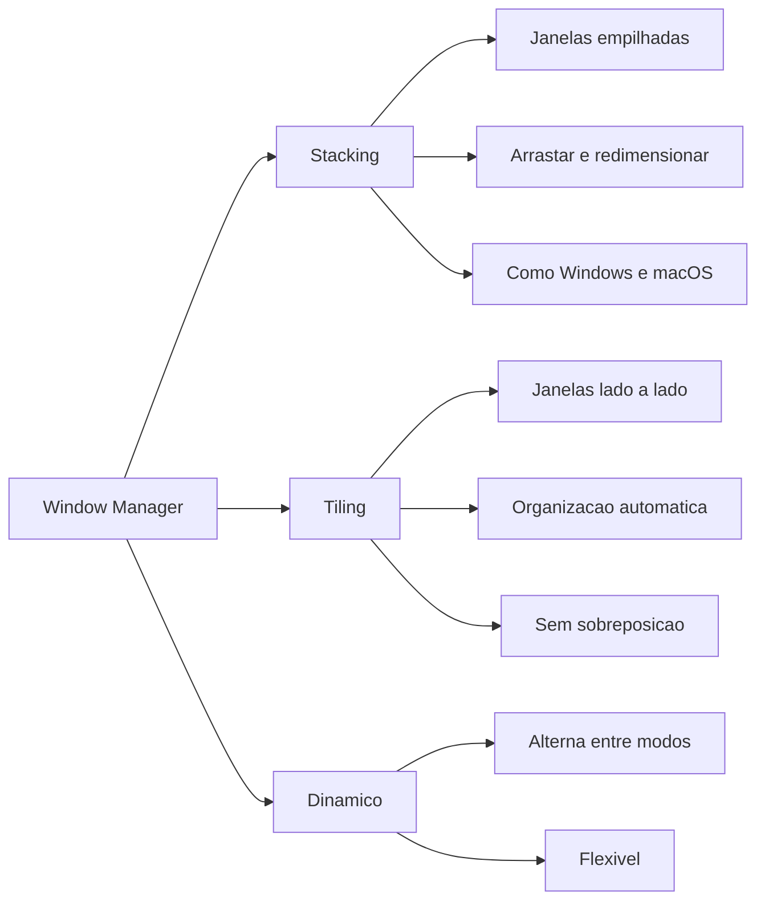
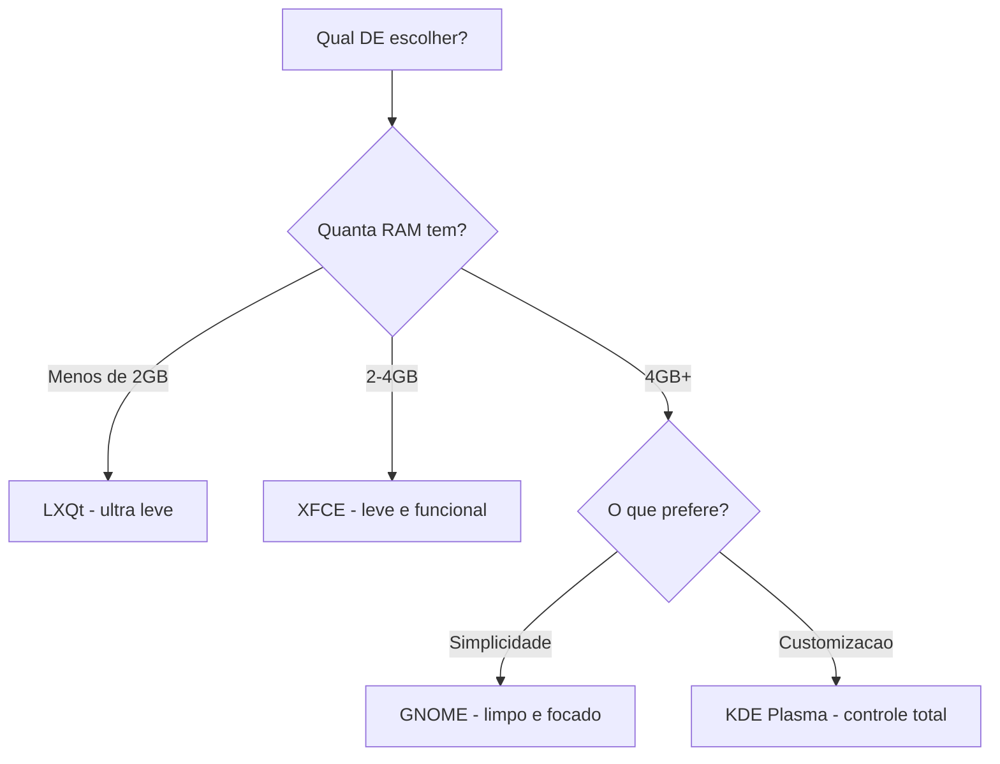
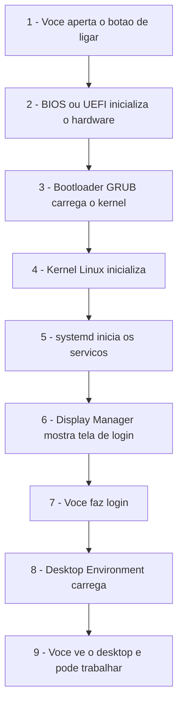

# 2.3 — Kernel, Desktop Environment e Window Manager: As Camadas do Linux

[← Anterior: Distribuições Linux](cap02-mod02-distribuicoes.md) · [Próximo: Estrutura de Diretórios →](cap02-mod04-estrutura-diretorios.md)

---

## Introdução

No módulo anterior, vimos que existem centenas de distribuições Linux e que cada uma faz escolhas diferentes sobre interface gráfica, gerenciador de pacotes e filosofia. Mas o que exatamente são essas "interfaces gráficas"? Por que existem tantas opções? E o que acontece entre o momento em que você liga o computador e a tela do desktop aparece?

Para entender isso, precisamos conhecer as **camadas** que formam um sistema Linux. Diferente do Windows e do macOS, onde tudo vem junto e você não tem escolha, no Linux cada camada é independente e pode ser trocada. É como montar um sanduíche: você escolhe o pão, o recheio, o molho e a salada separadamente. No Windows, o sanduíche vem pronto e você come como está.

Essa modularidade é uma das maiores forças do Linux — e também uma das coisas que mais confunde quem está começando. Vamos descomplicar.

Lembre-se do mantra do curso: **"Qual problema você quer resolver?"** Cada camada do Linux existe para resolver um problema específico. O kernel resolve o problema de falar com o hardware. O servidor de display resolve o problema de desenhar na tela. O window manager resolve o problema de organizar janelas. O Desktop Environment resolve o problema de oferecer uma experiência completa ao usuário.

Entender essas camadas não é apenas conhecimento teórico — é prático. Quando algo der errado no seu Linux (e eventualmente vai dar), saber em qual camada o problema está te ajuda a resolver. Se a interface gráfica travou mas o terminal funciona, o problema está no DE ou no servidor de display, não no kernel. Se nada funciona, o problema provavelmente está no kernel ou no hardware. Esse tipo de raciocínio em camadas é exatamente o que bons desenvolvedores fazem quando depuram problemas em software.

Vamos começar pela camada mais baixa e subir até a mais alta.

---

## As Camadas de um Sistema Linux

Um sistema Linux é composto por camadas empilhadas, cada uma com uma responsabilidade específica. Vamos do mais baixo (perto do hardware) ao mais alto (perto do usuário):

| Camada | O que faz | Analogia |
|--------|-----------|----------|
| Hardware | Os componentes fisicos | A cozinha em si - fogao, pia, bancada |
| Kernel | Fala com o hardware, gerência recursos | O gerente da cozinha - distribui tarefas |
| Servidor de display | Desenha pixels na tela | A bancada onde os pratos são montados |
| Window Manager | Organiza as janelas na tela | O organizador que decide onde cada prato fica |
| Desktop Environment | Experiência completa com menus, paineis, configurações | O restaurante completo - cardapio, decoracao, servico |
| Aplicativos | Programas que você usa | Os pratos que você come |

No Windows, todas essas camadas são uma coisa só — você não pode trocar o gerenciador de janelas sem trocar o Windows inteiro. No Linux, cada camada é independente. Você pode usar o mesmo kernel com interfaces completamente diferentes.

---

## O Kernel: O Coração do Sistema

No módulo 2.1, vimos que o kernel é o núcleo do sistema operacional — a parte que fala diretamente com o hardware. Vamos aprofundar o que isso significa na prática.

### O que o Kernel Faz

O kernel é o intermediário entre os programas e o hardware. Nenhum programa fala diretamente com o processador, a memória ou o disco — tudo passa pelo kernel. Sem o kernel, cada programa precisaria saber como conversar com cada modelo de placa de vídeo, cada tipo de disco rígido, cada marca de teclado. Seria como se cada cozinheiro precisasse saber consertar o fogão, a geladeira e a pia antes de poder cozinhar.

O kernel resolve isso criando uma **camada de abstração**: os programas pedem coisas ao kernel usando uma interface padronizada (as chamadas de sistema que vimos no módulo 1.6), e o kernel traduz esses pedidos para o hardware específico que está instalado.

| Responsabilidade | O que significa | Exemplo prático |
|-----------------|----------------|-----------------|
| Gerenciamento de processos | Decide qual programa roda e quando | Quando você abre o navegador e o editor ao mesmo tempo |
| Gerenciamento de memória | Distribui RAM entre os programas | Garante que o navegador não invada a memória do editor |
| Gerenciamento de dispositivos | Fala com hardware via drivers | Quando você conecta um pendrive e ele aparece no sistema |
| Sistema de arquivos | Organiza dados no disco | Quando você salva um arquivo, o kernel decide onde no disco ele vai |
| Rede | Gerência conexões de rede | Quando você acessa um site, o kernel cuida da comunicação |
| Segurança | Controla quem pode fazer o que | Impede que um usuario comum apague arquivos do sistema |
| Gerenciamento de energia | Controla consumo de energia | Reduz velocidade da CPU quando o notebook esta na bateria |
| Comunicação entre processos | Permite que programas troquem dados | Quando você copia texto do navegador e cola no editor |

Pense no kernel como o gerente de um restaurante. Os clientes (programas) fazem pedidos, mas não vão até a cozinha (hardware) diretamente. O gerente (kernel) recebe os pedidos, organiza a fila, distribui tarefas para os cozinheiros (processadores) e garante que tudo funcione sem conflito.

### Drivers: Os Tradutores do Kernel

Uma das funções mais importantes do kernel é gerenciar **drivers** — programas especializados que traduzem entre o kernel e um hardware específico. Cada dispositivo (placa de vídeo, placa de som, impressora, webcam, Wi-Fi) precisa de um driver.

No Windows, você frequentemente precisa instalar drivers manualmente — baixar do site do fabricante, executar um instalador. No Linux, a maioria dos drivers já vem incluída no kernel. Quando você conecta um pendrive ou uma impressora, o kernel automaticamente carrega o driver correto. Isso é possível porque o kernel Linux inclui milhares de drivers para os mais diversos dispositivos.

Existem dois tipos de drivers no Linux:

| Tipo | Como funciona | Exemplo |
|------|--------------|---------|
| Driver embutido no kernel | Compilado junto com o kernel, sempre disponível | Drivers de disco, USB, rede básica |
| Módulo carregavel | Carregado sob demanda quando o hardware e detectado | Drivers de placa de video, Wi-Fi, Bluetooth |

Os módulos carregáveis são uma das grandes vantagens do kernel Linux. Em vez de ter todos os drivers carregados na memória o tempo todo (o que desperdiçaria RAM), o kernel carrega apenas os drivers que precisa no momento. Quando você conecta um dispositivo Bluetooth, o módulo do Bluetooth é carregado. Quando desconecta, o módulo pode ser descarregado. É como um restaurante que contrata garçons extras só quando está cheio e dispensa quando está vazio.

### Tipos de Kernel

Existem diferentes abordagens para projetar um kernel:

| Tipo | Como funciona | Exemplo | Vantagem | Desvantagem |
|------|--------------|---------|----------|-------------|
| Monolitico | Tudo em um único bloco | Linux | Rápido, eficiente | Mais complexo de manter |
| Microkernel | Mínimo no kernel, resto em servicos separados | Minix, QNX | Mais estavel, modular | Mais lento por comunicação entre servicos |
| Hibrido | Mistura das duas abordagens | Windows NT, macOS | Equilibrio | Complexidade de design |

O Linux usa um kernel **monolítico**, mas com uma característica importante: **módulos carregáveis**. Isso significa que partes do kernel (como drivers de hardware) podem ser carregadas e descarregadas sem reiniciar o sistema. É como se o gerente do restaurante pudesse contratar e dispensar funcionários durante o expediente, sem fechar o restaurante.

### Versões do Kernel

O kernel Linux tem um sistema de versionamento: `MAJOR.MINOR.PATCH`. Por exemplo, `6.8.12` significa versão principal 6, versão menor 8, correção 12.

Linus Torvalds ainda coordena o desenvolvimento do kernel. Novas versões são lançadas a cada 2-3 meses, com contribuições de milhares de desenvolvedores ao redor do mundo. É um dos maiores projetos colaborativos da história da humanidade — mais de 20.000 pessoas já contribuíram com código para o kernel Linux.

---

## O Servidor de Display: Desenhando na Tela

Entre o kernel e a interface gráfica existe uma camada que muita gente não conhece: o **servidor de display** (ou servidor gráfico). Ele é responsável por transformar as instruções dos programas em pixels na tela.

### X11 (X Window System)

O **X11** (também chamado de "X" ou "X Window System") foi criado em 1984 no MIT. Sim, 1984 — é mais velho que o próprio Linux. Por décadas, foi o servidor de display padrão do Linux.

O X11 funciona com um modelo **cliente-servidor**: os programas (clientes) pedem ao servidor X para desenhar janelas, botões e texto na tela. O servidor X é quem realmente fala com a placa de vídeo.

| Caracteristica | X11 |
|---------------|-----|
| Criado em | 1984 |
| Modelo | Cliente-servidor |
| Implementação mais usada | Xorg |
| Vantagem | Maduro, compatível com tudo |
| Desvantagem | Antigo, complexo, problemas de segurança |

O X11 tem um problema de segurança fundamental: qualquer programa pode "espiar" o que outros programas estão fazendo na tela. Um programa malicioso poderia capturar tudo que você digita, incluindo senhas. Isso acontece porque o X11 foi projetado em uma época em que segurança não era prioridade.

### Wayland: O Substituto Moderno

**Wayland** foi criado em 2008 por **Kristian Hogsberg**, um engenheiro da Red Hat que trabalhava no X.org (a implementação do X11). Hogsberg percebeu que o X11 tinha problemas fundamentais de design que não podiam ser corrigidos sem reescrever tudo do zero. Em vez de tentar consertar o X11, ele decidiu criar algo novo.

O nome "Wayland" vem de uma cidade no estado de Massachusetts, EUA, onde Hogsberg morava quando começou o projeto. Não tem nenhum significado técnico — é apenas o nome da cidade.

A diferença fundamental entre X11 e Wayland está na arquitetura:

No **X11**, existe um servidor X separado que gerência a tela. Os programas (clientes) pedem ao servidor X para desenhar coisas. O window manager é outro programa separado que diz ao servidor X como organizar as janelas. São três camadas: programa → window manager → servidor X → tela. Essa separação cria complexidade e overhead.

No **Wayland**, o compositor (que combina window manager + servidor de display em um só) fala diretamente com os programas. Não existe intermediário. Cada programa desenha em seu próprio buffer (espaço de memória), e o compositor combina tudo em uma imagem final. São duas camadas: programa → compositor → tela.

| Aspecto | X11 | Wayland |
|---------|-----|---------|
| Ano de criação | 1984 | 2008 |
| Segurança | Programas podem espiar uns aos outros | Cada programa so ve a si mesmo |
| Arquitetura | Complexa, cliente-servidor com WM separado | Simples, compositor direto |
| Performance | Boa | Melhor, menos camadas |
| Compatibilidade | Funciona com tudo | Ainda em transicao |
| Tearing de tela | Pode acontecer | Eliminado por design |
| Acesso remoto | Nativo, X11 forwarding | Precisa de soluções extras como RDP |
| Gravacao de tela | Qualquer programa pode gravar | Precisa de permissão explicita |
| Multi-monitor | Funciona mas com limitacoes | Suporte nativo melhor, DPI por monitor |

A questão de **segurança** merece destaque. No X11, qualquer programa pode capturar tudo que acontece na tela — incluindo o que você digita em outros programas. Um keylogger (programa que registra suas teclas) funciona trivialmente no X11. No Wayland, cada programa só tem acesso ao seu próprio conteúdo. Para capturar a tela ou as teclas de outro programa, precisa de permissão explícita do compositor. Isso é uma melhoria enorme de segurança.

A transição de X11 para Wayland está acontecendo agora. Ubuntu usa Wayland como padrão desde a versão 22.04. Fedora usa Wayland por padrão desde 2016. Mas alguns programas antigos ainda precisam do X11, então existe uma camada de compatibilidade chamada **XWayland** que permite rodar programas X11 dentro do Wayland. Na prática, isso funciona de forma transparente — você não percebe quais programas estão usando X11 e quais estão usando Wayland nativo.

Para você como iniciante, a diferença prática é pequena — tudo funciona de forma transparente. Mas é importante saber que essa camada existe, porque eventualmente você vai encontrar algum programa que se comporta diferente em X11 e Wayland. E quando isso acontecer, agora você sabe por quê.

---

## Window Manager: O Organizador de Janelas

O **Window Manager** (WM, ou Gerenciador de Janelas) é o componente que controla como as janelas aparecem e se comportam na tela. Ele decide:

- Onde cada janela aparece
- Como você move e redimensiona janelas
- O que acontece quando você minimiza ou maximiza
- Como você alterna entre janelas

### Tipos de Window Manager

Existem três tipos principais de gerenciadores de janelas:

#### Stacking (Empilhamento)

É o tipo que você já conhece do Windows e macOS. Janelas ficam empilhadas umas sobre as outras, como papéis em uma mesa. Você pode mover, redimensionar e sobrepor janelas livremente.

Exemplos: Mutter (usado pelo GNOME), KWin (usado pelo KDE), Openbox.

#### Tiling (Ladrilhamento)

Janelas nunca se sobrepõem — elas dividem a tela automaticamente, como ladrilhos em um piso. Quando você abre uma nova janela, as existentes se reorganizam para dar espaço. Isso elimina a necessidade de ficar arrastando e redimensionando janelas manualmente.

Exemplos: i3, Sway, Hyprland, bspwm.

#### Dinâmico

Combina stacking e tiling — você pode alternar entre os dois modos conforme a necessidade.

Exemplos: awesome, dwm.

| Tipo | Vantagem | Desvantagem | Melhor para |
|------|----------|-------------|-------------|
| Stacking | Familiar, intuitivo | Janelas se escondem atras de outras | Uso geral, iniciantes |
| Tiling | Eficiente, tudo visível | Curva de aprendizado | Programadores, terminal |
| Dinâmico | Flexível | Mais complexo de configurar | Usuarios avancados |

### Por que Programadores Adoram Tiling

Muitos programadores profissionais usam gerenciadores de janelas tiling. O motivo é produtividade: quando você está programando, normalmente precisa ver o código, o terminal e a documentação ao mesmo tempo. Com tiling, tudo fica organizado automaticamente sem precisar ficar arrastando janelas.

Além disso, gerenciadores tiling são controlados quase inteiramente pelo teclado — sem precisar tirar as mãos do teclado para usar o mouse. Para quem digita código o dia inteiro, isso faz uma diferença enorme.

Um fluxo de trabalho típico com tiling:

| Ação | Atalho tipico | O que acontece |
|------|--------------|----------------|
| Abrir terminal | Super + Enter | Terminal aparece ocupando toda a tela |
| Abrir segundo programa | Super + Enter | Tela se divide automaticamente em duas metades |
| Abrir terceiro programa | Super + Enter | Tela se reorganiza em tres partes |
| Mover foco para a direita | Super + L | Foco muda para a janela da direita |
| Mover foco para a esquerda | Super + H | Foco muda para a janela da esquerda |
| Fechar janela | Super + Shift + Q | Janela fecha e as outras se reorganizam |
| Mudar layout | Super + E | Alterna entre horizontal e vertical |
| Ir para workspace 2 | Super + 2 | Muda para outro espaco de trabalho virtual |

O conceito de **workspaces** (espaços de trabalho virtuais) é especialmente poderoso com tiling. Você pode ter o workspace 1 com código e terminal, o workspace 2 com navegador e documentação, o workspace 3 com email e chat. Alternar entre eles é instantâneo com um atalho de teclado.

Os gerenciadores tiling mais populares em 2024:

| WM | Servidor de display | Destaque | Dificuldade |
|----|---------------------|----------|-------------|
| i3 | X11 | Simples, bem documentado, grande comunidade | Media |
| Sway | Wayland | Compatível com configuração do i3, moderno | Media |
| Hyprland | Wayland | Animacoes bonitas, muito customizavel | Media-alta |
| bspwm | X11 | Extremamente minimalista e flexível | Alta |
| dwm | X11 | Ultra-minimalista, configurado editando código C | Muito alta |

Não se preocupe com isso agora — vamos usar um Desktop Environment completo neste curso. Mas é bom saber que essa opção existe para quando você estiver mais avançado. Muitos desenvolvedores migram para tiling depois de 1-2 anos de experiência com Linux.

---

## Desktop Environment: A Experiência Completa

Um **Desktop Environment** (DE, ou Ambiente de Desktop) é muito mais que um gerenciador de janelas. É um pacote completo que inclui:

- Window Manager (gerenciador de janelas)
- Painel/barra de tarefas
- Menu de aplicativos
- Gerenciador de arquivos
- Configurações do sistema
- Notificações
- Tela de login
- Papel de parede e temas
- Aplicativos básicos (calculadora, editor de texto, visualizador de imagens)

Pense assim: o Window Manager é o esqueleto. O Desktop Environment é o corpo inteiro — esqueleto, músculos, pele, roupas e acessórios.

### GNOME — Simplicidade e Foco

**GNOME** (GNU Network Object Model Environment) é o Desktop Environment padrão do Ubuntu e do Fedora. Sua filosofia é: **menos é mais**. A interface é limpa, com poucos botões e opções visíveis. O GNOME foi fundado em 1997 por **Miguel de Icaza** e **Federico Mena**, dois programadores mexicanos que queriam criar uma interface gráfica completamente livre para Linux.

A história do GNOME é interessante: na época, o principal DE para Linux era o **KDE**, mas ele usava uma biblioteca gráfica chamada Qt que não era totalmente livre. Isso incomodava muitos defensores do software livre. O GNOME foi criado como alternativa usando a biblioteca **GTK** (GIMP Toolkit), que era completamente livre. Mais tarde, a Qt também se tornou livre, mas o GNOME já tinha se estabelecido como uma das principais opções.

O GNOME passou por uma mudança radical na versão 3 (2011), quando abandonou a interface tradicional com barra de tarefas e menu Iniciar em favor de uma abordagem completamente nova chamada **GNOME Shell**. Muitos usuários não gostaram da mudança — o que levou à criação de DEs alternativos como o **MATE** (que continuou o GNOME 2) e o **Cinnamon** (usado pelo Linux Mint).

| Caracteristica | GNOME |
|---------------|-------|
| Filosofia | Simplicidade, foco na tarefa |
| Window Manager | Mutter |
| Barra de tarefas | Barra superior com atividades |
| Menu de aplicativos | Tela de atividades com busca |
| Gerenciador de arquivos | Nautilus |
| Consumo de RAM | Medio-alto, 800MB-1.5GB |
| Customizacao | Limitada por padrão, extensivel com extensões |
| Biblioteca gráfica | GTK |
| Fundado em | 1997 por Miguel de Icaza e Federico Mena |

O GNOME pode parecer estranho no início se você vem do Windows — não tem menu Iniciar tradicional nem barra de tarefas na parte inferior. Em vez disso, você pressiona a tecla Super (a tecla com o logo do Windows no teclado) para abrir a tela de Atividades, onde pode buscar programas e ver todas as janelas abertas.

Essa abordagem divide opiniões: alguns adoram a simplicidade, outros sentem falta de mais opções. Mas para iniciantes, GNOME funciona bem porque tem poucas distrações.

Uma funcionalidade poderosa do GNOME são as **extensões** (GNOME Extensions). Elas permitem adicionar funcionalidades que o GNOME não tem por padrão: barra de tarefas na parte inferior, menu de aplicativos tradicional, indicadores de sistema, controle de clipboard e muito mais. O site [extensions.gnome.org](https://extensions.gnome.org) tem centenas de extensões disponíveis.

### KDE Plasma — Poder e Customização

**KDE Plasma** é o oposto filosófico do GNOME: **tudo é customizável**. Quer mudar a posição da barra de tarefas? Pode. Quer mudar o formato dos botões de janela? Pode. Quer que o desktop se pareça com Windows, macOS ou algo completamente diferente? Pode.

O projeto KDE foi fundado em 1996 por **Matthias Ettrich**, um estudante alemão que queria uma interface gráfica consistente e bonita para Linux. O nome KDE originalmente significava "Kool Desktop Environment" (Ambiente de Desktop Legal), mas hoje é apenas "KDE".

O KDE tem uma história interessante com o GNOME. Nos anos 1990, o KDE usava a biblioteca Qt, que na época não era totalmente livre. Isso motivou a criação do GNOME como alternativa livre. Mais tarde, a Qt se tornou livre, e hoje KDE e GNOME coexistem como as duas principais opções de DE para Linux — cada um com sua filosofia.

Uma das maiores forças do KDE é o ecossistema de aplicativos. O projeto KDE não é apenas um DE — é uma comunidade que desenvolve dezenas de aplicativos de alta qualidade:

| Aplicativo KDE | O que faz | Equivalente no Windows |
|---------------|-----------|----------------------|
| Dolphin | Gerenciador de arquivos | Explorador de Arquivos |
| Konsole | Terminal | Prompt de Comando |
| Kate | Editor de texto avancado | Notepad++ |
| Okular | Visualizador de PDF | Adobe Reader |
| Gwenview | Visualizador de imagens | Visualizador de Fotos |
| KCalc | Calculadora | Calculadora |
| Spectacle | Captura de tela | Ferramenta de Recorte |

| Caracteristica | KDE Plasma |
|---------------|-----------|
| Filosofia | Customizacao total, poder ao usuario |
| Window Manager | KWin |
| Barra de tarefas | Painel inferior, customizavel |
| Menu de aplicativos | Menu tradicional ou launcher |
| Gerenciador de arquivos | Dolphin |
| Consumo de RAM | Medio, 600MB-1.2GB |
| Customizacao | Extrema, praticamente tudo pode ser mudado |
| Biblioteca gráfica | Qt |
| Fundado em | 1996 por Matthias Ettrich |

KDE Plasma se parece mais com Windows por padrão, o que facilita a transição para quem vem do Windows. Tem menu Iniciar, barra de tarefas na parte inferior e área de trabalho com ícones.

Uma curiosidade: o KDE Plasma é surpreendentemente leve apesar de ser tão rico em funcionalidades. Em testes recentes, ele consome menos RAM que o GNOME em muitas situações. Isso acontece porque a equipe do KDE investiu muito em otimização nos últimos anos.

### XFCE — Leve e Funcional

**XFCE** é um Desktop Environment leve, projetado para funcionar bem em computadores com poucos recursos. Não tem os efeitos visuais sofisticados do GNOME ou KDE, mas é rápido e confiável.

| Caracteristica | XFCE |
|---------------|------|
| Filosofia | Leveza e funcionalidade |
| Window Manager | Xfwm |
| Consumo de RAM | Baixo, 400-600MB |
| Visual | Simples, funcional |
| Melhor para | Computadores antigos ou com pouca RAM |

### LXQt — Ultra-Leve

**LXQt** é ainda mais leve que o XFCE. É a escolha para computadores realmente antigos ou com muito pouca RAM (2 GB ou menos).

| Caracteristica | LXQt |
|---------------|------|
| Filosofia | Minimalismo extremo |
| Consumo de RAM | Muito baixo, 200-400MB |
| Visual | Básico |
| Melhor para | Hardware muito limitado |

### Comparação Direta

| Aspecto | GNOME | KDE Plasma | XFCE | LXQt |
|---------|-------|-----------|------|------|
| Consumo de RAM | 800MB-1.5GB | 600MB-1.2GB | 400-600MB | 200-400MB |
| Customizacao | Limitada | Extrema | Moderada | Básica |
| Facilidade | Alta | Media | Alta | Media |
| Visual | Moderno, limpo | Moderno, rico | Classico | Básico |
| Melhor para | Uso geral | Quem quer controle | PCs modestos | PCs antigos |
| Usado por padrão em | Ubuntu, Fedora | Kubuntu, KDE Neon | Xubuntu | Lubuntu |

---

## Display Manager: A Tela de Login

Existe mais uma camada que vale mencionar: o **Display Manager** (DM, ou Gerenciador de Login). É o programa que mostra a tela de login quando você liga o computador — onde você digita seu nome de usuário e senha.

O Display Manager é mais importante do que parece. Além de autenticar o usuário, ele é responsável por:

1. Iniciar o servidor de display (X11 ou Wayland)
2. Permitir que você escolha qual Desktop Environment usar (se tiver mais de um instalado)
3. Permitir que você escolha qual sessão usar (X11 ou Wayland)
4. Gerenciar múltiplos usuários (se mais de uma pessoa usa o computador)

| Display Manager | Usado por | Visual | Peso |
|----------------|-----------|--------|------|
| GDM | GNOME, Ubuntu | Moderno, integrado ao GNOME | Medio |
| SDDM | KDE Plasma | Customizavel, integrado ao KDE | Leve |
| LightDM | XFCE, LXQt, vários | Leve, flexível, muitos temas | Muito leve |
| ly | Minimalistas | Terminal de texto, sem interface gráfica | Ultra-leve |

Uma curiosidade: você pode usar qualquer Display Manager com qualquer Desktop Environment. Não precisa usar GDM com GNOME ou SDDM com KDE — são camadas independentes. Mas usar o DM "nativo" do seu DE geralmente oferece melhor integração visual.

Se você está usando Ubuntu padrão, o GDM é o Display Manager que aparece quando você liga o computador. Aquela tela com seu nome de usuário e um campo para digitar a senha — é o GDM.

---

## O Processo de Boot: Do Botão de Ligar ao Desktop

Agora que conhecemos todas as camadas, vamos ver o que acontece quando você liga um computador com Linux, passo a passo. Entender o processo de boot é importante porque quando algo dá errado (e eventualmente vai dar), saber em qual etapa o problema está te ajuda a resolver.

Vamos detalhar cada etapa:

### Etapa 1-2: BIOS/UEFI — O Primeiro Programa

Quando você aperta o botão de ligar, a primeira coisa que roda não é o Linux — é um programa gravado em um chip na placa-mãe chamado **BIOS** (Basic Input/Output System) ou seu substituto moderno, **UEFI** (Unified Extensible Firmware Interface).

O BIOS/UEFI faz o **POST** (Power-On Self-Test, ou Teste Automático ao Ligar) — verifica se o hardware básico está funcionando: CPU responde? RAM está presente? Disco está conectado? Se algo fundamental estiver errado, você ouve bipes ou vê uma mensagem de erro antes mesmo do sistema operacional carregar.

Depois do POST, o BIOS/UEFI procura um dispositivo de boot — o disco onde o sistema operacional está instalado. Ele lê os primeiros bytes desse disco e carrega o bootloader.

A diferença entre BIOS e UEFI:

| Aspecto | BIOS | UEFI |
|---------|------|------|
| Criado em | Anos 1980 | Anos 2000 |
| Interface | Texto, navegação por teclado | Pode ter interface gráfica com mouse |
| Limite de disco | 2 TB máximo | Sem limite prático |
| Velocidade de boot | Mais lento | Mais rápido |
| Segurança | Básica | Secure Boot, verificacao de assinatura |
| Status | Obsoleto, mas ainda presente em PCs antigos | Padrão em PCs modernos |

### Etapa 3: GRUB — O Bootloader

**GRUB** (GRand Unified Bootloader) é o programa que carrega o kernel Linux na memória. Se você tem mais de um sistema operacional instalado (dual boot com Windows, por exemplo), o GRUB mostra um menu para você escolher qual sistema iniciar.

O GRUB é configurável — você pode mudar o tempo de espera do menu, a ordem dos sistemas, e até adicionar parâmetros especiais para o kernel. O arquivo de configuração fica em `/boot/grub/grub.cfg`, mas normalmente você não edita esse arquivo diretamente — usa ferramentas como `update-grub` que geram a configuração automaticamente.

### Etapa 4: Kernel — O Coração Acorda

O kernel Linux é carregado na memória e começa a inicializar. Ele detecta o hardware presente (processador, memória, discos, placas de rede), carrega os drivers necessários e monta o sistema de arquivos raiz (o disco principal onde o Linux está instalado).

Essa etapa é onde você vê mensagens de texto passando rapidamente na tela (se o splash screen estiver desativado). Cada linha é o kernel reportando o que encontrou: "Detectei 8 GB de RAM", "Encontrei um SSD NVMe", "Carreguei o driver de rede Intel".

### Etapa 5: systemd — O Maestro dos Serviços

**systemd** é o sistema de inicialização usado pela maioria das distribuições Linux modernas. Ele é responsável por iniciar todos os serviços do sistema: rede, som, bluetooth, impressora, servidor de display e muito mais.

O systemd inicia serviços em paralelo (vários ao mesmo tempo), o que torna o boot mais rápido. Antes do systemd, os serviços eram iniciados um por um, em sequência — muito mais lento. O systemd também monitora os serviços depois que iniciam: se um serviço trava, o systemd pode reiniciá-lo automaticamente.

Alguns comandos úteis do systemd que você vai aprender nos próximos módulos:

| Comando | O que faz |
|---------|-----------|
| systemctl status nome | Mostra o estado de um servico |
| systemctl start nome | Inicia um servico |
| systemctl stop nome | Para um servico |
| systemctl restart nome | Reinicia um servico |
| systemctl enable nome | Configura servico para iniciar no boot |
| journalctl | Mostra logs do sistema |

### Etapa 6-9: Interface Gráfica

Depois que o systemd inicia todos os serviços essenciais, ele inicia o **Display Manager** (tela de login). Você faz login, e o Display Manager inicia o **Desktop Environment** que você escolheu. O DE carrega o window manager, os painéis, os ícones e tudo mais. Em poucos segundos, você vê o desktop e pode começar a trabalhar.

| Etapa | O que acontece | Tempo tipico |
|-------|---------------|-------------|
| BIOS/UEFI | Testa o hardware, encontra o disco de boot | 1-3 segundos |
| Bootloader GRUB | Carrega o kernel Linux na memória | 1-2 segundos |
| Kernel | Inicializa drivers, monta sistema de arquivos | 2-5 segundos |
| systemd | Inicia servicos do sistema em paralelo | 3-10 segundos |
| Display Manager | Mostra tela de login | 1-2 segundos |
| Desktop Environment | Carrega interface gráfica completa | 2-5 segundos |

O tempo total de boot em um computador moderno com SSD é de 10-20 segundos. Com HD mecânico, pode levar 1-2 minutos. Essa é mais uma razão para ter um SSD — como vimos no módulo 1.2.

### Quando o Boot Dá Errado

Cada etapa depende da anterior. Se o kernel não carregar, nada mais funciona. Se o servidor de display falhar, você não vê interface gráfica (mas o sistema ainda funciona — pode usar o terminal de texto pressionando Ctrl+Alt+F2).

Saber em qual etapa o problema está é fundamental para resolver:

| Sintoma | Provavel etapa com problema | O que fazer |
|---------|---------------------------|-------------|
| Tela preta, nenhum texto | BIOS/UEFI ou hardware | Verificar conexões, testar RAM |
| Menu do GRUB não aparece | Bootloader | Reinstalar GRUB via live USB |
| Kernel panic, texto de erro | Kernel | Verificar drivers, tentar kernel anterior |
| Servicos não iniciam | systemd | Verificar logs com journalctl |
| Tela de login não aparece | Display Manager ou servidor de display | Verificar logs, reinstalar DM |
| Desktop não carrega | Desktop Environment | Reinstalar DE, verificar configuração |

---

## Servidor Linux: Sem Interface Gráfica

Uma coisa importante: servidores Linux normalmente **não têm interface gráfica**. Nada de GNOME, KDE ou qualquer Desktop Environment. Apenas o terminal de texto.

Por que? Porque interface gráfica consome recursos (RAM, CPU) que o servidor poderia usar para atender mais requisições. Um servidor web não precisa de papel de parede bonito — precisa de performance.

Para ter uma ideia concreta do impacto:

| Recurso | Com Desktop Environment | Sem Desktop Environment |
|---------|------------------------|------------------------|
| RAM usada pelo SO | 800 MB - 1.5 GB | 200 - 400 MB |
| CPU usada pelo SO | 2-5% constante | Menos de 1% |
| Espaco em disco do SO | 5-10 GB | 1-2 GB |
| Superficie de ataque | Maior, mais programas rodando | Menor, menos programas |
| Tempo de boot | 15-30 segundos | 5-10 segundos |

Essa diferença pode parecer pequena em um computador, mas quando você tem centenas ou milhares de servidores, cada megabyte de RAM economizado se multiplica. Se cada servidor economiza 1 GB de RAM ao não ter interface gráfica, em 1.000 servidores são 1 TB de RAM que podem ser usados para atender mais usuários.

Quando você administra um servidor Linux, faz tudo pelo terminal — conectando remotamente via **SSH** (Secure Shell). SSH é um protocolo que permite acessar o terminal de um computador remoto de forma segura e criptografada. Você digita comandos no seu computador, e eles são executados no servidor que pode estar do outro lado do mundo.

Vamos aprender sobre SSH nos capítulos 3 e 9. Por enquanto, o importante é entender que servidores Linux são controlados inteiramente pelo terminal — e é por isso que aprender a usar o terminal é tão importante para desenvolvedores.

| Tipo de uso | Interface gráfica | Por que |
|------------|-------------------|---------|
| Desktop pessoal | Sim, DE completo | Você precisa de interface para usar no dia a dia |
| Estacao de trabalho | Sim, DE completo | Programadores precisam de editor, navegador, terminal |
| Servidor | Não, apenas terminal | Economia de recursos, acesso remoto via SSH |
| Servidor com painel | Não, mas com interface web | Paineis como Cockpit rodam no navegador |
| Container Docker | Não, apenas processo | Mínimo absoluto, sem nada além do necessário |

### Painéis de Administração Web

Embora servidores não tenham interface gráfica instalada localmente, muitos oferecem **painéis de administração web** — interfaces gráficas que rodam no navegador. Você acessa pelo navegador do seu computador, e o painel mostra informações sobre o servidor: uso de CPU, memória, disco, serviços rodando, logs.

Exemplos populares:
- **Cockpit**: painel open source da Red Hat, simples e eficiente
- **Webmin**: painel mais antigo e completo, com muitas opções
- **Portainer**: painel para gerenciar containers Docker

Esses painéis são úteis para monitoramento e tarefas simples, mas para administração avançada, o terminal continua sendo a ferramenta principal.

---

## A Modularidade Linux na Prática

A grande lição deste módulo é a **modularidade** do Linux. Cada camada é independente e pode ser trocada. Essa é uma das diferenças mais fundamentais entre Linux e outros sistemas operacionais, e entender isso vai mudar a forma como você pensa sobre software.

### O que Modularidade Significa de Verdade

Modularidade não é apenas "poder trocar peças". É um princípio de design que diz: **cada componente deve ter uma responsabilidade clara e se comunicar com outros componentes através de interfaces bem definidas**.

No Linux:
- O kernel se comunica com o servidor de display através de uma interface definida
- O servidor de display se comunica com o window manager através de outra interface
- O window manager se comunica com os aplicativos através de outra interface

Se você troca o GNOME pelo KDE, o kernel não precisa mudar. Se você troca o X11 pelo Wayland, os aplicativos (na maioria dos casos) não precisam mudar. Cada camada é independente.

| Camada | Opcoes | Você pode trocar? |
|--------|--------|-------------------|
| Kernel | Linux, Linux-zen, Linux-lts | Sim, mas raramente necessário |
| Servidor de display | X11, Wayland | Sim |
| Window Manager | Mutter, KWin, i3, Sway, Hyprland | Sim |
| Desktop Environment | GNOME, KDE, XFCE, LXQt | Sim |
| Display Manager | GDM, SDDM, LightDM | Sim |
| Shell | Bash, Zsh, Fish | Sim, vamos ver no capítulo 3 |

### Modularidade no Windows e macOS

No Windows, todas essas camadas são uma coisa só — você não pode trocar o Explorer (gerenciador de janelas) por outro. No macOS, você não pode trocar o Aqua (interface gráfica) por outra. Tudo vem junto e não pode ser separado.

Isso tem vantagens: tudo funciona junto de forma integrada, sem conflitos. Mas tem desvantagens: se você não gosta de algo, não pode mudar. Se uma camada tem um bug, pode afetar todas as outras.

### Por que Modularidade Importa para Programadores

Essa modularidade reflete a **filosofia Unix** que vimos no módulo 2.1: cada componente faz uma coisa e faz bem. O kernel gerência hardware. O servidor de display desenha na tela. O Window Manager organiza janelas. Cada um com sua responsabilidade, trabalhando juntos.

Para programadores, esse conceito de modularidade é fundamental e aparece em todos os níveis:

| Nível | Conceito de modularidade | Onde você vai ver |
|-------|-------------------------|-------------------|
| Sistema operacional | Camadas independentes trocaveis | Este módulo |
| Programação | Funções com responsabilidade única | Capítulo 5 - Python |
| Estruturas de dados | Componentes reutilizaveis | Capítulo 6 - C |
| Orientacao a objetos | Classes com interfaces definidas | Capítulo 8 - C# |
| Arquitetura de sistemas | Servicos independentes comunicando via APIs | Capítulo 9 |
| APIs | Contratos entre sistemas diferentes | Capítulo 10 |

Quando você começar a escrever código no capítulo 5, vai aprender a criar funções — cada uma com uma responsabilidade. Quando chegar ao capítulo 8 (Orientação a Objetos), vai aprender sobre interfaces e separação de responsabilidades. Quando chegar ao capítulo 9 (Arquitetura), vai aprender sobre microsserviços — serviços independentes que se comunicam por APIs, exatamente como as camadas do Linux se comunicam por interfaces definidas.

A modularidade do Linux não é apenas uma curiosidade técnica — é uma aula prática de bom design de software que você vai aplicar em toda a sua carreira.

---

## Como a IA pode te ajudar aqui
**Prompt 1 — Explorar o conceito:**
> "Explique a diferença entre X11 e Wayland de forma simples. Por que o Linux esta migrando de um para o outro?"

**Prompt 2 — Comparar alternativas:**
> "Compare GNOME e KDE Plasma para alguem que esta vindo do Windows. Qual seria mais familiar?"

**Prompt 3 — Ver exemplos práticos:**
> "O que e um tiling window manager e por que programadores gostam tanto? Me de exemplos práticos de uso."

---

## Resumo do Módulo

| Conceito | Definição |
|----------|-----------|
| Kernel | Nucleo do SO, fala com o hardware e gerência recursos |
| Servidor de display | Camada que desenha pixels na tela, X11 ou Wayland |
| Window Manager | Componente que organiza e controla as janelas |
| Desktop Environment | Pacote completo com WM, painel, menus, configurações e apps |
| Display Manager | Tela de login que inicia a sessao gráfica |
| Modularidade | Cada camada e independente e pode ser trocada |
| Stacking WM | Janelas empilhadas, como Windows e macOS |
| Tiling WM | Janelas lado a lado, sem sobreposicao |
| Boot | Processo de inicialização do computador ate o desktop |

## Glossário do Módulo

| Termo | Definição |
|-------|-----------|
| BIOS | Basic Input Output System, primeiro programa que roda ao ligar o PC |
| Boot | Processo de inicialização do computador |
| Bootloader | Programa que carrega o kernel na memória |
| bspwm | Window manager tiling minimalista para Linux |
| Cinnamon | Desktop Environment criado pelo Linux Mint, continuacao do GNOME 2 |
| Compositor | Programa que combina as janelas em uma imagem final na tela |
| DE | Desktop Environment, ambiente de desktop completo |
| Display Manager | Programa que mostra a tela de login |
| Dolphin | Gerenciador de arquivos do KDE Plasma |
| dwm | Window manager tiling ultra-minimalista, configurado editando código C |
| Federico Mena | Co-fundador do projeto GNOME em 1997 |
| GDM | GNOME Display Manager, tela de login do GNOME |
| GNOME | Desktop Environment focado em simplicidade, fundado em 1997 |
| GNOME Extensions | Pequenos programas que adicionam funcionalidades ao GNOME |
| GNOME Shell | Interface do GNOME 3, lancada em 2011 |
| GRUB | GRand Unified Bootloader, carrega o kernel Linux |
| GTK | GIMP Toolkit, biblioteca gráfica usada pelo GNOME |
| Hyprland | Window manager tiling moderno para Wayland com animacoes |
| i3 | Window manager tiling popular para X11, controlado por teclado |
| journalctl | Comando para ver logs do systemd |
| KDE Plasma | Desktop Environment focado em customizacao, fundado em 1996 |
| Kernel | Nucleo do sistema operacional |
| Keylogger | Programa malicioso que registra teclas digitadas |
| Kristian Hogsberg | Criador do protocolo Wayland em 2008 |
| KWin | Window manager do KDE Plasma |
| LightDM | Display manager leve e flexível |
| LXQt | Desktop Environment ultra-leve |
| MATE | Desktop Environment que continua o GNOME 2 |
| Matthias Ettrich | Fundador do projeto KDE em 1996 |
| Miguel de Icaza | Co-fundador do projeto GNOME em 1997 |
| Módulo do kernel | Parte do kernel que pode ser carregada e descarregada dinamicamente |
| Monolitico | Tipo de kernel onde tudo roda em um único bloco |
| Mutter | Window manager e compositor do GNOME |
| Nautilus | Gerenciador de arquivos do GNOME |
| POST | Power-On Self-Test, teste de hardware ao ligar o PC |
| Qt | Biblioteca gráfica usada pelo KDE Plasma |
| SDDM | Simple Desktop Display Manager, tela de login do KDE |
| Secure Boot | Funcionalidade do UEFI que verifica assinatura do bootloader |
| SSH | Secure Shell, protocolo para acesso remoto seguro |
| Stacking | Tipo de WM onde janelas se empilham |
| Sway | Window manager tiling para Wayland, compatível com i3 |
| systemctl | Comando para gerenciar servicos do systemd |
| systemd | Sistema de inicialização e gerenciamento de servicos do Linux |
| Tearing | Defeito visual onde partes de frames diferentes aparecem na tela |
| Tiling | Tipo de WM onde janelas se organizam lado a lado |
| UEFI | Unified Extensible Firmware Interface, substituto moderno da BIOS |
| Wayland | Protocolo moderno de servidor de display, substituto do X11 |
| WM | Window Manager, gerenciador de janelas |
| Workspace | Espaco de trabalho virtual, como ter vários desktops |
| X11 | X Window System, servidor de display criado em 1984 |
| XFCE | Desktop Environment leve e funcional |
| Xfwm | Window manager do XFCE |
| Xorg | Implementação mais usada do X11 |
| XWayland | Camada de compatibilidade para rodar programas X11 no Wayland |

## Na Cultura Popular

- **Mr. Robot** (série, 2015-2019) — o protagonista Elliot usa Linux com interfaces minimalistas e tiling window managers. Mostra na prática como profissionais de segurança usam o terminal e interfaces customizadas.
- **Revolution OS** (documentário, 2001) — embora foque mais na história do Linux, mostra as primeiras interfaces gráficas do sistema e como a comunidade construiu alternativas ao Windows.

## Para Saber Mais

- [GNOME — Site oficial](https://www.gnome.org/) — Conheça o Desktop Environment padrão do Ubuntu
- [KDE Plasma — Site oficial](https://kde.org/plasma-desktop/) — Conheça o DE mais customizável
- [Wayland vs X11 — Explicação](https://www.youtube.com/watch?v=g1BoZnekkyM) — Vídeo comparativo
- [Unixporn no Reddit](https://www.reddit.com/r/unixporn/) — Comunidade que compartilha customizações visuais de Linux
- [GitHub do Fino](https://github.com/RafaelFino/learn-ops-content) — Material complementar

---

## Perguntas Frequentes (FAQ)

**P: Preciso escolher um Desktop Environment agora?**
R: Se você vai usar Ubuntu padrão, já vem com GNOME. Para este livro, GNOME é suficiente. Depois, quando tiver mais experiência, pode experimentar outros.

**P: Posso trocar o Desktop Environment depois de instalar?**
R: Sim! Você pode instalar vários DEs no mesmo sistema e escolher qual usar na tela de login. Mas cuidado: instalar muitos DEs pode causar conflitos de configuração.

**P: O que é melhor, GNOME ou KDE?**
R: Não existe "melhor" — existe "melhor para você". GNOME é mais simples e focado. KDE é mais customizável e familiar para quem vem do Windows. Experimente os dois e veja qual prefere.

**P: Preciso entender o kernel para programar?**
R: Não em profundidade, mas saber que ele existe e o que faz te ajuda a entender como programas interagem com o sistema. Quando seu programa abre um arquivo ou acessa a rede, é o kernel que faz isso acontecer.

**P: O que acontece se o Desktop Environment travar?**
R: O sistema continua funcionando. Você pode acessar um terminal de texto (Ctrl+Alt+F2 na maioria das distros), fazer login e reiniciar o DE. Isso é uma vantagem da modularidade — uma camada pode falhar sem derrubar as outras.

**P: Por que servidores não usam interface gráfica?**
R: Economia de recursos. Interface gráfica consome RAM e CPU que poderiam ser usados para atender mais requisições. Além disso, servidores são administrados remotamente via SSH — não tem ninguém sentado na frente deles.

**P: O que é Wayland e por que devo me importar?**
R: Wayland é o substituto moderno do X11 (o sistema que desenha a interface na tela). É mais seguro e mais rápido. A maioria das distros já usa Wayland por padrão. Como iniciante, você não precisa se preocupar — tudo funciona de forma transparente.

**P: Tiling window managers são difíceis de usar?**
R: Têm uma curva de aprendizado, sim. Você precisa aprender atalhos de teclado. Mas depois que aprende, muitos programadores dizem que nunca mais voltam para stacking. Não se preocupe com isso agora — é algo para explorar quando estiver mais avançado.

**P: O que é systemd e por que é importante?**
R: systemd é o programa que inicia todos os serviços do sistema quando você liga o computador. Ele gerência rede, som, bluetooth, impressora e muito mais. Quando algo não funciona no Linux, muitas vezes o problema está em um serviço gerenciado pelo systemd.

**P: Posso usar Linux sem interface gráfica?**
R: Sim! Muitos servidores rodam apenas com terminal de texto. E mesmo em um desktop, você pode fazer quase tudo pelo terminal. Na verdade, muitas tarefas são mais rápidas pelo terminal do que pela interface gráfica — vamos ver isso nos capítulos 3 e 4.

**P: O que é o GRUB?**
R: GRUB é o bootloader — o programa que aparece quando você liga o computador e carrega o kernel Linux. Se você tem dual boot (Linux e Windows no mesmo computador), o GRUB mostra um menu para escolher qual sistema iniciar.

**P: Por que o Linux tem tantas opções de interface?**
R: Porque a filosofia do Linux é dar liberdade de escolha. Diferentes pessoas têm diferentes necessidades e preferências. Alguém com um computador antigo precisa de uma interface leve. Alguém que quer produtividade máxima pode preferir tiling. Essa diversidade é uma força, não uma fraqueza. No Windows, você tem uma interface e pronto. No Linux, você escolhe a que melhor se adapta ao seu jeito de trabalhar.

**P: O que é Compositor e por que importa?**
R: Um compositor (compositor) é o programa que combina todas as janelas em uma imagem final que aparece na tela. No X11, o compositor é separado do window manager. No Wayland, o compositor E o window manager são a mesma coisa — o que simplifica a arquitetura e melhora a performance. Quando você vê efeitos visuais como transparência, sombras e animações suaves, é o compositor fazendo isso.

**P: O que são drivers e por que às vezes dão problema?**
R: Drivers são programas que traduzem entre o kernel e um hardware específico. Cada placa de vídeo, Wi-Fi e impressora precisa de um driver. No Linux, a maioria dos drivers já vem no kernel (são os chamados drivers open source), mas alguns hardwares (especialmente placas de vídeo Nvidia) precisam de drivers proprietários que nem sempre funcionam perfeitamente. A Nvidia historicamente teve uma relação complicada com o Linux — Linus Torvalds chegou a fazer um gesto obsceno para a câmera em uma palestra quando perguntado sobre a Nvidia. Isso melhorou muito nos últimos anos, mas ainda é uma fonte ocasional de problemas. A AMD, por outro lado, tem excelente suporte open source no Linux.

**P: O que são extensões do GNOME?**
R: São pequenos programas que adicionam funcionalidades ao GNOME. Por exemplo, uma extensão pode adicionar uma barra de tarefas na parte inferior (como no Windows), outra pode mostrar a temperatura da CPU, outra pode adicionar um menu de aplicativos tradicional. Você instala extensões pelo site extensions.gnome.org ou pelo aplicativo Extension Manager.

---

## Exercícios Práticos

**Exercício 1 — Pesquisa: Comparando Desktop Environments**

Pesquise imagens e vídeos de GNOME, KDE Plasma e XFCE. Para cada um, responda:
1. Como é a aparência visual?
2. Onde fica a barra de tarefas?
3. Como você abre programas?
4. Qual se parece mais com o Windows? E com o macOS?
5. Qual você usaria no seu computador e por que?

**Exercício 2 — Reflexão: Modularidade**

O Linux permite trocar cada camada independentemente. O Windows não. Escreva um texto discutindo:
1. Quais são as vantagens de poder trocar cada camada?
2. Quais são as desvantagens (pense em complexidade e compatibilidade)?
3. Dê um exemplo fora da tecnologia onde modularidade é vantajosa (pense em carros, casas, roupas...)
4. Como o conceito de modularidade se aplica à programação?

**Exercício 3 — Pesquisa: O Processo de Boot**

Pesquise e descreva, com suas palavras, o que acontece em cada etapa do boot de um computador com Linux, desde apertar o botão de ligar até ver o desktop. Use as informações deste módulo como base, mas tente encontrar detalhes adicionais.

**Exercício 4 — Pesquisa: Tiling Window Managers**

Pesquise vídeos no YouTube sobre tiling window managers (busque por "i3wm tutorial" ou "hyprland rice"). Depois responda:
1. Como é a aparência de um desktop com tiling WM?
2. Quais são as vantagens que os usuários citam?
3. Quais são as desvantagens?
4. Você usaria um tiling WM? Por que sim ou por que não?
5. Como o conceito de "tudo controlado pelo teclado" se conecta com a filosofia Unix de eficiência?

**Exercício 5 — Reflexão: Camadas e Programação**

Neste módulo, vimos que o Linux é organizado em camadas (kernel → servidor de display → WM → DE → aplicativos). Escreva um texto curto explicando:
1. Por que organizar um sistema em camadas é uma boa ideia?
2. O que aconteceria se tudo fosse uma camada só (como no Windows)?
3. Como esse conceito de camadas se aplica à programação? (Dica: pense em funções que chamam outras funções, ou em APIs que escondem complexidade)
4. Dê um exemplo do dia a dia (fora da tecnologia) onde algo é organizado em camadas. Por que essa organização funciona?
5. Se você fosse projetar um sistema operacional do zero, quantas camadas teria e quais seriam? Justifique suas escolhas.

Dica: não existe resposta certa para a pergunta 5 — o objetivo é exercitar o pensamento sobre design de sistemas, que é uma das habilidades mais importantes de um desenvolvedor.

### Nota sobre Personalização

Uma das grandes vantagens do Linux é a liberdade de personalização. Você pode trocar o gerenciador de janelas, o tema, os ícones, as fontes, os atalhos de teclado — praticamente tudo. Isso pode parecer intimidador no início, mas com o tempo você vai descobrir que ter controle total sobre seu ambiente de trabalho é uma das melhores coisas de usar Linux. Comece com as configurações padrão e vá ajustando conforme sentir necessidade.

---

[← Anterior: Distribuições Linux](cap02-mod02-distribuicoes.md) · [Próximo: Estrutura de Diretórios →](cap02-mod04-estrutura-diretorios.md)
