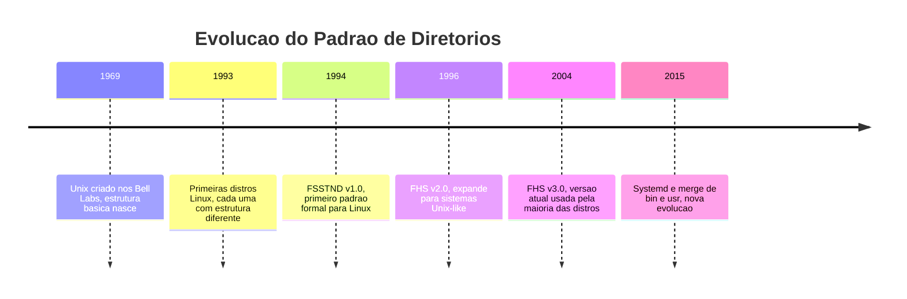

# 2.4 — Estrutura de Diretórios do Linux: Onde Cada Coisa Mora

[← Anterior: Kernel, Desktop Environment e Window Manager](cap02-mod03-kernel-de-wm.md) · [Próximo: Permissões →](cap02-mod05-permissoes.md)

---

## Introdução

No módulo anterior, vimos que o Linux é organizado em camadas — do kernel até o Desktop Environment — e que cada camada tem uma responsabilidade clara. Essa filosofia de organização não para na arquitetura do sistema. Ela se estende para algo que você vai usar todos os dias como desenvolvedor: a **estrutura de diretórios**.

Quando você liga um computador com Linux, o sistema operacional precisa saber onde encontrar cada coisa. Onde estão os programas? Onde ficam as configurações? Onde o sistema guarda arquivos temporários? Onde ficam os seus documentos pessoais? Se cada distribuição Linux organizasse isso de um jeito diferente, seria um caos — um programa feito para Ubuntu não saberia onde procurar arquivos no Fedora, e administradores de sistemas teriam que reaprender tudo a cada troca de distribuição.

Para resolver esse problema, existe um padrão chamado **FHS** (Filesystem Hierarchy Standard, ou Padrão de Hierarquia do Sistema de Arquivos). O FHS é como a planta de uma casa: define que a cozinha fica em tal lugar, o banheiro em outro, os quartos em outro. Você pode decorar cada cômodo como quiser, mas a estrutura básica é a mesma.

Lembre-se do mantra do curso: **"Qual problema você quer resolver?"** O FHS resolve o problema da previsibilidade. Quando você sabe que configurações ficam em `/etc`, logs ficam em `/var/log` e programas ficam em `/usr/bin`, você consegue navegar em qualquer sistema Linux do mundo — seja um servidor na nuvem, um Raspberry Pi ou o computador de um colega.

Para quem vai programar, entender a estrutura de diretórios é fundamental. Quando você criar um programa, precisa saber onde instalá-lo. Quando seu programa precisar ler um arquivo de configuração, precisa saber onde procurar. Quando algo der errado, precisa saber onde estão os logs. Quando precisar de espaço temporário, precisa saber qual diretório usar. Tudo isso está definido na estrutura de diretórios.

Vamos explorar essa estrutura em profundidade, entender por que cada diretório existe, qual problema ele resolve e como isso se conecta com o trabalho de um desenvolvedor.

---

## A Analogia: O Linux Como Uma Cidade Organizada

Antes de mergulhar nos detalhes técnicos, vamos usar uma analogia que vai te acompanhar por todo este módulo.

Imagine que o sistema de arquivos do Linux é uma **cidade bem planejada**. Nessa cidade:

- A **prefeitura** (`/etc`) guarda todas as regras e regulamentos da cidade — as configurações
- O **centro comercial** (`/usr`) é onde ficam os serviços disponíveis para todos — os programas
- Os **bairros residenciais** (`/home`) são onde cada morador tem sua casa — os arquivos pessoais de cada usuário
- A **mansão do prefeito** (`/root`) é a casa especial do administrador da cidade
- O **depósito municipal** (`/var`) é onde ficam coisas que mudam o tempo todo — logs, filas, dados variáveis
- A **área de construção temporária** (`/tmp`) é onde coisas são montadas e depois demolidas — arquivos temporários
- A **central de energia e água** (`/dev`) são os dispositivos que fazem a cidade funcionar — o hardware
- O **centro de informações** (`/proc` e `/sys`) são painéis que mostram o estado atual da cidade em tempo real
- A **garagem de ferramentas essenciais** (`/bin` e `/sbin`) guarda as ferramentas que a cidade precisa para funcionar mesmo em emergência
- O **porto de entrada** (`/mnt` e `/media`) é onde visitantes (pendrives, HDs externos) estacionam temporariamente

Essa analogia vai fazer mais sentido conforme explorarmos cada diretório. Guarde-a na memória — ela vai te ajudar a lembrar onde cada coisa fica.

---

## A Raiz de Tudo: O Diretório `/`

No Linux, tudo começa em um único ponto: o diretório raiz, representado por uma barra `/`. Absolutamente tudo no sistema — cada arquivo, cada programa, cada configuração, cada dispositivo de hardware — está dentro dessa árvore que começa em `/`.

Isso é fundamentalmente diferente do Windows, onde você tem `C:\`, `D:\`, `E:\` — cada disco é uma árvore separada. No Linux, existe apenas uma árvore. Se você conectar um segundo disco, ele não aparece como `D:\`. Em vez disso, ele é "montado" em algum ponto dentro da árvore existente, como `/mnt/segundo-disco` ou `/media/pendrive`. Tudo faz parte da mesma hierarquia.

### Por que uma única árvore?

Essa decisão vem do Unix, o ancestral do Linux, criado nos anos 1960-70 nos Bell Labs. Na época, os computadores tinham múltiplos discos e fitas magnéticas, e os engenheiros precisavam de uma forma unificada de acessar dados independente de onde estivessem fisicamente. A solução foi criar uma árvore única onde dispositivos físicos são "montados" em pontos da árvore.

Essa abordagem tem vantagens enormes:

| Aspecto | Linux (árvore única) | Windows (letras de unidade) |
|---------|---------------------|-----------------------------|
| Previsibilidade | Caminhos sempre comecam com / | Depende de qual letra o disco recebeu |
| Portabilidade | Programas usam caminhos absolutos fixos | Programas podem quebrar se o disco mudar de letra |
| Flexibilidade | Qualquer diretório pode estar em qualquer disco | Cada disco e uma unidade separada |
| Simplicidade | Uma hierarquia para tudo | Multiplas hierarquias independentes |
| Rede | Diretórios remotos montados na mesma árvore | Unidades de rede com letras separadas |

Para programadores, isso é uma benção. Quando você escreve um programa que lê configurações de `/etc/meuapp/config.yaml`, esse caminho funciona em qualquer máquina Linux. No Windows, você teria que lidar com `C:\Program Files\MeuApp\config.yaml` — mas e se o programa foi instalado em `D:\`? Essa previsibilidade do Linux simplifica muito o desenvolvimento de software.

### Caminhos Absolutos e Relativos

Antes de explorar cada diretório, é importante entender dois conceitos que você vai usar o tempo todo:

**Caminho absoluto** é o endereço completo a partir da raiz. Sempre começa com `/`:
- `/home/maria/documentos/relatório.txt`
- `/etc/nginx/nginx.conf`
- `/var/log/syslog`

**Caminho relativo** é o endereço a partir de onde você está agora. Não começa com `/`:
- `documentos/relatório.txt` (se você já está em `/home/maria`)
- `../joao/fotos` (sobe um nível e entra na pasta do João)

O ponto `.` representa o diretório atual, e dois pontos `..` representam o diretório pai (um nível acima). Esses conceitos são universais — funcionam no Linux, no macOS e até no Windows (que usa `\` em vez de `/`, mas a lógica é a mesma).

Para desenvolvedores, entender caminhos é essencial. Quando você cria um programa que precisa abrir um arquivo, precisa decidir: uso caminho absoluto ou relativo? Cada um tem vantagens:

| Tipo | Quando usar | Exemplo |
|------|-------------|---------|
| Absoluto | Arquivos do sistema, configurações globais | /etc/meuapp/config.yaml |
| Relativo | Arquivos do projeto, recursos locais | ./dados/entrada.csv |

---

## A História do FHS: Por Que Existe um Padrão

A estrutura de diretórios do Linux não foi inventada do zero. Ela evoluiu ao longo de décadas, e entender essa história ajuda a entender por que as coisas são como são hoje.

### Os Primórdios: Unix nos Anos 1970

Quando o Unix foi criado por Ken Thompson e Dennis Ritchie nos Bell Labs em 1969, os computadores tinham discos muito pequenos. O PDP-7, onde o Unix nasceu, tinha discos de apenas alguns megabytes. Os engenheiros precisaram dividir o sistema entre dois discos físicos:

- **Primeiro disco**: continha o essencial para o sistema funcionar — o kernel, os comandos básicos e as configurações
- **Segundo disco**: continha os programas adicionais, bibliotecas e arquivos dos usuários

Essa divisão física criou a separação que existe até hoje entre `/` (raiz, com o essencial) e `/usr` (com os programas adicionais). O nome `usr` originalmente significava "Unix System Resources" (Recursos do Sistema Unix), embora muita gente pense que significa "user" (usuário). Essa confusão de nomes persiste há mais de 50 anos.

### Os Anos 1980-90: O Caos das Distribuições

Quando o Linux surgiu em 1991 e as distribuições começaram a aparecer (Slackware em 1993, Debian em 1993, Red Hat em 1994), cada uma organizava os diretórios de um jeito ligeiramente diferente. Um programa que funcionava no Slackware podia não encontrar suas bibliotecas no Debian porque estavam em diretórios diferentes.

Isso era um pesadelo para:
- **Desenvolvedores de software**: não sabiam onde instalar seus programas
- **Administradores de sistemas**: tinham que reaprender a estrutura a cada distribuição
- **Criadores de pacotes**: não tinham um padrão para seguir

### 1994: Nasce o FSSTND

Para resolver esse caos, em 1994 a comunidade Linux criou o **FSSTND** (Filesystem Standard, ou Padrão de Sistema de Arquivos). Foi o primeiro esforço formal para padronizar onde cada coisa deveria ficar em um sistema Linux.

### 1996-2004: Evolução para o FHS

O FSSTND evoluiu para o **FHS** (Filesystem Hierarchy Standard), que expandiu o escopo para cobrir não apenas Linux, mas qualquer sistema Unix-like. As versões principais foram:



### A Evolução Moderna: O Merge `/usr`

Nos últimos anos, uma mudança significativa está acontecendo: o **merge de `/usr`**. Historicamente, existiam diretórios separados:
- `/bin` (comandos essenciais) e `/usr/bin` (comandos adicionais)
- `/sbin` (comandos de administração essenciais) e `/usr/sbin` (comandos de administração adicionais)
- `/lib` (bibliotecas essenciais) e `/usr/lib` (bibliotecas adicionais)

A separação fazia sentido quando `/` e `/usr` ficavam em discos diferentes. Mas em sistemas modernos, geralmente tudo está no mesmo disco. Manter a separação só causava confusão: "esse comando está em `/bin` ou `/usr/bin`?"

Distribuições modernas como Fedora (desde 2012), Ubuntu (desde 2023) e Arch Linux estão fazendo o merge: `/bin` vira um link simbólico para `/usr/bin`, `/sbin` para `/usr/sbin`, e `/lib` para `/usr/lib`. Na prática, tudo fica em `/usr`, e os diretórios antigos existem apenas por compatibilidade.

Essa evolução é um ótimo exemplo do segundo mantra do curso: **"Conceitos são para sempre, ferramentas apenas os implementam."** O conceito de separar programas essenciais de programas adicionais permanece — mas a implementação mudou porque o problema original (discos separados) não existe mais.

---

## Visão Geral: O Mapa Completo

Antes de explorar cada diretório em detalhes, vamos ver o mapa completo. Este diagrama mostra os diretórios principais que existem dentro de `/`:

```mermaid
flowchart TD
    ROOT[/ - Raiz do sistema] --> BIN[/bin - Comandos essenciais]
    ROOT --> BOOT[/boot - Arquivos de inicializacao]
    ROOT --> DEV[/dev - Dispositivos de hardware]
    ROOT --> ETC[/etc - Configuracoes do sistema]
    ROOT --> HOME[/home - Pastas dos usuarios]
    ROOT --> LIB[/lib - Bibliotecas essenciais]
    ROOT --> MEDIA[/media - Midias removiveis]
    ROOT --> MNT[/mnt - Montagens temporarias]
    ROOT --> OPT[/opt - Software opcional]
    ROOT --> PROC[/proc - Informacoes de processos]
    ROOT --> ROOTDIR[/root - Casa do administrador]
    ROOT --> SBIN[/sbin - Comandos de administracao]
    ROOT --> SYS[/sys - Informacoes do kernel]
    ROOT --> TMP[/tmp - Arquivos temporarios]
    ROOT --> USR[/usr - Programas e recursos]
    ROOT --> VAR[/var - Dados variaveis]
```

Cada um desses diretórios tem um propósito específico. Vamos explorar cada um em profundidade.

---

## `/bin` — Os Comandos Essenciais

O diretório `/bin` (abreviação de **binaries**, ou binários) contém os comandos mais básicos do sistema — aqueles que precisam estar disponíveis mesmo quando o sistema está em modo de emergência, com o mínimo possível funcionando.

### O que tem dentro de `/bin`?

Comandos que todo usuário pode executar e que são necessários para o funcionamento básico:

| Comando | O que faz | Por que e essencial |
|---------|-----------|---------------------|
| `ls` | Lista arquivos e diretórios | Sem ele, você não sabe o que tem no sistema |
| `cp` | Copia arquivos | Operação básica de manipulação |
| `mv` | Move ou renomeia arquivos | Operação básica de manipulação |
| `rm` | Remove arquivos | Operação básica de manipulação |
| `cat` | Mostra conteúdo de arquivos | Essencial para ler configurações |
| `echo` | Exibe texto na tela | Usado em scripts e diagnostico |
| `mkdir` | Cria diretórios | Operação básica de organização |
| `chmod` | Altera permissões | Essencial para segurança |
| `bash` | O shell padrão | Sem ele, você não tem terminal |
| `mount` | Monta sistemas de arquivos | Necessário para acessar discos |

### Por que esses comandos ficam separados?

Imagine que algo deu muito errado no seu sistema. O disco onde `/usr` está montado corrompeu. Se `ls`, `cp` e `bash` estivessem em `/usr/bin`, você não teria nem como listar arquivos para diagnosticar o problema. Por isso, os comandos de sobrevivência ficam em `/bin`, que está na partição raiz — a última a falhar.

É como ter um kit de primeiros socorros na entrada da casa, não no porão. Em uma emergência, você precisa de acesso rápido.

### A Conexão com Programação

Quando você escreve scripts (pequenos programas em linguagem de shell), vai usar esses comandos o tempo todo. A primeira linha de um script geralmente é:

```
#!/bin/bash
```

Essa linha diz ao sistema: "use o programa `/bin/bash` para executar este script". Se `bash` não estivesse em um local previsível, scripts não funcionariam de forma portável entre sistemas.

---

## `/sbin` — Comandos de Administração

O `/sbin` (abreviação de **system binaries**, ou binários do sistema) é parecido com `/bin`, mas contém comandos que normalmente só o administrador do sistema (o usuário `root`) precisa usar.

### O que tem dentro de `/sbin`?

| Comando | O que faz | Por que e de administracao |
|---------|-----------|---------------------------|
| `fdisk` | Gerência particoes de disco | Mexer em particoes pode destruir dados |
| `mkfs` | Formata discos | Formatar apaga tudo |
| `iptables` | Configura firewall | Segurança de rede e critica |
| `reboot` | Reinicia o sistema | Afeta todos os usuarios |
| `shutdown` | Desliga o sistema | Afeta todos os usuarios |
| `ifconfig` | Configura rede | Configuração de rede e sensivel |
| `fsck` | Verifica e repara sistemas de arquivos | Operação delicada em discos |

### A Diferença entre `/bin` e `/sbin`

A diferença é de **público-alvo**, não de localização:
- `/bin`: comandos para todos os usuários (listar, copiar, mover)
- `/sbin`: comandos para administradores (formatar, particionar, configurar rede)

Na prática, em distribuições modernas com o merge `/usr`, ambos apontam para `/usr/bin` e `/usr/sbin`. Mas o conceito permanece: existem comandos para uso geral e comandos para administração.

### A Conexão com Programação

Como desenvolvedor, você vai interagir com comandos de `/sbin` quando precisar configurar o ambiente onde seu programa roda. Precisa abrir uma porta no firewall para seu servidor web? `iptables` (ou seu sucessor `nftables`). Precisa configurar a rede? `ip` ou `ifconfig`. Precisa montar um disco para armazenamento? `mount`. Entender que esses comandos existem e onde estão é parte do conhecimento de um desenvolvedor que trabalha com servidores.

---

## `/boot` — A Ignição do Sistema

O diretório `/boot` contém tudo que é necessário para o computador iniciar — o processo de **boot** que vimos brevemente no módulo anterior. É como a chave de ignição de um carro: sem ela, o motor não liga.

### O que tem dentro de `/boot`?

| Arquivo | O que e | Função |
|---------|---------|--------|
| `vmlinuz` | O kernel Linux comprimido | O coracao do sistema operacional |
| `initrd` ou `initramfs` | Imagem de disco inicial | Sistema de arquivos temporário para o boot |
| `grub/` | Configuração do bootloader | Menu que aparece ao ligar o computador |
| `config-*` | Configuração do kernel | Opcoes com que o kernel foi compilado |
| `System.map` | Mapa de símbolos do kernel | Usado para depuracao |

### O Processo de Boot em Detalhes

Quando você liga o computador, acontece uma sequência precisa:

1. **BIOS/UEFI** acorda e faz o POST (Power-On Self-Test) — verifica se o hardware está funcionando
2. **BIOS/UEFI** procura um dispositivo de boot (HD, SSD, pendrive)
3. **Bootloader** (geralmente o GRUB) é carregado do disco
4. **GRUB** mostra um menu onde você pode escolher qual sistema iniciar
5. **GRUB** carrega o kernel (`vmlinuz`) e o `initramfs` para a memória RAM
6. **Kernel** assume o controle, inicializa o hardware e monta o sistema de arquivos raiz
7. **init/systemd** é o primeiro processo executado pelo kernel — ele inicia todos os outros serviços


### Por que `/boot` é especial?

O `/boot` frequentemente fica em uma partição separada do resto do sistema. Isso acontece porque o bootloader (GRUB) precisa conseguir ler essa partição antes de o kernel estar carregado — e o kernel é quem sabe ler sistemas de arquivos complexos. Por isso, `/boot` geralmente usa um sistema de arquivos simples como ext4 ou FAT32 (no caso de UEFI).

### A Conexão com Programação

Você raramente vai mexer em `/boot` diretamente. Mas entender o processo de boot é importante por dois motivos:

1. **Depuração**: se um servidor não inicia, saber que o problema pode estar no GRUB, no kernel ou no initramfs ajuda a diagnosticar
2. **Conceito de inicialização**: todo programa tem um processo de inicialização — carregar configurações, conectar ao banco de dados, iniciar serviços. O boot do Linux é o exemplo mais completo desse padrão

---

## `/dev` — Os Dispositivos de Hardware

O diretório `/dev` (abreviação de **devices**, ou dispositivos) é um dos conceitos mais elegantes do Unix/Linux: **tudo é um arquivo**. Cada dispositivo de hardware conectado ao computador aparece como um arquivo dentro de `/dev`.

### A Filosofia "Tudo é um Arquivo"

Essa é uma das ideias mais poderosas do Unix, e vale a pena entender por que ela existe.

Nos anos 1960-70, quando o Unix foi criado, os programadores enfrentavam um problema: cada tipo de dispositivo (impressora, disco, terminal, fita magnética) precisava de um código diferente para ser acessado. Quer imprimir? Use a função de impressão. Quer gravar em disco? Use a função de disco. Quer enviar dados pela rede? Use a função de rede. Cada dispositivo tinha sua própria interface.

Ken Thompson e Dennis Ritchie tiveram uma ideia brilhante: e se todos os dispositivos fossem acessados da mesma forma que arquivos? Você "abre" o dispositivo, "escreve" nele e "fecha". A mesma interface para tudo. Isso simplificou enormemente a programação — em vez de aprender dezenas de interfaces diferentes, você aprende uma só.

### O que tem dentro de `/dev`?

| Dispositivo | O que representa | Exemplo de uso |
|-------------|-----------------|----------------|
| `/dev/sda` | Primeiro disco rigido | O disco principal do sistema |
| `/dev/sda1` | Primeira particao do primeiro disco | Onde o sistema esta instalado |
| `/dev/sdb` | Segundo disco rigido | Um HD externo, por exemplo |
| `/dev/nvme0n1` | Disco SSD NVMe | SSDs modernos usam esse nome |
| `/dev/tty` | Terminal atual | O terminal onde você esta digitando |
| `/dev/null` | Buraco negro | Tudo que você envia para ca desaparece |
| `/dev/zero` | Fonte de zeros | Gera bytes zero infinitamente |
| `/dev/random` | Gerador de números aleatorios | Usado para criptografia |
| `/dev/urandom` | Gerador de números aleatorios rápido | Versão mais rápida do random |
| `/dev/loop0` | Dispositivo de loop | Monta arquivos como se fossem discos |

### Os Dispositivos Especiais

Três dispositivos em `/dev` merecem atenção especial porque são extremamente úteis para programadores:

**`/dev/null` — O Buraco Negro**

Tudo que você envia para `/dev/null` desaparece silenciosamente. É como jogar algo no lixo sem fazer barulho. Programadores usam isso o tempo todo para descartar saída que não interessa:

```
# Roda um comando mas descarta toda a saida
comando_barulhento > /dev/null 2>&1
```

Quando você escrever programas que geram muita saída de diagnóstico, vai usar `/dev/null` para silenciá-los em produção.

**`/dev/zero` — A Fonte de Zeros**

Gera uma sequência infinita de bytes zero. É usado para criar arquivos de tamanho específico ou limpar discos:

```
# Cria um arquivo de exatamente 1 megabyte preenchido com zeros
dd if=/dev/zero of=arquivo_1mb bs=1M count=1
```

**`/dev/random` e `/dev/urandom` — Aleatoriedade**

Geram números aleatórios. Isso é fundamental para criptografia — quando seu programa precisa gerar uma senha, um token de segurança ou uma chave de criptografia, ele lê bytes de `/dev/urandom`. Sem uma boa fonte de aleatoriedade, a segurança de todo o sistema fica comprometida.

### A Conexão com Programação

A filosofia "tudo é um arquivo" influenciou profundamente como programas são escritos no Linux. Em linguagens como C e Python, você usa as mesmas funções para ler um arquivo, ler dados de um dispositivo ou ler dados da rede. Essa uniformidade é um princípio de design poderoso que você vai encontrar em muitos lugares na programação — a ideia de ter uma **interface única** para coisas diferentes.

Quando você estudar programação orientada a objetos no Capítulo 8, vai aprender sobre **interfaces** e **polimorfismo** — conceitos que são a versão moderna dessa mesma ideia que o Unix teve nos anos 1970.

---

## `/etc` — A Prefeitura: Todas as Configurações

O diretório `/etc` (pronuncia-se "étici" ou "et cetera") é onde ficam **todas as configurações do sistema**. Se o Linux fosse uma cidade, `/etc` seria a prefeitura — o lugar onde estão todas as regras, regulamentos e registros.

### A Origem do Nome

O nome `/etc` tem uma história curiosa. No Unix original, era literalmente a pasta "et cetera" — onde ficava tudo que não cabia em outros lugares. Com o tempo, as coisas que "não cabiam em outros lugares" acabaram sendo principalmente arquivos de configuração, e `/etc` se tornou o lar oficial das configurações. Alguns dizem que `/etc` significa "Editable Text Configuration" (Configuração de Texto Editável), mas isso é um **backronym** — um significado inventado depois para uma sigla que já existia.

### O que tem dentro de `/etc`?

O `/etc` é um dos diretórios mais ricos do sistema. Vamos ver os arquivos e subdiretórios mais importantes:

| Arquivo ou Diretório | O que configura | Importância |
|----------------------|-----------------|-------------|
| `/etc/hostname` | Nome do computador na rede | Identifica a máquina |
| `/etc/hosts` | Mapeamento de nomes para IPs | DNS local |
| `/etc/passwd` | Lista de usuarios do sistema | Quem pode usar o sistema |
| `/etc/shadow` | Senhas dos usuarios criptografadas | Segurança de acesso |
| `/etc/group` | Grupos de usuarios | Organização de permissões |
| `/etc/fstab` | Tabela de sistemas de arquivos | Quais discos montar no boot |
| `/etc/resolv.conf` | Servidores DNS | Como o sistema resolve nomes de dominio |
| `/etc/apt/` | Configuração do gerenciador de pacotes APT | Onde buscar programas para instalar |
| `/etc/ssh/` | Configuração do servidor SSH | Acesso remoto seguro |
| `/etc/nginx/` | Configuração do servidor web Nginx | Servir páginas web |
| `/etc/systemd/` | Configuração de servicos | Quais programas iniciam automaticamente |
| `/etc/crontab` | Tarefas agendadas | Programas que rodam em horarios específicos |

### Configurações em Texto Puro

Uma característica fundamental do Linux é que quase todas as configurações são **arquivos de texto puro**. Não existe um "registro" binário e opaco como o Registry do Windows. Isso significa que:

1. Você pode ler qualquer configuração com um editor de texto simples
2. Você pode versionar configurações com Git (controle de versão)
3. Você pode automatizar mudanças de configuração com scripts
4. Você pode copiar configurações de uma máquina para outra facilmente
5. Quando algo dá errado, você pode ler o arquivo e entender o que está configurado

Essa transparência é um dos motivos pelos quais o Linux domina o mercado de servidores. Administradores podem gerenciar centenas de servidores automaticamente porque as configurações são texto que pode ser manipulado por programas.

| Aspecto | Linux - texto puro | Windows - Registry |
|---------|--------------------|--------------------|
| Legibilidade | Qualquer editor de texto | Precisa de ferramenta específica - regedit |
| Versionamento | Git funciona perfeitamente | Difícil de versionar |
| Automacao | Scripts simples | Precisa de PowerShell ou ferramentas especiais |
| Backup | Copiar arquivos | Exportar chaves do Registry |
| Depuracao | Ler o arquivo e entender | Navegar árvore binaria complexa |
| Portabilidade | Copiar entre máquinas | Incompativel entre versões do Windows |

### A Conexão com Programação

Quando você criar programas, vai precisar de arquivos de configuração. A tradição do Linux é colocar configurações globais em `/etc/nomedoprograma/` e configurações do usuário em `~/.config/nomedoprograma/` (o `~` representa a pasta home do usuário). Formatos comuns incluem:

- **YAML**: muito usado em ferramentas modernas (Docker, Kubernetes, Ansible)
- **JSON**: popular em aplicações web e APIs
- **TOML**: usado em ferramentas como Cargo (Rust) e pyproject.toml (Python)
- **INI**: formato simples com seções e chave=valor
- **Texto puro**: um valor por linha, simples e direto

Saber que configurações ficam em `/etc` é conhecimento prático que você vai usar desde o primeiro dia trabalhando com servidores.

---

## `/home` — Os Bairros Residenciais

O diretório `/home` é onde cada usuário do sistema tem sua pasta pessoal. Se o Linux é uma cidade, `/home` é o bairro residencial — cada morador tem sua casa, com seus pertences, sua decoração e suas regras.

### Como Funciona

Quando um usuário é criado no sistema, uma pasta é criada em `/home` com o nome do usuário:

- `/home/maria` — pasta pessoal da Maria
- `/home/joao` — pasta pessoal do João
- `/home/admin` — pasta pessoal do admin

Cada usuário tem controle total sobre sua pasta e, por padrão, não pode acessar a pasta de outros usuários. É como um apartamento: você tem a chave do seu, mas não do vizinho.

### O que fica dentro de `/home/usuario`?

| Diretório ou Arquivo | O que contem | Exemplo |
|----------------------|-------------|---------|
| `Documentos/` ou `Documents/` | Documentos pessoais | Relatórios, textos, planilhas |
| `Downloads/` | Arquivos baixados | Instaladores, PDFs, imagens |
| `Imagens/` ou `Pictures/` | Fotos e imagens | Screenshots, fotos pessoais |
| `Musica/` ou `Music/` | Arquivos de audio | MP3s, podcasts |
| `Videos/` | Arquivos de video | Filmes, gravacoes |
| `Desktop/` ou `Area de Trabalho/` | Icones na area de trabalho | Atalhos, arquivos rapidos |
| `.bashrc` | Configuração do terminal Bash | Aliases, variáveis de ambiente |
| `.config/` | Configurações de programas do usuario | Temas, preferencias de apps |
| `.ssh/` | Chaves SSH do usuario | Acesso remoto seguro |
| `.gitconfig` | Configuração do Git | Nome, email, preferencias |

### Arquivos Ocultos: O Ponto Mágico

Você notou que alguns arquivos e diretórios começam com ponto (`.bashrc`, `.config/`, `.ssh/`)? No Linux, qualquer arquivo ou diretório cujo nome começa com `.` é **oculto** — ele não aparece quando você lista arquivos normalmente com `ls`. Para vê-los, precisa usar `ls -a` (o `-a` significa "all", ou "todos").

Essa convenção existe desde o Unix original e foi, na verdade, um acidente que virou recurso. Ken Thompson implementou o `ls` para ignorar `.` (diretório atual) e `..` (diretório pai), mas o código acabou ignorando qualquer arquivo que começasse com ponto. Os programadores acharam útil e mantiveram.

Arquivos ocultos são usados para guardar configurações que o usuário normalmente não precisa ver. Seu terminal tem configurações em `.bashrc`, seu Git tem configurações em `.gitconfig`, seus programas guardam preferências em `.config/`. Isso mantém a pasta home limpa visualmente — você vê seus documentos e fotos, não centenas de arquivos de configuração.

### O Atalho `~` (Til)

No terminal, o caractere `~` (til) é um atalho para a pasta home do usuário atual. Se você é a Maria:

- `~` equivale a `/home/maria`
- `~/Documentos` equivale a `/home/maria/Documentos`
- `~joao` equivale a `/home/joao` (a home de outro usuário)

Esse atalho é extremamente usado em programação e administração de sistemas. Você vai ver `~` em caminhos de configuração, scripts e documentação o tempo todo.

### A Conexão com Programação

Como desenvolvedor, sua pasta home é onde você vai passar a maior parte do tempo:

- **Projetos de código** geralmente ficam em `~/projetos/` ou `~/dev/`
- **Configurações de ferramentas** ficam em `~/.config/`
- **Chaves SSH** para acessar servidores e GitHub ficam em `~/.ssh/`
- **Configuração do Git** fica em `~/.gitconfig`
- **Ambientes virtuais Python** podem ficar em `~/.virtualenvs/`

Quando você criar programas que salvam dados do usuário, a convenção é usar `~/.config/nomedoapp/` para configurações e `~/.local/share/nomedoapp/` para dados. Seguir essas convenções faz seu programa se comportar como um "bom cidadão" no ecossistema Linux.

---

## `/root` — A Mansão do Administrador

O diretório `/root` é a pasta home do usuário `root` — o superusuário, o administrador supremo do sistema. Note que `/root` NÃO é a mesma coisa que `/` (a raiz do sistema). São dois conceitos diferentes que infelizmente usam a mesma palavra:

- `/` — a raiz do sistema de arquivos (onde tudo começa)
- `/root` — a pasta pessoal do usuário root

### Por que `/root` não fica em `/home/root`?

Porque o usuário root precisa ter acesso à sua pasta home mesmo quando `/home` não está disponível. Lembra que `/home` pode estar em uma partição separada? Se essa partição falhar, o root ainda precisa conseguir fazer login e consertar o problema. Por isso, a home do root fica na partição raiz `/`, que é a última a falhar.

É como o zelador de um prédio ter um quarto no térreo, perto da portaria, em vez de em um dos andares superiores. Se o elevador quebrar, ele ainda consegue chegar ao seu quarto e pegar as ferramentas.

### A Conexão com Programação

Você raramente vai trabalhar diretamente como root. A prática moderna é usar `sudo` (que veremos no módulo de permissões) para executar comandos específicos com privilégios de administrador, sem ficar logado como root o tempo todo. Isso é uma questão de segurança — se você está logado como root e executa um comando errado, pode destruir o sistema inteiro. Com `sudo`, você tem que pedir permissão explicitamente para cada ação administrativa.

---

## `/usr` — O Centro Comercial: Programas e Recursos

O diretório `/usr` é um dos maiores e mais importantes do sistema. Ele contém a maioria dos programas, bibliotecas, documentação e recursos compartilhados. Se `/bin` tem os comandos de emergência, `/usr` tem todo o resto.

### A Estrutura Interna de `/usr`

O `/usr` tem sua própria hierarquia interna, que espelha a estrutura da raiz:

| Diretório | O que contem | Exemplo |
|-----------|-------------|---------|
| `/usr/bin/` | Programas para todos os usuarios | python3, gcc, git, vim, firefox |
| `/usr/sbin/` | Programas de administracao | apache2, nginx, useradd |
| `/usr/lib/` | Bibliotecas compartilhadas | libpython3.so, libssl.so |
| `/usr/include/` | Cabecalhos para compilação em C | stdio.h, stdlib.h, string.h |
| `/usr/share/` | Dados compartilhados independentes de arquitetura | documentação, icones, fontes |
| `/usr/local/` | Programas instalados manualmente pelo administrador | Software compilado localmente |
| `/usr/src/` | Código-fonte | Código-fonte do kernel Linux |

### `/usr/local` — O Espaço do Administrador

Dentro de `/usr`, existe um subdiretório especial: `/usr/local`. Ele é reservado para programas que o administrador instala manualmente, fora do gerenciador de pacotes da distribuição.

A lógica é:
- `/usr/bin/python3` — Python instalado pelo gerenciador de pacotes (apt, dnf, pacman)
- `/usr/local/bin/python3.12` — Python compilado e instalado manualmente pelo administrador

Essa separação evita conflitos: o gerenciador de pacotes nunca mexe em `/usr/local`, e o administrador nunca mexe em `/usr/bin`. Cada um tem seu espaço.

### `/usr/share` — Dados Compartilhados

O `/usr/share` contém dados que não dependem da arquitetura do processador — ou seja, funcionam igual em x86, ARM ou qualquer outra:

- `/usr/share/doc/` — documentação de programas instalados
- `/usr/share/man/` — páginas de manual (o que aparece quando você digita `man ls`)
- `/usr/share/icons/` — ícones usados pelo Desktop Environment
- `/usr/share/fonts/` — fontes tipográficas
- `/usr/share/locale/` — traduções de programas para diferentes idiomas

### A Conexão com Programação

Como desenvolvedor, você vai interagir muito com `/usr`:

- **Compiladores e interpretadores** ficam em `/usr/bin/` (gcc, python3, node, javac)
- **Bibliotecas** que seus programas usam ficam em `/usr/lib/`
- **Cabeçalhos C** para compilação ficam em `/usr/include/`
- Quando você instala ferramentas de desenvolvimento, elas vão para `/usr/`

Entender a diferença entre `/usr/bin` (pacotes da distro) e `/usr/local/bin` (instalação manual) evita muita confusão quando você tiver múltiplas versões de uma ferramenta instaladas.

---

## `/var` — O Depósito Municipal: Dados que Mudam

O diretório `/var` (abreviação de **variable**, ou variável) contém dados que mudam constantemente durante a operação do sistema. Enquanto `/usr` contém programas que raramente mudam (só quando você atualiza), `/var` contém dados que mudam a cada segundo.

### O que tem dentro de `/var`?

| Diretório | O que contem | Exemplo |
|-----------|-------------|---------|
| `/var/log/` | Logs do sistema e de programas | syslog, auth.log, nginx/access.log |
| `/var/cache/` | Cache de programas | Cache do apt, cache do navegador |
| `/var/tmp/` | Temporarios que sobrevivem a reinicializacao | Diferente de /tmp que e limpo no boot |
| `/var/mail/` | Caixas de email dos usuarios | Emails locais do sistema |
| `/var/spool/` | Filas de trabalho | Fila de impressao, fila de email |
| `/var/lib/` | Dados persistentes de programas | Bancos de dados, estado de servicos |
| `/var/run/` | Dados de processos em execução | PIDs, sockets |
| `/var/www/` | Arquivos de sites web | Páginas HTML, CSS, JavaScript |

### `/var/log` — O Diário do Sistema

O subdiretório mais importante de `/var` para desenvolvedores é `/var/log`. Aqui ficam os **logs** — registros de tudo que acontece no sistema. Quando algo dá errado, os logs são o primeiro lugar onde você procura pistas.

Logs importantes:

| Arquivo de log | O que registra | Quando consultar |
|---------------|----------------|------------------|
| `/var/log/syslog` | Mensagens gerais do sistema | Problemas genericos |
| `/var/log/auth.log` | Tentativas de login e autenticação | Investigar acessos suspeitos |
| `/var/log/kern.log` | Mensagens do kernel | Problemas de hardware ou drivers |
| `/var/log/apt/` | Histórico de instalacao de pacotes | Saber o que foi instalado quando |
| `/var/log/nginx/` | Logs do servidor web Nginx | Depurar problemas em sites |
| `/var/log/mysql/` | Logs do banco de dados MySQL | Depurar problemas no banco |

### `/var/lib` — Dados Persistentes

O `/var/lib` guarda dados que programas precisam manter entre reinicializações:

- `/var/lib/mysql/` — os arquivos do banco de dados MySQL
- `/var/lib/postgresql/` — os arquivos do banco de dados PostgreSQL
- `/var/lib/docker/` — imagens e containers Docker
- `/var/lib/apt/` — estado do gerenciador de pacotes

### `/var/www` — A Casa dos Sites

Por convenção, sites web servidos pelo Apache ou Nginx ficam em `/var/www/`. Quando você criar seu primeiro site ou API web, provavelmente vai colocar os arquivos aqui:

- `/var/www/html/` — o site padrão
- `/var/www/meusite/` — seu site personalizado

### A Conexão com Programação

Logs são a ferramenta de depuração número um em servidores. Quando seu programa está rodando em um servidor e algo dá errado, você não pode abrir um depurador interativo — você lê os logs. Por isso, todo programa bem escrito gera logs úteis. Saber onde os logs ficam (`/var/log/`) e como lê-los é uma habilidade essencial.

Além disso, se seu programa precisa guardar dados que mudam (um banco de dados, um cache, uma fila de trabalho), o lugar certo é em `/var/lib/nomedoprograma/`. Isso segue a convenção do FHS e facilita backups — o administrador sabe que dados variáveis estão em `/var`.

---

## `/tmp` — A Área de Construção Temporária

O diretório `/tmp` (abreviação de **temporary**, ou temporário) é o espaço para arquivos que não precisam durar. Qualquer usuário pode criar arquivos aqui, e o sistema limpa tudo periodicamente (geralmente a cada reinicialização).

### Características de `/tmp`

- **Qualquer usuário pode escrever**: diferente da maioria dos diretórios, `/tmp` é aberto para todos
- **Limpo automaticamente**: o sistema apaga o conteúdo no boot ou após um período
- **Não é para dados importantes**: nunca guarde algo que você precisa manter em `/tmp`
- **Permissões especiais**: usa o "sticky bit" — você pode criar arquivos, mas só pode apagar os seus próprios

### Quando usar `/tmp`?

| Situação | Exemplo |
|----------|---------|
| Processamento intermediario | Converter um arquivo de formato, guardar resultado parcial |
| Downloads em andamento | Arquivo sendo baixado antes de mover para o destino final |
| Comunicação entre programas | Um programa gera dados que outro vai consumir |
| Testes | Criar arquivos de teste que não precisam persistir |
| Compilação | Arquivos intermediarios durante compilação de código |

### `/tmp` vs `/var/tmp`

Existe uma diferença sutil:
- `/tmp` — limpo a cada reinicialização. Para coisas realmente temporárias
- `/var/tmp` — sobrevive a reinicializações. Para temporários que precisam durar mais

### A Conexão com Programação

Quando você escrever programas, vai precisar de espaço temporário com frequência. Em Python, por exemplo, existe o módulo `tempfile` que cria arquivos temporários automaticamente em `/tmp`. Saber que `/tmp` existe e é o lugar certo para dados temporários evita que você polua outras pastas com lixo.

Uma regra de ouro: se seu programa cria arquivos temporários, ele deve limpá-los quando terminar. Não dependa do sistema para fazer a limpeza — seja um bom cidadão.

---

## `/proc` — O Painel de Informações em Tempo Real

O diretório `/proc` (abreviação de **processes**, ou processos) é um dos diretórios mais fascinantes do Linux. Ele não contém arquivos reais — é um **sistema de arquivos virtual** que o kernel cria na memória para expor informações sobre o sistema em tempo real.

### O que significa "sistema de arquivos virtual"?

Quando você lista os arquivos em `/proc`, não está lendo dados de um disco. O kernel está gerando essas informações na hora, a partir do estado atual do sistema. É como um painel de instrumentos de um carro — os números mudam em tempo real conforme o carro anda.

### O que tem dentro de `/proc`?

| Arquivo ou Diretório | O que mostra | Informação |
|----------------------|-------------|------------|
| `/proc/cpuinfo` | Informações sobre o processador | Modelo, velocidade, nucleos |
| `/proc/meminfo` | Informações sobre a memória | RAM total, livre, em uso |
| `/proc/version` | Versão do kernel | Qual kernel esta rodando |
| `/proc/uptime` | Tempo ligado | Ha quanto tempo o sistema esta rodando |
| `/proc/loadavg` | Carga do sistema | Quanto o processador esta ocupado |
| `/proc/filesystems` | Sistemas de arquivos suportados | ext4, ntfs, fat32, etc |
| `/proc/1/` | Informações do processo PID 1 | O primeiro processo - systemd |
| `/proc/1234/` | Informações do processo PID 1234 | Qualquer processo em execução |

### Processos como Diretórios

Cada processo em execução no sistema tem um diretório em `/proc` com seu PID (Process ID, ou Identificador de Processo). Dentro desse diretório, você encontra informações detalhadas sobre o processo:

| Arquivo | O que mostra |
|---------|-------------|
| `/proc/PID/cmdline` | Comando que iniciou o processo |
| `/proc/PID/status` | Estado atual do processo |
| `/proc/PID/environ` | Variáveis de ambiente do processo |
| `/proc/PID/fd/` | Arquivos abertos pelo processo |
| `/proc/PID/maps` | Mapa de memória do processo |

### A Conexão com Programação

O `/proc` é uma ferramenta poderosa para monitoramento e depuração. Ferramentas como `top`, `htop` e `ps` leem informações de `/proc` para mostrar o que está acontecendo no sistema. Quando seu programa está consumindo muita memória ou CPU, é em `/proc` que as ferramentas de diagnóstico vão buscar os dados.

Além disso, o conceito de expor informações do sistema como arquivos é um padrão de design que você vai encontrar em muitos lugares na programação moderna. APIs REST, por exemplo, seguem uma filosofia similar: expor recursos como "endereços" que você pode consultar.

---

## `/sys` — Informações do Kernel e Hardware

O diretório `/sys` é outro sistema de arquivos virtual, similar ao `/proc`, mas focado em informações sobre o **hardware** e a **configuração do kernel**. Foi criado para organizar melhor informações que antes ficavam espalhadas em `/proc`.

### Diferença entre `/proc` e `/sys`

| Aspecto | /proc | /sys |
|---------|-------|------|
| Foco principal | Processos e estado do sistema | Hardware e configuração do kernel |
| Organização | Historica, menos estruturada | Moderna, bem organizada |
| Quando surgiu | Unix original | Linux 2.6, em 2004 |
| Uso tipico | Monitorar processos e memória | Configurar hardware e drivers |

### A Conexão com Programação

Você raramente vai acessar `/sys` diretamente, mas é bom saber que existe. Ferramentas que interagem com hardware (como gerenciadores de energia, controle de brilho da tela, configuração de rede) leem e escrevem em `/sys`.

---

## `/lib` — As Bibliotecas Essenciais

O diretório `/lib` (abreviação de **libraries**, ou bibliotecas) contém as bibliotecas compartilhadas necessárias para os programas em `/bin` e `/sbin` funcionarem.

### O que são Bibliotecas Compartilhadas?

Uma **biblioteca** em programação é um conjunto de código pronto que outros programas podem usar. Em vez de cada programa implementar tudo do zero, eles usam bibliotecas para funcionalidades comuns.

Pense assim: quando você cozinha, não fábrica seus próprios talheres. Você usa talheres que já existem. Bibliotecas são os "talheres" da programação — ferramentas prontas que programas usam.

**Bibliotecas compartilhadas** (shared libraries) são bibliotecas que ficam em um lugar central e são usadas por vários programas ao mesmo tempo. No Linux, elas têm extensão `.so` (Shared Object). No Windows, o equivalente são os arquivos `.dll` (Dynamic Link Library).

| Aspecto | Linux | Windows |
|---------|-------|---------|
| Extensão | .so | .dll |
| Localização | /lib, /usr/lib | C:\Windows\System32 |
| Nome | libssl.so, libc.so | kernel32.dll, user32.dll |
| Gerenciamento | Gerenciador de pacotes | Instaladores individuais |

### A Biblioteca Mais Importante: `libc`

A biblioteca `libc` (ou `glibc` no Linux) é a **biblioteca C padrão**. Ela fornece as funções mais básicas que praticamente todo programa precisa: ler e escrever arquivos, alocar memória, fazer cálculos matemáticos, manipular texto. Sem a `libc`, quase nenhum programa funciona.

Quando você estudar a linguagem C no Capítulo 6, vai usar funções da `libc` o tempo todo — `printf`, `malloc`, `fopen`, `strlen`. Todas essas funções vêm dessa biblioteca.

### A Conexão com Programação

Entender bibliotecas compartilhadas é fundamental para desenvolvedores porque:

1. **Dependências**: seu programa depende de bibliotecas. Se a biblioteca não está instalada, o programa não roda
2. **Versionamento**: diferentes versões de uma biblioteca podem ser incompatíveis. O famoso "funciona na minha máquina" muitas vezes é um problema de versão de biblioteca
3. **Distribuição**: quando você distribui seu programa, precisa garantir que as bibliotecas necessárias estão disponíveis

O problema de gerenciar bibliotecas e suas versões é tão comum que tem até nome: **dependency hell** (inferno das dependências). Ferramentas modernas como Docker (que veremos no Capítulo 9) existem em parte para resolver esse problema — empacotando o programa junto com todas as suas bibliotecas.

---

## `/opt` — Software Opcional

O diretório `/opt` (abreviação de **optional**, ou opcional) é reservado para software de terceiros que não faz parte da distribuição. Enquanto `/usr` contém programas instalados pelo gerenciador de pacotes, `/opt` contém programas que vêm com seu próprio instalador.

### Exemplos de Software em `/opt`

- `/opt/google/chrome/` — Google Chrome
- `/opt/visual-studio-code/` — Visual Studio Code (em algumas distros)
- `/opt/lampp/` — XAMPP (pacote Apache + MySQL + PHP)
- `/opt/jetbrains/` — IDEs da JetBrains (IntelliJ, PyCharm)

### A Lógica de `/opt`

A ideia é que cada programa em `/opt` seja autocontido — tudo que ele precisa fica dentro da sua pasta. Isso facilita a instalação e remoção: para desinstalar, basta apagar a pasta.

| Aspecto | /usr - gerenciador de pacotes | /opt - instalacao manual |
|---------|-------------------------------|--------------------------|
| Instalacao | apt install, dnf install | Baixar e extrair |
| Atualização | apt upgrade | Baixar nova versão manualmente |
| Remoção | apt remove | Apagar a pasta |
| Dependências | Gerenciadas automaticamente | Incluidas no pacote |
| Integração | Menus, atalhos, man pages | Pode precisar de configuração manual |

### A Conexão com Programação

Como desenvolvedor, você vai encontrar ferramentas instaladas em `/opt` com frequência. IDEs, ferramentas de build e SDKs (Software Development Kits) muitas vezes são instalados aqui. Saber que `/opt` existe evita a confusão de "onde foi parar aquele programa que eu instalei?".

---

## `/mnt` e `/media` — Os Portos de Entrada

Esses dois diretórios servem para **montar** dispositivos externos — ou seja, tornar o conteúdo de discos, pendrives e CDs acessível dentro da árvore de diretórios.

### A Diferença entre `/mnt` e `/media`

| Aspecto | /mnt | /media |
|---------|------|--------|
| Proposito | Montagens manuais e temporarias | Montagens automaticas de midias removiveis |
| Quem monta | O administrador, manualmente | O sistema, automaticamente |
| Exemplo | Montar um disco de rede | Plugar um pendrive |
| Persistência | Pode ser permanente via /etc/fstab | Geralmente temporária |

### O Conceito de Montagem

No Linux, "montar" um dispositivo significa conectar seu sistema de arquivos a um ponto na árvore de diretórios. Quando você pluga um pendrive no Ubuntu, por exemplo, ele é automaticamente montado em algo como `/media/maria/PENDRIVE/`. A partir daí, você acessa os arquivos do pendrive como se fossem pastas normais.

Esse conceito é diferente do Windows, onde o pendrive aparece como uma nova letra de unidade (`E:\`, `F:\`). No Linux, o pendrive se torna parte da árvore existente.

```mermaid
flowchart TD
    ROOT[/ - Raiz] --> MEDIA[/media]
    MEDIA --> USER[/media/maria]
    USER --> PEN[/media/maria/PENDRIVE]
    PEN --> ARQ1[documento.pdf]
    PEN --> ARQ2[foto.jpg]
    PEN --> PASTA[trabalho/]
    PASTA --> ARQ3[relatorio.docx]
```

### A Conexão com Programação

Entender montagem é importante quando você trabalha com servidores. Em ambientes de produção, é comum montar discos de rede (NFS, CIFS) ou volumes de armazenamento em nuvem em pontos específicos da árvore. Seu programa não precisa saber se os dados estão em um disco local, um disco de rede ou na nuvem — ele só acessa o caminho, e o sistema operacional cuida do resto. Essa abstração é poderosa.

---

## Comparação Completa: Linux vs Windows vs macOS

Agora que conhecemos todos os diretórios principais do Linux, vamos comparar com os outros sistemas operacionais. Essa comparação ajuda a entender que os mesmos conceitos existem em todos os sistemas — só a organização muda.

| Conceito | Linux | Windows | macOS |
|----------|-------|---------|-------|
| Raiz do sistema | `/` | `C:\` | `/` |
| Programas do sistema | `/usr/bin`, `/usr/sbin` | `C:\Windows\System32` | `/usr/bin`, `/usr/sbin` |
| Programas do usuario | `/usr/bin`, `/opt` | `C:\Program Files` | `/Applications` |
| Configurações do sistema | `/etc` | Registry + `C:\Windows` | `/etc`, `/Library/Preferences` |
| Configurações do usuario | `~/.config` | `C:\Users\nome\AppData` | `~/Library/Preferences` |
| Pasta do usuario | `/home/nome` | `C:\Users\nome` | `/Users/nome` |
| Dados variáveis e logs | `/var` | `C:\Windows\Logs`, Event Viewer | `/var` |
| Temporarios | `/tmp` | `C:\Windows\Temp`, `%TEMP%` | `/tmp` |
| Dispositivos | `/dev` | Gerenciador de Dispositivos | `/dev` |
| Bibliotecas | `/lib`, `/usr/lib` | `C:\Windows\System32` | `/usr/lib`, `/Library/Frameworks` |
| Midias removiveis | `/media`, `/mnt` | Letras de unidade - D, E, F | `/Volumes` |
| Boot | `/boot` | `C:\Windows\Boot` | `/System/Library/CoreServices` |

Note que o macOS, sendo baseado em Unix (BSD), tem uma estrutura muito parecida com o Linux. Isso não é coincidência — ambos herdaram a organização do Unix.

---

## A Estrutura de Diretórios na Prática: Um Dia na Vida de um Desenvolvedor

Para tornar tudo mais concreto, vamos acompanhar um dia típico de uma desenvolvedora chamada Ana e ver como ela interage com a estrutura de diretórios:

**Manhã — Começando o trabalho**

Ana liga o computador. O kernel é carregado de `/boot`, o systemd inicia os serviços, e ela faz login. Sua sessão começa em `/home/ana`.

Ela abre o terminal e navega até seu projeto:
```
cd ~/projetos/minha-api
```

O projeto está em `/home/ana/projetos/minha-api`. Ela usa `git pull` (que está em `/usr/bin/git`) para baixar as últimas mudanças.

**Meio da manhã — Desenvolvendo**

Ana edita código usando o VS Code (instalado em `/opt/visual-studio-code/` ou `/usr/bin/code`). Seu programa precisa ler um arquivo de configuração:
```
/etc/minha-api/config.yaml
```

E precisa escrever logs em:
```
/var/log/minha-api/app.log
```

Durante o desenvolvimento, o programa cria arquivos temporários em `/tmp/minha-api-cache/`.

**Tarde — Depurando um problema**

Algo deu errado no servidor de testes. Ana se conecta via SSH (usando chaves de `~/.ssh/`) e verifica os logs:
```
cat /var/log/minha-api/app.log
```

Ela descobre que o problema é uma biblioteca desatualizada em `/usr/lib/`. Atualiza com o gerenciador de pacotes e o problema é resolvido.

**Final do dia — Fazendo deploy**

Ana empacota seu programa e o instala no servidor de produção. O binário vai para `/usr/local/bin/minha-api`, as configurações para `/etc/minha-api/`, e os dados para `/var/lib/minha-api/`.

Esse fluxo mostra como a estrutura de diretórios não é teoria abstrata — é o mapa que você usa todos os dias para navegar no sistema.

---

## Boas Práticas para Desenvolvedores

Agora que você conhece a estrutura, aqui estão as convenções que bons programas seguem no Linux:

### Onde Colocar Cada Coisa

| O que seu programa precisa | Onde colocar | Exemplo |
|---------------------------|-------------|---------|
| O executavel do programa | `/usr/local/bin/` ou `/usr/bin/` | /usr/local/bin/meuapp |
| Configuração global | `/etc/nomedoapp/` | /etc/meuapp/config.yaml |
| Configuração do usuario | `~/.config/nomedoapp/` | ~/.config/meuapp/settings.json |
| Logs | `/var/log/nomedoapp/` | /var/log/meuapp/app.log |
| Dados persistentes | `/var/lib/nomedoapp/` | /var/lib/meuapp/database.db |
| Cache | `/var/cache/nomedoapp/` | /var/cache/meuapp/thumbnails/ |
| Arquivos temporarios | `/tmp/` | /tmp/meuapp-12345.tmp |
| Documentação | `/usr/share/doc/nomedoapp/` | /usr/share/doc/meuapp/README |
| Páginas de manual | `/usr/share/man/` | /usr/share/man/man1/meuapp.1 |

### Regras de Ouro

1. **Nunca escreva em `/usr` diretamente** — use o gerenciador de pacotes ou `/usr/local`
2. **Nunca guarde dados importantes em `/tmp`** — ele é limpo automaticamente
3. **Sempre use caminhos absolutos em configurações de serviços** — caminhos relativos podem falhar dependendo de onde o serviço é iniciado
4. **Gere logs em `/var/log`** — é onde administradores esperam encontrá-los
5. **Respeite as permissões** — não peça ao usuário para rodar seu programa como root se não for necessário
6. **Limpe seus temporários** — se seu programa cria arquivos em `/tmp`, apague-os quando terminar

---

## Como a IA pode te ajudar aqui

A estrutura de diretórios do Linux é um tema onde a IA pode ser uma excelente parceira de estudo. Aqui estão alguns prompts que você pode usar:

**Prompt 1 — Explorar o conceito:**
> "Explique a diferença entre /usr/bin e /usr/local/bin com exemplos práticos"

**Prompt 2 — Listar e descobrir:**
> "Estou criando um programa em Python que precisa salvar configurações e logs. Quais diretórios do Linux devo usar e por quê?"

**Prompt 3 — Aprofundar o tema:**
> "Quais são os arquivos mais importantes dentro de /etc e o que cada um configura?"

---

## Resumo do Módulo

| Conceito | Definição |
|----------|-----------|
| FHS | Padrão que define onde cada tipo de arquivo fica no Linux |
| / | Diretório raiz, ponto de partida de toda a árvore |
| /bin | Comandos essenciais para todos os usuarios |
| /sbin | Comandos de administracao do sistema |
| /boot | Arquivos necessários para iniciar o sistema |
| /dev | Dispositivos de hardware representados como arquivos |
| /etc | Configurações do sistema em texto puro |
| /home | Pastas pessoais dos usuarios |
| /root | Pasta pessoal do administrador |
| /usr | Programas, bibliotecas e recursos compartilhados |
| /var | Dados que mudam constantemente - logs, cache, bancos |
| /tmp | Arquivos temporarios, limpos automaticamente |
| /proc | Sistema virtual com informações de processos em tempo real |
| /sys | Sistema virtual com informações de hardware e kernel |
| /lib | Bibliotecas compartilhadas essenciais |
| /opt | Software de terceiros autocontido |
| /mnt | Ponto de montagem manual |
| /media | Ponto de montagem automática de midias removiveis |
| Caminho absoluto | Endereco completo a partir da raiz - comeca com / |
| Caminho relativo | Endereco a partir do diretório atual |
| Montagem | Conectar um dispositivo a um ponto na árvore de diretórios |
| Biblioteca compartilhada | Código reutilizavel usado por multiplos programas |
| Merge /usr | Tendência moderna de unificar /bin com /usr/bin |

---

## Glossário do Módulo

| Termo | Definição |
|-------|-----------|
| Backronym | Significado inventado depois para uma sigla que ja existia |
| Binary | Binário - arquivo executavel compilado a partir de código-fonte |
| Boot | Processo de inicialização do computador |
| Bootloader | Programa que carrega o sistema operacional durante o boot |
| Cache | Armazenamento temporário para acelerar acesso a dados frequentes |
| Daemon | Programa que roda em segundo plano sem interação direta do usuario |
| Dependency hell | Inferno das dependências - problema de gerenciar versões de bibliotecas |
| Device | Dispositivo - qualquer hardware conectado ao computador |
| DLL | Dynamic Link Library - biblioteca compartilhada no Windows |
| FHS | Filesystem Hierarchy Standard - padrão de hierarquia do sistema de arquivos |
| FSSTND | Filesystem Standard - predecessor do FHS, criado em 1994 |
| GRUB | Grand Unified Bootloader - bootloader padrão do Linux |
| initramfs | Initial RAM Filesystem - sistema de arquivos temporário usado durante o boot |
| Kernel | Nucleo do sistema operacional que gerência hardware e processos |
| Library | Biblioteca - conjunto de código pronto para ser reutilizado |
| Log | Registro de eventos e atividades do sistema ou de um programa |
| Mount | Montar - conectar um sistema de arquivos a um ponto na árvore de diretórios |
| NFS | Network File System - protocolo para compartilhar arquivos em rede |
| PID | Process ID - número único que identifica cada processo em execução |
| Root | Pode significar o usuario administrador ou o diretório raiz / |
| SDK | Software Development Kit - conjunto de ferramentas para desenvolvimento |
| Shared Object | Objeto compartilhado - biblioteca compartilhada no Linux, extensão .so |
| Sticky bit | Permissão especial que impede usuarios de apagar arquivos de outros em /tmp |
| sudo | Substitute User Do - comando para executar ações como administrador |
| Symbolic link | Link simbolico - atalho que aponta para outro arquivo ou diretório |
| UEFI | Unified Extensible Firmware Interface - substituto moderno da BIOS |
| Virtual filesystem | Sistema de arquivos virtual - não armazena dados em disco, gera na memória |

---

## Na Cultura Popular

- **Mr. Robot** (série, 2015-2019) — o protagonista Elliot Alderson usa Linux extensivamente, e várias cenas mostram navegação por diretórios do sistema, leitura de logs em `/var/log` e manipulação de arquivos de configuração em `/etc`. É uma das representações mais realistas de uso de Linux na ficção.

- **Revolution OS** (documentário, 2001) — conta a história do movimento open source e do Linux. Embora não foque especificamente na estrutura de diretórios, mostra o contexto em que o FHS foi criado e por que a padronização era importante para o crescimento do Linux.

- **The Code: Story of Linux** (documentário, 2001) — documentário finlandês que conta a história do Linux desde a perspectiva de Linus Torvalds. Mostra como decisões técnicas dos primeiros dias (incluindo a estrutura de diretórios herdada do Unix) moldaram o sistema que usamos hoje.

---

## Para Saber Mais

- *Filesystem Hierarchy Standard — especificação oficial* — https://refspecs.linuxfoundation.org/FHS_3.0/fhs-3.0.html — *o documento oficial que define onde cada coisa deve ficar no Linux*
- *Linux Documentation Project — guia de estrutura de diretórios* — https://tldp.org/LDP/Linux-Filesystem-Hierarchy/html/ — *explicação detalhada de cada diretório com exemplos*
- *The Linux Command Line — livro gratuito de William Shotts* — https://linuxcommand.org/tlcl.php — *livro completo sobre linha de comando que cobre navegação no sistema de arquivos*
- *Repositório do Fino — learn-ops-content* — https://github.com/RafaelFino/learn-ops-content — *material complementar sobre operações e infraestrutura Linux*
- *Arch Wiki — Filesystem Hierarchy Standard* — https://wiki.archlinux.org/title/Filesystem_Hierarchy_Standard — *uma das melhores referências técnicas sobre o FHS, mantida pela comunidade Arch Linux*

---

## Perguntas Frequentes (FAQ)

**P: Preciso decorar todos esses diretórios?**
R: Não precisa decorar tudo de uma vez. Com o uso diário, você vai memorizar naturalmente os mais importantes: `/home` (seus arquivos), `/etc` (configurações), `/var/log` (logs), `/tmp` (temporários) e `/usr` (programas). Os outros você consulta quando precisar. É como aprender o caminho para o trabalho — no começo você usa GPS, depois já sabe de cor.

**P: O que acontece se eu apagar um diretório importante como `/etc` ou `/usr`?**
R: O sistema vai parar de funcionar. Apagar `/etc` remove todas as configurações — o sistema não sabe mais como se configurar. Apagar `/usr` remove quase todos os programas. Por isso, comandos destrutivos como `rm -rf /` são extremamente perigosos. Distribuições modernas têm proteções contra isso, mas nunca teste. É como perguntar "o que acontece se eu arrancar o volante do carro enquanto dirijo?" — não faça.

**P: Por que o Linux não usa letras de unidade como o Windows (C:, D:, E:)?**
R: Porque o Unix foi projetado com uma árvore única desde o início, nos anos 1970. A abordagem de letras de unidade do Windows veio do DOS, que por sua vez veio do CP/M dos anos 1970. São duas filosofias diferentes para o mesmo problema. A árvore única do Linux é considerada mais elegante e flexível pela maioria dos administradores de sistemas.

**P: O que é "montar" um disco? Por que não é automático?**
R: Montar é o processo de conectar o sistema de arquivos de um dispositivo a um ponto na árvore de diretórios. Em desktops modernos com GNOME ou KDE, pendrives e HDs externos são montados automaticamente. Em servidores (que não têm interface gráfica), a montagem é manual ou configurada em `/etc/fstab`. A montagem manual dá mais controle ao administrador sobre onde e como cada dispositivo é acessado.

**P: Qual a diferença entre `/bin` e `/usr/bin`? Parece redundante.**
R: Historicamente, `/bin` ficava no disco principal (sempre disponível) e `/usr/bin` ficava em um disco secundário (disponível depois do boot completo). Hoje, com tudo no mesmo disco, a separação é redundante — por isso distribuições modernas estão fazendo o merge, onde `/bin` vira um link para `/usr/bin`. O conceito de "comandos essenciais vs adicionais" permanece, mas a implementação está se simplificando.

**P: Posso mudar a estrutura de diretórios? Por exemplo, renomear `/home` para `/usuarios`?**
R: Tecnicamente sim, mas na prática não. Centenas de programas esperam que `/home` exista com esse nome. Mudar quebraria muita coisa. O FHS existe justamente para que todos concordem com os mesmos nomes. É como mudar o nome das ruas de uma cidade — tecnicamente possível, mas causaria caos no trânsito, nos correios e no GPS.

**P: O que são links simbólicos e por que aparecem tanto na estrutura de diretórios?**
R: Um link simbólico (symlink) é como um atalho — um arquivo que aponta para outro arquivo ou diretório. No merge `/usr`, por exemplo, `/bin` é um link simbólico que aponta para `/usr/bin`. Quando você acessa `/bin/ls`, o sistema na verdade acessa `/usr/bin/ls`. Links simbólicos permitem manter compatibilidade com caminhos antigos enquanto a estrutura real evolui.

**P: Por que configurações ficam em `/etc` e não junto com o programa em `/usr`?**
R: Porque `/usr` pode ser compartilhado entre várias máquinas (montado via rede), mas cada máquina precisa de suas próprias configurações. Separar programas (em `/usr`) de configurações (em `/etc`) permite que 100 servidores usem os mesmos programas mas com configurações diferentes. Essa separação entre "código" e "configuração" é um princípio que você vai usar muito em programação.

**P: O macOS tem a mesma estrutura que o Linux?**
R: Parcialmente. O macOS é baseado em BSD (outro descendente do Unix), então tem `/etc`, `/usr`, `/var`, `/tmp` e `/dev`. Mas também tem diretórios próprios como `/Applications` (programas), `/Library` (bibliotecas do sistema) e `/System` (arquivos do macOS). A base Unix está lá, mas a Apple adicionou sua própria camada por cima.

**P: Como sei em qual diretório um programa está instalado?**
R: Use o comando `which` seguido do nome do programa. Por exemplo, `which python3` pode retornar `/usr/bin/python3`. Para mais detalhes, use `whereis python3`, que mostra também onde estão a documentação e o código-fonte. Esses comandos são ferramentas essenciais para desenvolvedores.

**P: O que é o diretório `/lost+found` que aparece em algumas partições?**
R: É um diretório especial criado pelo sistema de arquivos ext4. Quando o sistema faz uma verificação de disco (fsck) após um desligamento incorreto, arquivos corrompidos ou órfãos são colocados em `/lost+found`. É como a seção de "achados e perdidos" de um shopping. Na prática, você raramente vai precisar olhar lá, mas é bom saber que existe.

**P: Posso ter minha pasta home em um disco separado?**
R: Sim, e isso é uma prática recomendada. Se `/home` está em uma partição separada, você pode reinstalar o sistema operacional (que fica em `/`) sem perder seus arquivos pessoais. É como reformar a casa sem mexer no galpão onde você guarda suas coisas. Muitos administradores de sistemas configuram isso por padrão.

**P: O que significa o `~` (til) que aparece no terminal?**
R: O `~` é um atalho para a pasta home do usuário atual. Se você é o usuário "ana", `~` equivale a `/home/ana`. Então `~/projetos` é o mesmo que `/home/ana/projetos`. É uma abreviação muito usada em terminais e scripts para evitar digitar o caminho completo toda vez.

---

## Exercícios Práticos

**Exercício 1 — Mapeando a Estrutura**

Desenhe (no papel ou em um editor de texto) a árvore de diretórios do Linux com os 15 diretórios principais que vimos neste módulo. Para cada um, escreva com suas palavras:
1. O que ele guarda
2. Uma analogia do dia a dia (pode usar as do módulo ou criar as suas)
3. Em que situação um desenvolvedor precisaria acessá-lo

Dica: não copie as definições do módulo — reescreva com suas palavras. Isso ajuda a fixar o conhecimento.

**Exercício 2 — Comparação entre Sistemas**

Pesquise a estrutura de diretórios do Windows e do macOS. Crie uma tabela comparando onde ficam os seguintes itens nos três sistemas:
1. Programas instalados
2. Configurações do sistema
3. Arquivos pessoais do usuário
4. Logs do sistema
5. Arquivos temporários
6. Drivers e dispositivos

Depois, responda: qual sistema você acha mais organizado e por quê? Não existe resposta certa — o objetivo é exercitar o pensamento crítico sobre design de sistemas.

**Exercício 3 — Planejando um Programa**

Imagine que você está criando um programa chamado "TaskManager" (gerenciador de tarefas pessoais). O programa precisa:
- Ser executável por qualquer usuário
- Ter um arquivo de configuração global (para todos os usuários)
- Ter um arquivo de configuração pessoal (para cada usuário)
- Gerar logs de atividade
- Guardar os dados das tarefas de cada usuário
- Usar espaço temporário durante a execução

Para cada necessidade, indique qual diretório do Linux você usaria e por quê. Use as convenções do FHS que aprendemos neste módulo.

**Exercício 4 — Pesquisa: O Merge /usr**

Pesquise sobre o "UsrMerge" que está acontecendo nas distribuições Linux modernas. Responda:
1. Quais distribuições já fizeram o merge?
2. Qual foi a motivação principal?
3. Quais problemas a separação antiga causava?
4. Como o merge funciona na prática (dica: links simbólicos)?
5. Existem argumentos contra o merge? Quais?

**Exercício 5 — Reflexão: Organização e Programação**

A estrutura de diretórios do Linux segue princípios de organização: cada coisa tem seu lugar, nomes são previsíveis, e existe um padrão que todos seguem. Escreva um texto curto (10-15 linhas) respondendo:
1. Como esses mesmos princípios se aplicam à organização de código em um projeto de software?
2. O que acontece quando um projeto de software não tem uma estrutura organizada?
3. Dê um exemplo fora da tecnologia onde a falta de organização causa problemas sérios
4. Por que padrões (como o FHS) são importantes mesmo que limitem a liberdade de escolha?

---

[← Anterior: Kernel, Desktop Environment e Window Manager](cap02-mod03-kernel-de-wm.md) · [Próximo: Permissões →](cap02-mod05-permissoes.md)
