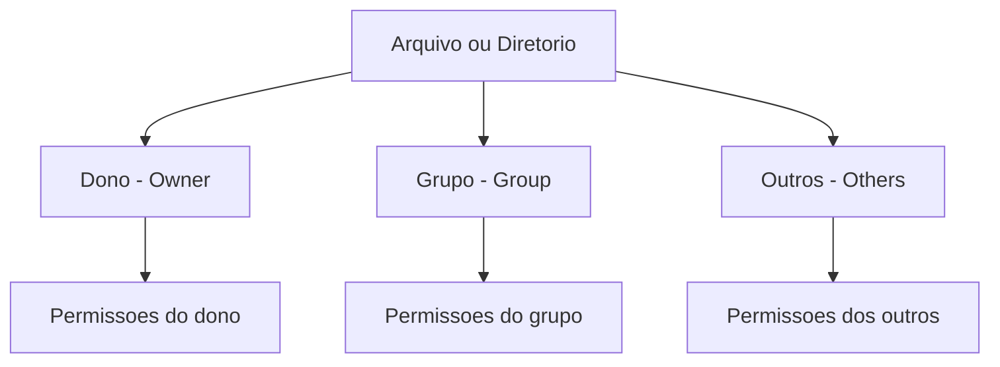
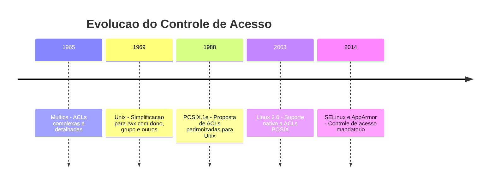

# 2.5 — Permissões de Arquivos e Diretórios: Quem Pode Fazer o Quê

[← Anterior: Estrutura de Diretórios](cap02-mod04-estrutura-diretorios.md) · [Próximo: Gerenciamento de Pacotes →](cap02-mod06-pacotes.md)

---

## Introdução

No módulo anterior, exploramos a estrutura de diretórios do Linux — onde cada tipo de arquivo mora no sistema. Vimos que configurações ficam em `/etc`, programas em `/usr/bin`, arquivos pessoais em `/home` e logs em `/var/log`. Mas surge uma pergunta natural: se tudo está organizado em diretórios acessíveis, o que impede um usuário comum de alterar as configurações do sistema em `/etc`? O que impede a Maria de ler os documentos pessoais do João em `/home/joao`? O que impede um programa malicioso de apagar o kernel em `/boot`?

A resposta é o **sistema de permissões**.

Permissões são as regras que definem **quem pode fazer o quê** com cada arquivo e diretório do sistema. É o sistema de segurança fundamental do Linux — e de qualquer sistema Unix-like. Sem permissões, qualquer usuário poderia ler, modificar ou apagar qualquer arquivo, e o sistema seria completamente inseguro.

Lembre-se do mantra do curso: **"Qual problema você quer resolver?"** O sistema de permissões resolve o problema do **controle de acesso** — garantir que cada pessoa e cada programa só possa fazer aquilo que tem autorização para fazer. Esse conceito é tão fundamental que você vai encontrá-lo em praticamente toda área da tecnologia: bancos de dados têm permissões, APIs têm autenticação e autorização, aplicações web têm controle de acesso baseado em papéis (RBAC). Tudo começa aqui, com as permissões do sistema de arquivos.

Para quem vai programar, entender permissões é essencial por vários motivos:
- Quando seu programa não consegue ler um arquivo, geralmente é um problema de permissão
- Quando você faz deploy de uma aplicação em um servidor, precisa configurar permissões corretamente
- Quando você trabalha com segurança, precisa entender o modelo de controle de acesso
- Quando você escreve scripts, precisa torná-los executáveis

Vamos explorar esse sistema em profundidade, desde o conceito básico até as nuances que fazem diferença no dia a dia de um desenvolvedor.

---

## A Analogia: O Prédio Comercial

Imagine um prédio comercial com vários andares e salas. Cada sala tem uma porta com fechadura, e existem diferentes tipos de acesso:

- Algumas salas são **públicas** — qualquer pessoa pode entrar, olhar e usar (como a recepção)
- Algumas salas são **restritas para leitura** — você pode entrar e olhar, mas não pode mexer em nada (como um museu)
- Algumas salas são **privadas** — só o dono e pessoas autorizadas podem entrar (como escritórios)
- Algumas salas têm **acesso por grupo** — todos os funcionários do departamento de marketing podem entrar, mas os de engenharia não
- O **síndico** (root) tem a chave-mestra que abre todas as portas

No Linux, cada arquivo e diretório é como uma sala desse prédio. Cada um tem regras que definem:
1. **Quem é o dono** (owner) — como o locatário da sala
2. **Qual é o grupo** (group) — como o departamento que tem acesso
3. **O que cada um pode fazer** — ler, escrever ou executar

---

## Os Três Pilares: Dono, Grupo e Outros

Todo arquivo e diretório no Linux tem três níveis de acesso:

### O Dono (Owner/User)

O **dono** é o usuário que criou o arquivo. Por padrão, quando você cria um arquivo, você se torna o dono dele. O dono tem o maior controle sobre o arquivo — pode mudar suas permissões, pode mudar o grupo, e geralmente tem as permissões mais amplas.

Na analogia do prédio: o dono é quem alugou a sala. Ele decide quem pode entrar e o que pode fazer lá dentro.

### O Grupo (Group)

Todo arquivo pertence a um **grupo**. Grupos são conjuntos de usuários que compartilham certas permissões. Por exemplo, todos os desenvolvedores de uma empresa podem pertencer ao grupo `dev`, e todos os arquivos do projeto podem pertencer a esse grupo.

Na analogia do prédio: o grupo é o departamento. Todos os funcionários do departamento de marketing têm acesso às salas do marketing.

### Os Outros (Others)

**Outros** são todos os demais usuários do sistema que não são o dono e não pertencem ao grupo do arquivo. São os "estranhos" — pessoas que não têm nenhuma relação especial com o arquivo.

Na analogia do prédio: os outros são visitantes ou funcionários de outros departamentos.

### Visualizando os Três Níveis



Quando o sistema precisa decidir se um usuário pode acessar um arquivo, ele verifica nesta ordem:
1. O usuário é o **dono**? Se sim, aplica as permissões do dono
2. O usuário pertence ao **grupo** do arquivo? Se sim, aplica as permissões do grupo
3. Se não é nenhum dos dois, aplica as permissões de **outros**

Essa verificação é sequencial e exclusiva — se você é o dono, as permissões do grupo e de outros não se aplicam a você, mesmo que sejam mais permissivas.

---

## As Três Permissões: Ler, Escrever e Executar

Para cada nível (dono, grupo, outros), existem três tipos de permissão:

### Leitura (Read — `r`)

A permissão de **leitura** permite ver o conteúdo. O que isso significa depende se é um arquivo ou diretório:

| Tipo | O que a leitura permite |
|------|------------------------|
| Arquivo | Ver o conteúdo do arquivo - abrir, ler, copiar |
| Diretório | Listar o conteúdo do diretório - ver quais arquivos estao dentro |

### Escrita (Write — `w`)

A permissão de **escrita** permite modificar. Novamente, o significado muda:

| Tipo | O que a escrita permite |
|------|------------------------|
| Arquivo | Modificar o conteúdo, adicionar texto, apagar conteúdo |
| Diretório | Criar, renomear ou apagar arquivos dentro do diretório |

Um detalhe importante: para apagar um arquivo, você precisa de permissão de escrita no **diretório** onde ele está, não no arquivo em si. Isso surpreende muita gente. É como se para remover um móvel de uma sala, você precisasse da chave da sala, não do móvel.

### Execução (Execute — `x`)

A permissão de **execução** permite rodar ou acessar:

| Tipo | O que a execução permite |
|------|--------------------------|
| Arquivo | Executar o arquivo como um programa ou script |
| Diretório | Entrar no diretório - usar cd para acessar |

Para diretórios, a permissão de execução é essencial. Sem ela, você não consegue nem entrar no diretório, mesmo que tenha permissão de leitura. É como ter a lista de salas de um andar, mas não ter o crachá para passar pela porta do andar.

### A Combinação das Três

As três permissões se combinam para cada nível de acesso. Cada permissão pode estar **ligada** ou **desligada**, criando 8 combinações possíveis:

| Leitura | Escrita | Execução | Significado | Uso tipico |
|---------|---------|----------|-------------|------------|
| - | - | - | Nenhum acesso | Arquivo completamente bloqueado |
| r | - | - | Apenas leitura | Documentos publicos, READMEs |
| r | w | - | Leitura e escrita | Arquivos de texto, configurações |
| r | - | x | Leitura e execução | Programas e scripts |
| r | w | x | Acesso total | Dono de scripts e programas |
| - | w | - | Apenas escrita | Raro, usado em logs especiais |
| - | - | x | Apenas execução | Raro, programas sem leitura do código |
| - | w | x | Escrita e execução | Raro, casos muito específicos |

Na prática, as combinações mais comuns são:
- `r--` — apenas leitura (documentos, configurações que não devem ser alteradas)
- `rw-` — leitura e escrita (arquivos de trabalho, configurações editáveis)
- `r-x` — leitura e execução (programas, scripts)
- `rwx` — acesso total (dono de programas e scripts)

---

## Lendo Permissões: O Comando `ls -l`

Agora que entendemos os conceitos, vamos ver como as permissões aparecem na prática. Quando você lista arquivos com `ls -l` (o `-l` significa "long format", ou formato longo), cada linha mostra as permissões:

```
-rwxr-xr-- 1 ana dev 4096 jan 15 10:30 meu-script.sh
drwxr-x--- 2 ana dev 4096 jan 15 10:30 meu-projeto/
```

Vamos decodificar cada parte dessa linha:

```
-rwxr-xr-- 1 ana dev 4096 jan 15 10:30 meu-script.sh
│├──┤├──┤├──┤ │ │   │   │    │         │
│ │   │   │  │ │   │   │    │         └─ Nome do arquivo
│ │   │   │  │ │   │   │    └─ Data de modificacao
│ │   │   │  │ │   │   └─ Tamanho em bytes
│ │   │   │  │ │   └─ Grupo
│ │   │   │  │ └─ Dono
│ │   │   │  └─ Numero de links
│ │   │   └─ Permissoes de outros (r--)
│ │   └─ Permissoes do grupo (r-x)
│ └─ Permissoes do dono (rwx)
└─ Tipo (- = arquivo, d = diretorio)
```

### O Primeiro Caractere: Tipo do Arquivo

O primeiro caractere indica o tipo:

| Caractere | Tipo | Descrição |
|-----------|------|-----------|
| `-` | Arquivo regular | Texto, binário, imagem, etc |
| `d` | Diretório | Pasta |
| `l` | Link simbolico | Atalho para outro arquivo |
| `c` | Dispositivo de caractere | Dispositivos como terminais |
| `b` | Dispositivo de bloco | Dispositivos como discos |
| `p` | Pipe nomeado | Canal de comunicação entre processos |
| `s` | Socket | Ponto de comunicação de rede |

### Os Nove Caracteres de Permissão

Depois do tipo, vêm nove caracteres divididos em três grupos de três:

```
rwx r-x r--
│   │   │
│   │   └─ Outros: podem ler, nao podem escrever nem executar
│   └─ Grupo: podem ler e executar, nao podem escrever
└─ Dono: pode ler, escrever e executar
```

Cada posição pode ter a letra da permissão (r, w ou x) ou um traço (-) indicando que a permissão está desligada.

### Exemplos Práticos de Leitura

Vamos praticar a leitura de permissões com exemplos reais:

| Permissão | Dono | Grupo | Outros | Significado |
|-----------|------|-------|--------|-------------|
| `-rw-r--r--` | Ler e escrever | Apenas ler | Apenas ler | Arquivo de texto comum |
| `-rwxr-xr-x` | Tudo | Ler e executar | Ler e executar | Programa executavel |
| `-rw-------` | Ler e escrever | Nada | Nada | Arquivo privado - chave SSH |
| `drwxr-xr-x` | Tudo | Ler e entrar | Ler e entrar | Diretório público |
| `drwx------` | Tudo | Nada | Nada | Diretório privado |
| `drwxrwxrwt` | Tudo | Tudo | Tudo com sticky | Diretório /tmp |
| `-rwsr-xr-x` | Tudo com SUID | Ler e executar | Ler e executar | Programa com SUID |
| `-rw-rw-r--` | Ler e escrever | Ler e escrever | Apenas ler | Arquivo de projeto compartilhado |

---

## A Notação Octal: Permissões em Números

Além da notação simbólica (rwx), existe uma forma numérica de representar permissões usando o **sistema octal** (base 8). Essa notação é muito usada em comandos e scripts porque é mais compacta.

### Como Funciona

Cada permissão tem um valor numérico:
- **Leitura (r)** = 4
- **Escrita (w)** = 2
- **Execução (x)** = 1
- **Sem permissão (-)** = 0

Para cada nível (dono, grupo, outros), você soma os valores das permissões ativas:

| Permissão | Cálculo | Valor |
|-----------|---------|-------|
| `---` | 0+0+0 | 0 |
| `--x` | 0+0+1 | 1 |
| `-w-` | 0+2+0 | 2 |
| `-wx` | 0+2+1 | 3 |
| `r--` | 4+0+0 | 4 |
| `r-x` | 4+0+1 | 5 |
| `rw-` | 4+2+0 | 6 |
| `rwx` | 4+2+1 | 7 |

### Por que 4, 2 e 1?

Esses números não são arbitrários — são potências de 2: 4 = 2², 2 = 2¹, 1 = 2⁰. Isso vem do sistema binário, onde cada permissão é um **bit** (dígito binário):

| Permissão | Binário | Decimal |
|-----------|---------|---------|
| `---` | 000 | 0 |
| `--x` | 001 | 1 |
| `-w-` | 010 | 2 |
| `-wx` | 011 | 3 |
| `r--` | 100 | 4 |
| `r-x` | 101 | 5 |
| `rw-` | 110 | 6 |
| `rwx` | 111 | 7 |

Cada bit representa uma permissão: o bit mais à esquerda é leitura, o do meio é escrita, o da direita é execução. Se o bit é 1, a permissão está ligada. Se é 0, está desligada.

Esse é um dos primeiros exemplos práticos de como o sistema binário (que vimos no Capítulo 1) é usado na computação real. Não é teoria abstrata — é como o Linux armazena permissões internamente.

### Exemplos de Notação Octal

A permissão completa é representada por três dígitos octais (um para cada nível):

| Simbolica | Octal | Significado | Uso tipico |
|-----------|-------|-------------|------------|
| `rwxr-xr-x` | 755 | Dono tudo, grupo e outros leem e executam | Programas e diretórios publicos |
| `rw-r--r--` | 644 | Dono le e escreve, grupo e outros so leem | Arquivos de texto e configuração |
| `rw-------` | 600 | Só o dono le e escreve | Chaves SSH, senhas |
| `rwx------` | 700 | Só o dono tem acesso total | Diretórios privados |
| `rw-rw-r--` | 664 | Dono e grupo leem e escrevem, outros so leem | Arquivos de projeto |
| `rwxrwxr-x` | 775 | Dono e grupo tudo, outros leem e executam | Diretórios de projeto |
| `rwxrwxrwx` | 777 | Todos podem tudo | PERIGOSO - evitar sempre |

### O Número 777: O Perigo

A permissão `777` (rwxrwxrwx) dá acesso total a todos. É o equivalente a deixar todas as portas do prédio abertas, sem tranca, sem segurança. Nunca use `777` em um servidor de produção. Se alguém sugere "chmod 777" como solução para um problema de permissão, é como sugerir "remova a fechadura" como solução para uma porta trancada — resolve o sintoma, mas cria um problema muito maior.

---

## A História das Permissões Unix

O sistema de permissões do Linux não foi inventado do zero — ele vem diretamente do Unix, criado nos anos 1970. Entender essa história ajuda a entender por que o sistema é como é, incluindo suas limitações.

### Os Primórdios: Multics e a Necessidade de Segurança

Antes do Unix, existia o **Multics** (Multiplexed Information and Computing Service), um sistema operacional dos anos 1960 desenvolvido pelo MIT, Bell Labs e General Electric. O Multics foi um dos primeiros sistemas a implementar controle de acesso sofisticado, com listas de controle de acesso (ACLs) detalhadas para cada arquivo.

O problema? O Multics era extremamente complexo. Ken Thompson e Dennis Ritchie, que trabalharam no projeto Multics nos Bell Labs, decidiram criar algo mais simples. O Unix nasceu dessa simplificação — e o sistema de permissões reflete essa filosofia.

### A Decisão de Thompson e Ritchie

Em vez das ACLs complexas do Multics, Thompson e Ritchie criaram um sistema com apenas três categorias (dono, grupo, outros) e três permissões (ler, escrever, executar). Nove bits no total — extremamente compacto e eficiente.

Essa simplicidade tinha vantagens enormes:
- **Fácil de entender**: qualquer administrador consegue ler e configurar permissões
- **Eficiente**: apenas 9 bits por arquivo (mais alguns bits especiais)
- **Rápido**: a verificação de permissão é uma operação simples de comparação de bits
- **Previsível**: as regras são claras e sem ambiguidade

Mas também tinha limitações:
- **Apenas três categorias**: e se você quiser dar acesso a dois grupos diferentes?
- **Sem granularidade fina**: não dá para dar permissão de leitura para o João mas não para a Maria, se ambos estão no mesmo grupo
- **Sem herança**: permissões de um diretório não são automaticamente aplicadas aos arquivos dentro dele

Essas limitações levaram à criação das ACLs (Access Control Lists) como extensão, que veremos mais adiante neste módulo.



### O Segundo Mantra em Ação

Aqui vemos o segundo mantra do curso em ação: **"Conceitos são para sempre, ferramentas apenas os implementam."** O conceito de controle de acesso — definir quem pode fazer o quê — é permanente. A implementação mudou do Multics (ACLs complexas) para o Unix (rwx simples) e depois evoluiu para incluir ACLs novamente, SELinux e outros mecanismos. O conceito é o mesmo; as ferramentas evoluem.

---

## Alterando Permissões: O Comando `chmod`

O comando `chmod` (abreviação de **change mode**, ou mudar modo) é usado para alterar as permissões de arquivos e diretórios. Existem duas formas de usá-lo: simbólica e octal.

### Forma Octal

A forma mais direta — você específica as permissões como um número de três dígitos:

```
chmod 755 meu-script.sh
```

Isso define:
- Dono: 7 (rwx) — pode tudo
- Grupo: 5 (r-x) — pode ler e executar
- Outros: 5 (r-x) — pode ler e executar

Exemplos comuns:

| Comando | Resultado | Quando usar |
|---------|-----------|-------------|
| `chmod 644 arquivo.txt` | rw-r--r-- | Arquivo de texto normal |
| `chmod 755 script.sh` | rwxr-xr-x | Script executavel |
| `chmod 600 chave.pem` | rw------- | Chave SSH privada |
| `chmod 700 pasta-privada` | rwx------ | Diretório pessoal |
| `chmod 664 projeto.py` | rw-rw-r-- | Arquivo de projeto compartilhado |
| `chmod 775 pasta-projeto` | rwxrwxr-x | Diretório de projeto compartilhado |

### Forma Simbólica

A forma simbólica é mais legível e permite mudanças incrementais — você adiciona ou remove permissões específicas sem afetar as outras:

A sintaxe é: `chmod [quem][operação][permissão] arquivo`

**Quem:**
- `u` — user (dono)
- `g` — group (grupo)
- `o` — others (outros)
- `a` — all (todos)

**Operação:**
- `+` — adicionar permissão
- `-` — remover permissão
- `=` — definir exatamente essas permissões

**Permissão:**
- `r` — leitura
- `w` — escrita
- `x` — execução

Exemplos:

| Comando | O que faz |
|---------|-----------|
| `chmod u+x script.sh` | Adiciona execução para o dono |
| `chmod g+w arquivo.txt` | Adiciona escrita para o grupo |
| `chmod o-r privado.txt` | Remove leitura dos outros |
| `chmod a+r público.txt` | Adiciona leitura para todos |
| `chmod u=rwx,g=rx,o=r arquivo` | Define permissões exatas |
| `chmod go-wx secreto.txt` | Remove escrita e execução de grupo e outros |
| `chmod u+x,g+x script.sh` | Adiciona execução para dono e grupo |

### Quando Usar Cada Forma

| Situação | Forma recomendada | Motivo |
|----------|-------------------|--------|
| Definir permissões do zero | Octal | Mais rápido e preciso |
| Adicionar uma permissão | Simbolica | Não afeta as outras permissões |
| Remover uma permissão | Simbolica | Mais claro e seguro |
| Scripts automatizados | Octal | Mais previsivel e compacto |
| Ensinar ou documentar | Simbolica | Mais legivel para humanos |

### Alterando Permissões Recursivamente

Para alterar permissões de um diretório e todo seu conteúdo, use a flag `-R` (recursivo):

```
chmod -R 755 meu-projeto/
```

Cuidado com `-R` — ele altera TUDO dentro do diretório. Se você usar `chmod -R 755` em um diretório com arquivos de texto e scripts, os arquivos de texto também ficarão executáveis (o que não faz sentido). Uma abordagem melhor é usar comandos separados:

```
# Diretorios: 755 (rwxr-xr-x)
find meu-projeto/ -type d -exec chmod 755 {} \;

# Arquivos: 644 (rw-r--r--)
find meu-projeto/ -type f -exec chmod 644 {} \;

# Scripts: 755 (rwxr-xr-x)
find meu-projeto/ -name "*.sh" -exec chmod 755 {} \;
```

Esse padrão de usar `find` com `-exec` é muito comum em administração de sistemas e você vai usá-lo frequentemente como desenvolvedor.

---

## Alterando Dono e Grupo: `chown` e `chgrp`

Além das permissões, você pode alterar quem é o dono e qual é o grupo de um arquivo.

### O Comando `chown` (Change Owner)

```
chown novo-dono arquivo.txt
chown novo-dono:novo-grupo arquivo.txt
chown :novo-grupo arquivo.txt
```

Exemplos:

| Comando | O que faz |
|---------|-----------|
| `chown ana script.sh` | Ana se torna dona do arquivo |
| `chown ana:dev script.sh` | Ana e dona, grupo dev |
| `chown :dev script.sh` | Muda so o grupo para dev |
| `chown -R ana:dev projeto/` | Muda dono e grupo recursivamente |

Importante: apenas o **root** (administrador) pode mudar o dono de um arquivo. Um usuário comum não pode "dar" seus arquivos para outro usuário — isso é uma medida de segurança para evitar que alguém crie arquivos maliciosos e os atribua a outro usuário.

### O Comando `chgrp` (Change Group)

```
chgrp novo-grupo arquivo.txt
```

O `chgrp` muda apenas o grupo. Um usuário comum pode mudar o grupo de seus próprios arquivos, mas apenas para grupos dos quais ele faz parte.

---

## Usuários e Grupos: A Base do Sistema

Para entender permissões completamente, precisamos entender como usuários e grupos funcionam no Linux.

### Usuários

Cada pessoa (ou serviço) que usa o sistema tem um **usuário**. Cada usuário tem:

| Atributo | Descrição | Exemplo |
|----------|-----------|---------|
| Nome de usuario | Identificador textual | ana, joao, root |
| UID | Número único do usuario | 1000, 1001, 0 |
| Grupo primário | Grupo padrão do usuario | ana, dev, users |
| Home | Diretório pessoal | /home/ana |
| Shell | Programa de terminal padrão | /bin/bash |

O UID (User ID) é o que o sistema realmente usa internamente — o nome é apenas para conveniência humana. O UID 0 é sempre o root (administrador).

### Onde ficam as informações de usuários?

Lembra do módulo anterior, onde vimos que configurações ficam em `/etc`? As informações de usuários estão em dois arquivos:

**`/etc/passwd`** — informações básicas de cada usuário:
```
ana:x:1000:1000:Ana Silva:/home/ana:/bin/bash
```

Os campos, separados por `:`, são:
1. Nome de usuário: `ana`
2. Senha: `x` (indica que a senha está em `/etc/shadow`)
3. UID: `1000`
4. GID (grupo primário): `1000`
5. Nome completo: `Ana Silva`
6. Diretório home: `/home/ana`
7. Shell: `/bin/bash`

**`/etc/shadow`** — senhas criptografadas (só o root pode ler):
```
ana:$6$xyz...hash...:19500:0:99999:7:::
```

A separação entre `/etc/passwd` (legível por todos) e `/etc/shadow` (legível só pelo root) é uma medida de segurança. Antigamente, as senhas ficavam no próprio `/etc/passwd`, mas como qualquer usuário podia ler esse arquivo, as senhas (mesmo criptografadas) ficavam expostas a ataques de força bruta.

### Grupos

Grupos são conjuntos de usuários. Cada usuário tem um **grupo primário** (definido em `/etc/passwd`) e pode pertencer a vários **grupos secundários**.

**`/etc/group`** — definição dos grupos:
```
dev:x:1001:ana,joao,carlos
design:x:1002:maria,pedro
admin:x:1003:ana
```

Os campos são:
1. Nome do grupo: `dev`
2. Senha do grupo: `x` (raramente usado)
3. GID (Group ID): `1001`
4. Membros: `ana,joao,carlos`

### Grupos na Prática

Grupos são extremamente úteis para organizar acesso em equipes:

| Cenário | Grupo | Membros | Permissão nos arquivos |
|---------|-------|---------|------------------------|
| Equipe de desenvolvimento | dev | ana, joao, carlos | rw- nos arquivos de código |
| Equipe de design | design | maria, pedro | rw- nos arquivos de design |
| Administradores | admin | ana | rwx em configurações do servidor |
| Todos os funcionarios | staff | todos | r-- em documentos da empresa |

### A Conexão com Programação

O conceito de usuários e grupos é a base do **RBAC** (Role-Based Access Control, ou Controle de Acesso Baseado em Papéis), que é o modelo de segurança mais usado em aplicações modernas. Quando você cria uma aplicação web com diferentes tipos de usuários (administrador, editor, leitor), está implementando o mesmo conceito que o Linux usa desde os anos 1970 — só que na camada da aplicação em vez do sistema operacional.

---

## O Superusuário: root e sudo

O usuário **root** é o administrador supremo do sistema Linux. Ele tem UID 0 e pode fazer absolutamente tudo — ler qualquer arquivo, modificar qualquer configuração, matar qualquer processo, apagar qualquer coisa. As permissões simplesmente não se aplicam ao root.

### O Poder (e o Perigo) do root

Na analogia do prédio comercial, o root é o síndico com a chave-mestra. Ele pode abrir qualquer porta, entrar em qualquer sala, mudar qualquer fechadura. Isso é necessário para administrar o sistema, mas também é extremamente perigoso — um comando errado como root pode destruir o sistema inteiro.

Por isso, a prática moderna é **nunca ficar logado como root**. Em vez disso, usamos o comando `sudo`.

### O Comando `sudo` (Substitute User Do)

O `sudo` permite que um usuário comum execute um único comando com privilégios de administrador. É como pedir a chave-mestra emprestada para abrir uma porta específica, em vez de ficar com ela o tempo todo.

```
# Sem sudo - falha por falta de permissao
cat /etc/shadow
# Resultado: Permission denied

# Com sudo - funciona porque executa como root
sudo cat /etc/shadow
# Resultado: mostra o conteudo do arquivo
```

O `sudo` pede a senha do **seu próprio usuário** (não a senha do root) e guarda a autenticação por alguns minutos, para que você não precise digitar a senha a cada comando.

### Quem Pode Usar `sudo`?

Nem todo usuário pode usar `sudo`. A configuração fica em `/etc/sudoers`, que define quais usuários e grupos têm permissão para executar comandos como root.

Na maioria das distribuições, o primeiro usuário criado durante a instalação é automaticamente adicionado ao grupo `sudo` (no Debian/Ubuntu) ou `wheel` (no Fedora/CentOS), que tem permissão para usar `sudo`.

| Distribuição | Grupo com acesso sudo | Como adicionar um usuario |
|-------------|----------------------|---------------------------|
| Ubuntu e Debian | sudo | `sudo usermod -aG sudo ana` |
| Fedora e CentOS | wheel | `sudo usermod -aG wheel ana` |
| Arch Linux | wheel | `sudo usermod -aG wheel ana` |

### `sudo` vs Logar como root

| Aspecto | sudo | Login como root |
|---------|------|-----------------|
| Segurança | Cada comando e explicito | Tudo roda como root, fácil errar |
| Rastreabilidade | Logs registram quem usou sudo | Logs mostram apenas root |
| Escopo | Um comando por vez | Sessao inteira com privilegios |
| Risco | Limitado ao comando executado | Qualquer erro pode ser catastrofico |
| Prática moderna | Recomendado | Desencorajado |

### A Conexão com Programação

O princípio por trás do `sudo` é o **princípio do menor privilégio** (Principle of Least Privilege): cada usuário e cada programa deve ter apenas as permissões mínimas necessárias para realizar sua tarefa. Esse princípio é fundamental em segurança de software:

- APIs devem ter tokens com permissões limitadas
- Bancos de dados devem ter usuários com acesso apenas às tabelas necessárias
- Containers Docker devem rodar com usuários não-root
- Aplicações web devem solicitar apenas as permissões que realmente precisam

Quando você ouvir alguém dizer "roda como root que funciona", desconfie. Funcionar não é o mesmo que ser seguro.

---

## Permissões Especiais: SUID, SGID e Sticky Bit

Além das permissões básicas (rwx), o Linux tem três permissões especiais que resolvem problemas específicos.

### SUID (Set User ID)

O **SUID** faz com que um programa execute com as permissões do **dono do arquivo**, não do usuário que o executou. É representado por um `s` no lugar do `x` do dono.

O exemplo clássico é o comando `passwd` (que muda senhas):

```
-rwsr-xr-x 1 root root 68208 jan 15 /usr/bin/passwd
```

Note o `s` em vez de `x` na posição do dono. Isso significa que quando a Ana executa `passwd`, o programa roda com as permissões do root (dono do arquivo), não da Ana. Isso é necessário porque `passwd` precisa escrever em `/etc/shadow`, que só o root pode modificar.

Sem o SUID, usuários comuns não conseguiriam mudar suas próprias senhas — precisariam pedir ao administrador toda vez.

### SGID (Set Group ID)

O **SGID** funciona de forma similar ao SUID, mas para o grupo. Em arquivos executáveis, o programa roda com as permissões do grupo do arquivo. Em diretórios, tem um efeito diferente e muito útil: arquivos criados dentro do diretório herdam o grupo do diretório, não o grupo do usuário que criou.

```
drwxrwsr-x 2 ana dev 4096 jan 15 projeto/
```

O `s` na posição do `x` do grupo indica SGID. Se o João (que pertence ao grupo `dev`) criar um arquivo dentro de `projeto/`, o arquivo terá o grupo `dev` automaticamente, não o grupo pessoal do João. Isso é extremamente útil para projetos compartilhados.

### Sticky Bit

O **Sticky Bit** é usado em diretórios onde todos podem escrever (como `/tmp`), mas cada usuário só pode apagar seus próprios arquivos. É representado por um `t` no lugar do `x` dos outros.

```
drwxrwxrwt 10 root root 4096 jan 15 /tmp
```

Sem o sticky bit, qualquer usuário poderia apagar arquivos de qualquer outro usuário em `/tmp`. Com o sticky bit, a Ana pode criar e apagar seus arquivos em `/tmp`, mas não pode apagar os arquivos do João.

### Resumo das Permissões Especiais

| Permissão | Onde se aplica | Efeito | Representacao | Octal |
|-----------|---------------|--------|---------------|-------|
| SUID | Arquivos executaveis | Executa como o dono do arquivo | s no lugar do x do dono | 4000 |
| SGID | Arquivos e diretórios | Executa como grupo ou herda grupo | s no lugar do x do grupo | 2000 |
| Sticky Bit | Diretórios | Só o dono pode apagar seus arquivos | t no lugar do x dos outros | 1000 |

Na notação octal, as permissões especiais são um quarto dígito à esquerda:

| Octal | Significado |
|-------|-------------|
| 4755 | SUID + rwxr-xr-x |
| 2775 | SGID + rwxrwxr-x |
| 1777 | Sticky + rwxrwxrwx |

---

## O `umask`: Permissões Padrão

Quando você cria um novo arquivo ou diretório, ele recebe permissões padrão. Mas quem define essas permissões? O **umask** (user file-creation mode mask).

### Como Funciona

O umask é uma "máscara" que remove permissões do padrão. O padrão teórico é:
- Arquivos: 666 (rw-rw-rw-) — sem execução por segurança
- Diretórios: 777 (rwxrwxrwx)

O umask é subtraído desse padrão:

| umask | Permissão de arquivos | Permissão de diretórios |
|-------|----------------------|------------------------|
| 022 | 644 (rw-r--r--) | 755 (rwxr-xr-x) |
| 002 | 664 (rw-rw-r--) | 775 (rwxrwxr-x) |
| 077 | 600 (rw-------) | 700 (rwx------) |
| 000 | 666 (rw-rw-rw-) | 777 (rwxrwxrwx) |

O umask padrão na maioria das distribuições é **022**, o que significa:
- Arquivos novos: 644 (dono lê e escreve, grupo e outros só leem)
- Diretórios novos: 755 (dono tudo, grupo e outros leem e entram)

### Verificando e Alterando o umask

```
# Ver o umask atual
umask
# Resultado: 0022

# Mudar o umask para a sessao atual
umask 077

# Agora arquivos novos terao permissao 600
# e diretorios novos terao permissao 700
```

Para tornar a mudança permanente, adicione o comando `umask` ao arquivo `~/.bashrc`.

### A Conexão com Programação

Quando seu programa cria arquivos, as permissões são afetadas pelo umask do processo. Se seu programa cria um arquivo de configuração com dados sensíveis, você deve definir as permissões explicitamente no código, não depender do umask do usuário. Em Python, por exemplo:

```python
import os
# Cria arquivo com permissao 600 (so o dono le e escreve)
fd = os.open('config.yaml', os.O_CREAT | os.O_WRONLY, 0o600)
```

---

## ACLs: Controle de Acesso Avançado

O sistema básico de permissões (dono, grupo, outros) é suficiente para a maioria dos casos, mas às vezes você precisa de mais granularidade. Por exemplo: e se você quiser dar acesso de leitura para a Ana e o João, mas não para o Carlos, e todos estão no mesmo grupo?

Para isso existem as **ACLs** (Access Control Lists, ou Listas de Controle de Acesso).

### O que são ACLs?

ACLs permitem definir permissões para usuários e grupos específicos, além do dono, grupo e outros tradicionais. É como ter uma lista de convidados na porta de cada sala, em vez de apenas "dono", "departamento" e "visitantes".

### Comandos de ACL

| Comando | O que faz | Exemplo |
|---------|-----------|---------|
| `getfacl` | Mostra as ACLs de um arquivo | `getfacl arquivo.txt` |
| `setfacl` | Define ACLs em um arquivo | `setfacl -m u:ana:rw arquivo.txt` |

Exemplos práticos:

```
# Dar permissao de leitura e escrita para a Ana
setfacl -m u:ana:rw arquivo.txt

# Dar permissao de leitura para o grupo design
setfacl -m g:design:r arquivo.txt

# Remover ACL da Ana
setfacl -x u:ana arquivo.txt

# Remover todas as ACLs
setfacl -b arquivo.txt
```

### Quando Usar ACLs

| Situação | Permissões básicas | ACLs |
|----------|-------------------|------|
| Um dono, um grupo, acesso público | Suficiente | Desnecessario |
| Dois grupos precisam de acesso diferente | Insuficiente | Necessário |
| Usuario específico precisa de acesso extra | Insuficiente | Necessário |
| Servidor web com multiplos sites | Pode funcionar | Mais flexível |
| Ambiente corporativo complexo | Limitado | Recomendado |

### A Conexão com Programação

ACLs são a versão do sistema de arquivos do que em aplicações web chamamos de **permissões granulares**. Quando você cria uma aplicação onde o administrador pode definir exatamente quais usuários têm acesso a quais recursos, está implementando o mesmo conceito das ACLs — só que na camada da aplicação.

---

## Permissões na Prática: Cenários Reais

Vamos ver como as permissões se aplicam em situações reais que você vai encontrar como desenvolvedor.

### Cenário 1: Projeto Compartilhado entre Desenvolvedores

Ana, João e Carlos trabalham no mesmo projeto. Queremos que todos possam ler e escrever nos arquivos do projeto, mas outros usuários do sistema não devem ter acesso.

```
# Criar grupo do projeto
sudo groupadd projeto-api

# Adicionar desenvolvedores ao grupo
sudo usermod -aG projeto-api ana
sudo usermod -aG projeto-api joao
sudo usermod -aG projeto-api carlos

# Configurar o diretorio do projeto
sudo chown -R ana:projeto-api /var/www/projeto-api
sudo chmod -R 770 /var/www/projeto-api

# SGID para que novos arquivos herdem o grupo
sudo chmod g+s /var/www/projeto-api
```

### Cenário 2: Servidor Web

Um servidor web (Nginx ou Apache) precisa ler os arquivos do site, mas não deve poder modificá-los. O desenvolvedor precisa poder modificar.

```
# Dono: desenvolvedor, Grupo: www-data (grupo do servidor web)
sudo chown -R ana:www-data /var/www/meusite

# Arquivos: dono le e escreve, grupo so le, outros nada
sudo find /var/www/meusite -type f -exec chmod 640 {} \;

# Diretorios: dono tudo, grupo le e entra, outros nada
sudo find /var/www/meusite -type d -exec chmod 750 {} \;
```

### Cenário 3: Chave SSH

Chaves SSH são extremamente sensíveis — se alguém obtiver sua chave privada, pode acessar todos os servidores onde ela está autorizada. O SSH se recusa a usar chaves com permissões muito abertas.

```
# Diretorio .ssh: so o dono
chmod 700 ~/.ssh

# Chave privada: so o dono le e escreve
chmod 600 ~/.ssh/id_rsa

# Chave publica: dono le e escreve, outros podem ler
chmod 644 ~/.ssh/id_rsa.pub

# Arquivo authorized_keys: so o dono
chmod 600 ~/.ssh/authorized_keys
```

Se as permissões estiverem erradas, o SSH mostra um erro como:
```
WARNING: UNPROTECTED PRIVATE KEY FILE!
Permissions 0644 for '/home/ana/.ssh/id_rsa' are too open.
```

Esse é um dos erros mais comuns que desenvolvedores encontram — e agora você sabe exatamente o que ele significa e como resolver.

### Cenário 4: Script de Deploy

Você criou um script que faz deploy da sua aplicação. Ele precisa ser executável pelo dono e pelo grupo de operações.

```
# Tornar o script executavel para dono e grupo
chmod 750 deploy.sh

# Resultado: rwxr-x---
# Dono: pode ler, escrever e executar
# Grupo: pode ler e executar
# Outros: nenhum acesso
```

---

## Erros Comuns de Permissão e Como Resolver

Aqui estão os erros de permissão mais frequentes que desenvolvedores encontram:

| Erro | Causa provavel | Solução |
|------|---------------|---------|
| Permission denied ao executar script | Falta permissão de execução | `chmod +x script.sh` |
| Permission denied ao ler arquivo | Falta permissão de leitura | `chmod +r arquivo` ou verificar dono |
| Cannot create file | Falta permissão de escrita no diretório | `chmod +w diretório/` |
| SSH key too open | Permissões da chave muito abertas | `chmod 600 ~/.ssh/id_rsa` |
| Nginx 403 Forbidden | Servidor web sem permissão de leitura | Verificar dono e grupo dos arquivos |
| Cannot write to log | Programa sem permissão no diretório de log | `chown app:app /var/log/meuapp/` |
| pip install permission denied | Tentando instalar globalmente sem sudo | Usar `pip install --user` ou virtualenv |

---

## Como a IA pode te ajudar aqui

Permissões podem ser confusas no começo, especialmente a notação octal. A IA é uma ótima parceira para tirar dúvidas práticas:

**Prompt 1 — Explorar o conceito:**
> "Converta a permissão octal 754 para notação simbólica e explique o que cada nível pode fazer"

**Prompt 2 — Aprofundar o tema:**
> "Estou recebendo 'Permission denied' ao tentar executar meu script Python. O que pode estar errado e como resolvo?"

**Prompt 3 — Praticar com projetos:**
> "Quais permissões devo configurar para um diretório de projeto onde três desenvolvedores precisam colaborar, mas outros usuários não devem ter acesso?"

---

## Resumo do Módulo

| Conceito | Definição |
|----------|-----------|
| Permissão | Regra que define quem pode fazer o que com um arquivo ou diretório |
| Dono - Owner | Usuario que criou ou possui o arquivo |
| Grupo - Group | Conjunto de usuarios que compartilham permissões |
| Outros - Others | Todos os usuarios que não são dono nem pertencem ao grupo |
| Leitura - r | Permissão para ver o conteúdo |
| Escrita - w | Permissão para modificar o conteúdo |
| Execução - x | Permissão para executar como programa ou entrar em diretório |
| Notação octal | Representacao numerica de permissões usando base 8 |
| chmod | Comando para alterar permissões |
| chown | Comando para alterar dono e grupo |
| root | Superusuario com acesso total ao sistema |
| sudo | Comando para executar ações como administrador |
| SUID | Permissão especial que executa programa como o dono do arquivo |
| SGID | Permissão especial que herda grupo do diretório |
| Sticky Bit | Permissão que impede usuarios de apagar arquivos de outros |
| umask | Mascara que define permissões padrão de novos arquivos |
| ACL | Lista de controle de acesso para permissões granulares |
| Principio do menor privilegio | Dar apenas as permissões minimas necessárias |

---

## Glossário do Módulo

| Termo | Definição |
|-------|-----------|
| ACL | Access Control List - lista de controle de acesso com permissões granulares |
| AppArmor | Sistema de controle de acesso mandatorio usado no Ubuntu |
| chmod | Change mode - comando para alterar permissões de arquivos |
| chgrp | Change group - comando para alterar o grupo de um arquivo |
| chown | Change owner - comando para alterar o dono de um arquivo |
| GID | Group ID - número único que identifica cada grupo no sistema |
| Group | Grupo - conjunto de usuarios que compartilham permissões |
| Octal | Sistema numerico de base 8, usado para representar permissões |
| Others | Outros - todos os usuarios que não são dono nem do grupo |
| Owner | Dono - usuario proprietario de um arquivo ou diretório |
| Permission denied | Permissão negada - erro quando você tenta algo sem autorização |
| POSIX | Portable Operating System Interface - padrão de compatibilidade Unix |
| RBAC | Role-Based Access Control - controle de acesso baseado em papeis |
| Root | Superusuario com UID 0 e acesso total ao sistema |
| SELinux | Security-Enhanced Linux - sistema de controle de acesso mandatorio |
| SGID | Set Group ID - permissão especial para herança de grupo |
| Sticky Bit | Permissão especial que protege arquivos em diretórios compartilhados |
| SUID | Set User ID - permissão especial para execução como dono |
| sudo | Substitute User Do - comando para executar como administrador |
| UID | User ID - número único que identifica cada usuario no sistema |
| umask | User file-creation mode mask - mascara de permissões padrão |

---

## Na Cultura Popular

- **Mr. Robot** (série, 2015-2019) — várias cenas mostram o protagonista usando `chmod`, `sudo` e manipulando permissões para ganhar acesso a sistemas. A série é notável por mostrar comandos Linux reais e cenários de segurança plausíveis, incluindo escalação de privilégios (quando um atacante consegue permissões de root a partir de um usuário comum).

- **WarGames** (filme, 1983) — embora anterior ao Linux, o filme mostra um jovem hacker que consegue acesso a um computador militar por falhas de controle de acesso. O conceito central — alguém acessando algo que não deveria — é exatamente o problema que permissões resolvem.

- **Hackers** (filme, 1995) — retrata a cultura hacker dos anos 90 e, embora com muita licença artística, toca em conceitos reais de controle de acesso, escalação de privilégios e a importância de configurar permissões corretamente em servidores.

---

## Para Saber Mais

- *Linux File Permissions Explained — Linuxize* — https://linuxize.com/post/understanding-linux-file-permissions/ — *guia prático e detalhado sobre permissões com exemplos*
- *chmod Calculator — online tool* — https://chmod-calculator.com/ — *ferramenta visual para converter entre notação simbólica e octal*
- *The Linux Command Line — capítulo sobre permissões* — https://linuxcommand.org/tlcl.php — *explicação completa no contexto de uso do terminal*
- *Repositório do Fino — learn-ops-content* — https://github.com/RafaelFino/learn-ops-content — *material complementar sobre administração Linux*
- *Arch Wiki — File permissions and attributes* — https://wiki.archlinux.org/title/File_permissions_and_attributes — *referência técnica completa mantida pela comunidade*

---

## Perguntas Frequentes (FAQ)

**P: Se eu sou o dono de um arquivo mas removi minha permissão de leitura, consigo ler o arquivo?**
R: Não. Mesmo sendo o dono, se você removeu a permissão de leitura (`chmod u-r arquivo`), não consegue ler. Mas como dono, você pode restaurar a permissão a qualquer momento (`chmod u+r arquivo`). O root, por outro lado, ignora todas as permissões e sempre consegue ler.

**P: Qual a diferença entre `sudo su` e `sudo -i`?**
R: Ambos abrem um shell como root, mas `sudo -i` simula um login completo (carrega o ambiente do root), enquanto `sudo su` apenas troca o usuário. Na prática, `sudo -i` é mais previsível. Mas o ideal é usar `sudo` com comandos específicos em vez de abrir um shell root inteiro.

**P: Por que o SSH reclama de permissões "too open" na chave privada?**
R: Porque uma chave privada com permissões abertas (como 644) pode ser lida por outros usuários do sistema. Se alguém copiar sua chave, pode acessar todos os servidores onde ela está autorizada. O SSH exige permissão 600 (só o dono lê e escreve) como medida de segurança. É uma proteção contra você mesmo — evita que você acidentalmente exponha suas chaves.

**P: O que acontece se eu fizer `chmod 000` em um arquivo?**
R: Ninguém (exceto o root) consegue ler, escrever ou executar o arquivo. Mas como dono, você ainda pode mudar as permissões de volta com `chmod`. O arquivo não é apagado — ele continua existindo, apenas inacessível.

**P: Posso ter um arquivo que todos podem executar mas ninguém pode ler?**
R: Sim, com permissão `--x--x--x` (111). O sistema executa o programa sem permitir que o código-fonte seja lido. Isso é raro mas possível para binários compilados. Para scripts (Python, Bash), não funciona na prática porque o interpretador precisa ler o arquivo para executá-lo.

**P: O que é "escalação de privilégios" que aparece em notícias de segurança?**
R: É quando um atacante consegue obter permissões maiores do que deveria ter — por exemplo, começar como usuário comum e conseguir acesso de root. Isso pode acontecer por bugs em programas com SUID, falhas no kernel ou configurações incorretas de sudo. É um dos tipos mais graves de vulnerabilidade de segurança.

**P: Por que não devo usar `chmod 777` para resolver problemas de permissão?**
R: Porque `chmod 777` dá acesso total a todos os usuários do sistema. É como resolver o problema de uma porta trancada removendo a fechadura — funciona, mas agora qualquer pessoa pode entrar. A solução correta é identificar qual permissão está faltando e concedê-la apenas para quem precisa.

**P: Permissões de diretório e de arquivo são independentes?**
R: Sim. Você pode ter permissão de leitura em um arquivo mas não ter permissão de execução no diretório onde ele está — nesse caso, não consegue acessar o arquivo. Para acessar um arquivo, você precisa de permissão de execução (x) em todos os diretórios do caminho até ele.

**P: Como descubro a quais grupos eu pertenço?**
R: Use o comando `groups` (mostra seus grupos) ou `id` (mostra UID, GID e todos os grupos). Por exemplo, `groups ana` mostra todos os grupos da Ana. Isso é útil para diagnosticar problemas de permissão — se você não consegue acessar um arquivo do grupo `dev`, verifique se você pertence a esse grupo.

**P: O que é o "princípio do menor privilégio" na prática?**
R: Significa dar apenas as permissões mínimas necessárias. Se um programa só precisa ler um arquivo, dê apenas leitura (r), não leitura e escrita (rw). Se um usuário só precisa acessar uma pasta, não dê acesso ao sistema inteiro. Esse princípio reduz o impacto de erros e ataques — se algo der errado, o dano é limitado.

---

## Exercícios Práticos

**Exercício 1 — Decodificando Permissões**

Para cada permissão abaixo, escreva:
1. O que o dono pode fazer
2. O que o grupo pode fazer
3. O que os outros podem fazer
4. Um cenário onde essa permissão faria sentido

Permissões para decodificar:
- `-rw-r--r--`
- `-rwxr-x---`
- `drwxrwxr-x`
- `-rw-------`
- `-rwsr-xr-x`
- `drwxrwxrwt`

**Exercício 2 — Convertendo entre Notações**

Converta as seguintes permissões:
1. Simbólica para octal: `rwxr-xr--`
2. Simbólica para octal: `rw-rw----`
3. Octal para simbólica: 755
4. Octal para simbólica: 640
5. Octal para simbólica: 700
6. Simbólica para octal: `rwxrwxrwx`

Depois, para cada uma, descreva um cenário real onde essa permissão seria apropriada.

**Exercício 3 — Planejando Permissões para um Projeto**

Você está configurando um servidor Linux para uma pequena empresa com três equipes:
- Equipe de desenvolvimento (3 pessoas): precisa ler e escrever código
- Equipe de design (2 pessoas): precisa ler o código e escrever na pasta de assets
- Equipe de gestão (2 pessoas): precisa apenas ler relatórios

Planeje:
1. Quais grupos você criaria?
2. Quais permissões cada diretório teria?
3. Como garantiria que novos arquivos herdem o grupo correto?
4. Quais comandos usaria para configurar tudo?

**Exercício 4 — Pesquisa: Segurança e Permissões**

Pesquise sobre um caso real de falha de segurança causada por permissões incorretas (dica: busque por "privilege escalation Linux CVE"). Descreva:
1. O que aconteceu
2. Qual era o problema de permissão
3. Como foi corrigido
4. Como o princípio do menor privilégio teria prevenido o problema

**Exercício 5 — Reflexão: Controle de Acesso na Vida Real**

O conceito de permissões existe em muitos lugares fora da tecnologia. Escreva um texto curto comparando o sistema de permissões do Linux com um destes exemplos:
1. O sistema de chaves e fechaduras de um hotel (cartão do quarto, chave-mestra do andar, chave-mestra geral)
2. As permissões em um documento do Google Docs (visualizar, comentar, editar, dono)
3. Os níveis de acesso em um hospital (paciente, enfermeiro, médico, administrador)

Para cada comparação, identifique: quem é o "dono", quem é o "grupo", quem são os "outros", e o que seria o equivalente ao "root".

---

[← Anterior: Estrutura de Diretórios](cap02-mod04-estrutura-diretorios.md) · [Próximo: Gerenciamento de Pacotes →](cap02-mod06-pacotes.md)
