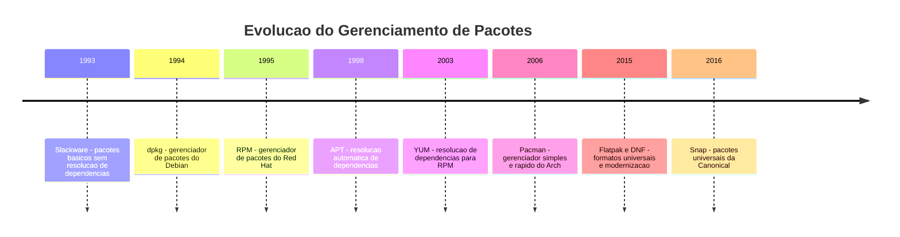
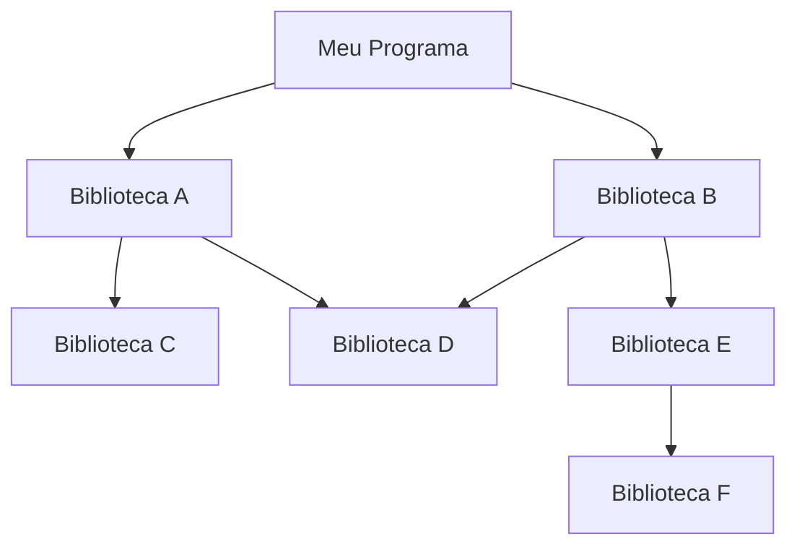
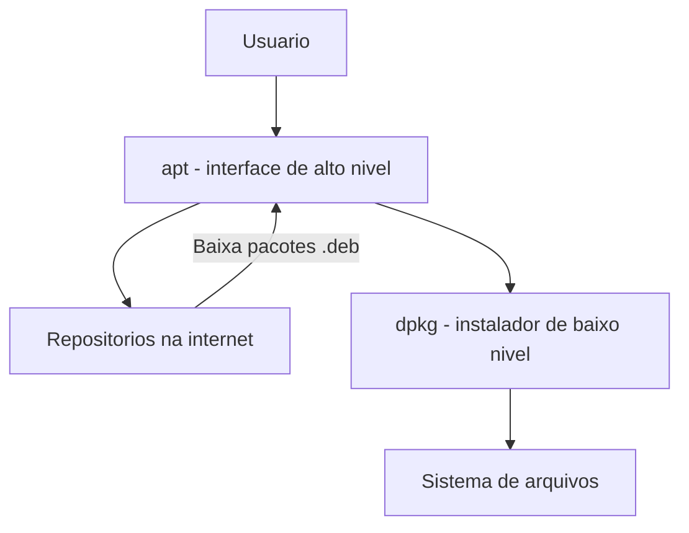
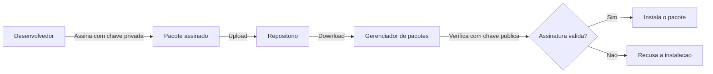

# 2.6 — Gerenciamento de Pacotes: Instalando e Atualizando Software

[← Anterior: Permissões](cap02-mod05-permissoes.md) · [Próximo: Usuários, Grupos e Serviços →](cap02-mod07-usuarios-servicos.md)

---

## Introdução

No módulo anterior, aprendemos que o Linux tem um sistema de permissões que controla quem pode fazer o quê com cada arquivo. Vimos que programas ficam em `/usr/bin`, configurações em `/etc` e bibliotecas em `/usr/lib`. Mas como esses programas chegam lá? Como você instala um editor de texto, um servidor web ou uma linguagem de programação no Linux?

No Windows, a resposta geralmente é: você vai ao site do programa, baixa um instalador `.exe`, clica em "Próximo" várias vezes e torce para não instalar uma barra de ferramentas indesejada junto. No macOS, você baixa um `.dmg`, arrasta o ícone para a pasta Aplicativos e pronto.

No Linux, existe uma forma muito mais elegante e poderosa: o **gerenciador de pacotes**.

Lembre-se do mantra do curso: **"Qual problema você quer resolver?"** O gerenciador de pacotes resolve vários problemas de uma vez:
- **Instalação**: baixa e instala programas com um único comando
- **Dependências**: identifica e instala automaticamente tudo que o programa precisa para funcionar
- **Atualização**: atualiza todos os programas instalados de uma vez
- **Remoção**: desinstala programas limpamente, sem deixar lixo
- **Segurança**: verifica a autenticidade dos pacotes com assinaturas digitais
- **Consistência**: garante que versões compatíveis de bibliotecas estejam instaladas

Para quem vai programar, entender gerenciamento de pacotes é fundamental. Você vai instalar compiladores, interpretadores, bibliotecas, ferramentas de build, servidores e muito mais. Além disso, o conceito de gerenciamento de pacotes se estende para linguagens de programação — Python tem o `pip`, JavaScript tem o `npm`, Rust tem o `cargo`. Todos seguem a mesma filosofia que nasceu no Linux.

---

## A Analogia: A Loja de Materiais de Construção

Imagine que você está construindo uma casa. Você precisa de tijolos, cimento, areia, tubos, fios elétricos e muitos outros materiais. Existem duas formas de conseguir tudo isso:

**Forma 1 — Sem gerenciador (como no Windows):**
Você vai a diferentes lojas, compra cada material separadamente, carrega tudo no carro, verifica se os materiais são compatíveis entre si (o tubo encaixa na conexão? o fio aguenta a voltagem?), e se algo faltar, volta à loja. Se precisar atualizar algo (trocar um tubo por um mais resistente), tem que fazer tudo manualmente.

**Forma 2 — Com gerenciador (como no Linux):**
Você tem um catálogo centralizado com todos os materiais disponíveis. Você diz "preciso de um banheiro completo" e o sistema automaticamente identifica tudo que é necessário (vaso, pia, tubos, conexões, registros), verifica compatibilidade, entrega tudo junto e instala. Se precisar atualizar, um comando atualiza tudo de uma vez.

O gerenciador de pacotes é essa segunda forma. Ele é o intermediário inteligente entre você e os milhares de programas disponíveis para Linux.

---

## O que é um Pacote?

Antes de falar sobre gerenciadores, precisamos entender o que é um **pacote**.

Um pacote é um arquivo compactado que contém:
1. **O programa em si** — os arquivos executáveis (binários)
2. **Bibliotecas necessárias** — ou referências a elas
3. **Arquivos de configuração** — templates de configuração padrão
4. **Documentação** — páginas de manual, READMEs
5. **Metadados** — nome, versão, descrição, autor, dependências
6. **Scripts de instalação** — comandos que rodam antes e depois da instalação

É como uma caixa de um produto: dentro tem o produto, o manual de instruções, os parafusos necessários e uma lista do que mais você precisa ter para usar.

### Formatos de Pacote

Diferentes famílias de distribuições usam diferentes formatos de pacote:

| Formato | Extensão | Familia | Distribuicoes |
|---------|----------|---------|---------------|
| DEB | .deb | Debian | Debian, Ubuntu, Linux Mint, Pop!_OS |
| RPM | .rpm | Red Hat | Fedora, CentOS, RHEL, openSUSE |
| PKG | .pkg.tar.zst | Arch | Arch Linux, Manjaro, EndeavourOS |
| Flatpak | .flatpak | Universal | Qualquer distribuição |
| Snap | .snap | Universal | Qualquer distribuição, foco Ubuntu |
| AppImage | .AppImage | Universal | Qualquer distribuição |

Os três primeiros (DEB, RPM, PKG) são formatos **nativos** — específicos de cada família de distribuição. Os três últimos (Flatpak, Snap, AppImage) são formatos **universais** — funcionam em qualquer distribuição. Vamos explorar ambos.

---

## A História do Gerenciamento de Pacotes

O gerenciamento de pacotes no Linux tem uma história rica que ajuda a entender por que existem tantas opções hoje.

### Os Primórdios: Instalação Manual (anos 1990)

Nos primeiros anos do Linux, instalar software era um processo manual e doloroso. Você precisava:

1. Baixar o código-fonte do programa
2. Ler o arquivo README para descobrir as dependências
3. Instalar cada dependência manualmente (que por sua vez tinha suas próprias dependências)
4. Compilar o código-fonte com `./configure && make && make install`
5. Torcer para que tudo funcionasse

Esse processo era chamado de **compilar do fonte** (compile from source) e ainda existe hoje, mas é reservado para casos especiais. O problema era óbvio: era lento, propenso a erros e exigia conhecimento técnico significativo.

### 1993-1995: Os Primeiros Gerenciadores

O Slackware (1993) foi uma das primeiras distribuições a ter um sistema básico de pacotes, mas sem resolução automática de dependências. Você instalava pacotes, mas se faltasse uma biblioteca, o erro só aparecia quando tentava rodar o programa.

O **dpkg** (Debian Package) surgiu em 1994 com o Debian, e o **RPM** (Red Hat Package Manager) surgiu em 1995 com o Red Hat. Ambos resolviam o problema de instalar e remover pacotes de forma organizada, mas ainda não resolviam dependências automaticamente.

### 1998-2002: A Revolução da Resolução de Dependências

O grande salto veio com ferramentas que resolviam dependências automaticamente:

- **APT** (Advanced Package Tool) — criado em 1998 para o Debian. Quando você pede para instalar o programa X, o APT descobre que X precisa das bibliotecas A, B e C, que por sua vez precisam de D e E, e instala tudo automaticamente na ordem correta.

- **YUM** (Yellowdog Updater Modified) — criado em 2003 para distribuições Red Hat. Fazia o mesmo que o APT, mas para pacotes RPM.

### 2010-presente: A Era Moderna

- **DNF** (Dandified YUM) — substituto moderno do YUM, usado no Fedora desde 2015
- **Pacman** — gerenciador do Arch Linux, conhecido pela simplicidade e velocidade
- **Flatpak** (2015) e **Snap** (2016) — formatos universais que funcionam em qualquer distribuição



---

## O Conceito de Repositório

Um **repositório** (ou **repo**) é um servidor na internet que armazena milhares de pacotes prontos para instalação. É como um catálogo gigante de software — quando você pede para instalar algo, o gerenciador de pacotes consulta os repositórios configurados, encontra o pacote e o baixa.

### Como Funcionam os Repositórios

Cada distribuição mantém seus próprios repositórios oficiais. Quando você instala o Ubuntu, por exemplo, ele já vem configurado para usar os repositórios da Canonical (empresa por trás do Ubuntu). Esses repositórios contêm dezenas de milhares de pacotes testados e verificados.

| Distribuição | Repositórios oficiais | Quantidade aproximada de pacotes |
|-------------|----------------------|----------------------------------|
| Debian | main, contrib, non-free | 60.000+ |
| Ubuntu | main, universe, restricted, multiverse | 80.000+ |
| Fedora | fedora, updates | 60.000+ |
| Arch Linux | core, extra, community | 13.000+ no oficial, 80.000+ no AUR |

### Repositórios Oficiais vs Terceiros

Além dos repositórios oficiais, você pode adicionar repositórios de terceiros — chamados de **PPAs** (Personal Package Archives) no Ubuntu ou **COPR** no Fedora. Isso é útil quando um programa não está nos repositórios oficiais ou quando você precisa de uma versão mais recente.

Porém, repositórios de terceiros devem ser usados com cautela:

| Aspecto | Repositório oficial | Repositório de terceiros |
|---------|--------------------|--------------------------| 
| Confiabilidade | Alta - testado pela distribuição | Variável - depende do mantenedor |
| Segurança | Assinado digitalmente | Pode não ter verificacao |
| Compatibilidade | Garantida com a distribuição | Pode causar conflitos |
| Atualizacoes | Seguem o ciclo da distribuição | Podem ser irregulares |

### A Conexão com Programação

O conceito de repositório é universal na programação:
- **PyPI** (Python Package Index) é o repositório do Python — onde `pip` busca pacotes
- **npm registry** é o repositório do JavaScript/Node.js
- **crates.io** é o repositório do Rust
- **Maven Central** é o repositório do Java
- **NuGet** é o repositório do .NET/C#
- **Docker Hub** é o repositório de imagens Docker

Todos seguem o mesmo padrão: um servidor central com pacotes verificados que uma ferramenta local consulta e baixa automaticamente.

---

## O Problema das Dependências

Um dos maiores desafios do gerenciamento de software é o **problema das dependências**. Quase nenhum programa funciona sozinho — ele depende de bibliotecas, ferramentas e outros programas.

### O que são Dependências?

Uma **dependência** é algo que um programa precisa para funcionar. Por exemplo:
- O Firefox (navegador) depende de bibliotecas gráficas (GTK), bibliotecas de rede (OpenSSL) e muitas outras
- O Python depende da biblioteca C padrão (glibc) e de bibliotecas de matemática
- O Nginx (servidor web) depende de bibliotecas de criptografia (OpenSSL) e de compressão (zlib)

E as dependências podem ter suas próprias dependências, criando uma **árvore de dependências**:



### O Inferno das Dependências (Dependency Hell)

O **dependency hell** acontece quando:
1. O programa A precisa da biblioteca X versão 2.0
2. O programa B precisa da biblioteca X versão 1.0
3. As versões 1.0 e 2.0 são incompatíveis
4. Você não consegue ter as duas instaladas ao mesmo tempo

Esse problema atormentou administradores de sistemas por décadas. No Windows, era conhecido como **DLL Hell** — quando diferentes programas precisavam de versões diferentes da mesma DLL.

O gerenciador de pacotes do Linux resolve isso (na maioria dos casos) mantendo um banco de dados de todas as versões instaladas e verificando compatibilidade antes de instalar qualquer coisa. Se detectar um conflito, ele avisa antes de fazer qualquer mudança.

---

## APT: O Gerenciador do Debian e Ubuntu

O **APT** (Advanced Package Tool) é o gerenciador de pacotes mais popular do mundo Linux, usado pelo Debian, Ubuntu e todas as suas derivadas. Como Ubuntu é a distribuição mais usada em desktops e servidores, APT é provavelmente o gerenciador que você mais vai usar.

### Arquitetura do APT

O APT é na verdade uma camada sobre o `dpkg` (o instalador de pacotes de baixo nível do Debian):



- **dpkg**: instala e remove pacotes `.deb` individuais, mas não resolve dependências
- **apt**: consulta repositórios, resolve dependências e usa o dpkg para instalar

### Comandos Essenciais do APT

| Comando | O que faz | Quando usar |
|---------|-----------|-------------|
| `sudo apt update` | Atualiza a lista de pacotes disponiveis | Antes de instalar ou atualizar qualquer coisa |
| `sudo apt install pacote` | Instala um pacote e suas dependências | Quando precisa de um programa novo |
| `sudo apt remove pacote` | Remove um pacote mas mantem configurações | Quando não precisa mais do programa |
| `sudo apt purge pacote` | Remove pacote e suas configurações | Remoção completa |
| `sudo apt upgrade` | Atualiza todos os pacotes instalados | Manter o sistema atualizado |
| `sudo apt full-upgrade` | Atualiza com resolução de conflitos | Atualizacoes maiores |
| `sudo apt autoremove` | Remove dependências orfas | Limpar pacotes que não são mais necessários |
| `apt search termo` | Busca pacotes por nome ou descrição | Encontrar um pacote |
| `apt show pacote` | Mostra detalhes de um pacote | Ver informações antes de instalar |
| `apt list --installed` | Lista pacotes instalados | Ver o que esta instalado |

Note que comandos que modificam o sistema (install, remove, upgrade) precisam de `sudo`, mas comandos de consulta (search, show, list) não.

### Exemplo Prático: Instalando o Git

Vamos ver um exemplo real de instalação. O Git (que veremos em detalhes no Capítulo 4) é uma ferramenta essencial para desenvolvedores:

```
# Passo 1: Atualizar a lista de pacotes
sudo apt update

# Passo 2: Instalar o Git
sudo apt install git

# O APT mostra o que vai instalar:
# Os seguintes pacotes NOVOS serão instalados:
#   git git-man liberror-perl
# 0 atualizados, 3 recém-instalados, 0 a remover
# É preciso baixar 6.842 kB de arquivos.
# Deseja continuar? [S/n]

# Passo 3: Verificar a instalação
git --version
# git version 2.43.0
```

Note que o APT identificou que o Git precisa de `git-man` (páginas de manual) e `liberror-perl` (uma biblioteca Perl) e instalou tudo automaticamente.

### O Arquivo `/etc/apt/sources.list`

A configuração dos repositórios do APT fica em `/etc/apt/sources.list` e nos arquivos dentro de `/etc/apt/sources.list.d/`. Lembra que no módulo de estrutura de diretórios vimos que configurações ficam em `/etc`? Aqui está um exemplo prático.

Um repositório típico do Ubuntu se parece com:
```
deb http://archive.ubuntu.com/ubuntu noble main restricted universe multiverse
```

Os campos são:
- `deb` — tipo de pacote (binário)
- `http://archive.ubuntu.com/ubuntu` — URL do repositório
- `noble` — codinome da versão do Ubuntu (24.04)
- `main restricted universe multiverse` — componentes (categorias de pacotes)

---

## DNF: O Gerenciador do Fedora e Red Hat

O **DNF** (Dandified YUM) é o gerenciador de pacotes das distribuições da família Red Hat — Fedora, CentOS Stream, RHEL (Red Hat Enterprise Linux) e Rocky Linux. Se você trabalhar em ambientes corporativos, provavelmente vai encontrar o DNF.

### Comandos Essenciais do DNF

| Comando | O que faz | Equivalente no APT |
|---------|-----------|---------------------|
| `sudo dnf check-update` | Verifica atualizacoes disponiveis | `sudo apt update` |
| `sudo dnf install pacote` | Instala um pacote | `sudo apt install pacote` |
| `sudo dnf remove pacote` | Remove um pacote | `sudo apt remove pacote` |
| `sudo dnf upgrade` | Atualiza todos os pacotes | `sudo apt upgrade` |
| `sudo dnf autoremove` | Remove dependências orfas | `sudo apt autoremove` |
| `dnf search termo` | Busca pacotes | `apt search termo` |
| `dnf info pacote` | Mostra detalhes | `apt show pacote` |
| `dnf list installed` | Lista instalados | `apt list --installed` |

Como você pode ver, os comandos são muito parecidos. A lógica é a mesma — só a sintaxe muda um pouco.

---

## Pacman: O Gerenciador do Arch Linux

O **Pacman** é o gerenciador de pacotes do Arch Linux e suas derivadas (Manjaro, EndeavourOS). É conhecido pela simplicidade e velocidade — usa flags curtas em vez de subcomandos longos.

### Comandos Essenciais do Pacman

| Comando | O que faz | Equivalente no APT |
|---------|-----------|---------------------|
| `sudo pacman -Syu` | Atualiza sistema completo | `sudo apt update && sudo apt upgrade` |
| `sudo pacman -S pacote` | Instala um pacote | `sudo apt install pacote` |
| `sudo pacman -R pacote` | Remove um pacote | `sudo apt remove pacote` |
| `sudo pacman -Rs pacote` | Remove pacote e dependências orfas | `sudo apt remove pacote && sudo apt autoremove` |
| `pacman -Ss termo` | Busca pacotes | `apt search termo` |
| `pacman -Si pacote` | Mostra detalhes | `apt show pacote` |
| `pacman -Q` | Lista instalados | `apt list --installed` |

### O AUR (Arch User Repository)

O Arch Linux tem um recurso único: o **AUR** (Arch User Repository), um repositório mantido pela comunidade com mais de 80.000 pacotes. Qualquer usuário pode submeter pacotes para o AUR. Não é oficial, mas é extremamente popular e cobre praticamente qualquer software que você possa precisar.

Para usar o AUR, você precisa de um **AUR helper** como o `yay` ou `paru`, que automatiza o processo de baixar, compilar e instalar pacotes do AUR.

---

## Comparação Completa dos Gerenciadores

| Operação | APT - Debian e Ubuntu | DNF - Fedora e Red Hat | Pacman - Arch |
|----------|----------------------|------------------------|---------------|
| Atualizar lista | `apt update` | `dnf check-update` | `pacman -Sy` |
| Instalar | `apt install X` | `dnf install X` | `pacman -S X` |
| Remover | `apt remove X` | `dnf remove X` | `pacman -R X` |
| Atualizar tudo | `apt upgrade` | `dnf upgrade` | `pacman -Syu` |
| Buscar | `apt search X` | `dnf search X` | `pacman -Ss X` |
| Info | `apt show X` | `dnf info X` | `pacman -Si X` |
| Listar instalados | `apt list --installed` | `dnf list installed` | `pacman -Q` |
| Limpar cache | `apt clean` | `dnf clean all` | `pacman -Sc` |
| Limpar orfaos | `apt autoremove` | `dnf autoremove` | `pacman -Rns $(pacman -Qdtq)` |

O segundo mantra do curso se aplica perfeitamente aqui: **"Conceitos são para sempre, ferramentas apenas os implementam."** O conceito de gerenciamento de pacotes é o mesmo em todas as distribuições — instalar, remover, atualizar, buscar, resolver dependências. As ferramentas (APT, DNF, Pacman) são apenas implementações diferentes do mesmo conceito.

---

## Pacotes Universais: Flatpak, Snap e AppImage

Os gerenciadores tradicionais (APT, DNF, Pacman) são específicos de cada família de distribuição. Isso significa que um desenvolvedor que quer distribuir seu programa para todas as distribuições precisa criar pacotes `.deb`, `.rpm` e PKG separadamente. Para resolver esse problema, surgiram os **pacotes universais**.

### Flatpak

O **Flatpak** é um sistema de empacotamento que funciona em qualquer distribuição Linux. Cada aplicativo Flatpak roda em um **sandbox** (ambiente isolado), com suas próprias bibliotecas e dependências. Isso elimina conflitos de versão.

O repositório principal do Flatpak é o **Flathub** (flathub.org), que tem milhares de aplicativos.

| Comando | O que faz |
|---------|-----------|
| `flatpak install flathub com.spotify.Client` | Instala o Spotify via Flathub |
| `flatpak run com.spotify.Client` | Executa o Spotify |
| `flatpak update` | Atualiza todos os Flatpaks |
| `flatpak list` | Lista Flatpaks instalados |
| `flatpak uninstall com.spotify.Client` | Remove o Spotify |

### Snap

O **Snap** é o sistema de pacotes universais da Canonical (empresa do Ubuntu). Similar ao Flatpak, cada Snap roda em um ambiente isolado. O repositório central é o **Snap Store**.

| Comando | O que faz |
|---------|-----------|
| `sudo snap install spotify` | Instala o Spotify |
| `snap run spotify` | Executa o Spotify |
| `sudo snap refresh` | Atualiza todos os Snaps |
| `snap list` | Lista Snaps instalados |
| `sudo snap remove spotify` | Remove o Spotify |

### AppImage

O **AppImage** é a abordagem mais simples: um único arquivo executável que contém tudo que o programa precisa. Não precisa de instalação — você baixa, dá permissão de execução e roda.

```
# Baixar o AppImage
wget https://exemplo.com/MeuApp.AppImage

# Dar permissao de execucao
chmod +x MeuApp.AppImage

# Executar
./MeuApp.AppImage
```

### Comparação dos Formatos Universais

| Aspecto | Flatpak | Snap | AppImage |
|---------|---------|------|----------|
| Isolamento | Sandbox com permissões | Sandbox com confinamento | Nenhum |
| Repositório central | Flathub | Snap Store | Não tem - cada app distribui o seu |
| Atualização automática | Sim | Sim | Depende do app |
| Tamanho | Medio a grande | Medio a grande | Variável |
| Tempo de inicio | Rápido | Pode ser lento na primeira vez | Rápido |
| Integração com desktop | Boa | Boa | Variável |
| Quem controla | Comunidade | Canonical | Desenvolvedor do app |

### Quando Usar Cada Um

| Situação | Recomendacao |
|----------|-------------|
| Programa disponível no repositório oficial | Use o gerenciador nativo - apt, dnf, pacman |
| Programa de desktop não disponível nativamente | Flatpak via Flathub |
| Programa que precisa de versão específica | Flatpak ou Snap |
| Programa que você quer testar sem instalar | AppImage |
| Servidor de produção | Sempre pacotes nativos |

---

## Gerenciadores de Pacotes de Linguagens de Programação

Além dos gerenciadores do sistema operacional, cada linguagem de programação tem seu próprio gerenciador de pacotes para bibliotecas e frameworks. Esse é um dos conceitos mais importantes para desenvolvedores.

| Linguagem | Gerenciador | Repositório | Arquivo de dependências |
|-----------|-------------|-------------|------------------------|
| Python | pip | PyPI - pypi.org | requirements.txt ou pyproject.toml |
| JavaScript e Node.js | npm ou yarn | npmjs.com | package.json |
| Rust | cargo | crates.io | Cargo.toml |
| Java | Maven ou Gradle | Maven Central | pom.xml ou build.gradle |
| C# e .NET | NuGet | nuget.org | .csproj |
| Go | go mod | proxy.golang.org | go.mod |
| Ruby | gem e bundler | rubygems.org | Gemfile |
| PHP | composer | packagist.org | composer.json |

### A Diferença entre Gerenciador do SO e da Linguagem

| Aspecto | Gerenciador do SO | Gerenciador da linguagem |
|---------|-------------------|--------------------------|
| Escopo | Sistema inteiro | Projeto específico |
| O que instala | Programas, bibliotecas do sistema, ferramentas | Bibliotecas e frameworks da linguagem |
| Quem usa | Administradores e usuarios | Desenvolvedores |
| Exemplo | `sudo apt install python3` | `pip install flask` |
| Permissão | Geralmente precisa de sudo | Geralmente não precisa |
| Isolamento | Afeta todo o sistema | Pode ser isolado por projeto |

Na prática, você usa os dois: o gerenciador do SO para instalar o Python, e o pip para instalar bibliotecas Python no seu projeto. Quando chegarmos ao Capítulo 5, vamos usar o pip extensivamente.

---

## Boas Práticas de Gerenciamento de Pacotes

### Para Uso Diário

1. **Sempre atualize a lista antes de instalar**: `sudo apt update` antes de `sudo apt install`
2. **Mantenha o sistema atualizado**: execute `sudo apt upgrade` regularmente
3. **Limpe pacotes órfãos**: `sudo apt autoremove` remove dependências que não são mais necessárias
4. **Prefira repositórios oficiais**: só adicione PPAs/repos de terceiros quando realmente necessário
5. **Não misture gerenciadores**: se instalou com apt, remova com apt. Não tente remover manualmente

### Para Servidores

1. **Fixe versões**: em produção, use versões específicas, não "a mais recente"
2. **Teste atualizações**: atualize em ambiente de teste antes de produção
3. **Automatize**: use ferramentas como Ansible ou Puppet para gerenciar pacotes em múltiplos servidores
4. **Documente**: mantenha uma lista dos pacotes instalados e por que cada um é necessário
5. **Minimize**: instale apenas o necessário — cada pacote é uma superfície de ataque potencial

### Para Desenvolvedores

1. **Use ambientes virtuais**: em Python, use `venv` para isolar dependências por projeto
2. **Documente dependências**: mantenha um `requirements.txt` ou equivalente atualizado
3. **Fixe versões nas dependências**: `flask==3.0.0` em vez de `flask` (sem versão)
4. **Separe dependências de desenvolvimento**: ferramentas de teste e debug não devem ir para produção
5. **Verifique vulnerabilidades**: use ferramentas como `pip audit` ou `npm audit`

---

## Compilando do Fonte: A Forma Original

Antes dos gerenciadores de pacotes, a única forma de instalar software era compilar do código-fonte. Esse processo ainda existe e é usado em situações específicas:

- Quando o programa não está em nenhum repositório
- Quando você precisa de uma versão muito específica
- Quando precisa de opções de compilação personalizadas
- Quando está desenvolvendo o próprio software

### O Processo Clássico

O processo tradicional de compilação no Linux segue três passos:

```
# Passo 1: Configurar (detecta o sistema e gera o Makefile)
./configure

# Passo 2: Compilar (transforma codigo-fonte em binario)
make

# Passo 3: Instalar (copia os binarios para /usr/local/)
sudo make install
```

Esse processo é chamado de **"the holy trinity"** (a santíssima trindade) da compilação no Linux. Ele existe desde os anos 1980 e ainda funciona hoje.

O problema é que `make install` coloca arquivos em `/usr/local/` sem que o gerenciador de pacotes saiba. Isso significa que o gerenciador não consegue atualizar nem remover o programa. Por isso, sempre que possível, prefira usar o gerenciador de pacotes.

### A Conexão com Programação

Quando você estudar a linguagem C no Capítulo 6, vai usar o compilador `gcc` e o `make` para compilar seus próprios programas. Entender esse processo é fundamental para quem programa em linguagens compiladas (C, C++, Rust, Go).

---

## Como a IA pode te ajudar aqui

Gerenciamento de pacotes envolve muitos comandos e opções. A IA pode ser uma referência rápida:

**Prompt 1 — Aprofundar o tema:**
> "Qual o comando para instalar o Node.js no Ubuntu 24.04? E como verifico se instalou corretamente?"

**Prompt 2 — Entender erros comuns:**
> "Estou recebendo o erro 'Unable to locate package xyz' no apt. O que pode estar errado?"

**Prompt 3 — Comparar alternativas:**
> "Qual a diferença entre instalar o Python via apt e via pyenv? Quando devo usar cada um?"

---

## Resumo do Módulo

| Conceito | Definição |
|----------|-----------|
| Pacote | Arquivo compactado com programa, dependências e metadados |
| Gerenciador de pacotes | Ferramenta que instala, atualiza e remove pacotes automaticamente |
| Repositório | Servidor com milhares de pacotes disponiveis para instalacao |
| Dependência | Programa ou biblioteca que outro programa precisa para funcionar |
| Dependency hell | Conflito entre versões de dependências |
| APT | Gerenciador de pacotes do Debian e Ubuntu |
| DNF | Gerenciador de pacotes do Fedora e Red Hat |
| Pacman | Gerenciador de pacotes do Arch Linux |
| Flatpak | Formato de pacote universal com sandbox |
| Snap | Formato de pacote universal da Canonical |
| AppImage | Arquivo executavel autocontido, sem instalacao |
| PPA | Personal Package Archive - repositório de terceiros no Ubuntu |
| AUR | Arch User Repository - repositório comunitario do Arch |
| Compilar do fonte | Processo de transformar código-fonte em programa executavel |

---

## Glossário do Módulo

| Termo | Definição |
|-------|-----------|
| APT | Advanced Package Tool - gerenciador de pacotes do Debian e Ubuntu |
| AppImage | Formato de aplicativo Linux autocontido em um único arquivo executavel |
| AUR | Arch User Repository - repositório comunitario de pacotes do Arch Linux |
| Binary | Binário - arquivo executavel compilado, pronto para rodar |
| Cargo | Gerenciador de pacotes e ferramenta de build da linguagem Rust |
| Compile | Compilar - transformar código-fonte legivel em código de máquina executavel |
| COPR | Cool Other Package Repo - repositório de terceiros para Fedora |
| DEB | Formato de pacote usado pelo Debian e derivados |
| Dependency | Dependência - programa ou biblioteca necessária para outro funcionar |
| Dependency hell | Inferno das dependências - conflito entre versões incompativeis |
| DLL Hell | Versão Windows do dependency hell, com arquivos DLL conflitantes |
| DNF | Dandified YUM - gerenciador moderno de pacotes para Fedora e Red Hat |
| dpkg | Debian Package - instalador de baixo nível de pacotes .deb |
| Flatpak | Sistema de empacotamento universal com isolamento sandbox |
| Flathub | Repositório central de aplicativos Flatpak |
| Make | Ferramenta de automacao de compilação, usada desde os anos 1970 |
| Makefile | Arquivo de configuração do Make com instruções de compilação |
| npm | Node Package Manager - gerenciador de pacotes do JavaScript e Node.js |
| NuGet | Gerenciador de pacotes do ecossistema .NET e C# |
| Pacman | Gerenciador de pacotes do Arch Linux |
| pip | Gerenciador de pacotes do Python |
| PPA | Personal Package Archive - repositório pessoal de pacotes no Ubuntu |
| PyPI | Python Package Index - repositório central de pacotes Python |
| Repository | Repositório - servidor que armazena pacotes para download |
| RPM | Red Hat Package Manager - formato de pacote da familia Red Hat |
| Sandbox | Ambiente isolado onde um programa roda sem afetar o resto do sistema |
| Snap | Sistema de pacotes universais da Canonical com confinamento |
| Source code | Código-fonte - texto legivel por humanos que sera compilado |
| YUM | Yellowdog Updater Modified - predecessor do DNF |

---

## Na Cultura Popular

- **Revolution OS** (documentário, 2001) — conta a história do software livre e open source, incluindo como a distribuição de software evoluiu de código-fonte compartilhado por email e FTP para os sistemas de pacotes modernos. Mostra o contexto em que o Debian e o Red Hat criaram seus gerenciadores.

- **The Code: Story of Linux** (documentário, 2001) — mostra como Linus Torvalds e a comunidade construíram não apenas o kernel, mas todo o ecossistema de distribuição de software que tornou o Linux viável para uso em massa.

---

## Para Saber Mais

- *Debian APT User's Guide* — https://www.debian.org/doc/manuals/apt-guide/ — *documentação oficial do APT, a referência definitiva*
- *Flathub — repositório de aplicativos Flatpak* — https://flathub.org — *explore os milhares de aplicativos disponíveis em formato universal*
- *Arch Wiki — Pacman* — https://wiki.archlinux.org/title/Pacman — *guia completo do Pacman, uma das melhores documentações de gerenciador de pacotes*
- *Repositório do Fino — learn-ops-content* — https://github.com/RafaelFino/learn-ops-content — *material complementar sobre administração de sistemas Linux*
- *DistroWatch — comparação de distribuições* — https://distrowatch.com — *site que compara distribuições Linux, incluindo seus gerenciadores de pacotes*

---

## Perguntas Frequentes (FAQ)

**P: Preciso aprender todos os gerenciadores de pacotes?**
R: Não. Aprenda bem o da distribuição que você usa (provavelmente APT se usa Ubuntu). Os conceitos são os mesmos — se você sabe usar o APT, aprender DNF ou Pacman leva minutos, porque a lógica é idêntica. É como aprender a dirigir: se você sabe dirigir um carro, consegue dirigir outro mesmo que os botões estejam em lugares diferentes.

**P: O que acontece se eu desligar o computador durante uma instalação?**
R: Depende do momento. Se estava baixando, basta rodar o comando de novo. Se estava instalando, o sistema pode ficar em estado inconsistente. Nesse caso, `sudo apt --fix-broken install` (no APT) geralmente resolve. Gerenciadores modernos são projetados para serem resilientes a interrupções, mas é melhor não arriscar.

**P: Posso instalar programas do Windows no Linux?**
R: Não diretamente — programas `.exe` são compilados para Windows e não rodam no Linux. Mas existem alternativas: o **Wine** emula o ambiente Windows e consegue rodar muitos programas. Para jogos, o **Proton** (usado pelo Steam) é baseado no Wine e funciona muito bem. Mas a melhor abordagem é procurar a versão Linux do programa ou uma alternativa nativa.

**P: Por que preciso de `sudo` para instalar pacotes?**
R: Porque instalar pacotes modifica diretórios do sistema (`/usr/bin`, `/usr/lib`, `/etc`), que pertencem ao root. Lembra do módulo de permissões? Apenas o administrador pode modificar esses diretórios. O `sudo` te dá permissão temporária para fazer isso. Gerenciadores de pacotes de linguagens (como pip) podem instalar sem sudo quando usam o diretório do usuário (`pip install --user`).

**P: Qual a diferença entre `apt` e `apt-get`?**
R: O `apt` é a versão moderna e amigável, projetada para uso interativo no terminal. O `apt-get` é a versão mais antiga, com saída mais estável e previsível, recomendada para scripts. Para uso diário, use `apt`. Para scripts automatizados, use `apt-get`. Ambos fazem a mesma coisa por baixo.

**P: Posso usar Flatpak e APT ao mesmo tempo?**
R: Sim, sem problemas. Eles são independentes — o APT gerência pacotes nativos do sistema e o Flatpak gerência aplicativos isolados. Muita gente usa APT para ferramentas de sistema e desenvolvimento, e Flatpak para aplicativos de desktop como Spotify, Discord e navegadores.

**P: O que é um PPA e é seguro usar?**
R: PPA (Personal Package Archive) é um repositório pessoal hospedado no Launchpad. Qualquer pessoa pode criar um PPA, então a segurança depende de quem o mantém. PPAs de projetos conhecidos (como o PPA do LibreOffice ou do Git) são geralmente seguros. PPAs de desconhecidos devem ser evitados. Sempre pesquise antes de adicionar um PPA.

**P: Como sei se um pacote está disponível para minha distribuição?**
R: Use o comando de busca do seu gerenciador: `apt search nome` no Ubuntu, `dnf search nome` no Fedora, `pacman -Ss nome` no Arch. Se não encontrar, pesquise no site da distribuição ou no Flathub. Para o Arch, o AUR tem praticamente tudo.

**P: O que significa "dependência órfã"?**
R: É uma dependência que foi instalada automaticamente para outro pacote, mas que não é mais necessária porque o pacote original foi removido. Por exemplo: você instalou o programa X, que precisava da biblioteca Y. Depois removeu X, mas Y ficou instalada sem ninguém precisar dela. O `apt autoremove` limpa essas órfãs.

**P: Posso ter duas versões do mesmo programa instaladas?**
R: Com gerenciadores nativos, geralmente não — instalar uma versão substitui a outra. Mas existem soluções: Flatpak permite versões paralelas, e para linguagens de programação, ferramentas como `pyenv` (Python) e `nvm` (Node.js) permitem múltiplas versões. Docker também resolve isso ao isolar cada versão em um container.

---

## Exercícios Práticos

**Exercício 1 — Comparando Gerenciadores**

Crie uma tabela comparando os gerenciadores de pacotes APT, DNF e Pacman. Para cada um, pesquise e anote:
1. Em quais distribuições é usado
2. Qual o formato de pacote (.deb, .rpm, etc.)
3. Como instalar um pacote
4. Como remover um pacote
5. Como atualizar todo o sistema
6. Uma vantagem única desse gerenciador

Depois, escreva um parágrafo explicando: por que existem vários gerenciadores se todos fazem a mesma coisa? Qual a vantagem e a desvantagem dessa diversidade?

**Exercício 2 — Pesquisa: Gerenciadores de Linguagens**

Pesquise sobre o gerenciador de pacotes de três linguagens de programação diferentes (por exemplo: pip para Python, npm para JavaScript, cargo para Rust). Para cada um, descubra:
1. Qual o repositório central (PyPI, npmjs, crates.io)
2. Quantos pacotes estão disponíveis (número aproximado)
3. Como instalar um pacote
4. Como listar pacotes instalados
5. Como o arquivo de dependências se chama (requirements.txt, package.json, Cargo.toml)

Compare os três e identifique o que têm em comum. Isso ilustra o segundo mantra do curso: os conceitos são os mesmos, as ferramentas mudam.

**Exercício 3 — Reflexão: Dependências e Complexidade**

O problema das dependências (dependency hell) é um dos maiores desafios da engenharia de software. Escreva um texto curto respondendo:
1. Por que programas dependem de outros programas em vez de implementar tudo sozinhos?
2. Quais são as vantagens de usar bibliotecas prontas?
3. Quais são os riscos de depender de código que você não escreveu?
4. Dê um exemplo fora da tecnologia onde dependências causam problemas (pense em cadeias de suprimento, construção civil, culinária)
5. Como o conceito de "gerenciador de pacotes" resolve parte desse problema?

**Exercício 4 — Pesquisa: Flatpak vs Snap**

Flatpak e Snap são dois formatos de pacotes universais que competem entre si. Pesquise e compare:
1. Quem criou cada um e por quê
2. Como cada um lida com isolamento (sandbox)
3. Quais distribuições favorecem cada um
4. Quais são as críticas mais comuns a cada formato
5. Qual você escolheria e por quê

**Exercício 5 — Reflexão: Software Livre e Repositórios**

Os repositórios do Linux contêm dezenas de milhares de programas gratuitos e de código aberto. Escreva um texto refletindo:
1. Como é possível que tantos programas sejam gratuitos?
2. Quem paga pelo desenvolvimento e manutenção desses programas?
3. Qual a diferença entre "gratuito" e "código aberto"?
4. Quais são as vantagens de poder ver o código-fonte dos programas que você usa?
5. Como o modelo de repositórios centralizados contribui para a segurança do software?

---

[← Anterior: Permissões](cap02-mod05-permissoes.md) · [Próximo: Usuários, Grupos e Serviços →](cap02-mod07-usuarios-servicos.md)


## Segurança no Gerenciamento de Pacotes

Um aspecto fundamental dos gerenciadores de pacotes que merece atenção especial é a **segurança**. Quando você instala um programa, está colocando código de outra pessoa no seu computador e dando permissão para ele rodar. Como garantir que esse código é confiável?

### Assinaturas Digitais

Repositórios oficiais usam **assinaturas digitais** para garantir a autenticidade dos pacotes. O processo funciona assim:

1. O mantenedor do pacote compila o programa e cria o pacote
2. O pacote é assinado com uma **chave privada** (que só o mantenedor tem)
3. O repositório distribui o pacote assinado
4. Quando você instala, o gerenciador verifica a assinatura usando a **chave pública** (que veio com a distribuição)
5. Se a assinatura não bater, a instalação é recusada

Isso garante que:
- O pacote realmente veio do repositório oficial (não foi interceptado no caminho)
- O pacote não foi modificado depois de ser criado (ninguém inseriu código malicioso)
- O pacote foi criado por alguém autorizado (não por um impostor)



### Atualizações de Segurança

Quando uma vulnerabilidade é descoberta em um programa, os mantenedores da distribuição criam uma **atualização de segurança** — uma versão corrigida do pacote que fecha a brecha. Manter o sistema atualizado é uma das medidas de segurança mais importantes que você pode tomar.

No Ubuntu, atualizações de segurança vêm de um repositório separado (`-security`) e são priorizadas:

```
# Instalar apenas atualizacoes de seguranca
sudo apt update
sudo apt upgrade --only-upgrade
```

### Supply Chain Attacks

Um risco crescente no mundo do software são os **supply chain attacks** (ataques à cadeia de suprimentos). Nesse tipo de ataque, o invasor compromete não o seu sistema diretamente, mas um pacote ou biblioteca que você usa. Quando você atualiza, o código malicioso entra junto.

Exemplos reais:
- Em 2024, o pacote `xz-utils` (uma biblioteca de compressão usada por praticamente todo sistema Linux) foi comprometido por um contribuidor que passou anos ganhando confiança antes de inserir um backdoor. A vulnerabilidade foi descoberta por acaso por um desenvolvedor da Microsoft que notou que conexões SSH estavam mais lentas que o normal.

Esse caso ilustra por que:
1. Repositórios oficiais com revisão de código são importantes
2. Manter o sistema atualizado é essencial (a correção veio rapidamente)
3. A comunidade open source, apesar de vulnerável, tem muitos olhos revisando código

### A Conexão com Programação

Quando você publicar seus próprios pacotes (uma biblioteca Python no PyPI, por exemplo), vai precisar entender assinaturas digitais e boas práticas de segurança. Além disso, como desenvolvedor, você é responsável por manter as dependências do seu projeto atualizadas — uma dependência desatualizada com vulnerabilidade conhecida é uma porta aberta para atacantes.

---

## O Ciclo de Vida de um Pacote

Entender como um pacote nasce, vive e morre ajuda a compreender o ecossistema como um todo.

### Da Criação à Instalação

1. **Desenvolvimento**: um programador escreve o código-fonte
2. **Empacotamento**: um mantenedor (que pode ser o próprio programador ou um voluntário da distribuição) cria o pacote — define dependências, scripts de instalação, metadados
3. **Revisão**: o pacote é revisado por outros mantenedores da distribuição
4. **Publicação**: o pacote é enviado para o repositório
5. **Distribuição**: o repositório disponibiliza o pacote para download
6. **Instalação**: o usuário instala com `apt install`, `dnf install` ou `pacman -S`
7. **Atualização**: quando uma nova versão é lançada, o ciclo recomeça
8. **Remoção**: quando o pacote não é mais necessário ou mantido, é removido

### Versionamento de Pacotes

Pacotes seguem convenções de versionamento. A mais comum é o **versionamento semântico** (SemVer):

```
MAJOR.MINOR.PATCH
  3  .  2  .  1
```

| Componente | Quando incrementa | Exemplo |
|------------|-------------------|---------|
| MAJOR | Mudancas incompativeis com versões anteriores | 2.0.0 para 3.0.0 |
| MINOR | Novas funcionalidades compativeis | 3.1.0 para 3.2.0 |
| PATCH | Correcoes de bugs | 3.2.0 para 3.2.1 |

Esse sistema permite que gerenciadores de pacotes tomem decisões inteligentes: atualizar patches automaticamente (são seguros), avisar sobre mudanças minor (podem ter novidades) e exigir confirmação para mudanças major (podem quebrar coisas).

Quando você criar seus próprios programas e bibliotecas, vai usar esse mesmo sistema de versionamento. É um padrão universal na indústria de software.

---

## Gerenciamento de Pacotes na Prática: Cenários do Dia a Dia

### Cenário 1: Configurando um Ambiente de Desenvolvimento

Ana acabou de instalar o Ubuntu e precisa configurar seu ambiente para programar em Python:

```
# Atualizar a lista de pacotes
sudo apt update

# Instalar Python 3, pip e ferramentas de desenvolvimento
sudo apt install python3 python3-pip python3-venv

# Instalar o Git para controle de versao
sudo apt install git

# Instalar o VS Code via Snap
sudo snap install code --classic

# Verificar as instalacoes
python3 --version
git --version
code --version
```

Em poucos minutos e com meia dúzia de comandos, Ana tem um ambiente de desenvolvimento completo. No Windows, isso envolveria baixar instaladores de vários sites, executar cada um separadamente e configurar variáveis de ambiente manualmente.

### Cenário 2: Atualizando um Servidor de Produção

João administra um servidor web que roda Ubuntu. Ele precisa manter o sistema atualizado sem causar downtime:

```
# Ver quais atualizacoes estao disponiveis
sudo apt update
apt list --upgradable

# Aplicar apenas atualizacoes de seguranca
sudo apt upgrade

# Verificar se algum servico precisa ser reiniciado
checkrestart  # ou needrestart
```

### Cenário 3: Resolvendo um Problema de Dependência

Carlos tentou instalar um programa e recebeu um erro de dependência:

```
# O erro:
# Os seguintes pacotes tem dependencias nao satisfeitas:
#   programa-x: Depende: libfoo (>= 2.0) mas 1.8 esta instalado

# Solucao 1: Atualizar a dependencia
sudo apt install libfoo

# Solucao 2: Forcar a resolucao
sudo apt --fix-broken install

# Solucao 3: Se nada funcionar, verificar repositorios
apt policy libfoo
```

Esses cenários mostram que gerenciamento de pacotes não é teoria — é algo que você vai usar todos os dias como desenvolvedor.


---

[← Anterior: Permissões](cap02-mod05-permissoes.md) · [Próximo: Usuários, Grupos e Serviços →](cap02-mod07-usuarios-servicos.md)
