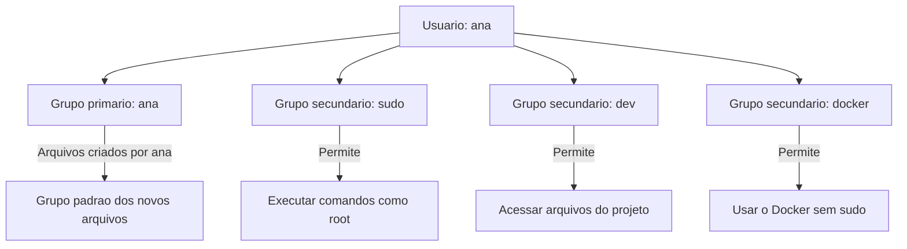
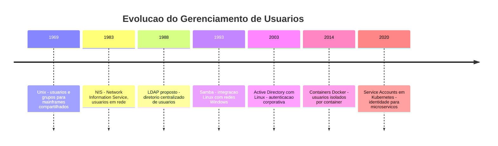
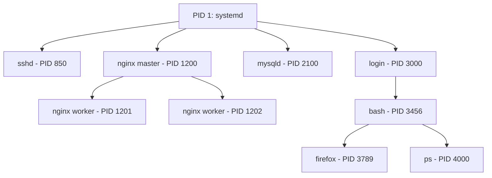
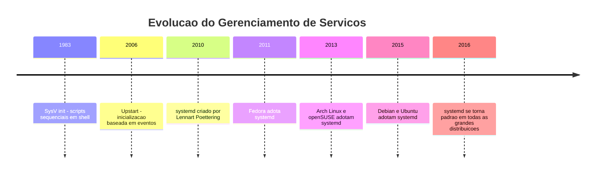

# 2.7 — Usuários, Grupos, Serviços e Daemons: Quem Faz o Quê no Sistema

[← Anterior: Gerenciamento de Pacotes](cap02-mod06-pacotes.md) · [Próximo: Shell Scripting →](cap02-mod08-shell-scripting.md)

---

## Introdução

No módulo anterior, aprendemos a instalar, atualizar e remover programas no Linux usando gerenciadores de pacotes. Vimos que com um simples `sudo apt install nginx` você instala um servidor web completo. Mas o que acontece depois da instalação? Quem roda esse servidor? Ele fica ligado o tempo todo? E se o computador reiniciar, o servidor liga sozinho?

Quando você instala um programa como o Nginx, o Firefox ou o Python, está instalando algo que **você** vai usar — você abre, usa e fecha. Mas muitos programas no Linux não funcionam assim. Um servidor web precisa estar rodando 24 horas por dia, 7 dias por semana, esperando conexões. Um servidor de banco de dados precisa estar sempre pronto para receber consultas. O sistema de logs precisa estar sempre gravando o que acontece. Esses programas que rodam em segundo plano, sem interação direta com o usuário, são chamados de **serviços** ou **daemons**.

E aqui entra uma pergunta fundamental: **quem** roda esses serviços? No módulo 2.5, vimos que todo arquivo tem um dono e um grupo, e que permissões controlam quem pode fazer o quê. Mas não falamos em profundidade sobre como criar e gerenciar usuários e grupos, nem sobre os usuários especiais que existem no sistema para rodar serviços. É isso que vamos explorar agora.

Lembre-se do mantra do curso: **"Qual problema você quer resolver?"** Usuários e grupos resolvem o problema da **identidade e isolamento** — saber quem está fazendo o quê no sistema e garantir que cada programa tenha apenas as permissões necessárias. Serviços e daemons resolvem o problema da **continuidade** — garantir que programas essenciais estejam sempre rodando, mesmo sem ninguém logado no sistema.

Para quem vai programar, entender esses conceitos é essencial:
- Quando você faz deploy de uma aplicação em um servidor, ela roda como um serviço
- Quando você configura um banco de dados, ele roda como um daemon
- Quando você trabalha em equipe, precisa entender como usuários e grupos organizam o acesso
- Quando algo dá errado em produção, você precisa saber verificar se o serviço está rodando e ler seus logs

Vamos construir esse conhecimento passo a passo.

---

## A Analogia: O Prédio Comercial Revisitado

No módulo 2.5, usamos a analogia de um prédio comercial para explicar permissões. Vamos expandir essa analogia para incluir serviços e daemons.

Imagine que o prédio comercial agora tem três tipos de "pessoas":

**Funcionários (usuários humanos):** São as pessoas que chegam de manhã, trabalham nas suas salas, usam os recursos do prédio e vão embora no final do dia. Cada funcionário tem um crachá (UID), pertence a um departamento (grupo) e tem acesso a certas salas (permissões). Quando o funcionário vai embora, ele para de usar os recursos.

**Funcionários invisíveis (serviços e daemons):** São como os seguranças, faxineiros e porteiros do prédio. Eles trabalham 24 horas, muitas vezes sem que ninguém perceba. O segurança (firewall) fica na portaria o tempo todo verificando quem entra. O faxineiro (cron/logrotate) limpa o prédio toda noite. O porteiro (SSH) recebe visitantes autorizados. Eles não têm uma "sala" própria — trabalham nos bastidores, cada um com acesso apenas ao que precisa para fazer seu trabalho.

**O síndico (root):** Continua sendo o administrador supremo, com a chave-mestra que abre todas as portas. Ele é quem contrata e demite funcionários, cria departamentos e define as regras do prédio.

Essa analogia captura a essência do que vamos estudar: no Linux, existem usuários humanos (que fazem login e usam o terminal), usuários de serviço (que existem apenas para rodar programas em segundo plano) e o root (que administra tudo).

---

## Parte 1: Usuários no Linux — Muito Além do Login

No módulo 2.5, vimos que cada usuário tem um UID, um grupo primário, um diretório home e um shell. Agora vamos aprofundar: como criar usuários, como gerenciá-los e, principalmente, por que existem tantos usuários no sistema que você nunca criou.

### Tipos de Usuários

O Linux tem três categorias de usuários, cada uma com um propósito diferente:

| Tipo | UID | Proposito | Exemplos |
|------|-----|-----------|----------|
| Root | 0 | Administrador supremo do sistema | root |
| Usuarios de sistema | 1-999 | Rodar servicos e daemons | www-data, mysql, sshd, nobody |
| Usuarios humanos | 1000+ | Pessoas reais que usam o sistema | ana, joao, carlos |

Essa divisão por faixas de UID não é arbitrária — é uma convenção que existe desde os primórdios do Unix e que todas as distribuições Linux seguem. Quando você cria um usuário com `useradd`, o sistema automaticamente atribui um UID a partir de 1000. Quando um pacote como o MySQL é instalado, ele cria um usuário de sistema com UID abaixo de 1000.

### Descobrindo os Usuários do Sistema

Quer ver quantos usuários existem no seu sistema? Provavelmente mais do que você imagina:

```
# Contar quantos usuarios existem
wc -l /etc/passwd
# Resultado tipico: 35-50 usuarios em um Ubuntu recem-instalado

# Ver apenas usuarios humanos (UID >= 1000, exceto nobody)
awk -F: '$3 >= 1000 && $3 < 65534 {print $1, $3}' /etc/passwd
# Resultado: ana 1000, joao 1001, etc.

# Ver apenas usuarios de sistema (UID < 1000)
awk -F: '$3 < 1000 {print $1, $3}' /etc/passwd
# Resultado: root 0, daemon 1, bin 2, sys 3, www-data 33, ...
```

Saída esperada (exemplo de um Ubuntu):
```
root 0
daemon 1
bin 2
sys 3
sync 4
games 5
man 6
lp 7
mail 8
news 9
www-data 33
backup 34
nobody 65534
```

Cada um desses usuários existe por um motivo específico. Vamos entender os mais importantes.

### Usuários de Sistema: Os Trabalhadores Invisíveis

Quando você instala o Ubuntu, ele cria dezenas de usuários que você nunca vai usar diretamente. Cada um existe para rodar um serviço específico com permissões limitadas. Isso é o **princípio do menor privilégio** em ação — que vimos no módulo 2.5.

| Usuario | UID | Para que serve | O que roda |
|---------|-----|----------------|------------|
| root | 0 | Administrador supremo | Tudo que precisa de acesso total |
| daemon | 1 | Servicos genericos do sistema | Processos auxiliares |
| bin | 2 | Dono de binarios do sistema | Nenhum servico diretamente |
| sys | 3 | Dono de arquivos do sistema | Nenhum servico diretamente |
| www-data | 33 | Servidor web | Nginx, Apache |
| mail | 8 | Sistema de email | Postfix, Sendmail |
| sshd | 100+ | Servidor SSH | OpenSSH |
| mysql | 100+ | Banco de dados MySQL | mysqld |
| postgres | 100+ | Banco de dados PostgreSQL | postgresql |
| nobody | 65534 | Usuario sem privilegios | Processos que não precisam de nada |

Por que não rodar tudo como root? Imagine que o servidor web Nginx tem uma vulnerabilidade e um atacante consegue executar comandos através dele. Se o Nginx estiver rodando como root, o atacante tem acesso total ao sistema — pode ler senhas, apagar arquivos, instalar programas maliciosos. Mas se o Nginx roda como `www-data`, o atacante só tem acesso ao que `www-data` pode acessar — os arquivos do site, nada mais. O dano é contido.

Esse é um dos conceitos mais importantes de segurança em servidores: **cada serviço roda com seu próprio usuário, com o mínimo de permissões necessárias**. Quando você fizer deploy das suas aplicações no futuro, vai criar usuários específicos para elas.

### O Usuário `nobody`: O Mais Restrito de Todos

O usuário `nobody` merece uma menção especial. Ele existe em todo sistema Unix/Linux e tem o propósito de ser o usuário com **menos privilégios possíveis**. Não tem diretório home, não tem shell, não é dono de quase nenhum arquivo.

Ele é usado quando um processo precisa rodar mas não precisa de nenhum acesso especial. É como um visitante temporário no prédio que não tem crachá, não tem sala e não pode abrir nenhuma porta — só pode ficar no saguão.

Na prática, `nobody` é usado por processos que precisam existir mas não precisam acessar nada no sistema de arquivos. Alguns serviços de rede usam `nobody` para processos auxiliares que apenas repassam dados.

---

## Gerenciando Usuários: Criando, Modificando e Removendo

No módulo 2.5, vimos os arquivos `/etc/passwd`, `/etc/shadow` e `/etc/group` onde as informações de usuários ficam armazenadas. Agora vamos aprender os comandos para gerenciar esses usuários na prática.

### Criando Usuários: `useradd` e `adduser`

Existem dois comandos para criar usuários no Linux, e a diferença entre eles confunde muita gente:

| Comando | Tipo | O que faz | Distribuicoes |
|---------|------|-----------|---------------|
| `useradd` | Baixo nível | Cria o usuario com opcoes manuais | Todas |
| `adduser` | Alto nível | Cria o usuario interativamente, com home e senha | Debian e Ubuntu |

O `useradd` é o comando básico — ele cria o usuário mas não cria o diretório home, não define senha e não copia arquivos de configuração padrão. Você precisa fazer tudo manualmente:

```
# Criar usuario com useradd (forma basica - sem home, sem senha)
sudo useradd joao

# Criar usuario com useradd (forma completa)
sudo useradd -m -s /bin/bash -c "Joao Silva" joao
# -m = cria o diretorio /home/joao
# -s /bin/bash = define o shell padrao
# -c "Joao Silva" = nome completo (comentario)

# Definir a senha separadamente
sudo passwd joao
```

Saída esperada do `passwd`:
```
New password:
Retype new password:
passwd: password updated successfully
```

O `adduser` (disponível no Debian e Ubuntu) é mais amigável — ele faz tudo de uma vez, perguntando as informações interativamente:

```
# Criar usuario com adduser (interativo)
sudo adduser maria
```

Saída esperada:
```
Adding user 'maria' ...
Adding new group 'maria' (1002) ...
Adding new user 'maria' (1002) with group 'maria' ...
Creating home directory '/home/maria' ...
Copying files from '/etc/skel' ...
New password:
Retype new password:
passwd: password updated successfully
Changing the user information for maria
Enter the new value, or press ENTER for the default
    Full Name []: Maria Santos
    Room Number []:
    Work Phone []:
    Home Phone []:
    Other []:
Is the information correct? [Y/n] Y
```

Note que o `adduser` criou automaticamente:
1. O usuário `maria` com UID 1002
2. Um grupo `maria` com GID 1002 (grupo primário)
3. O diretório `/home/maria`
4. Copiou arquivos de configuração padrão do `/etc/skel`
5. Pediu e definiu a senha

### O Diretório `/etc/skel`: O Modelo para Novos Usuários

Quando um novo usuário é criado com diretório home, o sistema copia o conteúdo de `/etc/skel` (skeleton, ou esqueleto) para o novo diretório. Esse diretório contém os arquivos de configuração padrão:

```
ls -la /etc/skel
```

Saída esperada:
```
total 20
drwxr-xr-x  2 root root 4096 jan 15 00:00 .
drwxr-xr-x 96 root root 4096 jan 15 00:00 ..
-rw-r--r--  1 root root  220 jan 15 00:00 .bash_logout
-rw-r--r--  1 root root 3771 jan 15 00:00 .bashrc
-rw-r--r--  1 root root  807 jan 15 00:00 .profile
```

Se você é administrador de um sistema com muitos usuários, pode adicionar arquivos ao `/etc/skel` para que todos os novos usuários recebam uma configuração padronizada — por exemplo, um `.bashrc` personalizado com aliases úteis ou um `.gitconfig` com configurações da empresa.

### Modificando Usuários: `usermod`

O comando `usermod` (user modify) permite alterar as propriedades de um usuário existente:

| Comando | O que faz |
|---------|-----------|
| `sudo usermod -aG dev ana` | Adiciona ana ao grupo dev sem remover dos outros grupos |
| `sudo usermod -s /bin/zsh ana` | Muda o shell da ana para zsh |
| `sudo usermod -d /home/nova-ana ana` | Muda o diretório home |
| `sudo usermod -l novo-nome ana` | Muda o nome de login |
| `sudo usermod -L ana` | Bloqueia a conta da ana - impede login |
| `sudo usermod -U ana` | Desbloqueia a conta da ana |
| `sudo usermod -e 2025-12-31 ana` | Define data de expiracao da conta |

A flag mais importante e mais usada é `-aG` (append to Group). O `-a` significa "adicionar" — sem ele, o `usermod -G` **substitui** todos os grupos do usuário, o que pode causar problemas sérios. Sempre use `-aG` quando quiser adicionar um usuário a um grupo.

```
# CORRETO: adiciona ana ao grupo docker sem mexer nos outros grupos
sudo usermod -aG docker ana

# PERIGOSO: substitui TODOS os grupos da ana pelo grupo docker
# Ana perde acesso a sudo, dev, e qualquer outro grupo que tinha
sudo usermod -G docker ana
```

Esse é um erro clássico de administração Linux. Muita gente já perdeu acesso ao `sudo` por usar `-G` sem o `-a`. Se isso acontecer, você precisa de acesso root direto (boot em modo de recuperação) para corrigir.

### Removendo Usuários: `userdel` e `deluser`

Assim como na criação, existem dois comandos para remoção:

```
# Remover usuario (mantem o diretorio home)
sudo userdel joao

# Remover usuario E seu diretorio home
sudo userdel -r joao

# No Debian/Ubuntu, forma interativa
sudo deluser joao

# Remover usuario, home e todos os arquivos
sudo deluser --remove-home joao
```

Na prática, é comum manter o diretório home mesmo após remover o usuário — os arquivos podem ser necessários depois. Em servidores, é uma boa prática fazer backup antes de remover qualquer coisa.

### Verificando Informações de Usuários

Vários comandos ajudam a verificar informações sobre usuários:

```
# Ver informacoes completas do usuario atual
id
```

Saída esperada:
```
uid=1000(ana) gid=1000(ana) groups=1000(ana),27(sudo),1001(dev),998(docker)
```

```
# Ver informacoes de outro usuario
id joao
```

Saída esperada:
```
uid=1001(joao) gid=1001(joao) groups=1001(joao),1001(dev)
```

```
# Ver apenas os grupos de um usuario
groups ana
```

Saída esperada:
```
ana : ana sudo dev docker
```

```
# Ver quem esta logado no sistema agora
who
```

Saída esperada:
```
ana      tty1         2025-01-15 08:30
joao     pts/0        2025-01-15 09:15 (192.168.1.50)
```

```
# Ver o ultimo login de cada usuario
lastlog
```

```
# Ver historico de logins
last
```

Esses comandos são fundamentais para administração de sistemas. Quando algo estranho acontece em um servidor, a primeira pergunta é: "quem estava logado naquele momento?" O comando `last` responde isso.

---

## Parte 2: Grupos na Prática

No módulo 2.5, vimos que grupos são conjuntos de usuários que compartilham permissões. Agora vamos aprender a criar e gerenciar grupos, e ver como eles são usados em cenários reais.

### Criando e Gerenciando Grupos

```
# Criar um novo grupo
sudo groupadd desenvolvedores

# Criar grupo com GID especifico
sudo groupadd -g 2000 projeto-api

# Adicionar usuario a um grupo (ja vimos com usermod)
sudo usermod -aG desenvolvedores ana
sudo usermod -aG desenvolvedores joao
sudo usermod -aG desenvolvedores carlos

# Remover usuario de um grupo
sudo gpasswd -d carlos desenvolvedores

# Remover um grupo
sudo groupdel projeto-api

# Listar membros de um grupo
getent group desenvolvedores
```

Saída esperada do `getent group`:
```
desenvolvedores:x:1002:ana,joao,carlos
```

### Grupo Primário vs Grupos Secundários

Todo usuário tem exatamente um **grupo primário** e pode ter vários **grupos secundários**:

- **Grupo primário**: definido em `/etc/passwd`. Quando o usuário cria um arquivo, o arquivo recebe esse grupo por padrão. Na maioria das distribuições modernas, cada usuário tem um grupo primário com o mesmo nome (ana pertence ao grupo ana).

- **Grupos secundários**: definidos em `/etc/group`. Dão permissões adicionais ao usuário. Um desenvolvedor pode pertencer aos grupos `dev`, `docker`, `sudo` — cada um dando acesso a recursos diferentes.



### Cenário Real: Organizando uma Equipe de Desenvolvimento

Imagine que você administra um servidor onde três equipes trabalham em projetos diferentes:

```
# Criar grupos para cada equipe
sudo groupadd equipe-backend
sudo groupadd equipe-frontend
sudo groupadd equipe-devops

# Criar grupo compartilhado para todos os devs
sudo groupadd todos-devs

# Adicionar pessoas aos grupos
sudo usermod -aG equipe-backend,todos-devs ana
sudo usermod -aG equipe-backend,todos-devs joao
sudo usermod -aG equipe-frontend,todos-devs maria
sudo usermod -aG equipe-frontend,todos-devs pedro
sudo usermod -aG equipe-devops,todos-devs carlos

# Configurar diretorios dos projetos
sudo mkdir -p /var/projetos/{backend,frontend,compartilhado}

# Backend: so a equipe backend acessa
sudo chown -R root:equipe-backend /var/projetos/backend
sudo chmod -R 770 /var/projetos/backend
sudo chmod g+s /var/projetos/backend  # SGID para herdar grupo

# Frontend: so a equipe frontend acessa
sudo chown -R root:equipe-frontend /var/projetos/frontend
sudo chmod -R 770 /var/projetos/frontend
sudo chmod g+s /var/projetos/frontend

# Compartilhado: todos os devs acessam
sudo chown -R root:todos-devs /var/projetos/compartilhado
sudo chmod -R 770 /var/projetos/compartilhado
sudo chmod g+s /var/projetos/compartilhado
```

Note como usamos o SGID (`chmod g+s`) — que aprendemos no módulo 2.5 — para garantir que novos arquivos criados dentro desses diretórios herdem o grupo correto. Sem o SGID, se a Ana criar um arquivo em `/var/projetos/backend`, ele teria o grupo `ana` (grupo primário dela) em vez de `equipe-backend`, e o João não conseguiria acessar.

### A Conexão com Programação

O conceito de grupos no Linux é a implementação mais básica do **RBAC** (Role-Based Access Control), que mencionamos no módulo 2.5. Em aplicações web modernas, você vai implementar algo muito parecido:

| Conceito Linux | Equivalente em aplicações web |
|---------------|-------------------------------|
| Usuario | Conta de usuario na aplicação |
| Grupo | Role ou papel - admin, editor, leitor |
| Permissão rwx | Permissão na aplicação - criar, editar, deletar, visualizar |
| /etc/group | Tabela de roles no banco de dados |
| usermod -aG | Atribuir role a um usuario na interface admin |

Quando você criar uma API com autenticação no Capítulo 10, vai implementar exatamente essa lógica — só que em código Python em vez de comandos do terminal.

---

## A História dos Usuários e Grupos no Unix

Para entender por que o sistema funciona assim, vale olhar para a história.

### O Problema Original: Computadores Compartilhados

Nos anos 1960 e 1970, computadores eram caros e enormes. Uma universidade inteira compartilhava um único computador. Dezenas de estudantes e professores usavam o mesmo sistema ao mesmo tempo, através de **terminais** (telas e teclados conectados ao computador central).

O problema era óbvio: como garantir que o estudante João não leia a prova que o professor está preparando? Como impedir que a Maria apague acidentalmente o trabalho do Carlos? Como permitir que alunos da mesma turma compartilhem arquivos entre si, mas não com alunos de outras turmas?

A solução do Unix (1969) foi elegante: cada pessoa tem um **usuário** com identificação única, pessoas que precisam compartilhar recursos pertencem ao mesmo **grupo**, e cada arquivo tem permissões que definem o que cada nível pode fazer.

### A Evolução: De Mainframes a Servidores Web

| Epoca | Contexto | Como usuarios e grupos eram usados |
|-------|----------|-------------------------------------|
| 1970s | Mainframes universitarios | Separar alunos, professores e administradores |
| 1980s | Estacoes de trabalho em rede | Compartilhar arquivos entre departamentos |
| 1990s | Servidores de internet | Isolar servicos web, email e FTP |
| 2000s | Servidores de aplicação | Cada aplicação com seu proprio usuario |
| 2010s | Containers e cloud | Usuarios dentro de containers isolados |
| 2020s | Microservicos e Kubernetes | Identidade de servico, service accounts |

O conceito é o mesmo desde 1969 — o que mudou foi a escala e o contexto. Hoje, em vez de separar alunos e professores, separamos microserviços e containers. Mas a lógica de identidade, grupos e permissões continua idêntica.



---

## Parte 3: Processos — O que Está Rodando no Sistema

Antes de falar sobre serviços e daemons, precisamos entender o que é um **processo**. Esse conceito é a ponte entre "programas instalados" e "serviços rodando".

### O que é um Processo?

Um **processo** (process) é um programa em execução. Quando você abre o Firefox, o sistema cria um processo para ele. Quando você roda `python3 meu_script.py`, cria outro processo. Quando o servidor web Nginx está rodando, ele é um processo (ou vários).

A diferença entre programa e processo é como a diferença entre uma receita e o ato de cozinhar:
- O **programa** é a receita escrita no papel — existe no disco, é estático
- O **processo** é alguém seguindo a receita na cozinha — está na memória, é dinâmico, consome recursos

Você pode ter o mesmo programa gerando vários processos ao mesmo tempo. Se três pessoas abrem o Firefox, existem três processos do Firefox rodando simultaneamente, cada um com sua própria memória e seus próprios dados.

### Identificando Processos: PID

Cada processo tem um número único chamado **PID** (Process ID, ou Identificador de Processo). É como o número do crachá de cada funcionário no prédio — único e usado para identificar quem é quem.

```
# Ver seus processos
ps
```

Saída esperada:
```
  PID TTY          TIME CMD
 1234 pts/0    00:00:00 bash
 5678 pts/0    00:00:00 ps
```

```
# Ver TODOS os processos do sistema
ps aux
```

Saída esperada (resumida):
```
USER       PID %CPU %MEM    VSZ   RSS TTY      STAT START   TIME COMMAND
root         1  0.0  0.1 169536 13200 ?        Ss   08:00   0:02 /sbin/init
root         2  0.0  0.0      0     0 ?        S    08:00   0:00 [kthreadd]
www-data  1542  0.0  0.2  55876  4532 ?        S    08:00   0:00 nginx: worker
mysql     2103  0.5  2.1 1256780 42356 ?       Sl   08:00   0:15 /usr/sbin/mysqld
ana       3456  0.1  0.5 345678 10240 pts/0    S    09:00   0:01 /usr/bin/bash
ana       3789  2.3  5.2 987654 106496 pts/0   Sl   09:15   0:30 /usr/bin/firefox
```

Vamos decodificar essa saída:

| Coluna | Significado | Exemplo |
|--------|-------------|---------|
| USER | Usuario que roda o processo | www-data, mysql, ana |
| PID | Identificador único do processo | 1542, 2103, 3456 |
| %CPU | Porcentagem de uso da CPU | 0.5, 2.3 |
| %MEM | Porcentagem de uso da memória RAM | 2.1, 5.2 |
| STAT | Estado do processo | S = dormindo, R = rodando, Z = zumbi |
| COMMAND | Programa que esta rodando | nginx, mysqld, firefox |

Note a coluna USER: o Nginx roda como `www-data`, o MySQL roda como `mysql`, e o Firefox roda como `ana`. Cada processo tem um dono, e esse dono determina o que o processo pode acessar — exatamente como as permissões de arquivos que vimos no módulo 2.5.

### Processos em Primeiro e Segundo Plano

Quando você roda um comando no terminal, ele roda em **primeiro plano** (foreground) — o terminal fica "preso" até o comando terminar. Mas você pode rodar comandos em **segundo plano** (background):

```
# Rodar em primeiro plano (terminal fica preso)
python3 meu_servidor.py

# Rodar em segundo plano (terminal fica livre)
python3 meu_servidor.py &

# Ver processos em segundo plano
jobs

# Trazer processo de volta para primeiro plano
fg %1

# Enviar processo para segundo plano
# (primeiro, pressione Ctrl+Z para pausar, depois:)
bg %1
```

Essa distinção entre primeiro e segundo plano é importante para entender serviços: um serviço é essencialmente um processo que roda em segundo plano o tempo todo, sem estar ligado a nenhum terminal.

### O Processo Número 1: O Pai de Todos

Todo sistema Linux tem um processo especial com PID 1. Ele é o primeiro processo criado quando o sistema liga e é o "pai" de todos os outros processos. Nos sistemas modernos, esse processo é o **systemd** (que vamos estudar em detalhes mais adiante).



Essa hierarquia é importante: quando um processo "pai" morre, seus processos "filhos" são adotados pelo PID 1. E quando o PID 1 morre... o sistema inteiro para. Por isso o systemd é tão crítico.

### Sinais: Comunicando-se com Processos

Processos se comunicam através de **sinais** (signals). Um sinal é uma mensagem curta enviada a um processo para pedir que ele faça algo. Os sinais mais importantes são:

| Sinal | Número | Nome | O que faz |
|-------|--------|------|-----------|
| SIGTERM | 15 | Terminate | Pede educadamente para o processo terminar |
| SIGKILL | 9 | Kill | Forca o processo a terminar imediatamente |
| SIGHUP | 1 | Hangup | Pede para o processo recarregar configuração |
| SIGSTOP | 19 | Stop | Pausa o processo |
| SIGCONT | 18 | Continue | Retoma um processo pausado |
| SIGINT | 2 | Interrupt | Interrompe o processo - e o que Ctrl+C faz |

```
# Pedir educadamente para um processo terminar
kill 3789

# Forcar o termino (quando o processo nao responde)
kill -9 3789

# Pedir para recarregar configuracao
kill -HUP 1200

# Matar todos os processos de um programa
killall firefox

# Matar processos por nome com mais controle
pkill -f "python3 meu_servidor"
```

A diferença entre SIGTERM e SIGKILL é crucial:
- **SIGTERM** (kill sem flag): é como pedir educadamente para alguém sair de uma sala. A pessoa pode salvar seu trabalho, fechar arquivos e sair de forma organizada.
- **SIGKILL** (kill -9): é como cortar a energia da sala. A pessoa é forçada a sair imediatamente, sem chance de salvar nada. Pode causar perda de dados.

Sempre tente SIGTERM primeiro. Só use SIGKILL quando o processo não responde ao SIGTERM.

---

## Parte 4: Serviços e Daemons — Os Programas que Nunca Dormem

Agora que entendemos processos, podemos finalmente falar sobre **serviços** e **daemons** — os programas que rodam continuamente em segundo plano.

### O que é um Daemon?

Um **daemon** (pronuncia-se "dêimon") é um processo que roda em segundo plano, sem interação direta com o usuário. O nome vem da mitologia grega — daemons eram seres sobrenaturais que trabalhavam nos bastidores, invisíveis aos humanos. No contexto do Unix, a analogia é perfeita: daemons são processos que trabalham silenciosamente, sem que você perceba.

No Linux, daemons geralmente têm nomes que terminam com a letra **d**:
- `sshd` — daemon do SSH (Secure Shell)
- `httpd` — daemon do HTTP (servidor web Apache)
- `mysqld` — daemon do MySQL (banco de dados)
- `crond` — daemon do cron (agendador de tarefas)
- `systemd` — daemon do sistema (gerenciador de serviços)
- `syslogd` — daemon de logs do sistema
- `dockerd` — daemon do Docker (containers)

### O que é um Serviço?

Os termos **serviço** (service) e **daemon** são frequentemente usados como sinônimos, mas há uma diferença sutil:

- **Daemon**: o processo em si que roda em segundo plano
- **Serviço**: o conceito mais amplo que inclui o daemon, sua configuração, seus logs e seu gerenciamento

Na prática, quando alguém diz "o serviço do MySQL", está falando do daemon `mysqld` mais toda a infraestrutura ao redor dele (configuração em `/etc/mysql/`, logs em `/var/log/mysql/`, scripts de inicialização, etc.).

### Características de um Daemon

O que diferencia um daemon de um processo comum?

| Caracteristica | Processo comum | Daemon |
|---------------|----------------|--------|
| Interação com usuario | Direta - terminal, janela | Nenhuma - roda em segundo plano |
| Duracao | Enquanto o usuario usa | Indefinida - roda ate ser parado |
| Inicio | Usuario executa manualmente | Inicia automaticamente com o sistema |
| Terminal | Conectado a um terminal | Desconectado de qualquer terminal |
| Exemplo | Firefox, vim, python3 script.py | nginx, mysql, sshd |

### Exemplos de Serviços Comuns

Vamos conhecer os serviços mais importantes que você vai encontrar como desenvolvedor:

| Servico | Daemon | Porta padrão | O que faz |
|---------|--------|-------------|-----------|
| SSH | sshd | 22 | Acesso remoto seguro ao servidor |
| HTTP/HTTPS | nginx ou httpd | 80 e 443 | Servidor web - serve páginas e APIs |
| MySQL | mysqld | 3306 | Banco de dados relacional |
| PostgreSQL | postgres | 5432 | Banco de dados relacional |
| Redis | redis-server | 6379 | Banco de dados em memória - cache |
| Docker | dockerd | - | Gerenciamento de containers |
| Cron | crond | - | Agendamento de tarefas periodicas |
| Syslog | rsyslogd | - | Coleta e armazenamento de logs |
| NTP | ntpd ou chronyd | 123 | Sincronizacao de relogio |
| DNS | named ou systemd-resolved | 53 | Resolução de nomes de dominio |

Quando você fizer deploy de uma aplicação web, ela vai interagir com vários desses serviços: o Nginx recebe as requisições HTTP e repassa para sua aplicação, que consulta o MySQL para buscar dados, usa o Redis para cache, e tudo é registrado pelo Syslog.

---

## A História dos Daemons e do Gerenciamento de Serviços

A forma como o Linux gerência serviços mudou drasticamente ao longo das décadas. Entender essa evolução ajuda a compreender por que o sistema atual (systemd) é como é — e por que ele é tão controverso.

### Era 1: init e os Scripts de Inicialização (1983-2006)

O primeiro sistema de gerenciamento de serviços do Unix era o **init** (abreviação de initialization). Quando o sistema ligava, o init lia um arquivo de configuração (`/etc/inittab`) e executava uma série de **scripts de shell** para iniciar cada serviço.

Esses scripts ficavam em `/etc/init.d/` e eram executados em ordem numérica:

```
/etc/init.d/
├── S01networking    # Primeiro: rede
├── S02syslog        # Segundo: logs
├── S03ssh           # Terceiro: SSH
├── S04mysql         # Quarto: banco de dados
├── S05nginx         # Quinto: servidor web
```

Para controlar um serviço, você executava o script diretamente:

```
# Iniciar o MySQL
/etc/init.d/mysql start

# Parar o MySQL
/etc/init.d/mysql stop

# Reiniciar o MySQL
/etc/init.d/mysql restart

# Ver o status
/etc/init.d/mysql status
```

O problema? Esses scripts eram **sequenciais** — cada serviço esperava o anterior terminar antes de iniciar. Em um servidor com muitos serviços, o boot podia levar minutos. Além disso, cada script era escrito manualmente, sem padronização — um script do MySQL era completamente diferente de um script do Nginx.

### Era 2: Upstart (2006-2014)

O Ubuntu criou o **Upstart** em 2006 para resolver os problemas do init. O Upstart introduziu:
- Inicialização baseada em **eventos** (em vez de sequência fixa)
- Paralelismo (serviços sem dependência entre si podiam iniciar ao mesmo tempo)
- Reinício automático de serviços que caíam

O Upstart foi um avanço significativo, mas era específico do Ubuntu e não foi adotado amplamente.

### Era 3: systemd (2010-presente)

Em 2010, Lennart Poettering e Kay Sievers criaram o **systemd** — um sistema de gerenciamento de serviços completamente novo que rapidamente se tornou o padrão em praticamente todas as distribuições Linux.

O systemd trouxe mudanças radicais:
- **Paralelismo agressivo**: serviços iniciam em paralelo sempre que possível, reduzindo drasticamente o tempo de boot
- **Gerenciamento unificado**: um único comando (`systemctl`) para controlar todos os serviços
- **Arquivos de configuração declarativos**: em vez de scripts de shell, serviços são definidos em arquivos `.service` padronizados
- **Dependências explícitas**: cada serviço declara do que depende
- **Logs centralizados**: o `journald` coleta todos os logs em um formato estruturado
- **Reinício automático**: serviços podem ser configurados para reiniciar automaticamente se caírem
- **Controle de recursos**: limitar CPU, memória e I/O por serviço



### A Controvérsia do systemd

O systemd é provavelmente o software mais controverso da história do Linux. Muitos administradores e desenvolvedores criticam o systemd por:

- **Fazer demais**: além de gerenciar serviços, o systemd gerência logs, rede, DNS, login, containers e muito mais. Críticos dizem que isso viola a filosofia Unix de "cada programa faz uma coisa bem feita"
- **Complexidade**: o systemd é muito mais complexo que o init tradicional
- **Dependência**: muitos programas passaram a depender do systemd, dificultando o uso de alternativas

Por outro lado, defensores argumentam que:
- O boot é muito mais rápido
- A configuração é padronizada e previsível
- O gerenciamento de serviços é muito mais poderoso
- Os logs estruturados facilitam diagnóstico de problemas

Independente da opinião, o systemd é a realidade: está em todas as grandes distribuições e é o que você vai usar na prática. Então vamos aprender a usá-lo bem.

---

## Parte 5: systemd e systemctl — Gerenciando Serviços na Prática

O **systemctl** é o comando principal para interagir com o systemd. Com ele, você controla serviços, verifica status, habilita inicialização automática e muito mais.

### Comandos Essenciais do systemctl

| Comando | O que faz |
|---------|-----------|
| `sudo systemctl start nginx` | Inicia o servico nginx |
| `sudo systemctl stop nginx` | Para o servico nginx |
| `sudo systemctl restart nginx` | Para e inicia novamente |
| `sudo systemctl reload nginx` | Recarrega configuração sem parar |
| `systemctl status nginx` | Mostra o estado atual do servico |
| `sudo systemctl enable nginx` | Habilita inicio automático no boot |
| `sudo systemctl disable nginx` | Desabilita inicio automático |
| `systemctl is-active nginx` | Verifica se esta rodando |
| `systemctl is-enabled nginx` | Verifica se inicia no boot |
| `systemctl list-units --type=service` | Lista todos os servicos |
| `systemctl list-units --type=service --state=running` | Lista servicos rodando |

### Entendendo o `systemctl status`

O comando mais útil no dia a dia é o `systemctl status`. Ele mostra tudo que você precisa saber sobre um serviço:

```
systemctl status nginx
```

Saída esperada:
```
● nginx.service - A high performance web server and a reverse proxy server
     Loaded: loaded (/lib/systemd/system/nginx.service; enabled; preset: enabled)
     Active: active (running) since Mon 2025-01-15 08:00:00 UTC; 5h ago
       Docs: man:nginx(8)
    Process: 1200 ExecStartPre=/usr/sbin/nginx -t -q -g daemon on; (code=exited, status=0/SUCCESS)
   Main PID: 1205 (nginx)
      Tasks: 3 (limit: 4915)
     Memory: 8.5M
        CPU: 125ms
     CGroup: /system.slice/nginx.service
             ├─1205 "nginx: master process /usr/sbin/nginx -g daemon on;"
             ├─1206 "nginx: worker process"
             └─1207 "nginx: worker process"

jan 15 08:00:00 servidor systemd[1]: Starting A high performance web server...
jan 15 08:00:00 servidor systemd[1]: Started A high performance web server.
```

Vamos decodificar cada parte:

| Linha | Significado |
|-------|-------------|
| `Loaded: loaded ... enabled` | O servico esta configurado e habilitado para iniciar no boot |
| `Active: active (running)` | O servico esta rodando agora |
| `Main PID: 1205` | O processo principal tem PID 1205 |
| `Tasks: 3` | O servico tem 3 processos - 1 master e 2 workers |
| `Memory: 8.5M` | Esta usando 8.5 megabytes de memória |
| `CGroup` | Mostra a árvore de processos do servico |
| Ultimas linhas | Logs recentes do servico |

O indicador colorido no início é especialmente útil:
- **●** verde = rodando normalmente
- **●** vermelho = parado ou com erro
- **●** branco = inativo

### Habilitando e Desabilitando Serviços

A diferença entre `start`/`stop` e `enable`/`disable` confunde muita gente:

| Comando | Efeito | Quando usar |
|---------|--------|-------------|
| `start` | Inicia o servico AGORA | Quando precisa do servico imediatamente |
| `stop` | Para o servico AGORA | Quando precisa parar temporariamente |
| `enable` | Configura para iniciar automaticamente no BOOT | Quando o servico deve estar sempre ativo |
| `disable` | Remove do inicio automático | Quando não quer mais que inicie no boot |

Na prática, quando você instala um serviço novo, geralmente faz as duas coisas:

```
# Iniciar agora E habilitar para o boot
sudo systemctl enable --now nginx

# Equivalente a:
# sudo systemctl enable nginx
# sudo systemctl start nginx
```

E quando quer desativar completamente:

```
# Parar agora E desabilitar do boot
sudo systemctl disable --now nginx
```

### Arquivos de Unidade (Unit Files): A Configuração dos Serviços

No systemd, cada serviço é definido por um **arquivo de unidade** (unit file) com extensão `.service`. Esses arquivos ficam em `/lib/systemd/system/` (instalados por pacotes) ou `/etc/systemd/system/` (criados pelo administrador).

Vamos ver um exemplo real — o arquivo do Nginx:

```
# /lib/systemd/system/nginx.service
[Unit]
Description=A high performance web server and a reverse proxy server
Documentation=man:nginx(8)
After=network.target remote-fs.target nss-lookup.target
StartLimitIntervalSec=0

[Service]
Type=forking
PIDFile=/run/nginx.pid
ExecStartPre=/usr/sbin/nginx -t -q -g 'daemon on; master_process on;'
ExecStart=/usr/sbin/nginx -g 'daemon on; master_process on;'
ExecReload=/bin/kill -s HUP $MAINPID
ExecStop=/bin/kill -s QUIT $MAINPID
PrivateTmp=true

[Install]
WantedBy=multi-user.target
```

Vamos entender cada seção:

**[Unit]** — Informações gerais sobre o serviço:
- `Description`: descrição legível por humanos
- `After`: este serviço só inicia depois que a rede estiver pronta
- `Documentation`: onde encontrar documentação

**[Service]** — Como o serviço funciona:
- `Type=forking`: o processo principal cria um filho e termina (padrão para daemons tradicionais)
- `ExecStartPre`: comando executado antes de iniciar (aqui, testa a configuração do Nginx)
- `ExecStart`: comando que inicia o serviço
- `ExecReload`: comando para recarregar configuração (envia sinal HUP)
- `ExecStop`: comando para parar o serviço
- `PrivateTmp=true`: o serviço tem seu próprio `/tmp` isolado (segurança)

**[Install]** — Quando o serviço deve iniciar:
- `WantedBy=multi-user.target`: inicia quando o sistema entra em modo multi-usuário (boot normal)

### Criando seu Próprio Serviço

Quando você criar uma aplicação e quiser que ela rode como serviço, vai precisar criar um arquivo de unidade. Aqui está um exemplo para uma aplicação Python:

```
# /etc/systemd/system/minha-api.service
[Unit]
Description=Minha API Python
After=network.target

[Service]
Type=simple
User=api-user
Group=api-group
WorkingDirectory=/var/www/minha-api
ExecStart=/var/www/minha-api/venv/bin/python3 app.py
Restart=always
RestartSec=5
Environment=FLASK_ENV=production
StandardOutput=journal
StandardError=journal

[Install]
WantedBy=multi-user.target
```

Pontos importantes nesse arquivo:
- `User=api-user`: o serviço roda como um usuário específico, não como root
- `Restart=always`: se o processo morrer, o systemd reinicia automaticamente
- `RestartSec=5`: espera 5 segundos antes de reiniciar (evita loops de reinício)
- `Environment`: define variáveis de ambiente para o processo
- `StandardOutput=journal`: logs vão para o journald (veremos a seguir)

Depois de criar o arquivo, você precisa recarregar o systemd e iniciar o serviço:

```
# Recarregar configuracoes do systemd
sudo systemctl daemon-reload

# Iniciar e habilitar o servico
sudo systemctl enable --now minha-api

# Verificar se esta rodando
systemctl status minha-api
```

Quando chegarmos ao Capítulo 10 e criarmos uma API com FastAPI, vamos usar exatamente esse processo para fazer deploy em um servidor.

---

## Parte 6: Logs — O Diário do Sistema

Serviços rodam em segundo plano, sem tela, sem terminal. Quando algo dá errado, como você descobre o que aconteceu? Através dos **logs**.

### O journald e o journalctl

O systemd inclui o **journald**, um sistema de logs centralizado que coleta mensagens de todos os serviços. O comando para consultar esses logs é o `journalctl`:

```
# Ver todos os logs do sistema
journalctl

# Ver logs de um servico especifico
journalctl -u nginx

# Ver logs em tempo real (como tail -f)
journalctl -u nginx -f

# Ver logs desde o ultimo boot
journalctl -b

# Ver logs das ultimas 2 horas
journalctl --since "2 hours ago"

# Ver logs de um periodo especifico
journalctl --since "2025-01-15 08:00" --until "2025-01-15 12:00"

# Ver apenas erros
journalctl -u nginx -p err

# Ver logs com saida compacta (uma linha por entrada)
journalctl -u nginx --no-pager -o short
```

### Níveis de Severidade dos Logs

Logs têm diferentes níveis de severidade, do mais grave ao menos grave:

| Nível | Número | Significado | Quando usar |
|-------|--------|-------------|-------------|
| emerg | 0 | Sistema inutilizavel | Kernel panic, falha critica |
| alert | 1 | Ação imediata necessária | Banco de dados corrompido |
| crit | 2 | Condição critica | Disco cheio, hardware falhando |
| err | 3 | Erro | Servico falhou ao iniciar |
| warning | 4 | Aviso | Configuração deprecated, disco quase cheio |
| notice | 5 | Normal mas significativo | Servico iniciou, usuario logou |
| info | 6 | Informativo | Requisicao processada, conexão aceita |
| debug | 7 | Depuracao | Detalhes internos para diagnostico |

```
# Ver apenas erros e mais graves (0-3)
journalctl -p err

# Ver avisos e mais graves (0-4)
journalctl -p warning
```

### Logs Tradicionais em `/var/log`

Além do journald, muitos serviços ainda escrevem logs em arquivos tradicionais no diretório `/var/log/`:

| Arquivo | O que contem |
|---------|-------------|
| `/var/log/syslog` | Log geral do sistema - Debian e Ubuntu |
| `/var/log/messages` | Log geral do sistema - Fedora e CentOS |
| `/var/log/auth.log` | Tentativas de login, uso de sudo |
| `/var/log/kern.log` | Mensagens do kernel |
| `/var/log/nginx/access.log` | Requisicoes recebidas pelo Nginx |
| `/var/log/nginx/error.log` | Erros do Nginx |
| `/var/log/mysql/error.log` | Erros do MySQL |

```
# Ver as ultimas linhas de um log
tail -20 /var/log/syslog

# Acompanhar um log em tempo real
tail -f /var/log/nginx/access.log

# Buscar erros em um log
grep "error" /var/log/nginx/error.log

# Ver tentativas de login falhadas
grep "Failed password" /var/log/auth.log
```

### A Conexão com Programação

Logs são absolutamente essenciais para desenvolvedores. Quando sua aplicação está rodando em um servidor e algo dá errado, você não pode abrir um debugger — os logs são sua única janela para entender o que aconteceu.

Toda linguagem de programação tem bibliotecas de logging:
- Python: módulo `logging` (veremos no Capítulo 5)
- JavaScript: `console.log`, `winston`, `pino`
- Java: `log4j`, `SLF4J`
- Go: `log`, `zap`, `zerolog`

Quando você escrever suas aplicações, vai usar essas bibliotecas para gerar logs que o systemd coleta e organiza. É um ciclo completo: sua aplicação gera logs → journald coleta → você consulta com journalctl.

---

## Parte 7: O Cron — Agendando Tarefas

Nem todo serviço precisa rodar o tempo todo. Às vezes, você precisa que uma tarefa execute em horários específicos — fazer backup toda noite, limpar arquivos temporários toda semana, enviar relatórios toda segunda-feira. Para isso existe o **cron**.

### O que é o Cron?

O **cron** é um daemon que executa comandos em horários agendados. O nome vem de **Chronos**, o deus grego do tempo. O cron roda silenciosamente em segundo plano, verificando a cada minuto se há alguma tarefa para executar.

### A Crontab: A Agenda de Tarefas

As tarefas agendadas ficam em um arquivo chamado **crontab** (cron table). Cada usuário pode ter sua própria crontab:

```
# Editar sua crontab
crontab -e

# Ver sua crontab atual
crontab -l

# Remover sua crontab
crontab -r
```

### O Formato da Crontab

Cada linha da crontab define uma tarefa com cinco campos de tempo seguidos do comando:

```
# Formato:
# minuto  hora  dia-do-mes  mes  dia-da-semana  comando
#  (0-59) (0-23)   (1-31)  (1-12)    (0-7)

# Exemplos:
# Executar todo dia as 3 da manha
0 3 * * * /home/ana/scripts/backup.sh

# Executar a cada 30 minutos
*/30 * * * * /home/ana/scripts/verificar-disco.sh

# Executar toda segunda-feira as 8h
0 8 * * 1 /home/ana/scripts/relatorio-semanal.sh

# Executar no primeiro dia de cada mes as 0h
0 0 1 * * /home/ana/scripts/relatorio-mensal.sh

# Executar de segunda a sexta as 18h
0 18 * * 1-5 /home/ana/scripts/backup-diario.sh
```

| Campo | Valores | Caracteres especiais |
|-------|---------|---------------------|
| Minuto | 0-59 | * = todos, */N = a cada N, N-M = intervalo |
| Hora | 0-23 | * = todas, */N = a cada N horas |
| Dia do mes | 1-31 | * = todos os dias |
| Mes | 1-12 | * = todos os meses |
| Dia da semana | 0-7 | 0 e 7 = domingo, 1 = segunda, ... 6 = sabado |

### Exemplos Práticos de Crontab

```
# Backup do banco de dados toda noite as 2h
0 2 * * * mysqldump -u root meu_banco > /backup/db-$(date +\%Y\%m\%d).sql

# Limpar arquivos temporarios maiores que 7 dias, todo domingo as 4h
0 4 * * 0 find /tmp -type f -mtime +7 -delete

# Verificar espaco em disco a cada hora
0 * * * * df -h > /var/log/espaco-disco.log

# Reiniciar a aplicacao toda madrugada (manutencao preventiva)
0 5 * * * systemctl restart minha-api

# Enviar email de status todo dia as 9h
0 9 * * * /home/ana/scripts/status-email.sh
```

### Cron vs Systemd Timers

O systemd também tem seu próprio sistema de agendamento chamado **timers**. Timers são mais poderosos que o cron (suportam dependências, logs integrados, execução em caso de boot perdido), mas o cron é mais simples e amplamente conhecido.

| Aspecto | Cron | Systemd Timers |
|---------|------|----------------|
| Simplicidade | Muito simples - uma linha por tarefa | Mais complexo - precisa de 2 arquivos |
| Logs | Básicos - via email ou redirecionamento | Integrados com journalctl |
| Dependências | Não suporta | Suporta - pode depender de outros servicos |
| Precisao | Minuto | Microsegundo |
| Boot perdido | Não executa tarefas perdidas | Pode executar tarefas que foram perdidas |
| Uso recomendado | Tarefas simples de usuario | Tarefas de sistema e complexas |

Para a maioria dos casos, o cron é suficiente e mais fácil de usar. Quando você precisar de mais controle, os timers do systemd estão disponíveis.

---

## Parte 8: Juntando Tudo — Como Usuários, Grupos, Serviços e Permissões se Conectam

Agora que vimos cada peça separadamente, vamos ver como tudo se conecta em um cenário real.

### Cenário: Deploy de uma Aplicação Web

Imagine que você criou uma API em Python e quer colocá-la em um servidor. Veja como todos os conceitos deste módulo (e dos anteriores) se conectam:

```
# 1. Criar usuario especifico para a aplicacao
sudo useradd -r -s /usr/sbin/nologin -d /var/www/minha-api api-user
# -r = usuario de sistema (UID < 1000)
# -s /usr/sbin/nologin = nao pode fazer login (seguranca)
# -d = diretorio home

# 2. Criar grupo para a aplicacao
sudo groupadd api-group
sudo usermod -aG api-group api-user

# 3. Configurar diretorio da aplicacao
sudo mkdir -p /var/www/minha-api
sudo chown -R api-user:api-group /var/www/minha-api
sudo chmod -R 750 /var/www/minha-api

# 4. Criar o arquivo de servico do systemd
sudo nano /etc/systemd/system/minha-api.service
# (conteudo do arquivo .service que vimos antes)

# 5. Iniciar e habilitar o servico
sudo systemctl daemon-reload
sudo systemctl enable --now minha-api

# 6. Verificar se esta rodando
systemctl status minha-api

# 7. Ver os logs
journalctl -u minha-api -f

# 8. Configurar o Nginx como proxy reverso
# (Nginx recebe requisicoes na porta 80 e repassa para a API)
sudo nano /etc/nginx/sites-available/minha-api
sudo systemctl reload nginx
```

Veja como cada conceito que estudamos aparece nesse cenário:

| Conceito | Onde aparece | Módulo onde aprendemos |
|----------|-------------|------------------------|
| Usuario de sistema | api-user com nologin | 2.7 - este módulo |
| Grupos | api-group para organizar acesso | 2.5 e 2.7 |
| Permissões | chmod 750 no diretório | 2.5 |
| Dono e grupo | chown api-user:api-group | 2.5 |
| Estrutura de diretórios | /var/www para aplicações web | 2.4 |
| Gerenciamento de pacotes | Instalar Python, Nginx | 2.6 |
| Servicos e systemd | Arquivo .service e systemctl | 2.7 - este módulo |
| Logs | journalctl para diagnostico | 2.7 - este módulo |

Esse é o fluxo real que desenvolvedores seguem para colocar aplicações em produção. Quando chegarmos ao Capítulo 10, vamos fazer exatamente isso com uma API FastAPI.

### Diagrama: O Fluxo Completo

```mermaid
flowchart TD
    CLIENT[Cliente - navegador] --> |Requisicao HTTP| NGINX[Nginx - porta 80]
    NGINX --> |Proxy reverso| API[Minha API Python - porta 8000]
    API --> |Consulta| DB[MySQL - porta 3306]
    API --> |Cache| REDIS[Redis - porta 6379]
    
    NGINX -.-> |Roda como| WWW[Usuario: www-data]
    API -.-> |Roda como| APIUSER[Usuario: api-user]
    DB -.-> |Roda como| MYSQLUSER[Usuario: mysql]
    REDIS -.-> |Roda como| REDISUSER[Usuario: redis]
    
    APIUSER -.-> |Pertence ao| APIGROUP[Grupo: api-group]
    APIGROUP -.-> |Acesso a| FILES[/var/www/minha-api]
```

Cada serviço roda com seu próprio usuário, cada um com acesso apenas ao que precisa. Se o Nginx for comprometido, o atacante só tem acesso ao que `www-data` pode ver. Se a API for comprometida, o atacante só tem acesso ao que `api-user` pode ver. Nenhum deles tem acesso root. Isso é segurança em camadas.

---

## Como a IA pode te ajudar aqui

Gerenciamento de usuários e serviços envolve muitos comandos e configurações. A IA pode ser uma parceira valiosa:

**Prompt 1 — Criar com ajuda da IA:**
> "Crie um arquivo .service do systemd para uma aplicação Node.js que roda na porta 3000, com reinício automático e rodando como o usuário 'app'"

**Prompt 2 — Explorar o conceito:**
> "O comando `systemctl status minha-api` mostra 'Active: failed'. Como descubro o que deu errado?"

**Prompt 3 — Praticar com projetos:**
> "Preciso configurar um servidor Linux para uma equipe de 5 desenvolvedores, com projetos separados e um diretório compartilhado. Quais usuários e grupos devo criar?"

---

## Resumo do Módulo

| Conceito | Definição |
|----------|-----------|
| Usuario de sistema | Usuario com UID abaixo de 1000, criado para rodar servicos |
| Usuario humano | Usuario com UID a partir de 1000, criado para pessoas reais |
| useradd e adduser | Comandos para criar usuarios no Linux |
| usermod | Comando para modificar propriedades de um usuario |
| userdel e deluser | Comandos para remover usuarios |
| /etc/skel | Diretório modelo copiado para o home de novos usuarios |
| Processo | Programa em execução, com PID único |
| PID | Process ID - número único que identifica cada processo |
| Sinal | Mensagem enviada a um processo para pedir uma ação |
| SIGTERM | Sinal que pede educadamente para o processo terminar |
| SIGKILL | Sinal que forca o termino imediato do processo |
| Daemon | Processo que roda em segundo plano sem interação com usuario |
| Servico | Daemon mais sua configuração, logs e gerenciamento |
| systemd | Sistema moderno de gerenciamento de servicos do Linux |
| systemctl | Comando principal para controlar servicos no systemd |
| Unit file | Arquivo de configuração de um servico no systemd |
| enable e disable | Habilitar ou desabilitar inicio automático no boot |
| journalctl | Comando para consultar logs do systemd |
| Cron | Daemon que executa tarefas em horarios agendados |
| Crontab | Arquivo com a agenda de tarefas do cron |

---

## Glossário do Módulo

| Termo | Definição |
|-------|-----------|
| adduser | Comando de alto nível para criar usuarios no Debian e Ubuntu |
| Background | Segundo plano - processo que roda sem ocupar o terminal |
| Cron | Daemon agendador de tarefas periodicas, nome vem de Chronos |
| Crontab | Cron table - arquivo que define tarefas agendadas |
| Daemon | Processo que roda em segundo plano continuamente, nome vem da mitologia grega |
| deluser | Comando de alto nível para remover usuarios no Debian e Ubuntu |
| enable | Habilitar um servico para iniciar automaticamente no boot |
| Foreground | Primeiro plano - processo que ocupa o terminal ate terminar |
| getent | Comando para consultar bancos de dados do sistema como passwd e group |
| groupadd | Comando para criar novos grupos |
| groupdel | Comando para remover grupos |
| gpasswd | Comando para administrar grupos, incluindo remover membros |
| init | Sistema original de inicialização do Unix, predecessor do systemd |
| journalctl | Comando para consultar logs centralizados do systemd |
| journald | Componente do systemd responsável por coletar e armazenar logs |
| kill | Comando para enviar sinais a processos |
| killall | Comando para enviar sinais a todos os processos de um programa |
| lastlog | Comando que mostra o último login de cada usuario |
| nologin | Shell especial que impede login, usado em usuarios de servico |
| PID | Process ID - identificador numerico único de cada processo |
| pkill | Comando para enviar sinais a processos por nome |
| Process | Processo - programa em execução na memória |
| ps | Process status - comando para listar processos |
| Service | Servico - daemon com sua configuração e gerenciamento |
| Signal | Sinal - mensagem enviada a um processo para solicitar uma ação |
| SIGKILL | Sinal 9 - forca termino imediato do processo |
| SIGTERM | Sinal 15 - pede educadamente para o processo terminar |
| SIGHUP | Sinal 1 - pede para o processo recarregar configuração |
| systemctl | Comando principal para gerenciar servicos no systemd |
| systemd | Sistema moderno de inicialização e gerenciamento de servicos |
| Unit file | Arquivo .service que define como um servico funciona no systemd |
| Upstart | Sistema de inicialização criado pelo Ubuntu, predecessor do systemd |
| useradd | Comando de baixo nível para criar usuarios |
| userdel | Comando para remover usuarios |
| usermod | Comando para modificar propriedades de usuarios existentes |
| who | Comando que mostra quem esta logado no sistema |

---

## Na Cultura Popular

- **Mr. Robot** (série, 2015-2019) — o protagonista Elliot frequentemente manipula serviços e processos em servidores Linux para ganhar acesso a sistemas. Várias cenas mostram comandos reais como `ps aux`, `kill`, `systemctl` e manipulação de usuários. A série é uma das representações mais fiéis de administração de sistemas na ficção.

- **Halt and Catch Fire** (série, 2014-2017) — ambientada nos anos 1980 e 1990, mostra a evolução dos computadores pessoais e da internet. Embora não foque em Linux especificamente, retrata como servidores e serviços de rede eram configurados nos primórdios da internet, quando cada daemon era configurado manualmente com scripts de shell.

- **The Code: Story of Linux** (documentário, 2001) — mostra como a comunidade Linux construiu não apenas o kernel, mas todo o ecossistema de serviços e ferramentas que tornam o Linux o sistema operacional dominante em servidores.

---

## Para Saber Mais

- *Arch Wiki — systemd* — https://wiki.archlinux.org/title/systemd — *a referência mais completa sobre systemd, com exemplos práticos e explicações detalhadas*
- *DigitalOcean — How To Use Systemctl* — https://www.digitalocean.com/community/tutorials/how-to-use-systemctl-to-manage-systemd-services-and-units — *tutorial prático e acessível sobre gerenciamento de serviços*
- *Linux Journey — Users and Groups* — https://linuxjourney.com/lesson/users-and-groups — *curso interativo sobre usuários e grupos no Linux*
- *Repositório do Fino — learn-ops-content* — https://github.com/RafaelFino/learn-ops-content — *material complementar sobre administração de sistemas Linux*
- *Crontab Guru* — https://crontab.guru — *ferramenta visual para criar e entender expressões crontab*

---

## Perguntas Frequentes (FAQ)

**P: Qual a diferença entre `useradd` e `adduser`?**
R: O `useradd` é o comando de baixo nível — cria o usuário mas não cria diretório home, não define senha e não copia configurações padrão. Você precisa fazer tudo manualmente com flags. O `adduser` (disponível no Debian/Ubuntu) é interativo e faz tudo automaticamente: cria o home, copia o `/etc/skel`, pede a senha. Para uso diário, `adduser` é mais prático. Para scripts automatizados, `useradd` com as flags certas é mais previsível.

**P: Por que serviços rodam com usuários próprios em vez de root?**
R: Segurança. Se um serviço tem uma vulnerabilidade e um atacante consegue executar comandos através dele, o dano é limitado ao que aquele usuário pode acessar. Se o Nginx roda como `www-data` e é comprometido, o atacante só acessa os arquivos do site. Se rodasse como root, o atacante teria acesso total ao sistema. Esse é o princípio do menor privilégio em ação.

**P: O que acontece se eu matar o processo com PID 1?**
R: O sistema inteiro para. O PID 1 (systemd) é o processo pai de todos os outros. Se ele morrer, não há quem gerencie os demais processos. Na prática, o kernel protege o PID 1 — o sinal SIGKILL não funciona nele. Mas se o systemd travar por um bug, o sistema precisa ser reiniciado.

**P: Qual a diferença entre `kill` e `kill -9`?**
R: O `kill` sem flag envia SIGTERM (sinal 15), que pede educadamente para o processo terminar. O processo pode salvar dados, fechar conexões e sair de forma limpa. O `kill -9` envia SIGKILL (sinal 9), que força o término imediato — o processo não tem chance de fazer nada. Sempre tente `kill` primeiro. Só use `kill -9` quando o processo não responde ao SIGTERM.

**P: Como faço para que minha aplicação inicie automaticamente quando o servidor ligar?**
R: Crie um arquivo `.service` no `/etc/systemd/system/`, execute `sudo systemctl daemon-reload` e depois `sudo systemctl enable --now nome-do-servico`. O `enable` configura o início automático no boot, e o `--now` também inicia imediatamente.

**P: O que significa "Active: failed" no `systemctl status`?**
R: Significa que o serviço tentou iniciar mas falhou. Para descobrir o motivo, use `journalctl -u nome-do-servico -n 50` para ver as últimas 50 linhas de log. Os motivos mais comuns são: permissão negada (o usuário do serviço não tem acesso aos arquivos), porta já em uso (outro programa está usando a mesma porta), arquivo de configuração com erro de sintaxe, ou executável não encontrado.

**P: Posso ter dois serviços usando a mesma porta?**
R: Não. Cada porta TCP/UDP pode ser usada por apenas um processo de cada vez. Se o Nginx já está usando a porta 80 e você tenta iniciar o Apache na mesma porta, o Apache vai falhar. A solução é usar portas diferentes ou configurar um como proxy reverso do outro.

**P: O que é o `/usr/sbin/nologin` que aparece em usuários de serviço?**
R: É um shell especial que impede login. Quando alguém tenta fazer login como um usuário que tem `/usr/sbin/nologin` como shell, recebe a mensagem "This account is currently not available" e a conexão é fechada. Isso é uma medida de segurança — usuários de serviço não precisam fazer login interativo, então bloqueamos essa possibilidade.

**P: Como descubro qual serviço está usando uma porta específica?**
R: Use o comando `sudo ss -tlnp | grep :PORTA` ou `sudo lsof -i :PORTA`. Por exemplo, `sudo ss -tlnp | grep :80` mostra qual processo está escutando na porta 80. Isso é muito útil quando você recebe o erro "Address already in use".

**P: O cron executa tarefas se o computador estava desligado no horário agendado?**
R: Não. O cron só executa tarefas se o sistema estiver ligado no momento agendado. Se o computador estava desligado às 3h da manhã quando o backup deveria rodar, o backup simplesmente não acontece. Para tarefas que precisam ser executadas mesmo após o sistema voltar, use `anacron` ou systemd timers com a opção `Persistent=true`.

**P: Qual a diferença entre `systemctl restart` e `systemctl reload`?**
R: O `restart` para o serviço completamente e inicia novamente — durante esse momento, o serviço fica indisponível. O `reload` pede para o serviço recarregar sua configuração sem parar — o serviço continua atendendo requisições enquanto aplica as novas configurações. Nem todo serviço suporta `reload` — depende de como foi programado. O Nginx suporta e é a forma preferida de aplicar mudanças de configuração.

**P: Como vejo quais serviços estão consumindo mais recursos?**
R: Use `systemd-cgtop` para ver o consumo de CPU, memória e I/O por serviço em tempo real. É como o `top`, mas organizado por serviços do systemd em vez de processos individuais. Para um serviço específico, `systemctl status nome` mostra o uso de memória e CPU.

**P: Posso agendar uma tarefa para rodar "a cada 5 minutos" no cron?**
R: Sim. Use `*/5` no campo de minutos: `*/5 * * * * /caminho/do/script.sh`. O `*/N` significa "a cada N unidades". Então `*/5` no campo de minutos = a cada 5 minutos, `*/2` no campo de horas = a cada 2 horas. É uma das expressões mais usadas no cron.

---

## Exercícios Práticos

**Exercício 1 — Mapeando Usuários e Serviços**

Pesquise e crie uma tabela com pelo menos 8 usuários de sistema que existem em uma instalação padrão do Ubuntu. Para cada um, descubra:
1. O nome do usuário
2. O UID
3. Qual serviço ou função ele representa
4. Qual é o shell dele (e por que)
5. Qual é o diretório home dele (e por que)

Depois, responda: por que o Linux cria tantos usuários de sistema em vez de rodar tudo como root? Conecte sua resposta com o princípio do menor privilégio que vimos no módulo 2.5.

**Exercício 2 — Planejando Serviços para um Projeto**

Imagine que você vai colocar no ar um site que tem:
- Uma API em Python (FastAPI) na porta 8000
- Um banco de dados PostgreSQL na porta 5432
- Um servidor web Nginx na porta 80 como proxy reverso
- Um script de backup que roda toda noite às 2h

Para cada componente, descreva:
1. Qual usuário do sistema vai rodá-lo
2. Quais permissões esse usuário precisa
3. Quais diretórios ele precisa acessar
4. Como você verificaria se está funcionando (qual comando)
5. Onde ficam os logs

Desenhe um diagrama (pode ser em texto) mostrando como os componentes se conectam.

**Exercício 3 — Pesquisa: A Controvérsia do systemd**

O systemd é um dos softwares mais debatidos na comunidade Linux. Pesquise sobre essa controvérsia e escreva um texto respondendo:
1. Quais são os principais argumentos a favor do systemd?
2. Quais são os principais argumentos contra?
3. O que é a "filosofia Unix" e por que alguns dizem que o systemd a viola?
4. Quais distribuições tentaram resistir ao systemd e o que aconteceu?
5. Qual é sua opinião: o systemd foi uma boa mudança para o Linux?

---

[← Anterior: Gerenciamento de Pacotes](cap02-mod06-pacotes.md) · [Próximo: Shell Scripting →](cap02-mod08-shell-scripting.md)
