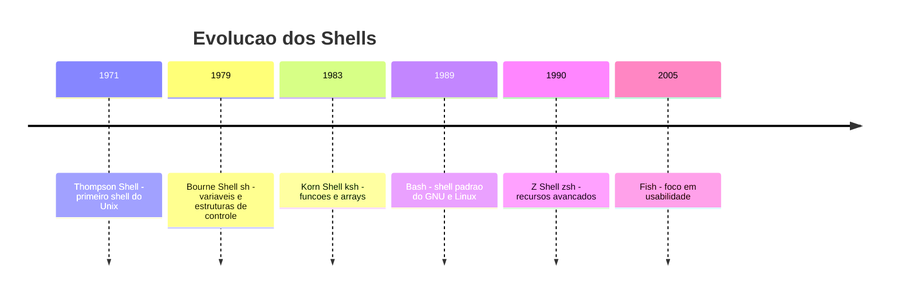

# 2.8 — Noções de Shell Scripting: Automatizando o Linux

[← Anterior: Usuários, Grupos e Serviços](cap02-mod07-usuarios-servicos.md) · [Próximo: Terminal vs Interpretador de Comandos →](cap03-mod01-terminal-vs-shell.md)

---

## Introdução

Ao longo de todo o Capítulo 2, aprendemos a usar o Linux: entendemos sua história, exploramos distribuições, conhecemos o kernel, navegamos pela estrutura de diretórios, configuramos permissões, instalamos pacotes e gerenciamos usuários e serviços. Em cada módulo, usamos comandos no terminal para fazer as coisas acontecerem — `ls`, `chmod`, `apt install`, `systemctl`, `useradd`.

Mas e se você precisar executar os mesmos 10 comandos toda vez que configura um novo servidor? E se precisar verificar o espaço em disco de 50 servidores e gerar um relatório? E se quiser automatizar o backup do banco de dados toda noite, com verificação de erros e notificação por email?

Digitar os mesmos comandos repetidamente é tedioso e propenso a erros. A solução é escrever um **shell script** — um arquivo de texto que contém uma sequência de comandos que o sistema executa automaticamente.

Lembre-se do mantra do curso: **"Qual problema você quer resolver?"** Shell scripting resolve o problema da **automação** — transformar tarefas manuais e repetitivas em processos automáticos e confiáveis. É a ponte entre "saber usar o terminal" e "ser produtivo com o terminal".

E aqui entra o segundo mantra: **"Conceitos são para sempre, ferramentas apenas os implementam."** Shell scripting é sua primeira experiência real com **programação**. Os conceitos que vamos ver aqui — variáveis, condicionais, loops, funções — são os mesmos que você vai encontrar em Python (Capítulo 5), C (Capítulo 6) e C# (Capítulo 8). A sintaxe muda, mas a lógica é idêntica.

Para quem vai programar, shell scripting é uma habilidade que você vai usar durante toda a carreira:
- Automatizar configuração de ambientes de desenvolvimento
- Criar scripts de deploy para colocar aplicações em produção
- Escrever scripts de CI/CD (integração e entrega contínua)
- Automatizar tarefas de manutenção em servidores
- Criar ferramentas auxiliares para o dia a dia

Vamos começar do zero e construir passo a passo.

---

## A Analogia: A Receita de Cozinha Automatizada

Lá no Capítulo 1, usamos a analogia da cozinha: o computador é a cozinha, a CPU é o cozinheiro, a RAM é a bancada e os programas são receitas. Vamos expandir essa analogia.

Até agora, você estava na cozinha dando instruções ao cozinheiro uma por uma: "pegue a farinha", "misture com os ovos", "leve ao forno". Cada instrução era um comando no terminal.

Um shell script é como escrever a receita inteira em um papel e entregar ao cozinheiro. Ele segue todas as instruções na ordem, sem que você precise ficar ao lado dele o tempo todo. E mais: a receita pode ter decisões ("se a massa estiver muito líquida, adicione mais farinha") e repetições ("mexa por 5 minutos, verificando a consistência a cada minuto").

Essa é exatamente a diferença entre usar o terminal interativamente e escrever scripts: no terminal, você dá um comando por vez. No script, você escreve todos os comandos de uma vez e o sistema executa sozinho.

---

## O que é um Shell?

Antes de falar sobre shell scripting, precisamos entender o que é um **shell**.

O **shell** é o programa que interpreta seus comandos. Quando você abre o terminal e digita `ls`, quem entende esse comando e pede ao sistema operacional para listar os arquivos é o shell. Ele é o intermediário entre você e o kernel do Linux.

Existem vários shells disponíveis no Linux:

| Shell | Nome completo | Criado em | Caracteristicas |
|-------|--------------|-----------|-----------------|
| sh | Bourne Shell | 1979 | O shell original do Unix, simples e básico |
| bash | Bourne Again Shell | 1989 | O mais popular, padrão na maioria das distribuicoes |
| zsh | Z Shell | 1990 | Mais recursos que o bash, popular entre desenvolvedores |
| fish | Friendly Interactive Shell | 2005 | Foco em usabilidade, autocompletar avancado |
| dash | Debian Almquist Shell | 1997 | Muito leve e rápido, usado para scripts do sistema |
| ksh | Korn Shell | 1983 | Popular em ambientes corporativos Unix |

O **bash** (Bourne Again Shell) é o shell padrão na maioria das distribuições Linux e é o que vamos usar neste módulo. O nome é um trocadilho: "Bourne Again" soa como "born again" (renascido), porque é uma versão melhorada do Bourne Shell original.

### A História do Shell

A história dos shells ajuda a entender por que a sintaxe do bash é como é.

O primeiro shell do Unix foi criado por **Ken Thompson** em 1971 — era extremamente básico, sem variáveis nem estruturas de controle. Em 1979, **Stephen Bourne** criou o **Bourne Shell** (sh) nos Bell Labs, introduzindo variáveis, condicionais e loops. Esse shell definiu a sintaxe que usamos até hoje.

Em 1989, **Brian Fox** criou o **bash** como parte do projeto GNU (o mesmo projeto que criou as ferramentas que complementam o kernel Linux). O bash era compatível com o Bourne Shell mas adicionava muitos recursos: histórico de comandos, autocompletar, arrays, aritmética e muito mais.



### Verificando seu Shell

Para saber qual shell você está usando:

```
# Ver o shell atual
echo $SHELL
```

Saída esperada:
```
/bin/bash
```

```
# Ver todos os shells disponiveis no sistema
cat /etc/shells
```

Saída esperada:
```
/bin/sh
/bin/bash
/usr/bin/bash
/bin/zsh
/usr/bin/zsh
```

---

## Seu Primeiro Shell Script

Vamos criar o script mais simples possível e entender cada parte.

### Passo 1: Criar o Arquivo

Abra seu editor de texto e crie um arquivo chamado `primeiro.sh`:

```bash
#!/bin/bash
# Meu primeiro shell script
# "echo" = imprimir na tela

echo "Ola, mundo!"
echo "Eu sou um shell script."
echo "Hoje e $(date +%d/%m/%Y)"
```

Saída esperada:
```
Ola, mundo!
Eu sou um shell script.
Hoje e 15/01/2025
```

### Passo 2: Entender Cada Linha

**Linha 1: `#!/bin/bash`** — Essa linha especial é chamada de **shebang** (ou hashbang). Ela diz ao sistema qual programa deve interpretar o script. O `#!` é o marcador, e `/bin/bash` é o caminho do interpretador. Sem o shebang, o sistema não sabe qual shell usar para executar o script.

O nome "shebang" vem da combinação de "sharp" (#) e "bang" (!). É uma das tradições mais antigas do Unix — existe desde os anos 1970.

**Linha 2 e 3: `# comentário`** — Linhas que começam com `#` (exceto o shebang) são **comentários**. O shell ignora essas linhas. Comentários são essenciais para explicar o que o script faz — para você mesmo no futuro e para outras pessoas que lerem o código.

**Linha 5: `echo "Ola, mundo!"`** — O comando `echo` imprime texto na tela. É o equivalente do `print()` em Python, que veremos no Capítulo 5.

**Linha 7: `$(date +%d/%m/%Y)`** — O `$()` executa um comando e insere o resultado no lugar. Aqui, executa o comando `date` formatado como dia/mês/ano. Isso se chama **substituição de comando** (command substitution).

### Passo 3: Tornar Executável e Rodar

Lembra do módulo 2.5, onde aprendemos sobre permissões? Um arquivo de texto não é executável por padrão. Precisamos dar permissão de execução:

```
# Dar permissao de execucao
chmod +x primeiro.sh

# Executar o script
./primeiro.sh
```

O `./` antes do nome é necessário porque o diretório atual geralmente não está no **PATH** (a lista de diretórios onde o sistema procura programas). O `./` diz explicitamente "execute o arquivo que está aqui neste diretório".

### Formas Alternativas de Executar

```
# Forma 1: com ./ (precisa de chmod +x)
./primeiro.sh

# Forma 2: chamando o bash explicitamente (nao precisa de chmod +x)
bash primeiro.sh

# Forma 3: usando source (executa no shell atual, nao em subshell)
source primeiro.sh
```

A diferença entre `./script.sh` e `source script.sh` é sutil mas importante: o `./` cria um novo processo (subshell) para executar o script, enquanto `source` executa no shell atual. Isso importa quando o script define variáveis — com `source`, as variáveis ficam disponíveis depois; com `./`, elas desaparecem quando o script termina.

---

## Variáveis: Guardando Informações

No Capítulo 5, vamos estudar variáveis em profundidade com Python. Aqui, vamos ter o primeiro contato com o conceito — e a analogia da **caixa etiquetada** que usaremos ao longo de todo o curso.

### O que é uma Variável?

Uma **variável** é como uma caixa com uma etiqueta. A etiqueta é o nome da variável, e o conteúdo da caixa é o valor. Você pode colocar algo dentro, olhar o que tem dentro e trocar o conteúdo.

```bash
#!/bin/bash
# Variaveis em bash

# Criar variaveis (SEM espaco ao redor do =)
nome="Ana"          # "name" = nome
idade=25            # "age" = idade
cidade="Sao Paulo"  # "city" = cidade

# Usar variaveis (com $ na frente)
echo "Nome: $nome"
echo "Idade: $idade"
echo "Cidade: $cidade"
```

Saída esperada:
```
Nome: Ana
Idade: 25
Cidade: Sao Paulo
```

### Regras Importantes sobre Variáveis no Bash

O bash tem regras rígidas sobre variáveis que pegam muita gente de surpresa:

| Regra | Correto | Errado | Por que |
|-------|---------|--------|---------|
| Sem espaco no = | `nome="Ana"` | `nome = "Ana"` | Com espaco, bash interpreta como comando |
| $ para usar | `echo $nome` | `echo nome` | Sem $, imprime a palavra "nome" literalmente |
| Aspas duplas para texto com espaco | `cidade="São Paulo"` | `cidade=São Paulo` | Sem aspas, "Paulo" vira outro comando |
| Nomes sem acento | `nome_completo` | `nome_complèto` | Bash não aceita acentos em nomes de variáveis |
| Sem comecar com número | `var1="ok"` | `1var="ok"` | Nomes devem comecar com letra ou _ |

O erro mais comum de iniciantes é colocar espaço ao redor do `=`. Em bash, `nome = "Ana"` não é uma atribuição — o bash interpreta `nome` como um comando, `=` como primeiro argumento e `"Ana"` como segundo argumento. Resultado: erro "command not found".

### Variáveis de Ambiente

Além das variáveis que você cria, o sistema tem **variáveis de ambiente** (environment variables) — variáveis predefinidas que contêm informações sobre o sistema:

```bash
#!/bin/bash
# Variaveis de ambiente do sistema

echo "Usuario atual: $USER"
echo "Diretorio home: $HOME"
echo "Diretorio atual: $PWD"
echo "Shell em uso: $SHELL"
echo "Caminho de busca: $PATH"
echo "Nome do computador: $HOSTNAME"
echo "Idioma do sistema: $LANG"
```

Saída esperada:
```
Usuario atual: ana
Diretorio home: /home/ana
Diretorio atual: /home/ana/scripts
Shell em uso: /bin/bash
Caminho de busca: /usr/local/sbin:/usr/local/bin:/usr/sbin:/usr/bin:/sbin:/bin
Nome do computador: meu-pc
Idioma do sistema: pt_BR.UTF-8
```

A variável `$PATH` é especialmente importante — ela contém a lista de diretórios onde o sistema procura programas quando você digita um comando. Quando você digita `python3`, o sistema procura em cada diretório do PATH até encontrar o executável.

### Variáveis Especiais do Bash

O bash tem variáveis especiais que são muito úteis em scripts:

| Variável | Significado | Exemplo |
|----------|-------------|---------|
| `$0` | Nome do script | `./meu-script.sh` |
| `$1, $2, $3...` | Argumentos passados ao script | Primeiro, segundo, terceiro argumento |
| `$#` | Número de argumentos | 3 |
| `$@` | Todos os argumentos | "arg1" "arg2" "arg3" |
| `$?` | Código de saida do último comando | 0 = sucesso, outro = erro |
| `$$` | PID do script atual | 12345 |

```bash
#!/bin/bash
# Demonstrando variaveis especiais
# Uso: ./especiais.sh argumento1 argumento2

echo "Nome do script: $0"
echo "Primeiro argumento: $1"
echo "Segundo argumento: $2"
echo "Total de argumentos: $#"
echo "Todos os argumentos: $@"
echo "PID deste script: $$"
```

Para executar:
```
./especiais.sh hello world
```

Saída esperada:
```
Nome do script: ./especiais.sh
Primeiro argumento: hello
Segundo argumento: world
Total de argumentos: 2
Todos os argumentos: hello world
PID deste script: 12345
```

### Lendo Entrada do Usuário

O comando `read` permite que o script peça informações ao usuário:

```bash
#!/bin/bash
# Lendo entrada do usuario
# "read" = ler

echo "Qual e o seu nome?"
read nome

echo "Quantos anos voce tem?"
read idade

echo "Ola, $nome! Voce tem $idade anos."
```

Saída esperada (com interação):
```
Qual e o seu nome?
Ana
Quantos anos voce tem?
25
Ola, Ana! Voce tem 25 anos.
```

```bash
#!/bin/bash
# read com prompt na mesma linha
# -p = prompt (mensagem antes da leitura)

read -p "Digite seu nome: " nome
read -p "Digite sua idade: " idade
read -sp "Digite sua senha: " senha  # -s = silencioso (nao mostra o que digita)
echo ""  # Pula linha apos a senha

echo "Nome: $nome, Idade: $idade"
echo "Senha tem ${#senha} caracteres"  # ${#var} = tamanho da variavel
```

Saída esperada:
```
Digite seu nome: Ana
Digite sua idade: 25
Digite sua senha:
Nome: Ana, Idade: 25
Senha tem 8 caracteres
```

---

## Condicionais: Tomando Decisões

Até agora, nossos scripts executam comandos em sequência, do primeiro ao último. Mas e se quisermos que o script faça coisas diferentes dependendo de uma condição? Para isso existem os **condicionais** — estruturas que permitem ao script tomar decisões.

### O `if` — Se... Então...

A estrutura mais básica de decisão é o `if` (se):

```bash
#!/bin/bash
# Condicional basico
# "if" = se, "then" = entao, "fi" = fim do if

idade=18

if [ $idade -ge 18 ]; then
    echo "Voce e maior de idade."
fi
```

Saída esperada:
```
Voce e maior de idade.
```

A sintaxe do `if` no bash tem algumas particularidades:
- Os colchetes `[ ]` são na verdade um comando (chamado `test`)
- É obrigatório ter **espaço** depois de `[` e antes de `]`
- O `then` pode ficar na mesma linha (com `;`) ou na linha seguinte
- O `fi` (if ao contrário) fecha o bloco

### O `if-else` — Se... Senão...

```bash
#!/bin/bash
# Condicional com else
# "else" = senao

read -p "Digite sua idade: " idade

if [ $idade -ge 18 ]; then
    echo "Voce e maior de idade."
    echo "Pode tirar carteira de motorista."
else
    echo "Voce e menor de idade."
    echo "Faltam $((18 - idade)) anos para a maioridade."
fi
```

Saída esperada (se digitar 15):
```
Digite sua idade: 15
Voce e menor de idade.
Faltam 3 anos para a maioridade.
```

### O `elif` — Se... Senão Se...

```bash
#!/bin/bash
# Condicional com elif (else if)
# "elif" = senao se

read -p "Digite sua nota (0-100): " nota

if [ $nota -ge 90 ]; then
    echo "Conceito: A - Excelente!"
elif [ $nota -ge 70 ]; then
    echo "Conceito: B - Bom"
elif [ $nota -ge 50 ]; then
    echo "Conceito: C - Regular"
else
    echo "Conceito: D - Precisa melhorar"
fi
```

Saída esperada (se digitar 85):
```
Digite sua nota (0-100): 85
Conceito: B - Bom
```

### Operadores de Comparação

No bash, os operadores de comparação para números são diferentes dos que você vai ver em outras linguagens:

| Operador bash | Significado | Equivalente em Python |
|---------------|-------------|----------------------|
| `-eq` | Igual a (equal) | `==` |
| `-ne` | Diferente de (not equal) | `!=` |
| `-gt` | Maior que (greater than) | `>` |
| `-ge` | Maior ou igual (greater or equal) | `>=` |
| `-lt` | Menor que (less than) | `<` |
| `-le` | Menor ou igual (less or equal) | `<=` |

Para comparar textos (strings), os operadores são diferentes:

| Operador | Significado |
|----------|-------------|
| `=` | Textos iguais |
| `!=` | Textos diferentes |
| `-z` | Texto vazio (zero length) |
| `-n` | Texto não vazio (non-zero length) |

```bash
#!/bin/bash
# Comparando textos

read -p "Digite sim ou nao: " resposta

if [ "$resposta" = "sim" ]; then
    echo "Voce disse sim!"
elif [ "$resposta" = "nao" ]; then
    echo "Voce disse nao!"
else
    echo "Resposta invalida: $resposta"
fi
```

Note as aspas duplas ao redor de `"$resposta"` — isso é importante. Se a variável estiver vazia e você não usar aspas, o bash vê `[ = "sim" ]` (sem nada antes do `=`), o que causa erro. Com aspas, ele vê `[ "" = "sim" ]`, que funciona corretamente. Essa é uma das armadilhas mais comuns do bash.

### Testando Arquivos e Diretórios

O bash tem operadores especiais para verificar propriedades de arquivos — algo muito útil em scripts de administração:

| Operador | Verdadeiro se... |
|----------|-----------------|
| `-f arquivo` | O arquivo existe e e um arquivo regular |
| `-d diretório` | O diretório existe |
| `-e caminho` | O caminho existe - arquivo ou diretório |
| `-r arquivo` | O arquivo existe e tem permissão de leitura |
| `-w arquivo` | O arquivo existe e tem permissão de escrita |
| `-x arquivo` | O arquivo existe e tem permissão de execução |
| `-s arquivo` | O arquivo existe e não esta vazio |

```bash
#!/bin/bash
# Verificando arquivos

arquivo="/etc/passwd"

if [ -f "$arquivo" ]; then
    echo "O arquivo $arquivo existe."
    
    if [ -r "$arquivo" ]; then
        echo "Voce tem permissao de leitura."
        echo "O arquivo tem $(wc -l < "$arquivo") linhas."
    else
        echo "Voce NAO tem permissao de leitura."
    fi
else
    echo "O arquivo $arquivo nao existe."
fi
```

Saída esperada:
```
O arquivo /etc/passwd existe.
Voce tem permissao de leitura.
O arquivo tem 42 linhas.
```

### Combinando Condições

Você pode combinar condições com operadores lógicos:

| Operador | Significado |
|----------|-------------|
| `-a` ou `&&` | E (AND) - ambas condições devem ser verdadeiras |
| `-o` ou `\|\|` | OU (OR) - pelo menos uma condição deve ser verdadeira |
| `!` | NAO (NOT) - inverte a condição |

```bash
#!/bin/bash
# Combinando condicoes

read -p "Digite sua idade: " idade
read -p "Tem carteira de motorista? (sim/nao): " carteira

if [ $idade -ge 18 ] && [ "$carteira" = "sim" ]; then
    echo "Voce pode dirigir!"
elif [ $idade -ge 18 ] && [ "$carteira" = "nao" ]; then
    echo "Voce tem idade, mas precisa tirar a carteira."
else
    echo "Voce ainda nao pode dirigir."
fi
```

---

## Loops: Repetindo Ações

Loops (laços de repetição) permitem que o script execute o mesmo bloco de comandos várias vezes. Existem três tipos principais no bash.

### O `for` — Para Cada Item...

O `for` executa um bloco de comandos para cada item de uma lista:

```bash
#!/bin/bash
# Loop for basico
# "for" = para cada, "in" = em, "do" = faca, "done" = feito

for fruta in maca banana laranja uva; do
    echo "Eu gosto de $fruta"
done
```

Saída esperada:
```
Eu gosto de maca
Eu gosto de banana
Eu gosto de laranja
Eu gosto de uva
```

### `for` com Sequência Numérica

```bash
#!/bin/bash
# Loop for com numeros

# Forma 1: usando seq
for i in $(seq 1 5); do
    echo "Numero: $i"
done

echo "---"

# Forma 2: usando range do bash
for i in {1..5}; do
    echo "Contando: $i"
done

echo "---"

# Forma 3: estilo C (para quem ja conhece programacao)
for ((i=1; i<=5; i++)); do
    echo "Valor: $i"
done
```

Saída esperada:
```
Numero: 1
Numero: 2
Numero: 3
Numero: 4
Numero: 5
---
Contando: 1
Contando: 2
Contando: 3
Contando: 4
Contando: 5
---
Valor: 1
Valor: 2
Valor: 3
Valor: 4
Valor: 5
```

### `for` com Arquivos — Uso Prático

Uma das aplicações mais comuns do `for` é iterar sobre arquivos:

```bash
#!/bin/bash
# Listar todos os arquivos .md no diretorio atual

echo "Arquivos Markdown encontrados:"
echo "=============================="

contador=0
for arquivo in *.md; do
    if [ -f "$arquivo" ]; then
        linhas=$(wc -l < "$arquivo")
        tamanho=$(du -h "$arquivo" | cut -f1)
        echo "  $arquivo - $linhas linhas - $tamanho"
        contador=$((contador + 1))
    fi
done

echo "=============================="
echo "Total: $contador arquivos"
```

Saída esperada:
```
Arquivos Markdown encontrados:
==============================
  readme.md - 150 linhas - 4.0K
  notas.md - 30 linhas - 1.0K
  plano.md - 85 linhas - 2.5K
==============================
Total: 3 arquivos
```

### O `while` — Enquanto...

O `while` executa um bloco enquanto uma condição for verdadeira:

```bash
#!/bin/bash
# Loop while basico
# "while" = enquanto

contador=1

while [ $contador -le 5 ]; do
    echo "Contagem: $contador"
    contador=$((contador + 1))  # Incrementa o contador
done

echo "Fim! Contador final: $contador"
```

Saída esperada:
```
Contagem: 1
Contagem: 2
Contagem: 3
Contagem: 4
Contagem: 5
Fim! Contador final: 6
```

### `while` Lendo Arquivo Linha por Linha

Uma das aplicações mais úteis do `while` é ler um arquivo linha por linha:

```bash
#!/bin/bash
# Lendo um arquivo linha por linha

arquivo="/etc/passwd"
contador=0

while IFS= read -r linha; do
    contador=$((contador + 1))
    # Extrair apenas o nome do usuario (primeiro campo, separado por :)
    usuario=$(echo "$linha" | cut -d: -f1)
    echo "Linha $contador: usuario = $usuario"
done < "$arquivo"

echo "Total de linhas lidas: $contador"
```

Saída esperada (primeiras linhas):
```
Linha 1: usuario = root
Linha 2: usuario = daemon
Linha 3: usuario = bin
...
Total de linhas lidas: 42
```

O `IFS= read -r linha` pode parecer estranho, mas cada parte tem um propósito:
- `IFS=` — preserva espaços no início e fim da linha
- `read -r` — não interpreta barras invertidas como caracteres especiais
- `linha` — nome da variável que recebe cada linha

### O `until` — Até Que...

O `until` é o oposto do `while` — executa enquanto a condição for **falsa** (ou seja, até que seja verdadeira):

```bash
#!/bin/bash
# Loop until
# "until" = ate que

contador=1

until [ $contador -gt 5 ]; do
    echo "Contagem: $contador"
    contador=$((contador + 1))
done
```

Saída esperada (idêntica ao while anterior):
```
Contagem: 1
Contagem: 2
Contagem: 3
Contagem: 4
Contagem: 5
```

Na prática, o `until` é pouco usado — a maioria dos programadores prefere `while` com a condição invertida. Mas é bom saber que existe.

### Controlando Loops: `break` e `continue`

Dois comandos especiais controlam o fluxo dentro de loops:

- **`break`**: sai do loop imediatamente
- **`continue`**: pula para a próxima iteração

```bash
#!/bin/bash
# Demonstrando break e continue

echo "=== Exemplo com break ==="
for i in {1..10}; do
    if [ $i -eq 6 ]; then
        echo "Encontrei o 6, parando!"
        break
    fi
    echo "Numero: $i"
done

echo ""
echo "=== Exemplo com continue ==="
for i in {1..10}; do
    # Pular numeros pares
    if [ $((i % 2)) -eq 0 ]; then
        continue
    fi
    echo "Numero impar: $i"
done
```

Saída esperada:
```
=== Exemplo com break ===
Numero: 1
Numero: 2
Numero: 3
Numero: 4
Numero: 5
Encontrei o 6, parando!

=== Exemplo com continue ===
Numero impar: 1
Numero impar: 3
Numero impar: 5
Numero impar: 7
Numero impar: 9
```

O operador `%` é o **módulo** (resto da divisão). `$((i % 2))` calcula o resto da divisão de `i` por 2. Se o resto é 0, o número é par. Vamos estudar operadores em detalhes no Capítulo 5.

---

## Funções: Organizando o Código

Quando um script cresce, repetir o mesmo bloco de código em vários lugares se torna um problema. **Funções** resolvem isso — são blocos de código reutilizáveis que você define uma vez e chama quantas vezes quiser.

Lembra da analogia da receita? Uma função é como uma sub-receita. A receita principal de um bolo pode dizer "prepare o recheio" — e a sub-receita do recheio está escrita separadamente, podendo ser usada em outros bolos também.

```bash
#!/bin/bash
# Funcoes em bash

# Definindo uma funcao
saudacao() {
    echo "Ola, $1!"
    echo "Bem-vindo ao sistema."
}

# Chamando a funcao
saudacao "Ana"
saudacao "Joao"
saudacao "Maria"
```

Saída esperada:
```
Ola, Ana!
Bem-vindo ao sistema.
Ola, Joao!
Bem-vindo ao sistema.
Ola, Maria!
Bem-vindo ao sistema.
```

Note que `$1` dentro da função se refere ao primeiro argumento passado **para a função**, não para o script. Cada função tem seus próprios `$1`, `$2`, etc.

### Funções com Retorno

Funções podem retornar valores de duas formas:

```bash
#!/bin/bash
# Funcoes com retorno

# Forma 1: usando echo (capturado com $())
calcular_dobro() {
    local numero=$1  # "local" = variavel local da funcao
    echo $((numero * 2))
}

resultado=$(calcular_dobro 15)
echo "O dobro de 15 e: $resultado"

# Forma 2: usando return (codigo de saida, 0-255)
verificar_par() {
    local numero=$1
    if [ $((numero % 2)) -eq 0 ]; then
        return 0  # 0 = sucesso = e par
    else
        return 1  # 1 = falha = nao e par
    fi
}

if verificar_par 42; then
    echo "42 e par"
else
    echo "42 e impar"
fi
```

Saída esperada:
```
O dobro de 15 e: 30
42 e par
```

A palavra-chave `local` é importante — ela faz com que a variável exista apenas dentro da função. Sem `local`, a variável seria global e poderia interferir com outras partes do script.

### Exemplo Prático: Script com Funções Organizadas

```bash
#!/bin/bash
# Script organizado com funcoes
# Verifica a saude do sistema

# Funcao: verificar espaco em disco
verificar_disco() {
    echo "=== Espaco em Disco ==="
    local uso=$(df -h / | awk 'NR==2 {print $5}' | tr -d '%')
    
    if [ $uso -gt 90 ]; then
        echo "CRITICO: Disco com $uso% de uso!"
    elif [ $uso -gt 70 ]; then
        echo "AVISO: Disco com $uso% de uso."
    else
        echo "OK: Disco com $uso% de uso."
    fi
    echo ""
}

# Funcao: verificar memoria
verificar_memoria() {
    echo "=== Memoria RAM ==="
    local total=$(free -m | awk 'NR==2 {print $2}')
    local usado=$(free -m | awk 'NR==2 {print $3}')
    local porcentagem=$((usado * 100 / total))
    
    echo "Total: ${total}MB | Usado: ${usado}MB | Uso: ${porcentagem}%"
    
    if [ $porcentagem -gt 90 ]; then
        echo "CRITICO: Memoria quase cheia!"
    else
        echo "OK: Memoria dentro do normal."
    fi
    echo ""
}

# Funcao: verificar servicos
verificar_servicos() {
    echo "=== Servicos Essenciais ==="
    local servicos=("ssh" "nginx" "mysql")
    
    for servico in "${servicos[@]}"; do
        if systemctl is-active --quiet "$servico" 2>/dev/null; then
            echo "  $servico: RODANDO"
        else
            echo "  $servico: PARADO ou NAO INSTALADO"
        fi
    done
    echo ""
}

# Programa principal
echo "======================================"
echo "  Verificacao de Saude do Sistema"
echo "  Data: $(date '+%d/%m/%Y %H:%M')"
echo "======================================"
echo ""

verificar_disco
verificar_memoria
verificar_servicos

echo "Verificacao concluida."
```

Saída esperada:
```
======================================
  Verificacao de Saude do Sistema
  Data: 15/01/2025 10:30
======================================

=== Espaco em Disco ===
OK: Disco com 45% de uso.

=== Memoria RAM ===
Total: 8192MB | Usado: 3276MB | Uso: 40%
OK: Memoria dentro do normal.

=== Servicos Essenciais ===
  ssh: RODANDO
  nginx: RODANDO
  mysql: PARADO ou NAO INSTALADO

Verificacao concluida.
```

Esse script demonstra como funções tornam o código organizado e legível. Cada função tem uma responsabilidade clara, e o programa principal é apenas uma sequência de chamadas de função.

---

## Tratamento de Erros: Quando as Coisas Dão Errado

Scripts que não tratam erros são perigosos. Imagine um script de backup que falha ao conectar no banco de dados mas continua executando — ele pode sobrescrever o backup anterior com um arquivo vazio, e você perde tudo.

### Códigos de Saída

Todo comando no Linux retorna um **código de saída** (exit code) quando termina:
- **0** = sucesso
- **Qualquer outro número** = erro

Você pode verificar o código de saída do último comando com `$?`:

```bash
#!/bin/bash
# Verificando codigos de saida

# Comando que funciona
ls /etc/passwd
echo "Codigo de saida: $?"  # 0 = sucesso

# Comando que falha
ls /arquivo/que/nao/existe 2>/dev/null
echo "Codigo de saida: $?"  # 2 = erro (arquivo nao encontrado)
```

Saída esperada:
```
/etc/passwd
Codigo de saida: 0
Codigo de saida: 2
```

### O `set -e`: Parar no Primeiro Erro

A diretiva `set -e` faz o script parar imediatamente se qualquer comando falhar:

```bash
#!/bin/bash
set -e  # Parar no primeiro erro

echo "Passo 1: OK"
echo "Passo 2: OK"
ls /arquivo/que/nao/existe  # Falha aqui
echo "Passo 3: Nunca chega aqui"
```

Saída esperada:
```
Passo 1: OK
Passo 2: OK
ls: cannot access '/arquivo/que/nao/existe': No such file or directory
```

O script para no passo que falhou. Sem `set -e`, ele continuaria executando os passos seguintes, o que poderia causar problemas.

### Boas Práticas de Tratamento de Erros

```bash
#!/bin/bash
# Script robusto com tratamento de erros
set -euo pipefail
# -e = parar no primeiro erro
# -u = tratar variaveis nao definidas como erro
# -o pipefail = detectar erros em pipes

# Funcao para exibir erros
erro() {
    echo "ERRO: $1" >&2  # >&2 envia para stderr (saida de erro)
    exit 1
}

# Verificar se o argumento foi passado
if [ $# -lt 1 ]; then
    erro "Uso: $0 <diretorio-de-backup>"
fi

diretorio_backup="$1"

# Verificar se o diretorio existe
if [ ! -d "$diretorio_backup" ]; then
    erro "Diretorio '$diretorio_backup' nao existe."
fi

echo "Backup sera salvo em: $diretorio_backup"
echo "Iniciando backup..."

# Simular backup
data=$(date +%Y%m%d_%H%M%S)
arquivo_backup="$diretorio_backup/backup_$data.tar.gz"

# Se o tar falhar, o script para (por causa do set -e)
tar -czf "$arquivo_backup" /etc/passwd /etc/group 2>/dev/null

echo "Backup concluido: $arquivo_backup"
echo "Tamanho: $(du -h "$arquivo_backup" | cut -f1)"
```

A linha `set -euo pipefail` é considerada a melhor prática para scripts bash. Muitos desenvolvedores experientes colocam essa linha em todo script que escrevem.

---

## Pipes e Redirecionamento em Scripts

No Capítulo 3, vamos estudar pipes e redirecionamento em profundidade. Aqui, vamos ver o básico que você precisa para escrever scripts úteis.

### Pipes: Conectando Comandos

O **pipe** (`|`) conecta a saída de um comando à entrada de outro. É como uma linha de montagem onde cada estação faz uma parte do trabalho:

```bash
#!/bin/bash
# Exemplos de pipes

# Contar quantos usuarios existem no sistema
total_usuarios=$(cat /etc/passwd | wc -l)
echo "Total de usuarios: $total_usuarios"

# Listar apenas usuarios humanos (UID >= 1000)
echo "Usuarios humanos:"
cat /etc/passwd | awk -F: '$3 >= 1000 && $3 < 65534 {print "  " $1 " (UID: " $3 ")"}'

# Top 5 processos que mais usam memoria
echo ""
echo "Top 5 processos por memoria:"
ps aux --sort=-%mem | head -6 | tail -5 | awk '{printf "  %-15s %s%%\n", $11, $4}'
```

### Redirecionamento: Salvando Saída em Arquivos

```bash
#!/bin/bash
# Redirecionamento de saida

# > cria ou sobrescreve o arquivo
echo "Relatorio do sistema" > relatorio.txt
echo "Data: $(date)" >> relatorio.txt  # >> adiciona ao final

# Redirecionar saida de comando para arquivo
df -h >> relatorio.txt
echo "" >> relatorio.txt
free -m >> relatorio.txt

echo "Relatorio salvo em relatorio.txt"
echo "Conteudo:"
cat relatorio.txt
```

| Operador | O que faz |
|----------|-----------|
| `>` | Redireciona saida para arquivo, sobrescrevendo |
| `>>` | Redireciona saida para arquivo, adicionando ao final |
| `2>` | Redireciona erros para arquivo |
| `2>&1` | Redireciona erros para o mesmo lugar da saida |
| `< arquivo` | Usa arquivo como entrada |
| `/dev/null` | Descarta a saida - buraco negro |

```bash
#!/bin/bash
# Exemplos de redirecionamento

# Descartar mensagens de erro
find / -name "*.conf" 2>/dev/null

# Salvar saida e erros em arquivos separados
comando_qualquer > saida.txt 2> erros.txt

# Salvar tudo (saida e erros) no mesmo arquivo
comando_qualquer > tudo.txt 2>&1
```

O `/dev/null` é um arquivo especial que descarta tudo que é escrito nele. É como um buraco negro — tudo que entra desaparece. É muito usado para silenciar mensagens de erro que você não quer ver.

---

## Scripts Práticos do Dia a Dia

Vamos ver alguns scripts que desenvolvedores realmente usam no dia a dia.

### Script 1: Backup Simples

```bash
#!/bin/bash
# backup.sh - Script de backup simples
set -euo pipefail

# Configuracao
diretorio_origem="$HOME/projetos"
diretorio_destino="$HOME/backups"
data=$(date +%Y%m%d_%H%M%S)
arquivo="backup_$data.tar.gz"

# Criar diretorio de destino se nao existir
mkdir -p "$diretorio_destino"

# Criar o backup
echo "Criando backup de $diretorio_origem..."
tar -czf "$diretorio_destino/$arquivo" "$diretorio_origem" 2>/dev/null

# Verificar se deu certo
if [ -f "$diretorio_destino/$arquivo" ]; then
    tamanho=$(du -h "$diretorio_destino/$arquivo" | cut -f1)
    echo "Backup criado com sucesso!"
    echo "  Arquivo: $diretorio_destino/$arquivo"
    echo "  Tamanho: $tamanho"
else
    echo "ERRO: Falha ao criar backup!"
    exit 1
fi

# Remover backups com mais de 30 dias
echo "Removendo backups antigos..."
find "$diretorio_destino" -name "backup_*.tar.gz" -mtime +30 -delete
echo "Concluido."
```

### Script 2: Verificação de Saúde do Servidor

```bash
#!/bin/bash
# health-check.sh - Verificacao de saude do servidor
set -uo pipefail

# Cores para o terminal (opcional, melhora a leitura)
VERDE='\033[0;32m'
VERMELHO='\033[0;31m'
AMARELO='\033[1;33m'
SEM_COR='\033[0m'

ok() { echo -e "${VERDE}[OK]${SEM_COR} $1"; }
aviso() { echo -e "${AMARELO}[AVISO]${SEM_COR} $1"; }
erro() { echo -e "${VERMELHO}[ERRO]${SEM_COR} $1"; }

echo "=== Verificacao de Saude - $(date '+%d/%m/%Y %H:%M') ==="
echo ""

# 1. Verificar espaco em disco
uso_disco=$(df -h / | awk 'NR==2 {print $5}' | tr -d '%')
if [ "$uso_disco" -gt 90 ]; then
    erro "Disco: ${uso_disco}% usado - CRITICO"
elif [ "$uso_disco" -gt 70 ]; then
    aviso "Disco: ${uso_disco}% usado"
else
    ok "Disco: ${uso_disco}% usado"
fi

# 2. Verificar memoria
uso_mem=$(free | awk 'NR==2 {printf "%.0f", $3/$2 * 100}')
if [ "$uso_mem" -gt 90 ]; then
    erro "Memoria: ${uso_mem}% usada - CRITICO"
elif [ "$uso_mem" -gt 70 ]; then
    aviso "Memoria: ${uso_mem}% usada"
else
    ok "Memoria: ${uso_mem}% usada"
fi

# 3. Verificar carga da CPU (load average)
load=$(uptime | awk -F'load average:' '{print $2}' | awk -F, '{print $1}' | tr -d ' ')
ok "Load average: $load"

# 4. Verificar uptime
tempo_ligado=$(uptime -p)
ok "Sistema ligado: $tempo_ligado"

echo ""
echo "=== Verificacao concluida ==="
```

### Script 3: Configuração de Ambiente de Desenvolvimento

```bash
#!/bin/bash
# setup-dev.sh - Configura ambiente de desenvolvimento
set -euo pipefail

echo "=== Configuracao do Ambiente de Desenvolvimento ==="
echo ""

# Verificar se esta rodando como root (nao deveria)
if [ "$EUID" -eq 0 ]; then
    echo "ERRO: Nao execute este script como root!"
    echo "Use: ./setup-dev.sh (sem sudo)"
    exit 1
fi

# Atualizar sistema
echo "1. Atualizando sistema..."
sudo apt update -qq
sudo apt upgrade -y -qq

# Instalar ferramentas essenciais
echo "2. Instalando ferramentas..."
sudo apt install -y -qq git curl wget vim htop tree

# Instalar Python
echo "3. Instalando Python..."
sudo apt install -y -qq python3 python3-pip python3-venv

# Configurar Git
echo "4. Configurando Git..."
read -p "   Seu nome completo: " git_nome
read -p "   Seu email: " git_email
git config --global user.name "$git_nome"
git config --global user.email "$git_email"
git config --global init.defaultBranch main

# Criar estrutura de diretorios
echo "5. Criando diretorios..."
mkdir -p ~/projetos ~/scripts ~/backups

# Verificar instalacoes
echo ""
echo "=== Verificacao ==="
echo "Git: $(git --version)"
echo "Python: $(python3 --version)"
echo "Pip: $(pip3 --version 2>/dev/null || echo 'nao instalado')"

echo ""
echo "Ambiente configurado com sucesso!"
echo "Seus projetos ficam em: ~/projetos"
```

---

## Debugging: Quando o Script Não Funciona

Scripts vão falhar. Faz parte do processo. O importante é saber como encontrar e corrigir os problemas.

### O `set -x`: Modo Debug

A diretiva `set -x` faz o bash mostrar cada comando antes de executá-lo, precedido por `+`. É como ver o cozinheiro lendo cada passo da receita em voz alta antes de executar:

```bash
#!/bin/bash
set -x  # Ativar modo debug

nome="Ana"
echo "Ola, $nome"
resultado=$((2 + 3))
echo "2 + 3 = $resultado"
```

Saída esperada:
```
+ nome=Ana
+ echo 'Ola, Ana'
Ola, Ana
+ resultado=5
+ echo '2 + 3 = 5'
2 + 3 = 5
```

As linhas com `+` são o debug — mostram exatamente o que o bash está executando, com as variáveis já substituídas pelos seus valores. Isso é extremamente útil para encontrar onde um script está falhando.

Você pode ativar e desativar o debug em partes específicas do script:

```bash
#!/bin/bash

echo "Parte normal (sem debug)"

set -x  # Liga debug
echo "Parte com debug"
variavel="teste"
echo "$variavel"
set +x  # Desliga debug

echo "Parte normal de novo"
```

### Erros Comuns e Como Resolver

| Erro | Causa | Solução |
|------|-------|---------|
| `command not found` | Comando não existe ou não esta no PATH | Verificar nome do comando, instalar se necessário |
| `Permission denied` | Sem permissão de execução | `chmod +x script.sh` |
| `syntax error near unexpected token` | Erro de sintaxe no script | Verificar parenteses, colchetes, aspas |
| `unbound variable` | Variável não definida (com set -u) | Definir a variável antes de usar |
| `No such file or directory` | Arquivo ou diretório não existe | Verificar caminho, usar aspas em nomes com espaco |
| `integer expression expected` | Comparando texto como número | Usar operadores de texto em vez de numericos |
| `too many arguments` | Variável com espaco sem aspas | Colocar aspas: `"$variável"` |

### A Importância das Aspas

Um dos erros mais sutis em bash é esquecer de colocar aspas ao redor de variáveis. Veja a diferença:

```bash
#!/bin/bash
# O problema das aspas

arquivo="meu arquivo.txt"

# ERRADO: sem aspas, o bash ve dois argumentos
# ls interpreta como: ls meu arquivo.txt (dois arquivos)
ls $arquivo 2>/dev/null
# Resultado: erro - procura "meu" e "arquivo.txt" separadamente

# CORRETO: com aspas, o bash ve um argumento
# ls interpreta como: ls "meu arquivo.txt" (um arquivo)
ls "$arquivo" 2>/dev/null
# Resultado: funciona corretamente
```

A regra de ouro: **sempre use aspas duplas ao redor de variáveis**, exceto quando você explicitamente quer que o bash divida o valor em palavras.

---

## Shell Scripting e Programação: A Ponte

Este módulo é sua primeira experiência real com programação. Todos os conceitos que vimos aqui — variáveis, condicionais, loops, funções — são os pilares fundamentais de qualquer linguagem de programação.

Veja como os conceitos se traduzem entre bash e as linguagens que vamos estudar:

| Conceito | Bash | Python - Cap 5 | C - Cap 6 | C# - Cap 8 |
|----------|------|-----------------|-----------|-------------|
| Variável | `nome="Ana"` | `nome = "Ana"` | `char* nome = "Ana";` | `string nome = "Ana";` |
| Imprimir | `echo "Ola"` | `print("Ola")` | `printf("Ola\n");` | `Console.WriteLine("Ola");` |
| Condicional | `if [ ]; then fi` | `if: ... else:` | `if () { }` | `if () { }` |
| Loop for | `for i in; do done` | `for i in range():` | `for (i=0; i<n; i++)` | `for (i=0; i<n; i++)` |
| Loop while | `while [ ]; do done` | `while:` | `while () { }` | `while () { }` |
| Função | `nome() { }` | `def nome():` | `void nome() { }` | `void Nome() { }` |
| Comentário | `# texto` | `# texto` | `// texto` | `// texto` |

A sintaxe muda, mas a lógica é a mesma. Se você entendeu como um `if` funciona em bash, vai entender em Python, C e C# — só precisa aprender a nova sintaxe. Esse é o segundo mantra em ação: **conceitos são para sempre, ferramentas apenas os implementam**.

---

## Boas Práticas de Shell Scripting

Ao longo da sua carreira, você vai escrever e ler muitos scripts. Seguir boas práticas torna seus scripts mais seguros, legíveis e fáceis de manter.

### 1. Sempre Comece com o Shebang e Configurações de Segurança

```bash
#!/bin/bash
set -euo pipefail
```

### 2. Comente o Propósito do Script

```bash
#!/bin/bash
# backup-db.sh - Faz backup do banco de dados MySQL
# Uso: ./backup-db.sh [diretorio-destino]
# Autor: Ana Silva
# Data: 2025-01-15
set -euo pipefail
```

### 3. Use Variáveis para Configuração

```bash
# BOM: configuracao no topo, facil de mudar
DB_HOST="localhost"
DB_NAME="minha_app"
BACKUP_DIR="/var/backups/mysql"

# RUIM: valores hardcoded espalhados pelo script
mysqldump -h localhost minha_app > /var/backups/mysql/backup.sql
```

### 4. Sempre Use Aspas em Variáveis

```bash
# BOM
echo "$nome"
if [ -f "$arquivo" ]; then

# RUIM
echo $nome
if [ -f $arquivo ]; then
```

### 5. Use Funções para Organizar

```bash
# BOM: funcoes com responsabilidade clara
verificar_requisitos() { ... }
fazer_backup() { ... }
limpar_antigos() { ... }

# RUIM: tudo em sequencia sem organizacao
```

### 6. Trate Erros

```bash
# BOM: verificar se o comando funcionou
if ! mysqldump -u root "$DB_NAME" > "$arquivo"; then
    echo "ERRO: Falha no backup!" >&2
    exit 1
fi

# RUIM: ignorar erros
mysqldump -u root "$DB_NAME" > "$arquivo"
```

---

## Como a IA pode te ajudar aqui

Shell scripting tem uma sintaxe cheia de detalhes e armadilhas. A IA é uma parceira ideal para esse tipo de trabalho:

**Prompt 1 — Criar com ajuda da IA:**
> "Escreva um script bash que monitore o uso de disco e envie um alerta se passar de 80%. O script deve rodar via cron a cada hora."

**Prompt 2 — Entender erros comuns:**
> "Meu script bash está dando o erro 'unary operator expected' na linha do if. O que está errado?"

**Prompt 3 — Aprofundar o tema:**
> "Converta este script bash para Python: [cole o script]"

---

## Resumo do Módulo

| Conceito | Definição |
|----------|-----------|
| Shell | Programa que interpreta comandos do usuario |
| Bash | Bourne Again Shell - o shell padrão da maioria das distribuicoes Linux |
| Shell script | Arquivo de texto com sequência de comandos para execução automática |
| Shebang | Linha #!/bin/bash que indica qual interpretador usar |
| Variável | Espaco nomeado que armazena um valor |
| Variável de ambiente | Variável predefinida pelo sistema com informações do ambiente |
| Condicional if | Estrutura que executa código baseado em uma condição |
| Loop for | Estrutura que repete código para cada item de uma lista |
| Loop while | Estrutura que repete código enquanto uma condição for verdadeira |
| Função | Bloco de código reutilizavel com nome proprio |
| Código de saida | Número retornado por um comando indicando sucesso 0 ou erro |
| Pipe | Operador que conecta a saida de um comando a entrada de outro |
| Redirecionamento | Enviar saida de um comando para um arquivo |
| set -e | Diretiva que para o script no primeiro erro |
| set -x | Diretiva que ativa o modo debug |

---

## Glossário do Módulo

| Termo | Definição |
|-------|-----------|
| Bash | Bourne Again Shell - shell padrão do Linux, criado em 1989 |
| Background | Segundo plano - execução de processo sem ocupar o terminal |
| Break | Comando que sai de um loop imediatamente |
| Command substitution | Substituição de comando - executar comando dentro de outro com $() |
| Continue | Comando que pula para a próxima iteração de um loop |
| Dash | Debian Almquist Shell - shell leve usado para scripts do sistema |
| Debug | Depuracao - processo de encontrar e corrigir erros |
| Echo | Comando que imprime texto na tela |
| elif | Else if - senao se, usado em condicionais com multiplas opcoes |
| Environment variable | Variável de ambiente - variável predefinida pelo sistema |
| Exit code | Código de saida - número que indica sucesso ou erro de um comando |
| Fish | Friendly Interactive Shell - shell focado em usabilidade |
| For loop | Laco for - estrutura de repetição para cada item |
| Function | Função - bloco de código reutilizavel |
| Hashbang | Outro nome para shebang |
| If | Condicional - estrutura de decisao |
| Local | Palavra-chave que define variável local dentro de função |
| Loop | Laco de repetição - estrutura que executa código multiplas vezes |
| PATH | Variável de ambiente com diretórios onde o sistema busca programas |
| Pipe | Operador que conecta saida de um comando a entrada de outro |
| Read | Comando que le entrada do usuario |
| Redirect | Redirecionamento - enviar saida para arquivo ou outro destino |
| Return | Comando que retorna valor de uma função |
| Script | Arquivo de texto com comandos para execução automática |
| set -e | Diretiva para parar script no primeiro erro |
| set -u | Diretiva para tratar variáveis não definidas como erro |
| set -x | Diretiva para ativar modo debug |
| Shebang | Linha especial no inicio do script que define o interpretador |
| Shell | Programa interpretador de comandos |
| Source | Comando que executa script no shell atual em vez de subshell |
| stderr | Standard error - saida padrão de erros |
| stdout | Standard output - saida padrão |
| Until | Laco que repete ate que uma condição seja verdadeira |
| Variable | Variável - espaco nomeado que armazena um valor |
| While loop | Laco while - estrutura de repetição enquanto condição for verdadeira |
| Zsh | Z Shell - shell com recursos avancados, popular entre desenvolvedores |

---

## Na Cultura Popular

- **Mr. Robot** (série, 2015-2019) — o protagonista Elliot escreve e executa scripts bash em praticamente todos os episódios. A série mostra scripts reais sendo usados para automação, reconhecimento de rede e exploração de vulnerabilidades. É provavelmente a representação mais fiel de shell scripting na ficção.

- **The Matrix** (filme, 1999) — embora não mostre bash diretamente, a famosa cena da "chuva de código verde" foi inspirada em terminais Unix. O conceito de que "tudo é código" e que quem entende o código controla o sistema é a essência do shell scripting.

- **Silicon Valley** (série, 2014-2019) — vários episódios mostram desenvolvedores escrevendo scripts para automatizar tarefas, fazer deploy de aplicações e gerenciar servidores. A série captura bem o dia a dia de desenvolvedores que usam o terminal constantemente.

---

## Para Saber Mais

- *Bash Guide for Beginners — TLDP* — https://tldp.org/LDP/Bash-Beginners-Guide/html/ — *guia completo para iniciantes em bash scripting*
- *ShellCheck — ferramenta de análise de scripts* — https://www.shellcheck.net — *cole seu script e receba sugestões de correção e melhoria*
- *Explain Shell* — https://explainshell.com — *cole um comando e veja a explicação de cada parte*
- *Repositório do Fino — learn-ops-content* — https://github.com/RafaelFino/learn-ops-content — *material complementar sobre automação e scripts*
- *Advanced Bash-Scripting Guide — TLDP* — https://tldp.org/LDP/abs/html/ — *referência avançada para quando você quiser ir além do básico*

---

## Perguntas Frequentes (FAQ)

**P: Preciso aprender bash se vou programar em Python?**
R: Sim. Bash e Python se complementam. Bash é ideal para tarefas rápidas de sistema — mover arquivos, verificar serviços, automatizar comandos. Python é melhor para lógica complexa, manipulação de dados e aplicações. Na prática, desenvolvedores usam os dois: bash para scripts de infraestrutura e Python para lógica de negócio. Além disso, scripts de CI/CD, Dockerfiles e configurações de servidor usam bash extensivamente.

**P: Qual a diferença entre `#!/bin/bash` e `#!/bin/sh`?**
R: O `/bin/sh` é o Bourne Shell original (ou um link para o `dash` em muitas distribuições), que é mais básico e rápido. O `/bin/bash` é o Bash, que tem mais recursos (arrays, aritmética avançada, substituição de processo). Se seu script usa recursos específicos do bash (como arrays ou `[[ ]]`), use `#!/bin/bash`. Se usa apenas comandos básicos, `#!/bin/sh` é mais portável e rápido.

**P: Por que preciso do `./` antes do nome do script?**
R: Porque o diretório atual (`.`) geralmente não está no PATH — a lista de diretórios onde o sistema procura programas. Quando você digita `ls`, o sistema procura em `/usr/bin/`, `/usr/local/bin/` e outros diretórios do PATH. Mas não procura no diretório atual por segurança (para evitar que alguém coloque um script malicioso chamado `ls` no diretório). O `./` diz explicitamente "execute o arquivo que está aqui".

**P: Posso usar shell script no Windows?**
R: Sim, de várias formas. O WSL (Windows Subsystem for Linux) permite rodar bash nativamente no Windows. O Git Bash instala um ambiente bash junto com o Git. E o PowerShell, embora diferente, tem conceitos similares (variáveis, condicionais, loops, pipes). Mas a sintaxe do PowerShell é bem diferente do bash.

**P: O que é o `2>/dev/null` que aparece em vários scripts?**
R: O `2>` redireciona a saída de erro (stderr, descritor de arquivo 2) para algum lugar. O `/dev/null` é um arquivo especial que descarta tudo. Então `2>/dev/null` significa "descarte todas as mensagens de erro". É usado quando você sabe que um comando pode gerar erros que não são relevantes e não quer poluir a saída do script.

**P: Como faço para que meu script funcione em qualquer distribuição Linux?**
R: Use `#!/bin/sh` em vez de `#!/bin/bash` e evite recursos específicos do bash. Use apenas comandos POSIX (padrão). Teste em diferentes distribuições se possível. Na prática, a maioria dos servidores tem bash instalado, então `#!/bin/bash` funciona em quase todo lugar.

**P: Qual a diferença entre aspas simples e aspas duplas?**
R: Aspas duplas (`"texto"`) permitem substituição de variáveis — `"Ola, $nome"` vira `"Ola, Ana"`. Aspas simples (`'texto'`) tratam tudo como texto literal — `'Ola, $nome'` fica exatamente `'Ola, $nome'`, sem substituir. Use aspas duplas quando quiser que variáveis sejam expandidas, e aspas simples quando quiser texto literal.

**P: O que significa `$((expressão))`?**
R: É a sintaxe do bash para aritmética. Dentro de `$(( ))`, você pode fazer operações matemáticas: `$((2 + 3))` resulta em 5, `$((10 / 3))` resulta em 3 (divisão inteira), `$((10 % 3))` resulta em 1 (resto). Sem `$(( ))`, o bash trata números como texto — `2 + 3` seria a string "2 + 3", não o número 5.

**P: Posso usar shell script para criar aplicações web?**
R: Tecnicamente sim, mas não é recomendado. Shell script é ótimo para automação de sistema, mas não tem as ferramentas necessárias para aplicações web (frameworks, gerenciamento de rotas, templates, conexão com banco de dados). Para aplicações web, use Python, JavaScript, Go ou outra linguagem apropriada. Shell script é o complemento — o script que faz deploy da aplicação, não a aplicação em si.

**P: Como organizo scripts grandes?**
R: Use funções para dividir o código em blocos lógicos. Coloque configurações no topo do arquivo como variáveis. Adicione comentários explicando cada seção. Se o script ficar muito grande (mais de 200-300 linhas), considere dividir em vários scripts menores ou migrar para Python, que tem melhor suporte para código complexo.

**P: O que é o `shellcheck` e devo usá-lo?**
R: O ShellCheck é uma ferramenta que analisa scripts bash e aponta erros, avisos e sugestões de melhoria. É como um corretor ortográfico para scripts. Você pode usá-lo online (shellcheck.net) ou instalar localmente (`apt install shellcheck`). É altamente recomendado — ele encontra bugs que são difíceis de perceber visualmente, como variáveis sem aspas ou comparações incorretas.

---

## Exercícios Práticos

**Exercício 1 — Seu Primeiro Script**

Crie um script chamado `info-sistema.sh` que exiba:
1. O nome do usuário atual
2. O diretório home
3. A data e hora atuais
4. O nome do computador
5. Qual shell está sendo usado
6. Quantos processos estão rodando no sistema

Use variáveis de ambiente e substituição de comando. Não esqueça do shebang e de tornar o script executável.

**Exercício 2 — Script com Condicionais**

Crie um script chamado `verificar-arquivo.sh` que receba o nome de um arquivo como argumento e informe:
1. Se o arquivo existe ou não
2. Se é um arquivo regular ou um diretório
3. Se tem permissão de leitura, escrita e execução
4. Quantas linhas tem (se for um arquivo regular)
5. Qual o tamanho em bytes

Se nenhum argumento for passado, o script deve exibir uma mensagem de uso e sair com código de erro.

**Exercício 3 — Script com Loop e Funções**

Crie um script chamado `organizar-arquivos.sh` que:
1. Receba um diretório como argumento
2. Liste todos os arquivos do diretório
3. Para cada arquivo, mostre: nome, tamanho e data de modificação
4. No final, mostre o total de arquivos e o tamanho total

Use pelo menos uma função e um loop `for`. Trate o caso em que o diretório não existe.

---

[← Anterior: Usuários, Grupos e Serviços](cap02-mod07-usuarios-servicos.md) · [Próximo: Terminal vs Interpretador de Comandos →](cap03-mod01-terminal-vs-shell.md)
