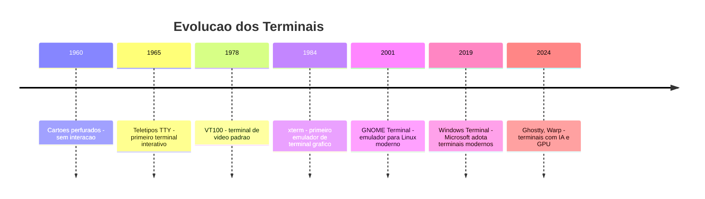
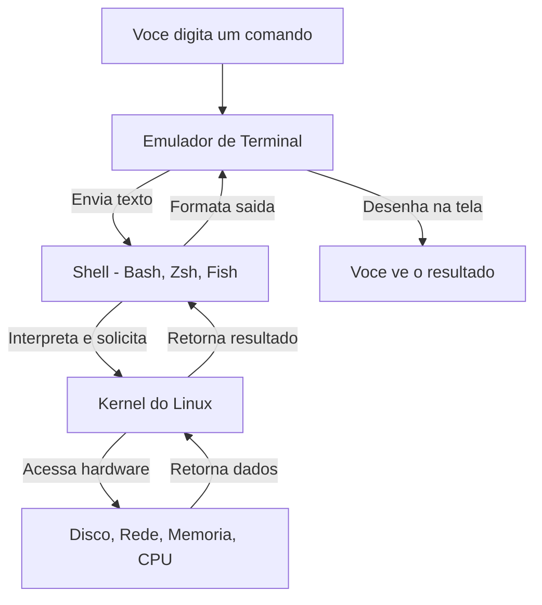
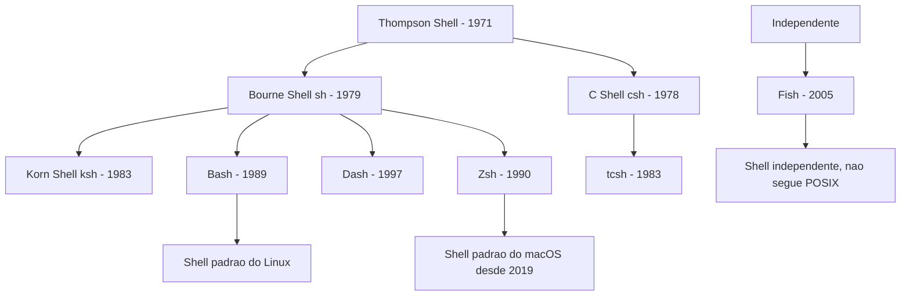
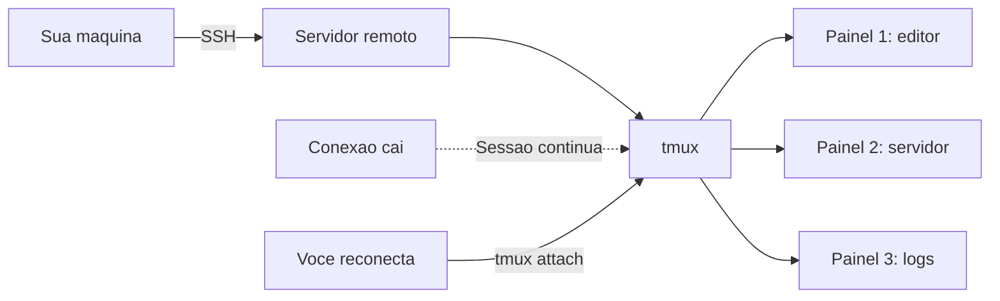

# 3.1 — Terminal vs Interpretador de Comandos

[← Anterior: Noções de Shell Scripting](cap02-mod08-shell-scripting.md) · [Próximo: Comandos Básicos: Navegação e Manipulação de Arquivos →](cap03-mod02-comandos-basicos.md)

---

## Introdução

No Capítulo 2, mergulhamos no Linux: entendemos sua história, exploramos distribuições, conhecemos o kernel, navegamos pela estrutura de diretórios, configuramos permissões, instalamos pacotes, gerenciamos usuários e até escrevemos nossos primeiros shell scripts. Em cada um desses módulos, usamos o terminal para fazer as coisas acontecerem.

Mas aqui vai uma pergunta que quase ninguém faz — e que revela uma confusão muito comum, mesmo entre profissionais experientes: **quando você abre o "terminal" no seu computador, o que exatamente está abrindo?**

A maioria das pessoas responde "o terminal" e acha que é uma coisa só. Mas na verdade, quando você abre aquela janela preta com texto, pelo menos **três coisas diferentes** estão trabalhando juntas:

1. O **emulador de terminal** — o programa que desenha a janela na tela
2. O **shell** (interpretador de comandos) — o programa que entende o que você digita
3. O **kernel** — o sistema operacional que executa os comandos de verdade

Entender essa separação não é preciosismo técnico. É fundamental para resolver problemas, configurar seu ambiente de trabalho e entender por que certas coisas funcionam de um jeito e não de outro. Quando algo "não funciona no terminal", saber se o problema está no emulador, no shell ou no sistema operacional é a diferença entre resolver em 5 minutos e ficar horas perdido.

Neste módulo, vamos desmontar essa caixa preta e entender cada peça. E vamos fazer isso começando pela história — porque a razão de existirem tantas camadas separadas só faz sentido quando você entende de onde elas vieram.

Lembre-se do mantra: **"Qual problema você quer resolver?"** Cada uma dessas camadas existe porque resolve um problema específico. Vamos descobrir quais.

---

## A Origem: Terminais Físicos de Verdade

Para entender por que o programa que você abre se chama "emulador de terminal", precisamos voltar aos anos 1960 e 1970 — a mesma época em que o Unix estava nascendo nos Laboratórios Bell, como vimos no módulo 2.1.

### O Problema: Como Falar com um Computador?

Nos primeiros anos da computação, não existia teclado nem tela. Você se comunicava com o computador usando **cartões perfurados** — cartões de papel com furos em posições específicas que representavam dados e instruções. Você preparava uma pilha de cartões, entregava ao operador do computador, esperava horas (às vezes um dia inteiro) e recebia o resultado impresso em papel.

Imagine que para pedir um prato em um restaurante, você tivesse que escrever o pedido em um papel, entregar ao garçom, ir embora, e voltar no dia seguinte para buscar a comida. Nada prático, certo? Era exatamente assim.

O problema era claro: **não havia interação em tempo real**. Você não podia ver o que o computador estava fazendo, não podia corrigir erros no meio do caminho, não podia experimentar. Cada tentativa custava horas de espera.

### A Solução: O Teletipo (TTY)

A primeira solução veio de uma tecnologia que já existia antes dos computadores: o **teletipo** (em inglês, **teletype** ou **TTY**). Teletipos eram máquinas de escrever elétricas usadas desde os anos 1920 para enviar mensagens de texto por fios telegráficos — como um WhatsApp mecânico, mas com papel e fios de cobre.

Alguém teve a ideia brilhante de conectar um teletipo a um computador. Agora, em vez de preparar cartões perfurados, você podia **digitar comandos diretamente** e ver a resposta **impressa no papel** em tempo real. Não tinha tela — a "saída" era impressa em uma bobina de papel contínuo. Mas era interativo: você digitava, o computador respondia, você digitava de novo.

Essa foi uma revolução. Pela primeira vez, um ser humano podia ter uma **conversa** com um computador. Digitar algo, ver a resposta, pensar, digitar outra coisa. Esse modo de interação se chama **interativo** (em oposição ao modo **batch**, onde você entrega tudo de uma vez e espera).

O teletipo era o **terminal** — o ponto final da conexão entre o ser humano e o computador. O computador ficava em uma sala, e os teletipos ficavam em outras salas (às vezes em outros andares ou até outros prédios), conectados por cabos. Cada teletipo era um terminal.

É por isso que até hoje, no Linux, os dispositivos de terminal se chamam **TTY** — a abreviação de teletype. Quando você pressiona `Ctrl+Alt+F1` no Linux para acessar um terminal virtual, ele se chama `/dev/tty1`. Essa nomenclatura tem mais de 50 anos.

### Do Papel para a Tela: O Terminal de Vídeo

Nos anos 1970, os teletipos de papel foram substituídos por **terminais de vídeo** — máquinas com teclado e uma tela (monitor CRT, aqueles de tubo grosso). O mais famoso foi o **VT100**, fabricado pela DEC (Digital Equipment Corporation) em 1978.

O VT100 se tornou tão popular que virou um padrão. Quando você ouve falar em "códigos de escape ANSI" ou "sequências de terminal", está ouvindo sobre o sistema de controle que o VT100 popularizou. Esses códigos são sequências especiais de caracteres que dizem ao terminal coisas como "mova o cursor para a linha 5, coluna 10" ou "mude a cor do texto para verde". Até hoje, quando você vê texto colorido no terminal do seu computador, são esses mesmos códigos de escape — inventados nos anos 1970 — que estão fazendo isso funcionar.

| Epoca | Dispositivo | Como funcionava | Limitacoes |
|-------|-------------|-----------------|------------|
| 1960s | Cartoes perfurados | Furos em cartoes de papel, processamento batch | Sem interação, espera de horas |
| 1960-70s | Teletipo TTY | Teclado e impressora em papel, interativo | Lento, gastava papel, sem edicao |
| 1970-80s | Terminal de video VT100 | Teclado e tela CRT, interativo | Hardware dedicado, caro |
| 1980-90s | Terminal de PC | Software no computador pessoal | Precisava de conexão ao servidor |
| 2000s+ | Emulador de terminal | Programa dentro do sistema operacional | Nenhuma - e o que usamos hoje |

O ponto importante aqui é: o **terminal** era um **hardware** — uma máquina física, separada do computador. O terminal não processava nada. Ele apenas enviava o que você digitava para o computador e mostrava na tela o que o computador respondia. Todo o processamento acontecia no computador central (o **mainframe** ou servidor).

### Por que "Emulador" de Terminal?

Quando os computadores pessoais se popularizaram nos anos 1980 e 1990, as pessoas não precisavam mais de um hardware separado para acessar o computador — o computador estava ali na sua mesa, com teclado e tela próprios.

Mas o software do Unix (e depois do Linux) foi todo construído em cima do conceito de terminais. Os programas esperavam receber texto de um terminal e enviar texto para um terminal. Mudar toda essa arquitetura seria impraticável.

A solução foi criar um **programa** que se comporta como se fosse um terminal físico. Esse programa é o **emulador de terminal** — ele "emula" (imita) o comportamento de um terminal de hardware como o VT100, mas é apenas uma janela no seu sistema operacional.

Quando você abre o GNOME Terminal, o Konsole, o xterm, o Alacritty ou o Windows Terminal, está abrindo um emulador de terminal. Ele finge ser um VT100 (ou similar) para que todos os programas de linha de comando continuem funcionando exatamente como funcionavam nos anos 1970. É retrocompatibilidade em ação — software novo que mantém compatibilidade com conceitos de 50 anos atrás.



---

## As Três Camadas: Emulador, Shell e Kernel

Agora que entendemos a história, vamos formalizar as três camadas que trabalham juntas quando você "usa o terminal".

### Camada 1: O Emulador de Terminal (a janela)

O emulador de terminal é o **programa gráfico** que desenha a janela na sua tela. Ele é responsável por:

- Desenhar a janela com fundo preto (ou a cor que você configurar)
- Mostrar o texto que o shell envia
- Capturar o que você digita no teclado e enviar para o shell
- Interpretar códigos de escape para cores, posição do cursor, etc.
- Gerenciar abas, divisão de tela, rolagem, copiar/colar
- Escolher a fonte, o tamanho do texto, a transparência da janela

O emulador de terminal **não entende comandos**. Se você digitar `ls` no terminal, o emulador não sabe o que `ls` significa. Ele apenas pega essas duas letras e envia para o shell. Quando o shell responde com a lista de arquivos, o emulador recebe esse texto e desenha na tela.

Pense no emulador como o **telefone** em uma ligação. O telefone transmite sua voz, mas não entende o que você está dizendo. Ele não sabe se você está pedindo uma pizza ou marcando uma consulta médica. Ele apenas transmite o som.

### Camada 2: O Shell (o interpretador)

O shell é o **programa que entende seus comandos**. No módulo 2.8, já conhecemos o shell — é o bash, zsh, fish ou qualquer outro interpretador de comandos.

O shell é responsável por:

- Mostrar o **prompt** (aquele `usuario@computador:~$` que aparece esperando você digitar)
- Interpretar o que você digita (entender que `ls -la` significa "listar arquivos com detalhes")
- Expandir variáveis (`$HOME` vira `/home/usuario`)
- Expandir curingas (`*.txt` vira a lista de todos os arquivos .txt)
- Gerenciar pipes e redirecionamento (`|`, `>`, `>>`, `<`)
- Executar scripts
- Manter o histórico de comandos
- Oferecer autocompletar (quando você aperta Tab)
- Gerenciar variáveis de ambiente
- Controlar processos (foreground, background, jobs)

O shell **não desenha nada na tela**. Ele recebe texto do emulador, processa, pede ao kernel para executar o comando e envia o resultado de volta para o emulador mostrar.

Voltando à analogia do telefone: o shell é a **pessoa do outro lado da linha** — é quem entende o que você diz e toma ações baseadas nisso.

### Camada 3: O Kernel (o executor)

O kernel é o **sistema operacional** que realmente executa as operações. Já estudamos o kernel no módulo 2.3 — ele é o intermediário entre o software e o hardware.

Quando o shell interpreta o comando `ls /home`, ele pede ao kernel: "me dê a lista de arquivos do diretório /home". O kernel acessa o sistema de arquivos no disco, lê as informações e retorna para o shell, que formata e envia para o emulador mostrar na tela.

O kernel é responsável por:

- Acessar arquivos no disco
- Gerenciar processos (iniciar, parar, priorizar)
- Gerenciar memória
- Controlar dispositivos de hardware
- Gerenciar rede
- Controlar permissões de acesso

Na analogia do telefone: o kernel é a **empresa** que a pessoa do outro lado da linha representa. Quando você liga para uma pizzaria e pede uma pizza, a pessoa (shell) entende seu pedido e repassa para a cozinha (kernel), que realmente faz a pizza.



### Exemplo Prático: O que Acontece Quando Você Digita `ls`

Vamos rastrear exatamente o que acontece quando você digita `ls` e aperta Enter:

1. **Você pressiona a tecla `l`** — o teclado envia um sinal elétrico para o computador
2. **O emulador de terminal** recebe o caractere `l` e faz duas coisas: mostra o `l` na tela (isso se chama **echo**) e envia o caractere para o shell
3. **Você pressiona `s`** — mesmo processo, agora a tela mostra `ls`
4. **Você pressiona Enter** — o emulador envia um sinal de "fim de linha" para o shell
5. **O shell (bash)** recebe a string `ls` e interpreta: "o usuário quer listar arquivos do diretório atual"
6. **O shell** procura o programa `ls` nos diretórios do PATH (encontra em `/usr/bin/ls`)
7. **O shell** pede ao kernel: "execute o programa `/usr/bin/ls` com o diretório atual como argumento"
8. **O kernel** cria um novo processo, carrega o programa `ls` na memória e o executa
9. **O programa `ls`** pede ao kernel: "me dê a lista de arquivos do diretório `/home/usuario`"
10. **O kernel** acessa o sistema de arquivos no disco e retorna a lista
11. **O programa `ls`** formata a lista e escreve na **saída padrão** (stdout)
12. **O shell** captura a saída e envia para o emulador
13. **O emulador** recebe o texto e desenha na tela
14. **O shell** mostra o prompt novamente, esperando o próximo comando

Tudo isso acontece em milissegundos. Mas são pelo menos 14 passos envolvendo três programas diferentes (emulador, shell, ls) e o kernel. Entender esse fluxo é fundamental para diagnosticar problemas — se algo der errado, você precisa saber em qual camada o problema está.

### Por que Essa Separação Importa?

Você pode estar pensando: "por que não fazer tudo em um programa só?" A resposta está no segundo mantra do curso: **conceitos são para sempre, ferramentas apenas os implementam**.

A separação em camadas permite que você **troque qualquer peça sem afetar as outras**:

| O que você quer mudar | O que trocar | O que continua igual |
|----------------------|-------------|---------------------|
| Aparência da janela, fonte, cores | Emulador de terminal | Shell e kernel |
| Linguagem de comandos, autocompletar | Shell | Emulador e kernel |
| Sistema operacional inteiro | Kernel | Conceitos de terminal e shell |

Isso é um princípio fundamental de engenharia de software chamado **separação de responsabilidades** (separation of concerns). Cada componente faz uma coisa e faz bem. Vamos encontrar esse princípio repetidamente ao longo do curso — em arquitetura de software (Capítulo 9), em orientação a objetos (Capítulo 8) e em design de APIs (Capítulo 10).

Na prática, isso significa que você pode:
- Usar o mesmo shell (bash) em emuladores diferentes (GNOME Terminal, Alacritty, Kitty)
- Usar shells diferentes (bash, zsh, fish) no mesmo emulador
- Usar o mesmo shell no Linux, macOS e até no Windows (via WSL)
- Trocar de emulador sem perder suas configurações de shell
- Trocar de shell sem perder suas configurações de emulador

---

## Emuladores de Terminal: As Opções

Existem dezenas de emuladores de terminal disponíveis. Cada um tem suas características, mas todos fazem a mesma coisa fundamental: desenhar uma janela e conectar você a um shell.

### Emuladores no Linux

| Emulador | Ambiente | Caracteristicas | Ideal para |
|----------|----------|-----------------|------------|
| GNOME Terminal | GNOME | Simples, integrado ao desktop, abas | Iniciantes no Ubuntu |
| Konsole | KDE | Rico em recursos, dividir tela, perfis | Usuarios do KDE |
| xterm | Qualquer | O mais antigo, leve, minimalista | Sistemas com poucos recursos |
| Alacritty | Qualquer | Acelerado por GPU, muito rápido | Quem quer velocidade máxima |
| Kitty | Qualquer | GPU, imagens no terminal, ligatures | Desenvolvedores avancados |
| Terminator | Qualquer | Dividir tela em grade, multiplos paineis | Quem trabalha com muitos terminais |
| Tilix | GNOME | Tiling, quake mode, integrado ao GNOME | Alternativa ao GNOME Terminal |
| st | Qualquer | Extremamente minimalista, configurado via código | Minimalistas e entusiastas |

### Emuladores no macOS

| Emulador | Caracteristicas | Ideal para |
|----------|-----------------|------------|
| Terminal.app | Vem com o macOS, básico mas funcional | Uso casual |
| iTerm2 | Rico em recursos, dividir tela, busca, perfis | Desenvolvedores no Mac |
| Alacritty | Mesmo do Linux, acelerado por GPU | Quem quer velocidade |
| Kitty | Mesmo do Linux, GPU e imagens | Desenvolvedores avancados |
| Warp | Terminal moderno com IA integrada | Quem quer experiência moderna |

### Emuladores no Windows

| Emulador | Caracteristicas | Ideal para |
|----------|-----------------|------------|
| Windows Terminal | Moderno, abas, GPU, perfis, da Microsoft | Uso geral no Windows |
| PowerShell | Shell e emulador integrados | Administracao Windows |
| cmd.exe | O prompt de comando classico, limitado | Compatibilidade com scripts antigos |
| Git Bash | Bash no Windows via MinGW | Quem precisa de bash no Windows |
| WSL Terminal | Terminal para o Windows Subsystem for Linux | Quem usa Linux dentro do Windows |

### O que Muda entre Emuladores?

Como o emulador é apenas a "janela", o que muda entre eles é a **experiência visual e de usabilidade**, não os comandos que você pode executar:

| Recurso | Varia entre emuladores | Depende do shell |
|---------|----------------------|------------------|
| Fonte e tamanho do texto | Sim | Não |
| Cores e tema | Sim | Parcialmente |
| Abas e divisao de tela | Sim | Não |
| Transparência da janela | Sim | Não |
| Renderizacao por GPU | Sim | Não |
| Autocompletar de comandos | Não | Sim |
| Histórico de comandos | Não | Sim |
| Aliases e funções | Não | Sim |
| Prompt personalizado | Não | Sim |
| Sintaxe de scripts | Não | Sim |

Essa tabela é importante: se você quer mudar a aparência (fonte, cores, abas), mude o emulador. Se quer mudar o comportamento (autocompletar, prompt, aliases), mude o shell. Confundir as duas coisas é um erro muito comum.

---

## Shells: Os Interpretadores de Comandos

No módulo 2.8, já tivemos um primeiro contato com shells — vimos que o bash é o shell padrão da maioria das distribuições Linux. Agora vamos aprofundar: entender as diferenças entre os shells, por que existem tantos e como escolher o seu.

### A Família dos Shells

Os shells do Unix/Linux podem ser divididos em duas grandes famílias, baseadas em qual shell original os inspirou:



**Família Bourne** (sh → bash, zsh, ksh, dash): seguem a sintaxe do Bourne Shell original. São compatíveis entre si na maioria dos comandos básicos. Quando você aprende bash, já sabe 90% do zsh e do ksh.

**Família C** (csh → tcsh): usam uma sintaxe inspirada na linguagem C. Foram populares nos anos 1980, especialmente em universidades que usavam BSD Unix. Hoje são raramente usados.

**Independentes** (fish): não seguem nenhuma das famílias tradicionais. O fish tem sua própria sintaxe, mais amigável mas incompatível com scripts bash.

### Comparação Detalhada dos Shells Modernos

Vamos comparar os três shells que você mais provavelmente vai encontrar: bash, zsh e fish.

#### Bash (Bourne Again Shell)

Criado em 1989 por **Brian Fox** como parte do projeto GNU. É o shell padrão na maioria das distribuições Linux (Ubuntu, Debian, Fedora, CentOS). O nome é um trocadilho: "Bourne Again" soa como "born again" (renascido), porque é uma versão melhorada do Bourne Shell.

Pontos fortes:
- Está em praticamente todo sistema Linux e macOS (até 2019)
- Enorme quantidade de documentação e tutoriais
- Scripts bash funcionam em quase qualquer servidor
- Estável e previsível — raramente muda de forma incompatível
- É o shell que a maioria dos tutoriais e livros assume

Pontos fracos:
- Autocompletar básico comparado com zsh e fish
- Prompt padrão pouco informativo
- Sintaxe de algumas operações é verbosa (comparações, arrays)
- Configuração menos intuitiva que alternativas modernas

#### Zsh (Z Shell)

Criado em 1990 por **Paul Falstad**, um estudante da Universidade de Princeton. O nome "Z" foi escolhido porque era o login de um professor (Zhong Shao) cujo trabalho Falstad admirava. Desde 2019, é o shell padrão do macOS (substituindo o bash).

Pontos fortes:
- Autocompletar muito superior ao bash (completa argumentos, opções, caminhos)
- Correção ortográfica de comandos ("Você quis dizer...?")
- Globbing avançado (padrões de busca de arquivos mais poderosos)
- Temas e plugins via Oh My Zsh (framework de configuração)
- Compatível com a maioria dos scripts bash
- Prompt altamente personalizável

Pontos fracos:
- Não vem instalado por padrão na maioria das distribuições Linux
- Oh My Zsh pode deixar o shell lento se tiver muitos plugins
- Algumas diferenças sutis com bash podem causar confusão

#### Fish (Friendly Interactive Shell)

Criado em 2005 por **Axel Liljencrantz**. O nome significa "Friendly Interactive Shell" (Shell Interativo Amigável). Fish foi criado com uma filosofia diferente: em vez de manter compatibilidade com o passado, ele priorizou a usabilidade.

Pontos fortes:
- Autocompletar inteligente que sugere comandos baseado no histórico
- Syntax highlighting em tempo real (comandos válidos ficam coloridos)
- Configuração via interface web (digite `fish_config` no terminal)
- Não precisa de plugins para ter uma boa experiência
- Mensagens de erro mais claras e amigáveis

Pontos fracos:
- Sintaxe incompatível com bash (scripts bash não funcionam no fish)
- Não segue o padrão POSIX
- Menos documentação e tutoriais disponíveis
- Pode ser confuso se você aprendeu bash primeiro

### Tabela Comparativa

| Recurso | Bash | Zsh | Fish |
|---------|------|-----|------|
| Padrão no Linux | Sim | Não | Não |
| Padrão no macOS | Até 2019 | Desde 2019 | Não |
| Compatível com POSIX | Sim | Sim | Não |
| Autocompletar | Básico | Avancado | Muito avancado |
| Syntax highlighting | Não nativo | Via plugin | Nativo |
| Sugestoes do histórico | Não nativo | Via plugin | Nativo |
| Correcao ortografica | Não | Sim | Sim |
| Scripts portaveis | Sim | Quase sempre | Não |
| Curva de aprendizado | Media | Media | Baixa |
| Configuração | Arquivos .bashrc | Arquivos .zshrc | Interface web |
| Comunidade | Enorme | Grande | Crescente |

### Qual Shell Usar?

Para quem está começando, a recomendação é clara: **use bash**. Motivos:

1. É o padrão — quando você abre o terminal no Ubuntu, já está no bash
2. A maioria dos tutoriais, livros e cursos (incluindo este) usa bash
3. Servidores de produção quase sempre têm bash
4. Aprender bash primeiro facilita aprender qualquer outro shell depois

Depois que você estiver confortável com bash (o que vai acontecer naturalmente ao longo dos próximos capítulos), pode experimentar zsh ou fish. Muitos desenvolvedores experientes usam zsh com Oh My Zsh no dia a dia, mas escrevem scripts em bash para garantir compatibilidade.

### Verificando e Trocando de Shell

Para ver qual shell você está usando:

```bash
# Ver o shell atual
echo $SHELL
```

Saída esperada:
```
/bin/bash
```

Para ver todos os shells disponíveis no sistema:

```bash
# Listar shells instalados
cat /etc/shells
```

Saída esperada:
```
/bin/sh
/bin/bash
/usr/bin/bash
/bin/zsh
/usr/bin/zsh
/usr/bin/fish
```

Para trocar temporariamente de shell (só para testar):

```bash
# Iniciar o zsh temporariamente (se estiver instalado)
zsh

# Para voltar ao shell anterior
exit
```

Para trocar o shell padrão permanentemente:

```bash
# Trocar o shell padrao para zsh
chsh -s /bin/zsh

# Trocar de volta para bash
chsh -s /bin/bash
```

O comando `chsh` significa "change shell" (trocar shell). A mudança só tem efeito no próximo login.

---

## O Prompt: Seu Ponto de Partida

O **prompt** é o texto que aparece no terminal esperando você digitar um comando. Ele é gerado pelo shell (não pelo emulador) e contém informações úteis sobre o estado atual do sistema.

### Anatomia do Prompt Padrão do Bash

O prompt padrão do bash no Ubuntu se parece com isso:

```
usuario@computador:~/projetos$
```

Cada parte tem um significado:

| Parte | Significado | Exemplo |
|-------|-------------|---------|
| `usuario` | Nome do usuario logado | ana, joao, root |
| `@` | Separador - significa "em" | Sempre @ |
| `computador` | Nome da máquina | meu-pc, servidor-web |
| `:` | Separador | Sempre : |
| `~/projetos` | Diretório atual | ~ = home, / = raiz |
| `$` | Indicador de usuario normal | $ = normal, # = root |

O símbolo no final é especialmente importante:
- `$` — você é um usuário normal
- `#` — você é o root (administrador)

Se você vir `#` no prompt, tome cuidado — qualquer comando será executado com poderes totais, sem restrições de permissão. É como ter a chave mestra de um prédio: você pode abrir qualquer porta, mas também pode trancar todo mundo para fora se não tomar cuidado.

### Personalizando o Prompt

O prompt do bash é controlado pela variável de ambiente `PS1` (Prompt String 1). Você pode personalizá-lo:

```bash
# Ver o prompt atual
echo $PS1
```

Saída esperada (algo como):
```
\u@\h:\w\$
```

Os códigos especiais significam:

| Código | Significado |
|--------|-------------|
| `\u` | Nome do usuario |
| `\h` | Nome do computador |
| `\H` | Nome completo do computador |
| `\w` | Diretório atual, caminho completo |
| `\W` | Diretório atual, apenas o nome |
| `\d` | Data atual |
| `\t` | Hora atual, formato 24h |
| `\n` | Nova linha |
| `\$` | $ para usuario normal, # para root |

```bash
# Prompt simples com hora
export PS1="[\t] \u@\h:\w\$ "
```

Resultado:
```
[14:30:25] ana@meu-pc:~/projetos$
```

```bash
# Prompt em duas linhas com informacoes completas
export PS1="\d \t | \u@\h\n\w \$ "
```

Resultado:
```
Mon Jan 15 14:30:25 | ana@meu-pc
~/projetos $
```

Para tornar a mudança permanente, adicione a linha `export PS1="..."` ao arquivo `~/.bashrc` — o arquivo de configuração do bash que é executado toda vez que você abre um terminal. Vamos falar mais sobre arquivos de configuração adiante.

---

## Arquivos de Configuração do Shell

Cada shell tem seus arquivos de configuração — arquivos de texto que são lidos automaticamente quando o shell inicia. Esses arquivos permitem personalizar o comportamento do shell: definir variáveis, criar aliases (atalhos), configurar o prompt e muito mais.

### Arquivos de Configuração do Bash

O bash tem vários arquivos de configuração, e a ordem em que são lidos depende de como o shell foi iniciado:

| Arquivo | Quando e lido | Para que serve |
|---------|---------------|----------------|
| `/etc/profile` | Login no sistema | Configurações globais para todos os usuarios |
| `/etc/bash.bashrc` | Toda vez que bash inicia | Configurações globais do bash |
| `~/.profile` | Login no sistema | Configurações pessoais de login |
| `~/.bashrc` | Toda vez que bash inicia | Configurações pessoais do bash |
| `~/.bash_logout` | Ao sair do bash | Comandos de limpeza ao sair |
| `~/.bash_history` | Automático | Histórico de comandos digitados |

O arquivo mais importante para o dia a dia é o `~/.bashrc`. É nele que você coloca suas personalizações: aliases, variáveis de ambiente, configuração do prompt e funções.

O `~` (til) significa "diretório home do usuário atual". Então `~/.bashrc` é o arquivo `.bashrc` dentro do seu diretório home (por exemplo, `/home/ana/.bashrc`). O ponto no início do nome (`.bashrc`) significa que é um arquivo oculto — ele não aparece com `ls` normal, só com `ls -a`.

### O que Colocar no .bashrc

```bash
# Exemplo de conteudo do ~/.bashrc

# Configuracao do prompt
export PS1="[\t] \u@\h:\w\$ "

# Aliases - atalhos para comandos longos
alias ll="ls -la"           # "ll" = listar com detalhes
alias la="ls -A"            # "la" = listar incluindo ocultos
alias ..="cd .."            # ".." = voltar um diretorio
alias ...="cd ../.."        # "..." = voltar dois diretorios
alias cls="clear"           # "cls" = limpar tela (habito do Windows)
alias ports="ss -tulnp"     # "ports" = ver portas abertas

# Variaveis de ambiente
export EDITOR="vim"         # Editor padrao
export LANG="pt_BR.UTF-8"  # Idioma do sistema

# Funcoes personalizadas
# Criar diretorio e entrar nele
mkcd() {
    mkdir -p "$1" && cd "$1"
}

# Extrair qualquer arquivo compactado
extrair() {
    if [ -f "$1" ]; then
        case "$1" in
            *.tar.bz2) tar xjf "$1" ;;
            *.tar.gz)  tar xzf "$1" ;;
            *.tar.xz)  tar xJf "$1" ;;
            *.bz2)     bunzip2 "$1" ;;
            *.gz)      gunzip "$1" ;;
            *.tar)     tar xf "$1" ;;
            *.zip)     unzip "$1" ;;
            *.7z)      7z x "$1" ;;
            *)         echo "Formato nao reconhecido: $1" ;;
        esac
    else
        echo "Arquivo nao encontrado: $1"
    fi
}
```

Saída esperada (após recarregar o bashrc):
```
[14:30:25] ana@meu-pc:~/projetos$
```

### Aliases: Atalhos que Economizam Tempo

**Aliases** são atalhos para comandos que você usa com frequência. Em vez de digitar `ls -la --color=auto` toda vez, você cria um alias `ll` que faz a mesma coisa.

```bash
# Criar um alias temporario (dura ate fechar o terminal)
alias gs="git status"

# Usar o alias
gs
```

Saída esperada:
```
On branch main
nothing to commit, working tree clean
```

Para tornar aliases permanentes, adicione-os ao `~/.bashrc`. Depois de editar o arquivo, recarregue com:

```bash
# Recarregar o bashrc sem fechar o terminal
source ~/.bashrc
```

Lembra do comando `source` do módulo 2.8? Ele executa o arquivo no shell atual, aplicando as mudanças imediatamente.

### Diferença entre Login Shell e Non-Login Shell

Existe uma distinção técnica que causa confusão em iniciantes: **login shell** vs **non-login shell**.

- **Login shell**: o shell que inicia quando você faz login no sistema (digita usuário e senha). Lê `~/.profile` e `~/.bashrc`.
- **Non-login shell**: o shell que inicia quando você abre uma nova janela de terminal no ambiente gráfico. Lê apenas `~/.bashrc`.

Na prática, para a maioria dos usuários de desktop, a diferença não importa muito — coloque tudo no `~/.bashrc` e pronto. A distinção se torna relevante quando você trabalha com servidores remotos via SSH (que veremos em módulos futuros).

---

## Terminais Virtuais e Multiplexadores

Além dos emuladores de terminal gráficos, existem duas outras formas de acessar terminais no Linux que todo desenvolvedor deve conhecer.

### Terminais Virtuais (TTY)

O Linux oferece vários **terminais virtuais** (também chamados de consoles virtuais) que funcionam sem interface gráfica. Eles são acessados com a combinação de teclas `Ctrl+Alt+F1` até `Ctrl+Alt+F6`.

| Combinacao | Terminal | Uso tipico |
|------------|----------|------------|
| Ctrl+Alt+F1 | tty1 | Geralmente o ambiente gráfico |
| Ctrl+Alt+F2 | tty2 | Terminal virtual de texto |
| Ctrl+Alt+F3 | tty3 | Terminal virtual de texto |
| Ctrl+Alt+F4 | tty4 | Terminal virtual de texto |
| Ctrl+Alt+F5 | tty5 | Terminal virtual de texto |
| Ctrl+Alt+F6 | tty6 | Terminal virtual de texto |

Esses terminais virtuais são úteis quando:
- O ambiente gráfico travou e você precisa reiniciá-lo
- Precisa fazer manutenção no sistema sem interface gráfica
- Quer um terminal sem distrações (tela cheia, sem janelas)
- O sistema não tem interface gráfica instalada (servidores)

Para verificar em qual terminal você está:

```bash
# Ver o terminal atual
tty
```

Saída esperada:
```
/dev/pts/0
```

O `/dev/pts/0` indica um **pseudo-terminal** (pts) — é o que o emulador de terminal cria. Se você estivesse em um terminal virtual, veria `/dev/tty2` ou similar.

### Multiplexadores de Terminal: tmux e screen

Um **multiplexador de terminal** é um programa que permite ter múltiplas sessões de terminal dentro de uma única janela. Os dois mais populares são o **tmux** e o **screen**.

O problema que eles resolvem: imagine que você está conectado a um servidor remoto via SSH, executando um processo que leva horas (uma compilação, um backup, uma migração de dados). Se sua conexão de internet cair, o processo é interrompido e você perde todo o progresso.

Com um multiplexador, o processo continua rodando no servidor mesmo se você desconectar. Quando reconectar, você retoma exatamente de onde parou — como se nunca tivesse saído.

#### tmux (Terminal Multiplexer)

O tmux é o multiplexador mais popular atualmente. Ele permite:

- Dividir a tela em painéis (horizontal e vertical)
- Criar múltiplas janelas (como abas)
- Desconectar e reconectar sessões
- Compartilhar sessões entre usuários

```bash
# Instalar o tmux
sudo apt install tmux

# Iniciar uma nova sessao
tmux

# Iniciar uma sessao com nome
tmux new -s minha-sessao
```

Comandos básicos do tmux (todos começam com `Ctrl+b`, que é o prefixo):

| Comando | O que faz |
|---------|-----------|
| `Ctrl+b` depois `%` | Dividir tela verticalmente |
| `Ctrl+b` depois `"` | Dividir tela horizontalmente |
| `Ctrl+b` depois seta | Mover entre paineis |
| `Ctrl+b` depois `c` | Criar nova janela |
| `Ctrl+b` depois `n` | Próxima janela |
| `Ctrl+b` depois `p` | Janela anterior |
| `Ctrl+b` depois `d` | Desconectar da sessao, mantendo ela rodando |
| `Ctrl+b` depois `x` | Fechar painel atual |

```bash
# Listar sessoes ativas
tmux ls

# Reconectar a uma sessao
tmux attach -t minha-sessao

# Reconectar a ultima sessao
tmux attach
```

O tmux é uma ferramenta que você vai usar muito quando começar a trabalhar com servidores. Por enquanto, saiba que existe e experimente os comandos básicos.



---

## POSIX: O Padrão que Une os Shells

Ao longo deste módulo, mencionamos que bash e zsh são "compatíveis com POSIX" e que fish "não segue POSIX". Mas o que é POSIX?

**POSIX** (Portable Operating System Interface, ou Interface Portável de Sistema Operacional) é um conjunto de padrões definidos pelo IEEE (Institute of Electrical and Electronics Engineers) que específica como sistemas operacionais do tipo Unix devem se comportar. Foi criado nos anos 1980 para resolver um problema real: cada fabricante de Unix tinha sua própria versão com diferenças sutis, e programas escritos para um não funcionavam em outro.

O problema era o mesmo dos computadores dos anos 1960 que vimos no início do módulo — incompatibilidade. Só que agora, em vez de sistemas completamente diferentes, eram variações do mesmo sistema (Unix) que divergiam em detalhes. Um script que funcionava no Unix da Sun não funcionava no Unix da HP, mesmo sendo "o mesmo" sistema operacional.

POSIX definiu regras para:
- Quais comandos devem existir e como devem se comportar (`ls`, `cp`, `grep`, etc.)
- Qual sintaxe o shell deve aceitar (variáveis, condicionais, loops)
- Como o sistema de arquivos deve ser organizado
- Como processos devem ser gerenciados
- Como sinais devem funcionar

Quando dizemos que bash é "compatível com POSIX", significa que ele implementa tudo que o padrão POSIX exige — e adiciona recursos extras por cima. Quando dizemos que fish "não segue POSIX", significa que a sintaxe do fish é diferente do que o padrão define. Um script escrito em sintaxe POSIX pura funciona em bash, zsh, dash e ksh, mas não funciona em fish.

Para quem está começando, o ponto prático é: **aprenda a sintaxe do bash (que é POSIX-compatível) e seus scripts funcionarão em praticamente qualquer sistema Unix/Linux**. Essa portabilidade é valiosa — especialmente quando você trabalhar com servidores, containers Docker e pipelines de CI/CD.

---

## Atalhos de Teclado do Terminal

O terminal tem dezenas de atalhos de teclado que aceleram muito o trabalho. Esses atalhos são gerenciados pelo shell (não pelo emulador) e funcionam na maioria dos shells da família Bourne.

### Atalhos de Navegação

| Atalho | O que faz | Analogia |
|--------|-----------|----------|
| `Ctrl+A` | Ir para o inicio da linha | Tecla Home |
| `Ctrl+E` | Ir para o fim da linha | Tecla End |
| `Ctrl+B` | Voltar um caractere | Seta esquerda |
| `Ctrl+F` | Avancar um caractere | Seta direita |
| `Alt+B` | Voltar uma palavra | Ctrl+Seta esquerda |
| `Alt+F` | Avancar uma palavra | Ctrl+Seta direita |

### Atalhos de Edição

| Atalho | O que faz |
|--------|-----------|
| `Ctrl+U` | Apagar do cursor ate o inicio da linha |
| `Ctrl+K` | Apagar do cursor ate o fim da linha |
| `Ctrl+W` | Apagar a palavra anterior |
| `Alt+D` | Apagar a próxima palavra |
| `Ctrl+Y` | Colar o último texto apagado com Ctrl+U, K ou W |
| `Ctrl+T` | Trocar os dois caracteres antes do cursor |

### Atalhos de Controle

| Atalho | O que faz | Quando usar |
|--------|-----------|-------------|
| `Ctrl+C` | Cancelar o comando atual | Quando um programa trava ou você quer parar |
| `Ctrl+D` | Sair do shell ou enviar fim de arquivo | Para fechar o terminal ou encerrar entrada |
| `Ctrl+Z` | Suspender o processo atual | Para pausar um programa e voltar ao shell |
| `Ctrl+L` | Limpar a tela | Mesmo que digitar `clear` |
| `Ctrl+R` | Buscar no histórico de comandos | Para encontrar um comando que você ja digitou |
| `Ctrl+S` | Pausar a saida do terminal | Quando texto esta passando rápido demais |
| `Ctrl+Q` | Retomar a saida do terminal | Para despausar apos Ctrl+S |

### O Histórico de Comandos

O shell mantém um histórico de todos os comandos que você digitou. Isso é extremamente útil — em vez de digitar o mesmo comando longo de novo, você pode recuperá-lo do histórico.

```bash
# Ver o historico completo
history

# Ver os ultimos 20 comandos
history 20

# Buscar no historico (interativo)
# Pressione Ctrl+R e comece a digitar
# Ctrl+R de novo para ver o proximo resultado
# Enter para executar o comando encontrado
# Ctrl+G para cancelar a busca
```

Saída esperada (history 5):
```
  501  ls -la
  502  cd projetos
  503  git status
  504  vim readme.md
  505  history 5
```

```bash
# Executar o ultimo comando
!!

# Executar o comando numero 503 do historico
!503

# Executar o ultimo comando que comecou com "git"
!git

# Usar o ultimo argumento do comando anterior
# Exemplo: se voce fez "cat /etc/passwd", pode fazer:
echo $_
# Resultado: /etc/passwd
```

O histórico é salvo no arquivo `~/.bash_history`. Por padrão, o bash guarda os últimos 1000 comandos. Você pode aumentar esse limite no `~/.bashrc`:

```bash
# Aumentar o tamanho do historico
export HISTSIZE=10000        # Comandos na memoria
export HISTFILESIZE=20000    # Comandos no arquivo

# Ignorar comandos duplicados consecutivos
export HISTCONTROL=ignoredups

# Ignorar comandos que comecam com espaco (util para senhas)
export HISTCONTROL=ignoreboth
```

---

## O Terminal no Dia a Dia do Desenvolvedor

Você pode estar se perguntando: "com tantas interfaces gráficas bonitas, por que desenvolvedores ainda usam o terminal?" A resposta é simples: **velocidade, poder e automação**.

### Por que o Terminal é Mais Rápido

Para renomear 500 arquivos de uma vez:
- **Interface gráfica**: clicar em cada arquivo, clicar em "renomear", digitar o novo nome, repetir 500 vezes. Tempo estimado: horas.
- **Terminal**: um único comando. Tempo: segundos.

```bash
# Renomear todos os arquivos .jpeg para .jpg
for f in *.jpeg; do mv "$f" "${f%.jpeg}.jpg"; done
```

Para encontrar todos os arquivos que contêm a palavra "erro" em um projeto com milhares de arquivos:
- **Interface gráfica**: abrir cada arquivo, usar Ctrl+F, procurar, fechar, abrir o próximo...
- **Terminal**: um comando.

```bash
# Encontrar "erro" em todos os arquivos .py do projeto
grep -rn "erro" --include="*.py" .
```

Saída esperada:
```
./app/main.py:42:    print("Erro ao conectar ao banco")
./app/utils.py:15:    raise ValueError("Erro de validacao")
./tests/test_app.py:28:    assert "erro" in response.text
```

### O Terminal como Ferramenta de Desenvolvimento

Ao longo do curso, você vai usar o terminal para praticamente tudo:

| Atividade | Comandos tipicos | Capítulo |
|-----------|-----------------|----------|
| Navegar em projetos | `cd`, `ls`, `find`, `tree` | Cap 3 |
| Versionar código | `git add`, `git commit`, `git push` | Cap 4 |
| Executar programas | `python3 app.py`, `gcc programa.c` | Cap 5-6 |
| Instalar dependências | `pip install`, `apt install` | Cap 5-7 |
| Gerenciar bancos de dados | `sqlite3`, `mysql`, `psql` | Cap 7 |
| Executar testes | `pytest`, `dotnet test` | Cap 7-8 |
| Gerenciar containers | `docker build`, `docker run` | Cap 9 |
| Testar APIs | `curl`, `wget` | Cap 10 |

O terminal não é uma ferramenta do passado — é a ferramenta mais poderosa do presente. IDEs modernas como VSCode, IntelliJ e o próprio Kiro têm terminais integrados porque desenvolvedores precisam dele o tempo todo.

### Terminal Integrado no VSCode

O VSCode (que vamos usar a partir do Capítulo 5) tem um terminal integrado que você abre com `` Ctrl+` `` (Ctrl + crase). Esse terminal é um emulador de terminal dentro do editor — ele roda o mesmo shell (bash, zsh, etc.) que o terminal externo.

A vantagem do terminal integrado é que você pode editar código e executar comandos sem trocar de janela. É o fluxo de trabalho mais comum entre desenvolvedores: código em cima, terminal embaixo.

---

## Conexão com a Programação

Este módulo pode parecer "só teoria", mas tudo que vimos aqui é fundamento para o que vem pela frente.

A **separação em camadas** (emulador → shell → kernel) é o mesmo princípio que você vai encontrar em:
- **Arquitetura de software** (Capítulo 9): aplicações são divididas em camadas (apresentação → lógica → dados)
- **Redes** (Capítulo 1.9): a internet funciona em camadas (aplicação → transporte → rede → física)
- **APIs** (Capítulo 10): a comunicação entre sistemas é feita em camadas (cliente → API → servidor → banco)

O conceito de **interfaces padronizadas** (como POSIX) é o mesmo que você vai encontrar em:
- **Orientação a objetos** (Capítulo 8): interfaces definem contratos que classes devem seguir
- **APIs REST** (Capítulo 10): padrões definem como sistemas devem se comunicar
- **Docker** (Capítulo 9): containers seguem padrões que funcionam em qualquer infraestrutura

E o conceito de **configuração via arquivos de texto** (.bashrc, .zshrc) é o mesmo que você vai encontrar em:
- **Git** (.gitconfig, .gitignore)
- **Python** (requirements.txt, pyproject.toml)
- **Docker** (Dockerfile, docker-compose.yml)
- **CI/CD** (.github/workflows, .gitlab-ci.yml)

Tudo se conecta. Os conceitos que você está aprendendo agora são os mesmos que vai usar durante toda a carreira — só mudam os nomes e as ferramentas.

---

## Como a IA pode te ajudar aqui

**Prompt 1 — Explorar o conceito:**
> "Explique a diferença entre terminal, shell e kernel como se eu tivesse 10 anos. Use uma analogia com restaurante."

**Prompt 2 — Aprofundar o tema:**
> "Quero personalizar meu prompt do bash para mostrar a hora, o diretório atual e a branch do git. Me dê o código para colocar no .bashrc e explique cada parte."

**Prompt 3 — Comparar alternativas:**
> "Compare os shells bash, zsh e fish em uma tabela detalhada. Inclua: autocompletar, plugins, velocidade, compatibilidade e facilidade de configuração. Qual você recomenda para um iniciante em Linux?"

---

## Resumo do Módulo

| Conceito | Definição |
|----------|-----------|
| Terminal fisico | Hardware dedicado com teclado e tela para acessar computadores remotos |
| Teletipo TTY | Primeiro tipo de terminal, com teclado e impressora em papel |
| VT100 | Terminal de video da DEC que se tornou padrão nos anos 1970 |
| Emulador de terminal | Programa que simula um terminal fisico dentro do sistema operacional |
| Shell | Programa interpretador de comandos que entende o que você digita |
| Kernel | Nucleo do sistema operacional que executa as operações de verdade |
| Prompt | Texto que o shell exibe esperando você digitar um comando |
| PS1 | Variável que controla o formato do prompt no bash |
| Alias | Atalho para um comando longo, definido no shell |
| .bashrc | Arquivo de configuração pessoal do bash |
| Login shell | Shell iniciado ao fazer login no sistema |
| Non-login shell | Shell iniciado ao abrir uma janela de terminal |
| Terminal virtual TTY | Console de texto acessível com Ctrl+Alt+F1 a F6 |
| Multiplexador | Programa como tmux que permite multiplas sessoes em um terminal |
| POSIX | Padrão que define como shells e sistemas Unix devem se comportar |
| Separacao de responsabilidades | Principio onde cada componente faz uma coisa e faz bem |

---

## Glossário do Módulo

| Termo | Definição |
|-------|-----------|
| Alacritty | Emulador de terminal acelerado por GPU, focado em velocidade |
| Alias | Atalho definido no shell que substitui um comando longo por um curto |
| ANSI escape codes | Sequências especiais de caracteres que controlam cores e posição do cursor |
| Bash | Bourne Again Shell, shell padrão da maioria das distribuicoes Linux |
| .bashrc | Arquivo de configuração pessoal do bash, lido ao iniciar o shell |
| .bash_history | Arquivo que armazena o histórico de comandos digitados no bash |
| Batch | Modo de processamento onde tudo e entregue de uma vez, sem interação |
| chsh | Change shell, comando para trocar o shell padrão do usuario |
| Console virtual | Terminal de texto puro acessível sem interface gráfica |
| CRT | Cathode Ray Tube, tecnologia de monitores de tubo usada ate os anos 2000 |
| DEC | Digital Equipment Corporation, fabricante do terminal VT100 |
| Echo | Função do terminal que mostra na tela o que você digita |
| Emulador de terminal | Programa que simula o comportamento de um terminal fisico |
| Environment variable | Variável de ambiente, valor predefinido pelo sistema |
| Fish | Friendly Interactive Shell, shell moderno focado em usabilidade |
| GNOME Terminal | Emulador de terminal padrão do ambiente GNOME no Linux |
| Hashbang | Outro nome para shebang, a linha que define o interpretador do script |
| History | Histórico de comandos mantido pelo shell |
| IEEE | Institute of Electrical and Electronics Engineers, organização que define padrões |
| Interactive mode | Modo interativo, onde você digita comandos e ve respostas em tempo real |
| iTerm2 | Emulador de terminal popular para macOS |
| Kernel | Nucleo do sistema operacional, intermediario entre software e hardware |
| Kitty | Emulador de terminal com aceleracao GPU e suporte a imagens |
| Konsole | Emulador de terminal do ambiente KDE no Linux |
| Login shell | Shell iniciado quando o usuario faz login no sistema |
| Mainframe | Computador central de grande porte usado em empresas |
| Multiplexador | Programa que permite multiplas sessoes de terminal em uma janela |
| Non-login shell | Shell iniciado ao abrir uma janela de terminal no ambiente gráfico |
| Oh My Zsh | Framework de configuração e plugins para o shell zsh |
| POSIX | Portable Operating System Interface, padrão para sistemas tipo Unix |
| Prompt | Texto exibido pelo shell indicando que esta pronto para receber comandos |
| PS1 | Prompt String 1, variável que define o formato do prompt no bash |
| Pseudo-terminal | Dispositivo virtual criado pelo emulador para simular um terminal |
| pts | Pseudo-terminal slave, o dispositivo que o emulador de terminal cria |
| Screen | Multiplexador de terminal mais antigo, predecessor do tmux |
| Separation of concerns | Separacao de responsabilidades, principio de engenharia de software |
| Shell | Programa interpretador de comandos, intermediario entre usuario e kernel |
| Source | Comando que executa um script no shell atual em vez de criar subshell |
| SSH | Secure Shell, protocolo para conexão remota segura a servidores |
| Teletype | Teletipo, máquina de escrever eletrica usada como primeiro terminal |
| Terminal | Dispositivo ou programa usado para interagir com o computador via texto |
| Tmux | Terminal multiplexer, programa para multiplas sessoes de terminal |
| TTY | Abreviacao de teletype, nome histórico para dispositivos de terminal |
| VT100 | Terminal de video fabricado pela DEC em 1978, que se tornou padrão |
| Windows Terminal | Emulador de terminal moderno da Microsoft para Windows |
| WSL | Windows Subsystem for Linux, camada de compatibilidade Linux no Windows |
| xterm | Um dos primeiros emuladores de terminal gráfico, criado em 1984 |
| Zsh | Z Shell, shell com recursos avancados, padrão no macOS desde 2019 |

---

## Na Cultura Popular

- **Mr. Robot** (série, 2015-2019) — praticamente todo episódio mostra o protagonista Elliot usando terminais. A série é notável por mostrar terminais reais com comandos reais — não é ficção inventada. Você consegue ver claramente a diferença entre o emulador de terminal (a janela) e os comandos do shell sendo executados. Em vários momentos, Elliot usa tmux para gerenciar múltiplas sessões em servidores remotos.

- **Halt and Catch Fire** (série, 2014-2017) — ambientada nos anos 1980, mostra a transição dos terminais físicos para os computadores pessoais. Os personagens trabalham com terminais conectados a mainframes e depois com os primeiros PCs. É uma excelente forma de visualizar a evolução que descrevemos neste módulo — dos teletipos aos emuladores.

- **The Matrix** (filme, 1999) — a icônica "chuva de código verde" foi inspirada nos terminais de texto dos anos 1970-80. O conceito central do filme — que a realidade é uma interface e que quem entende o código por trás dela tem poder — é uma metáfora perfeita para a relação entre emulador (a interface que você vê), shell (o código que interpreta) e kernel (a realidade que executa).

---

## Para Saber Mais

- *The TTY demystified — Linus Akesson* — https://www.linusakesson.net/programming/tty/ — *artigo técnico detalhado sobre como terminais funcionam internamente no Linux, desde os teletipos até os pseudo-terminais modernos*
- *Bash Reference Manual — GNU* — https://www.gnu.org/software/bash/manual/ — *documentação oficial completa do bash, a referência definitiva*
- *Oh My Zsh — framework para zsh* — https://ohmyz.sh — *se você quiser experimentar o zsh, este framework facilita a configuração com temas e plugins*
- *Repositório do Fino — learn-ops-content* — https://github.com/RafaelFino/learn-ops-content — *material complementar sobre Linux e terminal*
- *tmux — Getting Started* — https://github.com/tmux/tmux/wiki/Getting-Started — *guia oficial para começar a usar o tmux*

---

## Perguntas Frequentes (FAQ)

**P: Terminal e shell são a mesma coisa?**
R: Não. O terminal (emulador de terminal) é o programa que desenha a janela na tela — ele cuida da aparência (fonte, cores, abas). O shell é o programa que entende seus comandos — ele cuida do comportamento (autocompletar, histórico, variáveis). Quando você abre o "terminal", está abrindo o emulador, que automaticamente inicia um shell dentro dele.

**P: Preciso decorar todos os atalhos de teclado?**
R: Não. Comece com os mais úteis: `Ctrl+C` (cancelar), `Ctrl+L` (limpar tela), `Ctrl+R` (buscar no histórico) e `Tab` (autocompletar). Os outros você vai aprendendo naturalmente conforme usar o terminal. Ninguém decora tudo de uma vez.

**P: Devo trocar o bash por zsh ou fish?**
R: Não agora. Use bash enquanto está aprendendo — é o padrão, tem mais documentação e todos os exemplos deste material usam bash. Quando estiver confortável (provavelmente depois do Capítulo 5), experimente zsh com Oh My Zsh. Fish é interessante mas tem sintaxe diferente, o que pode confundir no início.

**P: O que acontece se eu estragar meu .bashrc?**
R: Nada irreversível. Se o bash não iniciar corretamente, você pode abrir um terminal virtual (Ctrl+Alt+F2), fazer login e editar o arquivo para corrigir. Ou pode iniciar o bash sem carregar o .bashrc com `bash --norc`. Uma boa prática é fazer backup antes de editar: `cp ~/.bashrc ~/.bashrc.backup`.

**P: Por que o terminal do macOS usa zsh e não bash?**
R: Em 2019, a Apple trocou o shell padrão do macOS de bash para zsh. O motivo principal foi licenciamento: o bash 4+ usa a licença GPLv3, que tem restrições que a Apple não queria aceitar. O zsh usa a licença MIT, que é mais permissiva. Tecnicamente, o zsh também tem recursos mais modernos que o bash.

**P: O que é esse "POSIX" que todo mundo menciona?**
R: POSIX é um padrão que define como sistemas tipo Unix devem funcionar — incluindo quais comandos devem existir e qual sintaxe o shell deve aceitar. Quando um shell é "POSIX-compatível" (como bash e zsh), significa que scripts escritos seguindo o padrão funcionam nele. Na prática, isso garante que seus scripts funcionem em diferentes sistemas operacionais.

**P: Posso usar o terminal do Windows para programar?**
R: Sim, de várias formas. A melhor opção é o WSL (Windows Subsystem for Linux), que roda um Linux real dentro do Windows. Você também pode usar o Git Bash ou o PowerShell. O Windows Terminal (da Microsoft) é um emulador moderno que suporta todas essas opções. Muitos desenvolvedores profissionais usam Windows com WSL no dia a dia.

**P: O tmux é obrigatório?**
R: Não é obrigatório para iniciantes. O tmux se torna essencial quando você trabalha com servidores remotos via SSH — o que provavelmente vai acontecer a partir do Capítulo 9. Por enquanto, saiba que existe e experimente os comandos básicos se tiver curiosidade.

**P: Por que os atalhos do terminal são diferentes dos atalhos normais?**
R: Os atalhos do terminal (Ctrl+C, Ctrl+Z, Ctrl+D) foram definidos nos anos 1970, antes de existirem interfaces gráficas. Quando as interfaces gráficas surgiram nos anos 1980, elas criaram seus próprios atalhos (Ctrl+C para copiar, Ctrl+V para colar). O terminal manteve os atalhos originais por compatibilidade. É por isso que copiar no terminal geralmente é Ctrl+Shift+C em vez de Ctrl+C.

**P: O que é o "PATH" e por que importa?**
R: O PATH é uma variável de ambiente que contém a lista de diretórios onde o shell procura programas. Quando você digita `python3`, o shell procura em cada diretório do PATH até encontrar o executável. Se o programa não está em nenhum diretório do PATH, você precisa digitar o caminho completo. Vamos trabalhar com o PATH em detalhes nos próximos módulos.

**P: Consigo fazer tudo pelo terminal que faço pela interface gráfica?**
R: No Linux, sim — absolutamente tudo. O Linux foi construído em cima do terminal, e a interface gráfica é apenas uma camada visual por cima. Na verdade, pelo terminal você pode fazer coisas que a interface gráfica não permite, como automatizar tarefas, processar milhares de arquivos de uma vez e gerenciar servidores remotos.

**P: O terminal é seguro? Posso estragar meu computador?**
R: O terminal executa exatamente o que você pede, sem perguntar "tem certeza?". Isso é poderoso mas perigoso. Comandos como `rm -rf /` (que apaga tudo) são executados sem confirmação. A regra de ouro: leia o comando antes de apertar Enter, especialmente se envolve `rm`, `dd` ou `sudo`. Quando estiver aprendendo, evite usar `sudo` a menos que o material peça explicitamente.

---

## Exercícios Práticos

**Exercício 1 — Explorando seu Terminal**

Abra o terminal do seu sistema e responda as seguintes perguntas usando comandos:

1. Qual shell você está usando? (dica: `echo $SHELL`)
2. Qual emulador de terminal você está usando? (dica: pesquise o nome do programa que abriu)
3. Quais shells estão instalados no seu sistema? (dica: `cat /etc/shells`)
4. Qual é o seu prompt atual? (dica: `echo $PS1`)
5. Quantos comandos estão no seu histórico? (dica: `history | wc -l`)
6. Em qual terminal virtual ou pseudo-terminal você está? (dica: `tty`)

Anote as respostas e compare com um colega — vocês provavelmente terão respostas diferentes para o emulador, mas iguais para o shell (bash).

**Exercício 2 — Personalizando o Prompt**

1. Salve seu prompt atual: `echo $PS1` e anote o resultado
2. Mude o prompt para mostrar a hora e o diretório: `export PS1="[\t] \w \$ "`
3. Navegue entre diretórios (`cd /tmp`, `cd ~`, `cd /etc`) e observe como o prompt muda
4. Crie um prompt em duas linhas que mostre data, hora, usuário e diretório
5. Restaure o prompt original usando o valor que anotou no passo 1
6. (Desafio) Adicione o prompt personalizado ao seu `~/.bashrc` para que seja permanente

**Exercício 3 — Atalhos e Histórico**

1. Digite um comando longo qualquer (por exemplo: `echo "Este e um comando longo para testar atalhos do terminal"`)
2. Use `Ctrl+A` para ir ao início da linha e `Ctrl+E` para ir ao fim
3. Use `Ctrl+U` para apagar a linha inteira e `Ctrl+Y` para recuperá-la
4. Use `Ctrl+R` para buscar um comando no histórico — digite parte de um comando que você já executou
5. Use `history 10` para ver os últimos 10 comandos
6. Execute o último comando do histórico usando `!!`
7. Crie dois aliases úteis no terminal e teste-os (lembre-se: eles desaparecem ao fechar o terminal)

---

[← Anterior: Noções de Shell Scripting](cap02-mod08-shell-scripting.md) · [Próximo: Comandos Básicos: Navegação e Manipulação de Arquivos →](cap03-mod02-comandos-basicos.md)
