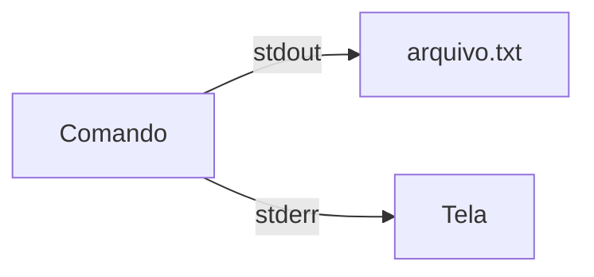
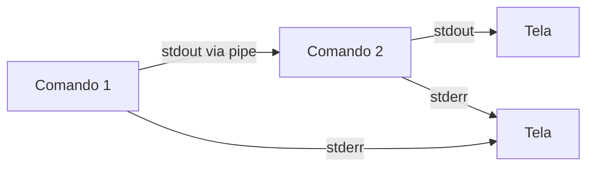

# 3.3 — Pipes e Redirecionamento

[← Anterior: Comandos Básicos: Navegação e Manipulação de Arquivos](cap03-mod02-comandos-basicos.md) · [Próximo: Monitoramento de Processos: ps, top e htop →](cap03-mod04-processos.md)

---

## Introdução

No módulo anterior, aprendemos dezenas de comandos para navegar pelo sistema de arquivos, criar, copiar, mover, apagar, buscar e inspecionar arquivos. Cada comando faz uma coisa específica: o `ls` lista, o `grep` busca texto, o `wc` conta linhas, o `sort` ordena. São ferramentas individuais, cada uma com seu propósito.

Mas aqui vai uma pergunta: e se você precisar fazer algo que nenhum comando sozinho consegue? Por exemplo:

- Listar todos os arquivos de um diretório e contar quantos são?
- Buscar uma palavra em vários arquivos e ordenar os resultados?
- Pegar a saída de um programa e salvar em um arquivo?
- Filtrar as linhas de um log que contêm "erro" e mostrar apenas as 10 mais recentes?

Nenhum comando sozinho faz tudo isso. Mas **combinando** comandos, você consegue fazer praticamente qualquer coisa. E é exatamente isso que vamos aprender neste módulo: como conectar comandos entre si e como redirecionar dados para onde você quiser.

Essa capacidade de combinar ferramentas simples para resolver problemas complexos é uma das ideias mais poderosas da computação. Ela tem um nome: **composição**. E ela nasceu junto com o Unix, nos anos 1970, como uma filosofia de design que influenciou praticamente tudo que veio depois — de linguagens de programação a arquiteturas de software modernas.

Lembre-se do mantra: **"Qual problema você quer resolver?"** O problema aqui é claro: comandos individuais são limitados. A solução é conectá-los. E o mecanismo que permite essa conexão se chama **pipe**.

---

## A Filosofia Unix: Faça Uma Coisa Bem Feita

Antes de entrar nos comandos, precisamos entender a ideia por trás de tudo isso. Sem essa ideia, pipes e redirecionamento parecem apenas truques de terminal. Com ela, você entende por que o Linux funciona assim — e por que essa abordagem é tão poderosa.

### O Problema: Software Monolítico

Nos primeiros anos da computação, programas eram construídos como blocos únicos e enormes. Um programa de processamento de texto fazia tudo: lia o arquivo, formatava, buscava palavras, contava linhas, salvava, imprimia. Se você precisasse de uma funcionalidade nova, tinha que modificar o programa inteiro.

Isso criava vários problemas:
- Programas ficavam enormes e difíceis de manter
- Cada programa reinventava funcionalidades que outros já tinham (ler arquivos, formatar texto, etc.)
- Se um programa tinha um bug na parte de busca, você não podia usar a busca de outro programa — cada um tinha a sua
- Adicionar uma funcionalidade nova significava recompilar e redistribuir o programa inteiro

### A Solução: Programas Pequenos e Conectáveis

Em 1978, Doug McIlroy — um dos criadores do Unix nos Laboratórios Bell — resumiu a filosofia Unix em três princípios que mudaram a história do software:

1. **Faça cada programa fazer uma coisa bem feita.** Para fazer um trabalho novo, construa um programa novo em vez de complicar programas antigos adicionando funcionalidades.

2. **Espere que a saída de cada programa se torne a entrada de outro programa, ainda desconhecido.** Não polua a saída com informações extras. Não insista em formatos de entrada interativos ou colunas rígidas. Evite formatos binários.

3. **Projete e construa software para ser testado cedo.** Não hesite em jogar fora partes desajeitadas e reconstruí-las.

O primeiro princípio é o mais famoso e o mais importante para este módulo. A ideia é: em vez de ter um programa gigante que faz tudo, tenha muitos programas pequenos, cada um especialista em uma tarefa. Depois, conecte-os para resolver problemas complexos.

É como uma cozinha profissional. Em vez de ter um único cozinheiro que faz tudo — lava, corta, tempera, cozinha, emprata — você tem especialistas: um lava os ingredientes, outro corta, outro tempera, outro cozinha, outro emprata. Cada um faz uma coisa muito bem. E o resultado final é melhor do que se uma pessoa tentasse fazer tudo sozinha.

No Unix (e no Linux), os "especialistas" são os comandos:
- `cat` é especialista em mostrar conteúdo
- `grep` é especialista em buscar texto
- `sort` é especialista em ordenar
- `wc` é especialista em contar
- `head` é especialista em mostrar o início
- `tail` é especialista em mostrar o final
- `cut` é especialista em extrair colunas
- `uniq` é especialista em remover duplicatas
- `tr` é especialista em substituir caracteres

E o **pipe** (`|`) é o mecanismo que conecta um especialista ao outro — como uma esteira de produção que leva o resultado de um para a entrada do próximo.

### Por que Isso Importa para Programação

Essa filosofia não ficou restrita ao terminal. Ela influenciou profundamente como software é construído até hoje:

- **Funções em programação**: cada função deve fazer uma coisa bem feita (você vai aprender isso no Capítulo 5)
- **Microsserviços**: em vez de um sistema monolítico, empresas constroem serviços pequenos e especializados que se comunicam entre si (Capítulo 9)
- **Pipelines de dados**: dados passam por uma sequência de transformações, cada uma fazendo uma operação específica (Capítulo 10)
- **Princípio da Responsabilidade Única (SRP)**: um dos princípios SOLID de orientação a objetos diz exatamente isso — cada classe deve ter uma única responsabilidade (Capítulo 8)

Quando você aprende a pensar em pipes — "pego a saída disso, passo para aquilo, que passa para aquilo outro" — está aprendendo um padrão de pensamento que vai usar em toda a sua carreira como desenvolvedor.

---

## Entendendo Entrada, Saída e Erro

Para entender pipes e redirecionamento, primeiro precisamos entender como programas no Linux se comunicam com o mundo exterior. Todo programa no Linux tem três canais de comunicação padrão, chamados **streams** (fluxos):

### Os Três Streams Padrão

Quando qualquer programa é executado no Linux, o sistema operacional automaticamente abre três canais para ele:

| Stream | Nome técnico | Número | Direcao | O que faz |
|--------|-------------|--------|---------|-----------|
| Entrada padrão | stdin | 0 | Para dentro do programa | De onde o programa le dados |
| Saida padrão | stdout | 1 | Para fora do programa | Para onde o programa escreve resultados |
| Saida de erro | stderr | 2 | Para fora do programa | Para onde o programa escreve mensagens de erro |

Pense assim: todo programa é como uma máquina em uma fábrica.

- A **entrada padrão (stdin)** é a esteira que traz matéria-prima para a máquina. Por padrão, essa esteira vem do teclado — o que você digita vai para o programa.
- A **saída padrão (stdout)** é a esteira que leva o produto acabado para fora. Por padrão, essa esteira vai para a tela do terminal — o resultado aparece na sua frente.
- A **saída de erro (stderr)** é uma esteira separada para produtos defeituosos ou avisos. Também vai para a tela por padrão, mas é um canal diferente.

```
                    +------------------+
  Teclado -------> | stdin (0)        |
                    |                  |
                    |    Programa      |
                    |                  |
  Tela <---------- | stdout (1)       |
  Tela <---------- | stderr (2)       |
                    +------------------+
```

### Por que Separar stdout e stderr?

Essa separação parece desnecessária — afinal, ambos aparecem na tela. Mas ela existe por uma razão muito prática: quando você redireciona a saída de um programa para um arquivo ou para outro programa, geralmente quer apenas os **resultados**, não as **mensagens de erro**.

Exemplo concreto: imagine que você está buscando a palavra "config" em todos os arquivos de um diretório:

```bash
# Buscar "config" em todos os arquivos recursivamente
grep -r "config" /etc/
```

Esse comando vai produzir dois tipos de saída:
- **stdout**: as linhas que contêm "config" (o resultado que você quer)
- **stderr**: mensagens como "Permission denied" para arquivos que você não tem permissão de ler (erros que você pode querer ignorar)

Se stdout e stderr fossem o mesmo canal, seria impossível separar os resultados dos erros. Com canais separados, você pode redirecionar cada um para um lugar diferente — por exemplo, salvar os resultados em um arquivo e descartar os erros.

### Os Números Importam

Cada stream tem um número: 0 para stdin, 1 para stdout, 2 para stderr. Esses números são chamados **file descriptors** (descritores de arquivo). No Linux, tudo é tratado como arquivo — inclusive os canais de comunicação de um programa. Esses números vão ser importantes quando aprendermos a redirecionar streams específicos.

A razão de serem 0, 1 e 2 é simplesmente porque são os três primeiros "arquivos" que o sistema abre para cada programa. O 0 é aberto primeiro (entrada), depois o 1 (saída) e depois o 2 (erro). Programas podem abrir mais arquivos depois (3, 4, 5...), mas os três primeiros são sempre esses.

---

## Redirecionamento de Saída: Salvando Resultados

O **redirecionamento** permite mudar para onde os streams vão. Em vez de a saída ir para a tela, você pode mandá-la para um arquivo. Em vez de a entrada vir do teclado, pode vir de um arquivo.

### O Operador > (Redirecionar para Arquivo)

O operador `>` redireciona a saída padrão (stdout) de um comando para um arquivo. Se o arquivo não existir, ele é criado. Se já existir, **o conteúdo anterior é apagado e substituído**.

```bash
# Salvar a listagem de arquivos em um arquivo
ls -la > listagem.txt

# Salvar o resultado de uma busca
grep -r "TODO" --include="*.py" . > todos-pendentes.txt

# Salvar informacoes do sistema
uname -a > info-sistema.txt

# Salvar a data e hora atual
date > timestamp.txt
```

Saída esperada (cat listagem.txt):
```
total 48
drwxr-xr-x  5 ana ana 4096 jan 15 10:30 .
drwxr-xr-x  3 ana ana 4096 jan 10 08:00 ..
-rw-r--r--  1 ana ana 1024 jan 15 10:25 readme.md
-rw-r--r--  1 ana ana 2048 jan 14 15:30 app.py
drwxr-xr-x  2 ana ana 4096 jan 13 09:00 tests
```

Note que quando você usa `>`, nada aparece na tela — a saída foi redirecionada para o arquivo. O terminal fica "silencioso" porque o resultado foi para outro lugar.

### Cuidado: > Apaga o Conteúdo Anterior

Esse é um dos erros mais comuns e mais perigosos para iniciantes. O operador `>` **sempre sobrescreve** o arquivo de destino. Se você tinha dados importantes naquele arquivo, eles são perdidos sem aviso.

```bash
# Primeiro comando: salva a listagem
ls > resultado.txt
# resultado.txt agora tem a listagem de arquivos

# Segundo comando: salva a data
date > resultado.txt
# resultado.txt agora tem APENAS a data
# A listagem anterior foi APAGADA
```

Isso é especialmente perigoso com arquivos de configuração:

```bash
# PERIGO: isso apaga todo o conteudo do arquivo de configuracao
echo "nova linha" > /etc/config.conf
# O arquivo agora tem APENAS "nova linha"
# Todo o resto da configuracao foi perdido
```

### O Operador >> (Adicionar ao Final)

Para **adicionar** conteúdo ao final de um arquivo sem apagar o que já existe, use `>>` (dois sinais de maior). Esse operador é chamado de **append** (acrescentar).

```bash
# Criar um arquivo com a primeira linha
echo "=== Log de atividades ===" > log.txt

# Adicionar linhas ao final
echo "10:30 - Inicio do trabalho" >> log.txt
echo "11:00 - Reuniao de equipe" >> log.txt
echo "12:00 - Almoco" >> log.txt

# Ver o resultado
cat log.txt
```

Saída esperada:
```
=== Log de atividades ===
10:30 - Inicio do trabalho
11:00 - Reuniao de equipe
12:00 - Almoco
```

O `>>` é muito usado para criar logs, acumular resultados e construir arquivos incrementalmente:

```bash
# Acumular resultados de varios comandos em um relatorio
echo "=== Relatorio do Sistema ===" > relatorio.txt
echo "" >> relatorio.txt
echo "--- Data ---" >> relatorio.txt
date >> relatorio.txt
echo "" >> relatorio.txt
echo "--- Espaco em disco ---" >> relatorio.txt
df -h >> relatorio.txt
echo "" >> relatorio.txt
echo "--- Memoria ---" >> relatorio.txt
free -h >> relatorio.txt
echo "" >> relatorio.txt
echo "--- Processos ativos ---" >> relatorio.txt
ps aux | wc -l >> relatorio.txt
```

| Operador | Nome | O que faz | Arquivo existe? |
|----------|------|-----------|-----------------|
| `>` | Redirecionar | Envia stdout para arquivo | Sobrescreve conteúdo |
| `>>` | Append | Adiciona stdout ao final do arquivo | Mantem conteúdo existente |

### Redirecionando stderr

Lembra que stderr tem o número 2? Para redirecionar especificamente a saída de erro, usamos `2>`:

```bash
# Redirecionar apenas os erros para um arquivo
grep -r "config" /etc/ 2> erros.txt
# stdout (resultados) vai para a tela
# stderr (erros de permissao) vai para erros.txt

# Redirecionar stdout para um arquivo e stderr para outro
grep -r "config" /etc/ > resultados.txt 2> erros.txt
# Agora nada aparece na tela
# Resultados em resultados.txt, erros em erros.txt

# Descartar os erros completamente
grep -r "config" /etc/ 2> /dev/null
# /dev/null e o "buraco negro" do Linux
# Tudo que vai para la desaparece
```

O `/dev/null` merece uma explicação. É um arquivo especial do Linux que descarta tudo que é escrito nele. Qualquer dado enviado para `/dev/null` simplesmente desaparece. É como uma lixeira sem fundo — você joga coisas lá e elas somem. É extremamente útil quando você quer executar um comando mas não se importa com parte da saída (geralmente os erros).

### Redirecionando stdout e stderr Juntos

Às vezes você quer enviar **tudo** (resultados e erros) para o mesmo arquivo. Existem duas formas:

```bash
# Forma moderna (bash 4+): &> redireciona stdout e stderr
comando &> tudo.txt

# Forma classica: redireciona stderr para o mesmo lugar que stdout
comando > tudo.txt 2>&1
# O 2>&1 significa: "envie o stream 2 (stderr) para onde o stream 1 (stdout) esta indo"
```

A sintaxe `2>&1` pode parecer estranha, mas a lógica é:
- `2>` = redirecione o stream 2 (stderr)
- `&1` = para o mesmo destino do stream 1 (stdout)
- O `&` antes do `1` indica que é um file descriptor, não um arquivo chamado "1"

```bash
# Exemplo pratico: salvar tudo de uma compilacao
gcc programa.c -o programa > compilacao.log 2>&1
# Tanto os avisos (warnings) quanto os erros vao para compilacao.log

# Exemplo pratico: salvar tudo de uma instalacao
sudo apt install pacote > instalacao.log 2>&1
```

### Tabela Resumo de Redirecionamento de Saída

| Sintaxe | O que faz | Exemplo |
|---------|-----------|---------|
| `>` | stdout para arquivo (sobrescreve) | `ls > lista.txt` |
| `>>` | stdout para arquivo (append) | `date >> log.txt` |
| `2>` | stderr para arquivo | `cmd 2> erros.txt` |
| `2>>` | stderr para arquivo (append) | `cmd 2>> erros.txt` |
| `&>` | stdout + stderr para arquivo | `cmd &> tudo.txt` |
| `> arquivo 2>&1` | stdout + stderr para arquivo | `cmd > tudo.txt 2>&1` |
| `2> /dev/null` | Descarta stderr | `cmd 2> /dev/null` |
| `&> /dev/null` | Descarta tudo | `cmd &> /dev/null` |

---

## Redirecionamento de Entrada: Lendo de Arquivos

Assim como podemos redirecionar a saída, podemos redirecionar a entrada. Em vez de um programa ler do teclado, ele lê de um arquivo.

### O Operador < (Ler de Arquivo)

O operador `<` redireciona a entrada padrão (stdin) de um arquivo para um comando:

```bash
# Contar linhas de um arquivo usando redirecionamento de entrada
wc -l < readme.md

# Ordenar o conteudo de um arquivo
sort < nomes.txt

# Buscar um padrao lendo de um arquivo
grep "erro" < log.txt
```

Saída esperada (wc -l < readme.md):
```
42
```

Você pode estar pensando: "Mas `wc -l readme.md` faz a mesma coisa!" E faz — quase. A diferença é sutil mas importante:

```bash
# Com argumento de arquivo:
wc -l readme.md
# Saida: 42 readme.md (mostra o nome do arquivo)

# Com redirecionamento de entrada:
wc -l < readme.md
# Saida: 42 (nao mostra o nome do arquivo)
```

Quando você passa o arquivo como argumento, o `wc` sabe o nome do arquivo e o mostra. Quando usa redirecionamento, o `wc` recebe os dados pelo stdin e não sabe de onde vieram — então mostra apenas o número.

Essa diferença é importante em scripts, onde às vezes você quer apenas o número, sem o nome do arquivo.

### Here Documents (Heredoc)

Já vimos heredocs brevemente no módulo anterior. Eles permitem enviar múltiplas linhas de texto como entrada para um comando:

```bash
# Criar um arquivo com multiplas linhas usando heredoc
cat << EOF > config.txt
# Configuracao do servidor
host=localhost
porta=8080
debug=true
EOF

# Enviar um email (se o comando mail estiver disponivel)
mail -s "Relatorio" admin@empresa.com << FIM
Ola,

Segue o relatorio diario.
Tudo funcionando normalmente.

Atenciosamente,
Script automatico
FIM
```

O heredoc funciona assim:
1. `<< MARCADOR` indica o início do heredoc
2. Tudo que vem depois, até uma linha contendo apenas `MARCADOR`, é enviado como stdin
3. O marcador pode ser qualquer palavra (EOF, FIM, END, DADOS — o que fizer sentido)
4. A linha final com o marcador deve estar sozinha, sem espaços antes

### Here Strings

Uma variação mais simples do heredoc é o **here string** (`<<<`), que envia uma única string como entrada:

```bash
# Contar palavras em uma string
wc -w <<< "Ola mundo como vai"
# Saida: 4

# Converter para maiusculas
tr 'a-z' 'A-Z' <<< "texto em minusculas"
# Saida: TEXTO EM MINUSCULAS

# Buscar padrao em uma string
grep "mundo" <<< "Ola mundo"
# Saida: Ola mundo
```

O here string é útil quando você quer processar um texto curto sem criar um arquivo temporário.

---

## Pipes: Conectando Comandos

Agora chegamos ao conceito mais poderoso deste módulo — e um dos mais poderosos do Linux inteiro. O **pipe** (tubo) conecta a saída padrão de um comando à entrada padrão do próximo.

### O Operador | (Pipe)

O operador `|` (barra vertical, chamada de "pipe" em inglês) pega o stdout de um comando e envia diretamente para o stdin do próximo comando:

```bash
# Listar arquivos e contar quantos sao
ls | wc -l

# Buscar processos do usuario e ordenar por uso de memoria
ps aux | sort -k 4 -rn | head -10

# Mostrar apenas os nomes dos arquivos .py
find . -name "*.py" | sort
```

Saída esperada (ls | wc -l):
```
15
```

O que acontece internamente:
1. O `ls` executa e produz uma lista de arquivos no stdout
2. O `|` captura esse stdout e o envia para o stdin do `wc`
3. O `wc -l` lê do stdin (que agora contém a lista de arquivos) e conta as linhas
4. O resultado (15) aparece na tela

```
  ls --------stdout-------> | --------stdin-------> wc -l --------stdout-------> Tela
  [lista de arquivos]         [lista de arquivos]          [15]
```

### Encadeando Múltiplos Pipes

O verdadeiro poder aparece quando você encadeia vários pipes. Cada comando processa os dados e passa o resultado para o próximo:

```bash
# Encontrar os 5 maiores arquivos no diretorio atual
du -sh * | sort -rh | head -5

# Contar quantos arquivos .py existem no projeto
find . -name "*.py" -type f | wc -l

# Listar usuarios unicos que fizeram login hoje
who | cut -d' ' -f1 | sort | uniq

# Encontrar as 10 palavras mais frequentes em um arquivo
cat texto.txt | tr ' ' '\n' | tr 'A-Z' 'a-z' | sort | uniq -c | sort -rn | head -10
```

Vamos destrinchar o último exemplo, que é o mais complexo:

```bash
cat texto.txt          # 1. Le o conteudo do arquivo
  | tr ' ' '\n'        # 2. Substitui espacos por quebras de linha (uma palavra por linha)
  | tr 'A-Z' 'a-z'    # 3. Converte tudo para minusculas
  | sort               # 4. Ordena alfabeticamente (agrupa palavras iguais)
  | uniq -c            # 5. Conta ocorrencias consecutivas (por isso o sort antes)
  | sort -rn           # 6. Ordena por numero de ocorrencias (maior primeiro)
  | head -10           # 7. Mostra apenas as 10 primeiras
```

Saída esperada:
```
     45 de
     38 o
     32 a
     28 que
     25 e
     21 em
     18 para
     15 um
     12 com
     10 no
```

Cada etapa transforma os dados um pouco. Nenhum comando sozinho faz essa análise de frequência de palavras — mas combinados via pipe, eles resolvem o problema elegantemente.

### Como o Pipe Funciona Internamente

Quando você escreve `comando1 | comando2`, o shell (bash) faz o seguinte:

1. Cria um **buffer** (espaço temporário na memória) entre os dois comandos
2. Inicia os dois comandos **ao mesmo tempo** (em paralelo)
3. Conecta o stdout do comando1 ao stdin do comando2 através do buffer
4. O comando1 escreve no buffer, o comando2 lê do buffer
5. Se o buffer encher, o comando1 pausa até o comando2 consumir dados
6. Se o buffer esvaziar, o comando2 pausa até o comando1 produzir dados

Isso é importante: os dois comandos rodam **simultaneamente**. O pipe não espera o primeiro terminar para iniciar o segundo. Eles trabalham em paralelo, como duas máquinas em uma linha de produção — uma produzindo e a outra consumindo ao mesmo tempo.

Esse comportamento paralelo é o que torna pipes eficientes. Imagine processar um arquivo de 10 GB:
- **Sem pipe**: o primeiro comando lê tudo, salva em um arquivo temporário, depois o segundo comando lê tudo do arquivo temporário. Precisa de 10 GB de espaço extra em disco.
- **Com pipe**: o primeiro comando lê um pedaço, passa pelo pipe, o segundo comando processa. Nunca precisa ter os 10 GB inteiros na memória ou no disco ao mesmo tempo.

```
  Sem pipe (sequencial, usa disco):
  comando1 --> [arquivo temporario 10GB] --> comando2

  Com pipe (paralelo, usa apenas buffer na memoria):
  comando1 --> [buffer ~64KB] --> comando2
```

O tamanho padrão do buffer de pipe no Linux é 64 KB (65.536 bytes). Isso significa que mesmo processando terabytes de dados, o pipe nunca usa mais que 64 KB de memória para a transferência.

### Pipe Não Passa stderr

Um detalhe crucial: o pipe (`|`) conecta **apenas stdout** ao stdin do próximo comando. O stderr continua indo para a tela. Isso é intencional — se um comando no meio do pipeline tiver um erro, você quer ver a mensagem de erro, não passá-la adiante como se fosse dado.

```bash
# O stderr do find aparece na tela, nao vai para o wc
find /etc -name "*.conf" | wc -l
# Resultados (stdout) vao para wc
# Erros de permissao (stderr) aparecem na tela

# Para descartar os erros:
find /etc -name "*.conf" 2>/dev/null | wc -l
# Agora so aparece o numero de resultados
```

Se você realmente precisar passar stderr pelo pipe (raro, mas acontece), use `|&` no bash:

```bash
# Passar stdout E stderr pelo pipe
comando1 |& comando2

# Equivalente a:
comando1 2>&1 | comando2
```

---

## Comandos Essenciais para Pipelines

Alguns comandos foram praticamente criados para serem usados em pipelines. Eles leem do stdin, transformam os dados e escrevem no stdout — perfeitos para encadear com pipes.

### sort — Ordenando Dados

O comando `sort` ordena linhas de texto. Sem opções, ordena alfabeticamente:

```bash
# Ordenar linhas de um arquivo
sort nomes.txt

# Ordenar em ordem reversa
sort -r nomes.txt

# Ordenar numericamente (nao alfabeticamente)
sort -n numeros.txt

# Ordenar numericamente em ordem reversa (maior primeiro)
sort -rn numeros.txt

# Ordenar pela segunda coluna (separador padrao: espaco)
sort -k 2 dados.txt

# Ordenar pela terceira coluna numericamente
sort -k 3 -n dados.txt

# Ordenar por tamanho humano (1K, 5M, 2G)
sort -h tamanhos.txt

# Ordenar e remover duplicatas
sort -u nomes.txt
```

A diferença entre ordenação alfabética e numérica é importante:

```bash
# Arquivo numeros.txt contem: 1, 10, 2, 20, 3
# Ordenacao alfabetica (padrao):
sort numeros.txt
# Saida: 1, 10, 2, 20, 3 (10 vem antes de 2 porque "1" < "2")

# Ordenacao numerica:
sort -n numeros.txt
# Saida: 1, 2, 3, 10, 20 (ordem correta dos numeros)
```

Isso acontece porque na ordenação alfabética, o computador compara caractere por caractere: "10" começa com "1", que vem antes de "2". Na ordenação numérica, ele interpreta "10" como o número dez, que é maior que dois.

### uniq — Removendo Duplicatas

O comando `uniq` remove linhas duplicadas **consecutivas**. Essa palavra "consecutivas" é crucial — se as duplicatas não estiverem juntas, o `uniq` não as detecta. Por isso, quase sempre usamos `sort | uniq`:

```bash
# Remover duplicatas (requer dados ordenados)
sort nomes.txt | uniq

# Contar ocorrencias de cada linha
sort nomes.txt | uniq -c

# Mostrar apenas linhas que aparecem mais de uma vez
sort nomes.txt | uniq -d

# Mostrar apenas linhas unicas (que aparecem exatamente uma vez)
sort nomes.txt | uniq -u
```

Saída esperada (sort nomes.txt | uniq -c):
```
      3 Ana
      1 Carlos
      2 Maria
      1 Pedro
```

O `uniq -c` é extremamente útil para análise de frequência. Combinado com `sort -rn`, mostra os itens mais frequentes primeiro:

```bash
# Top 5 IPs que mais acessaram o servidor
cat access.log | cut -d' ' -f1 | sort | uniq -c | sort -rn | head -5
```

### cut — Extraindo Colunas

O comando `cut` extrai partes específicas de cada linha — colunas, campos ou intervalos de caracteres:

```bash
# Extrair o primeiro campo (separador padrao: TAB)
cut -f1 dados.tsv

# Extrair o primeiro e terceiro campos
cut -f1,3 dados.tsv

# Usar outro separador (ex: dois-pontos)
cut -d':' -f1 /etc/passwd
# Mostra apenas os nomes de usuario

# Extrair os primeiros 10 caracteres de cada linha
cut -c1-10 arquivo.txt

# Extrair do caractere 5 ao 15
cut -c5-15 arquivo.txt

# Extrair do caractere 20 em diante
cut -c20- arquivo.txt
```

O arquivo `/etc/passwd` é um ótimo exemplo. Cada linha tem campos separados por `:`:

```
ana:x:1000:1000:Ana Silva:/home/ana:/bin/bash
```

Os campos são: nome, senha (x = em outro arquivo), UID, GID, nome completo, diretório home, shell.

```bash
# Listar todos os usuarios e seus shells
cut -d':' -f1,7 /etc/passwd
```

Saída esperada:
```
root:/bin/bash
daemon:/usr/sbin/nologin
ana:/bin/bash
postgres:/bin/bash
```

### tr — Traduzindo e Substituindo Caracteres

O comando `tr` (translate, ou "traduzir") substitui ou remove caracteres. Ele é diferente dos outros: **só lê do stdin**, nunca de arquivos diretamente.

```bash
# Converter minusculas para maiusculas
echo "ola mundo" | tr 'a-z' 'A-Z'
# Saida: OLA MUNDO

# Converter maiusculas para minusculas
echo "OLA MUNDO" | tr 'A-Z' 'a-z'
# Saida: ola mundo

# Substituir espacos por quebras de linha (uma palavra por linha)
echo "ola mundo como vai" | tr ' ' '\n'
# Saida:
# ola
# mundo
# como
# vai

# Remover caracteres especificos
echo "abc123def456" | tr -d '0-9'
# Saida: abcdef (removeu todos os digitos)

# Comprimir caracteres repetidos (squeeze)
echo "ola    mundo     como" | tr -s ' '
# Saida: ola mundo como (multiplos espacos viram um so)

# Substituir tabulacoes por espacos
cat arquivo.txt | tr '\t' ' '
```

O `tr` é simples mas poderoso. Ele trabalha caractere por caractere — não substitui palavras, apenas caracteres individuais. Para substituir palavras, usamos `sed` (que veremos mais adiante).

### awk — Processamento de Texto Avançado

O `awk` é uma linguagem de programação inteira disfarçada de comando. Ele processa texto linha por linha, dividindo cada linha em campos. Não vamos cobrir tudo — isso daria um módulo inteiro — mas os usos básicos são essenciais:

```bash
# Imprimir a primeira coluna (separador padrao: espaco)
awk '{print $1}' arquivo.txt

# Imprimir a primeira e terceira colunas
awk '{print $1, $3}' arquivo.txt

# Usar outro separador (ex: dois-pontos)
awk -F':' '{print $1}' /etc/passwd

# Imprimir a ultima coluna (NF = numero de campos)
awk '{print $NF}' arquivo.txt

# Imprimir linhas onde o segundo campo e maior que 100
awk '$2 > 100' dados.txt

# Somar valores da segunda coluna
awk '{soma += $2} END {print soma}' dados.txt

# Imprimir com formatacao
awk '{printf "%-20s %10s\n", $1, $2}' dados.txt
```

No `awk`, `$1` é o primeiro campo, `$2` o segundo, e assim por diante. `$0` é a linha inteira. `NF` é o número de campos na linha, e `NR` é o número da linha atual.

```bash
# Exemplo pratico: mostrar uso de disco formatado
df -h | awk 'NR>1 {printf "%-30s %s usado de %s\n", $6, $3, $2}'
```

Saída esperada:
```
/                              22G usado de 50G
/home                          85G usado de 200G
/tmp                           128M usado de 5G
```

### sed — Editor de Fluxo

O `sed` (stream editor, ou "editor de fluxo") edita texto sem abrir um editor interativo. Ele lê linha por linha, aplica transformações e escreve o resultado:

```bash
# Substituir a primeira ocorrencia de "antigo" por "novo" em cada linha
sed 's/antigo/novo/' arquivo.txt

# Substituir TODAS as ocorrencias em cada linha (g = global)
sed 's/antigo/novo/g' arquivo.txt

# Substituir ignorando maiusculas/minusculas
sed 's/antigo/novo/gi' arquivo.txt

# Deletar linhas que contem um padrao
sed '/padrao/d' arquivo.txt

# Deletar linhas vazias
sed '/^$/d' arquivo.txt

# Imprimir apenas linhas 5 a 10
sed -n '5,10p' arquivo.txt

# Inserir texto antes da linha 3
sed '3i\Texto inserido' arquivo.txt

# Adicionar texto depois da linha 5
sed '5a\Texto adicionado' arquivo.txt
```

O `sed` é especialmente útil em pipelines para transformar dados no meio do caminho:

```bash
# Remover comentarios (linhas que comecam com #) de um arquivo de configuracao
cat config.conf | sed '/^#/d' | sed '/^$/d'

# Extrair apenas os valores de um arquivo chave=valor
cat config.conf | grep '=' | sed 's/.*=//'

# Substituir todas as tabulacoes por virgulas (converter TSV para CSV)
cat dados.tsv | sed 's/\t/,/g'
```

### tee — Dividindo o Fluxo

O comando `tee` é como um "T" de encanamento: ele recebe dados pelo stdin, escreve em um arquivo **e** também passa os dados adiante pelo stdout. É útil quando você quer salvar uma cópia intermediária dos dados sem interromper o pipeline:

```bash
# Salvar a listagem em um arquivo E continuar o pipeline
ls -la | tee listagem.txt | wc -l
# listagem.txt recebe a listagem completa
# wc -l recebe a mesma listagem e conta as linhas

# Salvar resultado intermediario para debug
cat log.txt | grep "erro" | tee erros-encontrados.txt | wc -l
# erros-encontrados.txt tem todos os erros
# A tela mostra apenas a contagem

# Adicionar ao arquivo em vez de sobrescrever
comando | tee -a log.txt
```

```
                          +---> arquivo.txt
                          |
  comando1 ----> tee -----+
                          |
                          +---> comando2
```

O `tee` recebe o nome de uma peça de encanamento em forma de T que divide o fluxo de água em duas direções. A analogia é perfeita: os dados entram por um lado e saem por dois.

---

## Pipelines na Prática: Exemplos do Mundo Real

Agora que conhecemos as peças individuais, vamos ver como elas se combinam em cenários reais que desenvolvedores enfrentam no dia a dia.

### Análise de Logs

Logs são arquivos onde programas registram o que aconteceu. Analisar logs é uma das tarefas mais comuns de um desenvolvedor:

```bash
# Contar quantos erros aconteceram hoje
grep "ERROR" /var/log/app.log | grep "2025-01-15" | wc -l

# Top 10 tipos de erro mais frequentes
grep "ERROR" app.log | awk -F'ERROR' '{print $2}' | sort | uniq -c | sort -rn | head -10

# Erros por hora (para identificar picos)
grep "ERROR" app.log | cut -c1-13 | sort | uniq -c
# Supondo formato: 2025-01-15 14:30:00 ERROR ...
# cut -c1-13 extrai "2025-01-15 14" (data e hora)

# Ultimos 100 erros com contexto
grep -B 1 -A 2 "ERROR" app.log | tail -100

# IPs que mais geraram erros 404
grep " 404 " access.log | awk '{print $1}' | sort | uniq -c | sort -rn | head -10
```

### Análise de Código

Desenvolvedores frequentemente precisam analisar o próprio código:

```bash
# Contar linhas de codigo por linguagem
find . -name "*.py" -exec wc -l {} + | tail -1
find . -name "*.js" -exec wc -l {} + | tail -1
find . -name "*.go" -exec wc -l {} + | tail -1

# Encontrar os 10 maiores arquivos de codigo
find . -name "*.py" -exec wc -l {} + | sort -rn | head -10

# Listar todas as funcoes definidas em arquivos Python
grep -rn "^def " --include="*.py" . | sort

# Encontrar TODOs e FIXMEs no projeto
grep -rn "TODO\|FIXME" --include="*.py" . | sort

# Contar quantas vezes cada modulo e importado
grep -rh "^import\|^from" --include="*.py" . | sort | uniq -c | sort -rn | head -20

# Encontrar arquivos que importam um modulo especifico
grep -rl "import requests" --include="*.py" .
```

### Administração do Sistema

Administradores de sistemas usam pipelines constantemente:

```bash
# Listar os 10 processos que mais consomem memoria
ps aux | sort -k 4 -rn | head -10

# Listar os 10 processos que mais consomem CPU
ps aux | sort -k 3 -rn | head -10

# Encontrar processos de um usuario especifico
ps aux | grep "^ana" | grep -v grep

# Verificar portas em uso
ss -tlnp | grep LISTEN | sort -k 4

# Espaco usado por cada usuario no /home
du -sh /home/*/ 2>/dev/null | sort -rh

# Encontrar arquivos maiores que 100MB
find / -size +100M -type f 2>/dev/null | head -20

# Listar pacotes instalados ordenados por tamanho
dpkg-query -W -f='${Installed-Size}\t${Package}\n' | sort -rn | head -20
```

### Processamento de Dados

Quando você precisa transformar dados de um formato para outro:

```bash
# Converter CSV para formato legivel
cat dados.csv | tr ',' '\t' | column -t

# Extrair emails de um arquivo de texto
grep -oE '[a-zA-Z0-9._%+-]+@[a-zA-Z0-9.-]+\.[a-zA-Z]{2,}' arquivo.txt | sort -u

# Somar valores de uma coluna em um CSV
cat vendas.csv | cut -d',' -f3 | tail -n +2 | awk '{soma+=$1} END {print soma}'
# cut extrai a terceira coluna
# tail -n +2 pula o cabecalho
# awk soma os valores

# Gerar um relatorio simples
echo "=== Relatorio de Projeto ===" > relatorio.txt
echo "Data: $(date)" >> relatorio.txt
echo "Arquivos Python: $(find . -name '*.py' | wc -l)" >> relatorio.txt
echo "Linhas de codigo: $(find . -name '*.py' -exec cat {} + | wc -l)" >> relatorio.txt
echo "TODOs pendentes: $(grep -rc 'TODO' --include='*.py' . | awk -F: '{s+=$2} END {print s}')" >> relatorio.txt
```

---

## Combinando Redirecionamento e Pipes

Pipes e redirecionamento podem ser usados juntos. O pipe conecta comandos entre si, e o redirecionamento envia o resultado final para um arquivo (ou lê a entrada inicial de um arquivo):

```bash
# Ler de arquivo, processar com pipeline, salvar resultado
sort < nomes.txt | uniq -c | sort -rn > frequencia.txt

# Pipeline complexo com resultado salvo
cat access.log | grep "POST" | awk '{print $7}' | sort | uniq -c | sort -rn > endpoints-mais-usados.txt

# Pipeline com erros descartados e resultado salvo
find / -name "*.conf" 2>/dev/null | sort > todos-configs.txt

# Pipeline com tee para salvar intermediario
cat log.txt | grep "ERROR" | tee todos-erros.txt | wc -l > contagem-erros.txt
```

### Ordem de Avaliação

O bash avalia redirecionamentos e pipes da esquerda para a direita, mas com uma regra importante: **redirecionamentos são configurados antes do comando executar**. Isso significa que:

```bash
# Isso funciona como esperado:
sort < entrada.txt | uniq > saida.txt
# 1. stdin do sort e redirecionado de entrada.txt
# 2. stdout do sort vai pelo pipe para uniq
# 3. stdout do uniq e redirecionado para saida.txt

# Cuidado com a ordem do 2>&1:
comando > arquivo.txt 2>&1    # CORRETO: stderr vai para arquivo.txt
comando 2>&1 > arquivo.txt    # DIFERENTE: stderr vai para a tela, stdout para arquivo
```

No segundo caso, `2>&1` é avaliado primeiro — nesse momento, stdout ainda aponta para a tela, então stderr é redirecionado para a tela. Depois, `> arquivo.txt` redireciona stdout para o arquivo, mas stderr já foi configurado para a tela. A ordem importa.

---

## Operadores de Controle: Além do Pipe

Além do pipe (`|`), o bash tem outros operadores que controlam a execução de comandos. Eles não são redirecionamento, mas são frequentemente usados junto com pipes.

### ; (Ponto e Vírgula) — Executar em Sequência

O `;` executa comandos em sequência, independente de sucesso ou falha:

```bash
# Executar tres comandos em sequencia
echo "Inicio" ; date ; echo "Fim"

# Mesmo que o primeiro falhe, os outros executam
comando-inexistente ; echo "Isso aparece mesmo assim"
```

### && (E Lógico) — Executar se o Anterior Teve Sucesso

O `&&` executa o próximo comando **apenas se o anterior teve sucesso** (código de saída 0):

```bash
# Compilar e executar (so executa se compilou com sucesso)
gcc programa.c -o programa && ./programa

# Criar diretorio e entrar nele
mkdir novo-projeto && cd novo-projeto

# Atualizar e instalar (so instala se atualizou)
sudo apt update && sudo apt install pacote

# Encadear varios comandos dependentes
mkdir build && cd build && cmake .. && make
```

### || (Ou Lógico) — Executar se o Anterior Falhou

O `||` executa o próximo comando **apenas se o anterior falhou** (código de saída diferente de 0):

```bash
# Tentar criar diretorio, se ja existir mostrar mensagem
mkdir projeto || echo "Diretorio ja existe"

# Tentar um comando, se falhar tentar alternativa
python3 script.py || python script.py

# Verificar se arquivo existe, se nao criar
test -f config.txt || echo "padrao=true" > config.txt
```

### Combinando && e ||

```bash
# Se compilar com sucesso, executar; se falhar, mostrar erro
gcc programa.c -o programa && ./programa || echo "Falha na compilacao"

# Padrao comum em scripts: verificar e agir
test -d backup/ && echo "Backup existe" || echo "Backup NAO existe"
```

### Código de Saída (Exit Code)

Todo comando no Linux retorna um número quando termina, chamado **código de saída** (exit code):
- **0** = sucesso
- **Qualquer outro número** = falha (cada número indica um tipo diferente de erro)

Você pode ver o código de saída do último comando com `$?`:

```bash
# Comando que teve sucesso
ls /home
echo $?
# Saida: 0

# Comando que falhou
ls /diretorio-inexistente
echo $?
# Saida: 2 (arquivo nao encontrado)

# grep retorna 0 se encontrou, 1 se nao encontrou
grep "texto" arquivo.txt
echo $?
# 0 se encontrou, 1 se nao encontrou
```

Os operadores `&&` e `||` usam exatamente esse código de saída para decidir se executam o próximo comando. É por isso que `&&` significa "e" (execute o próximo **e** o anterior teve sucesso) e `||` significa "ou" (execute o próximo **ou** se o anterior falhou).

Esse conceito de código de saída é fundamental em programação. Quando você escrever seus próprios programas (Capítulo 5), vai aprender a retornar códigos de saída apropriados. E quando escrever scripts de automação, vai usar `&&` e `||` para controlar o fluxo baseado em sucesso ou falha.

---

## Subshells e Agrupamento de Comandos

Às vezes você precisa agrupar comandos para que o redirecionamento ou o pipe se aplique ao grupo inteiro.

### Parênteses () — Subshell

Parênteses executam comandos em um **subshell** — um processo filho do bash atual. Variáveis definidas dentro não afetam o shell pai:

```bash
# Agrupar comandos e redirecionar a saida de todos
(echo "Cabecalho do relatorio" ; date ; echo "---" ; df -h) > relatorio.txt

# Executar em subshell (nao afeta o diretorio atual)
(cd /tmp && ls)
pwd
# Ainda estamos no diretorio original, nao em /tmp
```

### Chaves {} — Agrupamento no Shell Atual

Chaves agrupam comandos no shell atual (sem criar subshell). Note que a sintaxe exige espaço após `{` e `;` antes de `}`:

```bash
# Agrupar e redirecionar (no shell atual)
{ echo "Linha 1" ; echo "Linha 2" ; echo "Linha 3" ; } > arquivo.txt

# Diferenca pratica: variaveis persistem
{ x=42 ; echo $x ; }
echo $x
# Saida: 42 (a variavel persiste porque nao e subshell)
```

---

## Substituição de Comandos

A **substituição de comandos** permite usar a saída de um comando como parte de outro comando. Existem duas sintaxes:

```bash
# Sintaxe moderna (recomendada): $(comando)
echo "Hoje e $(date)"
echo "Existem $(ls | wc -l) arquivos aqui"
echo "Estou no diretorio $(pwd)"

# Sintaxe antiga (ainda funciona): `comando`
echo "Hoje e `date`"
```

A sintaxe `$(...)` é preferida porque pode ser aninhada facilmente:

```bash
# Aninhamento com $(...)
echo "O arquivo $(basename $(pwd)) tem $(wc -l < $(ls *.py | head -1)) linhas"

# Uso pratico: criar diretorio com data
mkdir "backup-$(date +%Y-%m-%d)"
# Cria: backup-2025-01-15

# Uso pratico: salvar em arquivo com timestamp
cp dados.db "dados-$(date +%Y%m%d-%H%M%S).db"
# Cria: dados-20250115-143000.db
```

A substituição de comandos é diferente do pipe. O pipe conecta a saída de um comando à entrada de outro. A substituição de comandos captura a saída de um comando e a insere como texto em outro comando:

```bash
# Pipe: saida do ls vai para a ENTRADA do wc
ls | wc -l

# Substituicao: saida do wc vira TEXTO dentro do echo
echo "Total: $(ls | wc -l) arquivos"
```

---

## xargs — Transformando Entrada em Argumentos

O comando `xargs` resolve um problema específico: muitos comandos não leem do stdin — eles esperam argumentos na linha de comando. O `xargs` lê do stdin e transforma cada linha em um argumento para outro comando.

```bash
# Problema: rm nao le do stdin
find . -name "*.tmp" | rm        # NAO FUNCIONA
find . -name "*.tmp" | xargs rm  # FUNCIONA

# Encontrar e remover arquivos temporarios
find . -name "*.tmp" | xargs rm -v

# Encontrar arquivos .py e buscar "import" em cada um
find . -name "*.py" | xargs grep "import"

# Lidar com nomes de arquivo com espacos
find . -name "*.txt" -print0 | xargs -0 wc -l
# -print0 e -0 usam caractere nulo como separador em vez de espaco

# Executar com confirmacao (um por vez)
find . -name "*.log" | xargs -p rm
# -p pergunta antes de cada execucao

# Limitar quantos argumentos passar por vez
find . -name "*.py" | xargs -n 5 wc -l
# Executa wc -l com no maximo 5 arquivos por vez
```

A diferença entre pipe e xargs:

```bash
# Pipe: envia dados para o STDIN do comando
echo "ola mundo" | cat
# cat le "ola mundo" do stdin

# xargs: transforma dados em ARGUMENTOS do comando
echo "arquivo1.txt arquivo2.txt" | xargs cat
# Equivale a: cat arquivo1.txt arquivo2.txt
# cat recebe os nomes como argumentos, nao como stdin
```

Essa distinção é sutil mas importante. Comandos como `grep`, `sort`, `wc` e `cat` leem do stdin quando não recebem argumentos de arquivo. Mas comandos como `rm`, `mkdir`, `chmod` e `chown` **não leem do stdin** — eles precisam de argumentos. O `xargs` faz a ponte entre esses dois mundos.

---

## Process Substitution: Pipes Avançados

A **substituição de processo** é um recurso avançado do bash que permite tratar a saída de um comando como se fosse um arquivo. A sintaxe é `<(comando)`:

```bash
# Comparar a saida de dois comandos como se fossem arquivos
diff <(ls dir1/) <(ls dir2/)
# Mostra as diferencas entre o conteudo dos dois diretorios

# Comparar dois arquivos ordenados sem criar arquivos temporarios
diff <(sort arquivo1.txt) <(sort arquivo2.txt)

# Alimentar um comando que espera multiplos arquivos
paste <(cut -f1 dados.txt) <(cut -f3 dados.txt)
# Junta a primeira e terceira colunas lado a lado
```

Sem substituição de processo, você precisaria criar arquivos temporários:

```bash
# Sem process substitution (mais trabalhoso):
sort arquivo1.txt > /tmp/sorted1.txt
sort arquivo2.txt > /tmp/sorted2.txt
diff /tmp/sorted1.txt /tmp/sorted2.txt
rm /tmp/sorted1.txt /tmp/sorted2.txt

# Com process substitution (uma linha):
diff <(sort arquivo1.txt) <(sort arquivo2.txt)
```

---

## Padrões Comuns de Pipeline

Depois de ver tantos comandos e operadores, vamos consolidar os padrões mais comuns que você vai usar repetidamente:

### Padrão 1: Filtrar e Contar

```bash
# Quantos arquivos .py existem?
find . -name "*.py" | wc -l

# Quantas linhas contem "ERROR"?
grep -c "ERROR" log.txt

# Quantos usuarios estao logados?
who | wc -l
```

### Padrão 2: Filtrar, Ordenar e Limitar

```bash
# Top 10 maiores arquivos
du -sh * | sort -rh | head -10

# Top 5 processos por memoria
ps aux | sort -k 4 -rn | head -5

# Ultimos 20 erros
grep "ERROR" log.txt | tail -20
```

### Padrão 3: Extrair, Agrupar e Rankear

```bash
# Ranking de IPs por numero de acessos
cat access.log | awk '{print $1}' | sort | uniq -c | sort -rn | head -10

# Ranking de extensoes de arquivo
find . -type f | sed 's/.*\.//' | sort | uniq -c | sort -rn

# Ranking de palavras em um texto
cat texto.txt | tr ' ' '\n' | tr 'A-Z' 'a-z' | sort | uniq -c | sort -rn | head -20
```

### Padrão 4: Transformar e Salvar

```bash
# Limpar e salvar configuracao
cat config.conf | sed '/^#/d' | sed '/^$/d' | sort > config-limpo.conf

# Extrair dados e converter formato
cat dados.csv | cut -d',' -f1,3 | tr ',' '\t' > dados-filtrados.tsv

# Gerar lista de dependencias
grep -rh "^import\|^from" --include="*.py" . | sort -u > dependencias.txt
```

### Padrão 5: Verificar e Agir

```bash
# Se o arquivo existe, processar; senao, avisar
test -f dados.csv && cat dados.csv | wc -l || echo "Arquivo nao encontrado"

# Compilar e testar
gcc app.c -o app && ./app || echo "Falha"

# Criar backup antes de modificar
cp config.conf config.conf.bak && sed -i 's/debug=true/debug=false/' config.conf
```

---

## Visualizando o Fluxo de Dados

Para consolidar tudo que vimos, vamos visualizar como os dados fluem em diferentes cenários:


Esse é o comportamento padrão: tudo vai para a tela.

Com redirecionamento:



Com pipe:



Pipeline completo com redirecionamento:

```mermaid
flowchart LR
    A[grep ERROR log.txt] -->|pipe| B[sort]
    B -->|pipe| C[uniq -c]
    C -->|pipe| D[sort -rn]
    D -->|stdout| E[resultado.txt]
    A -->|stderr| F[/dev/null]
```

---

## Tabela de Referência Rápida

| Operador | Nome | O que faz | Exemplo |
|----------|------|-----------|---------|
| `\|` | Pipe | Conecta stdout ao stdin do próximo | `ls \| wc -l` |
| `>` | Redirecionar | stdout para arquivo, sobrescreve | `ls > lista.txt` |
| `>>` | Append | stdout para arquivo, adiciona ao final | `date >> log.txt` |
| `<` | Entrada | Arquivo para stdin | `sort < nomes.txt` |
| `2>` | Redirecionar erro | stderr para arquivo | `cmd 2> erros.txt` |
| `2>>` | Append erro | stderr para arquivo, adiciona | `cmd 2>> erros.txt` |
| `&>` | Redirecionar tudo | stdout + stderr para arquivo | `cmd &> tudo.txt` |
| `2>&1` | Juntar streams | stderr vai para onde stdout esta | `cmd > log 2>&1` |
| `/dev/null` | Buraco negro | Descarta dados | `cmd 2>/dev/null` |
| `<<` | Heredoc | Multiplas linhas como stdin | `cat << EOF` |
| `<<<` | Here string | String como stdin | `wc -w <<< "ola"` |
| `\|&` | Pipe com erro | stdout + stderr pelo pipe | `cmd \|& grep erro` |
| `<(cmd)` | Process sub | Saida como arquivo | `diff <(ls a/) <(ls b/)` |
| `$(cmd)` | Command sub | Saida como texto | `echo "$(date)"` |
| `;` | Sequência | Executa em ordem | `cmd1 ; cmd2` |
| `&&` | E logico | Executa se anterior OK | `make && ./app` |
| `\|\|` | Ou logico | Executa se anterior falhou | `cmd \|\| echo "falhou"` |
| `()` | Subshell | Agrupa em processo filho | `(cd /tmp && ls)` |
| `{}` | Agrupamento | Agrupa no shell atual | `{ cmd1 ; cmd2 ; }` |

---

## Conexão com a Programação

Pipes e redirecionamento não são apenas truques de terminal. Eles ensinam conceitos fundamentais que aparecem em toda a programação:

**Composição de funções**: quando você escreve `sort | uniq | wc -l`, está compondo três operações. No Capítulo 5, vai aprender a compor funções em Python da mesma forma — pegar o resultado de uma função e passar para outra. No Capítulo 8, vai ver que interfaces em C# permitem compor comportamentos. A ideia é a mesma: peças pequenas que se encaixam.

**Streams e fluxos de dados**: stdin, stdout e stderr são os primeiros exemplos de streams que você encontra. No Capítulo 10, vai trabalhar com streams HTTP (requisições e respostas), streams de eventos (mensageria) e streams de dados (APIs). O conceito de "dados fluindo de um lugar para outro" é universal em software.

**Pipelines de processamento**: o padrão "ler dados, transformar, filtrar, agregar, salvar" que praticamos com pipes é exatamente o que acontece em pipelines de dados profissionais. Empresas como Netflix, Spotify e bancos processam bilhões de registros por dia usando pipelines que seguem essa mesma lógica — só que em escala muito maior.

**Tratamento de erros separado**: a separação entre stdout e stderr ensina que resultados e erros são coisas diferentes e devem ser tratados separadamente. No Capítulo 5, vai aprender sobre exceções em Python — que são exatamente a versão em código dessa mesma ideia: separar o fluxo normal do fluxo de erro.

**Código de saída e controle de fluxo**: os operadores `&&` e `||` que usam códigos de saída para decidir o que executar são a versão terminal do `if/else` que vai aprender no Capítulo 5. A lógica é idêntica: "se deu certo, faça isso; se não, faça aquilo".

---

## Como a IA pode te ajudar aqui

**Prompt 1 — Explorar o conceito:**
> "Preciso montar um pipeline que leia um arquivo CSV de vendas, extraia apenas as vendas acima de R$1000, ordene por valor e mostre as 10 maiores. Monte o comando passo a passo e explique cada parte."

**Prompt 2 — Comparar alternativas:**
> "Qual a diferença entre `comando > arquivo 2>&1` e `comando 2>&1 > arquivo`? Me explique com um diagrama de como os streams são redirecionados em cada caso."

**Prompt 3 — Pedir ajuda prática:**
> "Tenho um arquivo de log com milhões de linhas. Preciso encontrar os 20 IPs que mais fizeram requisições POST nas últimas 24 horas. Como faço isso usando apenas comandos do terminal?"

---

## Resumo do Módulo

| Conceito | Definição |
|----------|-----------|
| Filosofia Unix | Programas pequenos que fazem uma coisa bem feita e se conectam |
| stdin | Entrada padrão, stream 0, de onde o programa le dados |
| stdout | Saida padrão, stream 1, para onde o programa escreve resultados |
| stderr | Saida de erro, stream 2, para onde o programa escreve erros |
| File descriptor | Número que identifica um stream: 0 stdin, 1 stdout, 2 stderr |
| Redirecionamento | Mudar para onde um stream vai: arquivo em vez de tela |
| Pipe | Operador que conecta stdout de um comando ao stdin do próximo |
| Append | Adicionar ao final de um arquivo sem apagar o conteúdo existente |
| /dev/null | Arquivo especial que descarta tudo que recebe |
| Heredoc | Forma de enviar multiplas linhas como entrada para um comando |
| Here string | Forma de enviar uma única string como entrada |
| Subshell | Processo filho do bash que não afeta o shell pai |
| Substituição de comando | Capturar a saida de um comando para usar como texto |
| Substituição de processo | Tratar a saida de um comando como se fosse um arquivo |
| Código de saida | Número retornado por um comando: 0 sucesso, outro falha |
| Composicao | Combinar ferramentas simples para resolver problemas complexos |
| Pipeline | Sequência de comandos conectados por pipes |
| xargs | Comando que transforma stdin em argumentos de linha de comando |
| tee | Comando que divide o fluxo: salva em arquivo e passa adiante |

---

## Glossário do Módulo

| Termo | Definição |
|-------|-----------|
| Append | Acrescentar, adicionar conteúdo ao final de um arquivo sem apagar o existente |
| awk | Linguagem de processamento de texto que divide linhas em campos |
| Buffer | Espaco temporário na memória usado para transferir dados entre processos |
| Command substitution | Substituição de comando, captura a saida de um comando para uso como texto |
| Composicao | Principio de combinar ferramentas simples para criar soluções complexas |
| cut | Comando que extrai campos ou colunas de cada linha de texto |
| Exit code | Código de saida, número retornado por um comando indicando sucesso ou falha |
| File descriptor | Descritor de arquivo, número que identifica um canal de comunicação de um processo |
| Heredoc | Here document, forma de enviar multiplas linhas de texto como entrada |
| Here string | Forma de enviar uma única string como entrada usando a sintaxe com tres sinais de menor |
| /dev/null | Arquivo especial do Linux que descarta todo dado escrito nele |
| Monolithic | Monolitico, software construido como um bloco único e indivisivel |
| NF | Number of Fields, variável do awk que contem o número de campos na linha |
| NR | Number of Records, variável do awk que contem o número da linha atual |
| Pipe | Tubo, operador que conecta a saida de um comando a entrada do próximo |
| Pipeline | Sequência de comandos conectados por pipes formando um fluxo de processamento |
| Process substitution | Substituição de processo, trata a saida de um comando como um arquivo |
| sed | Stream editor, editor de fluxo que transforma texto linha por linha |
| sort | Comando que ordena linhas de texto alfabetica ou numericamente |
| stderr | Standard error, saida de erro padrão, stream número 2 |
| stdin | Standard input, entrada padrão, stream número 0 |
| stdout | Standard output, saida padrão, stream número 1 |
| Stream | Fluxo, canal de comunicação por onde dados trafegam |
| Subshell | Processo filho do bash criado com parenteses, isolado do shell pai |
| tee | Comando que divide o fluxo de dados: salva em arquivo e passa adiante pelo pipe |
| tr | Translate, comando que substitui ou remove caracteres individuais |
| uniq | Comando que remove linhas duplicadas consecutivas |
| Unix philosophy | Filosofia Unix, principio de criar programas pequenos e conectaveis |
| xargs | Comando que transforma dados do stdin em argumentos de linha de comando |

---

## Na Cultura Popular

- **Mr. Robot** (série, 2015-2019) — o protagonista Elliot Alderson usa pipelines complexos em praticamente todo episódio. Em várias cenas, ele encadeia `grep`, `awk`, `sed` e redirecionamentos para extrair informações de logs, filtrar dados de rede e processar arquivos. Se você prestar atenção nos comandos que aparecem na tela, vai reconhecer muitos dos padrões que aprendemos neste módulo.

- **The Matrix** (filme, 1999) — a famosa cena da "chuva de caracteres verdes" (o "digital rain") é uma representação visual de streams de dados fluindo. Embora seja ficção, a metáfora é perfeita: dados fluindo continuamente de um lugar para outro, sendo processados e transformados. É exatamente o que acontece em um pipeline Unix — dados fluindo de comando em comando.

- **Revolution OS** (documentário, 2001) — conta a história do movimento de software livre e do Linux. Vários dos entrevistados, incluindo Linus Torvalds e Richard Stallman, falam sobre a filosofia Unix de programas pequenos e conectáveis. O documentário mostra como essa filosofia influenciou todo o ecossistema open source.

---

## Para Saber Mais

- *The Art of Unix Programming — Eric S. Raymond* — http://www.catb.org/esr/writings/taoup/html/ — *livro clássico e gratuito sobre a filosofia Unix, incluindo um capítulo inteiro sobre pipes e composição*
- *Linux Command Line — Pipes and Redirection* — https://linuxcommand.org/lc3_lts0070.php — *explicação detalhada com exemplos progressivos, parte do livro gratuito "The Linux Command Line"*
- *ExplainShell* — https://explainshell.com — *cole qualquer pipeline e veja a explicação de cada parte, excelente para entender comandos complexos*
- *Repositório do Fino — learn-ops-content* — https://github.com/RafaelFino/learn-ops-content — *material complementar sobre Linux e terminal*
- *Sed & Awk — O'Reilly* — https://www.oreilly.com/library/view/sed-awk/1565922255/ — *referência clássica para quem quiser se aprofundar em sed e awk*

---

## Perguntas Frequentes (FAQ)

**P: Qual a diferença entre pipe e redirecionamento?**
R: O pipe (`|`) conecta a saída de um comando à entrada de **outro comando**. O redirecionamento (`>`, `<`) conecta a saída ou entrada de um comando a um **arquivo**. Pipe é comando-para-comando. Redirecionamento é comando-para-arquivo (ou arquivo-para-comando).

**P: Posso usar quantos pipes quiser em um único comando?**
R: Sim, não há limite prático. Você pode encadear dezenas de comandos com pipes. Na prática, pipelines com mais de 5-7 comandos ficam difíceis de ler e manter. Se o pipeline ficar muito longo, considere quebrá-lo em partes ou escrever um script.

**P: O que acontece se um comando no meio do pipeline falhar?**
R: Por padrão, o pipeline continua executando. Se o `grep` no meio não encontrar nada, ele produz saída vazia e o próximo comando recebe entrada vazia. Para fazer o pipeline falhar se qualquer comando falhar, use `set -o pipefail` no bash (comum em scripts).

**P: Por que `>` apaga o arquivo e `>>` não?**
R: São operações diferentes por design. O `>` foi pensado para "criar ou substituir" — como salvar um arquivo novo. O `>>` foi pensado para "acrescentar" — como adicionar uma entrada a um log. Ambos são úteis em situações diferentes. O perigo é usar `>` quando queria `>>`.

**P: O que é /dev/null e por que se chama assim?**
R: `/dev/null` é um arquivo especial do Linux que descarta tudo que é escrito nele. O nome vem de "device null" (dispositivo nulo). Ele existe no diretório `/dev/` (devices, dispositivos) porque no Linux, tudo é tratado como arquivo — inclusive dispositivos. É como uma lixeira que se esvazia instantaneamente: tudo que entra desaparece.

**P: Preciso decorar todos os comandos como sort, uniq, cut, awk e sed?**
R: Não. O importante é saber que eles existem e o que cada um faz. Quando precisar, consulte `man comando`, `comando --help` ou pergunte à IA. Com a prática, os mais usados (`sort`, `uniq`, `grep`, `wc`) viram automáticos. Comandos como `awk` e `sed` são mais complexos — até desenvolvedores experientes consultam a documentação.

**P: Qual a diferença entre awk e sed?**
R: O `sed` é um editor de fluxo — ele é ótimo para substituir texto, deletar linhas e fazer transformações simples. O `awk` é uma linguagem de processamento — ele é ótimo para trabalhar com dados em colunas, fazer cálculos e gerar relatórios. Use `sed` quando precisa modificar texto. Use `awk` quando precisa processar dados estruturados.

**P: O pipe passa stderr para o próximo comando?**
R: Não. O pipe padrão (`|`) passa apenas stdout. O stderr continua indo para a tela. Se precisar passar stderr também, use `|&` (que é atalho para `2>&1 |`). Mas isso é raro — geralmente você quer ver os erros na tela.

**P: O que significa "tudo é arquivo" no Linux?**
R: No Linux, praticamente tudo é representado como arquivo: dispositivos de hardware (`/dev/sda`), informações do sistema (`/proc/cpuinfo`), canais de comunicação (pipes, sockets) e até o "nada" (`/dev/null`). Isso simplifica o design: se tudo é arquivo, os mesmos comandos (`cat`, `echo`, `>`) funcionam com tudo.

**P: Posso usar pipes em scripts ou só no terminal interativo?**
R: Pipes funcionam exatamente igual em scripts e no terminal. Na verdade, scripts são onde pipes mais brilham — você pode criar pipelines complexos, salvá-los em um arquivo `.sh` e reutilizá-los. Muitos scripts de automação são basicamente sequências de pipelines.

**P: O que acontece se eu redirecionar a saída de um comando para o mesmo arquivo que ele está lendo?**
R: Isso geralmente resulta em um arquivo vazio ou corrompido. Por exemplo, `sort arquivo.txt > arquivo.txt` vai esvaziar o arquivo, porque o bash abre o arquivo para escrita (esvaziando-o) antes do `sort` começar a ler. Use um arquivo temporário ou a opção `-o` do sort: `sort arquivo.txt -o arquivo.txt`.

**P: xargs é realmente necessário? Não posso usar pipe para tudo?**
R: Nem todos os comandos leem do stdin. Comandos como `rm`, `mkdir`, `chmod` e `mv` esperam argumentos na linha de comando, não dados pelo stdin. O `xargs` faz a ponte: lê do stdin e transforma em argumentos. Sem `xargs`, você não conseguiria usar a saída de `find` como entrada para `rm` via pipe.

---

## Exercícios Práticos

### Exercício 1 — Explorando Redirecionamento

Abra o terminal e execute os seguintes passos:

1. Crie um diretório chamado `exercício-pipes` e entre nele
2. Crie três arquivos de texto usando `echo` e redirecionamento (`>`):
   - `frutas.txt` com 5 nomes de frutas (um por linha, usando `>>` para cada linha)
   - `cores.txt` com 5 nomes de cores
   - `números.txt` com os números de 1 a 10 (um por linha)
3. Use `cat` para verificar o conteúdo de cada arquivo
4. Use `>` para sobrescrever `números.txt` com apenas os números de 1 a 5
5. Use `>>` para adicionar os números de 6 a 10 de volta
6. Redirecione a saída de `ls -la` para um arquivo chamado `listagem.txt`
7. Use `wc -l < frutas.txt` e compare com `wc -l frutas.txt` — observe a diferença na saída

Dica: para criar cada linha, use `echo "banana" >> frutas.txt`. Para o primeiro `echo`, use `>` para criar o arquivo limpo.

### Exercício 2 — Construindo Pipelines

Usando os arquivos criados no exercício anterior e os comandos do sistema:

1. Conte quantos arquivos `.txt` existem no diretório usando `ls` e `wc` com pipe
2. Ordene o conteúdo de `frutas.txt` em ordem alfabética usando `sort`
3. Ordene `números.txt` numericamente em ordem reversa usando `sort -rn`
4. Crie um arquivo `tudo.txt` que contenha o conteúdo dos três arquivos juntos (`cat` com múltiplos argumentos e `>`)
5. Conte quantas linhas tem `tudo.txt` usando pipe
6. Use `grep` com pipe para encontrar linhas que contêm a letra "a" em `frutas.txt` e conte quantas são
7. Monte um pipeline que: liste todos os arquivos do diretório `/usr/bin`, ordene, e mostre apenas os 10 primeiros

### Exercício 3 — Pipeline de Análise

Este exercício simula uma tarefa real de análise de dados:

1. Crie um arquivo `acessos.txt` simulando um log de acessos com o seguinte conteúdo (use heredoc):

```bash
cat << EOF > acessos.txt
192.168.1.1 GET /index.html 200
192.168.1.2 POST /login 200
192.168.1.1 GET /about.html 200
192.168.1.3 GET /index.html 404
192.168.1.2 GET /dashboard 200
192.168.1.1 POST /api/data 500
192.168.1.4 GET /index.html 200
192.168.1.2 GET /profile 200
192.168.1.3 POST /login 200
192.168.1.1 GET /contact.html 200
192.168.1.5 GET /index.html 200
192.168.1.2 POST /api/data 500
192.168.1.1 GET /about.html 200
192.168.1.3 GET /dashboard 403
192.168.1.4 POST /login 200
EOF
```

2. Monte pipelines para responder cada pergunta:
   - Quantas requisições foram feitas no total?
   - Quantas requisições retornaram erro (status diferente de 200)?
   - Qual IP fez mais requisições? (use `awk`, `sort`, `uniq -c`, `sort -rn`, `head`)
   - Quais páginas foram mais acessadas? (extraia a URL com `awk`, agrupe e conte)
   - Quantas requisições POST foram feitas?
   - Salve todas as requisições com erro (status 4xx e 5xx) em um arquivo `erros.txt`

Dica: `awk '{print $1}'` extrai o primeiro campo (IP), `awk '{print $3}'` extrai o terceiro campo (URL), `awk '{print $4}'` extrai o quarto campo (status).

---

[← Anterior: Comandos Básicos: Navegação e Manipulação de Arquivos](cap03-mod02-comandos-basicos.md) · [Próximo: Monitoramento de Processos: ps, top e htop →](cap03-mod04-processos.md)
