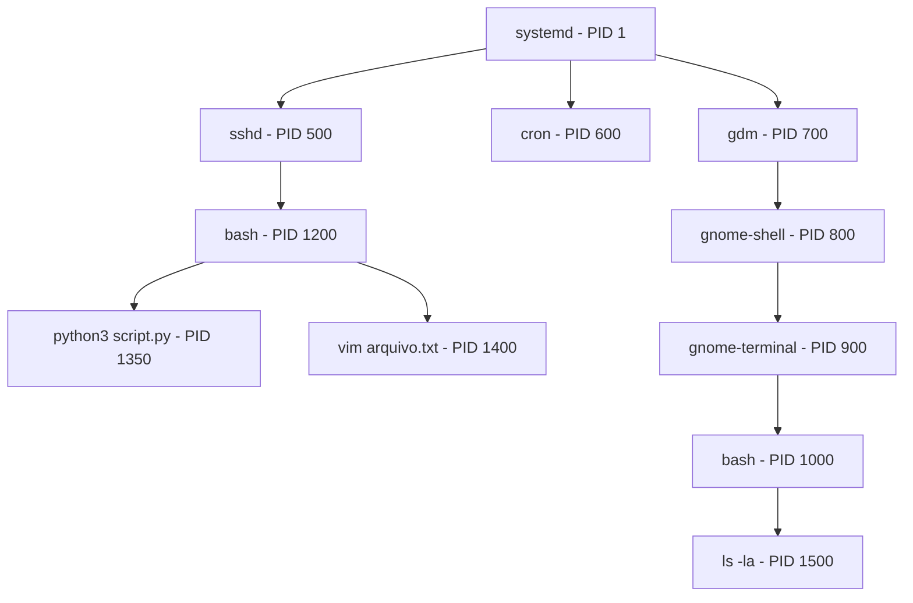

# 3.4 — Monitoramento de Processos: ps, top e htop

[← Anterior: Pipes e Redirecionamento](cap03-mod03-pipes-redirecionamento.md) · [Próximo: Editores de Texto no Terminal: vim e micro →](cap03-mod05-editores-terminal.md)

---

## Introdução

No módulo anterior, aprendemos a conectar comandos com pipes e redirecionar dados para arquivos. Montamos pipelines que processam texto, filtram informações e geram relatórios. Em vários exemplos, usamos comandos como `ps aux | sort -k 4 -rn | head -10` para listar processos — mas não explicamos o que exatamente é um processo, nem por que monitorá-los é tão importante.

Pense no seguinte: quando você abre o terminal e digita `ls`, algo acontece. O sistema operacional cria uma "cópia de trabalho" do programa `ls`, executa, mostra o resultado e encerra. Quando você abre o navegador, o sistema cria outra "cópia de trabalho" — mas essa fica rodando enquanto você navega. Quando você inicia um servidor web, mais uma "cópia de trabalho" é criada e fica rodando indefinidamente, esperando conexões.

Cada uma dessas "cópias de trabalho" é um **processo**. E o seu computador, neste exato momento, está rodando centenas deles — talvez milhares. O navegador, o editor de texto, o gerenciador de janelas, o serviço de rede, o relógio do sistema, o antivírus, o servidor de som... tudo são processos.

Saber o que está rodando, quanto de memória e CPU cada processo consome, e como parar um processo que travou são habilidades essenciais para qualquer desenvolvedor. Quando seu programa trava e não responde, você precisa saber como encontrá-lo e encerrá-lo. Quando o computador fica lento, você precisa descobrir qual processo está consumindo todos os recursos. Quando um servidor em produção começa a ficar instável, a primeira coisa que você faz é olhar os processos.

Lembre-se do mantra: **"Qual problema você quer resolver?"** O problema aqui é: como saber o que está acontecendo dentro do computador? A resposta: monitorando processos.

---

## O que é um Processo

No módulo 1.6, quando estudamos sistemas operacionais, vimos que o sistema operacional é o "maestro" que coordena tudo no computador. Uma das suas principais responsabilidades é gerenciar processos. Agora vamos entender isso em profundidade.

### Programa vs Processo

Essa distinção é fundamental e confunde muita gente:

- Um **programa** é um arquivo no disco. É um conjunto de instruções escritas por um programador, salvas em um arquivo executável. O programa é estático — ele fica lá no disco, parado, sem fazer nada. Exemplo: o arquivo `/usr/bin/python3` é um programa.

- Um **processo** é um programa em execução. Quando você executa um programa, o sistema operacional carrega as instruções do disco para a memória RAM, aloca recursos (memória, acesso a CPU, descritores de arquivo) e começa a executar. O processo é dinâmico — ele está vivo, consumindo recursos, fazendo coisas. Exemplo: quando você digita `python3 script.py`, o sistema cria um processo a partir do programa `python3`.

A analogia da cozinha funciona bem aqui. O programa é a **receita** escrita no livro de culinária — ela existe no papel, parada, sem fazer nada. O processo é a **execução da receita** — alguém pegou a receita, separou os ingredientes (memória), está usando o fogão (CPU) e está ativamente cozinhando. Você pode ter uma receita e executá-la várias vezes ao mesmo tempo — cada execução é um processo diferente, usando seus próprios ingredientes e utensílios.

Da mesma forma, você pode ter um único programa e criar vários processos a partir dele. Se você abrir três terminais e executar `python3 script.py` em cada um, terá três processos diferentes rodando o mesmo programa. Cada um tem sua própria memória, seus próprios dados e seu próprio estado.

| Conceito | O que e | Onde fica | Estado | Exemplo |
|----------|---------|-----------|--------|---------|
| Programa | Arquivo com instruções | Disco | Estático, parado | /usr/bin/python3 |
| Processo | Programa em execução | Memória RAM | Dinâmico, ativo | python3 rodando seu script |

### O que Compõe um Processo

Quando o sistema operacional cria um processo, ele aloca vários recursos para ele:

- **PID (Process ID)**: um número único que identifica o processo. Cada processo no sistema tem um PID diferente. O primeiro processo do sistema (chamado `init` ou `systemd`) tem PID 1.

- **Memória**: cada processo recebe seu próprio espaço de memória, isolado dos outros. Um processo não pode acessar a memória de outro processo diretamente — isso é uma proteção de segurança do sistema operacional. Se um processo travar, ele não corrompe a memória dos outros.

- **Descritores de arquivo**: lembra dos streams stdin (0), stdout (1) e stderr (2) que vimos no módulo anterior? Eles são descritores de arquivo do processo. Cada processo tem seus próprios descritores, e pode abrir mais (arquivos, conexões de rede, pipes).

- **Variáveis de ambiente**: cada processo herda um conjunto de variáveis de ambiente do processo que o criou. Essas variáveis contêm informações como o diretório home do usuário (`HOME`), o caminho de busca de programas (`PATH`) e o tipo de terminal (`TERM`).

- **Processo pai (PPID)**: todo processo (exceto o PID 1) foi criado por outro processo. O processo criador é chamado de **processo pai** (parent process), e seu PID é o PPID (Parent Process ID) do processo filho. Quando você digita `ls` no terminal, o bash (seu shell) cria um processo filho para executar o `ls`.

- **Usuário dono**: cada processo pertence a um usuário. Isso determina quais permissões o processo tem — quais arquivos pode ler, quais pode modificar, quais recursos pode acessar. Processos do sistema geralmente pertencem ao usuário `root`.

### Árvore de Processos

Os processos formam uma **árvore hierárquica**. O processo raiz (PID 1, geralmente `systemd` em distribuições modernas) é o ancestral de todos os outros. Ele cria processos filhos, que criam seus próprios filhos, e assim por diante.



Quando você abre o terminal e digita um comando, a cadeia é:
1. `systemd` (PID 1) iniciou o gerenciador de desktop
2. O gerenciador de desktop iniciou o emulador de terminal
3. O emulador de terminal iniciou o bash (seu shell)
4. O bash criou um processo filho para executar seu comando

Você pode ver essa árvore com o comando `pstree`:

```bash
# Mostrar arvore de processos
pstree

# Mostrar com PIDs
pstree -p

# Mostrar arvore a partir de um processo especifico
pstree -p 1000
```

Saída esperada (pstree -p, simplificada):
```
systemd(1)─┬─sshd(500)───bash(1200)───python3(1350)
            ├─cron(600)
            ├─gdm(700)───gnome-shell(800)───gnome-terminal(900)───bash(1000)───pstree(1501)
            └─...
```

Note que o próprio `pstree` aparece na árvore — ele é um processo também, filho do bash que o executou.

### Estados de um Processo

Um processo não está sempre "rodando". Na verdade, em um computador com 4 núcleos de CPU, no máximo 4 processos podem estar realmente executando ao mesmo tempo. Mas o sistema pode ter centenas de processos. Como isso funciona?

O sistema operacional alterna rapidamente entre os processos, dando a cada um uma fatia de tempo de CPU (geralmente alguns milissegundos). Isso acontece tão rápido que parece que todos estão rodando ao mesmo tempo — mas na verdade estão se revezando. Esse mecanismo se chama **escalonamento** (scheduling).

Cada processo pode estar em um destes estados:

| Estado | Código | Significado | Analogia |
|--------|--------|-------------|----------|
| Running | R | Executando na CPU neste momento | Cozinheiro usando o fogao agora |
| Sleeping | S | Esperando algo acontecer | Cozinheiro esperando a agua ferver |
| Disk Sleep | D | Esperando operação de disco | Cozinheiro esperando ingrediente chegar da despensa |
| Stopped | T | Pausado por um sinal | Cozinheiro que parou porque o chefe mandou esperar |
| Zombie | Z | Terminou mas o pai ainda não coletou o resultado | Prato pronto que ninguem retirou do balcao |

O estado mais comum é **Sleeping** (S). A maioria dos processos passa a maior parte do tempo dormindo — esperando que algo aconteça (uma tecla ser pressionada, dados chegarem pela rede, um timer expirar). Quando o evento acontece, o processo acorda, processa rapidamente e volta a dormir.

O estado **Zombie** (Z) merece atenção especial. Quando um processo termina, ele não desaparece imediatamente. Ele fica em estado zombie até que o processo pai leia seu código de saída (usando a chamada de sistema `wait()`). Se o processo pai não fizer isso (por ter um bug, por exemplo), o zombie fica lá ocupando uma entrada na tabela de processos. Zombies não consomem CPU nem memória significativa, mas muitos zombies indicam um problema no processo pai.

---

## O Comando ps: Fotografando Processos

O comando `ps` (process status, ou "estado dos processos") mostra uma **fotografia** dos processos em um determinado instante. Ele não atualiza em tempo real — mostra o estado no momento em que foi executado.

### ps Básico

Sem opções, o `ps` mostra apenas os processos do terminal atual:

```bash
# Processos do terminal atual
ps
```

Saída esperada:
```
    PID TTY          TIME CMD
   1000 pts/0    00:00:00 bash
   1501 pts/0    00:00:00 ps
```

Isso mostra apenas dois processos: o bash (seu shell) e o próprio `ps`. As colunas são:
- **PID**: identificador do processo
- **TTY**: terminal associado (pts/0 = primeiro pseudo-terminal)
- **TIME**: tempo total de CPU usado pelo processo
- **CMD**: comando que iniciou o processo

### ps aux: A Visão Completa

A combinação mais usada é `ps aux`, que mostra **todos** os processos do sistema com informações detalhadas:

```bash
# Todos os processos do sistema com detalhes
ps aux
```

Saída esperada (simplificada):
```
USER         PID %CPU %MEM    VSZ   RSS TTY      STAT START   TIME COMMAND
root           1  0.0  0.1 169536 13200 ?        Ss   jan14   0:05 /sbin/init
root           2  0.0  0.0      0     0 ?        S    jan14   0:00 [kthreadd]
root         500  0.0  0.0  15432  6800 ?        Ss   jan14   0:00 /usr/sbin/sshd
ana         1000  0.0  0.0   8960  5200 pts/0    Ss   10:30   0:00 -bash
ana         1350  2.5  1.2 125000 98000 pts/0    Sl   10:35   0:45 python3 app.py
ana         1400  0.0  0.3  52000 24000 pts/1    S+   10:40   0:02 vim arquivo.txt
root        1450  0.1  0.5  85000 40000 ?        Ssl  jan14   2:30 /usr/bin/dockerd
ana         1501  0.0  0.0  10000  3200 pts/0    R+   11:00   0:00 ps aux
```

Cada coluna tem um significado importante:

| Coluna | Significado | Exemplo | O que indica |
|--------|-------------|---------|-------------|
| USER | Usuario dono do processo | ana | Quem iniciou o processo |
| PID | Identificador do processo | 1350 | Número único do processo |
| %CPU | Porcentagem de uso de CPU | 2.5 | Quanto de CPU esta usando agora |
| %MEM | Porcentagem de uso de memória | 1.2 | Quanto da RAM esta usando |
| VSZ | Memória virtual em KB | 125000 | Memória total alocada, incluindo swap |
| RSS | Memória residente em KB | 98000 | Memória fisica realmente usada |
| TTY | Terminal associado | pts/0 | De qual terminal foi iniciado, ? = sem terminal |
| STAT | Estado do processo | Sl | Código de estado, veja tabela abaixo |
| START | Quando iniciou | 10:35 | Hora ou data de inicio |
| TIME | Tempo de CPU acumulado | 0:45 | Quanto tempo de CPU ja usou no total |
| COMMAND | Comando completo | python3 app.py | O que esta rodando |

As letras do `ps aux` significam:
- `a` = mostra processos de todos os usuários
- `u` = formato orientado ao usuário (com %CPU, %MEM, etc.)
- `x` = mostra processos sem terminal associado (daemons, serviços)

### Entendendo a Coluna STAT

A coluna STAT mostra o estado do processo com códigos de uma ou duas letras:

| Código | Significado |
|--------|-------------|
| R | Running - executando ou pronto para executar |
| S | Sleeping - dormindo, esperando um evento |
| D | Disk sleep - esperando I/O de disco, não pode ser interrompido |
| T | Stopped - parado por um sinal |
| Z | Zombie - terminou mas o pai não coletou o resultado |
| s | Lider de sessao |
| l | Multi-threaded, tem threads |
| + | Processo em foreground, no grupo de processos do terminal |
| < | Alta prioridade |
| N | Baixa prioridade, nice |
| L | Tem páginas travadas na memória |

Então `Ss` significa "Sleeping + líder de sessão", `Sl` significa "Sleeping + multi-threaded", e `R+` significa "Running + em foreground".

### Filtrando Processos com ps e grep

Na prática, `ps aux` mostra centenas de processos. Você quase sempre vai filtrar com `grep`:

```bash
# Encontrar processos Python
ps aux | grep python
# Problema: o proprio grep aparece no resultado

# Solucao: excluir o grep do resultado
ps aux | grep python | grep -v grep

# Solucao alternativa (truque classico):
ps aux | grep [p]ython
# O [p] faz o grep nao casar consigo mesmo

# Encontrar processos de um usuario especifico
ps aux | grep "^ana"

# Encontrar um processo pelo PID
ps aux | grep " 1350 "

# Encontrar processos que usam mais de 10% de CPU
ps aux | awk '$3 > 10.0'

# Encontrar processos que usam mais de 5% de memoria
ps aux | awk '$4 > 5.0'
```

### Outras Formas Úteis do ps

```bash
# Formato de arvore (mostra hierarquia pai-filho)
ps auxf

# Mostrar apenas colunas especificas
ps -eo pid,ppid,user,%cpu,%mem,comm
# -e = todos os processos
# -o = formato personalizado

# Ordenar por uso de memoria (maior primeiro)
ps aux --sort=-%mem | head -15

# Ordenar por uso de CPU
ps aux --sort=-%cpu | head -15

# Mostrar threads de um processo
ps -T -p 1350

# Mostrar processos de um usuario
ps -u ana

# Mostrar processos com comando completo (sem truncar)
ps auxww
```

O formato personalizado com `-eo` é muito poderoso. Você escolhe exatamente quais colunas quer ver:

```bash
# Relatorio personalizado: PID, usuario, CPU, memoria, comando
ps -eo pid,user,%cpu,%mem,comm --sort=-%cpu | head -20
```

Saída esperada:
```
    PID USER     %CPU %MEM COMMAND
   1350 ana       2.5  1.2 python3
   1450 root      0.1  0.5 dockerd
    800 ana       0.1  0.8 gnome-shell
   1400 ana       0.0  0.3 vim
   1000 ana       0.0  0.0 bash
```

---

## O Comando top: Monitoramento em Tempo Real

Enquanto o `ps` tira uma fotografia, o `top` é como uma câmera de vídeo — ele mostra os processos em tempo real, atualizando a cada poucos segundos. É a ferramenta padrão para monitorar o que está acontecendo no sistema.

### Executando o top

```bash
# Iniciar o top
top
```

A tela do `top` tem duas partes: o **cabeçalho** (informações gerais do sistema) e a **lista de processos** (atualizada em tempo real).

Saída esperada (cabeçalho):
```
top - 11:30:00 up 1 day,  3:45,  2 users,  load average: 0.52, 0.38, 0.41
Tasks: 245 total,   1 running, 243 sleeping,   0 stopped,   1 zombie
%Cpu(s):  5.2 us,  1.3 sy,  0.0 ni, 93.0 id,  0.3 wa,  0.0 hi,  0.2 si,  0.0 st
MiB Mem :   7856.0 total,   2340.5 free,   3215.3 used,   2300.2 buff/cache
MiB Swap:   2048.0 total,   2048.0 free,      0.0 used.   4140.7 avail Mem

    PID USER      PR  NI    VIRT    RES    SHR S  %CPU  %MEM     TIME+ COMMAND
   1350 ana       20   0  125000  98000  12000 S   2.5   1.2   0:45.30 python3
    800 ana       20   0  850000  65000  32000 S   0.7   0.8   5:20.15 gnome-shell
   1450 root      20   0   85000  40000  18000 S   0.3   0.5   2:30.00 dockerd
```

### Entendendo o Cabeçalho do top

Cada linha do cabeçalho traz informações valiosas:

**Linha 1 — Uptime e Load Average:**
```
top - 11:30:00 up 1 day, 3:45, 2 users, load average: 0.52, 0.38, 0.41
```
- `11:30:00` — hora atual
- `up 1 day, 3:45` — há quanto tempo o sistema está ligado
- `2 users` — quantos usuários estão logados
- `load average: 0.52, 0.38, 0.41` — carga média nos últimos 1, 5 e 15 minutos

O **load average** é um dos indicadores mais importantes. Ele representa quantos processos estão esperando para usar a CPU, em média. Em um sistema com 4 núcleos:
- Load average 0.5 = sistema tranquilo (12.5% de uso)
- Load average 2.0 = sistema com carga moderada (50% de uso)
- Load average 4.0 = sistema no limite (100% de uso)
- Load average 8.0 = sistema sobrecarregado (processos esperando na fila)

A regra prática: se o load average é menor que o número de núcleos de CPU, o sistema está saudável. Se é maior, processos estão esperando na fila.

**Linha 2 — Resumo de Processos:**
```
Tasks: 245 total, 1 running, 243 sleeping, 0 stopped, 1 zombie
```
- 245 processos no total
- 1 executando (o próprio `top`)
- 243 dormindo (esperando eventos)
- 0 parados
- 1 zombie (pode indicar um problema)

**Linha 3 — Uso de CPU:**
```
%Cpu(s): 5.2 us, 1.3 sy, 0.0 ni, 93.0 id, 0.3 wa, 0.0 hi, 0.2 si, 0.0 st
```

| Código | Significado | O que indica |
|--------|-------------|-------------|
| us | User space | CPU usada por programas do usuario |
| sy | System | CPU usada pelo kernel do sistema |
| ni | Nice | CPU usada por processos com prioridade alterada |
| id | Idle | CPU ociosa, sem nada para fazer |
| wa | Wait I/O | CPU esperando operações de disco |
| hi | Hardware interrupts | CPU tratando interrupcoes de hardware |
| si | Software interrupts | CPU tratando interrupcoes de software |
| st | Steal | CPU roubada pelo hypervisor em máquinas virtuais |

Os mais importantes para o dia a dia:
- **id** alto (>80%) = sistema tranquilo
- **us** alto (>70%) = seus programas estão consumindo muita CPU
- **wa** alto (>20%) = o disco está lento, processos esperando I/O
- **sy** alto (>30%) = o kernel está trabalhando muito (pode indicar problema)

**Linhas 4 e 5 — Memória:**
```
MiB Mem :  7856.0 total,  2340.5 free,  3215.3 used,  2300.2 buff/cache
MiB Swap: 2048.0 total,  2048.0 free,     0.0 used.  4140.7 avail Mem
```

- **total**: memória RAM total do sistema
- **free**: memória completamente livre
- **used**: memória usada por processos
- **buff/cache**: memória usada como cache de disco (pode ser liberada se necessário)
- **avail Mem**: memória disponível para novos processos (free + cache liberável)

O número que realmente importa é **avail Mem**. O Linux usa memória livre como cache de disco para acelerar operações — isso é inteligente, não é desperdício. Se um programa precisar de mais memória, o sistema libera o cache automaticamente.

A **swap** é espaço no disco usado como extensão da RAM. Se o swap está sendo usado significativamente, significa que a RAM não é suficiente e o sistema está usando o disco (muito mais lento) como memória. Isso deixa tudo lento.

### Comandos Interativos do top

O `top` é interativo — você pode pressionar teclas para mudar o que é exibido:

| Tecla | O que faz |
|-------|-----------|
| q | Sair do top |
| h | Mostrar ajuda |
| P | Ordenar por uso de CPU (padrão) |
| M | Ordenar por uso de memória |
| T | Ordenar por tempo de CPU acumulado |
| N | Ordenar por PID |
| k | Matar um processo (pede o PID) |
| r | Alterar prioridade de um processo (renice) |
| 1 | Mostrar cada nucleo de CPU separadamente |
| c | Mostrar comando completo ou apenas o nome |
| f | Escolher quais colunas exibir |
| u | Filtrar por usuario |
| d | Mudar intervalo de atualização |
| W | Salvar configuração atual |
| z | Alternar cores |

Os mais úteis no dia a dia:
- `P` e `M` para alternar entre ordenação por CPU e memória
- `1` para ver cada núcleo de CPU separadamente (útil para identificar se a carga está distribuída)
- `k` para matar um processo que travou
- `c` para ver o comando completo (útil para distinguir entre vários processos Python, por exemplo)
- `u` para filtrar processos de um usuário específico

### Opções de Linha de Comando do top

```bash
# Atualizar a cada 2 segundos (padrao e 3)
top -d 2

# Mostrar apenas processos de um usuario
top -u ana

# Mostrar apenas um processo especifico
top -p 1350

# Mostrar varios processos especificos
top -p 1350,1400,1450

# Modo batch (nao interativo, util para scripts)
top -bn1
# -b = batch mode
# -n1 = executar apenas 1 iteracao

# Salvar snapshot em arquivo
top -bn1 > snapshot-processos.txt
```

O modo batch (`-bn1`) é especialmente útil em pipelines:

```bash
# Top 5 processos por CPU (usando top em modo batch)
top -bn1 | head -12

# Monitorar uso de memoria de um processo ao longo do tempo
while true; do
    top -bn1 -p 1350 | tail -1 >> monitoramento.log
    sleep 60
done
```

---

## O Comando htop: top com Esteroides

O `htop` é uma versão melhorada do `top`. Ele não vem instalado por padrão na maioria das distribuições, mas é tão útil que quase todo desenvolvedor instala:

```bash
# Instalar o htop (Ubuntu/Debian)
sudo apt install htop

# Instalar o htop (Fedora)
sudo dnf install htop

# Executar
htop
```

### Por que htop é Melhor que top

| Caracteristica | top | htop |
|---------------|-----|------|
| Barras graficas de CPU e memória | Não | Sim, coloridas |
| Rolagem vertical e horizontal | Limitada | Completa, com mouse |
| Matar processo | Digitar PID | Selecionar e pressionar F9 |
| Árvore de processos | Não nativo | F5 alterna para modo árvore |
| Buscar processo | Não nativo | F3 busca por nome |
| Filtrar processos | Limitado | F4 filtra por texto |
| Cores e visual | Básico | Rico e informativo |
| Configuração | Limitada | F2 abre menu de configuração |
| Suporte a mouse | Não | Sim |

### Interface do htop

O htop mostra barras coloridas no topo que representam visualmente o uso de cada núcleo de CPU e da memória:

```
  1  [||||||||||||||||                    40.2%]   Tasks: 245, 120 thr; 1 running
  2  [||||||                              15.8%]   Load average: 0.52 0.38 0.41
  3  [||||||||||||                        30.5%]   Uptime: 1 day, 03:45:20
  4  [||||                                10.1%]
  Mem[||||||||||||||||||||||         3.2G/7.7G]
  Swp[                                0K/2.0G]
```

Cada barra de CPU usa cores para indicar o tipo de uso:
- **Azul**: processos de baixa prioridade (nice)
- **Verde**: processos normais do usuário
- **Vermelho**: processos do kernel (sistema)
- **Amarelo/Laranja**: tempo de I/O wait

### Teclas do htop

| Tecla | O que faz |
|-------|-----------|
| F1 | Ajuda |
| F2 | Configuração (personalizar colunas, cores, layout) |
| F3 | Buscar processo por nome |
| F4 | Filtrar processos por texto |
| F5 | Alternar modo árvore |
| F6 | Ordenar por coluna |
| F7 | Diminuir prioridade (nice +1) |
| F8 | Aumentar prioridade (nice -1) |
| F9 | Matar processo (envia sinal) |
| F10 | Sair |
| Setas | Navegar pela lista |
| Space | Marcar processo (para ações em lote) |
| u | Filtrar por usuario |
| t | Alternar modo árvore |
| H | Mostrar ou ocultar threads |
| K | Mostrar ou ocultar threads do kernel |

O modo árvore (F5) é particularmente útil — ele mostra a hierarquia de processos visualmente, facilitando entender quem criou quem:

```
  PID USER     PRI  NI  VIRT   RES   SHR S CPU% MEM%   TIME+  Command
  900 ana       20   0  450M   85M   32M S  0.0  1.1  0:15.30 gnome-terminal
 1000 ana       20   0  8960  5200  3400 S  0.0  0.0  0:00.50  ├─ bash
 1350 ana       20   0  125M   98M   12M S  2.5  1.2  0:45.30  │  └─ python3 app.py
 1100 ana       20   0  8960  5200  3400 S  0.0  0.0  0:00.30  └─ bash
 1400 ana       20   0   52M   24M   8M  S  0.0  0.3  0:02.00     └─ vim arquivo.txt
```

---

## Sinais: Comunicando-se com Processos

No Linux, processos se comunicam através de **sinais** (signals). Um sinal é uma notificação enviada a um processo para informar que algo aconteceu ou para pedir que ele faça algo. É como um toque no ombro — o processo recebe o sinal e decide o que fazer com ele.

### Os Sinais Mais Importantes

| Número | Nome | Significado | O que faz | Pode ser ignorado? |
|--------|------|-------------|-----------|-------------------|
| 1 | SIGHUP | Hangup | Terminal fechou, recarregar configuração | Sim |
| 2 | SIGINT | Interrupt | Ctrl+C pressionado, interromper | Sim |
| 9 | SIGKILL | Kill | Matar imediatamente, sem chance de limpar | Não |
| 15 | SIGTERM | Terminate | Pedir para terminar educadamente | Sim |
| 18 | SIGCONT | Continue | Continuar processo parado | - |
| 19 | SIGSTOP | Stop | Pausar processo imediatamente | Não |
| 20 | SIGTSTP | Terminal Stop | Ctrl+Z pressionado, pausar | Sim |

A diferença entre SIGTERM (15) e SIGKILL (9) é crucial:

- **SIGTERM (15)** é como pedir educadamente: "Por favor, termine o que está fazendo e encerre." O processo recebe o sinal e pode fazer uma limpeza antes de sair — salvar dados, fechar conexões, liberar recursos. É o sinal padrão e deve ser sempre a primeira tentativa.

- **SIGKILL (9)** é como puxar o cabo de força: "Pare agora, sem discussão." O processo é encerrado imediatamente pelo kernel, sem chance de fazer limpeza. Dados não salvos são perdidos, conexões ficam abertas, arquivos temporários não são removidos. Use apenas quando SIGTERM não funcionar.

A analogia: SIGTERM é como pedir a um cozinheiro para parar — ele desliga o fogão, guarda os ingredientes e limpa a bancada antes de sair. SIGKILL é como cortar a energia da cozinha — tudo para instantaneamente, com panelas no fogo e ingredientes espalhados.

### O Comando kill

Apesar do nome assustador, o comando `kill` não necessariamente "mata" processos — ele **envia sinais**. O nome vem do fato de que o sinal padrão (SIGTERM) pede ao processo para terminar.

```bash
# Enviar SIGTERM (padrao) - pedir para terminar educadamente
kill 1350

# Enviar SIGTERM explicitamente
kill -15 1350
kill -SIGTERM 1350
kill -TERM 1350

# Enviar SIGKILL - forcar encerramento imediato
kill -9 1350
kill -SIGKILL 1350
kill -KILL 1350

# Enviar SIGHUP - pedir para recarregar configuracao
kill -1 1350
kill -HUP 1350

# Pausar um processo
kill -STOP 1350

# Continuar um processo pausado
kill -CONT 1350
```

A sequência recomendada para encerrar um processo que não responde:

```bash
# 1. Primeiro, pedir educadamente (SIGTERM)
kill 1350

# 2. Esperar alguns segundos...

# 3. Se nao terminou, forcar (SIGKILL)
kill -9 1350
```

### O Comando killall

O `killall` envia sinais para todos os processos com um determinado nome:

```bash
# Encerrar todos os processos python3
killall python3

# Encerrar todos os processos firefox
killall firefox

# Forcar encerramento de todos os processos de um programa
killall -9 programa-travado

# Encerrar processos de um usuario especifico
killall -u ana python3

# Pedir confirmacao antes de matar
killall -i python3
```

### O Comando pkill

O `pkill` é similar ao `killall`, mas permite buscar por padrões:

```bash
# Matar processos que contem "python" no nome
pkill python

# Matar processos de um usuario
pkill -u ana

# Matar processos mais antigos que 1 hora
pkill --older-than 1h python

# Matar processos pelo comando completo (nao apenas o nome)
pkill -f "python3 app.py"
# -f busca no comando completo, nao apenas no nome do processo
```

### Ctrl+C e Ctrl+Z

Dois atalhos de teclado que você já deve ter usado:

- **Ctrl+C** envia SIGINT (sinal 2) ao processo em foreground. A maioria dos programas interpreta isso como "pare o que está fazendo". É a forma mais comum de interromper um comando no terminal.

- **Ctrl+Z** envia SIGTSTP (sinal 20) ao processo em foreground. Isso **pausa** o processo (não encerra). O processo fica em estado Stopped (T) e pode ser retomado depois.

```bash
# Executar um comando longo
find / -name "*.log" 2>/dev/null

# Pressionar Ctrl+Z para pausar
# [1]+  Stopped                 find / -name "*.log"

# Ver processos pausados
jobs

# Retomar em foreground (primeiro plano)
fg

# Ou retomar em background (segundo plano)
bg
```

---

## Foreground e Background: Primeiro e Segundo Plano

Quando você executa um comando no terminal, ele roda em **foreground** (primeiro plano) — o terminal fica "preso" esperando o comando terminar. Você não pode digitar outros comandos até que ele acabe.

Mas às vezes você quer executar algo demorado e continuar usando o terminal. Para isso, existe o **background** (segundo plano).

### Executando em Background

```bash
# Executar em background adicionando & no final
python3 servidor.py &
# [1] 1350
# O [1] e o numero do job, 1350 e o PID

# O terminal fica livre para outros comandos
ls
grep "algo" arquivo.txt
# Tudo funciona normalmente enquanto o servidor roda em background
```

### Gerenciando Jobs

O bash mantém uma lista de processos em background chamada **jobs**:

```bash
# Listar jobs em background
jobs
# [1]+  Running                 python3 servidor.py &
# [2]-  Stopped                 vim arquivo.txt

# Trazer job para foreground
fg %1
# Ou simplesmente:
fg

# Enviar job para background
bg %1

# Matar um job pelo numero
kill %1
```

### O Comando nohup

Quando você fecha o terminal, todos os processos filhos dele recebem o sinal SIGHUP (hangup) e normalmente encerram. Se você quer que um processo continue rodando mesmo depois de fechar o terminal, use `nohup`:

```bash
# Executar processo que sobrevive ao fechamento do terminal
nohup python3 servidor.py &
# A saida vai para o arquivo nohup.out

# Redirecionar a saida para outro arquivo
nohup python3 servidor.py > servidor.log 2>&1 &

# Verificar que esta rodando
ps aux | grep servidor.py
```

O `nohup` é muito usado para iniciar serviços em servidores remotos via SSH. Sem ele, quando você desconecta do SSH, seus processos morrem. Com `nohup`, eles continuam rodando.

---

## Prioridade de Processos: nice e renice

Nem todos os processos são igualmente importantes. O compilador que está rodando em background pode esperar um pouco mais, enquanto o editor de texto que você está usando precisa responder instantaneamente. O Linux permite ajustar a **prioridade** de processos usando o conceito de **nice** (gentileza).

### Como Funciona o nice

O valor de nice vai de -20 (maior prioridade, menos "gentil") a +19 (menor prioridade, mais "gentil"). O padrão é 0.

- **nice negativo** (-20 a -1): o processo é "egoísta" — pede mais tempo de CPU. Apenas o root pode definir valores negativos.
- **nice zero** (0): prioridade padrão.
- **nice positivo** (1 a 19): o processo é "gentil" — cede tempo de CPU para outros. Qualquer usuário pode aumentar o nice dos seus processos.

```bash
# Executar um comando com prioridade baixa (gentil)
nice -n 10 gcc programa.c -o programa
# Compila com prioridade baixa, nao atrapalha outros processos

# Executar com prioridade alta (requer root)
sudo nice -n -5 ./processo-importante

# Alterar prioridade de um processo ja em execucao
renice 10 -p 1350
# Muda o nice do processo 1350 para 10

# Alterar prioridade de todos os processos de um usuario
sudo renice 5 -u ana
```

Na prática, você usa `nice` quando vai executar algo pesado (compilação, processamento de dados, backup) e não quer que isso atrapalhe o uso normal do computador.

---

## Monitorando Recursos do Sistema

Além de processos individuais, é importante monitorar os recursos do sistema como um todo.

### free — Memória do Sistema

```bash
# Mostrar uso de memoria
free -h
```

Saída esperada:
```
               total        used        free      shared  buff/cache   available
Mem:           7.7Gi       3.1Gi       2.3Gi       256Mi       2.2Gi       4.0Gi
Swap:          2.0Gi          0B       2.0Gi
```

| Coluna | Significado |
|--------|-------------|
| total | Memória RAM total instalada |
| used | Memória usada por processos |
| free | Memória completamente livre |
| shared | Memória compartilhada entre processos |
| buff/cache | Memória usada como cache de disco |
| available | Memória disponível para novos processos |

O número mais importante é **available** — é quanta memória o sistema pode fornecer para novos programas. O Linux usa memória livre como cache de disco (buff/cache), o que é inteligente: se ninguém precisa da memória, melhor usá-la para acelerar o disco. Quando um programa precisa, o cache é liberado automaticamente.

```bash
# Monitorar memoria a cada 2 segundos
watch -n 2 free -h
# watch executa um comando repetidamente e mostra o resultado
# -n 2 = a cada 2 segundos
# Pressione Ctrl+C para sair
```

### uptime — Carga do Sistema

```bash
# Mostrar uptime e load average
uptime
```

Saída esperada:
```
 11:30:00 up 1 day,  3:45,  2 users,  load average: 0.52, 0.38, 0.41
```

O load average mostra a carga média nos últimos 1, 5 e 15 minutos. Compare com o número de núcleos de CPU:

```bash
# Ver quantos nucleos de CPU o sistema tem
nproc
# Saida: 4

# Ou mais detalhado
lscpu | grep "^CPU(s):"
# Saida: CPU(s): 4
```

Se o load average de 1 minuto é consistentemente maior que o número de núcleos, o sistema está sobrecarregado.

### vmstat — Estatísticas do Sistema

```bash
# Estatisticas do sistema a cada 2 segundos
vmstat 2
```

Saída esperada:
```
procs -----------memory---------- ---swap-- -----io---- -system-- ------cpu-----
 r  b   swpd   free   buff  cache   si   so    bi    bo   in   cs us sy id wa st
 1  0      0 2340512 128000 2172000  0    0    12    25  150  300  5  1 93  1  0
 0  0      0 2340000 128000 2172500  0    0     0    10  120  280  3  1 96  0  0
```

As colunas mais importantes:
- **r**: processos esperando CPU (se consistentemente > número de CPUs, sistema sobrecarregado)
- **b**: processos bloqueados esperando I/O
- **si/so**: swap in/out (se > 0 consistentemente, falta RAM)
- **us/sy/id/wa**: uso de CPU (mesmo que no top)

### iostat — Estatísticas de Disco

```bash
# Estatisticas de I/O de disco
iostat -x 2
```

Saída esperada:
```
Device   r/s     w/s   rkB/s   wkB/s  %util
sda      5.00   12.00  120.00  480.00  15.20
sdb      0.50    2.00   20.00   80.00   3.50
```

- **r/s e w/s**: leituras e escritas por segundo
- **%útil**: porcentagem de tempo que o disco está ocupado (>80% indica gargalo)

---

## O Diretório /proc: Processos como Arquivos

Lembra que no Linux "tudo é arquivo"? Isso inclui processos. O diretório `/proc` é um sistema de arquivos virtual que expõe informações sobre cada processo como arquivos e diretórios.

Cada processo tem um diretório em `/proc/{PID}/`:

```bash
# Ver informacoes do processo 1350
ls /proc/1350/

# Comando que iniciou o processo
cat /proc/1350/cmdline | tr '\0' ' '
# Saida: python3 app.py

# Status detalhado do processo
cat /proc/1350/status

# Mapa de memoria do processo
cat /proc/1350/maps | head -10

# Descritores de arquivo abertos
ls -la /proc/1350/fd/

# Diretorio de trabalho do processo
ls -la /proc/1350/cwd

# Variaveis de ambiente do processo
cat /proc/1350/environ | tr '\0' '\n'
```

O `/proc` também tem informações gerais do sistema:

```bash
# Informacoes da CPU
cat /proc/cpuinfo

# Informacoes da memoria
cat /proc/meminfo

# Versao do kernel
cat /proc/version

# Tempo de atividade em segundos
cat /proc/uptime

# Media de carga
cat /proc/loadavg
```

Isso é fascinante do ponto de vista de design: em vez de criar comandos especiais para cada tipo de informação, o Linux expõe tudo como arquivos. Os comandos `ps`, `top`, `free` e `uptime` na verdade leem dados do `/proc` e os formatam de forma legível. Você poderia obter as mesmas informações lendo `/proc` diretamente — os comandos apenas facilitam a leitura.

---

## Cenários Práticos: Problemas do Dia a Dia

Vamos ver como usar tudo isso para resolver problemas reais que desenvolvedores enfrentam constantemente.

### Cenário 1: O Computador Ficou Lento

Seu computador está lento e você precisa descobrir o que está consumindo recursos:

```bash
# Passo 1: verificar o load average
uptime
# Se load average > numero de CPUs, sistema sobrecarregado

# Passo 2: verificar memoria
free -h
# Se available esta baixo e swap esta sendo usado, falta RAM

# Passo 3: encontrar o vilao
# Por CPU:
ps aux --sort=-%cpu | head -10

# Por memoria:
ps aux --sort=-%mem | head -10

# Passo 4: decidir o que fazer
# Se e um processo seu que travou:
kill 1350

# Se e um processo do sistema consumindo muito:
# Investigar antes de matar - pode ser importante
```

### Cenário 2: Seu Programa Travou

Você executou um script Python e ele parou de responder:

```bash
# Passo 1: tentar Ctrl+C
# Se nao funcionar...

# Passo 2: abrir outro terminal e encontrar o processo
ps aux | grep python

# Passo 3: tentar SIGTERM primeiro
kill 1350

# Passo 4: se nao terminou apos 5 segundos, forcar
kill -9 1350

# Passo 5: verificar que morreu
ps aux | grep 1350
```

### Cenário 3: Servidor em Produção Instável

Você recebe um alerta de que o servidor está lento:

```bash
# Passo 1: visao geral rapida
top -bn1 | head -20

# Passo 2: verificar se ha processos zombie
ps aux | grep -c Z

# Passo 3: verificar I/O de disco
iostat -x 1 3
# Se %util > 80%, disco e o gargalo

# Passo 4: verificar conexoes de rede
ss -s
# Mostra resumo de conexoes

# Passo 5: verificar logs recentes
tail -50 /var/log/syslog
```

### Cenário 4: Monitorar um Processo Específico

Você quer acompanhar o consumo de recursos do seu programa ao longo do tempo:

```bash
# Monitorar CPU e memoria de um processo a cada 5 segundos
while true; do
    echo "$(date '+%H:%M:%S') $(ps -p 1350 -o %cpu,%mem,rss --no-headers)"
    sleep 5
done

# Ou salvar em arquivo para analise posterior
while true; do
    echo "$(date '+%H:%M:%S') $(ps -p 1350 -o %cpu,%mem,rss --no-headers)" >> monitor.log
    sleep 5
done

# Usar watch para monitorar visualmente
watch -n 2 'ps -p 1350 -o pid,%cpu,%mem,rss,etime,comm'
```

### Cenário 5: Encontrar Qual Processo Está Usando uma Porta

Quando você tenta iniciar um servidor e recebe "Address already in use":

```bash
# Encontrar qual processo esta usando a porta 8080
ss -tlnp | grep 8080
# Saida: LISTEN  0  128  *:8080  *:*  users:(("python3",pid=1350,fd=3))

# Ou usando lsof
lsof -i :8080
# Saida: python3 1350 ana  3u  IPv4  12345  0t0  TCP *:8080 (LISTEN)

# Agora voce sabe: processo 1350 (python3) esta usando a porta
# Pode encerra-lo se necessario:
kill 1350
```

---

## Tabela de Referência Rápida

| Comando | O que faz | Exemplo mais comum |
|---------|-----------|-------------------|
| `ps aux` | Lista todos os processos com detalhes | `ps aux \| grep python` |
| `ps auxf` | Lista processos em formato de árvore | `ps auxf` |
| `ps -eo` | Lista com colunas personalizadas | `ps -eo pid,user,%cpu,comm` |
| `top` | Monitor de processos em tempo real | `top` |
| `top -bn1` | Snapshot único para scripts | `top -bn1 \| head -20` |
| `htop` | Monitor avancado com interface visual | `htop` |
| `pstree` | Árvore de processos | `pstree -p` |
| `kill` | Envia sinal a um processo | `kill 1350` |
| `kill -9` | Forca encerramento imediato | `kill -9 1350` |
| `killall` | Envia sinal por nome do programa | `killall python3` |
| `pkill` | Envia sinal por padrão de nome | `pkill -f "app.py"` |
| `jobs` | Lista processos em background | `jobs` |
| `fg` | Traz processo para foreground | `fg %1` |
| `bg` | Envia processo para background | `bg %1` |
| `nohup` | Executa imune a hangup | `nohup cmd &` |
| `nice` | Executa com prioridade alterada | `nice -n 10 cmd` |
| `renice` | Altera prioridade de processo existente | `renice 10 -p 1350` |
| `free -h` | Mostra uso de memória | `free -h` |
| `uptime` | Mostra uptime e load average | `uptime` |
| `vmstat` | Estatisticas do sistema | `vmstat 2` |
| `iostat` | Estatisticas de disco | `iostat -x 2` |
| `watch` | Executa comando repetidamente | `watch -n 2 free -h` |
| `lsof` | Lista arquivos abertos por processos | `lsof -i :8080` |
| `ss` | Mostra conexões de rede | `ss -tlnp` |
| `nproc` | Número de nucleos de CPU | `nproc` |

---

## Conexão com a Programação

Processos são um dos conceitos mais fundamentais da computação, e entendê-los vai impactar diretamente sua vida como desenvolvedor:

**Seu programa é um processo**: quando você escrever programas em Python (Capítulo 5), C (Capítulo 6) ou C# (Capítulo 8), cada execução cria um processo. Entender como processos funcionam ajuda a entender por que seu programa consome memória, como ele interage com o sistema operacional e o que acontece quando ele trava.

**Concorrência e paralelismo**: no Capítulo 9, quando estudarmos arquitetura de software, vamos ver que servidores web criam múltiplos processos (ou threads) para atender várias requisições ao mesmo tempo. O conceito de processos rodando em paralelo, compartilhando CPU e memória, é a base de como sistemas modernos funcionam.

**Docker e contêineres**: no Capítulo 9, vamos aprender sobre Docker. Um contêiner é essencialmente um processo isolado — ele roda como um processo no sistema, mas com seu próprio sistema de arquivos, rede e recursos. Tudo que aprendemos sobre PID, memória, CPU e sinais se aplica diretamente a contêineres.

**Debugging e troubleshooting**: quando seu programa tiver um bug que causa consumo excessivo de memória (memory leak) ou CPU, as ferramentas deste módulo são as primeiras que você vai usar para diagnosticar. Saber ler a saída do `top` e do `ps` é uma habilidade que todo desenvolvedor precisa.

**Códigos de saída**: no módulo anterior, vimos que todo comando retorna um código de saída (0 = sucesso). Agora sabemos que isso é uma propriedade do processo — quando o processo termina, ele retorna um código que o processo pai pode ler. No Capítulo 5, seus programas Python vão retornar códigos de saída usando `sys.exit()`.

---

## Como a IA pode te ajudar aqui

**Prompt 1 — Explorar o conceito:**
> "Meu computador está muito lento. A saída do `top` mostra load average 8.5 em uma máquina com 4 CPUs. O que isso significa e o que devo fazer?"

**Prompt 2 — Comparar alternativas:**
> "Qual a diferença entre SIGTERM e SIGKILL? Quando devo usar cada um? E o que acontece com os dados do meu programa se eu usar kill -9?"

**Prompt 3 — Aprofundar o tema:**
> "Estou rodando um script Python que processa um arquivo grande e quero monitorar quanto de memória ele está usando ao longo do tempo. Como faço isso e como interpreto os resultados?"

---

## Resumo do Módulo

| Conceito | Definição |
|----------|-----------|
| Processo | Programa em execução, com PID, memória e recursos proprios |
| Programa | Arquivo executavel no disco, estático |
| PID | Process ID, número único que identifica cada processo |
| PPID | Parent Process ID, PID do processo que criou este |
| Estado do processo | Running, Sleeping, Stopped, Zombie, Disk Sleep |
| Escalonamento | Mecanismo do SO que alterna processos na CPU |
| Sinal | Notificacao enviada a um processo para comunicar algo |
| SIGTERM | Sinal 15, pede ao processo para terminar educadamente |
| SIGKILL | Sinal 9, forca encerramento imediato sem limpeza |
| SIGINT | Sinal 2, enviado por Ctrl+C |
| Foreground | Processo em primeiro plano, ocupa o terminal |
| Background | Processo em segundo plano, terminal fica livre |
| Load average | Media de processos esperando CPU nos ultimos 1, 5 e 15 minutos |
| Nice | Valor de prioridade de -20 a +19, maior = menos prioridade |
| Zombie | Processo que terminou mas cujo pai não coletou o resultado |
| /proc | Sistema de arquivos virtual que expoe informações de processos |
| Swap | Espaco em disco usado como extensão da RAM |
| Buffer/cache | Memória usada pelo Linux para acelerar acesso ao disco |

---

## Glossário do Módulo

| Termo | Definição |
|-------|-----------|
| Background | Segundo plano, processo que roda sem ocupar o terminal |
| buff/cache | Memória usada pelo Linux como cache de disco, liberavel quando necessário |
| CPU | Central Processing Unit, processador, o componente que executa instruções |
| Daemon | Processo que roda em background sem terminal, geralmente um servico do sistema |
| Exit code | Código de saida, número retornado por um processo ao terminar |
| File descriptor | Descritor de arquivo, número que identifica um canal de comunicação |
| Foreground | Primeiro plano, processo que ocupa o terminal atual |
| free | Comando que mostra uso de memória RAM e swap |
| htop | Versão melhorada do top com interface visual e interativa |
| init | Primeiro processo do sistema, PID 1, ancestral de todos os outros |
| iostat | Comando que mostra estatisticas de entrada e saida de disco |
| Job | Processo gerenciado pelo shell, pode estar em foreground ou background |
| kill | Comando que envia sinais a processos, não necessariamente mata |
| killall | Comando que envia sinais a todos os processos com um determinado nome |
| Load average | Media de carga do sistema nos ultimos 1, 5 e 15 minutos |
| lsof | List Open Files, comando que lista arquivos abertos por processos |
| Memory leak | Vazamento de memória, quando um programa aloca memória e não libera |
| nice | Valor de prioridade de um processo, de -20 a +19 |
| nohup | No Hangup, executa processo imune ao sinal de fechamento do terminal |
| nproc | Comando que mostra o número de nucleos de CPU disponiveis |
| PID | Process ID, número único que identifica um processo no sistema |
| pkill | Comando que envia sinais a processos por padrão de nome |
| PPID | Parent Process ID, PID do processo pai |
| /proc | Sistema de arquivos virtual que expoe informações de processos como arquivos |
| ps | Process Status, comando que mostra uma fotografia dos processos |
| pstree | Comando que mostra a árvore hierarquica de processos |
| RAM | Random Access Memory, memória principal do computador |
| renice | Comando que altera a prioridade de um processo ja em execução |
| RSS | Resident Set Size, memória fisica realmente usada por um processo |
| Scheduling | Escalonamento, mecanismo do SO que distribui tempo de CPU entre processos |
| Signal | Sinal, notificacao enviada a um processo pelo sistema ou por outro processo |
| SIGINT | Signal Interrupt, sinal 2, enviado por Ctrl+C |
| SIGKILL | Signal Kill, sinal 9, forca encerramento imediato |
| SIGTERM | Signal Terminate, sinal 15, pede encerramento educado |
| SIGTSTP | Signal Terminal Stop, sinal 20, enviado por Ctrl+Z |
| ss | Socket Statistics, comando que mostra conexões de rede |
| Swap | Espaco em disco usado como extensão da memória RAM |
| systemd | Sistema de inicialização moderno do Linux, PID 1 na maioria das distribuicoes |
| Thread | Linha de execução dentro de um processo, compartilha memória com o processo |
| top | Comando que mostra processos em tempo real, atualizado periodicamente |
| uptime | Comando que mostra ha quanto tempo o sistema esta ligado e o load average |
| vmstat | Virtual Memory Statistics, comando que mostra estatisticas do sistema |
| VSZ | Virtual Size, memória virtual total alocada por um processo |
| watch | Comando que executa outro comando repetidamente e mostra o resultado |
| Zombie | Processo que terminou mas cujo processo pai não coletou o código de saida |

---

## Na Cultura Popular

- **Mr. Robot** (série, 2015-2019) — em vários episódios, o protagonista usa `ps`, `kill` e monitora processos para identificar programas maliciosos rodando em servidores comprometidos. A série mostra de forma realista como um profissional de segurança investiga o que está rodando em um sistema e encerra processos suspeitos.

- **Halt and Catch Fire** (série, 2014-2017) — o título da série é uma referência a uma instrução de máquina que fazia o processador parar completamente (um "halt" forçado). A série acompanha engenheiros nos anos 1980-90 lidando com hardware e software, incluindo cenas onde processos travados e gerenciamento de recursos são problemas reais que os personagens enfrentam.

- **O Jogo da Imitação** (filme, 2014) — embora se passe antes dos computadores modernos, o filme mostra Alan Turing lidando com o conceito fundamental de "processos" — a máquina Enigma executando operações em paralelo, tentando múltiplas combinações ao mesmo tempo. É a mesma ideia de múltiplos processos compartilhando recursos para resolver um problema.

---

## Para Saber Mais

- *Linux Process Management — The Linux Documentation Project* — https://tldp.org/LDP/tlk/kernel/processes.html — *explicação técnica de como o kernel gerência processos*
- *htop explained — peteris.rocks* — https://peteris.rocks/blog/htop/ — *guia visual detalhado de cada elemento da interface do htop*
- *The Linux Command Line — Processes* — https://linuxcommand.org/lc3_lts0100.php — *capítulo sobre processos do livro gratuito "The Linux Command Line"*
- *Repositório do Fino — learn-ops-content* — https://github.com/RafaelFino/learn-ops-content — *material complementar sobre Linux e administração de sistemas*
- *Brendan Gregg — Linux Performance* — https://www.brendangregg.com/linuxperf.html — *referência avançada sobre performance e monitoramento no Linux, para quando quiser ir mais fundo*

---

## Perguntas Frequentes (FAQ)

**P: Qual a diferença entre ps e top?**
R: O `ps` tira uma fotografia — mostra o estado dos processos no instante em que foi executado e encerra. O `top` é um monitor em tempo real — fica aberto atualizando a cada poucos segundos. Use `ps` quando precisa de uma informação pontual ou quer processar a saída com pipes. Use `top` ou `htop` quando quer acompanhar o sistema ao vivo.

**P: O que é um processo zombie e devo me preocupar?**
R: Um zombie é um processo que terminou mas cujo processo pai ainda não coletou seu código de saída. Um ou dois zombies são normais e inofensivos. Muitos zombies (dezenas ou centenas) indicam um bug no processo pai — ele não está fazendo a "limpeza" corretamente. Zombies não consomem CPU nem memória significativa, mas ocupam entradas na tabela de processos.

**P: Quando devo usar kill -9?**
R: Apenas como último recurso. Sempre tente `kill` (SIGTERM) primeiro e espere alguns segundos. O SIGTERM permite que o processo salve dados, feche conexões e faça limpeza. O `kill -9` (SIGKILL) encerra imediatamente sem chance de limpeza — dados não salvos são perdidos, arquivos temporários ficam no disco, conexões de rede ficam abertas até o timeout.

**P: O que significa load average e qual valor é preocupante?**
R: O load average mostra quantos processos estão esperando para usar a CPU, em média. Compare com o número de núcleos (use `nproc`). Se o load average é menor que o número de núcleos, o sistema está saudável. Se é igual, está no limite. Se é maior, processos estão esperando na fila e o sistema pode ficar lento. Exemplo: em uma máquina com 4 núcleos, load average 2.0 é tranquilo, 4.0 é no limite, 8.0 é preocupante.

**P: Meu programa Python está usando muita memória. Como descubro quanto?**
R: Use `ps aux | grep python` e olhe as colunas %MEM (porcentagem da RAM) e RSS (memória física em KB). Para monitorar ao longo do tempo, use `top -p PID` ou `watch -n 2 'ps -p PID -o %mem,rss'`. Se a memória só cresce e nunca diminui, pode ser um memory leak — o programa está alocando memória e não liberando.

**P: Qual a diferença entre memória "used" e "available" no free?**
R: "Used" é a memória ocupada por processos. "Available" é a memória que o sistema pode fornecer para novos programas — inclui a memória livre mais o cache de disco que pode ser liberado. O Linux usa memória livre como cache para acelerar o disco, então "free" pode parecer baixo mesmo quando há bastante memória disponível. Olhe sempre "available", não "free".

**P: O que é swap e por que meu sistema fica lento quando usa?**
R: Swap é espaço no disco usado como extensão da RAM. Quando a RAM enche, o sistema move dados menos usados para o swap (disco). O problema é que o disco é centenas de vezes mais lento que a RAM. Se o sistema está usando swap ativamente (si/so > 0 no vmstat), significa que a RAM não é suficiente e tudo fica lento. A solução é fechar programas que consomem muita memória ou adicionar mais RAM.

**P: Como faço para um processo continuar rodando depois que fecho o terminal?**
R: Use `nohup comando &`. O `nohup` faz o processo ignorar o sinal SIGHUP (que é enviado quando o terminal fecha), e o `&` coloca em background. A saída vai para o arquivo `nohup.out`. Alternativa: use `screen` ou `tmux`, que são multiplexadores de terminal que mantêm sessões ativas mesmo após desconectar.

**P: Posso matar processos de outros usuários?**
R: Não, a menos que você seja root (ou use `sudo`). Cada processo pertence a um usuário, e você só pode enviar sinais para seus próprios processos. Isso é uma proteção de segurança — impede que um usuário interfira nos processos de outro. O root pode enviar sinais para qualquer processo.

**P: O que são threads e qual a diferença para processos?**
R: Threads são "linhas de execução" dentro de um processo. Um processo pode ter várias threads que compartilham a mesma memória. A diferença principal: processos têm memória isolada (um não acessa a memória do outro), enquanto threads compartilham memória (mais rápido, mas mais perigoso — bugs de concorrência). No `htop`, pressione H para ver threads individuais.

**P: Como sei se meu sistema precisa de mais RAM ou mais CPU?**
R: Se o load average é alto e %CPU us é alto, falta CPU. Se o swap está sendo usado e "available" no `free` é baixo, falta RAM. Se %wa (I/O wait) no `top` é alto, o disco é o gargalo. Na prática, a maioria dos problemas de lentidão em desenvolvimento é falta de RAM — navegadores e IDEs modernos consomem muita memória.

**P: O htop é melhor que o top em tudo?**
R: Para uso interativo no terminal, sim — o htop é mais visual, mais fácil de usar e tem mais funcionalidades. Mas o `top` tem uma vantagem: está instalado em praticamente todo sistema Linux, incluindo servidores mínimos e contêineres Docker. O `htop` precisa ser instalado. Em servidores de produção onde você não pode instalar software, o `top` é sua ferramenta.

---

## Exercícios Práticos

### Exercício 1 — Explorando Processos

Abra o terminal e execute os seguintes passos:

1. Use `ps aux` para listar todos os processos do sistema. Quantos processos estão rodando? (dica: `ps aux | wc -l`)
2. Encontre todos os processos que pertencem ao seu usuário: `ps aux | grep "^seu_usuario"`
3. Use `ps aux --sort=-%mem | head -10` para encontrar os 10 processos que mais consomem memória. Qual é o campeão?
4. Use `pstree -p` para ver a árvore de processos. Encontre o seu terminal e o bash dentro dele
5. Verifique o PID do seu bash atual com `echo $$` e encontre-o na saída do `ps`
6. Use `cat /proc/$$/status` para ver informações detalhadas do seu processo bash

### Exercício 2 — Monitoramento em Tempo Real

1. Execute `top` e observe por 30 segundos. Anote:
   - O load average
   - Quantos processos estão rodando vs dormindo
   - Qual processo está usando mais CPU
   - Quanto de memória está disponível
2. Dentro do `top`, pressione `1` para ver cada núcleo de CPU separadamente. Quantos núcleos seu sistema tem?
3. Pressione `M` para ordenar por memória. O ranking mudou?
4. Pressione `c` para ver os comandos completos
5. Saia com `q`
6. Se tiver o `htop` instalado, execute-o e compare a experiência com o `top`. Se não tiver, instale com `sudo apt install htop`

### Exercício 3 — Sinais e Controle de Processos

1. Execute `sleep 300` (um comando que simplesmente espera 300 segundos)
2. Pressione `Ctrl+Z` para pausar. Observe a mensagem "Stopped"
3. Use `jobs` para ver o processo pausado
4. Use `bg` para enviar para background
5. Use `jobs` novamente — agora mostra "Running"
6. Abra outro terminal e use `ps aux | grep sleep` para encontrar o processo
7. Use `kill` com o PID para encerrar o processo
8. Volte ao primeiro terminal e use `jobs` para confirmar que terminou
9. Agora execute `sleep 300 &` (direto em background) e encerre com `kill %1`

---

[← Anterior: Pipes e Redirecionamento](cap03-mod03-pipes-redirecionamento.md) · [Próximo: Editores de Texto no Terminal: vim e micro →](cap03-mod05-editores-terminal.md)
