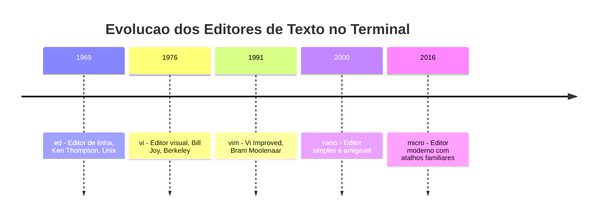
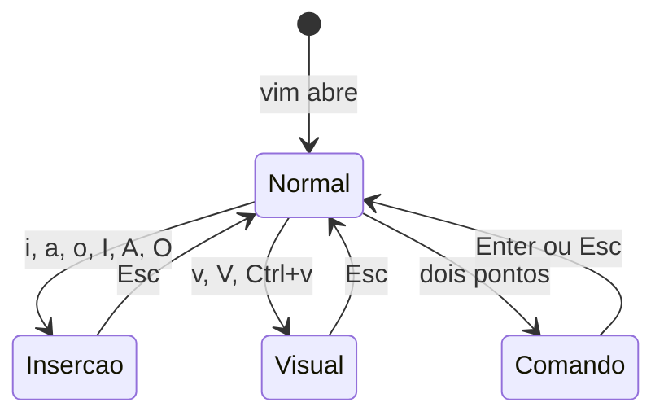

# 3.5 — Editores de Texto no Terminal: vim e micro

[← Anterior: Monitoramento de Processos: ps, top e htop](cap03-mod04-processos.md) · [Próximo: Ferramentas de Rede: curl e wget →](cap03-mod06-ferramentas-rede.md)

---

## Introdução

Nos módulos anteriores deste capítulo, aprendemos a navegar pelo sistema de arquivos, manipular arquivos, conectar comandos com pipes e monitorar processos. Em vários momentos, precisamos criar ou modificar arquivos de texto — configurações, scripts, logs. Até agora, usamos `echo` com redirecionamento (`echo "texto" > arquivo.txt`) ou `cat` com heredoc para criar conteúdo. Mas e quando você precisa **editar** um arquivo existente? Mudar uma linha no meio de um arquivo de configuração? Corrigir um erro em um script? Adicionar uma função no meio de um código?

Para isso, você precisa de um **editor de texto**.

"Mas eu já conheço editores de texto — o Bloco de Notas do Windows, o TextEdit do macOS..." Sim, esses são editores gráficos. Eles funcionam com mouse, menus e janelas. Mas existem situações onde você **não tem** interface gráfica:

- Quando acessa um servidor remoto via SSH (a maioria dos servidores não tem interface gráfica)
- Quando está em um contêiner Docker (ambiente mínimo, sem desktop)
- Quando o sistema gráfico travou e você precisa corrigir algo pelo terminal de emergência
- Quando quer editar rapidamente sem sair do terminal (mais rápido que abrir outro programa)

Nesses cenários, você precisa de um editor que funcione **dentro do terminal** — usando apenas teclado, sem mouse, sem menus visuais. E é exatamente isso que vamos aprender neste módulo.

Lembre-se do mantra: **"Qual problema você quer resolver?"** O problema é: como editar arquivos quando tudo que você tem é um terminal? A solução: editores de texto que rodam no terminal.

Vamos conhecer dois editores: o **vim** (o veterano poderoso que todo desenvolvedor deveria conhecer) e o **micro** (o moderno e amigável que funciona como você espera). E vamos entender por que existem tantos editores diferentes e como essa história se conecta com a evolução da computação.

---

## A História dos Editores no Terminal

Para entender por que editores de terminal são como são — especialmente o vim, que parece tão estranho para iniciantes — precisamos voltar no tempo e entender o contexto em que foram criados.

### O Problema Original: Editar Sem Tela

Nos anos 1960 e 1970, como vimos no módulo 3.1, os terminais eram teletipos — máquinas com teclado e impressora em papel, sem tela. Como você editaria um arquivo de texto em uma máquina que não tem tela?

A resposta foi o **ed** (editor), criado por Ken Thompson em 1969 como parte do Unix original. O `ed` é um **editor de linha** — você não vê o arquivo inteiro, apenas trabalha com uma linha por vez. Você dá comandos como "vá para a linha 5", "mostre a linha atual", "substitua 'antigo' por 'novo' na linha 10".

```bash
# Exemplo de sessao no ed (editor de linha)
ed arquivo.txt
# 125                    <- ed mostra o tamanho do arquivo em bytes
# 3p                     <- "print line 3" - mostra a linha 3
# Esta e a linha tres    <- conteudo da linha 3
# 3s/tres/3/             <- substitui "tres" por "3" na linha 3
# 3p                     <- mostra a linha 3 novamente
# Esta e a linha 3       <- agora com "3" em vez de "tres"
# w                      <- "write" - salva o arquivo
# q                      <- "quit" - sai do editor
```

Parece primitivo? Era. Mas funcionava em teletipos que não tinham tela. Você não podia "ver" o arquivo — só podia pedir para o editor mostrar linhas específicas, uma por vez, impressas no papel.

### A Evolução: Terminais com Tela

Quando os terminais de vídeo apareceram nos anos 1970 (como o VT100 que vimos no módulo 3.1), surgiu uma possibilidade nova: mostrar o arquivo inteiro na tela e permitir que o usuário movesse um cursor pelo texto. Nasceram os **editores visuais** (ou editores de tela cheia).

### vi: O Editor Visual do Unix (1976)

Bill Joy, um estudante de pós-graduação na Universidade da Califórnia em Berkeley, criou o **vi** (visual editor) em 1976. O vi foi revolucionário: pela primeira vez, você podia ver o arquivo inteiro na tela e mover o cursor livremente pelo texto.

Mas havia um problema técnico: os terminais da época eram **lentos**. A conexão entre o terminal e o computador era de 300 a 9600 baud (bits por segundo) — para comparação, uma conexão Wi-Fi moderna é milhões de vezes mais rápida. Cada caractere enviado para a tela custava tempo. Se o editor precisasse redesenhar a tela inteira a cada tecla pressionada, seria inutilizável.

Bill Joy projetou o vi para ser extremamente eficiente em comunicação com o terminal. Cada comando foi pensado para minimizar o número de teclas pressionadas e a quantidade de tela que precisa ser redesenhada. É por isso que:

- As teclas `h`, `j`, `k`, `l` movem o cursor (estão na fileira principal do teclado, sem precisar mover as mãos)
- Comandos são combinações curtas de teclas, não menus
- O editor tem **modos** — em vez de usar Ctrl+algo para cada ação, você muda de modo

Essas decisões de design, que parecem estranhas hoje, eram otimizações brilhantes para o hardware da época. E muitas delas continuam sendo eficientes — é por isso que desenvolvedores experientes são tão rápidos no vim.

### vim: vi Melhorado (1991)

Em 1991, Bram Moolenaar criou o **vim** (Vi IMproved — Vi Melhorado). O vim manteve toda a filosofia e os comandos do vi, mas adicionou centenas de funcionalidades: syntax highlighting (coloração de código), múltiplas janelas, desfazer ilimitado, plugins, busca com expressões regulares avançadas e muito mais.

O vim se tornou o editor de terminal mais popular do mundo. Está instalado em praticamente todo sistema Unix e Linux. Quando você acessa um servidor remoto, o vim (ou pelo menos o vi) está lá.

### nano, micro e a Nova Geração

Nem todo mundo quer aprender os modos e comandos do vim. Por isso surgiram editores mais simples:

- **nano** (2000): editor simples que mostra os atalhos na tela. Veio substituir o `pstrReplace` e é o editor padrão em muitas distribuições. Funciona de forma intuitiva — você abre, digita, salva com Ctrl+O e sai com Ctrl+X.

- **micro** (2016): editor moderno que combina a simplicidade do nano com funcionalidades avançadas. Suporta mouse, syntax highlighting, múltiplos cursores, plugins e atalhos familiares (Ctrl+S para salvar, Ctrl+Q para sair, Ctrl+C/V para copiar/colar).



### Qual Escolher?

| Editor | Curva de aprendizado | Poder | Disponibilidade | Quando usar |
|--------|---------------------|-------|-----------------|-------------|
| vim | Alta, leva dias para o básico | Muito alto | Em todo Linux e Unix | Servidores, edicao pesada, produtividade máxima |
| nano | Baixa, intuitivo | Básico | Na maioria das distribuicoes | Edicoes rapidas e simples |
| micro | Baixa, familiar | Alto | Precisa instalar | Uso diario no terminal, substituto moderno do nano |

A recomendação para quem está começando:
1. **Aprenda o básico do vim** — abrir, editar, salvar, sair. Você vai precisar disso em servidores onde só o vim está disponível.
2. **Use o micro no dia a dia** — é mais produtivo para iniciantes e tem atalhos que você já conhece.
3. **Com o tempo, aprofunde no vim se quiser** — muitos desenvolvedores experientes juram que é o editor mais produtivo que existe, mas leva meses para dominar.

---

## nano: O Editor Simples

Antes de entrar no vim e no micro, vamos conhecer rapidamente o **nano**, que é o editor mais simples e está disponível na maioria das distribuições Linux. Ele é útil para edições rápidas quando você não quer pensar em modos ou atalhos complexos.

### Abrindo e Usando o nano

```bash
# Abrir um arquivo existente
nano arquivo.txt

# Criar um novo arquivo
nano novo-arquivo.txt

# Abrir na linha 15
nano +15 arquivo.txt
```

Quando o nano abre, você vê o conteúdo do arquivo e uma barra na parte inferior com os atalhos disponíveis:

```
  GNU nano 6.2          arquivo.txt

Aqui esta o conteudo do arquivo.
Voce pode digitar normalmente.
O cursor pisca onde voce esta.

                        [ Read 3 lines ]
^G Help    ^O Write Out  ^W Where Is   ^K Cut
^X Exit    ^R Read File  ^\ Replace    ^U Paste
```

O `^` significa Ctrl. Então `^O` é Ctrl+O, `^X` é Ctrl+X.

### Atalhos Essenciais do nano

| Atalho | O que faz |
|--------|-----------|
| Ctrl+O | Salvar o arquivo (Write Out) |
| Ctrl+X | Sair do nano |
| Ctrl+K | Cortar a linha atual |
| Ctrl+U | Colar a linha cortada |
| Ctrl+W | Buscar texto |
| Ctrl+\ | Buscar e substituir |
| Ctrl+G | Mostrar ajuda |
| Ctrl+_ | Ir para uma linha específica |
| Alt+U | Desfazer |
| Alt+E | Refazer |

O nano é direto ao ponto: você abre, digita, salva e sai. Não tem modos, não tem comandos complexos. Para edições rápidas em arquivos de configuração, é perfeito.

---

## vim: O Editor Poderoso

O vim é o editor de terminal mais famoso e mais poderoso. Também é o que mais assusta iniciantes. A piada mais conhecida da programação é: "Como sair do vim?" — porque muita gente abre o vim acidentalmente e não consegue sair.

Vamos desmistificar o vim. Ele não é difícil — é **diferente**. Uma vez que você entende a lógica por trás do design, tudo faz sentido.

### O Conceito de Modos

A característica mais importante (e mais confusa para iniciantes) do vim é que ele tem **modos**. Em um editor normal, quando você pressiona uma tecla, ela aparece na tela. No vim, o que acontece quando você pressiona uma tecla depende de **em qual modo você está**.

O vim tem quatro modos principais:

| Modo | Nome | O que faz | Como entrar | Como sair |
|------|------|-----------|-------------|-----------|
| Normal | Normal mode | Navegar e executar comandos | Esc | - |
| Inserir | Insert mode | Digitar texto | i, a, o | Esc |
| Visual | Visual mode | Selecionar texto | v, V, Ctrl+v | Esc |
| Comando | Command mode | Executar comandos do editor | : | Enter ou Esc |

Quando você abre o vim, ele começa no **modo Normal**. Nesse modo, as teclas não digitam texto — elas executam comandos. A tecla `j` move o cursor para baixo, `k` move para cima, `dd` apaga uma linha, `yy` copia uma linha.

Para digitar texto, você precisa entrar no **modo de Inserção** pressionando `i`. Agora as teclas funcionam como em qualquer editor — o que você digita aparece na tela. Para voltar ao modo Normal, pressione `Esc`.



### Por que Modos?

A razão é eficiência. Em um editor sem modos, para mover o cursor você precisa usar as setas (longe da posição natural das mãos) ou segurar Ctrl/Alt junto com outras teclas. No vim, como o modo Normal é dedicado a navegação e comandos, cada tecla individual pode ser um comando. Isso significa:

- `j` = mover para baixo (uma tecla, sem modificador)
- `5j` = mover 5 linhas para baixo
- `dd` = apagar linha (duas teclas rápidas)
- `3dd` = apagar 3 linhas
- `ciw` = apagar a palavra atual e entrar em modo de inserção (change inner word)

Desenvolvedores experientes no vim editam texto com uma velocidade impressionante porque nunca precisam tirar as mãos da posição de digitação. Mas isso leva tempo para aprender — e é perfeitamente normal se sentir desajeitado no início.

### Abrindo o vim

```bash
# Abrir um arquivo existente
vim arquivo.txt

# Criar um novo arquivo
vim novo-arquivo.txt

# Abrir na linha 25
vim +25 arquivo.txt

# Abrir em modo somente leitura
vim -R arquivo.txt

# Abrir varios arquivos
vim arquivo1.txt arquivo2.txt
```

### Sobrevivência Básica: Abrir, Editar, Salvar, Sair

Este é o mínimo que você precisa saber. Decore estes passos:

```
1. Abrir:     vim arquivo.txt
2. Editar:    Pressione i (entra no modo de insercao)
              Digite o texto normalmente
3. Parar:     Pressione Esc (volta ao modo normal)
4. Salvar:    Digite :w e pressione Enter
5. Sair:      Digite :q e pressione Enter
6. Salvar e sair: Digite :wq e pressione Enter
7. Sair sem salvar: Digite :q! e pressione Enter
```

O `:` (dois pontos) entra no modo de Comando — você verá os dois pontos aparecerem no canto inferior esquerdo da tela. Depois de digitar o comando e pressionar Enter, o vim volta ao modo Normal.

| Comando | O que faz | Quando usar |
|---------|-----------|-------------|
| `:w` | Salvar (write) | Salvar sem sair |
| `:q` | Sair (quit) | Sair quando não ha alteracoes |
| `:wq` | Salvar e sair | Terminou de editar |
| `:q!` | Sair sem salvar (forcar) | Quer descartar alteracoes |
| `:wq!` | Salvar e sair (forcar) | Arquivo somente leitura que quer sobrescrever |
| `ZZ` | Salvar e sair (atalho) | Mesmo que :wq, mais rápido |

### Navegação no Modo Normal

No modo Normal, estas teclas movem o cursor:

| Tecla | Movimento | Equivalente |
|-------|-----------|-------------|
| h | Um caractere para a esquerda | Seta esquerda |
| j | Uma linha para baixo | Seta para baixo |
| k | Uma linha para cima | Seta para cima |
| l | Um caractere para a direita | Seta direita |
| w | Inicio da próxima palavra | - |
| b | Inicio da palavra anterior | - |
| e | Final da palavra atual | - |
| 0 | Inicio da linha | Home |
| $ | Final da linha | End |
| gg | Inicio do arquivo | Ctrl+Home |
| G | Final do arquivo | Ctrl+End |
| 5G | Ir para a linha 5 | - |
| Ctrl+d | Meia página para baixo | Page Down parcial |
| Ctrl+u | Meia página para cima | Page Up parcial |
| Ctrl+f | Página inteira para baixo | Page Down |
| Ctrl+b | Página inteira para cima | Page Up |
| % | Ir para o parentese ou chave correspondente | - |

As teclas `h`, `j`, `k`, `l` estão na fileira principal do teclado, exatamente onde seus dedos descansam na posição de digitação. Bill Joy escolheu essas teclas porque no teclado do terminal ADM-3A que ele usava, essas teclas tinham setas impressas nelas. A convenção pegou e permanece até hoje.

As setas do teclado também funcionam no vim moderno, mas desenvolvedores experientes preferem `hjkl` porque não precisam mover as mãos.

### Entrando no Modo de Inserção

Existem várias formas de entrar no modo de inserção, cada uma posicionando o cursor em um lugar diferente:

| Tecla | Onde insere | Descrição |
|-------|-------------|-----------|
| i | Antes do cursor | Insert - a mais comum |
| a | Depois do cursor | Append - adicionar apos |
| I | Inicio da linha | Insert no comeco |
| A | Final da linha | Append no final |
| o | Nova linha abaixo | Open line below |
| O | Nova linha acima | Open line above |
| s | Substitui o caractere atual | Substitute |
| S | Substitui a linha inteira | Substitute line |

Na prática, `i` (inserir antes do cursor) e `a` (inserir depois do cursor) são os mais usados. O `o` (abrir nova linha abaixo) também é muito útil — é mais rápido que ir ao final da linha, pressionar Enter e começar a digitar.

### Editando no Modo Normal

No modo Normal, você pode editar sem entrar no modo de inserção:

| Comando | O que faz | Exemplo |
|---------|-----------|---------|
| x | Apaga o caractere sob o cursor | Apagar uma letra |
| dd | Apaga a linha inteira | Apagar linha atual |
| 3dd | Apaga 3 linhas | Apagar várias linhas |
| dw | Apaga ate o inicio da próxima palavra | Apagar uma palavra |
| d$ | Apaga do cursor ate o final da linha | Apagar resto da linha |
| d0 | Apaga do cursor ate o inicio da linha | Apagar inicio da linha |
| yy | Copia a linha inteira (yank) | Copiar linha |
| 3yy | Copia 3 linhas | Copiar várias linhas |
| yw | Copia uma palavra | Copiar palavra |
| p | Cola depois do cursor (put) | Colar |
| P | Cola antes do cursor | Colar antes |
| u | Desfazer (undo) | Desfazer última ação |
| Ctrl+r | Refazer (redo) | Refazer ação desfeita |
| . | Repetir último comando | Repetir |
| r | Substituir um caractere | Trocar uma letra |
| ~ | Alternar maiuscula e minuscula | Trocar case |
| J | Juntar linha atual com a próxima | Unir linhas |

A lógica dos comandos de edição segue um padrão: **operador + movimento**. O operador diz O QUE fazer, e o movimento diz ONDE fazer:

- `d` = delete (apagar)
- `y` = yank (copiar)
- `c` = change (apagar e entrar em modo de inserção)

Combinando com movimentos:
- `dw` = delete word (apagar palavra)
- `d$` = delete até o final da linha
- `d3j` = delete 3 linhas para baixo
- `yw` = yank word (copiar palavra)
- `y$` = yank até o final da linha
- `cw` = change word (apagar palavra e inserir)
- `c$` = change até o final da linha

Quando o operador é repetido (`dd`, `yy`, `cc`), ele age na linha inteira. Essa consistência é o que torna o vim poderoso — uma vez que você aprende o padrão, pode combinar operadores e movimentos de formas que nunca viu antes.

### Busca e Substituição

```bash
# No modo Normal:

# Buscar texto para frente
/texto_buscado
# Pressione Enter, depois:
# n = proxima ocorrencia
# N = ocorrencia anterior

# Buscar texto para tras
?texto_buscado

# Substituir na linha atual (primeira ocorrencia)
:s/antigo/novo/

# Substituir na linha atual (todas as ocorrencias)
:s/antigo/novo/g

# Substituir em todo o arquivo
:%s/antigo/novo/g

# Substituir com confirmacao (pergunta cada uma)
:%s/antigo/novo/gc

# Substituir ignorando maiusculas/minusculas
:%s/antigo/novo/gi
```

O comando de substituição segue o formato `:s/padrão/substituição/flags`. O `%` antes do `s` significa "em todas as linhas". O `g` no final significa "todas as ocorrências na linha" (sem ele, só substitui a primeira). O `c` pede confirmação.

### Modo Visual: Selecionando Texto

O modo Visual permite selecionar texto visualmente (como arrastar o mouse em um editor gráfico):

| Tecla | Tipo de seleção |
|-------|----------------|
| v | Seleção por caractere |
| V | Seleção por linha inteira |
| Ctrl+v | Seleção em bloco retangular |

Depois de selecionar:
- `d` = apagar seleção
- `y` = copiar seleção
- `c` = apagar e entrar em modo de inserção
- `>` = indentar seleção
- `<` = desindentar seleção
- `:` = executar comando na seleção

A seleção em bloco (`Ctrl+v`) é uma funcionalidade que poucos editores têm — permite selecionar uma coluna retangular de texto, útil para editar dados tabulares ou adicionar texto no início de várias linhas ao mesmo tempo.

### Configuração Básica do vim

O vim pode ser configurado através do arquivo `~/.vimrc`. Algumas configurações essenciais para iniciantes:

```bash
# Criar ou editar o arquivo de configuracao do vim
vim ~/.vimrc
```

Configurações recomendadas:

```vim
" Mostrar numeros de linha
set number

" Mostrar numeros de linha relativos (util para comandos como 5dd)
set relativenumber

" Syntax highlighting (coloracao de codigo)
syntax on

" Busca incremental (mostra resultados enquanto digita)
set incsearch

" Destacar resultados da busca
set hlsearch

" Ignorar maiusculas na busca (a menos que use maiuscula)
set ignorecase
set smartcase

" Indentacao automatica
set autoindent
set smartindent

" Usar espacos em vez de tabulacao
set expandtab
set tabstop=4
set shiftwidth=4

" Mostrar linha e coluna do cursor
set ruler

" Mostrar comandos parciais no canto inferior
set showcmd

" Permitir uso do mouse
set mouse=a

" Esquema de cores
colorscheme desert
```

---

## micro: O Editor Moderno

Se o vim é o veterano poderoso, o **micro** é o novato amigável. Criado em 2016 por Zachary Yedidia, o micro foi projetado para ser um editor de terminal que funciona como você espera — com atalhos familiares, suporte a mouse e sem modos confusos.

### Instalando o micro

O micro não vem instalado por padrão, mas a instalação é simples:

```bash
# Ubuntu/Debian
sudo apt install micro

# Fedora
sudo dnf install micro

# Ou instalacao universal (funciona em qualquer Linux)
curl https://getmic.ro | bash
# Move o binario para um diretorio no PATH
sudo mv micro /usr/local/bin/
```

### Usando o micro

```bash
# Abrir um arquivo
micro arquivo.txt

# Criar um novo arquivo
micro novo-arquivo.txt

# Abrir na linha 25
micro +25 arquivo.txt
```

Quando o micro abre, ele funciona exatamente como você espera:
- Digite texto normalmente
- Use as setas para mover o cursor
- Use o mouse para clicar e selecionar
- Ctrl+S para salvar
- Ctrl+Q para sair
- Ctrl+C para copiar, Ctrl+V para colar
- Ctrl+Z para desfazer

Sem modos, sem surpresas. Se você já usou qualquer editor de texto gráfico, sabe usar o micro.

### Atalhos do micro

| Atalho | O que faz |
|--------|-----------|
| Ctrl+S | Salvar |
| Ctrl+Q | Sair |
| Ctrl+Z | Desfazer |
| Ctrl+Y | Refazer |
| Ctrl+C | Copiar seleção |
| Ctrl+X | Recortar seleção |
| Ctrl+V | Colar |
| Ctrl+A | Selecionar tudo |
| Ctrl+F | Buscar |
| Ctrl+H | Buscar e substituir |
| Ctrl+G | Ir para linha |
| Ctrl+D | Duplicar linha |
| Ctrl+K | Cortar linha |
| Ctrl+E | Abrir linha de comando do micro |
| Ctrl+W | Próximo split (janela dividida) |
| Alt+G | Mostrar ou ocultar números de linha |
| Tab | Indentar seleção |
| Shift+Tab | Desindentar seleção |
| Ctrl+Seta | Mover por palavras |
| Shift+Seta | Selecionar texto |

Esses atalhos são os mesmos que você usa no VSCode, no Bloco de Notas, no Google Docs — são universais. Não há curva de aprendizado.

### Funcionalidades Avançadas do micro

Apesar de simples, o micro tem funcionalidades poderosas:

**Syntax highlighting**: o micro reconhece automaticamente a linguagem do arquivo pela extensão e aplica coloração de código. Python, JavaScript, Go, C, Markdown e dezenas de outras linguagens são suportadas.

**Múltiplos cursores**: segure Ctrl e clique em vários pontos para criar múltiplos cursores. Tudo que você digitar aparece em todos os cursores ao mesmo tempo. Útil para editar várias linhas simultaneamente.

**Divisão de tela (splits)**: você pode dividir a tela para ver dois arquivos ao mesmo tempo:

```bash
# Dentro do micro, pressione Ctrl+E e digite:
hsplit arquivo2.txt    # Dividir horizontalmente
vsplit arquivo2.txt    # Dividir verticalmente

# Ctrl+W alterna entre as janelas
```

**Linha de comando interna**: Ctrl+E abre uma linha de comando onde você pode executar comandos do micro:

```
# Dentro do micro (Ctrl+E):
set colorscheme monokai    # Mudar esquema de cores
set tabsize 2              # Mudar tamanho da tabulacao
set autoindent on          # Ativar indentacao automatica
set ruler on               # Mostrar posicao do cursor
```

**Plugins**: o micro suporta plugins escritos em Lua. Alguns úteis:

```bash
# Dentro do micro (Ctrl+E):
plugin install filemanager    # Navegador de arquivos lateral
plugin install comment        # Comentar/descomentar linhas
plugin install fzf            # Busca fuzzy de arquivos
```

### Configuração do micro

O micro armazena configurações em `~/.config/micro/settings.json`:

```json
{
    "autoindent": true,
    "colorscheme": "monokai",
    "tabsize": 4,
    "tabstospaces": true,
    "ruler": true,
    "savecursor": true,
    "scrollbar": true,
    "syntax": true
}
```

---

## Comparação Detalhada: vim vs micro vs nano

| Caracteristica | vim | micro | nano |
|---------------|-----|-------|------|
| Instalado por padrão | Sim, quase sempre | Não | Sim, na maioria |
| Curva de aprendizado | Alta | Baixa | Baixa |
| Modos de edicao | Sim, 4 modos | Não | Não |
| Atalhos familiares | Não, proprios | Sim, Ctrl+S, C, V | Parcialmente |
| Suporte a mouse | Com configuração | Nativo | Limitado |
| Syntax highlighting | Sim, extenso | Sim, bom | Sim, básico |
| Plugins | Milhares | Dezenas | Não |
| Multiplos cursores | Com plugin | Nativo | Não |
| Divisao de tela | Nativo | Nativo | Não |
| Busca e substituição | Poderosa, com regex | Boa | Básica |
| Macro e automacao | Sim, poderoso | Limitado | Não |
| Velocidade de edicao | Muito alta com prática | Boa | Básica |
| Uso em servidores | Garantido | Precisa instalar | Quase garantido |
| Comunidade | Enorme | Crescente | Moderada |

---

## Editores de Terminal vs Editores Gráficos

Neste ponto, você pode estar pensando: "Por que usar um editor no terminal se existem editores gráficos como o VSCode?" É uma pergunta justa. A resposta é: **não é um ou outro — são ferramentas complementares**.

### Quando Usar um Editor de Terminal

- **Servidores remotos via SSH**: a maioria dos servidores não tem interface gráfica. Quando você conecta via SSH para corrigir uma configuração ou investigar um problema, o editor de terminal é sua única opção.
- **Edições rápidas**: abrir o VSCode para mudar uma linha em um arquivo de configuração é como usar um caminhão para ir à padaria. `vim arquivo.conf`, mudar a linha, `:wq` — pronto em 5 segundos.
- **Dentro de contêineres Docker**: contêineres são ambientes mínimos. Geralmente só têm `vi` disponível.
- **Quando o sistema gráfico não funciona**: se o desktop travou, o terminal de emergência (Ctrl+Alt+F1) é tudo que você tem.
- **Em scripts e automação**: o `sed` e o `vim` podem ser usados em scripts para editar arquivos automaticamente.

### Quando Usar um Editor Gráfico

- **Desenvolvimento diário**: para escrever código por horas, um editor gráfico como VSCode com extensões, debugging integrado e terminal embutido é mais produtivo para a maioria das pessoas.
- **Projetos grandes**: navegar entre dezenas de arquivos, ver a estrutura do projeto e usar ferramentas visuais de debugging é mais fácil em um editor gráfico.
- **Trabalho colaborativo**: extensões de pair programming, integração com Git visual e ferramentas de revisão de código funcionam melhor em editores gráficos.

### A Combinação Ideal

A maioria dos desenvolvedores profissionais usa ambos:
- **VSCode** (ou outro editor gráfico) como editor principal para desenvolvimento
- **vim** (ou micro) para edições rápidas no terminal e em servidores remotos

No Capítulo 5, quando começarmos a programar em Python, vamos usar o VSCode como editor principal. Mas saber usar vim ou micro no terminal é uma habilidade que vai te salvar muitas vezes ao longo da carreira.

---

## Dicas Práticas para o Dia a Dia

### Definindo seu Editor Padrão

Muitos comandos do Linux abrem um editor automaticamente (como `git commit`, `crontab -e`, `visudo`). Você pode definir qual editor será usado:

```bash
# Definir o micro como editor padrao
export EDITOR=micro
export VISUAL=micro

# Ou o vim
export EDITOR=vim
export VISUAL=vim

# Para tornar permanente, adicione ao ~/.bashrc
echo 'export EDITOR=micro' >> ~/.bashrc
echo 'export VISUAL=micro' >> ~/.bashrc
```

### Abrindo Arquivos Rapidamente

```bash
# Abrir o ultimo arquivo editado no vim
vim -

# Abrir todos os arquivos .py no vim (um por aba)
vim -p *.py

# Abrir arquivo na linha onde aparece um texto
vim $(grep -n "def main" app.py | cut -d: -f1) app.py
# Abre app.py na linha onde "def main" aparece

# No micro, abrir com busca
micro arquivo.txt
# Depois Ctrl+F para buscar
```

### Editando Arquivos do Sistema

Arquivos de configuração do sistema (em `/etc/`) pertencem ao root. Para editá-los:

```bash
# Editar com permissao de root
sudo vim /etc/hosts
sudo micro /etc/hosts

# No vim, se esqueceu o sudo:
# Dentro do vim, salvar com permissao de root
:w !sudo tee %
# Isso e um truque classico do vim
```

### vim como Visualizador

O vim pode ser usado apenas para visualizar arquivos, sem risco de editar acidentalmente:

```bash
# Abrir em modo somente leitura
vim -R arquivo.txt
view arquivo.txt

# Navegar com as mesmas teclas de sempre
# j, k para mover, /texto para buscar
# :q para sair
```

---

## O vim no Mundo Real: Por que Desenvolvedores o Amam

Pode parecer estranho que um editor de 1991 (baseado em um de 1976) ainda seja tão popular. Mas há razões concretas:

### Velocidade de Edição

Depois de meses de prática, um desenvolvedor experiente no vim edita texto significativamente mais rápido do que em qualquer outro editor. Isso acontece porque:

- Suas mãos nunca saem da posição de digitação
- Comandos são compostos (operador + movimento), criando uma "linguagem" de edição
- Macros permitem automatizar edições repetitivas
- A busca e substituição com regex é extremamente poderosa

### Ubiquidade

O vim (ou pelo menos o vi) está em todo sistema Unix e Linux do planeta. Servidores, roteadores, sistemas embarcados, contêineres Docker mínimos — se tem um terminal, provavelmente tem vi. Saber vim significa que você pode editar arquivos em qualquer lugar.

### Ergonomia

Pode parecer contraditório, mas o vim é ergonômico. Como você não precisa usar o mouse nem mover as mãos para as setas, a tensão nos pulsos e ombros é menor em sessões longas de edição. Muitos desenvolvedores que sofrem de LER (Lesão por Esforço Repetitivo) migram para o vim por essa razão.

### Extensibilidade

O vim tem um ecossistema enorme de plugins. Você pode transformá-lo em uma IDE completa com autocompletar, debugging, integração com Git, navegador de arquivos, terminal integrado e muito mais. O Neovim (uma versão modernizada do vim) leva isso ainda mais longe.

### A Curva de Aprendizado

A curva de aprendizado do vim é real e íngreme. Mas ela tem uma característica interessante: **nunca para de subir**. Mesmo depois de anos usando vim, você continua descobrindo comandos e técnicas novas que aumentam sua produtividade. É um investimento de longo prazo.


---

## Conexão com a Programação

Editores de texto são a ferramenta mais fundamental de um programador. Todo código que existe no mundo foi escrito em algum editor de texto. Entender editores conecta com vários conceitos importantes:

**Arquivos de texto são a base de tudo**: código-fonte, configurações, scripts, documentação — tudo é texto. Quando você aprende a editar texto eficientemente, está aprendendo a trabalhar com a matéria-prima da programação.

**Modos do vim e estados em programação**: o conceito de "modos" do vim (Normal, Inserção, Visual) é um exemplo prático de **máquina de estados** — um conceito fundamental em ciência da computação que vamos encontrar no Capítulo 5 (condicionais e fluxo de controle) e no Capítulo 8 (padrões de design). O comportamento do programa muda dependendo do estado atual.

**Expressões regulares**: a busca e substituição do vim usa expressões regulares (regex) — padrões de texto que permitem buscas complexas. Regex é uma ferramenta que todo programador usa, em qualquer linguagem. Aprender regex no vim é uma introdução prática a esse conceito.

**Configuração como código**: o `.vimrc` e o `settings.json` do micro são exemplos de configuração declarativa — você descreve o que quer, e o programa se configura. Esse padrão aparece em todo lugar: `package.json` no Node.js, `requirements.txt` no Python, `docker-compose.yml` no Docker.

**Ferramentas de desenvolvimento**: no Capítulo 5, vamos usar o VSCode como editor principal. Mas o VSCode tem uma extensão chamada "Vim" que permite usar os atalhos do vim dentro dele — o melhor dos dois mundos. Muitos desenvolvedores profissionais usam essa combinação.

---

## Como a IA pode te ajudar aqui

**Prompt 1 — Pedir ajuda prática:**
> "Estou no vim e preciso substituir todas as ocorrências de 'usuario' por 'user' em um arquivo Python, mas apenas dentro de funções que começam com 'def get_'. Como faço isso?"

**Prompt 2 — Explorar o conceito:**
> "Quero configurar o vim para desenvolvimento em Python: syntax highlighting, indentação de 4 espaços, mostrar números de linha e autocompletar básico. Me dê um .vimrc completo e explique cada linha."

**Prompt 3 — Aprofundar o tema:**
> "Qual editor de terminal devo usar? Sou iniciante, vou trabalhar com Python e às vezes preciso editar arquivos em servidores remotos. Me ajude a decidir entre vim, micro e nano."

---

## Resumo do Módulo

| Conceito | Definição |
|----------|-----------|
| Editor de linha | Editor que trabalha com uma linha por vez, sem ver o arquivo inteiro |
| Editor visual | Editor que mostra o arquivo inteiro na tela com cursor móvel |
| Modo Normal | Modo do vim para navegação e comandos, teclas executam ações |
| Modo de Inserção | Modo do vim para digitar texto, teclas inserem caracteres |
| Modo Visual | Modo do vim para selecionar texto visualmente |
| Modo de Comando | Modo do vim para executar comandos com dois pontos |
| Operador + movimento | Padrão do vim: o que fazer + onde fazer |
| Syntax highlighting | Coloracao de código baseada na linguagem de programação |
| .vimrc | Arquivo de configuração do vim no diretório home do usuario |
| Plugin | Extensão que adiciona funcionalidades a um editor |
| Macro | Sequência de comandos gravada para ser repetida automaticamente |
| Regex | Expressao regular, padrão de texto para buscas avancadas |
| Split | Divisao da tela do editor para ver multiplos arquivos |

---

## Glossário do Módulo

| Termo | Definição |
|-------|-----------|
| ADM-3A | Terminal fabricado pela Lear Siegler nos anos 1970, usado por Bill Joy para criar o vi |
| Baud | Unidade de velocidade de transmissao de dados em terminais antigos |
| Bill Joy | Criador do vi em 1976, cofundador da Sun Microsystems |
| Bram Moolenaar | Criador do vim em 1991 |
| Buffer | No vim, representacao de um arquivo aberto na memória |
| Colorscheme | Esquema de cores usado pelo editor para exibir texto e código |
| Command mode | Modo de comando do vim, ativado com dois pontos |
| ed | Editor de linha criado por Ken Thompson em 1969 para o Unix |
| Insert mode | Modo de inserção do vim, onde teclas digitam texto |
| Ken Thompson | Criador do Unix e do editor ed |
| LER | Lesao por Esforco Repetitivo, problema de saude causado por movimentos repetitivos |
| Lua | Linguagem de programação usada para plugins do micro |
| Macro | Sequência de teclas gravada no vim para automacao de edicoes repetitivas |
| micro | Editor de terminal moderno criado em 2016 com atalhos familiares |
| nano | Editor de terminal simples que mostra atalhos na tela |
| Neovim | Versão modernizada do vim com melhor suporte a plugins e extensibilidade |
| Normal mode | Modo normal do vim, onde teclas executam comandos de navegação e edicao |
| Plugin | Extensão de software que adiciona funcionalidades ao editor |
| Regex | Regular Expression, expressao regular, padrão para buscas de texto |
| Split | Divisao da janela do editor para visualizar multiplos arquivos |
| Syntax highlighting | Coloracao automática de código baseada na linguagem de programação |
| vi | Visual editor, criado por Bill Joy em 1976 para o Unix BSD |
| vim | Vi Improved, versão melhorada do vi criada por Bram Moolenaar em 1991 |
| .vimrc | Arquivo de configuração pessoal do vim, localizado em ~/.vimrc |
| Visual mode | Modo visual do vim para seleção de texto |
| VT100 | Terminal de video fabricado pela DEC em 1978, que se tornou padrão |
| Yank | Termo do vim para copiar texto, equivalente a copy |

---

## Na Cultura Popular

- **Mr. Robot** (série, 2015-2019) — em vários episódios, o protagonista usa o nano e o vim para editar scripts e arquivos de configuração diretamente no terminal. A série mostra de forma realista como profissionais de tecnologia alternam entre editores de terminal e ferramentas gráficas dependendo do contexto.

- **Silicon Valley** (série, 2014-2019) — em um episódio memorável, os personagens debatem acaloradamente sobre qual editor de texto é melhor — uma referência à famosa "guerra dos editores" (vim vs Emacs) que existe na comunidade de programadores desde os anos 1980. A cena é cômica mas reflete uma discussão real que desenvolvedores têm há décadas.

- **Halt and Catch Fire** (série, 2014-2017) — mostra engenheiros nos anos 1980 usando editores de texto primitivos em terminais para escrever código. As cenas de programação são historicamente precisas e mostram como era editar código antes dos editores gráficos modernos.

---

## Para Saber Mais

- *Vim Adventures* — https://vim-adventures.com — *jogo online que ensina os comandos do vim de forma divertida, jogando um RPG*
- *OpenVim* — https://www.openvim.com — *tutorial interativo de vim no navegador, excelente para praticar sem instalar nada*
- *micro editor — site oficial* — https://micro-editor.github.io — *documentação completa do micro, incluindo plugins e configuração*
- *Repositório do Fino — learn-ops-content* — https://github.com/RafaelFino/learn-ops-content — *material complementar sobre ferramentas de terminal*
- *Vim Cheat Sheet* — https://vim.rtorr.com — *folha de referência visual com todos os comandos do vim organizados por categoria*

---

## Perguntas Frequentes (FAQ)

**P: Como saio do vim?**
R: Pressione `Esc` (para garantir que está no modo Normal), depois digite `:q` e pressione Enter. Se fez alterações e quer salvar, use `:wq`. Se quer sair sem salvar, use `:q!`. Essa é a pergunta mais feita sobre vim na internet — você não está sozinho.

**P: Preciso aprender vim ou posso usar só o micro/nano?**
R: Para o dia a dia, micro ou nano são suficientes. Mas recomendamos aprender pelo menos o básico do vim (abrir, editar, salvar, sair) porque ele está disponível em praticamente todo servidor Linux. Quando você acessar um servidor remoto que só tem vi/vim, vai agradecer por saber o mínimo.

**P: O vim é realmente mais rápido que outros editores?**
R: Para um iniciante, não — é mais lento porque você está aprendendo. Para um usuário experiente (meses de prática), sim — significativamente mais rápido para edição de texto. A diferença vem de não precisar usar o mouse, dos comandos compostos (operador + movimento) e das macros. Mas "mais rápido" não significa "melhor para todos" — produtividade depende de muitos fatores.

**P: O que é a "guerra dos editores" (vim vs Emacs)?**
R: É uma rivalidade bem-humorada entre usuários de vim e usuários de Emacs (outro editor poderoso) que existe desde os anos 1980. Cada lado defende que seu editor é superior. Na prática, ambos são excelentes e a escolha é pessoal. Hoje, a maioria dos desenvolvedores usa VSCode e a "guerra" virou mais uma piada da cultura de programação do que uma disputa real.

**P: Posso usar os atalhos do vim no VSCode?**
R: Sim. O VSCode tem uma extensão chamada "Vim" (vscodevim) que emula os modos e comandos do vim dentro do VSCode. Você ganha a navegação eficiente do vim com todas as funcionalidades do VSCode. Muitos desenvolvedores profissionais usam essa combinação.

**P: O que é Neovim e qual a diferença para o vim?**
R: Neovim é um fork (versão derivada) do vim criado em 2014. Ele mantém compatibilidade com o vim mas moderniza o código interno, melhora o suporte a plugins (usando Lua em vez de VimScript) e adiciona funcionalidades como terminal integrado e melhor suporte a LSP (Language Server Protocol). Se você decidir investir no vim, considere começar direto pelo Neovim.

**P: Como configuro o micro para parecer com o VSCode?**
R: O micro já tem atalhos similares ao VSCode por padrão (Ctrl+S, Ctrl+C, Ctrl+V, Ctrl+Z). Para ficar ainda mais parecido, instale o plugin de filemanager (`plugin install filemanager`) para ter um navegador de arquivos lateral, e configure o colorscheme para "monokai" ou "dracula" (`set colorscheme monokai`).

**P: Qual editor devo usar para programar em Python no Capítulo 5?**
R: No Capítulo 5, vamos usar o VSCode como editor principal — ele tem extensões excelentes para Python, debugging integrado e terminal embutido. Mas saber usar vim ou micro no terminal é complementar: para edições rápidas, para servidores remotos e para situações onde o VSCode não está disponível.

**P: O nano é ruim? Por que não focamos nele?**
R: O nano não é ruim — é simples e funcional. Focamos no vim (por ser universal e poderoso) e no micro (por ser moderno e amigável) porque eles cobrem os dois extremos: o vim para quando você precisa de poder máximo ou está em um servidor mínimo, e o micro para uso diário confortável. O nano fica no meio — menos poderoso que o vim, menos amigável que o micro.

**P: Posso usar o mouse no vim?**
R: Sim, adicionando `set mouse=a` no seu `~/.vimrc`. Com essa configuração, você pode clicar para posicionar o cursor, arrastar para selecionar texto e usar a roda do mouse para rolar. Mas a maioria dos usuários de vim prefere não usar o mouse — o objetivo é manter as mãos no teclado.

**P: Como faço para copiar texto do vim para outro programa?**
R: No vim com suporte a clipboard do sistema, use `"+y` para copiar para o clipboard (o `"+` é o registro do clipboard do sistema). Ou selecione texto com o mouse (se `set mouse=a` estiver ativo) e use Ctrl+Shift+C no terminal. No micro, Ctrl+C copia para o clipboard normalmente.

**P: O que são macros no vim e quando usar?**
R: Macros são sequências de teclas gravadas que podem ser repetidas. Você grava com `q` seguido de uma letra (ex: `qa` grava na macro "a"), executa os comandos, e para com `q` novamente. Depois, `@a` executa a macro. Use quando precisa fazer a mesma edição em muitas linhas — por exemplo, adicionar aspas ao redor de cada palavra em 100 linhas.

---

## Exercícios Práticos

### Exercício 1 — Sobrevivência no vim

1. Abra o terminal e crie um arquivo com `vim prática-vim.txt`
2. Pressione `i` para entrar no modo de inserção
3. Digite 5 linhas de texto qualquer (seu nome, cidade, comida favorita, etc.)
4. Pressione `Esc` para voltar ao modo Normal
5. Salve com `:w` e Enter
6. Navegue pelo texto usando `j` (baixo), `k` (cima), `h` (esquerda), `l` (direita)
7. Vá para a primeira linha com `gg` e para a última com `G`
8. Apague uma linha com `dd`
9. Desfaça com `u`
10. Copie uma linha com `yy` e cole com `p`
11. Busque uma palavra com `/palavra` e Enter
12. Salve e saia com `:wq`

### Exercício 2 — Explorando o micro

1. Instale o micro se ainda não tiver: `sudo apt install micro`
2. Abra o mesmo arquivo: `micro prática-vim.txt`
3. Edite o texto normalmente — adicione linhas, apague palavras
4. Use Ctrl+F para buscar uma palavra
5. Use Ctrl+H para buscar e substituir
6. Selecione texto com Shift+Setas e copie com Ctrl+C
7. Cole em outro lugar com Ctrl+V
8. Use Ctrl+G para ir para uma linha específica
9. Salve com Ctrl+S
10. Saia com Ctrl+Q
11. Compare a experiência com o vim — qual foi mais confortável?

### Exercício 3 — Edição Prática

1. Crie um arquivo `config-exemplo.conf` com o seguinte conteúdo (use o editor que preferir):

```
# Configuracao do servidor
host=localhost
porta=8080
debug=true
log_level=info
max_conexoes=100
timeout=30
```

2. Usando o vim OU o micro, faça as seguintes alterações:
   - Mude `porta=8080` para `porta=3000`
   - Mude `debug=true` para `debug=false`
   - Adicione uma nova linha `versão=1.0` no final
   - Apague a linha do `timeout`
   - Salve o arquivo
3. Verifique o resultado com `cat config-exemplo.conf`

---

[← Anterior: Monitoramento de Processos: ps, top e htop](cap03-mod04-processos.md) · [Próximo: Ferramentas de Rede: curl e wget →](cap03-mod06-ferramentas-rede.md)
