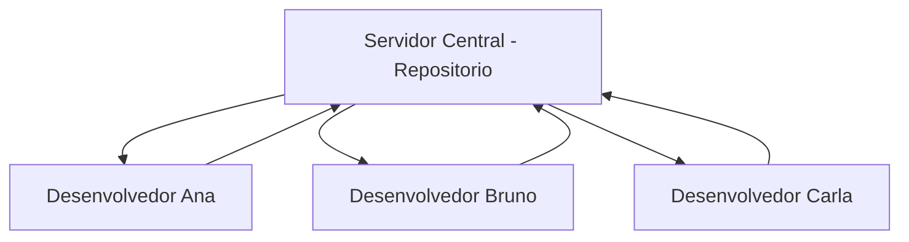
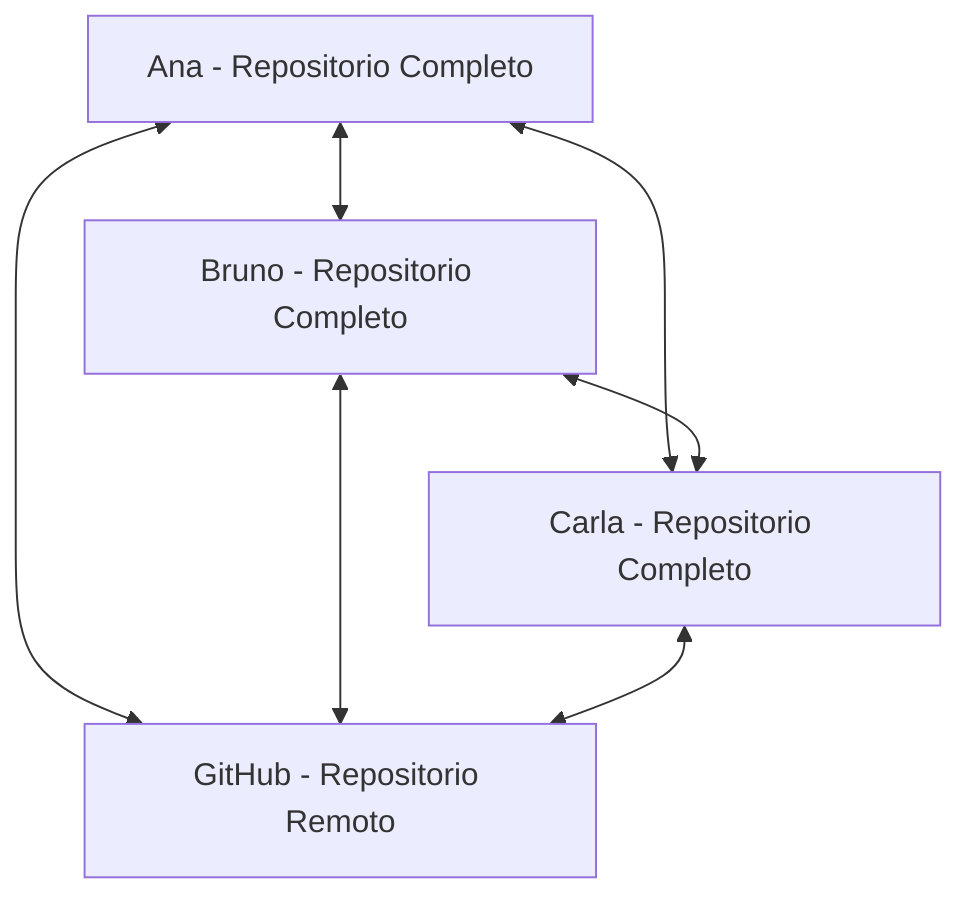
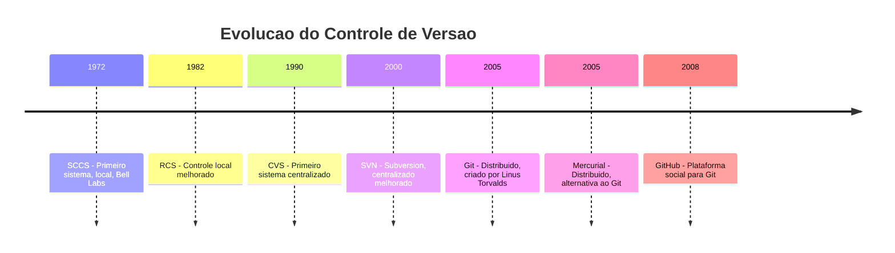
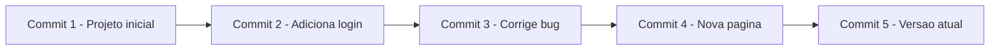
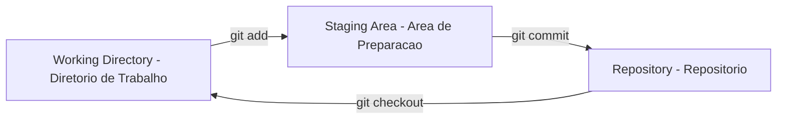
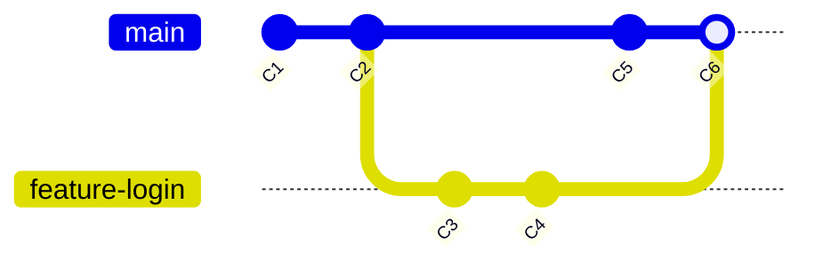
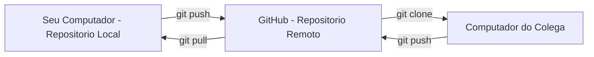

# 4.1 — O que é Controle de Versão e por que Importa

[← Anterior: Ferramentas de Rede: curl e wget](cap03-mod06-ferramentas-rede.md) · [Próximo: Git na Prática: Repositórios e Primeiros Commits →](cap04-mod02-git-basico.md)

---

## Introdução

Nos três capítulos anteriores, construímos uma base sólida: entendemos como computadores funcionam, conhecemos o Linux e dominamos o terminal. Agora vamos aprender uma ferramenta que muda completamente a forma como você trabalha com código — e com qualquer tipo de arquivo de texto.

Imagine a seguinte situação: você está escrevendo um programa. Funciona perfeitamente. Aí você decide melhorar uma parte do código. Mexe aqui, mexe ali, testa... e agora nada funciona. Você quer voltar para a versão que funcionava, mas não lembra exatamente o que mudou. Já apagou, já sobrescreveu. O código que funcionava se foi.

Ou imagine outra situação: você e um colega estão trabalhando no mesmo projeto. Cada um edita arquivos no seu computador. Quando tentam juntar o trabalho, descobrem que os dois mexeram no mesmo arquivo. Quem sobrescreve quem? Como combinar as mudanças sem perder nada?

Esses problemas são tão antigos quanto a programação. E a solução para eles se chama **controle de versão** — um sistema que registra cada mudança feita nos seus arquivos ao longo do tempo, permitindo que você volte a qualquer ponto do passado, compare versões, trabalhe em paralelo com outras pessoas e nunca mais perca trabalho.

Lembre-se do mantra: **"Qual problema você quer resolver?"** O problema é: como gerenciar mudanças em arquivos ao longo do tempo, especialmente quando várias pessoas trabalham juntas? A solução: controle de versão. E a ferramenta mais usada no mundo para isso se chama **Git**.

---

## O Problema: A Vida Sem Controle de Versão

Antes de entender a solução, vamos sentir o problema. Sem controle de versão, desenvolvedores (e qualquer pessoa que trabalha com arquivos) recorrem a estratégias improvisadas que todos já usaram:

### A Pasta de Versões

```
meu-projeto/
├── app.py
├── app-v2.py
├── app-v2-final.py
├── app-v2-final-FINAL.py
├── app-v2-final-FINAL-corrigido.py
├── app-v2-final-FINAL-corrigido-de-verdade.py
├── app-backup-antes-de-mexer.py
└── app-FUNCIONANDO-NAO-MEXER.py
```

Parece familiar? Quase todo mundo já fez isso — criar cópias do arquivo com nomes diferentes para "guardar" versões anteriores. Os problemas são óbvios:

- Qual é a versão mais recente? `final-FINAL` ou `corrigido-de-verdade`?
- O que mudou entre uma versão e outra? Impossível saber sem abrir e comparar manualmente
- Quanto espaço desperdiçado com cópias quase idênticas?
- E se você precisar voltar para uma versão de duas semanas atrás?

### O Email de Código

Outra estratégia comum em equipes sem controle de versão: enviar código por email.

"Oi, segue a versão atualizada do app.py. Pode substituir a sua."

Problemas:
- E se a pessoa já tinha feito mudanças no arquivo dela?
- E se dois emails chegam ao mesmo tempo com versões diferentes?
- Onde fica o histórico? Na caixa de entrada?
- Como saber quem mudou o quê?

### O Pendrive Compartilhado

Equipes que compartilham código via pendrive, pasta de rede ou Dropbox enfrentam o problema clássico de **conflito**: duas pessoas editam o mesmo arquivo ao mesmo tempo, e a última a salvar sobrescreve o trabalho da outra.

Todos esses problemas existem porque falta um sistema que:
1. Registre cada mudança com data, autor e descrição
2. Permita voltar a qualquer versão anterior
3. Permita que várias pessoas trabalhem ao mesmo tempo sem conflitos
4. Mostre exatamente o que mudou entre duas versões

Esse sistema é o controle de versão.

---

## A História do Controle de Versão

O controle de versão não surgiu do nada. Ele evoluiu ao longo de décadas, resolvendo problemas cada vez mais complexos. Entender essa evolução ajuda a entender por que o Git funciona como funciona.

### Primeira Geração: Controle Local (1972-1990)

O primeiro sistema de controle de versão foi o **SCCS** (Source Code Control System), criado em 1972 por Marc Rochkind nos Laboratórios Bell — o mesmo lugar onde o Unix nasceu. Depois veio o **RCS** (Revision Control System) em 1982, criado por Walter Tichy na Universidade de Purdue.

Esses sistemas eram **locais** — funcionavam apenas no computador de uma pessoa. Eles guardavam o histórico de mudanças de cada arquivo individualmente. O RCS, por exemplo, armazenava a versão mais recente do arquivo e uma série de "patches" (diferenças) para reconstruir versões anteriores. Se você quisesse compartilhar com outra pessoa, tinha que copiar os arquivos manualmente — por email, disquete ou pasta de rede.

O problema que resolviam: "Quero poder voltar a versões anteriores dos meus arquivos."

O problema que não resolviam: "Quero trabalhar com outras pessoas no mesmo projeto."

### Segunda Geração: Controle Centralizado (1990-2005)

Para resolver o problema de colaboração, surgiram sistemas **centralizados**: o **CVS** (Concurrent Versions System, 1990) e o **SVN** (Subversion, 2000). O SVN foi criado especificamente para ser "o CVS feito direito" — corrigindo limitações do CVS como a incapacidade de renomear arquivos e a falta de commits atômicos (no CVS, se o commit falhasse no meio, metade dos arquivos ficava atualizada e metade não).

Nesses sistemas, existe um **servidor central** que guarda o repositório (o histórico completo do projeto). Cada desenvolvedor se conecta ao servidor para pegar a versão mais recente e enviar suas mudanças. Isso funcionou bem por mais de uma década — muitas empresas ainda usam SVN hoje.



O problema que resolviam: "Quero que várias pessoas trabalhem no mesmo projeto com um histórico compartilhado."

Os problemas que não resolviam:
- Se o servidor cair, ninguém trabalha
- Cada operação (ver histórico, comparar versões) precisa de conexão com o servidor
- Se o servidor for perdido (disco queimou, sem backup), todo o histórico se perde
- Criar branches (ramificações) é lento e complicado

### Terceira Geração: Controle Distribuído (2005-hoje)

Em 2005, aconteceu um evento que mudou a história do controle de versão. O kernel do Linux (o maior projeto de software livre do mundo, com milhares de contribuidores) usava um sistema proprietário chamado BitKeeper. Quando a licença gratuita do BitKeeper foi revogada, Linus Torvalds — o criador do Linux — decidiu criar seu próprio sistema de controle de versão.

A história é fascinante. O BitKeeper era um sistema distribuído proprietário que oferecia licença gratuita para projetos open source. Andrew Tridgell, um desenvolvedor australiano famoso por criar o Samba (software que permite Linux e Windows compartilharem arquivos), tentou fazer engenharia reversa do protocolo do BitKeeper. Larry McVoy, o criador do BitKeeper, considerou isso uma violação dos termos de uso e revogou a licença gratuita.

Linus Torvalds, que dependia do BitKeeper para gerenciar o kernel do Linux, ficou sem ferramenta. Ele avaliou as alternativas existentes (CVS, SVN, Monotone, Darcs) e nenhuma atendia suas necessidades. Então, em abril de 2005, ele começou a escrever o Git.

Em apenas duas semanas, Linus criou o **Git** e já o usava para gerenciar o kernel do Linux. Seus objetivos eram claros:
- **Velocidade**: operações devem ser rápidas, mesmo em projetos enormes
- **Design distribuído**: cada desenvolvedor tem uma cópia completa do repositório
- **Suporte a desenvolvimento não-linear**: branches devem ser baratos e fáceis
- **Capaz de lidar com projetos grandes**: o kernel do Linux tem milhões de linhas de código

O nome "Git" tem várias interpretações. Em gíria britânica, "git" significa algo como "pessoa desagradável". Linus Torvalds, conhecido pelo seu senso de humor ácido, disse: "Eu sou um bastardo egoísta, e nomeio todos os meus projetos com meu nome. Primeiro Linux, agora Git." A documentação oficial do Git lista várias interpretações possíveis:
- "Global Information Tracker" (Rastreador Global de Informações) — quando funciona
- "Goddamn Idiotic Truckload of sh*t" — quando não funciona
- Ou simplesmente uma combinação aleatória de três letras que não conflita com nenhum comando Unix existente

No Git, não existe um servidor central obrigatório. Cada desenvolvedor tem uma **cópia completa** do repositório, incluindo todo o histórico. Você pode trabalhar offline, fazer commits, ver o histórico, criar branches — tudo sem conexão com nenhum servidor.



Cada pessoa tem o repositório inteiro. O GitHub (ou GitLab, ou Bitbucket) é apenas um ponto de encontro conveniente — não é obrigatório. Se o GitHub sair do ar, cada desenvolvedor ainda tem todo o histórico no seu computador.



| Geração | Tipo | Exemplos | Onde fica o histórico | Precisa de rede |
|---------|------|----------|---------------------|-----------------|
| 1a | Local | SCCS, RCS | No computador do desenvolvedor | Não |
| 2a | Centralizado | CVS, SVN | No servidor central | Sim, para quase tudo |
| 3a | Distribuido | Git, Mercurial | Em cada computador | Não, apenas para sincronizar |

---

## O que é Git

O Git é um **sistema de controle de versão distribuído** criado por Linus Torvalds em 2005. Hoje, é o sistema de controle de versão mais usado no mundo — praticamente todo projeto de software usa Git.

### O que o Git Faz

Em termos simples, o Git:

1. **Registra mudanças**: cada vez que você "salva" uma versão (faz um commit), o Git registra exatamente o que mudou, quem mudou, quando e por quê
2. **Mantém histórico completo**: você pode voltar a qualquer versão anterior do projeto, de qualquer momento no passado
3. **Permite trabalho paralelo**: várias pessoas podem trabalhar no mesmo projeto ao mesmo tempo, em branches separados, e depois juntar o trabalho
4. **Detecta conflitos**: quando duas pessoas mudam a mesma parte do mesmo arquivo, o Git avisa e ajuda a resolver
5. **É distribuído**: cada pessoa tem uma cópia completa do projeto e do histórico

### A Analogia da Máquina do Tempo

A melhor analogia para o Git é uma **máquina do tempo** para os seus arquivos.

Imagine que cada vez que você faz uma mudança significativa no seu projeto, você tira uma "foto" (snapshot) do estado de todos os arquivos. Essa foto é um **commit**. Cada commit tem:
- A foto completa de todos os arquivos naquele momento
- A data e hora
- O nome de quem tirou a foto
- Uma descrição do que mudou ("Corrigiu o bug do login", "Adicionou página de contato")
- Um link para a foto anterior (o commit pai)

Com essas fotos, você pode:
- **Voltar no tempo**: restaurar o projeto para qualquer foto anterior
- **Comparar fotos**: ver exatamente o que mudou entre duas versões
- **Criar linhas do tempo alternativas**: branches são como universos paralelos onde você experimenta mudanças sem afetar a linha principal
- **Juntar linhas do tempo**: merge combina mudanças de branches diferentes



Cada commit aponta para o anterior, formando uma cadeia. Você pode "viajar" para qualquer ponto dessa cadeia.

### O que o Git NÃO é

É importante esclarecer confusões comuns:

- **Git não é GitHub**. O Git é a ferramenta de controle de versão que roda no seu computador. O GitHub é um site que hospeda repositórios Git na nuvem. Existem alternativas ao GitHub (GitLab, Bitbucket, Gitea), mas todas usam Git por baixo. A confusão é compreensível — muita gente conhece o GitHub antes de conhecer o Git. Mas são coisas diferentes: Git é o motor, GitHub é a garagem onde você estaciona.

- **Git não é backup**. Embora o Git guarde histórico, ele não substitui um sistema de backup. Se seu disco queimar e você não tiver o repositório em nenhum outro lugar (como o GitHub), você perde tudo. Git é controle de versão, não backup — embora na prática, ter o código no GitHub funcione como um backup muito bom.

- **Git não é só para código**. O Git funciona com qualquer arquivo de texto: documentação, configurações, scripts, dados em CSV, artigos, livros. Este material que você está lendo foi escrito usando Git para controlar as versões. A única limitação é com arquivos binários (imagens, vídeos, PDFs) — o Git os armazena, mas não consegue mostrar diferenças entre versões.

- **Git não é difícil**. O Git tem muitos comandos e opções, o que pode assustar. Mas no dia a dia, você usa apenas 5-10 comandos. O resto é para situações específicas que aparecem raramente. É como um carro: tem centenas de peças, mas para dirigir você só precisa do volante, pedais e câmbio.

---

## Conceitos Fundamentais do Git

Antes de usar o Git na prática (próximo módulo), vamos entender os conceitos que formam a base de tudo.

### Repositório (Repository)

Um **repositório** (ou "repo") é uma pasta do seu computador que está sendo monitorada pelo Git. Dentro dessa pasta, o Git cria uma subpasta oculta chamada `.git/` onde guarda todo o histórico, configurações e metadados.

```
meu-projeto/           <- pasta normal do projeto
├── .git/              <- pasta oculta do Git (todo o historico esta aqui)
│   ├── objects/       <- os commits, arquivos e arvores
│   ├── refs/          <- as branches e tags
│   ├── HEAD           <- aponta para a branch atual
│   └── config         <- configuracoes do repositorio
├── app.py             <- seus arquivos normais
├── readme.md
└── config.json
```

Tudo que está fora de `.git/` são seus arquivos de trabalho. Tudo que está dentro de `.git/` é o Git gerenciando o histórico. Você nunca precisa mexer dentro de `.git/` manualmente.

### Commit

Um **commit** é um "ponto de salvamento" — uma foto do estado de todos os arquivos rastreados em um determinado momento. Cada commit contém:

- **Hash**: um identificador único de 40 caracteres hexadecimais (ex: `a1b2c3d4e5f6...`). É como o CPF do commit — nenhum outro commit no mundo tem o mesmo hash.
- **Autor**: quem fez o commit (nome e email)
- **Data**: quando o commit foi feito
- **Mensagem**: uma descrição do que mudou
- **Snapshot**: o estado de todos os arquivos
- **Pai(s)**: referência ao(s) commit(s) anterior(es)

```bash
# Exemplo de como um commit aparece no Git
commit a1b2c3d4e5f6789012345678901234567890abcd
Author: Ana Silva <ana@exemplo.com>
Date:   Wed Jan 15 10:30:00 2025 -0300

    feat(login): add password validation

    - Added minimum length check (8 characters)
    - Added special character requirement
    - Added unit tests for validation
```

### As Três Áreas do Git

O Git organiza seus arquivos em três áreas. Entender essas áreas é fundamental para usar o Git corretamente:



1. **Working Directory (Diretório de Trabalho)**: é a pasta do seu projeto como você a vê. Quando você edita um arquivo, a mudança acontece aqui. O Git sabe que o arquivo mudou, mas ainda não registrou a mudança.

2. **Staging Area (Área de Preparação)**: é uma área intermediária onde você prepara o que vai entrar no próximo commit. Quando você executa `git add arquivo.py`, está movendo as mudanças desse arquivo para a staging area. Isso permite que você escolha exatamente quais mudanças incluir no commit — nem sempre você quer commitar tudo de uma vez.

3. **Repository (Repositório)**: é onde o Git guarda o histórico permanente. Quando você executa `git commit`, as mudanças da staging area são registradas permanentemente no repositório.

A analogia: imagine que você está preparando uma encomenda para enviar pelo correio.
- O **Working Directory** é a sua mesa de trabalho — onde os itens estão espalhados
- A **Staging Area** é a caixa aberta — você escolhe quais itens colocar dentro
- O **Repository** é a caixa lacrada e enviada — registrada permanentemente

Essa separação em três áreas pode parecer complicada, mas é muito útil. Ela permite que você:
- Trabalhe em várias coisas ao mesmo tempo e commite apenas parte das mudanças
- Revise o que vai entrar no commit antes de confirmar
- Separe mudanças lógicas em commits diferentes (um commit para o bug fix, outro para a feature nova)

Vamos ver um exemplo concreto. Imagine que você editou três arquivos: `login.py` (corrigiu um bug), `dashboard.py` (adicionou uma funcionalidade nova) e `readme.md` (atualizou a documentação). Em vez de fazer um commit gigante com tudo misturado, você pode:

```bash
# Commit 1: apenas o bug fix
git add login.py
git commit -m "fix(login): correct password validation"

# Commit 2: apenas a feature
git add dashboard.py
git commit -m "feat(dashboard): add user statistics panel"

# Commit 3: apenas a documentacao
git add readme.md
git commit -m "docs: update readme with new features"
```

Três commits limpos, cada um com uma responsabilidade clara. Qualquer pessoa que olhar o histórico vai entender exatamente o que cada commit fez. Se o bug fix causar um problema, você pode reverter apenas ele sem afetar a feature nova ou a documentação.

### Branch (Ramificação)

Uma **branch** (ramificação) é uma linha independente de desenvolvimento. Pense em branches como universos paralelos: você pode criar um universo alternativo, fazer mudanças nele sem afetar o universo principal, e depois decidir se quer juntar os dois.

A branch principal se chama **main** (antigamente chamada "master"). Quando você cria uma nova branch, está criando uma cópia da linha do tempo a partir do ponto atual. As mudanças feitas na nova branch não afetam a main, e vice-versa.



No diagrama acima:
- C1 e C2 são commits na main
- Em C2, criamos a branch `feature-login`
- C3 e C4 são commits na branch feature-login (não afetam a main)
- C5 é um commit na main (não afeta a feature-login)
- C6 é o merge — juntamos as mudanças da feature-login de volta na main

Branches são usadas para:
- **Desenvolver features**: cada funcionalidade nova é desenvolvida em sua própria branch
- **Corrigir bugs**: cria uma branch, corrige, testa, e depois junta na main
- **Experimentar**: quer testar uma ideia maluca? Cria uma branch. Se não funcionar, apaga a branch e nada foi afetado

### Merge (Junção)

O **merge** é o ato de juntar as mudanças de uma branch em outra. Quando a feature está pronta e testada, você faz merge da branch de feature na main.

Na maioria dos casos, o Git consegue fazer o merge automaticamente — ele é inteligente o suficiente para combinar mudanças em arquivos diferentes ou em partes diferentes do mesmo arquivo. Isso é possível porque o Git não guarda apenas "a versão final" de cada arquivo — ele guarda as **diferenças** (diffs) entre versões. Quando faz merge, ele aplica as diferenças de cada branch e verifica se são compatíveis.

Mas quando duas pessoas mudam a **mesma linha** do **mesmo arquivo**, o Git não sabe qual versão manter. Isso é um **conflito**, e o Git pede para você resolver manualmente — escolhendo qual versão manter ou combinando as duas. Conflitos não são um erro — são uma proteção. O Git está dizendo: "Duas pessoas mudaram a mesma coisa e eu não quero decidir por vocês."

Na prática, conflitos são menos comuns do que parece. Em equipes bem organizadas, cada pessoa trabalha em partes diferentes do código, e o Git faz merge automaticamente na grande maioria das vezes. Vamos praticar resolução de conflitos no módulo 4.4.

### Tag (Etiqueta)

Uma **tag** é uma marcação em um commit específico, geralmente usada para marcar versões de lançamento. Enquanto branches se movem (cada novo commit avança a branch), tags são fixas — sempre apontam para o mesmo commit.

```
v1.0.0 ──> Commit abc123 (primeira versao estavel)
v1.1.0 ──> Commit def456 (nova funcionalidade)
v2.0.0 ──> Commit ghi789 (mudanca grande)
```

Tags seguem a convenção de **versionamento semântico** (Semantic Versioning): `vMAJOR.MINOR.PATCH`
- **MAJOR**: mudanças que quebram compatibilidade (v1 → v2)
- **MINOR**: novas funcionalidades compatíveis (v1.0 → v1.1)
- **PATCH**: correções de bugs (v1.0.0 → v1.0.1)

### Diff (Diferença)

O **diff** mostra exatamente o que mudou entre duas versões de um arquivo. Lembra do comando `diff` que vimos no módulo 3.2? O Git usa o mesmo conceito internamente.

```
- linha removida (aparece em vermelho)
+ linha adicionada (aparece em verde)
  linha sem mudanca (aparece normal)
```

Diffs são fundamentais para:
- Revisar suas próprias mudanças antes de commitar
- Revisar mudanças de colegas em pull requests
- Entender o que um commit específico fez
- Encontrar quando e onde um bug foi introduzido

### .gitignore

O arquivo `.gitignore` diz ao Git quais arquivos e pastas **ignorar** — não rastrear. Isso é importante porque nem tudo no seu projeto deve ser versionado:

- **Arquivos gerados**: código compilado, bundles, caches (`__pycache__/`, `node_modules/`, `*.pyc`)
- **Arquivos de configuração local**: configurações específicas do seu computador (`.env`, `.vscode/settings.json`)
- **Arquivos sensíveis**: senhas, chaves de API, certificados (nunca versione senhas!)
- **Arquivos grandes**: vídeos, datasets enormes, binários

```
# Exemplo de .gitignore para Python
__pycache__/
*.pyc
*.pyo
.env
.venv/
*.egg-info/
dist/
build/
.DS_Store
```

Cada linguagem e framework tem seu `.gitignore` típico. O GitHub mantém uma coleção de templates em https://github.com/github/gitignore.

### Remote (Remoto)

Um **remote** é uma cópia do repositório em outro lugar — geralmente em um servidor como GitHub, GitLab ou Bitbucket. O remote mais comum se chama **origin** e é o repositório de onde você clonou o projeto.

Operações com remotes:
- **push**: enviar seus commits locais para o remote
- **pull**: trazer commits do remote para o seu repositório local
- **clone**: criar uma cópia local de um repositório remoto



---

## Por que Git é Importante para Desenvolvedores

O Git não é apenas uma ferramenta — é uma habilidade fundamental que todo desenvolvedor precisa ter. Aqui está por quê:

### Todo Projeto Usa Git

Praticamente 100% dos projetos de software profissionais usam Git. Quando você entrar em uma empresa como desenvolvedor, o primeiro dia vai envolver clonar repositórios Git. Não saber Git é como um motorista não saber usar o câmbio.

Uma pesquisa da Stack Overflow de 2022 mostrou que mais de 93% dos desenvolvedores profissionais usam Git. O segundo colocado (SVN) tinha menos de 5%. Git não é uma opção — é o padrão da indústria.

### Portfólio no GitHub

O GitHub se tornou o "currículo" dos desenvolvedores. Recrutadores olham seu perfil no GitHub para ver:
- Que tipo de projetos você faz
- Com que frequência você programa
- Como você escreve código e mensagens de commit
- Se você contribui para projetos open source

Ter um perfil ativo no GitHub com projetos pessoais é uma das melhores formas de conseguir oportunidades na área. Muitas empresas pedem o link do GitHub na entrevista. Ao longo deste material, cada projeto que você construir vai para o seu GitHub — e quando terminar, você terá um portfólio real.

### Colaboração

Em equipes de desenvolvimento, Git é o que permite que 5, 50 ou 5000 pessoas trabalhem no mesmo projeto sem caos. O kernel do Linux tem mais de 15.000 contribuidores — todos usando Git. O repositório do VS Code no GitHub tem mais de 1.900 contribuidores. O React, do Facebook, tem mais de 1.600.

Sem Git, coordenar esse número de pessoas seria impossível. Com Git, cada pessoa trabalha na sua branch, faz suas mudanças, e o sistema cuida de integrar tudo.

### Segurança

Com Git, você nunca perde trabalho. Cada commit é um ponto de restauração. Se algo der errado, você volta. Se seu computador quebrar, o código está no GitHub. Se o GitHub sair do ar, cada desenvolvedor tem uma cópia completa.

O Git usa hashes SHA-1 para identificar cada commit. Isso significa que é matematicamente impossível alterar o conteúdo de um commit sem mudar seu hash — qualquer tentativa de adulteração é detectada automaticamente. Isso garante a integridade do histórico.

### Rastreabilidade

O Git registra quem mudou o quê, quando e por quê. Isso é essencial para:
- Entender por que uma decisão foi tomada (lendo a mensagem do commit)
- Encontrar quando um bug foi introduzido (usando `git bisect`)
- Saber quem pode explicar uma parte do código (usando `git blame`)
- Auditorias de segurança e conformidade (quem acessou e modificou o quê)

---

## Como o Git Armazena Dados

Entender como o Git funciona internamente não é obrigatório para usá-lo, mas ajuda muito a entender por que certos comandos se comportam de determinada forma. Vamos ver o básico.

### Snapshots, Não Diferenças

A maioria dos sistemas de controle de versão (CVS, SVN) armazena dados como uma lista de **diferenças** (deltas) entre versões. O Git faz diferente: ele armazena **snapshots** (fotos) completos do estado de todos os arquivos em cada commit.

```
Sistemas baseados em diferenças (SVN):
  Versao 1: arquivo completo
  Versao 2: diferenca entre v1 e v2
  Versao 3: diferenca entre v2 e v3
  Para ver v3: aplica v1 + diff2 + diff3

Git (baseado em snapshots):
  Commit 1: foto de todos os arquivos
  Commit 2: foto de todos os arquivos
  Commit 3: foto de todos os arquivos
  Para ver commit 3: pega a foto diretamente
```

"Mas isso não gasta muito espaço?" Não, porque o Git é inteligente: se um arquivo não mudou entre dois commits, o Git não armazena uma cópia nova — ele apenas cria um ponteiro para a versão anterior. Além disso, o Git comprime os dados periodicamente (usando `git gc` — garbage collection).

### Tudo é Local

Quase todas as operações do Git são locais — não precisam de rede. Ver o histórico, comparar versões, criar branches, fazer commits — tudo acontece no seu disco. Isso torna o Git extremamente rápido comparado com sistemas centralizados, onde cada operação precisa consultar o servidor.

### Integridade com SHA-1

Cada objeto no Git (commit, arquivo, árvore de diretórios) é identificado por um hash SHA-1 de 40 caracteres. Esse hash é calculado a partir do conteúdo do objeto. Se um único byte mudar, o hash muda completamente. Isso garante que:

- Nenhum dado pode ser corrompido sem que o Git detecte
- Nenhum commit pode ser alterado retroativamente
- Cada commit é globalmente único (a chance de dois commits diferentes terem o mesmo hash é astronomicamente pequena)

```
Exemplo de hash SHA-1:
a1b2c3d4e5f6789012345678901234567890abcd

Na pratica, usamos apenas os primeiros 7 caracteres:
a1b2c3d
```

---

## O Fluxo de Trabalho Típico com Git

Para consolidar os conceitos, vamos ver como é o fluxo de trabalho diário de um desenvolvedor usando Git:

### Trabalhando Sozinho

```
1. Criar repositorio:     git init
2. Trabalhar nos arquivos: editar, criar, apagar
3. Ver o que mudou:        git status
4. Preparar mudancas:      git add arquivo.py
5. Registrar mudancas:     git commit -m "descricao"
6. Repetir passos 2-5
7. Enviar para o GitHub:   git push
```

### Trabalhando em Equipe

```
1. Pegar versao mais recente:  git pull
2. Criar branch de feature:    git checkout -b feature/login
3. Trabalhar nos arquivos
4. Commitar mudancas:           git add . && git commit -m "..."
5. Enviar branch:               git push
6. Abrir Pull Request no GitHub
7. Colegas revisam o codigo
8. Fazer merge na main
9. Voltar para main:            git checkout main
10. Pegar versao atualizada:    git pull
```

Esse fluxo vai ficar natural com a prática. Nos próximos módulos, vamos executar cada um desses passos na prática.

---

## Git no Ecossistema de Desenvolvimento

O Git não existe isolado — ele faz parte de um ecossistema maior de ferramentas e práticas:

### Plataformas de Hospedagem

| Plataforma | Descrição | Uso principal |
|-----------|-----------|---------------|
| GitHub | A maior plataforma, pertence a Microsoft | Open source, projetos pessoais, empresas |
| GitLab | Alternativa com CI/CD integrado | Empresas que querem tudo em um lugar |
| Bitbucket | Integrado com Jira e Atlassian | Empresas que usam ferramentas Atlassian |
| Gitea | Self-hosted, leve e simples | Empresas que querem hospedar internamente |

### Práticas de Desenvolvimento

O Git habilitou práticas modernas de desenvolvimento:

- **Pull Requests (PRs)**: antes de juntar código na main, outro desenvolvedor revisa as mudanças. Isso melhora a qualidade do código e espalha conhecimento na equipe.

- **CI/CD (Integração e Entrega Contínua)**: cada push no Git pode disparar testes automáticos, builds e deploys. Se os testes passam, o código vai para produção automaticamente.

- **Git Flow e Trunk-Based Development**: estratégias de como organizar branches em equipes. Vamos ver isso no módulo 4.4.

- **Code Review**: revisão de código feita através de pull requests, onde colegas comentam e sugerem melhorias antes do merge.

### Além do Código

O Git é usado para muito mais do que código:

- **Documentação**: este material que você está lendo é versionado com Git. Cada módulo, cada correção, cada melhoria é um commit. Se precisarmos voltar a uma versão anterior de um capítulo, basta olhar o histórico.

- **Infraestrutura como Código (IaC)**: configurações de servidores, redes e ambientes de nuvem são escritas em arquivos de texto (Terraform, Ansible, Kubernetes) e versionadas com Git. Isso permite rastrear quem mudou a infraestrutura, quando e por quê — e reverter se algo der errado.

- **Dados e Machine Learning**: datasets, configurações de modelos e pipelines de dados são versionados com Git (e ferramentas complementares como DVC — Data Version Control).

- **Leis e regulamentações**: alguns governos e organizações versionam legislação com Git. O governo alemão, por exemplo, publicou leis no GitHub. Isso permite que cidadãos vejam exatamente o que mudou entre versões de uma lei.

- **Livros e artigos**: autores técnicos escrevem livros em Markdown ou LaTeX versionados com Git. Editoras como a O'Reilly usam Git no processo editorial.

- **Configurações pessoais (dotfiles)**: desenvolvedores versionam seus arquivos de configuração (`.bashrc`, `.vimrc`, configurações do VSCode) em repositórios Git. Quando trocam de computador, basta clonar o repositório e todas as configurações estão lá.

- **Websites**: muitos sites estáticos são gerados a partir de arquivos Markdown versionados com Git. Plataformas como GitHub Pages e Netlify fazem deploy automático a cada push.

O ponto é: se envolve arquivos de texto e você quer rastrear mudanças, Git é a ferramenta certa.

### Números que Impressionam

Para ter uma ideia da escala do Git e do GitHub:

- O GitHub tem mais de **100 milhões** de desenvolvedores cadastrados (2023)
- Existem mais de **330 milhões** de repositórios no GitHub
- O kernel do Linux tem mais de **1,1 milhão** de commits e **15.000+** contribuidores
- O repositório do VS Code tem mais de **170.000** commits
- Em 2022, desenvolvedores fizeram mais de **3,5 bilhões** de contribuições no GitHub
- O Git é usado em mais de **93%** dos projetos de software profissionais

Esses números mostram que Git não é uma ferramenta de nicho — é a infraestrutura fundamental do desenvolvimento de software moderno.

---

## Conexão com a Programação

O controle de versão é tão fundamental para programação quanto o terminal que aprendemos nos capítulos anteriores:

**Todo código que você escrever será versionado**: a partir do Capítulo 5, quando começarmos a programar em Python, vamos usar Git para versionar cada projeto. Cada exercício, cada programa, cada projeto prático vai ter seu repositório Git.

**Commits contam uma história**: uma boa sequência de commits é como um diário do desenvolvimento. Quando você olha o histórico de um projeto, consegue entender como ele evoluiu — quais decisões foram tomadas, quais problemas foram resolvidos, como o código cresceu. Aprender a fazer bons commits é aprender a documentar seu trabalho.

**Branches são experimentação segura**: quando você aprender a criar funções (Capítulo 5), classes (Capítulo 8) e APIs (Capítulo 10), vai querer experimentar abordagens diferentes. Branches permitem experimentar sem medo — se não funcionar, você descarta a branch e volta ao ponto seguro.

**Colaboração é o futuro**: no mercado de trabalho, você nunca vai programar sozinho. Entender Git é entender como equipes de desenvolvimento funcionam — como código é revisado, testado e integrado. Isso é tão importante quanto saber programar.

---

## Como a IA pode te ajudar aqui

**Prompt 1 — Praticar com projetos:**
> "Estou começando um projeto Python e quero configurar o Git corretamente. Me ajude a criar o repositório, o .gitignore para Python e fazer o primeiro commit com uma boa mensagem."

**Prompt 2 — Pedir ajuda prática:**
> "Fiz várias mudanças no meu projeto e não sei como organizar em commits. Tenho mudanças no login, no banco de dados e na interface. Como separo isso em commits lógicos?"

**Prompt 3 — Comparar alternativas:**
> "Qual a diferença entre Git, GitHub e GitLab? Preciso dos três? Qual devo usar para meus projetos pessoais?"

---

## Resumo do Módulo

| Conceito | Definição |
|----------|-----------|
| Controle de versão | Sistema que registra mudancas em arquivos ao longo do tempo |
| Git | Sistema de controle de versão distribuido criado por Linus Torvalds em 2005 |
| Repositório | Pasta monitorada pelo Git, contem o histórico completo do projeto |
| Commit | Ponto de salvamento que registra o estado dos arquivos em um momento |
| Branch | Linha independente de desenvolvimento, universo paralelo |
| Merge | Ato de juntar mudancas de uma branch em outra |
| Conflito | Quando duas mudancas afetam a mesma parte do mesmo arquivo |
| Remote | Copia do repositório em outro lugar, geralmente GitHub |
| Push | Enviar commits locais para o repositório remoto |
| Pull | Trazer commits do repositório remoto para o local |
| Clone | Criar copia local de um repositório remoto |
| Working Directory | Area onde você edita arquivos normalmente |
| Staging Area | Area intermediaria onde você prepara o próximo commit |
| Hash | Identificador único de 40 caracteres de cada commit |
| Main | Branch principal do repositório |
| .gitignore | Arquivo que lista o que o Git deve ignorar |
| Tag | Marcacao fixa em um commit, usada para versões de lancamento |
| Diff | Diferença entre duas versões, mostra o que mudou |
| Snapshot | Foto completa do estado dos arquivos em um commit |
| SHA-1 | Algoritmo que gera o hash único de cada commit |
| Versionamento semântico | Convencao de numerar versões como MAJOR.MINOR.PATCH |
| Open source | Software com código-fonte público que qualquer pessoa pode ver e modificar |

---

## Glossário do Módulo

| Termo | Definição |
|-------|-----------|
| Bitbucket | Plataforma de hospedagem de repositórios Git da Atlassian |
| BitKeeper | Sistema de controle de versão proprietario que motivou a criação do Git |
| Branch | Ramificacao, linha independente de desenvolvimento no Git |
| CI/CD | Continuous Integration e Continuous Delivery, práticas de automacao de build e deploy |
| Clone | Criar uma copia local completa de um repositório remoto |
| Code review | Revisao de código, prática de revisar mudancas antes de integrar |
| Commit | Registro permanente de mudancas no repositório, com autor, data e mensagem |
| Conflito | Situação onde duas mudancas afetam a mesma parte do mesmo arquivo |
| CVS | Concurrent Versions System, sistema centralizado de controle de versão de 1990 |
| Diff | Diferença entre duas versões de um arquivo, mostra linhas adicionadas e removidas |
| Distribuido | Modelo onde cada desenvolvedor tem uma copia completa do repositório |
| Dotfiles | Arquivos de configuração pessoal que comecam com ponto, frequentemente versionados com Git |
| Git | Sistema de controle de versão distribuido criado por Linus Torvalds em 2005 |
| Gitea | Plataforma de hospedagem Git self-hosted, leve e open source |
| .gitignore | Arquivo que lista padrões de arquivos e pastas que o Git deve ignorar |
| GitHub | Maior plataforma de hospedagem de repositórios Git, pertence a Microsoft |
| GitLab | Plataforma de hospedagem Git com CI/CD integrado |
| Hash | Identificador único hexadecimal de 40 caracteres gerado para cada commit |
| HEAD | Ponteiro que indica o commit atual e a branch ativa |
| Linus Torvalds | Criador do Linux e do Git |
| Main | Nome da branch principal de um repositório Git |
| Marc Rochkind | Criador do SCCS, primeiro sistema de controle de versão |
| Merge | Juncao de mudancas de uma branch em outra |
| Mercurial | Sistema de controle de versão distribuido, alternativa ao Git |
| Origin | Nome padrão do repositório remoto de onde o projeto foi clonado |
| Pull | Trazer commits do repositório remoto para o local |
| Pull Request | Pedido de revisao e integração de mudancas de uma branch em outra |
| Push | Enviar commits locais para o repositório remoto |
| RCS | Revision Control System, sistema local de controle de versão de 1982 |
| Remote | Repositório em outro local, geralmente um servidor como GitHub |
| Repository | Repositório, pasta monitorada pelo Git com histórico completo |
| SCCS | Source Code Control System, primeiro sistema de controle de versão, 1972 |
| Semantic Versioning | Versionamento semântico, convencao de numerar versões como MAJOR.MINOR.PATCH |
| SHA-1 | Secure Hash Algorithm 1, algoritmo que gera o hash único de cada objeto no Git |
| Snapshot | Foto do estado de todos os arquivos em um determinado momento |
| Staging area | Area de preparacao onde mudancas são organizadas antes do commit |
| SVN | Subversion, sistema centralizado de controle de versão de 2000 |
| Working directory | Diretório de trabalho, onde você edita arquivos normalmente |

---

## Na Cultura Popular

- **The Social Network** (filme, 2010) — embora o filme não mencione Git diretamente (a história se passa em 2003-2004, antes do Git existir), mostra Mark Zuckerberg programando e iterando rapidamente sobre código. Hoje, todo esse processo seria feito com Git e GitHub — cada mudança registrada, cada versão preservada.

- **Revolution OS** (documentário, 2001) — conta a história do software livre e do Linux. Linus Torvalds, que criaria o Git quatro anos depois, é um dos entrevistados. O documentário mostra os desafios de coordenar milhares de desenvolvedores em um projeto open source — exatamente o problema que o Git resolveu.

- **Halt and Catch Fire** (série, 2014-2017) — mostra equipes de desenvolvimento nos anos 1980-90 lidando com os problemas de versionar código sem ferramentas modernas. Cenas de desenvolvedores sobrescrevendo o trabalho uns dos outros e perdendo código ilustram perfeitamente por que o controle de versão foi inventado.

---

## Para Saber Mais

- *Pro Git — Scott Chacon e Ben Straub* — https://git-scm.com/book/pt-br/v2 — *livro oficial do Git, gratuito e disponível em português, a referência mais completa*
- *Git — Documentação Oficial* — https://git-scm.com/doc — *documentação oficial com tutoriais, referência de comandos e vídeos*
- *GitHub Skills* — https://skills.github.com — *cursos interativos gratuitos do GitHub para aprender Git na prática*
- *Repositório do Fino — learn-ops-content* — https://github.com/RafaelFino/learn-ops-content — *material complementar sobre Git e desenvolvimento*
- *Oh My Git!* — https://ohmygit.org — *jogo open source para aprender Git de forma visual e interativa*

---

## Perguntas Frequentes (FAQ)

**P: Git e GitHub são a mesma coisa?**
R: Não. Git é a ferramenta de controle de versão que roda no seu computador — é um programa de linha de comando. GitHub é um site que hospeda repositórios Git na nuvem e adiciona funcionalidades como pull requests, issues e CI/CD. Você pode usar Git sem GitHub (repositório apenas local) e existem alternativas ao GitHub (GitLab, Bitbucket).

**P: Preciso de internet para usar Git?**
R: Não para a maioria das operações. Commits, branches, histórico, comparações — tudo funciona offline. Você só precisa de internet para sincronizar com um repositório remoto (push e pull). Essa é uma das grandes vantagens do Git ser distribuído.

**P: O que acontece se eu perder meu computador?**
R: Se você fez push dos seus commits para o GitHub (ou outro remote), seu código está seguro na nuvem. Basta clonar o repositório em outro computador e continuar trabalhando. Se nunca fez push, o código se perde — por isso é importante fazer push regularmente.

**P: Git é só para programadores?**
R: Não. Git funciona com qualquer arquivo de texto. Escritores usam Git para versionar livros, designers usam para configurações, administradores de sistemas usam para infraestrutura como código. Qualquer trabalho que envolva arquivos de texto se beneficia de controle de versão.

**P: Git funciona com arquivos binários (imagens, PDFs, vídeos)?**
R: Tecnicamente sim, mas não é ideal. O Git foi projetado para arquivos de texto — ele consegue mostrar diferenças linha por linha. Com arquivos binários, ele apenas sabe que o arquivo mudou, mas não consegue mostrar o que mudou. Para arquivos grandes e binários, existem extensões como Git LFS (Large File Storage).

**P: Quantos commits devo fazer por dia?**
R: Não existe número certo. A regra é: faça um commit cada vez que completar uma unidade lógica de trabalho — corrigiu um bug, implementou uma funcionalidade, refatorou um trecho de código. Commits muito grandes (com muitas mudanças misturadas) são difíceis de entender. Commits muito pequenos (cada linha alterada) poluem o histórico. O equilíbrio vem com a prática.

**P: O que é um .gitignore?**
R: É um arquivo que diz ao Git quais arquivos ou pastas ignorar — não rastrear. Exemplos comuns: arquivos compilados, pastas de dependências (`node_modules/`, `__pycache__/`), arquivos de configuração local, senhas e chaves. Vamos aprender a criar um no próximo módulo.

**P: Posso desfazer um commit?**
R: Sim, de várias formas. O `git revert` cria um novo commit que desfaz as mudanças de um commit anterior (seguro, preserva histórico). O `git reset` move o ponteiro da branch para um commit anterior (mais poderoso, mas pode reescrever histórico). Vamos ver isso na prática nos próximos módulos.

**P: O que acontece se duas pessoas editarem o mesmo arquivo?**
R: Se editaram partes diferentes do arquivo, o Git faz o merge automaticamente. Se editaram a mesma parte (mesmas linhas), o Git marca um conflito e pede para alguém resolver manualmente — escolhendo qual versão manter ou combinando as duas. Conflitos são normais e não são um problema — são uma proteção.

**P: Git é difícil de aprender?**
R: O básico (init, add, commit, push, pull) é simples e você aprende em um dia. O intermediário (branches, merge, rebase) leva algumas semanas de prática. O avançado (cherry-pick, bisect, reflog) é para situações específicas que você aprende conforme precisa. Não tente aprender tudo de uma vez — comece com o básico e vá expandindo.

**P: Preciso usar a linha de comando ou posso usar interface gráfica?**
R: Ambos funcionam. Existem interfaces gráficas excelentes (GitKraken, Sourcetree, a integração do VSCode). Mas recomendamos aprender pela linha de comando primeiro — você entende melhor o que está acontecendo, e a linha de comando funciona em qualquer lugar (inclusive em servidores remotos). Depois, use a interface gráfica que preferir.

**P: O que é open source e qual a relação com Git?**
R: Open source é software cujo código-fonte é público — qualquer pessoa pode ver, usar, modificar e distribuir. O Git e o GitHub tornaram o open source muito mais acessível: qualquer pessoa pode clonar um projeto, fazer mudanças e propor melhorias via pull request. O próprio Git é open source.

---

## Exercícios Práticos

### Exercício 1 — Reflexão sobre Versionamento

Pense em situações do seu dia a dia (não necessariamente com código) onde você já enfrentou problemas de versionamento:

1. Você já perdeu um arquivo importante porque sobrescreveu sem querer? O que aconteceu?
2. Você já tentou trabalhar em um documento com outra pessoa e teve problemas para juntar as mudanças?
3. Você já quis voltar a uma versão anterior de algo (um texto, uma planilha, uma apresentação) e não conseguiu?

Escreva um parágrafo para cada situação descrevendo o problema e como o controle de versão teria ajudado.

### Exercício 2 — Explorando o GitHub

1. Acesse https://github.com e crie uma conta (se ainda não tiver). Escolha um nome de usuário profissional — ele vai aparecer no seu portfólio
2. Visite o repositório do kernel do Linux: https://github.com/torvalds/linux
   - Quantos commits o projeto tem? (olhe no topo da página)
   - Quantos contribuidores?
   - Clique em "Commits" e olhe o histórico — consegue entender as mensagens?
   - Note o formato das mensagens de commit — são curtas e descritivas
3. Visite o repositório do Fino: https://github.com/RafaelFino/learn-ops-content
   - Explore os arquivos e o histórico
   - Clique em um commit para ver o que mudou (o diff)
4. Busque por um projeto em uma linguagem que te interessa (Python, JavaScript, etc.) e explore o repositório
5. Visite https://github.com/github/gitignore e explore os templates de `.gitignore` para diferentes linguagens

### Exercício 3 — Pesquisa

1. Pesquise: qual a diferença entre Git e SVN? Por que o Git "venceu"?
2. Pesquise: o que é o GitHub Arctic Code Vault? (dica: é um projeto fascinante de preservação de código para o futuro)
3. Pesquise: quais empresas grandes usam Git? (dica: praticamente todas — Google, Microsoft, Facebook, Amazon, Netflix)
4. Pesquise: quem é Linus Torvalds? Além do Git, o que mais ele criou? Qual a importância dele para a tecnologia moderna?
5. Leia o primeiro capítulo do livro Pro Git (gratuito em português): https://git-scm.com/book/pt-br/v2 — anote 3 coisas que você aprendeu que não sabia

---

[← Anterior: Ferramentas de Rede: curl e wget](cap03-mod06-ferramentas-rede.md) · [Próximo: Git na Prática: Repositórios e Primeiros Commits →](cap04-mod02-git-basico.md)
