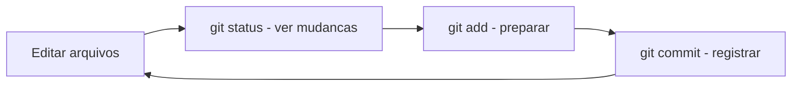

# 4.2 — Git na Prática: Repositórios e Primeiros Commits

[← Anterior: O que é Controle de Versão e por que Importa](cap04-mod01-controle-versao.md) · [Próximo: Repositórios Remotos: GitHub, GitLab e Bitbucket →](cap04-mod03-repositorios-remotos.md)

---

## Introdução

No módulo anterior, entendemos o que é controle de versão, por que ele existe e quais problemas resolve. Conhecemos os conceitos fundamentais do Git: repositórios, commits, branches, staging area. Tudo na teoria.

Agora vamos colocar a mão na massa. Neste módulo, você vai instalar o Git, configurá-lo, criar seu primeiro repositório, fazer seus primeiros commits e aprender o fluxo de trabalho básico que vai usar todos os dias como desenvolvedor.

Este é um módulo prático — cada seção tem comandos para você executar no seu terminal. Recomendo que você abra o terminal e acompanhe passo a passo. Não apenas leia — **faça**. A melhor forma de aprender Git é usando Git.

Lembre-se: no módulo anterior, comparamos o Git a uma máquina do tempo. Agora vamos aprender a operar essa máquina — ligar, tirar fotos (commits), ver o álbum de fotos (histórico) e voltar no tempo quando necessário.

---

## Instalando o Git

O Git provavelmente já está instalado no seu sistema. Vamos verificar:

```bash
# Verificar se o Git esta instalado
git --version
```

Saída esperada:
```
git version 2.43.0
```

Se o comando funcionar e mostrar uma versão, o Git já está instalado. Se não, vamos instalar:

```bash
# Ubuntu/Debian
sudo apt update
sudo apt install git

# Fedora
sudo dnf install git

# Arch Linux
sudo pacman -S git

# macOS (se nao tiver)
xcode-select --install
# Ou via Homebrew:
brew install git
```

Após instalar, verifique novamente:

```bash
git --version
# Deve mostrar a versao instalada
```

---

## Configurando o Git

Antes de usar o Git, você precisa dizer quem você é. Cada commit registra o nome e email do autor — essas informações são obrigatórias.

### Configuração Inicial

```bash
# Configurar seu nome (aparece em cada commit)
git config --global user.name "Seu Nome"

# Configurar seu email (use o mesmo do GitHub)
git config --global user.email "seu-email@exemplo.com"

# Definir a branch padrao como "main" (em vez de "master")
git config --global init.defaultBranch main

# Definir o editor padrao (para mensagens de commit longas)
git config --global core.editor "vim"
# Ou se preferir o micro:
git config --global core.editor "micro"
# Ou o nano:
git config --global core.editor "nano"
```

O `--global` significa que essa configuração vale para todos os repositórios do seu usuário. Sem `--global`, a configuração vale apenas para o repositório atual.

### Verificando a Configuração

```bash
# Ver todas as configuracoes
git config --list

# Ver uma configuracao especifica
git config user.name
git config user.email
```

Saída esperada:
```
user.name=Ana Silva
user.email=ana@exemplo.com
init.defaultbranch=main
core.editor=vim
```

### Onde Ficam as Configurações

O Git armazena configurações em três níveis:

| Nível | Arquivo | Escopo | Comando |
|-------|---------|--------|---------|
| Sistema | /etc/gitconfig | Todos os usuarios | `git config --system` |
| Usuario | ~/.gitconfig | Todos os repos do usuario | `git config --global` |
| Repositório | .git/config | Apenas este repositório | `git config --local` |

A configuração mais específica tem prioridade. Se você definir um email diferente no nível do repositório, ele sobrescreve o email global — útil quando você usa um email pessoal para projetos pessoais e um email corporativo para projetos do trabalho.

### Aliases: Atalhos para Comandos

O Git permite criar atalhos para comandos que você usa frequentemente:

```bash
# Criar atalhos uteis
git config --global alias.st status
git config --global alias.co checkout
git config --global alias.br branch
git config --global alias.ci commit
git config --global alias.lg "log --oneline --graph --all"

# Agora em vez de:
git status
# Voce pode digitar:
git st

# E em vez de:
git log --oneline --graph --all
# Voce pode digitar:
git lg
```

O alias `lg` é especialmente útil — mostra o histórico de forma compacta e visual, com branches representadas graficamente.

---

## Criando seu Primeiro Repositório

Existem duas formas de começar com Git: criar um repositório novo (`git init`) ou clonar um existente (`git clone`). Vamos começar criando um novo.

### git init: Inicializando um Repositório

```bash
# Criar uma pasta para o projeto
mkdir meu-primeiro-repo

# Entrar na pasta
cd meu-primeiro-repo

# Inicializar o repositorio Git
git init
```

Saída esperada:
```
Initialized empty Git repository in /home/ana/meu-primeiro-repo/.git/
```

O que aconteceu? O Git criou uma pasta oculta `.git/` dentro do seu projeto. Essa pasta contém toda a estrutura do repositório — o histórico, as configurações, os objetos. Vamos espiar:

```bash
# Ver a pasta .git (oculta)
ls -la

# Ver o conteudo da pasta .git
ls .git/
```

Saída esperada:
```
drwxr-xr-x  7 ana ana 4096 jan 15 10:30 .git
```

```
HEAD  branches  config  description  hooks  info  objects  refs
```

Você nunca precisa mexer dentro de `.git/` manualmente. Mas é bom saber que ela existe — se você apagar essa pasta, perde todo o histórico do Git (os arquivos do projeto continuam, mas sem versionamento).

### git status: Verificando o Estado

O comando mais usado do Git é `git status`. Ele mostra o estado atual do repositório — quais arquivos foram modificados, quais estão na staging area, quais não estão sendo rastreados:

```bash
# Ver o estado do repositorio
git status
```

Saída esperada (repositório vazio):
```
On branch main

No commits yet

nothing to commit (create/copy files and use "git add" to track)
```

O Git está dizendo: "Você está na branch main, não tem nenhum commit ainda, e não tem nada para commitar." Vamos mudar isso.

---

## O Ciclo Básico: add, commit, status

Este é o fluxo que você vai repetir centenas de vezes. É o coração do uso diário do Git.

### Passo 1: Criar Arquivos

```bash
# Criar um arquivo README
echo "# Meu Primeiro Repositório" > README.md
echo "" >> README.md
echo "Este é meu primeiro projeto com Git." >> README.md

# Criar um arquivo Python simples
echo '# meu primeiro programa' > app.py
echo 'print("Ola, Git!")' >> app.py

# Verificar o que temos
ls
```

Saída esperada:
```
README.md  app.py
```

### Passo 2: Verificar o Estado

```bash
git status
```

Saída esperada:
```
On branch main

No commits yet

Untracked files:
  (use "git add <file>..." to include in what will be committed)
        README.md
        app.py

nothing added to commit but untracked files present (use "git add" to track)
```

O Git detectou dois arquivos novos, mas eles estão como **Untracked** (não rastreados). O Git sabe que existem, mas não está monitorando mudanças neles. Precisamos dizer ao Git para começar a rastreá-los.

### Passo 3: Adicionar à Staging Area

```bash
# Adicionar um arquivo especifico
git add README.md

# Verificar o estado
git status
```

Saída esperada:
```
On branch main

No commits yet

Changes to be committed:
  (use "git rm --cached <file>..." to unstage)
        new file:   README.md

Untracked files:
  (use "git add <file>..." to include in what will be committed)
        app.py
```

Agora o `README.md` está na staging area ("Changes to be committed") e o `app.py` ainda está untracked. Vamos adicionar o `app.py` também:

```bash
# Adicionar o outro arquivo
git add app.py

# Ou adicionar tudo de uma vez:
# git add .
# O ponto (.) significa "tudo no diretorio atual"

# Verificar
git status
```

Saída esperada:
```
On branch main

No commits yet

Changes to be committed:
  (use "git rm --cached <file>..." to unstage)
        new file:   README.md
        new file:   app.py
```

Ambos os arquivos estão prontos para o commit.

### Passo 4: Fazer o Commit

```bash
# Fazer o commit com uma mensagem descritiva
git commit -m "feat: add initial project files"
```

Saída esperada:
```
[main (root-commit) a1b2c3d] feat: add initial project files
 2 files changed, 5 insertions(+)
 create mode 100644 README.md
 create mode 100644 app.py
```

Pronto — você fez seu primeiro commit. O Git registrou o estado dos dois arquivos com a mensagem "feat: add initial project files". O hash `a1b2c3d` é o identificador único deste commit (os primeiros 7 caracteres do hash completo de 40).

### Passo 5: Verificar o Estado Novamente

```bash
git status
```

Saída esperada:
```
On branch main
nothing to commit, working tree clean
```

"Working tree clean" — não há mudanças pendentes. Tudo está salvo no repositório.

### Resumo Visual do Ciclo



Esse ciclo — editar, verificar, preparar, registrar — é o que você vai fazer dezenas de vezes por dia como desenvolvedor.

---

## Fazendo Mais Commits

Vamos continuar trabalhando no projeto para praticar o ciclo:

```bash
# Editar o arquivo Python
echo '' >> app.py
echo '# funcao de saudacao' >> app.py
echo 'def saudacao(nome):' >> app.py
echo '    return f"Ola, {nome}! Bem-vindo ao Git."' >> app.py
echo '' >> app.py
echo '# chamar a funcao' >> app.py
echo 'print(saudacao("Ana"))' >> app.py

# Ver o que mudou
git status
```

Saída esperada:
```
On branch main
Changes not staged for commit:
  (use "git add <file>..." to update what will be committed)
  (use "git restore <file>..." to discard changes in working directory)
        modified:   app.py

no changes added to commit (use "git add" and then "git commit")
```

O Git detectou que `app.py` foi modificado. Agora ele aparece como "modified" (modificado) em vez de "new file" (arquivo novo).

### git diff: Vendo o que Mudou

Antes de commitar, é boa prática ver exatamente o que mudou:

```bash
# Ver as diferencas entre o working directory e o ultimo commit
git diff
```

Saída esperada:
```diff
diff --git a/app.py b/app.py
index 1234567..abcdefg 100644
--- a/app.py
+++ b/app.py
@@ -1,2 +1,9 @@
 # meu primeiro programa
 print("Ola, Git!")
+
+# funcao de saudacao
+def saudacao(nome):
+    return f"Ola, {nome}! Bem-vindo ao Git."
+
+# chamar a funcao
+print(saudacao("Ana"))
```

As linhas com `+` são as que foram adicionadas. Se tivéssemos removido linhas, elas apareceriam com `-`. Linhas sem prefixo são contexto (não mudaram).

Esse formato é o mesmo que o comando `diff -u` que vimos no módulo 3.2 — o Git usa o mesmo padrão.

```bash
# Adicionar e commitar
git add app.py
git commit -m "feat(app): add greeting function"
```

### Mais um Commit

```bash
# Criar um arquivo .gitignore
echo "# Arquivos Python compilados" > .gitignore
echo "__pycache__/" >> .gitignore
echo "*.pyc" >> .gitignore
echo "" >> .gitignore
echo "# Arquivos de ambiente" >> .gitignore
echo ".env" >> .gitignore
echo ".venv/" >> .gitignore

# Adicionar e commitar
git add .gitignore
git commit -m "chore: add .gitignore for Python"
```

Agora temos três commits no repositório.

---

## Visualizando o Histórico

### git log: O Álbum de Fotos

O `git log` mostra o histórico de commits:

```bash
# Historico completo
git log
```

Saída esperada:
```
commit c3d4e5f (HEAD -> main)
Author: Ana Silva <ana@exemplo.com>
Date:   Wed Jan 15 10:45:00 2025 -0300

    chore: add .gitignore for Python

commit b2c3d4e
Author: Ana Silva <ana@exemplo.com>
Date:   Wed Jan 15 10:40:00 2025 -0300

    feat(app): add greeting function

commit a1b2c3d
Author: Ana Silva <ana@exemplo.com>
Date:   Wed Jan 15 10:30:00 2025 -0300

    feat: add initial project files
```

Os commits aparecem do mais recente para o mais antigo. Cada um mostra o hash, autor, data e mensagem.

### Formatos Compactos do log

```bash
# Uma linha por commit (compacto)
git log --oneline

# Saida:
# c3d4e5f (HEAD -> main) chore: add .gitignore for Python
# b2c3d4e feat(app): add greeting function
# a1b2c3d feat: add initial project files

# Com grafico de branches (util quando tiver branches)
git log --oneline --graph --all

# Com estatisticas de mudancas
git log --stat

# Mostrar o diff de cada commit
git log -p

# Limitar a quantidade de commits
git log -3
# Mostra apenas os 3 mais recentes

# Filtrar por autor
git log --author="Ana"

# Filtrar por mensagem
git log --grep="feat"

# Filtrar por data
git log --since="2025-01-15" --until="2025-01-16"
```

O alias `git lg` que configuramos antes (`git log --oneline --graph --all`) é o formato mais prático para o dia a dia.

### git show: Detalhes de um Commit

```bash
# Ver detalhes de um commit especifico
git show b2c3d4e

# Ver detalhes do ultimo commit
git show HEAD

# Ver apenas os arquivos que mudaram
git show --stat b2c3d4e
```

---

## Desfazendo Coisas

Errar faz parte. O Git tem várias formas de desfazer mudanças, dependendo de onde a mudança está.

### Desfazendo Mudanças no Working Directory

Se você editou um arquivo e quer descartar as mudanças (voltar ao estado do último commit):

```bash
# Descartar mudancas em um arquivo especifico
git restore app.py

# Descartar mudancas em todos os arquivos
git restore .

# Sintaxe antiga (ainda funciona):
git checkout -- app.py
```

Cuidado: `git restore` descarta as mudanças permanentemente. Se você não commitou, as mudanças se perdem.

### Removendo da Staging Area

Se você fez `git add` mas mudou de ideia e quer tirar o arquivo da staging area (sem perder as mudanças):

```bash
# Remover um arquivo da staging area
git restore --staged app.py

# Remover todos da staging area
git restore --staged .

# Sintaxe antiga:
git reset HEAD app.py
```

O arquivo volta para o estado "modified" no working directory — as mudanças continuam lá, apenas não estão mais preparadas para o commit.

### Alterando o Último Commit

Se você fez um commit e esqueceu de incluir um arquivo, ou quer mudar a mensagem:

```bash
# Adicionar arquivo esquecido ao ultimo commit
git add arquivo-esquecido.py
git commit --amend --no-edit
# --no-edit mantem a mensagem original

# Mudar a mensagem do ultimo commit
git commit --amend -m "nova mensagem corrigida"
```

O `--amend` reescreve o último commit. Use apenas em commits que ainda não foram enviados para o remote (push). Nunca faça amend em commits que outras pessoas já viram.

### Revertendo um Commit

Se um commit introduziu um problema e você quer desfazê-lo:

```bash
# Criar um novo commit que desfaz as mudancas de um commit especifico
git revert b2c3d4e
# Abre o editor para a mensagem do commit de reversao

# Reverter sem abrir o editor
git revert --no-edit b2c3d4e
```

O `git revert` é seguro — ele não apaga o commit original, apenas cria um novo commit que faz o oposto. O histórico fica preservado.

---

## Boas Práticas para Mensagens de Commit

Mensagens de commit são a documentação do seu projeto. Uma boa mensagem explica **o que** mudou e **por quê**. Uma mensagem ruim não ajuda ninguém.

### Mensagens Ruins

```
git commit -m "update"
git commit -m "fix"
git commit -m "changes"
git commit -m "asdfgh"
git commit -m "WIP"
git commit -m "."
```

Essas mensagens não dizem nada. Daqui a um mês, quando você olhar o histórico, não vai ter ideia do que cada commit fez.

### Mensagens Boas

```
git commit -m "feat(login): add email validation on signup form"
git commit -m "fix(api): correct null pointer in user search"
git commit -m "docs: update README with installation instructions"
git commit -m "refactor(database): extract connection pool to separate module"
git commit -m "test(auth): add unit tests for password reset flow"
```

### Conventional Commits

O padrão **Conventional Commits** é uma convenção amplamente adotada para mensagens de commit. O formato é:

```
tipo(escopo): descricao curta
```

| Tipo | Quando usar | Exemplo |
|------|-------------|---------|
| feat | Nova funcionalidade | `feat(cart): add quantity selector` |
| fix | Correcao de bug | `fix(login): prevent empty password submission` |
| docs | Apenas documentação | `docs: add API usage examples` |
| refactor | Reestruturacao sem mudar comportamento | `refactor(db): simplify query builder` |
| test | Adicionar ou corrigir testes | `test(auth): add login integration tests` |
| chore | Tarefas de manutenção | `chore: update dependencies` |
| style | Formatacao, sem mudanca de lógica | `style: fix indentation in utils.py` |

O escopo (entre parênteses) é opcional mas recomendado — indica qual parte do projeto foi afetada.

### Regras Práticas

1. **Primeira linha com no máximo 72 caracteres** — muitas ferramentas truncam linhas longas
2. **Use o imperativo**: "add feature" em vez de "added feature" ou "adding feature"
3. **Não termine com ponto** — é um título, não uma frase
4. **Seja específico**: "fix login bug" é melhor que "fix bug", mas "fix null pointer when user has no email" é ainda melhor
5. **Separe o quê do por quê**: a primeira linha diz o quê, o corpo (opcional) explica por quê

```bash
# Commit com corpo explicativo (abre o editor)
git commit

# No editor, escreva:
# feat(auth): add rate limiting to login endpoint
#
# Users were able to brute-force passwords by making
# unlimited login attempts. Added rate limiting of
# 5 attempts per minute per IP address.
#
# Closes #42
```

---

## Ignorando Arquivos com .gitignore

Já criamos um `.gitignore` básico. Vamos entender melhor como ele funciona.

### Sintaxe do .gitignore

```bash
# Comentarios comecam com #

# Ignorar um arquivo especifico
segredo.txt

# Ignorar todos os arquivos com uma extensao
*.pyc
*.log
*.tmp

# Ignorar um diretorio inteiro
__pycache__/
node_modules/
.venv/

# Ignorar arquivos em qualquer subdiretorio
**/*.pyc

# Negar uma regra (nao ignorar este arquivo especifico)
!importante.log

# Ignorar tudo em um diretorio exceto um arquivo
build/*
!build/.gitkeep
```

### Templates por Linguagem

O GitHub mantém templates de `.gitignore` para cada linguagem. Os mais comuns:

```bash
# .gitignore para Python
__pycache__/
*.py[cod]
*$py.class
*.so
.Python
build/
develop-eggs/
dist/
downloads/
eggs/
.eggs/
lib/
lib64/
parts/
sdist/
var/
wheels/
*.egg-info/
.installed.cfg
*.egg
*.manifest
*.spec
pip-log.txt
pip-delete-this-directory.txt
.env
.venv
env/
venv/
```

### Regra de Ouro: O que NÃO Versionar

| Tipo de arquivo | Exemplo | Por que ignorar |
|----------------|---------|-----------------|
| Compilados e gerados | *.pyc, *.class, build/ | Podem ser regenerados |
| Dependências | node_modules/, .venv/ | Instaladas via gerenciador de pacotes |
| Configuração local | .env, .vscode/settings.json | Específicos de cada máquina |
| Segredos | *.key, *.pem, senhas | NUNCA versione senhas ou chaves |
| Arquivos do SO | .DS_Store, Thumbs.db | Lixo do sistema operacional |
| Logs | *.log | Gerados em tempo de execução |
| Dados grandes | *.csv, *.sqlite | Muito grandes para Git |

A regra mais importante: **NUNCA versione senhas, chaves de API ou certificados**. Se uma senha entrar no histórico do Git, ela fica lá para sempre (mesmo que você apague o arquivo depois). Qualquer pessoa com acesso ao repositório pode ver o histórico e encontrar a senha.

---

## Comandos de Referência Rápida

| Comando | O que faz | Exemplo |
|---------|-----------|---------|
| `git init` | Criar repositório novo | `git init` |
| `git status` | Ver estado atual | `git status` |
| `git add` | Adicionar a staging area | `git add arquivo.py` |
| `git add .` | Adicionar tudo | `git add .` |
| `git commit -m` | Registrar commit | `git commit -m "mensagem"` |
| `git diff` | Ver mudancas no working directory | `git diff` |
| `git diff --staged` | Ver mudancas na staging area | `git diff --staged` |
| `git log` | Ver histórico | `git log --oneline` |
| `git show` | Ver detalhes de um commit | `git show abc1234` |
| `git restore` | Descartar mudancas | `git restore arquivo.py` |
| `git restore --staged` | Remover da staging area | `git restore --staged arquivo.py` |
| `git commit --amend` | Alterar último commit | `git commit --amend -m "nova msg"` |
| `git revert` | Desfazer um commit | `git revert abc1234` |
| `git config` | Configurar Git | `git config --global user.name "Nome"` |

---

## Conexão com a Programação

Tudo que praticamos neste módulo é o que você vai fazer diariamente como desenvolvedor:

**O ciclo add-commit é como salvar o jogo**: em jogos de videogame, você salva o progresso em pontos estratégicos para poder voltar se algo der errado. Commits são exatamente isso — pontos de salvamento do seu código. A diferença é que no Git, você pode ter infinitos pontos de salvamento e voltar a qualquer um deles.

**Mensagens de commit são documentação viva**: quando você escreve `feat(login): add email validation`, está documentando a evolução do projeto. Daqui a meses, quando alguém perguntar "quando adicionamos validação de email?", basta olhar o histórico. Boas mensagens de commit são tão importantes quanto bons comentários no código.

**O .gitignore ensina separação de responsabilidades**: decidir o que versionar e o que ignorar é um exercício de pensamento sobre o que é essencial (código-fonte, configurações) e o que é derivado (compilados, dependências). Essa distinção entre "fonte" e "derivado" é fundamental em engenharia de software.

**git diff é a base do code review**: no Capítulo 4.4, vamos aprender sobre Pull Requests, onde colegas revisam suas mudanças antes de integrá-las. O que eles revisam é exatamente o diff — as linhas adicionadas e removidas. Saber ler diffs é uma habilidade essencial.

---

## Como a IA pode te ajudar aqui
**Prompt 1 — Entender erros comuns:**
> "Fiz várias mudanças no meu projeto Python e quero organizar em commits separados. Tenho mudanças em 5 arquivos: dois são bug fixes, dois são features novas e um é documentação. Me ajude a separar em commits com boas mensagens."

**Prompt 2 — Aprofundar o tema:**
> "Fiz um commit com uma senha no arquivo .env e já fiz push para o GitHub. Como removo isso do histórico? É urgente."

**Prompt 3 — Praticar com projetos:**
> "Meu `git status` mostra muitos arquivos que não quero versionar (*.pyc, __pycache__, .venv). Me ajude a criar um .gitignore completo para um projeto Python com FastAPI e SQLite."

---

## Resumo do Módulo

| Conceito | Definição |
|----------|-----------|
| git init | Comando que cria um novo repositório Git em uma pasta |
| git status | Comando que mostra o estado atual do repositório |
| git add | Comando que move mudancas para a staging area |
| git commit | Comando que registra as mudancas da staging area no repositório |
| git diff | Comando que mostra as diferenças entre versões |
| git log | Comando que mostra o histórico de commits |
| git restore | Comando que descarta mudancas ou remove da staging area |
| git revert | Comando que cria um commit desfazendo outro commit |
| git amend | Opcao que altera o último commit |
| Conventional Commits | Padrão de mensagens de commit com tipo, escopo e descrição |
| .gitignore | Arquivo que lista padrões de arquivos para o Git ignorar |
| Untracked | Arquivo que o Git detectou mas não esta rastreando |
| Modified | Arquivo rastreado que foi alterado desde o último commit |
| Staged | Arquivo cujas mudancas estao na staging area, prontas para commit |
| HEAD | Ponteiro que indica o commit atual |

---

## Glossário do Módulo

| Termo | Definição |
|-------|-----------|
| Alias | Atalho configuravel para comandos Git frequentes |
| Amend | Opcao do commit que altera o último commit em vez de criar um novo |
| BFG Repo-Cleaner | Ferramenta para remover dados sensíveis do histórico Git |
| Conventional Commits | Convencao para mensagens de commit com formato tipo, escopo, descrição |
| Diff | Diferença entre duas versões de um arquivo, mostra linhas adicionadas e removidas |
| git add | Comando que move mudancas do working directory para a staging area |
| git commit | Comando que registra permanentemente as mudancas da staging area |
| git config | Comando para configurar opcoes do Git |
| git diff | Comando que mostra diferenças entre versões de arquivos |
| git init | Comando que inicializa um novo repositório Git |
| git log | Comando que exibe o histórico de commits |
| git restore | Comando que descarta mudancas ou remove arquivos da staging area |
| git revert | Comando que cria um novo commit desfazendo as mudancas de outro |
| git show | Comando que mostra detalhes de um commit específico |
| git status | Comando que mostra o estado atual do repositório |
| .git | Pasta oculta criada pelo git init que contem todo o histórico e metadados |
| .gitignore | Arquivo que define padrões de arquivos e pastas para o Git ignorar |
| HEAD | Ponteiro especial que indica o commit e a branch onde você esta |
| Modified | Estado de um arquivo rastreado que foi alterado desde o último commit |
| Root commit | Primeiro commit de um repositório, não tem commit pai |
| SHA-1 | Algoritmo de hash usado pelo Git para identificar objetos unicamente |
| Staged | Estado de um arquivo cujas mudancas estao na staging area |
| Staging area | Area intermediaria onde mudancas são preparadas antes do commit |
| Untracked | Estado de um arquivo que o Git detectou mas não esta rastreando |
| Working directory | Diretório de trabalho onde você edita arquivos normalmente |
| Working tree clean | Mensagem do git status indicando que não ha mudancas pendentes |

---

## Na Cultura Popular

- **Tenet** (filme, 2020) — embora não seja sobre programação, o conceito de "inversão temporal" do filme é uma analogia interessante para o Git. No filme, personagens podem reverter o fluxo do tempo. No Git, `git revert` e `git reset` permitem "voltar no tempo" do seu código. A diferença é que no Git, é muito mais fácil e não causa paradoxos temporais.

- **De Volta para o Futuro** (filme, 1985) — a trilogia inteira é sobre viagem no tempo e as consequências de alterar o passado. No Git, alterar o histórico (com `git rebase` ou `git amend`) pode causar problemas similares — especialmente se outras pessoas já viram aquele histórico. A regra "nunca altere histórico público" é a versão Git de "nunca mude o passado".

- **Mr. Robot** (série, 2015-2019) — em vários episódios, personagens usam Git para gerenciar código de ferramentas de hacking. A série mostra comandos reais de Git sendo executados no terminal, incluindo commits, pushes e clones de repositórios.

---

## Para Saber Mais

- *Pro Git — Capítulo 2: Git Basics* — https://git-scm.com/book/pt-br/v2/Fundamentos-de-Git-Obtendo-um-Reposit%C3%B3rio-Git — *o capítulo mais importante do livro oficial, cobre tudo deste módulo em detalhes*
- *Git Cheat Sheet — GitHub* — https://education.github.com/git-cheat-sheet-education.pdf — *folha de referência oficial do GitHub com os comandos mais usados*
- *Learn Git Branching* — https://learngitbranching.js.org/?locale=pt_BR — *tutorial interativo visual para aprender Git, disponível em português*
- *Repositório do Fino — learn-ops-content* — https://github.com/RafaelFino/learn-ops-content — *material complementar sobre Git e desenvolvimento*
- *Conventional Commits* — https://www.conventionalcommits.org/pt-br/ — *especificação completa do padrão de mensagens de commit, em português*

---

## Perguntas Frequentes (FAQ)

**P: Qual a diferença entre git add e git commit?**
R: O `git add` move mudanças para a staging area (área de preparação). O `git commit` registra permanentemente o que está na staging area. São dois passos separados de propósito: o `add` permite que você escolha exatamente o que incluir no commit, e o `commit` registra. Pense no `add` como colocar itens na caixa e no `commit` como lacrar e enviar a caixa.

**P: Posso fazer git add . sempre ou devo adicionar arquivo por arquivo?**
R: `git add .` adiciona tudo e é conveniente para commits simples. Mas quando você tem mudanças de naturezas diferentes (bug fix + feature + documentação), é melhor adicionar arquivo por arquivo para criar commits focados. Na prática, use `git add .` quando todas as mudanças são relacionadas, e `git add arquivo` quando quer separar.

**P: O que acontece se eu esquecer de criar o .gitignore antes do primeiro commit?**
R: Você pode criar o `.gitignore` a qualquer momento. Mas se já commitou arquivos que deveria ignorar, precisa removê-los do rastreamento: `git rm --cached arquivo.pyc`. O arquivo continua no disco mas o Git para de rastreá-lo. Commits antigos que contêm o arquivo continuam no histórico.

**P: Posso mudar a mensagem de um commit antigo (não o último)?**
R: Sim, mas é mais complexo — requer `git rebase -i` (rebase interativo). E se o commit já foi enviado para o remote, alterar a mensagem pode causar problemas para outros desenvolvedores. Para commits locais, é seguro. Para commits públicos, evite.

**P: O que é HEAD?**
R: HEAD é um ponteiro especial que indica onde você está no histórico. Normalmente, HEAD aponta para a branch atual (ex: main), que por sua vez aponta para o último commit. Quando você faz um novo commit, HEAD avança automaticamente. Quando você muda de branch, HEAD muda para apontar para a nova branch.

**P: O git diff não mostra nada, mas git status mostra arquivos modificados. Por quê?**
R: Provavelmente você já fez `git add` nos arquivos. O `git diff` sem opções mostra diferenças entre o working directory e a staging area. Se as mudanças já estão na staging area, use `git diff --staged` para vê-las.

**P: Posso desfazer um git add?**
R: Sim. Use `git restore --staged arquivo.py` para remover o arquivo da staging area. As mudanças continuam no working directory — você não perde nada. Apenas "desempacota" o arquivo da caixa.

**P: O que significa "detached HEAD"?**
R: Significa que HEAD está apontando diretamente para um commit em vez de para uma branch. Isso acontece quando você faz `git checkout` para um commit específico (em vez de uma branch). Commits feitos nesse estado podem ser perdidos. Se vir essa mensagem, crie uma branch antes de fazer mudanças: `git checkout -b minha-branch`.

**P: Quantos arquivos posso ter em um repositório Git?**
R: Não há limite prático para o número de arquivos. O kernel do Linux tem mais de 70.000 arquivos em um único repositório Git. O que importa é o tamanho total — repositórios com muitos gigabytes de arquivos binários ficam lentos. Para código-fonte, o Git lida bem com projetos de qualquer tamanho.

**P: Preciso fazer commit toda vez que salvo um arquivo?**
R: Não. Salvar o arquivo (Ctrl+S no editor) e fazer commit são coisas diferentes. Salvar grava o arquivo no disco. Commit registra o estado no Git. Você pode salvar dezenas de vezes e fazer commit apenas quando completar uma unidade lógica de trabalho. Commits devem representar mudanças significativas, não cada tecla pressionada.

**P: O que acontece se dois arquivos tiverem o mesmo conteúdo?**
R: O Git é inteligente — ele armazena o conteúdo uma única vez e cria referências. Se dois arquivos têm exatamente o mesmo conteúdo, o Git armazena os dados uma vez e ambos os arquivos apontam para o mesmo objeto. Isso economiza espaço.

**P: Posso usar Git sem GitHub?**
R: Sim. O Git funciona perfeitamente de forma local, sem nenhum serviço remoto. Você pode criar repositórios, fazer commits, criar branches — tudo no seu computador. O GitHub (ou GitLab, Bitbucket) é útil para backup, colaboração e portfólio, mas não é obrigatório.

---

## Exercícios Práticos

### Exercício 1 — Seu Primeiro Repositório

Siga os passos abaixo no terminal:

1. Crie uma pasta chamada `exercício-git` e entre nela
2. Inicialize um repositório Git com `git init`
3. Configure seu nome e email (se ainda não fez globalmente)
4. Crie um arquivo `README.md` com o título "Exercício de Git" e uma descrição
5. Verifique o estado com `git status`
6. Adicione o arquivo com `git add README.md`
7. Verifique o estado novamente — note a diferença
8. Faça o commit: `git commit -m "docs: add initial README"`
9. Verifique o estado mais uma vez — deve estar "clean"
10. Verifique o histórico com `git log --oneline`

### Exercício 2 — Praticando o Ciclo

Continuando no repositório do exercício anterior:

1. Crie um arquivo `notas.txt` com 3 linhas de texto qualquer
2. Crie um arquivo `ideias.txt` com 2 linhas
3. Faça `git status` — ambos devem aparecer como untracked
4. Adicione apenas `notas.txt` e faça commit: `git commit -m "docs: add study notes"`
5. Adicione `ideias.txt` e faça commit: `git commit -m "docs: add project ideas"`
6. Edite `notas.txt` adicionando mais 2 linhas
7. Use `git diff` para ver o que mudou
8. Adicione e commite: `git commit -am "docs: expand study notes"`
   (o `-a` adiciona automaticamente arquivos já rastreados)
9. Verifique o histórico com `git log --oneline` — deve ter 4 commits

### Exercício 3 — Desfazendo Coisas

1. Edite `notas.txt` adicionando uma linha "ESTA LINHA VAI SER DESCARTADA"
2. Verifique com `git diff`
3. Descarte a mudança com `git restore notas.txt`
4. Verifique que a linha sumiu com `cat notas.txt`
5. Agora edite `ideias.txt` e adicione com `git add ideias.txt`
6. Mude de ideia e remova da staging com `git restore --staged ideias.txt`
7. Verifique com `git status` — o arquivo deve estar como "modified" mas não staged
8. Crie um `.gitignore` que ignore arquivos `*.tmp` e a pasta `temp/`
9. Crie um arquivo `teste.tmp` e verifique que `git status` não o mostra
10. Commite o `.gitignore`: `git commit -am "chore: add .gitignore"`

---

[← Anterior: O que é Controle de Versão e por que Importa](cap04-mod01-controle-versao.md) · [Próximo: Repositórios Remotos: GitHub, GitLab e Bitbucket →](cap04-mod03-repositorios-remotos.md)
