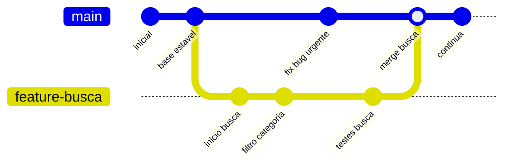
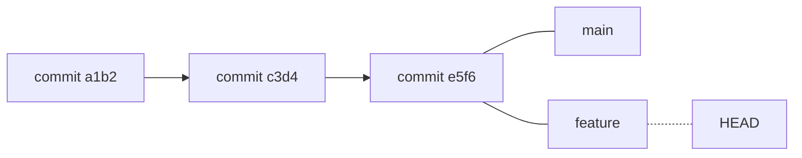
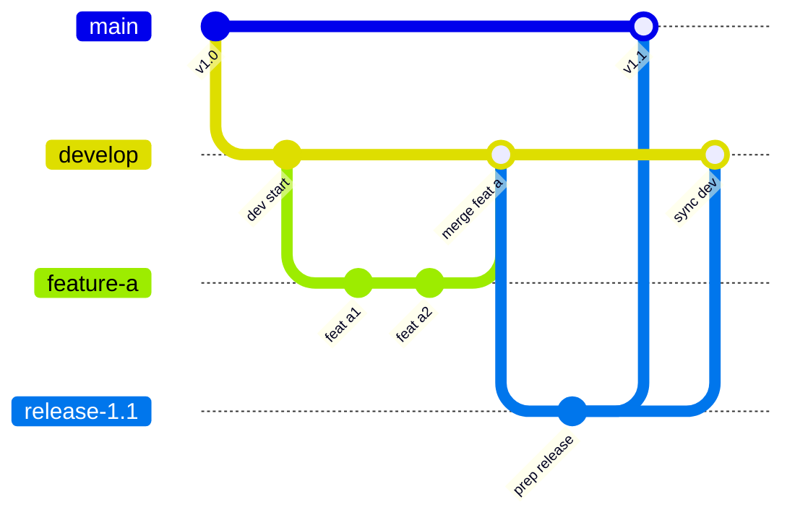
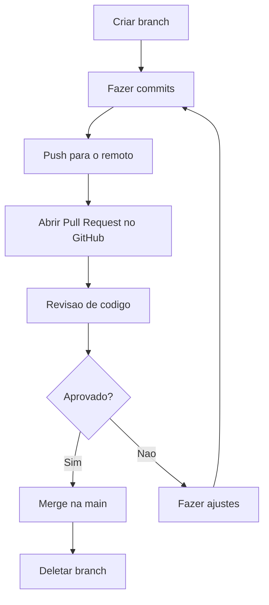

# 4.4 — Branches, Merges e Pull Requests

[← Anterior: Repositórios Remotos: GitHub, GitLab e Bitbucket](cap04-mod03-repositorios-remotos.md) · [Próximo: Introdução à Programação: O que é um Programa? →](cap05-mod01-intro-programacao.md)

---

## Introdução

No módulo anterior, aprendemos a conectar nosso repositório local com o GitHub, enviar código com `push`, baixar com `pull` e contribuir para projetos com fork. Tudo isso usando uma única linha do tempo — a branch `main`.

Mas imagine o seguinte cenário: você está desenvolvendo um sistema de cadastro de produtos. O sistema funciona, está estável, os usuários estão usando. Aí chega um pedido: "precisamos adicionar um filtro de busca por categoria." Você começa a implementar. No meio do caminho, descobre que precisa mudar a estrutura do banco de dados, refatorar três arquivos e criar dois novos. Enquanto isso, um colega precisa corrigir um bug urgente no cadastro — mas o código está no meio de uma mudança grande e incompleta. O que fazer?

Se todo mundo trabalha na mesma linha do tempo, qualquer mudança incompleta afeta todos. É como se uma estrada tivesse apenas uma faixa — se alguém para para trocar um pneu, ninguém passa.

Branches resolvem esse problema. Uma branch é como abrir uma faixa paralela na estrada. Você sai da faixa principal, faz seu trabalho com calma, e quando termina, volta para a faixa principal com tudo pronto. Enquanto isso, a faixa principal continua funcionando normalmente — outros podem usar, corrigir bugs, fazer melhorias.

Neste módulo, vamos aprender a criar branches, trabalhar nelas, juntar o trabalho de volta (merge), resolver conflitos quando duas pessoas editam o mesmo trecho de código, e usar Pull Requests — o mecanismo que torna tudo isso organizado e seguro.

---

## O Problema que Branches Resolvem

### Desenvolvimento Linear: O Problema

Sem branches, o histórico do Git é uma linha reta:

```
commit 1 → commit 2 → commit 3 → commit 4 → commit 5
```

Parece organizado, mas na prática causa problemas:

- **Código incompleto na main**: se você está no meio de uma feature e faz commit, o código na main está quebrado. Outros desenvolvedores que fizerem pull vão receber código que não funciona.
- **Impossível trabalhar em paralelo**: se duas pessoas precisam fazer mudanças diferentes, elas vão pisar no código uma da outra constantemente.
- **Sem isolamento**: cada commit afeta todos imediatamente. Não há como "experimentar" algo sem arriscar o código estável.
- **Difícil reverter**: se uma feature inteira precisa ser removida, você precisa identificar e reverter cada commit individual.

### Desenvolvimento com Branches: A Solução

Com branches, o histórico pode ter caminhos paralelos:



Nesse diagrama:
- A branch `main` continua recebendo correções urgentes
- A branch `feature-busca` é desenvolvida em paralelo, sem afetar a main
- Quando a feature está pronta e testada, ela é integrada (merge) na main
- O resultado é um código estável na main o tempo todo

### A Analogia do Caderno

Pense em branches como cadernos de rascunho. Você tem um caderno principal (a `main`) onde fica a versão "limpa" do seu trabalho. Quando precisa experimentar algo — uma ideia nova, uma abordagem diferente — você pega um caderno de rascunho (cria uma branch). Trabalha no rascunho com liberdade, sem medo de errar. Se a ideia funcionar, você passa a limpo para o caderno principal (merge). Se não funcionar, joga o rascunho fora (deleta a branch). O caderno principal nunca foi afetado.

---

## Conceitos Fundamentais de Branches

### O que é uma Branch

Tecnicamente, uma branch no Git é apenas um ponteiro para um commit. Quando você cria uma branch, o Git não copia nenhum arquivo — ele simplesmente cria um novo ponteiro que aponta para o commit atual. Isso torna branches extremamente leves e rápidas de criar.



Nesse diagrama:
- `main` e `feature` são branches — ambas apontam para o commit `e5f6`
- `HEAD` indica em qual branch você está trabalhando (neste caso, `feature`)
- Quando você fizer um novo commit, apenas a branch onde HEAD está avança

### A Branch main

A branch `main` (antigamente chamada `master`) é a branch principal do repositório. Por convenção, ela contém o código estável e funcional — a versão "oficial" do projeto.

A mudança de nome de `master` para `main` aconteceu em 2020, quando a comunidade de tecnologia decidiu substituir termos que remetem a relações de dominação. O GitHub, GitLab e Bitbucket adotaram `main` como padrão para novos repositórios. Repositórios antigos podem ainda usar `master` — o funcionamento é idêntico, apenas o nome muda.

### HEAD: Onde Você Está

HEAD é um ponteiro especial que indica em qual branch (e em qual commit) você está trabalhando. Quando você muda de branch com `git checkout` ou `git switch`, o HEAD muda para apontar para a nova branch.

Pense no HEAD como um "Você está aqui" no mapa de um shopping. Ele sempre indica sua posição atual no histórico do Git.

---

## Trabalhando com Branches na Prática

### Criando uma Branch

```bash
# Ver em qual branch voce esta
git branch
# O asterisco (*) indica a branch atual

# Saida esperada:
# * main

# Criar uma nova branch
git branch feature-saudacao

# Ver todas as branches
git branch

# Saida esperada:
# feature-saudacao
# * main
```

A branch foi criada, mas você ainda está na `main` (note o asterisco). Criar uma branch não muda automaticamente para ela.

### Mudando de Branch

```bash
# Mudar para a nova branch
git checkout feature-saudacao
# Ou o comando mais moderno:
git switch feature-saudacao

# Verificar
git branch

# Saida esperada:
# * feature-saudacao
#   main
```

Agora o asterisco está em `feature-saudacao`. Qualquer commit que você fizer vai para essa branch — a `main` não é afetada.

### Atalho: Criar e Mudar ao Mesmo Tempo

```bash
# Criar branch e mudar para ela em um unico comando
git checkout -b feature-login
# Ou o equivalente moderno:
git switch -c feature-login

# Verificar
git branch

# Saida esperada:
# * feature-login
#   feature-saudacao
#   main
```

O `-b` (no checkout) ou `-c` (no switch) significa "create" — cria a branch e muda para ela imediatamente. Esse é o comando que você vai usar 90% das vezes.

### Trabalhando na Branch

Vamos criar um cenário prático. Primeiro, volte para a main e prepare o terreno:

```bash
# Voltar para main
git switch main

# Garantir que temos um projeto basico
echo '# Projeto de Exemplo' > README.md
echo '' >> README.md
echo 'Um projeto para aprender branches.' >> README.md

echo '# app principal' > app.py
echo 'def main():' >> app.py
echo '    print("Aplicacao iniciada")' >> app.py
echo '' >> app.py
echo 'main()' >> app.py

git add .
git commit -m "feat: add base project structure"
```

Agora vamos criar uma branch para adicionar uma feature:

```bash
# Criar branch para a feature de saudacao
git switch -c feature/saudacao

# Editar o app.py para adicionar a funcao de saudacao
cat > app.py << 'EOF'
# app principal

def saudacao(nome):
    """Retorna uma saudacao personalizada."""
    # "greeting" = saudacao
    return f"Ola, {nome}! Bem-vindo ao sistema."

def main():
    print("Aplicacao iniciada")
    # Usar a nova funcao
    mensagem = saudacao("Ana")
    print(mensagem)

main()
EOF

# Verificar as mudancas
git diff

# Commitar
git add app.py
git commit -m "feat(app): add greeting function"
```

Agora vamos adicionar mais uma mudança na mesma branch:

```bash
# Adicionar um arquivo de utilidades
cat > utils.py << 'EOF'
# funcoes utilitarias

def formatar_nome(nome):
    """Formata o nome com primeira letra maiuscula."""
    # "format_name" = formatar nome
    return nome.strip().title()

def validar_nome(nome):
    """Verifica se o nome e valido."""
    # "validate_name" = validar nome
    if not nome or not nome.strip():
        return False
    return True
EOF

git add utils.py
git commit -m "feat(utils): add name formatting and validation"
```

### Verificando o Estado das Branches

```bash
# Ver historico da branch atual
git log --oneline

# Saida esperada:
# def5678 feat(utils): add name formatting and validation
# abc1234 feat(app): add greeting function
# 9876543 feat: add base project structure

# Voltar para main e ver o historico dela
git switch main
git log --oneline

# Saida esperada:
# 9876543 feat: add base project structure
```

Note a diferença: a `main` tem apenas 1 commit, enquanto a `feature/saudacao` tem 3. Os dois commits da feature existem apenas na branch — a main não foi afetada.

```bash
# Ver os arquivos na main
ls
# Saida: README.md  app.py

# Voltar para a feature e ver os arquivos
git switch feature/saudacao
ls
# Saida: README.md  app.py  utils.py
```

O arquivo `utils.py` existe na branch `feature/saudacao` mas não na `main`. Quando você muda de branch, o Git atualiza os arquivos no disco para refletir o estado daquela branch. É como se os arquivos "aparecessem" e "desaparecessem" conforme você muda de branch — mas na verdade, o Git está trocando o conteúdo do diretório de trabalho.

---

## Merge: Juntando o Trabalho

Quando a feature está pronta e testada, é hora de integrar na `main`. Esse processo se chama **merge** (mesclar, juntar).

### Fast-Forward Merge

O caso mais simples: a main não recebeu nenhum commit novo desde que a branch foi criada. O Git simplesmente "avança" o ponteiro da main para o último commit da feature.

```bash
# Voltar para main (voce faz merge NA branch de destino)
git switch main

# Fazer merge da feature na main
git merge feature/saudacao
```

Saída esperada:
```
Updating 9876543..def5678
Fast-forward
 app.py   | 10 +++++++---
 utils.py |  12 ++++++++++++
 2 files changed, 19 insertions(+), 3 deletions(-)
 create mode 100644 utils.py
```

O "Fast-forward" indica que o Git apenas avançou o ponteiro — não precisou criar um commit de merge. Agora a main tem todos os commits da feature.

```bash
# Verificar o historico
git log --oneline

# Saida esperada:
# def5678 (HEAD -> main, feature/saudacao) feat(utils): add name formatting and validation
# abc1234 feat(app): add greeting function
# 9876543 feat: add base project structure

# Deletar a branch (ja foi integrada)
git branch -d feature/saudacao
```

### Three-Way Merge

O caso mais comum no dia a dia: tanto a main quanto a branch receberam commits novos. O Git precisa criar um commit especial de merge que combina as duas linhas de desenvolvimento.

Vamos simular:

```bash
# Criar uma branch para nova feature
git switch -c feature/despedida

# Adicionar funcao de despedida no utils.py
echo '' >> utils.py
echo 'def despedida(nome):' >> utils.py
echo '    """Retorna uma mensagem de despedida."""' >> utils.py
echo '    # "farewell" = despedida' >> utils.py
echo '    return f"Ate logo, {nome}! Volte sempre."' >> utils.py

git add utils.py
git commit -m "feat(utils): add farewell function"

# Voltar para main e fazer uma mudanca DIFERENTE
git switch main

# Editar o README (arquivo diferente do que a feature editou)
echo '' >> README.md
echo '## Como Executar' >> README.md
echo '' >> README.md
echo 'python3 app.py' >> README.md

git add README.md
git commit -m "docs: add execution instructions to README"
```

Agora temos duas linhas de desenvolvimento divergentes:
- `main` tem um commit novo (README)
- `feature/despedida` tem um commit novo (utils.py)

```bash
# Fazer merge
git merge feature/despedida
```

Saída esperada:
```
Merge made by the 'ort' strategy.
 utils.py | 5 +++++
 1 file changed, 5 insertions(+)
```

O Git criou automaticamente um commit de merge. Se você olhar o histórico:

```bash
git log --oneline --graph

# Saida esperada:
# *   ghi7890 (HEAD -> main) Merge branch 'feature/despedida'
# |\
# | * fed6543 (feature/despedida) feat(utils): add farewell function
# * | abc4567 docs: add execution instructions to README
# |/
# * def5678 feat(utils): add name formatting and validation
# * abc1234 feat(app): add greeting function
# * 9876543 feat: add base project structure
```

O gráfico mostra as duas linhas se separando e depois se juntando no commit de merge. Esse é o three-way merge — o Git olha três pontos: o ancestral comum (onde as branches divergiram), o último commit de cada branch, e combina as mudanças.

```bash
# Limpar: deletar a branch integrada
git branch -d feature/despedida
```

---

## Conflitos de Merge

Conflitos acontecem quando duas branches editam o mesmo trecho do mesmo arquivo. O Git não sabe qual versão manter e pede para você decidir.

### Criando um Conflito (de Propósito)

Vamos criar um conflito para aprender a resolver:

```bash
# Criar branch A que edita a funcao main
git switch -c feature/versao-a

# Editar app.py - mudar a mensagem do main()
cat > app.py << 'EOF'
# app principal

def saudacao(nome):
    """Retorna uma saudacao personalizada."""
    return f"Ola, {nome}! Bem-vindo ao sistema."

def main():
    print("=== Sistema v2.0 ===")
    mensagem = saudacao("Ana")
    print(mensagem)

main()
EOF

git add app.py
git commit -m "feat(app): update to version 2.0"

# Voltar para main
git switch main

# Criar branch B que edita O MESMO TRECHO
git switch -c feature/versao-b

# Editar app.py - mudar a MESMA linha de forma diferente
cat > app.py << 'EOF'
# app principal

def saudacao(nome):
    """Retorna uma saudacao personalizada."""
    return f"Ola, {nome}! Bem-vindo ao sistema."

def main():
    print("*** Aplicacao Principal ***")
    mensagem = saudacao("Ana")
    print(mensagem)

main()
EOF

git add app.py
git commit -m "feat(app): update main header"

# Voltar para main e fazer merge da versao-a primeiro
git switch main
git merge feature/versao-a
# Fast-forward, sem problemas

# Agora tentar merge da versao-b
git merge feature/versao-b
```

Saída esperada:
```
Auto-merging app.py
CONFLICT (content): Merge conflict in app.py
Automatic merge failed; fix conflicts and then commit the result.
```

O Git detectou o conflito e parou o merge. Ele está dizendo: "não consigo resolver sozinho — as duas branches editaram a mesma linha de formas diferentes. Você precisa decidir."

### Anatomia de um Conflito

```bash
# Ver o estado
git status
```

Saída esperada:
```
On branch main
You have unmerged paths.
  (fix conflicts and run "git commit")
  (use "git merge --abort" to abort the merge)

Unmerged paths:
  (use "git add <file>..." to mark resolution)
        both modified:   app.py
```

Vamos olhar o arquivo com conflito:

```bash
cat app.py
```

Saída esperada:
```python
# app principal

def saudacao(nome):
    """Retorna uma saudacao personalizada."""
    return f"Ola, {nome}! Bem-vindo ao sistema."

def main():
<<<<<<< HEAD
    print("=== Sistema v2.0 ===")
=======
    print("*** Aplicacao Principal ***")
>>>>>>> feature/versao-b
    mensagem = saudacao("Ana")
    print(mensagem)

main()
```

O Git marcou o conflito com marcadores especiais:

| Marcador | Significado |
|----------|-------------|
| `<<<<<<< HEAD` | Inicio do conflito - versão da branch atual, main |
| `=======` | Separador entre as duas versões |
| `>>>>>>> feature/versão-b` | Fim do conflito - versão da branch sendo integrada |

Entre `<<<<<<< HEAD` e `=======` está o código da branch atual (main, que já tem o merge da versão-a). Entre `=======` e `>>>>>>> feature/versão-b` está o código da branch que está sendo integrada.

### Resolvendo o Conflito

Para resolver, você precisa:
1. Abrir o arquivo
2. Decidir qual versão manter (ou combinar as duas)
3. Remover os marcadores de conflito
4. Salvar, adicionar e commitar

Vamos resolver escolhendo combinar as duas versões:

```bash
# Editar o arquivo resolvendo o conflito
cat > app.py << 'EOF'
# app principal

def saudacao(nome):
    """Retorna uma saudacao personalizada."""
    return f"Ola, {nome}! Bem-vindo ao sistema."

def main():
    print("=== Sistema v2.0 - Aplicacao Principal ===")
    mensagem = saudacao("Ana")
    print(mensagem)

main()
EOF

# Marcar como resolvido
git add app.py

# Completar o merge
git commit -m "merge: combine version headers from both branches"
```

Pronto — o conflito foi resolvido. Removemos os marcadores (`<<<<<<<`, `=======`, `>>>>>>>`), escolhemos uma versão que combina as duas, e completamos o merge.

### Abortando um Merge

Se o conflito for muito complexo e você quiser desistir:

```bash
# Abortar o merge e voltar ao estado anterior
git merge --abort
```

Isso desfaz o merge e volta tudo ao estado de antes. Você pode tentar novamente quando estiver pronto.

### Dicas para Evitar Conflitos

1. **Faça pull frequentemente**: quanto mais atualizado seu código, menos chance de conflito
2. **Branches curtas**: branches que duram dias têm mais chance de conflito do que branches que duram horas
3. **Comunique-se com a equipe**: se dois desenvolvedores vão editar o mesmo arquivo, combinem antes
4. **Commits pequenos e focados**: é mais fácil resolver conflitos em mudanças pequenas
5. **Não edite a mesma linha**: se possível, trabalhe em partes diferentes do arquivo

---

## Estratégias de Branching

Ao longo dos anos, a comunidade de desenvolvimento criou diferentes estratégias para organizar branches. Cada uma tem seus prós e contras.

### Git Flow

Criado por Vincent Driessen em 2010, o Git Flow é uma estratégia elaborada com múltiplas branches de longa duração:

| Branch | Proposito | Duracao |
|--------|-----------|---------|
| main | Código em produção | Permanente |
| develop | Código em desenvolvimento | Permanente |
| feature/* | Novas funcionalidades | Temporária |
| release/* | Preparacao para lancamento | Temporária |
| hotfix/* | Correcoes urgentes em produção | Temporária |



**Quando usar:** projetos grandes com ciclos de release definidos, equipes grandes, software que precisa de versões estáveis.

**Quando NÃO usar:** projetos pequenos, equipes de 1-3 pessoas, desenvolvimento ágil com deploy contínuo. O Git Flow adiciona complexidade que nem sempre se justifica.

### GitHub Flow

Uma estratégia muito mais simples, usada pelo próprio GitHub:

1. A `main` está sempre em estado deployável (pronta para produção)
2. Para qualquer mudança, crie uma branch a partir da main
3. Faça commits na branch
4. Abra um Pull Request
5. Após revisão e aprovação, faça merge na main
6. Faça deploy

| Branch | Proposito | Duracao |
|--------|-----------|---------|
| main | Código em produção, sempre estavel | Permanente |
| feature/* | Qualquer mudanca | Temporária, curta |

**Quando usar:** maioria dos projetos. É simples, eficiente e funciona bem com deploy contínuo.

### Trunk-Based Development

A estratégia mais simples de todas: todos trabalham diretamente na `main` (trunk), com branches muito curtas (horas, não dias).

| Caracteristica | Descrição |
|---------------|-----------|
| Branch principal | main, trunk |
| Branches de feature | Muito curtas, menos de 1 dia |
| Merge | Frequente, várias vezes ao dia |
| Requisito | Testes automatizados robustos |

**Quando usar:** equipes experientes com boa cobertura de testes e CI/CD maduro.

### Qual Estratégia Usar?

Para quem está começando, o **GitHub Flow** é a melhor opção. É simples, fácil de entender e funciona para a maioria dos projetos. Conforme você ganhar experiência e trabalhar em equipes maiores, pode migrar para estratégias mais elaboradas.

---

## Pull Requests: O Coração da Colaboração

Um **Pull Request** (PR) — ou **Merge Request** (MR) no GitLab — é um pedido formal para integrar mudanças de uma branch em outra. É o mecanismo que permite revisão de código, discussão e aprovação antes que mudanças entrem na branch principal.

### Por que Pull Requests Existem

Imagine que você trabalha em uma equipe de 5 desenvolvedores. Se cada um fizer merge direto na main sem ninguém revisar, problemas vão aparecer:

- Código com bugs entra em produção
- Padrões de código não são seguidos
- Mudanças conflitantes passam despercebidas
- Ninguém sabe o que mudou e por quê

Pull Requests resolvem isso criando um ponto de controle: antes de qualquer mudança entrar na main, pelo menos uma pessoa precisa revisar e aprovar. É como ter um editor revisando um texto antes de publicar.

### O Fluxo do Pull Request



### Criando um Pull Request na Prática

**Passo 1: Criar branch e fazer mudanças**

```bash
# Criar branch
git switch -c feature/validacao-email

# Criar arquivo de validacao
cat > validacao.py << 'EOF'
# funcoes de validacao

def validar_email(email):
    """Verifica se o email tem formato valido."""
    # "validate_email" = validar email
    if not email or "@" not in email:
        return False
    partes = email.split("@")
    if len(partes) != 2:
        return False
    usuario, dominio = partes
    if not usuario or not dominio:
        return False
    if "." not in dominio:
        return False
    return True

def validar_senha(senha):
    """Verifica se a senha atende requisitos minimos."""
    # "validate_password" = validar senha
    if len(senha) < 8:
        return False
    tem_numero = any(c.isdigit() for c in senha)
    tem_letra = any(c.isalpha() for c in senha)
    return tem_numero and tem_letra
EOF

git add validacao.py
git commit -m "feat(validation): add email and password validation"

# Push para o remoto
git push -u origin feature/validacao-email
```

**Passo 2: Abrir o Pull Request no GitHub**

Após o push, o GitHub mostra um banner amarelo: "feature/validação-email had recent pushes — Compare & pull request". Clique nele, ou:

1. Vá ao repositório no GitHub
2. Clique na aba "Pull requests"
3. Clique em "New pull request"
4. Selecione: base: `main` ← compare: `feature/validação-email`
5. Preencha:

```markdown
## Titulo
feat(validation): add email and password validation

## Descricao
Adiciona funcoes de validacao para email e senha.

### O que foi feito
- Funcao `validar_email()` que verifica formato basico de email
- Funcao `validar_senha()` que verifica tamanho minimo e complexidade

### Como testar
python3 -c "from validacao import validar_email; print(validar_email('teste@email.com'))"

### Checklist
- [x] Codigo testado localmente
- [x] Mensagens de commit seguem Conventional Commits
- [x] Sem senhas ou dados sensiveis no codigo
```

6. Clique em "Create pull request"

**Passo 3: Revisão de Código**

Outros desenvolvedores (ou você mesmo, em projetos pessoais) revisam o código:

- Leem o diff (as mudanças)
- Deixam comentários em linhas específicas
- Sugerem melhorias
- Aprovam ou pedem mudanças

**Passo 4: Fazer Ajustes (se necessário)**

Se o revisor pedir mudanças, você faz na mesma branch:

```bash
# Fazer as correcoes pedidas
# ... editar arquivos ...

git add .
git commit -m "fix(validation): address review comments"
git push
# O Pull Request e atualizado automaticamente
```

**Passo 5: Merge**

Após aprovação, clique em "Merge pull request" no GitHub. Existem três opções:

| Opcao | O que faz | Quando usar |
|-------|-----------|-------------|
| Create a merge commit | Cria um commit de merge | Padrão, preserva histórico completo |
| Squash and merge | Combina todos os commits em um so | Quando a branch tem muitos commits pequenos |
| Rebase and merge | Reaplica commits em cima da main | Quando quer histórico linear |

Para começar, use "Create a merge commit" — é o mais simples e preserva todo o histórico.

**Passo 6: Limpar**

Após o merge, delete a branch (o GitHub oferece um botão para isso). Localmente:

```bash
# Voltar para main e atualizar
git switch main
git pull

# Deletar a branch local
git branch -d feature/validacao-email

# Deletar a referencia remota local (opcional)
git fetch --prune
```

### Code Review: A Arte de Revisar Código

Code review (revisão de código) é uma das práticas mais importantes no desenvolvimento profissional. Não é sobre encontrar erros — é sobre melhorar a qualidade do código e compartilhar conhecimento.

**Como fazer uma boa revisão:**

1. **Entenda o contexto**: leia a descrição do PR antes de olhar o código
2. **Foque no que importa**: lógica, segurança, performance, legibilidade
3. **Seja construtivo**: "Que tal usar uma list comprehension aqui?" em vez de "Esse código está ruim"
4. **Sugira, não ordene**: "Considere renomear essa variável para algo mais descritivo" em vez de "Renomeie isso"
5. **Elogie o que está bom**: "Boa escolha usar validação separada para email e senha"
6. **Pergunte quando não entender**: "Qual o motivo de verificar o ponto no domínio?" em vez de "Isso está errado"

**Como receber uma revisão:**

1. **Não leve para o pessoal**: comentários são sobre o código, não sobre você
2. **Agradeça o feedback**: alguém dedicou tempo para melhorar seu código
3. **Explique suas decisões**: se discordar, explique o raciocínio
4. **Aprenda com os comentários**: cada revisão é uma oportunidade de aprendizado

---

## Rebase: Uma Alternativa ao Merge

O **rebase** é outra forma de integrar mudanças entre branches. Enquanto o merge cria um commit de merge que junta as duas linhas, o rebase "reaplica" seus commits em cima da outra branch, criando um histórico linear.

### Merge vs Rebase

| Aspecto | Merge | Rebase |
|---------|-------|--------|
| Histórico | Preserva ramificacoes | Cria histórico linear |
| Commits de merge | Sim | Não |
| Segurança | Nunca reescreve histórico | Reescreve histórico |
| Complexidade | Simples | Mais complexo |
| Quando usar | Branches compartilhadas | Branches pessoais |

```bash
# Em vez de merge, voce pode fazer rebase:
git switch feature/minha-feature
git rebase main

# Depois, o merge na main sera fast-forward:
git switch main
git merge feature/minha-feature
```

### A Regra de Ouro do Rebase

**Nunca faça rebase em branches que outras pessoas estão usando.** O rebase reescreve o histórico — muda os hashes dos commits. Se alguém já baixou esses commits, o histórico deles vai divergir do seu, causando confusão e conflitos difíceis de resolver.

Rebase é seguro apenas em branches pessoais que só você usa. Na dúvida, use merge.

### Quando Usar Rebase

- Para manter seu histórico limpo antes de abrir um Pull Request
- Para atualizar sua branch com mudanças da main sem criar commits de merge
- Quando a equipe adota a convenção de histórico linear

```bash
# Atualizar sua branch com mudancas da main (usando rebase)
git switch feature/minha-feature
git fetch origin
git rebase origin/main

# Se houver conflitos, resolver e continuar:
git add arquivo-resolvido.py
git rebase --continue

# Para abortar o rebase:
git rebase --abort
```

---

## Stash: Guardando Mudanças Temporariamente

Às vezes você está no meio de uma mudança e precisa trocar de branch urgentemente — mas não quer fazer commit de código incompleto. O `git stash` resolve isso: ele "guarda" suas mudanças em um local temporário e limpa o working directory.

```bash
# Voce esta editando algo na feature/login
# ... mudancas nao commitadas ...

# Precisa trocar para main urgentemente
git stash
# Suas mudancas foram guardadas

# Agora pode trocar de branch
git switch main
# ... fazer o que precisa ...

# Voltar para a feature e recuperar as mudancas
git switch feature/login
git stash pop
# Suas mudancas voltaram
```

### Comandos do Stash

```bash
# Guardar mudancas com uma mensagem descritiva
git stash push -m "trabalho incompleto no formulario de login"

# Listar stashes guardados
git stash list
# Saida: stash@{0}: On feature/login: trabalho incompleto no formulario de login

# Aplicar o stash mais recente (sem remover da lista)
git stash apply

# Aplicar e remover da lista
git stash pop

# Aplicar um stash especifico
git stash apply stash@{1}

# Remover um stash sem aplicar
git stash drop stash@{0}

# Limpar todos os stashes
git stash clear
```

Pense no stash como uma gaveta onde você guarda trabalho inacabado. Você pode ter vários itens na gaveta e pegar qualquer um quando precisar.

---

## Tags: Marcando Versões

Tags são marcadores que apontam para commits específicos. São usadas para marcar versões de release — pontos importantes no histórico do projeto.

```bash
# Criar uma tag simples
git tag v1.0.0

# Criar uma tag anotada (com mensagem - recomendado)
git tag -a v1.0.0 -m "Primeira versao estavel"

# Listar tags
git tag

# Ver detalhes de uma tag
git show v1.0.0

# Enviar tags para o remoto
git push origin v1.0.0

# Enviar todas as tags
git push origin --tags

# Deletar uma tag local
git tag -d v1.0.0

# Deletar uma tag remota
git push origin --delete v1.0.0
```

### Versionamento Semântico

A convenção mais usada para nomear versões é o **Semantic Versioning** (Versionamento Semântico), ou SemVer:

```
vMAJOR.MINOR.PATCH
```

| Parte | Quando incrementar | Exemplo |
|-------|-------------------|---------|
| MAJOR | Mudancas que quebram compatibilidade | v1.0.0 para v2.0.0 |
| MINOR | Novas funcionalidades compativeis | v1.0.0 para v1.1.0 |
| PATCH | Correcoes de bugs | v1.0.0 para v1.0.1 |

Exemplos reais:
- Python 3.11 → 3.12: MINOR (novas features, compatível)
- React 17 → 18: MAJOR (mudanças que podem quebrar código existente)
- Linux 6.1.1 → 6.1.2: PATCH (correções de segurança)

---

## Comandos de Referência Rápida

| Comando | O que faz | Exemplo |
|---------|-----------|---------|
| `git branch` | Listar branches | `git branch` |
| `git branch nome` | Criar branch | `git branch feature/login` |
| `git branch -d nome` | Deletar branch | `git branch -d feature/login` |
| `git branch -D nome` | Forcar delecao | `git branch -D feature/login` |
| `git switch nome` | Mudar de branch | `git switch main` |
| `git switch -c nome` | Criar e mudar | `git switch -c feature/login` |
| `git merge nome` | Fazer merge | `git merge feature/login` |
| `git merge --abort` | Abortar merge | `git merge --abort` |
| `git rebase nome` | Fazer rebase | `git rebase main` |
| `git rebase --abort` | Abortar rebase | `git rebase --abort` |
| `git stash` | Guardar mudancas | `git stash` |
| `git stash pop` | Recuperar mudancas | `git stash pop` |
| `git tag` | Listar tags | `git tag` |
| `git tag -a v1.0 -m "msg"` | Criar tag anotada | `git tag -a v1.0.0 -m "Release 1.0"` |
| `git log --graph` | Histórico com gráfico | `git log --oneline --graph --all` |

---

## Conexão com a Programação

Tudo que aprendemos neste módulo é o que diferencia um programador iniciante de um profissional:

**Branches são a base do trabalho em equipe**: em qualquer empresa de tecnologia, você nunca vai commitar diretamente na main. Sempre vai criar uma branch, trabalhar nela, abrir um Pull Request e esperar aprovação. Esse fluxo existe em empresas de 5 pessoas e em empresas de 50.000 pessoas. Dominar branches é dominar a forma como software profissional é desenvolvido.

**Conflitos de merge ensinam comunicação**: resolver conflitos não é apenas uma habilidade técnica — é uma habilidade de comunicação. Quando um conflito aparece, significa que duas pessoas trabalharam na mesma parte do código. A resolução exige entender o que cada pessoa quis fazer e encontrar uma solução que preserve o trabalho de ambas. Isso é colaboração na prática.

**Code review é aprendizado contínuo**: cada Pull Request que você abre é uma oportunidade de aprender. Cada revisão que você faz é uma oportunidade de ensinar. Os melhores desenvolvedores que conheço não são os que escrevem código perfeito — são os que aprendem com cada revisão e melhoram continuamente.

**Versionamento semântico é contrato com o usuário**: quando você marca uma versão como v2.0.0 (MAJOR), está dizendo ao mundo: "mudei coisas que podem quebrar seu código." Quando marca v1.1.0 (MINOR), está dizendo: "adicionei coisas novas, mas o que existia continua funcionando." Essa comunicação clara é fundamental em software profissional.

---

## Como a IA pode te ajudar aqui
**Prompt 1 — Explorar o conceito:**
> "Estou tentando fazer merge da minha branch na main e apareceram conflitos em 3 arquivos. Nunca resolvi conflitos antes. Me explique passo a passo como resolver, mostrando o que cada marcador significa e como decidir o que manter."

**Prompt 2 — Praticar com projetos:**
> "Minha equipe está começando um projeto novo com 4 desenvolvedores. Qual estratégia de branching devo usar? Estamos pensando em Git Flow mas parece complexo demais. Me ajude a escolher e configurar."

**Prompt 3 — Aprofundar o tema:**
> "Fiz rebase na minha branch e agora o git push está sendo rejeitado. O que aconteceu e como resolvo? Sou o único usando essa branch."

---

## Resumo do Módulo

| Conceito | Definição |
|----------|-----------|
| Branch | Linha independente de desenvolvimento, um ponteiro para um commit |
| main | Branch principal do repositório, contem código estavel |
| HEAD | Ponteiro que indica a branch e commit onde você esta |
| Merge | Operação que combina mudancas de duas branches |
| Fast-forward | Tipo de merge onde o Git apenas avanca o ponteiro |
| Three-way merge | Merge que cria um commit especial combinando duas linhas divergentes |
| Conflito | Situação onde duas branches editaram o mesmo trecho do mesmo arquivo |
| Rebase | Operação que reaplica commits em cima de outra branch |
| Pull Request | Pedido formal para integrar mudancas, com revisao de código |
| Code review | Prática de revisar código de outros desenvolvedores antes do merge |
| Stash | Area temporária para guardar mudancas não commitadas |
| Tag | Marcador que aponta para um commit específico, usado para versões |
| SemVer | Versionamento Semântico, convencao MAJOR.MINOR.PATCH |
| Git Flow | Estrategia de branching com branches de longa duracao |
| GitHub Flow | Estrategia simples com main e branches de feature |
| Squash | Combinar multiplos commits em um único commit |

---

## Glossário do Módulo

| Termo | Definição |
|-------|-----------|
| Abort | Cancelar uma operação em andamento, como merge ou rebase |
| Base branch | Branch de destino de um Pull Request, geralmente main |
| Branch | Linha independente de desenvolvimento no Git, tecnicamente um ponteiro para um commit |
| Checkout | Comando para mudar de branch ou restaurar arquivos, sendo substituido por switch e restore |
| Code review | Prática de revisar código de colegas antes de integrar na branch principal |
| Compare branch | Branch de origem de um Pull Request, contem as mudancas |
| Conflict markers | Marcadores que o Git insere no arquivo para indicar conflito |
| Diverge | Quando duas branches tem commits diferentes a partir de um ponto comum |
| Fast-forward | Tipo de merge onde não ha divergencia e o Git apenas avanca o ponteiro |
| Feature branch | Branch temporária criada para desenvolver uma funcionalidade específica |
| Git Flow | Estrategia de branching criada por Vincent Driessen com branches de longa duracao |
| GitHub Flow | Estrategia simples de branching com main e feature branches |
| HEAD | Ponteiro especial que indica a branch e commit atual |
| Hotfix | Correcao urgente feita diretamente a partir da branch de produção |
| MAJOR | Parte do versionamento semântico que indica mudancas que quebram compatibilidade |
| Merge | Operação que combina o histórico de duas branches |
| Merge commit | Commit especial criado pelo Git ao combinar duas branches divergentes |
| Merge Request | Nome usado pelo GitLab para Pull Request |
| MINOR | Parte do versionamento semântico que indica novas funcionalidades compativeis |
| Ort strategy | Estrategia padrão de merge do Git moderno, substituiu recursive |
| PATCH | Parte do versionamento semântico que indica correcoes de bugs |
| PR | Abreviacao de Pull Request |
| Pull Request | Pedido formal no GitHub para integrar mudancas de uma branch em outra |
| Rebase | Operação que reaplica commits de uma branch em cima de outra, reescrevendo histórico |
| Release | Versão do software marcada e publicada para uso |
| SemVer | Semantic Versioning, convencao de versionamento no formato MAJOR.MINOR.PATCH |
| Squash | Combinar multiplos commits em um único commit durante merge ou rebase |
| Stash | Area temporária do Git para guardar mudancas não commitadas |
| Switch | Comando moderno do Git para mudar de branch, substitui git checkout para branches |
| Tag | Marcador permanente que aponta para um commit específico no histórico |
| Three-way merge | Merge que considera o ancestral comum e os dois commits finais das branches |
| Trunk-based | Estrategia de branching onde todos trabalham na branch principal com branches muito curtas |
| Upstream branch | Branch remota que uma branch local rastreia |

---

## Na Cultura Popular

- **Vingadores: Ultimato** (filme, 2019) — no filme, os heróis viajam no tempo criando "linhas temporais alternativas" — cada viagem cria uma realidade paralela que pode divergir da original. Branches no Git funcionam exatamente assim: cada branch é uma "linha temporal" do código que pode evoluir independentemente. E assim como no filme, eventualmente as linhas precisam ser reconciliadas (merge). A diferença é que no Git, resolver conflitos é mais fácil do que derrotar o Thanos.

- **Sliding Doors** (filme, 1998) — o filme mostra duas versões da vida da protagonista, dependendo de ela ter ou não pegado o metrô a tempo. As duas "branches" da vida dela evoluem em paralelo, com decisões diferentes levando a resultados diferentes. No Git, branches permitem exatamente isso: explorar caminhos diferentes e depois escolher qual manter.

- **Mr. Robot** (série, 2015-2019) — em vários episódios, a equipe de hackers usa Git para colaborar em código. A série mostra Pull Requests, code reviews e branches sendo usados em cenários reais de desenvolvimento — inclusive com conflitos de merge que precisam ser resolvidos sob pressão.

---

## Para Saber Mais

- *Pro Git — Capítulo 3: Git Branching* — https://git-scm.com/book/pt-br/v2/Branches-no-Git-Branches-em-poucas-palavras — *o capítulo mais importante sobre branches, com diagramas detalhados de como o Git gerência ponteiros*
- *Learn Git Branching* — https://learngitbranching.js.org/?locale=pt_BR — *tutorial interativo visual onde você prática branches, merges e rebases em um ambiente simulado*
- *GitHub Docs — Pull Requests* — https://docs.github.com/pt/pull-requests — *documentação oficial sobre como criar, revisar e gerenciar Pull Requests*
- *A Successful Git Branching Model* — https://nvie.com/posts/a-successful-git-branching-model/ — *o artigo original de Vincent Driessen que criou o Git Flow em 2010*
- *Semantic Versioning* — https://semver.org/lang/pt-BR/ — *especificação completa do versionamento semântico em português*

---

## Perguntas Frequentes (FAQ)

**P: Posso ter quantas branches quiser?**
R: Sim. Branches no Git são extremamente leves — cada uma é apenas um ponteiro de 41 bytes. Projetos grandes podem ter centenas de branches ativas. O importante é manter organização: delete branches que já foram integradas, use nomes descritivos e siga uma convenção de nomenclatura.

**P: O que acontece se eu deletar uma branch que não foi integrada?**
R: O `git branch -d` (com d minúsculo) se recusa a deletar branches não integradas — ele avisa que você vai perder commits. Se você realmente quer deletar, use `git branch -D` (com D maiúsculo), que força a deleção. Os commits não desaparecem imediatamente — ficam no repositório por um tempo (garbage collection), mas ficam inacessíveis. Na dúvida, não delete.

**P: Qual a diferença entre git switch e git checkout?**
R: Fazem a mesma coisa para trocar de branch. O `git checkout` é o comando antigo que faz muitas coisas (trocar branch, restaurar arquivos, criar branches). O `git switch` foi criado em 2019 para ser mais claro — faz apenas uma coisa: trocar de branch. Use `git switch` para branches e `git restore` para restaurar arquivos. O `git checkout` ainda funciona e vai continuar funcionando.

**P: Preciso sempre abrir Pull Request ou posso fazer merge direto?**
R: Em projetos pessoais, você pode fazer merge direto — é seu repositório. Em projetos de equipe, Pull Requests são praticamente obrigatórios. Muitas empresas configuram o GitHub para bloquear merge direto na main — só é possível via PR aprovado. Mesmo em projetos pessoais, PRs são úteis para manter um histórico organizado.

**P: O que é "squash and merge"?**
R: É uma opção de merge que combina todos os commits da branch em um único commit antes de integrar na main. Útil quando sua branch tem muitos commits pequenos ("wip", "fix typo", "oops") e você quer um histórico limpo na main. O resultado é um único commit com todas as mudanças.

**P: Como sei se minha branch está atualizada com a main?**
R: Use `git log main..minha-branch --oneline` para ver commits que estão na sua branch mas não na main. Use `git log minha-branch..main --oneline` para ver commits que estão na main mas não na sua branch. Se o segundo comando mostrar commits, sua branch está desatualizada — faça merge ou rebase da main.

**P: Conflitos de merge são perigosos? Posso perder código?**
R: Conflitos não são perigosos se você resolver com cuidado. O Git nunca descarta código automaticamente durante um conflito — ele mostra as duas versões e espera você decidir. Se você se confundir, `git merge --abort` cancela tudo e volta ao estado anterior. O único risco é resolver o conflito de forma errada (apagando código que deveria manter), por isso é importante ler com atenção.

**P: Posso fazer merge de qualquer branch em qualquer outra?**
R: Sim. Embora o mais comum seja fazer merge de feature branches na main, você pode fazer merge entre quaisquer branches. Por exemplo, pode fazer merge da main na sua feature branch para atualizá-la. Ou merge de uma feature branch em outra, se uma depende da outra.

**P: O que é "cherry-pick"?**
R: É um comando que copia um commit específico de uma branch para outra, sem fazer merge da branch inteira. Útil quando você precisa de uma correção específica que está em outra branch, mas não quer trazer todas as mudanças. Uso: `git cherry-pick abc1234` (onde abc1234 é o hash do commit).

**P: Meu colega fez push na mesma branch que eu. O que acontece?**
R: Quando você fizer push, o Git vai rejeitar se o remoto tem commits que você não tem. Faça `git pull` para baixar e integrar as mudanças do colega. Se vocês editaram arquivos diferentes, o merge é automático. Se editaram o mesmo trecho, haverá conflito para resolver. Por isso é boa prática: cada pessoa trabalha em sua própria branch.

**P: Posso renomear uma branch?**
R: Sim. Para renomear a branch atual: `git branch -m novo-nome`. Para renomear outra branch: `git branch -m nome-antigo novo-nome`. Se a branch já foi enviada para o remoto, você precisa deletar a antiga e enviar a nova: `git push origin --delete nome-antigo` e `git push -u origin novo-nome`.

**P: O que acontece com os Pull Requests quando eu deleto uma branch?**
R: Pull Requests que já foram mergeados continuam visíveis no GitHub — eles ficam com status "Merged" e você pode consultar o histórico de discussões e revisões a qualquer momento. Pull Requests abertos (não mergeados) ficam com status "Closed" se a branch for deletada sem merge.

**P: Stash funciona entre branches?**
R: Sim. O stash é global — não pertence a nenhuma branch específica. Você pode guardar mudanças em uma branch e aplicar em outra. Isso é útil quando você começa a trabalhar na branch errada: faz stash, troca para a branch certa e faz stash pop.

---

## Exercícios Práticos

### Exercício 1 — Praticando Branches e Merge

1. Crie um novo repositório ou use um existente
2. Na main, crie um arquivo `projeto.py` com uma função `main()` que imprime "Projeto iniciado"
3. Faça commit na main
4. Crie uma branch `feature/calculadora` e mude para ela
5. Adicione uma função `somar(a, b)` que retorna a soma
6. Faça commit
7. Adicione uma função `subtrair(a, b)` que retorna a subtração
8. Faça commit
9. Volte para a main e faça merge da feature
10. Verifique o histórico com `git log --oneline --graph`
11. Delete a branch feature

### Exercício 2 — Resolvendo um Conflito

1. Na main, crie um arquivo `config.py` com uma variável `versão = "1.0"`
2. Faça commit
3. Crie branch `feature/v2` e mude a versão para `versão = "2.0"` — faça commit
4. Volte para main e crie branch `feature/v3` e mude a versão para `versão = "3.0"` — faça commit
5. Volte para main e faça merge de `feature/v2` (deve ser fast-forward)
6. Agora faça merge de `feature/v3` — vai dar conflito
7. Resolva o conflito escolhendo a versão que preferir
8. Complete o merge e verifique o histórico

### Exercício 3 — Simulando um Pull Request

1. Crie um repositório no GitHub
2. Clone para seu computador
3. Crie uma branch `feature/sobre-mim`
4. Adicione um arquivo `sobre.md` com informações sobre você
5. Faça commit e push da branch: `git push -u origin feature/sobre-mim`
6. No GitHub, abra um Pull Request com título e descrição
7. Revise o diff no GitHub — veja as mudanças
8. Faça merge pelo GitHub (botão "Merge pull request")
9. Localmente, volte para main e faça pull
10. Verifique que o arquivo `sobre.md` está na main

---

[← Anterior: Repositórios Remotos: GitHub, GitLab e Bitbucket](cap04-mod03-repositorios-remotos.md) · [Próximo: Introdução à Programação: O que é um Programa? →](cap05-mod01-intro-programacao.md)
