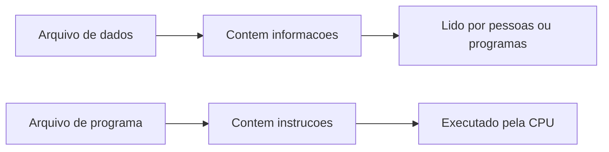
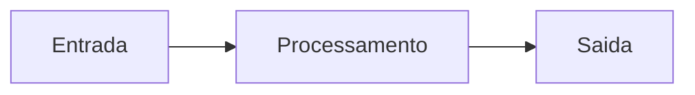
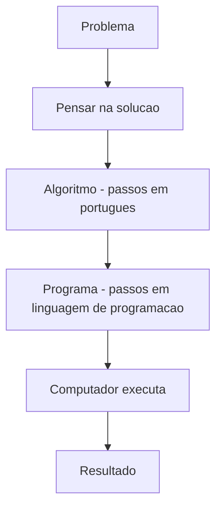
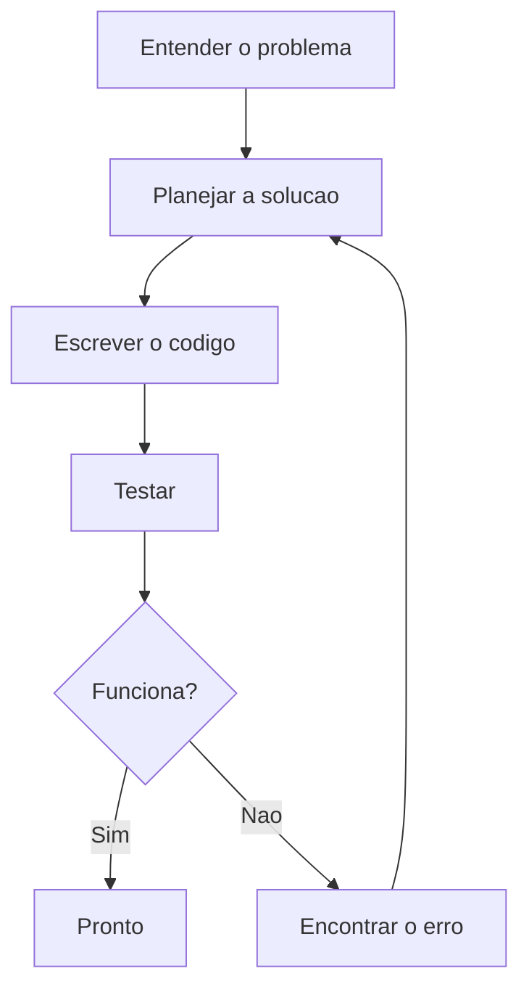
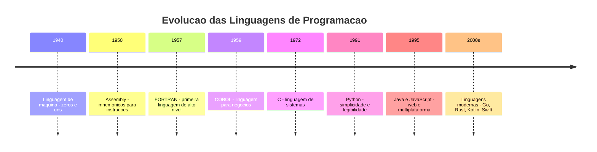
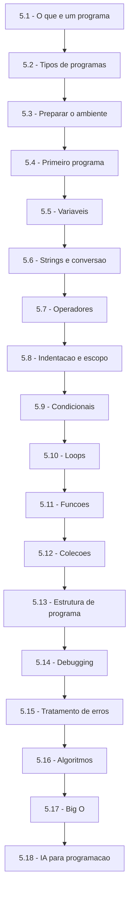

# 5.1 — Introdução à Programação: O que é um Programa?

[← Anterior: Branches, Merges e Pull Requests](cap04-mod04-branches-merges.md) · [Próximo: Tipos de Programas: Scripts, Compilados e Máquinas Virtuais →](cap05-mod02-tipos-programas.md)

---

## Introdução

Nos quatro capítulos anteriores, você construiu uma base sólida. Aprendeu o que é um computador e como ele funciona por dentro — CPU, memória, armazenamento. Entendeu como sistemas operacionais organizam tudo isso. Conheceu o Linux, aprendeu a navegar pelo terminal com confiança, e dominou o Git para versionar seus arquivos como um profissional.

Tudo isso foi preparação. Preparação para este momento.

A partir de agora, você vai aprender a **programar**. Vai escrever instruções que o computador vai executar. Vai criar programas que resolvem problemas reais. Vai pensar de uma forma nova — estruturada, lógica, passo a passo — e essa forma de pensar vai te acompanhar para o resto da sua carreira em tecnologia.

Este é o capítulo mais importante de todo o material. Não porque os anteriores não importem — eles são a fundação. Mas é aqui que a fundação ganha vida. É aqui que você deixa de ser alguém que *entende* computadores e se torna alguém que *comanda* computadores.

Neste primeiro módulo, vamos responder perguntas fundamentais: o que é um programa? O que é programar? O que é um algoritmo? Por que existem linguagens de programação? E por que vamos usar Python?

Não vamos escrever código ainda — isso começa no módulo 5.3. Aqui, o objetivo é construir o entendimento conceitual que vai tornar tudo que vem depois mais claro e mais natural.

Respire fundo. Vamos começar.

---

## O que é um Programa de Computador?

Lá no módulo 1.1, quando falamos sobre o que é um computador, usamos a analogia da cozinha. O computador é como uma cozinha: tem um cozinheiro (a CPU), uma bancada de trabalho (a RAM), uma despensa (o armazenamento) e segue receitas para preparar pratos.

Um **programa** é exatamente isso: uma **receita**. É um conjunto de instruções escritas em uma ordem específica que dizem ao computador o que fazer, passo a passo.

Quando você abre a calculadora do celular e digita `2 + 3`, alguém escreveu um programa que diz ao computador:

1. Mostre uma tela com botões de números e operações
2. Quando o usuário tocar em um botão, registre qual botão foi
3. Quando o usuário tocar no botão "=", faça o cálculo
4. Mostre o resultado na tela

Cada aplicativo que você usa — WhatsApp, Instagram, Netflix, o navegador de internet, o próprio terminal que você aprendeu a usar — é um programa. Alguém sentou, pensou nos passos necessários e escreveu essas instruções em uma linguagem que o computador entende.

### Programas estão em todo lugar

Pare um momento e pense em quantos programas você usou só hoje:

| Ação do dia a dia | Programa por trás |
|-------------------|-------------------|
| Despertador tocou | Aplicativo de relógio — um programa que conta o tempo e dispara um alarme |
| Abriu o celular com digital ou rosto | Programa de biometria — compara sua digital/rosto com o cadastrado |
| Leu mensagens no WhatsApp | Programa de mensagens — recebe, armazena e exibe textos, imagens e áudios |
| Assistiu um vídeo no YouTube | Programa de streaming — busca o vídeo no servidor, transmite e exibe na tela |
| Pesquisou algo no Google | Programa de busca — recebe palavras, procura em bilhões de páginas, ordena por relevância |
| Usou o GPS para ir a algum lugar | Programa de navegação — calcula rotas, monitora posição, recalcula se você errar o caminho |
| Pagou algo com Pix | Programa bancário — válida dados, verifica saldo, transfere valores, registra a transação |

Cada um desses programas foi escrito por equipes de programadores. Alguns são simples (uma calculadora tem poucas centenas de linhas de código). Outros são enormes — o Google Chrome tem mais de 35 milhões de linhas de código. O sistema operacional Linux tem mais de 30 milhões.

Mas todos, sem exceção, começaram da mesma forma: alguém identificou um problema, pensou em como resolvê-lo passo a passo, e escreveu as instruções.

### A diferença entre um programa e um arquivo comum

No capítulo 2, você aprendeu que tudo no Linux é um arquivo. Um documento de texto é um arquivo. Uma foto é um arquivo. Uma música é um arquivo. Um programa também é um arquivo — mas com uma diferença fundamental.

Um documento de texto contém **dados** — informações para serem lidas por pessoas. Uma foto contém **dados** — pixels que formam uma imagem. Uma música contém **dados** — ondas sonoras codificadas digitalmente.

Um programa contém **instruções** — passos que o computador deve executar. Quando você "roda" um programa, o sistema operacional lê essas instruções do arquivo, carrega na memória RAM e pede para a CPU executar uma por uma, na ordem.

Lembra da analogia da cozinha? O documento de texto é como uma lista de compras — contém informações. O programa é como uma receita — contém instruções de o que fazer com as informações.



### O que um programa faz, concretamente?

Todo programa, não importa quão complexo, faz apenas três coisas:

1. **Recebe dados** (entrada) — do teclado, do mouse, de um arquivo, da internet, de um sensor
2. **Processa dados** (processamento) — faz cálculos, compara valores, organiza informações, toma decisões
3. **Produz resultados** (saída) — mostra na tela, salva em arquivo, envia pela internet, acende uma luz

Isso é chamado de modelo **Entrada → Processamento → Saída**, e é a base de toda a computação.



Vamos ver exemplos concretos:

| Programa | Entrada | Processamento | Saída |
|----------|---------|---------------|-------|
| Calculadora | Números e operação | Faz o cálculo | Mostra o resultado |
| Corretor ortográfico | Texto digitado | Compara cada palavra com um dicionário | Sublinha palavras erradas |
| Filtro do Instagram | Foto original | Aplica transformações matemáticas nos pixels | Foto com filtro aplicado |
| Waze/Google Maps | Endereço de destino + posição atual | Calcula a melhor rota considerando trânsito | Mapa com a rota e instruções |
| Spotify | Músicas que você ouviu | Analisa padrões e compara com outros usuários | Playlist personalizada |

Perceba: o Spotify não "gosta" de música. Ele não "sabe" o que é bom. Ele recebe dados (o que você ouviu), processa (compara padrões) e produz uma saída (playlist). É entrada, processamento e saída — como qualquer programa.

---

## O que é um Algoritmo?

Antes de falar sobre linguagens de programação, precisamos falar sobre **algoritmos** — porque todo programa é, no fundo, um algoritmo escrito em uma linguagem que o computador entende.

Um **algoritmo** é uma sequência finita de passos ordenados para resolver um problema ou realizar uma tarefa. A palavra vem do nome do matemático persa **Al-Khwarizmi** (Muhammad ibn Musa al-Khwarizmi), que viveu no século IX em Bagdá e escreveu um dos primeiros livros sobre métodos sistemáticos para resolver equações matemáticas.

A ideia é simples: se você consegue descrever a solução de um problema como uma sequência de passos claros, na ordem certa, você tem um algoritmo.

### Algoritmos no dia a dia

Você usa algoritmos o tempo todo, mesmo sem perceber:

**Algoritmo: Fazer café**

1. Pegue o filtro de café e coloque no suporte
2. Coloque duas colheres de pó de café no filtro
3. Ferva água
4. Despeje a água quente sobre o pó de café
5. Espere a água passar pelo filtro
6. Sirva o café na xícara

**Algoritmo: Atravessar a rua**

1. Pare na calçada
2. Olhe para a esquerda
3. Olhe para a direita
4. Se não houver carros vindo, atravesse
5. Se houver carros vindo, espere e volte ao passo 2

**Algoritmo: Encontrar uma palavra no dicionário**

1. Abra o dicionário no meio
2. Veja a primeira letra das palavras naquela página
3. Se a letra que você procura vem antes no alfabeto, vá para a metade esquerda
4. Se a letra que você procura vem depois no alfabeto, vá para a metade direita
5. Repita até encontrar a página com a letra certa
6. Procure a palavra naquela seção

Esse último exemplo é especialmente interessante — ele descreve um método chamado **busca binária**, que é um dos algoritmos mais importantes da computação. Você vai aprender sobre ele no módulo 5.16. Por enquanto, o que importa é perceber que você já usa esse método intuitivamente quando procura algo em uma lista ordenada.

### Características de um bom algoritmo

Nem toda sequência de passos é um bom algoritmo. Para funcionar bem, um algoritmo precisa ter algumas características:

| Característica | O que significa | Exemplo bom | Exemplo ruim |
|---------------|----------------|-------------|--------------|
| **Finito** | Tem um número definido de passos e termina em algum momento | "Repita 10 vezes" | "Repita para sempre" |
| **Definido** | Cada passo é claro e sem ambiguidade | "Adicione 2 colheres de açúcar" | "Adicione açúcar a gosto" |
| **Ordenado** | Os passos estão na sequência correta | "Ferva a água, depois despeje no café" | "Despeje a água, depois ferva" |
| **Eficaz** | Resolve o problema proposto | Algoritmo de soma que realmente soma | Algoritmo de soma que subtrai |

"Adicione açúcar a gosto" é uma instrução perfeitamente válida para um humano — nós sabemos interpretar. Mas um computador não sabe o que é "a gosto". Ele precisa de instruções exatas: "adicione 2 colheres de açúcar" ou "adicione açúcar até que o nível de doçura medido pelo sensor seja 7".

Essa é uma das lições mais importantes da programação: **o computador faz exatamente o que você manda, não o que você quer**. Se a instrução for ambígua ou errada, o resultado será ambíguo ou errado. O computador não vai "adivinhar" sua intenção.

### De algoritmo para programa

A diferença entre um algoritmo e um programa é a **linguagem**:

- Um **algoritmo** é a lógica, o raciocínio, a sequência de passos. Pode ser escrito em português, desenhado em um fluxograma, ou apenas pensado na sua cabeça.
- Um **programa** é esse mesmo algoritmo escrito em uma **linguagem de programação** — uma linguagem que o computador consegue entender e executar.

Pense assim: o algoritmo é a ideia da receita na sua cabeça. O programa é a receita escrita no papel (ou no arquivo), pronta para ser seguida.



Essa sequência — problema → algoritmo → programa → execução → resultado — é o fluxo fundamental da programação. Todo programador, do iniciante ao mais experiente, segue esse fluxo. A diferença é que, com prática, as etapas intermediárias ficam mais rápidas e naturais.

---

## O que é Programar?

**Programar** é o ato de escrever instruções em uma linguagem de programação para que o computador resolva um problema ou realize uma tarefa.

Mas essa definição técnica esconde algo mais profundo. Programar é, antes de tudo, **resolver problemas**. A linguagem de programação é apenas a ferramenta — assim como um pincel é a ferramenta de um pintor. O que importa de verdade é a capacidade de olhar para um problema, entender o que precisa ser feito, dividir em partes menores e organizar essas partes em uma sequência lógica.

### Programar é pensar antes de escrever

Um erro muito comum de iniciantes é abrir o editor de código e começar a digitar imediatamente. Programadores experientes fazem o oposto: passam mais tempo **pensando** do que **digitando**.

Antes de escrever uma única linha de código, um bom programador:

1. **Entende o problema** — O que exatamente precisa ser resolvido? Quais são os dados de entrada? Qual é o resultado esperado?
2. **Planeja a solução** — Quais são os passos necessários? Em que ordem? Existem casos especiais?
3. **Divide em partes menores** — O problema é grande demais para resolver de uma vez? Quais são as partes independentes?
4. **Testa mentalmente** — Se eu seguir esses passos, o resultado vai ser o esperado? E se a entrada for diferente do esperado?

Só depois de tudo isso é que o programador começa a escrever código. E mesmo assim, escreve um pouco, testa, ajusta, escreve mais um pouco, testa de novo.

Essa forma de pensar — estruturada, lógica, passo a passo — é chamada de **pensamento computacional** ou **pensamento algorítmico**. É a habilidade mais valiosa que você vai desenvolver neste curso. Linguagens de programação mudam, ferramentas mudam, tecnologias mudam — mas a capacidade de pensar logicamente para resolver problemas é permanente.

### O ciclo do programador

Na prática, programar não é um processo linear. É um ciclo:



Perceba que "encontrar o erro" leva de volta ao planejamento, não diretamente ao código. Isso porque, muitas vezes, o erro não está no código em si — está na lógica. O código faz exatamente o que você mandou, mas o que você mandou não era o que você queria.

Programadores profissionais passam uma parte significativa do tempo nesse ciclo. Estima-se que um programador gasta:

- 20% do tempo entendendo o problema
- 30% do tempo planejando e projetando a solução
- 20% do tempo escrevendo código
- 30% do tempo testando e corrigindo erros

Ou seja, escrever código é apenas uma fração do trabalho. A maior parte é pensar, planejar e testar.

---

## O que é uma Linguagem de Programação?

Nós, humanos, nos comunicamos usando idiomas — português, inglês, espanhol, japonês. Cada idioma tem suas regras de gramática, vocabulário e sintaxe. Quando você quer se comunicar com alguém, precisa usar um idioma que ambos entendam.

Com computadores é a mesma coisa. O problema é que computadores "falam" uma linguagem muito diferente da nossa: **linguagem de máquina** — sequências de zeros e uns (0 e 1) que representam instruções para a CPU.

Uma instrução em linguagem de máquina se parece com isso:

```
10110000 01100001
```

Isso diz à CPU: "mova o valor 97 para o registrador AL". Nenhum ser humano consegue (ou quer) programar assim. É impossível de ler, impossível de manter e impossível de entender.

Uma **linguagem de programação** é um meio-termo: uma linguagem com regras claras que nós, humanos, conseguimos ler e escrever, e que pode ser **traduzida** para linguagem de máquina para o computador executar.

### A evolução das linguagens de programação

As linguagens de programação não surgiram prontas. Elas evoluíram ao longo de décadas, cada geração resolvendo problemas da anterior:

**Primeira geração (anos 1940-50): Linguagem de máquina**

Os primeiros programadores escreviam diretamente em binário — zeros e uns. Cada modelo de computador tinha suas próprias instruções. Um programa escrito para um computador não funcionava em outro. Era extremamente trabalhoso e propenso a erros.

**Segunda geração (anos 1950): Assembly**

Para facilitar um pouco, criaram o **Assembly** — uma linguagem onde cada instrução de máquina ganha um nome curto (um "mnemônico"). Em vez de escrever `10110000 01100001`, o programador escrevia `MOV AL, 61h`. Ainda era muito próximo da máquina, mas pelo menos era legível.

**Terceira geração (anos 1950-70): Linguagens de alto nível**

O grande salto veio com linguagens como **FORTRAN** (1957), **COBOL** (1959) e **C** (1972). Essas linguagens permitiam escrever instruções que se pareciam mais com inglês e matemática. Em vez de manipular registradores da CPU, o programador podia escrever coisas como `if (age > 18)` ou `total = price * quantity`.

**Quarta geração (anos 1980-90): Linguagens modernas**

Linguagens como **Python** (1991), **Java** (1995) e **JavaScript** (1995) trouxeram ainda mais abstração. O programador não precisa se preocupar com detalhes da máquina — a linguagem cuida disso. O foco passa a ser a lógica do problema, não os detalhes do hardware.



### Linguagens de alto nível vs baixo nível

Você vai ouvir muito os termos "alto nível" e "baixo nível" quando se fala de linguagens de programação. Esses termos não indicam qualidade — indicam **proximidade com a máquina**:

| Característica | Baixo nível | Alto nível |
|---------------|-------------|------------|
| Proximidade com a máquina | Muito próxima | Distante |
| Facilidade de leitura | Difícil para humanos | Fácil para humanos |
| Controle sobre o hardware | Total | Limitado |
| Velocidade de execução | Muito rápida | Geralmente mais lenta |
| Velocidade de desenvolvimento | Lenta | Rápida |
| Exemplos | Assembly, C | Python, Java, JavaScript |

Uma analogia: linguagem de baixo nível é como dar instruções detalhadas para chegar a um lugar — "vire à esquerda na segunda rua, ande 200 metros, vire à direita no semáforo...". Linguagem de alto nível é como dizer "vá ao shopping" — você não precisa explicar cada curva, porque o motorista (o computador) sabe como chegar.

Python é uma linguagem de **alto nível**. Isso significa que ela esconde os detalhes complicados da máquina e permite que você se concentre no que realmente importa: a lógica do seu programa. É por isso que ela é ideal para quem está começando.

### Por que existem tantas linguagens?

Se todas as linguagens fazem a mesma coisa no final (mandam instruções para a CPU), por que existem centenas delas?

Pela mesma razão que existem diferentes tipos de veículos. Um carro, uma bicicleta, um caminhão e um avião são todos meios de transporte — mas cada um é melhor para uma situação diferente. Você não usa um caminhão para ir à padaria, nem uma bicicleta para transportar 20 toneladas de carga.

Com linguagens de programação é igual:

| Linguagem | Melhor para | Por quê |
|-----------|-------------|---------|
| **Python** | Automação, ciência de dados, IA, aprendizado | Sintaxe simples, muitas bibliotecas, fácil de aprender |
| **JavaScript** | Sites e aplicações web | Roda no navegador, é a linguagem da web |
| **Java** | Sistemas empresariais, Android | Robusta, multiplataforma, muito usada em grandes empresas |
| **C** | Sistemas operacionais, drivers, jogos | Controle total sobre a memória, muito rápida |
| **C#** | Jogos (Unity), aplicações Windows, sistemas empresariais | Orientada a objetos, integrada com .NET |
| **Go** | Servidores, microsserviços, ferramentas de infraestrutura | Simples, rápida, excelente para concorrência |
| **Rust** | Sistemas de alta performance, segurança | Segurança de memória sem garbage collector |
| **SQL** | Bancos de dados | Feita especificamente para consultar e manipular dados |

Neste curso, vamos usar três linguagens: **Python** (capítulo 5 — lógica de programação), **C** (capítulo 7 — estruturas de dados e memória) e **C#** (capítulo 9 — orientação a objetos). Cada uma foi escolhida porque é a melhor ferramenta para ensinar aquele conceito específico.

---

## Por que Python?

De todas as linguagens disponíveis, por que escolhemos Python para começar?

### A história do Python

Python foi criado por **Guido van Rossum**, um programador holandês, no final dos anos 1980. A primeira versão pública foi lançada em **1991** — o que faz do Python uma linguagem com mais de 30 anos de história.

O nome "Python" não vem da cobra — vem do grupo de comédia britânico **Monty Python's Flying Circus**, do qual Guido era fã. Ele queria um nome curto, único e um pouco divertido para a linguagem.

Guido liderou o desenvolvimento do Python por quase 30 anos e era carinhosamente chamado de **BDFL** — *Benevolent Dictator For Life* (Ditador Benevolente Vitalício) — porque ele tinha a palavra final sobre as decisões da linguagem. Em 2018, ele se aposentou desse papel, e hoje o Python é mantido pela **Python Software Foundation (PSF)** e por uma comunidade global de milhares de desenvolvedores.

A filosofia que guiou a criação do Python pode ser resumida em uma frase: **"Deve haver uma — e preferencialmente apenas uma — maneira óbvia de fazer algo."** Isso significa que Python valoriza clareza e simplicidade acima de tudo. Quando você lê código Python bem escrito, ele quase parece inglês.

### O Zen of Python

Python tem uma filosofia de design documentada chamada **Zen of Python**. Você pode vê-la digitando `python3 -c "import this"` no terminal (vamos fazer isso no módulo 5.3). Os princípios mais importantes são:

| Princípio em inglês | Tradução | O que significa na prática |
|---------------------|----------|---------------------------|
| Beautiful is better than ugly | Bonito é melhor que feio | Escreva código limpo e organizado |
| Simple is better than complex | Simples é melhor que complexo | Prefira a solução mais simples que funcione |
| Readability counts | Legibilidade conta | Código é lido muito mais vezes do que é escrito |
| Explicit is better than implicit | Explícito é melhor que implícito | Deixe claro o que o código faz |
| Errors should never pass silently | Erros nunca devem passar em silêncio | Trate os erros, não os ignore |
| Now is better than never | Agora é melhor que nunca | Comece, mesmo que não esteja perfeito |

Esses princípios vão guiar você ao longo de todo o curso. Quando estiver em dúvida sobre como escrever algo, pergunte-se: "está simples? Está legível? Está explícito?"

### Por que Python é ideal para iniciantes?

Existem razões concretas pelas quais Python é considerada uma das melhores linguagens para quem está começando:

**1. Sintaxe limpa e legível**

Compare como a mesma instrução é escrita em diferentes linguagens:

Python:
```
if age >= 18:
    print("Maior de idade")
```

Java:
```
if (age >= 18) {
    System.out.println("Maior de idade");
}
```

C:
```
if (age >= 18) {
    printf("Maior de idade\n");
}
```

Perceba como Python é mais limpo: sem chaves `{}`, sem ponto e vírgula `;`, sem `System.out.println`. A indentação (os espaços no início da linha) é o que define os blocos de código — isso força o programador a escrever código organizado.

**2. Feedback imediato**

Python permite que você escreva uma linha de código e veja o resultado instantaneamente. Isso é fundamental para quem está aprendendo — você testa, vê o que acontece, ajusta e testa de novo. Esse ciclo rápido de experimentação acelera muito o aprendizado.

**3. Comunidade acolhedora**

A comunidade Python é conhecida mundialmente por ser receptiva com iniciantes. Existem milhares de tutoriais, fóruns, grupos de ajuda e conferências (como a **PyCon**) em português e inglês. Quando você tiver uma dúvida, vai encontrar ajuda facilmente.

**4. Versatilidade**

Python é usada em praticamente todas as áreas da tecnologia:

| Área | Como Python é usado | Empresas que usam |
|------|---------------------|-------------------|
| Ciência de dados | Análise de dados, visualizações, estatística | Netflix, Spotify, Airbnb |
| Inteligência artificial | Machine learning, deep learning, NLP | Google, OpenAI, Tesla |
| Automação | Scripts para tarefas repetitivas | Empresas de todos os tamanhos |
| Desenvolvimento web | APIs, backends, sistemas web | Instagram, Pinterest, Dropbox |
| DevOps | Ferramentas de infraestrutura, CI/CD | Amazon, Red Hat, Ansible |
| Educação | Ensino de programação | Universidades no mundo inteiro |

Isso significa que o que você aprende aqui não é descartável — é uma base que pode te levar para qualquer direção na tecnologia.

**5. Gratuita e de código aberto**

Python é completamente gratuita. Qualquer pessoa pode baixar, usar, modificar e distribuir. O código-fonte da própria linguagem é público — qualquer pessoa pode ver como Python funciona por dentro e até contribuir com melhorias.

### Python 2 vs Python 3

Existem duas versões principais do Python:

- **Python 2** — versão antiga, oficialmente descontinuada em 1 de janeiro de 2020. Não recebe mais atualizações de segurança.
- **Python 3** — versão atual, que usamos neste curso. Recebe atualizações regulares.

**Sempre use Python 3.** Se você encontrar tutoriais na internet que usam `print "texto"` (sem parênteses), eles são de Python 2 e podem não funcionar. No Python 3, o correto é `print("texto")` (com parênteses).

No módulo 5.3, vamos instalar o Python 3 e verificar a versão no seu computador.

---

## Como o Computador Entende um Programa?

Você já sabe que o computador só entende linguagem de máquina — zeros e uns. Então como ele entende um programa escrito em Python, que usa palavras em inglês como `print`, `if`, `for`?

A resposta é: **tradução**. Alguém precisa traduzir o código que você escreve (em Python, Java, C, etc.) para linguagem de máquina. Existem duas formas principais de fazer essa tradução:

### Compilação

Um **compilador** é um programa que lê todo o seu código de uma vez, traduz para linguagem de máquina e gera um arquivo executável. Depois disso, você pode rodar o executável quantas vezes quiser sem precisar do compilador novamente.

É como traduzir um livro inteiro de português para inglês: o tradutor lê o livro todo, traduz, e entrega o livro traduzido. Depois, qualquer pessoa pode ler o livro em inglês sem precisar do tradutor.

Linguagens compiladas: **C**, **C++**, **Go**, **Rust**.

### Interpretação

Um **interpretador** é um programa que lê seu código linha por linha, traduz cada linha para linguagem de máquina e executa imediatamente. Não gera um arquivo executável separado — toda vez que você quer rodar o programa, o interpretador precisa estar presente.

É como ter um intérprete simultâneo em uma reunião: ele ouve cada frase, traduz na hora e fala a tradução. Se a reunião acontecer de novo, o intérprete precisa estar lá novamente.

Linguagens interpretadas: **Python**, **JavaScript**, **Ruby**.

### Comparação

| Aspecto | Compilação | Interpretação |
|---------|-----------|---------------|
| Quando traduz | Antes de executar (tudo de uma vez) | Durante a execução (linha por linha) |
| Velocidade de execução | Mais rápida (já está traduzido) | Mais lenta (traduz a cada execução) |
| Detecção de erros | Antes de executar (o compilador avisa) | Durante a execução (só descobre quando chega na linha com erro) |
| Arquivo gerado | Executável independente | Nenhum (precisa do interpretador) |
| Exemplos | C, Go, Rust | Python, JavaScript, Ruby |

Python é uma linguagem **interpretada**. Isso significa que, quando você escreve um programa em Python e manda executar, o interpretador Python lê seu código linha por linha, traduz e executa na hora. Se houver um erro na linha 50, o programa vai rodar normalmente até a linha 49 e só vai parar quando chegar na linha 50.

No módulo 5.2, vamos aprofundar esse tema e entender as nuances — porque na prática, Python usa uma combinação de compilação e interpretação (compila para um código intermediário chamado *bytecode* antes de interpretar). Mas por enquanto, o importante é entender o conceito geral.

---

## Lógica de Programação: A Habilidade Mais Importante

De tudo que você vai aprender neste curso, **lógica de programação** é a habilidade mais valiosa. Mais valiosa que saber Python. Mais valiosa que saber qualquer linguagem específica.

Por quê? Porque linguagens mudam. Python pode ser substituída por outra linguagem daqui a 10 anos. Ferramentas mudam. Frameworks mudam. Mas a capacidade de pensar logicamente para resolver problemas é **permanente**.

### O que é lógica de programação?

Lógica de programação é a habilidade de:

1. **Decompor** um problema grande em problemas menores
2. **Sequenciar** os passos na ordem correta
3. **Decidir** o que fazer em cada situação (se isso, faça aquilo; senão, faça outra coisa)
4. **Repetir** ações quando necessário (faça isso 10 vezes; faça isso enquanto houver itens)
5. **Abstrair** padrões que se repetem (toda vez que preciso fazer X, uso esta receita)

Essas cinco habilidades — decomposição, sequenciamento, decisão, repetição e abstração — são os pilares do pensamento computacional. Tudo que você vai aprender nos próximos módulos é uma forma de exercitar essas habilidades.

### Exemplo: Decompondo um problema real

Imagine que você precisa criar um programa que calcula a média das notas de uma turma de alunos. Como um programador pensaria nisso?

**Passo 1 — Decompor o problema:**
- Preciso receber as notas dos alunos (entrada)
- Preciso somar todas as notas (processamento)
- Preciso dividir a soma pela quantidade de alunos (processamento)
- Preciso mostrar o resultado (saída)

**Passo 2 — Pensar nos detalhes:**
- Quantos alunos são? O programa precisa perguntar, ou é um número fixo?
- E se alguém digitar algo que não é um número? O programa precisa tratar esse erro?
- E se a turma tiver zero alunos? Dividir por zero dá erro!

**Passo 3 — Organizar em sequência:**
1. Perguntar quantos alunos tem na turma
2. Para cada aluno, perguntar a nota
3. Somar todas as notas
4. Dividir a soma pela quantidade de alunos
5. Mostrar a média

Perceba como o problema "calcular a média" foi decomposto em passos simples e claros. Cada passo é algo que o computador sabe fazer. A arte da programação está em **conectar esses passos na ordem certa**.

### Os quatro pilares da lógica de programação

Ao longo dos próximos módulos, você vai aprender quatro conceitos fundamentais que formam a base de toda a programação:

| Pilar | O que é | Módulo |
|-------|---------|--------|
| **Variáveis** | Guardar informações na memória para usar depois | 5.5 |
| **Condicionais** | Tomar decisões — "se isso acontecer, faça aquilo" | 5.9 |
| **Loops** | Repetir ações — "faça isso enquanto houver itens" | 5.10 |
| **Funções** | Organizar código em blocos reutilizáveis | 5.11 |

Com apenas esses quatro conceitos, você consegue resolver uma quantidade enorme de problemas. Todo programa, por mais complexo que seja, é construído combinando variáveis, condicionais, loops e funções.

O Google? Variáveis, condicionais, loops e funções. O Instagram? Variáveis, condicionais, loops e funções. O sistema de controle de um avião? Variáveis, condicionais, loops e funções. A complexidade vem da **combinação** desses elementos, não de elementos novos.

---

## O que Você Vai Construir Neste Capítulo

Ao longo dos 18 módulos deste capítulo, você vai partir do zero e chegar a um ponto onde consegue criar programas completos e funcionais. Aqui está o caminho:

| Fase | Módulos | O que você aprende |
|------|---------|-------------------|
| Fundamentos | 5.1 a 5.3 | O que é programação, como funciona, como preparar o ambiente |
| Primeiros passos | 5.4 a 5.6 | Mostrar mensagens, receber dados, guardar informações, trabalhar com texto |
| Lógica | 5.7 a 5.10 | Fazer cálculos, tomar decisões, repetir ações |
| Organização | 5.11 a 5.13 | Organizar código em funções, trabalhar com coleções de dados, estruturar programas |
| Robustez | 5.14 a 5.15 | Encontrar erros, tratar exceções, escrever código confiável |
| Pensamento avançado | 5.16 a 5.18 | Resolver problemas com algoritmos, entender eficiência, usar IA como ferramenta |

No final do capítulo, você vai construir um **projeto prático completo**: um sistema de cadastro com interface no terminal que permite criar, listar, buscar, editar e remover itens — tudo usando os conceitos que aprendeu. Esse projeto vai ser a prova de que você sabe programar.

---

## Qualquer Pessoa Pode Aprender a Programar

Se você chegou até aqui — leu sobre computadores, aprendeu Linux, dominou o terminal, usou Git — você já provou que consegue aprender coisas novas e complexas. Programar é mais uma dessas coisas.

Existe um mito de que programar exige ser um gênio da matemática, ter nascido com algum talento especial ou ser "bom com computadores" desde criança. Nada disso é verdade.

### O que programar realmente exige

| O que as pessoas acham | O que realmente é necessário |
|------------------------|------------------------------|
| Ser gênio da matemática | Saber as 4 operações básicas (para começar) |
| Ter nascido com talento | Ter curiosidade e disposição para aprender |
| Saber inglês fluente | Conhecer algumas palavras-chave (vamos ensinar todas) |
| Ter computador potente | Qualquer computador que rode Linux e Python |
| Ser jovem | Pessoas de 15 a 70 anos aprendem a programar todos os dias |
| Nunca errar | Errar é a principal forma de aprender |

### Errar faz parte do processo

Isso merece destaque porque é uma das maiores barreiras para iniciantes: o medo de errar.

Programadores profissionais — pessoas que ganham a vida escrevendo código — erram **dezenas de vezes por dia**. Eles escrevem código que não funciona, encontram o erro, corrigem e seguem em frente. Isso não é falha — é o processo normal de desenvolvimento.

Quando seu programa der erro (e vai dar, muitas vezes), não se frustre. Leia a mensagem de erro com calma. Tente entender o que ela está dizendo. Volte ao código e procure o problema. Cada erro que você encontra e corrige é um aprendizado que fica.

Os melhores programadores não são os que nunca erram — são os que aprenderam a encontrar e corrigir erros rapidamente.

### A jornada de aprendizado

Aprender a programar é como aprender a tocar um instrumento musical. No início, tudo parece difícil e desajeitado. Você precisa pensar em cada nota, cada acorde, cada movimento dos dedos. Mas com prática, os movimentos se tornam naturais. Você para de pensar "preciso colocar o dedo aqui" e começa a simplesmente tocar.

Com programação é igual. No início, você vai precisar pensar em cada linha, consultar referências, reler explicações. Isso é completamente normal. Com o tempo, escrever código vai se tornar tão natural quanto escrever um texto.

A chave é **consistência**. Um pouco de prática por dia é muito mais eficaz do que muitas horas de uma vez. Seu cérebro precisa de tempo para absorver e consolidar os conceitos. Não tenha pressa — cada pessoa tem seu ritmo, e todos os ritmos são válidos.

---

## A Importância da Prática

Programação não se aprende apenas lendo — se aprende **fazendo**. Você pode ler todos os livros sobre natação do mundo, mas só vai aprender a nadar quando entrar na água.

A partir do módulo 5.3, quando prepararmos o ambiente, cada módulo vai ter exemplos de código para você executar e exercícios para praticar. A recomendação é:

1. **Leia o módulo** — entenda o conceito antes de ver o código
2. **Execute os exemplos** — copie, cole, rode e observe o resultado
3. **Modifique os exemplos** — mude valores, adicione linhas, veja o que acontece
4. **Faça os exercícios** — tente resolver sozinho antes de ver a solução
5. **Experimente** — crie seus próprios programas, mesmo que simples

O passo 3 é especialmente importante. Quando você modifica um exemplo e vê o que muda no resultado, está construindo um modelo mental de como o código funciona. Esse modelo mental é o que vai permitir que você escreva código original no futuro.

### O ambiente de prática

No módulo 5.3, vamos preparar seu ambiente de desenvolvimento:

- **Python 3** instalado no seu Linux
- **VSCode** configurado para escrever código Python
- **Terminal** pronto para executar seus programas

Se você seguiu os capítulos anteriores, já tem o Linux e o terminal funcionando. Falta apenas instalar o Python e configurar o editor — e vamos fazer isso juntos, passo a passo.

---

## O Caminho à Frente: Do Conceito ao Código

Vamos recapitular o que você aprendeu neste módulo e conectar com o que vem pela frente:



Cada módulo constrói sobre o anterior. Não pule nenhum. Se algo parecer difícil, releia, pratique mais e peça ajuda. Lembre-se: todo programador já esteve exatamente onde você está agora.

---

## Casos de Uso no Mundo Real

Programas estão por trás de praticamente tudo que funciona no mundo moderno. Vamos ver três exemplos concretos de como os conceitos deste módulo — entrada, processamento e saída — se aplicam em sistemas reais.

### 1. Sistema de caixa de supermercado

Quando você vai ao supermercado e passa os produtos no caixa, existe um programa rodando ali:

- **Entrada**: o leitor de código de barras envia o código do produto para o programa
- **Processamento**: o programa busca o código em um banco de dados, encontra o nome e o preço do produto, soma ao total da compra
- **Saída**: o programa mostra na tela o nome do produto, o preço e o total acumulado

Quando o operador finaliza a compra, o programa calcula o total, aplica descontos se houver, processa o pagamento (cartão, Pix, dinheiro) e imprime o cupom fiscal. Tudo isso é entrada → processamento → saída, repetido para cada produto.

Esse programa precisa ser rápido (ninguém quer esperar 10 segundos por produto), confiável (não pode errar o preço) e rodar o dia inteiro sem parar. Milhões de supermercados no mundo usam programas assim — e todos foram escritos por programadores.

### 2. Recomendação de filmes na Netflix

Quando você abre a Netflix e vê sugestões de filmes "para você", existe um programa complexo por trás:

- **Entrada**: seu histórico de filmes assistidos, suas avaliações, quanto tempo você assistiu cada filme, em que horário, o histórico de milhões de outros usuários
- **Processamento**: algoritmos de inteligência artificial comparam seus padrões com os de outros usuários semelhantes, identificam filmes que pessoas com gostos parecidos gostaram e que você ainda não viu
- **Saída**: uma lista personalizada de recomendações, organizada por relevância

O conceito é o mesmo de qualquer programa: entrada, processamento, saída. A diferença é a complexidade do processamento — mas a estrutura fundamental é idêntica à de uma calculadora.

### 3. Semáforo inteligente

Em cidades grandes, muitos semáforos são controlados por programas:

- **Entrada**: sensores no asfalto detectam quantos carros estão esperando em cada direção; câmeras identificam o fluxo de pedestres; relógio interno sabe o horário
- **Processamento**: o programa decide quanto tempo cada sinal deve ficar verde, baseado no volume de tráfego. Em horário de pico, a via principal fica verde por mais tempo. De madrugada, o semáforo pode ficar piscando amarelo.
- **Saída**: o programa muda as luzes do semáforo (verde, amarelo, vermelho) e, em alguns casos, exibe contagem regressiva para pedestres

Um semáforo "burro" (sem programa) simplesmente alterna as luzes em intervalos fixos. Um semáforo "inteligente" (com programa) adapta os intervalos ao tráfego real. A diferença entre os dois é um programa — um conjunto de instruções que recebe dados, processa e produz resultados.

---

## Como a IA pode te ajudar aqui

Inteligência Artificial é uma ferramenta poderosa para aprender programação. Aqui estão algumas formas de usar IA para aprofundar os conceitos deste módulo:

**Prompt 1 — Explorar o conceito:**
> "Me explique, passo a passo, o algoritmo que um caixa eletrônico usa quando alguém quer sacar dinheiro. Quais são as entradas, o processamento e as saídas?"

**Prompt 2 — Comparar alternativas:**
> "Compare Python, Java e C para um iniciante. Quais são as vantagens e desvantagens de cada uma? Mostre o mesmo programa simples escrito nas três linguagens."

**Prompt 3 — Entender erros comuns:**
> "Me conte a história de como Guido van Rossum criou o Python. O que o motivou? Quais problemas das linguagens existentes ele queria resolver?"

Lembre-se: a IA é uma parceira de aprendizado, não um substituto. Use-a para tirar dúvidas, pedir explicações alternativas e explorar temas que despertaram sua curiosidade. Mas sempre tente entender o conceito por conta própria primeiro.

---

## Resumo do Módulo

| Conceito | Definição |
|----------|-----------|
| Programa | Conjunto de instruções que dizem ao computador o que fazer, passo a passo |
| Algoritmo | Sequência finita de passos ordenados para resolver um problema |
| Programar | Escrever instruções em uma linguagem de programação para resolver problemas |
| Linguagem de programação | Linguagem com regras claras que humanos escrevem e que pode ser traduzida para linguagem de máquina |
| Linguagem de máquina | Sequências de zeros e uns que a CPU entende diretamente |
| Compilação | Traduzir todo o código de uma vez para linguagem de máquina, gerando um executável |
| Interpretação | Traduzir e executar o código linha por linha, sem gerar executável |
| Entrada, Processamento, Saída | O modelo fundamental de todo programa: receber dados, processar e produzir resultados |
| Lógica de programação | Habilidade de pensar de forma estruturada para resolver problemas com código |
| Pensamento computacional | Forma de raciocínio que envolve decomposição, sequenciamento, decisão, repetição e abstração |
| Python | Linguagem de programação de alto nível, criada por Guido van Rossum em 1991 |
| Zen of Python | Filosofia de design do Python que valoriza simplicidade, legibilidade e clareza |

---

## Glossário do Módulo

| Termo | Definição |
|-------|-----------|
| Algoritmo | Sequência finita de passos ordenados para resolver um problema. Do nome do matemático Al-Khwarizmi |
| Alto nível (high-level) | Linguagem de programação distante da máquina, mais fácil para humanos lerem e escreverem |
| Assembly | Linguagem de programação de segunda geração que usa mnemônicos para representar instruções de máquina |
| Baixo nível (low-level) | Linguagem de programação próxima da máquina, com controle direto sobre o hardware |
| BDFL | Benevolent Dictator For Life — título dado a Guido van Rossum como líder do Python |
| Bytecode | Código intermediário gerado pelo Python antes da interpretação final |
| Código aberto (open source) | Software cujo código-fonte é público e pode ser usado, modificado e distribuído por qualquer pessoa |
| Código-fonte (source code) | O texto do programa escrito pelo programador, antes de ser traduzido para linguagem de máquina |
| Compilador (compiler) | Programa que traduz todo o código-fonte de uma vez para linguagem de máquina |
| Decomposição | Dividir um problema grande em problemas menores e mais gerenciáveis |
| Entrada (input) | Dados que o programa recebe para processar — do teclado, arquivo, internet, sensor, etc. |
| Executável | Arquivo que contém instruções em linguagem de máquina, pronto para ser rodado pelo sistema operacional |
| Instrução | Um comando individual que o computador executa |
| Interpretador (interpreter) | Programa que traduz e executa o código-fonte linha por linha |
| Linguagem de máquina (machine language) | Sequências de zeros e uns que a CPU entende e executa diretamente |
| Linguagem de programação (programming language) | Sistema formal de comunicação com computadores, com regras de sintaxe e semântica definidas |
| Lógica de programação | Habilidade de pensar de forma estruturada e sequencial para resolver problemas computacionais |
| Pensamento computacional (computational thinking) | Forma de raciocínio que envolve decomposição, abstração, reconhecimento de padrões e algoritmos |
| Processamento (processing) | Etapa em que o programa manipula, calcula ou transforma os dados de entrada |
| Programa (program) | Conjunto de instruções escritas em uma linguagem de programação que o computador executa |
| PSF | Python Software Foundation — organização que mantém e desenvolve o Python |
| Python | Linguagem de programação de alto nível criada por Guido van Rossum em 1991 |
| Saída (output) | Resultado produzido pelo programa — exibido na tela, salvo em arquivo, enviado pela rede, etc. |
| Sintaxe (syntax) | Regras que definem como o código deve ser escrito em uma linguagem de programação |
| Zen of Python | Conjunto de princípios filosóficos que guiam o design da linguagem Python |

---

## Na Cultura Popular

- **Piratas do Vale do Silício** (filme, 1999) — conta a história de Steve Jobs e Bill Gates e como os primeiros computadores pessoais e programas comerciais nasceram. Mostra que programar era uma atividade de garagem, feita por jovens curiosos que queriam resolver problemas — exatamente o espírito que queremos cultivar aqui.

- **O Jogo da Imitação** (filme, 2014) — mostra Alan Turing criando uma das primeiras máquinas programáveis para quebrar códigos nazistas na Segunda Guerra Mundial. Turing é considerado o pai da computação, e o filme ilustra como um algoritmo (uma sequência de passos lógicos) pode resolver problemas que parecem impossíveis.

- **Halt and Catch Fire** (série, 2014-2017) — acompanha engenheiros e programadores dos anos 1980 e 1990 construindo computadores pessoais, sistemas operacionais e a internet. Mostra o dia a dia de quem programa: resolver problemas, lidar com erros, trabalhar em equipe e criar coisas que não existiam antes.

---

## Para Saber Mais

- [Documentação Oficial Python em Português](https://docs.python.org/pt-br/3/) — *Referência completa da linguagem Python, traduzida para português*
- [W3Schools — Python Introduction](https://www.w3schools.com/python/python_intro.asp) — *Tutorial interativo e acessível sobre Python para iniciantes*
- [Python.org — About Python](https://www.python.org/about/) — *Página oficial sobre a linguagem, sua história e filosofia (em inglês)*
- [GitHub do Fino — learn-ops-content](https://github.com/RafaelFino/learn-ops-content) — *Material de referência do Fino sobre operações e desenvolvimento*
- [Khan Academy — Introdução a Algoritmos](https://pt.khanacademy.org/computing/computer-science/algorithms) — *Curso gratuito sobre algoritmos com explicações visuais e interativas*

---

## Perguntas Frequentes (FAQ)

**P: Preciso saber matemática para programar?**
R: Para começar, você só precisa das quatro operações básicas — soma, subtração, multiplicação e divisão. Ao longo do curso, quando algum conceito matemático for necessário (como porcentagem ou potência), ele será explicado com calma e com exemplos concretos. Programar usa muito mais lógica do que matemática.

**P: Preciso saber inglês?**
R: Não precisa ser fluente. As linguagens de programação usam palavras em inglês (como `print`, `if`, `for`), mas são poucas palavras e vamos traduzir e explicar cada uma. Com o tempo, você vai memorizar naturalmente. Todo código no curso tem comentários em português explicando cada linha.

**P: Programar é difícil?**
R: Programar tem seus desafios, como qualquer habilidade nova. No início, tudo parece estranho e confuso — isso é completamente normal. Com prática e paciência, os conceitos vão se encaixando. Pense em quando você aprendeu a andar de bicicleta: no início parecia impossível, mas hoje é automático.

**P: Quanto tempo leva para aprender a programar?**
R: Depende do seu ritmo, e cada pessoa tem o seu. O importante é estudar com consistência — um pouco por dia é melhor do que muito de uma vez. Não existe pressa. Alguns conceitos vão fazer sentido imediatamente; outros vão precisar de mais tempo e prática.

**P: E se eu não entender algo de primeira?**
R: Isso é completamente normal — até programadores experientes precisam reler conceitos e documentação. Releia o módulo, consulte o glossário, tente os exercícios de novo. Se ainda não entender, peça ajuda. Não existe pergunta boba.

**P: Sou muito velho/nova para aprender a programar?**
R: Não existe idade certa. Pessoas de 15 a 70 anos aprendem a programar todos os dias ao redor do mundo. O que importa é a vontade de aprender e a disposição para praticar.

**P: Python é a melhor linguagem para começar?**
R: Python é uma das melhores opções para iniciantes por sua sintaxe simples e legível. Mas não existe "a melhor" linguagem — cada uma tem seus pontos fortes. O importante é começar com alguma e aprender os conceitos fundamentais de lógica. Esses conceitos se aplicam a qualquer linguagem.

**P: Vou conseguir emprego depois de aprender Python?**
R: Este material dá uma base sólida em lógica de programação e Python. Para o mercado de trabalho, você vai precisar continuar estudando e praticando, mas esta é uma excelente fundação. Desenvolvedores Python são muito procurados em áreas como ciência de dados, automação e desenvolvimento web.

**P: O que acontece se eu pular um módulo?**
R: Cada módulo depende dos anteriores. Pular um módulo é como pular um degrau da escada — você pode tropeçar nos seguintes. Siga a ordem recomendada. Se um módulo parecer fácil demais, ótimo — passe mais rápido, mas não pule.

**P: Posso usar IA (ChatGPT, etc.) para me ajudar a aprender?**
R: Sim, e incentivamos isso. Cada módulo tem uma seção "Como a IA pode te ajudar aqui" com sugestões de prompts. Use IA para tirar dúvidas, pedir explicações alternativas e explorar temas. Mas sempre tente entender o conceito por conta própria primeiro — a IA é parceira, não substituta.

**P: Qual a diferença entre programar e codar?**
R: Na prática, são sinônimos. "Programar" é o termo mais formal. "Codar" (do inglês *to code*) é mais informal e muito usado no dia a dia. Ambos significam escrever código em uma linguagem de programação.

**P: Preciso decorar todos os comandos?**
R: Não. Programadores profissionais consultam documentação e referências o tempo todo — é parte normal do trabalho. O importante é entender os conceitos. Os comandos específicos você pode consultar no glossário ou na documentação quando precisar.

**P: E se eu errar muito?**
R: Errar é a melhor forma de aprender. Cada erro é uma oportunidade de entender melhor como as coisas funcionam. Programadores profissionais erram dezenas de vezes por dia — a diferença é que eles aprenderam a encontrar e corrigir erros rapidamente. Você vai desenvolver essa habilidade também.

**P: Posso fazer os exercícios em grupo?**
R: Sim, estudar em grupo pode ser muito produtivo. Mas tente resolver cada exercício sozinho primeiro, e depois compare com os colegas. Explicar sua solução para outra pessoa é uma das melhores formas de consolidar o aprendizado.

**P: O que é um "bug"?**
R: Bug é o nome que damos a um erro no programa. A palavra vem do inglês e significa "inseto". A história mais famosa é de 1947, quando a engenheira Grace Hopper encontrou uma mariposa presa dentro do computador Harvard Mark II, causando mau funcionamento. Ela colou o inseto no relatório com a anotação "First actual case of bug being found" (primeiro caso real de bug encontrado). Desde então, erros em programas são chamados de bugs, e o processo de encontrá-los e corrigi-los é chamado de **debugging** (que vamos aprender no módulo 5.14).

---

## Exercícios Práticos

### Exercício 1 — Algoritmo do dia a dia

Escolha uma atividade que você faz todos os dias (escovar os dentes, fazer um lanche, tomar banho) e escreva o algoritmo completo — a sequência de passos, na ordem correta, com detalhes suficientes para que outra pessoa consiga executar sem perguntar nada.

Dica: tente ser o mais específico possível. "Pegue a escova" é melhor que "prepare-se". Lembre-se: o computador não adivinha — ele precisa de instruções exatas.

Depois de escrever, releia e pergunte-se: "Se alguém seguir esses passos exatamente como estão, vai conseguir completar a tarefa?" Se a resposta for não, refine os passos.

### Exercício 2 — Entrada, Processamento e Saída

Para cada um dos programas abaixo, identifique a entrada, o processamento e a saída:

1. Um programa que converte temperatura de Celsius para Fahrenheit
2. Um programa que conta quantas palavras tem em um texto
3. Um programa que calcula o troco de uma compra
4. Um programa que verifica se uma senha digitada está correta
5. Um programa que organiza uma lista de nomes em ordem alfabética

Escreva suas respostas em uma tabela com três colunas: Entrada | Processamento | Saída.

### Exercício 3 — Pesquisa sobre Python

Pesquise na internet e responda:

1. Em que ano Python 3 foi lançado?
2. Qual é a versão mais recente do Python disponível hoje?
3. Cite três empresas grandes que usam Python em seus sistemas
4. O que é a PyCon? Existe PyCon no Brasil?
5. Quem é Grace Hopper e qual sua contribuição para a programação?

Dica: use os links da seção "Para Saber Mais" como ponto de partida. Se quiser, use uma IA para ajudar na pesquisa — mas escreva as respostas com suas próprias palavras.

---

[← Anterior: Branches, Merges e Pull Requests](cap04-mod04-branches-merges.md) · [Próximo: Tipos de Programas: Scripts, Compilados e Máquinas Virtuais →](cap05-mod02-tipos-programas.md)
