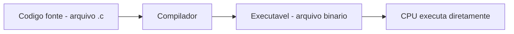
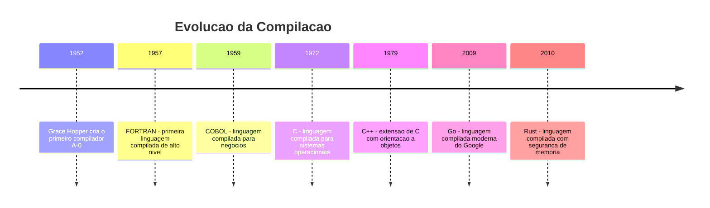
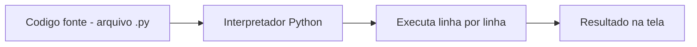
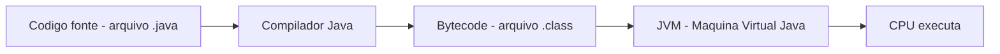
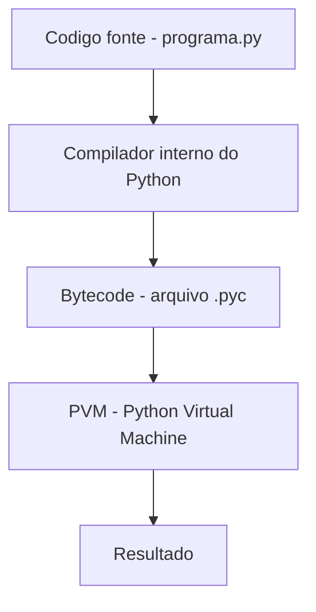
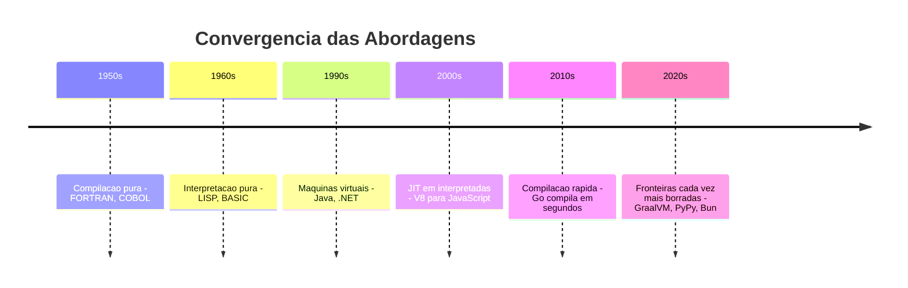

# 5.2 — Tipos de Programas: Scripts, Compilados e Máquinas Virtuais

[← Anterior: Introdução à Programação: O que é um Programa?](cap05-mod01-intro-programacao.md) · [Próximo: Preparando o Ambiente: Python e VSCode →](cap05-mod03-ambiente-python.md)

---

## Introdução

No módulo anterior, você aprendeu que um programa é um conjunto de instruções que dizem ao computador o que fazer. Vimos que essas instruções são escritas em linguagens de programação — como Python, Java ou C — porque nós, humanos, não conseguimos (e não queremos) escrever diretamente em linguagem de máquina (zeros e uns).

Mas ficou uma pergunta no ar: **como exatamente o computador transforma o código que você escreve em algo que ele consegue executar?**

Essa pergunta é mais importante do que parece. A forma como um programa é transformado em instruções para a CPU define muitas coisas: a velocidade de execução, a facilidade de desenvolvimento, onde o programa pode rodar e como você trabalha no dia a dia. Entender isso vai te ajudar a compreender por que Python funciona do jeito que funciona — e por que, no capítulo 7, vamos usar C para aprender outros conceitos.

Neste módulo, vamos explorar as três formas principais de executar programas: compilação, interpretação e máquinas virtuais. Vamos entender o problema que cada abordagem resolve, como surgiram historicamente e onde cada uma é usada no mundo real.

---

## O Problema Fundamental: A Barreira da Linguagem

Imagine a seguinte situação: você escreveu uma carta em português e precisa enviá-la para três pessoas — uma que fala japonês, uma que fala árabe e uma que fala russo. Nenhuma delas entende português. O que você faz?

Você tem basicamente três estratégias:

**Estratégia 1 — Traduzir a carta inteira antes de enviar.** Você contrata um tradutor que lê toda a carta em português e produz uma versão completa em japonês (ou árabe, ou russo). O destinatário recebe a carta já traduzida e pode ler diretamente, sem precisar de tradutor.

**Estratégia 2 — Contratar um intérprete simultâneo.** Em vez de traduzir a carta toda, você lê a carta em voz alta, frase por frase, e o intérprete traduz cada frase na hora. O destinatário ouve a tradução em tempo real.

**Estratégia 3 — Traduzir para um idioma intermediário.** Você traduz a carta para o esperanto (um idioma universal). Depois, um assistente que fala esperanto e o idioma do destinatário faz a tradução final. A vantagem é que você traduz uma vez para o esperanto, e o mesmo texto pode ser traduzido para qualquer idioma.

Essas três estratégias correspondem exatamente às três formas de executar programas de computador:

| Estratégia | Equivalente na programação |
|-----------|---------------------------|
| Traduzir tudo antes | Compilação |
| Traduzir frase por frase na hora | Interpretação |
| Traduzir para idioma intermediário | Máquina Virtual |

Vamos explorar cada uma em profundidade.

---

## Compilação: Traduzir Tudo de Uma Vez

### O que é compilação?

**Compilação** é o processo de traduzir todo o código-fonte de um programa para linguagem de máquina antes de executá-lo. O programa que faz essa tradução se chama **compilador** (*compiler* em inglês).

O resultado da compilação é um **arquivo executável** — um arquivo que contém instruções em linguagem de máquina, prontas para a CPU executar diretamente. Depois de compilado, o programa não precisa mais do compilador para rodar.

### Como funciona na prática

O fluxo de trabalho com uma linguagem compilada é assim:



1. O programador escreve o código-fonte (por exemplo, um arquivo `programa.c`)
2. O compilador lê todo o código-fonte e verifica se há erros de sintaxe
3. Se não houver erros, o compilador traduz o código para linguagem de máquina
4. O resultado é um arquivo executável (por exemplo, `programa` no Linux ou `programa.exe` no Windows)
5. O usuário executa o arquivo — a CPU lê as instruções diretamente, sem intermediários

### Contexto histórico: por que a compilação foi inventada?

Nos anos 1940 e 1950, os primeiros programadores escreviam diretamente em linguagem de máquina ou em Assembly. Cada programa era uma sequência de números que representavam instruções para a CPU. Era extremamente trabalhoso, propenso a erros e específico para cada modelo de computador.

Em 1952, **Grace Hopper** — a mesma engenheira que encontrou o primeiro "bug" — teve uma ideia revolucionária: e se existisse um programa que traduzisse automaticamente instruções escritas em uma linguagem mais humana para linguagem de máquina? Ela criou o primeiro compilador da história, chamado **A-0 System**.

Na época, muitos colegas de Hopper acharam a ideia absurda. "Computadores só fazem aritmética, não podem traduzir linguagens", diziam. Mas Hopper provou que estavam errados, e sua invenção mudou a computação para sempre.

Em 1957, a IBM lançou o **FORTRAN** (*Formula Translation*), a primeira linguagem de programação de alto nível amplamente usada. FORTRAN permitia que cientistas e engenheiros escrevessem fórmulas matemáticas de forma quase natural, e o compilador traduzia para linguagem de máquina. O que antes levava semanas para programar em Assembly podia ser feito em horas com FORTRAN.



### Vantagens da compilação

**Velocidade de execução.** Como o código já foi traduzido para linguagem de máquina, a CPU executa diretamente, sem intermediários. Programas compilados são os mais rápidos que existem. É por isso que sistemas operacionais (Linux, Windows), jogos 3D e drivers de hardware são escritos em linguagens compiladas como C e C++.

**Independência do compilador.** Depois de compilado, o programa não precisa mais do compilador para rodar. Você pode distribuir apenas o executável — o usuário final não precisa ter o compilador instalado.

**Detecção antecipada de erros.** O compilador analisa todo o código antes de gerar o executável. Se houver um erro de sintaxe na linha 500, o compilador avisa antes de você tentar executar. Isso evita surpresas desagradáveis durante a execução.

### Desvantagens da compilação

**Ciclo de desenvolvimento mais lento.** Toda vez que você muda uma linha de código, precisa recompilar o programa inteiro (ou pelo menos a parte que mudou). Em projetos grandes, a compilação pode levar minutos ou até horas. Isso torna o ciclo "escrever → testar → corrigir" mais demorado.

**Dependência de plataforma.** Um programa compilado para Linux não roda no Windows, e vice-versa. Se você quer que seu programa rode em três sistemas operacionais, precisa compilar três vezes — uma para cada sistema. Isso porque cada sistema operacional tem um formato diferente de executável e pode usar instruções de CPU diferentes.

**Complexidade adicional.** O processo de compilação envolve configurar o compilador, gerenciar dependências, lidar com erros de compilação que às vezes são difíceis de entender. Para quem está aprendendo, isso adiciona uma camada de complexidade que distrai do objetivo principal: aprender lógica de programação.

### Linguagens compiladas importantes

| Linguagem | Ano | Criador | Usada para |
|-----------|-----|---------|-----------|
| FORTRAN | 1957 | John Backus (IBM) | Cálculos científicos, engenharia |
| COBOL | 1959 | Grace Hopper e equipe | Sistemas bancários, governo |
| C | 1972 | Dennis Ritchie (Bell Labs) | Sistemas operacionais, drivers, jogos |
| C++ | 1979 | Bjarne Stroustrup | Jogos, navegadores, sistemas de alta performance |
| Go | 2009 | Robert Griesemer, Rob Pike, Ken Thompson (Google) | Servidores, microsserviços, ferramentas de infraestrutura |
| Rust | 2010 | Graydon Hoare (Mozilla) | Sistemas seguros, navegadores, ferramentas de sistema |

Curiosidade: o sistema operacional Linux, que você aprendeu nos capítulos 2 e 3, é escrito em **C**. O navegador Firefox é escrito em **C++** e **Rust**. O Docker, que você vai aprender no capítulo 6, é escrito em **Go**. Todos são programas compilados.

---

## Interpretação: Traduzir Linha por Linha

### O que é interpretação?

**Interpretação** é o processo de traduzir e executar o código-fonte linha por linha, na hora, sem gerar um arquivo executável separado. O programa que faz isso se chama **interpretador** (*interpreter* em inglês).

Diferente da compilação, onde todo o código é traduzido antes de executar, na interpretação cada linha é lida, traduzida e executada imediatamente. O código-fonte é o próprio programa — não existe um arquivo executável separado.

### Como funciona na prática

O fluxo de trabalho com uma linguagem interpretada é assim:



1. O programador escreve o código-fonte (por exemplo, um arquivo `programa.py`)
2. O programador pede ao interpretador para executar o arquivo: `python3 programa.py`
3. O interpretador lê a primeira linha, traduz para linguagem de máquina e executa
4. Depois lê a segunda linha, traduz e executa
5. E assim por diante, até o final do arquivo ou até encontrar um erro

### Contexto histórico: por que a interpretação foi inventada?

A interpretação surgiu quase ao mesmo tempo que a compilação, mas por razões diferentes. Nos anos 1950 e 1960, computadores eram enormes, caros e compartilhados por muitos usuários. O tempo de máquina era precioso — cada minuto de uso custava caro.

Com linguagens compiladas, o programador precisava esperar a compilação terminar antes de testar o programa. Se houvesse um erro, precisava corrigir e compilar de novo. Esse ciclo era lento e desperdiçava tempo de máquina.

Em 1958, **John McCarthy** criou o **LISP** (*List Processing*), uma das primeiras linguagens interpretadas. A ideia era permitir que programadores testassem ideias rapidamente, sem o overhead da compilação. LISP foi revolucionário e é considerado o ancestral de muitas linguagens modernas.

Nos anos 1960, surgiram linguagens como **BASIC** (*Beginner's All-purpose Symbolic Instruction Code*), criada em 1964 por **John Kemeny** e **Thomas Kurtz** no Dartmouth College. BASIC foi projetada especificamente para ensinar programação a iniciantes — e era interpretada justamente para que os alunos pudessem testar código rapidamente.

A filosofia por trás do BASIC é muito parecida com a do Python: simplicidade, acessibilidade e feedback imediato. Não é coincidência que ambas sejam linguagens interpretadas.

### O conceito de script

Programas escritos em linguagens interpretadas são frequentemente chamados de **scripts**. A palavra vem do teatro — um script é o roteiro que os atores seguem. Da mesma forma, um script de computador é um "roteiro" que o interpretador segue, executando cada instrução na ordem.

No dia a dia, você vai ouvir expressões como "rodar um script Python", "escrever um script de automação" ou "script de shell" (que você já viu no capítulo 2.8). Todas significam a mesma coisa: um programa escrito em linguagem interpretada.

A distinção entre "script" e "programa" é mais cultural do que técnica. Tecnicamente, ambos são programas. Mas na prática, "script" costuma se referir a programas menores e mais simples (automação, processamento de dados, tarefas administrativas), enquanto "programa" ou "aplicação" se refere a sistemas maiores e mais complexos (um navegador, um editor de texto, um jogo).

Python é interessante porque serve para os dois: você pode escrever scripts simples de 10 linhas para renomear arquivos, e também pode construir aplicações complexas com milhares de linhas, como o Instagram (que usa Python no backend).

### Scripts no mundo real

Scripts são extremamente comuns no dia a dia de qualquer empresa de tecnologia:

| Tipo de script | O que faz | Exemplo real |
|---------------|-----------|-------------|
| Script de deploy | Pública uma nova versão do software no servidor | Empresas usam scripts Python para automatizar deploys |
| Script de backup | Copia dados importantes para um local seguro | Bancos usam scripts para backup diário de dados |
| Script de monitoramento | Verifica se servidores estão funcionando | Equipes de operações usam scripts que checam saúde dos sistemas |
| Script de migração | Move dados de um formato para outro | Quando uma empresa troca de banco de dados |
| Script de teste | Executa testes automatizados no código | Toda empresa séria tem scripts que testam o software antes de publicar |

Quando você aprender Python, vai ser capaz de criar todos esses tipos de scripts. E no capítulo 3, você já viu scripts de shell (Bash) — Python é uma evolução natural, com muito mais poder e flexibilidade.

### Vantagens da interpretação

**Ciclo de desenvolvimento rápido.** Você escreve o código, salva e executa. Sem etapa de compilação. Se algo está errado, corrige e executa de novo. Esse ciclo rápido é ideal para aprender, experimentar e prototipar.

**Portabilidade.** Um script Python roda em qualquer computador que tenha o interpretador Python instalado — Linux, Windows, macOS. O mesmo arquivo `.py` funciona em todos, sem modificação. Isso porque quem faz a tradução para linguagem de máquina é o interpretador, e cada sistema operacional tem seu próprio interpretador Python.

**Interatividade.** Linguagens interpretadas geralmente oferecem um modo interativo (chamado **REPL** — *Read-Eval-Print Loop*), onde você digita uma instrução e vê o resultado imediatamente. É como ter uma conversa com o computador. Vamos usar o REPL do Python no módulo 5.3.

**Facilidade de aprendizado.** Sem a complexidade da compilação, o iniciante pode focar no que realmente importa: aprender lógica de programação. Você não precisa entender makefiles, linkers ou flags de compilação — apenas escreve e executa.

### Desvantagens da interpretação

**Velocidade de execução menor.** Como o código é traduzido na hora, linha por linha, a execução é mais lenta do que um programa compilado. O interpretador precisa fazer o trabalho de tradução toda vez que o programa roda.

Para colocar em perspectiva: um programa em C pode ser 10 a 100 vezes mais rápido que o equivalente em Python para tarefas intensivas de cálculo. Mas para a maioria das aplicações do dia a dia — automação, scripts, aplicações web, ciência de dados — a velocidade do Python é mais que suficiente.

**Erros descobertos apenas na execução.** O interpretador não analisa o código todo antes de executar. Se houver um erro na linha 100, o programa vai rodar normalmente até a linha 99 e só vai parar quando chegar na linha 100. Isso significa que alguns erros podem ficar escondidos em partes do código que não são executadas com frequência.

**Dependência do interpretador.** Para rodar um script Python, o computador precisa ter o interpretador Python instalado. Se você enviar seu script para alguém que não tem Python, a pessoa não vai conseguir executar.

### Linguagens interpretadas importantes

| Linguagem | Ano | Criador | Usada para |
|-----------|-----|---------|-----------|
| LISP | 1958 | John McCarthy | Inteligência artificial, pesquisa |
| BASIC | 1964 | John Kemeny e Thomas Kurtz | Ensino de programação |
| Perl | 1987 | Larry Wall | Processamento de texto, administração de sistemas |
| Python | 1991 | Guido van Rossum | Automação, ciência de dados, IA, web, educação |
| Ruby | 1995 | Yukihiro Matsumoto | Desenvolvimento web |
| JavaScript | 1995 | Brendan Eich (Netscape) | Web (navegadores e servidores) |
| PHP | 1995 | Rasmus Lerdorf | Sites e aplicações web |

---

## Máquinas Virtuais: O Melhor dos Dois Mundos

### O que é uma máquina virtual de linguagem?

Uma **máquina virtual** (*Virtual Machine* ou VM), no contexto de linguagens de programação, é um programa que simula um computador. O código-fonte é primeiro compilado para um formato intermediário chamado **bytecode**, e depois a máquina virtual executa esse bytecode.

Atenção: essa "máquina virtual" é diferente das máquinas virtuais que você aprendeu no módulo 1.8 (como VirtualBox ou VMware, que simulam um computador inteiro com sistema operacional). Aqui, estamos falando de uma máquina virtual de linguagem — um programa que executa bytecode de uma linguagem específica.

### Como funciona na prática



1. O programador escreve o código-fonte (por exemplo, `Programa.java`)
2. O compilador Java traduz o código para **bytecode** (um formato intermediário, nem código-fonte nem linguagem de máquina)
3. O bytecode é armazenado em um arquivo `.class`
4. A **JVM** (*Java Virtual Machine*) lê o bytecode e o executa, traduzindo para linguagem de máquina do computador específico

### Contexto histórico: por que máquinas virtuais foram inventadas?

No início dos anos 1990, a internet estava começando a crescer. Existiam computadores com diferentes sistemas operacionais (Windows, Mac, Unix, Linux) e diferentes processadores (Intel, SPARC, PowerPC). Um programa compilado para Windows/Intel não rodava em Mac/PowerPC.

Em 1991, **James Gosling** e sua equipe na **Sun Microsystems** começaram a desenvolver uma linguagem que resolvesse esse problema. A ideia era: "escreva uma vez, rode em qualquer lugar" (*Write Once, Run Anywhere* — WORA). O resultado foi o **Java**, lançado em 1995.

A solução de Gosling foi genial: em vez de compilar diretamente para linguagem de máquina (que é diferente em cada computador), Java compila para um formato intermediário (bytecode) que é o mesmo em todos os computadores. Depois, cada computador tem sua própria JVM que sabe traduzir esse bytecode para a linguagem de máquina local.

É como traduzir um livro para o esperanto (um idioma universal). Depois, cada país tem seu próprio tradutor de esperanto para o idioma local. Você traduz uma vez para o esperanto, e o livro pode ser lido em qualquer país.

A Microsoft seguiu uma abordagem similar com o **.NET** e a linguagem **C#** (lançada em 2000). O .NET usa o **CLR** (*Common Language Runtime*) como máquina virtual, e o bytecode é chamado de **CIL** (*Common Intermediate Language*).

### O impacto das máquinas virtuais na indústria

A abordagem de máquina virtual mudou a indústria de software profundamente. Antes do Java, empresas que precisavam que seus sistemas rodassem em múltiplas plataformas tinham duas opções ruins: manter versões separadas do código para cada plataforma (caro e propenso a erros) ou escolher uma única plataforma e perder os clientes das outras.

Java resolveu esse problema de forma elegante. Grandes bancos, seguradoras e governos adotaram Java massivamente nos anos 2000 porque podiam desenvolver um único sistema que rodava em qualquer servidor — Windows, Linux, Solaris, AIX. Até hoje, uma parcela enorme dos sistemas bancários do mundo roda em Java.

O sucesso do Java inspirou a Microsoft a criar o .NET com C# como resposta direta. A "guerra" entre Java e .NET nos anos 2000 impulsionou a evolução de ambas as plataformas, resultando em máquinas virtuais cada vez mais rápidas e eficientes.

Curiosidade: o Android, sistema operacional de celulares mais usado no mundo, escolheu Java como linguagem principal justamente por causa da JVM. Cada celular Android tem uma versão da máquina virtual (chamada **ART** — *Android Runtime*) que executa os aplicativos. Isso permite que o mesmo app rode em milhares de modelos diferentes de celulares, com processadores e configurações diferentes.

### Vantagens das máquinas virtuais

**Portabilidade real.** O mesmo bytecode roda em qualquer computador que tenha a máquina virtual instalada. Um programa Java compilado no Windows roda no Linux sem modificação — basta ter a JVM instalada. Isso foi revolucionário nos anos 1990 e continua sendo uma grande vantagem.

**Boa velocidade de execução.** Máquinas virtuais modernas usam uma técnica chamada **JIT** (*Just-In-Time compilation*) — elas identificam as partes do bytecode que são executadas com mais frequência e as compilam para linguagem de máquina nativa. Isso faz com que programas Java e C# tenham velocidade próxima à de programas compilados.

**Detecção de erros em duas etapas.** O compilador detecta erros de sintaxe antes de gerar o bytecode (como na compilação). E a máquina virtual pode detectar erros durante a execução (como na interpretação). Isso dá o melhor dos dois mundos.

**Gerenciamento automático de memória.** Máquinas virtuais como a JVM e o CLR incluem um **garbage collector** (coletor de lixo) — um mecanismo que automaticamente libera memória que não está mais sendo usada. Isso evita uma classe inteira de erros que são comuns em linguagens como C (vazamentos de memória, ponteiros inválidos).

### Desvantagens das máquinas virtuais

**Necessidade de instalar a VM.** O usuário precisa ter a máquina virtual instalada. Se você envia um programa Java para alguém que não tem a JVM, a pessoa não consegue executar.

**Consumo de memória.** A máquina virtual em si consome memória. Um programa Java simples pode usar mais memória que o equivalente em C, porque a JVM precisa estar carregada na memória junto com o programa.

**Complexidade de setup.** Configurar o ambiente de desenvolvimento para linguagens com VM (instalar JDK, configurar variáveis de ambiente, entender a estrutura de projetos) é mais complexo do que para linguagens interpretadas como Python.

### Linguagens com máquina virtual

| Linguagem | Ano | VM | Criador | Usada para |
|-----------|-----|-----|---------|-----------|
| Java | 1995 | JVM | James Gosling (Sun Microsystems) | Sistemas empresariais, Android, servidores |
| C# | 2000 | CLR (.NET) | Anders Hejlsberg (Microsoft) | Jogos (Unity), aplicações Windows, web |
| Kotlin | 2011 | JVM | JetBrains | Android, servidores |
| Scala | 2004 | JVM | Martin Odersky | Big data, sistemas distribuídos |
| Clojure | 2007 | JVM | Rich Hickey | Sistemas concorrentes, dados |

---

## Comparação Detalhada: As Três Abordagens

Agora que entendemos cada abordagem, vamos compará-las lado a lado:

| Aspecto | Compilada (C, Go, Rust) | Interpretada (Python, JS, Ruby) | VM (Java, C#, Kotlin) |
|---------|------------------------|--------------------------------|----------------------|
| Tradução | Tudo antes de executar | Linha por linha na hora | Para bytecode, depois VM executa |
| Velocidade de execução | Muito rápida | Mais lenta | Rápida (com JIT) |
| Velocidade de desenvolvimento | Mais lenta (compilar a cada mudança) | Muito rápida (escreve e executa) | Intermediária |
| Detecção de erros | Antes de executar | Durante a execução | Antes e durante |
| Portabilidade | Baixa (compila por plataforma) | Alta (precisa do interpretador) | Alta (precisa da VM) |
| Arquivo gerado | Executável nativo | Nenhum | Bytecode |
| Dependência para rodar | Nenhuma (executável independente) | Interpretador instalado | VM instalada |
| Consumo de memória | Baixo | Médio | Alto |
| Ideal para | Performance, sistemas, jogos | Aprendizado, automação, prototipagem | Sistemas empresariais, multiplataforma |

### Analogia visual

Pense nas três abordagens como formas de assistir a um filme estrangeiro:

- **Compilação** = filme dublado. A tradução foi feita antes — você assiste diretamente no seu idioma, sem atrasos. Mas se quiser assistir em outro idioma, precisa de outra versão dublada.

- **Interpretação** = filme com intérprete ao vivo. Alguém traduz cada fala na hora. É mais lento, mas você pode assistir qualquer filme sem preparação prévia.

- **Máquina Virtual** = filme legendado. O texto foi traduzido para um formato intermediário (legendas). Qualquer pessoa que saiba ler legendas pode assistir, independente do idioma original.

Nenhuma abordagem é "melhor" que as outras em absoluto. Cada uma tem seu lugar:

- Você prefere filme dublado quando quer relaxar e não pensar na tradução (compilação = máxima performance sem overhead)
- Você prefere intérprete ao vivo quando está em uma reunião e precisa de flexibilidade (interpretação = desenvolvimento rápido e interativo)
- Você prefere legendas quando quer assistir filmes de vários países com o mesmo sistema (VM = portabilidade entre plataformas)

A escolha depende do contexto — e isso é uma lição que se aplica a toda a programação: não existe solução universal, existe a solução certa para cada situação.

---

## Na Prática: O Dia a Dia com Cada Abordagem

Para tornar as diferenças mais concretas, vamos ver como seria o fluxo de trabalho de um programador com cada abordagem. Imagine que você escreveu um programa simples que mostra "Olá, mundo!" na tela e quer executá-lo.

### Com uma linguagem compilada (C)

O programador escreve o código em um arquivo chamado `ola.c`:

```
#include <stdio.h>

int main() {
    printf("Olá, mundo!\n");
    return 0;
}
```

Depois, no terminal, precisa compilar:

```
gcc ola.c -o ola
```

Esse comando chama o compilador `gcc`, que lê o arquivo `ola.c`, traduz para linguagem de máquina e gera um executável chamado `ola`. Só então o programador pode executar:

```
./ola
```

Se o programador mudar uma vírgula no código, precisa compilar de novo antes de executar. São sempre dois passos: compilar, depois executar.

### Com uma linguagem interpretada (Python)

O programador escreve o código em um arquivo chamado `ola.py`:

```
print("Olá, mundo!")
```

Depois, no terminal, executa diretamente:

```
python3 ola.py
```

Um passo só. Sem compilação. Se mudar algo no código, salva e executa de novo. Simples assim.

Perceba também a diferença no código em si: o programa em C tem 5 linhas com `#include`, `int main()`, chaves e `return`. O programa em Python tem 1 linha. Essa simplicidade é uma das razões pelas quais Python é ideal para aprender.

### Com uma linguagem de máquina virtual (Java)

O programador escreve o código em um arquivo chamado `Ola.java`:

```
public class Ola {
    public static void main(String[] args) {
        System.out.println("Olá, mundo!");
    }
}
```

Depois, compila para bytecode:

```
javac Ola.java
```

Isso gera um arquivo `Ola.class` (bytecode). Então executa na JVM:

```
java Ola
```

São dois passos (como C), mas o bytecode gerado roda em qualquer computador com JVM — diferente de C, onde o executável é específico para cada sistema.

### Resumo visual do fluxo

| Etapa | C (compilada) | Python (interpretada) | Java (VM) |
|-------|--------------|----------------------|-----------|
| 1. Escrever | `ola.c` | `ola.py` | `Ola.java` |
| 2. Traduzir | `gcc ola.c -o ola` | (automático) | `javac Ola.java` |
| 3. Executar | `./ola` | `python3 ola.py` | `java Ola` |
| Passos totais | 2 (compilar + executar) | 1 (executar) | 2 (compilar + executar) |
| Arquivo gerado | `ola` (executável nativo) | Nenhum visível | `Ola.class` (bytecode) |

Quando você está aprendendo e precisa testar dezenas de pequenas mudanças por dia, a diferença entre 1 passo e 2 passos faz muita diferença na produtividade e na motivação.

---

## Velocidade: Quanto Mais Rápido é "Mais Rápido"?

Quando dizemos que linguagens compiladas são "mais rápidas" que interpretadas, de quanto estamos falando? Vamos colocar números concretos.

Imagine um programa que precisa somar todos os números de 1 a 100 milhões. Tempos aproximados:

| Linguagem | Tipo | Tempo aproximado |
|-----------|------|-----------------|
| C | Compilada | 0,1 segundo |
| Java | VM com JIT | 0,3 segundo |
| Python | Interpretada | 8 segundos |

Python é cerca de 80 vezes mais lento que C nesse tipo de tarefa. Parece muito, mas pense no contexto:

- Se o programa leva 0,1 segundo ou 8 segundos para rodar, **você nem percebe a diferença** na maioria dos casos práticos. Ambos são "instantâneos" do ponto de vista humano.
- Se o programa precisa processar dados em tempo real (como um jogo renderizando 60 quadros por segundo), aí sim a diferença importa — e por isso jogos são escritos em C++.
- Se o programa é um script que roda uma vez por dia para gerar um relatório, 8 segundos é perfeitamente aceitável.

A regra prática é: **use a linguagem mais produtiva para o problema, e só otimize se a velocidade for realmente um gargalo**. Na grande maioria dos casos, a velocidade de desenvolvimento (quão rápido você escreve e testa o código) importa mais que a velocidade de execução.

É por isso que empresas como Netflix, Instagram e Spotify usam Python extensivamente — mesmo sendo "lento". O tempo que os programadores economizam escrevendo código Python compensa amplamente os milissegundos extras de execução.

---

## Onde o Python se Encaixa: A Verdade Completa

No módulo 5.1, dissemos que Python é uma linguagem interpretada. Isso é verdade na prática, mas a realidade é um pouco mais sutil.

### O que realmente acontece quando você executa um programa Python

Quando você digita `python3 programa.py` no terminal, o seguinte acontece:



1. O interpretador Python lê seu código-fonte (`programa.py`)
2. Internamente, ele **compila** o código para **bytecode** — um formato intermediário
3. Esse bytecode é armazenado em arquivos `.pyc` dentro de uma pasta chamada `__pycache__`
4. A **PVM** (*Python Virtual Machine*) executa o bytecode

Espere — isso parece com a abordagem de máquina virtual, não com interpretação pura!

E é exatamente isso. Python usa uma **combinação** de compilação e interpretação. Ele compila para bytecode (como Java) e depois interpreta esse bytecode (diferente de Java, que usa JIT para compilar o bytecode para código nativo).

### Por que dizemos que Python é "interpretado"?

Porque, do ponto de vista do programador, o comportamento é de uma linguagem interpretada:

- Você escreve o código e executa diretamente, sem etapa explícita de compilação
- A compilação para bytecode acontece automaticamente, sem que você precise fazer nada
- Se houver um erro na linha 50, o programa roda até a linha 49 e para na 50
- Você pode usar o modo interativo (REPL) para executar código linha por linha

A compilação para bytecode é um detalhe interno que o Python faz para acelerar a execução. Você não precisa se preocupar com isso no dia a dia. Mas é bom saber que existe, porque explica os arquivos `.pyc` que às vezes aparecem na sua pasta de projeto.

### Os arquivos .pyc e a pasta __pycache__

Quando você executa um programa Python, pode notar que aparece uma pasta chamada `__pycache__` com arquivos `.pyc` dentro. Esses são os arquivos de bytecode que o Python gerou automaticamente.

Na próxima vez que você executar o mesmo programa sem modificá-lo, o Python vai usar o bytecode já compilado em vez de compilar de novo — isso torna a execução um pouco mais rápida.

Você pode ignorar completamente esses arquivos. Se quiser, pode até deletar a pasta `__pycache__` — o Python vai recriá-la automaticamente na próxima execução. Se você estiver usando Git (que aprendeu no capítulo 4), é boa prática adicionar `__pycache__/` ao arquivo `.gitignore` para não versionar esses arquivos.

---

## A Evolução das Abordagens: Convergência

Uma tendência interessante na história das linguagens de programação é a **convergência** — as três abordagens estão se aproximando cada vez mais.



### Linguagens compiladas ficando mais fáceis

Linguagens compiladas modernas como **Go** (2009) e **Rust** (2010) simplificaram muito o processo de compilação. Em Go, por exemplo, compilar um programa é tão simples quanto digitar `go build programa.go`. O compilador é extremamente rápido — compila milhões de linhas em segundos. Isso reduz a principal desvantagem da compilação (o ciclo lento de desenvolvimento).

Go foi criada por engenheiros do Google (Robert Griesemer, Rob Pike e Ken Thompson — este último também criou a linguagem C e o sistema Unix) justamente porque estavam frustrados com a lentidão da compilação de C++. Eles queriam uma linguagem compilada que fosse tão rápida de compilar quanto era de executar.

### Linguagens interpretadas ficando mais rápidas

Python tem projetos como **PyPy** (um interpretador alternativo que usa JIT) que pode ser 5 a 10 vezes mais rápido que o interpretador padrão. JavaScript, que também é interpretado, ficou dramaticamente mais rápido com o motor **V8** do Google Chrome, que usa compilação JIT agressiva.

A história do V8 é fascinante: em 2008, o Google precisava que o Gmail e o Google Maps rodassem rápido no navegador. JavaScript era lento demais. Então o Google criou o V8, um motor que compila JavaScript para código nativo em tempo real. O resultado foi tão bom que JavaScript passou de "linguagem lenta para fazer botões em sites" para "linguagem capaz de rodar servidores inteiros" (com Node.js).

### Máquinas virtuais ficando mais leves

A JVM moderna é muito mais leve e rápida do que a JVM dos anos 1990. Projetos como **GraalVM** permitem compilar programas Java para executáveis nativos, eliminando a necessidade da VM em tempo de execução. Isso significa que um programa Java pode ser distribuído como um executável independente — exatamente como um programa compilado em C.

### O que isso significa para você?

Que a escolha da linguagem depende cada vez menos da abordagem de execução e cada vez mais de outros fatores: ecossistema, comunidade, bibliotecas disponíveis, facilidade de aprendizado e adequação ao problema.

Para aprender programação, Python continua sendo uma escolha excelente — não porque é interpretada, mas porque é simples, legível, tem uma comunidade acolhedora e um ecossistema enorme de bibliotecas.

A lição mais importante deste módulo é: **conceitos são permanentes, ferramentas mudam**. Compilação, interpretação e máquinas virtuais são conceitos que existem há décadas e vão continuar existindo. As linguagens específicas podem mudar, mas entender como cada abordagem funciona vai te servir para sempre.

---

## As Três Linguagens Deste Curso

Ao longo do material, você vai usar três linguagens, cada uma com uma abordagem diferente:

| Linguagem | Abordagem | Capítulo | Por que usar |
|-----------|-----------|----------|-------------|
| Python | Interpretada (com bytecode interno) | 5, 8, 11 | Simplicidade para aprender lógica, CRUD e APIs |
| C | Compilada | 7 | Ver como a memória funciona "por baixo dos panos" |
| C# | Máquina Virtual (.NET/CLR) | 9 | Orientação a objetos em ambiente profissional |

Isso não é coincidência — foi uma escolha pedagógica. Ao usar as três abordagens, você vai entender na prática as diferenças entre elas e vai estar preparado para trabalhar com qualquer tipo de linguagem no futuro.

No capítulo 5 (este capítulo), vamos usar Python. Você vai escrever código, salvar em arquivos `.py` e executar com `python3`. Simples, direto e sem complicação.

No capítulo 7, vamos usar C. Você vai escrever código, compilar com `gcc` e executar o binário gerado. Vai perceber a diferença no fluxo de trabalho — e vai entender por que C é usada quando performance e controle de memória são essenciais.

No capítulo 9, vamos usar C#. Você vai escrever código, compilar para bytecode CIL e executar no .NET. Vai ver como a máquina virtual facilita a portabilidade e o gerenciamento de memória.

---

## Como Escolher a Abordagem Certa?

Com tantas opções, como um programador decide qual linguagem usar? Na prática, a escolha depende de vários fatores:

### 1. Qual é o problema?

Cada tipo de problema tem linguagens mais adequadas:

| Tipo de problema | Abordagem recomendada | Linguagens comuns |
|-----------------|----------------------|-------------------|
| Sistema operacional, driver de hardware | Compilada | C, Rust |
| Jogo 3D com gráficos avançados | Compilada | C++, Rust |
| Script de automação (renomear arquivos, processar dados) | Interpretada | Python, Bash |
| Aplicação web (site, API) | Interpretada ou VM | Python, JavaScript, Java, C# |
| Aplicativo mobile | VM | Kotlin (Android), Swift (iOS) |
| Ciência de dados e IA | Interpretada | Python |
| Sistema bancário de alta disponibilidade | VM | Java, C# |
| Ferramenta de linha de comando | Compilada | Go, Rust |
| Protótipo rápido para testar uma ideia | Interpretada | Python |

### 2. Quem vai trabalhar no código?

Se a equipe é de iniciantes ou se o projeto precisa de desenvolvimento rápido, linguagens interpretadas como Python são mais produtivas. Se a equipe é experiente e o projeto precisa de máxima performance, linguagens compiladas fazem mais sentido.

### 3. Onde o programa vai rodar?

Se precisa rodar em múltiplos sistemas operacionais sem recompilar, linguagens com VM (Java, C#) ou interpretadas (Python) são melhores. Se vai rodar em um único servidor Linux, qualquer abordagem funciona.

### 4. A regra de ouro

Na dúvida, siga esta regra: **comece com a linguagem mais simples que resolve o problema**. Se depois descobrir que precisa de mais performance, otimize. É muito mais fácil otimizar um programa que funciona do que terminar um programa que nunca ficou pronto porque a linguagem era complexa demais.

Python é frequentemente a resposta para "qual linguagem mais simples resolve o problema?" — e é por isso que é tão popular.

### Nenhuma linguagem é perfeita

Toda linguagem tem limitações. Python é simples mas lenta para cálculos pesados. C é rápida mas complexa e propensa a erros de memória. Java é portátil mas verbosa (precisa de muito código para fazer coisas simples). Go é rápida e simples mas tem menos bibliotecas que Python.

O programador experiente conhece várias linguagens e escolhe a mais adequada para cada situação — como um mecânico que tem várias ferramentas e sabe quando usar cada uma. Ao longo deste curso, você vai aprender três linguagens (Python, C e C#), o que vai te dar uma visão ampla das possibilidades.

---

## O que Importa no Dia a Dia

Este módulo cobriu muita teoria — compilação, interpretação, máquinas virtuais, bytecode, JIT. É natural se sentir um pouco sobrecarregado. Mas aqui vai a boa notícia: **no dia a dia do curso, você não precisa pensar em nada disso**.

O que você precisa saber na prática é:

1. Você vai escrever código Python em um arquivo `.py`
2. Vai executar com `python3 nome_do_arquivo.py` no terminal
3. O Python cuida de todo o resto automaticamente

Toda a teoria deste módulo serve para construir seu entendimento de como as coisas funcionam "por baixo dos panos". Esse entendimento vai te ajudar quando:

- Alguém perguntar "por que Python é mais lento que C?" — você vai saber explicar
- Você precisar escolher uma linguagem para um projeto — vai saber os trade-offs
- Encontrar arquivos `.pyc` ou a pasta `__pycache__` — vai saber o que são e que pode ignorá-los
- For aprender C no capítulo 7 — vai entender por que o fluxo de trabalho é diferente
- For aprender C# no capítulo 9 — vai entender o papel do .NET

No próximo módulo, vamos sair da teoria e entrar na prática: preparar seu computador com Python e VSCode para começar a programar de verdade.

---

## Casos de Uso no Mundo Real

### 1. Jogos AAA: por que são compilados

Jogos como GTA, Call of Duty e Fortnite são escritos principalmente em **C++** (compilada). O motivo é simples: performance. Um jogo precisa renderizar 60 quadros por segundo, processar física, inteligência artificial de personagens, áudio e rede — tudo ao mesmo tempo. Cada milissegundo conta.

Se esses jogos fossem escritos em Python (interpretada), seriam lentos demais para rodar em tempo real. A compilação garante que o código é traduzido para instruções de máquina otimizadas, extraindo o máximo de performance do hardware.

A engine **Unreal Engine** (usada em Fortnite) é escrita em C++. A engine **Unity** (usada em milhares de jogos indie e mobile) é escrita em C++ internamente, mas os jogos são programados em C# (máquina virtual) — um compromisso entre performance e facilidade de desenvolvimento.

### 2. Netflix: Python nos bastidores

A Netflix usa Python extensivamente nos bastidores — não para o streaming de vídeo em si (que precisa de alta performance), mas para:

- **Análise de dados**: entender o que os usuários assistem, quando pausam, quando desistem
- **Algoritmos de recomendação**: processar dados de milhões de usuários para sugerir filmes
- **Automação de infraestrutura**: gerenciar milhares de servidores automaticamente
- **Testes A/B**: testar diferentes versões da interface para ver qual funciona melhor

Python é ideal para essas tarefas porque a velocidade de desenvolvimento é mais importante que a velocidade de execução. Um script que analisa dados e gera um relatório não precisa rodar em milissegundos — precisa ser fácil de escrever, manter e modificar.

### 3. Aplicativos Android: Java e a JVM

A maioria dos aplicativos Android é escrita em **Java** ou **Kotlin** (ambas rodam na JVM). O motivo é portabilidade: existem milhares de modelos de celulares Android, com diferentes processadores e versões do sistema. A JVM garante que o mesmo aplicativo rode em todos eles.

Quando você instala um app da Play Store, está baixando bytecode que a JVM do seu celular vai executar. Isso é possível porque todo celular Android vem com uma versão da JVM (chamada **ART** — *Android Runtime*) pré-instalada.

---

## Como a IA pode te ajudar aqui

**Prompt 1 — Explorar o conceito:**
> "Me mostre o mesmo programa simples (que soma dois números e mostra o resultado) escrito em C, Python e Java. Explique as diferenças no código e no processo de execução de cada um."

**Prompt 2 — Explorar a história:**
> "Me conte a história de Grace Hopper e como ela inventou o primeiro compilador. Por que isso foi tão revolucionário na época?"

**Prompt 3 — Comparar alternativas:**
> "O que é bytecode? Me explique com uma analogia simples. Qual a diferença entre bytecode Python e bytecode Java?"

---

## Resumo do Módulo

| Conceito | Definição |
|----------|-----------|
| Compilação | Traduzir todo o código-fonte para linguagem de máquina antes de executar, gerando um executável |
| Interpretação | Traduzir e executar o código-fonte linha por linha, na hora, sem gerar executável |
| Máquina Virtual (VM) | Programa que executa bytecode — um formato intermediário entre código-fonte e linguagem de máquina |
| Bytecode | Formato intermediário gerado pela compilação, executado por uma máquina virtual |
| Compilador | Programa que traduz código-fonte para linguagem de máquina ou bytecode |
| Interpretador | Programa que lê, traduz e executa código-fonte linha por linha |
| Script | Programa escrito em linguagem interpretada |
| JIT (Just-In-Time) | Técnica que compila bytecode para código nativo durante a execução, melhorando a performance |
| REPL | Modo interativo onde você digita código e vê o resultado imediatamente |
| PVM | Python Virtual Machine — a máquina virtual interna do Python que executa bytecode |
| JVM | Java Virtual Machine — a máquina virtual que executa bytecode Java |
| CLR | Common Language Runtime — a máquina virtual do .NET que executa bytecode C# |

---

## Glossário do Módulo

| Termo | Definição |
|-------|-----------|
| ART (Android Runtime) | Máquina virtual usada em celulares Android para executar aplicativos Java e Kotlin |
| BASIC | Linguagem de programação interpretada criada em 1964 para ensinar programação a iniciantes |
| Bytecode | Formato intermediário de código, entre o código-fonte e a linguagem de máquina |
| CIL (Common Intermediate Language) | Formato de bytecode usado pelo .NET para linguagens como C# |
| CLR (Common Language Runtime) | Máquina virtual do .NET da Microsoft que executa bytecode CIL |
| COBOL | Linguagem compilada criada em 1959 para aplicações de negócios, ainda usada em bancos |
| Compilador (compiler) | Programa que traduz todo o código-fonte para linguagem de máquina ou bytecode de uma vez |
| Executável (executable) | Arquivo contendo instruções em linguagem de máquina, pronto para ser rodado diretamente pela CPU |
| FORTRAN | Primeira linguagem de programação de alto nível, criada em 1957 pela IBM |
| Garbage collector | Mecanismo automático de liberação de memória não utilizada, presente em VMs como JVM e CLR |
| GraalVM | Máquina virtual moderna que permite compilar Java para executáveis nativos |
| Interpretador (interpreter) | Programa que lê, traduz e executa código-fonte linha por linha |
| JIT (Just-In-Time compilation) | Técnica de compilação durante a execução que melhora a performance de VMs |
| JVM (Java Virtual Machine) | Máquina virtual que executa bytecode Java, permitindo portabilidade entre sistemas |
| LISP | Uma das primeiras linguagens interpretadas, criada em 1958 por John McCarthy |
| Máquina virtual de linguagem | Programa que simula um computador para executar bytecode de uma linguagem específica |
| Portabilidade | Capacidade de um programa rodar em diferentes sistemas operacionais sem modificação |
| PVM (Python Virtual Machine) | Máquina virtual interna do Python que executa bytecode Python |
| PyPy | Interpretador alternativo do Python que usa JIT para melhor performance |
| REPL (Read-Eval-Print Loop) | Modo interativo de linguagens interpretadas onde cada instrução é executada imediatamente |
| Script | Programa escrito em linguagem interpretada, executado linha por linha |
| V8 | Motor JavaScript do Google Chrome que usa JIT para alta performance |
| WORA (Write Once, Run Anywhere) | Filosofia do Java: escreva uma vez, rode em qualquer lugar |
| __pycache__ | Pasta criada automaticamente pelo Python para armazenar arquivos de bytecode (.pyc) |

---

## Na Cultura Popular

- **Revolution OS** (documentário, 2001) — conta a história do movimento de software livre e do Linux. Mostra como programadores usavam C (compilada) para construir sistemas operacionais inteiros. Ilustra bem a diferença entre linguagens de sistema (compiladas) e linguagens de aplicação.

- **Halt and Catch Fire** (série, 2014-2017) — nos primeiros episódios, os personagens trabalham com Assembly e C para criar um computador pessoal nos anos 1980. Mostra o processo de compilação e as dificuldades de programar em linguagens de baixo nível — e por que linguagens de alto nível como Python foram uma evolução tão importante.

- **O Jogo da Imitação** (filme, 2014) — embora se passe antes das linguagens de programação modernas, mostra Alan Turing construindo uma máquina que segue instruções para quebrar códigos. O conceito de "máquina que executa instruções" é a base tanto da compilação quanto da interpretação.

---

## Para Saber Mais

- [Documentação Oficial Python — Tutorial](https://docs.python.org/pt-br/3/tutorial/index.html) — *Tutorial oficial em português, explica como Python funciona internamente*
- [W3Schools — Python Introduction](https://www.w3schools.com/python/python_intro.asp) — *Introdução acessível ao Python e seu funcionamento*
- [GitHub do Fino — learn-ops-content](https://github.com/RafaelFino/learn-ops-content) — *Material de referência do Fino sobre desenvolvimento e operações*
- [Computerphile — Compilers vs Interpreters](https://www.youtube.com/c/Computerphile) — *Canal do YouTube com explicações visuais sobre compilação e interpretação (em inglês)*
- [Real Python — Python Bytecode](https://realpython.com/) — *Artigos aprofundados sobre como Python funciona internamente (em inglês)*

---

## Perguntas Frequentes (FAQ)

**P: Preciso entender compilação para programar em Python?**
R: Não para o dia a dia. Python cuida de tudo automaticamente — você escreve o código e executa. Mas entender o conceito geral ajuda a compreender por que as coisas funcionam como funcionam e facilita quando você aprender outras linguagens no futuro.

**P: Python é lento por ser interpretado?**
R: Para o que vamos fazer neste curso — e para a maioria das aplicações reais — a velocidade do Python é mais que suficiente. A "lentidão" só é relevante em casos muito específicos, como processamento de vídeo em tempo real ou simulações científicas pesadas. E mesmo nesses casos, existem formas de otimizar (como usar bibliotecas escritas em C).

**P: O que é melhor: compilado ou interpretado?**
R: Não existe "melhor" — cada abordagem tem suas vantagens para diferentes situações. Para aprender programação, linguagens interpretadas são ideais. Para criar jogos 3D, compiladas são melhores. Para sistemas empresariais multiplataforma, máquinas virtuais são uma boa escolha. A ferramenta certa depende do problema.

**P: O que são esses arquivos .pyc que aparecem na minha pasta?**
R: São arquivos de bytecode que o Python cria automaticamente para acelerar execuções futuras. Ficam dentro de uma pasta chamada `__pycache__`. Você pode ignorá-los completamente — e é boa prática adicioná-los ao `.gitignore`.

**P: O que é bytecode?**
R: É um formato intermediário entre o código que você escreve e a linguagem de máquina. Pense nele como uma "tradução parcial" — não é mais código Python legível, mas também não é linguagem de máquina. O Python gera bytecode automaticamente; você não precisa fazer nada.

**P: Posso criar jogos com Python?**
R: Sim, jogos simples e 2D. A biblioteca **Pygame** permite criar jogos em Python. Mas para jogos profissionais 3D com gráficos avançados, linguagens compiladas como C++ são mais adequadas por causa da performance.

**P: JavaScript é compilado ou interpretado?**
R: Originalmente interpretado, mas os motores modernos (como o V8 do Chrome) usam compilação JIT, tornando-o muito rápido. Na prática, JavaScript se comporta como interpretado do ponto de vista do programador.

**P: Por que vamos usar C no capítulo 7 se Python é mais fácil?**
R: Porque C mostra como a memória do computador realmente funciona — ponteiros, alocação manual, endereços de memória. Esses conceitos são fundamentais para entender estruturas de dados em profundidade. Python esconde esses detalhes (o que é bom para produtividade), mas para formação completa, é importante entendê-los.

**P: O que é um REPL?**
R: REPL significa Read-Eval-Print Loop (Ler-Avaliar-Imprimir-Repetir). É o modo interativo do Python onde você digita um comando e vê o resultado imediatamente. Vamos usá-lo bastante a partir do módulo 5.3.

**P: Preciso memorizar as diferenças entre compilado, interpretado e VM?**
R: Não precisa decorar. O importante é entender o conceito geral: existem formas diferentes de transformar código em instruções para o computador, cada uma com vantagens e desvantagens. Python é interpretada (com bytecode interno), e isso torna o desenvolvimento rápido e simples.

**P: O que é a JVM?**
R: JVM é a Java Virtual Machine — o programa que executa bytecode Java. Todo computador que tem a JVM instalada pode rodar programas Java, independente do sistema operacional. É o que permite a portabilidade do Java.

**P: O .NET que vamos usar no capítulo 9 é parecido com a JVM?**
R: Sim, o conceito é muito similar. O .NET tem o CLR (Common Language Runtime) que faz o papel da JVM — executa bytecode (chamado CIL) gerado por linguagens como C#. A diferença é que o .NET é da Microsoft e a JVM é da Oracle/comunidade.

**P: Posso misturar linguagens em um projeto?**
R: Sim, e isso é muito comum em projetos reais. Por exemplo, um site pode usar Python no servidor, JavaScript no navegador e SQL no banco de dados. Cada linguagem faz o que faz melhor.

**P: Grace Hopper realmente inventou o compilador?**
R: Sim. Em 1952, Grace Hopper criou o A-0 System, considerado o primeiro compilador da história. Ela também foi fundamental na criação do COBOL. Hopper é uma das figuras mais importantes da história da computação.

---

## Exercícios Práticos

### Exercício 1 — Classificando linguagens

Para cada linguagem abaixo, pesquise e classifique como compilada, interpretada ou máquina virtual. Depois, cite um uso comum de cada uma:

1. Go
2. Ruby
3. Kotlin
4. Rust
5. PHP
6. Swift
7. Scala

Organize suas respostas em uma tabela com colunas: Linguagem | Tipo | Uso comum.

### Exercício 2 — Comparando abordagens

Imagine que você precisa criar três programas diferentes. Para cada um, explique qual abordagem (compilada, interpretada ou VM) seria mais adequada e por quê:

1. Um programa que controla os freios de um carro autônomo (precisa reagir em milissegundos)
2. Um script que renomeia 500 arquivos de fotos automaticamente
3. Um aplicativo de celular que precisa rodar em Android e iOS

### Exercício 3 — Pesquisa sobre Python

Responda as seguintes perguntas pesquisando na internet:

1. O que é o CPython? E o PyPy? Qual a diferença entre eles?
2. O que significa "Python é uma linguagem de tipagem dinâmica"? (Dica: vamos aprofundar isso no módulo 5.5, mas pesquise uma definição básica)
3. Cite três bibliotecas famosas do Python e para que cada uma é usada

Dica: use os links da seção "Para Saber Mais" como ponto de partida.

---

[← Anterior: Introdução à Programação: O que é um Programa?](cap05-mod01-intro-programacao.md) · [Próximo: Preparando o Ambiente: Python e VSCode →](cap05-mod03-ambiente-python.md)
