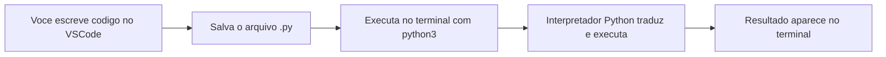
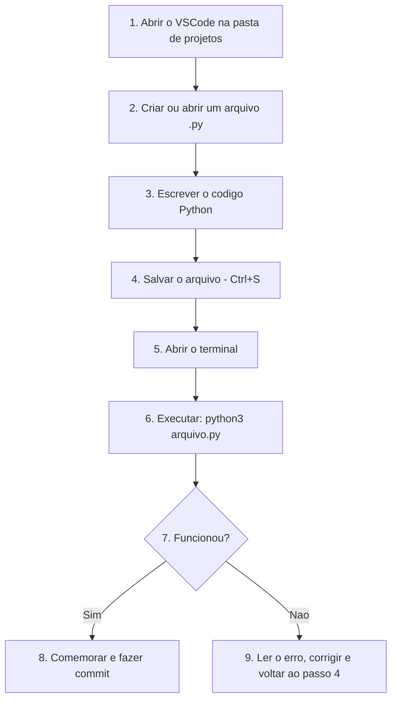

# 5.3 — Preparando o Ambiente: Python e VSCode

[← Anterior: Tipos de Programas: Scripts, Compilados e Máquinas Virtuais](cap05-mod02-tipos-programas.md) · [Próximo: Seu Primeiro Programa: print() e input() →](cap05-mod04-print-input-conteudo.md)

---

## Introdução

Nos dois módulos anteriores, você aprendeu o que é um programa, o que é um algoritmo e como o computador transforma código em instruções executáveis. Viu que Python é uma linguagem interpretada, ideal para quem está começando, e entendeu por que a escolhemos para este capítulo.

Agora é hora de sair da teoria e entrar na prática. Neste módulo, vamos preparar seu computador para programar em Python. Vamos instalar o Python, configurar o VSCode (o editor de código) e garantir que tudo funciona antes de escrever nosso primeiro programa no módulo 5.4.

Se você seguiu os capítulos anteriores, já tem o Linux instalado e sabe usar o terminal. Essas habilidades vão ser essenciais agora — todos os passos de instalação são feitos pelo terminal, usando comandos que você já conhece do capítulo 3.

Pense neste módulo como a preparação da bancada de trabalho. Antes de cozinhar (programar), você precisa ter os utensílios (ferramentas) no lugar certo. Vamos organizar tudo com calma.

---

## Como Executar os Exemplos Deste Módulo

Este é o primeiro módulo com comandos práticos do capítulo 5. A partir de agora, cada módulo vai ter esta seção explicando como executar os exemplos.

Para este módulo, você vai precisar de:

- Um computador com **Linux** instalado (Ubuntu recomendado — capítulo 2)
- Acesso ao **terminal** (capítulo 3 — abra com `Ctrl + Alt + T`)
- **Conexão com a internet** (necessária para instalar programas)

Todos os comandos devem ser digitados no terminal. Copie cada comando exatamente como está escrito, cole no terminal e pressione Enter. Observe a saída e compare com a "Saída esperada" indicada.

Se algo der errado, não se preocupe — a seção de FAQ no final do módulo cobre os problemas mais comuns.

---

## O que Vamos Instalar

Antes de começar, vamos entender o que cada ferramenta faz e por que precisamos dela:

| Ferramenta | O que é | Para que serve | Analogia |
|-----------|---------|---------------|----------|
| Python 3 | O interpretador da linguagem | Traduz e executa seu código Python | O cozinheiro que segue a receita |
| pip | Gerenciador de pacotes do Python | Instala bibliotecas extras | O entregador que traz ingredientes novos |
| VSCode | Editor de código | Onde você escreve seus programas | A bancada de trabalho organizada |
| Extensão Python | Complemento do VSCode | Adiciona suporte a Python no editor | Utensílios especializados na bancada |



---

## Passo 1: Verificar se o Python Já Está Instalado

Muitas distribuições Linux já vêm com o Python pré-instalado. Vamos verificar antes de instalar.

Abra o terminal (`Ctrl + Alt + T`) e digite:

```bash
# Verifica a versao do Python instalada
# "python3" = interpretador Python versao 3
# "--version" = mostra a versao instalada
python3 --version
```

Saída esperada (algo parecido com):

```
Python 3.10.12
```

O número da versão pode variar no seu computador — pode ser 3.8, 3.9, 3.10, 3.11 ou 3.12. O importante é que comece com **3**. Qualquer versão 3.8 ou superior funciona perfeitamente para este curso.

### Se o Python já está instalado

Se o comando mostrou uma versão 3.8 ou superior, ótimo — pule para o Passo 2 (verificar o pip).

### Se o Python NÃO está instalado

Se apareceu uma mensagem de erro como:

```
comando não encontrado: python3
```

ou

```
bash: python3: command not found
```

Não se preocupe — vamos instalar agora.

### Cuidado com Python 2

Em alguns sistemas mais antigos, o comando `python` (sem o "3") pode apontar para o Python 2, que é uma versão antiga e descontinuada. Sempre use `python3` (com o "3") para garantir que está usando a versão correta.

Para verificar, você pode testar:

```bash
# Verifica se existe o comando "python" e qual versao ele aponta
python --version
```

Se a saída mostrar `Python 2.7.x`, esse é o Python 2 — **não use**. Sempre use `python3`.

---

## Passo 2: Instalar o Python 3

Se o Python não está instalado, ou se a versão é inferior a 3.8, vamos instalar a versão mais recente disponível.

### Atualizando a lista de pacotes

Antes de instalar qualquer coisa no Linux, é boa prática atualizar a lista de pacotes disponíveis. Você aprendeu isso no módulo 2.6 (Gerenciamento de Pacotes):

```bash
# Atualiza a lista de programas disponiveis para instalacao
# "sudo" = executa como administrador (vai pedir sua senha)
# "apt" = gerenciador de pacotes do Ubuntu/Debian
# "update" = atualiza a lista (nao instala nada ainda)
sudo apt update
```

Saída esperada: várias linhas mostrando o progresso, terminando com algo como:

```
Lendo listas de pacotes... Pronto
```

Lembre-se: quando o terminal pedir sua senha, os caracteres **não aparecem na tela** enquanto você digita. Isso é um recurso de segurança do Linux que você aprendeu no capítulo 2.5. Digite a senha normalmente e pressione Enter.

### Instalando o Python 3 e ferramentas essenciais

Agora vamos instalar o Python 3 junto com algumas ferramentas complementares:

```bash
# Instala o Python 3, o pip (gerenciador de pacotes) e o venv (ambientes virtuais)
# "-y" = confirma automaticamente a instalacao
sudo apt install python3 python3-pip python3-venv -y
```

Saída esperada: várias linhas mostrando o download e instalação, terminando com algo como:

```
Processando gatilhos para man-db ...
```

### Verificando a instalação

Depois de instalar, confirme que tudo funcionou:

```bash
# Verifica a versao do Python
python3 --version
```

Saída esperada:

```
Python 3.10.12
```

Agora verifique o pip (gerenciador de pacotes):

```bash
# Verifica a versao do pip
# "pip3" = gerenciador de pacotes do Python 3
pip3 --version
```

Saída esperada (algo parecido com):

```
pip 22.0.2 from /usr/lib/python3/dist-packages/pip (python 3.10)
```

Se ambos os comandos mostraram versões sem erros, a instalação foi bem-sucedida.

---

## Passo 3: Conhecendo o Modo Interativo do Python (REPL)

Antes de instalar o VSCode, vamos fazer algo divertido: conversar diretamente com o Python pelo terminal.

O Python tem um modo interativo chamado **REPL** — *Read-Eval-Print Loop* (Ler-Avaliar-Imprimir-Repetir). Nesse modo, você digita uma instrução, o Python executa na hora e mostra o resultado. É como ter uma conversa com o computador.

### Entrando no modo interativo

```bash
# Abre o modo interativo do Python
python3
```

Saída esperada:

```
Python 3.10.12 (main, Nov 20 2023, 15:14:05) [GCC 11.4.0] on linux
Type "help", "copyright", "credits" or "license" for more information.
>>>
```

O `>>>` é o **prompt do Python** — ele está esperando que você digite uma instrução. É diferente do prompt do terminal (que termina com `$`). Quando você vê `>>>`, está "dentro" do Python.

### Testando o Python interativamente

Vamos fazer alguns testes. Digite cada linha e pressione Enter:

```python
# Pede ao Python para mostrar uma mensagem na tela
# "print" = imprimir/mostrar
print("Ola, mundo!")
```

Saída esperada:

```
Ola, mundo!
```

Agora vamos fazer uma conta:

```python
# Pede ao Python para calcular uma soma
2 + 3
```

Saída esperada:

```
5
```

Mais uma:

```python
# Pede ao Python para calcular uma multiplicacao
# "*" = multiplicacao em programacao
7 * 8
```

Saída esperada:

```
56
```

E uma divisão:

```python
# Pede ao Python para calcular uma divisao
# "/" = divisao em programacao
100 / 4
```

Saída esperada:

```
25.0
```

Perceba que a divisão retornou `25.0` (com ponto e zero) em vez de `25`. Isso acontece porque o Python sempre retorna um número decimal (chamado **float**) quando usa o operador `/`. Vamos entender isso em detalhes no módulo 5.5 (Variáveis e Tipos de Dados).

### O REPL como calculadora

O modo interativo do Python funciona como uma calculadora poderosa. Você pode fazer qualquer cálculo:

```python
# Calculo mais complexo: preco com desconto de 15%
# 150 * 0.85 = 150 menos 15%
150 * 0.85
```

Saída esperada:

```
127.5
```

```python
# Potencia: 2 elevado a 10
# "**" = potencia em Python
2 ** 10
```

Saída esperada:

```
1024
```

### Saindo do modo interativo

Para sair do modo interativo e voltar ao terminal normal, digite:

```python
# Sai do modo interativo do Python
# "exit()" = funcao que encerra o interpretador
exit()
```

Ou pressione `Ctrl + D`. Você vai voltar ao prompt normal do terminal (com `$`).

### Quando usar o REPL

O modo interativo é excelente para:

- Testar rapidamente uma ideia ou cálculo
- Verificar como uma função funciona
- Experimentar código antes de colocar em um arquivo
- Aprender — você vê o resultado de cada instrução imediatamente

Mas para programas de verdade (com várias linhas, que você quer salvar e executar novamente), vamos usar arquivos `.py` — e para isso precisamos de um bom editor de código.

---

## Passo 4: Instalar o VSCode

O **VSCode** (*Visual Studio Code*) é o editor de código que vamos usar para escrever nossos programas. Ele é gratuito, muito popular entre programadores e tem funcionalidades que facilitam muito o trabalho.

### Por que usar um editor de código?

Você poderia escrever Python em qualquer editor de texto — até no Nano ou Vim que aprendeu no capítulo 3.5. Mas um editor de código como o VSCode oferece vantagens importantes:

| Funcionalidade | O que faz | Por que importa |
|---------------|-----------|-----------------|
| Destaque de sintaxe | Colore diferentes partes do código com cores diferentes | Facilita a leitura e ajuda a identificar erros |
| Autocompletar | Sugere comandos enquanto você digita | Acelera a escrita e evita erros de digitação |
| Detecção de erros | Sublinha erros antes de você executar | Você corrige problemas antes de rodar o programa |
| Terminal integrado | Terminal dentro do editor | Não precisa alternar entre janelas |
| Explorador de arquivos | Mostra a estrutura de pastas do projeto | Facilita a navegação entre arquivos |

### Instalando o VSCode

Existem duas formas de instalar. Escolha a que preferir:

**Opção A — Pelo terminal (recomendado para quem já está confortável com o terminal):**

```bash
# Instala dependencias necessarias
sudo apt install software-properties-common apt-transport-https wget -y
```

Saída esperada: linhas de instalação, terminando com "Pronto" ou similar.

```bash
# Baixa e adiciona a chave de seguranca do repositorio da Microsoft
wget -qO- https://packages.microsoft.com/keys/microsoft.asc | gpg --dearmor > packages.microsoft.gpg
sudo install -D -o root -g root -m 644 packages.microsoft.gpg /etc/apt/keyrings/packages.microsoft.gpg
```

```bash
# Adiciona o repositorio do VSCode
sudo sh -c 'echo "deb [arch=amd64,arm64,armhf signed-by=/etc/apt/keyrings/packages.microsoft.gpg] https://packages.microsoft.com/repos/code stable main" > /etc/apt/sources.list.d/vscode.list'
```

```bash
# Atualiza a lista de pacotes e instala o VSCode
sudo apt update
sudo apt install code -y
```

**Opção B — Pelo site (mais simples para quem prefere interface gráfica):**

1. Abra o navegador de internet
2. Acesse: `https://code.visualstudio.com/`
3. Clique no botão de download para Linux (`.deb` para Ubuntu/Debian)
4. Após o download, abra o terminal e instale:

```bash
# Instala o arquivo .deb que voce baixou
# "dpkg -i" = instala um pacote .deb
sudo dpkg -i ~/Downloads/code_*.deb
```

Se aparecer erro de dependências:

```bash
# Corrige dependencias faltantes
sudo apt install -f -y
```

### Verificando a instalação

```bash
# Verifica se o VSCode foi instalado corretamente
code --version
```

Saída esperada (algo parecido com):

```
1.87.0
abc123def456
x64
```

O número da versão pode ser diferente — o importante é que não apareça erro.

---

## Passo 5: Configurar o VSCode para Python

Agora vamos abrir o VSCode e configurá-lo para trabalhar com Python.

### Abrindo o VSCode

```bash
# Abre o VSCode
code
```

O VSCode vai abrir em uma nova janela. Na primeira vez, pode aparecer uma tela de boas-vindas — você pode fechá-la.

### Instalando a extensão Python

Extensões são complementos que adicionam funcionalidades ao VSCode. A extensão Python é essencial — ela adiciona destaque de cores, autocompletar, detecção de erros e muito mais.

1. No VSCode, clique no ícone de **quadradinhos** na barra lateral esquerda (ou pressione `Ctrl + Shift + X`)
2. Na barra de busca, digite: `Python`
3. Procure a extensão chamada **"Python"** da **Microsoft** (geralmente é a primeira)
4. Clique em **Install** (Instalar)
5. Aguarde a instalação terminar

### Extensões recomendadas

Além da extensão Python (obrigatória), estas extensões podem facilitar sua vida:

| Extensão | O que faz | Prioridade |
|----------|-----------|-----------|
| Python (Microsoft) | Suporte completo a Python | Obrigatória |
| Portuguese (Brazil) Language Pack | Traduz a interface do VSCode para português | Recomendada |
| indent-rainbow | Colore a indentação com cores diferentes | Recomendada |
| Error Lens | Mostra erros diretamente na linha do código | Opcional |
| GitLens | Mostra informações do Git dentro do editor | Opcional |

Para instalar qualquer uma, use o mesmo processo: `Ctrl + Shift + X`, busque pelo nome e clique em Install.

### Configurando o interpretador Python

O VSCode precisa saber onde está o interpretador Python no seu computador:

1. Pressione `Ctrl + Shift + P` (abre a paleta de comandos)
2. Digite: `Python: Select Interpreter`
3. Selecione a opção que mostra `Python 3.x.x` (a versão que você instalou)

Se aparecer mais de uma opção, escolha a que começa com `/usr/bin/python3`.

---

## Passo 6: Organizando sua Pasta de Projetos

Antes de criar nosso primeiro arquivo, vamos organizar onde vamos guardar nossos programas. Organização é um hábito importante para programadores.

### Criando a estrutura de pastas

No terminal, crie uma pasta para seus projetos do curso:

```bash
# Cria a pasta principal dos projetos
# "mkdir -p" = cria a pasta (e pastas intermediarias se necessario)
mkdir -p ~/projetos/python
```

```bash
# Entra na pasta criada
# "cd" = change directory (mudar de diretorio)
cd ~/projetos/python
```

```bash
# Verifica onde voce esta
# "pwd" = print working directory (mostra o diretorio atual)
pwd
```

Saída esperada:

```
/home/seu-usuario/projetos/python
```

### Abrindo a pasta no VSCode

Agora vamos abrir essa pasta no VSCode:

```bash
# Abre o VSCode na pasta atual
# "code ." = abre o VSCode no diretorio atual
code .
```

O VSCode vai abrir com a pasta `python` no explorador de arquivos (barra lateral esquerda). Essa será sua pasta de trabalho para todos os exercícios do capítulo 5.

---

## Passo 7: Seu Primeiro Arquivo Python

Vamos criar um arquivo Python para testar se tudo está funcionando corretamente.

### Criando o arquivo no VSCode

1. No VSCode, com a pasta `python` aberta, clique em **File** → **New File** (ou pressione `Ctrl + N`)
2. Uma aba em branco vai aparecer
3. Digite o seguinte código:

```python
# Meu primeiro programa em Python!
# Este programa mostra uma mensagem na tela

# "print" = funcao que exibe texto no terminal
# O texto entre aspas e o que sera mostrado
print("Ola, mundo! Meu ambiente Python esta funcionando!")

# Mostra o resultado de um calculo
# "Resultado:" e o texto que aparece antes do numero
print("Resultado de 2 + 3:", 2 + 3)

# Mostra uma mensagem de conclusao
print("Tudo pronto para comecar a programar!")
```

4. Salve o arquivo: pressione `Ctrl + S`
5. Dê o nome `teste.py` ao arquivo
6. Confirme que está salvando na pasta `~/projetos/python/`

### Executando o arquivo pelo terminal

Agora vamos executar o programa. Você tem duas opções:

**Opção A — Pelo terminal integrado do VSCode:**

1. No VSCode, abra o terminal integrado: pressione `` Ctrl + ` `` (a tecla de crase, ao lado do número 1)
2. O terminal vai abrir na parte inferior do VSCode, já na pasta correta
3. Digite:

```bash
# Executa o programa Python
# "python3" = interpretador Python
# "teste.py" = nome do arquivo que voce criou
python3 teste.py
```

**Opção B — Pelo terminal externo:**

1. Abra o terminal (`Ctrl + Alt + T`)
2. Navegue até a pasta:

```bash
cd ~/projetos/python
```

3. Execute:

```bash
python3 teste.py
```

Saída esperada (em ambas as opções):

```
Ola, mundo! Meu ambiente Python esta funcionando!
Resultado de 2 + 3: 5
Tudo pronto para comecar a programar!
```

Se você viu essa saída, **parabéns** — seu ambiente está configurado e funcionando. Você acabou de executar seu primeiro programa Python.

---

## Passo 8: Inicializando o Git na Pasta de Projetos

No capítulo 4, você aprendeu a usar o Git para versionar seus arquivos. Vamos aplicar isso desde o início — é um bom hábito versionar seus projetos desde o primeiro arquivo.

```bash
# Entra na pasta de projetos (se nao estiver nela)
cd ~/projetos/python
```

```bash
# Inicializa um repositorio Git
git init
```

Saída esperada:

```
Initialized empty Git repository in /home/seu-usuario/projetos/python/.git/
```

Agora vamos criar um arquivo `.gitignore` para ignorar arquivos que não devem ser versionados:

```bash
# Cria o arquivo .gitignore
# "echo" = exibe texto (e com ">" redireciona para um arquivo)
echo "__pycache__/" > .gitignore
echo "*.pyc" >> .gitignore
```

Lembra dos arquivos `.pyc` e da pasta `__pycache__` que mencionamos no módulo 5.2? São os arquivos de bytecode que o Python gera automaticamente. Não precisamos versioná-los.

Agora faça o primeiro commit:

```bash
# Adiciona todos os arquivos ao staging
git add .
```

```bash
# Faz o primeiro commit
git commit -m "chore: initial commit with test file and gitignore"
```

Saída esperada:

```
[main (root-commit) abc1234] chore: initial commit with test file and gitignore
 2 files changed, ...
```

A partir de agora, faça commits regularmente conforme cria novos arquivos e exercícios. Isso vai te dar prática com Git e proteger seu trabalho.

---

## Entendendo o Fluxo de Trabalho

Agora que tudo está instalado, vamos consolidar o fluxo de trabalho que você vai usar em todos os módulos daqui para frente:



Esse ciclo — escrever, salvar, executar, verificar — é o dia a dia de todo programador. Com o tempo, vai se tornar automático.

### Resumo dos comandos essenciais

| Ação | Comando | Onde executar |
|------|---------|--------------|
| Abrir o VSCode na pasta | `code .` | Terminal, dentro da pasta |
| Criar novo arquivo | `Ctrl + N` | VSCode |
| Salvar arquivo | `Ctrl + S` | VSCode |
| Abrir terminal integrado | `` Ctrl + ` `` | VSCode |
| Executar programa Python | `python3 arquivo.py` | Terminal |
| Modo interativo Python | `python3` | Terminal |
| Sair do modo interativo | `exit()` ou `Ctrl + D` | Dentro do Python |
| Verificar versão do Python | `python3 --version` | Terminal |

---

## O Zen of Python na Prática

No módulo 5.1, mencionamos o Zen of Python — a filosofia de design da linguagem. Agora que você tem o Python instalado, pode vê-lo com seus próprios olhos.

No terminal (ou no modo interativo do Python), digite:

```bash
# Mostra o Zen of Python
python3 -c "import this"
```

Saída esperada:

```
The Zen of Python, by Tim Peters

Beautiful is better than ugly.
Explicit is better than implicit.
Simple is better than complex.
Complex is better than complicated.
Flat is better than nested.
Sparse is better than dense.
Readability counts.
Special cases aren't special enough to break the rules.
Although practicality beats purity.
Errors should never pass silently.
Unless explicitly silenced.
In the face of ambiguity, refuse the temptation to guess.
There should be one-- and preferably only one --obvious way to do it.
Although that way may not be obvious at first unless you're Dutch.
Now is better than never.
Although never is often better than *right* now.
If the implementation is hard to explain, it's a bad idea.
If the implementation is easy to explain, it may be a good idea.
Namespaces are one honking great idea -- let's do more of those!
```

O texto está em inglês, mas os princípios mais importantes já foram traduzidos no módulo 5.1. Releia aquela tabela se quiser refrescar a memória.

A linha "Although that way may not be obvious at first unless you're Dutch" é uma piada — Guido van Rossum, o criador do Python, é holandês.

---

## Problemas Comuns e Como Resolver

Aqui estão os problemas mais frequentes que iniciantes encontram ao configurar o ambiente, com soluções passo a passo:

### Problema: "python3: command not found"

**Causa:** Python não está instalado ou o caminho não está configurado.

**Solução:**
```bash
sudo apt update
sudo apt install python3 python3-pip python3-venv -y
```

Se ainda não funcionar, tente:
```bash
# Verifica onde o Python esta instalado
which python3
```

Se não retornar nada, o Python realmente não está instalado. Tente instalar novamente.

### Problema: "Permission denied" ao executar um arquivo

**Causa:** Você está tentando executar o arquivo diretamente em vez de usar o interpretador.

**Solução:** Use `python3 arquivo.py` em vez de `./arquivo.py`.

### Problema: VSCode não reconhece o Python

**Causa:** A extensão Python não está instalada ou o interpretador não está selecionado.

**Solução:**
1. Verifique se a extensão Python (Microsoft) está instalada (`Ctrl + Shift + X`)
2. Selecione o interpretador: `Ctrl + Shift + P` → "Python: Select Interpreter" → escolha Python 3.x

### Problema: "ModuleNotFoundError" ao importar algo

**Causa:** A biblioteca que você está tentando usar não está instalada.

**Solução:** Para este módulo, não precisamos de bibliotecas extras. Se encontrar esse erro mais tarde, use:
```bash
pip3 install nome-da-biblioteca
```

### Problema: Caracteres estranhos no terminal

**Causa:** Problema de codificação de caracteres (encoding).

**Solução:** Adicione esta linha no início dos seus arquivos Python:
```python
# -*- coding: utf-8 -*-
```

Isso garante que acentos e caracteres especiais funcionem corretamente.

---

## Casos de Uso no Mundo Real

### 1. Ambiente de desenvolvimento em empresas

Em empresas de tecnologia, a primeira coisa que um novo desenvolvedor faz ao entrar é configurar seu ambiente de desenvolvimento. Cada empresa tem suas ferramentas, linguagens e configurações específicas. O processo que você acabou de fazer — instalar linguagem, editor e extensões — é exatamente o que profissionais fazem no primeiro dia de trabalho.

Empresas grandes como Google, Meta e Amazon têm documentos internos detalhados (chamados "setup guides" ou "onboarding docs") que guiam novos funcionários na configuração do ambiente. Algumas empresas automatizam esse processo com scripts que instalam tudo automaticamente — scripts escritos em Python, aliás.

### 2. Ambientes virtuais em projetos profissionais

No mundo profissional, cada projeto Python usa um **ambiente virtual** (*virtual environment*) — uma instalação isolada do Python com suas próprias bibliotecas. Isso evita conflitos entre projetos que usam versões diferentes das mesmas bibliotecas.

Instalamos o `python3-venv` justamente para isso. Não vamos usar ambientes virtuais neste capítulo (para manter as coisas simples), mas é bom saber que existem. No capítulo 11, quando criarmos uma API com FastAPI, vamos usar ambientes virtuais.

### 3. VSCode como ferramenta profissional

O VSCode não é apenas um editor para iniciantes — é o editor mais popular entre programadores profissionais no mundo. Segundo a pesquisa Stack Overflow Developer Survey, mais de 70% dos desenvolvedores usam VSCode como editor principal.

Empresas como Microsoft, Google, Facebook e milhares de startups usam VSCode no dia a dia. As extensões que você instalou são as mesmas que profissionais usam. Ao aprender VSCode agora, você está aprendendo uma ferramenta que vai usar na sua carreira.

---

## Como a IA pode te ajudar aqui
**Prompt 1 — Entender erros comuns:**
> "Estou tentando instalar o Python 3 no Ubuntu e recebi o seguinte erro: [cole a mensagem de erro]. O que pode estar causando isso e como resolvo?"

**Prompt 2 — Explorar o conceito:**
> "Quais são as melhores extensões do VSCode para quem está aprendendo Python? Me explique o que cada uma faz."

**Prompt 3 — Ver exemplos práticos:**
> "Me dê 10 exemplos de coisas interessantes que posso fazer no modo interativo do Python (REPL) para praticar enquanto estou aprendendo."

---

## Resumo do Módulo

| Conceito | Definição |
|----------|-----------|
| Python 3 | Versão atual do interpretador Python, usada neste curso |
| pip | Gerenciador de pacotes do Python, usado para instalar bibliotecas extras |
| VSCode | Editor de código gratuito e popular, com suporte a Python via extensão |
| REPL | Modo interativo do Python onde cada instrução é executada imediatamente |
| Extensão | Complemento que adiciona funcionalidades ao VSCode |
| Arquivo .py | Arquivo de código Python, executado com `python3 arquivo.py` |
| Terminal integrado | Terminal dentro do VSCode, acessível com `` Ctrl + ` `` |
| __pycache__ | Pasta criada automaticamente pelo Python para armazenar bytecode |
| .gitignore | Arquivo que diz ao Git quais arquivos ignorar no versionamento |
| Ambiente virtual | Instalação isolada do Python para um projeto específico |

---

## Glossário do Módulo

| Termo | Definição |
|-------|-----------|
| apt | Gerenciador de pacotes do Ubuntu/Debian, usado para instalar programas pelo terminal |
| Autocompletar (autocomplete) | Funcionalidade do editor que sugere código enquanto você digita |
| Destaque de sintaxe (syntax highlighting) | Coloração de diferentes partes do código para facilitar a leitura |
| Extensão (extension) | Complemento que adiciona funcionalidades a um editor de código |
| Modo interativo (interactive mode) | Modo do Python onde cada instrução é executada imediatamente ao pressionar Enter |
| pip | Gerenciador de pacotes do Python — instala bibliotecas extras com `pip3 install nome` |
| Prompt | Texto que indica que o terminal ou o Python está esperando um comando |
| REPL (Read-Eval-Print Loop) | Ciclo de ler instrução, avaliar, imprimir resultado e repetir — o modo interativo |
| sudo | Comando que executa outro comando como administrador do sistema |
| Terminal integrado | Terminal embutido dentro do VSCode, acessível sem sair do editor |
| venv (virtual environment) | Ferramenta para criar ambientes Python isolados por projeto |
| VSCode (Visual Studio Code) | Editor de código gratuito da Microsoft, popular entre programadores |

---

## Na Cultura Popular

- **Mr. Robot** (série, 2015-2019) — o protagonista Elliot usa Linux e terminal extensivamente. Várias cenas mostram ele configurando ambientes, escrevendo scripts e usando editores de código no terminal. A série retrata com realismo o dia a dia de quem trabalha com tecnologia.

- **Silicon Valley** (série, 2014-2019) — em vários episódios, os personagens discutem sobre editores de código, linguagens de programação e ferramentas de desenvolvimento. A famosa "guerra dos editores" (Vim vs Emacs vs VSCode) é um tema recorrente na cultura de programadores.

---

## Para Saber Mais

- [Documentação Oficial Python — Instalação no Linux](https://docs.python.org/pt-br/3/using/unix.html) — *Guia oficial de instalação do Python em sistemas Unix/Linux*
- [VSCode — Documentação](https://code.visualstudio.com/docs) — *Guia completo do VSCode com tutoriais e referências (em inglês)*
- [VSCode — Python Tutorial](https://code.visualstudio.com/docs/python/python-tutorial) — *Tutorial oficial de Python no VSCode (em inglês)*
- [GitHub do Fino — learn-ops-content](https://github.com/RafaelFino/learn-ops-content) — *Material de referência do Fino*
- [Real Python — Setting Up Python](https://realpython.com/installing-python/) — *Guia detalhado de instalação do Python em diferentes sistemas (em inglês)*

---

## Perguntas Frequentes (FAQ)

**P: Meu terminal mostra `python` em vez de `python3`. Qual usar?**
R: Sempre use `python3`. Em alguns sistemas, `python` aponta para o Python 2 (versão antiga e descontinuada). Se `python3` não funcionar, verifique se o Python está instalado com `sudo apt install python3`.

**P: O sistema pediu minha senha e nada aparece quando digito. Está quebrado?**
R: Não. Isso é um recurso de segurança do Linux — a senha não aparece na tela enquanto você digita (nem asteriscos). Digite normalmente e pressione Enter.

**P: Posso usar outro editor em vez do VSCode?**
R: Sim, qualquer editor funciona para escrever Python. Mas o VSCode é recomendado porque tem funcionalidades que facilitam muito o aprendizado. Se preferir, pode usar Sublime Text, Atom ou até o Nano do terminal.

**P: Preciso de internet para programar depois de instalar tudo?**
R: Não. Depois de instalar o Python, VSCode e extensões, você pode programar sem internet. Internet só é necessária para instalar novas bibliotecas ou pesquisar documentação.

**P: O que é o terminal integrado do VSCode?**
R: É um terminal que roda dentro do VSCode, na parte inferior da janela. Você abre com `` Ctrl + ` ``. A vantagem é não precisar alternar entre janelas — escreve o código em cima e executa embaixo.

**P: O que é `pip` e quando vou usar?**
R: pip é o gerenciador de pacotes do Python — permite instalar bibliotecas extras que outras pessoas criaram. Vamos usá-lo mais adiante no curso, especialmente no capítulo 11 com FastAPI. Por enquanto, ele está instalado e pronto.

**P: O que são os arquivos .pyc e a pasta __pycache__?**
R: São arquivos de bytecode que o Python gera automaticamente para acelerar execuções futuras. Você pode ignorá-los completamente. Adicionamos ao `.gitignore` para não versioná-los.

**P: Posso ter mais de uma versão do Python instalada?**
R: Sim. É possível ter Python 3.8, 3.10 e 3.12 no mesmo computador. O comando `python3` geralmente aponta para a versão mais recente. Para este curso, qualquer versão 3.8+ funciona.

**P: O que fazer se um comando der erro?**
R: Leia a mensagem de erro com atenção — ela geralmente indica o problema. Consulte a seção "Problemas Comuns" deste módulo. Se não resolver, copie a mensagem de erro e pesquise na internet ou pergunte a uma IA.

**P: Posso instalar o Python no Windows?**
R: Sim, Python funciona no Windows. Mas este curso foi feito para Linux. Se você usa Windows, pode instalar o WSL (Windows Subsystem for Linux) para ter um ambiente Linux dentro do Windows.

**P: O que é uma extensão do VSCode?**
R: É um complemento que adiciona funcionalidades. A extensão Python adiciona destaque de cores, autocompletar e detecção de erros para código Python. É como instalar um app extra no seu editor.

**P: O VSCode é gratuito?**
R: Sim, completamente gratuito e de código aberto. Desenvolvido pela Microsoft, usado por milhões de programadores no mundo.

---

## Exercícios Práticos

### Exercício 1 — Verificação completa do ambiente

Execute os seguintes comandos no terminal e anote as saídas. Confirme que tudo está instalado corretamente:

1. `python3 --version`
2. `pip3 --version`
3. `code --version`
4. `git --version`

Se algum comando der erro, volte aos passos de instalação deste módulo e corrija.

### Exercício 2 — Explorando o REPL

Abra o modo interativo do Python (`python3`) e faça os seguintes cálculos:

1. Quanto é 365 * 24? (quantas horas tem um ano)
2. Quanto é 2 ** 20? (2 elevado a 20)
3. Quanto é 1000 / 3? (observe o resultado decimal)
4. Digite `print("Seu nome")` substituindo "Seu nome" pelo seu nome real
5. Digite `import this` para ver o Zen of Python

Depois, saia com `exit()`.

### Exercício 3 — Criando e executando um programa

1. No VSCode, crie um arquivo chamado `sobre_mim.py` na pasta `~/projetos/python/`
2. Escreva um programa que mostra 3 linhas na tela:
   - Seu nome
   - Sua cidade
   - Por que você quer aprender a programar
3. Use `print()` para cada linha
4. Salve e execute com `python3 sobre_mim.py`
5. Faça um commit: `git add . && git commit -m "feat: add about me program"`

---

[← Anterior: Tipos de Programas: Scripts, Compilados e Máquinas Virtuais](cap05-mod02-tipos-programas.md) · [Próximo: Seu Primeiro Programa: print() e input() →](cap05-mod04-print-input-conteudo.md)
