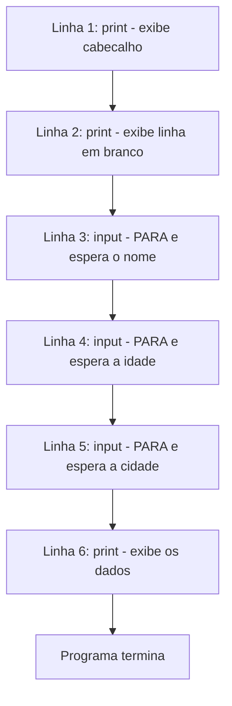

# 5.4 — Seu Primeiro Programa: print() e input()

[← Anterior: Preparando o Ambiente: Python e VSCode](cap05-mod03-ambiente-python.md) · [Próximo: Variáveis e Tipos de Dados →](cap05-mod05-variaveis-tipos-conteudo.md)

---

## Introdução

No módulo anterior, você preparou seu ambiente: instalou o Python, configurou o VSCode e até executou um pequeno programa de teste. Viu que o Python funciona — agora é hora de entender como.

Neste módulo, você vai aprender as duas funções mais fundamentais de qualquer linguagem de programação: como fazer o programa **falar** com você e como fazer o programa **ouvir** você.

- **`print()`** é a "boca" do programa — exibe informações na tela
- **`input()`** é o "ouvido" do programa — recebe informações que você digita

Com apenas essas duas funções, você já consegue criar programas que conversam com o usuário. Parece pouco, mas é o ponto de partida de tudo. Todo programa que você já usou — WhatsApp, Instagram, Netflix, Google — usa alguma forma de entrada (o que você digita, clica ou toca) e saída (o que aparece na tela).

Lembra do modelo Entrada → Processamento → Saída que vimos no módulo 5.1? Neste módulo, vamos aprender a parte de Entrada (`input()`) e Saída (`print()`). O Processamento vem nos próximos módulos, quando aprendermos variáveis, operadores e condicionais.

Prepare o VSCode, abra o terminal e vamos programar.

---

## Como Executar os Exemplos Deste Módulo

Para cada exemplo de código neste módulo:

1. Abra o VSCode na sua pasta de projetos: `code ~/projetos/python`
2. Crie um novo arquivo (`Ctrl + N`)
3. Copie o código do exemplo
4. Salve com um nome descritivo e extensão `.py` (exemplo: `print_basico.py`)
5. Abra o terminal integrado (`` Ctrl + ` ``)
6. Execute: `python3 nome_do_arquivo.py`

Dica: você pode criar um arquivo por seção (ex: `print_basico.py`, `print_separador.py`, `input_nome.py`) ou um único arquivo por módulo e ir substituindo o conteúdo. Faça como preferir.

---

## A Função print() — Fazendo o Programa Falar

A função `print()` é a forma mais básica de fazer o programa mostrar algo na tela. O nome vem do inglês *print* (imprimir) — ela "imprime" texto no terminal.

### O básico: exibindo texto

```python
# "print" = imprimir/mostrar na tela
# O texto entre aspas e chamado de "string" (texto)
print("Ola, mundo!")
```

Saída esperada:

```
Ola, mundo!
```

Esse é o programa mais famoso da história da programação. Praticamente todo programador, em qualquer linguagem, começa com um "Olá, mundo!" (ou "Hello, World!" em inglês). É uma tradição que existe desde os anos 1970, quando Brian Kernighan usou essa frase em um tutorial da linguagem C.

### Aspas simples ou duplas?

Em Python, você pode usar aspas simples (`'texto'`) ou aspas duplas (`"texto"`) — ambas funcionam exatamente da mesma forma:

```python
# Aspas duplas
print("Ola com aspas duplas")

# Aspas simples - funciona igual
print('Ola com aspas simples')
```

Saída esperada:

```
Ola com aspas duplas
Ola com aspas simples
```

A vantagem de ter as duas é poder usar uma dentro da outra quando o texto contém aspas:

```python
# Aspas simples dentro de aspas duplas
print("Ele disse 'ola' para todos")

# Aspas duplas dentro de aspas simples
print('O filme "Matrix" e otimo')
```

Saída esperada:

```
Ele disse 'ola' para todos
O filme "Matrix" e otimo
```

### Exibindo números

O `print()` não exibe apenas texto — também exibe números:

```python
# Exibindo um numero inteiro
print(42)

# Exibindo um numero decimal
# Em programacao, usamos ponto em vez de virgula para decimais
print(3.14)

# Exibindo o resultado de um calculo
print(2 + 3)

# Exibindo o resultado de uma multiplicacao
print(7 * 8)
```

Saída esperada:

```
42
3.14
5
56
```

Perceba que números não precisam de aspas. Se você colocar aspas, o Python trata como texto, não como número:

```python
# Sem aspas: Python entende como numero e faz a conta
print(2 + 3)

# Com aspas: Python entende como texto e junta os textos
print("2 + 3")
```

Saída esperada:

```
5
2 + 3
```

Essa diferença é fundamental e vamos aprofundá-la no módulo 5.5 (Variáveis e Tipos de Dados).

### Exibindo múltiplos valores

Você pode passar vários valores para o `print()`, separados por vírgula. O Python coloca automaticamente um espaço entre eles:

```python
# Exibindo texto e numero juntos, separados por virgula
# "name" = nome, "age" = idade
print("Nome:", "Maria")
print("Idade:", 25)
print("Nota:", 8.5)
```

Saída esperada:

```
Nome: Maria
Idade: 25
Nota: 8.5
```

Isso é muito útil para montar mensagens que combinam texto e valores:

```python
# Combinando texto e calculos
# "price" = preco, "quantity" = quantidade
print("Preco unitario: R$", 5.99)
print("Quantidade:", 3)
print("Total: R$", 5.99 * 3)
```

Saída esperada:

```
Preco unitario: R$ 5.99
Quantidade: 3
Total: R$ 17.97
```

### O parâmetro sep — Mudando o separador

Por padrão, o `print()` coloca um espaço entre os valores. O parâmetro `sep` (*separator* = separador) permite mudar isso:

```python
# "sep" = separator = separador
# Separando com hifen
print("Python", "e", "incrivel", sep="-")

# Separando com barra - formato de data
print("26", "04", "2026", sep="/")

# Separando com pipe - formato de tabela
print("Maria", "25 anos", "Sao Paulo", sep=" | ")

# Sem separador nenhum
print("A", "B", "C", sep="")
```

Saída esperada:

```
Python-e-incrivel
26/04/2026
Maria | 25 anos | Sao Paulo
ABC
```

### O parâmetro end — Mudando o final da linha

Por padrão, cada `print()` pula para a próxima linha depois de exibir. O parâmetro `end` (*end* = fim) permite mudar esse comportamento:

```python
# Comportamento padrao: cada print pula uma linha
print("Linha 1")
print("Linha 2")
print("Linha 3")
```

Saída esperada:

```
Linha 1
Linha 2
Linha 3
```

```python
# Com end=" ": coloca espaco em vez de pular linha
print("Ola", end=" ")
print("mundo", end=" ")
print("Python!")
```

Saída esperada:

```
Ola mundo Python!
```

```python
# Com end="": nao coloca nada no final
print("Carregando", end="")
print("...", end="")
print(" Pronto!")
```

Saída esperada:

```
Carregando... Pronto!
```

### Caracteres especiais

Dentro de strings, existem caracteres especiais que começam com `\` (barra invertida). Os mais importantes:

| Caractere | Nome | O que faz |
|-----------|------|-----------|
| `\n` | New line (nova linha) | Pula para a próxima linha |
| `\t` | Tab (tabulação) | Insere um espaçamento maior (como apertar Tab) |
| `\\` | Barra invertida | Exibe uma barra invertida literal |
| `\"` | Aspas duplas | Exibe aspas duplas dentro de string com aspas duplas |
| `\'` | Aspas simples | Exibe aspas simples dentro de string com aspas simples |

```python
# \n pula linha dentro de uma unica string
print("Primeira linha\nSegunda linha\nTerceira linha")
```

Saída esperada:

```
Primeira linha
Segunda linha
Terceira linha
```

```python
# \t cria tabulacao - util para alinhar colunas
print("Produto\tPreco")
print("Arroz\tR$ 5.99")
print("Feijao\tR$ 8.50")
```

Saída esperada:

```
Produto	Preco
Arroz	R$ 5.99
Feijao	R$ 8.50
```

### print() vazio — Linha em branco

Chamar `print()` sem nada dentro simplesmente pula uma linha em branco. É útil para separar visualmente partes da saída:

```python
print("=== Secao 1 ===")
print("Conteudo da secao 1")
print()  # linha em branco
print("=== Secao 2 ===")
print("Conteudo da secao 2")
```

Saída esperada:

```
=== Secao 1 ===
Conteudo da secao 1

=== Secao 2 ===
Conteudo da secao 2
```

---

## A Função input() — Fazendo o Programa Ouvir

Até agora, nossos programas apenas falam (exibem coisas na tela). Mas um programa de verdade precisa também ouvir — receber informações do usuário.

A função `input()` faz exatamente isso: exibe uma mensagem (opcional) e espera o usuário digitar algo. Quando o usuário pressiona Enter, o valor digitado é capturado pelo programa.

### O básico: pedindo o nome do usuário

```python
# "input" = entrada
# A mensagem entre aspas e exibida antes de esperar a digitacao
# "name" = nome
name = input("Digite seu nome: ")

# Exibe uma saudacao usando o nome digitado
print("Ola,", name, "! Bem-vindo ao Python!")
```

Como funciona, passo a passo:

1. O programa exibe "Digite seu nome: " e **para**, esperando
2. O usuário digita algo (por exemplo: `Maria`) e pressiona Enter
3. O texto digitado ("Maria") é guardado na variável `name`
4. O programa continua e exibe a saudação

Saída esperada (se o usuário digitar "Maria"):

```
Digite seu nome: Maria
Ola, Maria ! Bem-vindo ao Python!
```

Perceba o espaço antes do "!" — isso acontece porque o `print()` coloca espaço entre os valores separados por vírgula. Vamos aprender a resolver isso com f-strings no módulo 5.6.

### O que é uma variável? (Prévia)

No exemplo acima, usamos `name = input(...)`. O `name` é uma **variável** — um nome que guarda um valor na memória do computador. Pense nela como uma caixa etiquetada: a etiqueta é `name` e o conteúdo é o que o usuário digitou.

Vamos aprofundar variáveis no módulo 5.5. Por enquanto, o que você precisa saber é:

- O sinal `=` não significa "igual" em programação — significa **"recebe"** ou **"guarda"**
- `name = input("...")` significa: "a variável `name` recebe o valor que o usuário digitar"
- Depois de guardar, você pode usar `name` em qualquer lugar do programa

### IMPORTANTE: input() sempre retorna texto (string)

Esta é uma das armadilhas mais comuns para iniciantes: **tudo que o `input()` captura é tratado como texto**, mesmo que o usuário digite um número.

```python
# O usuario digita 25, mas "age" recebe o TEXTO "25", nao o numero 25
# "age" = idade
age = input("Digite sua idade: ")

# "type" = tipo - mostra o tipo do dado
print("Voce digitou:", age)
print("Tipo do dado:", type(age))
```

Saída esperada (se o usuário digitar "25"):

```
Digite sua idade: 25
Voce digitou: 25
Tipo do dado: <class 'str'>
```

`<class 'str'>` significa **string** (texto). Mesmo parecendo um número na tela, para o Python é texto. Isso significa que se você tentar fazer uma conta, o resultado pode ser inesperado:

```python
# CUIDADO: isso NAO faz uma soma matematica!
# "number" = numero
number = input("Digite um numero: ")
# Isso CONCATENA (junta) textos em vez de somar
print("Resultado:", number + number)
```

Saída esperada (se o usuário digitar "5"):

```
Digite um numero: 5
Resultado: 55
```

O Python juntou "5" + "5" como texto, resultando em "55" — não fez a conta 5 + 5 = 10. Para fazer contas, precisamos converter o texto para número.

### Convertendo texto para número

Para fazer cálculos com valores digitados pelo usuário, use `int()` (para números inteiros) ou `float()` (para números decimais):

```python
# "int" = integer = numero inteiro
# int() converte texto para numero inteiro
age = int(input("Digite sua idade: "))

# Agora "age" e um numero e podemos fazer calculos
# "birth_year" = ano de nascimento
birth_year = 2026 - age
print("Voce nasceu aproximadamente em", birth_year)
```

Saída esperada (se o usuário digitar "30"):

```
Digite sua idade: 30
Voce nasceu aproximadamente em 1996
```

```python
# "float" = numero decimal (com ponto)
# float() converte texto para numero decimal
# "price" = preco
price = float(input("Preco do produto: R$ "))

# "quantity" = quantidade
quantity = int(input("Quantidade: "))

# "total" = total
total = price * quantity
print("Total: R$", total)
```

Saída esperada (se digitar "5.99" e "3"):

```
Preco do produto: R$ 5.99
Quantidade: 3
Total: R$ 17.97
```

### O que acontece se a conversão falhar?

Se o usuário digitar texto quando o programa espera um número, vai acontecer um erro:

```python
# Se o usuario digitar "abc" em vez de um numero...
age = int(input("Digite sua idade: "))
```

Se o usuário digitar "abc":

```
Digite sua idade: abc
Traceback (most recent call last):
  File "exemplo.py", line 1, in <module>
    age = int(input("Digite sua idade: "))
ValueError: invalid literal for int() with base 10: 'abc'
```

Não se assuste com essa mensagem. Ela está dizendo: "Erro de Valor: não consegui converter 'abc' para número inteiro". Isso é normal e esperado — o programa não sabe lidar com entradas inesperadas ainda.

No módulo 5.15 (Tratamento de Erros), vamos aprender a usar `try` e `except` para lidar com essas situações de forma elegante. Por enquanto, apenas certifique-se de digitar números quando o programa pedir números.

---

## Programas Completos: Juntando print() e input()

Agora que você conhece as duas funções, vamos criar programas mais interessantes que combinam entrada e saída.

### Programa 1: Calculadora de idade

```python
# Calculadora que diz em que ano a pessoa nasceu
# e quantos anos ela tera em 2030

print("=== Calculadora de Idade ===")
print()

# Recebe o nome e a idade
# "name" = nome, "age" = idade
name = input("Qual e o seu nome? ")
age = int(input("Quantos anos voce tem? "))

# Calcula o ano de nascimento e a idade em 2030
# "birth_year" = ano de nascimento
birth_year = 2026 - age
# "age_in_2030" = idade em 2030
age_in_2030 = age + (2030 - 2026)

# Exibe os resultados
print()
print("Ola,", name)
print("Voce nasceu aproximadamente em", birth_year)
print("Em 2030, voce tera", age_in_2030, "anos")
```

Saída esperada (se digitar "Ana" e "22"):

```
=== Calculadora de Idade ===

Qual e o seu nome? Ana
Quantos anos voce tem? 22

Ola, Ana
Voce nasceu aproximadamente em 2004
Em 2030, voce tera 26 anos
```

### Programa 2: Conversor de moeda

```python
# Conversor de reais para dolares
# "exchange_rate" = taxa de cambio
# "brl" = reais (BRL = Brazilian Real)
# "usd" = dolares (USD = United States Dollar)

print("=== Conversor Real para Dolar ===")
print()

# Recebe o valor em reais e a cotacao do dolar
brl = float(input("Valor em reais: R$ "))
exchange_rate = float(input("Cotacao do dolar (ex: 5.20): R$ "))

# Calcula a conversao
# Para converter reais em dolares, dividimos pelo valor do dolar
usd = brl / exchange_rate

# Exibe o resultado
print()
print("R$", brl, "equivale a US$", round(usd, 2))
```

Saída esperada (se digitar "100" e "5.20"):

```
=== Conversor Real para Dolar ===

Valor em reais: R$ 100
Cotacao do dolar (ex: 5.20): R$ 5.20

R$ 100.0 equivale a US$ 19.23
```

A função `round(usd, 2)` arredonda o resultado para 2 casas decimais. Sem ela, o resultado poderia ter muitas casas decimais (como 19.230769230769...). Vamos aprender mais sobre `round()` no módulo 5.7.

### Programa 3: Cadastro simples

```python
# Programa de cadastro que coleta e exibe informacoes
# "name" = nome, "age" = idade, "city" = cidade, "hobby" = passatempo

print("=============================")
print("   CADASTRO DE PARTICIPANTE  ")
print("=============================")
print()

# Coleta as informacoes
name = input("Nome completo: ")
age = input("Idade: ")
city = input("Cidade: ")
hobby = input("Passatempo favorito: ")

# Exibe o cadastro formatado
print()
print("=============================")
print("   DADOS CADASTRADOS         ")
print("=============================")
print("Nome:", name)
print("Idade:", age, "anos")
print("Cidade:", city)
print("Passatempo:", hobby)
print("=============================")
```

Saída esperada:

```
=============================
   CADASTRO DE PARTICIPANTE  
=============================

Nome completo: Joao Silva
Idade: 28
Cidade: Curitiba
Passatempo favorito: Jogar videogame

=============================
   DADOS CADASTRADOS         
=============================
Nome: Joao Silva
Idade: 28 anos
Cidade: Curitiba
Passatempo: Jogar videogame
=============================
```

Perceba que neste programa não convertemos a idade para número (`int`), porque não fazemos nenhum cálculo com ela — apenas exibimos. Só converta quando precisar fazer contas.

### Programa 4: Calculadora de IMC

```python
# Calculadora de IMC (Indice de Massa Corporal)
# IMC = peso / (altura * altura)
# "weight" = peso, "height" = altura, "bmi" = IMC (Body Mass Index)

print("=== Calculadora de IMC ===")
print()

# Coleta peso e altura
name = input("Seu nome: ")
weight = float(input("Seu peso em kg (ex: 70.5): "))
height = float(input("Sua altura em metros (ex: 1.75): "))

# Calcula o IMC
# A formula e: peso dividido pela altura ao quadrado
# "**" = potencia (elevado a)
bmi = weight / (height ** 2)

# Exibe o resultado arredondado para 1 casa decimal
print()
print("Ola,", name)
print("Peso:", weight, "kg")
print("Altura:", height, "m")
print("Seu IMC e:", round(bmi, 1))
```

Saída esperada (se digitar "Ana", "65" e "1.68"):

```
=== Calculadora de IMC ===

Seu nome: Ana
Seu peso em kg (ex: 70.5): 65
Sua altura em metros (ex: 1.75): 1.68

Ola, Ana
Peso: 65.0 kg
Altura: 1.68 m
Seu IMC e: 23.0
```

Neste programa usamos `height ** 2` para calcular a altura ao quadrado. O operador `**` é o operador de potência em Python — vamos aprender todos os operadores no módulo 5.7.

---

## O Fluxo de Execução: Linha por Linha

Um conceito fundamental que você precisa internalizar: **o Python executa seu programa linha por linha, de cima para baixo**. Cada linha é lida, interpretada e executada antes de passar para a próxima.

Vamos acompanhar a execução do programa de cadastro passo a passo:



Quando o Python encontra um `input()`, ele **para** e espera. O programa fica congelado até o usuário digitar algo e pressionar Enter. Depois, continua da próxima linha.

Isso é importante porque significa que a **ordem das linhas importa**. Se você colocar o `print()` antes do `input()`, o programa vai exibir a mensagem antes de ter os dados:

```python
# ERRADO: tenta exibir "name" antes de perguntar o nome
print("Ola,", name)  # ERRO! "name" ainda nao existe
name = input("Qual seu nome? ")
```

Esse código vai dar erro porque o Python tenta usar `name` na linha 2, mas `name` só é criado na linha 3. A ordem importa.

---

## Boas Práticas com print() e input()

Agora que você conhece as funções, aqui vão algumas dicas para escrever código melhor:

### 1. Sempre coloque uma mensagem clara no input()

```python
# BOM: mensagem clara que diz o que o usuario deve digitar
name = input("Digite seu nome completo: ")
age = int(input("Digite sua idade (numero inteiro): "))

# RUIM: sem mensagem - o usuario nao sabe o que digitar
name = input()
age = int(input())
```

### 2. Use print() vazio para separar seções

```python
# BOM: separacao visual entre entrada e saida
print("=== Entrada de Dados ===")
name = input("Nome: ")
age = input("Idade: ")

print()  # linha em branco para separar

print("=== Resultado ===")
print("Nome:", name)
print("Idade:", age)
```

### 3. Comente seu código

```python
# BOM: comentarios explicam o que cada parte faz
# Recebe os dados do usuario
name = input("Nome: ")

# Exibe os dados formatados
print("Ola,", name)

# RUIM: sem comentarios - dificil de entender depois
name = input("Nome: ")
print("Ola,", name)
```

### 4. Use nomes descritivos para variáveis

```python
# BOM: nomes que explicam o que a variavel guarda
# "user_name" = nome do usuario
user_name = input("Nome: ")
# "user_age" = idade do usuario
user_age = int(input("Idade: "))

# RUIM: nomes que nao dizem nada
x = input("Nome: ")
y = int(input("Idade: "))
```

---

## Como a IA pode te ajudar aqui
**Prompt 1 — Explorar o conceito:**
> "Crie um programa Python que pergunta o nome, a matéria favorita e a nota do aluno, e depois mostra uma mensagem personalizada. Use input() e print(). Explique cada linha."

**Prompt 2 — Entender erros comuns:**
> "Quando executo meu programa Python, aparece 'ValueError: invalid literal for int()'. O que isso significa e como resolvo?"

**Prompt 3 — Ver exemplos práticos:**
> "Me mostre 5 formas diferentes de formatar a saída do print() em Python, com exemplos práticos de cada uma."

---

## Casos de Uso no Mundo Real

### 1. Formulários de cadastro na web

Quando você preenche um formulário em um site — nome, email, senha — está usando o equivalente web do `input()`. O site recebe seus dados (entrada), processa (validação, armazenamento) e mostra uma confirmação (saída). A lógica é idêntica ao que fizemos no programa de cadastro, só que com interface gráfica em vez de terminal.

Empresas como Mercado Livre, iFood e Nubank processam milhões de cadastros por dia. Cada um desses cadastros segue o mesmo fluxo: entrada de dados → processamento → saída de confirmação.

### 2. Chatbots e assistentes virtuais

Quando você conversa com um chatbot de atendimento (como os do WhatsApp de empresas), o chatbot usa `input()` (recebe sua mensagem) e `print()` (envia a resposta). A lógica por trás é mais complexa (envolve inteligência artificial), mas o conceito fundamental é o mesmo: receber dados do usuário e produzir uma resposta.

### 3. Terminais de autoatendimento

Caixas eletrônicos, totens de fast-food e terminais de check-in em aeroportos são programas que usam entrada e saída intensivamente. O terminal mostra opções (saída), o usuário toca na tela ou digita (entrada), o programa processa e mostra o resultado (saída). O ciclo se repete até a operação ser concluída.

---

## Resumo do Módulo

| Conceito | Definição |
|----------|-----------|
| print() | Função que exibe informações no terminal (saída) |
| input() | Função que recebe informações digitadas pelo usuário (entrada) |
| String | Texto — sequência de caracteres entre aspas |
| Variável | Nome que guarda um valor na memória (aprofundado no módulo 5.5) |
| int() | Função que converte texto para número inteiro |
| float() | Função que converte texto para número decimal |
| round() | Função que arredonda um número decimal |
| type() | Função que mostra o tipo de um dado |
| sep | Parâmetro do print() que define o separador entre valores |
| end | Parâmetro do print() que define o que aparece no final da linha |
| \n | Caractere especial que pula para a próxima linha |
| \t | Caractere especial que insere uma tabulação |

---

## Glossário do Módulo

| Termo | Definição |
|-------|-----------|
| Argumento (argument) | Valor passado para uma função entre parênteses |
| Concatenar (concatenate) | Juntar textos usando o operador + |
| end | Parâmetro do print() que controla o que aparece após o texto (padrão: nova linha) |
| float | Tipo de dado numérico com casas decimais (ponto flutuante) |
| Função (function) | Bloco de código reutilizável que executa uma tarefa. print() e input() são funções |
| input() | Função embutida do Python que lê texto digitado pelo usuário |
| int | Tipo de dado numérico inteiro (sem casas decimais) |
| Parâmetro (parameter) | Configuração que modifica o comportamento de uma função |
| print() | Função embutida do Python que exibe texto no terminal |
| round() | Função que arredonda um número decimal para N casas |
| sep | Parâmetro do print() que define o separador entre valores (padrão: espaço) |
| String (str) | Tipo de dado que representa texto — sequência de caracteres entre aspas |
| type() | Função que retorna o tipo de um dado |
| ValueError | Erro que ocorre quando uma conversão de tipo falha |
| Variável (variable) | Nome que armazena um valor na memória do computador |

---

## Na Cultura Popular

- **Ela** (*Her*, filme, 2013) — conta a história de um homem que se apaixona por uma inteligência artificial que conversa com ele. Toda a interação é baseada em entrada (o que ele fala) e saída (o que a IA responde). O conceito é o mesmo dos nossos programas, só que com voz em vez de texto.

- **O Homem Bicentenário** (filme, 1999) — baseado no conto de Isaac Asimov, mostra um robô que recebe comandos (entrada) e executa tarefas (processamento e saída). O filme explora a ideia de que toda interação entre humano e máquina começa com uma instrução — exatamente como `input()` e `print()`.

---

## Para Saber Mais

- [W3Schools — Python Output](https://www.w3schools.com/python/python_syntax.asp) — *Tutorial sobre a função print() e saída de dados*
- [W3Schools — Python User Input](https://www.w3schools.com/python/python_user_input.asp) — *Tutorial sobre a função input() e entrada de dados*
- [Documentação Python — Funções Built-in](https://docs.python.org/pt-br/3/library/functions.html) — *Referência completa de todas as funções embutidas do Python*
- [GitHub do Fino — learn-ops-content](https://github.com/RafaelFino/learn-ops-content) — *Material de referência do Fino*

---

## Perguntas Frequentes (FAQ)

**P: Qual a diferença entre aspas simples e duplas?**
R: Nenhuma diferença funcional. `'texto'` e `"texto"` são idênticos. Use a que preferir. A vantagem de ter as duas é poder usar uma dentro da outra: `print("Ele disse 'ola'")`.

**P: O que acontece se eu esquecer as aspas no print()?**
R: O Python vai pensar que a palavra é o nome de uma variável. Se essa variável não existir, vai dar `NameError`. Exemplo: `print(Ola)` dá erro, `print("Ola")` funciona.

**P: Por que input() sempre retorna texto?**
R: Porque o Python não tem como adivinhar se o que o usuário digitou é um número, um nome ou qualquer outra coisa. Ele trata tudo como texto e deixa você decidir o que fazer com o valor usando int() ou float().

**P: Posso usar print() sem nada dentro?**
R: Sim. `print()` sem argumentos apenas pula uma linha em branco. Muito útil para separar seções da saída.

**P: O que é \n?**
R: É um caractere especial que representa uma "nova linha". Quando o Python encontra `\n` dentro de uma string, ele pula para a linha seguinte.

**P: O que acontece se o usuário digitar texto quando o programa espera número?**
R: Vai dar `ValueError`. Por enquanto, certifique-se de digitar números quando pedido. No módulo 5.15, vamos aprender a tratar esses erros.

**P: Posso usar acentos no print()?**
R: Sim. Python 3 suporta Unicode, então acentos (á, é, ã), cedilha (ç) e até emojis funcionam normalmente.

**P: O que é uma "função"?**
R: É um bloco de código que executa uma tarefa específica. `print()` é uma função que exibe texto. `input()` é uma função que lê texto. Vamos aprender a criar nossas próprias funções no módulo 5.11.

**P: O que significa o = em `name = input(...)`?**
R: Em programação, `=` não significa "igual" — significa "recebe" ou "guarda". `name = input(...)` significa "a variável name recebe o valor que o usuário digitar".

**P: Posso usar input() para ler mais de um valor de uma vez?**
R: Não diretamente. Cada `input()` lê um valor. Para ler vários, use vários `input()` em sequência.

**P: O que é round()?**
R: É uma função que arredonda números decimais. `round(3.14159, 2)` retorna `3.14` (arredondado para 2 casas decimais).

**P: É normal achar confuso no início?**
R: Completamente normal. print() e input() parecem simples, mas têm muitos detalhes. Com prática, vai se tornar automático. Faça os exercícios e releia os exemplos quantas vezes precisar.

---

## Exercícios Práticos

Os exercícios completos deste módulo estão no arquivo separado:

**[Acessar Exercícios do Módulo 5.4](cap05-mod04-print-input-exercicios.md)**

Aqui vai uma prévia dos exercícios para você começar:

### Exercício rápido 1 — Cartão de visita

Crie um programa que pede nome, profissão e telefone, e depois exibe um "cartão de visita" formatado:

```
+---------------------------+
| Nome: Joao Silva          |
| Profissao: Programador    |
| Tel: (11) 99999-0000      |
+---------------------------+
```

### Exercício rápido 2 — Calculadora de gorjeta

Crie um programa que pede o valor da conta de um restaurante e a porcentagem de gorjeta desejada, e calcula o valor total (conta + gorjeta).

### Exercício rápido 3 — Quiz interativo

Crie um programa que faz 3 perguntas de conhecimentos gerais (usando input), mostra as respostas corretas (usando print) e conta quantas o usuário acertou.

---

[← Anterior: Preparando o Ambiente: Python e VSCode](cap05-mod03-ambiente-python.md) · [Próximo: Variáveis e Tipos de Dados →](cap05-mod05-variaveis-tipos-conteudo.md)
