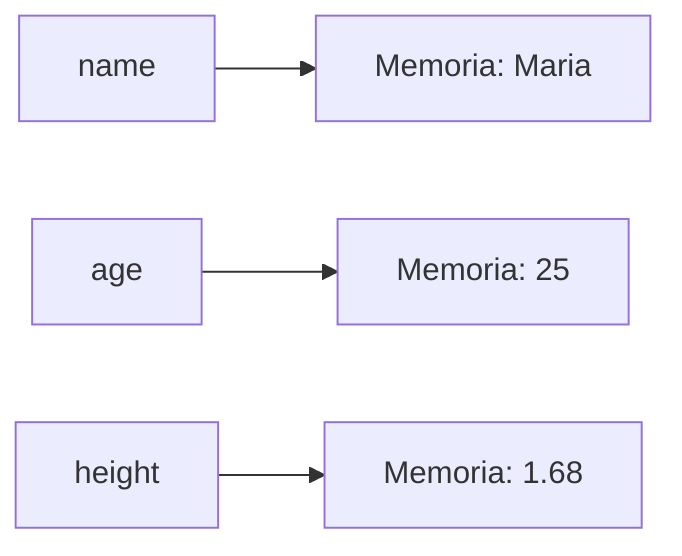

# 5.5 — Variáveis e Tipos de Dados

[← Anterior: Seu Primeiro Programa: print() e input()](cap05-mod04-print-input-conteudo.md) · [Próximo: Conversão de Tipos e Manipulação de Strings →](cap05-mod06-conversao-strings-conteudo.md)

---

## Introdução

No módulo anterior, você criou programas que conversam com o usuário usando `print()` e `input()`. Usou variáveis para guardar o que o usuário digitou — mas não explicamos em profundidade o que são variáveis e como funcionam.

Neste módulo, vamos mergulhar nesse conceito fundamental. Variáveis são a forma como o computador **guarda informações na memória** para usar depois. Sem variáveis, cada dado seria perdido no instante seguinte — como tentar fazer uma conta de cabeça sem poder anotar os números intermediários.

Além de entender variáveis, vamos aprender sobre **tipos de dados** — porque o Python trata números, textos e valores verdadeiro/falso de formas diferentes, e entender essas diferenças é essencial para evitar erros.

Este é um dos módulos mais importantes do capítulo. Tudo que vem depois — operadores, condicionais, loops, funções — depende de você entender bem variáveis e tipos. Leia com calma, execute todos os exemplos e faça os exercícios.

---

## Como Executar os Exemplos Deste Módulo

1. Abra o VSCode na sua pasta de projetos: `code ~/projetos/python`
2. Crie um novo arquivo para cada seção (ex: `variaveis_basico.py`)
3. Copie o código, salve (`Ctrl + S`) e execute no terminal: `python3 nome_do_arquivo.py`

---

## O que é uma Variável?

Lá no módulo 1.1, usamos a analogia da cozinha para explicar o computador. A RAM (memória) é a bancada de trabalho — onde o cozinheiro coloca os ingredientes que está usando no momento. Uma variável é como um **pote etiquetado** nessa bancada: tem um nome (a etiqueta) e guarda um valor (o conteúdo).

Uma **variável** é um espaço na memória do computador que:
- Tem um **nome** (que você escolhe)
- Guarda um **valor** (que pode mudar)
- Tem um **tipo** (que o Python define automaticamente)

### Criando uma variável

Em Python, você cria uma variável simplesmente dando um nome e atribuindo um valor com o sinal `=`:

```python
# Criando variaveis
# "name" = nome - guarda um texto
name = "Maria"

# "age" = idade - guarda um numero inteiro
age = 25

# "height" = altura - guarda um numero decimal
height = 1.68

# "is_student" = e estudante - guarda verdadeiro ou falso
is_student = True

# Exibindo os valores
print("Nome:", name)
print("Idade:", age)
print("Altura:", height)
print("Estudante:", is_student)
```

Saída esperada:

```
Nome: Maria
Idade: 25
Altura: 1.68
Estudante: True
```

### O sinal = não significa "igual"

Em matemática, `=` significa "é igual a". Em programação, `=` significa **"recebe"** ou **"guarda o valor"**.

Quando escrevemos `age = 25`, estamos dizendo: "a variável `age` recebe o valor 25". Não estamos afirmando que age é igual a 25 — estamos **guardando** o valor 25 dentro da variável age.

Essa diferença é sutil mas importante. Em Python, o operador de comparação "é igual a" é `==` (dois sinais de igual). Vamos aprender sobre ele no módulo 5.7.

```python
# = significa "recebe" (atribuicao)
# "score" = pontuacao
score = 100  # score RECEBE o valor 100

# == significa "e igual a?" (comparacao) - vamos ver no modulo 5.7
# score == 100  # score E IGUAL A 100? (retorna True ou False)
```

### Trocando o valor de uma variável

Você pode mudar o valor de uma variável a qualquer momento. O valor antigo é substituído pelo novo:

```python
# "price" = preco
price = 10.50
print("Preco original:", price)

# Trocando o valor - o antigo (10.50) e perdido
price = 8.99
print("Preco com desconto:", price)

# Trocando de novo
price = 12.00
print("Preco reajustado:", price)
```

Saída esperada:

```
Preco original: 10.5
Preco com desconto: 8.99
Preco reajustado: 12.0
```

A variável é como uma caixa: só cabe um valor por vez. Quando você coloca um valor novo, o anterior é descartado.

### Como o computador armazena variáveis

Quando você escreve `name = "Maria"`, o Python faz o seguinte internamente:

1. Reserva um espaço na memória RAM
2. Guarda o valor `"Maria"` nesse espaço
3. Associa o nome `name` a esse espaço

Quando você usa `name` depois (por exemplo, em `print(name)`), o Python vai até o espaço de memória associado ao nome `name` e recupera o valor guardado lá.



Você não precisa se preocupar com os detalhes de como a memória funciona — o Python cuida disso automaticamente. No capítulo 7, quando aprendermos C, vamos ver como isso funciona "por baixo dos panos", com endereços de memória e ponteiros. Por enquanto, a analogia da caixa etiquetada é suficiente.

---

## Regras para Nomes de Variáveis

Você pode escolher qualquer nome para suas variáveis, mas existem regras que devem ser seguidas:

### Regras obrigatórias (o Python dá erro se você quebrar)

| Regra | Exemplo válido | Exemplo inválido | Por quê |
|-------|---------------|-------------------|---------|
| Deve começar com letra ou _ | `name`, `_temp` | `1name`, `@valor` | Números e símbolos no início confundem o interpretador |
| Só pode conter letras, números e _ | `user_name`, `nota1` | `user-name`, `nota!` | Hífens e símbolos especiais têm outros significados |
| Não pode ser uma palavra reservada | `nome`, `idade` | `if`, `for`, `print` | Palavras reservadas já têm função no Python |
| Diferencia maiúsculas de minúsculas | `Name` e `name` são diferentes | — | Python é case-sensitive |

### Palavras reservadas do Python

Estas palavras já têm significado especial no Python e **não podem** ser usadas como nomes de variáveis:

```
False    True     None     and      as       assert
async    await    break    class    continue def
del      elif     else     except   finally  for
from     global   if       import   in       is
lambda   nonlocal not      or       pass     raise
return   try      while    with     yield
```

Não precisa decorar — se você tentar usar uma dessas como nome de variável, o Python vai dar erro e você saberá que precisa trocar o nome.

### Convenções (boas práticas — não dão erro, mas são importantes)

| Convenção | Exemplo | Quando usar |
|-----------|---------|-------------|
| snake_case | `user_name`, `total_price` | Variáveis e funções (padrão Python) |
| UPPER_CASE | `MAX_ATTEMPTS`, `PI` | Constantes (valores que não mudam) |
| Nomes em inglês | `name`, `age`, `price` | Convenção profissional |
| Nomes descritivos | `total_price` | Sempre — o nome deve explicar o conteúdo |

```python
# BOM: nomes descritivos em snake_case
# "user_name" = nome do usuario
user_name = "Maria"
# "total_price" = preco total
total_price = 49.90
# "item_count" = quantidade de itens
item_count = 3

# RUIM: nomes que nao dizem nada
x = "Maria"
y = 49.90
z = 3
```

A diferença parece pequena agora, mas quando seu programa tiver 100 linhas, nomes descritivos fazem toda a diferença. `total_price` diz exatamente o que a variável guarda. `y` não diz nada.

### Por que nomes em inglês?

Neste curso, usamos nomes de variáveis em inglês com tradução em comentários. Isso é a convenção profissional — a grande maioria do código no mundo é escrita com nomes em inglês. Motivos:

- Linguagens de programação usam palavras em inglês (`print`, `input`, `if`, `for`)
- Misturar português e inglês no código fica confuso (`calcular_total_price`)
- Código em inglês pode ser lido por programadores de qualquer país
- Empresas brasileiras que trabalham com equipes internacionais exigem código em inglês

Mas não se preocupe se seu inglês é básico — as palavras usadas em programação são poucas e simples. Vamos traduzir todas em comentários.

---

## Os Quatro Tipos Básicos de Dados

Em Python, cada valor tem um **tipo** que define que tipo de informação ele representa e o que você pode fazer com ele. Os quatro tipos básicos são:

| Tipo | Nome em Python | O que representa | Exemplos |
|------|---------------|-----------------|----------|
| Inteiro | `int` | Números sem casas decimais | `42`, `-5`, `0`, `1000` |
| Decimal | `float` | Números com casas decimais | `3.14`, `-0.5`, `100.0` |
| Texto | `str` | Sequência de caracteres | `"Maria"`, `'Olá'`, `"123"` |
| Booleano | `bool` | Verdadeiro ou Falso | `True`, `False` |

### int — Números Inteiros

O tipo `int` (*integer* = inteiro) representa números sem casas decimais:

```python
# Exemplos de numeros inteiros (int)
# "quantity" = quantidade
quantity = 10
# "temperature" = temperatura
temperature = -5
# "year" = ano
year = 2026
# "zero" = zero
zero = 0

print("Quantidade:", quantity, "- Tipo:", type(quantity))
print("Temperatura:", temperature, "- Tipo:", type(temperature))
print("Ano:", year, "- Tipo:", type(year))
print("Zero:", zero, "- Tipo:", type(zero))
```

Saída esperada:

```
Quantidade: 10 - Tipo: <class 'int'>
Temperatura: -5 - Tipo: <class 'int'>
Ano: 2026 - Tipo: <class 'int'>
Zero: 0 - Tipo: <class 'int'>
```

Inteiros podem ser positivos, negativos ou zero. Não têm limite de tamanho em Python — você pode ter números enormes:

```python
# Python lida com numeros muito grandes sem problemas
# "big_number" = numero grande
big_number = 999999999999999999999999999999
print("Numero grande:", big_number)
print("Tipo:", type(big_number))
```

Saída esperada:

```
Numero grande: 999999999999999999999999999999
Tipo: <class 'int'>
```

### float — Números Decimais

O tipo `float` (*floating point* = ponto flutuante) representa números com casas decimais:

```python
# Exemplos de numeros decimais (float)
# "price" = preco
price = 19.99
# "pi" = pi (constante matematica)
pi = 3.14159
# "negative" = negativo
negative = -0.5
# "whole_float" = inteiro como float
whole_float = 10.0

print("Preco:", price, "- Tipo:", type(price))
print("Pi:", pi, "- Tipo:", type(pi))
print("Negativo:", negative, "- Tipo:", type(negative))
print("Inteiro como float:", whole_float, "- Tipo:", type(whole_float))
```

Saída esperada:

```
Preco: 19.99 - Tipo: <class 'float'>
Pi: 3.14159 - Tipo: <class 'float'>
Negativo: -0.5 - Tipo: <class 'float'>
Inteiro como float: 10.0 - Tipo: <class 'float'>
```

Atenção: em programação, usamos **ponto** (`.`) para separar decimais, não vírgula. `3.14` está correto. `3,14` vai dar erro.

Isso é diferente do que usamos no dia a dia no Brasil (onde escrevemos R$ 3,14). Em código, sempre use ponto.

### str — Texto (Strings)

O tipo `str` (*string* = cadeia de caracteres) representa texto — qualquer sequência de caracteres entre aspas:

```python
# Exemplos de strings (str)
# "greeting" = saudacao
greeting = "Ola, mundo!"
# "empty" = vazio
empty = ""
# "number_as_text" = numero como texto
number_as_text = "42"
# "mixed" = misturado
mixed = "Tenho 25 anos"

print("Saudacao:", greeting, "- Tipo:", type(greeting))
print("Vazio:", empty, "- Tipo:", type(empty))
print("Numero como texto:", number_as_text, "- Tipo:", type(number_as_text))
print("Misturado:", mixed, "- Tipo:", type(mixed))
```

Saída esperada:

```
Saudacao: Ola, mundo! - Tipo: <class 'str'>
Vazio:  - Tipo: <class 'str'>
Numero como texto: 42 - Tipo: <class 'str'>
Misturado: Tenho 25 anos - Tipo: <class 'str'>
```

Ponto crucial: `42` (sem aspas) é um número inteiro. `"42"` (com aspas) é um texto. Para o Python, são coisas completamente diferentes. Você pode fazer contas com `42`, mas não com `"42"`.

### bool — Booleano (Verdadeiro ou Falso)

O tipo `bool` (*boolean* = booleano) representa apenas dois valores possíveis: `True` (verdadeiro) ou `False` (falso):

```python
# Exemplos de booleanos (bool)
# "is_active" = esta ativo
is_active = True
# "is_admin" = e administrador
is_admin = False
# "has_permission" = tem permissao
has_permission = True

print("Ativo:", is_active, "- Tipo:", type(is_active))
print("Admin:", is_admin, "- Tipo:", type(is_admin))
print("Permissao:", has_permission, "- Tipo:", type(has_permission))
```

Saída esperada:

```
Ativo: True - Tipo: <class 'bool'>
Admin: False - Tipo: <class 'bool'>
Permissao: True - Tipo: <class 'bool'>
```

Atenção: `True` e `False` começam com letra maiúscula. `true` e `false` (minúsculos) não funcionam em Python.

O nome "booleano" vem de **George Boole** (1815-1864), um matemático inglês que criou a álgebra booleana — um sistema matemático baseado em verdadeiro e falso. Toda a lógica dos computadores é construída sobre esse sistema.

Booleanos parecem simples, mas são extremamente poderosos. No módulo 5.9 (Condicionais), vamos usar booleanos para fazer o programa tomar decisões: "se isso for verdadeiro, faça aquilo; senão, faça outra coisa".

---

## Tipagem Dinâmica: Python Descobre o Tipo Sozinho

Uma característica importante do Python é a **tipagem dinâmica**. Isso significa que você não precisa dizer ao Python qual é o tipo da variável — ele descobre sozinho pelo valor que você atribui.

```python
# Python descobre o tipo automaticamente
# "x" = variavel generica para demonstracao
x = 42          # Python sabe que e int
print(x, "- Tipo:", type(x))

x = 3.14        # Agora x e float
print(x, "- Tipo:", type(x))

x = "texto"     # Agora x e str
print(x, "- Tipo:", type(x))

x = True        # Agora x e bool
print(x, "- Tipo:", type(x))
```

Saída esperada:

```
42 - Tipo: <class 'int'>
3.14 - Tipo: <class 'float'>
texto - Tipo: <class 'str'>
True - Tipo: <class 'bool'>
```

A mesma variável `x` mudou de tipo quatro vezes. Em Python, isso é permitido. Em outras linguagens (como C, Java e C#), você precisa declarar o tipo da variável antes de usá-la, e ela não pode mudar de tipo depois. Isso é chamado de **tipagem estática**.

| Característica | Python (tipagem dinâmica) | C/Java (tipagem estática) |
|---------------|--------------------------|--------------------------|
| Declarar tipo | Não precisa | Obrigatório |
| Mudar tipo | Permitido | Não permitido |
| Detecção de erros | Em tempo de execução | Em tempo de compilação |
| Flexibilidade | Alta | Menor |
| Segurança de tipos | Menor | Maior |

Para iniciantes, tipagem dinâmica é uma vantagem — menos coisas para se preocupar. Mas é importante saber que o tipo existe e importa, mesmo que o Python cuide disso automaticamente.

---

## Operações Básicas com Cada Tipo

Cada tipo de dado suporta operações diferentes. Vamos ver as mais comuns:

### Operações com números (int e float)

```python
# Operacoes matematicas basicas
# "a" e "b" = numeros para demonstracao
a = 10
b = 3

print("Soma:", a + b)          # 13
print("Subtracao:", a - b)     # 7
print("Multiplicacao:", a * b) # 30
print("Divisao:", a / b)       # 3.333...
print("Divisao inteira:", a // b)  # 3 (sem decimais)
print("Resto:", a % b)         # 1 (resto da divisao)
print("Potencia:", a ** b)     # 1000 (10 elevado a 3)
```

Saída esperada:

```
Soma: 13
Subtracao: 7
Multiplicacao: 30
Divisao: 3.3333333333333335
Divisao inteira: 3
Resto: 1
Potencia: 1000
```

Vamos aprofundar todos os operadores no módulo 5.7. Por enquanto, o importante é saber que números suportam operações matemáticas.

### Operações com strings

Strings suportam operações diferentes de números:

```python
# Concatenacao: juntar textos com +
# "first_name" = primeiro nome, "last_name" = sobrenome
first_name = "Maria"
last_name = "Silva"
# "full_name" = nome completo
full_name = first_name + " " + last_name
print("Nome completo:", full_name)

# Repeticao: repetir texto com *
# "line" = linha
line = "-" * 30
print(line)

# Tamanho: contar caracteres com len()
# "message" = mensagem
message = "Python e incrivel"
print("Mensagem:", message)
print("Tamanho:", len(message), "caracteres")
```

Saída esperada:

```
Nome completo: Maria Silva
------------------------------
Mensagem: Python e incrivel
Tamanho: 18 caracteres
```

Atenção: o operador `+` funciona de forma diferente para números e strings:
- Com números: `5 + 3` = `8` (soma matemática)
- Com strings: `"5" + "3"` = `"53"` (concatenação — junta os textos)

Essa diferença é uma das fontes mais comuns de erros para iniciantes. Lembre-se: se os valores estão entre aspas, são texto. Se não estão, são números.

### Operações com booleanos

Booleanos suportam operações lógicas (que vamos aprofundar no módulo 5.7):

```python
# Operacoes logicas basicas
# "a" e "b" = valores booleanos para demonstracao
a = True
b = False

# "and" = E (ambos precisam ser True)
print("True and True:", True and True)    # True
print("True and False:", True and False)  # False

# "or" = OU (pelo menos um precisa ser True)
print("True or False:", True or False)    # True
print("False or False:", False or False)  # False

# "not" = NAO (inverte o valor)
print("not True:", not True)    # False
print("not False:", not False)  # True
```

Saída esperada:

```
True and True: True
True and False: False
True or False: True
False or False: False
not True: False
not False: True
```

---

## Variáveis e input(): Juntando Tudo

Agora vamos combinar o que aprendemos sobre variáveis e tipos com o `input()` do módulo anterior:

```python
# Programa que coleta dados e faz calculos
print("=== Calculadora de Compras ===")
print()

# Recebe os dados do usuario
# "product" = produto
product = input("Nome do produto: ")
# "price" = preco - convertemos para float porque e um numero decimal
price = float(input("Preco unitario: R$ "))
# "quantity" = quantidade - convertemos para int porque e um numero inteiro
quantity = int(input("Quantidade: "))

# Calcula o total
# "total" = total
total = price * quantity

# Calcula o desconto de 10% para compras acima de R$ 100
# "discount" = desconto
# "final_price" = preco final
if total > 100:
    discount = total * 0.10
    final_price = total - discount
    print()
    print("Produto:", product)
    print("Subtotal: R$", total)
    print("Desconto (10%): R$", discount)
    print("Total final: R$", final_price)
else:
    print()
    print("Produto:", product)
    print("Total: R$", total)
```

Saída esperada (se digitar "Caderno", "15.90" e "8"):

```
=== Calculadora de Compras ===

Nome do produto: Caderno
Preco unitario: R$ 15.90
Quantidade: 8

Produto: Caderno
Subtotal: R$ 127.2
Desconto (10%): R$ 12.72
Total final: R$ 114.48
```

Esse programa usa um `if` (condicional) que ainda não aprendemos formalmente — vamos ver no módulo 5.9. Mas já dá para ter uma ideia de como variáveis, tipos e lógica se conectam.

---

## Múltiplas Atribuições

Python permite criar várias variáveis em uma única linha:

```python
# Atribuicao multipla: varias variaveis de uma vez
# "name" = nome, "age" = idade, "city" = cidade
name, age, city = "Ana", 28, "Curitiba"

print("Nome:", name)
print("Idade:", age)
print("Cidade:", city)
```

Saída esperada:

```
Nome: Ana
Idade: 28
Cidade: Curitiba
```

```python
# Mesmo valor para varias variaveis
# "x", "y", "z" = coordenadas
x = y = z = 0

print("x:", x, "y:", y, "z:", z)
```

Saída esperada:

```
x: 0 y: 0 z: 0
```

```python
# Trocar valores entre variaveis (swap)
# "a" e "b" = valores para trocar
a = 10
b = 20
print("Antes: a =", a, "b =", b)

# Em Python, trocar e simples:
a, b = b, a
print("Depois: a =", a, "b =", b)
```

Saída esperada:

```
Antes: a = 10 b = 20
Depois: a = 20 b = 10
```

Essa troca de valores (`a, b = b, a`) é uma funcionalidade elegante do Python. Em outras linguagens, você precisaria de uma variável temporária para fazer isso.

---

## A Função type(): Descobrindo o Tipo

A função `type()` retorna o tipo de qualquer valor ou variável. É muito útil para debugging (encontrar erros):

```python
# Verificando tipos de diferentes valores
print(type(42))         # <class 'int'>
print(type(3.14))       # <class 'float'>
print(type("texto"))    # <class 'str'>
print(type(True))       # <class 'bool'>

# Verificando tipo de variaveis
# "result" = resultado
result = 10 / 3
print("Resultado:", result, "- Tipo:", type(result))

# Cuidado: input() sempre retorna str!
# "user_input" = entrada do usuario
user_input = input("Digite algo: ")
print("Voce digitou:", user_input, "- Tipo:", type(user_input))
```

Saída esperada (se digitar "42"):

```
<class 'int'>
<class 'float'>
<class 'str'>
<class 'bool'>
Resultado: 3.3333333333333335 - Tipo: <class 'float'>
Digite algo: 42
Voce digitou: 42 - Tipo: <class 'str'>
```

Perceba: mesmo digitando `42`, o `input()` retorna `'42'` como string. Isso reforça o que vimos no módulo 5.4 — sempre converta com `int()` ou `float()` quando precisar fazer contas.

---

## None: A Ausência de Valor

Python tem um valor especial chamado `None` que representa "nada" ou "nenhum valor". É diferente de zero, de string vazia ou de False:

```python
# None representa a ausencia de valor
# "result" = resultado
result = None
print("Resultado:", result)
print("Tipo:", type(result))

# None e diferente de 0, "" e False
print()
print("None e 0 sao iguais?", None == 0)
print("None e '' sao iguais?", None == "")
print("None e False sao iguais?", None == False)
```

Saída esperada:

```
Resultado: None
Tipo: <class 'NoneType'>

None e 0 sao iguais? False
None e '' sao iguais? False
None e False sao iguais? False
```

`None` é útil quando você quer criar uma variável mas ainda não tem um valor para ela. Vamos usar `None` mais adiante no curso.

---

## Como a IA pode te ajudar aqui

**Prompt 1 — Explorar o conceito:**
> "Me explique a diferença entre int, float, str e bool em Python com exemplos práticos do dia a dia. Quando devo usar cada um?"

**Prompt 2 — Criar com ajuda da IA:**
> "Crie um programa Python que usa pelo menos 5 variáveis de tipos diferentes (int, float, str, bool) para simular um cadastro de produto em uma loja. Explique cada linha."

**Prompt 3 — Entender erros comuns:**
> "Meu programa Python dá erro 'TypeError: can only concatenate str to str'. O que isso significa e como resolvo?"

---

## Casos de Uso no Mundo Real

### 1. Variáveis em sistemas de e-commerce

Quando você compra algo online, o sistema usa variáveis para guardar cada informação da compra: nome do produto (`product_name`), preço (`price`), quantidade (`quantity`), endereço de entrega (`shipping_address`), método de pagamento (`payment_method`). Cada variável tem um tipo específico — preço é float, quantidade é int, nome é string. Se o sistema confundir os tipos (tratar preço como string, por exemplo), o cálculo do total vai dar errado.

### 2. Tipos de dados em formulários web

Quando você preenche um formulário na internet, cada campo tem um tipo esperado: nome (texto), idade (número inteiro), email (texto com formato específico), "aceito os termos" (booleano — sim ou não). O sistema válida se o tipo está correto antes de aceitar os dados. Se você digitar letras no campo de idade, o sistema rejeita — exatamente como o `int()` do Python rejeita texto que não é número.

### 3. Booleanos em sistemas de permissão

Sistemas de segurança usam booleanos extensivamente: `is_logged_in` (está logado?), `is_admin` (é administrador?), `has_permission` (tem permissão?), `is_active` (conta está ativa?). Cada verificação retorna True ou False, e o sistema decide o que mostrar ou permitir com base nesses valores.

---

## Resumo do Módulo

| Conceito | Definição |
|----------|-----------|
| Variável | Espaço na memória com nome, valor e tipo |
| int | Tipo numérico inteiro (sem casas decimais) |
| float | Tipo numérico decimal (com ponto flutuante) |
| str | Tipo texto (string — sequência de caracteres entre aspas) |
| bool | Tipo booleano (True ou False) |
| None | Valor especial que representa ausência de valor |
| Tipagem dinâmica | Python descobre o tipo automaticamente pelo valor atribuído |
| snake_case | Convenção de nomes com palavras separadas por _ |
| type() | Função que retorna o tipo de um valor ou variável |
| Atribuição | Operação de guardar um valor em uma variável (usando =) |

---

## Glossário do Módulo

| Termo | Definição |
|-------|-----------|
| Atribuição (assignment) | Operação de guardar um valor em uma variável usando o operador = |
| bool (boolean) | Tipo de dado que representa verdadeiro (True) ou falso (False) |
| Case-sensitive | Propriedade de distinguir maiúsculas de minúsculas — `Name` e `name` são diferentes |
| Concatenação (concatenation) | Juntar strings usando o operador + |
| Constante (constant) | Variável cujo valor não deve ser alterado — por convenção, usa UPPER_CASE |
| float (floating point) | Tipo de dado numérico com casas decimais |
| George Boole | Matemático inglês (1815-1864) que criou a álgebra booleana |
| int (integer) | Tipo de dado numérico inteiro, sem casas decimais |
| len() | Função que retorna o tamanho (número de caracteres) de uma string |
| None | Valor especial do Python que representa ausência de valor |
| Palavra reservada (keyword) | Palavra com significado especial no Python que não pode ser usada como nome de variável |
| snake_case | Convenção de nomenclatura onde palavras são separadas por underscore: `user_name` |
| str (string) | Tipo de dado que representa texto — sequência de caracteres |
| Tipagem dinâmica (dynamic typing) | Sistema onde o tipo da variável é determinado automaticamente pelo valor |
| Tipagem estática (static typing) | Sistema onde o tipo da variável deve ser declarado explicitamente |
| type() | Função embutida que retorna o tipo de um valor ou variável |
| UPPER_CASE | Convenção de nomenclatura para constantes: `MAX_VALUE` |
| Variável (variable) | Espaço nomeado na memória que armazena um valor |

---

## Na Cultura Popular

- **Eu, Robô** (filme, 2004) — baseado nos contos de Isaac Asimov, mostra robôs que armazenam dados sobre humanos (nomes, preferências, histórico de interações) para tomar decisões. Cada dado armazenado é essencialmente uma variável — um valor guardado na memória da máquina com um propósito específico.

- **Westworld** (série, 2016-2022) — os "anfitriões" (robôs) do parque têm memórias que podem ser editadas, apagadas ou substituídas pelos programadores. Isso é exatamente o que fazemos com variáveis: criar, atribuir valores, mudar valores e, eventualmente, descartar.

---

## Para Saber Mais

- [W3Schools — Python Variables](https://www.w3schools.com/python/python_variables.asp) — *Tutorial completo sobre variáveis em Python*
- [W3Schools — Python Data Types](https://www.w3schools.com/python/python_datatypes.asp) — *Todos os tipos de dados do Python*
- [Documentação Python — Tipos Embutidos](https://docs.python.org/pt-br/3/library/stdtypes.html) — *Referência oficial dos tipos de dados*
- [GitHub do Fino — learn-ops-content](https://github.com/RafaelFino/learn-ops-content) — *Material de referência do Fino*

---

## Perguntas Frequentes (FAQ)

**P: Preciso declarar o tipo da variável em Python?**
R: Não. Python usa tipagem dinâmica — ele descobre o tipo automaticamente pelo valor. Basta escrever `x = 42` e o Python sabe que é int.

**P: Posso mudar o tipo de uma variável?**
R: Sim. Em Python, `x = 42` (int) e depois `x = "texto"` (str) é perfeitamente válido. A variável muda de tipo.

**P: Qual a diferença entre `42` e `"42"`?**
R: `42` (sem aspas) é um número inteiro — você pode fazer contas com ele. `"42"` (com aspas) é texto — o Python trata como uma sequência de caracteres, não como número.

**P: Por que usar nomes em inglês?**
R: É a convenção profissional. Código em inglês pode ser lido por programadores de qualquer país. Além disso, misturar português e inglês no código fica confuso.

**P: O que acontece se eu usar uma palavra reservada como nome?**
R: O Python dá erro de sintaxe (SyntaxError). Por exemplo, `if = 5` não funciona porque `if` é uma palavra reservada.

**P: O que é snake_case?**
R: É a convenção de nomes em Python onde palavras são separadas por underscore: `user_name`, `total_price`. É o padrão para variáveis e funções.

**P: None é a mesma coisa que zero?**
R: Não. `None` significa "nenhum valor" — a variável existe mas não tem conteúdo. `0` é um valor numérico. São coisas diferentes.

**P: O que é `type()`?**
R: É uma função que mostra o tipo de um valor. `type(42)` retorna `<class 'int'>`. Muito útil para verificar se uma conversão funcionou.

**P: Posso usar acentos em nomes de variáveis?**
R: Tecnicamente sim, Python 3 aceita. Mas não é recomendado — pode causar problemas de compatibilidade e não segue as convenções profissionais.

**P: O que é "ponto flutuante"?**
R: É a forma como computadores representam números decimais. O "ponto" é o separador decimal (3.14) e "flutuante" significa que ele pode se mover (representar números muito grandes ou muito pequenos).

**P: Por que True e False começam com maiúscula?**
R: É uma convenção do Python. Em outras linguagens (como JavaScript), são minúsculos (`true`, `false`). Em Python, `True` e `False` são as formas corretas.

**P: Posso criar variáveis dentro do REPL?**
R: Sim. No modo interativo do Python, variáveis funcionam normalmente. Mas elas são perdidas quando você sai do REPL com `exit()`.

---

## Exercícios Práticos

Os exercícios completos deste módulo estão no arquivo separado:

**[Acessar Exercícios do Módulo 5.5](cap05-mod05-variaveis-tipos-exercicios.md)**

Prévia dos exercícios:

### Exercício rápido 1 — Ficha pessoal

Crie um programa que pede nome, idade, altura e se a pessoa é estudante (sim/não), guarda em variáveis com tipos apropriados e exibe tudo formatado.

### Exercício rápido 2 — Trace mental

Sem executar o código, diga qual será a saída:

```python
x = 10
y = 20
x = y
y = 5
print("x:", x, "y:", y)
```

Depois execute para verificar se acertou.

### Exercício rápido 3 — Tipos misturados

Crie variáveis de cada tipo (int, float, str, bool) e use `type()` para confirmar o tipo de cada uma. Depois, tente somar um int com um float e veja o que acontece com o tipo do resultado.

---

[← Anterior: Seu Primeiro Programa: print() e input()](cap05-mod04-print-input-conteudo.md) · [Próximo: Conversão de Tipos e Manipulação de Strings →](cap05-mod06-conversao-strings-conteudo.md)
