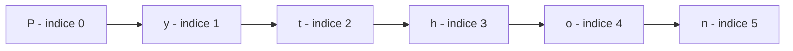

# 5.6 — Conversão de Tipos e Manipulação de Strings

[← Anterior: Variáveis e Tipos de Dados](cap05-mod05-variaveis-tipos-conteudo.md) · [Próximo: Operadores Matemáticos e Lógicos →](cap05-mod07-operadores-conteudo.md)

---

## Introdução

No módulo anterior, você aprendeu que Python tem quatro tipos básicos de dados: int, float, str e bool. Viu que cada tipo se comporta de forma diferente — números fazem contas, strings se juntam, booleanos representam verdadeiro ou falso.

Mas e quando você precisa transformar um tipo em outro? Quando o usuário digita "25" (texto) e você precisa do número 25 para fazer um cálculo? Quando você tem o número 3.14 e precisa exibi-lo dentro de uma frase?

Neste módulo, vamos aprender duas habilidades essenciais:

1. **Conversão de tipos** — transformar dados de um tipo para outro (texto para número, número para texto, etc.)
2. **Manipulação de strings** — trabalhar com texto de formas poderosas (cortar, juntar, buscar, formatar)

Strings são o tipo de dado mais usado em programação. Praticamente todo programa lida com texto — nomes, mensagens, endereços, senhas, logs. Dominar strings é fundamental.

---

## Como Executar os Exemplos Deste Módulo

1. Abra o VSCode na sua pasta de projetos: `code ~/projetos/python`
2. Crie um novo arquivo para cada seção (ex: `conversao.py`, `strings.py`)
3. Copie o código, salve (`Ctrl + S`) e execute: `python3 nome_do_arquivo.py`

---

## Conversão de Tipos (Type Casting)

Converter um valor de um tipo para outro é chamado de **type casting** (*casting* = moldagem). Python oferece funções embutidas para isso:

| Função | Converte para | Exemplo |
|--------|--------------|---------|
| `int()` | Número inteiro | `int("42")` → `42` |
| `float()` | Número decimal | `float("3.14")` → `3.14` |
| `str()` | Texto (string) | `str(42)` → `"42"` |
| `bool()` | Booleano | `bool(1)` → `True` |

### Convertendo texto para número

Esta é a conversão mais comum — você já usou no módulo 5.4 com `input()`:

```python
# Texto para inteiro
# "text_age" = idade como texto
text_age = "25"
# "num_age" = idade como numero
num_age = int(text_age)

print("Texto:", text_age, "- Tipo:", type(text_age))
print("Numero:", num_age, "- Tipo:", type(num_age))
print("Daqui a 10 anos:", num_age + 10)
```

Saída esperada:

```
Texto: 25 - Tipo: <class 'str'>
Numero: 25 - Tipo: <class 'int'>
Daqui a 10 anos: 35
```

```python
# Texto para decimal
# "text_price" = preco como texto
text_price = "19.99"
# "num_price" = preco como numero
num_price = float(text_price)

print("Texto:", text_price, "- Tipo:", type(text_price))
print("Numero:", num_price, "- Tipo:", type(num_price))
print("Com 10% de desconto: R$", round(num_price * 0.9, 2))
```

Saída esperada:

```
Texto: 19.99 - Tipo: <class 'str'>
Numero: 19.99 - Tipo: <class 'float'>
Com 10% de desconto: R$ 17.99
```

### Quando a conversão falha

Nem toda conversão é possível. Se o texto não representar um número válido, o Python dá erro:

```python
# Isso funciona:
print(int("42"))      # 42
print(float("3.14"))  # 3.14

# Isso NAO funciona e da ValueError:
# int("abc")    # ERRO! "abc" nao e um numero
# int("3.14")   # ERRO! "3.14" tem ponto decimal, nao e inteiro
# float("xyz")  # ERRO! "xyz" nao e um numero
```

Atenção: `int("3.14")` dá erro porque `int()` espera um número inteiro (sem ponto). Para converter "3.14" para inteiro, primeiro converta para float e depois para int:

```python
# Convertendo texto decimal para inteiro (em dois passos)
# "text_value" = valor como texto
text_value = "3.14"
# Primeiro para float, depois para int
# "int_value" = valor como inteiro
int_value = int(float(text_value))
print("Resultado:", int_value)  # 3 (a parte decimal e descartada)
```

Saída esperada:

```
Resultado: 3
```

### Convertendo número para texto

Às vezes você precisa transformar um número em texto — por exemplo, para juntar com outra string:

```python
# Numero para texto
# "age" = idade
age = 25
# "message" = mensagem
# Sem conversao, isso daria erro:
# message = "Tenho " + age + " anos"  # ERRO! Nao pode somar str + int

# Com conversao, funciona:
message = "Tenho " + str(age) + " anos"
print(message)
```

Saída esperada:

```
Tenho 25 anos
```

### Conversão entre int e float

```python
# Int para float
# "x" = variavel numerica
x = 42
print("Int:", x, "-> Float:", float(x))

# Float para int (TRUNCA - descarta a parte decimal, nao arredonda)
# "y" = variavel numerica
y = 3.99
print("Float:", y, "-> Int:", int(y))  # 3, NAO 4!

# Para arredondar, use round()
print("Float:", y, "-> Arredondado:", round(y))  # 4
```

Saída esperada:

```
Int: 42 -> Float: 42.0
Float: 3.99 -> Int: 3
Float: 3.99 -> Arredondado: 4
```

Atenção importante: `int()` **trunca** (corta a parte decimal), não arredonda. `int(3.99)` é `3`, não `4`. Se quiser arredondar, use `round()`.

### Conversão para booleano

A função `bool()` converte qualquer valor para True ou False seguindo uma regra simples:

```python
# Valores que viram False (valores "vazios" ou "zero")
print("bool(0):", bool(0))           # False
print("bool(0.0):", bool(0.0))       # False
print('bool(""):', bool(""))         # False (string vazia)
print("bool(None):", bool(None))     # False

print()

# Valores que viram True (qualquer coisa que nao seja "vazio" ou "zero")
print("bool(1):", bool(1))           # True
print("bool(-5):", bool(-5))         # True
print("bool(3.14):", bool(3.14))     # True
print('bool("texto"):', bool("texto"))  # True
print('bool(" "):', bool(" "))       # True (espaco conta como conteudo!)
```

Saída esperada:

```
bool(0): False
bool(0.0): False
bool(""): False
bool(None): False

bool(1): True
bool(-5): True
bool(3.14): True
bool("texto"): True
bool(" "): True
```

A regra é: **zero, vazio e None são False. Todo o resto é True.** Essa regra vai ser muito útil no módulo 5.9 (Condicionais).

---

## Conversão na Prática: Padrões Comuns

Vamos ver os padrões de conversão que você vai usar com mais frequência:

### Padrão 1: input() com conversão

```python
# O padrao mais comum: ler e converter em uma linha
# "age" = idade
age = int(input("Sua idade: "))
# "weight" = peso
weight = float(input("Seu peso: "))
# "name" = nome (nao precisa converter - ja e string)
name = input("Seu nome: ")

print(f"{name} tem {age} anos e pesa {weight} kg")
```

Saída esperada (se digitar "Ana", "28", "65.5"):

```
Sua idade: 28
Seu peso: 65.5
Seu nome: Ana
Ana tem 28 anos e pesa 65.5 kg
```

### Padrão 2: número para texto formatado

```python
# Formatando numeros como texto
# "total" = total
total = 1234.5
# "formatted" = formatado
formatted = f"R$ {total:,.2f}"
print(formatted)

# Convertendo para string simples
# "age" = idade
age = 25
# "message" = mensagem
message = "Idade: " + str(age) + " anos"
print(message)
```

Saída esperada:

```
R$ 1,234.50
Idade: 25 anos
```

### Padrão 3: verificar antes de converter

```python
# Verificar se o texto e um numero antes de converter
# "user_input" = entrada do usuario
user_input = input("Digite um numero: ")

if user_input.isdigit():
    # "number" = numero
    number = int(user_input)
    print(f"O dobro de {number} e {number * 2}")
else:
    print(f"'{user_input}' nao e um numero inteiro valido")
```

Saída esperada (se digitar "42"):

```
Digite um numero: 42
O dobro de 42 e 84
```

Saída esperada (se digitar "abc"):

```
Digite um numero: abc
'abc' nao e um numero inteiro valido
```

Esse padrão usa `isdigit()` para verificar se o texto contém apenas dígitos antes de tentar converter. É uma forma simples de evitar erros — no módulo 5.15, vamos aprender `try/except` para tratamento de erros mais robusto.

### Tabela resumo de conversões

| De | Para | Função | Exemplo | Resultado |
|----|------|--------|---------|-----------|
| str | int | `int()` | `int("42")` | `42` |
| str | float | `float()` | `float("3.14")` | `3.14` |
| int | str | `str()` | `str(42)` | `"42"` |
| float | str | `str()` | `str(3.14)` | `"3.14"` |
| int | float | `float()` | `float(42)` | `42.0` |
| float | int | `int()` | `int(3.99)` | `3` (trunca!) |
| qualquer | bool | `bool()` | `bool(0)` | `False` |
| bool | int | `int()` | `int(True)` | `1` |

---

## Manipulação de Strings

Strings são o tipo de dado mais versátil do Python. Além de guardar texto, elas oferecem dezenas de operações para manipular, buscar, cortar e formatar conteúdo.

### Strings são sequências de caracteres

Uma string é uma sequência ordenada de caracteres. Cada caractere tem uma **posição** (chamada de **índice**), começando do zero:

```python
# "word" = palavra
word = "Python"
# Indices: P=0, y=1, t=2, h=3, o=4, n=5

# Acessando caracteres individuais pelo indice
# Colchetes [] acessam a posicao
print("Primeiro caractere:", word[0])   # P
print("Segundo caractere:", word[1])    # y
print("Ultimo caractere:", word[5])     # n
print("Ultimo (atalho):", word[-1])     # n (indice negativo conta do final)
```

Saída esperada:

```
Primeiro caractere: P
Segundo caractere: y
Ultimo caractere: n
Ultimo (atalho): n
```

Atenção: índices começam em **0**, não em 1. O primeiro caractere está na posição 0, o segundo na posição 1, e assim por diante. Isso é uma convenção universal em programação — quase todas as linguagens fazem assim.



Índices negativos contam do final: `-1` é o último, `-2` é o penúltimo, etc.

### Fatiamento (Slicing)

Você pode extrair pedaços de uma string usando **fatiamento** (*slicing*):

```python
# "text" = texto
text = "Programacao"
# Sintaxe: text[inicio:fim]
# O caractere na posicao "fim" NAO e incluido

print("Primeiros 4:", text[0:4])    # Prog
print("Do 4 ao 7:", text[4:7])      # ram
print("Do inicio ao 5:", text[:5])  # Progr (omitir inicio = comeca do 0)
print("Do 5 ao final:", text[5:])   # macao (omitir fim = vai ate o final)
print("Copia completa:", text[:])   # Programacao
```

Saída esperada:

```
Primeiros 4: Prog
Do 4 ao 7: ram
Do inicio ao 5: Progr
Do 5 ao final: macao
Copia completa: Programacao
```

### Métodos de String mais usados

Strings em Python têm **métodos** — funções que pertencem à string e fazem operações nela. Aqui estão os mais importantes:

```python
# "message" = mensagem
message = "  Ola, Mundo Python!  "

# upper() - converte para MAIUSCULAS
print("Upper:", message.upper())

# lower() - converte para minusculas
print("Lower:", message.lower())

# strip() - remove espacos do inicio e do fim
print("Strip:", message.strip())

# replace() - substitui texto
# replace(antigo, novo)
print("Replace:", message.replace("Python", "Mundo"))

# count() - conta quantas vezes um texto aparece
print("Count 'o':", message.count("o"))

# find() - encontra a posicao de um texto (-1 se nao encontrar)
print("Find 'Mundo':", message.find("Mundo"))
print("Find 'Java':", message.find("Java"))
```

Saída esperada:

```
Upper:   OLA, MUNDO PYTHON!  
Lower:   ola, mundo python!  
Strip: Ola, Mundo Python!
Replace:   Ola, Mundo Mundo!  
Count 'o': 2
Find 'Mundo': 6
Find 'Java': -1
```

### Tabela de métodos de string essenciais

| Método | O que faz | Exemplo | Resultado |
|--------|-----------|---------|-----------|
| `upper()` | Converte para maiúsculas | `"ola".upper()` | `"OLA"` |
| `lower()` | Converte para minúsculas | `"OLA".lower()` | `"ola"` |
| `strip()` | Remove espaços das pontas | `" ola ".strip()` | `"ola"` |
| `lstrip()` | Remove espaços da esquerda | `" ola ".lstrip()` | `"ola "` |
| `rstrip()` | Remove espaços da direita | `" ola ".rstrip()` | `" ola"` |
| `replace(a, b)` | Substitui a por b | `"ola".replace("o","a")` | `"ala"` |
| `count(x)` | Conta ocorrências de x | `"banana".count("a")` | `3` |
| `find(x)` | Posição de x (-1 se não achar) | `"ola".find("l")` | `1` |
| `startswith(x)` | Começa com x? | `"ola".startswith("o")` | `True` |
| `endswith(x)` | Termina com x? | `"ola".endswith("a")` | `True` |
| `split(x)` | Divide pelo separador x | `"a,b,c".split(",")` | `["a","b","c"]` |
| `join(lista)` | Junta lista com separador | `"-".join(["a","b"])` | `"a-b"` |
| `title()` | Primeira letra de cada palavra maiúscula | `"ola mundo".title()` | `"Ola Mundo"` |
| `capitalize()` | Primeira letra maiúscula | `"ola mundo".capitalize()` | `"Ola mundo"` |
| `isdigit()` | Só contém dígitos? | `"123".isdigit()` | `True` |
| `isalpha()` | Só contém letras? | `"abc".isalpha()` | `True` |

### Verificando conteúdo de strings

Métodos que retornam True ou False são muito úteis para validação:

```python
# Verificando o conteudo de strings
# "user_input" = entrada do usuario
user_input = "12345"

print("So digitos?", user_input.isdigit())     # True
print("So letras?", user_input.isalpha())       # False
print("So espacos?", user_input.isspace())      # False

# "name" = nome
name = "Maria Silva"
print("So letras?", name.isalpha())             # False (tem espaco)
print("Comeca com 'Ma'?", name.startswith("Ma"))  # True
print("Termina com 'va'?", name.endswith("va"))   # True
```

Saída esperada:

```
So digitos? True
So letras? False
So espacos? False
So letras? False
Comeca com 'Ma'? True
Termina com 'va'? True
```

---

## f-strings: A Forma Moderna de Formatar Texto

No módulo 5.4, você viu que juntar texto e variáveis com `print()` e vírgulas funciona, mas às vezes o resultado não fica perfeito (espaços extras, por exemplo). Python tem uma forma muito mais elegante: **f-strings**.

Uma f-string é uma string que começa com `f` antes das aspas. Dentro dela, você pode colocar variáveis e expressões entre chaves `{}`:

```python
# "name" = nome, "age" = idade
name = "Maria"
age = 25

# Forma antiga (com virgulas no print)
print("Ola,", name, "! Voce tem", age, "anos.")

# Forma moderna (f-string) - muito mais limpa
print(f"Ola, {name}! Voce tem {age} anos.")
```

Saída esperada:

```
Ola, Maria ! Voce tem 25 anos.
Ola, Maria! Voce tem 25 anos.
```

Perceba a diferença: com vírgulas, há um espaço indesejado antes do "!". Com f-string, o texto fica exatamente como você quer.

### f-strings com expressões

Dentro das chaves, você pode colocar qualquer expressão Python — não apenas variáveis:

```python
# "price" = preco, "quantity" = quantidade
price = 29.90
quantity = 3

# Expressoes dentro de f-strings
print(f"Preco unitario: R$ {price}")
print(f"Quantidade: {quantity}")
print(f"Total: R$ {price * quantity}")
print(f"Total com desconto: R$ {price * quantity * 0.9:.2f}")
```

Saída esperada:

```
Preco unitario: R$ 29.9
Quantidade: 3
Total: R$ 89.7
Total com desconto: R$ 80.73
```

O `:.2f` no último print é um **especificador de formato** que diz "mostre com 2 casas decimais". Muito útil para valores monetários.

### Formatação de números em f-strings

| Formato | O que faz | Exemplo | Resultado |
|---------|-----------|---------|-----------|
| `{x:.2f}` | 2 casas decimais | `f"{3.14159:.2f}"` | `3.14` |
| `{x:.0f}` | Sem casas decimais | `f"{3.14:.0f}"` | `3` |
| `{x:,}` | Separador de milhares | `f"{1000000:,}"` | `1,000,000` |
| `{x:>10}` | Alinha à direita (10 chars) | `f"{'ola':>10}"` | `"       ola"` |
| `{x:<10}` | Alinha à esquerda (10 chars) | `f"{'ola':<10}"` | `"ola       "` |
| `{x:^10}` | Centraliza (10 chars) | `f"{'ola':^10}"` | `"   ola    "` |

```python
# Formatando uma tabela com f-strings
print(f"{'Produto':<15} {'Preco':>10}")
print(f"{'-'*15} {'-'*10}")
print(f"{'Arroz':<15} {'R$ 5.99':>10}")
print(f"{'Feijao':<15} {'R$ 8.50':>10}")
print(f"{'Macarrao':<15} {'R$ 3.75':>10}")
```

Saída esperada:

```
Produto              Preco
--------------- ----------
Arroz                R$ 5.99
Feijao               R$ 8.50
Macarrao             R$ 3.75
```

---

## Strings Multilinha

Para textos longos que ocupam várias linhas, use aspas triplas (`"""` ou `'''`):

```python
# String multilinha com aspas triplas
# "menu" = cardapio
menu = """
=============================
     CARDAPIO DO DIA
=============================
1. Arroz com feijao    R$ 15
2. Macarrao            R$ 12
3. Salada              R$ 10
=============================
"""

print(menu)
```

Saída esperada:

```

=============================
     CARDAPIO DO DIA
=============================
1. Arroz com feijao    R$ 15
2. Macarrao            R$ 12
3. Salada              R$ 10
=============================

```

### Strings são imutáveis

Um detalhe importante: strings em Python são **imutáveis** — você não pode mudar um caractere individual. Mas pode criar uma nova string baseada na original:

```python
# "name" = nome
name = "Maria"

# Isso NAO funciona:
# name[0] = "m"  # ERRO! Strings sao imutaveis

# Isso funciona (cria uma nova string):
# "new_name" = novo nome
new_name = "m" + name[1:]
print("Original:", name)
print("Modificado:", new_name)
```

Saída esperada:

```
Original: Maria
Modificado: maria
```

---

## Programa Completo: Formatador de Dados

Vamos juntar tudo em um programa prático:

```python
# Programa que formata dados de entrada do usuario
print("=== Formatador de Cadastro ===")
print()

# Coleta dados (tudo vem como string do input)
# "raw_name" = nome bruto (como digitado)
raw_name = input("Digite seu nome completo: ")
# "raw_age" = idade bruta
raw_age = input("Digite sua idade: ")
# "raw_email" = email bruto
raw_email = input("Digite seu email: ")

# Formata os dados
# title() coloca primeira letra de cada palavra em maiuscula
# strip() remove espacos extras
# "formatted_name" = nome formatado
formatted_name = raw_name.strip().title()
# Converte idade para numero
# "age" = idade
age = int(raw_age.strip())
# lower() e strip() para padronizar email
# "email" = email formatado
email = raw_email.strip().lower()

# Exibe o resultado formatado
print()
print("=== Cadastro Formatado ===")
print(f"Nome: {formatted_name}")
print(f"Idade: {age} anos")
print(f"Email: {email}")
print(f"Ano de nascimento: {2026 - age}")
print(f"Iniciais: {formatted_name[0]}.{formatted_name.split()[-1][0]}.")
```

Saída esperada (se digitar "  maria silva  ", "25", "  Maria.Silva@Email.COM  "):

```
=== Formatador de Cadastro ===

Digite seu nome completo:   maria silva  
Digite sua idade: 25
Digite seu email:   Maria.Silva@Email.COM  

=== Cadastro Formatado ===
Nome: Maria Silva
Idade: 25 anos
Email: maria.silva@email.com
Ano de nascimento: 2001
Iniciais: M.S.
```

Esse programa demonstra o poder da manipulação de strings: mesmo com dados digitados de forma descuidada (espaços extras, maiúsculas/minúsculas misturadas), o programa formata tudo corretamente.

---

## Como a IA pode te ajudar aqui

**Prompt 1 — Criar com ajuda da IA:**
> "Crie 5 exercícios progressivos de manipulação de strings em Python, do básico ao intermediário. Cada exercício deve usar métodos diferentes (upper, lower, split, replace, find)."

**Prompt 2 — Explorar o conceito:**
> "Me explique f-strings em Python com 10 exemplos práticos, incluindo formatação de números, alinhamento de texto e expressões dentro das chaves."

**Prompt 3 — Ver exemplos práticos:**
> "Meu programa Python dá 'TypeError: can only concatenate str to str'. Explique por que isso acontece e mostre 3 formas diferentes de resolver."

---

## Casos de Uso no Mundo Real

### 1. Validação de formulários

Quando você preenche um formulário online, o sistema usa manipulação de strings para validar e formatar seus dados. O email é convertido para minúsculas (`lower()`), espaços extras são removidos (`strip()`), o CPF é verificado se contém apenas dígitos (`isdigit()`). Sem essas operações, o mesmo email poderia ser cadastrado várias vezes com variações de maiúsculas/minúsculas.

### 2. Processamento de dados em planilhas

Empresas que importam dados de planilhas Excel frequentemente encontram inconsistências: nomes em MAIÚSCULAS, espaços extras, formatos diferentes de telefone. Scripts Python com manipulação de strings limpam e padronizam esses dados automaticamente — o que levaria horas manualmente é feito em segundos.

### 3. Chatbots e processamento de linguagem

Quando você envia uma mensagem para um chatbot, o sistema usa `lower()` para normalizar o texto, `strip()` para remover espaços, `split()` para separar palavras e `find()` ou `in` para identificar palavras-chave. Isso permite que o chatbot entenda "QUERO CANCELAR", "quero cancelar" e "  Quero  Cancelar  " como a mesma intenção.

---

## Resumo do Módulo

| Conceito | Definição |
|----------|-----------|
| Type casting | Converter um valor de um tipo para outro |
| int() | Converte para número inteiro |
| float() | Converte para número decimal |
| str() | Converte para texto |
| bool() | Converte para booleano |
| Índice | Posição de um caractere na string (começa em 0) |
| Fatiamento (slicing) | Extrair parte de uma string com [inicio:fim] |
| Método de string | Função que pertence à string e opera sobre ela |
| f-string | String formatada com f"..." que permite inserir variáveis com {} |
| Imutabilidade | Strings não podem ser alteradas — apenas novas strings podem ser criadas |

---

## Glossário do Módulo

| Termo | Definição |
|-------|-----------|
| capitalize() | Método que coloca a primeira letra em maiúscula |
| count() | Método que conta quantas vezes um texto aparece na string |
| endswith() | Método que verifica se a string termina com determinado texto |
| f-string | String formatada precedida por f, permite inserir expressões com {} |
| Fatiamento (slicing) | Técnica de extrair parte de uma string usando [inicio:fim] |
| find() | Método que retorna a posição de um texto na string (-1 se não encontrar) |
| Imutável (immutable) | Propriedade de não poder ser alterado após criação |
| Índice (index) | Posição numérica de um caractere na string, começando em 0 |
| isalpha() | Método que verifica se a string contém apenas letras |
| isdigit() | Método que verifica se a string contém apenas dígitos |
| join() | Método que junta elementos de uma lista usando a string como separador |
| lower() | Método que converte toda a string para minúsculas |
| replace() | Método que substitui ocorrências de um texto por outro |
| split() | Método que divide a string em uma lista usando um separador |
| startswith() | Método que verifica se a string começa com determinado texto |
| strip() | Método que remove espaços em branco do início e fim da string |
| title() | Método que coloca a primeira letra de cada palavra em maiúscula |
| Truncar (truncate) | Cortar a parte decimal de um número (int() trunca, não arredonda) |
| Type casting | Processo de converter um valor de um tipo de dado para outro |
| upper() | Método que converte toda a string para maiúsculas |

---

## Na Cultura Popular

- **O Código Da Vinci** (livro, Dan Brown, 2003) — o protagonista Robert Langdon precisa decifrar códigos e substituir símbolos por letras. Isso é essencialmente manipulação de strings: substituir caracteres, buscar padrões, transformar texto. O livro mostra como trabalhar com texto de forma sistemática resolve problemas complexos.

- **O Senhor dos Anéis** (livro/filme) — Gandalf na porta de Moria precisa descobrir a senha correta ("Fala, amigo, e entre"). O sistema da porta faz uma comparação de strings: a palavra dita é igual à senha? Se sim, abre. Se não, permanece fechada. É um `if password == "mellon":` milenar.

---

## Para Saber Mais

- [W3Schools — Python Strings](https://www.w3schools.com/python/python_strings.asp) — *Tutorial completo sobre strings em Python*
- [W3Schools — Python String Methods](https://www.w3schools.com/python/python_ref_string.asp) — *Referência de todos os métodos de string*
- [W3Schools — Python String Formatting](https://www.w3schools.com/python/python_string_formatting.asp) — *Tutorial sobre f-strings e formatação*
- [Documentação Python — Tipos de Texto](https://docs.python.org/pt-br/3/library/stdtypes.html#text-sequence-type-str) — *Referência oficial*
- [GitHub do Fino — learn-ops-content](https://github.com/RafaelFino/learn-ops-content) — *Material de referência do Fino*

---

## Perguntas Frequentes (FAQ)

**P: Qual a diferença entre int() e round()?**
R: `int()` trunca (corta a parte decimal): `int(3.99)` = `3`. `round()` arredonda: `round(3.99)` = `4`. Use `int()` quando quer descartar decimais, `round()` quando quer arredondar.

**P: Por que int("3.14") dá erro?**
R: Porque `int()` espera um número inteiro (sem ponto). Para converter "3.14" para inteiro, faça em dois passos: `int(float("3.14"))`.

**P: O que é uma f-string?**
R: É uma string que começa com `f` e permite inserir variáveis e expressões entre chaves: `f"Ola, {nome}"`. É a forma mais moderna e legível de formatar texto em Python.

**P: Strings começam no índice 0 ou 1?**
R: No índice 0. O primeiro caractere está na posição 0, o segundo na 1, etc. Isso é padrão em quase todas as linguagens de programação.

**P: O que significa "strings são imutáveis"?**
R: Que você não pode mudar um caractere individual de uma string. `nome[0] = "m"` dá erro. Mas pode criar uma nova string: `novo = "m" + nome[1:]`.

**P: Qual a diferença entre strip(), lstrip() e rstrip()?**
R: `strip()` remove espaços de ambos os lados. `lstrip()` só da esquerda (left). `rstrip()` só da direita (right).

**P: O que é split()?**
R: Divide uma string em uma lista usando um separador. `"a,b,c".split(",")` retorna `["a", "b", "c"]`. Vamos aprofundar listas no módulo 5.12.

**P: Posso usar f-strings com aspas simples?**
R: Sim. `f'Ola, {nome}'` funciona igual a `f"Ola, {nome}"`.

**P: O que é :.2f em f-strings?**
R: É um especificador de formato que mostra o número com 2 casas decimais. `f"{3.14159:.2f}"` mostra `3.14`.

**P: Como verifico se uma string contém outra?**
R: Use o operador `in`: `"Python" in "Eu amo Python"` retorna `True`. Vamos ver isso no módulo 5.7.

**P: upper() e lower() mudam a string original?**
R: Não. Como strings são imutáveis, esses métodos retornam uma nova string. A original permanece inalterada.

**P: O que acontece se eu acessar um índice que não existe?**
R: Dá `IndexError`. Por exemplo, se a string tem 5 caracteres, `string[10]` dá erro.

---

## Exercícios Práticos

Os exercícios completos deste módulo estão no arquivo separado:

**[Acessar Exercícios do Módulo 5.6](cap05-mod06-conversao-strings-exercicios.md)**

Prévia:

### Exercício rápido 1 — Formatador de nome

Crie um programa que pede o nome completo do usuário e exibe: nome em maiúsculas, nome em minúsculas, nome formatado (title), quantidade de caracteres e iniciais.

### Exercício rápido 2 — Validador de entrada

Crie um programa que pede um valor e verifica se é um número válido (usando `isdigit()`). Se for, converte e faz um cálculo. Se não for, exibe uma mensagem de erro.

### Exercício rápido 3 — Gerador de email

Crie um programa que pede nome e sobrenome e gera um email no formato `nome.sobrenome@empresa.com`, tudo em minúsculas e sem espaços.

---

[← Anterior: Variáveis e Tipos de Dados](cap05-mod05-variaveis-tipos-conteudo.md) · [Próximo: Operadores Matemáticos e Lógicos →](cap05-mod07-operadores-conteudo.md)
