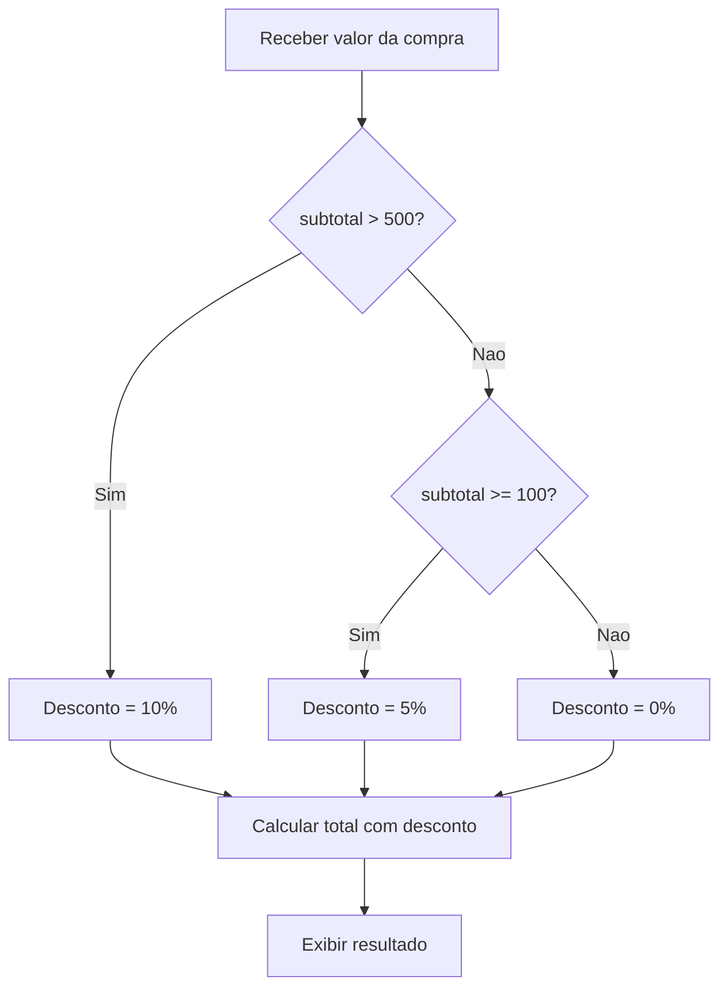

# 5.7 — Operadores Matemáticos e Lógicos

[← Anterior: Conversão de Tipos e Manipulação de Strings](cap05-mod06-conversao-strings-conteudo.md) · [Próximo: Indentação, Escopo e Estrutura do Código Python →](cap05-mod08-indentacao-escopo-conteudo.md)

---

## Introdução

Nos módulos anteriores, você aprendeu a guardar dados em variáveis e a trabalhar com diferentes tipos. Usou alguns operadores de forma intuitiva — `+` para somar, `*` para multiplicar, `=` para atribuir. Mas não exploramos o assunto em profundidade.

Neste módulo, vamos conhecer todos os operadores do Python: aritméticos (para fazer contas), de comparação (para comparar valores), lógicos (para combinar condições) e de atribuição (para guardar valores de formas diferentes). Operadores são os "verbos" da programação — são eles que fazem as coisas acontecerem.

Dominar operadores é essencial porque eles são a base de tudo que vem depois: condicionais (módulo 5.9) usam operadores de comparação, loops (módulo 5.10) usam operadores lógicos, e qualquer cálculo usa operadores aritméticos.

---

## Como Executar os Exemplos Deste Módulo

1. Abra o VSCode na sua pasta de projetos: `code ~/projetos/python`
2. Crie arquivos para cada seção (ex: `operadores_aritmeticos.py`)
3. Copie, salve e execute: `python3 nome_do_arquivo.py`

---

## Operadores Aritméticos

Operadores aritméticos fazem cálculos matemáticos. Você já conhece a maioria do dia a dia:

| Operador | Nome | Exemplo | Resultado |
|----------|------|---------|-----------|
| `+` | Soma | `10 + 3` | `13` |
| `-` | Subtração | `10 - 3` | `7` |
| `*` | Multiplicação | `10 * 3` | `30` |
| `/` | Divisão | `10 / 3` | `3.333...` |
| `//` | Divisão inteira | `10 // 3` | `3` |
| `%` | Módulo (resto) | `10 % 3` | `1` |
| `**` | Potência | `10 ** 3` | `1000` |

```python
# Demonstracao de todos os operadores aritmeticos
# "a" e "b" = numeros para demonstracao
a = 10
b = 3

print(f"a = {a}, b = {b}")
print(f"Soma: {a} + {b} = {a + b}")
print(f"Subtracao: {a} - {b} = {a - b}")
print(f"Multiplicacao: {a} * {b} = {a * b}")
print(f"Divisao: {a} / {b} = {a / b}")
print(f"Divisao inteira: {a} // {b} = {a // b}")
print(f"Modulo (resto): {a} % {b} = {a % b}")
print(f"Potencia: {a} ** {b} = {a ** b}")
```

Saída esperada:

```
a = 10, b = 3
Soma: 10 + 3 = 13
Subtracao: 10 - 3 = 7
Multiplicacao: 10 * 3 = 30
Divisao: 10 / 3 = 3.3333333333333335
Divisao inteira: 10 // 3 = 3
Modulo (resto): 10 % 3 = 1
Potencia: 10 ** 3 = 1000
```

### Divisão normal vs divisão inteira

A divisão normal (`/`) sempre retorna um float, mesmo quando o resultado é exato:

```python
print(f"10 / 2 = {10 / 2}")     # 5.0 (float, nao int!)
print(f"10 / 3 = {10 / 3}")     # 3.333...
print(f"10 // 2 = {10 // 2}")   # 5 (int)
print(f"10 // 3 = {10 // 3}")   # 3 (descarta a parte decimal)
```

Saída esperada:

```
10 / 2 = 5.0
10 / 3 = 3.3333333333333335
10 // 2 = 5
10 // 3 = 3
```

### O operador módulo (%)

O módulo retorna o **resto** da divisão inteira. É mais útil do que parece:

```python
# Verificar se um numero e par ou impar
# Se o resto da divisao por 2 e 0, o numero e par
# "number" = numero
number = 7
# "remainder" = resto
remainder = number % 2
print(f"{number} % 2 = {remainder}")
print(f"{number} e par? {remainder == 0}")

number = 8
remainder = number % 2
print(f"{number} % 2 = {remainder}")
print(f"{number} e par? {remainder == 0}")
```

Saída esperada:

```
7 % 2 = 1
7 e par? False
8 % 2 = 0
8 e par? True
```

### Precedência de operadores (ordem das operações)

Assim como na matemática, Python segue uma ordem de precedência:

1. `**` (potência) — primeiro
2. `*`, `/`, `//`, `%` (multiplicação, divisão, módulo) — segundo
3. `+`, `-` (soma, subtração) — terceiro

```python
# Sem parenteses: segue a precedencia
# "result" = resultado
result = 2 + 3 * 4
print(f"2 + 3 * 4 = {result}")  # 14 (nao 20!)

# Com parenteses: voce controla a ordem
result = (2 + 3) * 4
print(f"(2 + 3) * 4 = {result}")  # 20

# Potencia tem prioridade sobre multiplicacao
result = 2 * 3 ** 2
print(f"2 * 3 ** 2 = {result}")  # 18 (nao 36!)

result = (2 * 3) ** 2
print(f"(2 * 3) ** 2 = {result}")  # 36
```

Saída esperada:

```
2 + 3 * 4 = 14
(2 + 3) * 4 = 20
2 * 3 ** 2 = 18
(2 * 3) ** 2 = 36
```

Dica: na dúvida, use parênteses. Eles tornam o código mais claro e evitam erros de precedência.

---

## Operadores de Comparação

Operadores de comparação comparam dois valores e retornam um **booleano** (True ou False). São a base das condicionais que vamos aprender no módulo 5.9.

| Operador | Significado | Exemplo | Resultado |
|----------|------------|---------|-----------|
| `==` | Igual a | `5 == 5` | `True` |
| `!=` | Diferente de | `5 != 3` | `True` |
| `>` | Maior que | `5 > 3` | `True` |
| `<` | Menor que | `5 < 3` | `False` |
| `>=` | Maior ou igual a | `5 >= 5` | `True` |
| `<=` | Menor ou igual a | `5 <= 3` | `False` |

```python
# Demonstracao de operadores de comparacao
# "a" e "b" = numeros para comparacao
a = 10
b = 5

print(f"a = {a}, b = {b}")
print(f"a == b? {a == b}")   # False
print(f"a != b? {a != b}")   # True
print(f"a > b?  {a > b}")    # True
print(f"a < b?  {a < b}")    # False
print(f"a >= b? {a >= b}")   # True
print(f"a <= b? {a <= b}")   # False
```

Saída esperada:

```
a = 10, b = 5
a == b? False
a != b? True
a > b?  True
a < b?  False
a >= b? True
a <= b? False
```

### Cuidado: = vs ==

Este é um dos erros mais comuns de iniciantes:

- `=` é **atribuição** (guarda um valor): `x = 5`
- `==` é **comparação** (verifica se são iguais): `x == 5`

```python
# "x" = variavel para demonstracao
x = 5       # Atribuicao: x RECEBE o valor 5
print(x == 5)  # Comparacao: x E IGUAL A 5? True
print(x == 3)  # Comparacao: x E IGUAL A 3? False
```

Saída esperada:

```
True
False
```

### Comparando strings

Operadores de comparação também funcionam com strings:

```python
# Comparacao de strings
print("abc" == "abc")   # True
print("abc" == "ABC")   # False (case-sensitive!)
print("abc" != "xyz")   # True

# Comparacao alfabetica (ordem do dicionario)
print("abacaxi" < "banana")   # True (a vem antes de b)
print("python" > "java")      # True (p vem depois de j)
```

Saída esperada:

```
True
False
True
True
True
```

### O operador in (pertencimento)

O operador `in` verifica se um valor está contido em outro:

```python
# Verificando se um texto contem outro
# "message" = mensagem
message = "Python e uma linguagem incrivel"

print("Python" in message)     # True
print("Java" in message)       # False
print("python" in message)     # False (case-sensitive!)
print("python" in message.lower())  # True (convertendo para minusculas)
```

Saída esperada:

```
True
False
False
True
```

---

## Lógica Booleana: A Base de Toda Decisão

Antes de ver os operadores lógicos do Python, precisamos entender o conceito por trás deles: a **lógica booleana** (ou álgebra booleana).

### O que é lógica booleana?

Lógica booleana é um sistema matemático criado por **George Boole** em 1847, no livro *The Mathematical Analysis of Logic*. A ideia é simples mas revolucionária: toda afirmação pode ser reduzida a **verdadeiro** ou **falso**. Não existe "talvez", "mais ou menos" ou "depende" — apenas dois valores.

Boole viveu na Inglaterra no século XIX e nunca viu um computador. Mas quase 100 anos depois, em 1937, **Claude Shannon** (um engenheiro do MIT) percebeu que a álgebra de Boole era perfeita para descrever circuitos elétricos: um interruptor está **ligado** (1/True) ou **desligado** (0/False). Essa descoberta é a base de toda a computação moderna — cada bit dentro do seu computador é um valor booleano.

### Pensando em verdadeiro e falso no dia a dia

Você já usa lógica booleana sem perceber:

| Pergunta do dia a dia | Resposta booleana |
|----------------------|-------------------|
| Está chovendo? | Sim (True) ou Não (False) |
| A porta está trancada? | Sim ou Não |
| Tenho dinheiro suficiente? | Sim ou Não |
| O semáforo está verde? | Sim ou Não |

Agora, decisões mais complexas combinam várias perguntas:

- "Vou sair de casa se **não** estiver chovendo" → usa **NOT** (negação)
- "Vou ao cinema se tiver dinheiro **E** tiver tempo" → usa **AND** (conjunção)
- "Vou comer pizza **OU** hambúrguer" → usa **OR** (disjunção)

Essas três operações — **NOT**, **AND** e **OR** — são os três operadores fundamentais da lógica booleana. Com apenas eles, você pode expressar qualquer decisão lógica.

### As três operações fundamentais

**NOT (NÃO) — Negação**

NOT inverte o valor: verdadeiro vira falso, falso vira verdadeiro.

Analogia: um interruptor de luz. Se a luz está acesa (True), apertar o interruptor (NOT) apaga (False). Se está apagada (False), apertar acende (True).

| Entrada | NOT Entrada |
|---------|-------------|
| True | False |
| False | True |

**AND (E) — Conjunção**

AND só é verdadeiro quando **ambos** os valores são verdadeiros. Basta um ser falso para o resultado ser falso.

Analogia: uma porta com duas fechaduras. A porta só abre se a fechadura A **E** a fechadura B estiverem destrancadas. Se qualquer uma estiver trancada, a porta não abre.

| A | B | A AND B |
|---|---|---------|
| True | True | True |
| True | False | False |
| False | True | False |
| False | False | False |

**OR (OU) — Disjunção**

OR é verdadeiro quando **pelo menos um** dos valores é verdadeiro. Só é falso quando ambos são falsos.

Analogia: uma sala com duas portas. Você consegue entrar se a porta A **OU** a porta B estiver aberta. Só não entra se ambas estiverem fechadas.

| A | B | A OR B |
|---|---|--------|
| True | True | True |
| True | False | True |
| False | True | True |
| False | False | False |

### Tabela verdade completa

A **tabela verdade** mostra todos os resultados possíveis para cada combinação de valores. É a ferramenta fundamental para entender lógica booleana:

| A | B | NOT A | NOT B | A AND B | A OR B |
|---|---|-------|-------|---------|--------|
| True | True | False | False | True | True |
| True | False | False | True | False | True |
| False | True | True | False | False | True |
| False | False | True | True | False | False |

Dica para memorizar:
- **AND** é exigente — precisa que **todos** sejam True
- **OR** é generoso — basta **um** ser True
- **NOT** é rebelde — sempre faz o contrário

### Combinando operações

Assim como na matemática você combina soma e multiplicação, na lógica booleana você combina AND, OR e NOT:

Exemplo do dia a dia: "Vou à praia se estiver sol E (for sábado OU for feriado)"

Traduzindo para lógica:
- `tem_sol AND (e_sabado OR e_feriado)`

| tem_sol | e_sabado | e_feriado | e_sabado OR e_feriado | Resultado final |
|---------|----------|-----------|----------------------|-----------------|
| True | True | False | True | True (vai à praia) |
| True | False | True | True | True (vai à praia) |
| True | False | False | False | False (não vai) |
| False | True | True | True | False (não vai — sem sol) |

Perceba que os parênteses importam. Sem eles, a ordem de avaliação muda (AND tem precedência sobre OR), e o resultado pode ser diferente do esperado.

---

## Operadores Lógicos em Python

Agora que você entende a lógica booleana, vamos ver como ela funciona em Python. Python usa palavras em inglês em vez de símbolos:

| Operação lógica | Python | Outras linguagens |
|-----------------|--------|-------------------|
| E (AND) | `and` | `&&` |
| OU (OR) | `or` | `||` |
| NÃO (NOT) | `not` | `!` |

### and — Ambos precisam ser verdadeiros

```python
# "age" = idade, "has_id" = tem documento
age = 20
has_id = True

# Para entrar no evento: precisa ter 18+ E ter documento
# "can_enter" = pode entrar
can_enter = age >= 18 and has_id
print(f"Idade: {age}, Documento: {has_id}")
print(f"Pode entrar? {can_enter}")  # True

age = 16
can_enter = age >= 18 and has_id
print(f"Idade: {age}, Documento: {has_id}")
print(f"Pode entrar? {can_enter}")  # False (idade < 18)
```

Saída esperada:

```
Idade: 20, Documento: True
Pode entrar? True
Idade: 16, Documento: True
Pode entrar? False
```

### or — Pelo menos um precisa ser verdadeiro

```python
# "is_student" = e estudante, "is_senior" = e idoso
is_student = True
is_senior = False

# Desconto: se for estudante OU idoso
# "gets_discount" = recebe desconto
gets_discount = is_student or is_senior
print(f"Estudante: {is_student}, Idoso: {is_senior}")
print(f"Recebe desconto? {gets_discount}")  # True

is_student = False
gets_discount = is_student or is_senior
print(f"Estudante: {is_student}, Idoso: {is_senior}")
print(f"Recebe desconto? {gets_discount}")  # False (nenhum dos dois)
```

Saída esperada:

```
Estudante: True, Idoso: False
Recebe desconto? True
Estudante: False, Idoso: False
Recebe desconto? False
```

### not — Inverte o valor

```python
# "is_blocked" = esta bloqueado
is_blocked = False

# Se NAO esta bloqueado, pode acessar
# "can_access" = pode acessar
can_access = not is_blocked
print(f"Bloqueado: {is_blocked}")
print(f"Pode acessar? {can_access}")  # True
```

Saída esperada:

```
Bloqueado: False
Pode acessar? True
```

### Tabela verdade

A tabela verdade mostra todos os resultados possíveis:

| A | B | A and B | A or B | not A |
|---|---|---------|--------|-------|
| True | True | True | True | False |
| True | False | False | True | False |
| False | True | False | True | True |
| False | False | False | False | True |

---

## Operadores de Atribuição

Além do `=` simples, Python tem operadores de atribuição compostos que combinam uma operação com atribuição:

| Operador | Equivalente a | Exemplo |
|----------|--------------|---------|
| `+=` | `x = x + valor` | `x += 5` |
| `-=` | `x = x - valor` | `x -= 3` |
| `*=` | `x = x * valor` | `x *= 2` |
| `/=` | `x = x / valor` | `x /= 4` |
| `//=` | `x = x // valor` | `x //= 3` |
| `%=` | `x = x % valor` | `x %= 2` |
| `**=` | `x = x ** valor` | `x **= 3` |

```python
# Demonstracao de operadores de atribuicao compostos
# "score" = pontuacao
score = 100
print(f"Inicial: {score}")

score += 10   # score = score + 10
print(f"Apos += 10: {score}")   # 110

score -= 25   # score = score - 25
print(f"Apos -= 25: {score}")   # 85

score *= 2    # score = score * 2
print(f"Apos *= 2: {score}")    # 170

score //= 3   # score = score // 3
print(f"Apos //= 3: {score}")   # 56
```

Saída esperada:

```
Inicial: 100
Apos += 10: 110
Apos -= 25: 85
Apos *= 2: 170
Apos //= 3: 56
```

O operador `+=` é especialmente comum — você vai usá-lo muito em loops para contar ou acumular valores.

---

## Combinando Operadores: Expressões Complexas

Na prática, você vai combinar vários operadores em uma única expressão. Vamos ver exemplos reais:

### Cálculo de desconto progressivo

O fluxo de decisão do desconto progressivo funciona assim:



```python
# Loja com desconto progressivo:
# Ate R$ 100: sem desconto
# De R$ 100 a R$ 500: 5% de desconto
# Acima de R$ 500: 10% de desconto

# "subtotal" = subtotal da compra
subtotal = float(input("Valor da compra: R$ "))

# Calcula o desconto usando operadores de comparacao
# "discount_rate" = taxa de desconto
if subtotal > 500:
    discount_rate = 0.10
elif subtotal >= 100:
    discount_rate = 0.05
else:
    discount_rate = 0

# "discount" = valor do desconto
discount = subtotal * discount_rate
# "total" = total final
total = subtotal - discount

print()
print(f"Subtotal: R$ {subtotal:.2f}")
print(f"Desconto: {discount_rate * 100:.0f}% = R$ {discount:.2f}")
print(f"Total: R$ {total:.2f}")
```

Saída esperada (se digitar "350"):

```
Valor da compra: R$ 350

Subtotal: R$ 350.00
Desconto: 5% = R$ 17.50
Total: R$ 332.50
```

### Cálculo de média ponderada

```python
# Calculo de media ponderada de notas
# "grade1" = nota 1, "grade2" = nota 2, "grade3" = nota 3
# "weight1" = peso 1, "weight2" = peso 2, "weight3" = peso 3

print("=== Calculadora de Media Ponderada ===")
print()

grade1 = float(input("Nota da prova 1 (peso 3): "))
grade2 = float(input("Nota da prova 2 (peso 3): "))
grade3 = float(input("Nota do trabalho (peso 4): "))

# Media ponderada: soma(nota * peso) / soma(pesos)
# "weighted_avg" = media ponderada
weight1, weight2, weight3 = 3, 3, 4
weighted_avg = (grade1 * weight1 + grade2 * weight2 + grade3 * weight3) / (weight1 + weight2 + weight3)

print()
print(f"Media ponderada: {weighted_avg:.1f}")
print(f"Aprovado? {weighted_avg >= 7}")
```

Saída esperada (se digitar "8", "6" e "9"):

```
=== Calculadora de Media Ponderada ===

Nota da prova 1 (peso 3): 8
Nota da prova 2 (peso 3): 6
Nota do trabalho (peso 4): 9

Media ponderada: 7.8
Aprovado? True
```

### Verificação de faixa de valores

```python
# Verificar se uma temperatura esta na faixa normal do corpo humano
# "temp" = temperatura
temp = float(input("Temperatura corporal (C): "))

# Faixa normal: entre 36.0 e 37.5
# Python permite encadear comparacoes!
# "is_normal" = esta normal
is_normal = 36.0 <= temp <= 37.5
# "has_fever" = tem febre
has_fever = temp > 37.5

print(f"Temperatura: {temp} C")
print(f"Normal (36-37.5)? {is_normal}")
print(f"Febre (>37.5)? {has_fever}")
```

Saída esperada (se digitar "38.2"):

```
Temperatura corporal (C): 38.2
Temperatura: 38.2 C
Normal (36-37.5)? False
Febre (>37.5)? True
```

---

## Erros Comuns com Operadores

### Erro 1: Confundir = com ==

```python
# ERRADO: usar = em vez de == para comparar
# x = 5 == 3  # Isso atribui o resultado de 5==3 (False) a x

# CORRETO: usar == para comparar
# "x" = variavel
x = 5
print(x == 3)  # False - comparacao
```

### Erro 2: Divisão por zero

```python
# ERRADO: dividir sem verificar
# result = 10 / 0  # ZeroDivisionError!

# CORRETO: verificar antes
# "divisor" = divisor
divisor = int(input("Divisor: "))
if divisor != 0:
    print(f"Resultado: {10 / divisor}")
else:
    print("Erro: nao e possivel dividir por zero!")
```

### Erro 3: Operar tipos incompatíveis

```python
# ERRADO: somar string com numero
# result = "5" + 3  # TypeError!

# CORRETO: converter antes
# "result" = resultado
result = int("5") + 3  # 8
print(result)

# Ou usar f-string para juntar
print(f"Resultado: {5 + 3}")
```

### Erro 4: Precedência inesperada

Operadores lógicos também têm precedência entre si: `not` primeiro, depois `and`, depois `or`.

```python
# Cuidado com a precedencia!
# not tem prioridade sobre and
# "result" = resultado
result = not True and False
print(f"not True and False = {result}")  # False (not True = False, False and False = False)

# Use parenteses para clareza
result = not (True and False)
print(f"not (True and False) = {result}")  # True
```

Saída esperada:

```
not True and False = False
not (True and False) = True
```

---

## Programa Completo: Calculadora Interativa

```python
# Calculadora interativa com todos os operadores
print("=== Calculadora Python ===")
print()

# Recebe dois numeros
# "num1" = primeiro numero, "num2" = segundo numero
num1 = float(input("Primeiro numero: "))
num2 = float(input("Segundo numero: "))

# Exibe todos os resultados
print()
print(f"--- Operacoes com {num1} e {num2} ---")
print(f"Soma:            {num1} + {num2} = {num1 + num2}")
print(f"Subtracao:       {num1} - {num2} = {num1 - num2}")
print(f"Multiplicacao:   {num1} * {num2} = {num1 * num2}")

# Verifica divisao por zero antes de dividir
if num2 != 0:
    print(f"Divisao:         {num1} / {num2} = {num1 / num2:.2f}")
    print(f"Divisao inteira: {num1} // {num2} = {num1 // num2}")
    print(f"Resto:           {num1} % {num2} = {num1 % num2}")
else:
    print("Divisao: impossivel (divisao por zero!)")

print(f"Potencia:        {num1} ** {num2} = {num1 ** num2}")

# Comparacoes
print()
print(f"--- Comparacoes ---")
print(f"{num1} == {num2}? {num1 == num2}")
print(f"{num1} != {num2}? {num1 != num2}")
print(f"{num1} > {num2}?  {num1 > num2}")
print(f"{num1} < {num2}?  {num1 < num2}")
```

Saída esperada (se digitar "15" e "4"):

```
=== Calculadora Python ===

Primeiro numero: 15
Segundo numero: 4

--- Operacoes com 15.0 e 4.0 ---
Soma:            15.0 + 4.0 = 19.0
Subtracao:       15.0 - 4.0 = 11.0
Multiplicacao:   15.0 * 4.0 = 60.0
Divisao:         15.0 / 4.0 = 3.75
Divisao inteira: 15.0 // 4.0 = 3.0
Resto:           15.0 % 4.0 = 3.0
Potencia:        15.0 ** 4.0 = 50625.0

--- Comparacoes ---
15.0 == 4.0? False
15.0 != 4.0? True
15.0 > 4.0?  True
15.0 < 4.0?  False
```

---

## Como a IA pode te ajudar aqui

**Prompt 1 — Entender erros comuns:**
> "Crie 5 problemas matemáticos do dia a dia (calcular troco, converter temperatura, calcular desconto) para eu resolver usando operadores Python."

**Prompt 2 — Explorar o conceito:**
> "Me dê 5 expressões Python com múltiplos operadores e me peça para calcular o resultado mentalmente. Depois mostre a resposta correta e explique a ordem de execução."

**Prompt 3 — Ver exemplos práticos:**
> "Me explique operadores lógicos (and, or, not) com exemplos do dia a dia: quem pode entrar em um evento, quem recebe desconto, quem tem acesso a um sistema."

---

## Casos de Uso no Mundo Real

### 1. Cálculos financeiros

Bancos e fintechs usam operadores aritméticos constantemente: calcular juros (`principal * taxa ** meses`), verificar saldo (`saldo >= valor_compra`), aplicar descontos (`preco * (1 - desconto)`). Cada transação do Pix, cada parcela de cartão, cada rendimento de investimento é um cálculo feito por operadores.

### 2. Validação de formulários

Sites usam operadores de comparação e lógicos para validar dados: senha tem pelo menos 8 caracteres (`len(senha) >= 8`)? Email contém @ (`"@" in email`)? Idade é maior que 18 E menor que 120 (`age > 18 and age < 120`)? Cada campo de formulário que você preenche passa por validações como essas.

### 3. Sistemas de recomendação

Quando o Spotify sugere músicas, usa operadores para comparar: a nota do usuário é maior que 4 (`rating > 4`)? O gênero é igual ao preferido (`genre == preferred_genre`)? O artista está na lista de favoritos (`artist in favorites`)? Combinações de operadores de comparação e lógicos determinam o que aparece na sua tela.

---

## Resumo do Módulo

| Conceito | Definição |
|----------|-----------|
| Operadores aritméticos | +, -, *, /, //, %, ** — fazem cálculos matemáticos |
| Operadores de comparação | ==, !=, >, <, >=, <= — comparam valores e retornam bool |
| Operadores lógicos | and, or, not — combinam expressões booleanas |
| Operadores de atribuição | =, +=, -=, *=, /= — guardam valores em variáveis |
| Operador in | Verifica se um valor está contido em outro |
| Precedência | Ordem em que operadores são avaliados |
| Módulo (%) | Retorna o resto da divisão inteira |
| Divisão inteira (//) | Retorna apenas a parte inteira da divisão |

---

## Glossário do Módulo

| Termo | Definição |
|-------|-----------|
| and | Operador lógico que retorna True apenas se ambos os operandos forem True |
| Atribuição composta | Operadores como +=, -= que combinam operação e atribuição |
| Divisão inteira (floor division) | Operador // que retorna a parte inteira da divisão |
| George Boole | Matemático que criou a álgebra booleana, base da lógica computacional |
| in | Operador que verifica se um valor está contido em outro (pertencimento) |
| Módulo (módulo) | Operador % que retorna o resto da divisão inteira |
| not | Operador lógico que inverte um valor booleano |
| Operando (operand) | Valor sobre o qual um operador atua |
| Operador (operator) | Símbolo que realiza uma operação sobre valores |
| or | Operador lógico que retorna True se pelo menos um operando for True |
| Potência (power) | Operador ** que eleva um número a outro |
| Precedência (precedence) | Ordem em que operadores são avaliados em uma expressão |
| Tabela verdade (truth table) | Tabela que mostra todos os resultados possíveis de operações lógicas |

---

## Na Cultura Popular

- **O Guia do Mochileiro das Galáxias** (livro, Douglas Adams, 1979) — o supercomputador Deep Thought calcula durante 7,5 milhões de anos e chega à "resposta para a vida, o universo e tudo mais": **42**. O humor está no fato de que a pergunta estava errada — mas o cálculo em si é uma operação aritmética. Todo programa, por mais complexo que seja, se resume a operações sobre dados.

- **O Dilema das Redes** (documentário, Netflix, 2020) — mostra como algoritmos de redes sociais usam operadores lógicos para decidir o que mostrar: se o usuário curtiu posts sobre gatos E passou mais de 5 segundos olhando, OU se amigos do usuário compartilharam, então mostra mais conteúdo similar. Cada decisão é uma combinação de AND, OR e NOT.

---

## Para Saber Mais

- [W3Schools — Python Operators](https://www.w3schools.com/python/python_operators.asp) — *Tutorial completo sobre operadores*
- [Documentação Python — Expressões](https://docs.python.org/pt-br/3/reference/expressions.html) — *Referência oficial sobre expressões e operadores*
- [GitHub do Fino — learn-ops-content](https://github.com/RafaelFino/learn-ops-content) — *Material de referência do Fino*
- [Khan Academy — Álgebra Booleana](https://pt.khanacademy.org/computing/computer-science/algorithms) — *Conceitos de lógica booleana*

---

## Perguntas Frequentes (FAQ)

**P: Qual a diferença entre / e //?**
R: `/` é divisão normal (sempre retorna float): `10 / 3 = 3.333`. `//` é divisão inteira (descarta decimais): `10 // 3 = 3`.

**P: Para que serve o operador % (módulo)?**
R: Retorna o resto da divisão. Muito usado para verificar se um número é par (`n % 2 == 0`), para ciclar valores e para validações.

**P: Qual a diferença entre = e ==?**
R: `=` é atribuição (guarda valor): `x = 5`. `==` é comparação (verifica igualdade): `x == 5` retorna True ou False.

**P: O que acontece se eu dividir por zero?**
R: Python dá `ZeroDivisionError`. Sempre verifique se o divisor é diferente de zero antes de dividir.

**P: Posso comparar tipos diferentes?**
R: Sim, mas com cuidado. `5 == 5.0` é True (Python converte automaticamente). `5 == "5"` é False (int e str são tipos diferentes).

**P: and e or são iguais a && e || de outras linguagens?**
R: Sim, fazem a mesma coisa. Python usa palavras em inglês em vez de símbolos.

**P: O que é precedência de operadores?**
R: É a ordem em que Python avalia operadores. Potência primeiro, depois multiplicação/divisão, depois soma/subtração. Use parênteses na dúvida.

**P: += funciona com strings?**
R: Sim. `texto += " mundo"` é o mesmo que `texto = texto + " mundo"`. Concatena strings.

**P: Posso encadear comparações?**
R: Sim. Python permite `1 < x < 10` que é equivalente a `x > 1 and x < 10`. Muito elegante.

**P: not tem precedência sobre and e or?**
R: Sim. A ordem é: `not` primeiro, depois `and`, depois `or`. Use parênteses para clareza.

---

## Exercícios Práticos

Os exercícios completos estão no arquivo separado:

**[Acessar Exercícios do Módulo 5.7](cap05-mod07-operadores-exercicios.md)**

Prévia:

### Exercício rápido 1 — Calculadora de troco

Crie um programa que pede o valor da compra e o valor pago, e calcula o troco. Se o valor pago for menor que a compra, exiba uma mensagem de erro.

### Exercício rápido 2 — Par ou ímpar

Crie um programa que pede um número e diz se é par ou ímpar usando o operador `%`.

### Exercício rápido 3 — Trace mental

Sem executar, calcule o resultado de cada expressão. Depois execute para verificar:
1. `2 + 3 * 4`
2. `(2 + 3) * 4`
3. `10 % 3 + 2 ** 3`
4. `True and False or True`
5. `not (5 > 3 and 2 < 1)`

---

[← Anterior: Conversão de Tipos e Manipulação de Strings](cap05-mod06-conversao-strings-conteudo.md) · [Próximo: Indentação, Escopo e Estrutura do Código Python →](cap05-mod08-indentacao-escopo-conteudo.md)
