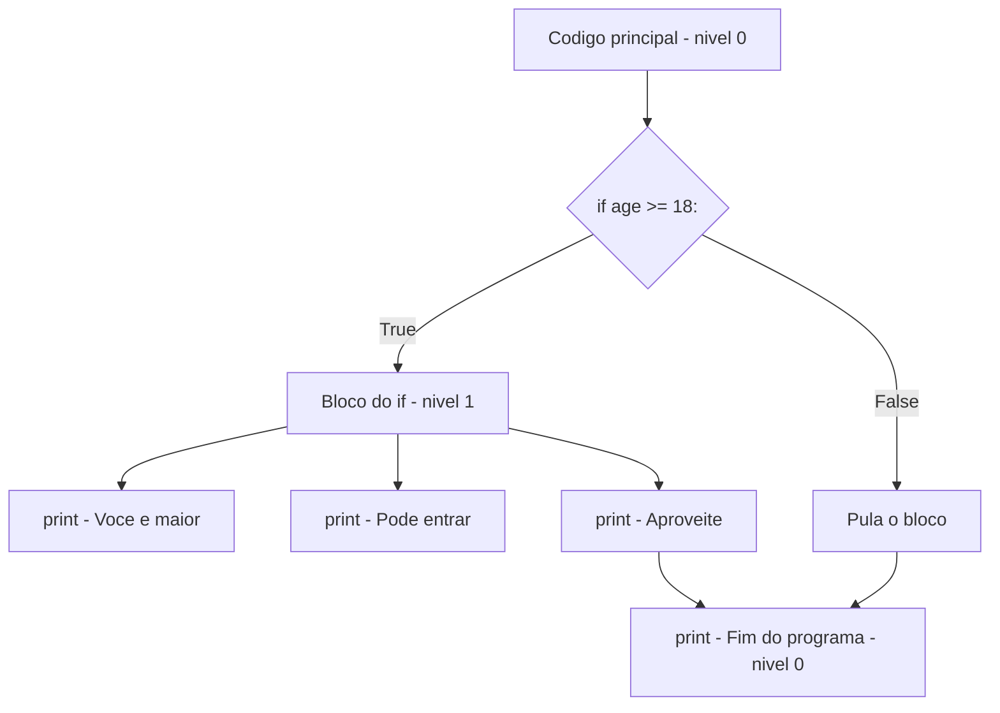

# 5.8 — Indentação, Escopo e Estrutura do Código Python

[← Anterior: Operadores Matemáticos e Lógicos](cap05-mod07-operadores-conteudo.md) · [Próximo: Condicionais: if, elif e else →](cap05-mod09-condicionais-conteudo.md)

---

## Introdução

Nos módulos anteriores, você já viu que alguns exemplos de código tinham linhas "recuadas" — com espaços no início. No programa de desconto do módulo 5.7, por exemplo, as linhas dentro do `if` estavam deslocadas para a direita. Isso não é decoração — é uma regra fundamental do Python.

Em Python, a **indentação** (os espaços no início da linha) define a estrutura do código. Ela diz ao Python quais linhas pertencem a qual bloco. Diferente de outras linguagens que usam chaves `{}` para delimitar blocos (como C, Java e JavaScript), Python usa espaços.

Isso torna o Python mais legível — código bem indentado é mais fácil de ler. Mas também significa que erros de indentação causam erros no programa. Um espaço a mais ou a menos pode mudar completamente o comportamento do código.

Neste módulo, vamos entender em profundidade como a indentação funciona, o que é escopo de variáveis e como estruturar código Python corretamente. Esse conhecimento é essencial para os próximos módulos — condicionais (5.9), loops (5.10) e funções (5.11) dependem totalmente de indentação.

---

## Como Executar os Exemplos Deste Módulo

1. Abra o VSCode na sua pasta de projetos: `code ~/projetos/python`
2. Crie arquivos para cada seção (ex: `indentacao.py`)
3. Copie, salve e execute: `python3 nome_do_arquivo.py`

Atenção especial neste módulo: ao copiar código, certifique-se de que os espaços estão corretos. O VSCode ajuda mostrando guias visuais de indentação.

---

## O que é Indentação?

**Indentação** é o espaçamento no início de uma linha de código. Em Python, usamos **4 espaços** para cada nível de indentação (essa é a convenção oficial do Python, definida no documento PEP 8).

```python
# Nivel 0 - sem indentacao (linha principal)
print("Nivel 0")

# Nivel 1 - 4 espacos (dentro de um bloco)
if True:
    print("Nivel 1 - dentro do if")

    # Nivel 2 - 8 espacos (bloco dentro de bloco)
    if True:
        print("Nivel 2 - if dentro de if")
```

Saída esperada:

```
Nivel 0
Nivel 1 - dentro do if
Nivel 2 - if dentro de if
```

### Por que Python usa indentação em vez de chaves?

Guido van Rossum, o criador do Python, tomou essa decisão de design por uma razão simples: **programadores já indentam código por legibilidade, então por que não tornar isso obrigatório?**

Em linguagens como C e Java, a indentação é opcional — o compilador ignora espaços. Isso significa que código como este é válido em C:

```
if (x > 5) {
print("maior");
    print("que cinco");
}
```

Funciona, mas é horrível de ler. Em Python, a indentação é obrigatória, então todo código Python é automaticamente organizado e legível.

Compare como a mesma lógica fica em Python e em C:

| Python | C |
|--------|---|
| Indentação define blocos | Chaves {} definem blocos |
| Indentação obrigatória | Indentação opcional |
| Código sempre legível | Código pode ser ilegível |
| Erro se indentar errado | Chaves podem estar em qualquer lugar |

### Espaços vs Tabs

Existem duas formas de criar indentação: espaços e tabs (tabulação). Python aceita ambos, mas **nunca misture os dois no mesmo arquivo** — isso causa erro.

A convenção oficial (PEP 8) recomenda **4 espaços**. O VSCode, por padrão, já está configurado para inserir 4 espaços quando você pressiona Tab. Verifique no canto inferior direito do VSCode — deve mostrar "Spaces: 4".

---

## Blocos de Código

Um **bloco** é um grupo de linhas que pertencem juntas. Em Python, um bloco é definido por:

1. Uma linha que termina com **dois pontos** (`:`)
2. As linhas seguintes **indentadas** com 4 espaços a mais

```python
# A linha com ":" inicia um bloco
# As linhas indentadas pertencem ao bloco
# "age" = idade
age = 20

if age >= 18:
    # Este bloco pertence ao if
    # Todas as linhas com 4 espacos de indentacao
    print("Voce e maior de idade")
    print("Pode entrar no evento")
    print("Aproveite!")

# Esta linha NAO pertence ao if (sem indentacao extra)
print("Fim do programa")
```

Saída esperada:

```
Voce e maior de idade
Pode entrar no evento
Aproveite!
Fim do programa
```

Se mudarmos `age` para 15:

```python
# "age" = idade
age = 15

if age >= 18:
    # Este bloco NAO executa porque age < 18
    print("Voce e maior de idade")
    print("Pode entrar no evento")
    print("Aproveite!")

# Esta linha SEMPRE executa (esta fora do if)
print("Fim do programa")
```

Saída esperada:

```
Fim do programa
```

Perceba: as três linhas dentro do `if` não executaram porque a condição era falsa. Mas "Fim do programa" executou porque está **fora** do bloco — não está indentada.

### Visualizando blocos



### Blocos aninhados (bloco dentro de bloco)

Blocos podem estar dentro de outros blocos. Cada nível adiciona 4 espaços:

```python
# "age" = idade, "has_ticket" = tem ingresso
age = 20
has_ticket = True

# Nivel 0: codigo principal
if age >= 18:
    # Nivel 1: dentro do primeiro if (4 espacos)
    print("Maior de idade")

    if has_ticket:
        # Nivel 2: dentro do segundo if (8 espacos)
        print("Tem ingresso")
        print("Pode entrar!")
    else:
        # Nivel 2: dentro do else (8 espacos)
        print("Nao tem ingresso")
        print("Compre na bilheteria")

# Nivel 0: fora de todos os ifs
print("Fim")
```

Saída esperada:

```
Maior de idade
Tem ingresso
Pode entrar!
Fim
```

---

## Erros de Indentação

Erros de indentação são muito comuns para iniciantes. Vamos ver os mais frequentes:

### IndentationError: expected an indented block

Acontece quando você esquece de indentar depois de `:`:

```python
# ERRADO: falta indentacao apos o ":"
# if True:
# print("Ola")  # IndentationError!

# CORRETO:
if True:
    print("Ola")  # 4 espacos de indentacao
```

### IndentationError: unexpected indent

Acontece quando você indenta uma linha sem motivo:

```python
# ERRADO: indentacao inesperada
# print("Linha 1")
#     print("Linha 2")  # IndentationError! Por que esta indentada?

# CORRETO:
print("Linha 1")
print("Linha 2")  # Mesmo nivel, sem indentacao extra
```

### IndentationError: unindent does not match

Acontece quando a indentação não é consistente:

```python
# ERRADO: indentacao inconsistente
# if True:
#     print("Linha 1")  # 4 espacos
#       print("Linha 2")  # 6 espacos - inconsistente!

# CORRETO: todas as linhas do bloco com a mesma indentacao
if True:
    print("Linha 1")  # 4 espacos
    print("Linha 2")  # 4 espacos
```

### Dica: use o VSCode a seu favor

O VSCode mostra guias visuais de indentação (linhas verticais finas) que ajudam a ver se as linhas estão alinhadas. Se você instalar a extensão **indent-rainbow** (recomendada no módulo 5.3), cada nível de indentação terá uma cor diferente, tornando ainda mais fácil identificar problemas.

---

## Escopo de Variáveis

**Escopo** é a região do código onde uma variável existe e pode ser acessada. Em Python, o escopo é definido pela estrutura do código (funções, classes, módulos).

### Escopo global vs local

```python
# Variavel global: definida fora de qualquer funcao
# "global_var" = variavel global
global_var = "Eu sou global"

def my_function():
    # Variavel local: definida dentro da funcao
    # "local_var" = variavel local
    local_var = "Eu sou local"
    print(f"Dentro da funcao: {global_var}")  # Funciona
    print(f"Dentro da funcao: {local_var}")   # Funciona

my_function()
print(f"Fora da funcao: {global_var}")  # Funciona
# print(f"Fora da funcao: {local_var}")  # ERRO! local_var nao existe aqui
```

Saída esperada:

```
Dentro da funcao: Eu sou global
Dentro da funcao: Eu sou local
Fora da funcao: Eu sou global
```

Vamos aprofundar funções e escopo no módulo 5.11. Por enquanto, o importante é entender que:

- Variáveis criadas **fora** de funções são **globais** — acessíveis em todo o programa
- Variáveis criadas **dentro** de funções são **locais** — só existem dentro da função

### Variáveis em blocos if/for/while

Diferente de outras linguagens, em Python variáveis criadas dentro de `if`, `for` ou `while` **continuam existindo** depois do bloco:

```python
# "age" = idade
age = 20

if age >= 18:
    # "status" = situacao - criada dentro do if
    status = "maior de idade"

# "status" ainda existe aqui! (diferente de C/Java)
print(f"Status: {status}")
```

Saída esperada:

```
Status: maior de idade
```

Isso é uma particularidade do Python. Em C ou Java, `status` não existiria fora do `if`. Em Python, blocos `if`, `for` e `while` não criam um novo escopo — apenas funções e classes criam.

### Cuidado: variável pode não existir se o bloco não executar

```python
# "age" = idade
age = 15

if age >= 18:
    # "status" = situacao - so e criada se age >= 18
    status = "maior de idade"

# PERIGO: se age < 18, "status" nunca foi criada!
# print(f"Status: {status}")  # NameError se age < 18!

# SEGURO: inicializar a variavel antes do if
status = "indefinido"

if age >= 18:
    status = "maior de idade"
else:
    status = "menor de idade"

print(f"Status: {status}")  # Sempre funciona
```

Saída esperada:

```
Status: menor de idade
```

A lição é: se uma variável pode ser criada dentro de um bloco condicional, inicialize-a antes do bloco para garantir que ela sempre exista.

### Escopo em funções: exemplo detalhado

```python
# "counter" = contador - variavel global
counter = 0

def increment():
    # Esta funcao tenta usar "counter"
    # Mas ao atribuir, Python cria uma variavel LOCAL
    # "counter" aqui e uma variavel DIFERENTE da global
    counter = 10  # variavel local, nao afeta a global
    print(f"Dentro da funcao: counter = {counter}")

increment()
print(f"Fora da funcao: counter = {counter}")  # Ainda 0!
```

Saída esperada:

```
Dentro da funcao: counter = 10
Fora da funcao: counter = 0
```

Isso pode ser surpreendente. A variável `counter` dentro da função é uma variável **local** — completamente separada da `counter` global. Vamos aprofundar isso no módulo 5.11 (Funções).

---

## Estrutura de um Programa Python

Agora que você entende indentação e escopo, vamos ver como um programa Python bem estruturado se organiza:

```python
# =============================================
# SECAO 1: Imports (bibliotecas externas)
# =============================================
# Nenhum import necessario neste exemplo

# =============================================
# SECAO 2: Constantes (valores que nao mudam)
# =============================================
# "TAX_RATE" = taxa de imposto
TAX_RATE = 0.15
# "DISCOUNT_THRESHOLD" = limite para desconto
DISCOUNT_THRESHOLD = 100

# =============================================
# SECAO 3: Funcoes (blocos reutilizaveis)
# =============================================
def calculate_total(price, quantity):
    """Calcula o total com imposto e possivel desconto."""
    # "subtotal" = subtotal
    subtotal = price * quantity
    # "tax" = imposto
    tax = subtotal * TAX_RATE

    if subtotal > DISCOUNT_THRESHOLD:
        # "discount" = desconto
        discount = subtotal * 0.10
    else:
        discount = 0

    # "total" = total final
    total = subtotal + tax - discount
    return total

# =============================================
# SECAO 4: Programa principal
# =============================================
print("=== Sistema de Vendas ===")
print()

# "product" = produto
product = input("Produto: ")
# "price" = preco
price = float(input("Preco unitario: R$ "))
# "quantity" = quantidade
quantity = int(input("Quantidade: "))

# "final_total" = total final
final_total = calculate_total(price, quantity)

print()
print(f"Produto: {product}")
print(f"Total: R$ {final_total:.2f}")
```

Saída esperada (se digitar "Caderno", "25.90", "5"):

```
=== Sistema de Vendas ===

Produto: Caderno
Preco unitario: R$ 25.90
Quantidade: 5

Produto: Caderno
Total: R$ 135.97
```

### A instrução pass

Às vezes você quer criar um bloco vazio (para preencher depois). Python não permite blocos vazios, mas a instrução `pass` resolve isso:

```python
# "age" = idade
age = 20

if age >= 18:
    pass  # TODO: implementar logica para maiores de idade

if age < 18:
    pass  # TODO: implementar logica para menores de idade

print("Programa continua normalmente")
```

Saída esperada:

```
Programa continua normalmente
```

`pass` não faz nada — é um "placeholder" que diz ao Python "este bloco está vazio de propósito". É útil quando você está planejando a estrutura do código antes de implementar a lógica.

---

## Comentários e Documentação

Comentários são essenciais para código legível. Python tem três formas:

```python
# Comentario de linha unica - comeca com #
# Use para explicar o que uma linha ou bloco faz

"""
Comentario de multiplas linhas (docstring)
Use para documentar funcoes, classes e modulos
Pode ter varias linhas
"""

# Comentario inline - no final da linha
x = 42  # resposta para tudo (referencia ao Guia do Mochileiro)
```

### Boas práticas de comentários

```python
# BOM: explica o POR QUE, nao o O QUE
# Desconto de 10% para compras acima de R$ 100 (politica da loja)
if total > 100:
    discount = total * 0.10

# RUIM: explica o obvio (o codigo ja diz isso)
# Multiplica total por 0.10
discount = total * 0.10
```

---

## Como a Indentação Afeta o Fluxo de Execução

A indentação não é apenas estética — ela muda fundamentalmente o que o programa faz. Vamos ver um exemplo onde um único espaço muda o resultado:

### Exemplo: print dentro vs fora do if

```python
# Versao 1: print DENTRO do if (indentado)
# "temperature" = temperatura
temperature = 35

if temperature > 30:
    print("Esta muito quente!")
    print("Beba bastante agua!")  # DENTRO do if

print("Tenha um bom dia!")  # FORA do if - sempre executa
```

Saída esperada:

```
Esta muito quente!
Beba bastante agua!
Tenha um bom dia!
```

```python
# Versao 2: mesmo codigo, mas com temperature = 20
# "temperature" = temperatura
temperature = 20

if temperature > 30:
    print("Esta muito quente!")
    print("Beba bastante agua!")  # DENTRO do if - NAO executa

print("Tenha um bom dia!")  # FORA do if - sempre executa
```

Saída esperada:

```
Tenha um bom dia!
```

Perceba: "Tenha um bom dia!" sempre aparece porque está **fora** do bloco if (sem indentação extra). As outras duas mensagens só aparecem quando a condição é verdadeira.

### Exemplo: acumulador dentro vs fora do loop

Este exemplo usa um `for` (que vamos aprender no módulo 5.10), mas ilustra bem o impacto da indentação:

```python
# "total" = total acumulado
total = 0

# Soma os numeros de 1 a 5
for number in [1, 2, 3, 4, 5]:
    total = total + number
    print(f"Somando {number}, total parcial: {total}")  # DENTRO do for

# FORA do for - executa uma vez, depois do loop
print(f"Total final: {total}")
```

Saída esperada:

```
Somando 1, total parcial: 1
Somando 2, total parcial: 3
Somando 3, total parcial: 6
Somando 4, total parcial: 10
Somando 5, total parcial: 15
Total final: 15
```

Se o `print(f"Total final: {total}")` estivesse indentado (dentro do for), ele seria executado 5 vezes em vez de 1. A indentação define se a linha faz parte do loop ou não.

---

## Indentação e Legibilidade: Boas Práticas

### 1. Mantenha blocos curtos

Blocos muito longos (mais de 15-20 linhas) são difíceis de ler. Se um bloco está ficando grande, considere extrair parte dele para uma função (módulo 5.11).

### 2. Evite muitos níveis de aninhamento

Código com 4 ou 5 níveis de indentação é difícil de acompanhar. Se você está chegando no nível 3 ou 4, provavelmente precisa reorganizar a lógica.

```python
# RUIM: muitos niveis de aninhamento
if condition1:
    if condition2:
        if condition3:
            if condition4:
                print("Muito aninhado!")  # 16 espacos - dificil de ler

# MELHOR: usar retorno antecipado ou combinar condicoes
if not condition1:
    print("Condicao 1 falhou")
elif not condition2:
    print("Condicao 2 falhou")
elif condition3 and condition4:
    print("Todas as condicoes atendidas!")
```

### 3. Linhas em branco para separar seções

Use linhas em branco para separar blocos lógicos dentro do código:

```python
# Secao 1: coleta de dados
name = input("Nome: ")
age = int(input("Idade: "))

# Secao 2: processamento
is_adult = age >= 18
greeting = f"Ola, {name}!"

# Secao 3: saida
print(greeting)
print(f"Maior de idade: {is_adult}")
```

### 4. Consistência acima de tudo

O mais importante é ser consistente. Se você usa 4 espaços, use 4 espaços em todo o arquivo. Se usa linhas em branco para separar seções, faça isso em todo o programa.

---

## O Operador Ternário (Expressão Condicional)

Python tem uma forma compacta de escrever condicionais simples em uma única linha:

```python
# Forma normal (3 linhas):
# "age" = idade
age = 20
if age >= 18:
    status = "maior"
else:
    status = "menor"

# Forma compacta (1 linha) - operador ternario:
status = "maior" if age >= 18 else "menor"
print(f"Status: {status}")
```

Saída esperada:

```
Status: maior
```

A sintaxe é: `valor_se_verdadeiro if condição else valor_se_falso`

Use o operador ternário apenas para casos simples. Para lógica complexa, use if/else normal — legibilidade é mais importante que economia de linhas.

---

## Como a IA pode te ajudar aqui
**Prompt 1 — Entender erros comuns:**
> "Meu código Python dá 'IndentationError: expected an indented block'. Aqui está o código: [cole o código]. O que está errado e como corrijo?"

**Prompt 2 — Explorar o conceito:**
> "Me explique escopo de variáveis em Python com exemplos. Qual a diferença entre variável global e local? O que acontece com variáveis criadas dentro de um if?"

**Prompt 3 — Ver exemplos práticos:**
> "Me mostre como organizar um programa Python de 50 linhas de forma profissional, com seções de imports, constantes, funções e programa principal."

---

## Casos de Uso no Mundo Real

### 1. Padrões de código em empresas

Empresas de tecnologia têm guias de estilo (*style guides*) que definem como o código deve ser formatado — incluindo indentação. O Google, por exemplo, tem um guia de estilo Python que segue o PEP 8 (4 espaços). Quando você trabalha em equipe, todos precisam seguir o mesmo padrão para que o código seja consistente e legível.

### 2. Code review (revisão de código)

Em empresas, antes de um código ser aceito no projeto, outros programadores revisam. Problemas de indentação e estrutura são os primeiros a serem apontados. Código mal indentado é rejeitado imediatamente — não porque não funciona, mas porque é difícil de manter.

### 3. Linters e formatadores automáticos

Ferramentas como **Black** (formatador) e **Flake8** (linter) verificam automaticamente se o código Python segue as convenções de estilo. Muitas empresas configuram essas ferramentas para rodar automaticamente antes de cada commit. O VSCode pode ser configurado para formatar o código automaticamente ao salvar.

---

## Resumo do Módulo

| Conceito | Definição |
|----------|-----------|
| Indentação | Espaços no início da linha que definem a estrutura do código |
| Bloco | Grupo de linhas com mesma indentação que pertencem juntas |
| Escopo | Região do código onde uma variável existe e pode ser acessada |
| Variável global | Variável definida fora de funções, acessível em todo o programa |
| Variável local | Variável definida dentro de uma função, acessível apenas nela |
| PEP 8 | Guia oficial de estilo do Python |
| pass | Instrução que não faz nada, usada como placeholder em blocos vazios |
| Docstring | Comentário de múltiplas linhas usado para documentar funções e módulos |

---

## Glossário do Módulo

| Termo | Definição |
|-------|-----------|
| Black | Ferramenta de formatação automática de código Python |
| Bloco (block) | Grupo de linhas de código com mesma indentação que formam uma unidade |
| Code review | Processo de revisão de código por outros programadores antes de aceitar mudanças |
| Docstring | String de documentação entre aspas triplas, usada para documentar funções e módulos |
| Escopo (scope) | Região do programa onde uma variável é visível e acessível |
| Flake8 | Ferramenta que verifica se o código segue as convenções de estilo |
| Indentação (indentation) | Espaços no início de uma linha que definem a hierarquia do código |
| Linter | Ferramenta que analisa código em busca de erros de estilo e possíveis bugs |
| pass | Instrução Python que não faz nada, usada como placeholder |
| PEP 8 | Python Enhancement Proposal 8 — guia oficial de estilo de código Python |
| Style guide | Documento que define padrões de formatação e estilo de código |
| Variável global (global variable) | Variável definida no nível principal do programa, acessível em qualquer lugar |
| Variável local (local variable) | Variável definida dentro de uma função, acessível apenas dentro dela |

---

## Na Cultura Popular

- **Mr. Robot** (série, 2015-2019) — em várias cenas, o código mostrado na tela é Python real e bem indentado. A série é conhecida por sua precisão técnica, e a indentação correta do código é parte dessa autenticidade.

- **Silicon Valley** (série, 2014-2019) — o famoso debate "tabs vs spaces" (tabulação vs espaços) é tema de um episódio inteiro. Na vida real, esse debate existe entre programadores, mas em Python a resposta é clara: 4 espaços (PEP 8).

---

## Para Saber Mais

- [PEP 8 — Guia de Estilo Python](https://peps.python.org/pep-0008/) — *O guia oficial de estilo do Python (em inglês)*
- [W3Schools — Python Indentation](https://www.w3schools.com/python/python_syntax.asp) — *Tutorial sobre indentação*
- [W3Schools — Python Scope](https://www.w3schools.com/python/python_scope.asp) — *Tutorial sobre escopo de variáveis*
- [GitHub do Fino — learn-ops-content](https://github.com/RafaelFino/learn-ops-content) — *Material de referência do Fino*

---

## Perguntas Frequentes (FAQ)

**P: Quantos espaços devo usar para indentação?**
R: 4 espaços por nível. Essa é a convenção oficial do Python (PEP 8) e o padrão do VSCode.

**P: Posso usar Tab em vez de espaços?**
R: Tecnicamente sim, mas a convenção é usar espaços. O VSCode converte Tab em 4 espaços automaticamente. Nunca misture tabs e espaços no mesmo arquivo.

**P: O que acontece se eu indentar errado?**
R: Python dá `IndentationError` e o programa não executa. A mensagem de erro indica a linha do problema.

**P: Por que Python usa indentação em vez de chaves?**
R: Para forçar código legível. Guido van Rossum decidiu que, já que programadores indentam por legibilidade, a indentação deveria ser obrigatória.

**P: O que é PEP 8?**
R: É o guia oficial de estilo do Python. Define convenções como 4 espaços de indentação, nomes em snake_case, limite de 79 caracteres por linha, etc.

**P: O que é escopo?**
R: É a região do código onde uma variável existe. Variáveis globais existem em todo o programa. Variáveis locais existem apenas dentro da função onde foram criadas.

**P: Variáveis criadas dentro de if existem fora dele?**
R: Sim, em Python sim. Diferente de C/Java, blocos if/for/while não criam novo escopo. Apenas funções e classes criam.

**P: O que é pass?**
R: Uma instrução que não faz nada. Usada como placeholder quando você precisa de um bloco vazio (para preencher depois).

**P: O que é um linter?**
R: Uma ferramenta que analisa seu código e aponta problemas de estilo, erros potenciais e violações de convenções. Flake8 e Pylint são linters populares para Python.

**P: O VSCode ajuda com indentação?**
R: Sim. O VSCode mostra guias visuais, indenta automaticamente após `:`, e pode formatar o código inteiro com extensões como Black.

---

## Exercícios Práticos

Os exercícios completos estão no arquivo separado:

**[Acessar Exercícios do Módulo 5.8](cap05-mod08-indentacao-escopo-exercicios.md)**

Prévia:

### Exercício rápido 1 — Encontre o erro

Identifique e corrija os erros de indentação neste código (sem executar primeiro):

```python
age = 20
if age >= 18:
print("Maior de idade")
    print("Pode votar")
  print("Pode dirigir")
```

### Exercício rápido 2 — Blocos aninhados

Escreva um programa com 3 níveis de indentação: um if dentro de outro if dentro de outro if. Cada nível deve imprimir em qual nível está.

### Exercício rápido 3 — Estrutura de programa

Organize o seguinte código bagunçado em uma estrutura profissional (constantes, funções, programa principal):

```python
x = float(input("Valor: "))
y = x * 0.15
z = x + y
print(f"Total: {z}")
```

---

[← Anterior: Operadores Matemáticos e Lógicos](cap05-mod07-operadores-conteudo.md) · [Próximo: Condicionais: if, elif e else →](cap05-mod09-condicionais-conteudo.md)
