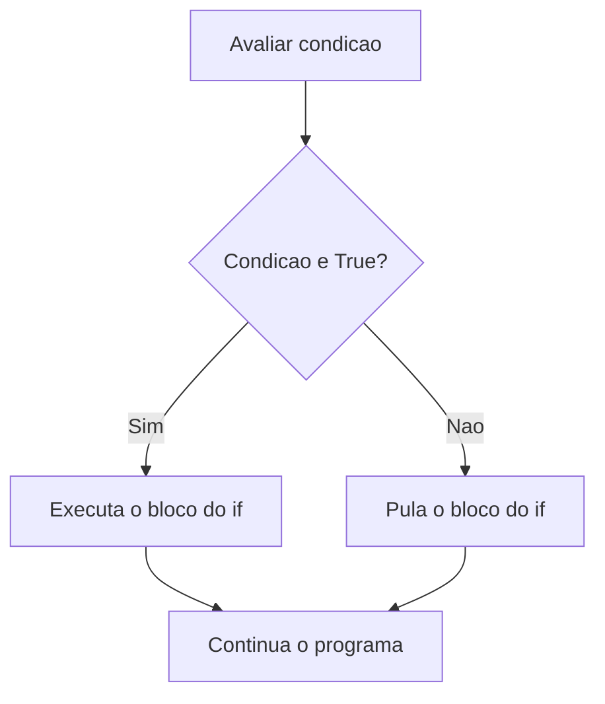
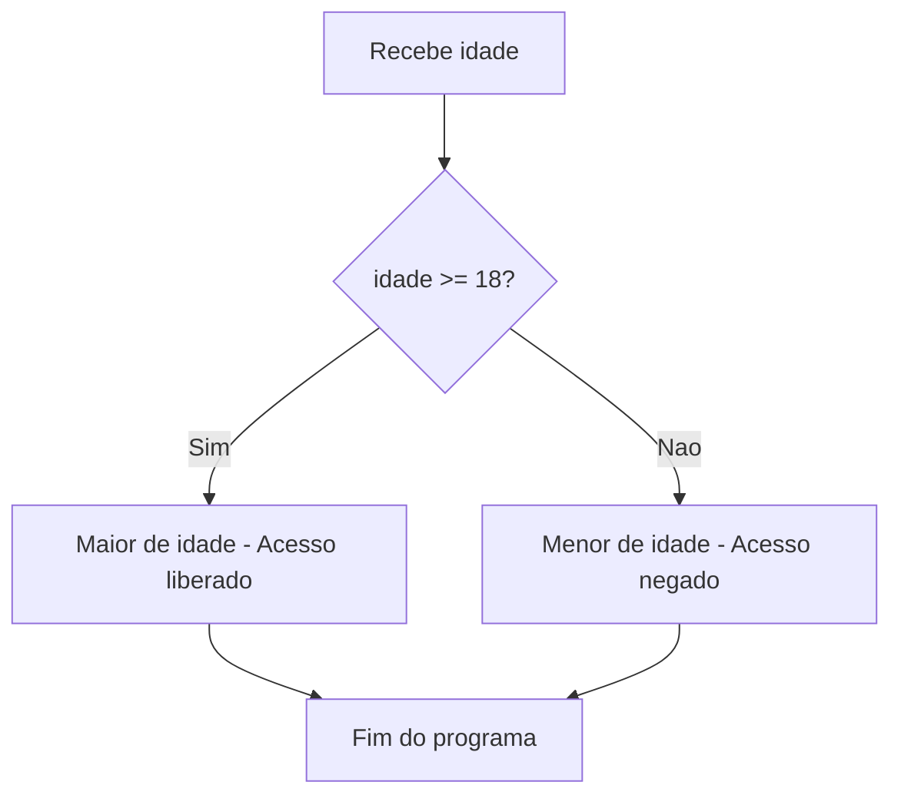
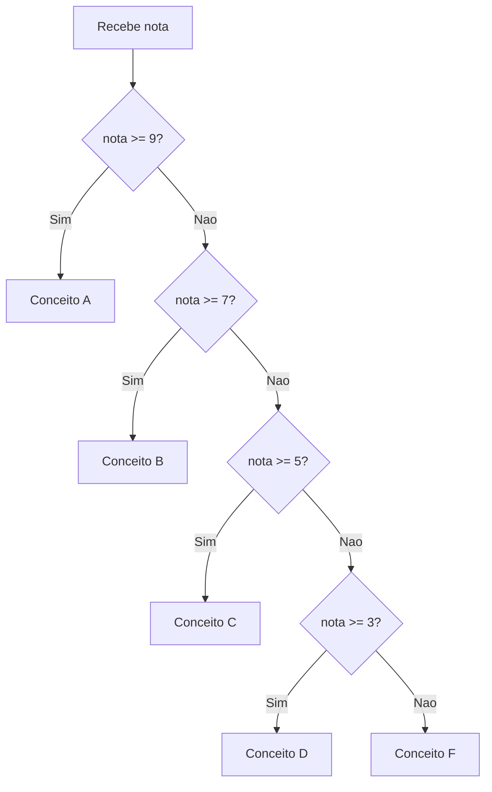

# 5.9 — Condicionais: if, elif e else

[← Anterior: Indentação, Escopo e Estrutura do Código Python](cap05-mod08-indentacao-escopo-conteudo.md) · [Próximo: Loops: for e while →](cap05-mod10-loops.md)

---

## Introdução

Até agora, todos os seus programas executam as mesmas linhas, na mesma ordem, toda vez que rodam. Não importa o que o usuário digita — o programa segue o mesmo caminho do início ao fim.

Mas programas de verdade precisam **tomar decisões**. Quando você faz login em um site, o programa verifica: "a senha está correta?" Se sim, mostra a página principal. Se não, mostra uma mensagem de erro. Quando você compra algo online, o programa verifica: "tem estoque?" Se sim, processa a compra. Se não, avisa que o produto está indisponível.

Essas decisões são feitas com **condicionais** — estruturas que permitem ao programa escolher qual caminho seguir baseado em uma condição. Em Python, usamos `if` (se), `elif` (senão se) e `else` (senão).

Condicionais são um dos quatro pilares da lógica de programação (junto com variáveis, loops e funções). A partir deste módulo, seus programas ganham inteligência — eles passam a reagir de forma diferente dependendo dos dados.

---

## Como Executar os Exemplos Deste Módulo

1. Abra o VSCode: `code ~/projetos/python`
2. Crie arquivos para cada exemplo (ex: `condicionais_basico.py`)
3. Copie, salve e execute: `python3 nome_do_arquivo.py`

---

## O Conceito: Como o Computador "Decide"

O computador não pensa, não reflete, não tem intuição. Ele "decide" de uma forma muito simples: **avalia uma condição e verifica se é verdadeira ou falsa**.

Uma condição é qualquer expressão que resulta em `True` ou `False` (um booleano). Você já conhece essas expressões do módulo 5.7:

- `age >= 18` → True ou False
- `password == "abc123"` → True ou False
- `temperature > 30` → True ou False
- `name == ""` → True ou False

O `if` diz ao Python: "se esta condição for verdadeira, execute este bloco de código".



---

## if — A Estrutura Básica

A forma mais simples de condicional é o `if` sozinho:

```python
# "age" = idade
age = 20

# "if" = se
# Se a idade for maior ou igual a 18...
if age >= 18:
    # ...execute este bloco (indentado com 4 espacos)
    print("Voce e maior de idade")
    print("Pode entrar no evento")

# Esta linha esta fora do if - sempre executa
print("Obrigado pela visita!")
```

Saída esperada:

```
Voce e maior de idade
Pode entrar no evento
Obrigado pela visita!
```

Agora com `age = 15`:

```python
# "age" = idade
age = 15

if age >= 18:
    print("Voce e maior de idade")
    print("Pode entrar no evento")

print("Obrigado pela visita!")
```

Saída esperada:

```
Obrigado pela visita!
```

As linhas dentro do `if` só executam quando a condição é `True`. A linha fora do `if` sempre executa.

### Anatomia do if

```
if condicao:          ← palavra-chave "if" + condição + dois pontos
    instrucao1        ← bloco indentado (4 espaços) — executa se True
    instrucao2        ← mesma indentação = mesmo bloco
codigo_normal         ← sem indentação extra = fora do if
```

---

## if/else — Dois Caminhos

Muitas vezes você quer fazer uma coisa se a condição for verdadeira e **outra coisa** se for falsa. Para isso, usamos `else` (senão):

```python
# "age" = idade
age = int(input("Qual sua idade? "))

if age >= 18:
    print("Voce e maior de idade")
    print("Acesso liberado")
else:
    print("Voce e menor de idade")
    print("Acesso negado")

print("Fim do programa")
```

Saída esperada (se digitar 20):

```
Qual sua idade? 20
Voce e maior de idade
Acesso liberado
Fim do programa
```

Saída esperada (se digitar 15):

```
Qual sua idade? 15
Voce e menor de idade
Acesso negado
Fim do programa
```



O programa sempre segue exatamente um dos dois caminhos — nunca ambos, nunca nenhum.

---

## if/elif/else — Múltiplos Caminhos

Quando há mais de duas possibilidades, usamos `elif` (*else if* = senão se):

```python
# Sistema de classificacao de notas
# "grade" = nota
grade = float(input("Digite sua nota (0 a 10): "))

if grade >= 9:
    print("Conceito: A - Excelente!")
elif grade >= 7:
    print("Conceito: B - Bom")
elif grade >= 5:
    print("Conceito: C - Regular")
elif grade >= 3:
    print("Conceito: D - Insuficiente")
else:
    print("Conceito: F - Reprovado")
```

Saída esperada (se digitar 7.5):

```
Digite sua nota (0 a 10): 7.5
Conceito: B - Bom
```

### Como o Python avalia elif

O Python verifica as condições **de cima para baixo** e executa o **primeiro** bloco cuja condição é verdadeira. Depois, pula todos os outros:



Se a nota é 7.5:
1. `grade >= 9`? 7.5 >= 9? **Não** → pula
2. `grade >= 7`? 7.5 >= 7? **Sim** → executa "Conceito B" e **para**
3. As condições seguintes nem são verificadas

Isso é importante: a **ordem** dos `elif` importa. Se você colocar `grade >= 5` antes de `grade >= 7`, uma nota 8 cairia em "Regular" em vez de "Bom".

### Regras do if/elif/else

| Elemento | Obrigatório? | Quantos? | Quando usar |
|----------|-------------|----------|-------------|
| `if` | Sim | Exatamente 1 | Sempre — é o início da estrutura |
| `elif` | Não | 0 ou mais | Quando há condições adicionais |
| `else` | Não | 0 ou 1 | Quando quer um "caso padrão" |

---

## Condições Compostas

Você pode combinar múltiplas condições usando `and`, `or` e `not` (que aprendeu no módulo 5.7):

### and — Ambas as condições devem ser verdadeiras

```python
# Verificar se pode votar: precisa ter 16+ anos E ser brasileiro
# "age" = idade, "nationality" = nacionalidade
age = int(input("Idade: "))
nationality = input("Nacionalidade: ")

if age >= 16 and nationality.lower() == "brasileira":
    print("Voce pode votar!")
else:
    print("Voce nao pode votar")
```

### or — Pelo menos uma condição deve ser verdadeira

```python
# Verificar se tem desconto: estudante OU idoso (60+)
# "is_student" = e estudante, "age" = idade
age = int(input("Idade: "))
is_student = input("E estudante? (sim/nao): ").lower() == "sim"

if is_student or age >= 60:
    print("Voce tem direito a meia-entrada!")
    # "ticket_price" = preco do ingresso
    ticket_price = 25.00
else:
    print("Ingresso inteira")
    ticket_price = 50.00

print(f"Valor: R$ {ticket_price:.2f}")
```

### not — Inverte a condição

```python
# Verificar se o usuario NAO esta bloqueado
# "is_blocked" = esta bloqueado
username = input("Usuario: ")
is_blocked = username.lower() in ["admin", "root", "teste"]

if not is_blocked:
    print(f"Bem-vindo, {username}!")
else:
    print("Este usuario esta bloqueado")
```

### Combinando and, or e not

```python
# Sistema de acesso: precisa ter login E (ser admin OU ter permissao)
# "is_logged_in" = esta logado
# "is_admin" = e administrador
# "has_permission" = tem permissao
is_logged_in = True
is_admin = False
has_permission = True

if is_logged_in and (is_admin or has_permission):
    print("Acesso concedido")
else:
    print("Acesso negado")
```

Saída esperada:

```
Acesso concedido
```

Use parênteses para deixar claro a ordem de avaliação. `and` tem precedência sobre `or`, mas parênteses tornam o código mais legível.

---

## Valores Truthy e Falsy

No módulo 5.6, você aprendeu que `bool()` converte qualquer valor para True ou False. Essa mesma regra se aplica em condicionais — o Python avalia automaticamente qualquer valor como verdadeiro ou falso:

```python
# Valores "falsy" (avaliados como False):
# 0, 0.0, "", None, [], {}, ()

# "name" = nome
name = input("Digite seu nome (ou deixe vazio): ")

# Python avalia a string: vazia = False, com conteudo = True
if name:
    print(f"Ola, {name}!")
else:
    print("Voce nao digitou um nome")
```

Saída esperada (se digitar "Ana"):

```
Digite seu nome (ou deixe vazio): Ana
Ola, Ana!
```

Saída esperada (se pressionar Enter sem digitar):

```
Digite seu nome (ou deixe vazio): 
Voce nao digitou um nome
```

Isso é muito útil para verificar se o usuário digitou algo:

```python
# Verificar se o usuario preencheu todos os campos
# "name" = nome, "email" = email
name = input("Nome: ")
email = input("Email: ")

if name and email:
    print("Cadastro completo!")
    print(f"Nome: {name}")
    print(f"Email: {email}")
elif not name and not email:
    print("Voce nao preencheu nenhum campo!")
else:
    print("Preencha todos os campos!")
    if not name:
        print("- Nome esta vazio")
    if not email:
        print("- Email esta vazio")
```

### Tabela de valores truthy e falsy

| Valor | Avaliação | Tipo |
|-------|-----------|------|
| `0` | Falsy | int |
| `0.0` | Falsy | float |
| `""` (string vazia) | Falsy | str |
| `None` | Falsy | NoneType |
| `False` | Falsy | bool |
| Qualquer número diferente de 0 | Truthy | int/float |
| Qualquer string com conteúdo | Truthy | str |
| `True` | Truthy | bool |

---

## Padrões Comuns com Condicionais

### Padrão 1: Validação de entrada

```python
# Validar se o usuario digitou um numero valido
# "user_input" = entrada do usuario
user_input = input("Digite um numero inteiro: ")

if user_input.isdigit():
    # "number" = numero
    number = int(user_input)
    print(f"O dobro de {number} e {number * 2}")
elif user_input.startswith("-") and user_input[1:].isdigit():
    # Numero negativo: comeca com - e o resto sao digitos
    number = int(user_input)
    print(f"O dobro de {number} e {number * 2}")
else:
    print(f"'{user_input}' nao e um numero inteiro valido")
```

### Padrão 2: Valor padrão

```python
# Usar valor padrao se o usuario nao digitar nada
# "name" = nome
name = input("Seu nome (Enter para 'Visitante'): ")

# Se name estiver vazio, usa "Visitante"
if not name:
    name = "Visitante"

print(f"Bem-vindo, {name}!")
```

Saída esperada (se pressionar Enter):

```
Seu nome (Enter para 'Visitante'): 
Bem-vindo, Visitante!
```

### Padrão 3: Limitar valor a uma faixa

```python
# Garantir que a nota esta entre 0 e 10
# "grade" = nota
grade = float(input("Nota (0 a 10): "))

if grade < 0:
    grade = 0
    print("Nota ajustada para 0 (minimo)")
elif grade > 10:
    grade = 10
    print("Nota ajustada para 10 (maximo)")

print(f"Nota final: {grade}")
```

### Padrão 4: Menu interativo

```python
# Menu com opcoes numeradas
print("=== Sistema de Cadastro ===")
print()
print("1 - Novo cadastro")
print("2 - Consultar cadastro")
print("3 - Alterar cadastro")
print("4 - Remover cadastro")
print("5 - Sair")
print()

# "choice" = escolha
choice = input("Escolha uma opcao: ")

if choice == "1":
    print("Funcao: Novo cadastro")
    # Aqui entraria a logica de cadastro
elif choice == "2":
    print("Funcao: Consultar cadastro")
elif choice == "3":
    print("Funcao: Alterar cadastro")
elif choice == "4":
    print("Funcao: Remover cadastro")
elif choice == "5":
    print("Saindo do sistema...")
else:
    print(f"Opcao '{choice}' invalida. Escolha de 1 a 5.")
```

Esse padrão de menu é muito comum e vai ser a base do projeto final do capítulo (CRUD em memória).

---

## Programa Completo: Simulador de Caixa Eletrônico

```python
# Simulador simples de caixa eletronico
# "balance" = saldo
balance = 1000.00

print("=== Caixa Eletronico ===")
print(f"Saldo atual: R$ {balance:.2f}")
print()
print("1 - Consultar saldo")
print("2 - Depositar")
print("3 - Sacar")
print()

# "option" = opcao
option = input("Escolha uma opcao: ")

if option == "1":
    print(f"\nSeu saldo e: R$ {balance:.2f}")

elif option == "2":
    # "amount" = valor
    amount = float(input("Valor do deposito: R$ "))
    if amount > 0:
        balance += amount
        print(f"\nDeposito de R$ {amount:.2f} realizado!")
        print(f"Novo saldo: R$ {balance:.2f}")
    else:
        print("\nValor invalido! O deposito deve ser maior que zero.")

elif option == "3":
    amount = float(input("Valor do saque: R$ "))
    if amount <= 0:
        print("\nValor invalido! O saque deve ser maior que zero.")
    elif amount > balance:
        print(f"\nSaldo insuficiente! Seu saldo e R$ {balance:.2f}")
    else:
        balance -= amount
        print(f"\nSaque de R$ {amount:.2f} realizado!")
        print(f"Novo saldo: R$ {balance:.2f}")

else:
    print("\nOpcao invalida!")
```

Saída esperada (se escolher "3" e digitar "250"):

```
=== Caixa Eletronico ===
Saldo atual: R$ 1000.00

1 - Consultar saldo
2 - Depositar
3 - Sacar

Escolha uma opcao: 3
Valor do saque: R$ 250

Saque de R$ 250.00 realizado!
Novo saldo: R$ 750.00
```

---

## Condicionais Aninhados

Você pode colocar um `if` dentro de outro `if`:

```python
# Sistema de classificacao etaria para cinema
# "age" = idade
age = int(input("Idade: "))
# "has_parent" = esta acompanhado dos pais
has_parent = input("Acompanhado dos pais? (sim/nao): ").lower() == "sim"

if age >= 18:
    print("Pode assistir qualquer filme")
else:
    # Menor de 18 - verificar se esta acompanhado
    if age >= 12:
        if has_parent:
            print("Pode assistir filmes ate 16 anos")
        else:
            print("Pode assistir filmes ate 12 anos")
    else:
        if has_parent:
            print("Pode assistir filmes infantis")
        else:
            print("Precisa estar acompanhado dos pais")
```

Condicionais aninhados funcionam, mas podem ficar difíceis de ler. Quando possível, prefira `elif` ou condições compostas:

```python
# Versao mais limpa do mesmo programa
# "age" = idade
age = int(input("Idade: "))
has_parent = input("Acompanhado dos pais? (sim/nao): ").lower() == "sim"

if age >= 18:
    print("Pode assistir qualquer filme")
elif age >= 12 and has_parent:
    print("Pode assistir filmes ate 16 anos")
elif age >= 12:
    print("Pode assistir filmes ate 12 anos")
elif has_parent:
    print("Pode assistir filmes infantis")
else:
    print("Precisa estar acompanhado dos pais")
```

---

## match/case — Seletor de Padrões (Python 3.10+)

A partir do Python 3.10, existe uma alternativa ao if/elif para quando você quer comparar uma variável com vários valores específicos:

```python
# Menu de opcoes usando match/case
# "option" = opcao
print("1 - Cadastrar")
print("2 - Consultar")
print("3 - Remover")
print("4 - Sair")

option = input("Escolha uma opcao: ")

match option:
    case "1":
        print("Voce escolheu: Cadastrar")
    case "2":
        print("Voce escolheu: Consultar")
    case "3":
        print("Voce escolheu: Remover")
    case "4":
        print("Saindo...")
    case _:
        print("Opcao invalida!")
```

O `_` (underscore) no último `case` funciona como o `else` — captura qualquer valor que não foi coberto pelos cases anteriores.

O `match/case` é mais legível que uma cadeia de `if/elif` quando você está comparando uma variável com valores fixos. Mas para condições complexas (como `age >= 18`), continue usando `if/elif/else`.

---

## Programas Completos

### Programa 1: Calculadora com menu

```python
# Calculadora com menu de operacoes
print("=== Calculadora ===")
print("1 - Soma")
print("2 - Subtracao")
print("3 - Multiplicacao")
print("4 - Divisao")
print()

# "operation" = operacao
operation = input("Escolha a operacao (1-4): ")
# "num1" = primeiro numero, "num2" = segundo numero
num1 = float(input("Primeiro numero: "))
num2 = float(input("Segundo numero: "))

if operation == "1":
    # "result" = resultado
    result = num1 + num2
    print(f"{num1} + {num2} = {result}")
elif operation == "2":
    result = num1 - num2
    print(f"{num1} - {num2} = {result}")
elif operation == "3":
    result = num1 * num2
    print(f"{num1} * {num2} = {result}")
elif operation == "4":
    if num2 != 0:
        result = num1 / num2
        print(f"{num1} / {num2} = {result:.2f}")
    else:
        print("Erro: divisao por zero!")
else:
    print("Operacao invalida!")
```

### Programa 2: Classificador de IMC

```python
# Classificador de IMC (Indice de Massa Corporal)
# "weight" = peso, "height" = altura, "bmi" = IMC
print("=== Classificador de IMC ===")
print()

weight = float(input("Peso em kg: "))
height = float(input("Altura em metros: "))

# Calcula o IMC
bmi = weight / (height ** 2)

# Classifica
print(f"\nSeu IMC: {bmi:.1f}")

if bmi < 18.5:
    print("Classificacao: Abaixo do peso")
elif bmi < 25:
    print("Classificacao: Peso normal")
elif bmi < 30:
    print("Classificacao: Sobrepeso")
elif bmi < 35:
    print("Classificacao: Obesidade grau I")
elif bmi < 40:
    print("Classificacao: Obesidade grau II")
else:
    print("Classificacao: Obesidade grau III")
```

---

## Como a IA pode te ajudar aqui
**Prompt 1 — Praticar com projetos:**
> "Crie um programa Python que simula um caixa eletrônico: o usuário escolhe entre ver saldo, depositar, sacar ou sair. Use if/elif/else para cada opção."

**Prompt 2 — Explorar o conceito:**
> "Me explique com exemplos práticos quando usar 'and', 'or' e 'not' em condicionais Python. Mostre casos do dia a dia."

**Prompt 3 — Aprofundar o tema:**
> "Tenho este código com muitos if/elif aninhados: [cole o código]. Como posso simplificá-lo para ficar mais legível?"

---

## Casos de Uso no Mundo Real

### 1. Sistemas de login

Todo sistema de login usa condicionais: se o email existe no banco de dados E a senha está correta, permite o acesso. Senão, mostra erro. Se a conta está bloqueada, mostra mensagem diferente. Se o usuário errou a senha 3 vezes, bloqueia a conta. Cada uma dessas verificações é um `if`.

### 2. Preços dinâmicos (Uber, iFood)

Aplicativos como Uber usam condicionais complexas para calcular preços: se é horário de pico, multiplica o preço. Se está chovendo, aumenta mais. Se a distância é maior que X km, aplica tarifa diferente. Se o usuário tem cupom de desconto, subtrai o valor. Dezenas de condicionais combinadas determinam o preço final.

### 3. Recomendação de conteúdo

Quando a Netflix decide o que mostrar na sua tela, usa condicionais: se o usuário assistiu filmes de ação, recomende mais ação. Se assistiu até o final, a nota é alta. Se parou no meio, a nota é baixa. Se o filme é novo (lançado há menos de 30 dias), dê prioridade. Cada regra é uma condicional.

---

## Resumo do Módulo

| Conceito | Definição |
|----------|-----------|
| if | Executa um bloco se a condição for True |
| else | Executa um bloco se a condição do if for False |
| elif | Verifica uma condição adicional (else if) |
| match/case | Compara uma variável com múltiplos valores específicos (Python 3.10+) |
| Condição composta | Combinação de condições com and, or, not |
| Condicional aninhado | if dentro de outro if |

---

## Glossário do Módulo

| Termo | Definição |
|-------|-----------|
| Condicional (conditional) | Estrutura que executa código diferente baseado em uma condição |
| elif | Abreviação de "else if" — verifica condição adicional após um if |
| else | Bloco executado quando a condição do if (e todos os elif) é False |
| if | Palavra-chave que inicia uma estrutura condicional |
| match/case | Estrutura de seleção de padrões introduzida no Python 3.10 |
| Wildcard (_) | No match/case, captura qualquer valor não coberto pelos cases anteriores |

---

## Na Cultura Popular

- **Se Eu Ficar** (*If I Stay*, filme, 2014) — o título do filme é literalmente um `if` (se). A protagonista precisa tomar uma decisão que muda toda a sua vida. Em programação, cada `if` é um ponto de decisão que muda o caminho do programa — assim como decisões mudam o rumo de uma história.

- **Bandersnatch** (filme interativo, Netflix, 2018) — o espectador toma decisões que mudam o rumo da história. Cada decisão é um `if/else` no código do filme. O filme tem mais de 1 trilhão de combinações possíveis de caminhos — mostrando o poder exponencial de condicionais encadeadas.

---

## Para Saber Mais

- [W3Schools — Python If...Else](https://www.w3schools.com/python/python_conditions.asp) — *Tutorial completo sobre condicionais*
- [W3Schools — Python Match](https://www.w3schools.com/python/python_match.asp) — *Tutorial sobre match/case*
- [Documentação Python — Instruções Compostas](https://docs.python.org/pt-br/3/reference/compound_stmts.html) — *Referência oficial*
- [GitHub do Fino — learn-ops-content](https://github.com/RafaelFino/learn-ops-content) — *Material de referência do Fino*

---

## Perguntas Frequentes (FAQ)

**P: Posso ter if sem else?**
R: Sim. O `else` é opcional. Use apenas `if` quando quer executar algo apenas se a condição for verdadeira, sem fazer nada se for falsa.

**P: Posso ter vários elif?**
R: Sim, quantos quiser. Cada `elif` adiciona uma condição alternativa.

**P: A ordem dos elif importa?**
R: Sim. Python verifica de cima para baixo e executa o primeiro que for True. Se a ordem estiver errada, o resultado pode ser inesperado.

**P: Posso usar if dentro de if?**
R: Sim, isso se chama "condicional aninhado". Mas evite muitos níveis — prefira elif ou condições compostas para manter o código legível.

**P: O que acontece se nenhuma condição for verdadeira e não tiver else?**
R: Nada. O programa simplesmente pula toda a estrutura if/elif e continua na próxima linha fora do bloco.

**P: Posso comparar strings com if?**
R: Sim. `if name == "Maria":` funciona perfeitamente. Lembre-se que a comparação é case-sensitive ("Maria" != "maria").

**P: O que é match/case?**
R: É uma estrutura introduzida no Python 3.10 para comparar uma variável com múltiplos valores. É mais legível que if/elif para comparações simples de igualdade.

**P: Preciso do Python 3.10 para usar match/case?**
R: Sim. Se sua versão é anterior, use if/elif/else. Verifique com `python3 --version`.

**P: Posso usar condicionais em uma única linha?**
R: Sim, com o operador ternário: `status = "maior" if age >= 18 else "menor"`. Use apenas para casos simples.

**P: and e or podem ser usados no mesmo if?**
R: Sim. Use parênteses para clareza: `if (a > 5 and b < 10) or c == 0:`.

---

## Exercícios Práticos

Os exercícios completos estão no arquivo separado:

**[Acessar Exercícios do Módulo 5.9](cap05-mod09-condicionais-exercicios.md)**

Prévia:

### Exercício rápido 1 — Classificador de temperatura

Crie um programa que pede a temperatura e classifica: abaixo de 0 (congelante), 0-15 (frio), 15-25 (agradável), 25-35 (quente), acima de 35 (muito quente).

### Exercício rápido 2 — Validador de senha

Crie um programa que pede uma senha e verifica se tem pelo menos 8 caracteres, contém pelo menos um número (`isdigit` em algum caractere) e não é igual a "12345678".

### Exercício rápido 3 — Jogo de adivinhação simples

Crie um programa que define um número secreto, pede ao usuário para adivinhar e diz se o palpite é muito alto, muito baixo ou correto.

---

[← Anterior: Indentação, Escopo e Estrutura do Código Python](cap05-mod08-indentacao-escopo-conteudo.md) · [Próximo: Loops: for e while →](cap05-mod10-loops.md)
