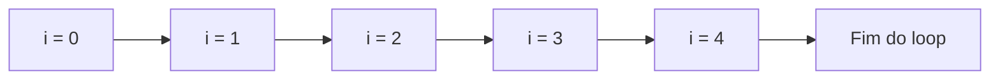
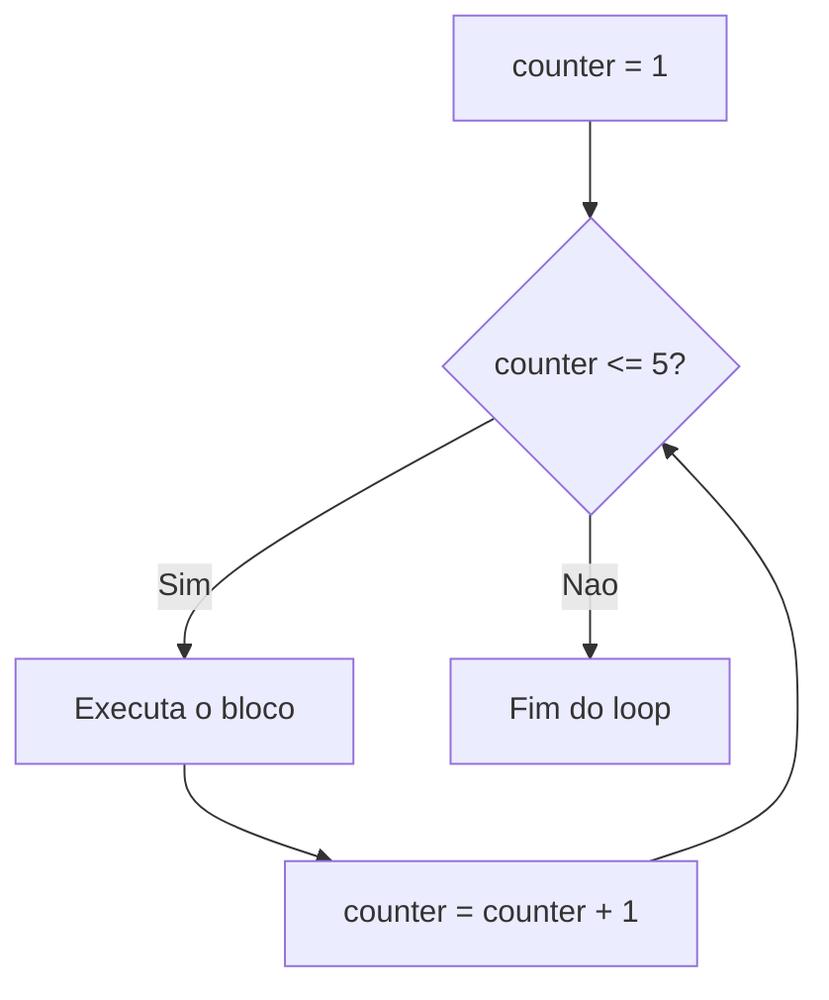
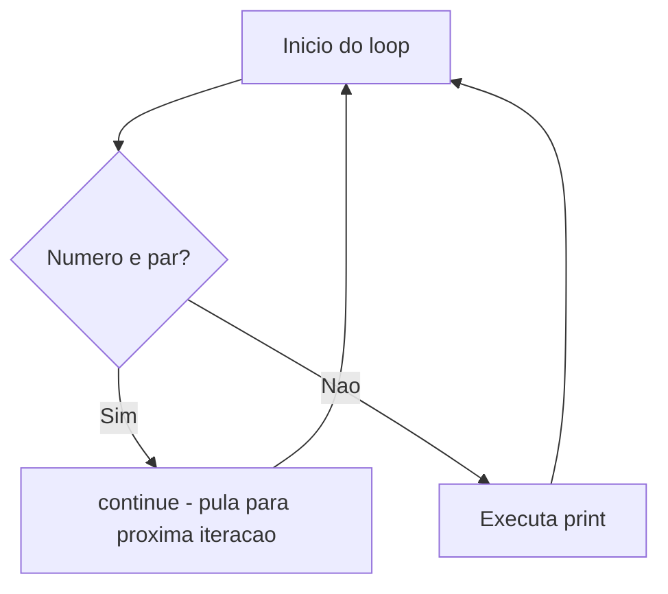

# 5.10 — Loops: for e while

[← Anterior: Condicionais: if, elif e else](cap05-mod09-condicionais-conteudo.md) · [Próximo: Funções: Organizando e Reutilizando Código →](cap05-mod11-funcoes-conteudo.md)

---

## Introdução

No módulo anterior, você aprendeu a fazer o programa tomar decisões com `if`, `elif` e `else`. Agora seus programas já conseguem escolher caminhos diferentes dependendo dos dados. Mas ainda têm uma limitação importante: cada instrução executa apenas uma vez.

E se você precisar repetir uma ação várias vezes? Por exemplo: exibir os números de 1 a 100, somar todos os itens de uma lista de compras, ou pedir ao usuário que digite dados até que ele decida parar. Escrever 100 linhas de `print()` seria impraticável e absurdo.

Para isso existem os **loops** (laços de repetição) — estruturas que repetem um bloco de código automaticamente. Loops são um dos quatro pilares da lógica de programação, junto com variáveis, condicionais e funções. A partir deste módulo, seus programas ganham o poder de fazer trabalho repetitivo sem esforço.

Pense nos loops como dar voltas em uma pista de corrida. Cada volta é uma **iteração** (repetição). Você continua dando voltas até completar o número desejado (loop `for`) ou até cansar (loop `while`).

Neste módulo, vamos aprender dois tipos de loop:
- `for` — repete um número definido de vezes ou para cada item de uma coleção
- `while` — repete enquanto uma condição for verdadeira

---

## Como Executar os Exemplos Deste Módulo

1. Abra o VSCode: `code ~/projetos/python`
2. Crie arquivos para cada exemplo (ex: `loops_basico.py`)
3. Copie, salve e execute: `python3 nome_do_arquivo.py`

---

## Por que Loops Existem — O Problema da Repetição

Antes de entrar na sintaxe, vamos entender o problema que loops resolvem.

Imagine que você quer exibir os números de 1 a 5. Sem loops, você faria assim:

```python
# Sem loops — repetindo manualmente cada linha
# Isso funciona, mas e se fossem 1000 numeros?
print(1)
print(2)
print(3)
print(4)
print(5)
```

**Saída esperada:**
```
1
2
3
4
5
```

Funciona? Sim. Mas e se fossem 1000 números? Ou 1 milhão? Você não pode escrever 1 milhão de linhas de `print()`. Além disso, se precisar mudar algo (por exemplo, exibir o dobro de cada número), teria que mudar todas as linhas uma por uma.

Loops resolvem esse problema: você escreve a instrução uma vez e o computador repete quantas vezes for necessário.

```python
# Com loop — uma unica instrucao que repete 5 vezes
# "number" = numero
for number in range(1, 6):
    print(number)
```

**Saída esperada:**
```
1
2
3
4
5
```

Cinco linhas de código viraram duas. E se fossem 1 milhão de números? Bastaria trocar o `6` por `1000001`. O poder dos loops é esse: transformar trabalho repetitivo em algo automático.

### Uma Breve História dos Loops

O conceito de repetição é tão antigo quanto a própria computação. Ada Lovelace, considerada a primeira programadora da história, já descrevia loops em 1843 quando escreveu instruções para a Máquina Analítica de Charles Babbage. Ela percebeu que certas sequências de operações precisavam ser repetidas — e criou o conceito de "ciclo de operações".

Quando os primeiros computadores eletrônicos surgiram nos anos 1940 e 1950, loops eram implementados com instruções de "salto" (jump) — o programa literalmente pulava de volta para uma linha anterior. Era confuso e propenso a erros. As linguagens modernas criaram estruturas como `for` e `while` para tornar loops legíveis e seguros.

---

## Termos Importantes

Antes de começar, vamos explicar alguns termos que aparecem muito quando falamos de loops:

- **Iteração** (do inglês "iteration"): cada repetição do loop. Se o loop executa 5 vezes, ele faz 5 iterações. É como cada volta que você dá em uma pista de corrida.

- **Contador** (do inglês "counter"): uma variável que conta quantas vezes algo aconteceu. Começa em um valor (geralmente 0) e aumenta a cada iteração. É como contar nos dedos.

- **Incremento** (do inglês "increment"): a ação de aumentar o valor de uma variável, geralmente de 1 em 1. É como subir um degrau de cada vez em uma escada.

- **Acumulador** (do inglês "accumulator"): uma variável que vai somando valores ao longo do loop. É como um cofrinho onde você coloca moedas a cada volta — no final, tem o total acumulado.

- **Loop infinito** (do inglês "infinite loop"): um loop que nunca para porque a condição nunca se torna falsa. É como uma música que fica repetindo para sempre sem parar.

---

## Loop for — Repetir para Cada Item

O loop `for` repete um bloco de código **para cada item** de uma sequência (lista, string, range). É o loop mais usado em Python.

A palavra `for` vem do inglês e significa "para". Leia `for i in range(5):` como "para cada i no intervalo de 0 a 4, faça...".

### for com range() — Repetir um Número de Vezes

A função `range()` gera uma sequência de números. Combinada com `for`, permite repetir algo um número específico de vezes:

```python
# Repetindo 5 vezes usando for com range()
# range(5) gera os numeros: 0, 1, 2, 3, 4
# "i" e a variavel que recebe cada numero a cada iteracao (volta)
# "i" vem de "index" (indice) — e uma convencao comum em programacao
for i in range(5):
    # Este bloco executa 5 vezes (uma para cada numero de 0 a 4)
    print(f"Iteracao {i}")
```

**Saída esperada:**
```
Iteracao 0
Iteracao 1
Iteracao 2
Iteracao 3
Iteracao 4
```

> **Nota:** `range(5)` gera números de 0 até 4 (5 números no total). O número 5 não é incluído. É como a regra do fatiamento de strings que você aprendeu no módulo 5.6: o fim não é incluído.

Vamos visualizar o que acontece a cada iteração:



### range() com Início e Fim

Você pode especificar onde começar e onde terminar:

```python
# range(inicio, fim) — gera numeros de inicio ate fim-1
# Contando de 1 a 10
# "number" = numero
for number in range(1, 11):
    print(number, end=" ")
```

**Saída esperada:**
```
1 2 3 4 5 6 7 8 9 10 
```

> **Nota:** Usamos `end=" "` no `print()` para que os números apareçam na mesma linha, separados por espaço, em vez de um por linha.

### range() com Passo

Você pode definir o incremento (passo) entre os números:

```python
# range(inicio, fim, passo) — pula de "passo" em "passo"
# Contando de 0 a 20 de 2 em 2 (numeros pares)
for number in range(0, 21, 2):
    print(number, end=" ")
```

**Saída esperada:**
```
0 2 4 6 8 10 12 14 16 18 20 
```

```python
# Contagem regressiva: passo negativo
for number in range(10, 0, -1):
    # range(10, 0, -1) gera: 10, 9, 8, ..., 1
    print(number, end=" ")
print("Fogo!")
```

**Saída esperada:**
```
10 9 8 7 6 5 4 3 2 1 Fogo!
```

### Resumo do range()

| Forma | O que gera | Exemplo |
|-------|-----------|---------|
| `range(n)` | 0 até n-1 | `range(5)` → 0, 1, 2, 3, 4 |
| `range(a, b)` | a até b-1 | `range(1, 6)` → 1, 2, 3, 4, 5 |
| `range(a, b, p)` | a até b-1, pulando de p em p | `range(0, 10, 2)` → 0, 2, 4, 6, 8 |
| `range(a, b, -p)` | a até b+1, decrescendo | `range(10, 0, -1)` → 10, 9, ..., 1 |

### for com Strings — Percorrendo Cada Caractere

Você já sabe que strings são sequências de caracteres (módulo 5.6). O `for` pode percorrer cada caractere de uma string:

```python
# Percorrendo cada caractere de uma string
# "word" = palavra
word = "Python"

# "char" = caractere (abreviacao de character)
# A cada iteracao, char recebe o proximo caractere da string
for char in word:
    print(char)
```

**Saída esperada:**
```
P
y
t
h
o
n
```

### for com Listas — Percorrendo Cada Item

Listas são coleções de itens entre colchetes `[]`, separados por vírgula. Vamos aprofundar listas no módulo 5.12, mas por enquanto saiba que o `for` percorre cada item naturalmente:

```python
# Percorrendo cada item de uma lista
# "fruits" = frutas
fruits = ["maca", "banana", "laranja", "uva"]

# "fruit" = fruta — recebe cada item da lista a cada iteracao
for fruit in fruits:
    print(f"Eu gosto de {fruit}")
```

**Saída esperada:**
```
Eu gosto de maca
Eu gosto de banana
Eu gosto de laranja
Eu gosto de uva
```

### enumerate() — Índice e Valor ao Mesmo Tempo

Às vezes você precisa saber a posição (índice) de cada item além do valor. A função `enumerate()` (enumerar) faz isso:

```python
# enumerate() retorna o indice e o valor a cada iteracao
# "fruits" = frutas
fruits = ["maca", "banana", "laranja"]

# "i" = indice, "fruit" = fruta
for i, fruit in enumerate(fruits):
    print(f"Posicao {i}: {fruit}")
```

**Saída esperada:**
```
Posicao 0: maca
Posicao 1: banana
Posicao 2: laranja
```

---

## Loop while — Repetir Enquanto uma Condição For Verdadeira

O loop `while` repete um bloco **enquanto** uma condição for verdadeira. Quando a condição se torna falsa, o loop para.

A palavra `while` vem do inglês e significa "enquanto". Leia `while counter <= 5:` como "enquanto o contador for menor ou igual a 5, faça...".

Pense assim: "enquanto a panela não estiver fervendo, continue mexendo". Você não sabe quantas vezes vai mexer — depende de quando a água ferver.

```python
# Contando de 1 a 5 com while
# "counter" = contador — comeca em 1
counter = 1

# while verifica a condicao antes de cada iteracao
# Enquanto counter for <= 5, o bloco executa
while counter <= 5:
    print(f"Contagem: {counter}")
    # Incrementamos o contador em 1 a cada iteracao
    # Sem isso, o loop nunca pararia (loop infinito!)
    counter = counter + 1

print("Fim da contagem!")
```

**Saída esperada:**
```
Contagem: 1
Contagem: 2
Contagem: 3
Contagem: 4
Contagem: 5
Fim da contagem!
```

Vamos visualizar o fluxo do `while`:



> **Atenção:** Sempre garanta que a condição do `while` vai se tornar falsa em algum momento. Se a condição nunca mudar, o loop roda para sempre (loop infinito) e o programa trava. Se isso acontecer, pressione `Ctrl + C` no terminal para interromper.

### while com input — Repetir Até o Usuário Decidir Parar

Um uso muito comum do `while` é criar menus ou pedir dados até o usuário querer sair:

```python
# Programa que repete ate o usuario digitar "sair"
# "command" = comando
command = ""

# Enquanto o usuario nao digitar "sair", continua pedindo
while command != "sair":
    command = input("Digite um comando (ou 'sair' para encerrar): ")
    if command != "sair":
        print(f"Voce digitou: {command}")

print("Programa encerrado.")
```

### while True — Loop com Saída Controlada

Outra forma comum é usar `while True` (loop que roda para sempre) e sair com `break`:

```python
# Loop infinito controlado com break
while True:
    # "user_input" = entrada do usuario
    user_input = input("Digite algo (ou 'sair'): ")

    if user_input == "sair":
        break  # Sai do loop imediatamente

    print(f"Voce digitou: {user_input}")

print("Ate logo!")
```

Esse padrão é muito usado em programas reais porque é mais legível: a condição de saída fica clara dentro do loop.

### Operadores de Atribuição Compostos

Dentro de loops, é muito comum atualizar variáveis. Python oferece atalhos para isso:

```python
# Formas abreviadas de atualizar variaveis
# "counter" = contador
counter = 0

counter = counter + 1   # Forma longa
counter += 1             # Forma abreviada — faz a mesma coisa

# Outros operadores compostos:
# "value" = valor
value = 10
value -= 3   # value = value - 3  → 7
value *= 2   # value = value * 2  → 14
value /= 7   # value = value / 7  → 2.0

print(f"counter: {counter}")
print(f"value: {value}")
```

**Saída esperada:**
```
counter: 2
value: 2.0
```

| Operador | Equivalente | Exemplo |
|----------|------------|---------|
| `+=` | `x = x + n` | `counter += 1` |
| `-=` | `x = x - n` | `total -= 5` |
| `*=` | `x = x * n` | `price *= 1.1` |
| `/=` | `x = x / n` | `value /= 2` |

---

## break — Interrompendo o Loop

O comando `break` ("quebrar/interromper") para o loop imediatamente, independente da condição ou do range:

```python
# Procurando um numero especifico em uma sequencia
# "target" = alvo (o numero que estamos procurando)
target = 7

for number in range(1, 20):
    print(f"Verificando {number}...")
    if number == target:
        # Encontramos! Paramos o loop com break
        print(f"Encontrei o {target}!")
        break

print("Busca encerrada.")
```

**Saída esperada:**
```
Verificando 1...
Verificando 2...
Verificando 3...
Verificando 4...
Verificando 5...
Verificando 6...
Verificando 7...
Encontrei o 7!
Busca encerrada.
```

O `break` é útil quando você encontra o que procura e não precisa continuar verificando o resto. Sem o `break`, o loop continuaria até 19 mesmo já tendo encontrado o 7.

---

## continue — Pulando para a Próxima Iteração

O comando `continue` ("continuar") pula o restante do bloco atual e vai direto para a próxima iteração:

```python
# Exibindo apenas numeros impares de 1 a 10
for number in range(1, 11):
    # Se o numero for par, pula para o proximo
    if number % 2 == 0:
        continue  # Pula o print abaixo e vai para a proxima iteracao
    print(number, end=" ")
```

**Saída esperada:**
```
1 3 5 7 9 
```



### Diferença entre break e continue

| Comando | O que faz | Analogia |
|---------|----------|----------|
| `break` | Para o loop completamente | Sair da pista de corrida |
| `continue` | Pula para a próxima volta | Pular um obstáculo e continuar correndo |

---

## Padrões Comuns com Loops

Existem padrões que aparecem o tempo todo em programação. Conhecê-los vai acelerar muito sua capacidade de resolver problemas.

### Padrão 1: Contador

Contar quantas vezes algo acontece:

```python
# Contando quantos numeros pares existem de 1 a 20
# "even_count" = contagem de pares
even_count = 0

for number in range(1, 21):
    if number % 2 == 0:
        # Incrementamos o contador quando encontramos um par
        even_count += 1

print(f"Quantidade de numeros pares de 1 a 20: {even_count}")
```

**Saída esperada:**
```
Quantidade de numeros pares de 1 a 20: 10
```

### Padrão 2: Acumulador (Soma)

Somar valores ao longo do loop:

```python
# Somando todos os numeros de 1 a 100
# "total" = total (acumulador — comeca em 0 e vai somando)
total = 0

for number in range(1, 101):
    # A cada iteracao, somamos o numero atual ao total
    total += number

print(f"Soma de 1 a 100: {total}")
```

**Saída esperada:**
```
Soma de 1 a 100: 5050
```

> **Curiosidade:** O matemático Carl Friedrich Gauss, quando criança, descobriu uma fórmula para calcular essa soma sem loop: `n * (n + 1) / 2`. Para n=100: `100 * 101 / 2 = 5050`. Mas o computador não precisa da fórmula — ele simplesmente soma um por um, muito rápido.

### Padrão 3: Busca

Procurar um item em uma coleção:

```python
# Procurando se um nome esta na lista
# "names" = nomes
names = ["Ana", "Carlos", "Maria", "Pedro", "Julia"]

# "search_name" = nome a buscar
search_name = input("Qual nome voce procura? ")

# "found" = encontrado — comeca como False
found = False

for name in names:
    if name.lower() == search_name.lower():
        found = True
        break  # Encontrou, nao precisa continuar procurando

if found:
    print(f"{search_name} esta na lista!")
else:
    print(f"{search_name} nao foi encontrado.")
```

### Padrão 4: Maior e Menor Valor

Encontrar o maior ou menor valor em uma sequência:

```python
# Encontrando o maior e o menor numero
# "numbers" = numeros
numbers = [45, 12, 78, 3, 56, 91, 23]

# Comecamos assumindo que o primeiro e o maior e o menor
# "biggest" = maior, "smallest" = menor
biggest = numbers[0]
smallest = numbers[0]

for number in numbers:
    if number > biggest:
        biggest = number
    if number < smallest:
        smallest = number

print(f"Maior: {biggest}")
print(f"Menor: {smallest}")
```

**Saída esperada:**
```
Maior: 91
Menor: 3
```

### Padrão 5: Validação de Entrada

Pedir dados até o usuário digitar algo válido:

```python
# Pedindo uma idade valida (entre 0 e 150)
while True:
    # "age_text" = texto da idade
    age_text = input("Digite sua idade: ")

    # Verifica se o usuario digitou um numero
    if not age_text.isdigit():
        print("Erro: digite apenas numeros!")
        continue

    # "age" = idade
    age = int(age_text)

    # Verifica se a idade esta no intervalo valido
    if age < 0 or age > 150:
        print("Erro: idade deve ser entre 0 e 150!")
        continue

    # Se chegou aqui, a idade e valida
    break

print(f"Idade registrada: {age}")
```

Esse padrão é extremamente comum em programas reais. Toda vez que um programa pede dados ao usuário, ele precisa validar se os dados fazem sentido.

---

## Loops Aninhados — Loop Dentro de Loop

Você pode colocar um loop dentro de outro. O loop interno executa completamente para cada iteração do loop externo:

```python
# Tabuada de multiplicacao (1 a 5)
for i in range(1, 6):
    # Para cada valor de i, o loop interno executa completamente
    for j in range(1, 6):
        # "result" = resultado da multiplicacao
        result = i * j
        print(f"{i} x {j} = {result}", end="\t")
    # Pula linha apos cada linha da tabuada
    # "\t" = tabulacao (tab) — alinha as colunas
    print()
```

**Saída esperada:**
```
1 x 1 = 1	1 x 2 = 2	1 x 3 = 3	1 x 4 = 4	1 x 5 = 5	
2 x 1 = 2	2 x 2 = 4	2 x 3 = 6	2 x 4 = 8	2 x 5 = 10	
3 x 1 = 3	3 x 2 = 6	3 x 3 = 9	3 x 4 = 12	3 x 5 = 15	
4 x 1 = 4	4 x 2 = 8	4 x 3 = 12	4 x 4 = 16	4 x 5 = 20	
5 x 1 = 5	5 x 2 = 10	5 x 3 = 15	5 x 4 = 20	5 x 5 = 25	
```

> **Atenção:** Loops aninhados multiplicam o número de iterações. Se o loop externo roda 5 vezes e o interno roda 5 vezes, o bloco interno executa 5 × 5 = 25 vezes. Com loops grandes, isso pode ficar lento. Use com cuidado.

### Exemplo Prático: Desenhando com Loops Aninhados

```python
# Desenhando um triangulo de asteriscos
# "rows" = linhas
rows = 5

for i in range(1, rows + 1):
    # A cada linha, imprime i asteriscos
    # "*" * i repete o caractere i vezes
    print("*" * i)
```

**Saída esperada:**
```
*
**
***
****
*****
```

```python
# Desenhando um retangulo
# "width" = largura, "height" = altura
width = 8
height = 4

for row in range(height):
    for col in range(width):
        print("#", end="")
    print()  # Pula linha apos cada linha do retangulo
```

**Saída esperada:**
```
########
########
########
########
```

---

## for vs while — Quando Usar Cada Um?

| Situação | Melhor opção | Motivo |
|----------|-------------|--------|
| Sabe quantas vezes repetir | `for` | `range()` define o número exato |
| Percorrer uma coleção | `for` | Itera naturalmente sobre cada item |
| Não sabe quantas vezes | `while` | Repete até a condição mudar |
| Esperar entrada do usuário | `while` | Repete até o usuário decidir parar |
| Validar dados | `while` | Repete até receber dados válidos |
| Contagem regressiva | `for` | `range()` com passo negativo |

Na dúvida, pergunte: "eu sei quantas vezes preciso repetir?" Se sim, use `for`. Se não, use `while`.

---

## Erros Comuns com Loops

### Erro 1: Loop Infinito no while

```python
# ERRADO — counter nunca muda, loop infinito!
counter = 1
while counter <= 5:
    print(counter)
    # Esqueceu de incrementar counter!

# CORRETO — counter incrementa a cada iteracao
counter = 1
while counter <= 5:
    print(counter)
    counter += 1
```

### Erro 2: Off-by-One (Erro de Um a Mais ou a Menos)

```python
# Queremos imprimir de 1 a 5

# ERRADO — imprime de 0 a 4
for i in range(5):
    print(i)

# CORRETO — imprime de 1 a 5
for i in range(1, 6):
    print(i)
```

Esse erro é tão comum que tem nome: **off-by-one error** (erro de um a mais ou a menos). Acontece porque `range()` não inclui o último número.

### Erro 3: Modificar Lista Durante Iteração

```python
# ERRADO — modificar a lista enquanto percorre causa comportamento estranho
# "numbers" = numeros
numbers = [1, 2, 3, 4, 5]
for number in numbers:
    if number % 2 == 0:
        numbers.remove(number)  # Nao faca isso!

# CORRETO — criar uma nova lista com os itens desejados
numbers = [1, 2, 3, 4, 5]
# "odd_numbers" = numeros impares
odd_numbers = []
for number in numbers:
    if number % 2 != 0:
        odd_numbers.append(number)
print(odd_numbers)
```

**Saída esperada:**
```
[1, 3, 5]
```

---

## Exemplo Completo: Jogo de Adivinhação

Vamos combinar tudo que aprendemos em um programa mais completo:

```python
# Jogo de adivinhacao — o programa escolhe um numero e o usuario tenta adivinhar
# Usamos um numero fixo por enquanto (no futuro, usaremos numeros aleatorios)

# "secret_number" = numero secreto
secret_number = 42
# "max_attempts" = maximo de tentativas
max_attempts = 7
# "attempts" = tentativas feitas
attempts = 0

print("=== Jogo de Adivinhacao ===")
print(f"Estou pensando em um numero entre 1 e 100.")
print(f"Voce tem {max_attempts} tentativas.")
print()

while attempts < max_attempts:
    # "guess_text" = texto do palpite
    guess_text = input(f"Tentativa {attempts + 1}/{max_attempts}: ")

    # Validacao: verificar se digitou um numero
    if not guess_text.isdigit():
        print("Digite apenas numeros!")
        continue  # Nao conta como tentativa

    # "guess" = palpite
    guess = int(guess_text)
    attempts += 1

    if guess == secret_number:
        print(f"Parabens! Voce acertou em {attempts} tentativas!")
        break
    elif guess < secret_number:
        print("Muito baixo! Tente um numero maior.")
    else:
        print("Muito alto! Tente um numero menor.")

    # Mostra quantas tentativas restam
    # "remaining" = restantes
    remaining = max_attempts - attempts
    if remaining > 0:
        print(f"Restam {remaining} tentativas.")

# Se saiu do loop sem acertar
if guess != secret_number:
    print(f"Suas tentativas acabaram! O numero era {secret_number}.")
```

Este programa usa: `while`, `if/elif/else`, `continue`, `break`, variáveis contadoras, validação de entrada e operadores de comparação. Tudo que você aprendeu até agora.

---

## Como a IA pode te ajudar aqui

Loops são um tema onde a IA pode ser uma parceira de aprendizado muito útil. Experimente estes prompts:

**Prompt 1 — Explorar o conceito:**
> "Me explique passo a passo o que acontece em cada iteração deste loop for: `for i in range(3, 15, 2): print(i)`"

**Prompt 2 — Praticar com projetos:**
> "Crie um exercício de loop while onde eu preciso validar a entrada do usuário pedindo um número entre 1 e 10"

**Prompt 3 — Comparar alternativas:**
> "Qual a diferença entre usar break dentro de um while True e usar uma condição no while? Me mostre exemplos dos dois"

Lembre-se: a IA é uma ferramenta de apoio. Use-a para tirar dúvidas e pedir exemplos extras, mas sempre execute o código você mesmo para entender de verdade.

---

## Casos de Uso no Mundo Real

### Caso 1: Feed de Redes Sociais

Quando você abre o Instagram ou o TikTok, o aplicativo usa um loop para percorrer cada post e montar a tela. Algo como: "para cada post na lista de posts do usuário, renderize o conteúdo na tela". Sem loops, seria impossível exibir centenas de posts — o programador teria que escrever código individual para cada um.

### Caso 2: Processamento de Pagamentos

Quando uma loja online como a Amazon processa pedidos, ela usa loops para percorrer cada item do carrinho de compras: calcular o subtotal de cada item, aplicar descontos, somar o total. Um loop `for` percorre a lista de itens e um acumulador vai somando os valores. É exatamente o padrão de acumulador que você aprendeu neste módulo.

### Caso 3: Validação de Formulários

Quando você preenche um formulário online (cadastro, login, compra), o sistema usa loops `while` para validar os dados. Se você digita um e-mail inválido, o sistema pede novamente. Se a senha é fraca, pede outra. O padrão é o mesmo que fizemos: `while True` com validação e `break` quando os dados estão corretos.

---

## Resumo do Módulo

| Conceito | Descrição |
|----------|-----------|
| `for i in range(n):` | Repete n vezes (0 a n-1) |
| `for item in coleção:` | Repete para cada item da coleção |
| `while condição:` | Repete enquanto condição for True |
| `break` | Interrompe o loop imediatamente |
| `continue` | Pula para a próxima iteração |
| `range(a, b, p)` | Gera sequência de a até b-1, pulando de p em p |
| `enumerate()` | Retorna índice e valor ao percorrer coleção |
| `+=`, `-=`, `*=`, `/=` | Operadores de atribuição compostos |
| Contador | Variável que conta ocorrências |
| Acumulador | Variável que soma valores |
| Loop infinito | Loop que nunca para (condição sempre True) |
| Off-by-one | Erro de um a mais ou a menos no range |

---

## Glossário do Módulo

| Termo | Definição |
|-------|-----------|
| Acumulador (accumulator) | Variável que soma valores ao longo de um loop |
| break | Comando que interrompe o loop imediatamente |
| Contador (counter) | Variável que conta quantas vezes algo aconteceu |
| continue | Comando que pula para a próxima iteração do loop |
| enumerate | Função que retorna índice e valor ao percorrer uma coleção |
| for | Estrutura de repetição que itera sobre uma sequência |
| Incremento (increment) | Ação de aumentar o valor de uma variável |
| Iteração (iteration) | Cada repetição de um loop |
| Loop | Estrutura que repete um bloco de código |
| Loop aninhado (nested loop) | Loop dentro de outro loop |
| Loop infinito (infinite loop) | Loop que nunca para porque a condição nunca se torna falsa |
| Off-by-one error | Erro de um a mais ou a menos, comum com range() |
| Operador composto | Atalho como `+=` que combina operação e atribuição |
| range() | Função que gera uma sequência de números |
| while | Estrutura de repetição que executa enquanto condição for verdadeira |

---

## Na Cultura Popular

- **O Dia da Marmota** (filme, 1993) — o personagem de Bill Murray revive o mesmo dia infinitamente, como um loop infinito. Ele só "sai do loop" quando muda seu comportamento (a condição se torna falsa). É a analogia perfeita para entender `while`.
- **Matrix** (filme, 1999) — o conceito de "loop na Matrix" aparece quando os personagens percebem padrões que se repetem. A ideia de que o sistema executa ciclos repetitivos é central na trama.

---

## Para Saber Mais

- [W3Schools — Python For Loops](https://www.w3schools.com/python/python_for_loops.asp) — *Loops for em Python com exemplos interativos*
- [W3Schools — Python While Loops](https://www.w3schools.com/python/python_while_loops.asp) — *Loops while em Python*
- [Documentação Python — Controle de Fluxo](https://docs.python.org/pt-br/3/tutorial/controlflow.html) — *Referência oficial em português*
- [GitHub do Fino — learn-ops-content](https://github.com/RafaelFino/learn-ops-content) — *Material de referência com exemplos de loops*

---

## Perguntas Frequentes (FAQ)

**P: O que é um "loop infinito"?**
R: É quando o loop nunca para porque a condição nunca se torna falsa. Exemplo: `while True: print("ola")` roda para sempre. Se isso acontecer, pressione `Ctrl + C` no terminal para interromper o programa.

**P: Qual a diferença entre for e while?**
R: O `for` é ideal quando você sabe quantas vezes quer repetir ou quando quer percorrer uma coleção. O `while` é ideal quando você não sabe quantas vezes vai repetir — depende de uma condição que pode mudar a qualquer momento.

**P: Por que range(5) gera 0, 1, 2, 3, 4 e não 1, 2, 3, 4, 5?**
R: Porque em Python (e na maioria das linguagens), a contagem começa do zero. `range(5)` gera 5 números começando do 0. Se quiser começar do 1, use `range(1, 6)`.

**P: O que é "iteração"?**
R: É cada repetição (volta) do loop. Se o loop executa 10 vezes, ele faz 10 iterações. É como cada volta que você dá em uma pista de corrida.

**P: O que += significa?**
R: É uma forma abreviada de somar e atribuir. `x += 5` é o mesmo que `x = x + 5`. Também existem `-=`, `*=`, `/=` para outras operações.

**P: Posso usar break no for e no while?**
R: Sim! O `break` funciona em ambos os tipos de loop. Ele interrompe o loop imediatamente, independente da condição ou do range.

**P: O que acontece se eu esquecer de incrementar o contador no while?**
R: O loop nunca para — vira um loop infinito. A condição nunca muda, então o while continua executando para sempre. Sempre garanta que algo dentro do while muda a condição.

**P: Posso ter um loop dentro de outro?**
R: Sim, isso se chama "loops aninhados". O loop interno executa completamente para cada iteração do loop externo. Use com cuidado — muitos níveis de aninhamento tornam o código confuso e lento.

**P: O que é range(inicio, fim, passo)?**
R: `range()` pode receber até 3 argumentos: início (onde começar), fim (onde parar, não incluído) e passo (de quanto em quanto pular). Exemplo: `range(0, 10, 2)` gera 0, 2, 4, 6, 8.

**P: Posso contar de trás para frente com range?**
R: Sim! Use passo negativo: `range(10, 0, -1)` gera 10, 9, 8, ..., 1. O início deve ser maior que o fim quando o passo é negativo.

**P: O que é enumerate()?**
R: É uma função que adiciona um contador automático ao loop for: `for i, item in enumerate(lista):` dá acesso ao índice (i) e ao item ao mesmo tempo.

**P: Posso modificar a variável do for dentro do loop?**
R: Você pode, mas não é recomendado. O `for` vai sobrescrever o valor na próxima iteração de qualquer forma. Se precisa controlar a variável manualmente, use `while`.

**P: É normal achar loops confusos no início?**
R: Muito normal! Loops são um dos conceitos mais desafiadores para iniciantes. A chave é praticar bastante. Faça os exercícios, experimente variações e use `print()` dentro do loop para ver o que está acontecendo a cada iteração.

---

## Exercícios Práticos

Os exercícios completos estão no arquivo separado:

**[Acessar Exercícios do Módulo 5.10](cap05-mod10-loops-exercicios.md)**

Prévia:

### Exercício rápido 1 — Soma dos pares

Crie um programa que soma todos os números pares de 1 a 100 usando um loop `for` com acumulador.

### Exercício rápido 2 — Calculadora repetitiva

Crie um programa com `while True` que pede dois números e uma operação (+, -, *, /), mostra o resultado e pergunta se o usuário quer continuar.

### Exercício rápido 3 — Triângulo invertido

Crie um programa que desenha um triângulo invertido de asteriscos com 7 linhas (7 asteriscos na primeira, 6 na segunda, etc.).

---

[← Anterior: Condicionais: if, elif e else](cap05-mod09-condicionais-conteudo.md) · [Próximo: Funções: Organizando e Reutilizando Código →](cap05-mod11-funcoes-conteudo.md)
