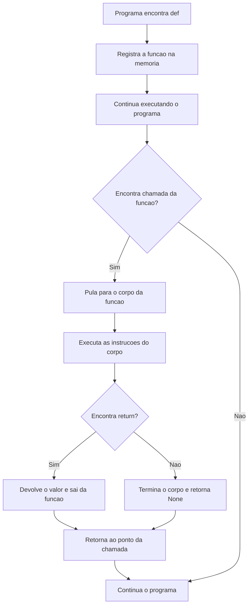
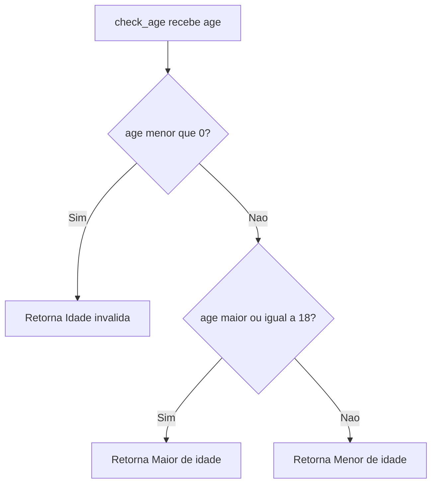
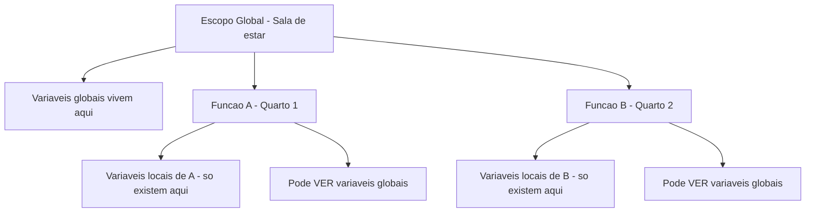
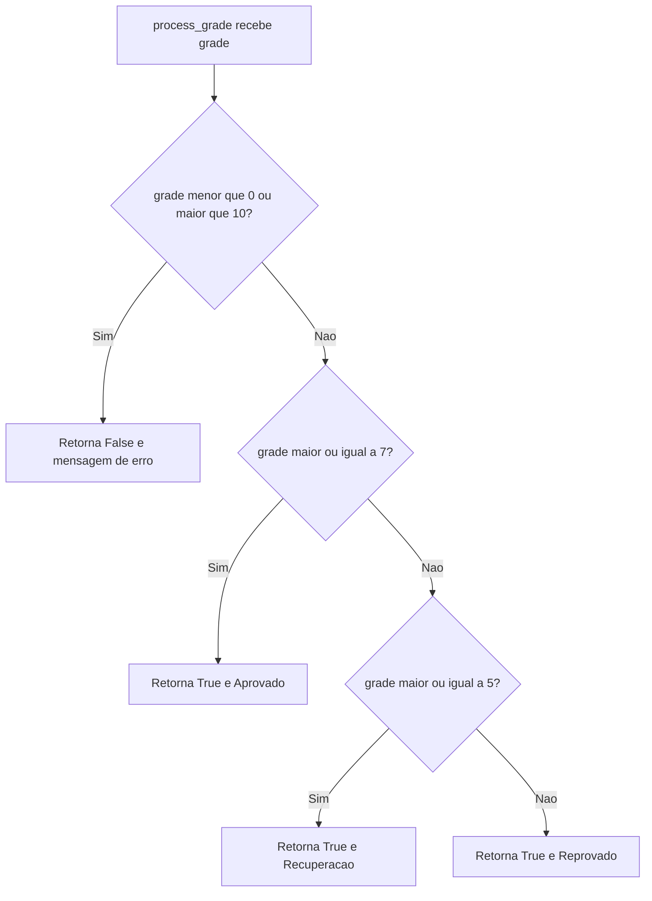
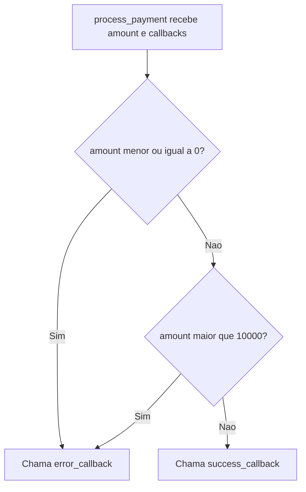
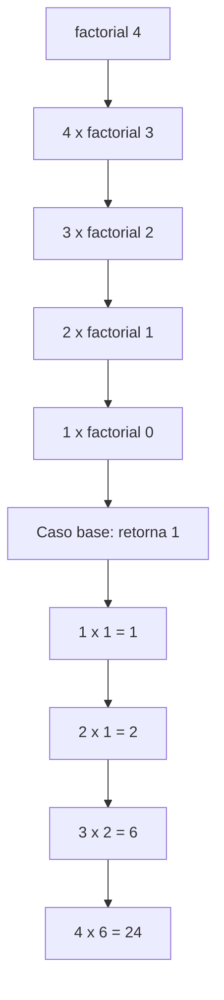

# 5.11 — Funções: Organizando e Reutilizando Código

[← Anterior: Loops: for e while](cap05-mod10-loops-conteudo.md) · [Próximo: Coleções: Listas, Tuplas e Dicionários →](cap05-mod12-colecoes-conteudo.md)

---

## Introdução

No módulo anterior, você aprendeu a repetir blocos de código com loops. Agora seus programas já tomam decisões e repetem ações. Mas conforme seus programas crescem, você vai perceber que repete trechos de código em vários lugares. Copiar e colar o mesmo código várias vezes é trabalhoso, propenso a erros e difícil de manter.

Funções resolvem esse problema. Uma **função** (do inglês *function*) é um bloco de código reutilizável que você escreve uma vez e pode usar quantas vezes quiser. Lembra da analogia que usamos no módulo 5.9? Uma função é como uma **receita de cozinha**: você escreve a receita uma vez e pode segui-la sempre que quiser preparar aquele prato, sem precisar reinventar os passos toda vez.

Esse princípio tem um nome em programação: **DRY** — *Don't Repeat Yourself* (Não Se Repita). Em vez de repetir código, crie uma função.

Funções são o último dos quatro pilares da lógica de programação (variáveis, condicionais, loops e funções). Com elas, seus programas ganham organização profissional — cada parte do código tem uma responsabilidade clara.

Neste módulo, vamos explorar funções em profundidade: desde a criação básica até conceitos mais avançados como escopo de variáveis, múltiplos retornos, funções como parâmetros, lambdas e recursão. Não se preocupe — vamos construir tudo passo a passo, do mais simples ao mais complexo.

---

## Como Executar os Exemplos Deste Módulo

1. Abra o VSCode: `code ~/projetos/python`
2. Crie arquivos para cada exemplo (ex: `funcoes_basico.py`)
3. Copie, salve e execute: `python3 nome_do_arquivo.py`

---

## Por que Funções Existem — O Problema da Repetição

Antes de funções existirem nas linguagens de programação, os programadores escreviam código de cima para baixo, sem nenhuma forma de reutilizar trechos. Nos anos 1950 e 1960, quando os primeiros computadores surgiram, os programas eram curtos — dezenas ou centenas de linhas. Mas conforme os problemas ficaram mais complexos, os programas cresceram para milhares de linhas, e a repetição de código se tornou um pesadelo.

John McCarthy, criador da linguagem LISP em 1958, foi um dos pioneiros a formalizar o conceito de função em programação, inspirado diretamente na matemática. A ideia era simples: assim como na matemática você define f(x) = x + 1 e pode usar f(5) para obter 6, em programação você define um bloco de código com nome e pode chamá-lo quando quiser.

Imagine que você está criando um programa que precisa saudar o usuário em três momentos diferentes:

```python
# Sem funcoes — codigo repetido em tres lugares
print("=============================")
print("  Bem-vindo ao Sistema!")
print("=============================")
# ... (mais codigo aqui) ...
print("=============================")
print("  Bem-vindo ao Sistema!")
print("=============================")
# ... (mais codigo aqui) ...
print("=============================")
print("  Bem-vindo ao Sistema!")
print("=============================")
```

São 9 linhas repetidas. Se você precisar mudar a mensagem, terá que mudar em três lugares. E se esquecer de um? Bug. Com funções:

```python
# Com funcao — codigo escrito uma vez, usado tres vezes
def show_welcome():
    # "show_welcome" = mostrar boas-vindas
    print("=============================")
    print("  Bem-vindo ao Sistema!")
    print("=============================")

# Agora basta chamar a funcao onde precisar
show_welcome()
# ... (mais codigo) ...
show_welcome()
# ... (mais codigo) ...
show_welcome()
```

**Saída esperada:**
```
=============================
  Bem-vindo ao Sistema!
=============================
=============================
  Bem-vindo ao Sistema!
=============================
=============================
  Bem-vindo ao Sistema!
=============================
```

Se precisar mudar a mensagem, muda em um lugar só. Menos código, menos erros, mais organização.

---

## Criando uma Função com def

Em Python, você cria uma função usando a palavra-chave `def` (abreviação de *define* — definir em inglês), seguida do nome da função e parênteses:

```python
# Definindo uma funcao simples
# def = define (criar/definir uma funcao)
# "greet" = saudar/cumprimentar
def greet():
    # Este bloco e o corpo da funcao — executa quando a funcao e chamada
    print("Ola! Bem-vindo ao sistema.")
    print("Tenha um otimo dia!")

# A funcao foi definida, mas ainda nao executou
# Para executar, precisamos CHAMAR a funcao pelo nome seguido de ()
greet()

# Podemos chamar quantas vezes quisermos
greet()
```

**Saída esperada:**
```
Ola! Bem-vindo ao sistema.
Tenha um otimo dia!
Ola! Bem-vindo ao sistema.
Tenha um otimo dia!
```

> **Nota importante:** Definir uma função (com `def`) não executa o código dentro dela. O código só executa quando você **chama** a função pelo nome seguido de parênteses: `greet()`. Essa separação entre "definir" e "executar" é fundamental — é como escrever uma receita no caderno (definir) versus ir para a cozinha e preparar o prato (executar).

### Anatomia de uma Função

```
def nome_da_funcao(parametros):    <-- definicao: nome + parametros
    instrucao_1                    <-- corpo: codigo indentado
    instrucao_2                    <-- executa quando a funcao e chamada
    return resultado               <-- (opcional) retorna um valor

nome_da_funcao(argumentos)         <-- chamada: executa a funcao
```

O fluxo de execução quando o Python encontra uma função:



### Regras para Nomes de Funções

As mesmas regras de nomes de variáveis (módulo 5.5) se aplicam:

| Regra | Exemplo bom | Exemplo ruim |
|-------|-------------|--------------|
| Letras minúsculas e underscores | `calculate_total` | `CalculateTotal` |
| Nomes descritivos | `validate_age` | `va` |
| Comece com verbo | `get_name`, `show_menu` | `name`, `menu` |
| Sem palavras reservadas | `my_print` | `print` |
| Sem espaços ou caracteres especiais | `check_email` | `check email` |

Uma boa prática é que o nome da função descreva **o que ela faz**, não como ela faz. `calculate_total` é melhor que `loop_and_add_numbers`.

---

## Parâmetros e Argumentos

Parâmetros são variáveis que a função recebe quando é chamada. Eles permitem que a função trabalhe com dados diferentes a cada chamada.

Pense assim: a função é uma máquina de suco. Os **parâmetros** são os espaços onde você coloca as frutas. Os **argumentos** são as frutas que você realmente coloca. A máquina (função) é a mesma, mas o resultado muda dependendo do que você coloca nela.

```python
# Funcao com parametro
# "greet_person" = saudar pessoa
def greet_person(name):
    # "name" = nome — recebe o valor passado na chamada
    print(f"Ola, {name}! Seja bem-vindo(a)!")

# Chamando a funcao com diferentes argumentos
greet_person("Maria")
greet_person("Carlos")
greet_person("Ana")
```

**Saída esperada:**
```
Ola, Maria! Seja bem-vindo(a)!
Ola, Carlos! Seja bem-vindo(a)!
Ola, Ana! Seja bem-vindo(a)!
```

### Múltiplos Parâmetros

```python
# Funcao com dois parametros
# "product_name" = nome do produto, "price" = preco
def display_product(product_name, price):
    print(f"Produto: {product_name} — Preco: R$ {price:.2f}")

display_product("Arroz", 5.99)
display_product("Feijao", 8.50)
display_product("Macarrao", 3.29)
```

**Saída esperada:**
```
Produto: Arroz — Preco: R$ 5.99
Produto: Feijao — Preco: R$ 8.50
Produto: Macarrao — Preco: R$ 3.29
```

### Argumentos Nomeados

Além de passar argumentos pela posição, você pode usar o nome do parâmetro na chamada. Isso torna o código mais legível e permite passar os argumentos em qualquer ordem:

```python
# "create_user" = criar usuario
def create_user(name, age, city):
    # "name" = nome, "age" = idade, "city" = cidade
    print(f"{name}, {age} anos, mora em {city}")

# Argumentos posicionais — a ordem importa
create_user("Ana", 25, "Sao Paulo")

# Argumentos nomeados — a ordem nao importa
create_user(city="Rio de Janeiro", name="Carlos", age=30)

# Misturando: posicionais primeiro, nomeados depois
create_user("Maria", age=28, city="Curitiba")
```

**Saída esperada:**
```
Ana, 25 anos, mora em Sao Paulo
Carlos, 30 anos, mora em Rio de Janeiro
Maria, 28 anos, mora em Curitiba
```

### Diferença entre Parâmetro e Argumento

| Conceito | Onde aparece | O que é | Exemplo |
|----------|-------------|---------|---------|
| Parâmetro | Na definição da função | A variável que recebe o valor | `def somar(a, b):` — `a` e `b` são parâmetros |
| Argumento | Na chamada da função | O valor real passado | `somar(5, 3)` — `5` e `3` são argumentos |

Na prática, muitas pessoas usam os termos como sinônimos. Mas é bom saber a diferença — em entrevistas de emprego, essa pergunta aparece com frequência.

---

## return — Retornando Valores

Até agora, nossas funções apenas exibiam coisas com `print()`. Mas funções também podem **calcular e devolver um resultado** usando `return` (retornar).

Pense na função como uma máquina de café: você coloca água e pó de café (argumentos), a máquina processa, e devolve o café pronto (return). Você pode tomar o café na hora ou guardar na garrafa térmica para depois — da mesma forma, pode usar o resultado do return imediatamente ou guardar em uma variável.

```python
# "calculate_double" = calcular o dobro
def calculate_double(number):
    # "number" = numero, "result" = resultado
    result = number * 2
    return result

# "my_double" = meu dobro
my_double = calculate_double(7)
print(f"O dobro de 7 e {my_double}")
print(f"O dobro de 15 e {calculate_double(15)}")
```

**Saída esperada:**
```
O dobro de 7 e 14
O dobro de 15 e 30
```

### Com return vs Sem return

| Tipo | Descrição | Exemplo | Quando usar |
|------|-----------|---------|-------------|
| Com return | Calcula e devolve um valor | `def soma(a, b): return a + b` | Quando precisa do resultado depois |
| Sem return | Apenas executa ações | `def saudar(): print("Ola")` | Quando só precisa fazer algo (exibir, salvar) |

Funções sem `return` retornam `None` automaticamente. `None` é o valor que significa "nada" em Python.

```python
# "add" = somar/adicionar
def add(number_a, number_b):
    # "total" = total (soma)
    total = number_a + number_b
    return total

# "result" = resultado
result = add(10, 5)
print(f"10 + 5 = {result}")

# "final_price" = preco final
final_price = add(100, 50) * 0.9  # soma e aplica 10% de desconto
print(f"Preco com desconto: R$ {final_price}")
```

**Saída esperada:**
```
10 + 5 = 15
Preco com desconto: R$ 135.0
```

### return Encerra a Função

Quando o Python encontra `return`, ele sai da função imediatamente. Qualquer código depois do `return` não executa:

```python
# "check_age" = verificar idade
def check_age(age):
    # "age" = idade
    if age < 0:
        return "Idade invalida"
    if age >= 18:
        return "Maior de idade"
    return "Menor de idade"

print(check_age(25))
print(check_age(15))
print(check_age(-5))
```

**Saída esperada:**
```
Maior de idade
Menor de idade
Idade invalida
```



---

## Valores Padrão de Parâmetros

Você pode definir valores padrão para parâmetros. Se o argumento não for passado na chamada, o valor padrão é usado:

```python
# "calculate_discount" = calcular desconto
def calculate_discount(price, discount_percent=10):
    # "price" = preco, "discount_percent" = porcentagem de desconto
    discount_value = price * (discount_percent / 100)
    final_price = price - discount_value
    return final_price

# Chamando sem o segundo argumento — usa o padrao (10%)
print(f"Com 10% (padrao): R$ {calculate_discount(100)}")
# Chamando com o segundo argumento — usa o valor passado
print(f"Com 20%: R$ {calculate_discount(100, 20)}")
print(f"Com 50%: R$ {calculate_discount(100, 50)}")
```

**Saída esperada:**
```
Com 10% (padrao): R$ 90.0
Com 20%: R$ 80.0
Com 50%: R$ 50.0
```

> **Regra importante:** Parâmetros com valor padrão devem vir **depois** dos parâmetros sem valor padrão. `def funcao(a, b=10):` está correto. `def funcao(a=10, b):` gera erro. Pense assim: os obrigatórios vêm primeiro, os opcionais depois.

---

## Escopo de Variáveis — Local vs Global

O **escopo** (do inglês *scope*) define onde uma variável existe e pode ser acessada no seu programa. Esse é um dos conceitos mais importantes para entender funções — e também uma das maiores fontes de confusão para iniciantes. Vamos com calma.

Em Python, existem dois escopos principais:

- **Escopo local**: variáveis criadas dentro de uma função. Só existem dentro daquela função.
- **Escopo global**: variáveis criadas fora de funções. Podem ser lidas em qualquer lugar do programa.

### A Analogia dos Cômodos

Pense no seu programa como uma casa. O **escopo global** é a sala de estar — tudo que está na sala pode ser visto de qualquer cômodo. Cada **função** é um quarto com porta fechada — os objetos dentro do quarto (variáveis locais) só existem ali dentro. Quando você sai do quarto (a função termina), os objetos desaparecem.



### Variáveis Locais e Globais na Prática

```python
# Variavel global — criada fora de qualquer funcao
# "global_message" = mensagem global
global_message = "Eu sou global!"

def my_function():
    # Variavel local — criada dentro da funcao
    # "local_message" = mensagem local
    local_message = "Eu sou local!"
    # Dentro da funcao, podemos acessar AMBAS
    print(f"Dentro da funcao: {global_message}")
    print(f"Dentro da funcao: {local_message}")

my_function()
# Fora da funcao, so podemos acessar a global
print(f"Fora da funcao: {global_message}")
# print(local_message)  # NameError: name 'local_message' is not defined
```

**Saída esperada:**
```
Dentro da funcao: Eu sou global!
Dentro da funcao: Eu sou local!
Fora da funcao: Eu sou global!
```

> **Dica profissional:** Evite depender de variáveis globais dentro de funções. Passe valores como parâmetros e retorne resultados. Isso torna a função **independente** — mais fácil de testar, reutilizar e entender.

---

## Múltiplos Retornos com Tuplas

Até agora, nossas funções retornaram um único valor. Mas e quando você precisa retornar **mais de um valor**? Em Python, basta separar os valores por vírgula no `return`. O Python empacota esses valores em uma **tupla** (do inglês *tuple*). Vamos ver tuplas em detalhes no próximo módulo, mas por enquanto basta saber que é uma forma de agrupar vários valores juntos.

```python
# "divide_with_remainder" = dividir com resto
def divide_with_remainder(dividend, divisor):
    # "dividend" = dividendo, "divisor" = divisor
    quotient = dividend // divisor   # divisao inteira
    remainder = dividend % divisor   # resto da divisao
    return quotient, remainder       # retorna dois valores

# Desempacotando os dois valores retornados
q, r = divide_with_remainder(17, 5)
print(f"17 dividido por 5: quociente = {q}, resto = {r}")

# Tambem podemos guardar como tupla
result = divide_with_remainder(23, 4)
print(f"Resultado como tupla: {result}")
print(f"Quociente: {result[0]}, Resto: {result[1]}")
```

**Saída esperada:**
```
17 dividido por 5: quociente = 3, resto = 2
Resultado como tupla: (5, 3)
Quociente: 5, Resto: 3
```

Esse padrão é muito usado quando uma função precisa informar tanto o resultado quanto se a operação deu certo:

```python
# "process_grade" = processar nota
def process_grade(grade):
    # "grade" = nota
    if grade < 0 or grade > 10:
        return False, "Nota deve ser entre 0 e 10"
    if grade >= 7:
        return True, "Aprovado"
    elif grade >= 5:
        return True, "Recuperacao"
    return True, "Reprovado"

# "success" = sucesso, "message" = mensagem
success, message = process_grade(8.5)
print(f"Sucesso: {success}, Resultado: {message}")

success, message = process_grade(-1)
print(f"Sucesso: {success}, Resultado: {message}")
```

**Saída esperada:**
```
Sucesso: True, Resultado: Aprovado
Sucesso: False, Resultado: Nota deve ser entre 0 e 10
```



---

## Funções Chamando Outras Funções

Funções podem chamar outras funções. Isso permite dividir problemas grandes em partes menores — cada função resolve um pedaço do problema, e uma função "coordenadora" junta tudo.

```python
# "is_positive" = e positivo
def is_positive(number):
    return number > 0

# "is_in_range" = esta no intervalo
def is_in_range(number, minimum, maximum):
    # "minimum" = minimo, "maximum" = maximo
    return number >= minimum and number <= maximum

# "validate_age" = validar idade
def validate_age(age):
    # "age" = idade
    if not is_positive(age):
        return "Idade deve ser positiva"
    if not is_in_range(age, 0, 150):
        return "Idade deve ser entre 0 e 150"
    return "Idade valida"

print(validate_age(25))
print(validate_age(-5))
print(validate_age(200))
```

**Saída esperada:**
```
Idade valida
Idade deve ser positiva
Idade deve ser entre 0 e 150
```

Cada função tem uma responsabilidade clara e simples. Juntas, resolvem um problema mais complexo.

---

## Docstrings — Documentando suas Funções

Quando você escreve uma função, é importante documentar **o que ela faz**, **o que recebe** e **o que retorna**. Em Python, fazemos isso com **docstrings** (do inglês *documentation strings*). Uma docstring é um texto entre aspas triplas logo na primeira linha do corpo da função:

```python
# "calculate_bmi" = calcular IMC (Indice de Massa Corporal)
def calculate_bmi(weight, height):
    """Calcula o IMC (Indice de Massa Corporal).

    Parametros:
        weight (float): Peso em quilogramas
        height (float): Altura em metros

    Retorna:
        float: O valor do IMC calculado
    """
    # "weight" = peso, "height" = altura
    bmi = weight / (height ** 2)
    return round(bmi, 1)

my_bmi = calculate_bmi(70, 1.75)
print(f"Seu IMC e: {my_bmi}")
```

**Saída esperada:**
```
Seu IMC e: 22.9
```

A docstring não é apenas um comentário — ela é acessível em tempo de execução pelo `help()` e por ferramentas de desenvolvimento. Quando você trabalha em equipe, docstrings são essenciais para que outros programadores entendam suas funções sem precisar ler o código inteiro.

> **Dica:** Para funções simples, uma docstring de uma linha basta: `"""Retorna o dobro do numero."""`. Para funções mais complexas, use o formato completo com parâmetros e retorno.

---

## Funções como Parâmetros — Higher-Order Functions

Aqui vem um conceito que pode parecer estranho no início, mas é extremamente poderoso: em Python, **funções são valores**. Isso significa que você pode guardar uma função em uma variável e — o mais importante — **passar uma função como argumento para outra função**.

Uma função que recebe outra função como parâmetro é chamada de **higher-order function** (função de ordem superior). Não se assuste com o nome — o conceito é mais simples do que parece.

### A Analogia do Delivery

Imagine que você pede comida por um aplicativo de delivery. O aplicativo (higher-order function) recebe seu pedido e **delega** o preparo para o restaurante (a função passada como parâmetro). O aplicativo não sabe cozinhar — ele apenas coordena. Dependendo do restaurante que você escolhe, o resultado é diferente, mas o processo do aplicativo é o mesmo.

```python
# "double" = dobro
def double(number):
    """Retorna o dobro do numero."""
    return number * 2

# "square" = quadrado
def square(number):
    """Retorna o quadrado do numero."""
    return number ** 2

# Higher-order function: recebe uma funcao como parametro
# "apply_to_list" = aplicar a lista
def apply_to_list(numbers, operation):
    """Aplica uma operacao a cada numero da lista."""
    # "numbers" = numeros, "operation" = operacao (uma funcao!)
    results = []
    for n in numbers:
        results.append(operation(n))
    return results

my_numbers = [1, 2, 3, 4, 5]

# Passando a funcao "double" como argumento
doubled = apply_to_list(my_numbers, double)
print(f"Dobrados: {doubled}")

# Passando a funcao "square" como argumento
squared = apply_to_list(my_numbers, square)
print(f"Quadrados: {squared}")
```

**Saída esperada:**
```
Dobrados: [2, 4, 6, 8, 10]
Quadrados: [1, 4, 9, 16, 25]
```

> **Nota:** Quando passamos uma função como argumento, escrevemos apenas o nome dela **sem parênteses**: `apply_to_list(my_numbers, double)`. Se colocássemos parênteses (`double()`), estaríamos **chamando** a função em vez de passá-la.

### Callbacks — Funções de Retorno

Um uso muito comum de funções como parâmetros é o padrão **callback** (função de retorno de chamada). A ideia é: "quando terminar de fazer X, chame esta função para me avisar":

```python
# "on_success" = ao ter sucesso
def on_success(message):
    print(f"SUCESSO: {message}")

# "on_error" = ao ter erro
def on_error(message):
    print(f"ERRO: {message}")

# "process_payment" = processar pagamento
def process_payment(amount, success_callback, error_callback):
    # "amount" = valor
    if amount <= 0:
        error_callback("Valor deve ser positivo")
    elif amount > 10000:
        error_callback("Valor excede o limite")
    else:
        success_callback(f"Pagamento de R$ {amount:.2f} aprovado")

process_payment(150.00, on_success, on_error)
process_payment(-50, on_success, on_error)
process_payment(50000, on_success, on_error)
```

**Saída esperada:**
```
SUCESSO: Pagamento de R$ 150.00 aprovado
ERRO: Valor deve ser positivo
ERRO: Valor excede o limite
```



Não se preocupe se esse conceito parecer avançado agora. Você vai encontrá-lo novamente nos capítulos sobre orientação a objetos (capítulo 9) e APIs (capítulo 11).

---

## Funções Lambda — Funções Anônimas

Às vezes você precisa de uma função tão simples que não vale a pena dar um nome para ela. Para esses casos, Python oferece as **funções lambda** — funções pequenas e anônimas (sem nome) que cabem em uma única linha.

A sintaxe é: `lambda parametros: expressao`

```python
# Funcao normal
def double(x):
    return x * 2

# Mesma funcao como lambda
double_lambda = lambda x: x * 2

# Ambas fazem a mesma coisa
print(f"Funcao normal: {double(5)}")
print(f"Lambda: {double_lambda(5)}")
```

**Saída esperada:**
```
Funcao normal: 10
Lambda: 10
```

### Quando Usar Lambda

Lambdas são mais úteis quando passadas diretamente como argumento para outra função. Um exemplo prático — ordenar uma lista de produtos pelo preço:

```python
# "products" = produtos — lista de tuplas (nome, preco)
products = [
    ("Arroz", 5.99),
    ("Feijao", 8.50),
    ("Macarrao", 3.29),
    ("Leite", 4.79),
    ("Cafe", 12.90)
]

# Ordenar por preco usando lambda
# lambda p: p[1] — para cada produto p, usa o indice 1 (preco) como criterio
sorted_products = sorted(products, key=lambda p: p[1])

print("Produtos por preco (menor para maior):")
for name, price in sorted_products:
    # "name" = nome, "price" = preco
    print(f"  {name}: R$ {price:.2f}")
```

**Saída esperada:**
```
Produtos por preco (menor para maior):
  Macarrao: R$ 3.29
  Leite: R$ 4.79
  Arroz: R$ 5.99
  Feijao: R$ 8.50
  Cafe: R$ 12.90
```

### Lambda vs def — Quando Usar Cada Uma

| Situação | Use `def` | Use `lambda` |
|----------|-----------|-------------|
| Função com nome descritivo | Sim | Não |
| Função com múltiplas linhas | Sim | Não (lambda só aceita 1 expressão) |
| Função reutilizada em vários lugares | Sim | Não |
| Função simples passada como argumento | Pode | Sim — mais conciso |
| Função com docstring | Sim | Não (lambda não suporta docstring) |

> **Dica:** Na dúvida, use `def`. Lambdas são um atalho conveniente, mas funções nomeadas com `def` são sempre mais legíveis.

---

## Recursão — Funções que Chamam a Si Mesmas

Recursão é quando uma função chama a si mesma para resolver um problema. Parece estranho? Pense assim: imagine que você está em uma fila e quer saber quantas pessoas estão na sua frente. Você pergunta para a pessoa à sua frente: "quantas pessoas estão na sua frente?". Ela faz a mesma pergunta para a pessoa à frente dela. E assim por diante, até chegar na primeira pessoa da fila, que responde "zero". Então cada pessoa soma 1 e passa a resposta de volta.

Esse é exatamente o mecanismo da recursão:

1. A função recebe um problema
2. Se o problema é simples o suficiente (caso base), resolve diretamente
3. Se não, divide o problema em uma versão menor e chama a si mesma

### Exemplo Clássico: Fatorial

O fatorial de um número n (escrito como n!) é a multiplicação de todos os números de 1 até n. Por exemplo: 5! = 5 x 4 x 3 x 2 x 1 = 120.

```python
# "factorial" = fatorial
def factorial(n):
    """Calcula o fatorial de n usando recursao."""
    # Caso base: fatorial de 0 e 1
    if n == 0:
        return 1
    # Caso recursivo: n * fatorial de (n-1)
    return n * factorial(n - 1)

print(f"0! = {factorial(0)}")
print(f"3! = {factorial(3)}")
print(f"5! = {factorial(5)}")
print(f"10! = {factorial(10)}")
```

**Saída esperada:**
```
0! = 1
3! = 6
5! = 120
10! = 3628800
```

Veja como a recursão funciona para `factorial(4)`:



Cada chamada recursiva "empilha" uma operação pendente. Quando o caso base é atingido, as operações são resolvidas de volta, uma por uma. Vamos aprofundar esse conceito de pilha no capítulo 7.

### Recursão vs Loop — Quando Usar Cada Um

| Critério | Recursão | Loop |
|----------|----------|------|
| Legibilidade | Mais elegante para problemas naturalmente recursivos | Mais direto para iterações simples |
| Performance | Pode ser mais lenta (overhead de chamadas) | Geralmente mais rápida |
| Memória | Usa mais memória (pilha de chamadas) | Usa menos memória |
| Quando usar | Árvores, divisão e conquista, problemas matemáticos | Percorrer listas, contadores, repetições simples |

> **Para iniciantes:** Na maioria dos casos do dia a dia, loops são mais simples e eficientes. Recursão brilha em problemas específicos que veremos no capítulo 7 (estruturas de dados como árvores). Por enquanto, entenda o conceito — você vai precisar dele mais para frente.

---

## map e filter — Funções Embutidas de Ordem Superior

O Python já vem com duas higher-order functions muito úteis: `map()` e `filter()`. Elas aplicam uma função a cada elemento de uma coleção, sem precisar escrever um loop manualmente.

### map — Aplicar uma Função a Cada Elemento

```python
# "prices_in_reais" = precos em reais
prices_in_reais = [10.0, 25.0, 50.0, 100.0]

# "to_dollars" = para dolares
def to_dollars(price_brl):
    # "price_brl" = preco em reais, "exchange_rate" = taxa de cambio
    exchange_rate = 5.0
    return round(price_brl / exchange_rate, 2)

# Usando map para converter todos os precos
prices_in_dollars = list(map(to_dollars, prices_in_reais))
print(f"Em reais: {prices_in_reais}")
print(f"Em dolares: {prices_in_dollars}")
```

**Saída esperada:**
```
Em reais: [10.0, 25.0, 50.0, 100.0]
Em dolares: [2.0, 5.0, 10.0, 20.0]
```

### filter — Filtrar Elementos com uma Condição

```python
# "ages" = idades
ages = [12, 17, 18, 21, 15, 30, 16, 25]

# "is_adult" = e adulto
def is_adult(age):
    # "age" = idade
    return age >= 18

# Usando filter para manter apenas maiores de idade
adults = list(filter(is_adult, ages))
print(f"Todas as idades: {ages}")
print(f"Maiores de idade: {adults}")
```

**Saída esperada:**
```
Todas as idades: [12, 17, 18, 21, 15, 30, 16, 25]
Maiores de idade: [18, 21, 30, 25]
```

> **Nota:** `map` e `filter` são muito usados em programação funcional e em processamento de dados. Você vai encontrá-los novamente quando trabalhar com APIs (capítulo 11).

---

## Funções Embutidas do Python

Você já usa funções o tempo todo sem perceber! `print()`, `input()`, `int()`, `float()`, `len()`, `range()`, `type()` — todas são funções embutidas (*built-in*) do Python. Agora você sabe criar as suas próprias.

| Função | O que faz | Exemplo | Resultado |
|--------|----------|---------|-----------|
| `print()` | Exibe texto na tela | `print("Ola")` | Ola |
| `input()` | Lê texto do teclado | `nome = input("Nome: ")` | (espera digitação) |
| `int()` | Converte para inteiro | `int("42")` | 42 |
| `float()` | Converte para decimal | `float("3.14")` | 3.14 |
| `str()` | Converte para texto | `str(42)` | "42" |
| `len()` | Retorna o tamanho | `len("Python")` | 6 |
| `range()` | Gera sequência de números | `range(1, 6)` | 1, 2, 3, 4, 5 |
| `type()` | Retorna o tipo | `type(42)` | int |
| `abs()` | Valor absoluto | `abs(-5)` | 5 |
| `round()` | Arredonda | `round(3.7)` | 4 |
| `max()` | Maior valor | `max(3, 7, 1)` | 7 |
| `min()` | Menor valor | `min(3, 7, 1)` | 1 |
| `sum()` | Soma de uma coleção | `sum([1, 2, 3])` | 6 |
| `sorted()` | Ordena uma coleção | `sorted([3, 1, 2])` | [1, 2, 3] |
| `enumerate()` | Numera itens de uma coleção | `enumerate(["a", "b"])` | (0, "a"), (1, "b") |

Todas essas funções seguem o mesmo padrão que você aprendeu: recebem argumentos, processam e retornam um resultado.

---

## Boas Práticas com Funções

Agora que você conhece os fundamentos, vamos falar sobre como escrever funções **bem**. Código que funciona é o mínimo — código que é fácil de ler, manter e reutilizar é o que diferencia um programador iniciante de um profissional.

### 1. Uma Função, Uma Responsabilidade

Cada função deve fazer **uma coisa só** e fazer bem. Se sua função faz muitas coisas, divida em funções menores. Esse princípio tem um nome formal: **SRP** — *Single Responsibility Principle* (Princípio da Responsabilidade Única). Vamos aprofundar esse conceito no capítulo 9.

### 2. Nomes Descritivos

O nome da função deve dizer **o que ela faz**:

| Nome ruim | Nome bom | Por quê |
|-----------|----------|---------|
| `calc` | `calculate_total` | Diz o que calcula |
| `f1` | `validate_email` | Diz o que valida |
| `do_stuff` | `send_notification` | Diz o que faz |
| `data` | `format_date` | Diz o que formata |

### 3. Funções Pequenas

Se uma função tem mais de 20-30 linhas, provavelmente está fazendo coisas demais. Considere dividir em funções menores.

### 4. Evite Variáveis Globais

Passe dados como parâmetros e retorne resultados. Funções que dependem de variáveis globais são difíceis de testar e podem causar bugs inesperados.

### 5. Documente suas Funções

Use docstrings para explicar o que a função faz, o que recebe e o que retorna.

### 6. Retorne Cedo

Quando uma condição de erro é detectada, retorne imediatamente em vez de aninhar vários `if/else`:

```python
# BOM — retorno antecipado, codigo mais limpo
def validate_user(name, age, email):
    """Valida dados do usuario."""
    # "name" = nome, "age" = idade, "email" = email
    if name == "":
        return False, "Nome vazio"
    if age <= 0:
        return False, "Idade invalida"
    if "@" not in email:
        return False, "Email invalido"
    return True, "Dados validos"

valid, msg = validate_user("Ana", 25, "ana@email.com")
print(f"Resultado: {valid}, {msg}")

valid, msg = validate_user("", 25, "ana@email.com")
print(f"Resultado: {valid}, {msg}")
```

**Saída esperada:**
```
Resultado: True, Dados validos
Resultado: False, Nome vazio
```

---

## Exemplo Completo: Sistema de Notas

Vamos combinar tudo que aprendemos em um programa mais completo:

```python
# Sistema de notas — usa funcoes para organizar o codigo

def calculate_average(grade_1, grade_2, grade_3):
    """Calcula a media de tres notas."""
    # "grade" = nota, "average" = media
    return (grade_1 + grade_2 + grade_3) / 3

def get_status(average):
    """Retorna a situacao com base na media."""
    # "average" = media
    if average >= 7.0:
        return "Aprovado"
    elif average >= 5.0:
        return "Recuperacao"
    return "Reprovado"

def show_result(name, average, status):
    """Exibe o resultado formatado do aluno."""
    # "name" = nome, "status" = situacao
    print(f"Aluno: {name}")
    print(f"Media: {average:.1f}")
    print(f"Situacao: {status}")
    print("-" * 30)

def get_grade(label):
    """Solicita uma nota ao usuario com validacao."""
    # "label" = rotulo (ex: "Nota 1")
    while True:
        try:
            value = float(input(f"{label}: "))
            if 0 <= value <= 10:
                return value
            print("Nota deve ser entre 0 e 10!")
        except ValueError:
            print("Digite um numero valido!")

# --- Programa principal ---
print("=== Sistema de Notas ===")
student_name = input("Nome do aluno: ")

grade_1 = get_grade("Nota 1")
grade_2 = get_grade("Nota 2")
grade_3 = get_grade("Nota 3")

average = calculate_average(grade_1, grade_2, grade_3)
status = get_status(average)

print()
show_result(student_name, average, status)
```

Observe como o programa principal fica limpo e legível — é quase como ler em português: "obtenha as notas, calcule a média, determine a situação, mostre o resultado". Cada função pode ser testada e modificada independentemente.

---

## Como a IA pode te ajudar aqui

Funções são um tema rico para explorar com IA. Você pode pedir ajuda para entender conceitos, refatorar código ou criar funções para problemas específicos.

**Prompt 1 — Explorar o conceito:**
> "Me explique a diferença entre parâmetro e argumento em Python com exemplos simples. Depois me mostre um exemplo de função com valor padrão."

**Prompt 2 — Refatorar código existente:**
> "Refatore este código Python para usar funções. Cada função deve ter uma responsabilidade única: [cole seu código aqui]"

**Prompt 3 — Entender escopo:**
> "Me explique escopo de variáveis em Python com um exemplo que mostra uma variável local e uma global. Mostre o que acontece quando tento acessar uma variável local fora da função."

**Prompt 4 — Praticar recursão:**
> "Me dê 3 exemplos simples de funções recursivas em Python, explicando o caso base e o caso recursivo de cada uma. Comece pelo mais fácil."

Lembre-se: a IA é uma parceira de aprendizado, não um substituto para a prática. Use-a para tirar dúvidas e explorar variações, mas sempre tente resolver os exercícios sozinho primeiro.

---

## Casos de Uso no Mundo Real

### Caso 1: Transferência Bancária

Quando um banco processa uma transferência, ele chama uma sequência de funções: `verificar_saldo()`, `debitar_conta_origem()`, `creditar_conta_destino()`, `registrar_transacao()`. Cada função tem uma responsabilidade clara e retorna um resultado que a próxima função usa. Se `verificar_saldo()` retorna que o saldo é insuficiente, as próximas funções nem são chamadas — o return antecipado evita que a operação continue.

Bancos como o Nubank processam milhões de transações por dia. Sem funções bem organizadas, seria impossível manter, testar e evoluir esse código. Cada função é testada individualmente (testes unitários — vamos ver isso no capítulo 12) para garantir que funciona corretamente.

### Caso 2: Validação de Formulários Web

Quando você preenche um cadastro online — no Mercado Livre, na Amazon, no iFood — o sistema usa funções como `validar_email()`, `validar_cpf()`, `validar_senha()`, `validar_telefone()`. Cada uma verifica uma regra específica e retorna True ou False. O formulário só é aceito se todas retornarem True.

Essas funções de validação são reutilizadas em dezenas de telas diferentes: cadastro, edição de perfil, recuperação de senha, checkout. Sem funções, o código de validação seria copiado e colado em cada tela — e qualquer mudança na regra precisaria ser feita em todos os lugares.

### Caso 3: Jogos e Simulações

Em um jogo como Minecraft ou Fortnite, existem centenas de funções: `mover_personagem()`, `verificar_colisao()`, `calcular_dano()`, `atualizar_inventario()`, `renderizar_frame()`. O loop principal do jogo chama essas funções a cada frame (quadro) — 60 vezes por segundo. Sem funções, o código de um jogo seria impossível de manter.

Funções como parâmetros (callbacks) são usadas extensivamente em jogos: quando o jogador pressiona um botão, o sistema chama a função associada àquele botão. Esse padrão de "quando X acontecer, execute Y" é a base de toda programação orientada a eventos.

---

## Resumo do Módulo

| Conceito | Descrição |
|----------|-----------|
| `def nome():` | Define uma função |
| Parâmetro | Variável na definição da função |
| Argumento | Valor passado na chamada da função |
| Argumento nomeado | Argumento passado com o nome do parâmetro: `funcao(nome="Ana")` |
| `return` | Devolve um resultado e encerra a função |
| Valor padrão | Parâmetro com valor pré-definido: `def f(x=10)` |
| Escopo local | Variável dentro da função — só existe ali |
| Escopo global | Variável fora de funções — acessível em todo o programa |
| Múltiplos retornos | Retornar vários valores separados por vírgula (tupla) |
| Docstring | Texto de documentação entre aspas triplas no início da função |
| Higher-order function | Função que recebe outra função como parâmetro |
| Callback | Função passada como argumento para ser chamada depois |
| Lambda | Função anônima de uma linha: `lambda x: x * 2` |
| Recursão | Função que chama a si mesma com um caso base |
| `map()` | Aplica uma função a cada elemento de uma coleção |
| `filter()` | Filtra elementos de uma coleção com base em uma condição |
| DRY | *Don't Repeat Yourself* — não repita código |
| SRP | *Single Responsibility Principle* — cada função faz uma coisa |

---

## Glossário do Módulo

| Termo | Definição |
|-------|-----------|
| Argumento (*argument*) | Valor real passado para uma função na chamada |
| Argumento nomeado (*keyword argument*) | Argumento passado usando o nome do parâmetro |
| Built-in | Função embutida que já vem com o Python |
| Callback | Função passada como argumento para ser chamada quando um evento ocorre |
| Caso base (*base case*) | Condição que faz uma função recursiva parar de chamar a si mesma |
| Chamada de função (*function call*) | Executar uma função pelo nome seguido de parênteses |
| def | Palavra-chave para definir uma função em Python |
| Docstring (*documentation string*) | Texto de documentação entre aspas triplas no início de uma função |
| DRY | *Don't Repeat Yourself* — princípio de não repetir código |
| Escopo (*scope*) | Região do código onde uma variável existe e pode ser acessada |
| Escopo global (*global scope*) | Variáveis criadas fora de funções, acessíveis em todo o programa |
| Escopo local (*local scope*) | Variáveis criadas dentro de uma função, só existem ali |
| Fatorial (*factorial*) | Produto de todos os inteiros de 1 até n, representado por n! |
| filter | Função embutida que filtra elementos de uma coleção |
| Função (*function*) | Bloco de código reutilizável com nome, parâmetros e corpo |
| Função anônima (*anonymous function*) | Função sem nome, criada com `lambda` em Python |
| Higher-order function | Função que recebe outra função como parâmetro ou retorna uma função |
| Lambda | Palavra-chave para criar funções anônimas de uma expressão |
| map | Função embutida que aplica uma função a cada elemento de uma coleção |
| None | Valor especial que significa "nada" — retorno padrão de funções sem return |
| Parâmetro (*parameter*) | Variável na definição da função que recebe valores |
| Recursão (*recursion*) | Técnica onde uma função chama a si mesma para resolver um problema |
| return | Comando que devolve um valor e encerra a função |
| SRP | *Single Responsibility Principle* — cada função deve ter uma única responsabilidade |
| Tupla (*tuple*) | Coleção ordenada e imutável de valores, usada para múltiplos retornos |
| Valor padrão (*default value*) | Valor pré-definido para um parâmetro quando nenhum argumento é passado |

---

## Na Cultura Popular

- **Inception** (filme, 2010) — o conceito de "sonho dentro de sonho" é análogo a funções chamando outras funções e à recursão. Cada nível tem seu próprio escopo (contexto), e quando termina, retorna ao nível anterior. O "kick" que acorda os personagens é como o `return` que encerra a função.
- **Matrix** (filme, 1999) — os programas dentro da Matrix são compostos de funções que controlam cada aspecto do mundo simulado. O "Arquiteto" é como a função principal que chama todas as outras. E os "agentes" são como callbacks — funções que são acionadas quando um evento específico acontece.
- **Silicon Valley** (série, 2014-2019) — ao longo da série, os personagens discutem constantemente sobre qualidade de código, refatoração e organização. O conceito de "código limpo" com funções bem definidas é um tema recorrente nas discussões técnicas da equipe.

---

## Para Saber Mais

- [Documentação Oficial Python — Funções](https://docs.python.org/pt-br/3/tutorial/controlflow.html#defining-functions) — *Referência oficial em português sobre definição de funções, parâmetros e retorno*
- [Python Tutor](https://pythontutor.com/) — *Visualize a execução de funções passo a passo, veja como o escopo funciona e como as chamadas se empilham — excelente para entender recursão*
- [Exercism — Python Track](https://exercism.org/tracks/python) — *Exercícios progressivos de Python com foco em funções, com mentoria gratuita*
- [Automate the Boring Stuff — Functions](https://automatetheboringstuff.com/2e/chapter3/) — *Capítulo sobre funções do livro gratuito, com exemplos práticos de automação*
- [Curso em Vídeo — Python](https://www.youtube.com/playlist?list=PLvE-ZAFRgX8hnECDn1v9HNTI71veL3oW0) — *Aulas sobre funções em português, com explicações detalhadas e exercícios*

---

## Perguntas Frequentes (FAQ)

**P: O que é uma função?**
R: É um bloco de código reutilizável que realiza uma tarefa específica. Você define uma vez com `def` e pode chamar quantas vezes quiser. Pense nela como uma receita de cozinha — escrita uma vez, usada sempre que precisar.

**P: Qual a diferença entre parâmetro e argumento?**
R: Parâmetro é a variável na definição: `def somar(a, b)`. Argumento é o valor na chamada: `somar(5, 3)`. Na prática, muitos usam como sinônimos, mas a diferença aparece em entrevistas de emprego.

**P: Preciso sempre usar return?**
R: Não. Use `return` quando a função precisa devolver um resultado para ser usado depois. Se a função apenas executa ações (como exibir mensagens ou salvar dados), não precisa de return.

**P: O que acontece se eu não usar return?**
R: A função retorna `None` automaticamente. `None` é o valor que significa "nada" em Python.

**P: Posso ter mais de um return na mesma função?**
R: Sim! Mas apenas o primeiro `return` executado encerra a função. É muito comum ter returns dentro de `if/else` para retornar valores diferentes dependendo da condição.

**P: Posso chamar uma função dentro de outra?**
R: Sim! Isso é muito comum e permite dividir problemas em partes menores. Cada função resolve um pedaço, e uma função coordenadora junta tudo.

**P: O que é DRY?**
R: *Don't Repeat Yourself* (Não Se Repita). Se você está copiando e colando código, provavelmente deveria criar uma função. Código repetido é difícil de manter — se precisar mudar algo, terá que mudar em todos os lugares.

**P: O que é escopo?**
R: É a região do código onde uma variável existe. Variáveis dentro de funções (escopo local) só existem ali — quando a função termina, elas desaparecem. Variáveis fora de funções (escopo global) existem durante todo o programa.

**P: A ordem das funções importa?**
R: Sim! Você precisa definir a função ANTES de chamá-la. Se tentar chamar uma função que ainda não foi definida, o Python gera um `NameError`. Por isso, coloque as definições de funções no início do arquivo.

**P: O que é uma função lambda?**
R: É uma função anônima (sem nome) de uma única expressão, criada com a palavra-chave `lambda`. Exemplo: `lambda x: x * 2`. São úteis quando você precisa de uma função simples para passar como argumento para outra função.

**P: O que é recursão? Preciso aprender isso agora?**
R: Recursão é quando uma função chama a si mesma. É um conceito importante que você vai usar mais no capítulo 7 (estruturas de dados). Por enquanto, entenda a ideia básica: toda recursão precisa de um caso base (condição de parada) e um caso recursivo (chamada a si mesma com um problema menor).

**P: Posso usar o mesmo nome para uma função e uma variável?**
R: Tecnicamente sim, mas é péssima ideia. O segundo uso sobrescreve o primeiro. Se você criar uma variável chamada `print`, por exemplo, não conseguirá mais usar a função `print()` do Python.

**P: É normal achar funções confusas no início?**
R: Completamente normal. A ideia de "definir agora, executar depois" e de "passar valores e receber resultados" leva tempo para se tornar natural. A melhor forma de aprender é praticando — faça os exercícios, crie suas próprias funções, e aos poucos o conceito vai ficando claro.

**P: Quando devo criar uma função?**
R: Crie uma função quando: (1) você está repetindo código, (2) um trecho de código faz algo específico que pode ser nomeado, (3) o programa está ficando grande e difícil de ler, ou (4) você quer testar uma parte do código isoladamente.

**P: O que é uma higher-order function?**
R: É uma função que recebe outra função como parâmetro ou retorna uma função. Exemplos do Python: `sorted()` com o parâmetro `key`, `map()`, `filter()`. Esse conceito é muito usado em programação funcional e em frameworks web.

---

## Exercícios Práticos

Os exercícios completos estão no arquivo separado:

**[Acessar Exercícios do Módulo 5.11](cap05-mod11-funcoes-exercicios.md)**

Prévia:

### Exercício rápido 1 — Função de saudação

Crie uma função `greet(name)` que recebe um nome e exibe "Ola, {nome}! Bem-vindo(a)!". Chame-a com 3 nomes diferentes.

### Exercício rápido 2 — Calculadora com funções

Crie 4 funções (`add`, `subtract`, `multiply`, `divide`) que recebem dois números e retornam o resultado. Crie um menu que pede a operação e os números.

### Exercício rápido 3 — Validador de dados

Crie funções `validate_name(name)`, `validate_age(age)` e `validate_email(email)` que retornam True ou False. Use-as em um programa de cadastro.

---

No próximo módulo, vamos aprender sobre **coleções** — listas, tuplas e dicionários. Com funções e coleções juntas, você vai conseguir construir programas que manipulam grandes quantidades de dados de forma organizada. Prepare-se — o próximo módulo vai expandir muito o que você consegue fazer com Python!

---

[← Anterior: Loops: for e while](cap05-mod10-loops-conteudo.md) · [Próximo: Coleções: Listas, Tuplas e Dicionários →](cap05-mod12-colecoes-conteudo.md)
