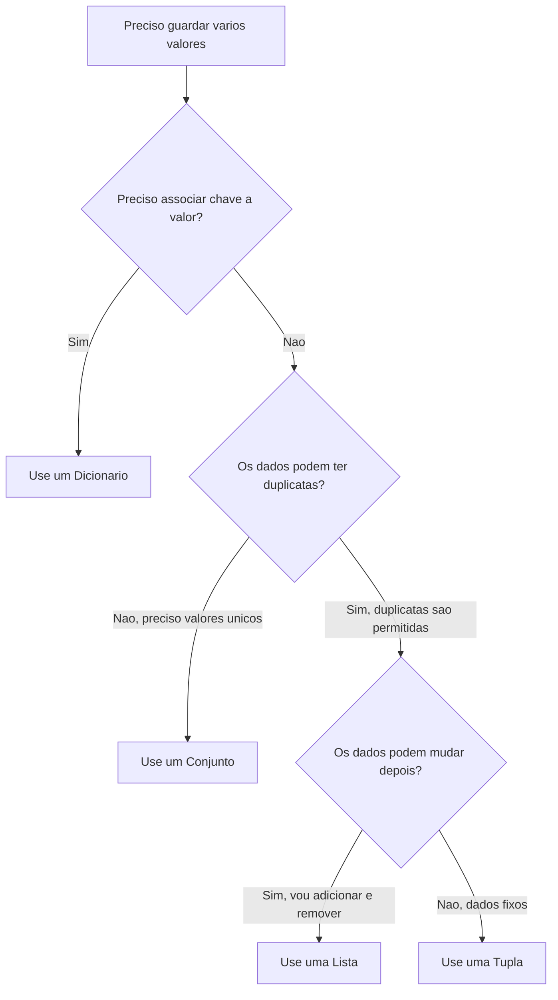

# 5.12 — Coleções: Listas, Tuplas, Dicionários e Conjuntos

[← Anterior: Funções: Organizando e Reutilizando Código](cap05-mod11-funcoes-conteudo.md) · [Próximo: Estrutura de um Programa Completo →](cap05-mod13-estrutura-programa-conteudo.md)

---

## Introdução

No módulo anterior, você aprendeu a organizar código com funções. Agora seus programas já tomam decisões, repetem ações e estão bem organizados. Mas até agora, cada variável guarda apenas um valor — um número, um texto, um verdadeiro ou falso.

E quando você precisa guardar **vários valores** ao mesmo tempo? Imagine que você está fazendo compras no mercado. Você não anota cada item em um papel separado — você faz uma **lista de compras** com todos os itens juntos. Em Python, temos estruturas que funcionam exatamente assim: elas guardam vários valores organizados em um único lugar.

Neste módulo, você vai aprender as quatro principais estruturas de dados do Python:

- **Listas** — como uma lista de compras: você pode adicionar, remover e reorganizar itens
- **Tuplas** — como uma data de nascimento: uma vez definida, não muda
- **Dicionários** — como uma agenda telefônica: cada nome (chave) tem um telefone (valor) associado
- **Conjuntos** — como uma coleção de figurinhas sem repetidas: cada item aparece uma única vez

Essas estruturas são fundamentais. Praticamente todo programa real usa pelo menos uma delas. A partir daqui, seus programas ganham a capacidade de trabalhar com conjuntos de dados.

---

## Como Executar os Exemplos Deste Módulo

1. Abra o VSCode: `code ~/projetos/python`
2. Crie arquivos para cada exemplo (ex: `listas_basico.py`)
3. Copie, salve e execute: `python3 nome_do_arquivo.py`

---

## Listas

### O que é uma Lista

Uma lista é uma coleção **ordenada** e **mutável** de elementos. "Ordenada" significa que os itens têm posição (primeiro, segundo, terceiro...). "Mutável" significa que você pode adicionar, remover e alterar itens depois de criar a lista.

Pense em uma **lista de compras**: você escreve os itens em ordem, pode riscar um item, adicionar outro no final, ou trocar um item por outro.

### Criando Listas

```python
# Criando uma lista vazia
# "shopping_list" = lista de compras
shopping_list = []

# Criando uma lista com itens
# "fruits" = frutas
fruits = ["maca", "banana", "laranja", "uva", "manga"]

# Listas podem ter diferentes tipos de dados
# "mixed" = misturado
mixed = ["Ana", 25, 1.70, True]

# Verificando o tipo
print(type(fruits))
print(f"Frutas: {fruits}")
print(f"Misturada: {mixed}")
```

**Saída esperada:**
```
<class 'list'>
Frutas: ['maca', 'banana', 'laranja', 'uva', 'manga']
Misturada: ['Ana', 25, 1.7, True]
```

### Indexação — Acessando Itens pela Posição

Cada item da lista tem uma posição chamada **índice** (do inglês "index"). O primeiro item tem índice **0** (zero), não 1. Isso é uma convenção da programação que você já viu no módulo 5.10 com `range()`.

Pense em um prédio: o térreo é o andar 0, o primeiro andar é o 1, e assim por diante.

```python
# "fruits" = frutas
fruits = ["maca", "banana", "laranja", "uva", "manga"]
# Indice:    0        1         2        3       4

# Acessando pelo indice
print(fruits[0])   # Primeiro item
print(fruits[1])   # Segundo item
print(fruits[4])   # Ultimo item
print(fruits[-1])  # Ultimo item (indice negativo conta de tras para frente)
print(fruits[-2])  # Penultimo item
```

**Saída esperada:**
```
maca
banana
manga
manga
uva
```

### Fatiamento (Slicing) — Pegando Pedaços da Lista

Fatiamento é como cortar um pedaço de um bolo: você escolhe onde começar e onde parar. A sintaxe é `lista[inicio:fim]` — o início é incluído, mas o fim **não** é incluído.

```python
# "fruits" = frutas
fruits = ["maca", "banana", "laranja", "uva", "manga"]

# Do indice 1 ate o 3 (o 3 nao entra)
print(fruits[1:3])

# Do inicio ate o indice 3
print(fruits[:3])

# Do indice 2 ate o final
print(fruits[2:])
```

**Saída esperada:**
```
['banana', 'laranja']
['maca', 'banana', 'laranja']
['laranja', 'uva', 'manga']
```

### Alterando Itens da Lista

Como listas são mutáveis, você pode trocar qualquer item:

```python
# "fruits" = frutas
fruits = ["maca", "banana", "laranja"]

# Trocando o item na posicao 1
fruits[1] = "abacaxi"
print(fruits)
```

**Saída esperada:**
```
['maca', 'abacaxi', 'laranja']
```

### Métodos de Lista

Métodos são funções que "pertencem" à lista. Você chama um método usando o ponto: `lista.método()`.

```python
# "shopping_list" = lista de compras
shopping_list = ["arroz", "feijao"]

# append() = acrescentar ao final
shopping_list.append("macarrao")
shopping_list.append("leite")
print(f"Apos append: {shopping_list}")

# insert(posicao, item) = inserir na posicao especificada
shopping_list.insert(1, "acucar")
print(f"Apos insert: {shopping_list}")

# remove() = remover a PRIMEIRA ocorrencia do valor
shopping_list.remove("feijao")
print(f"Apos remove: {shopping_list}")

# pop() sem argumento remove o ULTIMO item e retorna ele
# "last" = ultimo
last = shopping_list.pop()
print(f"Removido com pop: {last}")
print(f"Apos pop: {shopping_list}")

# len() = tamanho da lista
# "size" = tamanho
size = len(shopping_list)
print(f"Tamanho: {size}")
```

**Saída esperada:**
```
Apos append: ['arroz', 'feijao', 'macarrao', 'leite']
Apos insert: ['arroz', 'acucar', 'feijao', 'macarrao', 'leite']
Apos remove: ['arroz', 'acucar', 'macarrao', 'leite']
Removido com pop: leite
Apos pop: ['arroz', 'acucar', 'macarrao']
Tamanho: 3
```

### Tabela de Métodos de Lista

| Método | O que faz | Exemplo |
|--------|----------|---------|
| `append(item)` | Adiciona no final | `lista.append("novo")` |
| `insert(pos, item)` | Insere na posição | `lista.insert(0, "primeiro")` |
| `extend(outra)` | Junta duas listas | `lista.extend([4, 5])` |
| `remove(valor)` | Remove primeira ocorrência | `lista.remove("item")` |
| `pop(pos)` | Remove pela posição e retorna | `lista.pop(0)` |
| `sort()` | Ordena crescente | `lista.sort()` |
| `reverse()` | Inverte a ordem | `lista.reverse()` |
| `index(valor)` | Encontra a posição | `lista.index("item")` |
| `count(valor)` | Conta ocorrências | `lista.count(7)` |
| `len(lista)` | Retorna o tamanho | `len(lista)` |

### Ordenação e Busca

```python
# Ordenando uma lista de numeros
# "numbers" = numeros
numbers = [5, 2, 8, 1, 9, 3]

# sort() ordena a lista original (modifica a lista)
numbers.sort()
print(f"Crescente: {numbers}")

# sort(reverse=True) ordena em ordem decrescente
numbers.sort(reverse=True)
print(f"Decrescente: {numbers}")
```

**Saída esperada:**
```
Crescente: [1, 2, 3, 5, 8, 9]
Decrescente: [9, 8, 5, 3, 2, 1]
```

```python
# Verificando se um item existe na lista
# "fruits" = frutas
fruits = ["maca", "banana", "laranja"]

# "in" verifica se o item esta na lista
if "banana" in fruits:
    print("Banana esta na lista!")

if "abacaxi" not in fruits:
    print("Abacaxi NAO esta na lista!")
```

**Saída esperada:**
```
Banana esta na lista!
Abacaxi NAO esta na lista!
```

### Percorrendo Listas com for

Você já aprendeu isso no módulo 5.10, mas vale reforçar com os métodos novos:

```python
# Percorrendo com indice e valor usando enumerate()
# "students" = alunos
students = ["Ana", "Bruno", "Carlos", "Diana"]

for i, student in enumerate(students):
    # "i" = indice, "student" = aluno
    print(f"{i + 1}. {student}")
```

**Saída esperada:**
```
1. Ana
2. Bruno
3. Carlos
4. Diana
```

---

## Tuplas

### O que é uma Tupla

Uma tupla é uma coleção **ordenada** e **imutável** de elementos. "Imutável" significa que, depois de criada, você **não pode** adicionar, remover ou alterar itens.

Pense em uma **data de nascimento**: uma vez que você nasceu em 15/03/1990, essa data nunca vai mudar. Ela tem três partes (dia, mês, ano) em uma ordem fixa. Isso é uma tupla.

### Criando Tuplas

```python
# Criando uma tupla com parenteses
# "birth_date" = data de nascimento (dia, mes, ano)
birth_date = (15, 3, 1990)

# Tupla com um unico item — precisa da virgula!
# "single" = unico
single = (42,)

# Sem a virgula, Python entende como um numero entre parenteses
not_a_tuple = (42)

print(type(birth_date))  # <class 'tuple'>
print(type(single))      # <class 'tuple'>
print(type(not_a_tuple)) # <class 'int'>
```

**Saída esperada:**
```
<class 'tuple'>
<class 'tuple'>
<class 'int'>
```

### Acessando Itens e Imutabilidade

```python
# "birth_date" = data de nascimento
birth_date = (15, 3, 1990)

# Acessando pelo indice — funciona igual a listas
# "day" = dia, "month" = mes, "year" = ano
day = birth_date[0]
month = birth_date[1]
year = birth_date[2]
print(f"Nascimento: {day}/{month}/{year}")

# Tentar alterar gera erro!
# birth_date[0] = 20  # TypeError: 'tuple' object does not support item assignment
```

**Saída esperada:**
```
Nascimento: 15/3/1990
```

### Unpacking — Desempacotando Tuplas

**Unpacking** (desempacotar) é quando você extrai os valores da tupla para variáveis separadas:

```python
# Unpacking — a tupla vira variaveis separadas
# "coordinates" = coordenadas
coordinates = (10, 20)

# "x" e "y" recebem os valores da tupla
x, y = coordinates
print(f"x = {x}, y = {y}")

# Unpacking com mais valores
# "person" = pessoa
person = ("Ana", 25, "Sao Paulo")
name, age, city = person
print(f"{name} tem {age} anos e mora em {city}")
```

**Saída esperada:**
```
x = 10, y = 20
Ana tem 25 anos e mora em Sao Paulo
```

### Quando Usar Tuplas

- Dados que não devem mudar: coordenadas, datas, configurações fixas
- Retorno de funções com múltiplos valores
- Chaves de dicionário (listas não podem ser chaves, tuplas podem)

```python
# Funcao que retorna multiplos valores como tupla
# "calculate_rectangle" = calcular retangulo
def calculate_rectangle(width, height):
    # "width" = largura, "height" = altura
    area = width * height
    perimeter = 2 * (width + height)
    return area, perimeter  # Retorna uma tupla

# Desempacotamos os valores
area, perimeter = calculate_rectangle(5, 3)
print(f"Area: {area}, Perimetro: {perimeter}")
```

**Saída esperada:**
```
Area: 15, Perimetro: 16
```

---

## Dicionários

### O que é um Dicionário

Um dicionário é uma coleção de pares **chave: valor**. Cada chave é única e aponta para um valor. É como uma **agenda telefônica**: você procura pelo nome (chave) e encontra o telefone (valor).

Dicionários são **mutáveis** (você pode adicionar, remover e alterar itens) e mantêm a **ordem de inserção** (a partir do Python 3.7).

### Criando Dicionários

```python
# Criando um dicionario com dados
# "student" = estudante
student = {
    "name": "Carlos",
    "age": 20,
    "city": "Belo Horizonte"
}

print(student)
print(type(student))
```

**Saída esperada:**
```
{'name': 'Carlos', 'age': 20, 'city': 'Belo Horizonte'}
<class 'dict'>
```

### Acessando Valores por Chave

```python
# "student" = estudante
student = {
    "name": "Carlos",
    "age": 20,
    "city": "Belo Horizonte"
}

# Acessando pelo nome da chave
print(student["name"])
print(student["age"])

# get() — acesso seguro (nao gera erro se a chave nao existir)
print(student.get("phone"))                    # None
print(student.get("phone", "Nao informado"))   # Valor padrao
```

**Saída esperada:**
```
Carlos
20
None
Nao informado
```

### Adicionando, Alterando e Removendo

```python
# "student" = estudante
student = {"name": "Carlos", "age": 20}

# Adicionando uma nova chave
student["email"] = "carlos@email.com"

# Alterando um valor existente
student["age"] = 21

# Removendo com pop()
# "removed" = removido
removed = student.pop("email")
print(f"Removido: {removed}")
print(f"Dicionario: {student}")
```

**Saída esperada:**
```
Removido: carlos@email.com
Dicionario: {'name': 'Carlos', 'age': 21}
```

### Percorrendo Dicionários

```python
# "student" = estudante
student = {"name": "Ana", "age": 22, "city": "Recife"}

# Percorrendo chaves e valores juntos
for key, value in student.items():
    # "key" = chave, "value" = valor
    print(f"{key}: {value}")
```

**Saída esperada:**
```
name: Ana
age: 22
city: Recife
```

### Métodos de Dicionário

| Método | O que faz | Exemplo |
|--------|----------|---------|
| `get(chave)` | Acesso seguro | `dic.get("nome")` |
| `keys()` | Retorna todas as chaves | `dic.keys()` |
| `values()` | Retorna todos os valores | `dic.values()` |
| `items()` | Retorna pares chave-valor | `dic.items()` |
| `update(outro)` | Atualiza com outro dicionário | `dic.update({"a": 1})` |
| `pop(chave)` | Remove e retorna o valor | `dic.pop("nome")` |

### Dicionários Aninhados e Listas de Dicionários

Dicionários podem conter outros dicionários ou listas. Listas podem conter dicionários. Essas combinações são extremamente comuns em programas reais:

```python
# Lista de dicionarios — muito comum em programas reais
# "products" = produtos
products = [
    {"name": "Arroz", "price": 5.99, "quantity": 10},
    {"name": "Feijao", "price": 7.49, "quantity": 5},
    {"name": "Macarrao", "price": 3.29, "quantity": 20}
]

# Percorrendo a lista de dicionarios
# "total" = total acumulado
total = 0
for product in products:
    # "subtotal" = subtotal de cada produto
    subtotal = product["price"] * product["quantity"]
    total += subtotal
    print(f"{product['name']}: R$ {subtotal:.2f}")

print(f"Total do estoque: R$ {total:.2f}")
```

**Saída esperada:**
```
Arroz: R$ 59.90
Feijao: R$ 37.45
Macarrao: R$ 65.80
Total do estoque: R$ 163.15
```

---

## Conjuntos (Sets)

### O que é um Conjunto

Um **conjunto** (em inglês, **set**) é uma coleção **não ordenada** de elementos **únicos**. "Não ordenada" significa que os itens não têm posição fixa — não existe "primeiro" ou "segundo". "Únicos" significa que **não pode haver itens repetidos**: se você tentar adicionar um item que já existe, o conjunto simplesmente ignora.

Pense em uma **coleção de figurinhas sem repetidas**. Quando você ganha uma figurinha que já tem, ela não entra no álbum de novo. Você só guarda as que são diferentes. Conjuntos funcionam exatamente assim.

### Por que Conjuntos Existem

Imagine que você tem uma lista de e-mails de clientes e precisa enviar uma promoção. Mas a lista tem e-mails repetidos — o mesmo cliente aparece 3 vezes. Se você usar uma lista, vai enviar 3 e-mails para a mesma pessoa. Se usar um conjunto, cada e-mail aparece uma única vez. Problema resolvido.

Conjuntos também são muito eficientes para verificar se um item existe na coleção. Enquanto uma lista precisa percorrer item por item para encontrar algo, um conjunto faz essa verificação quase instantaneamente — não importa se tem 10 ou 10 milhões de itens.

### Criando Conjuntos

```python
# Criando um conjunto com chaves
# "fruits" = frutas
fruits = {"maca", "banana", "laranja", "uva"}

# Criando um conjunto a partir de uma lista (remove duplicatas!)
# "numbers_list" = lista de numeros
numbers_list = [1, 2, 3, 2, 1, 4, 3, 5]
# "unique_numbers" = numeros unicos
unique_numbers = set(numbers_list)

# Conjunto vazio — CUIDADO: {} cria um dicionario, nao um conjunto!
# "empty_set" = conjunto vazio
empty_set = set()

print(f"Frutas: {fruits}")
print(f"Lista original: {numbers_list}")
print(f"Sem duplicatas: {unique_numbers}")
print(f"Tipo: {type(fruits)}")
print(f"Tipo do vazio: {type(empty_set)}")
```

**Saída esperada:**
```
Frutas: {'laranja', 'uva', 'banana', 'maca'}
Lista original: [1, 2, 3, 2, 1, 4, 3, 5]
Sem duplicatas: {1, 2, 3, 4, 5}
Tipo: <class 'set'>
Tipo do vazio: <class 'set'>
```

> Repare que a ordem dos itens pode variar — conjuntos não garantem ordem. Isso é normal.

### Adicionando e Removendo Itens

```python
# "colors" = cores
colors = {"vermelho", "azul", "verde"}

# add() = adicionar um item
colors.add("amarelo")
print(f"Apos add: {colors}")

# Adicionar item que ja existe — nada acontece
colors.add("azul")
print(f"Apos add repetido: {colors}")

# discard() = remover um item (nao gera erro se nao existir)
colors.discard("verde")
print(f"Apos discard: {colors}")

# remove() = remover um item (gera erro se nao existir)
colors.remove("vermelho")
print(f"Apos remove: {colors}")
```

**Saída esperada:**
```
Apos add: {'amarelo', 'azul', 'verde', 'vermelho'}
Apos add repetido: {'amarelo', 'azul', 'verde', 'vermelho'}
Apos discard: {'amarelo', 'azul', 'vermelho'}
Apos remove: {'amarelo', 'azul'}
```

### Verificando se um Item Existe

A operação mais poderosa dos conjuntos é verificar se um item existe. Com o operador `in`, essa verificação é extremamente rápida:

```python
# "registered_emails" = emails cadastrados
registered_emails = {"ana@email.com", "bruno@email.com", "carlos@email.com"}

# "new_email" = novo email
new_email = "bruno@email.com"

if new_email in registered_emails:
    print(f"{new_email} ja esta cadastrado!")
else:
    registered_emails.add(new_email)
    print(f"{new_email} cadastrado com sucesso!")
```

**Saída esperada:**
```
bruno@email.com ja esta cadastrado!
```

### Operações entre Conjuntos

Conjuntos suportam operações matemáticas que são muito úteis na prática. Pense em dois grupos de alunos — um que faz aula de Python e outro que faz aula de C. Você pode descobrir quem faz as duas, quem faz só uma, ou quem faz qualquer uma delas.

```python
# "python_students" = alunos de Python
python_students = {"Ana", "Bruno", "Carlos", "Diana"}
# "c_students" = alunos de C
c_students = {"Carlos", "Diana", "Eduardo", "Fernanda"}

# Uniao: todos os alunos (sem repetir)
# | = operador de uniao
# "all_students" = todos os alunos
all_students = python_students | c_students
print(f"Todos: {all_students}")

# Intersecao: alunos que fazem as DUAS materias
# & = operador de intersecao
# "both" = ambos
both = python_students & c_students
print(f"Fazem as duas: {both}")

# Diferenca: alunos que fazem SO Python (nao fazem C)
# - = operador de diferenca
# "only_python" = so Python
only_python = python_students - c_students
print(f"So Python: {only_python}")

# Diferenca simetrica: alunos que fazem SO UMA das materias
# ^ = operador de diferenca simetrica
# "only_one" = so uma materia
only_one = python_students ^ c_students
print(f"So uma materia: {only_one}")
```

**Saída esperada:**
```
Todos: {'Eduardo', 'Diana', 'Ana', 'Carlos', 'Fernanda', 'Bruno'}
Fazem as duas: {'Carlos', 'Diana'}
So Python: {'Ana', 'Bruno'}
So uma materia: {'Eduardo', 'Ana', 'Fernanda', 'Bruno'}
```

### Tabela de Operações de Conjuntos

| Operação | Operador | Método | O que faz |
|----------|----------|--------|-----------|
| União | `a \| b` | `a.union(b)` | Todos os itens de ambos |
| Interseção | `a & b` | `a.intersection(b)` | Itens em comum |
| Diferença | `a - b` | `a.difference(b)` | Itens em `a` que não estão em `b` |
| Diferença simétrica | `a ^ b` | `a.symmetric_difference(b)` | Itens que estão em apenas um dos dois |

### Removendo Duplicatas de uma Lista

Um uso muito comum de conjuntos é limpar duplicatas de uma lista:

```python
# "names" = nomes (com duplicatas)
names = ["Ana", "Bruno", "Ana", "Carlos", "Bruno", "Diana", "Ana"]

# Converter para conjunto remove duplicatas
# "unique_names" = nomes unicos
unique_names = list(set(names))

print(f"Original: {names}")
print(f"Sem duplicatas: {unique_names}")
print(f"Tinha {len(names)} itens, agora tem {len(unique_names)}")
```

**Saída esperada:**
```
Original: ['Ana', 'Bruno', 'Ana', 'Carlos', 'Bruno', 'Diana', 'Ana']
Sem duplicatas: ['Diana', 'Carlos', 'Ana', 'Bruno']
Tinha 7 itens, agora tem 4
```

> A ordem pode mudar ao converter para conjunto. Se a ordem importa, use `list(dict.fromkeys(names))` — mas isso é um truque avançado que você pode explorar depois.

### Métodos de Conjunto

| Método | O que faz | Exemplo |
|--------|----------|---------|
| `add(item)` | Adiciona um item | `s.add("novo")` |
| `discard(item)` | Remove sem erro se não existir | `s.discard("item")` |
| `remove(item)` | Remove com erro se não existir | `s.remove("item")` |
| `union(outro)` | Retorna a união | `s.union(s2)` |
| `intersection(outro)` | Retorna a interseção | `s.intersection(s2)` |
| `difference(outro)` | Retorna a diferença | `s.difference(s2)` |
| `issubset(outro)` | Verifica se é subconjunto | `s.issubset(s2)` |
| `len(conjunto)` | Retorna o tamanho | `len(s)` |

---

## Comparação entre as Estruturas

| Característica | Lista | Tupla | Dicionário | Conjunto |
|----------------|-------|-------|------------|----------|
| Sintaxe | `[1, 2, 3]` | `(1, 2, 3)` | `{"a": 1}` | `{1, 2, 3}` |
| Ordenada | Sim | Sim | Sim (3.7+) | Não |
| Mutável | Sim | Não | Sim | Sim |
| Permite duplicatas | Sim | Sim | Chaves únicas | Não |
| Acesso | Por índice | Por índice | Por chave | Sem acesso direto |
| Busca rápida | Não | Não | Sim (por chave) | Sim |
| Analogia | Lista de compras | Data de nascimento | Agenda telefônica | Figurinhas sem repetir |

### Como Escolher a Estrutura Certa

Escolher a estrutura certa depende do problema que você quer resolver. Use este fluxo de decisão:



### Quando Usar Cada Uma

- **Lista**: coleção ordenada que pode mudar. Ex: lista de tarefas, notas de alunos
- **Tupla**: dados que não devem mudar. Ex: coordenadas, retorno de funções
- **Dicionário**: associar chaves a valores. Ex: cadastro de produtos, dados de usuário
- **Conjunto**: valores únicos e busca rápida. Ex: e-mails cadastrados, tags sem repetição

---

## Exemplo Completo: Agenda de Contatos

Vamos combinar listas e dicionários em um programa prático:

```python
# Agenda de contatos — lista de dicionarios

# "contacts" = contatos (lista que armazena os dicionarios)
contacts = []

# "add_contact" = adicionar contato
def add_contact(contacts, name, phone, email=""):
    # "contact" = contato (dicionario com os dados)
    contact = {
        "name": name,
        "phone": phone,
        "email": email
    }
    contacts.append(contact)
    print(f"Contato '{name}' adicionado!")

# "list_contacts" = listar contatos
def list_contacts(contacts):
    if len(contacts) == 0:
        print("Agenda vazia.")
        return
    print(f"\n{'Nome':<15} {'Telefone':<15} {'Email'}")
    print("-" * 45)
    for contact in contacts:
        print(f"{contact['name']:<15} {contact['phone']:<15} {contact['email']}")

# "search_contact" = buscar contato
def search_contact(contacts, search_name):
    # "search_name" = nome a buscar
    for contact in contacts:
        if contact["name"].lower() == search_name.lower():
            return contact
    return None

# --- Programa principal ---
add_contact(contacts, "Ana", "11-99999-0001", "ana@email.com")
add_contact(contacts, "Bruno", "11-99999-0002", "bruno@email.com")
add_contact(contacts, "Carlos", "11-99999-0003")

list_contacts(contacts)

# Buscando um contato
# "result" = resultado da busca
result = search_contact(contacts, "Bruno")
if result:
    print(f"\nEncontrado: {result['name']} — {result['phone']}")
else:
    print("Contato nao encontrado.")
```

**Saída esperada:**
```
Contato 'Ana' adicionado!
Contato 'Bruno' adicionado!
Contato 'Carlos' adicionado!

Nome            Telefone        Email
---------------------------------------------
Ana             11-99999-0001   ana@email.com
Bruno           11-99999-0002   bruno@email.com
Carlos          11-99999-0003   
Encontrado: Bruno — 11-99999-0002
```

Este programa usa tudo que você aprendeu: listas, dicionários, funções, loops, condicionais e formatação de strings.

No próximo módulo, vamos aprender a juntar todas essas peças — variáveis, condicionais, loops, funções e coleções — para estruturar um programa completo do início ao fim, com organização profissional.

---

## Como a IA pode te ajudar aqui

**Prompt 1 — Explorar o conceito:**
> "Me explique a diferença entre lista, tupla e dicionário em Python com analogias do dia a dia"

**Prompt 2 — Ver exemplos práticos:**
> "Crie um exemplo de lista de dicionários representando alunos com nome, idade e notas. Mostre como calcular a média de cada aluno"

**Prompt 3 — Entender o porquê:**
> "Quando devo usar uma tupla em vez de uma lista? Me dê 3 exemplos práticos"

---

## Casos de Uso no Mundo Real

### Caso 1: Carrinho de Compras

Quando você adiciona produtos ao carrinho em um e-commerce como Mercado Livre ou Amazon, o sistema usa uma lista de dicionários. Cada dicionário tem o nome do produto, preço, quantidade e imagem. Quando você remove um item, o sistema usa `remove()` ou `pop()`. Quando calcula o total, percorre a lista com um loop acumulador.

### Caso 2: Dados de APIs

Quando um aplicativo de celular busca dados na internet (previsão do tempo, posts de redes sociais, resultados de busca), os dados chegam em formato JSON — que é basicamente uma combinação de listas e dicionários. Saber trabalhar com essas estruturas é essencial para qualquer desenvolvedor.

### Caso 3: Configurações de Software

Programas como o VSCode guardam suas configurações em dicionários (arquivos JSON). Cada configuração é um par chave-valor: `"fontSize": 14`, `"theme": "dark"`, `"autoSave": true`. Quando você muda uma configuração, o programa atualiza o valor da chave correspondente.

---

## Resumo do Módulo

| Conceito | Descrição |
|----------|-----------|
| Lista `[]` | Coleção ordenada e mutável |
| Tupla `()` | Coleção ordenada e imutável |
| Dicionário `{}` | Coleção de pares chave: valor |
| Conjunto `set()` | Coleção não ordenada de itens únicos |
| Índice | Posição de um item (começa em 0) |
| Fatiamento | Extrair parte de uma lista `[inicio:fim]` |
| `append()` | Adicionar item ao final da lista |
| `pop()` | Remover item pela posição |
| `get()` | Acessar valor do dicionário com segurança |
| `items()` | Percorrer chaves e valores do dicionário |
| `add()` | Adicionar item a um conjunto |
| União `\|` | Combinar todos os itens de dois conjuntos |
| Interseção `&` | Itens em comum entre dois conjuntos |
| Unpacking | Extrair valores de tupla para variáveis |
| `in` | Verificar se item existe na coleção |

---

## Glossário do Módulo

| Termo | Definição |
|-------|-----------|
| append | Método que adiciona um item ao final de uma lista |
| Chave (key) | Identificador único em um dicionário que aponta para um valor |
| Conjunto (set) | Coleção não ordenada de elementos únicos, sem duplicatas |
| Dicionário (dictionary/dict) | Coleção de pares chave-valor |
| Diferença (difference) | Operação de conjunto que retorna itens presentes em um mas não no outro |
| Fatiamento (slicing) | Extrair uma parte de uma lista ou string usando `[inicio:fim]` |
| Imutável (immutable) | Que não pode ser alterado depois de criado |
| Índice (index) | Posição numérica de um item em uma lista ou tupla |
| Interseção (intersection) | Operação de conjunto que retorna apenas os itens em comum |
| JSON | Formato de dados baseado em dicionários e listas, muito usado na web |
| Lista (list) | Coleção ordenada e mutável de elementos |
| Método (method) | Função que pertence a um objeto, chamada com ponto |
| Mutável (mutable) | Que pode ser alterado depois de criado |
| Tupla (tuple) | Coleção ordenada e imutável de elementos |
| União (union) | Operação de conjunto que combina todos os itens de ambos |
| Unpacking | Extrair valores de uma tupla para variáveis separadas |
| Valor (value) | Dado associado a uma chave em um dicionário |

---

## Na Cultura Popular

- **O Senhor dos Anéis** (livros/filmes) — a Sociedade do Anel é como uma lista: tem uma ordem, membros podem sair (Boromir) e a composição muda ao longo da jornada. Já as coordenadas de Mordor são como uma tupla — fixas e imutáveis.
- **Pokémon** — a Pokédex é essencialmente um dicionário: cada número (chave) aponta para um Pokémon com seus dados (valor). Quando você captura um novo, adiciona uma entrada ao dicionário.

---

## Para Saber Mais

- [W3Schools — Python Lists](https://www.w3schools.com/python/python_lists.asp) — *Listas em Python*
- [W3Schools — Python Dictionaries](https://www.w3schools.com/python/python_dictionaries.asp) — *Dicionários em Python*
- [Documentação Python — Estruturas de Dados](https://docs.python.org/pt-br/3/tutorial/datastructures.html) — *Referência oficial*
- [GitHub do Fino — learn-ops-content](https://github.com/RafaelFino/learn-ops-content) — *Material de referência*

---

## Perguntas Frequentes (FAQ)

**P: Qual a diferença entre lista e tupla?**
R: Listas são mutáveis (podem mudar), tuplas são imutáveis (não podem mudar depois de criadas). Use listas quando os dados podem mudar e tuplas quando devem permanecer fixos.

**P: Quando devo usar um dicionário em vez de uma lista?**
R: Use dicionário quando precisa buscar valores por um nome (chave). Use lista quando a ordem importa e você acessa por posição.

**P: O que acontece se eu acessar um índice que não existe?**
R: O Python gera `IndexError`. Verifique o tamanho com `len()` antes de acessar.

**P: Posso misturar tipos em uma lista?**
R: Sim! `["Ana", 25, True, 1.70]` é válido. Mas na prática, listas com itens do mesmo tipo são mais comuns.

**P: O que é "mutável" e "imutável"?**
R: Mutável pode ser alterado depois de criado (listas, dicionários). Imutável não pode (tuplas, strings).

**P: Por que o índice começa em 0?**
R: Convenção da programação que vem da organização da memória. O índice 0 significa "zero posições de distância do início".

**P: Posso ter uma lista dentro de outra?**
R: Sim! Isso se chama lista aninhada. `matrix = [[1, 2], [3, 4]]`. Acesse com dois índices: `matrix[0][1]` → 2.

**P: Qual a diferença entre remove() e pop()?**
R: `remove()` busca pelo valor. `pop()` remove pela posição e retorna o item.

**P: Posso usar números como chaves de dicionário?**
R: Sim! Chaves podem ser qualquer tipo imutável: strings, números, tuplas.

**P: O que acontece se eu adicionar um item repetido a um dicionário?**
R: A chave é sobrescrita. Dicionários não permitem chaves duplicadas — o último valor prevalece.

**P: Qual a diferença entre conjunto e lista?**
R: Conjuntos não têm ordem e não permitem duplicatas. Listas têm ordem e permitem duplicatas. Use conjunto quando precisa de valores únicos ou busca rápida.

**P: Por que `{}` cria um dicionário e não um conjunto vazio?**
R: Porque dicionários vieram primeiro no Python e já usavam `{}`. Para criar um conjunto vazio, use `set()`. Já `{1, 2, 3}` cria um conjunto porque não tem pares chave-valor.

---

## Exercícios Práticos

Os exercícios completos estão no arquivo separado:

**[Acessar Exercícios do Módulo 5.12](cap05-mod12-colecoes-exercicios.md)**

Prévia:

### Exercício rápido 1 — Lista de compras

Crie um programa com menu que permite adicionar, remover, listar e buscar itens em uma lista de compras.

### Exercício rápido 2 — Cadastro de alunos

Crie um programa que cadastra alunos (nome, idade, nota) em uma lista de dicionários e calcula a média da turma.

### Exercício rápido 3 — Contador de palavras

Crie um programa que recebe uma frase e conta quantas vezes cada palavra aparece, usando um dicionário.

---

[← Anterior: Funções: Organizando e Reutilizando Código](cap05-mod11-funcoes-conteudo.md) · [Próximo: Estrutura de um Programa Completo →](cap05-mod13-estrutura-programa-conteudo.md)
