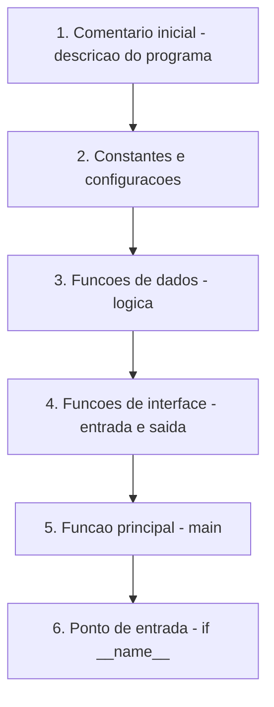
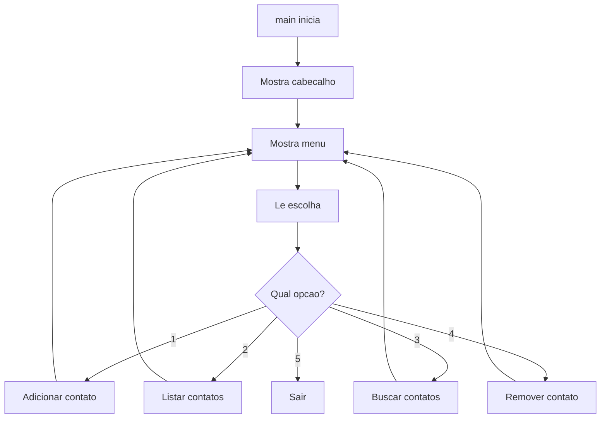
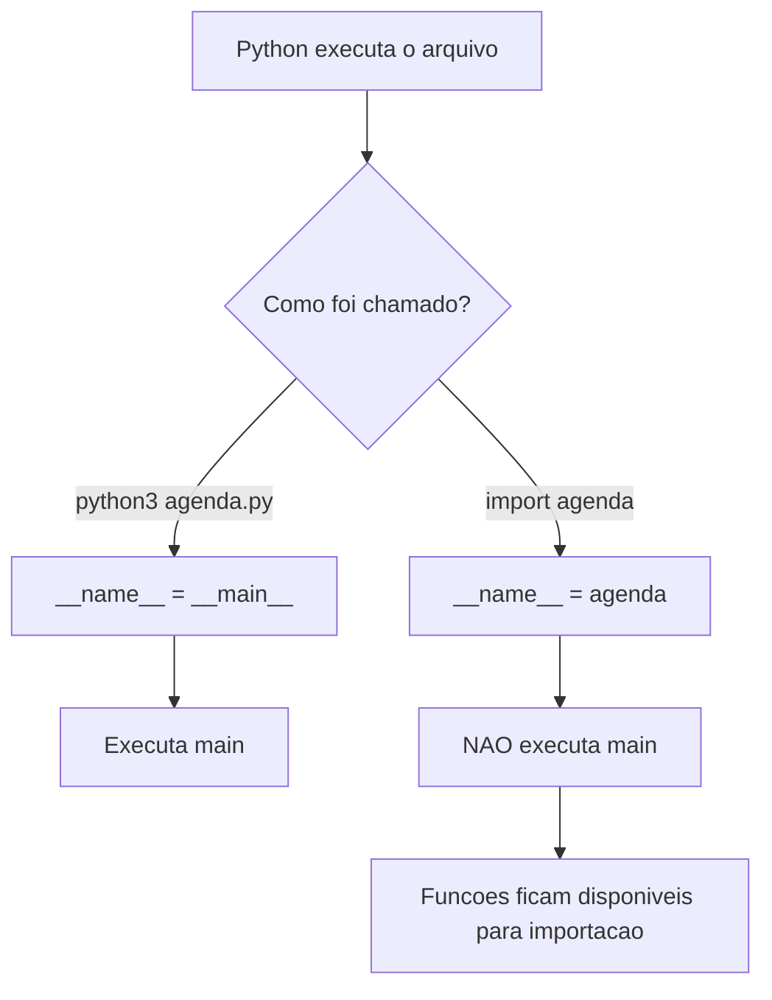
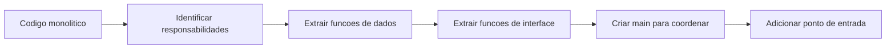
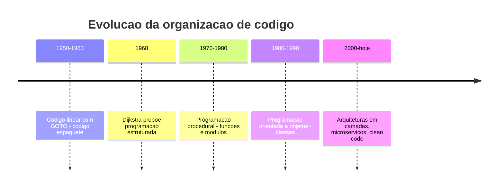

# 5.13 — Estrutura de um Programa Completo

[← Anterior: Coleções: Listas, Tuplas e Dicionários](cap05-mod12-colecoes-conteudo.md) · [Próximo: Debugging: Encontrando e Corrigindo Erros →](cap05-mod14-debugging-conteudo.md)

---

## Introdução

Nos módulos anteriores, você aprendeu os quatro pilares da programação: variáveis, condicionais, loops e funções. Também aprendeu a trabalhar com coleções de dados — listas, tuplas e dicionários. Cada módulo apresentou uma peça do quebra-cabeça. Agora é hora de juntar tudo e entender como organizar um programa completo do início ao fim.

Até agora, seus programas eram pequenos — 10, 20, 50 linhas. Mas programas reais têm centenas ou milhares de linhas. Sem organização, o código vira uma bagunça impossível de entender e manter. É como uma cozinha: se você joga os ingredientes em qualquer lugar, não encontra nada na hora de cozinhar. Mas se organiza tudo em prateleiras, gavetas e potes etiquetados, o trabalho flui.

Neste módulo, vamos aprender a estruturar um programa Python de forma profissional: onde colocar cada parte, como separar responsabilidades e como criar programas que outras pessoas (e você no futuro) consigam entender. Esse conhecimento é a ponte entre "saber programar" e "saber construir software" — e vai ser a base de tudo que você fizer daqui para frente.

---

## Como Executar os Exemplos Deste Módulo

1. Abra o VSCode: `code ~/projetos/python`
2. Crie arquivos para cada exemplo (ex: `programa_completo.py`)
3. Copie, salve e execute: `python3 nome_do_arquivo.py`

---

## O Problema: Código Desorganizado

Antes de aprender a organizar, vamos ver o que acontece quando não organizamos. Imagine que você escreveu um programa de cadastro de contatos assim:

```python
# Programa de contatos — versao desorganizada
# "contacts" = contatos
contacts = []
print("=== Agenda de Contatos ===")
while True:
    print("\n1. Adicionar")
    print("2. Listar")
    print("3. Buscar")
    print("4. Sair")
    op = input("Opcao: ")
    if op == "1":
        n = input("Nome: ")
        t = input("Telefone: ")
        contacts.append({"name": n, "phone": t})
        print("Adicionado!")
    elif op == "2":
        if len(contacts) == 0:
            print("Vazio")
        else:
            for c in contacts:
                print(f"{c['name']} - {c['phone']}")
    elif op == "3":
        s = input("Buscar: ")
        found = False
        for c in contacts:
            if s.lower() in c["name"].lower():
                print(f"{c['name']} - {c['phone']}")
                found = True
        if not found:
            print("Nao encontrado")
    elif op == "4":
        print("Tchau!")
        break
    else:
        print("Invalido!")
```

Saída esperada (se escolher "1" e depois "2"):

```
=== Agenda de Contatos ===

1. Adicionar
2. Listar
3. Buscar
4. Sair
Opcao: 1
Nome: Maria
Telefone: 99999-1111
Adicionado!

1. Adicionar
2. Listar
3. Buscar
4. Sair
Opcao: 2
Maria - 99999-1111
```

O programa funciona. Mas tem vários problemas:

| Problema | Consequência |
|----------|-------------|
| Tudo em um bloco só | Impossível reutilizar partes do código |
| Variáveis com nomes curtos (`n`, `t`, `s`, `c`) | Difícil entender o que cada uma faz |
| Sem funções | Se precisar adicionar contato em outro lugar, precisa copiar código |
| Sem constantes | Se quiser mudar o título, precisa procurar no meio do código |
| Sem comentários organizados | Outro programador não sabe por onde começar a ler |
| Lógica misturada com interface | Se quiser trocar o menu por interface gráfica, reescreve tudo |

Esse código funciona para 30 linhas. Mas imagine 300 linhas assim — ou 3000. Seria impossível de manter. É por isso que organização não é luxo — é necessidade.

Existe um conceito na engenharia de software chamado **dívida técnica** (technical debt). Quando você escreve código desorganizado para "ir mais rápido", está pegando um empréstimo: ganha velocidade agora, mas paga juros depois — em forma de bugs, retrabalho e dificuldade de manutenção. Quanto mais tempo o código desorganizado fica sem ser arrumado, mais juros se acumulam.

---

## A Anatomia de um Programa Python

Todo programa Python bem organizado segue uma estrutura parecida. Pense nisso como a planta de uma casa — cada cômodo tem uma função específica:



Vamos detalhar cada parte com o mesmo programa de contatos, agora organizado.

### 1. Comentário Inicial

Todo programa deve começar com um comentário explicando o que ele faz:

```python
# ============================================
# Sistema de Cadastro de Contatos
# Autor: Seu Nome
# Descricao: Programa que permite cadastrar,
#            listar, buscar e remover contatos
#            de uma agenda pessoal.
# ============================================
```

Saída esperada: nenhuma (é apenas um comentário)

### 2. Constantes e Configurações

Valores que não mudam durante a execução ficam no topo, em letras maiúsculas:

```python
# Constantes — valores fixos do programa
# "MAX_CONTACTS" = maximo de contatos permitidos
MAX_CONTACTS = 100
# "APP_NAME" = nome do aplicativo
APP_NAME = "Agenda de Contatos"
# "VERSION" = versao do programa
VERSION = "1.0"
# "MENU_OPTIONS" = opcoes do menu
MENU_OPTIONS = ["Adicionar", "Listar", "Buscar", "Remover", "Sair"]
```

Saída esperada: nenhuma (são apenas definições)

Por que constantes no topo? Porque se amanhã você quiser mudar o limite de contatos de 100 para 500, muda em um lugar só.

### 3. Funções de Dados (Lógica)

Essas funções manipulam os dados do programa. Elas não sabem nada sobre o menu, sobre o que o usuário digitou, sobre como as coisas aparecem na tela:

```python
# --- Funcoes de dados ---

# "add_contact" = adicionar contato
def add_contact(contacts, name, phone):
    contact = {"name": name, "phone": phone}
    contacts.append(contact)
    return contact

# "find_contacts" = encontrar contatos
def find_contacts(contacts, search_term):
    results = []
    for contact in contacts:
        if search_term.lower() in contact["name"].lower():
            results.append(contact)
    return results

# "remove_contact" = remover contato
def remove_contact(contacts, name):
    for i, contact in enumerate(contacts):
        if contact["name"].lower() == name.lower():
            return contacts.pop(i)
    return None

# "count_contacts" = contar contatos
def count_contacts(contacts):
    return len(contacts)
```

Saída esperada: nenhuma (são apenas definições de funções)

Observe que essas funções:
- Recebem dados como parâmetros (não usam `input()`)
- Retornam resultados (não usam `print()`)
- Não sabem nada sobre o menu ou a interface

Essa separação é fundamental. Se amanhã você quiser trocar o menu de texto por uma interface gráfica, as funções de dados continuam funcionando sem nenhuma mudança. Esse princípio tem um nome: **separação de responsabilidades** (separation of concerns).


### 4. Funções de Interface (Entrada e Saída)

Essas funções cuidam da interação com o usuário — mostrar coisas na tela e ler o que o usuário digita:

```python
# --- Funcoes de interface ---

# "show_header" = mostrar cabecalho
def show_header():
    print(f"\n{'=' * 40}")
    print(f"  {APP_NAME} v{VERSION}")
    print(f"{'=' * 40}")

# "show_menu" = mostrar menu
def show_menu():
    print()
    for i, option in enumerate(MENU_OPTIONS, 1):
        print(f"  {i}. {option}")
    print()

# "get_menu_choice" = obter escolha do menu
def get_menu_choice():
    # "choice" = escolha
    while True:
        choice = input("Escolha uma opcao: ")
        if choice.isdigit() and 1 <= int(choice) <= len(MENU_OPTIONS):
            return int(choice)
        print("Opcao invalida! Tente novamente.")

# "get_contact_data" = obter dados do contato
def get_contact_data():
    # "name" = nome, "phone" = telefone
    name = input("Nome: ").strip()
    phone = input("Telefone: ").strip()
    return name, phone

# "show_contact" = mostrar contato
def show_contact(contact):
    print(f"  {contact['name']:<20} {contact['phone']}")

# "show_contact_list" = mostrar lista de contatos
def show_contact_list(contacts):
    if len(contacts) == 0:
        print("  Nenhum contato cadastrado.")
        return
    print(f"\n  {'Nome':<20} {'Telefone'}")
    print(f"  {'-' * 35}")
    for contact in contacts:
        show_contact(contact)
    print(f"\n  Total: {len(contacts)} contato(s)")
```

Saída esperada: nenhuma (são apenas definições de funções)

Observe que essas funções:
- Usam `print()` e `input()` — lidam com o usuário
- Não manipulam dados diretamente — apenas mostram e coletam
- São simples e focadas — cada uma faz uma coisa

### 5. Função Principal (main)

A função `main()` é o coração do programa — ela coordena tudo, chamando as funções de dados e de interface na ordem certa:

```python
# --- Funcao principal ---

# "main" = principal — funcao que coordena o programa
def main():
    show_header()
    # "contacts" = lista de contatos (comeca vazia)
    contacts = []

    while True:
        show_menu()
        # "choice" = escolha do usuario
        choice = get_menu_choice()

        if choice == 1:
            # Adicionar contato
            name, phone = get_contact_data()
            if name and phone:
                add_contact(contacts, name, phone)
                print(f"\n  Contato '{name}' adicionado!")
            else:
                print("\n  Nome e telefone sao obrigatorios!")

        elif choice == 2:
            # Listar contatos
            show_contact_list(contacts)

        elif choice == 3:
            # Buscar contatos
            search = input("Buscar por nome: ").strip()
            results = find_contacts(contacts, search)
            if results:
                print(f"\n  {len(results)} resultado(s):")
                for contact in results:
                    show_contact(contact)
            else:
                print("  Nenhum contato encontrado.")

        elif choice == 4:
            # Remover contato
            name = input("Nome do contato para remover: ").strip()
            removed = remove_contact(contacts, name)
            if removed:
                print(f"\n  Contato '{removed['name']}' removido!")
            else:
                print("  Contato nao encontrado.")

        elif choice == 5:
            # Sair
            print(f"\n  Ate logo! {count_contacts(contacts)} contato(s) na agenda.")
            break
```

Saída esperada: nenhuma (é apenas a definição da função)

Observe como `main()` é legível — quase como ler em português. Ela não sabe como adicionar um contato (isso é trabalho de `add_contact`), nem como mostrar o menu (isso é trabalho de `show_menu`). Ela apenas coordena: "mostre o menu, pegue a escolha, execute a ação correspondente".



### 6. Ponto de Entrada

A última parte do arquivo é o ponto de entrada — a linha que realmente inicia o programa:

```python
# --- Ponto de entrada ---
if __name__ == "__main__":
    main()
```

Saída esperada: o programa inicia e mostra o cabeçalho e o menu

Quando o Python executa um arquivo, ele define uma variável especial chamada `__name__`. Se o arquivo está sendo executado diretamente (você rodou `python3 agenda.py`), `__name__` recebe o valor `"__main__"`. Se o arquivo está sendo importado por outro arquivo, `__name__` recebe o nome do arquivo.

Isso significa que:
- Se você rodar `python3 agenda.py` → `__name__` é `"__main__"` → `main()` executa
- Se outro arquivo fizer `import agenda` → `__name__` é `"agenda"` → `main()` NÃO executa

Por que isso importa? Porque permite que suas funções sejam reutilizadas por outros programas sem executar o programa inteiro.




---

## Refatoração: Transformando Código Desorganizado em Organizado

Agora que você conhece a estrutura ideal, vamos ver como transformar o código desorganizado do início do módulo no código organizado. Esse processo se chama **refatoração** (refactoring) — reorganizar código existente sem mudar o que ele faz.

A refatoração é uma das habilidades mais importantes de um programador profissional. Você raramente escreve código perfeito na primeira vez. O processo normal é: escrever algo que funciona, depois melhorar a organização. O importante é que o comportamento do programa não mude — ele continua fazendo exatamente a mesma coisa, mas de forma mais organizada.

### Passo 1: Identificar as Responsabilidades

Olhe para o código desorganizado e pergunte: "quais são as tarefas diferentes que esse código faz?" No nosso exemplo:

| Responsabilidade | Linhas no código original |
|-----------------|--------------------------|
| Mostrar o menu | `print("1. Adicionar")` etc. |
| Ler a escolha do usuário | `op = input("Opcao: ")` |
| Adicionar contato | `contacts.append(...)` |
| Listar contatos | `for c in contacts: print(...)` |
| Buscar contatos | `for c in contacts: if s.lower()...` |
| Sair do programa | `break` |

### Passo 2: Extrair Funções

Para cada responsabilidade, crie uma função. A regra é simples: se um trecho de código faz algo específico e pode ser nomeado, extraia para uma função.



### Passo 3: Separar Dados de Interface

Essa é a separação mais importante. Funções de dados não devem usar `print()` nem `input()`. Funções de interface não devem manipular dados diretamente. A função `main()` conecta as duas camadas.

| Camada | Responsabilidade | Usa print/input? | Manipula dados? |
|--------|-----------------|------------------|-----------------|
| Dados | Lógica e manipulação | Não | Sim |
| Interface | Entrada e saída | Sim | Não |
| Coordenação (main) | Orquestrar o fluxo | Mínimo | Mínimo |

### Passo 4: Extrair Constantes

Valores que aparecem "soltos" no código (números mágicos, textos fixos) devem virar constantes no topo:

```python
# ANTES — valor "magico" no meio do codigo
if len(contacts) >= 100:
    print("Limite atingido!")

# DEPOIS — constante com nome descritivo
MAX_CONTACTS = 100
# ...
if len(contacts) >= MAX_CONTACTS:
    print("Limite atingido!")
```

Saída esperada: nenhuma (comparação conceitual)

A vantagem é clara: se o limite mudar de 100 para 200, você muda em um lugar só. E qualquer pessoa que leia o código entende imediatamente o que `MAX_CONTACTS` significa — enquanto o número `100` sozinho não diz nada.

---

## Princípios de Organização

### Separação de Responsabilidades

Cada função deve fazer uma coisa só. Divida seu programa em camadas:

| Camada | Responsabilidade | Exemplos |
|--------|-----------------|----------|
| Dados | Manipular informações | `add_contact()`, `find_contacts()` |
| Interface | Interagir com o usuário | `show_menu()`, `get_menu_choice()` |
| Coordenação | Orquestrar o fluxo | `main()` |

Essa separação em camadas é tão importante que tem um nome formal na engenharia de software: **arquitetura em camadas** (layered architecture). Você vai reencontrar esse conceito no capítulo 10, quando estudar arquitetura de software — mas a ideia começa aqui, com programas simples.

### Nomes Descritivos

Bons nomes tornam o código auto-explicativo. Compare:

| Ruim | Bom | Por quê |
|------|-----|---------|
| `f()` | `find_contact()` | Diz o que faz |
| `x` | `product_name` | Diz o que contém |
| `lst` | `contacts` | Diz o que representa |
| `do_stuff()` | `validate_input()` | Diz a responsabilidade |
| `d` | `contact_data` | Diz o que é |
| `tmp` | `search_results` | Diz o propósito |

Uma regra prática: se você precisa de um comentário para explicar o que uma variável ou função faz, o nome provavelmente está ruim. O nome ideal torna o comentário desnecessário.

Em Python, a convenção é usar **snake_case** para variáveis e funções (palavras separadas por underscore, tudo minúsculo): `find_contacts`, `show_menu`, `contact_name`. Constantes usam **UPPER_SNAKE_CASE**: `MAX_CONTACTS`, `APP_NAME`.

### Constantes no Topo

Valores que podem mudar no futuro (limites, mensagens, versão) ficam como constantes no topo. Assim, quando precisar mudar, muda em um lugar só.

### Docstrings

Docstrings são comentários especiais que documentam o que uma função faz. Em Python, ficam logo após a definição da função, entre aspas triplas:

```python
def find_contacts(contacts, search_term):
    """Busca contatos cujo nome contem o termo de busca.

    Args:
        contacts: Lista de dicionarios com contatos
        search_term: Texto para buscar no nome

    Returns:
        Lista de contatos que correspondem a busca
    """
    results = []
    for contact in contacts:
        if search_term.lower() in contact["name"].lower():
            results.append(contact)
    return results
```

Saída esperada: nenhuma (é apenas a definição da função)

Docstrings são opcionais para programas pequenos, mas se tornam essenciais em projetos maiores. Elas servem como documentação embutida no código — qualquer pessoa que usar sua função pode ler a docstring para entender o que ela faz, sem precisar ler o código inteiro.

---

## Erros Comuns de Organização

### Erro 1: Funções que Fazem Tudo

```python
# RUIM — funcao faz dados E interface
def add_and_show_contact(contacts):
    name = input("Nome: ")           # interface
    phone = input("Telefone: ")      # interface
    contacts.append({"name": name, "phone": phone})  # dados
    print(f"Contato {name} adicionado!")  # interface
    print(f"Total: {len(contacts)}")     # interface
```

Saída esperada: nenhuma (exemplo conceitual)

O problema: essa função mistura entrada de dados, manipulação e saída. Se você quiser adicionar um contato sem perguntar ao usuário (por exemplo, importando de um arquivo), não consegue reutilizar essa função.

```python
# BOM — separar em funcoes especializadas
def add_contact(contacts, name, phone):
    # So manipula dados
    contact = {"name": name, "phone": phone}
    contacts.append(contact)
    return contact

def handle_add_contact(contacts):
    # So cuida da interface
    name = input("Nome: ")
    phone = input("Telefone: ")
    contact = add_contact(contacts, name, phone)
    print(f"Contato {contact['name']} adicionado!")
    print(f"Total: {len(contacts)}")
```

Saída esperada: nenhuma (exemplo conceitual)

### Erro 2: Variáveis Globais

```python
# RUIM — variavel global acessada por todas as funcoes
contacts = []

def add_contact(name, phone):
    contacts.append({"name": name, "phone": phone})

def list_contacts():
    for c in contacts:
        print(c["name"])
```

Saída esperada: nenhuma (exemplo conceitual)

O problema: qualquer função pode modificar `contacts` sem que as outras saibam. Em programas grandes, isso causa bugs difíceis de encontrar — você não sabe quem mudou os dados.

```python
# BOM — passar dados como parametro
def add_contact(contacts, name, phone):
    contacts.append({"name": name, "phone": phone})

def list_contacts(contacts):
    for c in contacts:
        print(c["name"])

def main():
    contacts = []  # dados vivem aqui, controlados por main
    add_contact(contacts, "Maria", "99999-1111")
    list_contacts(contacts)
```

Saída esperada: nenhuma (exemplo conceitual)

### Erro 3: Código Duplicado

```python
# RUIM — mesmo codigo repetido em dois lugares
if choice == "2":
    print(f"\n{'Nome':<20} {'Telefone'}")
    print("-" * 35)
    for c in contacts:
        print(f"{c['name']:<20} {c['phone']}")

# ... mais adiante no codigo ...
if choice == "3":
    results = find_contacts(contacts, search)
    print(f"\n{'Nome':<20} {'Telefone'}")
    print("-" * 35)
    for c in results:
        print(f"{c['name']:<20} {c['phone']}")
```

Saída esperada: nenhuma (exemplo conceitual)

O problema: se você quiser mudar o formato da tabela, precisa mudar em dois lugares. E provavelmente vai esquecer um.

```python
# BOM — extrair para funcao reutilizavel
def show_contact_table(contact_list):
    print(f"\n{'Nome':<20} {'Telefone'}")
    print("-" * 35)
    for c in contact_list:
        print(f"{c['name']:<20} {c['phone']}")

# Agora usa a mesma funcao nos dois lugares
if choice == "2":
    show_contact_table(contacts)

if choice == "3":
    results = find_contacts(contacts, search)
    show_contact_table(results)
```

Saída esperada: nenhuma (exemplo conceitual)

A regra é conhecida como **DRY** — Don't Repeat Yourself (Não Se Repita). Se você está copiando e colando código, provavelmente deveria extrair uma função.


---

## Segundo Programa Completo: Sistema de Notas

Para consolidar o aprendizado, vamos ver outro programa completo seguindo a mesma estrutura. Dessa vez, um sistema de notas de alunos:

```python
# ============================================
# Sistema de Notas de Alunos
# Descricao: Registrar alunos, suas notas,
#            e calcular medias e situacao.
# ============================================

# --- Constantes ---
# "PASSING_GRADE" = nota de aprovacao
PASSING_GRADE = 7.0
# "MAX_GRADE" = nota maxima
MAX_GRADE = 10.0
# "MIN_GRADE" = nota minima
MIN_GRADE = 0.0
# "APP_NAME" = nome do aplicativo
APP_NAME = "Sistema de Notas"

# --- Funcoes de dados ---

# "add_student" = adicionar aluno
def add_student(students, name):
    # "student" = aluno
    student = {"name": name, "grades": []}
    students.append(student)
    return student

# "add_grade" = adicionar nota
def add_grade(student, grade):
    # "grade" = nota
    if MIN_GRADE <= grade <= MAX_GRADE:
        student["grades"].append(grade)
        return True
    return False

# "calculate_average" = calcular media
def calculate_average(student):
    # "grades" = notas
    grades = student["grades"]
    if len(grades) == 0:
        return 0.0
    return sum(grades) / len(grades)

# "get_status" = obter situacao
def get_status(student):
    # "average" = media
    average = calculate_average(student)
    if len(student["grades"]) == 0:
        return "Sem notas"
    elif average >= PASSING_GRADE:
        return "Aprovado"
    else:
        return "Reprovado"

# "find_student" = encontrar aluno
def find_student(students, name):
    for student in students:
        if student["name"].lower() == name.lower():
            return student
    return None

# --- Funcoes de interface ---

# "show_menu" = mostrar menu
def show_menu():
    print(f"\n=== {APP_NAME} ===")
    print("1. Cadastrar aluno")
    print("2. Adicionar nota")
    print("3. Ver boletim")
    print("4. Listar todos")
    print("5. Sair")
    print()

# "show_student_report" = mostrar boletim do aluno
def show_student_report(student):
    # "average" = media, "status" = situacao
    average = calculate_average(student)
    status = get_status(student)
    print(f"\n  Aluno: {student['name']}")
    print(f"  Notas: {student['grades']}")
    print(f"  Media: {average:.1f}")
    print(f"  Situacao: {status}")

# "show_all_students" = mostrar todos os alunos
def show_all_students(students):
    if len(students) == 0:
        print("  Nenhum aluno cadastrado.")
        return
    print(f"\n  {'Aluno':<20} {'Media':>6} {'Situacao':<12}")
    print(f"  {'-' * 42}")
    for student in students:
        average = calculate_average(student)
        status = get_status(student)
        print(f"  {student['name']:<20} {average:>6.1f} {status:<12}")

# --- Funcao principal ---

# "main" = principal
def main():
    # "students" = lista de alunos
    students = []

    while True:
        show_menu()
        # "choice" = escolha
        choice = input("Opcao: ")

        if choice == "1":
            name = input("Nome do aluno: ").strip()
            if name:
                if find_student(students, name):
                    print(f"  Aluno '{name}' ja existe!")
                else:
                    add_student(students, name)
                    print(f"  Aluno '{name}' cadastrado!")
            else:
                print("  Nome nao pode ser vazio!")

        elif choice == "2":
            name = input("Nome do aluno: ").strip()
            student = find_student(students, name)
            if student:
                # "grade_text" = texto da nota
                grade_text = input("Nota (0 a 10): ")
                try:
                    grade = float(grade_text)
                    if add_grade(student, grade):
                        print(f"  Nota {grade:.1f} adicionada!")
                    else:
                        print(f"  Nota deve ser entre {MIN_GRADE} e {MAX_GRADE}!")
                except ValueError:
                    print("  Valor invalido!")
            else:
                print(f"  Aluno '{name}' nao encontrado.")

        elif choice == "3":
            name = input("Nome do aluno: ").strip()
            student = find_student(students, name)
            if student:
                show_student_report(student)
            else:
                print(f"  Aluno '{name}' nao encontrado.")

        elif choice == "4":
            show_all_students(students)

        elif choice == "5":
            print("  Ate logo!")
            break

        else:
            print("  Opcao invalida!")

# --- Ponto de entrada ---
if __name__ == "__main__":
    main()
```

Saída esperada (se cadastrar "Maria" com notas 8.5 e 7.0, depois listar todos):

```
=== Sistema de Notas ===
1. Cadastrar aluno
2. Adicionar nota
3. Ver boletim
4. Listar todos
5. Sair

Opcao: 4

  Aluno                 Media Situacao
  ------------------------------------------
  Maria                   7.8 Aprovado
```

Observe como esse programa segue exatamente a mesma estrutura do anterior: constantes no topo, funções de dados separadas das funções de interface, `main()` coordenando tudo, e ponto de entrada no final. Quando você domina essa estrutura, consegue organizar qualquer programa.

---

## Comparação: Antes e Depois

Vamos comparar o que mudou entre o código desorganizado e o organizado:

| Aspecto | Desorganizado | Organizado |
|---------|--------------|------------|
| Linhas de código | ~30 | ~150 |
| Funções | 0 | 10+ |
| Constantes | 0 | 4+ |
| Reutilizável | Não | Sim |
| Testável | Não | Sim |
| Legível | Difícil | Fácil |
| Manutenível | Muito difícil | Fácil |

"Mas o código organizado tem mais linhas!" — sim, e isso é bom. Código organizado é mais longo porque cada parte está claramente separada e documentada. Mas é muito mais fácil de entender, modificar e expandir. O tempo que você "perde" organizando, economiza dez vezes quando precisa fazer mudanças.

Uma analogia: uma receita de bolo escrita em um parágrafo corrido é mais curta do que uma receita com ingredientes listados, passos numerados e dicas separadas. Mas qual é mais fácil de seguir?

---

## Quando a Organização Importa Mais

Nem todo programa precisa de organização completa. Um script de 10 linhas que você vai usar uma vez e jogar fora não precisa de constantes, docstrings e separação em camadas. Mas conforme o programa cresce, a organização se torna cada vez mais importante:

| Tamanho do programa | Nível de organização recomendado |
|--------------------|---------------------------------|
| 1-20 linhas | Comentários básicos, nomes descritivos |
| 20-50 linhas | Funções para trechos reutilizáveis |
| 50-200 linhas | Estrutura completa: constantes, funções separadas, main |
| 200+ linhas | Considerar dividir em múltiplos arquivos (módulos) |

A regra prática é: se você vai ler esse código de novo (amanhã, semana que vem, mês que vem), organize. Se outra pessoa vai ler, organize ainda mais.

---

## Contexto Histórico: Como a Organização de Código Evoluiu

Nos primeiros anos da programação (décadas de 1950-1960), programas eram escritos em uma sequência linear de instruções — sem funções, sem estrutura. O código era lido de cima para baixo, com saltos (`GOTO`) para pular de um lugar para outro. Isso ficou conhecido como **código espaguete** (spaghetti code) — porque o fluxo do programa parecia um prato de espaguete, com fios indo para todos os lados.

Em 1968, o cientista da computação Edsger Dijkstra publicou uma carta famosa chamada "Go To Statement Considered Harmful" (A Instrução Go To Considerada Prejudicial), argumentando que programas deveriam ser organizados com estruturas claras — sequência, seleção (if/else) e repetição (loops) — em vez de saltos arbitrários. Essa ideia deu origem à **programação estruturada**, que é exatamente o que você aprendeu neste curso.

Depois veio a **programação procedural** — organizar código em funções e procedimentos, que é o que estamos fazendo neste módulo. E depois a **programação orientada a objetos** (OOP), que você vai aprender no capítulo 9 — onde dados e funções são agrupados em classes.



Cada etapa dessa evolução resolveu problemas da etapa anterior. E todas compartilham o mesmo princípio fundamental: **separar responsabilidades** para tornar o código mais compreensível e manutenível.


---

## Como a IA pode te ajudar aqui

A IA é uma parceira excelente para aprender a organizar código. Experimente estes prompts:

**Prompt 1 — Refatorar código existente:**
> "Tenho este programa Python desorganizado: [cole seu código]. Reorganize-o usando a estrutura com constantes, funções separadas por responsabilidade, main() e ponto de entrada."

**Prompt 2 — Revisar organização:**
> "Analise a organização deste código Python e me diga o que posso melhorar: [cole seu código]. Foque em separação de responsabilidades, nomes de variáveis e estrutura geral."

**Prompt 3 — Expandir programa:**
> "Tenho este programa organizado com menu e CRUD de contatos. Quero adicionar a funcionalidade de editar um contato existente. Me mostre como adicionar mantendo a mesma estrutura de organização."

Lembre-se: a IA pode sugerir organizações, mas você precisa entender o porquê de cada decisão. Não copie código sem entender — use a IA como parceira de aprendizado, não como substituta.

---

## Casos de Uso no Mundo Real

### Caso 1: Ferramentas de Linha de Comando

Ferramentas como `git`, `docker` e `pip` são programas de linha de comando organizados exatamente assim: uma função principal que interpreta comandos, funções auxiliares para cada operação, e constantes de configuração. Quando você digita `git commit -m "mensagem"`, o programa `git` tem uma função `main()` que lê o comando `commit`, chama a função correspondente, e passa os argumentos. A estrutura que você aprendeu aqui é a mesma usada em ferramentas profissionais usadas por milhões de desenvolvedores.

### Caso 2: Scripts de Automação em Empresas

Empresas usam scripts Python para automatizar tarefas repetitivas: gerar relatórios diários, processar arquivos de dados, enviar e-mails automáticos, fazer backup de bancos de dados. Esses scripts seguem a mesma estrutura: constantes de configuração no topo (endereço do servidor, caminho dos arquivos), funções organizadas por responsabilidade (ler dados, processar, enviar), e uma função `main()` que coordena tudo. No Spotify, por exemplo, centenas de scripts Python automatizam tarefas de infraestrutura — e todos seguem padrões de organização semelhantes ao que você aprendeu.

### Caso 3: Backends de Aplicações Web

Frameworks como Django e FastAPI (que você vai usar no capítulo 11) organizam o código em camadas: modelos (dados), views (interface), e controllers (coordenação). É o mesmo princípio de separação de responsabilidades que você aprendeu aqui, em escala maior. Quando o Instagram processa uma foto que você postou, o código está organizado em camadas: uma camada recebe a foto (interface), outra redimensiona e aplica filtros (lógica), outra salva no banco de dados (dados). Cada camada faz uma coisa só.

---

## Resumo do Módulo

| Conceito | Descrição |
|----------|-----------|
| Comentário inicial | Descrição do programa no topo do arquivo |
| Constantes | Valores fixos em MAIÚSCULAS no topo |
| Funções de dados | Funções que manipulam dados sem usar print/input |
| Funções de interface | Funções que interagem com o usuário |
| `main()` | Função principal que coordena o programa |
| `if __name__ == "__main__":` | Ponto de entrada que chama `main()` |
| Separação de responsabilidades | Cada função faz uma coisa só |
| Nomes descritivos | Nomes que explicam o que o código faz |
| Refatoração | Reorganizar código sem mudar seu comportamento |
| Dívida técnica | Custo acumulado de código desorganizado |
| DRY | Don't Repeat Yourself — não duplicar código |

---

## Glossário do Módulo

| Termo | Definição |
|-------|-----------|
| Código espaguete (spaghetti code) | Código desorganizado com fluxo confuso e difícil de seguir |
| Constante (constant) | Valor que não muda durante a execução, escrito em MAIÚSCULAS |
| Docstring | Comentário especial entre aspas triplas que documenta uma função |
| DRY (Don't Repeat Yourself) | Princípio de não duplicar código — extrair para funções reutilizáveis |
| Dívida técnica (technical debt) | Custo acumulado de decisões de código que priorizam velocidade sobre qualidade |
| Função principal (main function) | Função que coordena o fluxo do programa |
| Ponto de entrada (entry point) | Linha que inicia a execução do programa |
| Programação estruturada (structured programming) | Paradigma que organiza código com sequência, seleção e repetição |
| Programação procedural (procedural programming) | Paradigma que organiza código em funções e procedimentos |
| Refatoração (refactoring) | Reorganizar código existente sem mudar seu comportamento |
| Responsabilidade (responsibility) | A tarefa específica que uma função ou módulo realiza |
| Separação de responsabilidades (separation of concerns) | Princípio de que cada parte do código deve ter uma única função |
| snake_case | Convenção de nomes em Python: palavras separadas por underscore, tudo minúsculo |
| UPPER_SNAKE_CASE | Convenção para constantes: palavras separadas por underscore, tudo maiúsculo |
| `__name__` | Variável especial do Python que indica como o arquivo está sendo executado |

---

## Na Cultura Popular

- **Ratatouille** (filme, 2007) — a cozinha do restaurante Gusteau's é organizada em estações (garde manger, saucier, patissier), cada uma com uma responsabilidade clara. É exatamente o princípio de separação de responsabilidades em código: cada função tem sua estação, sua especialidade, e o chef (main) coordena tudo.

- **The Lego Movie** (filme, 2014) — o personagem Emmet segue instruções passo a passo para construir coisas. Mas quando precisa improvisar, percebe que entender os princípios por trás das instruções é mais importante do que seguir passos cegamente. Em programação, entender por que organizamos o código é mais importante do que decorar a estrutura.

---

## Para Saber Mais

- [PEP 8 — Guia de Estilo Python](https://peps.python.org/pep-0008/) — *O guia oficial de estilo de código Python — como nomear variáveis, organizar imports e formatar código*
- [Real Python — Python Main Function](https://realpython.com/python-main-function/) — *Tutorial detalhado sobre como usar a função main e o ponto de entrada em Python*
- [Python Tutor](https://pythontutor.com/) — *Visualize a execução do código passo a passo — excelente para entender o fluxo de funções*
- [Automate the Boring Stuff — Chapter 3: Functions](https://automatetheboringstuff.com/2e/chapter3/) — *Capítulo sobre funções do livro gratuito, com exemplos práticos de organização*
- [Exercism — Python Track](https://exercism.org/tracks/python) — *Exercícios progressivos que exigem boa organização de código*

---

## Perguntas Frequentes (FAQ)

**P: Preciso sempre criar uma função main()?**
R: Não é obrigatório, mas é uma boa prática. Para programas pequenos (menos de 30 linhas), pode não ser necessário. Para programas maiores, main() organiza o fluxo e permite que o arquivo seja importado por outros.

**P: O que é `if __name__ == "__main__":`?**
R: É uma verificação que garante que main() só executa quando o arquivo é rodado diretamente. Se o arquivo for importado por outro, main() não executa automaticamente — mas as funções ficam disponíveis para uso.

**P: Qual a ordem certa das partes do programa?**
R: Comentário inicial, constantes, funções de dados, funções de interface, main(), ponto de entrada. Essa ordem garante que tudo está definido antes de ser usado.

**P: Posso ter mais de uma função main?**
R: Não. Cada programa tem uma única função principal que coordena o fluxo. Se o programa for muito grande, main() pode chamar outras funções coordenadoras.

**P: O que é refatoração?**
R: É reorganizar código existente para melhorá-lo sem mudar o que ele faz. Extrair funções, renomear variáveis e reorganizar a estrutura são formas de refatoração. É uma prática constante na vida de um programador.

**P: Constantes podem mudar?**
R: Em Python, constantes são apenas uma convenção (MAIÚSCULAS). Tecnicamente você pode mudar o valor, mas não deveria. É um acordo entre programadores: "esse valor não deve ser alterado durante a execução".

**P: Quantas funções um programa deve ter?**
R: Não há número fixo. A regra é: se um trecho de código faz algo específico e pode ser nomeado, extraia para uma função. Funções pequenas e focadas são melhores que funções grandes e genéricas.

**P: É normal programas ficarem grandes?**
R: Sim. Programas reais têm milhares de linhas. A organização que você aprendeu aqui é o que permite que programas grandes continuem compreensíveis. Quando um arquivo fica muito grande (200+ linhas), considere dividir em múltiplos arquivos.

**P: O que é DRY?**
R: Don't Repeat Yourself — não se repita. Se você está copiando e colando código, provavelmente deveria extrair uma função. Código duplicado é uma das principais fontes de bugs.

**P: Funções de dados podem usar print() para debug?**
R: Durante o desenvolvimento, sim — é normal colocar print() temporários para debug. Mas no código final, funções de dados não devem usar print(). Use o módulo de debugging que vamos aprender no próximo módulo.

---

## Exercícios Práticos

Os exercícios completos estão no arquivo separado:

**[Acessar Exercícios do Módulo 5.13](cap05-mod13-estrutura-programa-exercicios.md)**

Prévia:

### Exercício rápido 1 — Refatorar programa existente

Pegue o jogo de adivinhação do módulo 5.10 e reorganize-o usando a estrutura completa: constantes, funções auxiliares, main() e ponto de entrada.

### Exercício rápido 2 — Sistema de tarefas

Crie um programa completo de lista de tarefas (to-do list) com: adicionar, listar, marcar como concluída, remover e sair. Use a estrutura aprendida neste módulo.

### Exercício rápido 3 — Identificar problemas

Dado um programa desorganizado, identifique todos os problemas de organização e proponha como refatorá-lo.

---

[← Anterior: Coleções: Listas, Tuplas e Dicionários](cap05-mod12-colecoes-conteudo.md) · [Próximo: Debugging: Encontrando e Corrigindo Erros →](cap05-mod14-debugging-conteudo.md)
