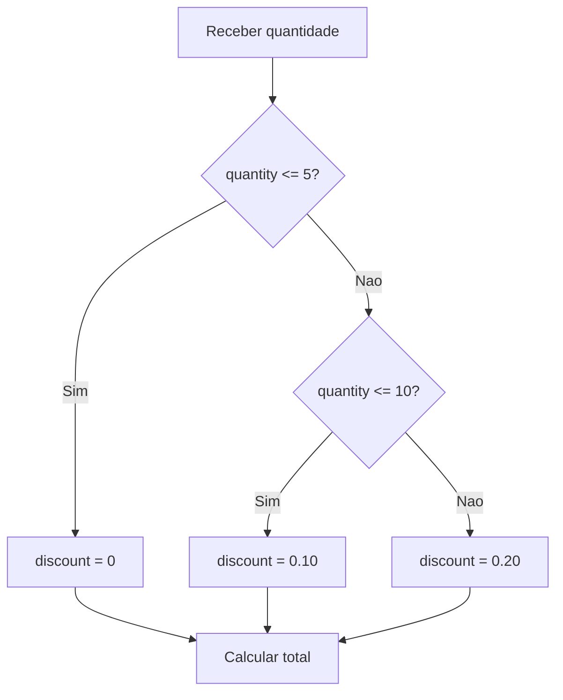

# 5.14 — Debugging: Encontrando e Corrigindo Erros

[← Anterior: Estrutura de um Programa Completo](cap05-mod13-estrutura-programa-conteudo.md) · [Próximo: Tratamento de Erros: try, except e Boas Práticas →](cap05-mod15-tratamento-erros-conteudo.md)

---

## Introdução

No módulo anterior, você aprendeu a organizar um programa completo com constantes, funções, `main()` e ponto de entrada. Agora vamos falar sobre algo que todo programador enfrenta todos os dias: **erros**.

Não importa quanta experiência você tenha — todo programador comete erros. A diferença entre um iniciante e um profissional não é a quantidade de erros que cometem, mas a velocidade com que conseguem **encontrar e corrigir** esses erros. Essa habilidade tem um nome: **debugging** (depuração, em português).

Pense no debugging como ser um detetive. O erro é o crime. A mensagem de erro é a pista. E você é o investigador que precisa descobrir o que aconteceu, onde aconteceu e por quê. Quanto melhor você ficar em ler pistas, mais rápido resolve o caso.

A palavra "debugging" vem de "bug" (inseto, em inglês). Conta a lenda que em 1947, a cientista Grace Hopper encontrou uma mariposa presa dentro de um computador Mark II, na Universidade de Harvard. A mariposa estava causando mau funcionamento na máquina. Ela colou o inseto no caderno de registros e escreveu: "First actual case of bug being found" (primeiro caso real de bug encontrado). Desde então, erros em programas são chamados de "bugs" e o processo de corrigi-los é chamado de "debugging".

Na verdade, o termo "bug" para defeitos mecânicos já existia antes disso — Thomas Edison usava a palavra nos anos 1870. Mas o episódio de Grace Hopper popularizou o termo no mundo da computação e se tornou uma das histórias mais famosas da área.

Neste módulo, você vai aprender a ler mensagens de erro do Python, usar técnicas simples para investigar problemas e conhecer o debugger do VSCode.

---

## Como Executar os Exemplos Deste Módulo

1. Copie o código e cole em um novo arquivo no VSCode
2. Salve na pasta `~/meus-projetos/python-curso/módulo-14/`
3. No terminal: `cd ~/meus-projetos/python-curso/módulo-14`
4. Execute: `python3 nome_do_arquivo.py`

---

## Por que Debugging é Importante?

Antes de mergulhar nas técnicas, vamos entender por que essa habilidade é tão valorizada.

Imagine que você está construindo uma casa. Você coloca os tijolos, faz o telhado, instala a parte elétrica. Quando liga a luz, ela não acende. O que você faz? Não derruba a casa inteira para recomeçar — você investiga. Verifica se o interruptor está conectado, se o fio está ligado, se a lâmpada está queimada. Você segue as pistas até encontrar o problema.

Programar é a mesma coisa. Quando algo não funciona, você não apaga tudo e reescreve do zero. Você investiga, encontra o ponto exato do problema e corrige apenas o necessário.

### O custo dos bugs no mundo real

Bugs em software causam prejuízos enormes. Alguns exemplos históricos:

- Em 1996, o foguete Ariane 5 da Agência Espacial Europeia explodiu 37 segundos após o lançamento. O motivo? Um erro de conversão de tipo — um número de 64 bits foi convertido para 16 bits, causando um overflow. Prejuízo: mais de 370 milhões de dólares.

- Em 1999, a sonda Mars Climate Orbiter da NASA se perdeu ao entrar na órbita de Marte. O motivo? Uma equipe usou unidades imperiais (libras-força) e outra usou unidades métricas (newtons). O software não converteu entre os dois sistemas. Prejuízo: 125 milhões de dólares.

- Em 2012, a empresa Knight Capital perdeu 440 milhões de dólares em 45 minutos por causa de um bug em seu sistema de negociação automática de ações. O software antigo foi ativado por engano e executou milhões de operações erradas.

- O bug do milênio (Y2K) em 1999 custou bilhões de dólares em correções preventivas no mundo inteiro. Muitos sistemas armazenavam o ano com apenas 2 dígitos (99 em vez de 1999), e quando o ano 2000 chegou, esses sistemas interpretariam "00" como 1900.

Esses exemplos mostram que debugging não é apenas uma habilidade técnica — é uma questão de responsabilidade profissional. Quanto mais cedo você encontra um bug, mais barato é corrigi-lo.

### Quanto tempo programadores gastam debugando?

Estudos mostram que programadores profissionais gastam entre 35% e 50% do tempo de trabalho debugando código. Isso significa que, em um dia de 8 horas, entre 3 e 4 horas são dedicadas a encontrar e corrigir erros. Não é tempo perdido — é parte essencial do trabalho.

A boa notícia é que, com prática, você fica cada vez mais rápido. Um programador experiente olha uma mensagem de erro e em segundos já sabe onde procurar. Essa velocidade vem da experiência de ter visto centenas de erros parecidos ao longo da carreira.

---

## Os Três Tipos de Erros em Programação

Antes de aprender a corrigir erros, precisamos entender que existem três tipos fundamentais. Cada tipo tem características diferentes e exige abordagens diferentes para ser encontrado.

### 1. Erros de Sintaxe (Syntax Errors)

São erros na "gramática" do código. Assim como uma frase em português precisa seguir regras gramaticais para fazer sentido, o código Python precisa seguir regras de sintaxe. Quando você quebra uma dessas regras, o Python nem consegue executar o programa — ele para antes de começar e mostra uma mensagem de erro.

Exemplos comuns de erros de sintaxe:
- Esquecer de fechar um parêntese, colchete ou aspas
- Esquecer os dois-pontos (`:`) depois de `if`, `for`, `while`, `def`
- Indentação incorreta (lembre-se do módulo 5.8)
- Usar uma palavra reservada como nome de variável

```python
# ERRO: falta fechar o parentese
# "message" = mensagem
message = print("Ola mundo"
```

**Saída esperada (erro):**
```
  File "exemplo.py", line 2
    message = print("Ola mundo"
                               ^
SyntaxError: unexpected EOF while parsing
```

O Python está dizendo: "Cheguei ao final do arquivo e ainda estou esperando algo — neste caso, o parêntese de fechamento."

```python
# ERRO: falta os dois-pontos depois do if
# "age" = idade
age = 18
if age >= 18
    print("Maior de idade")
```

**Saída esperada (erro):**
```
  File "exemplo.py", line 3
    if age >= 18
                ^
SyntaxError: expected ':'
```

O Python está dizendo: "Depois da condição do `if`, eu esperava encontrar dois-pontos (`:`)."

A característica principal dos erros de sintaxe é que o Python os detecta **antes** de executar qualquer linha do programa. É como se o Python lesse todo o código primeiro, verificasse se a gramática está correta e só depois começasse a executar. Se encontrar um erro de sintaxe, ele para imediatamente e mostra onde está o problema.

### 2. Erros de Execução (Runtime Errors / Exceções)

São erros que acontecem **durante** a execução do programa. A sintaxe está correta — o Python consegue ler e entender o código — mas quando tenta executar uma operação específica, algo dá errado.

É como uma receita de bolo que está escrita corretamente, mas quando você vai seguir os passos, descobre que falta um ingrediente. A receita em si não tem erro de escrita, mas não pode ser completada.

```python
# Sintaxe correta, mas erro durante a execucao
# "number" = numero
number = int(input("Digite um numero: "))
# "result" = resultado
result = 100 / number  # E se o usuario digitar 0?
print(f"Resultado: {result}")
```

Se o usuário digitar `0`:

**Saída esperada (erro):**
```
Digite um numero: 0
Traceback (most recent call last):
  File "exemplo.py", line 4, in <module>
    result = 100 / number
ZeroDivisionError: division by zero
```

O programa começou a executar normalmente, pediu o número ao usuário, mas quando tentou dividir 100 por 0, encontrou um erro impossível de resolver (divisão por zero não existe na matemática).

Outros exemplos comuns de erros de execução:

```python
# TypeError — tentando somar texto com numero
# "age" = idade
age = "25"
# "next_year" = proximo ano
next_year = age + 1  # Erro! "25" e texto, nao numero
```

**Saída esperada (erro):**
```
TypeError: can only concatenate str (not "int") to str
```

```python
# ValueError — tentando converter texto invalido para numero
# "price" = preco
price = int("abc")  # "abc" nao e um numero!
```

**Saída esperada (erro):**
```
ValueError: invalid literal for int() with base 10: 'abc'
```

```python
# IndexError — acessando posicao que nao existe
# "fruits" = frutas
fruits = ["maca", "banana", "laranja"]
print(fruits[5])  # So existem posicoes 0, 1 e 2!
```

**Saída esperada (erro):**
```
IndexError: list index out of range
```

```python
# NameError — usando variavel que nao existe
# "name" = nome
name = "Maria"
print(nome)  # Erro! A variavel se chama "name", nao "nome"
```

**Saída esperada (erro):**
```
NameError: name 'nome' is not defined
```

```python
# KeyError — acessando chave que nao existe no dicionario
# "student" = estudante
student = {"name": "Ana", "age": 20}
print(student["grade"])  # A chave "grade" nao existe!
```

**Saída esperada (erro):**
```
KeyError: 'grade'
```

No próximo módulo (5.15), você vai aprender a **tratar** esses erros de execução usando `try` e `except`, para que o programa não pare quando algo inesperado acontece.

### 3. Erros de Lógica (Logic Errors)

São os erros mais traiçoeiros. O programa executa sem nenhuma mensagem de erro, mas o resultado está **errado**. O Python não reclama porque, do ponto de vista dele, tudo está correto — a sintaxe está certa, os tipos são compatíveis, nenhuma operação impossível foi tentada. Mas a lógica que você escreveu não faz o que você pretendia.

É como dar instruções para alguém chegar a um endereço. As instruções estão escritas corretamente em português, mas indicam o caminho errado. A pessoa segue as instruções perfeitamente e chega no lugar errado.

```python
# Programa para calcular a media de 3 notas
# "grade1" = nota1, "grade2" = nota2, "grade3" = nota3
grade1 = 8.0
grade2 = 7.0
grade3 = 9.0

# ERRO DE LOGICA: a divisao deveria ser por 3, nao por 2
# "average" = media
average = (grade1 + grade2 + grade3) / 2

print(f"Media: {average}")
```

**Saída esperada:**
```
Media: 12.0
```

O programa roda sem erros, mas a média de 8, 7 e 9 deveria ser 8.0, não 12.0. O erro está na lógica: dividimos por 2 em vez de 3. O Python não tem como saber que você queria dividir por 3 — ele fez exatamente o que você mandou.

Outro exemplo clássico:

```python
# Programa para verificar se um numero e par
# "number" = numero
number = int(input("Digite um numero: "))

# ERRO DE LOGICA: o operador deveria ser == (comparacao), nao = (atribuicao)
# Na verdade, em Python isso daria SyntaxError dentro do if
# Mas o erro de logica mais comum e usar o operador errado:
if number % 2 == 1:  # Isso verifica se e IMPAR, nao par!
    print(f"{number} e par")
else:
    print(f"{number} e impar")
```

Se o usuário digitar `4`:

**Saída esperada:**
```
Digite um numero: 4
4 e impar
```

O programa diz que 4 é ímpar, o que está errado. O erro está na condição: `number % 2 == 1` verifica se o resto da divisão por 2 é 1 (ou seja, se é ímpar), mas a mensagem diz "é par". A lógica está invertida.

Erros de lógica são os mais difíceis de encontrar porque:
- Não geram mensagem de erro
- O programa parece funcionar normalmente
- Só são descobertos quando alguém percebe que o resultado está errado
- Exigem que você entenda o que o programa **deveria** fazer para perceber que está fazendo diferente

### Comparação dos Três Tipos

| Característica | Erro de Sintaxe | Erro de Execução | Erro de Lógica |
|---------------|----------------|------------------|----------------|
| Quando aparece | Antes de executar | Durante a execução | Nunca aparece sozinho |
| Mensagem de erro | Sim, clara | Sim, com Traceback | Não tem mensagem |
| Dificuldade | Fácil de encontrar | Médio | Difícil |
| Como encontrar | Ler a mensagem | Ler o Traceback | Testar e comparar resultados |
| Exemplo | Falta de `:` | Divisão por zero | Fórmula errada |

---

## Lendo Mensagens de Erro do Python: O Traceback

A habilidade mais importante de debugging é saber ler as mensagens de erro. O Python é uma das linguagens que melhor comunica o que deu errado — as mensagens são detalhadas e quase sempre apontam para o local exato do problema.

Quando um erro de execução acontece, o Python mostra um **Traceback** (rastreamento, em português). O Traceback é como um mapa que mostra o caminho que o programa percorreu até chegar ao ponto onde o erro aconteceu.

### Anatomia de um Traceback

Vamos analisar um Traceback completo, peça por peça:

```python
# Arquivo: calculadora.py
# "calculate_average" = calcular media
def calculate_average(grades):
    # "total" = total, "count" = quantidade
    total = sum(grades)
    count = len(grades)
    return total / count

# "student_grades" = notas do estudante
student_grades = []  # Lista vazia!
# "result" = resultado
result = calculate_average(student_grades)
print(f"Media: {result}")
```

**Saída esperada (erro):**
```
Traceback (most recent call last):
  File "calculadora.py", line 10, in <module>
    result = calculate_average(student_grades)
  File "calculadora.py", line 6, in calculate_average
    return total / count
ZeroDivisionError: division by zero
```

Vamos ler de **baixo para cima** (essa é a regra de ouro):

1. **Última linha — O tipo e a descrição do erro:**
   `ZeroDivisionError: division by zero`
   Tradução: "Erro de Divisão por Zero: divisão por zero." Isso nos diz O QUE aconteceu.

2. **Penúltima linha — A linha de código que causou o erro:**
   `return total / count`
   Isso nos diz ONDE no código o erro aconteceu.

3. **Linha acima — O arquivo e o número da linha:**
   `File "calculadora.py", line 6, in calculate_average`
   Isso nos diz que o erro está na linha 6 do arquivo "calculadora.py", dentro da função `calculate_average`.

4. **Linhas anteriores — O caminho até o erro:**
   `File "calculadora.py", line 10, in <module>`
   `result = calculate_average(student_grades)`
   Isso nos diz que a função foi chamada na linha 10 do programa principal.

### A regra de ouro: leia de baixo para cima

Sempre comece pela última linha do Traceback. Ela contém a informação mais importante: o tipo do erro e sua descrição. Depois suba linha por linha para entender o caminho que levou ao erro.

```
Traceback (most recent call last):     <-- 4. Inicio do rastreamento
  File "arquivo.py", line 10, in ...   <-- 3. De onde a funcao foi chamada
    codigo_que_chamou()                <-- 3. A linha que fez a chamada
  File "arquivo.py", line 6, in ...    <-- 2. Onde o erro aconteceu
    codigo_com_erro                    <-- 2. A linha exata do erro
TipoDoErro: descricao do erro          <-- 1. COMECE AQUI!
```

### Tracebacks com múltiplos níveis

Quando funções chamam outras funções, o Traceback pode ter vários níveis. Cada nível mostra uma chamada de função no caminho até o erro:

```python
# "validate_age" = validar idade
def validate_age(age):
    if age < 0:
        # Tentamos acessar uma posicao invalida para simular um erro
        # "errors" = erros
        errors = ["Idade invalida"]
        return errors[5]  # IndexError! So tem posicao 0
    return True

# "register_student" = registrar estudante
def register_student(name, age):
    validate_age(age)
    print(f"Estudante {name} registrado com idade {age}")

# "main" = principal
def main():
    register_student("Ana", -5)

main()
```

**Saída esperada (erro):**
```
Traceback (most recent call last):
  File "exemplo.py", line 16, in <module>
    main()
  File "exemplo.py", line 14, in main
    register_student("Ana", -5)
  File "exemplo.py", line 10, in register_student
    validate_age(age)
  File "exemplo.py", line 6, in validate_age
    return errors[5]
IndexError: list index out of range
```

Lendo de baixo para cima:
1. `IndexError: list index out of range` — tentamos acessar uma posição que não existe na lista
2. `return errors[5]` na linha 6 — essa é a linha com o problema
3. `validate_age(age)` na linha 10 — a função foi chamada por `register_student`
4. `register_student("Ana", -5)` na linha 14 — que foi chamada por `main`
5. `main()` na linha 16 — que foi chamada no programa principal

O Traceback nos conta toda a história: o programa chamou `main()`, que chamou `register_student()`, que chamou `validate_age()`, que tentou acessar `errors[5]` em uma lista que só tem 1 elemento.

---

## Tabela dos Erros Mais Comuns em Python

| Erro | Significado | Causa Mais Comum | Como Corrigir |
|------|-------------|------------------|---------------|
| `SyntaxError` | Erro de escrita/gramática | Parêntese, aspas ou `:` faltando | Verificar a linha indicada e a anterior |
| `IndentationError` | Indentação errada | Espaços inconsistentes | Usar sempre 4 espaços (ver módulo 5.8) |
| `NameError` | Nome não encontrado | Variável não criada ou digitada errado | Verificar a grafia do nome |
| `TypeError` | Tipo incompatível | Somar texto com número | Converter tipos antes da operação |
| `ValueError` | Valor inválido | Converter "abc" para `int()` | Validar o valor antes de converter |
| `IndexError` | Posição inexistente | Acessar índice fora da lista | Verificar o tamanho da lista |
| `KeyError` | Chave inexistente | Acessar chave que não existe no dicionário | Usar `.get()` ou verificar antes |
| `ZeroDivisionError` | Divisão por zero | Dividir por variável que vale 0 | Verificar se o divisor é zero antes |
| `FileNotFoundError` | Arquivo não encontrado | Caminho errado ou arquivo inexistente | Verificar o caminho do arquivo |
| `AttributeError` | Atributo inexistente | Chamar método que não existe no tipo | Verificar o tipo da variável |

---

## Técnica 1: Usando print() para Investigar

A técnica mais simples e mais usada de debugging é adicionar `print()` em pontos estratégicos do código para ver o que está acontecendo. É como colocar câmeras de segurança em pontos-chave de uma loja para descobrir onde o problema está.

### O problema

Imagine que você tem um programa que calcula o desconto de um produto, mas o resultado está errado:

```python
# Programa com bug — o desconto esta errado
# "price" = preco
price = float(input("Preco do produto: "))
# "discount_percent" = percentual de desconto
discount_percent = float(input("Desconto (%): "))

# "discount_value" = valor do desconto
discount_value = price * discount_percent
# "final_price" = preco final
final_price = price - discount_value

print(f"Preco original: R$ {price:.2f}")
print(f"Desconto: R$ {discount_value:.2f}")
print(f"Preco final: R$ {final_price:.2f}")
```

Se o usuário digitar preço 100 e desconto 10:

**Saída esperada:**
```
Preco do produto: 100
Desconto (%): 10
Preco original: R$ 100.00
Desconto: R$ 1000.00
Preco final: R$ -900.00
```

O desconto de 10% em R$ 100 deveria ser R$ 10, não R$ 1000! Algo está errado.

### A investigação com print()

Vamos adicionar prints de debug para ver os valores em cada passo:

```python
# Programa com prints de debug
# "price" = preco
price = float(input("Preco do produto: "))
# "discount_percent" = percentual de desconto
discount_percent = float(input("Desconto (%): "))

# PRINTS DE DEBUG — para investigar os valores
print(f"DEBUG - price: {price}")
print(f"DEBUG - discount_percent: {discount_percent}")

# "discount_value" = valor do desconto
discount_value = price * discount_percent
print(f"DEBUG - discount_value: {discount_value}")

# "final_price" = preco final
final_price = price - discount_value
print(f"DEBUG - final_price: {final_price}")

print(f"Preco original: R$ {price:.2f}")
print(f"Desconto: R$ {discount_value:.2f}")
print(f"Preco final: R$ {final_price:.2f}")
```

**Saída esperada:**
```
Preco do produto: 100
Desconto (%): 10
DEBUG - price: 100.0
DEBUG - discount_percent: 10.0
DEBUG - discount_value: 1000.0
DEBUG - final_price: -900.0
Preco original: R$ 100.00
Desconto: R$ 1000.00
Preco final: R$ -900.00
```

Agora ficou claro! O `discount_percent` vale `10.0`, mas deveria valer `0.10` (10% em formato decimal). O cálculo `100 * 10 = 1000` está matematicamente correto, mas a lógica está errada — precisamos dividir o percentual por 100 antes de multiplicar.

### A correção

```python
# Programa corrigido
# "price" = preco
price = float(input("Preco do produto: "))
# "discount_percent" = percentual de desconto
discount_percent = float(input("Desconto (%): "))

# Convertemos o percentual para decimal dividindo por 100
# 10% = 10/100 = 0.10
# "discount_value" = valor do desconto
discount_value = price * (discount_percent / 100)
# "final_price" = preco final
final_price = price - discount_value

print(f"Preco original: R$ {price:.2f}")
print(f"Desconto: R$ {discount_value:.2f}")
print(f"Preco final: R$ {final_price:.2f}")
```

**Saída esperada:**
```
Preco do produto: 100
Desconto (%): 10
Preco original: R$ 100.00
Desconto: R$ 10.00
Preco final: R$ 90.00
```

### Boas práticas com print() de debug

1. **Use um prefixo "DEBUG"** para diferenciar dos prints normais do programa
2. **Mostre o nome da variável e seu valor**: `print(f"DEBUG - variável: {variável}")`
3. **Mostre o tipo quando relevante**: `print(f"DEBUG - variável: {variável}, tipo: {type(variável)}")`
4. **Coloque prints antes e depois** de operações suspeitas
5. **Remova os prints de debug** depois de corrigir o erro — eles são temporários

```python
# Padrao recomendado para prints de debug
# "data" = dados
data = input("Digite algo: ")
print(f"DEBUG - data: '{data}', tipo: {type(data)}, tamanho: {len(data)}")
```

---

## Técnica 2: Debugging por Eliminação

Quando o programa é grande e você não sabe onde está o erro, uma técnica eficiente é **comentar partes do código** para isolar o problema. É como quando a luz da sua casa apaga — você vai ao quadro de disjuntores e liga um por um até descobrir qual circuito está com problema.

### Como funciona

1. Comente metade do código (usando `#` no início de cada linha)
2. Execute o programa
3. Se o erro desapareceu, o problema está na parte comentada
4. Se o erro continua, o problema está na parte que ficou
5. Repita o processo na metade onde está o erro, dividindo novamente

Essa técnica é chamada de **busca binária** (vamos aprender mais sobre isso no módulo 5.16). A ideia é dividir o problema pela metade a cada passo, encontrando o erro rapidamente mesmo em programas grandes.

```python
# Programa grande com bug em algum lugar
# Vamos comentar partes para isolar

# Parte 1 — Entrada de dados
# "name" = nome
name = input("Nome: ")
# "age" = idade
age = int(input("Idade: "))

# Parte 2 — Processamento
# "category" = categoria
if age < 12:
    category = "crianca"
elif age < 18:
    category = "adolescente"
elif age < 60:
    category = "adulto"
else:
    category = "idoso"

# Parte 3 — Calculo de desconto
# "base_price" = preco base
base_price = 50.0
# "discounts" = descontos por categoria
discounts = {
    "crianca": 0.50,
    "adolescente": 0.30,
    "adulto": 0.0,
    "idoso": 0.40
}
# "discount" = desconto
discount = discounts[category]
# "final_price" = preco final
final_price = base_price * (1 - discount)

# Parte 4 — Saida
print(f"Nome: {name}")
print(f"Categoria: {category}")
print(f"Preco: R$ {final_price:.2f}")
```

Se o resultado estiver errado, você pode comentar a Parte 3 e a Parte 4, substituindo por prints de debug:

```python
# ... Parte 1 e 2 ficam iguais ...

# DEBUG — verificando o que temos ate aqui
print(f"DEBUG - name: {name}")
print(f"DEBUG - age: {age}")
print(f"DEBUG - category: {category}")

# Parte 3 e 4 comentadas temporariamente
# ...
```

Se os valores de `name`, `age` e `category` estiverem corretos, o problema está na Parte 3 ou 4. Descomente essas partes e adicione prints de debug nelas.

---

## Técnica 3: O Debugger do VSCode

O VSCode tem uma ferramenta poderosa chamada **debugger** (depurador) que permite executar o programa passo a passo, parando em pontos específicos para inspecionar o valor de cada variável. É como assistir ao programa em câmera lenta, vendo exatamente o que acontece em cada momento.

Para iniciantes, o `print()` de debug resolve a maioria dos problemas. Mas conforme seus programas ficam mais complexos, o debugger se torna indispensável. Vamos aprender o básico.

### Passo 1 — Criar um Breakpoint (Ponto de Parada)

Um **breakpoint** é um ponto onde você quer que o programa pare para que você possa inspecionar o estado das variáveis.

Para criar um breakpoint no VSCode:
1. Abra o arquivo Python no editor
2. Clique na margem esquerda (a área cinza à esquerda dos números de linha)
3. Um círculo vermelho aparece — esse é o breakpoint
4. Clique novamente para remover

Você pode colocar quantos breakpoints quiser. O programa vai parar em cada um deles.

### Passo 2 — Iniciar o Debugger

1. Pressione `F5` ou vá em **Run > Start Debugging**
2. Se perguntado, escolha **"Python File"**
3. O programa começa a executar e para no primeiro breakpoint

### Passo 3 — Inspecionar Variáveis

Quando o programa para em um breakpoint, você pode:

- **Painel Variables (à esquerda):** mostra todas as variáveis e seus valores atuais
- **Passar o mouse sobre uma variável:** mostra o valor em um tooltip
- **Painel Watch:** permite adicionar expressões para monitorar (ex: `len(lista)`, `x + y`)

### Passo 4 — Controles de Navegação

Na barra de ferramentas do debugger (que aparece no topo), você tem botões para controlar a execução:

| Botão | Atalho | Nome | O que faz |
|-------|--------|------|-----------|
| ▶ | F5 | Continue | Continua até o próximo breakpoint |
| ⤵ | F10 | Step Over | Executa a linha atual e vai para a próxima |
| ↓ | F11 | Step Into | Entra dentro de uma função |
| ↑ | Shift+F11 | Step Out | Sai da função atual |
| ⟲ | Ctrl+Shift+F5 | Restart | Reinicia o programa |
| ■ | Shift+F5 | Stop | Para o debugger |

### Exemplo prático com o debugger

Vamos usar o debugger no programa de cálculo de média:

```python
# Salve como media.py
# "grades" = notas
grades = [8.0, 7.5, 9.0, 6.5, 8.5]

# "total" = total
total = 0
# "count" = quantidade
count = 0

for grade in grades:
    total = total + grade  # Coloque um breakpoint aqui (linha 10)
    count = count + 1

# "average" = media
average = total / count
print(f"Media: {average}")
```

Coloque um breakpoint na linha `total = total + grade`. Quando executar com F5, o programa vai parar nessa linha a cada iteração do loop. No painel Variables, você verá:

- Primeira parada: `grade = 8.0`, `total = 0`, `count = 0`
- Pressione F5 (Continue) para ir ao próximo breakpoint
- Segunda parada: `grade = 7.5`, `total = 8.0`, `count = 1`
- E assim por diante...

Isso permite ver exatamente como os valores mudam a cada passo do loop.

### Quando usar o debugger vs print()

| Situação | Melhor técnica |
|----------|---------------|
| Erro simples, poucas variáveis | `print()` de debug |
| Erro em loop com muitas iterações | Debugger com breakpoint condicional |
| Precisa ver o fluxo do programa | Debugger com Step Over/Into |
| Programa grande, erro difícil de localizar | Debugger + eliminação |
| Verificação rápida de um valor | `print()` de debug |

---

## Técnica 4: Rubber Duck Debugging (Debugging do Patinho de Borracha)

Essa técnica pode parecer estranha, mas é surpreendentemente eficaz. A ideia é simples: **explique o código em voz alta, linha por linha, como se estivesse explicando para alguém que não sabe programar** — ou para um patinho de borracha na sua mesa.

O nome vem do livro "The Pragmatic Programmer" (O Programador Pragmático), de Andrew Hunt e David Thomas, publicado em 1999. No livro, eles contam a história de um programador que mantinha um patinho de borracha na mesa e explicava o código para o patinho quando estava travado em um bug.

### Por que funciona?

Quando você programa, seu cérebro muitas vezes "pula" etapas porque já sabe o que deveria acontecer. Você lê o código e pensa "isso está certo" sem realmente verificar cada detalhe. Mas quando você precisa explicar para outra pessoa (ou para um patinho), é forçado a pensar em cada passo com cuidado.

É como quando você está procurando os óculos pela casa inteira e pede ajuda a alguém. Ao explicar "eu estava na cozinha, depois fui para a sala, depois...", de repente você lembra onde deixou. O ato de verbalizar ativa uma parte diferente do cérebro.

### Como praticar

1. Pegue o código com bug
2. Leia cada linha em voz alta
3. Para cada linha, explique: "Esta linha faz X com o valor Y"
4. Quando chegar em uma linha onde a explicação não faz sentido, você encontrou o bug

```python
# Vamos explicar este codigo linha por linha:
# "numbers" = numeros
numbers = [1, 2, 3, 4, 5]
# "total" = total
total = 0

for i in range(len(numbers)):
    total = total + numbers[i + 1]  # Bug aqui!

print(f"Soma: {total}")
```

Explicando em voz alta:
- "Crio uma lista com números de 1 a 5"
- "Crio uma variável total começando em 0"
- "Para cada índice i de 0 até 4..."
- "Somo total com numbers[i + 1]... espera, se i é 0, acesso posição 1. Se i é 4, acesso posição 5... mas a lista só vai até a posição 4! Achei o bug!"

O erro é `numbers[i + 1]` — deveria ser `numbers[i]`. O `+ 1` faz o programa pular o primeiro elemento e tentar acessar uma posição que não existe no final.

---

## Erros Comuns de Iniciantes e Como Evitá-los

Depois de ensinar programação para muitas pessoas, alguns erros aparecem com tanta frequência que merecem uma seção dedicada. Se você cometer algum desses, não se preocupe — todo mundo comete.

### 1. Confundir `=` com `==`

```python
# ERRADO — atribuicao em vez de comparacao
# "x" = valor
x = 10
if x = 10:  # SyntaxError! Deveria ser ==
    print("x e dez")
```

```python
# CORRETO — comparacao com ==
x = 10
if x == 10:  # == compara, = atribui
    print("x e dez")
```

**Saída esperada:**
```
x e dez
```

**Regra:** `=` coloca um valor na variável (atribuição). `==` compara dois valores (comparação). Dentro de `if`, `while` e condições, use sempre `==`.

### 2. Esquecer de converter tipos

```python
# ERRADO — input() sempre retorna texto (string)
# "age" = idade
age = input("Sua idade: ")
if age > 18:  # TypeError! Comparando texto com numero
    print("Maior de idade")
```

```python
# CORRETO — converter para int antes de comparar
age = int(input("Sua idade: "))
if age > 18:
    print("Maior de idade")
```

**Saída esperada (se digitar 20):**
```
Sua idade: 20
Maior de idade
```

**Regra:** `input()` sempre retorna texto. Se precisa de número, converta com `int()` ou `float()`.

### 3. Indentação inconsistente

```python
# ERRADO — misturando tabs e espacos (invisivel no editor!)
if True:
    print("linha 1")  # 4 espacos
	print("linha 2")  # 1 tab (parece igual, mas nao e!)
```

**Regra:** Configure o VSCode para usar sempre 4 espaços (nunca tabs). Vá em Settings e procure "Tab Size".

### 4. Modificar lista durante iteração

```python
# ERRADO — removendo itens enquanto percorre a lista
# "numbers" = numeros
numbers = [1, 2, 3, 4, 5, 6]
for number in numbers:
    if number % 2 == 0:  # Se e par
        numbers.remove(number)  # Remove durante o loop!
print(numbers)  # Resultado inesperado!
```

**Saída esperada (incorreta):**
```
[1, 3, 5, 6]
```

O 6 não foi removido porque, ao remover o 2, os índices mudaram e o loop pulou o 4. Depois, ao remover o 4, pulou o 6.

```python
# CORRETO — criar uma nova lista com os itens desejados
numbers = [1, 2, 3, 4, 5, 6]
# "odd_numbers" = numeros impares
odd_numbers = []
for number in numbers:
    if number % 2 != 0:  # Se NAO e par (e impar)
        odd_numbers.append(number)
print(odd_numbers)
```

**Saída esperada:**
```
[1, 3, 5]
```

### 5. Off-by-one (erro por um)

Um dos erros mais clássicos da programação — errar por exatamente 1 na contagem:

```python
# ERRADO — range(5) vai de 0 a 4, nao de 1 a 5
for i in range(5):
    print(f"Aluno {i}")  # Comeca em 0, nao em 1
```

**Saída esperada:**
```
Aluno 0
Aluno 1
Aluno 2
Aluno 3
Aluno 4
```

```python
# CORRETO — se quer de 1 a 5, use range(1, 6)
for i in range(1, 6):
    print(f"Aluno {i}")
```

**Saída esperada:**
```
Aluno 1
Aluno 2
Aluno 3
Aluno 4
Aluno 5
```

**Regra:** `range(n)` vai de 0 até n-1. `range(a, b)` vai de a até b-1. O último número nunca é incluído.

### 6. Variável definida no escopo errado

```python
# ERRADO — variavel definida dentro do if pode nao existir
# "temperature" = temperatura
temperature = int(input("Temperatura: "))
if temperature > 30:
    # "message" = mensagem
    message = "Esta quente!"

# Se temperature for 20, "message" nunca foi criada!
print(message)  # NameError se temperature <= 30
```

```python
# CORRETO — definir a variavel antes do if
temperature = int(input("Temperatura: "))
message = ""  # Valor padrao
if temperature > 30:
    message = "Esta quente!"
else:
    message = "Temperatura agradavel."

print(message)  # Sempre existe
```

**Saída esperada (se digitar 25):**
```
Temperatura: 25
Temperatura agradavel.
```

---

## Estratégia Completa de Debugging: O Método Científico

Programadores experientes não debugam aleatoriamente — eles seguem um método. Esse método é, na verdade, o mesmo método científico que você aprende na escola:

1. **Observar** — O que está acontecendo? Qual é o resultado errado?
2. **Formular hipótese** — O que pode estar causando o problema?
3. **Testar** — Adicionar print() ou usar o debugger para verificar a hipótese
4. **Analisar** — A hipótese estava correta?
5. **Corrigir ou repetir** — Se sim, corrija. Se não, formule nova hipótese.

### Exemplo completo do método

Problema: o programa abaixo deveria calcular o preço total de uma compra com desconto progressivo (quanto mais itens, maior o desconto), mas o resultado está errado.

Veja o fluxo que o programa **deveria** seguir (com `elif`) versus o fluxo **bugado** (com dois `if` separados):



No codigo bugado, os dois `if` sao independentes. Quando `quantity` e 3, o programa entra no primeiro `if` E tambem no segundo `if`, sobrescrevendo o desconto. Com `elif`, o segundo teste so e avaliado se o primeiro for falso.

```python
# Programa com bug — desconto progressivo
# "items" = itens, "quantity" = quantidade
quantity = int(input("Quantidade de itens: "))
# "unit_price" = preco unitario
unit_price = float(input("Preco unitario: "))

# Desconto progressivo:
# 1-5 itens: sem desconto
# 6-10 itens: 10% de desconto
# 11+ itens: 20% de desconto
# "discount" = desconto
if quantity <= 5:
    discount = 0
if quantity <= 10:
    discount = 0.10
else:
    discount = 0.20

# "subtotal" = subtotal
subtotal = quantity * unit_price
# "discount_value" = valor do desconto
discount_value = subtotal * discount
# "total" = total
total = subtotal - discount_value

print(f"Quantidade: {quantity}")
print(f"Preco unitario: R$ {unit_price:.2f}")
print(f"Subtotal: R$ {subtotal:.2f}")
print(f"Desconto: {discount * 100:.0f}%")
print(f"Total: R$ {total:.2f}")
```

**Passo 1 — Observar:** Se digitarmos quantidade 3 e preço 10.00, o desconto deveria ser 0%, mas o programa mostra 10%.

**Passo 2 — Hipótese:** O problema pode estar nas condições do `if`.

**Passo 3 — Testar:** Vamos adicionar prints de debug:

```python
quantity = 3
unit_price = 10.0

print(f"DEBUG - quantity: {quantity}")

if quantity <= 5:
    discount = 0
    print(f"DEBUG - entrou no primeiro if, discount = {discount}")
if quantity <= 10:
    discount = 0.10
    print(f"DEBUG - entrou no segundo if, discount = {discount}")
else:
    discount = 0.20
    print(f"DEBUG - entrou no else, discount = {discount}")

print(f"DEBUG - discount final: {discount}")
```

**Saída esperada:**
```
DEBUG - quantity: 3
DEBUG - entrou no primeiro if, discount = 0
DEBUG - entrou no segundo if, discount = 0.10
DEBUG - discount final: 0.10
```

**Passo 4 — Analisar:** O programa entra nos DOIS ifs! Quando `quantity` é 3, ele é menor que 5 (entra no primeiro if) E também é menor que 10 (entra no segundo if). O segundo if sobrescreve o desconto de 0 para 0.10.

O problema é que o segundo `if` deveria ser `elif` — assim ele só seria verificado se o primeiro `if` fosse falso.

**Passo 5 — Corrigir:**

```python
# CORRIGIDO — usando elif em vez de if
quantity = int(input("Quantidade de itens: "))
unit_price = float(input("Preco unitario: "))

if quantity <= 5:
    discount = 0
elif quantity <= 10:  # elif, nao if!
    discount = 0.10
else:
    discount = 0.20

subtotal = quantity * unit_price
discount_value = subtotal * discount
total = subtotal - discount_value

print(f"Quantidade: {quantity}")
print(f"Preco unitario: R$ {unit_price:.2f}")
print(f"Subtotal: R$ {subtotal:.2f}")
print(f"Desconto: {discount * 100:.0f}%")
print(f"Total: R$ {total:.2f}")
```

**Saída esperada (quantidade 3, preço 10):**
```
Quantidade: 3
Preco unitario: R$ 10.00
Subtotal: R$ 30.00
Desconto: 0%
Total: R$ 30.00
```

---

## Dicas de Ouro para Debugging

Estas dicas vêm da experiência de programadores profissionais e vão te economizar muitas horas de frustração:

### 1. Leia a mensagem de erro inteira

Muitos iniciantes veem "Error" e entram em pânico sem ler o resto. A mensagem quase sempre diz exatamente o que aconteceu e onde. Respire fundo e leia com calma.

### 2. Verifique a linha indicada E a linha anterior

Às vezes o Python detecta o erro em uma linha, mas a causa real está na linha de cima. Exemplo: se você esquece de fechar um parêntese na linha 5, o Python pode reclamar na linha 6.

### 3. Teste com valores simples

Se o programa não funciona com dados complexos, teste com os valores mais simples possíveis. Se uma função de cálculo não funciona, teste com números redondos como 10, 100, 0.

### 4. Mude uma coisa de cada vez

Quando estiver tentando corrigir um bug, mude apenas uma coisa por vez e teste. Se mudar várias coisas ao mesmo tempo e funcionar, você não sabe qual mudança resolveu o problema (e pode ter introduzido novos bugs).

### 5. Pesquise a mensagem de erro

Copie a mensagem de erro e pesquise na internet. Sites como Stack Overflow têm respostas para praticamente qualquer erro do Python. Milhões de programadores já tiveram o mesmo problema antes de você.

### 6. Faça pausas

Se está travado há mais de 30 minutos no mesmo bug, faça uma pausa. Levante, tome água, caminhe. Muitas vezes a solução aparece quando você para de forçar. Isso tem até nome: "efeito chuveiro" — muitos programadores relatam ter ideias brilhantes no banho ou durante uma caminhada.

### 7. Explique o problema para alguém

Mesmo que a pessoa não saiba programar, o ato de explicar o problema em voz alta muitas vezes revela a solução. É o princípio do Rubber Duck Debugging que vimos antes.

### 8. Verifique os tipos

Muitos bugs em Python são causados por tipos errados. Use `print(type(variável))` para verificar se a variável é do tipo que você espera.

### 9. Cuidado com cópia e cola

Copiar código de outro lugar é útil, mas pode introduzir bugs sutis — espaços invisíveis, caracteres especiais, indentação diferente. Quando copiar código, verifique com cuidado.

### 10. Use o Git a seu favor

Se você está usando Git (módulo 4), faça commits frequentes. Assim, se introduzir um bug, pode comparar com a versão anterior para ver o que mudou. O comando `git diff` mostra exatamente o que foi alterado.

---

## Como a IA pode te ajudar aqui


**Prompt 1 — Resolver problemas:**
> "Estou recebendo este erro no Python: [cole a mensagem de erro completa]. O que significa e como corrijo?"

**Prompt 2 — Aprender passo a passo:**
> "Meu programa deveria calcular X, mas está retornando Y. Aqui está o código: [cole o código]. Pode me ajudar a encontrar o bug?"

**Prompt 3 — Listar e descobrir:**
> "Quais são os erros mais comuns quando se usa [conceito específico] em Python?"

---

## Casos de Uso no Mundo Real

### Debugging em empresas de tecnologia

Quando o Instagram ou o Twitter ficam fora do ar por alguns minutos, equipes inteiras de engenheiros entram em modo de debugging. Eles usam ferramentas sofisticadas de monitoramento que são versões avançadas do `print()` de debug — registram milhões de informações por segundo sobre o que está acontecendo nos servidores. O processo é o mesmo que você está aprendendo: observar o problema, formular hipóteses, testar e corrigir. A diferença é a escala.

### Debugging em jogos

Empresas de jogos como a Riot Games (League of Legends) e a Epic Games (Fortnite) têm equipes dedicadas a encontrar e corrigir bugs. Quando jogadores reportam que um personagem está causando dano errado ou que um item não funciona, os desenvolvedores usam debuggers para executar o jogo passo a passo e encontrar onde o cálculo está errado. É exatamente a mesma técnica do debugger do VSCode, mas aplicada a um jogo com milhões de linhas de código.

### Debugging em sistemas financeiros

Bancos e corretoras de valores usam debugging extensivamente. Um bug em um sistema de transferência bancária pode mover dinheiro para a conta errada ou calcular juros incorretamente. Por isso, esses sistemas passam por testes rigorosos e os desenvolvedores são treinados em técnicas avançadas de debugging. O caso da Knight Capital que mencionamos no início — 440 milhões de dólares perdidos em 45 minutos — é um lembrete de que debugging em sistemas financeiros é literalmente uma questão de milhões.

---

## Resumo do Módulo

| Conceito | Descrição |
|----------|-----------|
| Bug | Erro em um programa que causa comportamento inesperado |
| Debugging | Processo de encontrar e corrigir bugs |
| Erro de sintaxe | Erro na gramática do código — Python não executa |
| Erro de execução | Erro durante a execução — programa para com Traceback |
| Erro de lógica | Programa executa sem erro, mas resultado está errado |
| Traceback | Rastreamento que mostra o caminho até o erro |
| Breakpoint | Ponto de parada no debugger do VSCode |
| Print de debug | Usar `print()` para ver valores durante a execução |
| Rubber Duck Debugging | Explicar o código em voz alta para encontrar bugs |
| Método científico | Observar, formular hipótese, testar, analisar, corrigir |

---

## Glossário do Módulo

| Termo | Definição |
|-------|-----------|
| Attribute Error | Erro ao acessar atributo ou método inexistente em um objeto |
| Breakpoint | Ponto de parada definido no código para o debugger pausar a execução |
| Bug | Erro em um programa de computador que causa comportamento incorreto |
| Debug / Debugging | Processo de encontrar e corrigir erros (bugs) em um programa |
| Debugger | Ferramenta que permite executar um programa passo a passo |
| Depuração | Tradução em português de "debugging" |
| EOF (End of File) | Fim do arquivo — aparece em mensagens de erro quando algo está faltando |
| Exceção (Exception) | Erro que ocorre durante a execução do programa |
| Grace Hopper | Cientista da computação que popularizou o termo "bug" |
| IndexError | Erro ao acessar posição inexistente em lista ou string |
| KeyError | Erro ao acessar chave inexistente em dicionário |
| NameError | Erro ao usar variável que não foi definida |
| Off-by-one | Erro clássico de errar a contagem por exatamente 1 |
| Runtime Error | Erro de execução — acontece enquanto o programa roda |
| Rubber Duck Debugging | Técnica de explicar o código em voz alta para encontrar bugs |
| Stack Overflow | Site de perguntas e respostas para programadores |
| Step Into | Comando do debugger que entra dentro de uma função |
| Step Over | Comando do debugger que executa a linha e vai para a próxima |
| SyntaxError | Erro na gramática/escrita do código Python |
| Traceback | Rastreamento que o Python mostra quando ocorre um erro de execução |
| TypeError | Erro ao usar tipos incompatíveis em uma operação |
| ValueError | Erro ao passar valor inválido para uma função |
| ZeroDivisionError | Erro ao tentar dividir um número por zero |

---

## Na Cultura Popular

- **O Jogo da Imitação** (filme, 2014) — mostra Alan Turing e sua equipe debugando a máquina Enigma durante a Segunda Guerra Mundial. O processo de tentativa e erro para decifrar o código é essencialmente debugging: observar padrões, formular hipóteses e testar até encontrar a solução.

- **Mr. Robot** (série, 2015-2019) — o protagonista Elliot frequentemente analisa código e sistemas em busca de vulnerabilidades, que são essencialmente bugs de segurança. As cenas mostram Tracebacks, mensagens de erro e o processo de investigação que todo programador conhece.

- **Halt and Catch Fire** (série, 2014-2017) — ambientada nos anos 1980, mostra engenheiros debugando hardware e software dos primeiros computadores pessoais. Uma cena memorável mostra a equipe passando a noite inteira procurando um bug que fazia o computador travar aleatoriamente.

---

## Para Saber Mais

- [Documentação Python — Erros e Exceções](https://docs.python.org/pt-br/3/tutorial/errors.html) — *Referência oficial sobre tipos de erros em Python*
- [W3Schools — Python Try Except](https://www.w3schools.com/python/python_try_except.asp) — *Tutorial interativo sobre tratamento de erros*
- [Real Python — Python Debugging](https://realpython.com/python-debugging-pdb/) — *Guia completo de debugging em Python (em inglês)*
- [Stack Overflow](https://stackoverflow.com/) — *O maior site de perguntas e respostas para programadores*
- [GitHub do Fino](https://github.com/RafaelFino) — *Repositórios de referência do curso*

---

## Perguntas Frequentes (FAQ)

**P: O que é debugging?**
R: É o processo de encontrar e corrigir erros (bugs) no código. O nome vem de "bug" (inseto em inglês) — uma referência ao episódio histórico de Grace Hopper que encontrou uma mariposa dentro de um computador em 1947.

**P: Por que meu programa dá erro?**
R: Erros acontecem por diversos motivos: digitação errada, lógica incorreta, tipos incompatíveis, valores inesperados. A mensagem de erro do Python quase sempre indica o motivo e a linha onde ocorreu. Leia a mensagem com calma.

**P: Como leio uma mensagem de erro do Python?**
R: Leia de baixo para cima. A última linha diz o tipo de erro e a descrição. As linhas acima mostram o caminho que o programa percorreu até chegar ao erro. O número da linha é a informação mais importante.

**P: O que é um Traceback?**
R: É o rastro que o Python mostra quando ocorre um erro de execução. Mostra o caminho completo que o programa percorreu até o ponto do erro — qual função chamou qual, em qual linha de qual arquivo.

**P: Qual a diferença entre erro de sintaxe e erro de lógica?**
R: Erro de sintaxe impede o programa de rodar — o Python avisa imediatamente com uma mensagem clara. Erro de lógica permite que o programa rode normalmente, mas o resultado está errado. Erros de lógica são mais difíceis porque não geram mensagem de erro.

**P: O que é um breakpoint?**
R: É um ponto de parada que você coloca no código para o debugger do VSCode. Quando o programa chega nessa linha, ele para e permite que você veja o valor de todas as variáveis naquele momento.

**P: Preciso usar o debugger do VSCode?**
R: Não é obrigatório. O `print()` de debug resolve a maioria dos problemas para iniciantes. O debugger é uma ferramenta mais avançada que se torna muito útil conforme seus programas ficam mais complexos.

**P: O que é "Rubber Duck Debugging"?**
R: É a técnica de explicar o código em voz alta, linha por linha, como se estivesse explicando para alguém (ou para um patinho de borracha). O ato de verbalizar força você a pensar em cada detalhe e frequentemente revela o bug.

**P: É normal gastar muito tempo debugando?**
R: Sim. Programadores profissionais gastam entre 35% e 50% do tempo debugando. Com experiência, você fica mais rápido, mas debugging sempre será parte do trabalho. Não se frustre — cada bug que você resolve te torna melhor.

**P: O que fazer quando estou travado em um bug há muito tempo?**
R: Faça uma pausa. Levante, tome água, caminhe. Muitas vezes a solução aparece quando você para de forçar. Se depois da pausa ainda estiver travado, tente explicar o problema para alguém ou pesquise a mensagem de erro na internet.

**P: Posso usar IA para encontrar bugs?**
R: Sim, a IA é uma ótima ferramenta para debugging. Cole a mensagem de erro ou o código com problema e peça ajuda. Mas tente encontrar o bug sozinho primeiro — a prática é o que desenvolve a habilidade.

**P: O que é "off-by-one"?**
R: É um erro clássico onde você erra a contagem por exatamente 1. Exemplo: usar `range(5)` quando queria de 1 a 5 (range(5) vai de 0 a 4). É tão comum que tem nome próprio.

**P: Devo remover os prints de debug depois?**
R: Sim. Prints de debug são temporários — servem apenas para investigar o problema. Depois de corrigir o erro, remova-os para manter o código limpo e profissional.

**P: O que é Stack Overflow?**
R: É o maior site de perguntas e respostas para programadores do mundo. Se você pesquisar uma mensagem de erro do Python, provavelmente vai encontrar a resposta lá. É um recurso essencial para qualquer programador.

**P: Debugging é frustrante. Como lidar?**
R: É completamente normal sentir frustração. Lembre-se: cada bug que você resolve te torna um programador melhor. A satisfação de encontrar e corrigir um erro difícil é uma das melhores sensações da programação. Com o tempo, você vai até gostar do desafio.

---

## Exercícios Práticos

Os exercícios completos estão no arquivo separado:

**[Acessar Exercícios do Módulo 5.14](cap05-mod14-debugging-exercicios.md)**

Prévia:

### Exercício rápido 1 — Lendo Tracebacks

Análise as mensagens de erro abaixo e identifique: o tipo do erro, a linha onde ocorreu e a causa provável.

### Exercício rápido 2 — Encontrando bugs

Receba programas com bugs propositais e use print() de debug para encontrar e corrigir cada um.

---

[← Anterior: Estrutura de um Programa Completo](cap05-mod13-estrutura-programa-conteudo.md) · [Próximo: Tratamento de Erros: try, except e Boas Práticas →](cap05-mod15-tratamento-erros-conteudo.md)
