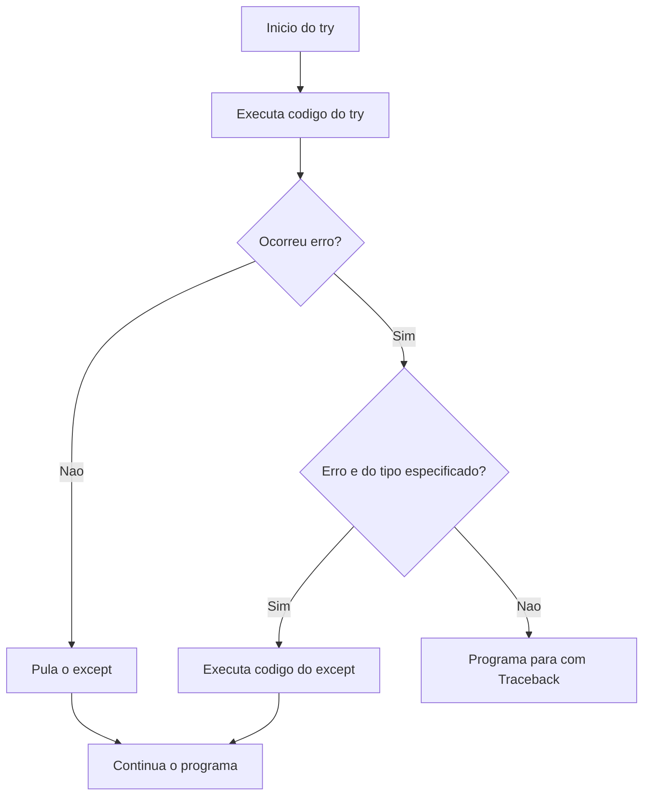

# 5.15 — Tratamento de Erros: try, except e Boas Práticas

[← Anterior: Debugging: Encontrando e Corrigindo Erros](cap05-mod14-debugging-conteudo.md) · [Próximo: Resolvendo Problemas com Algoritmos →](cap05-mod16-algoritmos-conteudo.md)

---

## Introdução

No módulo anterior, você aprendeu a **encontrar** erros. Agora vai aprender a **tratar** esses erros para que seu programa não pare de funcionar quando algo inesperado acontece.

Imagine que você está cozinhando e percebe que falta um ingrediente. Você tem duas opções: desistir da receita inteira (o programa para com erro) ou improvisar com o que tem (tratar o erro e continuar). O tratamento de erros é a segunda opção — você prepara o programa para lidar com situações inesperadas de forma elegante.

No módulo 5.14, vimos que erros de execução (como `ValueError`, `ZeroDivisionError`, `IndexError`) fazem o programa parar com um Traceback. Mas e se pudéssemos "capturar" esses erros antes que eles parem o programa? É exatamente isso que o `try` e `except` fazem.

Em Python, erros de execução são chamados de **exceções** (exceptions, em inglês). Uma exceção é um evento que interrompe o fluxo normal do programa. O tratamento de exceções permite que você intercepte esse evento e decida o que fazer — mostrar uma mensagem amigável, pedir os dados novamente, usar um valor padrão ou registrar o erro para análise posterior.

---

## Como Executar os Exemplos Deste Módulo

1. Copie o código e cole em um novo arquivo no VSCode
2. Salve na pasta `~/meus-projetos/python-curso/módulo-15/`
3. No terminal: `cd ~/meus-projetos/python-curso/módulo-15`
4. Execute: `python3 nome_do_arquivo.py`

---

## Erros de Sintaxe vs Exceções: Relembrando

No módulo anterior, vimos que existem três tipos de erros. Para o tratamento com `try`/`except`, precisamos distinguir claramente dois deles:

- **Erros de sintaxe** (`SyntaxError`): o Python detecta **antes** de executar. São erros de escrita — como esquecer um parêntese ou dois-pontos. **Não podem** ser tratados com `try`/`except` porque o programa nem chega a rodar.

- **Exceções** (erros de execução): acontecem **durante** a execução do programa. São situações inesperadas — como o usuário digitar texto quando o programa espera um número. **Podem** ser tratados com `try`/`except`.

Pense assim: erro de sintaxe é como uma receita escrita com palavras ilegíveis — você nem consegue começar a cozinhar. Exceção é como descobrir no meio da receita que o forno não liga — a receita está legível, mas algo deu errado durante a execução.

---

## A Estrutura Básica: try/except

A forma mais simples de tratar um erro:

```python
# Sem tratamento — o programa PARA se o usuario digitar texto
# "number" = numero
# number = int(input("Digite um numero: "))  # ValueError se digitar "abc"

# Com tratamento — o programa NAO para
try:
    # O bloco try contem o codigo que PODE gerar um erro
    # "number" = numero
    number = int(input("Digite um numero: "))
    print(f"Voce digitou: {number}")
except ValueError:
    # O bloco except executa APENAS se ocorrer o erro especificado
    # ValueError acontece quando a conversao de texto para numero falha
    print("Erro: voce nao digitou um numero valido!")

# O programa continua normalmente apos o try/except
print("Programa encerrado.")
```

**Se o usuário digitar "5":**
```
Digite um numero: 5
Voce digitou: 5
Programa encerrado.
```

**Se o usuário digitar "abc":**
```
Digite um numero: abc
Erro: voce nao digitou um numero valido!
Programa encerrado.
```

Observe que, nos dois casos, o programa chega até "Programa encerrado." — ele não para no meio. Sem o `try`/`except`, digitar "abc" faria o programa parar com um Traceback e a última linha nunca seria executada.

### Como o try/except funciona por dentro

```
try:
    codigo_que_pode_dar_erro    <-- Python tenta executar este codigo
except TipoDoErro:
    codigo_de_tratamento        <-- Se o erro especificado ocorrer, executa isto
```

O fluxo é:
1. Python tenta executar o código dentro do `try`
2. Se **nenhum erro** ocorrer, pula o `except` e continua normalmente
3. Se **ocorrer um erro** do tipo especificado, para o `try` e executa o `except`
4. Se ocorrer um erro de **tipo diferente** do especificado, o `except` não captura e o programa para normalmente



---

## Tratando Diferentes Tipos de Erro

Você pode ter vários blocos `except` para tratar diferentes tipos de erro. Cada bloco captura um tipo específico:

```python
# Calculadora de divisao com tratamento de multiplos erros
try:
    # "numerator" = numerador, "denominator" = denominador
    numerator = int(input("Numerador: "))
    denominator = int(input("Denominador: "))
    # "result" = resultado
    result = numerator / denominator
    print(f"Resultado: {result}")
except ValueError:
    # O usuario digitou algo que nao e numero
    print("Erro: digite apenas numeros inteiros!")
except ZeroDivisionError:
    # O usuario digitou 0 como denominador
    print("Erro: nao e possivel dividir por zero!")
```

**Se digitar 10 e 3:**
```
Numerador: 10
Denominador: 3
Resultado: 3.3333333333333335
```

**Se digitar 10 e "abc":**
```
Numerador: 10
Denominador: abc
Erro: digite apenas numeros inteiros!
```

**Se digitar 10 e 0:**
```
Numerador: 10
Denominador: 0
Erro: nao e possivel dividir por zero!
```

O Python verifica os blocos `except` de cima para baixo e executa o primeiro que corresponder ao tipo de erro. Apenas um bloco `except` é executado por vez.

### Tratando múltiplos tipos no mesmo except

Se você quer o mesmo tratamento para diferentes tipos de erro, use parênteses:

```python
try:
    # "value" = valor
    value = int(input("Numero: "))
    result = 100 / value
    print(f"Resultado: {result}")
except (ValueError, ZeroDivisionError):
    # Trata os dois tipos de erro da mesma forma
    print("Erro: entrada invalida! Digite um numero diferente de zero.")
```

---

## O Bloco else — Quando Não Há Erro

O bloco `else` executa **apenas quando nenhum erro ocorreu** no bloco `try`. É um bom lugar para código que depende do sucesso do `try`:

```python
try:
    # "age" = idade
    age = int(input("Sua idade: "))
except ValueError:
    print("Erro: digite um numero inteiro!")
else:
    # Este bloco executa APENAS se nao houve erro no try
    # Aqui temos certeza de que "age" e um numero inteiro valido
    print(f"Voce tem {age} anos.")
    if age >= 18:
        print("Voce e maior de idade.")
    else:
        print("Voce e menor de idade.")
```

**Se digitar "20":**
```
Sua idade: 20
Voce tem 20 anos.
Voce e maior de idade.
```

**Se digitar "abc":**
```
Sua idade: abc
Erro: digite um numero inteiro!
```

### Por que usar else em vez de colocar tudo no try?

Boa pergunta! Você poderia colocar o código do `else` dentro do `try`, e funcionaria. Mas usar `else` tem uma vantagem: se o código do `else` gerar um erro, esse erro **não** será capturado pelo `except`. Isso evita que você capture erros que não esperava.

```python
# Com else — erros no else NAO sao capturados pelo except
try:
    age = int(input("Sua idade: "))
except ValueError:
    print("Erro: digite um numero inteiro!")
else:
    # Se esta linha gerar um erro, ele NAO sera capturado acima
    # Isso e bom — queremos saber se algo inesperado aconteceu aqui
    print(f"Voce tem {age} anos.")
```

---

## O Bloco finally — Sempre Executa

O bloco `finally` executa **sempre**, independente de ter ocorrido erro ou não. É útil para ações de "limpeza" que precisam acontecer de qualquer forma:

```python
try:
    # "number" = numero
    number = int(input("Digite um numero: "))
    # "result" = resultado
    result = 100 / number
    print(f"Resultado: {result}")
except ValueError:
    print("Erro: digite um numero valido!")
except ZeroDivisionError:
    print("Erro: nao divida por zero!")
finally:
    # Este bloco SEMPRE executa, com ou sem erro
    # E como a etapa de "limpar a cozinha" — acontece independente
    # de a receita ter dado certo ou nao
    print("Operacao finalizada.")
```

**Se digitar "5":**
```
Resultado: 20.0
Operacao finalizada.
```

**Se digitar "0":**
```
Erro: nao divida por zero!
Operacao finalizada.
```

**Se digitar "abc":**
```
Erro: digite um numero valido!
Operacao finalizada.
```

Em todos os casos, "Operação finalizada." aparece. O `finally` é especialmente útil quando você precisa fechar arquivos, encerrar conexões com banco de dados ou liberar recursos — coisas que precisam acontecer independente de erros. Você vai usar muito isso nos capítulos 8 (Bancos de Dados) e 11 (APIs).

---

## Estrutura Completa: try/except/else/finally

Agora vamos ver todos os blocos juntos:

```python
try:
    # Codigo que pode gerar erro
    # "value" = valor
    value = int(input("Numero: "))
    result = 100 / value
except ValueError:
    # Executa se ValueError ocorrer
    print("Nao e um numero!")
except ZeroDivisionError:
    # Executa se ZeroDivisionError ocorrer
    print("Nao divida por zero!")
else:
    # Executa APENAS se nenhum erro ocorreu
    print(f"Resultado: {result}")
finally:
    # Executa SEMPRE (com ou sem erro)
    print("Fim da operacao.")
```

### Ordem de execução

| Situação | try | except | else | finally |
|----------|-----|--------|------|---------|
| Sem erro | Executa tudo | Pula | Executa | Executa |
| Com erro tratado | Para no erro | Executa o correspondente | Pula | Executa |
| Com erro não tratado | Para no erro | Pula (não corresponde) | Pula | Executa, depois programa para |

### Regras de combinação

Nem todos os blocos são obrigatórios. As combinações válidas são:

| Combinação | Válida? | Quando usar |
|-----------|---------|-------------|
| `try` + `except` | Sim | Caso mais comum |
| `try` + `except` + `else` | Sim | Quando tem código que depende do sucesso |
| `try` + `except` + `finally` | Sim | Quando precisa de limpeza |
| `try` + `except` + `else` + `finally` | Sim | Estrutura completa |
| `try` + `finally` (sem except) | Sim | Apenas limpeza, sem tratamento |
| `try` sozinho | Não | Precisa de pelo menos except ou finally |

---

## Padrão Essencial: Entrada Segura de Dados

Um dos usos mais comuns de `try`/`except` é pedir dados ao usuário repetidamente até que ele digite algo válido. Esse padrão combina `while True` (loop infinito) com `try`/`except` e `return` ou `break`:

```python
# Funcao que pede um numero inteiro de forma segura
# "safe_int_input" = entrada segura de inteiro
# "message" = mensagem a exibir
def safe_int_input(message):
    while True:
        try:
            # Tentamos converter a entrada para int
            # "value" = valor
            value = int(input(message))
            # Se chegou aqui, a conversao deu certo — retornamos o valor
            return value
        except ValueError:
            # Se deu erro, avisamos e o while repete (pede novamente)
            print("Valor invalido! Digite um numero inteiro.")

# Usando a funcao — o programa so continua quando o usuario digitar um numero valido
# "age" = idade
age = safe_int_input("Sua idade: ")
print(f"Idade registrada: {age}")
```

**Se o usuário digitar "abc", depois "xyz", depois "25":**
```
Sua idade: abc
Valor invalido! Digite um numero inteiro.
Sua idade: xyz
Valor invalido! Digite um numero inteiro.
Sua idade: 25
Idade registrada: 25
```

O programa não desiste — continua pedindo até receber um valor válido. Esse padrão é extremamente útil e você vai usá-lo em praticamente todo programa que recebe dados do usuário.

### Versão para float (números decimais)

```python
# "safe_float_input" = entrada segura de decimal
def safe_float_input(message):
    while True:
        try:
            value = float(input(message))
            return value
        except ValueError:
            print("Valor invalido! Digite um numero (use ponto para decimais).")

# "price" = preco
price = safe_float_input("Preco do produto: ")
print(f"Preco registrado: R$ {price:.2f}")
```

**Saída esperada:**
```
Preco do produto: abc
Valor invalido! Digite um numero (use ponto para decimais).
Preco do produto: 29.90
Preco registrado: R$ 29.90
```

### Versão com validação adicional (intervalo)

Podemos combinar tratamento de erro com validação de regras de negócio:

```python
# "safe_grade_input" = entrada segura de nota
def safe_grade_input(message):
    while True:
        try:
            value = float(input(message))
            # Validacao adicional: nota deve ser entre 0 e 10
            if value < 0 or value > 10:
                print("Erro: a nota deve ser entre 0 e 10.")
                continue  # Volta ao inicio do while
            return value
        except ValueError:
            print("Valor invalido! Digite um numero.")

# "grade" = nota
grade = safe_grade_input("Nota do aluno (0-10): ")
print(f"Nota registrada: {grade}")
```

**Saída esperada:**
```
Nota do aluno (0-10): abc
Valor invalido! Digite um numero.
Nota do aluno (0-10): 15
Erro: a nota deve ser entre 0 e 10.
Nota do aluno (0-10): 8.5
Nota registrada: 8.5
```

---

## Acessando a Mensagem de Erro

Às vezes você quer saber exatamente qual foi o erro para mostrar uma mensagem mais informativa. Use `as` para capturar a exceção em uma variável:

```python
try:
    # "number" = numero
    number = int(input("Digite um numero: "))
    result = 100 / number
    print(f"Resultado: {result}")
except ValueError as error:
    # A variavel "error" contem a mensagem de erro original
    print(f"Erro de valor: {error}")
except ZeroDivisionError as error:
    print(f"Erro de divisao: {error}")
```

**Se digitar "abc":**
```
Digite um numero: abc
Erro de valor: invalid literal for int() with base 10: 'abc'
```

**Se digitar "0":**
```
Digite um numero: 0
Erro de divisao: division by zero
```

A variável `error` contém a mensagem original do Python. Isso é útil para registrar erros em logs (registros) ou para mostrar detalhes técnicos quando necessário.

---

## O except Genérico: Quando Usar (e Quando Não Usar)

Você pode usar `except` sem especificar o tipo de erro para capturar **qualquer** exceção:

```python
# except generico — captura QUALQUER erro
try:
    # Codigo que pode gerar qualquer tipo de erro
    result = int(input("Numero: ")) / int(input("Divisor: "))
    print(f"Resultado: {result}")
except:
    print("Algo deu errado!")
```

Isso funciona, mas **não é recomendado**. Por quê?

1. **Esconde erros inesperados:** Se acontecer um erro que você não previu, o `except` genérico vai capturá-lo silenciosamente. Você nunca vai saber que o erro aconteceu.

2. **Dificulta o debugging:** Se o programa se comporta de forma estranha, você não sabe qual erro está sendo capturado.

3. **Captura erros do sistema:** O `except` genérico captura até erros como `KeyboardInterrupt` (quando o usuário pressiona Ctrl+C para parar o programa), impedindo que o usuário cancele a execução.

### A forma menos ruim: except Exception

Se você realmente precisa capturar vários tipos de erro, use `except Exception` em vez de `except` sozinho:

```python
try:
    result = int(input("Numero: ")) / int(input("Divisor: "))
    print(f"Resultado: {result}")
except Exception as error:
    # Captura quase todos os erros, mas nao KeyboardInterrupt
    print(f"Erro: {error}")
    print(f"Tipo: {type(error).__name__}")
```

`Exception` é a classe base de quase todas as exceções em Python. Ela captura `ValueError`, `ZeroDivisionError`, `TypeError` e outros, mas **não** captura `KeyboardInterrupt` e `SystemExit`, que são erros do sistema.

### Regra de ouro

Sempre que possível, especifique o tipo exato do erro que você espera. Use `except Exception` apenas como último recurso, e nunca use `except` sozinho sem tipo.

```python
# BOM — especifico
except ValueError:
    print("Numero invalido!")

# ACEITAVEL — quando precisa capturar varios tipos
except Exception as error:
    print(f"Erro inesperado: {error}")

# RUIM — generico demais, esconde problemas
except:
    print("Algo deu errado!")
```

---

## Exemplo Prático Completo: Calculadora Segura

Vamos juntar tudo que aprendemos em um programa completo — uma calculadora que trata todos os erros possíveis:

```python
# Calculadora segura com tratamento completo de erros
# "safe_float_input" = entrada segura de decimal
def safe_float_input(message):
    """Pede um numero decimal ao usuario ate receber um valor valido."""
    while True:
        try:
            return float(input(message))
        except ValueError:
            print("Erro: digite um numero valido (use ponto para decimais).")

# "calculate" = calcular
def calculate(num1, num2, operator):
    """Realiza o calculo baseado no operador."""
    if operator == "+":
        return num1 + num2
    elif operator == "-":
        return num1 - num2
    elif operator == "*":
        return num1 * num2
    elif operator == "/":
        if num2 == 0:
            print("Erro: divisao por zero!")
            return None
        return num1 / num2
    else:
        print(f"Erro: operador '{operator}' nao reconhecido.")
        return None

# "main" = principal
def main():
    """Funcao principal da calculadora."""
    print("=== Calculadora Segura ===")
    print("Operadores: + - * /")
    print("Digite 'sair' para encerrar.\n")

    while True:
        # "command" = comando
        command = input("Novo calculo? (s/n): ").strip().lower()
        if command == "n" or command == "sair":
            break

        # "num1" = primeiro numero, "num2" = segundo numero
        num1 = safe_float_input("Primeiro numero: ")
        # "operator" = operador
        operator = input("Operador (+, -, *, /): ").strip()
        num2 = safe_float_input("Segundo numero: ")

        # "result" = resultado
        result = calculate(num1, num2, operator)

        if result is not None:
            print(f"\n  {num1} {operator} {num2} = {result}\n")

    print("Calculadora encerrada. Ate mais!")

# Ponto de entrada
if __name__ == "__main__":
    main()
```

**Saída esperada:**
```
=== Calculadora Segura ===
Operadores: + - * /
Digite 'sair' para encerrar.

Novo calculo? (s/n): s
Primeiro numero: abc
Erro: digite um numero valido (use ponto para decimais).
Primeiro numero: 10
Operador (+, -, *, /): /
Segundo numero: 0
Erro: divisao por zero!
Novo calculo? (s/n): s
Primeiro numero: 10
Operador (+, -, *, /): *
Segundo numero: 3
  10.0 * 3.0 = 30.0

Novo calculo? (s/n): n
Calculadora encerrada. Ate mais!
```

Observe como o programa nunca para com erro — ele trata cada situação e continua funcionando. Essa é a marca de um programa bem feito.

---

## Boas Práticas no Tratamento de Erros

### 1. Trate apenas os erros que você espera

```python
# BOM — trata apenas o erro esperado
try:
    age = int(input("Idade: "))
except ValueError:
    print("Digite um numero!")

# RUIM — trata qualquer erro (pode esconder bugs)
try:
    age = int(input("Idade: "))
except:
    print("Algo deu errado!")
```

### 2. Mantenha o bloco try pequeno

Coloque apenas o código que pode gerar erro dentro do `try`. Quanto menor o bloco, mais fácil identificar qual operação causou o erro:

```python
# BOM — try pequeno e focado
try:
    age = int(input("Idade: "))
except ValueError:
    print("Digite um numero!")
else:
    # Codigo que depende do sucesso fica no else
    if age >= 18:
        print("Maior de idade")

# RUIM — try grande demais
try:
    age = int(input("Idade: "))
    if age >= 18:
        print("Maior de idade")
    # ... mais 20 linhas de codigo ...
except ValueError:
    print("Digite um numero!")
```

### 3. Não use try/except para controle de fluxo

`try`/`except` é para situações **excepcionais** — coisas que não deveriam acontecer no fluxo normal. Não use para substituir `if`/`else`:

```python
# RUIM — usando try/except como if/else
try:
    value = my_dict[key]
except KeyError:
    value = "padrao"

# BOM — usando .get() que ja trata o caso
value = my_dict.get(key, "padrao")
```

```python
# RUIM — usando try/except para verificar tipo
try:
    result = x + y
except TypeError:
    print("Tipos incompativeis")

# BOM — verificar antes
if isinstance(x, (int, float)) and isinstance(y, (int, float)):
    result = x + y
else:
    print("Tipos incompativeis")
```

### 4. Dê mensagens úteis ao usuário

```python
# RUIM — mensagem generica
except ValueError:
    print("Erro!")

# BOM — mensagem que ajuda o usuario a corrigir
except ValueError:
    print("Erro: digite apenas numeros inteiros (exemplo: 25).")
```

### 5. Registre erros para análise

Em programas profissionais, erros são registrados em arquivos de log para análise posterior. Por enquanto, um print com detalhes é suficiente:

```python
except Exception as error:
    print(f"Erro inesperado: {type(error).__name__}: {error}")
    # Em programas profissionais, isso iria para um arquivo de log
```

---

## Hierarquia de Exceções do Python

As exceções em Python são organizadas em uma hierarquia (como uma árvore genealógica). Conhecer essa hierarquia ajuda a entender quais exceções são capturadas por quais `except`:

```
BaseException
├── KeyboardInterrupt     <-- Ctrl+C
├── SystemExit            <-- sys.exit()
└── Exception             <-- Base de quase todas as excecoes
    ├── ValueError        <-- Valor invalido
    ├── TypeError         <-- Tipo errado
    ├── NameError         <-- Nome nao encontrado
    ├── IndexError        <-- Indice fora do alcance
    ├── KeyError          <-- Chave nao encontrada
    ├── ZeroDivisionError <-- Divisao por zero
    ├── FileNotFoundError <-- Arquivo nao encontrado
    ├── AttributeError    <-- Atributo inexistente
    └── ... (muitas outras)
```

Quando você usa `except Exception`, captura tudo que está abaixo de `Exception` na hierarquia. Quando usa `except ValueError`, captura apenas `ValueError` e suas subclasses.

---

## Como a IA pode te ajudar aqui


**Prompt 1 — Resolver problemas:**
> "Meu programa Python dá [tipo de erro] quando [situação]. Como trato esse erro com try/except?"

**Prompt 2 — Listar e descobrir:**
> "Quais erros podem acontecer quando uso [função/operação] em Python? Como trato cada um?"

**Prompt 3 — Revisar com a IA:**
> "Revise meu tratamento de erros neste código: [cole o código]. Estou tratando todos os casos?"

---

## Casos de Uso no Mundo Real

### Formulários web e validação de dados

Quando você preenche um formulário na internet — cadastro em um site, compra online, formulário de contato — o sistema por trás usa tratamento de erros extensivamente. Se você digita um e-mail sem "@", um CEP com letras ou uma data impossível como 31 de fevereiro, o sistema captura esses erros e mostra mensagens amigáveis em vez de travar. Empresas como o Mercado Livre e a Amazon processam milhões de formulários por dia, e cada campo tem tratamento de erros para garantir que dados inválidos não entrem no sistema.

### Aplicativos de banco e pagamento

Quando você faz uma transferência pelo aplicativo do banco, dezenas de verificações acontecem nos bastidores. O sistema trata erros como: saldo insuficiente, conta de destino inexistente, limite diário excedido, timeout de conexão. Cada um desses erros é capturado e tratado com uma mensagem específica para o usuário. Se o sistema não tratasse esses erros, uma transferência com saldo insuficiente poderia travar o aplicativo inteiro em vez de simplesmente mostrar "Saldo insuficiente".

### Jogos e aplicativos móveis

Jogos como Minecraft e aplicativos como o WhatsApp usam tratamento de erros para lidar com situações como perda de conexão com a internet, memória insuficiente ou arquivos corrompidos. Quando o Minecraft não consegue carregar um mundo salvo, ele mostra uma mensagem de erro em vez de fechar o jogo inteiro. Isso é tratamento de exceções em ação.

---

## Resumo do Módulo

| Conceito | Descrição |
|----------|-----------|
| Exceção | Erro que ocorre durante a execução do programa |
| `try` | Bloco que contém código que pode gerar erro |
| `except` | Bloco que trata um tipo específico de erro |
| `else` | Bloco que executa apenas quando não há erro no try |
| `finally` | Bloco que executa sempre, com ou sem erro |
| `as` | Captura a exceção em uma variável para acessar a mensagem |
| Entrada segura | Padrão while + try/except para validar dados do usuário |
| `Exception` | Classe base de quase todas as exceções em Python |

---

## Glossário do Módulo

| Termo | Definição |
|-------|-----------|
| as | Palavra-chave que captura a exceção em uma variável |
| BaseException | Classe raiz de todas as exceções em Python |
| Capturar (catch) | Interceptar uma exceção com except antes que pare o programa |
| else (em try) | Bloco que executa apenas quando nenhum erro ocorreu no try |
| Exceção (Exception) | Erro que ocorre durante a execução do programa |
| except | Bloco que define o tratamento para um tipo específico de erro |
| finally | Bloco que executa sempre, independente de erros |
| Hierarquia de exceções | Organização em árvore das classes de exceção do Python |
| KeyboardInterrupt | Exceção gerada quando o usuário pressiona Ctrl+C |
| Log | Registro de eventos e erros de um programa para análise |
| Propagação | Quando uma exceção não tratada sobe para quem chamou a função |
| raise | Palavra-chave para gerar uma exceção manualmente |
| try | Bloco que contém código que pode gerar uma exceção |
| Validação | Processo de verificar se dados atendem a critérios esperados |

---

## Na Cultura Popular

- **Matrix** (filme, 1999) — quando Neo vê o "glitch" do gato preto passando duas vezes, é essencialmente um "erro de execução" na simulação. A Matrix trata a maioria dos erros silenciosamente, mas alguns escapam e são percebidos como déjà vu. Na programação, erros não tratados também podem causar comportamentos estranhos que os usuários percebem.

- **O Exterminador do Futuro 2** (filme, 1991) — o Terminator T-800 tem um sistema que detecta e trata erros em tempo real. Quando recebe dano, seus sistemas internos identificam o problema e tentam compensar. É uma versão cinematográfica do try/except: detectar o problema e continuar funcionando.

---

## Para Saber Mais

- [Documentação Python — Erros e Exceções](https://docs.python.org/pt-br/3/tutorial/errors.html) — *Referência oficial completa sobre tratamento de erros*
- [W3Schools — Python Try Except](https://www.w3schools.com/python/python_try_except.asp) — *Tutorial interativo com exemplos práticos*
- [Real Python — Exception Handling](https://realpython.com/python-exceptions/) — *Guia aprofundado sobre exceções em Python (em inglês)*
- [Python Built-in Exceptions](https://docs.python.org/3/library/exceptions.html) — *Lista completa de exceções do Python (em inglês)*
- [GitHub do Fino](https://github.com/RafaelFino) — *Repositórios de referência do curso*

---

## Perguntas Frequentes (FAQ)

**P: O que é uma exceção?**
R: É um erro que acontece durante a execução do programa. Quando uma exceção ocorre e não é tratada, o programa para com um Traceback. Com try/except, você pode capturar a exceção e decidir o que fazer.

**P: Qual a diferença entre erro de sintaxe e exceção?**
R: Erro de sintaxe é detectado antes da execução — o Python nem consegue rodar o programa. Exceção acontece durante a execução — o programa começa a rodar e para quando encontra o problema. Só exceções podem ser tratadas com try/except.

**P: Posso tratar qualquer tipo de erro com try/except?**
R: Quase todos os erros de execução (exceções) podem ser tratados. Erros de sintaxe não podem ser tratados com try/except porque o programa nem chega a executar.

**P: O que acontece se eu não especificar o tipo de erro no except?**
R: `except:` sem tipo captura qualquer exceção. Isso funciona, mas não é recomendado porque pode esconder erros que você não esperava. Sempre especifique o tipo de erro quando possível.

**P: Posso ter vários except?**
R: Sim. Você pode ter quantos blocos except precisar, cada um tratando um tipo diferente de erro. O Python verifica de cima para baixo e executa o primeiro que corresponder.

**P: O else é obrigatório?**
R: Não, é opcional. Use quando tiver código que só deve executar se o try foi bem-sucedido.

**P: O finally é obrigatório?**
R: Não, é opcional. Use quando precisar garantir que algo aconteça independente de erros — como fechar um arquivo ou uma conexão.

**P: Posso ter try dentro de try?**
R: Sim, mas tente evitar. Try/except aninhados tornam o código confuso. Prefira tratar cada erro no nível adequado.

**P: O que é "capturar" uma exceção?**
R: É interceptar um erro com except antes que ele pare o programa. Quando você captura uma exceção, decide o que fazer com ela em vez de deixar o programa parar.

**P: Posso acessar a mensagem de erro dentro do except?**
R: Sim. Use `except ValueError as e:` — a variável `e` conterá a mensagem de erro. Exemplo: `print(f"Erro: {e}")`.

**P: Devo usar try/except em todo o código?**
R: Não. Use apenas onde erros são esperados — como entrada de dados do usuário, operações com arquivos ou divisões. Usar try/except em excesso torna o código difícil de ler.

**P: O que é "raise"?**
R: É uma palavra-chave que permite gerar uma exceção manualmente. Exemplo: `raise ValueError("Preco inválido")`. É útil para validação de dados em funções. Você vai usar mais isso em capítulos futuros.

**P: O que acontece se o erro não for do tipo especificado no except?**
R: O except não captura e o erro "sobe" — o programa para com a mensagem de erro normal. Por isso é importante especificar os tipos corretos.

**P: É normal ter dificuldade com try/except no início?**
R: Sim. Saber quando e onde usar try/except vem com experiência. Comece tratando os erros mais óbvios (como entrada de dados) e vá expandindo conforme se sentir confortável.

---

## Exercícios Práticos

Os exercícios completos estão no arquivo separado:

**[Acessar Exercícios do Módulo 5.15](cap05-mod15-tratamento-erros-exercicios.md)**

Prévia:

### Exercício rápido 1 — Entrada segura

Crie uma função que pede ao usuário um número entre 1 e 100, tratando erros de tipo e de intervalo.

### Exercício rápido 2 — Calculadora robusta

Crie uma calculadora que trata todos os erros possíveis e nunca para com Traceback.

---

[← Anterior: Debugging: Encontrando e Corrigindo Erros](cap05-mod14-debugging-conteudo.md) · [Próximo: Resolvendo Problemas com Algoritmos →](cap05-mod16-algoritmos-conteudo.md)
