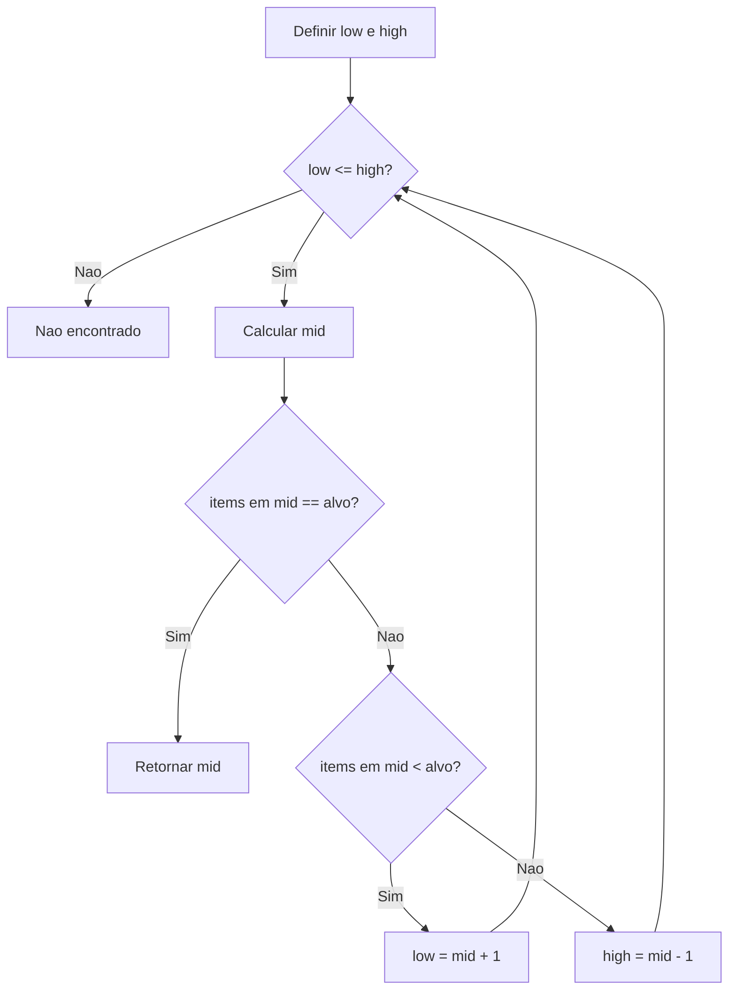

# 5.16 — Resolvendo Problemas com Algoritmos

[← Anterior: Tratamento de Erros: try, except e Boas Práticas](cap05-mod15-tratamento-erros-conteudo.md) · [Próximo: Noções de Complexidade: Big O →](cap05-mod17-big-o-conteudo.md)

---

## Introdução

Nos módulos anteriores, você aprendeu todas as ferramentas fundamentais da programação: variáveis, condicionais, loops, funções, coleções, estrutura de programa, debugging e tratamento de erros. Agora é hora de juntar tudo isso para resolver problemas reais.

Um **algoritmo** é uma sequência de passos bem definidos para resolver um problema. Você já usa algoritmos no dia a dia sem perceber: uma receita de bolo é um algoritmo (passos para transformar ingredientes em bolo), as instruções para montar um móvel são um algoritmo, e até o caminho que você faz de casa até o trabalho é um algoritmo (sequência de decisões: vire à direita, siga em frente, vire à esquerda).

A palavra "algoritmo" vem do nome do matemático persa **Al-Khwarizmi** (Muhammad ibn Musa al-Khwarizmi), que viveu no século IX em Bagdá. Ele escreveu um livro sobre métodos sistemáticos para resolver equações matemáticas. A tradução latina do seu nome — "Algoritmi" — deu origem à palavra que usamos até hoje. Al-Khwarizmi não inventou a ideia de seguir passos para resolver problemas (isso é tão antigo quanto a humanidade), mas foi o primeiro a formalizar e documentar esses métodos de forma sistemática.

Neste módulo, vamos aprender a pensar algoritmicamente — ou seja, a decompor problemas em passos menores e traduzir esses passos em código Python.

---

## Como Executar os Exemplos Deste Módulo

1. Copie o código e cole em um novo arquivo no VSCode
2. Salve na pasta `~/meus-projetos/python-curso/módulo-16/`
3. No terminal: `cd ~/meus-projetos/python-curso/módulo-16`
4. Execute: `python3 nome_do_arquivo.py`

---

## O que é Pensar Algoritmicamente?

Pensar algoritmicamente é a habilidade de pegar um problema grande e confuso e transformá-lo em uma sequência de passos pequenos e claros que um computador pode executar. É como ser um tradutor: você traduz o problema do "idioma humano" para o "idioma do computador".

Essa habilidade tem três partes:

### 1. Decomposição — Dividir o problema em partes menores

Imagine que alguém te pede: "Faça um sistema de cadastro de alunos." Isso é um problema grande e vago. Mas se você decompor:

- Pedir os dados do aluno (nome, idade, notas)
- Armazenar os dados em algum lugar
- Permitir listar todos os alunos
- Permitir buscar um aluno pelo nome
- Permitir editar dados de um aluno
- Permitir remover um aluno

Agora cada parte é um problema menor e mais fácil de resolver. Essa técnica se chama **decomposição** — quebrar um problema grande em problemas menores.

### 2. Reconhecimento de padrões — Identificar o que se repete

Depois de decompor, você percebe que muitas partes seguem padrões similares. "Listar todos os alunos" e "buscar um aluno" são variações do mesmo padrão: percorrer uma lista e mostrar informações. "Editar" e "remover" são variações de: encontrar um item e fazer algo com ele.

Reconhecer padrões permite reutilizar soluções. Se você sabe percorrer uma lista para buscar, sabe percorrer para listar, para filtrar, para contar.

### 3. Abstração — Focar no que importa, ignorar detalhes

Quando você está resolvendo o problema de "buscar um aluno pelo nome", não precisa se preocupar com como os dados são armazenados internamente na memória do computador. Você abstrai esse detalhe e foca no que importa: percorrer a lista e comparar nomes.

Abstração é a habilidade de separar o essencial do acessório. É como dirigir um carro: você não precisa entender como o motor funciona para dirigir — você abstrai o motor e foca no volante, nos pedais e no câmbio.

---

## Algoritmos Clássicos: Busca

Buscar um item em uma coleção de dados é um dos problemas mais fundamentais da computação. Existem várias formas de fazer isso, e cada uma tem vantagens e desvantagens.

### Busca Linear (Sequential Search)

A forma mais simples: percorrer todos os itens, um por um, até encontrar o que procura. É como procurar uma palavra em um livro lendo página por página, do início ao fim.

```python
# Busca linear — percorre todos os itens ate encontrar
# "linear_search" = busca linear
# "items" = itens, "target" = alvo (o que estamos procurando)
def linear_search(items, target):
    for i in range(len(items)):
        if items[i] == target:
            return i  # Retorna a posicao onde encontrou
    return -1  # Retorna -1 se nao encontrou

# "numbers" = numeros
numbers = [45, 12, 78, 34, 56, 23, 89, 67]

# "position" = posicao
position = linear_search(numbers, 34)
if position != -1:
    print(f"Numero 34 encontrado na posicao {position}")
else:
    print("Numero 34 nao encontrado")

position = linear_search(numbers, 99)
if position != -1:
    print(f"Numero 99 encontrado na posicao {position}")
else:
    print("Numero 99 nao encontrado")
```

**Saída esperada:**
```
Numero 34 encontrado na posicao 3
Numero 99 nao encontrado
```

A busca linear é simples e funciona com qualquer lista (ordenada ou não). Mas tem um problema: se a lista tem 1 milhão de itens e o que você procura está no final, precisa verificar todos os 1 milhão de itens. No pior caso, verifica todos os elementos.

### Busca Binária (Binary Search)

Se a lista estiver **ordenada** (do menor para o maior), existe uma forma muito mais eficiente: a busca binária. A ideia é dividir a lista pela metade a cada passo, eliminando metade dos candidatos de uma vez.

É como procurar uma palavra no dicionário. Você não lê página por página — abre no meio, vê se a palavra que procura vem antes ou depois, e vai para a metade correspondente. Repete até encontrar.

O fluxo da busca binaria segue esta logica de decisao:



```python
# Busca binaria — so funciona em listas ORDENADAS
# "binary_search" = busca binaria
def binary_search(items, target):
    # "low" = limite inferior, "high" = limite superior
    low = 0
    high = len(items) - 1

    # "steps" = passos (para contar quantas comparacoes fez)
    steps = 0

    while low <= high:
        steps += 1
        # "mid" = meio — calcula a posicao do meio
        mid = (low + high) // 2  # // e divisao inteira

        if items[mid] == target:
            print(f"  Encontrado em {steps} passos!")
            return mid
        elif items[mid] < target:
            # O alvo e maior — descarta a metade inferior
            low = mid + 1
        else:
            # O alvo e menor — descarta a metade superior
            high = mid - 1

    print(f"  Nao encontrado apos {steps} passos.")
    return -1

# Lista ORDENADA de numeros
numbers = [3, 7, 12, 18, 23, 34, 45, 56, 67, 78, 89, 95]
print(f"Lista com {len(numbers)} elementos: {numbers}\n")

print("Buscando 34:")
position = binary_search(numbers, 34)
print(f"Posicao: {position}\n")

print("Buscando 99:")
position = binary_search(numbers, 99)
print(f"Posicao: {position}")
```

**Saída esperada:**
```
Lista com 12 elementos: [3, 7, 12, 18, 23, 34, 45, 56, 67, 78, 89, 95]

Buscando 34:
  Encontrado em 3 passos!
Posicao: 5

Buscando 99:
  Nao encontrado apos 4 passos.
Posicao: -1
```

Em uma lista de 12 elementos, a busca binária encontrou o número em apenas 3 passos. A busca linear precisaria de até 12 passos. A diferença fica ainda mais impressionante com listas grandes:

| Tamanho da lista | Busca Linear (pior caso) | Busca Binária (pior caso) |
|-----------------|-------------------------|--------------------------|
| 10 | 10 comparações | 4 comparações |
| 100 | 100 comparações | 7 comparações |
| 1.000 | 1.000 comparações | 10 comparações |
| 1.000.000 | 1.000.000 comparações | 20 comparações |
| 1.000.000.000 | 1.000.000.000 comparações | 30 comparações |

Com 1 bilhão de itens, a busca linear precisa de até 1 bilhão de comparações. A busca binária precisa de no máximo 30. Essa é a diferença entre um algoritmo eficiente e um ineficiente.

### Comparação: Linear vs Binária

| Característica | Busca Linear | Busca Binária |
|---------------|-------------|---------------|
| Lista precisa estar ordenada? | Não | Sim |
| Simplicidade | Muito simples | Mais complexa |
| Velocidade (lista pequena) | Rápida | Rápida |
| Velocidade (lista grande) | Lenta | Muito rápida |
| Quando usar | Listas pequenas ou não ordenadas | Listas grandes e ordenadas |

---

## Algoritmos Clássicos: Ordenação

Ordenar dados é outro problema fundamental. Quando você ordena uma lista de nomes em ordem alfabética, uma lista de preços do menor para o maior, ou uma lista de datas da mais antiga para a mais recente, está usando um algoritmo de ordenação.

### Bubble Sort (Ordenação por Bolha)

O algoritmo mais simples de entender (mas não o mais eficiente). A ideia é percorrer a lista várias vezes, comparando pares de elementos vizinhos e trocando-os se estiverem na ordem errada. Os maiores valores "borbulham" para o final da lista, como bolhas subindo na água.

```python
# Bubble Sort — ordenacao por bolha
# "bubble_sort" = ordenacao por bolha
def bubble_sort(items):
    # Fazemos uma copia para nao alterar a lista original
    # "sorted_items" = itens ordenados
    sorted_items = items.copy()
    # "n" = tamanho da lista
    n = len(sorted_items)
    # "swaps" = trocas (para contar)
    swaps = 0

    for i in range(n):
        for j in range(0, n - i - 1):
            # Compara vizinhos
            if sorted_items[j] > sorted_items[j + 1]:
                # Troca se estao na ordem errada
                sorted_items[j], sorted_items[j + 1] = sorted_items[j + 1], sorted_items[j]
                swaps += 1

    print(f"  Ordenado com {swaps} trocas")
    return sorted_items

# "numbers" = numeros
numbers = [64, 34, 25, 12, 22, 11, 90]
print(f"Original: {numbers}")
# "sorted_numbers" = numeros ordenados
sorted_numbers = bubble_sort(numbers)
print(f"Ordenado: {sorted_numbers}")
```

**Saída esperada:**
```
Original: [64, 34, 25, 12, 22, 11, 90]
  Ordenado com 12 trocas
Ordenado: [11, 12, 22, 25, 34, 64, 90]
```

### Selection Sort (Ordenação por Seleção)

Outro algoritmo simples: encontra o menor elemento e coloca na primeira posição, depois encontra o segundo menor e coloca na segunda posição, e assim por diante. É como organizar cartas de baralho na mão — você procura a menor, coloca na frente, procura a próxima menor, coloca em seguida.

```python
# Selection Sort — ordenacao por selecao
# "selection_sort" = ordenacao por selecao
def selection_sort(items):
    sorted_items = items.copy()
    n = len(sorted_items)

    for i in range(n):
        # "min_index" = indice do menor elemento
        min_index = i
        for j in range(i + 1, n):
            if sorted_items[j] < sorted_items[min_index]:
                min_index = j

        # Troca o menor encontrado com a posicao atual
        sorted_items[i], sorted_items[min_index] = sorted_items[min_index], sorted_items[i]

    return sorted_items

numbers = [64, 34, 25, 12, 22, 11, 90]
print(f"Original:  {numbers}")
print(f"Ordenado:  {selection_sort(numbers)}")
```

**Saída esperada:**
```
Original:  [64, 34, 25, 12, 22, 11, 90]
Ordenado:  [11, 12, 22, 25, 34, 64, 90]
```

### A função sorted() do Python

Na prática, você raramente vai implementar algoritmos de ordenação do zero. O Python tem a função `sorted()` que usa um algoritmo muito eficiente chamado **Timsort** (criado por Tim Peters em 2002, especificamente para Python):

```python
# Usando sorted() — a forma pratica
numbers = [64, 34, 25, 12, 22, 11, 90]

# Ordem crescente (padrao)
print(sorted(numbers))

# Ordem decrescente
print(sorted(numbers, reverse=True))

# Ordenar strings por ordem alfabetica
# "names" = nomes
names = ["Carlos", "Ana", "Bruno", "Diana"]
print(sorted(names))

# Ordenar por criterio customizado — por tamanho do nome
print(sorted(names, key=len))
```

**Saída esperada:**
```
[11, 12, 22, 25, 34, 64, 90]
[90, 64, 34, 25, 22, 12, 11]
['Ana', 'Bruno', 'Carlos', 'Diana']
['Ana', 'Bruno', 'Diana', 'Carlos']
```

Então por que aprender Bubble Sort e Selection Sort se o Python já tem `sorted()`? Porque entender como algoritmos de ordenação funcionam desenvolve o pensamento algorítmico. No capítulo 7 (Estruturas de Dados com C), vamos aprofundar muito mais esses algoritmos.

---

## Resolvendo Problemas: O Método dos 4 Passos

Quando você recebe um problema para resolver com código, siga estes 4 passos:

### Passo 1 — Entender o problema

Antes de escrever qualquer código, certifique-se de que entendeu o problema completamente:
- O que o programa recebe como entrada?
- O que deve produzir como saída?
- Quais são os casos especiais (lista vazia, número negativo, texto vazio)?
- Existe alguma restrição (tamanho máximo, tipos permitidos)?

### Passo 2 — Planejar a solução (pseudocódigo)

Escreva a solução em português antes de escrever em Python. Isso se chama **pseudocódigo** — uma descrição informal dos passos do algoritmo:

```
Problema: encontrar o maior número em uma lista

Pseudocodigo:
1. Pegar o primeiro numero da lista como "maior ate agora"
2. Para cada numero restante na lista:
   a. Se esse numero e maior que o "maior ate agora":
      - Atualizar "maior ate agora" com esse numero
3. Retornar "maior ate agora"
```

### Passo 3 — Implementar em código

Traduza o pseudocódigo para Python:

```python
# "find_max" = encontrar maximo
# "numbers" = numeros
def find_max(numbers):
    if len(numbers) == 0:
        return None  # Lista vazia, nao tem maximo

    # Passo 1: pegar o primeiro como "maior ate agora"
    # "max_value" = valor maximo
    max_value = numbers[0]

    # Passo 2: percorrer os restantes
    for number in numbers[1:]:  # [1:] pula o primeiro
        if number > max_value:
            max_value = number

    # Passo 3: retornar
    return max_value

# Testando
print(find_max([3, 7, 2, 9, 4]))  # 9
print(find_max([100]))             # 100
print(find_max([-5, -2, -8]))      # -2
print(find_max([]))                # None
```

**Saída esperada:**
```
9
100
-2
None
```

### Passo 4 — Testar e refinar

Teste com vários casos:
- Caso normal: lista com vários números
- Caso mínimo: lista com 1 elemento
- Caso especial: lista vazia
- Caso com negativos: todos os números negativos
- Caso com repetições: vários números iguais

---

## Problemas Clássicos Resolvidos

Vamos aplicar o método dos 4 passos em problemas clássicos de programação.

### Problema 1: Contar ocorrências

**Problema:** Dada uma lista de palavras, contar quantas vezes cada palavra aparece.

```python
# "count_occurrences" = contar ocorrencias
# "words" = palavras
def count_occurrences(words):
    # "counts" = contagens
    counts = {}
    for word in words:
        # "lower_word" = palavra em minusculo
        lower_word = word.lower()
        if lower_word in counts:
            counts[lower_word] += 1
        else:
            counts[lower_word] = 1
    return counts

# "text_words" = palavras do texto
text_words = ["Python", "e", "legal", "python", "e", "facil", "Python", "e", "poderoso"]
# "result" = resultado
result = count_occurrences(text_words)

for word, count in result.items():
    print(f"  '{word}': {count} vez(es)")
```

**Saída esperada:**
```
  'python': 3 vez(es)
  'e': 3 vez(es)
  'legal': 1 vez(es)
  'facil': 1 vez(es)
  'poderoso': 1 vez(es)
```

### Problema 2: Verificar palíndromo

**Problema:** Verificar se uma palavra é um palíndromo (lê-se igual de trás para frente).

```python
# "is_palindrome" = e palindromo
# "text" = texto
def is_palindrome(text):
    # Remove espacos e converte para minusculo
    # "clean" = limpo
    clean = text.lower().replace(" ", "")
    # Compara o texto com ele mesmo invertido
    # "reversed_text" = texto invertido
    reversed_text = clean[::-1]  # [::-1] inverte a string
    return clean == reversed_text

# Testando
# "words" = palavras para testar
words = ["arara", "Python", "ovo", "ana", "casa", "reviver", "radar"]
for word in words:
    if is_palindrome(word):
        print(f"  '{word}' E palindromo")
    else:
        print(f"  '{word}' NAO e palindromo")
```

**Saída esperada:**
```
  'arara' E palindromo
  'Python' NAO e palindromo
  'ovo' E palindromo
  'ana' E palindromo
  'casa' NAO e palindromo
  'reviver' E palindromo
  'radar' E palindromo
```

### Problema 3: Fibonacci

A sequência de Fibonacci é uma das mais famosas da matemática. Cada número é a soma dos dois anteriores: 0, 1, 1, 2, 3, 5, 8, 13, 21, 34...

Essa sequência aparece na natureza em espirais de conchas, pétalas de flores e até na proporção áurea usada em arte e arquitetura.

```python
# "fibonacci" = gerar sequencia de fibonacci
# "n" = quantidade de numeros a gerar
def fibonacci(n):
    if n <= 0:
        return []
    if n == 1:
        return [0]

    # "sequence" = sequencia
    sequence = [0, 1]
    for i in range(2, n):
        # Proximo numero = soma dos dois anteriores
        # "next_number" = proximo numero
        next_number = sequence[i - 1] + sequence[i - 2]
        sequence.append(next_number)

    return sequence

# Gerar os primeiros 15 numeros de Fibonacci
# "fib" = fibonacci
fib = fibonacci(15)
print(f"Fibonacci (15 primeiros): {fib}")

# Mostrar como cada numero e calculado
print("\nComo cada numero e calculado:")
for i in range(2, len(fib)):
    print(f"  {fib[i-2]} + {fib[i-1]} = {fib[i]}")
```

**Saída esperada:**
```
Fibonacci (15 primeiros): [0, 1, 1, 2, 3, 5, 8, 13, 21, 34, 55, 89, 144, 233, 377]

Como cada numero e calculado:
  0 + 1 = 1
  1 + 1 = 2
  1 + 2 = 3
  2 + 3 = 5
  3 + 5 = 8
  5 + 8 = 13
  8 + 13 = 21
  13 + 21 = 34
  21 + 34 = 55
  34 + 55 = 89
  55 + 89 = 144
  89 + 144 = 233
  144 + 233 = 377
```

### Problema 4: Números primos

Um número primo é divisível apenas por 1 e por ele mesmo. Verificar se um número é primo é um problema clássico:

```python
# "is_prime" = e primo
def is_prime(n):
    if n < 2:
        return False
    if n == 2:
        return True
    if n % 2 == 0:
        return False  # Par maior que 2 nao e primo

    # Verifica divisores impares ate a raiz quadrada de n
    # "i" = divisor candidato
    i = 3
    while i * i <= n:
        if n % i == 0:
            return False
        i += 2  # Pula pares (ja verificamos)

    return True

# Encontrar todos os primos ate 50
print("Numeros primos ate 50:")
# "primes" = primos
primes = []
for number in range(2, 51):
    if is_prime(number):
        primes.append(number)

print(primes)
print(f"Total: {len(primes)} numeros primos")
```

**Saída esperada:**
```
Numeros primos ate 50:
[2, 3, 5, 7, 11, 13, 17, 19, 23, 29, 31, 37, 41, 43, 47]
Total: 15 numeros primos
```

---

## Padrões Algorítmicos Comuns

Depois de resolver muitos problemas, você percebe que certos padrões aparecem repetidamente. Reconhecer esses padrões acelera muito a resolução de novos problemas.

### Padrão 1: Acumulador

Percorrer uma coleção acumulando um resultado (soma, contagem, concatenação):

```python
# Padrao acumulador — somar todos os numeros
# "numbers" = numeros
numbers = [10, 20, 30, 40, 50]
# "total" = total (acumulador)
total = 0
for number in numbers:
    total += number
print(f"Soma: {total}")  # 150
```

**Saída esperada:**
```
Soma: 150
```

### Padrão 2: Filtro

Percorrer uma coleção selecionando apenas os itens que atendem a um critério:

```python
# Padrao filtro — selecionar apenas numeros pares
numbers = [1, 2, 3, 4, 5, 6, 7, 8, 9, 10]
# "even_numbers" = numeros pares
even_numbers = []
for number in numbers:
    if number % 2 == 0:
        even_numbers.append(number)
print(f"Pares: {even_numbers}")  # [2, 4, 6, 8, 10]
```

**Saída esperada:**
```
Pares: [2, 4, 6, 8, 10]
```

### Padrão 3: Transformação (Map)

Percorrer uma coleção transformando cada item:

```python
# Padrao transformacao — converter temperaturas de Celsius para Fahrenheit
# "celsius_temps" = temperaturas em celsius
celsius_temps = [0, 10, 20, 30, 40, 100]
# "fahrenheit_temps" = temperaturas em fahrenheit
fahrenheit_temps = []
for temp in celsius_temps:
    # Formula: F = C * 9/5 + 32
    fahrenheit_temps.append(temp * 9/5 + 32)
print(f"Celsius:    {celsius_temps}")
print(f"Fahrenheit: {fahrenheit_temps}")
```

**Saída esperada:**
```
Celsius:    [0, 10, 20, 30, 40, 100]
Fahrenheit: [32.0, 50.0, 68.0, 86.0, 104.0, 212.0]
```

### Padrão 4: Encontrar (Find)

Percorrer uma coleção procurando um item específico:

```python
# Padrao encontrar — buscar o primeiro numero maior que 50
numbers = [12, 34, 56, 78, 23, 45]
# "found" = encontrado
found = None
for number in numbers:
    if number > 50:
        found = number
        break  # Para no primeiro encontrado

if found is not None:
    print(f"Primeiro maior que 50: {found}")
else:
    print("Nenhum numero maior que 50")
```

**Saída esperada:**
```
Primeiro maior que 50: 56
```

### Padrão 5: Agrupar

Organizar itens em grupos baseados em algum critério:

```python
# Padrao agrupar — separar numeros em pares e impares
numbers = [1, 2, 3, 4, 5, 6, 7, 8, 9, 10]
# "groups" = grupos
groups = {"pares": [], "impares": []}

for number in numbers:
    if number % 2 == 0:
        groups["pares"].append(number)
    else:
        groups["impares"].append(number)

print(f"Pares:   {groups['pares']}")
print(f"Impares: {groups['impares']}")
```

**Saída esperada:**
```
Pares:   [2, 4, 6, 8, 10]
Impares: [1, 3, 5, 7, 9]
```

---

## Como a IA pode te ajudar aqui


**Prompt 1 — Pedir ajuda prática:**
> "Preciso resolver este problema: [descreva o problema]. Pode me ajudar a pensar nos passos do algoritmo antes de escrever código?"

**Prompt 2 — Otimizar o código:**
> "Existe um algoritmo mais eficiente para [problema específico]? O meu está lento com listas grandes."

**Prompt 3 — Listar e descobrir:**
> "Quais são os casos especiais que devo testar para [problema]?"

---

## Casos de Uso no Mundo Real

### Algoritmos de busca no Google

Quando você pesquisa algo no Google, algoritmos de busca percorrem bilhões de páginas web para encontrar as mais relevantes. O Google não usa busca linear (seria impossível verificar bilhões de páginas uma por uma). Usa estruturas de dados sofisticadas (índices invertidos) e algoritmos de ranking (como o PageRank, criado por Larry Page e Sergey Brin em 1998) para retornar resultados em milissegundos. A base conceitual é a mesma que você aprendeu aqui — busca e ordenação — mas em escala massiva.

### Algoritmos de recomendação na Netflix e Spotify

Quando a Netflix sugere um filme ou o Spotify sugere uma música, algoritmos analisam padrões no seu histórico e comparam com milhões de outros usuários. O padrão "agrupar" que vimos é a base: usuários são agrupados por preferências similares, e o que um grupo gostou é recomendado para outros do mesmo grupo. Esses algoritmos processam bilhões de dados usando os mesmos conceitos fundamentais de busca, filtro e agrupamento.

### Algoritmos de ordenação em e-commerce

Quando você ordena produtos por preço no Mercado Livre ou na Amazon, um algoritmo de ordenação é executado. Com milhões de produtos, a eficiência do algoritmo importa — um Bubble Sort demoraria minutos, enquanto algoritmos eficientes como Timsort (o mesmo que o Python usa) fazem isso em milissegundos.

---

## Resumo do Módulo

| Conceito | Descrição |
|----------|-----------|
| Algoritmo | Sequência de passos bem definidos para resolver um problema |
| Decomposição | Dividir um problema grande em partes menores |
| Pseudocódigo | Descrição informal dos passos de um algoritmo em linguagem natural |
| Busca linear | Percorrer todos os itens um por um até encontrar |
| Busca binária | Dividir a lista pela metade a cada passo (requer lista ordenada) |
| Bubble Sort | Ordenação por comparação de vizinhos e troca |
| Selection Sort | Ordenação por seleção do menor elemento |
| Padrão acumulador | Percorrer acumulando um resultado |
| Padrão filtro | Percorrer selecionando itens por critério |
| Padrão transformação | Percorrer transformando cada item |

---

## Glossário do Módulo

| Termo | Definição |
|-------|-----------|
| Abstração | Focar no essencial e ignorar detalhes irrelevantes |
| Al-Khwarizmi | Matemático persa do século IX, origem da palavra "algoritmo" |
| Algoritmo | Sequência finita de passos para resolver um problema |
| Binary Search | Busca binária — divide a lista pela metade a cada passo |
| Bubble Sort | Algoritmo de ordenação que compara e troca vizinhos |
| Decomposição | Técnica de dividir um problema grande em partes menores |
| Fibonacci | Sequência onde cada número é a soma dos dois anteriores |
| Linear Search | Busca linear — percorre todos os itens sequencialmente |
| Número primo | Número divisível apenas por 1 e por ele mesmo |
| Palíndromo | Palavra ou frase que se lê igual de trás para frente |
| Padrão algorítmico | Solução reutilizável para um tipo recorrente de problema |
| Pseudocódigo | Descrição informal de um algoritmo em linguagem natural |
| Selection Sort | Algoritmo de ordenação que seleciona o menor a cada passo |
| sorted() | Função do Python que ordena usando o algoritmo Timsort |
| Timsort | Algoritmo de ordenação eficiente usado pelo Python |

---

## Na Cultura Popular

- **O Jogo da Imitação** (filme, 2014) — Alan Turing e sua equipe desenvolvem algoritmos para decifrar o código Enigma na Segunda Guerra Mundial. O filme mostra como a decomposição de um problema aparentemente impossível em partes menores levou à solução.

- **A Rede Social** (filme, 2010) — mostra Mark Zuckerberg criando o FaceMash, que usava um algoritmo de comparação (similar ao que vimos em ordenação) para classificar fotos. O algoritmo Elo Rating, originalmente criado para xadrez, foi adaptado para o sistema.

- **Moneyball** (filme, 2011) — o gerente do Oakland Athletics usa algoritmos estatísticos para montar um time de baseball competitivo com orçamento limitado. É um exemplo real de como algoritmos de análise de dados podem resolver problemas que parecem impossíveis.

---

## Para Saber Mais

- [Visualgo — Visualização de Algoritmos](https://visualgo.net/) — *Site interativo que mostra algoritmos funcionando passo a passo*
- [Documentação Python — Sorting HOW TO](https://docs.python.org/pt-br/3/howto/sorting.html) — *Guia oficial sobre ordenação em Python*
- [Khan Academy — Algoritmos](https://pt.khanacademy.org/computing/computer-science/algorithms) — *Curso gratuito sobre algoritmos com visualizações*
- [GitHub do Fino](https://github.com/RafaelFino) — *Repositórios de referência do curso*

---

## Perguntas Frequentes (FAQ)

**P: O que é um algoritmo?**
R: É uma sequência de passos bem definidos para resolver um problema. Uma receita de bolo é um algoritmo. Instruções para chegar a um endereço são um algoritmo. Em programação, é a lógica que transforma entrada em saída.

**P: Preciso decorar os algoritmos de busca e ordenação?**
R: Não precisa decorar o código de cor. O importante é entender a lógica por trás de cada um — como funciona, quando usar e por que um é melhor que outro em certas situações.

**P: Se o Python já tem sorted(), por que aprender Bubble Sort?**
R: Porque entender como algoritmos funcionam por dentro desenvolve o pensamento algorítmico. É como aprender a fazer conta de mão antes de usar calculadora — o entendimento é mais importante que a ferramenta.

**P: O que é pseudocódigo?**
R: É uma descrição informal dos passos de um algoritmo, escrita em linguagem natural (português, por exemplo). Não é código de verdade — é um rascunho que ajuda a planejar antes de programar.

**P: Busca binária é sempre melhor que busca linear?**
R: Não. Busca binária exige que a lista esteja ordenada. Se a lista não está ordenada, você precisaria ordená-la primeiro, o que pode ser mais caro do que fazer uma busca linear. Para listas pequenas, a diferença é insignificante.

**P: O que é "dividir para conquistar"?**
R: É uma estratégia algorítmica que divide o problema em subproblemas menores, resolve cada um separadamente e combina os resultados. A busca binária é um exemplo: divide a lista pela metade a cada passo.

**P: Como sei qual algoritmo usar para um problema?**
R: Com experiência. Quanto mais problemas você resolver, mais padrões vai reconhecer. Comece identificando o tipo de problema (busca, ordenação, contagem, agrupamento) e aplique o padrão correspondente.

**P: Algoritmos são só para programação?**
R: Não. Algoritmos existem em todas as áreas: medicina (protocolos de diagnóstico), culinária (receitas), logística (rotas de entrega), finanças (cálculos de juros). Programação é apenas uma forma de automatizar algoritmos.

**P: O que é eficiência de um algoritmo?**
R: É a quantidade de recursos (tempo e memória) que o algoritmo usa para resolver o problema. Um algoritmo eficiente resolve o problema rapidamente mesmo com muitos dados. Vamos aprofundar isso no próximo módulo sobre Big O.

**P: Posso criar meus próprios algoritmos?**
R: Sim, e você já fez isso nos exercícios anteriores. Todo programa que você escreve é um algoritmo. Com o tempo, você vai criar algoritmos cada vez mais sofisticados.

---

## Exercícios Práticos

Os exercícios completos estão no arquivo separado:

**[Acessar Exercícios do Módulo 5.16](cap05-mod16-algoritmos-exercicios.md)**

Prévia:

### Exercício rápido 1 — Encontrar o segundo maior

Crie uma função que encontra o segundo maior número em uma lista, sem usar sorted().

### Exercício rápido 2 — Remover duplicatas

Crie uma função que remove itens duplicados de uma lista, mantendo a ordem original.

---

[← Anterior: Tratamento de Erros: try, except e Boas Práticas](cap05-mod15-tratamento-erros-conteudo.md) · [Próximo: Noções de Complexidade: Big O →](cap05-mod17-big-o-conteudo.md)
