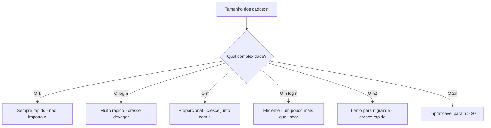

# 5.17 — Noções de Complexidade: Big O

[← Anterior: Resolvendo Problemas com Algoritmos](cap05-mod16-algoritmos-conteudo.md) · [Próximo: Usando IA para Aprender: Prompts para Programação →](cap05-mod18-ia-para-programacao-conteudo.md)

---

## Introdução

No módulo anterior, você viu que a busca linear precisa de até 1 milhão de comparações para encontrar um item em uma lista de 1 milhão de elementos, enquanto a busca binária precisa de no máximo 20. Mas como expressamos essa diferença de forma precisa? Como comparamos a eficiência de dois algoritmos sem precisar testá-los com dados reais?

A resposta é a **notação Big O** (lê-se "Big Oh" ou "Grande O"). É uma forma matemática de descrever como o tempo de execução de um algoritmo cresce conforme a quantidade de dados aumenta. Não mede o tempo em segundos — mede o **comportamento** do algoritmo quando os dados crescem.

Pense assim: se você tem uma lista com 10 itens, qualquer algoritmo é rápido. A diferença aparece quando a lista tem 10 mil, 1 milhão ou 1 bilhão de itens. Big O descreve essa tendência de crescimento.

A notação foi introduzida pelo matemático alemão Paul Bachmann em 1894 e popularizada por Edmund Landau no início do século XX. Na computação, foi adotada por Donald Knuth nos anos 1960 em sua obra monumental "The Art of Computer Programming" (A Arte da Programação de Computadores), que é considerada a bíblia da ciência da computação.

Neste módulo, vamos entender as complexidades mais comuns de forma intuitiva, sem fórmulas matemáticas complexas. O objetivo é que você consiga olhar para um código e ter uma noção de quão eficiente ele é.

---

## Como Executar os Exemplos Deste Módulo

1. Copie o código e cole em um novo arquivo no VSCode
2. Salve na pasta `~/meus-projetos/python-curso/módulo-17/`
3. No terminal: `cd ~/meus-projetos/python-curso/módulo-17`
4. Execute: `python3 nome_do_arquivo.py`

---

## A Ideia Central: Como o Tempo Cresce?

Big O não mede o tempo exato de execução. Mede como o tempo **cresce** quando a quantidade de dados aumenta. A pergunta que Big O responde é: "Se eu dobrar a quantidade de dados, o que acontece com o tempo?"

Vamos usar uma analogia. Imagine que você precisa encontrar o nome de uma pessoa em uma lista:

- **Lista com 10 nomes:** qualquer método é rápido — menos de 1 segundo
- **Lista com 1.000 nomes:** métodos ruins começam a ficar lentos
- **Lista com 1.000.000 nomes:** a diferença entre métodos bons e ruins é enorme

Big O descreve essa relação entre "quantidade de dados" e "tempo necessário". Usamos a letra **n** para representar a quantidade de dados.

---

## As Complexidades Mais Comuns

### O(1) — Tempo Constante

O tempo não muda, independente da quantidade de dados. Não importa se a lista tem 10 ou 10 milhões de itens — a operação leva o mesmo tempo.

Analogia: abrir uma gaveta específica de um armário. Não importa quantas gavetas o armário tem — você vai direto na que precisa.

```python
# O(1) — acesso direto por indice
# "numbers" = numeros
numbers = [10, 20, 30, 40, 50]

# Acessar o terceiro elemento — sempre 1 operacao
# "third" = terceiro
third = numbers[2]
print(f"Terceiro elemento: {third}")

# Acessar o tamanho da lista — sempre 1 operacao
# "size" = tamanho
size = len(numbers)
print(f"Tamanho: {size}")

# Acessar uma chave no dicionario — sempre 1 operacao (em media)
# "student" = estudante
student = {"name": "Ana", "age": 20}
print(f"Nome: {student['name']}")
```

**Saída esperada:**
```
Terceiro elemento: 30
Tamanho: 5
Nome: Ana
```

Operações O(1) comuns:
- Acessar um elemento por índice: `lista[5]`
- Acessar uma chave no dicionário: `dicionário["chave"]`
- Verificar o tamanho: `len(lista)`
- Adicionar ao final: `lista.append(item)`

### O(n) — Tempo Linear

O tempo cresce proporcionalmente à quantidade de dados. Se a lista dobra de tamanho, o tempo dobra. Se triplica, o tempo triplica.

Analogia: ler um livro página por página. Um livro de 200 páginas leva o dobro do tempo de um livro de 100 páginas.

```python
# O(n) — percorrer todos os elementos
# "numbers" = numeros
numbers = [45, 12, 78, 34, 56, 23, 89, 67]

# Busca linear — no pior caso, verifica todos os n elementos
# "target" = alvo
target = 89
# "found" = encontrado
found = False
# "steps" = passos
steps = 0

for number in numbers:
    steps += 1
    if number == target:
        found = True
        break

print(f"Encontrou {target}: {found} (em {steps} passos de {len(numbers)} possiveis)")
```

**Saída esperada:**
```
Encontrou 89: True (em 7 passos de 8 possiveis)
```

Operações O(n) comuns:
- Busca linear (percorrer a lista)
- Somar todos os elementos
- Encontrar o maior/menor
- Verificar se um item existe: `item in lista`
- Imprimir todos os elementos

### O(n²) — Tempo Quadrático

O tempo cresce com o quadrado da quantidade de dados. Se a lista dobra, o tempo quadruplica. Se triplica, o tempo multiplica por 9.

Analogia: em uma festa com n pessoas, cada pessoa cumprimenta todas as outras. Com 10 pessoas, são 100 cumprimentos. Com 100 pessoas, são 10.000 cumprimentos.

```python
# O(n^2) — dois loops aninhados
# "numbers" = numeros
numbers = [5, 3, 8, 1, 9, 2]
# "comparisons" = comparacoes
comparisons = 0

# Bubble Sort — compara cada par de vizinhos, varias vezes
# "n" = tamanho
n = len(numbers)
# "sorted_nums" = numeros ordenados
sorted_nums = numbers.copy()

for i in range(n):
    for j in range(0, n - i - 1):
        comparisons += 1
        if sorted_nums[j] > sorted_nums[j + 1]:
            sorted_nums[j], sorted_nums[j + 1] = sorted_nums[j + 1], sorted_nums[j]

print(f"Lista original: {numbers}")
print(f"Lista ordenada: {sorted_nums}")
print(f"Comparacoes: {comparisons} (lista de {n} elementos)")
```

**Saída esperada:**
```
Lista original: [5, 3, 8, 1, 9, 2]
Lista ordenada: [1, 2, 3, 5, 8, 9]
Comparacoes: 15 (lista de 6 elementos)
```

Operações O(n²) comuns:
- Bubble Sort, Selection Sort
- Dois loops aninhados percorrendo a mesma lista
- Comparar cada elemento com todos os outros

### O(log n) — Tempo Logarítmico

O tempo cresce muito devagar conforme os dados aumentam. Cada vez que os dados dobram, o tempo aumenta apenas 1 passo.

Analogia: procurar uma palavra no dicionário. Você abre no meio, vê se a palavra vem antes ou depois, e vai para a metade correspondente. A cada passo, elimina metade das possibilidades.

Para entender o logaritmo de forma simples: **log₂(n) é quantas vezes você precisa dividir n por 2 até chegar a 1**. Exemplo: log₂(8) = 3, porque 8 / 2 = 4, 4 / 2 = 2, 2 / 2 = 1 (3 divisões).

```python
# O(log n) — busca binaria
# "numbers" = numeros (lista ORDENADA)
numbers = list(range(1, 101))  # [1, 2, 3, ..., 100]

# "binary_search" = busca binaria
def binary_search(items, target):
    low = 0
    high = len(items) - 1
    steps = 0

    while low <= high:
        steps += 1
        mid = (low + high) // 2
        if items[mid] == target:
            return steps
        elif items[mid] < target:
            low = mid + 1
        else:
            high = mid - 1
    return steps

# Buscar o numero 73 em uma lista de 100 elementos
# "steps" = passos
steps = binary_search(numbers, 73)
print(f"Busca binaria em lista de {len(numbers)} elementos: {steps} passos")

# Comparar com lista de 10.000 elementos
big_numbers = list(range(1, 10001))
steps = binary_search(big_numbers, 7300)
print(f"Busca binaria em lista de {len(big_numbers)} elementos: {steps} passos")
```

**Saída esperada:**
```
Busca binaria em lista de 100 elementos: 5 passos
Busca binaria em lista de 10000 elementos: 12 passos
```

100x mais dados, mas apenas 2.4x mais passos. Essa é a magia do O(log n).

### O(n log n) — Tempo Log-Linear

É a complexidade dos melhores algoritmos de ordenação (como Timsort, Merge Sort e Quick Sort). Cresce um pouco mais que linear, mas muito menos que quadrático.

```python
# O(n log n) — sorted() do Python usa Timsort
import random

# Gerar lista aleatoria
# "random_numbers" = numeros aleatorios
random_numbers = [random.randint(1, 1000) for _ in range(20)]
print(f"Original: {random_numbers[:10]}...")  # Mostra os 10 primeiros

# sorted() e O(n log n)
# "sorted_numbers" = numeros ordenados
sorted_numbers = sorted(random_numbers)
print(f"Ordenado: {sorted_numbers[:10]}...")
```

**Saída esperada (valores variam por ser aleatório):**
```
Original: [423, 187, 892, 45, 671, 234, 567, 89, 345, 712]...
Ordenado: [45, 89, 187, 234, 345, 423, 567, 671, 712, 892]...
```

---

## Tabela Comparativa: O Impacto Real

Para entender o impacto prático, veja quantas operações cada complexidade precisa para diferentes tamanhos de dados:

| n (dados) | O(1) | O(log n) | O(n) | O(n log n) | O(n²) |
|-----------|------|----------|------|------------|-------|
| 10 | 1 | 3 | 10 | 33 | 100 |
| 100 | 1 | 7 | 100 | 664 | 10.000 |
| 1.000 | 1 | 10 | 1.000 | 9.966 | 1.000.000 |
| 10.000 | 1 | 13 | 10.000 | 132.877 | 100.000.000 |
| 1.000.000 | 1 | 20 | 1.000.000 | 19.931.569 | 1.000.000.000.000 |

Se cada operação leva 1 microssegundo (0,000001 segundo):

| n | O(n) | O(n²) |
|---|------|-------|
| 1.000 | 0,001 segundo | 1 segundo |
| 10.000 | 0,01 segundo | 100 segundos |
| 100.000 | 0,1 segundo | 2,8 horas |
| 1.000.000 | 1 segundo | 11,6 dias |

Com 1 milhão de itens, um algoritmo O(n) leva 1 segundo. Um algoritmo O(n²) leva quase 12 dias. Essa é a diferença que Big O mede.

---


### Visualizando o Crescimento

Para entender visceralmente a diferença entre as complexidades, imagine que você está organizando uma festa e precisa fazer tarefas com diferentes números de convidados:

**O(1) — Constante: Abrir a porta da festa**
Não importa se tem 10 ou 10.000 convidados — abrir a porta leva o mesmo tempo. Uma operação, sempre.

**O(log n) — Logarítmico: Encontrar alguém em uma lista alfabética**
Se a lista tem 1.000 nomes, você abre no meio, vê se o nome está antes ou depois, e repete. Em ~10 passos, encontra qualquer pessoa entre 1.000. Em ~20 passos, encontra entre 1.000.000. Cada passo elimina metade das possibilidades.

**O(n) — Linear: Cumprimentar cada convidado**
Se tem 100 convidados, cumprimenta 100 vezes. Se tem 1.000, cumprimenta 1.000 vezes. O trabalho cresce na mesma proporção que o número de convidados.

**O(n log n) — Log-linear: Organizar os convidados em ordem alfabética**
Mais trabalho que apenas cumprimentar (O(n)), mas muito menos que comparar todos com todos (O(n²)). É o custo de algoritmos eficientes de ordenação como o merge sort.

**O(n²) — Quadrático: Cada convidado cumprimenta todos os outros**
Com 10 convidados, são 100 cumprimentos. Com 100 convidados, são 10.000. Com 1.000, são 1.000.000. O trabalho explode rapidamente.

**O(2ⁿ) — Exponencial: Testar todas as combinações de pratos do buffet**
Se o buffet tem 10 pratos, são 1.024 combinações possíveis. Com 20 pratos, são mais de 1 milhão. Com 30 pratos, mais de 1 bilhão. Cada item novo dobra o número de combinações.



### Por que O(n²) é Tão Problemático?

Vamos ver um exemplo concreto. Imagine que você tem uma lista de preços e quer encontrar todos os pares de produtos cuja soma é exatamente R$ 100:

```python
# Abordagem O(n2) — compara cada produto com todos os outros
# "prices" = precos
prices = [30, 70, 45, 55, 20, 80, 10, 90, 60, 40]

# "pairs" = pares encontrados
pairs = []
for i in range(len(prices)):
    for j in range(i + 1, len(prices)):
        if prices[i] + prices[j] == 100:
            pairs.append((prices[i], prices[j]))

print("Pares que somam 100:")
for pair in pairs:
    print(f"  R$ {pair[0]} + R$ {pair[1]}")
```

Saída esperada:

```
Pares que somam 100:
  R$ 30 + R$ 70
  R$ 45 + R$ 55
  R$ 20 + R$ 80
  R$ 10 + R$ 90
  R$ 60 + R$ 40
```

Com 10 preços, o loop interno roda ~45 vezes. Rápido. Mas com 10.000 preços, roda ~50 milhões de vezes. Com 1 milhão de preços, roda ~500 bilhões de vezes — levaria dias.

Existe uma solução O(n) para esse mesmo problema usando um conjunto (set):

```python
# Abordagem O(n) — usa conjunto para busca rapida
# "prices" = precos
prices = [30, 70, 45, 55, 20, 80, 10, 90, 60, 40]
# "target" = valor alvo
target = 100

# "seen" = valores ja vistos
seen = set()
# "pairs" = pares encontrados
pairs = []

for price in prices:
    # "complement" = complemento (quanto falta para chegar ao alvo)
    complement = target - price
    if complement in seen:
        pairs.append((complement, price))
    seen.add(price)

print("Pares que somam 100:")
for pair in pairs:
    print(f"  R$ {pair[0]} + R$ {pair[1]}")
```

Saída esperada:

```
Pares que somam 100:
  R$ 30 + R$ 70
  R$ 45 + R$ 55
  R$ 20 + R$ 80
  R$ 10 + R$ 90
  R$ 60 + R$ 40
```

O resultado é o mesmo, mas a segunda versão percorre a lista uma única vez. Com 1 milhão de preços, faz 1 milhão de operações em vez de 500 bilhões. A diferença entre esperar 1 segundo e esperar dias.

O truque é usar um `set` (conjunto), onde a busca `in` é O(1) — constante. Em vez de comparar cada preço com todos os outros, para cada preço você calcula o complemento (100 - preço) e verifica se já viu esse complemento antes. Uma passada só.

### Armadilhas Comuns com Complexidade

#### Armadilha 1: Loops escondidos

Algumas operações que parecem simples escondem loops internos:

```python
# Parece O(n), mas e O(n2)!
# "names" = nomes
names = ["Ana", "Pedro", "Maria", "Ana", "Carlos", "Maria"]

# "unique" = nomes unicos
unique = []
for name in names:
    if name not in unique:  # "not in" em lista e O(n)!
        unique.append(name)
```

Saída esperada: nenhuma (exemplo conceitual)

O `not in` em uma lista percorre a lista inteira para verificar se o elemento existe. Dentro de um loop, isso transforma O(n) em O(n²). A solução é usar um `set`:

```python
# Versao O(n) — usa set para busca rapida
# "names" = nomes
names = ["Ana", "Pedro", "Maria", "Ana", "Carlos", "Maria"]

# "unique" = nomes unicos (set elimina duplicatas automaticamente)
unique = list(set(names))
```

Saída esperada: nenhuma (exemplo conceitual)

#### Armadilha 2: Concatenação de strings em loop

```python
# O(n2) escondido — cada += cria uma string nova!
# "result" = resultado
result = ""
for i in range(10000):
    result += str(i) + ", "
# Cada += copia toda a string anterior + o novo pedaco
```

Saída esperada: nenhuma (exemplo conceitual)

Strings em Python são imutáveis — cada `+=` cria uma string completamente nova, copiando todo o conteúdo anterior. Com 10.000 iterações, o Python copia cada vez mais dados. A solução é usar uma lista e `join`:

```python
# O(n) — acumula em lista e junta no final
# "parts" = partes
parts = []
for i in range(10000):
    parts.append(str(i))
# "result" = resultado
result = ", ".join(parts)
# join percorre a lista uma vez e cria a string final
```

Saída esperada: nenhuma (exemplo conceitual)

#### Armadilha 3: Ordenar dentro de um loop

```python
# O(n2 log n) — ordena a lista inteira a cada iteracao!
# "data" = dados
data = [5, 3, 8, 1, 9, 2, 7]
for i in range(len(data)):
    data.sort()  # O(n log n) executado n vezes = O(n2 log n)
    # ... faz algo com data[i]
```

Saída esperada: nenhuma (exemplo conceitual)

Se você precisa da lista ordenada, ordene uma vez antes do loop:

```python
# O(n log n + n) = O(n log n) — ordena uma vez, depois percorre
# "data" = dados
data = [5, 3, 8, 1, 9, 2, 7]
data.sort()  # ordena uma vez: O(n log n)
for item in data:  # percorre uma vez: O(n)
    # ... faz algo com item
    pass
```

Saída esperada: nenhuma (exemplo conceitual)

---

### Big O na Prática: Quando se Preocupar?

Nem sempre a complexidade importa. Se você está processando 50 itens, a diferença entre O(n) e O(n²) é irrelevante — 50 operações vs 2.500 operações, ambas instantâneas.

A complexidade começa a importar quando:

| Situação | Tamanho típico | Complexidade importa? |
|----------|---------------|----------------------|
| Lista de compras pessoal | 10-50 itens | Não — qualquer algoritmo serve |
| Contatos do celular | 100-500 | Pouco — mas busca eficiente ajuda |
| Produtos de uma loja online | 1.000-100.000 | Sim — O(n²) já é perceptível |
| Posts de uma rede social | 1.000.000+ | Muito — O(n²) é inviável |
| Registros de um banco de dados | 10.000.000+ | Crítico — cada operação conta |

A regra prática é: se `n` pode crescer além de 1.000, pense na complexidade. Se `n` é sempre pequeno (menos de 100), não se preocupe — escreva o código mais legível.

Donald Knuth, um dos maiores cientistas da computação, disse uma frase famosa: "A otimização prematura é a raiz de todo o mal." Isso significa: primeiro faça funcionar, depois faça funcionar rápido — e só otimize quando tiver evidência de que a performance é um problema real.
## Como Identificar a Complexidade do Seu Código

Regras práticas para identificar a complexidade olhando para o código:

### Sem loop = O(1)

```python
# O(1) — operacoes diretas, sem loop
x = lista[0]           # Acesso por indice
d = dicionario["key"]  # Acesso por chave
lista.append(item)     # Adicionar ao final
```

### Um loop = O(n)

```python
# O(n) — um loop percorrendo n elementos
for item in lista:     # Percorre n elementos
    print(item)        # Operacao O(1) dentro do loop
```

### Dois loops aninhados = O(n²)

```python
# O(n^2) — loop dentro de loop
for i in lista:        # Percorre n elementos
    for j in lista:    # Para CADA i, percorre n elementos
        print(i, j)    # Total: n * n = n^2
```

### Loop que divide pela metade = O(log n)

```python
# O(log n) — divide o problema pela metade a cada passo
while n > 1:
    n = n // 2         # Divide por 2 a cada iteracao
```

### Loop com sorted() dentro = O(n² log n) ou pior

```python
# Cuidado! sorted() dentro de um loop
for item in lista:           # O(n)
    sorted_list = sorted(lista)  # O(n log n) a cada iteracao!
# Total: O(n * n log n) = O(n^2 log n) — muito lento!
```

---

## Complexidade de Operações Comuns em Python

| Operação | Lista | Dicionário |
|----------|-------|------------|
| Acessar por índice/chave | O(1) | O(1) |
| Buscar um item (`in`) | O(n) | O(1) |
| Adicionar ao final (`append`) | O(1) | O(1) |
| Inserir no início (`insert(0, x)`) | O(n) | — |
| Remover do final (`pop()`) | O(1) | — |
| Remover do início (`pop(0)`) | O(n) | — |
| Ordenar (`sorted()`) | O(n log n) | — |
| Tamanho (`len()`) | O(1) | O(1) |

Observe que buscar um item em uma lista é O(n), mas em um dicionário é O(1). Essa é uma das razões pelas quais dicionários são tão úteis — quando você precisa buscar dados frequentemente, use dicionários em vez de listas.

---

## Exemplo Prático: Escolhendo o Algoritmo Certo

Imagine que você tem uma lista de 100.000 produtos e precisa verificar se um produto específico existe. Vamos comparar três abordagens:

```python
import time

# Gerar lista grande de produtos
# "products" = produtos
products_list = [f"produto_{i}" for i in range(100000)]
# "target" = alvo (produto que estamos buscando)
target = "produto_99999"  # Ultimo da lista (pior caso)

# Abordagem 1: Busca em lista — O(n)
# "start" = inicio
start = time.time()
for _ in range(100):  # Repete 100 vezes para medir melhor
    found = target in products_list
# "end" = fim
end = time.time()
print(f"Busca em lista:       {(end - start) * 1000:.1f} ms (100 buscas)")

# Abordagem 2: Converter para conjunto (set) e buscar — O(1) por busca
# "products_set" = conjunto de produtos
products_set = set(products_list)  # Conversao e O(n), mas so faz uma vez
start = time.time()
for _ in range(100):
    found = target in products_set
end = time.time()
print(f"Busca em conjunto:    {(end - start) * 1000:.1f} ms (100 buscas)")

# Abordagem 3: Converter para dicionario e buscar — O(1) por busca
# "products_dict" = dicionario de produtos
products_dict = {p: True for p in products_list}
start = time.time()
for _ in range(100):
    found = target in products_dict
end = time.time()
print(f"Busca em dicionario:  {(end - start) * 1000:.1f} ms (100 buscas)")
```

**Saída esperada (tempos aproximados):**
```
Busca em lista:       350.0 ms (100 buscas)
Busca em conjunto:    0.1 ms (100 buscas)
Busca em dicionario:  0.1 ms (100 buscas)
```

A busca em lista é milhares de vezes mais lenta que em conjunto ou dicionário. Essa é a diferença entre O(n) e O(1) na prática.

---


---

## Medindo Performance na Prática

Além de analisar a complexidade olhando para o código, você pode medir o tempo real de execução. Python tem um módulo chamado `time` que permite cronometrar trechos de código:

```python
# Medindo o tempo de execucao de dois algoritmos
import time

# "generate_list" = gerar lista
def generate_list(size):
    """Gera uma lista de numeros aleatorios."""
    import random
    return [random.randint(1, 10000) for _ in range(size)]

# "has_duplicate_slow" = tem duplicata (versao lenta)
def has_duplicate_slow(numbers):
    """Verifica duplicatas com O(n2) — compara cada par."""
    for i in range(len(numbers)):
        for j in range(i + 1, len(numbers)):
            if numbers[i] == numbers[j]:
                return True
    return False

# "has_duplicate_fast" = tem duplicata (versao rapida)
def has_duplicate_fast(numbers):
    """Verifica duplicatas com O(n) — usa conjunto."""
    # "seen" = numeros ja vistos
    seen = set()
    for num in numbers:
        if num in seen:
            return True
        seen.add(num)
    return False

# Testar com diferentes tamanhos
for size in [100, 1000, 5000, 10000]:
    # "data" = dados de teste
    data = generate_list(size)

    # Medir versao lenta
    # "start" = inicio
    start = time.time()
    has_duplicate_slow(data)
    # "slow_time" = tempo da versao lenta
    slow_time = time.time() - start

    # Medir versao rapida
    start = time.time()
    has_duplicate_fast(data)
    # "fast_time" = tempo da versao rapida
    fast_time = time.time() - start

    print(f"n={size:>6}: O(n2)={slow_time:.4f}s  O(n)={fast_time:.6f}s")
```

Saída esperada (valores aproximados — variam a cada execução):

```
n=   100: O(n2)=0.0003s  O(n)=0.000010s
n=  1000: O(n2)=0.0250s  O(n)=0.000080s
n=  5000: O(n2)=0.6200s  O(n)=0.000400s
n= 10000: O(n2)=2.5000s  O(n)=0.000800s
```

Observe como a versão O(n²) fica dramaticamente mais lenta conforme `n` cresce, enquanto a versão O(n) permanece quase instantânea. Com 10.000 itens, a diferença já é de 3.000 vezes. Com 1 milhão de itens, a versão O(n²) levaria horas.

### A Diferença entre Teoria e Prática

Big O é uma medida teórica — ela ignora constantes e fatores menores. Na prática, um algoritmo O(n) com constante alta pode ser mais lento que um O(n²) com constante baixa para valores pequenos de `n`. Por exemplo:

| n | O(n) com constante 1000 | O(n²) com constante 1 |
|---|------------------------|----------------------|
| 10 | 10.000 | 100 |
| 100 | 100.000 | 10.000 |
| 1.000 | 1.000.000 | 1.000.000 |
| 10.000 | 10.000.000 | 100.000.000 |

Para n < 1.000, o algoritmo O(n²) é mais rápido neste exemplo. Mas a partir de n = 1.000, o O(n) ultrapassa e a diferença só cresce. É por isso que Big O importa para dados grandes — ele descreve o comportamento a longo prazo.

Na prática, a regra é: para dados pequenos (n < 100), use o código mais simples e legível. Para dados grandes (n > 1.000), pense na complexidade.

No próximo módulo, vamos explorar como usar Inteligência Artificial como ferramenta de aprendizado — com prompts práticos para debugging, explicação de código, geração de exercícios e muito mais.
## Como a IA pode te ajudar aqui


**Prompt 1 — Aprofundar o tema:**
> "Qual é a complexidade Big O deste código? [cole o código]"

**Prompt 2 — Otimizar o código:**
> "Meu programa está lento com listas grandes. Aqui está o código: [cole]. Como posso melhorar a eficiência?"

**Prompt 3 — Explorar o conceito:**
> "Explique a diferença entre O(n) e O(n²) com um exemplo prático que eu possa rodar."

---

## Casos de Uso no Mundo Real

### Busca no Google

O Google indexa bilhões de páginas web. Se usasse busca linear O(n) para cada pesquisa, levaria horas para retornar resultados. Em vez disso, usa estruturas de dados com busca O(1) e O(log n) — índices invertidos e árvores de busca — para retornar resultados em milissegundos. A escolha do algoritmo certo é o que torna o Google possível.

### Redes sociais e feeds

Quando o Instagram monta seu feed, precisa ordenar milhares de posts por relevância. Usa algoritmos O(n log n) para ordenação e O(1) para acessar dados de cada post. Se usasse O(n²), o feed demoraria minutos para carregar em vez de segundos.

### Jogos em tempo real

Jogos como Fortnite precisam processar colisões entre centenas de objetos 60 vezes por segundo. Verificar colisão de cada objeto com todos os outros seria O(n²) — impossível em tempo real. Em vez disso, usam estruturas espaciais (como quadtrees) que reduzem para O(n log n), permitindo que o jogo rode suavemente.

---

## Resumo do Módulo

| Complexidade | Nome | Comportamento | Exemplo |
|-------------|------|---------------|---------|
| O(1) | Constante | Não muda com n | Acesso por índice |
| O(log n) | Logarítmico | Cresce muito devagar | Busca binária |
| O(n) | Linear | Cresce proporcionalmente | Busca linear |
| O(n log n) | Log-linear | Um pouco mais que linear | sorted() do Python |
| O(n²) | Quadrático | Cresce rapidamente | Bubble Sort |

---

## Glossário do Módulo

| Termo | Definição |
|-------|-----------|
| Big O | Notação matemática que descreve como o tempo de um algoritmo cresce com os dados |
| Complexidade | Medida de eficiência de um algoritmo em termos de tempo ou espaço |
| Constante O(1) | Tempo que não muda independente da quantidade de dados |
| Donald Knuth | Cientista da computação, autor de "The Art of Computer Programming" |
| Linear O(n) | Tempo que cresce proporcionalmente à quantidade de dados |
| Logarítmico O(log n) | Tempo que cresce muito devagar, dividindo o problema pela metade |
| Log-linear O(n log n) | Complexidade dos melhores algoritmos de ordenação |
| n | Variável que representa a quantidade de dados de entrada |
| Paul Bachmann | Matemático alemão que introduziu a notação Big O em 1894 |
| Quadrático O(n²) | Tempo que cresce com o quadrado dos dados (loops aninhados) |
| Timsort | Algoritmo de ordenação O(n log n) usado pelo Python |

---

## Na Cultura Popular

- **Moneyball** (filme, 2011) — o time de baseball usa análise estatística eficiente para competir com times ricos. A eficiência algorítmica é o tema central: fazer mais com menos recursos, encontrando padrões que outros não veem.

- **The Imitation Game** (filme, 2014) — a máquina de Turing precisava testar combinações do código Enigma. Testar todas as combinações (força bruta) levaria mais tempo que a guerra. A genialidade foi criar um algoritmo que eliminava possibilidades rapidamente — essencialmente reduzindo a complexidade de O(n!) para algo tratável.

---

## Para Saber Mais

- [Big-O Cheat Sheet](https://www.bigocheatsheet.com/) — *Tabela visual com complexidades de algoritmos e estruturas de dados*
- [Khan Academy — Notação Assintótica](https://pt.khanacademy.org/computing/computer-science/algorithms/asymptotic-notation/a/big-o-notation) — *Explicação acessível de Big O*
- [Visualgo](https://visualgo.net/) — *Visualização interativa de algoritmos com contagem de operações*
- [GitHub do Fino](https://github.com/RafaelFino) — *Repositórios de referência do curso*

---

## Perguntas Frequentes (FAQ)

**P: O que é Big O?**
R: É uma notação que descreve como o tempo de execução de um algoritmo cresce conforme a quantidade de dados aumenta. Não mede tempo em segundos — mede o comportamento de crescimento.

**P: Preciso saber matemática avançada para entender Big O?**
R: Não para o nível que estamos vendo. As noções básicas (O(1), O(n), O(n²), O(log n)) podem ser entendidas com analogias simples. Matemática mais avançada é necessária apenas para provas formais em cursos de ciência da computação.

**P: O(1) significa que é instantâneo?**
R: Não. Significa que o tempo é constante — não muda com a quantidade de dados. Uma operação O(1) pode levar 1 milissegundo ou 1 segundo, mas sempre leva o mesmo tempo independente de n.

**P: Big O mede o melhor caso ou o pior caso?**
R: Por convenção, Big O descreve o pior caso — o cenário mais desfavorável. Existe também Big Omega (melhor caso) e Big Theta (caso médio), mas Big O é o mais usado na prática.

**P: Por que O(n²) é tão ruim?**
R: Porque cresce muito rápido. Com 1.000 dados, são 1 milhão de operações. Com 1 milhão de dados, são 1 trilhão de operações. Na prática, algoritmos O(n²) se tornam inutilizáveis com dados grandes.

**P: Devo sempre escolher o algoritmo com menor Big O?**
R: Nem sempre. Para dados pequenos (menos de 100 itens), a diferença é insignificante e um algoritmo simples O(n²) pode ser melhor que um complexo O(n log n). Big O importa mais quando os dados são grandes.

**P: O que é "complexidade de espaço"?**
R: Além do tempo, algoritmos também usam memória. A complexidade de espaço mede quanta memória extra o algoritmo precisa. Por exemplo, criar uma cópia da lista usa O(n) de espaço extra.

**P: Como sei se meu programa é lento por causa do algoritmo?**
R: Se o programa fica significativamente mais lento quando você aumenta os dados, provavelmente é o algoritmo. Use `time.time()` para medir e compare com diferentes tamanhos de entrada.

**P: Preciso me preocupar com Big O agora?**
R: Ter noção é importante, mas não precisa otimizar tudo. A regra é: faça funcionar primeiro, depois otimize se necessário. A maioria dos programas que você vai escrever nos próximos capítulos não terá problemas de performance.

---

## Exercícios Práticos

Os exercícios completos estão no arquivo separado:

**[Acessar Exercícios do Módulo 5.17](cap05-mod17-big-o-exercicios.md)**

Prévia:

### Exercício rápido 1 — Identificar complexidade

Análise trechos de código e identifique a complexidade Big O de cada um.

### Exercício rápido 2 — Otimizar código

Receba um código O(n²) e reescreva para O(n) usando dicionários.

---

[← Anterior: Resolvendo Problemas com Algoritmos](cap05-mod16-algoritmos-conteudo.md) · [Próximo: Usando IA para Aprender: Prompts para Programação →](cap05-mod18-ia-para-programacao-conteudo.md)
