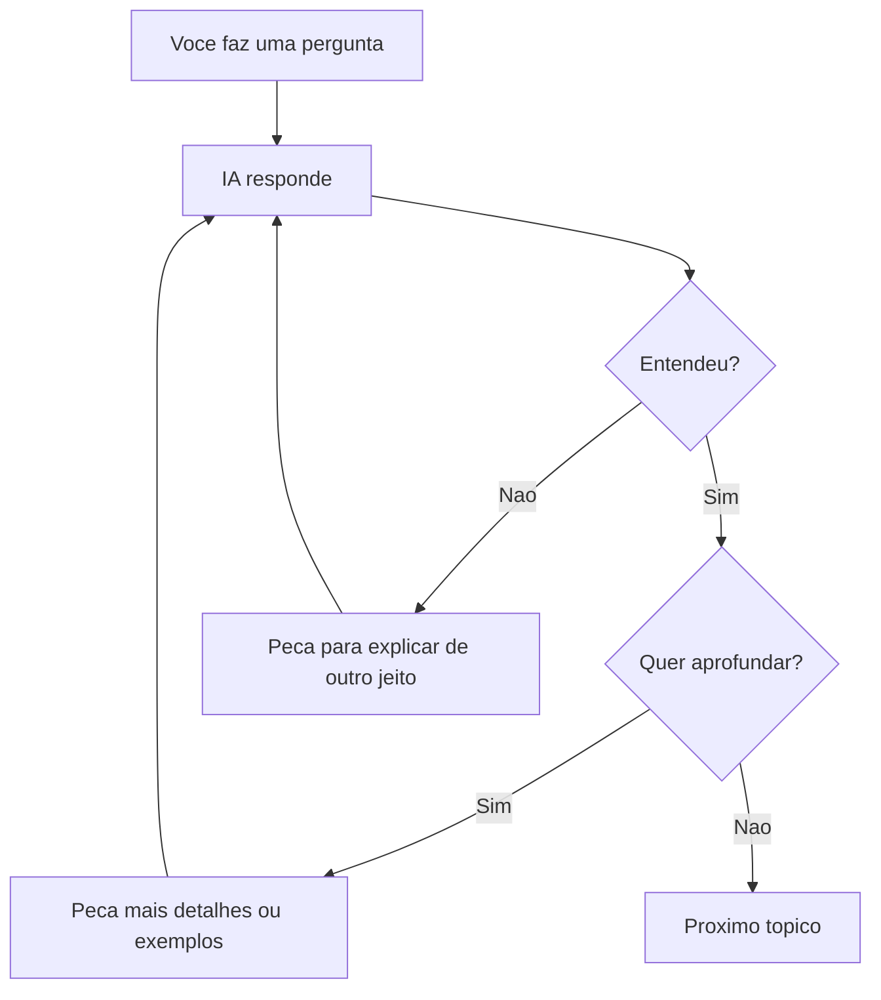
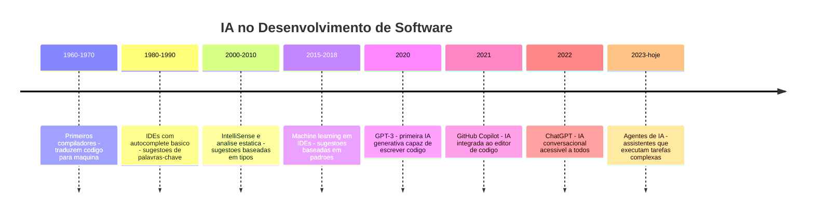
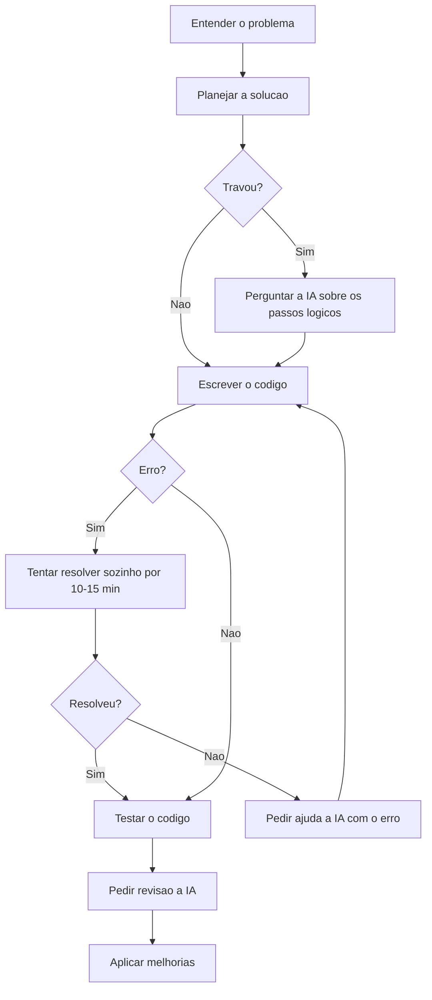

# 5.18 — Usando IA para Aprender: Prompts para Programação

[← Anterior: Noções de Complexidade: Big O](cap05-mod17-big-o-conteudo.md) · [Próximo: Projeto do Capítulo 5 →](../projects/projeto-cap05-programa-python.md)

---

## Introdução

Ao longo de todo o capítulo 5, cada módulo teve uma seção "Como a IA pode te ajudar aqui" com exemplos de prompts. Agora vamos aprofundar: como usar IA de forma inteligente para aprender programação, resolver problemas e se tornar um desenvolvedor melhor.

No módulo 1.10, você teve uma introdução ao que é Inteligência Artificial. Agora que você sabe programar — variáveis, condicionais, loops, funções, coleções, debugging, tratamento de erros e algoritmos — está pronto para usar IA como uma ferramenta real de aprendizado e produtividade.

A IA não substitui o aprendizado. Ela é uma parceira — como ter um colega experiente disponível 24 horas por dia para tirar dúvidas, explicar conceitos e ajudar a encontrar bugs. Mas assim como um colega, a qualidade da ajuda depende da qualidade da sua pergunta. Perguntas vagas geram respostas vagas. Perguntas específicas geram respostas úteis.

Neste módulo, você vai aprender a fazer perguntas que produzem respostas realmente úteis.

---

## Como Executar os Exemplos Deste Módulo

Este módulo é diferente dos anteriores — não tem código para executar no terminal. Em vez disso, os "exemplos" são prompts que você vai usar em ferramentas de IA como ChatGPT, Claude, Gemini, Copilot ou o próprio Kiro.

Para praticar:
1. Abra uma ferramenta de IA de sua preferência
2. Copie os prompts de exemplo
3. Observe a resposta
4. Experimente modificar o prompt e compare os resultados

---

## O que é um LLM e Como Funciona (Versão Simples)

No módulo 1.10, você aprendeu o que é IA de forma geral. Agora vamos entender especificamente os **LLMs** (Large Language Models, ou Grandes Modelos de Linguagem) — que são as IAs com as quais você conversa, como ChatGPT, Claude e Gemini.

Um LLM é um programa de computador que foi treinado lendo bilhões de textos da internet — livros, artigos, código-fonte, fóruns, documentação técnica. Ao ler todo esse texto, ele aprendeu padrões: como frases são construídas, como código é escrito, como problemas são resolvidos. Quando você faz uma pergunta, ele gera a resposta mais provável baseada nesses padrões.

Pense assim: se você lesse todos os livros de receitas do mundo, depois de um tempo conseguiria "inventar" receitas novas combinando padrões que aprendeu. O LLM faz algo parecido, mas com texto e código.

### O que o LLM sabe e o que não sabe

| O LLM sabe | O LLM não sabe |
|------------|----------------|
| Sintaxe de Python e outras linguagens | O que está no seu computador agora |
| Padrões comuns de código | O contexto do seu projeto específico |
| Como resolver problemas típicos | Se o código que ele gerou realmente funciona |
| Explicar conceitos de programação | Informações muito recentes (depende do treinamento) |
| Sugerir correções para erros comuns | Suas intenções — ele precisa que você explique |

### A regra de ouro: a qualidade da resposta depende da qualidade da pergunta

Isso tem um nome técnico: **prompt engineering** (engenharia de prompts). Um **prompt** é a mensagem que você envia para a IA. Quanto mais claro, específico e contextualizado for o prompt, melhor será a resposta.

| Prompt vago | Prompt específico |
|-------------|-------------------|
| "Me ajuda com Python" | "Como faço para percorrer uma lista de dicionários em Python e filtrar apenas os que têm a chave 'age' maior que 18?" |
| "Meu código não funciona" | "Estou recebendo TypeError: can only concatenate str to str quando tento somar uma variável string com um int. Como corrijo?" |
| "Faz um programa" | "Crie uma função em Python que recebe uma lista de números e retorna um dicionário com as chaves 'soma', 'media', 'maior' e 'menor'" |

---

## Os 5 Princípios para Bons Prompts

### 1. Seja específico

Quanto mais detalhes você der, melhor a resposta. Compare:

**Ruim:** "Explica listas em Python"
**Bom:** "Explica como adicionar, remover e buscar elementos em uma lista Python, com exemplos de código comentados em português"

**Ruim:** "Meu programa dá erro"
**Bom:** "Meu programa Python dá ValueError quando tento converter input() para int. O usuário digitou 'abc'. Como trato esse erro com try/except?"

### 2. Dê contexto

O LLM não conhece seu projeto. Diga o que está fazendo:

**Ruim:** "Como faço um menu?"
**Bom:** "Estou criando um programa Python de cadastro de produtos. Preciso de um menu no terminal com opções: 1-Cadastrar, 2-Listar, 3-Buscar, 4-Sair. O menu deve repetir até o usuário escolher sair."

### 3. Defina o formato da resposta

Se você quer a resposta em um formato específico, peça:

**Exemplo:** "Explique a diferença entre lista e dicionário em Python. Use uma tabela comparativa com as colunas: Característica, Lista, Dicionário."

**Exemplo:** "Crie a função com comentários explicando cada linha em português. Nomes de variáveis em inglês."

### 4. Divida problemas grandes

Em vez de pedir tudo de uma vez, divida em etapas:

**Ruim:** "Crie um sistema completo de cadastro de alunos com menu, validação, busca, edição e remoção"

**Bom (em etapas):**
1. "Crie uma função que pede nome e idade do aluno com validação de entrada"
2. "Agora crie uma função que armazena o aluno em uma lista de dicionários"
3. "Agora crie uma função que lista todos os alunos formatados"
4. "Agora crie o menu principal que conecta tudo"

### 5. Itere sobre a resposta

A primeira resposta raramente é perfeita. Refine:

- "Bom, mas adicione tratamento de erro na entrada de dados"
- "Pode explicar a linha 15 com mais detalhes?"
- "Reescreva usando funções em vez de ter tudo no main()"
- "O código funciona, mas pode simplificar o loop?"

---

## Prompts Úteis para Cada Situação

### Quando não entende um conceito

```
Explique [conceito] em Python como se eu fosse um iniciante completo.
Use uma analogia do dia a dia e depois mostre um exemplo de código
com comentários em português.
```

Exemplos:
- "Explique o que é um dicionário em Python como se eu fosse um iniciante completo..."
- "Explique a diferença entre parâmetro e argumento em funções Python..."
- "Explique o que significa 'iterar sobre uma lista' em Python..."

### Quando tem um erro

```
Estou recebendo este erro no Python:

[cole a mensagem de erro completa]

Meu código é:

[cole o código]

O que está causando o erro e como corrijo?
```

Sempre cole a mensagem de erro **completa** (incluindo o Traceback) e o código relevante. Quanto mais contexto, melhor a resposta.

### Quando quer entender código

```
Explique este código Python linha por linha, em português:

[cole o código]

Para cada linha, diga: o que ela faz, por que está ali,
e o que aconteceria se fosse removida.
```

### Quando quer melhorar código

```
Revise este código Python considerando:
1. Tratamento de erros (o programa não deve parar com Traceback)
2. Nomes de variáveis descritivos
3. Organização em funções
4. Comentários explicativos

[cole o código]
```

### Quando quer praticar

```
Crie 3 exercícios de programação Python sobre [tema] com
dificuldade progressiva (fácil, médio, difícil).
Para cada exercício, inclua: enunciado, dica e resposta comentada.
```

### Quando está travado em um problema

```
Preciso resolver este problema em Python:
[descreva o problema]

Não me dê o código pronto. Em vez disso:
1. Me ajude a decompor o problema em passos menores
2. Para cada passo, dê uma dica de qual conceito Python usar
3. Deixe eu tentar implementar primeiro
```

Esse último prompt é especialmente poderoso para aprendizado — pede ajuda sem pedir a resposta pronta.

---


---

## Exemplos Práticos: Prompts com Código Real

Vamos ver exemplos concretos de como usar a IA para resolver problemas reais de programação. Em cada exemplo, mostramos o prompt, o que a IA retornaria e como você deve avaliar a resposta.

### Exemplo 1: Pedir Ajuda para Entender um Erro

Imagine que você escreveu este código e recebeu um erro:

```python
# "numbers" = numeros
numbers = [10, 20, 30, 40, 50]
# "total" = soma total
total = 0
for i in range(1, 6):
    total += numbers[i]
print(f"Soma: {total}")
```

Saída esperada (erro):

```
IndexError: list index out of range
```

Um bom prompt para a IA seria:

> "Estou recebendo IndexError neste código Python. A lista tem 5 elementos e o range vai de 1 a 5. Por que dá erro? Explique o que está acontecendo na memória."

A IA explicaria que listas em Python começam no índice 0, então os índices válidos são 0 a 4. O `range(1, 6)` gera 1, 2, 3, 4, 5 — e `numbers[5]` não existe. A correção seria `range(0, 5)` ou `range(len(numbers))`.

O ponto importante: você não pediu "corrija meu código". Pediu para a IA explicar o que está acontecendo. Assim você aprende o conceito (índices começam em 0) em vez de apenas copiar uma correção.

### Exemplo 2: Pedir para Revisar Seu Código

Você escreveu uma função e quer saber se está boa:

```python
# "calculate_average" = calcular media
def calculate_average(grades):
    # "grades" = notas
    # "total" = soma total
    total = 0
    for grade in grades:
        total = total + grade
    # "average" = media
    average = total / len(grades)
    return average
```

Saída esperada: nenhuma (é apenas a definição da função)

Um bom prompt:

> "Revise esta função Python que calcula a média de notas. O que acontece se a lista estiver vazia? Tem algum problema de robustez? Sugira melhorias mantendo o código simples."

A IA apontaria que `len(grades)` seria 0 para uma lista vazia, causando `ZeroDivisionError`. Sugeriria adicionar uma verificação:

```python
# "calculate_average" = calcular media (versao melhorada)
def calculate_average(grades):
    # "grades" = notas
    if len(grades) == 0:
        return 0.0
    # "total" = soma total
    total = 0
    for grade in grades:
        total = total + grade
    # "average" = media
    average = total / len(grades)
    return average
```

Saída esperada: nenhuma (é apenas a definição da função)

Observe: você escreveu o código primeiro, depois pediu revisão. Isso é muito diferente de pedir para a IA escrever do zero. Quando você escreve primeiro, exercita seu raciocínio. A revisão da IA complementa, não substitui.

### Exemplo 3: Pedir Explicação de um Conceito com Analogia

> "Explique a diferença entre lista e dicionário em Python usando uma analogia do dia a dia. Dê exemplos de quando usar cada um."

Esse tipo de prompt é excelente para aprofundar conceitos. A IA pode trazer analogias que você não tinha pensado, e você pode pedir para ela elaborar: "Essa analogia ficou boa, mas não entendi a parte sobre chaves. Pode dar mais exemplos?"

### Exemplo 4: Pedir para Gerar Casos de Teste

> "Tenho esta função que valida se uma senha é forte (mínimo 8 caracteres, pelo menos 1 número, pelo menos 1 letra maiúscula). Me dê 10 casos de teste com senhas que devem passar e senhas que devem falhar, explicando por que cada uma passa ou falha."

Esse é um uso excelente da IA: gerar dados de teste. A IA é boa em pensar em casos de borda que você pode não ter considerado (senha com exatamente 8 caracteres, senha só com números, senha com caracteres especiais).

---

## Iterando com a IA: A Conversa é o Segredo

Um erro comum é tratar a IA como uma máquina de respostas únicas: você faz uma pergunta, recebe uma resposta, e pronto. Na verdade, o poder da IA está na iteração — na conversa de ida e volta.

### O Padrão de Iteração



### Exemplos de Iteração

**Rodada 1:** "O que é uma lista em Python?"
**Rodada 2:** "Você disse que listas são mutáveis. O que significa mutável? Dê um exemplo."
**Rodada 3:** "Se listas são mutáveis, o que acontece quando passo uma lista para uma função e a função modifica a lista?"
**Rodada 4:** "Isso significa que funções podem ter efeitos colaterais? Como evitar isso?"

Cada rodada aprofunda o entendimento. Na rodada 1, você aprendeu o básico. Na rodada 4, está discutindo efeitos colaterais e programação funcional — conceitos avançados que surgiram naturalmente da conversa.

### Prompts de Iteração Úteis

| Situação | Prompt |
|----------|--------|
| Não entendeu | "Pode explicar de outro jeito? Use uma analogia diferente." |
| Quer mais detalhes | "Pode dar mais exemplos disso?" |
| Quer ver na prática | "Mostre um código Python que demonstra isso." |
| Quer testar entendimento | "Vou explicar o que entendi. Me corrija se estiver errado: [sua explicação]" |
| Quer caso de borda | "E se a lista estiver vazia? E se tiver um único elemento?" |
| Quer comparar | "Qual a diferença entre fazer X e fazer Y?" |
| Quer contexto real | "Em que situação real eu usaria isso?" |

O último prompt da tabela — "Vou explicar o que entendi. Me corrija se estiver errado" — é especialmente poderoso. Quando você tenta explicar um conceito com suas próprias palavras, descobre rapidamente se realmente entendeu ou se está apenas repetindo o que leu.

---

## IA e Ética no Aprendizado

Usar IA para aprender é diferente de usar IA para trapacear. A linha é clara:

| Uso legítimo | Uso problemático |
|-------------|-----------------|
| Pedir explicação de um conceito | Pedir para a IA fazer seu exercício inteiro |
| Pedir revisão do código que você escreveu | Copiar código da IA sem entender |
| Pedir exemplos para estudar | Entregar código da IA como se fosse seu |
| Pedir para explicar um erro | Pedir a resposta de uma prova |
| Usar como parceira de estudo | Usar como substituta do estudo |

A regra é simples: se você está aprendendo algo com a ajuda da IA, é uso legítimo. Se está evitando aprender, é problemático.

Uma analogia: usar calculadora para verificar uma conta que você fez de cabeça é legítimo. Usar calculadora em vez de aprender a fazer contas é problemático — porque quando a calculadora não estiver disponível, você não vai saber fazer.

O mesmo vale para IA: use para acelerar e aprofundar seu aprendizado, não para substituí-lo. Quando você estiver em uma entrevista de emprego, em uma reunião técnica, ou debugando um problema em produção às 3 da manhã, o que vai contar é o que você realmente entende — não o que a IA pode gerar para você.

### Alucinações: Quando a IA Inventa

Um ponto crítico: IAs generativas podem inventar informações com total confiança. Isso se chama **alucinação** (hallucination). A IA pode:

- Inventar funções Python que não existem
- Citar bibliotecas que não existem
- Dar explicações que parecem corretas mas estão erradas
- Inventar dados, datas e referências

Por isso, sempre verifique o que a IA diz:
- Execute o código que ela sugeriu — funciona?
- Procure a função na documentação oficial — existe?
- O conceito faz sentido com o que você já aprendeu?

A IA é uma parceira de estudo, não uma fonte de verdade. Trate tudo que ela diz como "provavelmente correto, mas preciso verificar".
## O que a IA Faz Bem e o que Faz Mal

### A IA é boa para:

- **Explicar conceitos:** pedir explicações em diferentes níveis de detalhe
- **Encontrar bugs:** colar código com erro e pedir análise
- **Gerar exemplos:** pedir exemplos de uso de funções ou conceitos
- **Traduzir mensagens de erro:** colar o Traceback e pedir explicação em português
- **Sugerir melhorias:** pedir revisão de código com critérios específicos
- **Criar exercícios:** pedir problemas para praticar um tema específico

### A IA é ruim para:

- **Garantir que o código funciona:** ela pode gerar código com bugs sutis. Sempre teste.
- **Conhecer seu projeto:** ela não sabe o que você já fez nos módulos anteriores (a menos que você diga)
- **Substituir o entendimento:** se você copiar código sem entender, não aprendeu nada
- **Informações muito recentes:** o treinamento tem uma data de corte
- **Problemas muito específicos do seu ambiente:** versões de software, configurações locais

### A regra mais importante

**Nunca copie código da IA sem entender cada linha.** Se não entende uma linha, pergunte: "O que a linha X faz?" A IA é uma ferramenta de aprendizado, não uma máquina de copiar e colar.

---

## Armadilhas Comuns ao Usar IA

### 1. A armadilha da preguiça

É tentador pedir à IA para fazer todo o exercício. Mas se você não prática, não aprende. Use a IA para tirar dúvidas e entender conceitos, não para fazer o trabalho por você.

**Ruim:** "Faça o exercício 3 do módulo 5.16 para mim"
**Bom:** "Estou tentando resolver o exercício de Cifra de César. Entendi a lógica de deslocar letras, mas não sei como lidar com o caso de Z voltando para A. Pode me dar uma dica?"

### 2. A armadilha da confiança cega

A IA pode gerar código que parece correto mas tem bugs. Sempre teste o código que ela gera. Sempre leia e entenda antes de usar.

### 3. A armadilha do prompt vago

Se a resposta da IA não foi útil, o problema provavelmente está no seu prompt. Em vez de repetir a mesma pergunta, reformule com mais contexto e especificidade.

### 4. A armadilha do "funciona, então está bom"

Código que funciona não é necessariamente bom código. Peça à IA para revisar considerando boas práticas, tratamento de erros e legibilidade.

---

## Ferramentas de IA para Programadores

Existem várias ferramentas de IA disponíveis. Cada uma tem características diferentes:

| Ferramenta | Tipo | Melhor para |
|-----------|------|-------------|
| ChatGPT (OpenAI) | Chat web/app | Explicações, código, perguntas gerais |
| Claude (Anthropic) | Chat web/app | Análise de código, explicações detalhadas |
| Gemini (Google) | Chat web/app | Pesquisa, explicações, código |
| GitHub Copilot | Extensão do editor | Autocompletar código enquanto digita |
| Kiro | IDE com IA integrada | Desenvolvimento completo com contexto do projeto |

Para iniciantes, qualquer uma dessas ferramentas serve. O importante é aprender a fazer boas perguntas — essa habilidade funciona em todas elas.

### IDEs com IA integrada

Uma tendência forte no mundo da programação é a integração de IA diretamente no editor de código. Em vez de alternar entre o editor e um chat, a IA está ali, no mesmo lugar onde você escreve código. O Kiro é um exemplo disso — ele entende o contexto do seu projeto e pode ajudar de forma mais precisa porque "vê" seus arquivos.

---

## IA como Parceira de Estudo: Um Método Prático

Aqui está um método para usar IA de forma produtiva no seu aprendizado:

### Passo 1 — Tente sozinho primeiro

Antes de perguntar à IA, tente resolver o problema por conta própria. Mesmo que não consiga, o esforço de tentar ativa o aprendizado.

### Passo 2 — Identifique onde travou

Quando travar, identifique exatamente onde: "Sei como pedir os dados, mas não sei como armazenar em um dicionário" é muito melhor que "Não sei fazer o exercício".

### Passo 3 — Peça uma dica, não a resposta

```
Estou tentando criar uma função que conta quantas vezes cada
palavra aparece em uma lista. Sei que preciso usar um dicionário,
mas não sei como verificar se a palavra já está no dicionário.
Pode me dar uma dica sem dar o código completo?
```

### Passo 4 — Implemente com a dica

Use a dica para escrever o código. Se travar de novo, peça outra dica.

### Passo 5 — Compare e aprenda

Depois de resolver, peça à IA para mostrar a solução dela e compare:

```
Resolvi o problema assim: [cole seu código].
Existe uma forma melhor ou mais eficiente de fazer isso?
O que posso melhorar?
```

---


---

## A Evolução da IA no Desenvolvimento de Software

Para entender onde estamos, é útil ver de onde viemos. A IA no desenvolvimento de software não surgiu do nada — é o resultado de décadas de evolução:



Cada etapa resolveu um problema da anterior:
- Compiladores eliminaram a necessidade de escrever em linguagem de máquina
- IDEs com autocomplete reduziram erros de digitação
- IntelliSense ajudou a descobrir métodos e propriedades disponíveis
- IA generativa passou a sugerir blocos inteiros de código

Mas o princípio fundamental não mudou: a IA é uma ferramenta que amplifica a capacidade do programador. Ela não substitui o entendimento — ela acelera quem já entende.

### O que Mudou na Prática

Antes da IA generativa, um programador iniciante que encontrasse um erro precisava:
1. Ler a mensagem de erro (muitas vezes críptica)
2. Pesquisar no Google ou Stack Overflow
3. Ler várias respostas, filtrar as relevantes
4. Adaptar a solução ao seu contexto

Com IA generativa, o fluxo pode ser:
1. Colar o erro e o código no chat da IA
2. Receber uma explicação contextualizada
3. Receber uma sugestão de correção
4. Verificar se a correção faz sentido e funciona

O passo 4 é crucial — e é onde muitos iniciantes erram. Eles pulam a verificação e confiam cegamente na IA. Não faça isso. A IA erra, e quando erra, erra com confiança.

---

## Workflow Prático: Usando IA no Dia a Dia

Aqui vai um workflow que funciona bem para estudantes e programadores iniciantes:

### Antes de Programar

1. **Entenda o problema** — leia o enunciado, identifique entradas e saídas
2. **Planeje a solução** — pense nos passos antes de escrever código
3. **Se travar no planejamento** — pergunte à IA: "Quero resolver [problema]. Quais são os passos lógicos?"

### Durante a Programação

1. **Escreva o código você mesmo** — mesmo que seja imperfeito
2. **Se travar em sintaxe** — pergunte: "Como faço [operação] em Python?"
3. **Se encontrar um erro** — tente resolver sozinho por 10-15 minutos primeiro
4. **Se não conseguir** — cole o erro e o código na IA e peça explicação

### Depois de Programar

1. **Teste seu código** — rode com diferentes entradas
2. **Peça revisão à IA** — "Revise este código. Tem bugs? Pode ser melhorado?"
3. **Peça casos de teste** — "Me dê 5 entradas para testar esta função, incluindo casos de borda"



### A Regra dos 15 Minutos

Uma regra prática que muitos programadores usam: quando encontrar um problema, tente resolver sozinho por 15 minutos. Se não conseguir, peça ajuda (à IA, a um colega, ao Stack Overflow). Esse tempo é importante porque:

- Muitos problemas se resolvem com um pouco mais de atenção
- O esforço de tentar sozinho consolida o aprendizado
- Quando você pede ajuda depois de tentar, entende melhor a resposta
- Evita o hábito de pedir ajuda para tudo imediatamente

Mas não fique travado por horas. Se 15 minutos não resolveram, pedir ajuda é a decisão inteligente.

---

## Limitações Atuais da IA para Programação

É importante ter uma visão realista do que a IA pode e não pode fazer hoje:

### O que a IA faz bem

| Tarefa | Por que faz bem |
|--------|----------------|
| Explicar conceitos | Tem acesso a milhoes de explicacoes e pode adaptar ao seu nivel |
| Gerar codigo simples | Padroes comuns estao bem representados nos dados de treinamento |
| Encontrar bugs obvios | Reconhece padroes de erro comuns |
| Sugerir nomes de variaveis | Entende convencoes de nomenclatura |
| Traduzir entre linguagens | Conhece a sintaxe de dezenas de linguagens |
| Gerar dados de teste | Consegue pensar em casos de borda |
| Explicar mensagens de erro | Ja viu milhoes de erros e suas solucoes |

### O que a IA faz mal

| Tarefa | Por que faz mal |
|--------|----------------|
| Entender requisitos ambiguos | Nao tem contexto do seu projeto real |
| Debugar problemas complexos | Nao consegue executar o codigo nem ver o estado |
| Projetar arquitetura | Nao entende as restricoes e trade-offs do seu contexto |
| Garantir que o codigo esta correto | Pode gerar codigo que parece certo mas tem bugs sutis |
| Manter consistencia em projetos grandes | Nao tem memoria de longo prazo entre conversas |
| Lidar com bibliotecas muito novas | Dados de treinamento tem um corte temporal |
| Entender codigo legado complexo | Precisa de contexto que nao cabe em uma conversa |

A IA é como um estagiário muito inteligente mas sem experiência: sabe muita teoria, escreve rápido, mas precisa de supervisão. Você é o supervisor. Conforme você ganha experiência, fica melhor em supervisionar — sabe quando a IA está certa e quando está inventando.

---

## O Futuro: IA como Parceira, Não Substituta

A IA não vai substituir programadores — vai mudar o que significa ser programador. Assim como a calculadora não eliminou a necessidade de entender matemática, a IA não elimina a necessidade de entender programação.

O que muda é o foco:
- Menos tempo escrevendo código repetitivo
- Mais tempo pensando em problemas e soluções
- Menos tempo procurando sintaxe
- Mais tempo projetando arquitetura
- Menos tempo debugando erros triviais
- Mais tempo entendendo requisitos do usuário

Os programadores que vão se destacar no futuro são os que sabem pensar sobre problemas, projetar soluções e usar a IA como ferramenta para implementar mais rápido. E tudo isso começa com uma base sólida — exatamente o que você está construindo neste curso.

Lembre-se do mantra do curso: **"Conceitos são para sempre, ferramentas apenas os implementam."** A IA é uma ferramenta poderosa, mas os conceitos de lógica, estruturas de dados, modelagem e arquitetura que você aprendeu são o que realmente importa. Com esses conceitos sólidos, você consegue usar qualquer ferramenta — inclusive as que ainda não foram inventadas.


---

## Como Escolher a Ferramenta de IA Certa

Existem muitas ferramentas de IA disponíveis, e cada uma tem pontos fortes diferentes. Aqui vai um guia prático para escolher:

### Para Aprender e Tirar Dúvidas

Ferramentas conversacionais são as melhores para aprendizado:

| Ferramenta | Gratuita? | Melhor para |
|-----------|-----------|-------------|
| ChatGPT | Sim (versao basica) | Explicacoes detalhadas, analogias, exemplos |
| Claude | Sim (versao basica) | Explicacoes longas, analise de codigo |
| Gemini | Sim | Integrado com Google, bom para pesquisa |
| Perplexity | Sim | Respostas com fontes citadas |

### Para Escrever Código no Editor

Ferramentas integradas ao editor de código sugerem código enquanto você digita:

| Ferramenta | Editor | Como funciona |
|-----------|--------|---------------|
| GitHub Copilot | VSCode, JetBrains | Sugere linhas e blocos enquanto voce digita |
| Amazon Q Developer | VSCode | Sugestoes de codigo e chat integrado |
| Codeium | VSCode, JetBrains | Alternativa gratuita ao Copilot |
| Kiro | IDE proprio | IDE com IA integrada, specs e steering |

### Dica Prática para Iniciantes

Comece com uma ferramenta conversacional (ChatGPT ou Claude) para aprender conceitos e tirar dúvidas. Quando estiver mais confortável escrevendo código, experimente uma ferramenta integrada ao editor para acelerar a digitação.

Não tente usar todas ao mesmo tempo. Escolha uma, aprenda a usá-la bem, e depois explore outras. A habilidade de fazer bons prompts é transferível — funciona em qualquer ferramenta.

### O que Todas Têm em Comum

Independente da ferramenta, os princípios são os mesmos:
- Seja específico no que pede
- Dê contexto (linguagem, nível, objetivo)
- Itere — refine a resposta com perguntas adicionais
- Verifique — nunca confie cegamente
- Aprenda — use a IA para entender, não para copiar


Lembre-se: a ferramenta muda, mas a habilidade de comunicar claramente o que você precisa é permanente. Investir tempo aprendendo a fazer bons prompts hoje vai te servir por toda a carreira — independente de qual IA estiver disponível amanhã.
## Como a IA pode te ajudar aqui

**Prompt 1 — Ver exemplos práticos:**
> "Quais são as melhores práticas para usar IA como ferramenta de aprendizado em programação? Me dê 5 dicas práticas."

**Prompt 2 — Criar com ajuda da IA:**
> "Crie um roteiro de estudo usando IA para aprender [tema específico de Python]. Inclua: o que estudar, prompts para usar e exercícios para praticar."

**Prompt 3 — Entender erros comuns:**
> "Quais são os erros mais comuns que iniciantes cometem ao usar IA para programar? Como evitar cada um?"

---

## Casos de Uso no Mundo Real

### Programadores profissionais e IA

Uma pesquisa do Stack Overflow de 2023 mostrou que mais de 70% dos programadores profissionais usam ferramentas de IA no trabalho. Não para substituir o conhecimento, mas para acelerar tarefas repetitivas: gerar boilerplate (código padrão), encontrar bugs, escrever testes e documentação. Empresas como Google, Microsoft e Meta incentivam seus engenheiros a usar IA como ferramenta de produtividade.

### Aprendizado acelerado

Universidades como Stanford, MIT e Harvard estão integrando IA nos cursos de programação. Estudantes usam IA como "tutor pessoal" — fazem perguntas específicas, pedem explicações alternativas e praticam com exercícios gerados sob demanda. Pesquisas mostram que estudantes que usam IA de forma disciplinada (pedindo dicas, não respostas) aprendem mais rápido que os que não usam.

### Code review assistido por IA

Em empresas de tecnologia, antes de um código ser aceito no projeto, ele passa por uma revisão (code review) feita por outros programadores. Ferramentas de IA estão sendo usadas para fazer uma primeira revisão automática — identificando bugs potenciais, problemas de segurança e violações de padrões de código. O programador humano ainda faz a revisão final, mas a IA economiza tempo ao pegar os problemas mais óbvios.

---

## Resumo do Módulo

| Conceito | Descrição |
|----------|-----------|
| LLM | Grande Modelo de Linguagem — IA treinada em bilhões de textos |
| Prompt | Mensagem que você envia para a IA |
| Prompt Engineering | Técnica de estruturar prompts para obter melhores respostas |
| Contexto | Informação que a IA precisa para dar uma boa resposta |
| Iteração | Refinar a resposta da IA com mensagens adicionais |
| Especificidade | Quanto mais detalhes no prompt, melhor a resposta |
| Decomposição | Dividir problemas grandes em perguntas menores |

---

## Glossário do Módulo

| Termo | Definição |
|-------|-----------|
| Boilerplate | Código padrão e repetitivo que toda aplicação precisa |
| Chain of Thought | Técnica de pedir à IA que raciocine passo a passo |
| ChatGPT | Ferramenta de IA conversacional criada pela OpenAI |
| Claude | Ferramenta de IA conversacional criada pela Anthropic |
| Code Review | Revisão de código feita por outros programadores antes de aceitar mudanças |
| Copilot | Ferramenta de IA da GitHub que autocompleta código no editor |
| Few-shot | Técnica de incluir exemplos no prompt para guiar a resposta |
| Gemini | Ferramenta de IA conversacional criada pelo Google |
| IDE | Integrated Development Environment — ambiente integrado de desenvolvimento |
| Iteração | Processo de refinar resultados através de mensagens adicionais |
| Kiro | IDE com IA integrada que entende o contexto do projeto |
| LLM | Large Language Model — modelo de linguagem treinado em grandes volumes de texto |
| Prompt | Texto de entrada enviado para uma IA |
| Prompt Engineering | Arte e técnica de estruturar prompts para obter melhores resultados |
| Token | Unidade de texto que o LLM processa (aproximadamente uma palavra ou parte dela) |
| Zero-shot | Pedir à IA sem fornecer exemplos — apenas a instrução |

---

## Na Cultura Popular

- **O Homem Bicentenário** (filme, 1999) — baseado no conto de Isaac Asimov, mostra um robô que aprende com humanos ao longo de 200 anos. A relação entre o robô e seus "professores" é uma metáfora para como usamos IA: ela aprende com dados humanos e nós aprendemos a nos comunicar melhor com ela.

- **Her** (filme, 2013) — o protagonista desenvolve uma relação com uma IA conversacional. O filme explora como a qualidade da comunicação entre humano e IA evolui com o tempo — exatamente como acontece quando você melhora seus prompts.

- **Ex Machina** (filme, 2014) — explora os limites da inteligência artificial e a diferença entre parecer inteligente e realmente entender. Um lembrete importante: LLMs geram texto que parece inteligente, mas não "entendem" no sentido humano.

---

## Para Saber Mais

- [Prompt Engineering Guide](https://www.promptingguide.ai/) — *Guia completo de técnicas de prompt (em inglês)*
- [Learn Prompting](https://learnprompting.org/) — *Curso gratuito sobre prompt engineering (em inglês)*
- [Documentação Python](https://docs.python.org/pt-br/3/) — *Referência oficial — use IA para ajudar a navegar*
- [Stack Overflow Developer Survey 2023](https://survey.stackoverflow.co/2023/) — *Pesquisa sobre uso de IA por programadores*
- [GitHub do Fino](https://github.com/RafaelFino) — *Repositórios de referência do curso*

---

## Perguntas Frequentes (FAQ)

**P: A IA vai substituir programadores?**
R: Não no futuro próximo. A IA é uma ferramenta que torna programadores mais produtivos, assim como a calculadora não substituiu matemáticos. Programadores que sabem usar IA serão mais valorizados que os que não sabem.

**P: Posso confiar no código que a IA gera?**
R: Nunca cegamente. Sempre leia, entenda e teste o código. A IA pode gerar código com bugs sutis, usar funções que não existem ou seguir padrões diferentes do seu projeto.

**P: Usar IA para programar é "trapacear"?**
R: Não, desde que você entenda o que está fazendo. Usar IA sem entender é como copiar a prova de um colega — não aprende nada. Usar IA para aprender e acelerar é como usar uma calculadora depois de entender matemática.

**P: Qual ferramenta de IA devo usar?**
R: Para iniciantes, qualquer uma serve. ChatGPT, Claude e Gemini são gratuitos (com limites). O importante é aprender a fazer boas perguntas — essa habilidade funciona em todas.

**P: A IA sempre dá a resposta certa?**
R: Não. A IA pode "alucinar" — gerar informações que parecem corretas mas são falsas. Sempre verifique informações importantes e teste código gerado.

**P: Como sei se estou usando IA demais?**
R: Se você não consegue resolver problemas simples sem IA, está usando demais. A regra é: tente sozinho primeiro, use IA quando travar, e sempre entenda a resposta antes de usar.

**P: O que é "prompt engineering"?**
R: É a técnica de estruturar suas mensagens para a IA de forma que produza respostas melhores. Inclui ser específico, dar contexto, definir formato e iterar sobre respostas.

**P: A IA pode me ajudar a estudar para entrevistas de emprego?**
R: Sim. Peça para simular entrevistas técnicas, gerar exercícios de código e explicar conceitos que aparecem em entrevistas. É uma das melhores formas de usar IA para preparação profissional.

**P: Posso usar IA em provas e avaliações?**
R: Depende das regras da avaliação. Em geral, avaliações testam o que VOCÊ sabe, não o que a IA sabe. Use IA para estudar, não para fazer a prova.

**P: A IA entende português?**
R: Sim, as principais IAs (ChatGPT, Claude, Gemini) entendem e respondem em português. A qualidade pode ser um pouco melhor em inglês (porque há mais dados de treinamento), mas para programação em Python, português funciona muito bem.

**P: O que é um "token"?**
R: É a unidade de texto que o LLM processa. Aproximadamente, 1 token equivale a uma palavra ou parte de uma palavra. As ferramentas de IA têm limites de tokens por conversa — por isso é importante ser conciso nos prompts.

---

## Exercícios Práticos

Os exercícios completos estão no arquivo separado:

**[Acessar Exercícios do Módulo 5.18](cap05-mod18-ia-para-programacao-exercicios.md)**

Prévia:

### Exercício rápido 1 — Melhorar prompts

Receba prompts vagos e reescreva-os de forma específica e contextualizada.

### Exercício rápido 2 — Aprender com IA

Use IA para aprender um conceito novo de Python que não foi coberto no curso.

---

[← Anterior: Noções de Complexidade: Big O](cap05-mod17-big-o-conteudo.md) · [Próximo: Projeto do Capítulo 5 →](../projects/projeto-cap05-programa-python.md)
