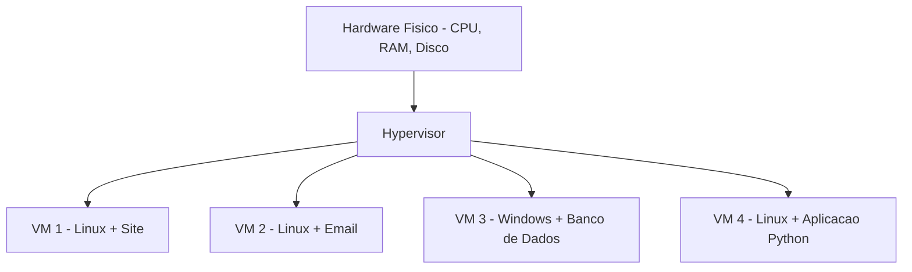
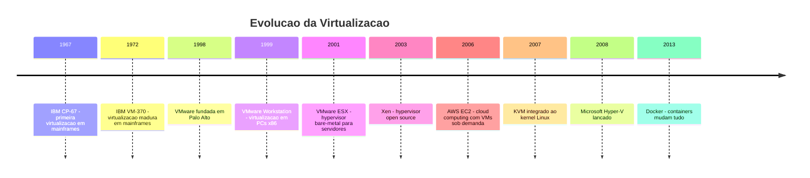
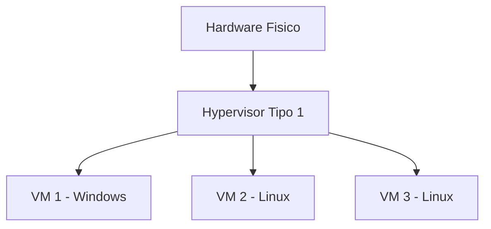
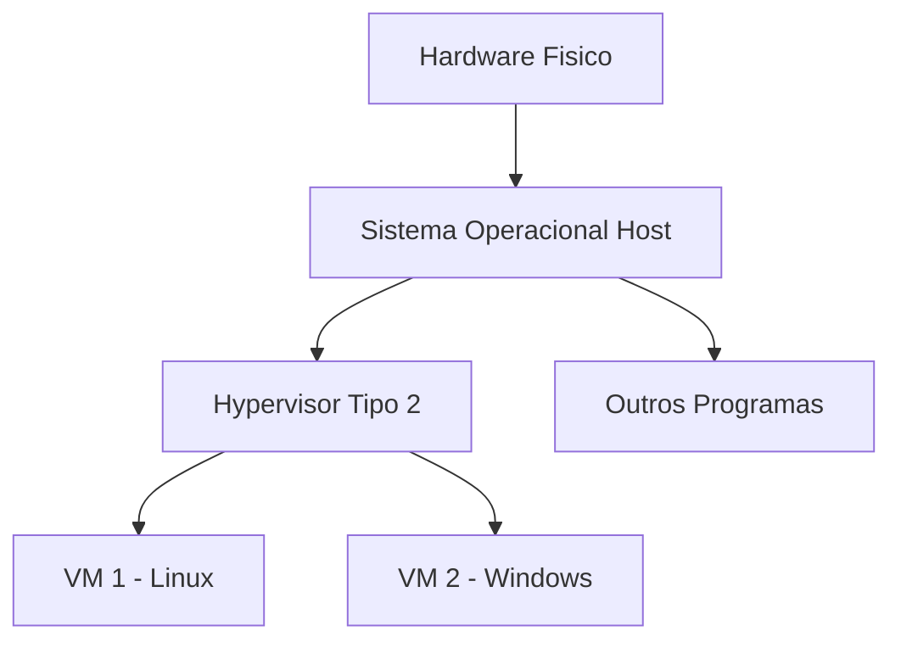

# 6.1 — O que é Virtualização e por que Existe

[← Anterior: Projeto do Capítulo 5](../projects/projeto-cap05-programa-python.md) · [Próximo: VMs vs Containers →](cap06-mod02-vms-vs-containers-conteudo.md)

---

## Introdução

No capítulo 5, você aprendeu a programar em Python. Criou variáveis, funções, loops, trabalhou com coleções e até construiu um gerenciador de contatos completo no terminal. Seu código funciona, roda no seu computador e faz o que precisa fazer.

Mas agora imagine o seguinte cenário: você terminou seu programa e quer mostrar para um colega. Você manda o arquivo `.py` para ele, e ele tenta rodar. O que acontece?

- "Deu erro, não tenho Python instalado."
- "Aqui aparece um erro diferente, acho que minha versão do Python é outra."
- "Funcionou no seu computador, mas no meu não funciona."

Esse é um dos problemas mais antigos da computação: **o que funciona em um lugar nem sempre funciona em outro**. Ambientes diferentes, versões diferentes, configurações diferentes — tudo isso pode fazer um programa que funciona perfeitamente no seu computador falhar miseravelmente em outro.

Neste capítulo, vamos aprender sobre **virtualização** e **containers** — tecnologias que resolvem exatamente esse problema. E a ferramenta principal que vamos usar é o **Docker**, que permite empacotar seu programa junto com tudo que ele precisa para rodar, garantindo que funcione igual em qualquer lugar.

Mas antes de falar de Docker, precisamos entender o problema que ele resolve. E para isso, precisamos voltar um pouco no tempo e entender como os servidores funcionavam antes da virtualização existir.

No módulo 1.8, você já teve uma introdução ao conceito de servidores e virtualização. Agora vamos aprofundar esse tema e entender como ele se conecta com o seu dia a dia como desenvolvedor.

---

## Como Executar os Exemplos Deste Módulo

Este módulo é predominantemente conceitual — não tem código para executar no terminal. Os exemplos práticos com Docker começam no módulo 6.3. Aqui, o foco é entender os conceitos e o contexto histórico que motivaram a criação dessas tecnologias.

Quando houver comandos de terminal, eles serão para ilustrar conceitos, não para executar agora.

---

## O Problema: Um Servidor, Um Sistema

Para entender virtualização, precisamos primeiro entender o problema que ela resolve. Vamos voltar aos anos 1990 e início dos anos 2000.

### A Era dos Servidores Dedicados

Imagine uma empresa que precisa rodar três sistemas diferentes:

1. Um **site** para os clientes acessarem
2. Um **sistema de email** para os funcionários
3. Um **banco de dados** com informações de vendas

Na época, a solução era simples e direta: **comprar três servidores físicos**. Um para cada sistema.

Cada servidor era uma máquina física — um computador potente, geralmente guardado em uma sala especial com ar-condicionado (porque servidores esquentam muito). Cada um tinha seu próprio processador, sua própria memória RAM, seu próprio disco rígido e seu próprio sistema operacional.

```
Servidor 1: Site da empresa
- Hardware: Intel Xeon, 4GB RAM, 80GB HD
- Sistema: Windows Server 2003
- Software: IIS + ASP

Servidor 2: Email
- Hardware: Intel Xeon, 2GB RAM, 40GB HD
- Sistema: Linux Red Hat
- Software: Postfix + Dovecot

Servidor 3: Banco de dados
- Hardware: Intel Xeon, 8GB RAM, 200GB HD
- Sistema: Windows Server 2003
- Software: SQL Server
```

### Por que Não Misturar Tudo em Um Servidor Só?

Você pode estar pensando: "por que não colocar tudo no mesmo servidor?" Boa pergunta. Existiam razões reais para isso:

1. **Isolamento de falhas**: se o site travasse, o email continuava funcionando. Se cada sistema está em um servidor separado, um problema em um não afeta os outros.

2. **Segurança**: sistemas diferentes precisam de configurações de segurança diferentes. O site é acessado pela internet (mais exposto), o banco de dados não deveria ser acessado de fora (mais protegido). Misturar tudo no mesmo servidor aumenta o risco.

3. **Recursos dedicados**: o banco de dados precisa de muita memória RAM. O site precisa de boa conexão de rede. Se estão no mesmo servidor, competem pelos mesmos recursos.

4. **Compatibilidade**: o site pode precisar de Windows, o email pode rodar melhor em Linux. Sistemas operacionais diferentes não rodam na mesma máquina física (pelo menos não sem virtualização).

### O Desperdício Gigantesco

O problema é que essa abordagem era **extremamente ineficiente**. Vamos olhar os números:

| Servidor | Capacidade | Uso Real | Desperdício |
|----------|-----------|----------|-------------|
| Site | 4GB RAM, 4 CPUs | 0.5GB RAM, 0.3 CPU | ~87% ocioso |
| Email | 2GB RAM, 4 CPUs | 0.3GB RAM, 0.1 CPU | ~90% ocioso |
| Banco de dados | 8GB RAM, 4 CPUs | 2GB RAM, 1 CPU | ~70% ocioso |

Em média, servidores físicos dedicados usavam apenas **10% a 30% da sua capacidade**. O resto ficava parado, desperdiçando energia, espaço e dinheiro.

Pense nisso em termos de custo:

- Cada servidor custava entre **US$ 5.000 e US$ 50.000** para comprar
- Cada servidor consumia **energia elétrica 24 horas por dia, 7 dias por semana**
- Cada servidor precisava de **espaço físico** em um data center com ar-condicionado
- Cada servidor precisava de **manutenção** (trocar peças, atualizar software)

Uma empresa com 100 servidores, onde cada um usa apenas 15% da capacidade, está literalmente jogando dinheiro fora em 85% do hardware que comprou.

### A Analogia do Apartamento

Imagine que você tem um prédio com 10 apartamentos enormes, cada um com 200 metros quadrados. Mas em cada apartamento mora apenas uma pessoa que usa só um quarto. Os outros cômodos ficam vazios, trancados, sem uso.

Não seria muito mais inteligente dividir cada apartamento grande em vários menores? Assim, mais pessoas poderiam morar no mesmo prédio, usando o espaço de forma eficiente.

Essa é exatamente a ideia da virtualização: **dividir um servidor físico grande em vários servidores virtuais menores**, cada um rodando seu próprio sistema operacional e seus próprios programas, mas compartilhando o mesmo hardware.

E assim como em um prédio de apartamentos, cada morador (VM) tem seu espaço privado — não pode entrar no apartamento do vizinho, não sabe quantos vizinhos tem, e se um vizinho fizer barulho (usar muita CPU), o síndico (hypervisor) pode intervir para garantir que todos tenham sua cota justa de recursos.

Essa analogia vai nos acompanhar ao longo do capítulo. Quando falarmos de containers no módulo 6.2, vamos evoluir a analogia: se VMs são apartamentos completos (com cozinha, banheiro e sala próprios), containers são quartos de hotel (compartilham a infraestrutura do prédio, mas cada hóspede tem seu espaço privado).

---

## A Solução: Virtualização

### O que é Virtualização?

Virtualização é a tecnologia que permite **criar versões virtuais de recursos físicos**. No nosso contexto, significa criar **vários computadores virtuais dentro de um único computador físico**.

Cada computador virtual (chamado de **máquina virtual** ou **VM**, do inglês *Virtual Machine*) funciona como se fosse um computador independente e completo:

- Tem seu próprio sistema operacional
- Tem sua própria memória RAM (uma fatia da RAM real)
- Tem seu próprio disco rígido (um arquivo no disco real)
- Tem seus próprios programas instalados
- Não sabe (e não precisa saber) que é virtual

Do ponto de vista de quem usa a VM, é como se fosse um computador de verdade. Mas por baixo dos panos, é apenas um pedaço do hardware real sendo compartilhado de forma inteligente.

### Como Funciona (Visão Simplificada)

Entre o hardware real e as máquinas virtuais, existe uma camada de software chamada **hypervisor** (ou **monitor de máquinas virtuais**). O hypervisor é o "gerente" que divide os recursos do hardware entre as VMs.



O hypervisor faz o seguinte:

1. **Divide a CPU**: se o servidor tem 8 núcleos, pode dar 2 para cada VM
2. **Divide a RAM**: se o servidor tem 32GB, pode dar 8GB para cada VM
3. **Divide o disco**: cada VM recebe um pedaço do disco (ou um arquivo que simula um disco)
4. **Isola as VMs**: cada VM funciona independentemente — se uma travar, as outras continuam

### O Resultado

Agora, em vez de três servidores físicos, a empresa precisa de apenas um:

| Antes (3 servidores físicos) | Depois (1 servidor com 3 VMs) |
|------------------------------|-------------------------------|
| 3 máquinas para comprar | 1 máquina para comprar |
| 3x consumo de energia | 1x consumo de energia |
| 3x espaço no data center | 1x espaço no data center |
| ~15% de uso médio | ~60-80% de uso médio |
| 3x manutenção | 1x manutenção |

A economia é enorme. E o melhor: cada VM continua isolada, segura e independente — como se fosse um servidor dedicado.

---

## A História da Virtualização

A virtualização não é uma ideia nova. Na verdade, é uma das tecnologias mais antigas da computação — muito mais antiga do que a maioria das pessoas imagina.

### Anos 1960: Os Mainframes da IBM

A história começa nos anos 1960, com os **mainframes** da IBM. Mainframes eram computadores gigantescos — do tamanho de uma sala — que custavam milhões de dólares. Um IBM System/360, lançado em 1964, custava entre US$ 2 milhões e US$ 5 milhões (equivalente a US$ 20-50 milhões em valores atuais). Apenas grandes empresas, universidades e governos podiam comprá-los.

O problema era que esses computadores eram tão caros que precisavam ser compartilhados por muitas pessoas ao mesmo tempo. Mas como fazer isso se cada pessoa precisa de um ambiente isolado? Se um pesquisador rodasse um programa com bug que travasse o sistema, todos os outros usuários seriam afetados.

Em 1967, a IBM criou o **CP-67** (Control Program-67), um sistema que permitia rodar **múltiplas cópias de um sistema operacional** no mesmo mainframe. Cada cópia era uma máquina virtual independente. Cada usuário achava que tinha o computador inteiro só para si, mas na verdade estava compartilhando com dezenas de outros.

Em 1972, a IBM evoluiu o conceito com o **VM/370** — um sistema operacional inteiro construído em torno da ideia de máquinas virtuais. O VM/370 era tão bem projetado que mainframes IBM continuam usando virtualização até hoje, mais de 50 anos depois. Bancos, companhias aéreas e governos ao redor do mundo ainda rodam sistemas críticos em mainframes IBM com virtualização.

Esse foi o nascimento da virtualização. A motivação era simples: **hardware caro demais para ser usado por uma pessoa só**. E a solução era elegante: criar a ilusão de que cada usuário tem seu próprio computador, quando na verdade todos compartilham o mesmo.

### Anos 1970-1980: A Virtualização Esquecida

Nos anos 1970 e 1980, os computadores ficaram menores e mais baratos. Surgiram os PCs (computadores pessoais) — o IBM PC em 1981, seguido por clones compatíveis de diversas fabricantes. De repente, cada pessoa podia ter seu próprio computador por alguns milhares de dólares, em vez de milhões.

A virtualização perdeu relevância no mundo dos PCs — por que compartilhar se cada um pode ter o seu? Os processadores x86 dos PCs nem sequer tinham suporte adequado para virtualização. A arquitetura x86 foi projetada para rodar um único sistema operacional por vez, sem as instruções especiais que os mainframes IBM tinham.

Durante quase 20 anos, a virtualização ficou restrita aos mainframes da IBM e a ambientes acadêmicos. O mundo dos PCs e servidores x86 seguiu o modelo "um servidor, um sistema". Ninguém sentia falta — os computadores eram baratos o suficiente para comprar um para cada necessidade.

Mas essa situação estava prestes a mudar.

### Anos 1990: O Problema Volta

Nos anos 1990, com o crescimento explosivo da internet, as empresas começaram a precisar de muitos servidores. Cada site, cada aplicação, cada banco de dados precisava de seu próprio servidor. E o problema do desperdício que descrevemos no início voltou com força total.

Empresas como Google, Amazon e Yahoo tinham data centers com milhares de servidores, a maioria usando menos de 20% da capacidade. O custo era absurdo — não apenas o hardware, mas a energia elétrica para manter tudo ligado e refrigerado. Estima-se que no final dos anos 1990, grandes data centers gastavam mais com energia elétrica do que com o próprio hardware.

O problema era claro: a indústria precisava de uma forma de usar melhor o hardware que já tinha. A resposta estava na virtualização — mas agora para processadores x86, não para mainframes.

### 1998-1999: VMware Muda Tudo

Em 1998, uma empresa chamada **VMware** foi fundada em Palo Alto, Califórnia. Em 1999, lançou o **VMware Workstation**, o primeiro produto comercial de virtualização para computadores x86 (os processadores comuns que usamos até hoje).

Pela primeira vez, era possível rodar Windows dentro de Linux, ou Linux dentro de Windows, em um PC comum. Não era mais coisa de mainframe — qualquer empresa podia usar.

Em 2001, a VMware lançou o **ESXi** (originalmente chamado ESX), um hypervisor que rodava diretamente no hardware, sem precisar de um sistema operacional por baixo. Isso tornou a virtualização de servidores prática e eficiente para empresas de qualquer tamanho.

### Anos 2000: A Revolução dos Data Centers

A partir de 2003-2005, a virtualização explodiu. Empresas perceberam que podiam:

- Reduzir o número de servidores físicos em 70-80%
- Economizar milhões em energia e espaço
- Criar novos servidores em minutos (em vez de semanas para comprar e instalar hardware)
- Fazer backup de servidores inteiros (copiar a VM é copiar um arquivo)
- Migrar servidores entre máquinas físicas sem desligar (live migration)

Outras empresas entraram no mercado: **Microsoft** com o Hyper-V, **Citrix** com o Xen, e a comunidade open source com o **KVM** (Kernel-based Virtual Machine) integrado ao Linux.

### 2006: A Cloud Nasce da Virtualização

Em 2006, a **Amazon** lançou o **Amazon Web Services (AWS)** com o serviço **EC2** (Elastic Compute Cloud). O EC2 permitia que qualquer pessoa alugasse máquinas virtuais na internet, pagando apenas pelo tempo de uso. Em vez de comprar um servidor por US$ 10.000, você podia alugar uma VM por centavos por hora.

Isso só foi possível por causa da virtualização. A Amazon tinha data centers enormes com servidores potentes, e usava virtualização para dividir cada servidor em dezenas de VMs que eram alugadas para clientes diferentes. Cada cliente recebia sua VM isolada, sem saber (nem precisar saber) que estava compartilhando hardware com outros clientes.

A **cloud computing** (computação em nuvem) nasceu diretamente da virtualização. Sem virtualização, não existiria cloud. E sem cloud, o mundo da tecnologia seria completamente diferente — startups precisariam de milhares de dólares em hardware antes de escrever a primeira linha de código.

Hoje, a AWS sozinha tem milhões de servidores em data centers ao redor do mundo, rodando bilhões de VMs e containers. Google Cloud e Microsoft Azure seguem o mesmo modelo. Tudo isso é virtualização em escala massiva.



---

## Como a Virtualização Funciona por Dentro

Agora que você entende o conceito geral, vamos olhar um pouco mais de perto como a virtualização realmente funciona. Não vamos entrar em detalhes técnicos profundos (isso é assunto para cursos de infraestrutura), mas é importante entender o mecanismo básico.

### O Papel do Processador

Processadores modernos (Intel e AMD) têm instruções especiais de hardware que facilitam a virtualização. A Intel chama isso de **VT-x** (Virtualization Technology) e a AMD chama de **AMD-V**. Essas instruções permitem que o hypervisor crie "compartimentos" isolados no processador, onde cada VM roda suas instruções diretamente — sem precisar traduzir ou simular nada.

Antes dessas instruções existirem (antes de 2005-2006), a virtualização em processadores x86 era feita por software, o que era muito mais lento. O VMware original usava técnicas engenhosas de "tradução binária" para contornar as limitações do hardware. Quando Intel e AMD adicionaram suporte nativo, a performance melhorou drasticamente.

É por isso que, quando você tenta criar uma VM no VirtualBox e recebe um erro dizendo "VT-x não está habilitado", precisa entrar na BIOS do computador e ativar essa opção. O processador tem a capacidade, mas ela pode estar desligada por padrão.

### Divisão de Recursos

Quando o hypervisor cria uma VM, ele reserva uma fatia dos recursos do hardware:

- **CPU**: o hypervisor agenda quando cada VM pode usar o processador. Se há 4 VMs e 8 núcleos, cada VM pode receber 2 núcleos. Mas o hypervisor é inteligente — se uma VM não está usando seus núcleos, outra pode "pegar emprestado" temporariamente.

- **RAM**: cada VM recebe uma quantidade fixa de RAM. Se você dá 4GB para uma VM, esses 4GB ficam reservados. Alguns hypervisors modernos usam técnicas como "ballooning" e "overcommit" para ser mais eficientes, mas o conceito básico é: cada VM tem sua fatia de memória.

- **Disco**: cada VM tem um "disco virtual" — que na verdade é um arquivo grande no disco real. Quando a VM escreve dados no "seu disco", o hypervisor traduz isso para escrita no arquivo correspondente no disco físico.

- **Rede**: cada VM recebe uma placa de rede virtual. O hypervisor cria um "switch virtual" interno que conecta as VMs entre si e com a rede externa.

### Isolamento: A Garantia de Segurança

O isolamento é talvez a característica mais importante da virtualização. Cada VM é completamente isolada das outras:

- Uma VM não consegue acessar a memória de outra VM
- Uma VM não consegue ver os arquivos de outra VM
- Se uma VM for infectada por um vírus, as outras não são afetadas
- Se uma VM travar, as outras continuam funcionando normalmente

Esse isolamento é garantido pelo hardware (instruções VT-x/AMD-V) e pelo hypervisor. É tão robusto que empresas de cloud como AWS e Azure hospedam VMs de clientes diferentes no mesmo servidor físico, confiando que o isolamento vai manter os dados de cada cliente seguros.

### Snapshots: Fotografias do Estado

Uma funcionalidade poderosa das VMs é o **snapshot** (instantâneo). Um snapshot captura o estado completo da VM em um momento específico — memória, disco, configuração, tudo. É como tirar uma fotografia do computador inteiro naquele exato momento.

Se algo der errado depois (uma atualização que quebrou o sistema, um teste que corrompeu dados), você pode "voltar no tempo" restaurando o snapshot. É como o `Ctrl+Z` do computador inteiro.

Isso é extremamente útil para:
- Testar atualizações de sistema operacional (se der errado, volta o snapshot)
- Criar pontos de restauração antes de mudanças arriscadas
- Clonar VMs (criar cópias idênticas a partir de um snapshot)
- Criar ambientes de teste idênticos ao de produção

Na prática, administradores de sistemas criam snapshots antes de qualquer manutenção importante. Se a atualização do banco de dados corromper algo, basta restaurar o snapshot e tentar de novo. Sem snapshots, recuperar um servidor com problemas poderia levar horas ou dias. Com snapshots, leva minutos.

Essa ideia de "salvar o estado e poder voltar" é parecida com o Git que você aprendeu no capítulo 4. Assim como o Git permite voltar a um commit anterior do código, snapshots permitem voltar a um estado anterior do servidor inteiro. A diferença é que o Git versiona arquivos de código, enquanto snapshots versionam o computador completo (sistema operacional, programas, dados, tudo).

### Templates e Clonagem

Outra funcionalidade importante é a capacidade de criar **templates** (modelos) de VMs. Você configura uma VM exatamente como quer — instala o sistema operacional, configura as ferramentas, instala as dependências — e salva como template. Depois, pode criar quantas cópias quiser a partir desse template, cada uma já configurada e pronta para uso.

Isso é especialmente útil em empresas: em vez de configurar manualmente cada computador de cada funcionário novo, o time de TI cria um template com tudo instalado e clona para cada pessoa. Em minutos, o novo funcionário tem um ambiente de trabalho completo e padronizado.

---

## Tipos de Virtualização

Quando falamos de virtualização, geralmente estamos falando de **virtualização de servidores** (criar VMs). Mas existem outros tipos que vale conhecer:

### Virtualização de Servidores (a principal)

É o que descrevemos até agora: dividir um servidor físico em múltiplas máquinas virtuais. Cada VM tem seu próprio sistema operacional completo.

Essa é a forma mais comum e a que mais importa para desenvolvedores. Quando alguém fala "virtualização" sem especificar, geralmente está falando disso.

### Virtualização de Desktop

Permite rodar um desktop virtual (Windows, Linux, macOS) dentro de outro sistema operacional. É o que ferramentas como **VirtualBox**, **VMware Workstation** e **Parallels** fazem.

Cenários comuns:
- Desenvolvedor que usa macOS mas precisa testar em Windows
- Empresa que fornece desktops virtuais para funcionários remotos
- Estudante que quer experimentar Linux sem instalar no computador

Você pode ter usado isso no módulo 1.8 ou no capítulo 2, quando instalou Linux em uma VM para praticar.

### Virtualização de Rede

Cria redes virtuais dentro de uma rede física. Permite que múltiplas redes isoladas compartilhem o mesmo hardware de rede (switches, roteadores).

Isso é mais relevante para administradores de rede do que para desenvolvedores, mas é bom saber que existe.

### Virtualização de Armazenamento

Combina múltiplos discos físicos em um único disco virtual, ou divide um disco grande em vários menores. Tecnologias como **RAID** e **LVM** (Logical Volume Manager) fazem isso.

### Tabela Resumo dos Tipos

| Tipo | O que virtualiza | Exemplo | Quem usa |
|------|-----------------|---------|----------|
| Servidores | Computadores inteiros | VMware ESXi, KVM, Hyper-V | Empresas, data centers, cloud |
| Desktop | Desktops/PCs | VirtualBox, Parallels, VMware Workstation | Desenvolvedores, estudantes |
| Rede | Redes de computadores | VLANs, SDN | Administradores de rede |
| Armazenamento | Discos e storage | RAID, LVM, SAN | Administradores de sistemas |
| Containers | Processos isolados | Docker, Podman | Desenvolvedores, DevOps |

Repare que **containers** aparecem na tabela. Containers são uma forma diferente de virtualização — mais leve e mais rápida. Vamos entender a diferença no próximo módulo.

---

## O Hypervisor: O Gerente das Máquinas Virtuais

O hypervisor é o software que torna a virtualização possível. Ele fica entre o hardware e as máquinas virtuais, gerenciando como os recursos são divididos.

Existem dois tipos de hypervisor:

### Tipo 1: Bare-Metal (Direto no Hardware)

O hypervisor roda **diretamente no hardware**, sem um sistema operacional por baixo. Ele É o sistema operacional — um sistema operacional especializado em gerenciar VMs.



Exemplos:
- **VMware ESXi**: o mais usado em empresas
- **Microsoft Hyper-V**: integrado ao Windows Server
- **KVM**: integrado ao kernel Linux
- **Xen**: usado pela AWS nos primeiros anos

Vantagens: melhor performance, acesso direto ao hardware, mais eficiente.
Usado em: data centers, servidores de produção, cloud providers.

### Tipo 2: Hosted (Sobre um Sistema Operacional)

O hypervisor roda **sobre um sistema operacional existente**, como um programa qualquer. Você instala o hypervisor no seu Windows ou macOS, e ele cria VMs dentro do seu sistema.



Exemplos:
- **VirtualBox**: gratuito, open source, da Oracle
- **VMware Workstation**: pago, da VMware
- **Parallels**: para macOS, popular para rodar Windows no Mac
- **QEMU**: open source, muito usado em Linux

Vantagens: fácil de instalar e usar, bom para desenvolvimento e testes.
Usado em: computadores pessoais, desenvolvimento, aprendizado.

### Comparação dos Tipos

| Critério | Tipo 1 (Bare-Metal) | Tipo 2 (Hosted) |
|----------|---------------------|------------------|
| Roda sobre | Hardware direto | Sistema operacional |
| Performance | Melhor (acesso direto) | Boa (camada extra) |
| Instalação | Substitui o SO | Instala como programa |
| Uso típico | Servidores, produção | Desktop, desenvolvimento |
| Exemplos | ESXi, KVM, Hyper-V | VirtualBox, Parallels |
| Custo | Geralmente pago | Geralmente gratuito |

Para o seu dia a dia como desenvolvedor, o Tipo 2 é o que você mais vai usar — instalar VirtualBox ou similar no seu computador para testar coisas. Mas é importante saber que em produção (nos servidores que rodam os sites e apps que você usa), o Tipo 1 é o padrão.

---

## Virtualização e o que Você Já Aprendeu

Vamos conectar virtualização com conceitos que você já conhece dos capítulos anteriores:

### Conexão com o Capítulo 1 (Fundamentos)

No módulo 1.2, você aprendeu sobre CPU, RAM e armazenamento. Agora sabe que esses recursos podem ser **divididos** entre múltiplas VMs. A CPU que você estudou não roda apenas um sistema — pode rodar vários simultaneamente, graças à virtualização.

No módulo 1.8, você teve uma introdução a servidores e virtualização. Agora aprofundamos: entendeu como os hypervisors funcionam, a diferença entre Tipo 1 e Tipo 2, e por que a virtualização revolucionou os data centers.

### Conexão com o Capítulo 2 (Linux)

Linux é o sistema operacional mais usado em VMs de servidores. O KVM (Kernel-based Virtual Machine) é parte do próprio kernel Linux — ou seja, todo Linux moderno já vem com capacidade de virtualização embutida. Quando você instalou e configurou Linux no capítulo 2, estava usando o mesmo sistema que roda em milhões de VMs ao redor do mundo.

### Conexão com o Capítulo 3 (Terminal)

Os comandos de terminal que você aprendeu funcionam exatamente da mesma forma dentro de uma VM ou container. Quando você rodar Docker nos próximos módulos, vai usar `ls`, `cd`, `cat` e todos os outros comandos dentro de containers — o terminal é a interface principal para trabalhar com virtualização.

### Conexão com o Capítulo 5 (Python)

Os programas Python que você criou no capítulo 5 são exatamente o tipo de aplicação que se beneficia de containers. No módulo 6.4, vamos pegar um script Python e empacotá-lo em um container Docker, garantindo que ele rode igual em qualquer lugar.

Pense no gerenciador de contatos que você construiu como projeto do capítulo 5. Se você quisesse compartilhar esse programa com alguém, precisaria garantir que a pessoa tem Python instalado, na versão certa, com as mesmas configurações. Com Docker, você empacota tudo junto — o Python, as dependências e o seu código — em um container que roda em qualquer computador que tenha Docker instalado.

### A Grande Lição

Virtualização é, no fundo, sobre **abstração** — um conceito que permeia toda a computação. Assim como variáveis abstraem endereços de memória, e funções abstraem blocos de código reutilizáveis, VMs e containers abstraem o hardware. Você não precisa saber qual processador está rodando, quanta RAM o servidor tem ou qual sistema operacional está instalado. Você define o que precisa, e a virtualização cuida do resto.

Essa capacidade de abstrair a infraestrutura é o que permite que um desenvolvedor foque no que realmente importa: escrever código que resolve problemas.

---

## O Futuro: De VMs a Containers e Além

A virtualização continua evoluindo. Aqui está uma visão rápida de para onde as coisas estão indo:

### Containers (2013-presente)

Docker, lançado em 2013, trouxe uma nova forma de virtualização: containers. Em vez de virtualizar um computador inteiro (com sistema operacional completo), containers virtualizam apenas a aplicação e suas dependências. São muito mais leves, rápidos e eficientes que VMs. Vamos aprofundar isso nos próximos módulos.

### Serverless (2014-presente)

O próximo passo depois de containers é o **serverless** (sem servidor). Em vez de gerenciar VMs ou containers, você simplesmente envia seu código e a cloud cuida de tudo — provisionar recursos, escalar, desligar quando não está em uso. Serviços como AWS Lambda e Google Cloud Functions funcionam assim.

O nome "serverless" é enganoso — ainda existem servidores por baixo. Mas você não precisa pensar neles. A abstração é tão completa que o desenvolvedor só se preocupa com o código.

### WebAssembly e Microkernel VMs (futuro)

Tecnologias emergentes como **WebAssembly** (Wasm) e **microkernel VMs** (como Firecracker, criado pela AWS) prometem isolamento ainda mais leve e rápido que containers. Firecracker consegue criar uma micro-VM em menos de 125 milissegundos — quase tão rápido quanto criar um container.

O padrão é claro: a cada geração, a virtualização fica mais leve, mais rápida e mais transparente para o desenvolvedor.


---

## Por que Virtualização Importa para Desenvolvedores

Você pode estar pensando: "ok, virtualização é coisa de data center e cloud. Por que eu, que estou aprendendo a programar, preciso saber disso?"

A resposta é que virtualização mudou completamente a forma como software é desenvolvido, testado e entregue. Veja como ela afeta o seu dia a dia:

### 1. Ambientes de Desenvolvimento Consistentes

Lembra do problema do início do módulo? "Funciona no meu computador, mas no do colega não funciona." Virtualização resolve isso.

Com uma VM ou container, você pode criar um ambiente de desenvolvimento idêntico para toda a equipe. Todo mundo roda o mesmo sistema operacional, as mesmas versões de Python, as mesmas bibliotecas. Se funciona na VM, funciona em qualquer lugar.

### 2. Testar em Diferentes Sistemas

Precisa testar se seu programa funciona no Ubuntu, no Fedora e no Windows? Em vez de ter três computadores, crie três VMs. Teste em cada uma e pronto.

### 3. Ambientes Descartáveis

Quer experimentar algo arriscado? Instalar uma biblioteca nova, testar uma configuração diferente, rodar um script que pode quebrar tudo? Faça isso em uma VM. Se der errado, apague a VM e crie outra. Seu computador real não é afetado.

### 4. Simular Infraestrutura

Quando você trabalhar com sistemas que envolvem múltiplos serviços (um banco de dados, uma API, um serviço de cache), vai precisar rodar tudo isso localmente para testar. Virtualização (especialmente containers) permite simular essa infraestrutura no seu computador.

### 5. Cloud e Deploy

Quando você fizer deploy (colocar seu programa para rodar em produção), provavelmente vai usar uma VM na cloud (AWS, Azure, Google Cloud) ou um container. Entender virtualização é entender como seu código vai rodar no mundo real.

### A Conexão com Docker

Docker, que vamos aprender nos próximos módulos, é uma evolução da virtualização. Em vez de criar uma máquina virtual completa (com sistema operacional inteiro), Docker cria **containers** — ambientes isolados muito mais leves e rápidos.

A ideia central é a mesma: isolar seu programa em um ambiente controlado. Mas a implementação é diferente, e as vantagens são enormes. Vamos entender isso em detalhes no módulo 6.2.

---

## Virtualização no Mundo Real: Números e Impacto

Para ter uma noção do impacto da virtualização, vamos olhar números reais e entender como essa tecnologia transformou a indústria de tecnologia.

### Antes da Virtualização (anos 2000)

- Utilização média de servidores: **10-15%**
- Tempo para provisionar um novo servidor: **semanas** (comprar hardware, instalar, configurar)
- Custo médio por servidor: **US$ 5.000-50.000** (hardware) + **US$ 500-5.000/mês** (energia, espaço, manutenção)
- Número de servidores em um data center médio: **centenas a milhares**
- Espaço necessário: salas inteiras com ar-condicionado industrial

### Depois da Virtualização (anos 2010+)

- Utilização média de servidores: **60-80%**
- Tempo para provisionar um novo servidor virtual: **minutos**
- Custo: pague apenas pelo que usar (modelo cloud)
- Redução de servidores físicos: **60-80%** menos máquinas
- Economia de energia: proporcional à redução de máquinas

### O Impacto Ambiental

Um aspecto que muita gente não pensa: virtualização tem um impacto ambiental significativo. Data centers consomem cerca de **1-2% de toda a energia elétrica do mundo**. Sem virtualização, esse número seria 3 a 5 vezes maior, porque precisaríamos de 3 a 5 vezes mais servidores físicos para fazer o mesmo trabalho.

A consolidação de servidores através da virtualização evita a fabricação de milhões de máquinas (que consomem recursos naturais para serem produzidas) e reduz o consumo de energia (que em muitos países ainda vem de fontes não renováveis).

Grandes empresas de cloud como Google e Microsoft investem pesado em energia renovável para seus data centers, mas a virtualização já faz sua parte ao reduzir drasticamente a quantidade de hardware necessário.

### Empresas que Dependem de Virtualização

| Empresa | Como usa virtualização |
|---------|----------------------|
| AWS (Amazon) | Toda a cloud roda sobre virtualização — milhões de VMs |
| Google Cloud | Usa KVM para criar VMs sob demanda |
| Microsoft Azure | Usa Hyper-V para oferecer VMs na cloud |
| Netflix | Roda toda sua infraestrutura em VMs e containers na cloud |
| Spotify | Usa containers para rodar centenas de microserviços |
| Nubank | Usa containers para processar milhões de transações |

Praticamente toda empresa de tecnologia moderna depende de virtualização de alguma forma. Quando você acessa o Instagram, assiste Netflix ou faz um Pix, os servidores que processam essas operações são máquinas virtuais ou containers rodando em data centers.

---

## Casos de Uso no Mundo Real

### 1. Desenvolvimento de Software em Equipes

Imagine uma equipe de 10 desenvolvedores trabalhando no mesmo projeto. Cada um tem um computador diferente — alguns usam macOS, outros usam Windows, outros usam Linux. As versões de Python, Node.js e banco de dados são diferentes em cada máquina.

O problema: um bug que aparece no computador de um desenvolvedor não aparece no de outro. Testes passam em uma máquina e falham em outra. O deploy em produção quebra porque o servidor tem configuração diferente de todos os computadores dos desenvolvedores.

A solução: a equipe define um ambiente padrão usando Docker. Todo mundo roda o mesmo container com as mesmas versões de tudo. Se funciona no container, funciona em produção. Esse é o cenário mais comum de uso de virtualização no dia a dia de um desenvolvedor.

### 2. Cloud Computing e Escalabilidade

Quando a Black Friday chega, sites de e-commerce como Americanas, Magazine Luiza e Amazon recebem 10 a 50 vezes mais acessos do que em um dia normal. Se a infraestrutura fosse baseada em servidores físicos, seria impossível escalar a tempo — comprar e instalar servidores leva semanas.

Com virtualização na cloud, essas empresas criam centenas de VMs ou containers adicionais em minutos, processam o pico de acessos, e depois desligam tudo quando a demanda volta ao normal. Pagam apenas pelo tempo que usaram.

### 3. Testes e Integração Contínua

Empresas como Google e Facebook rodam milhões de testes automatizados por dia. Cada teste precisa de um ambiente limpo e isolado — se um teste deixar "sujeira" (arquivos, dados no banco), o próximo teste pode falhar por causa disso.

A solução: cada teste roda em um container descartável. O container é criado, o teste roda, o container é destruído. O próximo teste começa em um ambiente completamente limpo. Isso só é viável porque containers são criados e destruídos em segundos.

No Brasil, empresas como Nubank, iFood e Mercado Livre usam essa mesma abordagem. O Nubank, por exemplo, processa milhões de transações financeiras por dia, e cada mudança no código passa por centenas de testes automatizados em containers isolados antes de ir para produção. Se um teste falha, a mudança não é publicada — protegendo os dados financeiros dos clientes.

Essa prática é chamada de **CI/CD** (Continuous Integration / Continuous Delivery) e é padrão na indústria moderna de software. Sem virtualização (especialmente containers), CI/CD seria impraticável na escala que as empresas precisam.

---

## Como a IA pode te ajudar aqui

A virtualização é um tema amplo com muita história e muitos conceitos. Aqui estão alguns prompts que você pode usar com uma IA para aprofundar:

**Prompt 1 — Explorar o conceito:**
> "Explique a diferença entre virtualização e emulação, com exemplos práticos"

**Prompt 2 — Comparar alternativas:**
> "Quais são as vantagens e desvantagens de usar VirtualBox vs VMware para desenvolvimento?"

**Prompt 3 — Aprofundar o tema:**
> "Como a virtualização possibilitou o surgimento da computação em nuvem?"

---

## Resumo do Módulo

| Conceito | Definição |
|----------|-----------|
| Virtualização | Tecnologia que cria versões virtuais de recursos físicos (servidores, redes, armazenamento) |
| Máquina Virtual (VM) | Computador virtual que roda dentro de um computador físico, com seu próprio SO |
| Hypervisor | Software que gerência as VMs e divide os recursos do hardware entre elas |
| Hypervisor Tipo 1 | Roda direto no hardware (bare-metal) — usado em servidores e data centers |
| Hypervisor Tipo 2 | Roda sobre um SO existente — usado em desktops e desenvolvimento |
| Servidor dedicado | Servidor físico que roda apenas um sistema — modelo antigo e ineficiente |
| Consolidação de servidores | Processo de migrar vários servidores físicos para VMs em menos máquinas |
| Provisionamento | Processo de criar e configurar um novo servidor (físico ou virtual) |
| Live migration | Mover uma VM de um servidor físico para outro sem desligá-la |

---

## Glossário do Módulo

| Termo | Definição |
|-------|-----------|
| AWS (Amazon Web Services) | Plataforma de computação em nuvem da Amazon, a maior do mundo |
| Bare-metal | Hardware físico sem camada de virtualização; também se refere a hypervisors que rodam direto no hardware |
| CP-67 | Primeiro sistema de virtualização da IBM, criado em 1967 |
| CI/CD (Continuous Integration / Continuous Delivery) | Prática de integrar e entregar código continuamente, com testes automatizados |
| Cloud computing | Computação em nuvem — usar recursos de computação (servidores, armazenamento) pela internet, sob demanda |
| Consolidacao de servidores | Processo de migrar vários servidores físicos para VMs em menos máquinas, reduzindo custos |
| Container | Ambiente isolado e leve para rodar aplicações, compartilhando o kernel do sistema operacional host |
| Data center | Instalação física que abriga servidores, com energia, refrigeração e segurança |
| Deploy | Processo de colocar um programa para rodar em um servidor de produção |
| EC2 (Elastic Compute Cloud) | Serviço da AWS que permite alugar máquinas virtuais na cloud |
| ESXi | Hypervisor bare-metal da VMware, o mais usado em empresas |
| Firecracker | Tecnologia de micro-VMs criada pela AWS, capaz de criar VMs em menos de 125ms |
| Hardware | Componentes físicos do computador (CPU, RAM, disco, placa de rede) |
| Host | O computador físico (ou SO) que hospeda as máquinas virtuais |
| Hypervisor | Software que cria e gerência máquinas virtuais, dividindo recursos do hardware |
| IBM System/360 | Mainframe da IBM lancado em 1964, base para os primeiros sistemas de virtualização |
| KVM (Kernel-based Virtual Machine) | Hypervisor open source integrado ao kernel Linux |
| Live migration | Técnica de mover uma VM entre servidores físicos sem interrupção |
| Mainframe | Computador de grande porte usado por grandes empresas e governos |
| Provisionamento | Processo de criar, configurar e disponibilizar um recurso (servidor, VM, container) |
| RAID (Redundant Array of Independent Disks) | Tecnologia que combina múltiplos discos para redundância ou performance |
| Servidor dedicado | Servidor físico usado exclusivamente por um sistema ou cliente |
| Serverless | Modelo de computação em nuvem onde o desenvolvedor envia apenas o código, sem gerenciar servidores |
| Snapshot | Captura do estado completo de uma VM em um momento específico, permitindo restauração posterior |
| Template | Modelo de VM pré-configurado que pode ser clonado para criar novas VMs rapidamente |
| VM (Virtual Machine) | Máquina virtual — computador simulado por software dentro de um computador real |
| VM/370 | Sistema operacional da IBM lancado em 1972, construido em torno do conceito de máquinas virtuais |
| VT-x | Intel Virtualization Technology — instruções especiais do processador Intel para suporte a virtualização |
| AMD-V | AMD Virtualization — instruções especiais do processador AMD para suporte a virtualização |
| VMware | Empresa pioneira em virtualização para plataforma x86, fundada em 1998 |
| VirtualBox | Software gratuito e open source para criar VMs em desktops, mantido pela Oracle |
| WebAssembly (Wasm) | Tecnologia que permite rodar código compilado no navegador e em ambientes isolados, com potencial para substituir containers em alguns cenários |
| x86 | Arquitetura de processadores usada na maioria dos PCs e servidores (Intel e AMD) |

---

## Na Cultura Popular

- **Revolution OS** (documentário, 2001) — Conta a história do Linux e do software livre. A virtualização moderna depende fortemente do Linux (KVM é parte do kernel Linux), e este documentário mostra como o ecossistema open source que tornou isso possível foi construído.

- **Halt and Catch Fire** (série, 2014-2017) — Acompanha a evolução da computação pessoal e da internet nos anos 1980-1990. Mostra a era dos servidores dedicados e o início da transformação que a virtualização traria.

- **The Social Network** (filme, 2010) — Mostra Mark Zuckerberg criando o Facebook em um dormitório de Harvard. O Facebook cresceu de um servidor em um quarto para milhões de VMs em data centers ao redor do mundo — uma jornada que só foi possível graças à virtualização.

---

## Para Saber Mais

- [Documentação Oficial Docker — Get Started](https://docs.docker.com/get-started/) — *Tutorial oficial que contextualiza por que containers existem e como se relacionam com virtualização*

- [Play with Docker](https://labs.play-with-docker.com/) — *Ambiente Docker no navegador para experimentar sem instalar nada — útil para ter um primeiro contato prático*

- [Crash Course Computer Science — Ep. 36: Virtual Machines](https://www.youtube.com/playlist?list=PL8dPuuaLjXtNlUrzyH5r6jN9ulIgZBpdo) — *Episódio da série que explica virtualização de forma visual e acessível*

- [LINUXtips — Docker](https://www.youtube.com/@LINUXtips) — *Canal brasileiro com conteúdo profundo sobre Docker, containers e virtualização*

- [How Computers Work — Khan Academy](https://www.khanacademy.org/computing/computers-and-internet) — *Curso gratuito e visual que complementa os conceitos de hardware e virtualização*

---

## Perguntas Frequentes (FAQ)

**P: Virtualização e emulação são a mesma coisa?**
R: Não. Virtualização divide os recursos reais do hardware entre múltiplas VMs — cada VM roda instruções diretamente no processador real. Emulação simula um hardware completamente diferente por software — por exemplo, rodar um jogo de Nintendo no computador. Emulação é muito mais lenta porque traduz cada instrução. Virtualização é quase tão rápida quanto rodar direto no hardware.

**P: Posso rodar uma VM dentro de outra VM?**
R: Tecnicamente sim, isso se chama "virtualização aninhada" (nested virtualization). Mas na prática é raro e geralmente lento. A maioria dos cenários não precisa disso.

**P: Virtualização deixa o computador mais lento?**
R: Cada VM usa uma parte dos recursos (CPU, RAM, disco). Se você criar muitas VMs em um computador com poucos recursos, sim, tudo vai ficar lento. Mas com recursos adequados, a perda de performance é mínima (2-5% com hypervisors modernos).

**P: Preciso de um computador potente para usar VMs?**
R: Para rodar uma VM simples (Linux com terminal), 4GB de RAM e um processador moderno são suficientes. Para rodar múltiplas VMs ou VMs com interface gráfica, 8-16GB de RAM são recomendados. Para o Docker (que veremos nos próximos módulos), os requisitos são bem menores.

**P: VirtualBox é gratuito?**
R: Sim, VirtualBox é gratuito e open source. É mantido pela Oracle e é a opção mais popular para virtualização em desktops. Você pode baixar em virtualbox.org.

**P: Qual a diferença entre VM e container?**
R: Uma VM inclui um sistema operacional completo — é como um computador inteiro dentro de outro. Um container compartilha o sistema operacional do host e isola apenas a aplicação — é muito mais leve e rápido. Vamos detalhar isso no módulo 6.2.

**P: Se a cloud usa virtualização, eu estou usando VMs quando acesso um site?**
R: Indiretamente, sim. Quando você acessa o Netflix, Instagram ou qualquer site grande, os servidores que processam sua requisição são VMs ou containers rodando em data centers. Você não interage diretamente com a VM, mas ela está lá, processando seus dados.

**P: Virtualização é segura? Uma VM pode afetar outra?**
R: Em geral, sim, é segura. O hypervisor isola as VMs umas das outras. Uma VM não consegue acessar a memória ou os arquivos de outra VM. Existem vulnerabilidades raras (como o Spectre e Meltdown em 2018), mas os hypervisors modernos são constantemente atualizados para corrigir falhas.

**P: Por que não usar virtualização para tudo?**
R: VMs são pesadas — cada uma precisa de um sistema operacional completo, que consome RAM e disco. Se você precisa rodar 50 aplicações isoladas, 50 VMs com 50 sistemas operacionais é um desperdício. É por isso que containers (como Docker) foram criados — eles oferecem isolamento sem o peso de um SO completo.

**P: Eu já usei virtualização sem saber?**
R: Provavelmente sim. Se você já usou VirtualBox para instalar Linux, já usou virtualização de desktop. Se você já acessou qualquer serviço na cloud (Gmail, Netflix, Spotify), usou virtualização indiretamente. E se você já usou o WSL (Windows Subsystem for Linux) no Windows, também usou uma forma de virtualização.

**P: O que é "provisionar" um servidor?**
R: Provisionar significa criar e configurar um recurso para uso. Provisionar um servidor físico envolve comprar o hardware, montar no rack, instalar cabos, instalar o sistema operacional e configurar tudo — um processo que pode levar dias ou semanas. Provisionar uma VM envolve clicar alguns botões (ou rodar um comando) e esperar alguns minutos. Essa diferença de velocidade é uma das maiores vantagens da virtualização.

**P: O que acontece com as VMs quando o servidor físico é desligado?**
R: As VMs são desligadas junto com o servidor (a menos que sejam migradas antes para outro servidor). Quando o servidor liga novamente, as VMs podem ser reiniciadas automaticamente. Os dados das VMs ficam salvos nos discos virtuais (que são arquivos no disco físico), então nada é perdido — é como desligar e ligar um computador normal.

**P: Virtualização e cloud são a mesma coisa?**
R: Não, mas estão intimamente relacionadas. Virtualização é a tecnologia que permite criar VMs. Cloud computing é o modelo de negócio que usa virtualização para oferecer recursos de computação sob demanda pela internet. A cloud depende da virtualização, mas virtualização pode ser usada sem cloud (por exemplo, rodando VMs no seu próprio computador com VirtualBox).

**P: Posso usar virtualização para rodar jogos?**
R: Em teoria sim, mas na prática a performance de jogos em VMs é inferior à de rodar direto no hardware, especialmente para jogos que exigem placa de vídeo (GPU). Existem técnicas como "GPU passthrough" que melhoram isso, mas são complexas de configurar. Para jogos, geralmente é melhor rodar direto no sistema operacional.

---

## Exercícios Práticos

### Exercício 1 — Pesquisa: Virtualização no Seu Computador

Verifique se o seu computador suporta virtualização de hardware:

1. No Linux, abra o terminal e execute:
```bash
# Verifica se o processador suporta virtualizacao
# "vmx" = Intel VT-x, "svm" = AMD-V
grep -E '(vmx|svm)' /proc/cpuinfo
```

Se aparecer algum resultado, seu processador suporta virtualização. Se não aparecer nada, pode ser que a virtualização esteja desabilitada na BIOS.

2. No macOS, abra o terminal e execute:
```bash
# Verifica suporte a virtualizacao no macOS
sysctl -a | grep machdep.cpu.features | grep VMX
```

Se aparecer "VMX" no resultado, seu Mac suporta virtualização.

3. Pesquise: qual é o processador do seu computador? Ele é Intel ou AMD? Qual modelo? Ele suporta virtualização de hardware? Desde que ano esse modelo de processador existe?

4. Escreva um parágrafo explicando o que você descobriu e por que o suporte a virtualização no processador é importante.

### Exercício 2 — Reflexão: O Problema do "Funciona no Meu Computador"

Pense em uma situação real (ou imagine uma) onde o problema "funciona no meu computador, mas não funciona no do colega" poderia acontecer. Descreva:

1. Qual programa está sendo executado? (pode ser um dos programas Python que você criou no capítulo 5)
2. O que funciona em um computador e não funciona no outro?
3. Qual poderia ser a causa da diferença? (pense em: versão do Python, sistema operacional, bibliotecas instaladas, configurações do sistema)
4. Como virtualização (VM ou container) resolveria esse problema?
5. Qual seria a vantagem de usar um container em vez de simplesmente pedir para o colega instalar a mesma versão de tudo?

Dica: pense no cenário de uma equipe de 5 desenvolvedores, cada um com um computador diferente. Quanto tempo seria perdido se cada pessoa tivesse que configurar manualmente o ambiente? E se alguém formatasse o computador — teria que configurar tudo de novo?

### Exercício 3 — Cálculo: Economia com Virtualização

Uma empresa tem 20 servidores físicos, cada um custando R$ 2.000 por mês (energia, espaço, manutenção). A utilização média é de 15%.

Responda:

1. Quanto a empresa gasta por mês com os 20 servidores?
2. Se usar virtualização e consolidar tudo em 5 servidores (com utilização de 60%), quanto gastaria por mês?
3. Qual a economia mensal? E anual?
4. Se cada servidor físico consome 500W de energia, quantos kWh por mês são economizados ao reduzir de 20 para 5 servidores? (considere 24h por dia, 30 dias por mês)
5. Além do dinheiro e energia, que outras vantagens a empresa teria com menos servidores físicos? Liste pelo menos 3.

Dica para o item 4: kWh = potência em kW multiplicada pelo número de horas. 500W = 0.5kW.

### Exercício 4 — Linha do Tempo

Crie uma linha do tempo (pode ser em texto, tabela ou desenho) com os marcos mais importantes da história da virtualização. Inclua pelo menos 6 eventos, com o ano e uma descrição curta de cada um. Use as informações deste módulo como base.

Dica: comece pelos mainframes da IBM nos anos 1960 e termine com o Docker em 2013.

### Exercício 5 — Comparação: Hypervisor Tipo 1 vs Tipo 2

Preencha uma tabela comparando os dois tipos de hypervisor. Para cada critério, explique com suas palavras qual tipo é melhor e por quê:

| Critério | Tipo 1 (Bare-Metal) | Tipo 2 (Hosted) |
|----------|---------------------|------------------|
| Performance | | |
| Facilidade de uso | | |
| Custo | | |
| Onde é usado | | |
| Exemplo de software | | |

Depois de preencher, responda: se você fosse montar um servidor para uma empresa pequena, qual tipo escolheria? E se fosse para estudar no seu computador pessoal? Justifique suas escolhas considerando custo, facilidade de uso e performance.

> **Nota**: estes exercícios são de pesquisa e reflexão. Nos próximos módulos, quando começarmos a usar Docker na prática, os exercícios serão hands-on — você vai executar comandos reais no terminal e ver os resultados.

---

[← Anterior: Projeto do Capítulo 5](../projects/projeto-cap05-programa-python.md) · [Próximo: VMs vs Containers →](cap06-mod02-vms-vs-containers-conteudo.md)
