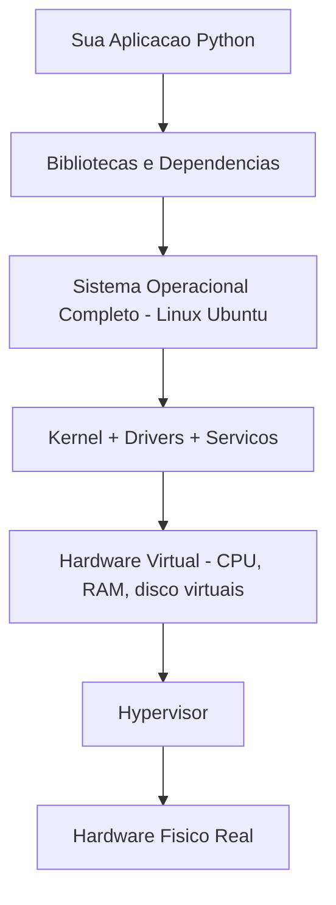
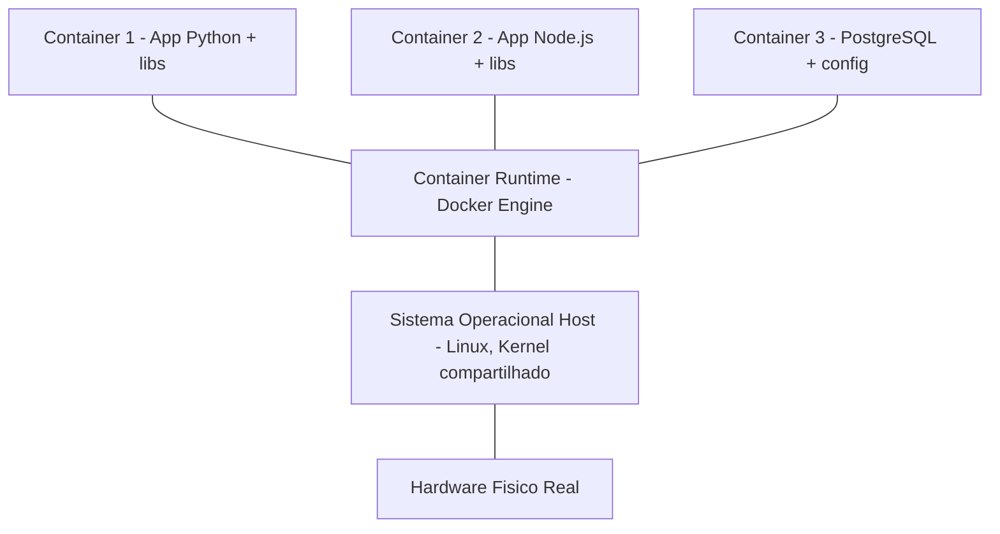
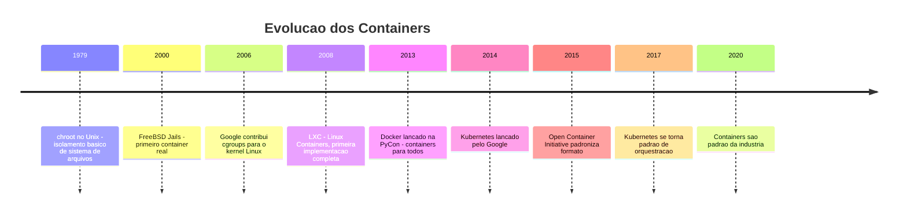
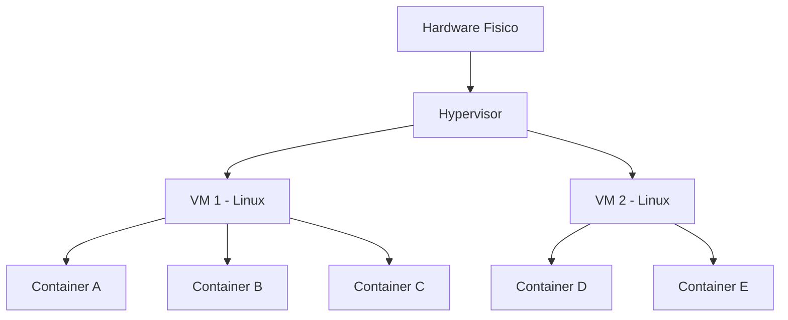
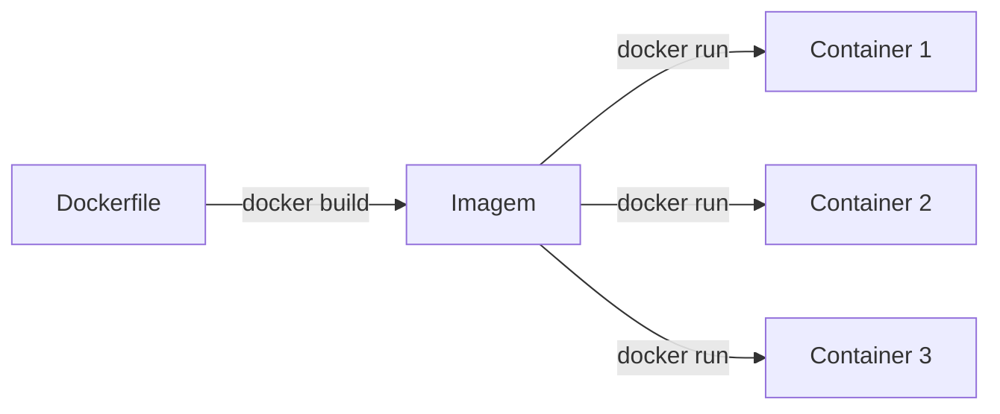

# 6.2 — VMs vs Containers: Diferenças e Quando Usar Cada Um

[← Anterior: O que é Virtualização](cap06-mod01-o-que-e-virtualizacao-conteudo.md) · [Próximo: Docker na Prática →](cap06-mod03-docker-basico-conteudo.md)

---

## Introdução

No módulo anterior, você aprendeu o que é virtualização, como ela surgiu e por que revolucionou a forma como servidores são usados. Viu que máquinas virtuais (VMs) permitem rodar vários sistemas operacionais em um único servidor físico, economizando hardware, energia e dinheiro.

Mas VMs têm um problema: cada uma carrega um **sistema operacional completo**. Se você precisa rodar 10 aplicações isoladas, precisa de 10 VMs, cada uma com seu próprio Linux ou Windows. São 10 cópias do sistema operacional consumindo memória, disco e CPU — mesmo que as 10 aplicações precisem do mesmo sistema.

Imagine o prédio de apartamentos que usamos como analogia no módulo anterior. Cada apartamento (VM) tem sua própria cozinha, banheiro, sala e quarto. Funciona bem, mas é muito espaço para quem só precisa de um quarto para dormir.

E se existisse uma opção mais leve? Um **quarto de hotel** — você tem seu espaço privado (cama, banheiro), mas compartilha a infraestrutura do prédio (recepção, elevadores, encanamento, eletricidade). É mais eficiente, mais rápido de preparar e custa menos.

Essa é a diferença fundamental entre VMs e containers. Neste módulo, vamos entender essa diferença em profundidade, ver quando usar cada um e preparar o terreno para o Docker, que vamos instalar e usar a partir do módulo 6.3.

---

## Como Executar os Exemplos Deste Módulo

Este módulo é predominantemente conceitual — a parte prática com Docker começa no módulo 6.3. Aqui o foco é entender as diferenças entre VMs e containers para que, quando você começar a usar Docker, saiba exatamente o que está acontecendo por baixo dos panos.

---

## Relembrando: Como uma VM Funciona

Antes de falar de containers, vamos relembrar como uma VM funciona, agora com mais detalhes sobre o que acontece quando ela é criada e executada.

### A Estrutura de uma VM

Quando você cria uma VM, o hypervisor reserva recursos do hardware e cria um ambiente completo:



Repare que a VM inclui um **sistema operacional completo** — kernel, drivers, serviços, ferramentas. Tudo isso precisa ser carregado na memória quando a VM liga, mesmo que sua aplicação seja um script Python de 10 linhas.

### O Custo de um SO Completo

Um sistema operacional não é leve. Veja o que um Ubuntu Server mínimo consome:

| Recurso | Ubuntu Server (mínimo) |
|---------|----------------------|
| Disco | ~2.5 GB de instalação |
| RAM | ~256-512 MB em repouso |
| Tempo de boot | 15-60 segundos |
| Processos em background | 50-100 processos do sistema |

Agora multiplique isso por 10 VMs: são 25 GB de disco só para os sistemas operacionais, 2.5-5 GB de RAM só para manter os SOs rodando, e vários minutos para ligar todas as VMs.

Para aplicações grandes e complexas, esse custo é aceitável. Mas para aplicações pequenas — como um script Python, uma API simples ou um serviço de processamento — é um desperdício enorme. É como alugar um apartamento de 3 quartos para guardar uma mala.

### O Problema da Duplicação

Se você tem 10 VMs rodando Ubuntu, tem 10 cópias do kernel Linux na memória. 10 cópias dos mesmos drivers. 10 cópias dos mesmos serviços do sistema. Todas idênticas, todas consumindo recursos separadamente.

Não seria mais inteligente ter **uma única cópia** do sistema operacional e compartilhá-la entre todas as aplicações, mantendo cada aplicação isolada?

Essa é exatamente a ideia dos containers.

---

## Como um Container Funciona

### A Estrutura de um Container

Um container é fundamentalmente diferente de uma VM. Em vez de virtualizar o hardware e rodar um SO completo, o container **compartilha o kernel do sistema operacional host** e isola apenas a aplicação e suas dependências.



A diferença é clara: **não existe um SO completo dentro de cada container**. Todos os containers compartilham o mesmo kernel Linux do host. Cada container tem apenas:

- A aplicação em si
- As bibliotecas e dependências que a aplicação precisa
- Arquivos de configuração específicos

### O que o Container Compartilha e o que Isola

| Aspecto | Compartilhado | Isolado |
|---------|--------------|---------|
| Kernel do SO | Sim — todos usam o mesmo kernel | Não — cada container não tem seu próprio kernel |
| Sistema de arquivos | Não — cada container tem seu próprio | Sim — um container não vê os arquivos de outro |
| Processos | Não — cada container vê apenas seus processos | Sim — processos de um container são invisíveis para outro |
| Rede | Parcial — cada container tem seu próprio IP | Sim — containers podem ter redes isoladas |
| Usuários | Parcial — mapeamento de usuários | Sim — root dentro do container não é root no host |
| CPU e RAM | Parcial — limites configuráveis | Sim — cada container pode ter limites definidos |

### Como o Isolamento Funciona (Sem Entrar em Detalhes Profundos)

O conceito de compartilhar recursos de hardware entre múltiplos usuários isolados **não é novo** — como vimos no módulo 6.1, os mainframes IBM já faziam isso nos anos 1960 com o CP-67 e o VM/370. A ideia de dividir CPU, memória e disco entre processos independentes existe há mais de 50 anos.

O que mudou foi que essas ideias se tornaram **fundamentais e largamente aplicáveis** somente com a popularização do Linux em servidores nos anos 2000. O Linux, sendo open source e dominante em servidores, permitiu que funcionalidades de isolamento fossem integradas diretamente no kernel e disponibilizadas para qualquer pessoa. Sem o Linux como plataforma dominante, containers como conhecemos não existiriam.

O Linux tem duas funcionalidades nativas que tornam containers possíveis:

1. **Namespaces**: criam "visões" isoladas dos recursos do sistema. Cada container tem seu próprio namespace de processos (só vê seus processos), de rede (tem seu próprio IP), de sistema de arquivos (tem sua própria raiz `/`), etc. É como se cada container vivesse em seu próprio "universo" dentro do mesmo Linux. A ideia é a mesma dos mainframes — cada usuário acha que tem o computador inteiro — mas agora implementada no nível do kernel Linux.

2. **Cgroups** (Control Groups): limitam quanto de CPU, memória e disco cada container pode usar. Foram contribuídos pelo Google para o kernel Linux entre 2006 e 2008, baseados em anos de experiência interna do Google gerenciando milhares de servidores. Sem cgroups, um container poderia consumir todos os recursos do host e prejudicar os outros — exatamente o mesmo problema que os mainframes resolviam com particionamento de hardware.

Você não precisa entender os detalhes de namespaces e cgroups agora — o Docker cuida de tudo isso automaticamente. O importante é saber que containers usam funcionalidades nativas do Linux para criar isolamento, sem precisar de um hypervisor ou de um SO completo. E que essas funcionalidades são a evolução moderna de ideias que existem desde os primórdios da computação.

---

## A Comparação Detalhada: VM vs Container

Agora que você entende como cada um funciona, vamos comparar lado a lado.

### Tamanho e Recursos

| Critério | VM | Container |
|----------|-----|-----------|
| Tamanho da imagem | 1-10 GB (SO completo + app) | 10-500 MB (só app + dependências) |
| RAM em repouso | 256 MB - 2 GB (SO + app) | 5-50 MB (só app) |
| Tempo de inicialização | 15-60 segundos | 0.1-2 segundos |
| Overhead de CPU | 5-15% (hypervisor + SO guest) | 1-3% (quase nativo) |
| Quantidade por servidor | 10-50 VMs típico | 100-1000 containers típico |

Os números falam por si. Um container é **ordens de magnitude mais leve** que uma VM. Onde cabem 20 VMs, cabem 200 containers. Onde uma VM leva 30 segundos para ligar, um container leva menos de 1 segundo.

### Isolamento e Segurança

| Critério | VM | Container |
|----------|-----|-----------|
| Nível de isolamento | Completo (hardware virtual) | Processo (namespaces do kernel) |
| SO independente | Sim (cada VM tem seu SO) | Não (compartilha kernel do host) |
| Risco de escape | Muito baixo (barreira de hardware) | Baixo, mas maior que VM |
| Pode rodar SO diferente | Sim (Windows em host Linux) | Não (precisa do mesmo kernel) |
| Adequado para multi-tenant | Sim (cloud providers usam VMs) | Com cuidado (isolamento menor) |

Aqui está o trade-off principal: VMs oferecem **isolamento mais forte** porque cada uma tem seu próprio kernel e hardware virtual. Containers compartilham o kernel, o que significa que uma vulnerabilidade no kernel pode afetar todos os containers.

Na prática, para desenvolvimento e a maioria dos cenários de produção, o isolamento de containers é mais que suficiente. Mas para cenários onde segurança é crítica (como cloud providers que hospedam clientes diferentes no mesmo servidor), VMs ainda são preferidas.

### Portabilidade

| Critério | VM | Container |
|----------|-----|-----------|
| Mover entre hosts | Possível (live migration) | Muito fácil (imagem portátil) |
| Mover entre clouds | Complexo (formatos diferentes) | Simples (Docker roda em qualquer lugar) |
| Compartilhar com colegas | Arquivo grande (GB) | Imagem leve (MB), via registry |
| Reprodutibilidade | Boa (snapshot) | Excelente (Dockerfile = receita) |

Containers brilham em portabilidade. Uma imagem Docker roda igual no seu computador, no computador do colega, no servidor de testes e no servidor de produção. Essa é a promessa que resolve o problema do "funciona no meu computador".

### Velocidade de Desenvolvimento

| Critério | VM | Container |
|----------|-----|-----------|
| Criar ambiente novo | Minutos (instalar SO, configurar) | Segundos (baixar imagem, rodar) |
| Reconstruir após mudança | Minutos | Segundos |
| Testar em ambiente limpo | Criar nova VM ou restaurar snapshot | Destruir e recriar container |
| Integração com CI/CD | Possível, mas pesado | Natural e rápido |

Para desenvolvimento de software, containers são muito mais ágeis. Você muda o código, reconstrói o container em segundos e testa. Com VMs, cada mudança envolve processos mais lentos.

---

## A Analogia Completa: Apartamento vs Hotel vs Acampamento

Vamos expandir a analogia que começamos no módulo anterior para incluir containers:

### VM = Apartamento Completo

Cada VM é como um apartamento completo em um prédio:
- Tem sua própria cozinha, banheiro, sala e quartos
- Funciona de forma totalmente independente
- Se a cozinha do vizinho pegar fogo, a sua não é afetada
- Demora para construir e mobiliar (instalar SO, configurar)
- Ocupa muito espaço no prédio
- Custa mais caro (mais recursos)

### Container = Quarto de Hotel

Cada container é como um quarto de hotel:
- Tem seu espaço privado (cama, banheiro)
- Compartilha a infraestrutura do prédio (recepção, elevadores, encanamento, eletricidade)
- É preparado rapidamente (check-in em minutos)
- Ocupa menos espaço que um apartamento
- Custa menos
- Se o encanamento do prédio quebrar (problema no kernel), todos os quartos são afetados

### Servidor Físico Dedicado = Casa Própria

Para completar, o modelo antigo (um servidor por aplicação) é como ter uma casa própria:
- Totalmente independente
- Você controla tudo
- Muito espaço, geralmente subutilizado
- Muito caro para manter
- Demora muito para construir

### Tabela da Analogia

| Aspecto | Casa (Servidor Dedicado) | Apartamento (VM) | Hotel (Container) |
|---------|-------------------------|-------------------|-------------------|
| Independência | Total | Alta | Média |
| Custo | Alto | Médio | Baixo |
| Tempo de preparo | Semanas | Minutos | Segundos |
| Espaço usado | Muito | Médio | Pouco |
| Compartilhamento | Nenhum | Hardware | Hardware + Kernel |
| Isolamento | Total | Forte | Bom |
| Flexibilidade | Total (faz o que quiser) | Alta (SO próprio) | Média (mesmo kernel) |
| Manutenção | Você cuida de tudo | Você cuida do SO e app | Você cuida só da app |
| Escalabilidade | Comprar nova casa | Criar nova VM | Criar novo container |

Essa analogia é útil para lembrar rapidamente as diferenças. Quando alguém perguntar "qual a diferença entre VM e container?", pense: apartamento vs quarto de hotel.

---

## A História dos Containers

Containers não surgiram do nada. Assim como VMs, eles têm uma história que vale conhecer.

### 1979: chroot no Unix

A ideia de isolar processos é antiga. Em 1979, o Unix introduziu o comando **chroot** (change root), que permite mudar o diretório raiz de um processo. Com chroot, um processo acha que `/` é uma pasta específica, não a raiz real do sistema. É uma forma primitiva de isolamento de sistema de arquivos.

O chroot não isola processos, rede ou recursos — apenas o sistema de arquivos. Mas plantou a semente da ideia: "e se pudéssemos isolar um processo completamente?"

### 2000: FreeBSD Jails

O sistema operacional FreeBSD introduziu os **Jails** em 2000 — uma evolução do chroot que isolava não apenas o sistema de arquivos, mas também processos, rede e usuários. Cada Jail era como um mini-sistema operacional dentro do FreeBSD.

Jails foram a primeira implementação prática de algo parecido com containers modernos. Mas eram específicos do FreeBSD e não ganharam adoção ampla. O FreeBSD nunca teve a mesma penetração em servidores que o Linux, o que limitou o alcance dessa tecnologia.

### 2006-2008: cgroups e namespaces no Linux

O Google contribuiu com os **cgroups** (Control Groups) para o kernel Linux em 2006-2008. Cgroups permitem limitar e contabilizar o uso de recursos (CPU, memória, disco) por grupos de processos.

O conceito por trás dos cgroups não era novo — como vimos, mainframes IBM já faziam particionamento de recursos nos anos 1960. A diferença é que agora essas capacidades estavam sendo integradas ao **Linux**, o sistema operacional open source que dominava (e domina) o mercado de servidores. Isso significava que qualquer pessoa, em qualquer servidor, podia usar essas funcionalidades gratuitamente.

Combinados com **namespaces** (que já existiam no Linux desde 2002 e foram expandidos ao longo dos anos), cgroups forneceram a base técnica para containers no Linux. Mas usar cgroups e namespaces diretamente era complexo — poucos desenvolvedores sabiam como fazer. Faltava uma ferramenta que tornasse tudo isso acessível.

### 2008: LXC (Linux Containers)

O projeto **LXC** (Linux Containers) foi a primeira implementação completa de containers no Linux, combinando cgroups e namespaces em uma ferramenta utilizável. LXC permitia criar containers Linux sem precisar de um hypervisor.

LXC funcionava, mas era complexo de usar e não tinha um ecossistema de distribuição de imagens. Criar e compartilhar containers era trabalhoso — você precisava configurar tudo manualmente, sem um formato padronizado. Era como ter um carro potente mas sem estradas pavimentadas.

A peça que faltava era uma ferramenta que tornasse containers tão fáceis de usar quanto VMs já eram com o VirtualBox. Essa ferramenta chegou em 2013.

### 2013: Docker Muda Tudo

Em março de 2013, Solomon Hykes apresentou o **Docker** na conferência PyCon (sim, uma conferência de Python — o que mostra como Python e Docker estão conectados desde o início). Docker não inventou containers — usava LXC por baixo (e depois substituiu por seu próprio runtime, o containerd). O que Docker fez foi tornar containers **fáceis de usar**.

As inovações do Docker:

1. **Dockerfile**: um arquivo de texto simples que descreve como construir uma imagem. Qualquer pessoa pode ler e entender.

2. **Docker Hub**: um repositório público de imagens prontas. Precisa de um banco PostgreSQL? `docker pull postgres`. Precisa de Python? `docker pull python`. Milhares de imagens disponíveis gratuitamente.

3. **Imagens em camadas**: cada instrução do Dockerfile cria uma camada. Camadas são reutilizadas entre imagens, economizando espaço e tempo de download.

4. **CLI simples**: `docker build`, `docker run`, `docker stop`. Comandos intuitivos que qualquer desenvolvedor consegue usar.

Docker democratizou containers. Antes do Docker, containers eram coisa de administradores de sistemas experientes. Depois do Docker, qualquer desenvolvedor podia criar, compartilhar e rodar containers em minutos.

### 2014-presente: O Ecossistema Explode

Após o Docker, o ecossistema de containers explodiu:

- **2014**: Google lança o **Kubernetes** (K8s), um orquestrador de containers para produção
- **2015**: A **Open Container Initiative** (OCI) padroniza o formato de containers
- **2016**: Docker se torna padrão na indústria; praticamente toda empresa de tecnologia adota
- **2017**: Kubernetes se torna o padrão de orquestração, superando Docker Swarm
- **2019**: **Podman** surge como alternativa ao Docker, sem daemon central
- **2020+**: Containers são o padrão para deploy de aplicações modernas



---

## Quando Usar VM e Quando Usar Container

Essa é a pergunta mais importante do módulo. Não existe "melhor" — existe "mais adequado para o cenário".

### Use VMs Quando:

1. **Precisa de isolamento total**: cenários onde a segurança é crítica e um container não oferece isolamento suficiente. Exemplo: cloud providers que hospedam clientes diferentes no mesmo servidor.

2. **Precisa rodar sistemas operacionais diferentes**: quer rodar Windows e Linux no mesmo servidor? Precisa de VMs — containers Linux só rodam em hosts Linux (e containers Windows só em hosts Windows).

3. **Precisa de um ambiente completo e persistente**: um servidor que vai ficar rodando por meses ou anos, com configurações complexas e múltiplos serviços. VMs são mais adequadas para "servidores permanentes".

4. **Precisa testar sistemas operacionais**: quer experimentar uma distribuição Linux nova, ou testar como seu programa funciona no Ubuntu vs Fedora? VMs permitem isso facilmente.

5. **Aplicações legadas**: sistemas antigos que foram projetados para rodar em um servidor dedicado e não se adaptam bem a containers.

### Use Containers Quando:

1. **Precisa de ambientes de desenvolvimento consistentes**: garantir que toda a equipe roda o mesmo ambiente. Este é o caso de uso mais comum para desenvolvedores.

2. **Precisa de deploy rápido e reproduzível**: empacotar sua aplicação com todas as dependências e garantir que roda igual em qualquer lugar.

3. **Precisa rodar muitas instâncias da mesma aplicação**: escalar horizontalmente (rodar 50 cópias da mesma API para aguentar mais tráfego). Containers são perfeitos para isso — leves e rápidos de criar.

4. **Precisa de ambientes descartáveis**: criar, usar e destruir ambientes rapidamente. Testes automatizados, experimentos, prototipagem.

5. **Microserviços**: cada serviço em seu próprio container, com deploy independente. Este é o modelo que empresas como Netflix, Spotify e Nubank usam.

6. **CI/CD (Integração e Entrega Contínua)**: rodar testes em ambientes limpos e isolados, automaticamente, a cada mudança no código.

### A Regra Prática

Para o seu dia a dia como desenvolvedor, aqui está um guia rápido:

- **Desenvolvimento local**: containers (Docker) — rápido, leve, fácil de compartilhar
- **Testar outro SO**: VM (VirtualBox) — precisa do SO completo
- **Deploy em produção**: containers (Docker/Kubernetes) — padrão da indústria
- **Infraestrutura de cloud**: VMs por baixo, containers por cima — a cloud roda containers dentro de VMs
- **Aprender um SO novo**: VM (VirtualBox) — instalar e experimentar sem risco
- **Rodar banco de dados local**: container (Docker) — `docker run postgres` e pronto
- **Ambiente de CI/CD**: containers — cada teste em ambiente limpo e descartável

### VMs e Containers Juntos

Na verdade, VMs e containers frequentemente trabalham **juntos**. Em um data center moderno, o servidor físico roda um hypervisor que cria VMs, e dentro de cada VM rodam containers. É virtualização em camadas:



Essa arquitetura combina o melhor dos dois mundos:
- VMs fornecem **isolamento forte** entre clientes ou ambientes diferentes
- Containers fornecem **agilidade e eficiência** dentro de cada VM

É assim que a maioria dos cloud providers funciona: cada cliente recebe uma VM isolada, e dentro dessa VM, o cliente roda seus containers como quiser.

---

## Containers e o Problema do "Funciona no Meu Computador"

Vamos voltar ao problema que abriu o capítulo 6 e ver como containers resolvem de forma concreta.

### O Cenário

Você escreveu um programa Python no capítulo 5. Funciona perfeitamente no seu computador. Agora quer compartilhar com um colega. Vamos ver as duas abordagens lado a lado.

### Sem Container (O Caminho Doloroso)

1. Você manda o arquivo `.py` para o colega
2. O colega tenta rodar: `python3 programa.py`
3. Erro: "Python não encontrado" — ele tem Python 2, não Python 3
4. Ele instala Python 3. Tenta de novo.
5. Erro: "ModuleNotFoundError: No module named 'requests'" — falta uma biblioteca
6. Ele instala a biblioteca. Tenta de novo.
7. Erro: "versão incompatível" — a biblioteca dele é mais nova e mudou a API
8. Frustração. Desistência. "Funciona no meu computador."

### Com Container (O Caminho Simples)

1. Você cria um Dockerfile que define: Python 3.12, biblioteca requests 2.31, seu código
2. Você constrói a imagem: `docker build -t meu-programa .`
3. Você compartilha a imagem (via Docker Hub ou arquivo)
4. O colega roda: `docker run meu-programa`
5. Funciona. Primeira tentativa. Sem instalar nada além do Docker.

O container carrega **tudo** que o programa precisa: a versão exata do Python, as versões exatas das bibliotecas, as configurações do sistema. Não importa o que está instalado no computador do colega — o container é autossuficiente.

Esse é o poder real dos containers: **reprodutibilidade**. O mesmo container roda igual em qualquer lugar. Não existe "funciona no meu computador" quando você usa containers corretamente.

### O Dockerfile como Documentação

Um benefício extra do Dockerfile é que ele serve como **documentação viva** do ambiente. Em vez de um README dizendo "instale Python 3.12, depois instale requests com pip, depois configure a variável X...", o Dockerfile contém todas essas instruções de forma executável:

```dockerfile
FROM python:3.12-slim
WORKDIR /app
COPY requirements.txt .
RUN pip install -r requirements.txt
COPY . .
CMD ["python3", "programa.py"]
```

Qualquer pessoa que leia esse arquivo sabe exatamente o que o programa precisa para rodar. E mais: pode construir o ambiente automaticamente com um único comando.

Vamos aprender a escrever Dockerfiles no módulo 6.4. Por enquanto, o importante é entender o conceito.

---

## Imagens e Containers: A Diferença

Um conceito fundamental que você precisa entender antes de usar Docker é a diferença entre **imagem** e **container**.

### Imagem = Receita (ou Molde)

Uma imagem Docker é um **pacote estático** que contém tudo necessário para rodar uma aplicação: código, bibliotecas, ferramentas, configurações. A imagem não roda — ela é um template.

Analogia: a imagem é como uma **receita de bolo**. A receita descreve os ingredientes e o passo a passo, mas não é um bolo. Você pode fazer quantos bolos quiser a partir da mesma receita.

### Container = Bolo (ou Instância)

Um container é uma **instância em execução** de uma imagem. Quando você "roda" uma imagem, cria um container. O container é o processo vivo, rodando, consumindo recursos.

Analogia: o container é o **bolo pronto**. Feito a partir da receita (imagem), cada bolo é independente — você pode comer um sem afetar os outros.

### A Relação



- Um **Dockerfile** é o código-fonte da imagem (a receita escrita)
- Uma **imagem** é o resultado do build (a receita pronta para usar)
- Um **container** é uma instância rodando da imagem (o bolo feito)

Você pode criar quantos containers quiser a partir da mesma imagem. Cada container é independente — se um travar, os outros continuam. Se você modificar arquivos dentro de um container, os outros não são afetados.

### Analogia com OOP (Preview do Capítulo 9)

Se você já ouviu falar de programação orientada a objetos (vamos aprender no capítulo 9), a relação é parecida:

- Imagem = Classe (o molde, a definição)
- Container = Objeto (a instância, o uso concreto)

Assim como você pode criar vários objetos a partir de uma classe, pode criar vários containers a partir de uma imagem.

---

## Docker: O que É e por que Dominou

Já mencionamos Docker várias vezes. Vamos entender melhor o que ele é.

### O que é Docker

Docker é uma **plataforma para criar, distribuir e rodar containers**. Ele não inventou containers, mas tornou-os acessíveis para qualquer desenvolvedor.

Docker é composto por:

1. **Docker Engine**: o motor que cria e gerência containers no seu computador
2. **Docker CLI**: a interface de linha de comando (`docker build`, `docker run`, etc.)
3. **Docker Hub**: repositório público de imagens prontas (como um "app store" de containers)
4. **Docker Desktop**: aplicação com interface gráfica para Windows e macOS
5. **Docker Compose**: ferramenta para orquestrar múltiplos containers (vamos ver no módulo 6.5)

### Por que Docker Dominou

Antes do Docker, existiam outras tecnologias de containers (LXC, OpenVZ, Solaris Zones). Mas Docker dominou por causa de:

1. **Simplicidade**: criar um container com Docker é questão de um comando. As alternativas eram muito mais complexas.

2. **Ecossistema**: Docker Hub tem milhões de imagens prontas. Precisa de um banco de dados? `docker pull postgres`. Precisa de Redis? `docker pull redis`. Precisa de Python? `docker pull python`. Tudo pronto, testado e documentado.

3. **Portabilidade**: "Build once, run anywhere" — construa a imagem uma vez e rode em qualquer lugar que tenha Docker. Linux, macOS, Windows, cloud, servidor local — tanto faz.

4. **Comunidade**: Docker tem uma comunidade enorme. Qualquer problema que você encontrar, alguém já resolveu e documentou.

5. **Integração**: Docker se integra com praticamente todas as ferramentas de desenvolvimento modernas — CI/CD, cloud providers, orquestradores, IDEs.

Hoje, Docker é tão onipresente que "saber Docker" é praticamente um requisito para qualquer vaga de desenvolvedor. Não porque Docker é difícil — pelo contrário, é uma das ferramentas mais fáceis de aprender. Mas porque é fundamental para o fluxo de trabalho moderno de desenvolvimento de software.

### Docker no macOS e Windows

Uma observação importante: containers Linux precisam do kernel Linux para funcionar. Mas e se você usa macOS ou Windows?

**No macOS**, Docker Desktop resolve isso criando uma **VM Linux leve** automaticamente no seu computador. Essa VM roda o kernel Linux necessário para os containers. Você não precisa se preocupar com isso — o Docker Desktop cuida de tudo. A experiência no macOS é boa e confiável.

**No Windows, a situação é diferente e problemática.** Mesmo com WSL 2 (Windows Subsystem for Linux 2), Docker no Windows apresenta muitos problemas que podem atrapalhar seriamente o aprendizado:

- Performance inferior por causa das múltiplas camadas de virtualização
- Problemas de permissões entre o sistema de arquivos do Windows e do Linux
- Problemas com line endings (Windows usa CRLF, Linux usa LF) que causam erros silenciosos e difíceis de diagnosticar
- Volumes montados entre Windows e WSL têm performance muito ruim
- Networking entre o host Windows e os containers é inconsistente
- Atualizações do Windows frequentemente quebram o WSL e o Docker Desktop
- Quando algo dá errado, é muito difícil saber se o problema é do Windows, do WSL ou do Docker

**Recomendação forte: use Linux nativo ou macOS para trabalhar com Docker.** Se você só tem Windows, a melhor opção é instalar Linux em uma VM (VirtualBox + Ubuntu, como vimos no capítulo 2) e rodar Docker dentro dela. Ironicamente, Docker dentro de uma VM Linux no Windows é mais confiável do que Docker no Windows nativo com WSL.

| Sistema | Confiabilidade para Docker | Recomendação |
|---------|---------------------------|-------------|
| Linux nativo | Excelente — Docker roda nativamente | Melhor opcao |
| macOS | Boa — VM Linux leve e transparente | Recomendado |
| Windows com WSL 2 | Problematica — muitos problemas | Desaconselhado |
| Windows com VM Linux | Boa — Docker roda no Linux da VM | Alternativa para quem so tem Windows |

No Linux, Docker roda nativamente — sem VM intermediária. É por isso que Docker no Linux é a experiência mais rápida, eficiente e confiável. Se você está usando Linux (como aprendemos nos capítulos 2 e 3), terá a melhor experiência com Docker.

---

## Alternativas ao Docker

Docker é o mais popular, mas não é o único. Vale conhecer as alternativas:

### Podman

**Podman** é uma alternativa ao Docker criada pela Red Hat. A principal diferença é que Podman não precisa de um daemon (processo em background) rodando — cada container é um processo independente. Os comandos são quase idênticos aos do Docker (`podman build`, `podman run`).

Podman é popular em ambientes corporativos que usam Red Hat Enterprise Linux. Para aprendizado, Docker e Podman são praticamente intercambiáveis.

### containerd e CRI-O

**containerd** e **CRI-O** são runtimes de containers usados por orquestradores como Kubernetes. Eles são mais "baixo nível" que Docker — não têm CLI amigável nem Docker Hub. São usados por infraestrutura, não por desenvolvedores diretamente.

### LXC/LXD

**LXC** (Linux Containers) e **LXD** são containers que se comportam mais como VMs leves — rodam um sistema operacional completo dentro do container, não apenas uma aplicação. São usados quando você precisa de algo entre uma VM e um container Docker.

### Para o Curso

Vamos usar Docker porque é o padrão da indústria e o mais fácil de aprender. Os conceitos que você aprender com Docker se aplicam a qualquer tecnologia de containers — se no futuro você precisar usar Podman, containerd ou qualquer outra ferramenta, a transição será natural porque os conceitos são os mesmos.

| Ferramenta | Tipo | Uso principal | Complexidade |
|------------|------|---------------|-------------|
| Docker | Plataforma completa | Desenvolvimento, CI/CD, produção | Baixa |
| Podman | Alternativa ao Docker | Ambientes Red Hat, sem daemon | Baixa |
| LXC/LXD | Containers de sistema | VMs leves, servidores | Média |
| containerd | Runtime de baixo nível | Kubernetes, infraestrutura | Alta |
| CRI-O | Runtime para Kubernetes | Produção com Kubernetes | Alta |

---

## Casos de Uso no Mundo Real

### 1. Netflix: Milhares de Containers em Produção

A Netflix roda centenas de microserviços que juntos formam a plataforma de streaming que mais de 200 milhões de pessoas usam. Cada microserviço (recomendação de filmes, processamento de pagamento, streaming de vídeo, interface do usuário, catálogo de títulos) roda em seus próprios containers.

Quando você abre o Netflix e vê a lista de filmes recomendados, pelo menos 5-10 microserviços diferentes foram chamados, cada um rodando em containers separados. Se o serviço de recomendação tiver um bug, o serviço de streaming continua funcionando — você pode assistir filmes, só não recebe recomendações personalizadas.

A Netflix usa containers porque precisa escalar rapidamente: durante horários de pico (noite, fins de semana, lançamento de séries populares), cria centenas de containers adicionais para aguentar a demanda. Quando o pico passa, destrói os containers extras e para de pagar por eles. Com VMs, essa escalabilidade seria muito mais lenta e cara — cada VM leva minutos para iniciar, enquanto containers levam segundos.

### 2. Spotify: Desenvolvimento com Containers

O Spotify tem mais de 1.000 desenvolvedores trabalhando em centenas de serviços diferentes. Cada desenvolvedor precisa de um ambiente local que simule a infraestrutura de produção — banco de dados, filas de mensagens, serviços auxiliares.

Antes de containers, configurar esse ambiente levava dias. Cada desenvolvedor novo passava uma semana inteira só instalando e configurando ferramentas. Pior: cada computador ficava ligeiramente diferente, e bugs apareciam em uma máquina mas não em outra.

Com Docker e docker-compose, o ambiente inteiro é definido em um arquivo de configuração e sobe com um único comando. Um desenvolvedor novo está produtivo em horas, não em dias. E como todos rodam o mesmo arquivo de configuração, todos têm exatamente o mesmo ambiente — eliminando a classe inteira de bugs causados por diferenças de configuração.

### 3. Bancos Digitais: Segurança com Isolamento

Bancos digitais como Nubank processam milhões de transações financeiras por dia. Cada serviço (processamento de Pix, análise de crédito, detecção de fraude, gestão de cartões) roda em containers isolados.

O isolamento é crucial em um banco: se o serviço de análise de crédito tiver um problema, ele não pode afetar o serviço de processamento de Pix — pessoas precisam continuar fazendo transferências. Containers garantem esse isolamento de forma leve e eficiente.

Além disso, cada mudança no código passa por pipelines de CI/CD que rodam centenas de testes automatizados em containers descartáveis — garantindo que nenhum bug chegue à produção e comprometa dados financeiros dos clientes. Um único bug em um sistema bancário pode causar prejuízos de milhões de reais, então a confiabilidade dos testes é fundamental.

---

## Como a IA pode te ajudar aqui

**Prompt 1 — Explorar o conceito:**
> "Explique com exemplos práticos quando eu deveria usar uma VM em vez de um container Docker"

**Prompt 2 — Comparar alternativas:**
> "Qual a diferença entre Docker e Podman? Qual devo usar para aprender?"

**Prompt 3 — Aprender passo a passo:**
> "Como funciona o isolamento de containers por baixo dos panos? Explique namespaces e cgroups de forma simples"

---

## Resumo do Módulo

| Conceito | Definição |
|----------|-----------|
| VM (Máquina Virtual) | Virtualiza hardware completo, roda SO próprio, isolamento forte, mais pesada |
| Container | Compartilha kernel do host, isola apenas a aplicação, muito mais leve e rápido |
| Imagem Docker | Pacote estático com tudo necessário para rodar uma aplicação (template) |
| Container Docker | Instância em execução de uma imagem (processo vivo) |
| Dockerfile | Arquivo de texto que descreve como construir uma imagem Docker |
| Docker Hub | Repositório público de imagens Docker prontas para uso |
| Namespace | Funcionalidade do Linux que cria visões isoladas de recursos do sistema |
| Cgroup | Funcionalidade do Linux que limita uso de CPU, memória e disco por processo |
| Docker Engine | Motor que cria e gerência containers no computador |
| Docker Compose | Ferramenta para orquestrar múltiplos containers simultaneamente |

---

## Glossário do Módulo

| Termo | Definição |
|-------|-----------|
| AMD-V | Tecnologia de virtualização de hardware da AMD |
| Build | Processo de construir uma imagem Docker a partir de um Dockerfile |
| Cgroup (Control Group) | Funcionalidade do Linux que limita e contabiliza uso de recursos por grupos de processos |
| chroot | Comando Unix que muda o diretório raiz de um processo, forma primitiva de isolamento |
| CI/CD | Continuous Integration / Continuous Delivery — prática de integrar e entregar código continuamente |
| Container | Ambiente isolado e leve que compartilha o kernel do host e roda uma aplicação com suas dependências |
| Container runtime | Software que executa containers (Docker Engine, containerd, CRI-O) |
| containerd | Runtime de containers de baixo nível, usado pelo Docker e Kubernetes |
| CRI-O | Runtime de containers otimizado para Kubernetes |
| Build | Processo de construir uma imagem Docker a partir de um Dockerfile |
| CRLF vs LF | Diferença nos caracteres de fim de linha entre Windows e Linux, causa problemas em containers |
| Daemon | Processo que roda em background no sistema operacional |
| Docker | Plataforma para criar, distribuir e rodar containers |
| Docker CLI | Interface de linha de comando do Docker |
| Docker Compose | Ferramenta para definir e rodar aplicações multi-container |
| Docker Desktop | Aplicação com interface gráfica do Docker para Windows e macOS |
| Docker Engine | Motor principal do Docker que gerência containers |
| Docker Hub | Repositório público de imagens Docker, como um app store de containers |
| Dockerfile | Arquivo de texto com instruções para construir uma imagem Docker |
| FreeBSD Jails | Tecnologia de isolamento do FreeBSD, precursora dos containers modernos |
| Guest | Sistema operacional que roda dentro de uma VM |
| Host | Sistema operacional ou máquina que hospeda VMs ou containers |
| Hypervisor | Software que cria e gerência máquinas virtuais |
| Imagem Docker | Pacote estático e imutável que contém aplicação, bibliotecas e configurações |
| Isolamento | Separação entre ambientes que impede que um afete o outro |
| Kernel | Núcleo do sistema operacional que gerência hardware e processos |
| Kubernetes (K8s) | Plataforma de orquestração de containers para produção, criada pelo Google |
| LXC (Linux Containers) | Primeira implementação completa de containers no Linux |
| Multi-tenant | Modelo onde múltiplos clientes compartilham a mesma infraestrutura |
| Namespace | Funcionalidade do Linux que cria visões isoladas de recursos do sistema para processos |
| OCI (Open Container Initiative) | Organização que padroniza o formato de containers |
| Overhead | Custo adicional de recursos causado por uma camada de abstração |
| Podman | Alternativa ao Docker sem daemon central, criada pela Red Hat |
| Portabilidade | Capacidade de rodar o mesmo software em diferentes ambientes sem modificação |
| Registry | Repositório de imagens de containers (Docker Hub é o mais conhecido) |
| Runtime | Software que executa containers ou programas |
| Snapshot | Captura do estado completo de uma VM em um momento específico |
| WSL 2 (Windows Subsystem for Linux 2) | Camada de compatibilidade que permite rodar Linux dentro do Windows — apresenta problemas com Docker |
| Snapshot | Captura do estado completo de uma VM em um momento específico |
| Solomon Hykes | Criador do Docker, apresentou a ferramenta na PyCon 2013 |
| VT-x | Tecnologia de virtualização de hardware da Intel |

---

## Na Cultura Popular

- **Mr. Robot** (série, 2015-2019) — O protagonista Elliot usa Linux extensivamente e trabalha com infraestrutura de servidores. A série mostra cenários reais de data centers, servidores e isolamento de sistemas — conceitos diretamente relacionados a VMs e containers.

- **Silicon Valley** (série, 2014-2019) — A série acompanha uma startup de tecnologia e mostra os desafios de escalar infraestrutura. Em várias cenas, os personagens lidam com servidores, deploy e escalabilidade — problemas que containers resolvem no mundo real.

- **Revolution OS** (documentário, 2001) — Conta a história do Linux e do software livre. O kernel Linux é a base sobre a qual containers funcionam — sem Linux, não existiriam containers como conhecemos hoje.

---

## Para Saber Mais

- [Docker Overview — Documentação Oficial](https://docs.docker.com/get-started/overview/) — *Visão geral oficial do Docker, explicando a arquitetura e os componentes principais*

- [Play with Docker](https://labs.play-with-docker.com/) — *Ambiente Docker no navegador para experimentar sem instalar nada no seu computador*

- [Visualgo — Visualização de Estruturas](https://visualgo.net/) — *Embora focado em estruturas de dados, ajuda a visualizar conceitos de organização e isolamento*

- [LINUXtips — Descomplicando Docker](https://www.youtube.com/@LINUXtips) — *Canal brasileiro com a série "Descomplicando Docker", excelente para iniciantes*

- [Docker 101 Tutorial](https://www.docker.com/101-tutorial/) — *Tutorial interativo oficial do Docker que cobre os conceitos básicos de forma prática*

---

## Perguntas Frequentes (FAQ)

**P: Se containers compartilham o kernel, um container Linux pode rodar no Windows?**
R: Não diretamente. Containers Linux precisam do kernel Linux. No macOS, o Docker Desktop cria uma VM Linux leve automaticamente e a experiência é boa. No Windows, mesmo com WSL 2, existem muitos problemas práticos (permissões, performance de volumes, line endings, networking inconsistente). Por isso, recomendamos fortemente usar Linux nativo ou macOS. Se você só tem Windows, instale Linux em uma VM (VirtualBox + Ubuntu) e rode Docker dentro dela — é mais confiável.

**P: Containers Windows existem?**
R: Sim, existem containers Windows que rodam no kernel do Windows. Mas são muito menos populares que containers Linux. A grande maioria das imagens no Docker Hub são Linux. Na prática, mesmo desenvolvedores que usam Windows no dia a dia rodam containers Linux.

**P: Se containers são tão bons, por que VMs ainda existem?**
R: Porque VMs oferecem isolamento mais forte (cada uma tem seu próprio kernel) e podem rodar sistemas operacionais diferentes. Cloud providers como AWS usam VMs para isolar clientes diferentes — o isolamento de containers não é suficiente para esse nível de segurança. VMs e containers coexistem e se complementam.

**P: Docker é gratuito?**
R: Docker Engine (o motor) é gratuito e open source. Docker Desktop (a interface gráfica para Windows e macOS) é gratuito para uso pessoal e educacional, mas empresas grandes precisam de licença paga. Para o nosso curso, tudo é gratuito.

**P: Preciso saber Linux para usar Docker?**
R: Ajuda muito, e é por isso que aprendemos Linux nos capítulos 2 e 3. Os containers mais comuns são baseados em Linux, e você vai usar comandos Linux dentro dos containers. Mas o Docker CLI funciona igual em qualquer sistema operacional.

**P: Um container pode acessar arquivos do meu computador?**
R: Por padrão, não — o container é isolado. Mas você pode montar **volumes** que conectam uma pasta do seu computador a uma pasta dentro do container. Vamos aprender isso nos módulos 6.4 e 6.5.

**P: O que acontece com os dados quando um container é destruído?**
R: Por padrão, os dados dentro do container são perdidos quando ele é destruído. É por isso que usamos volumes para persistir dados importantes. Vamos ver isso na prática nos próximos módulos.

**P: Posso rodar um container dentro de outro container?**
R: Tecnicamente é possível (Docker-in-Docker), mas geralmente não é recomendado. É uma técnica avançada usada em cenários específicos de CI/CD.

**P: Qual a diferença entre Docker e Kubernetes?**
R: Docker cria e roda containers individuais. Kubernetes orquestra centenas ou milhares de containers em produção — decide onde cada container roda, reinicia containers que falharam, escala automaticamente. Docker é para desenvolvimento e containers individuais; Kubernetes é para produção em escala. Não vamos cobrir Kubernetes neste curso.

**P: Containers substituem VMs?**
R: Não completamente. Containers substituem VMs em muitos cenários (desenvolvimento, deploy de aplicações, microserviços), mas VMs continuam sendo usadas para isolamento forte, sistemas operacionais diferentes e infraestrutura de cloud. O mais comum é usar ambos juntos.

**P: Se eu aprender Docker, preciso aprender Podman também?**
R: Não agora. Docker e Podman são muito parecidos — os comandos são quase idênticos. Se no futuro você trabalhar em um ambiente que usa Podman, a transição será fácil. Para aprender, Docker é a melhor escolha por ter mais documentação e comunidade.

**P: Containers são uma moda passageira ou vieram para ficar?**
R: Vieram para ficar. Containers são o padrão da indústria desde ~2016. Praticamente toda empresa de tecnologia moderna usa containers em produção. A tecnologia continua evoluindo (Kubernetes, serverless, micro-VMs), mas o conceito de empacotar aplicações em ambientes isolados e portáteis é fundamental e não vai desaparecer.

**P: Qual o tamanho típico de uma imagem Docker?**
R: Varia muito. Uma imagem Python slim tem ~50 MB. Uma imagem Ubuntu completa tem ~70 MB. Uma imagem com aplicação e dependências pode ter 100-500 MB. Compare com uma VM que ocupa 2-10 GB — containers são muito mais leves.

---

## Exercícios Práticos

### Exercício 1 — Comparação: VM vs Container para Diferentes Cenários

Para cada cenário abaixo, decida se usaria uma VM ou um container. Justifique sua escolha com pelo menos 2 argumentos:

1. Você quer testar se seu programa Python funciona no Ubuntu e no Fedora
2. Você quer compartilhar seu programa com um colega que usa Windows
3. Uma empresa quer hospedar sites de 100 clientes diferentes no mesmo servidor, com isolamento total entre eles
4. Você quer rodar um banco de dados PostgreSQL localmente para desenvolvimento
5. Você precisa rodar uma aplicação antiga que só funciona no Windows XP
6. Uma startup quer fazer deploy de 20 microserviços em produção
7. Você quer experimentar o Arch Linux sem instalar no seu computador
8. Uma equipe de 15 desenvolvedores precisa de ambientes de desenvolvimento idênticos

### Exercício 2 — Reflexão: A Evolução do Isolamento

Escreva um texto (3-4 parágrafos) explicando a evolução do isolamento de aplicações, desde servidores dedicados até containers. Use os seguintes marcos:

1. **Servidores dedicados (anos 1990)**: cada aplicação em seu próprio servidor físico. Qual era o problema principal?
2. **Máquinas virtuais (anos 2000)**: múltiplas aplicações no mesmo servidor, cada uma em sua VM. O que melhorou? O que ainda era problemático?
3. **Containers (anos 2010)**: aplicações isoladas sem o peso de um SO completo. O que melhorou em relação às VMs?

Para cada etapa, explique: qual problema resolvia, qual problema ainda tinha, e como o próximo passo melhorou. Termine com uma frase sobre o que você acha que vem depois dos containers.

### Exercício 3 — Pesquisa: Docker Hub

Acesse o [Docker Hub](https://hub.docker.com/) e pesquise as seguintes imagens oficiais:

1. `python` — qual é a versão mais recente? Quantos downloads tem? Quais tags estão disponíveis (slim, alpine, etc.)?
2. `postgres` — qual é a descrição oficial? Para que serve o PostgreSQL?
3. `nginx` — o que é nginx e para que serve? Quantos downloads tem?
4. `node` — qual linguagem de programação essa imagem suporta? Qual a diferença entre as tags LTS e Current?
5. `redis` — o que é Redis? Para que tipo de aplicação é usado?

Para cada imagem, anote: nome, descrição, número de downloads e pelo menos 3 tags disponíveis. Isso vai te dar uma noção do ecossistema de imagens prontas que o Docker oferece.

Dica: no Docker Hub, imagens "oficiais" têm um selo azul e são mantidas pela comunidade Docker ou pela empresa que criou o software.

### Exercício 4 — Diagrama: Arquitetura VM vs Container

Desenhe (no papel ou em uma ferramenta digital) dois diagramas lado a lado:

1. Um servidor com 3 VMs, cada uma rodando uma aplicação diferente
2. Um servidor com 3 containers, cada um rodando uma aplicação diferente

Em cada diagrama, mostre claramente: hardware, hypervisor/runtime, sistema operacional, aplicações. Destaque o que é compartilhado e o que é isolado em cada modelo.

Dica: use cores diferentes para o que é compartilhado (verde) e o que é isolado (azul).

### Exercício 5 — Cálculo: Economia de Recursos

Uma empresa precisa rodar 30 aplicações isoladas. Compare as duas abordagens:

**Abordagem 1 — VMs:**
- Cada VM consome 512 MB de RAM para o SO + RAM da aplicação
- Cada aplicação precisa de 256 MB de RAM
- Total por VM: 768 MB
- Cada VM ocupa 3 GB de disco (SO + app)

**Abordagem 2 — Containers:**
- Cada container consome apenas a RAM da aplicação: 256 MB
- O SO host consome 1 GB de RAM (compartilhado por todos)
- Cada container ocupa 200 MB de disco (só app + dependências)
- O SO host ocupa 3 GB de disco

Calcule:
1. Quanta RAM total é necessária para 30 VMs?
2. Quanta RAM total é necessária para 30 containers + 1 SO host?
3. Qual a economia de RAM usando containers? (em MB e em porcentagem)
4. Quanto disco é necessário para 30 VMs vs 30 containers?
5. Se cada GB de RAM custa R$ 50/mês na cloud, qual a economia mensal?
6. E a economia anual?

Esse exercício mostra na prática por que containers são mais eficientes em termos de recursos e por que empresas economizam tanto ao migrar de VMs para containers.

---

[← Anterior: O que é Virtualização](cap06-mod01-o-que-e-virtualizacao-conteudo.md) · [Próximo: Docker na Prática →](cap06-mod03-docker-basico-conteudo.md)
