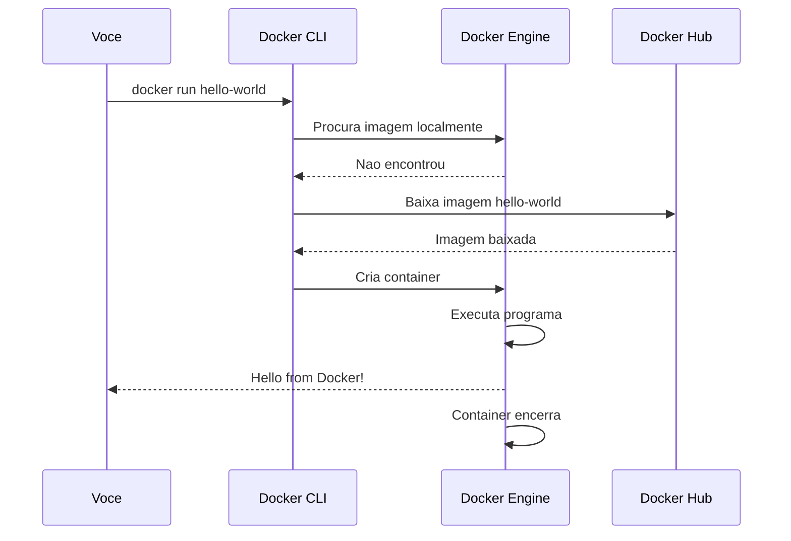
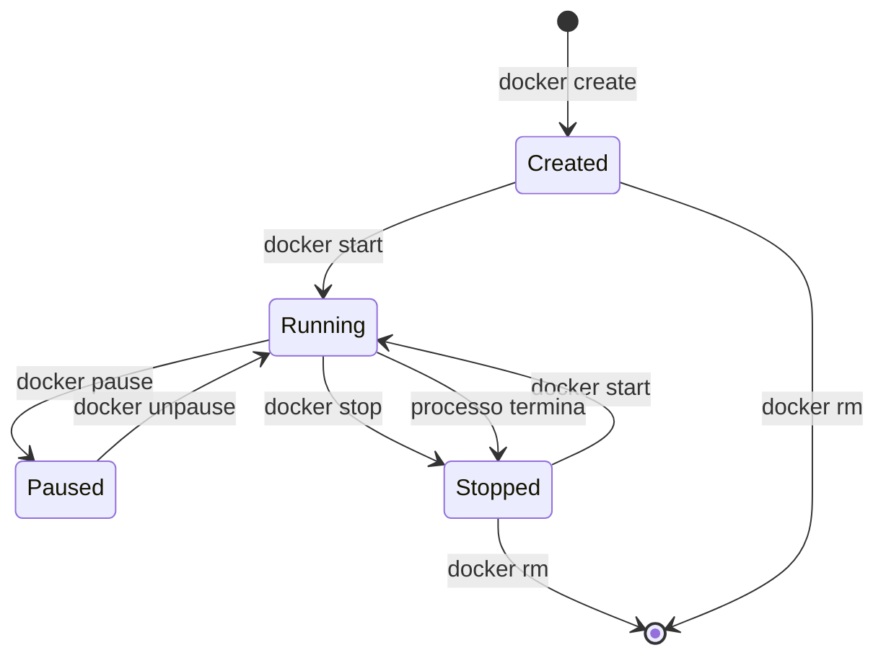
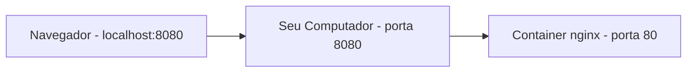

# 6.3 — Docker na Prática: Instalação e Primeiros Comandos

[← Anterior: VMs vs Containers](cap06-mod02-vms-vs-containers-conteudo.md) · [Próximo: Dockerfile e Imagens →](cap06-mod04-dockerfile-imagens-conteudo.md)

---

## Introdução

Nos dois módulos anteriores, você aprendeu o que é virtualização, como VMs funcionam, e por que containers são mais leves e eficientes. Entendeu a diferença entre imagem e container, conheceu a história do Docker e viu por que ele se tornou o padrão da indústria.

Agora chega de teoria. É hora de colocar a mão na massa.

Neste módulo, vamos instalar o Docker no seu computador, rodar seus primeiros containers e entender o ciclo de vida de um container na prática. Ao final, você vai estar confortável com os comandos básicos do Docker e vai ter rodado containers de verdade — incluindo um container Python interativo.

Este é o módulo mais importante do capítulo em termos práticos. Tudo que vem depois (Dockerfile, Docker Compose) depende de você estar confortável com os comandos que vamos aprender aqui.

---

## Como Executar os Exemplos Deste Módulo

A partir deste módulo, todos os exemplos são comandos reais que você deve executar no terminal. Para acompanhar:

1. Certifique-se de que o Docker está instalado (vamos fazer isso neste módulo)
2. Abra o terminal (`Ctrl + Alt + T` no Linux)
3. Execute cada comando mostrado e observe a saída
4. Compare sua saída com a "Saída esperada" mostrada abaixo de cada exemplo

Se algo der errado, não se preocupe — vamos cobrir os erros mais comuns e como resolvê-los.

---

## Instalando o Docker

### No Linux (Ubuntu/Debian)

A instalação no Linux é a mais direta. Abra o terminal e execute os comandos abaixo, um por vez:

```bash
# Atualizar a lista de pacotes do sistema
sudo apt update

# Instalar dependencias necessarias
sudo apt install -y ca-certificates curl gnupg

# Adicionar a chave GPG oficial do Docker
sudo install -m 0755 -d /etc/apt/keyrings
curl -fsSL https://download.docker.com/linux/ubuntu/gpg | sudo gpg --dearmor -o /etc/apt/keyrings/docker.gpg
sudo chmod a+r /etc/apt/keyrings/docker.gpg

# Adicionar o repositorio do Docker
echo \
  "deb [arch=$(dpkg --print-architecture) signed-by=/etc/apt/keyrings/docker.gpg] https://download.docker.com/linux/ubuntu \
  $(. /etc/os-release && echo "$VERSION_CODENAME") stable" | \
  sudo tee /etc/apt/sources.list.d/docker.list > /dev/null

# Atualizar a lista de pacotes novamente (agora com o repositorio do Docker)
sudo apt update

# Instalar o Docker Engine, CLI e plugins
sudo apt install -y docker-ce docker-ce-cli containerd.io docker-buildx-plugin docker-compose-plugin
```

Após a instalação, adicione seu usuário ao grupo `docker` para não precisar usar `sudo` em cada comando:

```bash
# Adicionar seu usuario ao grupo docker
sudo usermod -aG docker $USER

# Aplicar a mudanca (precisa fazer logout e login, ou executar)
newgrp docker
```

**Saída esperada** (após `newgrp docker`): nenhuma saída — o comando é silencioso.

### No macOS

No macOS, a forma mais simples é instalar o **Docker Desktop**:

1. Acesse [docker.com/products/docker-desktop](https://www.docker.com/products/docker-desktop/)
2. Baixe o instalador para macOS (Intel ou Apple Silicon, conforme seu Mac)
3. Abra o arquivo `.dmg` e arraste o Docker para a pasta Applications
4. Abra o Docker Desktop — ele vai pedir permissão de administrador
5. Aguarde o Docker inicializar (o ícone da baleia na barra de menu fica verde quando pronto)

### No Windows

**Atenção: Docker no Windows é fortemente desaconselhado para este curso.** Mesmo com WSL 2, existem muitos problemas práticos que vão atrapalhar seu aprendizado: problemas de permissões, performance ruim de volumes, line endings incompatíveis e networking inconsistente.

**Recomendação:** se você só tem Windows, instale Linux em uma VM (VirtualBox + Ubuntu, como fizemos no capítulo 2) e rode Docker dentro dela. É mais confiável e você terá a mesma experiência que em Linux nativo.

Se mesmo assim quiser tentar Docker no Windows nativo:

1. Certifique-se de que o WSL 2 está instalado e atualizado
2. Acesse [docker.com/products/docker-desktop](https://www.docker.com/products/docker-desktop/)
3. Baixe e instale o Docker Desktop para Windows
4. Durante a instalação, marque "Use WSL 2 instead of Hyper-V"
5. Reinicie o computador se solicitado
6. Abra o Docker Desktop e aguarde a inicialização

Esteja ciente de que problemas inesperados são comuns nessa configuração. Se algo não funcionar, considere migrar para Linux em VM.

### Verificando a Instalação

Independente do sistema operacional, verifique se o Docker foi instalado corretamente:

```bash
# Verificar a versao do Docker
docker --version
```

**Saída esperada** (a versão pode variar):
```
Docker version 27.1.1, build 6312585
```

```bash
# Verificar se o Docker Engine esta rodando
docker info
```

**Saída esperada** (resumida — a saída real é mais longa):
```
Client:
 Version:    27.1.1
 ...
Server:
 Containers: 0
  Running: 0
  Paused: 0
  Stopped: 0
 Images: 0
 ...
```

Se aparecer um erro como "Cannot connect to the Docker daemon", significa que o Docker Engine não está rodando. No Linux, inicie com `sudo systemctl start docker`. No macOS/Windows, abra o Docker Desktop.

---

## Seu Primeiro Container: Hello World

Assim como todo programador começa com "Hello World", todo usuário de Docker começa com o container `hello-world`:

```bash
# Rodar o container hello-world
docker run hello-world
```

**Saída esperada**:
```
Unable to find image 'hello-world:latest' locally
latest: Pulling from library/hello-world
c1ec31eb5944: Pull complete
Digest: sha256:...
Status: Downloaded newer image for hello-world:latest

Hello from Docker!
This message shows that your installation appears to be working correctly.

To generate this message, Docker took the following steps:
 1. The Docker client contacted the Docker daemon.
 2. The Docker daemon pulled the "hello-world" image from the Docker Hub.
 3. The Docker daemon created a new container from that image which runs the
    executable that produces the output you are currently reading.
 4. The Docker daemon streamed that output to the Docker client, which sent it
    to your terminal.
...
```

### O que Aconteceu?

Vamos analisar passo a passo o que o Docker fez quando você executou `docker run hello-world`:

1. **Procurou a imagem localmente**: o Docker verificou se a imagem `hello-world` já existia no seu computador. Como é a primeira vez, não encontrou.

2. **Baixou a imagem do Docker Hub**: como não encontrou localmente, o Docker foi ao Docker Hub (o repositório público) e baixou a imagem `hello-world:latest`.

3. **Criou um container**: a partir da imagem baixada, o Docker criou um container — uma instância em execução.

4. **Executou o programa**: o container rodou o programa que estava dentro da imagem (um executável simples que imprime a mensagem).

5. **Encerrou o container**: como o programa terminou, o container parou automaticamente.



### A Segunda Vez é Mais Rápida

Execute o mesmo comando novamente:

```bash
# Rodar hello-world pela segunda vez
docker run hello-world
```

**Saída esperada**: a mesma mensagem, mas sem a parte "Pulling from library/hello-world". A imagem já está no seu computador — o Docker não precisa baixar de novo.

---

## Gerenciando Imagens

Imagens são os "templates" a partir dos quais containers são criados. Vamos aprender a gerenciá-las.

### Listando Imagens

```bash
# Listar todas as imagens no seu computador
docker images
```

**Saída esperada**:
```
REPOSITORY    TAG       IMAGE ID       CREATED        SIZE
hello-world   latest    d2c94e258dcb   3 months ago   13.3kB
```

Repare no tamanho: 13.3 kB. A imagem `hello-world` é minúscula porque contém apenas um executável simples. Imagens reais (Python, PostgreSQL, etc.) são maiores.

### Baixando Imagens

Você pode baixar imagens sem criar containers, usando `docker pull`:

```bash
# Baixar a imagem oficial do Python 3.12
docker pull python:3.12-slim
```

**Saída esperada**:
```
3.12-slim: Pulling from library/python
...
Status: Downloaded newer image for python:3.12-slim
docker.io/library/python:3.12-slim
```

O `:3.12-slim` é a **tag** — específica qual versão da imagem você quer. Tags comuns:

| Tag | Significado |
|-----|-------------|
| `latest` | Versão mais recente (padrão se não especificar) |
| `3.12` | Versão específica do Python |
| `3.12-slim` | Versão enxuta (sem ferramentas extras, menor) |
| `3.12-alpine` | Baseada no Alpine Linux (ainda menor, ~50 MB) |
| `3.12-bookworm` | Baseada no Debian Bookworm (mais completa) |

```bash
# Listar imagens novamente
docker images
```

**Saída esperada**:
```
REPOSITORY    TAG         IMAGE ID       CREATED        SIZE
python        3.12-slim   abc123def456   2 weeks ago    131MB
hello-world   latest      d2c94e258dcb   3 months ago   13.3kB
```

Repare: a imagem Python slim tem 131 MB — muito menor que uma VM com Ubuntu (2.5 GB), mas grande o suficiente para conter o interpretador Python e as bibliotecas básicas.

### Removendo Imagens

```bash
# Remover uma imagem que nao esta sendo usada
docker rmi hello-world
```

**Saída esperada**:
```
Untagged: hello-world:latest
Deleted: sha256:...
```

Se a imagem estiver sendo usada por algum container (mesmo parado), o Docker vai recusar a remoção. Você precisa remover o container primeiro.

---

## Rodando Containers Interativos

O `hello-world` é legal, mas não é interativo — ele roda, imprime uma mensagem e encerra. Vamos rodar algo mais interessante: um container Python onde você pode digitar comandos.

### Python Interativo no Container

```bash
# Rodar um container Python interativo
# -it = interativo + terminal (permite digitar comandos)
docker run -it python:3.12-slim python3
```

**Saída esperada**:
```
Python 3.12.4 (main, Jul  2 2024, 12:00:00) [GCC 12.2.0] on linux
Type "help", "copyright", "credits" or "license" for more information.
>>>
```

Você está dentro de um container Docker, rodando Python. Tudo que você digitar aqui roda dentro do container, isolado do seu computador.

Experimente:

```python
# Dentro do container Python
>>> print("Ola do container!")
Ola do container!
>>> 2 + 2
4
>>> import sys
>>> sys.version
'3.12.4 (main, Jul  2 2024, 12:00:00) [GCC 12.2.0]'
>>> exit()
```

Quando você digita `exit()`, o Python encerra e o container para — porque o processo principal (python3) terminou.

### Entendendo as Flags -i e -t

As flags `-it` são na verdade duas flags combinadas:

- `-i` (interactive): mantém o STDIN aberto — permite que você digite comandos
- `-t` (tty): aloca um terminal virtual — formata a saída corretamente

Sem `-i`, você não consegue digitar. Sem `-t`, a saída fica desformatada. Juntas, criam uma experiência interativa completa.

### Rodando um Container com Shell

Em vez de rodar Python diretamente, você pode abrir um shell (terminal) dentro do container:

```bash
# Abrir um shell bash dentro de um container Ubuntu
docker run -it ubuntu:22.04 bash
```

**Saída esperada**:
```
root@a1b2c3d4e5f6:/#
```

Agora você está dentro de um container Ubuntu. É como se tivesse um computador Linux inteiro à sua disposição. Experimente:

```bash
# Dentro do container Ubuntu
root@a1b2c3d4e5f6:/# cat /etc/os-release
PRETTY_NAME="Ubuntu 22.04.4 LTS"
...

root@a1b2c3d4e5f6:/# ls /
bin  boot  dev  etc  home  lib  ...

root@a1b2c3d4e5f6:/# whoami
root

root@a1b2c3d4e5f6:/# exit
```

Quando você digita `exit`, o shell encerra e o container para.

Repare que os comandos Linux que você aprendeu nos capítulos 2 e 3 funcionam perfeitamente dentro do container. É um Linux de verdade — só que rodando isolado dentro de outro Linux.

---

## O Ciclo de Vida de um Container

Containers têm um ciclo de vida bem definido. Entender esse ciclo é fundamental para trabalhar com Docker.

### Os Estados de um Container



| Estado | Descrição | Como chegar |
|--------|-----------|-------------|
| Created | Container criado mas não iniciado | `docker create` |
| Running | Container em execução | `docker start` ou `docker run` |
| Paused | Container pausado (congelado) | `docker pause` |
| Stopped | Container parado (processo encerrou) | `docker stop` ou processo termina |
| Removed | Container removido (não existe mais) | `docker rm` |

O comando `docker run` é um atalho que faz `create` + `start` em um único passo. É o que você vai usar na maioria das vezes.

### Listando Containers

```bash
# Listar containers em execucao
docker ps
```

**Saída esperada** (se nenhum container estiver rodando):
```
CONTAINER ID   IMAGE   COMMAND   CREATED   STATUS   PORTS   NAMES
```

```bash
# Listar TODOS os containers (incluindo parados)
docker ps -a
```

**Saída esperada**:
```
CONTAINER ID   IMAGE          COMMAND     CREATED          STATUS                      NAMES
a1b2c3d4e5f6   ubuntu:22.04   "bash"      5 minutes ago    Exited (0) 3 minutes ago    happy_newton
f6e5d4c3b2a1   hello-world    "/hello"    10 minutes ago   Exited (0) 10 minutes ago   zen_turing
```

Repare que os containers parados ainda existem — eles não são removidos automaticamente. Cada container tem:

- **CONTAINER ID**: identificador único (hash curto)
- **IMAGE**: imagem a partir da qual foi criado
- **COMMAND**: comando que foi executado
- **STATUS**: estado atual (Running, Exited, etc.)
- **NAMES**: nome amigável (gerado automaticamente se você não especificar)

### Removendo Containers

```bash
# Remover um container parado (pelo ID ou nome)
docker rm happy_newton

# Remover todos os containers parados de uma vez
docker container prune
```

**Saída esperada** (para `docker container prune`):
```
WARNING! This will remove all stopped containers.
Are you sure you want to continue? [y/N] y
Deleted Containers:
a1b2c3d4e5f6
f6e5d4c3b2a1
Total reclaimed space: 0B
```

### Rodando Containers em Background

Até agora, todos os containers rodaram em "primeiro plano" — ocupando o terminal. Para rodar em background (segundo plano), use a flag `-d` (detached):

```bash
# Rodar um container nginx em background
# -d = detached (roda em background)
# -p 8080:80 = mapeia a porta 8080 do seu computador para a porta 80 do container
docker run -d -p 8080:80 --name meu-nginx nginx
```

**Saída esperada**:
```
Unable to find image 'nginx:latest' locally
latest: Pulling from library/nginx
...
Status: Downloaded newer image for nginx:latest
a1b2c3d4e5f6789...
```

O Docker retorna o ID do container e devolve o terminal para você. O container está rodando em background.

```bash
# Verificar que o container esta rodando
docker ps
```

**Saída esperada**:
```
CONTAINER ID   IMAGE   COMMAND                  CREATED          STATUS          PORTS                  NAMES
a1b2c3d4e5f6   nginx   "/docker-entrypoint.…"   30 seconds ago   Up 29 seconds   0.0.0.0:8080->80/tcp   meu-nginx
```

Agora abra o navegador e acesse `http://localhost:8080`. Você verá a página padrão do nginx — um servidor web rodando dentro de um container no seu computador.

### Parando e Reiniciando Containers

```bash
# Parar o container
docker stop meu-nginx

# Verificar que parou
docker ps
# (lista vazia - nenhum container rodando)

# Iniciar novamente
docker start meu-nginx

# Verificar que voltou
docker ps
# (meu-nginx aparece novamente)
```

### Vendo Logs de um Container

```bash
# Ver os logs do container nginx
docker logs meu-nginx
```

**Saída esperada** (logs de acesso do nginx):
```
...
172.17.0.1 - - [15/Apr/2026:10:30:00 +0000] "GET / HTTP/1.1" 200 615 "-" "Mozilla/5.0..."
```

### Executando Comandos em um Container Rodando

Você pode executar comandos dentro de um container que já está rodando:

```bash
# Abrir um shell dentro do container nginx que esta rodando
docker exec -it meu-nginx bash
```

**Saída esperada**:
```
root@a1b2c3d4e5f6:/#
```

Agora você está dentro do container nginx, com um shell. Pode explorar, ver arquivos, verificar configurações:

```bash
# Dentro do container nginx
root@a1b2c3d4e5f6:/# cat /etc/nginx/nginx.conf
# (mostra a configuracao do nginx)

root@a1b2c3d4e5f6:/# ls /usr/share/nginx/html/
50x.html  index.html

root@a1b2c3d4e5f6:/# exit
```

A diferença entre `docker run` e `docker exec`:
- `docker run`: cria um **novo** container a partir de uma imagem
- `docker exec`: executa um comando em um container **que já está rodando**

### Limpando Tudo

```bash
# Parar o container nginx
docker stop meu-nginx

# Remover o container
docker rm meu-nginx

# Remover a imagem nginx (opcional)
docker rmi nginx
```

---

## Nomeando Containers

Até agora, o Docker gerou nomes aleatórios para os containers (como `happy_newton` ou `zen_turing`). Você pode dar nomes significativos usando a flag `--name`:

```bash
# Criar um container com nome especifico
docker run -d --name servidor-web -p 8080:80 nginx
```

**Saída esperada**:
```
a1b2c3d4e5f6789...
```

Agora você pode referenciar o container pelo nome em vez do ID:

```bash
# Parar pelo nome
docker stop servidor-web

# Ver logs pelo nome
docker logs servidor-web

# Remover pelo nome
docker rm servidor-web
```

Nomes devem ser únicos — não pode ter dois containers com o mesmo nome ao mesmo tempo. Se tentar criar um container com um nome que já existe, o Docker vai recusar.

Dica: use nomes descritivos que indiquem o que o container faz. `meu-banco`, `api-produtos`, `servidor-web` são melhores que `container1`, `teste` ou `abc`.

---

## Mapeamento de Portas

Quando rodamos o nginx com `-p 8080:80`, fizemos um **mapeamento de portas**. Vamos entender isso melhor.

### O Problema

Containers são isolados — incluindo a rede. Um container tem seu próprio IP e suas próprias portas. Se o nginx dentro do container escuta na porta 80, essa porta 80 é **interna ao container** — seu computador não consegue acessá-la diretamente.

### A Solução: Port Mapping

A flag `-p` (publish) cria uma ponte entre uma porta do seu computador e uma porta do container:

```bash
# Formato: -p PORTA_HOST:PORTA_CONTAINER
docker run -d -p 8080:80 --name web nginx
```

Isso significa: "quando alguém acessar a porta 8080 do meu computador, redirecione para a porta 80 do container".



### Exemplos de Mapeamento

```bash
# Porta 8080 do host -> porta 80 do container
docker run -d -p 8080:80 nginx

# Porta 3000 do host -> porta 3000 do container (mesma porta)
docker run -d -p 3000:3000 node-app

# Porta 5433 do host -> porta 5432 do container (porta diferente)
# Util quando a porta padrao ja esta em uso no host
docker run -d -p 5433:5432 postgres

# Multiplas portas
docker run -d -p 8080:80 -p 8443:443 nginx
```

A porta do host pode ser qualquer uma disponível. A porta do container é definida pela aplicação que roda dentro dele (nginx usa 80, PostgreSQL usa 5432, etc.).

---

## Variáveis de Ambiente

Muitas imagens Docker aceitam **variáveis de ambiente** para configuração. Em vez de editar arquivos de configuração dentro do container, você passa valores na hora de criar o container.

```bash
# Criar um container PostgreSQL com senha definida por variavel de ambiente
# -e = definir variavel de ambiente
docker run -d \
  --name meu-banco \
  -e POSTGRES_PASSWORD=minha_senha_123 \
  -e POSTGRES_USER=aluno \
  -e POSTGRES_DB=curso \
  -p 5432:5432 \
  postgres:16
```

**Saída esperada**:
```
Unable to find image 'postgres:16' locally
16: Pulling from library/postgres
...
Status: Downloaded newer image for postgres:16
a1b2c3d4e5f6789...
```

Agora você tem um banco de dados PostgreSQL rodando no seu computador, configurado com usuário `aluno`, senha `minha_senha_123` e banco `curso`. Tudo isso sem instalar PostgreSQL no seu sistema — está tudo dentro do container.

```bash
# Verificar que o container esta rodando
docker ps
```

**Saída esperada**:
```
CONTAINER ID   IMAGE         COMMAND                  CREATED          STATUS          PORTS                    NAMES
a1b2c3d4e5f6   postgres:16   "docker-entrypoint.s…"   30 seconds ago   Up 29 seconds   0.0.0.0:5432->5432/tcp   meu-banco
```

Para limpar:

```bash
docker stop meu-banco
docker rm meu-banco
```

Variáveis de ambiente são a forma padrão de configurar containers. Cada imagem documenta quais variáveis aceita — você encontra essa informação na página da imagem no Docker Hub.

---

## O Flag --rm: Containers Descartáveis

Se você quer um container que se auto-destrói quando termina, use `--rm`:

```bash
# Container que se remove automaticamente ao terminar
docker run --rm python:3.12-slim python3 -c "print('Ola! Eu sou descartavel.')"
```

**Saída esperada**:
```
Ola! Eu sou descartavel.
```

Depois de imprimir a mensagem, o container para E é removido automaticamente. Se você rodar `docker ps -a`, ele não vai aparecer.

Isso é útil para:
- Testar algo rapidamente sem deixar containers parados acumulando
- Rodar scripts que só precisam executar uma vez
- Manter o sistema limpo

---

## Resumo dos Comandos Essenciais

Aqui está uma tabela de referência rápida com todos os comandos que aprendemos:

| Comando | O que faz | Exemplo |
|---------|-----------|---------|
| `docker run` | Cria e inicia um container | `docker run nginx` |
| `docker run -it` | Container interativo com terminal | `docker run -it python:3.12-slim python3` |
| `docker run -d` | Container em background | `docker run -d nginx` |
| `docker run --name` | Container com nome específico | `docker run --name web nginx` |
| `docker run -p` | Mapear portas host:container | `docker run -p 8080:80 nginx` |
| `docker run -e` | Definir variável de ambiente | `docker run -e VAR=valor nginx` |
| `docker run --rm` | Container descartável | `docker run --rm python:3.12-slim python3 -c "print(1)"` |
| `docker ps` | Listar containers rodando | `docker ps` |
| `docker ps -a` | Listar todos os containers | `docker ps -a` |
| `docker stop` | Parar um container | `docker stop web` |
| `docker start` | Iniciar container parado | `docker start web` |
| `docker rm` | Remover container parado | `docker rm web` |
| `docker exec -it` | Executar comando em container rodando | `docker exec -it web bash` |
| `docker logs` | Ver logs do container | `docker logs web` |
| `docker images` | Listar imagens locais | `docker images` |
| `docker pull` | Baixar imagem do Docker Hub | `docker pull python:3.12-slim` |
| `docker rmi` | Remover imagem | `docker rmi nginx` |
| `docker container prune` | Remover todos containers parados | `docker container prune` |

---

## Erros Comuns e Como Resolver

### "Cannot connect to the Docker daemon"

```
Cannot connect to the Docker daemon at unix:///var/run/docker.sock. Is the docker daemon running?
```

**Causa**: o Docker Engine não está rodando.
**Solução no Linux**: `sudo systemctl start docker`
**Solução no macOS/Windows**: abra o Docker Desktop e aguarde inicializar.

### "Permission denied"

```
Got permission denied while trying to connect to the Docker daemon socket
```

**Causa**: seu usuário não está no grupo `docker`.
**Solução**: `sudo usermod -aG docker $USER` e depois faça logout e login.

### "Port is already allocated"

```
Error response from daemon: driver failed programming external connectivity: Bind for 0.0.0.0:8080 failed: port is already allocated
```

**Causa**: a porta 8080 já está sendo usada por outro processo ou container.
**Solução**: use outra porta (`-p 8081:80`) ou pare o que está usando a porta.

### "Conflict. The container name is already in use"

```
Error response from daemon: Conflict. The container name "/web" is already in use
```

**Causa**: já existe um container (mesmo parado) com esse nome.
**Solução**: remova o container antigo (`docker rm web`) ou use outro nome.

### "No space left on device"

```
Error: no space left on device
```

**Causa**: disco cheio — imagens e containers acumulados.
**Solução**: limpe recursos não usados com `docker system prune`.

---

## Casos de Uso no Mundo Real

### 1. Ambiente de Desenvolvimento Padronizado

Em empresas como iFood e Mercado Livre, cada desenvolvedor novo precisa configurar seu ambiente de trabalho. Sem Docker, isso envolve instalar dezenas de ferramentas, configurar bancos de dados, ajustar variáveis de ambiente — um processo que pode levar dias e frequentemente dá errado.

Com Docker, o time mantém um `docker-compose.yml` (que vamos aprender no módulo 6.5) que define todo o ambiente: banco de dados, cache, filas de mensagens, serviços auxiliares. O desenvolvedor novo roda um único comando e tem tudo funcionando em minutos. Todos os desenvolvedores rodam exatamente o mesmo ambiente, eliminando o "funciona no meu computador".

### 2. Testes Automatizados em CI/CD

Quando um desenvolvedor faz uma mudança no código do Nubank, essa mudança passa por centenas de testes automatizados antes de ir para produção. Cada teste roda em um container limpo e descartável — criado em segundos, destruído após o teste.

Os comandos que você aprendeu neste módulo (`docker run --rm`, `docker run -e`) são exatamente os que pipelines de CI/CD usam para criar esses ambientes de teste. A diferença é que em CI/CD, tudo é automatizado — ninguém digita os comandos manualmente.

### 3. Prototipagem Rápida

Quer testar se sua aplicação funciona com PostgreSQL? `docker run -d postgres`. Quer experimentar Redis? `docker run -d redis`. Quer ver como o MongoDB funciona? `docker run -d mongo`.

Em vez de instalar cada banco de dados no seu computador (o que pode causar conflitos e poluir o sistema), você roda containers descartáveis. Testou, gostou? Mantém. Não gostou? `docker rm` e pronto — seu computador continua limpo.

---

## Como a IA pode te ajudar aqui

**Prompt 1 — Explorar o conceito:**
> "Qual o comando Docker para rodar um container MySQL com senha root definida?"

**Prompt 2 — Entender erros comuns:**
> "Estou recebendo o erro 'permission denied' ao rodar docker. Como resolvo?"

**Prompt 3 — Aprofundar o tema:**
> "Quero rodar um container Python que execute meu script automaticamente. Qual o comando?"

---

## Resumo do Módulo

| Conceito | Definição |
|----------|-----------|
| Docker Engine | Motor que cria e gerência containers no computador |
| Docker CLI | Interface de linha de comando para interagir com o Docker |
| `docker run` | Comando que cria e inicia um container a partir de uma imagem |
| `-it` | Flags para modo interativo com terminal |
| `-d` | Flag para rodar container em background (detached) |
| `-p` | Flag para mapear portas entre host e container |
| `-e` | Flag para definir variáveis de ambiente |
| `--name` | Flag para dar nome ao container |
| `--rm` | Flag para auto-remover container ao terminar |
| `docker ps` | Lista containers em execução |
| `docker exec` | Executa comando em container que já está rodando |
| `docker logs` | Mostra logs de um container |
| Tag de imagem | Versão específica de uma imagem (ex: `python:3.12-slim`) |
| Port mapping | Mapeamento de porta do host para porta do container |

---

## Glossário do Módulo

| Termo | Definição |
|-------|-----------|
| Alpine Linux | Distribuição Linux minimalista, muito usada como base para imagens Docker leves |
| Background (detached) | Modo de execução onde o container roda sem ocupar o terminal |
| Bash | Shell padrão do Linux, usado para executar comandos dentro de containers |
| Build | Processo de construir uma imagem Docker a partir de um Dockerfile |
| CLI (Command Line Interface) | Interface de linha de comando — forma de interagir com software via terminal |
| Container | Instância em execução de uma imagem Docker |
| Daemon | Processo que roda continuamente em background no sistema operacional |
| Docker Desktop | Aplicação com interface gráfica do Docker para macOS e Windows |
| Docker Engine | Motor principal do Docker que gerência imagens e containers |
| Docker Hub | Repositório público de imagens Docker |
| Flag | Opção passada a um comando para modificar seu comportamento (ex: `-d`, `-p`) |
| Foreground | Modo de execução onde o container ocupa o terminal |
| Image (imagem) | Pacote estático com aplicação, bibliotecas e configurações |
| Interactive mode | Modo que permite digitar comandos dentro do container |
| Nginx | Servidor web popular, muito usado como proxy reverso e para servir arquivos estáticos |
| Port mapping | Redirecionamento de uma porta do host para uma porta do container |
| PostgreSQL | Banco de dados relacional open source, muito usado em produção |
| Pull | Ação de baixar uma imagem do Docker Hub para o computador local |
| Slim | Variante de imagem Docker que remove ferramentas extras para ser menor |
| Tag | Identificador de versão de uma imagem Docker (ex: `3.12-slim`, `latest`) |
| TTY | Terminal virtual alocado para interação com o container |
| Volume | Mecanismo para persistir dados de containers (será visto no módulo 6.5) |
| WSL 2 | Windows Subsystem for Linux 2 — camada de compatibilidade Linux no Windows |

---

## Na Cultura Popular

- **Mr. Robot** (série, 2015-2019) — O protagonista Elliot trabalha com infraestrutura de servidores e usa extensivamente o terminal Linux. Os comandos que você aprendeu neste módulo (`docker run`, `docker exec`, `docker logs`) são o tipo de ferramenta que profissionais de infraestrutura usam diariamente.

- **Silicon Valley** (série, 2014-2019) — A série mostra os desafios de escalar uma startup de tecnologia. Em uma cena famosa, os personagens precisam provisionar servidores rapidamente para aguentar um pico de tráfego — exatamente o tipo de problema que Docker e containers resolvem.

---

## Para Saber Mais

- [Docker Get Started — Tutorial Oficial](https://docs.docker.com/get-started/) — *Tutorial passo a passo oficial do Docker, cobre instalação e primeiros comandos*

- [Play with Docker](https://labs.play-with-docker.com/) — *Ambiente Docker no navegador — perfeito para praticar sem instalar nada*

- [Docker Cheat Sheet](https://docs.docker.com/get-started/docker_cheatsheet.pdf) — *Folha de referência rápida com os comandos mais usados do Docker*

- [LINUXtips — Descomplicando Docker](https://www.youtube.com/@LINUXtips) — *Série brasileira completa sobre Docker, do básico ao avançado*

- [Dockerfile Best Practices](https://docs.docker.com/develop/develop-images/dockerfile_best-practices/) — *Boas práticas oficiais para trabalhar com Docker — útil como referência futura*

---

## Perguntas Frequentes (FAQ)

**P: Preciso de internet para usar Docker?**
R: Precisa de internet para baixar imagens do Docker Hub (a primeira vez). Depois que a imagem está no seu computador, pode criar e rodar containers offline.

**P: Docker consome muita memória?**
R: O Docker Engine em si consome pouca memória (~50-100 MB). Cada container consome a memória que sua aplicação precisa. Um container Python simples pode usar 20-50 MB. Um container PostgreSQL pode usar 100-200 MB. No macOS e Windows, o Docker Desktop reserva uma quantidade fixa de RAM para a VM Linux (configurável).

**P: Posso rodar vários containers ao mesmo tempo?**
R: Sim, quantos quiser (limitado pelos recursos do seu computador). É comum ter 5-10 containers rodando simultaneamente durante o desenvolvimento.

**P: O que acontece se eu desligar o computador com containers rodando?**
R: Os containers são parados automaticamente. Quando você ligar o computador e iniciar o Docker, pode reiniciá-los com `docker start`.

**P: Docker é a mesma coisa que uma VM?**
R: Não. Docker cria containers, que são muito mais leves que VMs. Containers compartilham o kernel do host, enquanto VMs têm seu próprio kernel. Reveja o módulo 6.2 para a comparação detalhada.

**P: Posso usar Docker para rodar aplicações gráficas (com janela)?**
R: Tecnicamente é possível, mas não é o uso comum. Docker é projetado para aplicações de servidor (sem interface gráfica). Para aplicações gráficas, VMs são mais adequadas.

**P: O que é o Docker Compose? É diferente do Docker?**
R: Docker Compose é uma ferramenta que faz parte do ecossistema Docker. Enquanto `docker run` cria um container por vez, Docker Compose permite definir e rodar múltiplos containers de uma vez, com um arquivo de configuração. Vamos aprender no módulo 6.5.

**P: Preciso decorar todos esses comandos?**
R: Não. Com o tempo, os comandos mais usados (`docker run`, `docker ps`, `docker stop`, `docker rm`) ficam naturais. Para os outros, consulte a tabela de referência deste módulo ou use `docker --help`.

**P: Docker funciona em computadores antigos?**
R: Docker precisa de um processador com suporte a virtualização (VT-x ou AMD-V) e pelo menos 4 GB de RAM. A maioria dos computadores fabricados depois de 2010 atende esses requisitos. Se seu computador é muito antigo, pode ter problemas de performance.

**P: Qual a diferença entre `docker stop` e `docker kill`?**
R: `docker stop` envia um sinal educado (SIGTERM) para o container, dando tempo para ele encerrar graciosamente. `docker kill` envia um sinal forçado (SIGKILL) que mata o container imediatamente. Use `stop` na maioria dos casos; use `kill` apenas se o container não responder ao `stop`.

---

## Exercícios de Fixação

Os exercícios deste módulo estão em um arquivo separado para facilitar a consulta:

**[Acessar Exercícios do Módulo 6.3](cap06-mod03-docker-basico-exercicios.md)**

---

[← Anterior: VMs vs Containers](cap06-mod02-vms-vs-containers-conteudo.md) · [Próximo: Dockerfile e Imagens →](cap06-mod04-dockerfile-imagens-conteudo.md)
