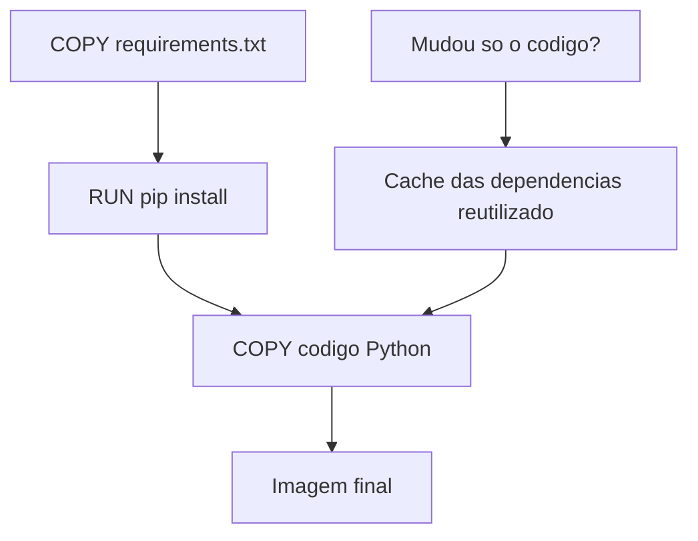

# 6.4 — Dockerfile: Criando suas Próprias Imagens

[← Anterior: Docker na Prática](cap06-mod03-docker-basico-conteudo.md) · [Próximo: Docker Compose →](cap06-mod05-docker-compose-conteudo.md)

---

## Introdução

No módulo anterior, você aprendeu a rodar containers a partir de imagens prontas do Docker Hub — Python, Ubuntu, nginx, PostgreSQL. Baixou imagens, criou containers, mapeou portas, definiu variáveis de ambiente e explorou o ciclo de vida de um container.

Mas até agora, você usou imagens que outras pessoas criaram. E se você quiser criar sua própria imagem? Uma imagem que contenha o seu programa Python, com todas as dependências, pronta para rodar em qualquer lugar?

É exatamente isso que o **Dockerfile** permite. Um Dockerfile é um arquivo de texto que contém as instruções para construir uma imagem Docker. É como uma receita: lista os ingredientes (imagem base, dependências) e o passo a passo (copiar arquivos, instalar pacotes, definir o comando de execução).

Neste módulo, você vai aprender a escrever Dockerfiles, construir imagens e empacotar aplicações Python para rodar em containers. Ao final, vai conseguir pegar qualquer programa Python que criou no capítulo 5 e transformá-lo em uma imagem Docker que roda em qualquer computador.

---

## Como Executar os Exemplos Deste Módulo

Para acompanhar este módulo, você vai precisar:

1. Docker instalado e funcionando (módulo 6.3)
2. Um editor de texto (VSCode ou qualquer outro)
3. Terminal aberto

Vamos criar arquivos Python e Dockerfiles. Para cada exemplo:

1. Crie uma pasta para o projeto: `mkdir ~/meus-projetos/docker-exemplos && cd ~/meus-projetos/docker-exemplos`
2. Crie os arquivos conforme indicado
3. Execute os comandos Docker no terminal

---

## O que é um Dockerfile

Um Dockerfile é um **arquivo de texto puro** (sem extensão) que contém uma sequência de instruções. Cada instrução diz ao Docker o que fazer para construir a imagem.

Pense assim: se uma imagem Docker é um bolo pronto, o Dockerfile é a receita. A receita lista:
- Qual massa usar como base (imagem base)
- Quais ingredientes adicionar (dependências)
- Como preparar (comandos de instalação)
- Como servir (comando de execução)

### Anatomia de um Dockerfile

Vamos começar com o Dockerfile mais simples possível:

```dockerfile
# Imagem base: Python 3.12 versao slim (enxuta)
FROM python:3.12-slim

# Definir o diretorio de trabalho dentro do container
WORKDIR /app

# Copiar o arquivo Python para dentro do container
COPY ola.py .

# Comando que sera executado quando o container iniciar
CMD ["python3", "ola.py"]
```

Cada linha é uma instrução. Vamos entender cada uma:

| Instrução | O que faz | Analogia |
|-----------|-----------|----------|
| `FROM` | Define a imagem base (ponto de partida) | Escolher o tipo de massa do bolo |
| `WORKDIR` | Define a pasta de trabalho dentro do container | Escolher a bancada onde vai trabalhar |
| `COPY` | Copia arquivos do seu computador para dentro da imagem | Colocar os ingredientes na bancada |
| `CMD` | Define o comando que roda quando o container inicia | Definir como servir o bolo |

### Criando seu Primeiro Dockerfile

Vamos criar um exemplo completo. Primeiro, crie uma pasta e os arquivos:

```bash
# Criar pasta do projeto
mkdir -p ~/meus-projetos/docker-ola
cd ~/meus-projetos/docker-ola
```

Crie o arquivo `ola.py`:

```python
# ola.py - Primeiro programa em container Docker
# "greeting" = saudacao
greeting = "Ola do container Docker!"  # saudacao
print(greeting)

# Mostrar informacoes do ambiente
import sys
print(f"Python versao: {sys.version}")  # versao do Python

import os
print(f"Diretorio atual: {os.getcwd()}")  # diretorio de trabalho
print(f"Usuario: {os.getenv('USER', 'desconhecido')}")  # usuario
```

**Saída esperada** (quando rodar localmente):
```
Ola do container Docker!
Python versao: 3.12.4 (main, Jul  2 2024, 12:00:00) [GCC 12.2.0]
Diretorio atual: /home/aluno/meus-projetos/docker-ola
Usuario: aluno
```

Agora crie o arquivo `Dockerfile` (sem extensão):

```dockerfile
# Dockerfile - Receita para construir a imagem
# Imagem base: Python 3.12 slim
FROM python:3.12-slim

# Diretorio de trabalho dentro do container
WORKDIR /app

# Copiar o script Python para o container
COPY ola.py .

# Comando padrao ao iniciar o container
CMD ["python3", "ola.py"]
```

### Construindo a Imagem

Com o Dockerfile e o `ola.py` na mesma pasta, construa a imagem:

```bash
# Construir a imagem
# -t meu-ola = dar o nome (tag) "meu-ola" para a imagem
# . = usar o diretorio atual como contexto (onde estao os arquivos)
docker build -t meu-ola .
```

**Saída esperada**:
```
[+] Building 12.3s (8/8) FINISHED
 => [internal] load build definition from Dockerfile
 => [internal] load .dockerignore
 => [internal] load metadata for docker.io/library/python:3.12-slim
 => [1/3] FROM docker.io/library/python:3.12-slim
 => [2/3] WORKDIR /app
 => [3/3] COPY ola.py .
 => exporting to image
 => => naming to docker.io/library/meu-ola
```

Cada linha `[1/3]`, `[2/3]`, `[3/3]` corresponde a uma instrução do Dockerfile. O Docker executa cada instrução em sequência, criando uma **camada** para cada uma.

### Rodando a Imagem

```bash
# Rodar um container a partir da imagem que criamos
docker run --rm meu-ola
```

**Saída esperada**:
```
Ola do container Docker!
Python versao: 3.12.4 (main, Jul  2 2024, 12:00:00) [GCC 12.2.0]
Diretorio atual: /app
Usuario: desconhecido
```

Repare nas diferenças em relação a rodar localmente:
- O diretório atual é `/app` (definido pelo `WORKDIR`)
- O usuário é "desconhecido" (dentro do container, a variável `USER` não está definida por padrão)
- A versão do Python é a que está na imagem base, não a do seu computador

Seu programa Python está rodando dentro de um container Docker. Se você mandar essa imagem para qualquer pessoa com Docker instalado, vai funcionar exatamente igual.

---

## As Instruções do Dockerfile em Detalhes

Vamos aprender cada instrução importante do Dockerfile.

### FROM: A Imagem Base

`FROM` é sempre a primeira instrução. Define qual imagem usar como ponto de partida.

```dockerfile
# Usar Python 3.12 slim como base
FROM python:3.12-slim

# Ou usar Ubuntu como base
FROM ubuntu:22.04

# Ou usar Alpine (minimalista) como base
FROM alpine:3.19
```

A escolha da imagem base importa:

| Imagem Base | Tamanho | Ferramentas incluídas | Quando usar |
|-------------|---------|----------------------|-------------|
| `python:3.12` | ~900 MB | Python + muitas ferramentas | Quando precisa compilar pacotes C |
| `python:3.12-slim` | ~130 MB | Python + mínimo necessário | Maioria dos casos (recomendado) |
| `python:3.12-alpine` | ~50 MB | Python + Alpine Linux | Quando tamanho é crítico |
| `ubuntu:22.04` | ~77 MB | Ubuntu mínimo (sem Python) | Quando precisa de Ubuntu específico |
| `alpine:3.19` | ~7 MB | Quase nada | Aplicações compiladas, Go, Rust |

Para aplicações Python, `python:3.12-slim` é a melhor escolha na maioria dos casos: tem tudo que o Python precisa, sem ferramentas extras desnecessárias.

### WORKDIR: O Diretório de Trabalho

`WORKDIR` define o diretório onde os comandos seguintes serão executados. Se o diretório não existir, o Docker cria automaticamente.

```dockerfile
# Todos os comandos a partir daqui rodam em /app
WORKDIR /app
```

É como fazer `cd /app` — mas de forma permanente para todas as instruções seguintes. Sem `WORKDIR`, tudo roda na raiz `/`, o que é desorganizado.

### COPY: Copiando Arquivos

`COPY` copia arquivos do seu computador (o "contexto de build") para dentro da imagem.

```dockerfile
# Copiar um arquivo especifico
COPY ola.py .

# Copiar todos os arquivos .py
COPY *.py .

# Copiar uma pasta inteira
COPY src/ ./src/

# Copiar tudo (cuidado - inclui tudo da pasta)
COPY . .
```

O `.` no final significa "para o diretório atual dentro do container" (definido pelo `WORKDIR`).

### RUN: Executando Comandos Durante o Build

`RUN` executa comandos durante a construção da imagem. É usado para instalar dependências, configurar o ambiente, etc.

```dockerfile
# Instalar pacotes do sistema
RUN apt-get update && apt-get install -y curl

# Instalar dependencias Python
RUN pip install requests flask

# Criar um diretorio
RUN mkdir -p /app/data
```

Cada `RUN` cria uma nova camada na imagem. Por isso, é boa prática combinar comandos relacionados em um único `RUN`:

```dockerfile
# BOM: um unico RUN com comandos combinados (uma camada)
RUN apt-get update && \
    apt-get install -y curl wget && \
    rm -rf /var/lib/apt/lists/*

# RUIM: multiplos RUN para a mesma tarefa (multiplas camadas)
RUN apt-get update
RUN apt-get install -y curl
RUN apt-get install -y wget
```

### CMD: O Comando de Execução

`CMD` define o comando que será executado quando o container iniciar. Só pode haver um `CMD` por Dockerfile (se houver mais de um, apenas o último vale).

```dockerfile
# Formato exec (recomendado) - lista de strings
CMD ["python3", "app.py"]

# Formato shell - string unica
CMD python3 app.py
```

O formato exec (com colchetes) é recomendado porque executa o programa diretamente, sem passar por um shell intermediário. Isso é mais eficiente e permite que sinais (como Ctrl+C) cheguem corretamente ao programa.

### EXPOSE: Documentando Portas

`EXPOSE` documenta qual porta a aplicação usa dentro do container. É apenas documentação — não abre a porta automaticamente. Você ainda precisa usar `-p` no `docker run`.

```dockerfile
# Documentar que a aplicacao usa a porta 8000
EXPOSE 8000
```

### ENV: Variáveis de Ambiente

`ENV` define variáveis de ambiente que ficam disponíveis dentro do container.

```dockerfile
# Definir variaveis de ambiente
ENV PYTHONUNBUFFERED=1
ENV APP_ENV=production
ENV APP_PORT=8000
```

`PYTHONUNBUFFERED=1` é especialmente importante para Python em containers — garante que a saída do `print()` apareça imediatamente nos logs, sem buffer.

---

## Exemplo Prático: Containerizando um Programa Python com Dependências

Vamos criar um exemplo mais realista — um programa Python que usa uma biblioteca externa.

### O Programa

Crie uma pasta para o projeto:

```bash
mkdir -p ~/meus-projetos/docker-cotacao
cd ~/meus-projetos/docker-cotacao
```

Crie o arquivo `cotacao.py`:

```python
# cotacao.py - Simulador de cotacao de moedas
# Demonstra um programa Python com dependencias externas em container
import json
import random
from datetime import datetime

def gerar_cotacao():
    """Gera cotacoes simuladas de moedas"""
    # "currencies" = moedas
    currencies = {
        "USD": {"nome": "Dolar Americano", "base": 5.10},
        "EUR": {"nome": "Euro", "base": 5.55},
        "GBP": {"nome": "Libra Esterlina", "base": 6.40},
        "ARS": {"nome": "Peso Argentino", "base": 0.006},
    }

    print("=" * 50)
    print("  COTACAO DE MOEDAS - SIMULADOR")
    print(f"  Data: {datetime.now().strftime('%d/%m/%Y %H:%M:%S')}")
    print("=" * 50)
    print()

    # "rate" = taxa, "variation" = variacao
    for code, info in currencies.items():
        variation = random.uniform(-0.05, 0.05)  # variacao de -5% a +5%
        rate = info["base"] * (1 + variation)  # taxa com variacao
        direction = "+" if variation >= 0 else ""  # direcao da variacao
        print(f"  {code} ({info['nome']})")
        print(f"    R$ {rate:.4f}  ({direction}{variation*100:.2f}%)")
        print()

    print("=" * 50)
    print("  Valores simulados para fins educacionais")
    print("=" * 50)

if __name__ == "__main__":
    gerar_cotacao()
```

**Saída esperada**:
```
==================================================
  COTACAO DE MOEDAS - SIMULADOR
  Data: 27/04/2026 10:30:00
==================================================

  USD (Dolar Americano)
    R$ 5.1234  (+0.45%)

  EUR (Euro)
    R$ 5.4321  (-2.13%)
  ...
```

Crie o arquivo `requirements.txt` (mesmo que este exemplo não use bibliotecas externas, vamos incluir para demonstrar o padrão):

```
# requirements.txt - Dependencias do projeto
# Neste exemplo nao temos dependencias externas,
# mas o padrao e sempre ter este arquivo
```

### O Dockerfile

Crie o `Dockerfile`:

```dockerfile
# Imagem base: Python 3.12 slim
FROM python:3.12-slim

# Evitar que Python use buffer na saida (logs aparecem imediatamente)
ENV PYTHONUNBUFFERED=1

# Diretorio de trabalho
WORKDIR /app

# Copiar arquivo de dependencias primeiro (otimizacao de cache)
COPY requirements.txt .

# Instalar dependencias (se houver)
RUN pip install --no-cache-dir -r requirements.txt

# Copiar o codigo da aplicacao
COPY cotacao.py .

# Comando padrao
CMD ["python3", "cotacao.py"]
```

### Construir e Rodar

```bash
# Construir a imagem
docker build -t cotacao .

# Rodar o container
docker run --rm cotacao
```

**Saída esperada**: as cotações simuladas, rodando dentro do container.

### Por que Copiar requirements.txt Antes do Código?

Repare que copiamos `requirements.txt` e instalamos dependências ANTES de copiar o código:

```dockerfile
# Primeiro: dependencias (muda raramente)
COPY requirements.txt .
RUN pip install --no-cache-dir -r requirements.txt

# Depois: codigo (muda frequentemente)
COPY cotacao.py .
```

Isso é uma **otimização de cache**. O Docker armazena cada camada em cache. Se você mudar apenas o código Python (sem mudar as dependências), o Docker reutiliza as camadas de instalação de dependências do cache — o rebuild é muito mais rápido.

Se copiássemos tudo de uma vez (`COPY . .`), qualquer mudança no código invalidaria o cache e forçaria a reinstalação de todas as dependências.



---

## O .dockerignore: Excluindo Arquivos

Assim como o `.gitignore` diz ao Git quais arquivos ignorar, o `.dockerignore` diz ao Docker quais arquivos NÃO copiar para dentro da imagem.

Crie o arquivo `.dockerignore`:

```
# .dockerignore - Arquivos que NAO devem ir para a imagem

# Ambientes virtuais Python
venv/
.venv/
__pycache__/
*.pyc

# Arquivos do Git
.git/
.gitignore

# Arquivos do editor
.vscode/
*.swp
*.swo

# Arquivos de sistema
.DS_Store
Thumbs.db

# Documentacao (nao precisa no container)
README.md
docs/

# Docker (nao precisa copiar o Dockerfile para dentro da imagem)
Dockerfile
docker-compose.yml
.dockerignore
```

Sem `.dockerignore`, o `COPY . .` copiaria TUDO da pasta — incluindo `.git/` (que pode ter centenas de MB), `venv/` (que pode ter GB de bibliotecas) e outros arquivos desnecessários. Isso tornaria a imagem muito maior do que precisa ser.

---

## Boas Práticas para Dockerfiles

### 1. Use Imagens Slim ou Alpine

```dockerfile
# BOM: imagem enxuta (130 MB)
FROM python:3.12-slim

# EVITAR: imagem completa (900 MB) - so se precisar compilar pacotes C
FROM python:3.12
```

### 2. Sempre Defina WORKDIR

```dockerfile
# BOM: diretorio organizado
WORKDIR /app

# RUIM: tudo na raiz /
# (sem WORKDIR)
```

### 3. Use PYTHONUNBUFFERED

```dockerfile
# Garante que print() aparece nos logs imediatamente
ENV PYTHONUNBUFFERED=1
```

### 4. Copie Dependências Antes do Código

```dockerfile
# BOM: otimiza cache
COPY requirements.txt .
RUN pip install -r requirements.txt
COPY . .

# RUIM: invalida cache a cada mudanca no codigo
COPY . .
RUN pip install -r requirements.txt
```

### 5. Use --no-cache-dir no pip

```dockerfile
# BOM: nao guarda cache do pip (imagem menor)
RUN pip install --no-cache-dir -r requirements.txt

# RUIM: guarda cache desnecessario
RUN pip install -r requirements.txt
```

### 6. Sempre Tenha um .dockerignore

Evita copiar arquivos desnecessários e mantém a imagem pequena.

### 7. Uma Aplicação por Container

Cada container deve rodar uma única aplicação. Se você precisa de Python + PostgreSQL, use dois containers (vamos ver isso no módulo 6.5 com Docker Compose). Misturar múltiplas aplicações em um container vai contra a filosofia de containers e dificulta a manutenção, o debug e a escalabilidade.

### Tabela de Boas Práticas

| Prática | Por quê | Impacto |
|---------|---------|---------|
| Imagem slim/alpine | Menor tamanho, menos vulnerabilidades | Imagem 5-10x menor |
| WORKDIR definido | Organização, previsibilidade | Código mais limpo |
| PYTHONUNBUFFERED | Logs aparecem em tempo real | Debug mais fácil |
| Dependências antes do código | Cache de build otimizado | Rebuild 10-100x mais rápido |
| --no-cache-dir | Não guarda cache do pip | Imagem 10-50 MB menor |
| .dockerignore | Exclui arquivos desnecessários | Imagem muito menor, build mais rápido |
| Uma app por container | Isolamento, escalabilidade | Manutenção mais fácil |

---

## Comparando Tamanhos de Imagem

Vamos ver na prática como as escolhas afetam o tamanho da imagem. Crie três Dockerfiles diferentes para o mesmo programa:

Crie `Dockerfile.full`:
```dockerfile
FROM python:3.12
WORKDIR /app
COPY cotacao.py .
CMD ["python3", "cotacao.py"]
```

Crie `Dockerfile.slim`:
```dockerfile
FROM python:3.12-slim
WORKDIR /app
COPY cotacao.py .
CMD ["python3", "cotacao.py"]
```

Crie `Dockerfile.alpine`:
```dockerfile
FROM python:3.12-alpine
WORKDIR /app
COPY cotacao.py .
CMD ["python3", "cotacao.py"]
```

Agora construa e compare:

```bash
# Construir com diferentes bases
docker build -t cotacao-full -f Dockerfile.full .
docker build -t cotacao-slim -f Dockerfile.slim .
docker build -t cotacao-alpine -f Dockerfile.alpine .

# Comparar tamanhos
docker images | grep cotacao
```

**Saída esperada** (tamanhos aproximados):
```
cotacao-full      latest   ...   ~920 MB
cotacao-slim      latest   ...   ~145 MB
cotacao-alpine    latest   ...   ~60 MB
```

A diferença é enorme. Para uma aplicação Python simples, a imagem slim é 6x menor que a full, e a alpine é 15x menor. Em produção, onde você pode ter centenas de containers, essa diferença se traduz em economia real de disco, rede e tempo de deploy.

Para limpar as imagens de teste:

```bash
docker rmi cotacao-full cotacao-slim cotacao-alpine
rm Dockerfile.full Dockerfile.slim Dockerfile.alpine
```

---

## Reconstruindo Imagens: O Poder do Cache

Vamos ver o cache em ação. Modifique o `cotacao.py` (mude qualquer texto) e reconstrua:

```bash
# Primeira build (sem cache - demora mais)
docker build -t cotacao .

# Modificar o codigo Python
echo '# comentario novo' >> cotacao.py

# Segunda build (com cache - muito mais rapida)
docker build -t cotacao .
```

Na segunda build, você vai ver mensagens como `CACHED` nas primeiras camadas:

```
 => CACHED [2/4] WORKDIR /app
 => CACHED [3/4] COPY requirements.txt .
 => CACHED [4/4] RUN pip install --no-cache-dir -r requirements.txt
 => [5/5] COPY cotacao.py .
```

As camadas de `WORKDIR`, `requirements.txt` e `pip install` foram reutilizadas do cache. Apenas a camada de `COPY cotacao.py` foi recriada. Isso torna o rebuild muito mais rápido — segundos em vez de minutos.

Essa otimização é especialmente importante em projetos com muitas dependências. Se seu `requirements.txt` tem 50 bibliotecas, a instalação pode levar vários minutos. Com cache, você só paga esse custo uma vez — nas builds seguintes, enquanto as dependências não mudarem, o Docker reutiliza a camada do cache.

---

## Casos de Uso no Mundo Real

### 1. Deploy Consistente em Produção

Quando uma empresa como o iFood faz deploy de uma nova versão da aplicação, o processo é:
1. Desenvolvedor faz commit do código
2. Pipeline de CI/CD constrói a imagem Docker automaticamente (`docker build`)
3. Imagem é testada em ambiente de staging
4. Imagem aprovada é enviada para produção
5. Containers antigos são substituídos pelos novos

O Dockerfile garante que a imagem de produção é idêntica à que foi testada. Não existe "funciona no staging mas não em produção" — é a mesma imagem.

### 2. Onboarding de Desenvolvedores

Em empresas como Mercado Livre, quando um desenvolvedor novo entra na equipe, ele clona o repositório e roda `docker build`. Em minutos, tem o ambiente completo funcionando — sem precisar instalar Python, bibliotecas, banco de dados ou qualquer outra dependência manualmente.

O Dockerfile serve como documentação executável do ambiente: qualquer pessoa pode ler e entender exatamente o que a aplicação precisa para rodar.

### 3. Reprodutibilidade Científica

Pesquisadores e cientistas de dados usam Dockerfiles para garantir que seus experimentos são reproduzíveis. Um paper científico pode incluir um Dockerfile que permite a qualquer pessoa recriar exatamente o mesmo ambiente e reproduzir os resultados.

---

## Como a IA pode te ajudar aqui
**Prompt 1 — Criar com ajuda da IA:**
> "Escreva um Dockerfile para uma aplicação Python que usa Flask e se conecta a um banco PostgreSQL"

**Prompt 2 — Otimizar o código:**
> "Minha imagem Docker está com 2 GB. Como posso reduzir o tamanho?"

**Prompt 3 — Comparar alternativas:**
> "Qual a diferença entre CMD e ENTRYPOINT no Dockerfile?"

---

## Resumo do Módulo

| Conceito | Definição |
|----------|-----------|
| Dockerfile | Arquivo de texto com instruções para construir uma imagem Docker |
| `FROM` | Define a imagem base (ponto de partida) |
| `WORKDIR` | Define o diretório de trabalho dentro do container |
| `COPY` | Copia arquivos do host para dentro da imagem |
| `RUN` | Executa comandos durante a construção da imagem |
| `CMD` | Define o comando executado quando o container inicia |
| `ENV` | Define variáveis de ambiente |
| `EXPOSE` | Documenta qual porta a aplicação usa |
| `.dockerignore` | Lista arquivos que não devem ser copiados para a imagem |
| Camada (layer) | Cada instrução do Dockerfile cria uma camada na imagem |
| Cache de build | Docker reutiliza camadas que não mudaram para acelerar rebuilds |
| `docker build` | Comando que constrói uma imagem a partir de um Dockerfile |
| `-t` (tag) | Flag do docker build que dá nome à imagem construída |

---

## Glossário do Módulo

| Termo | Definição |
|-------|-----------|
| Alpine | Distribuição Linux minimalista (~7 MB), usada como base para imagens Docker leves |
| Build context | Conjunto de arquivos enviados ao Docker Engine durante o build (a pasta onde está o Dockerfile) |
| Build context | Conjunto de arquivos enviados ao Docker Engine durante o build (a pasta do Dockerfile) |
| Cache de build | Mecanismo que reutiliza camadas anteriores para acelerar a construção de imagens |
| Camada (layer) | Unidade de armazenamento de uma imagem Docker; cada instrução do Dockerfile cria uma camada |
| CMD | Instrução do Dockerfile que define o comando padrão de execução do container |
| COPY | Instrução do Dockerfile que copia arquivos do host para a imagem |
| Dockerfile | Arquivo de texto com instruções sequenciais para construir uma imagem Docker |
| .dockerignore | Arquivo que lista padrões de arquivos a serem excluídos do build context |
| ENV | Instrução do Dockerfile que define variáveis de ambiente |
| EXPOSE | Instrução do Dockerfile que documenta portas usadas pela aplicação |
| FROM | Instrução do Dockerfile que define a imagem base |
| Imagem base | Imagem Docker usada como ponto de partida para construir outra imagem |
| Layer caching | Reutilização de camadas não modificadas durante rebuilds |
| pip | Gerenciador de pacotes do Python, usado para instalar bibliotecas |
| PYTHONUNBUFFERED | Variável de ambiente que desativa o buffer de saída do Python |
| requirements.txt | Arquivo padrão do Python que lista as dependências do projeto |
| RUN | Instrução do Dockerfile que executa comandos durante o build |
| Slim | Variante de imagem Docker que remove ferramentas extras para ser menor |
| Tag | Identificador de versão de uma imagem (ex: `3.12-slim`, `latest`) |
| WORKDIR | Instrução do Dockerfile que define o diretório de trabalho |

---

## Na Cultura Popular

- **The Social Network** (filme, 2010) — Mark Zuckerberg criou o Facebook em um dormitório de Harvard. Hoje, cada deploy do Facebook envolve milhares de imagens Docker sendo construídas e distribuídas automaticamente. O Dockerfile é a peça central desse processo — define exatamente como cada serviço deve ser empacotado.

- **Silicon Valley** (série, 2014-2019) — A série mostra os desafios de escalar uma startup. Em um cenário real, o Dockerfile seria uma das primeiras coisas que a equipe criaria — garantindo que todos os desenvolvedores e servidores rodam o mesmo ambiente.

---

## Para Saber Mais

- [Dockerfile Reference — Documentação Oficial](https://docs.docker.com/engine/reference/builder/) — *Referência completa de todas as instruções do Dockerfile*

- [Dockerfile Best Practices](https://docs.docker.com/develop/develop-images/dockerfile_best-practices/) — *Boas práticas oficiais para escrever Dockerfiles eficientes*

- [Play with Docker](https://labs.play-with-docker.com/) — *Ambiente no navegador para praticar Dockerfiles sem instalar nada*

- [LINUXtips — Descomplicando Docker](https://www.youtube.com/@LINUXtips) — *Série brasileira com episódios dedicados a Dockerfiles e boas práticas*

- [Docker Hub — Python Official Image](https://hub.docker.com/_/python) — *Página oficial da imagem Python no Docker Hub, com documentação das tags disponíveis*

---

## Perguntas Frequentes (FAQ)

**P: O Dockerfile precisa se chamar exatamente "Dockerfile"?**
R: Por convenção, sim — sem extensão, com D maiúsculo. Mas você pode usar outro nome com a flag `-f`: `docker build -f MeuDockerfile .`. Na prática, use sempre o nome padrão para evitar confusão.

**P: Posso ter mais de um Dockerfile no mesmo projeto?**
R: Sim. É comum ter `Dockerfile` para produção e `Dockerfile.dev` para desenvolvimento. Use `-f` para especificar qual usar: `docker build -f Dockerfile.dev .`.

**P: Qual a diferença entre CMD e RUN?**
R: `RUN` executa durante o BUILD (construção da imagem) — usado para instalar dependências. `CMD` executa quando o CONTAINER INICIA — define o que o container faz quando roda. `RUN` cria camadas na imagem; `CMD` não.

**P: Posso usar `apt install` no Dockerfile?**
R: Sim, com `RUN apt-get update && apt-get install -y pacote`. Use `apt-get` (não `apt`) em Dockerfiles, e sempre combine `update` com `install` no mesmo `RUN` para evitar problemas de cache.

**P: O que acontece se eu esquecer o CMD?**
R: O container vai usar o CMD da imagem base. Para `python:3.12-slim`, o CMD padrão abre o interpretador Python interativo. Se você quer que o container execute seu programa, precisa definir o CMD.

**P: Posso editar arquivos dentro de um container e salvar na imagem?**
R: Não diretamente. Mudanças feitas dentro de um container são perdidas quando ele é removido. Para salvar mudanças, você precisa reconstruir a imagem (modificar o Dockerfile e rodar `docker build` novamente) ou usar volumes.

**P: O que é multi-stage build?**
R: É uma técnica avançada onde o Dockerfile tem múltiplos `FROM`. Permite compilar código em uma imagem grande e copiar apenas o resultado para uma imagem pequena. Não vamos cobrir neste curso, mas é bom saber que existe.

**P: Por que minha imagem é tão grande mesmo usando slim?**
R: Verifique se o `.dockerignore` está excluindo arquivos desnecessários (venv, .git, node_modules). Verifique se está usando `--no-cache-dir` no pip. E verifique se não está instalando pacotes desnecessários com `apt-get`.

**P: Posso usar o mesmo Dockerfile para desenvolvimento e produção?**
R: Pode, mas nem sempre é ideal. Em desenvolvimento, você pode querer ferramentas extras (debugger, ferramentas de teste). Em produção, quer a imagem mais enxuta possível. Uma abordagem comum é ter `Dockerfile` para produção e `Dockerfile.dev` para desenvolvimento.

**P: O que significa "context" no Docker build?**
R: O context (contexto) é a pasta que o Docker usa como referência durante o build. Quando você roda `docker build .`, o `.` é o contexto — o Docker envia todos os arquivos dessa pasta (exceto os listados no `.dockerignore`) para o Docker Engine. Por isso é importante ter um `.dockerignore` — sem ele, pastas grandes como `.git/` e `venv/` são enviadas desnecessariamente, tornando o build lento.

---

## Exercícios de Fixação

Os exercícios deste módulo estão em um arquivo separado para facilitar a consulta:

**[Acessar Exercícios do Módulo 6.4](cap06-mod04-dockerfile-imagens-exercicios.md)**

---

[← Anterior: Docker na Prática](cap06-mod03-docker-basico-conteudo.md) · [Próximo: Docker Compose →](cap06-mod05-docker-compose-conteudo.md)
