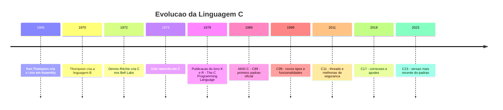
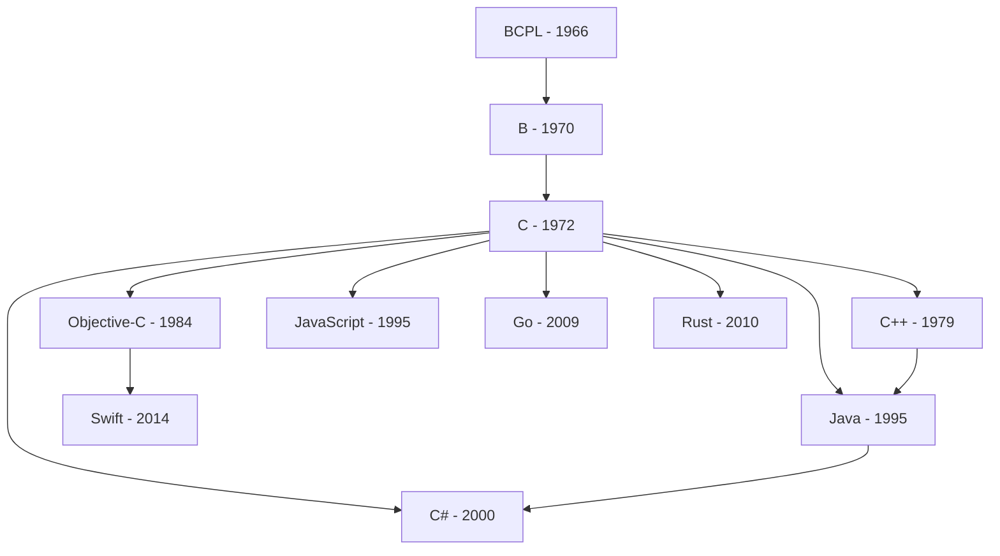
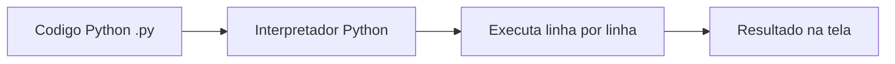
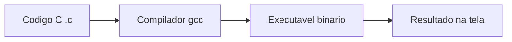
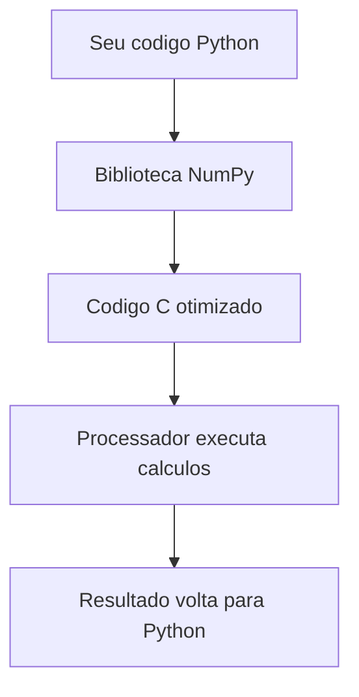

# 7.1 — Por que Aprender C? Entendendo a Memória do Computador

[← Anterior: Docker Compose](cap06-mod05-docker-compose-conteudo.md) · [Próximo: Ambiente C →](cap07-mod02-ambiente-c-conteudo.md)

---

## Introdução

No capítulo anterior, você aprendeu a usar Docker para empacotar aplicações e garantir que elas rodem igual em qualquer lugar. Você criou Dockerfiles, usou docker-compose e viu como containers resolvem o problema do "funciona no meu computador". Tudo isso usando Python — a linguagem que você aprendeu no capítulo 5.

Agora vamos mudar de direção. Vamos mergulhar em algo mais profundo.

Python é uma linguagem incrível. Ela é simples, legível e poderosa. Com poucas linhas, você cria programas que funcionam. Mas Python esconde muita coisa de você. Quando você escreve `lista = [1, 2, 3]`, o que acontece por baixo? Onde esses números ficam guardados? Como o computador sabe onde encontrar o número `2` quando você pede `lista[1]`?

A resposta para todas essas perguntas está na **memória do computador**. E para entender memória de verdade, precisamos de uma linguagem que não esconda esses detalhes — precisamos de **C**.

Este capítulo é diferente dos anteriores. Não vamos aprender C para substituir Python. Vamos aprender C para **entender o que acontece por baixo** quando qualquer linguagem de programação roda. É como a diferença entre dirigir um carro automático e dirigir um carro manual: no automático, você só pisa no acelerador e o carro anda. No manual, você precisa trocar as marchas, sentir a embreagem, entender quando o motor precisa de mais ou menos rotação. Quem sabe dirigir manual entende o carro de verdade — e dirige melhor até no automático.

C é o "carro manual" da programação. Python é o "carro automático". Depois deste capítulo, você vai entender Python muito melhor, porque vai saber o que ele faz por você automaticamente.

---

## O que é a Linguagem C?

C é uma linguagem de programação criada em **1972** por **Dennis Ritchie** nos **Bell Labs** (o laboratório de pesquisa da AT&T, nos Estados Unidos). Ela foi criada para resolver um problema muito específico: reescrever o sistema operacional **Unix**.

### O Problema que C Resolveu

Antes de C existir, sistemas operacionais eram escritos em **Assembly** — uma linguagem que fala diretamente com o processador. Assembly é extremamente poderosa (você controla cada instrução que o processador executa), mas tem um problema enorme: **cada processador tem seu próprio Assembly**.

Isso significava que, se você escrevesse um sistema operacional em Assembly para um processador da IBM, ele não funcionava em um processador da DEC. Para rodar em outro hardware, você precisava reescrever tudo do zero. Imagine reescrever um sistema operacional inteiro — milhares de linhas de código — toda vez que quisesse rodar em um computador diferente.

Dennis Ritchie e Ken Thompson (que havia criado o Unix em Assembly) queriam uma linguagem que fosse:

1. **Próxima do hardware** — capaz de manipular memória e registradores diretamente, como Assembly
2. **Portável** — o mesmo código poderia ser compilado para diferentes processadores
3. **Eficiente** — programas escritos nela deveriam rodar quase tão rápido quanto Assembly

C foi a resposta. Ela permitia escrever código que manipulava memória diretamente (como Assembly), mas podia ser compilada para diferentes processadores sem reescrever tudo. Em 1973, o Unix foi reescrito em C — e isso mudou a história da computação para sempre.

### Por que Isso Importa para Você?

Porque quase tudo que você usa hoje foi construído com C ou com linguagens que descendem de C:

| Software | Escrito em | Por que C? |
|----------|-----------|------------|
| Linux (kernel) | C | Precisa controlar hardware diretamente |
| Windows (kernel) | C e C++ | Precisa de performance máxima |
| macOS (kernel) | C e Objective-C | Baseado no Unix, que foi escrito em C |
| Python (interpretador) | C | O programa que roda seu código Python é escrito em C |
| SQLite | C | Banco de dados precisa de acesso eficiente a disco |
| Git | C | Precisa ser rápido para gerenciar milhares de arquivos |
| Docker (runtime) | Go (que descende de C) | Precisa interagir com o kernel Linux |
| Nginx | C | Servidor web precisa de performance extrema |
| PostgreSQL | C | Banco de dados precisa de controle fino de memória |
| Redis | C | Cache em memória precisa de velocidade máxima |

Percebeu o padrão? Tudo que precisa de **performance**, **controle de hardware** ou **acesso direto à memória** é escrito em C. E o mais impressionante: o próprio Python é escrito em C. Quando você executa `python3 meu_programa.py`, o programa que interpreta seu código Python é um executável compilado a partir de código C. Essa implementação se chama **CPython** — e é a versão padrão do Python que você usa.

---

## A História de C: Como Tudo Começou

Para entender C, precisamos entender o contexto em que ela nasceu. A história de C é inseparável da história do Unix — e ambas mudaram a computação moderna.

### Os Bell Labs: O Berço da Inovação

Os **Bell Labs** (Bell Telephone Laboratories) foram um dos laboratórios de pesquisa mais importantes da história da tecnologia. Fundados em 1925 pela AT&T (a maior empresa de telefonia dos Estados Unidos), os Bell Labs produziram invenções que moldaram o mundo:

- **Transistor** (1947) — a base de todos os chips modernos
- **Teoria da Informação** (1948) — Claude Shannon criou a matemática que fundamenta toda a comunicação digital
- **Laser** (1958) — usado em tudo, de cirurgias a leitores de CD
- **Unix** (1969) — o sistema operacional que influenciou todos os outros
- **Linguagem C** (1972) — a linguagem que influenciou quase todas as outras

Os Bell Labs tinham uma cultura única: pesquisadores tinham liberdade para explorar ideias sem pressão comercial imediata. Foi nesse ambiente que Ken Thompson e Dennis Ritchie trabalhavam.

### Ken Thompson e o Nascimento do Unix (1969)

Em 1969, **Ken Thompson** queria criar um sistema operacional simples e elegante. Ele havia trabalhado no projeto **Multics** — um sistema operacional ambicioso que tentava fazer tudo, mas acabou ficando complexo demais e nunca funcionou direito.

Thompson decidiu fazer o oposto: criar algo **simples**. Ele escreveu a primeira versão do Unix em Assembly, rodando em um computador PDP-7 que estava encostado no laboratório. O nome "Unix" era uma brincadeira com "Multics" — enquanto Multics tentava ser "multi" (fazer muitas coisas), Unix seria "uni" (fazer uma coisa bem feita).

O Unix introduziu ideias que usamos até hoje:
- **Tudo é arquivo** — dispositivos, processos, conexões de rede, tudo é tratado como arquivo
- **Programas pequenos que fazem uma coisa bem** — em vez de um programa gigante, vários programas pequenos que se conectam (lembra dos pipes `|` que você aprendeu no capítulo 3?)
- **Texto como interface universal** — programas se comunicam trocando texto

### Dennis Ritchie e o Nascimento de C (1972)

O problema do Unix escrito em Assembly era a portabilidade. Thompson e **Dennis Ritchie** queriam rodar o Unix em outros computadores além do PDP-7, mas reescrever em Assembly para cada novo hardware era inviável.

Thompson primeiro criou uma linguagem chamada **B** (baseada em uma linguagem anterior chamada BCPL). Mas B era limitada — não tinha tipos de dados (tudo era tratado como um número inteiro) e não era eficiente o suficiente para escrever um sistema operacional.

Ritchie então evoluiu B para criar **C**. As principais melhorias foram:

- **Tipos de dados**: `int`, `char`, `float` — o programador podia dizer ao compilador exatamente que tipo de dado estava usando, permitindo otimizações
- **Structs**: agrupamento de dados relacionados (o ancestral das classes que você vai ver no capítulo 9)
- **Ponteiros**: acesso direto a endereços de memória — o recurso mais poderoso (e mais temido) de C
- **Compilação eficiente**: o código C era traduzido para Assembly otimizado, rodando quase tão rápido quanto código escrito diretamente em Assembly

Em **1973**, Thompson e Ritchie reescreveram o Unix em C. Isso foi revolucionário: pela primeira vez, um sistema operacional podia ser portado para diferentes hardwares recompilando o código, em vez de reescrevendo tudo.

### A Evolução de C



Em **1978**, Brian Kernighan e Dennis Ritchie publicaram o livro **"The C Programming Language"**, conhecido como **K&R**. Este livro se tornou uma das referências mais importantes da história da programação. Era conciso, claro e prático — em apenas 228 páginas, ensinava tudo que era preciso saber sobre C. Até hoje é considerado um modelo de como documentar uma linguagem de programação.

Em **1989**, o padrão **ANSI C** (também chamado C89) foi publicado, formalizando a linguagem. Isso garantiu que código C escrito seguindo o padrão funcionaria em qualquer compilador que seguisse o mesmo padrão — a portabilidade que Ritchie sempre quis.

### O Legado de C

C influenciou diretamente a criação de praticamente todas as linguagens modernas:

| Linguagem | Ano | Relação com C |
|-----------|-----|---------------|
| C++ | 1979 | C com orientação a objetos (criada por Bjarne Stroustrup) |
| Objective-C | 1984 | C com mensagens (usada pela Apple até 2014) |
| Java | 1995 | Sintaxe baseada em C, com garbage collector |
| C# | 2000 | Sintaxe baseada em C e Java (criada pela Microsoft) |
| JavaScript | 1995 | Sintaxe baseada em C (apesar do nome, nada a ver com Java) |
| PHP | 1995 | Sintaxe baseada em C |
| Go | 2009 | Criada por Ken Thompson e Rob Pike (dos Bell Labs) |
| Rust | 2010 | Alternativa moderna a C, com segurança de memória |
| Swift | 2014 | Substituta do Objective-C na Apple |

Quando você aprender C# no capítulo 9, vai perceber que a sintaxe é muito parecida com C. Isso não é coincidência — C# literalmente tem "C" no nome porque sua sintaxe é derivada de C.

### A Família de Linguagens C

Podemos visualizar a influência de C como uma árvore genealógica:



Perceba que C está no centro de quase tudo. Mesmo linguagens que não descendem diretamente de C (como Python e Ruby) adotaram elementos da sua sintaxe — chaves `{}` para blocos de código, ponto e vírgula `;` para terminar instruções, operadores como `++`, `--`, `+=`.

Aprender C é como aprender latim para quem estuda línguas europeias: não é a língua que você vai usar no dia a dia, mas entender latim faz você compreender melhor português, espanhol, francês e italiano. Da mesma forma, entender C faz você compreender melhor Python, Java, C#, JavaScript e Go.

### Dennis Ritchie e Ken Thompson: Os Heróis Esquecidos

Dennis Ritchie e Ken Thompson são dois dos programadores mais influentes da história, mas são muito menos conhecidos pelo público geral do que Steve Jobs ou Bill Gates. Isso acontece porque eles criaram a **infraestrutura** — as fundações invisíveis sobre as quais tudo foi construído.

Dennis Ritchie recebeu o **Prêmio Turing** em 1983 (junto com Ken Thompson) — o equivalente ao Nobel da computação. Ele faleceu em 11 de outubro de 2011, apenas uma semana depois de Steve Jobs. Enquanto a morte de Jobs dominou as manchetes do mundo inteiro, a morte de Ritchie passou quase despercebida pela mídia. No entanto, sem C e Unix, não existiriam os produtos que tornaram Jobs famoso — o macOS é baseado em Unix, e o iOS roda sobre um kernel escrito em C.

Ken Thompson, por sua vez, continuou inovando. Em 2009, já trabalhando no Google, ele co-criou a linguagem **Go** — uma linguagem moderna que herda a simplicidade e eficiência de C, mas com recursos modernos como garbage collector e concorrência nativa. Go é usada pelo Google, Docker, Kubernetes e muitas outras ferramentas que você vai encontrar na sua carreira.

---

## Por que Aprender C Quando Já Sabemos Python?

Esta é a pergunta mais importante deste módulo. Se Python funciona, é mais simples e mais produtivo, por que gastar tempo aprendendo C?

A resposta está em uma palavra: **entendimento**.

### O que Python Esconde de Você

Quando você programa em Python, a linguagem faz muitas coisas automaticamente. Isso é ótimo para produtividade, mas significa que você não sabe o que está acontecendo por baixo. Veja alguns exemplos:

**1. Gerenciamento de memória**

Em Python:
```python
# Cria uma lista com 3 numeros
# "numbers" = numeros
numbers = [1, 2, 3]

# Adiciona mais um numero
numbers.append(4)

# Remove o primeiro numero
numbers.pop(0)
```

O que Python faz por você sem que você saiba:
- Aloca memória para guardar a lista
- Quando você faz `append(4)`, verifica se tem espaço. Se não tem, aloca um bloco maior de memória, copia tudo para o novo bloco e libera o antigo
- Quando você faz `pop(0)`, move todos os elementos uma posição para a esquerda
- Quando a lista não é mais usada, o **garbage collector** (coletor de lixo) libera a memória automaticamente

Em C, você faria tudo isso manualmente. E é exatamente por isso que vamos aprender C — para entender cada uma dessas etapas.

**2. Tipos de dados**

Em Python:
```python
# Python descobre o tipo sozinho
# "age" = idade, "name" = nome, "price" = preco
age = 25          # int (inteiro)
name = "Maria"    # str (string)
price = 19.90     # float (decimal)
```

Python descobre o tipo automaticamente e pode até mudar o tipo de uma variável:
```python
x = 42        # x e um inteiro
x = "hello"   # agora x e uma string (Python permite isso)
```

Em C, você precisa declarar o tipo explicitamente, e ele nunca muda:
```c
int age = 25;           // "age" = idade, tipo inteiro, ocupa 4 bytes
char name[] = "Maria";  // "name" = nome, array de caracteres
float price = 19.90;    // "price" = preco, tipo decimal, ocupa 4 bytes
```

**3. Tamanho na memória**

Em Python, você nunca pensa em quantos bytes uma variável ocupa. Em C, isso é fundamental:

| Tipo em C | Tamanho | O que guarda | Equivalente em Python |
|-----------|---------|-------------|----------------------|
| `char` | 1 byte | Um caractere ou número pequeno (-128 a 127) | `str` (1 caractere) |
| `int` | 4 bytes | Número inteiro (-2 bilhoes a +2 bilhoes) | `int` |
| `float` | 4 bytes | Número decimal (precisao simples) | `float` |
| `double` | 8 bytes | Número decimal (precisao dupla) | `float` |
| `long` | 8 bytes | Número inteiro grande | `int` (Python não tem limite) |

Em Python, um `int` pode ser tão grande quanto você quiser — `999999999999999999999` funciona sem problemas. Em C, um `int` tem exatamente 4 bytes e só guarda números até aproximadamente 2 bilhões. Se você tentar guardar um número maior, o valor "transborda" (overflow) e o resultado é imprevisível.

### A Analogia do Carro Manual vs Automático

Vamos expandir a analogia que usamos na introdução:

| Aspecto | Carro Automático (Python) | Carro Manual (C) |
|---------|--------------------------|-------------------|
| Trocar marcha | Automático | Você troca manualmente |
| Controle do motor | O carro decide | Você decide |
| Facilidade | Mais fácil de dirigir | Mais difícil no inicio |
| Entendimento | Você não sabe o que acontece | Você entende a mecanica |
| Velocidade | Boa, mas não ótima | Pode ser mais rápido se você souber o que faz |
| Risco de erro | Baixo (o carro protege) | Alto (você pode errar a marcha) |

Na programação:

| Aspecto | Python (automático) | C (manual) |
|---------|---------------------|------------|
| Memória | Gerenciada automaticamente | Você aloca e libera manualmente |
| Tipos | Descobertos automaticamente | Você declara explicitamente |
| Erros | Exceções claras (IndexError, TypeError) | Comportamento indefinido (pode travar sem aviso) |
| Velocidade | Mais lento (interpretado) | Mais rápido (compilado) |
| Produtividade | Alta (menos código) | Menor (mais código para a mesma coisa) |
| Aprendizado | Esconde a complexidade | Mostra a complexidade |

### O que Você Vai Ganhar Aprendendo C

Depois deste capítulo, você vai:

1. **Entender memória**: saber o que acontece quando cria uma variável, uma lista, um dicionário. Onde os dados ficam? Como são organizados? Por que algumas operações são rápidas e outras lentas?

2. **Entender estruturas de dados por dentro**: quando usar uma lista em Python, você vai saber que por baixo é um array dinâmico. Quando usar um dicionário, vai saber que por baixo é uma tabela hash. Isso muda completamente como você pensa sobre performance.

3. **Entender ponteiros**: o conceito mais importante da ciência da computação. Ponteiros são a base de como computadores acessam dados. Mesmo em Python, tudo funciona com referências (ponteiros escondidos).

4. **Entender por que algumas coisas são lentas**: por que inserir no início de uma lista Python é lento? Por que buscar em um dicionário é rápido? As respostas estão nas estruturas de dados que vamos implementar em C.

5. **Ler código de outras linguagens**: a sintaxe de C é a base de C++, Java, C#, JavaScript, Go e muitas outras. Depois de aprender C, você vai conseguir ler código nessas linguagens mesmo sem tê-las estudado formalmente.

6. **Pensar sobre eficiência**: quando você sabe o que acontece na memória, começa a pensar diferente sobre o código que escreve. Em vez de "funciona", você passa a pensar "funciona e é eficiente". Isso é o que separa um programador iniciante de um programador experiente.

7. **Entender mensagens de erro**: muitos erros em linguagens de alto nível têm raízes em conceitos de C. "Segmentation fault", "null pointer exception", "stack overflow" — todos esses termos vêm do mundo de C. Quando você entende o que eles significam de verdade, debugar problemas em qualquer linguagem fica mais fácil.

### Uma Nota Importante: Você Não Precisa Dominar C

O objetivo deste capítulo **não** é tornar você um programador C profissional. O objetivo é usar C como ferramenta de aprendizado para entender conceitos fundamentais que se aplicam a qualquer linguagem.

Pense assim: um estudante de medicina disseca um corpo humano para entender anatomia. Ele não precisa se tornar cirurgião — mas o conhecimento de anatomia faz dele um médico melhor, independente da especialidade que escolher.

Da mesma forma, "dissecar" a memória e as estruturas de dados em C vai fazer de você um programador melhor, independente da linguagem que usar no dia a dia.

Ao final deste capítulo, você vai voltar para Python com um entendimento completamente novo. Quando escrever `lista.append(item)`, vai saber exatamente o que está acontecendo por baixo. E isso muda tudo.

---

## Compilado vs Interpretado: A Diferença Fundamental

No capítulo 5, quando você escrevia um programa Python e executava com `python3 meu_programa.py`, o que acontecia? O interpretador Python lia seu código linha por linha e executava cada instrução na hora. Isso é o que chamamos de linguagem **interpretada**.

C funciona de forma completamente diferente. Antes de executar, seu código precisa ser **compilado** — traduzido inteiramente para linguagem de máquina (os 0s e 1s que o processador entende). Só depois de compilado é que você pode executar o programa.

### Como Funciona a Interpretação (Python)



1. Você escreve `meu_programa.py`
2. Executa `python3 meu_programa.py`
3. O interpretador lê a primeira linha, executa, lê a segunda, executa, e assim por diante
4. Se encontrar um erro na linha 50, as linhas 1-49 já foram executadas

Vantagem: você pode testar rapidamente, sem etapa intermediária.
Desvantagem: cada vez que roda, o interpretador precisa ler e traduzir tudo de novo. Isso é mais lento.

### Como Funciona a Compilação (C)



1. Você escreve `meu_programa.c`
2. Compila: `gcc meu_programa.c -o meu_programa`
3. O compilador lê TODO o código, verifica erros e traduz para linguagem de máquina
4. Se houver erro em qualquer linha, o compilador avisa e NÃO gera o executável
5. Se não houver erros, gera um arquivo executável (`meu_programa`)
6. Você executa: `./meu_programa`

Vantagem: o executável roda diretamente no processador, sem intermediário. É muito mais rápido.
Desvantagem: precisa compilar toda vez que muda o código. Se tiver erro, precisa corrigir antes de testar.

### O Ciclo de Desenvolvimento em Cada Linguagem

Na prática, o fluxo de trabalho é diferente:

**Ciclo em Python:**
1. Escreve código
2. Executa (`python3 programa.py`)
3. Vê o resultado (ou o erro)
4. Corrige e volta ao passo 2

**Ciclo em C:**
1. Escreve código
2. Compila (`gcc programa.c -o programa`)
3. Se deu erro de compilação, corrige e volta ao passo 2
4. Se compilou, executa (`./programa`)
5. Vê o resultado
6. Se precisa mudar algo, volta ao passo 1

O ciclo em C tem uma etapa a mais (compilação), mas essa etapa extra traz uma vantagem: o compilador detecta muitos erros **antes** de você executar o programa. Em Python, um erro de tipo só aparece quando aquela linha é executada. Em C, o compilador avisa na hora da compilação — antes de qualquer linha rodar.

### Comparação Prática

| Aspecto | Python (interpretado) | C (compilado) |
|---------|----------------------|---------------|
| Para executar | `python3 programa.py` | `gcc programa.c -o programa` e depois `./programa` |
| Etapas | 1 (executa direto) | 2 (compila, depois executa) |
| Velocidade de execução | Mais lento | 10x a 100x mais rápido |
| Deteccao de erros | Erros aparecem ao executar | Erros aparecem ao compilar (antes de executar) |
| Arquivo gerado | Nenhum (usa o .py direto) | Executavel binário |
| Portabilidade | Roda em qualquer SO com Python | Precisa recompilar para cada SO |
| Tamanho do executavel | Precisa do interpretador instalado | Executavel independente |

### Por que a Diferença de Velocidade?

A diferença de velocidade entre Python e C pode ser enorme. Um programa que soma 1 bilhão de números:

- Em **Python**: pode levar 30-60 segundos
- Em **C**: pode levar 1-2 segundos

Isso acontece porque:

1. **Python traduz na hora**: cada linha é lida, interpretada e executada. É como ter um tradutor simultâneo em uma conversa — funciona, mas é mais lento do que falar diretamente.

2. **C já está traduzido**: o compilador já fez todo o trabalho de tradução. O processador executa as instruções diretamente, sem intermediário. É como ler um livro já traduzido em vez de ter alguém traduzindo cada frase enquanto você lê.

3. **C conhece os tipos**: como você declara `int x = 42;`, o compilador sabe que `x` ocupa exatamente 4 bytes e pode otimizar as operações. Python precisa verificar o tipo de cada variável toda vez que faz uma operação.

Para colocar em perspectiva: se um programa precisa processar 1 milhão de transações financeiras, a diferença entre 30 segundos (Python) e 1 segundo (C) pode significar a diferença entre um sistema que funciona e um sistema que não aguenta a carga. É por isso que sistemas de alta frequência em bolsas de valores, processamento de sinais em telecomunicações e simulações científicas são escritos em C ou C++.

---

## Onde C é Usado Hoje

Você pode estar pensando: "se C é de 1972, ainda é relevante?" A resposta é: **absolutamente sim**. C é uma das linguagens mais usadas no mundo, especialmente em áreas onde performance e controle de hardware são essenciais.

### Sistemas Operacionais

O **kernel do Linux** — o coração do sistema operacional que roda em servidores, smartphones Android, supercomputadores e até na Estação Espacial Internacional — é escrito em C. São mais de **27 milhões de linhas de código C**.

O kernel do **Windows** também é escrito em C e C++. O kernel do **macOS** (XNU) é escrito em C e Objective-C.

Quando você usa qualquer computador, smartphone ou servidor, o software mais fundamental que faz tudo funcionar é escrito em C.

### Sistemas Embarcados

**Sistemas embarcados** são computadores minúsculos dentro de dispositivos do dia a dia:

- O microcontrolador dentro do seu **micro-ondas** que controla o tempo e a potência
- O chip dentro do **controle remoto** da TV
- O processador dentro do **painel do carro** que mostra velocidade e combustível
- Os sensores de um **drone** que controlam estabilidade e navegação
- O firmware de uma **impressora** que controla os motores e o jato de tinta

Esses dispositivos têm memória muito limitada (às vezes apenas 2KB de RAM — milhões de vezes menos que seu computador). C é a linguagem ideal porque permite controlar exatamente quanta memória cada variável usa.

### Bancos de Dados

Os bancos de dados mais usados no mundo são escritos em C:

- **SQLite** — o banco de dados que você vai usar no capítulo 8. Está presente em todo smartphone Android e iPhone, em todo navegador web e em milhões de aplicações
- **PostgreSQL** — um dos bancos de dados mais populares para aplicações web
- **MySQL** — o banco de dados por trás do WordPress, que roda mais de 40% dos sites da internet
- **Redis** — cache em memória usado por empresas como Twitter, GitHub e Stack Overflow

Bancos de dados precisam de acesso extremamente eficiente a disco e memória. C permite esse nível de controle.

### Segurança e Criptografia

A segurança da internet depende de software escrito em C:

- **OpenSSL** — a biblioteca de criptografia que protege a maioria das conexões HTTPS na internet. Quando você vê o cadeado no navegador, é OpenSSL (escrito em C) trabalhando por baixo
- **GnuPG** — ferramenta de criptografia usada para assinar e verificar software, emails e documentos
- **OpenSSH** — o software que permite conexões seguras entre computadores (o `ssh` que você usou no capítulo 3)

Criptografia envolve operações matemáticas intensivas que precisam ser executadas milhões de vezes por segundo. C é a escolha natural porque cada ciclo de CPU conta — uma implementação lenta de criptografia não é apenas inconveniente, é um risco de segurança (ataques de timing exploram diferenças de velocidade).

### Networking e Infraestrutura

A infraestrutura da internet é construída sobre software em C:

- **Nginx** e **Apache** — os dois servidores web mais usados no mundo
- **cURL** e **libcurl** — a ferramenta e biblioteca para transferência de dados que você já usou no terminal
- **Wireshark** — ferramenta de análise de rede usada por administradores de sistemas
- **iptables/nftables** — o firewall do Linux que protege servidores

Quando uma requisição HTTP viaja do seu navegador até um servidor e volta, ela passa por dezenas de softwares escritos em C ao longo do caminho.

### Interpretadores e Runtimes de Outras Linguagens

Além do CPython, muitos interpretadores e runtimes de linguagens populares são escritos em C ou C++:

- **Ruby (MRI)** — o interpretador padrão de Ruby é escrito em C
- **PHP (Zend Engine)** — o motor que executa PHP é escrito em C
- **Lua** — linguagem usada em jogos (World of Warcraft, Roblox), interpretador escrito em C
- **Node.js (V8)** — o motor JavaScript do Chrome e do Node.js é escrito em C++
- **Perl** — interpretador escrito em C

Existe um padrão aqui: linguagens de alto nível são frequentemente implementadas em C porque precisam de um "motor" rápido e eficiente por baixo. É como um carro elétrico — por fora é moderno e silencioso, mas por dentro tem componentes mecânicos fundamentais que fazem tudo funcionar.

### Jogos e Engines Gráficas

A maioria das engines de jogos é escrita em C ou C++:

- **Unreal Engine** (usada em Fortnite, Final Fantasy VII Remake) — C++
- **Unity** (usada em milhares de jogos indie e mobile) — C++ no core, C# para scripts
- **id Tech** (usada em Doom, Quake) — C

Jogos precisam renderizar milhões de pixels 60 vezes por segundo. Cada milissegundo conta. C e C++ são as únicas linguagens que oferecem a performance necessária para isso.

### Ferramentas que Você Já Usa

Muitas ferramentas que você usou neste curso são escritas em C:

- **Git** — o sistema de controle de versão que você aprendeu no capítulo 4
- **GCC** — o compilador que vamos usar para compilar nossos programas em C
- **Bash** — o shell que você usa no terminal (capítulo 3)
- **curl** — a ferramenta de linha de comando para fazer requisições HTTP
- **grep**, **sed**, **awk** — as ferramentas de processamento de texto do terminal

---

## Python vs C: Uma Comparação Honesta

Não existe linguagem "melhor" ou "pior" — existem linguagens mais adequadas para cada situação. Vamos fazer uma comparação honesta:

### Quando Usar Python

- **Prototipagem rápida**: quando você quer testar uma ideia rapidamente
- **Scripts de automação**: quando precisa automatizar tarefas repetitivas
- **Ciência de dados e IA**: bibliotecas como NumPy, Pandas e TensorFlow são escritas em C/C++ mas usadas via Python
- **Aplicações web**: frameworks como Django e FastAPI (que você vai usar no capítulo 11)
- **Quando produtividade importa mais que performance**: a maioria das aplicações não precisa da velocidade de C

### Quando Usar C

- **Sistemas operacionais**: quando precisa controlar hardware diretamente
- **Sistemas embarcados**: quando tem memória muito limitada
- **Bancos de dados**: quando precisa de acesso eficiente a disco e memória
- **Jogos e gráficos**: quando cada milissegundo de performance importa
- **Bibliotecas de alta performance**: muitas bibliotecas Python são escritas em C por baixo
- **Quando performance é crítica**: sistemas de tempo real, processamento de sinais, criptografia

### O Melhor dos Dois Mundos

Na prática, muitos projetos usam as duas abordagens:

1. As partes que precisam de **performance** são escritas em C ou C++
2. As partes que precisam de **produtividade** são escritas em Python (ou outra linguagem de alto nível)
3. Python chama o código C quando precisa de velocidade

Isso é exatamente o que bibliotecas como **NumPy** fazem: você escreve `import numpy` em Python, mas por baixo, os cálculos matemáticos pesados são feitos por código C otimizado. Você tem a facilidade do Python com a velocidade do C.



Esse padrão é tão comum que tem nome: **FFI** (Foreign Function Interface) — interface para chamar funções de outra linguagem. Em Python, as ferramentas mais usadas para isso são:

- **ctypes** — módulo da biblioteca padrão que permite chamar funções de bibliotecas C
- **Cython** — linguagem que mistura Python e C, compilando para código C otimizado
- **CFFI** — biblioteca que facilita a criação de bindings (conexões) entre Python e C

Grandes empresas usam esse padrão extensivamente. O Instagram, por exemplo, roda em Python (Django), mas as partes críticas de performance usam extensões em C. O Spotify usa Python para a lógica de negócio, mas o processamento de áudio é feito em C++.

---

## O que Vamos Aprender Neste Capítulo

Este capítulo tem 11 módulos que vão construir seu conhecimento de forma progressiva:

| Módulo | Tema | O que você vai aprender |
|--------|------|------------------------|
| 7.1 | Por que C? | Motivacao, história, contexto (você esta aqui) |
| 7.2 | Ambiente C | Instalar compilador, compilar e executar programas |
| 7.3 | Variáveis e Memória | Como variáveis funcionam na memória, tipos, tamanhos |
| 7.4 | Ponteiros | Enderecos de memória, o conceito mais importante de C |
| 7.5 | Arrays | Dados em sequência na memória, strings em C |
| 7.6 | Listas Encadeadas | Estruturas dinamicas com ponteiros |
| 7.7 | Filas | Primeiro a chegar, primeiro a sair (FIFO) |
| 7.8 | Pilhas | Último a chegar, primeiro a sair (LIFO) |
| 7.9 | Dicionários | Pares chave-valor e tabelas hash |
| 7.10 | Busca e Ordenação | Algoritmos fundamentais |
| 7.11 | Comparação | Quando usar cada estrutura |

A progressão é importante: cada módulo depende dos anteriores. Não pule módulos — mesmo que pareçam simples no início, os conceitos se acumulam.

### O Conceito-Chave do Capítulo

Se você tiver que lembrar de apenas uma coisa deste capítulo inteiro, lembre desta:

**Listas encadeadas, filas e pilhas são a mesma estrutura por dentro. A diferença está na regra de uso — onde você insere e de onde você remove.**

Isso é um conceito fundamental de engenharia de software: a mesma ferramenta pode resolver problemas diferentes dependendo de como você a usa. Vamos explorar isso em profundidade nos módulos 7.6, 7.7 e 7.8.

---

## Não Tenha Medo de C

Se você chegou até aqui e está pensando "C parece difícil", saiba de duas coisas:

1. **C é mais verboso, não mais difícil**. Os conceitos são os mesmos que você já aprendeu em Python — variáveis, condicionais, loops, funções. A diferença é que em C você precisa escrever mais código para fazer a mesma coisa, porque precisa ser explícito sobre coisas que Python faz automaticamente.

2. **Você já sabe programar**. No capítulo 5, você aprendeu lógica de programação, estruturas de controle, funções e coleções. Tudo isso existe em C — com sintaxe diferente, mas com a mesma lógica. Você não está começando do zero.

Vamos comparar um programa simples nas duas linguagens para você ver que não é tão diferente assim:

**Python:**
```python
# Programa que soma numeros de 1 a 10
# "total" = total, "i" = contador
total = 0

for i in range(1, 11):
    total = total + i

print(f"A soma de 1 a 10 e: {total}")
```

Saída esperada:
```
A soma de 1 a 10 e: 55
```

**C:**
```c
#include <stdio.h>  // Inclui a biblioteca de entrada/saida (printf)

// Funcao principal - todo programa C comeca aqui
int main() {
    int total = 0;  // "total" = total, tipo inteiro, comeca em 0
    int i;           // "i" = contador

    // Loop de 1 a 10 (similar ao range(1, 11) do Python)
    for (i = 1; i <= 10; i++) {
        total = total + i;  // Soma i ao total
    }

    // Imprime o resultado (similar ao print() do Python)
    printf("A soma de 1 a 10 e: %d\n", total);

    return 0;  // Indica que o programa terminou com sucesso
}
```

Saída esperada:
```
A soma de 1 a 10 e: 55
```

Percebeu? A lógica é idêntica. As diferenças são:
- C precisa de `#include` para importar bibliotecas
- C precisa de `int main()` como ponto de entrada
- C precisa declarar o tipo das variáveis (`int total`, `int i`)
- C usa `printf` em vez de `print`
- C usa `%d` para indicar onde colocar um número inteiro
- C precisa de `;` no final de cada instrução
- C precisa de `return 0` para indicar que terminou bem

Mais código? Sim. Mais difícil? Não — apenas mais explícito.

---

## Como a IA pode te ajudar aqui

A IA é uma parceira excelente para entender conceitos de C, especialmente quando você está fazendo a transição de Python. Aqui estão alguns prompts que você pode usar:

**Prompt 1 — Aprofundar o tema:**
> "Eu sei fazer X em Python. Como faço a mesma coisa em C?"

**Prompt 2 — Explorar o conceito:**
> "Explique o que este código C faz, linha por linha"

**Prompt 3 — Entender o porquê:**
> "Por que C faz X dessa forma em vez de fazer como Python?"

---

## Casos de Uso no Mundo Real

### 1. O Interpretador Python (CPython)

Quando você instala Python no seu computador e executa `python3`, o programa que roda é o **CPython** — escrito em C. A equipe de desenvolvimento do Python escolheu C porque o interpretador precisa ser rápido (ele traduz e executa seu código Python) e precisa interagir diretamente com o sistema operacional para gerenciar memória, arquivos e processos. Se o interpretador fosse escrito em uma linguagem lenta, todos os programas Python seriam ainda mais lentos. C garante que o "motor" do Python seja eficiente, mesmo que a linguagem Python em si seja mais lenta que C.

### 2. O Kernel do Linux em Servidores

Quando você acessa o Netflix, o YouTube ou qualquer site grande, sua requisição chega a um servidor rodando Linux. O kernel do Linux — escrito em C — é responsável por gerenciar milhares de conexões simultâneas, alocar memória para cada processo, controlar o acesso ao disco e à rede. Empresas como Google, Amazon e Meta rodam milhões de servidores Linux. A eficiência do kernel (escrito em C) é o que permite que um único servidor atenda milhares de usuários ao mesmo tempo. Se o kernel fosse escrito em uma linguagem mais lenta, seriam necessários muito mais servidores — e o custo seria astronômico.

### 3. SQLite em Smartphones

Todo smartphone Android e iPhone tem o **SQLite** embutido — um banco de dados escrito em C que ocupa menos de 1MB. Ele é usado por praticamente todos os aplicativos para guardar dados locais: suas mensagens no WhatsApp, seus contatos, suas configurações, o histórico do navegador. O SQLite precisa ser extremamente eficiente porque roda em dispositivos com bateria limitada — cada operação de leitura e escrita consome energia. C permite que o SQLite faça operações de banco de dados com o mínimo de consumo de recursos, o que é essencial para a duração da bateria do seu celular.

---

## Resumo do Módulo

| Conceito | Definição |
|----------|-----------|
| Linguagem C | Linguagem de programação criada em 1972 por Dennis Ritchie nos Bell Labs |
| Compilação | Processo de traduzir código fonte para linguagem de máquina antes da execução |
| Interpretacao | Processo de traduzir e executar código linha por linha, em tempo real |
| Portabilidade | Capacidade de rodar o mesmo código em diferentes hardwares recompilando |
| Assembly | Linguagem de baixo nível que fala diretamente com o processador |
| Kernel | Nucleo do sistema operacional, responsável por gerenciar hardware e processos |
| CPython | Implementação padrão do Python, escrita em C |
| Garbage Collector | Mecanismo automático de liberacao de memória (existe em Python, não em C) |
| Sistemas Embarcados | Computadores minusculos dentro de dispositivos do dia a dia |
| K e R | Livro The C Programming Language, de Kernighan e Ritchie (1978) |
| ANSI C | Primeiro padrão oficial da linguagem C (1989) |

---

## Glossário do Módulo

| Termo | Definição |
|-------|-----------|
| ANSI | American National Standards Institute - organização que padroniza tecnologias nos EUA |
| Assembly | Linguagem de programação de baixo nível que usa mnemonicos para instruções do processador |
| Bell Labs | Laboratorio de pesquisa da AT&T onde Unix e C foram criados |
| Binário | Arquivo executavel gerado pelo compilador, contendo instruções de máquina |
| Compilador | Programa que traduz código fonte para linguagem de máquina |
| CPython | Implementação de referência do Python, escrita em C |
| Dennis Ritchie | Criador da linguagem C e co-criador do Unix |
| Executavel | Arquivo binário que pode ser rodado diretamente pelo sistema operacional |
| Firmware | Software permanente gravado em dispositivos de hardware |
| Garbage Collector | Mecanismo que libera memória automaticamente quando não e mais usada |
| GCC | GNU Compiler Collection - compilador de C mais usado em Linux |
| Hardware | Componentes fisicos do computador (processador, memória, disco) |
| Interpretador | Programa que le e executa código fonte linha por linha |
| K e R | Abreviacao do livro The C Programming Language de Kernighan e Ritchie |
| Ken Thompson | Co-criador do Unix e da linguagem B (predecessora de C) |
| Kernel | Nucleo do sistema operacional que gerência hardware e processos |
| Linguagem de alto nível | Linguagem mais próxima da linguagem humana (Python, Java, C#) |
| Linguagem de baixo nível | Linguagem mais próxima da linguagem de máquina (Assembly, C) |
| Linguagem de máquina | Instruções em binário (0s e 1s) que o processador executa diretamente |
| Multics | Sistema operacional complexo que inspirou a criação do Unix |
| Overflow | Quando um valor excede o limite do tipo de dado e transborda |
| Ponteiro | Variável que guarda o endereco de memória de outra variável |
| Portabilidade | Capacidade de compilar e executar o mesmo código em diferentes plataformas |
| Sistema embarcado | Computador dedicado dentro de um dispositivo (micro-ondas, carro, drone) |
| Struct | Tipo de dado em C que agrupa variáveis relacionadas |
| Unix | Sistema operacional criado em 1969 nos Bell Labs, base do Linux e macOS |

---

## Na Cultura Popular

- **Piratas do Vale do Silício** (filme, 1999) — Mostra a era em que Unix e C estavam se espalhando pelo mundo. Steve Jobs e Bill Gates construíram seus impérios sobre sistemas operacionais que, direta ou indiretamente, dependiam de C. O filme captura o espírito da época em que essas tecnologias nasceram.

- **Revolution OS** (documentário, 2001) — Conta a história do Linux e do movimento open source. O kernel do Linux é escrito em C, e este documentário mostra como Linus Torvalds e a comunidade construíram um sistema operacional inteiro usando a linguagem que Dennis Ritchie criou décadas antes.

- **Halt and Catch Fire** (série, 2014-2017) — Acompanha engenheiros e programadores nos anos 1980-1990, a era de ouro de C. Os personagens lidam com hardware, compiladores e as limitações de memória que tornam C tão relevante. O título da série é literalmente uma instrução de máquina — o nível mais baixo da computação.

---

## Para Saber Mais

- [Learn C](https://www.learn-c.org/) — *Tutorial interativo de C no navegador — você pode escrever e executar código C sem instalar nada*

- [CS50 — Harvard](https://cs50.harvard.edu/x/) — *Curso de ciência da computação de Harvard que usa C para ensinar fundamentos. Gratuito e com legendas em português*

- [Programação Descomplicada — C](https://www.youtube.com/@progdescomplicada) — *Canal brasileiro com aulas de C e estruturas de dados, explicadas de forma acessível*

- [Visualgo](https://visualgo.net/) — *Visualização animada de estruturas de dados e algoritmos — excelente para ver como arrays, listas e filas funcionam na memória*

- [The C Programming Language — Kernighan e Ritchie](http://knking.com/books/c2/) — *O livro clássico de C. Não é para iniciantes, mas é a referência definitiva da linguagem*

---

## Perguntas Frequentes (FAQ)

**P: C é uma linguagem difícil?**
R: C é mais verbosa que Python — você precisa escrever mais código para fazer a mesma coisa. Mas os conceitos (variáveis, loops, funções) são os mesmos. A parte mais desafiadora são ponteiros e gerenciamento de memória, que vamos abordar com calma nos módulos 7.3 e 7.4. Se você aprendeu Python, consegue aprender C.

**P: Vou precisar usar C no meu trabalho como desenvolvedor?**
R: Depende da área. Se trabalhar com desenvolvimento web, mobile ou aplicações empresariais, provavelmente usará Python, JavaScript, Java ou C#. Mas entender C vai te tornar um programador melhor em qualquer linguagem, porque você vai entender o que acontece por baixo. Além disso, se trabalhar com sistemas embarcados, jogos, bancos de dados ou sistemas operacionais, C é essencial.

**P: C e C++ são a mesma coisa?**
R: Não. C++ foi criada em 1979 por Bjarne Stroustrup como uma extensão de C, adicionando orientação a objetos (classes, herança, polimorfismo). C++ é compatível com C (quase todo código C funciona em C++), mas C++ é uma linguagem muito maior e mais complexa. Neste curso, vamos focar em C puro.

**P: Por que não aprender C++ em vez de C?**
R: Porque C é mais simples e mostra os conceitos fundamentais sem a complexidade adicional de orientação a objetos. C++ adiciona muitas funcionalidades que, neste momento, seriam distração. Nosso objetivo é entender memória e estruturas de dados — C é perfeita para isso. Orientação a objetos você vai aprender no capítulo 9 com C#.

**P: C é uma linguagem antiga. Ela vai morrer?**
R: Muito improvável. C está no topo das linguagens mais usadas há mais de 50 anos. O kernel do Linux (escrito em C) roda em bilhões de dispositivos. Sistemas embarcados continuam sendo escritos em C. Bancos de dados são escritos em C. Enquanto existirem computadores que precisem de performance e controle de hardware, C será relevante.

**P: Posso usar C para criar sites ou aplicativos mobile?**
R: Tecnicamente sim, mas não é prático. C não tem bibliotecas prontas para interfaces gráficas, web ou mobile como Python, JavaScript ou Swift têm. C é usada para as camadas mais baixas — o sistema operacional, o banco de dados, o servidor web. As camadas mais altas (interface, lógica de negócio) são escritas em linguagens de mais alto nível.

**P: O que acontece se eu esquecer de liberar memória em C?**
R: Isso causa um **memory leak** (vazamento de memória). O programa continua consumindo memória sem devolver ao sistema. Se rodar por muito tempo, pode consumir toda a memória disponível e travar. Em Python, o garbage collector cuida disso automaticamente. Em C, é sua responsabilidade. Vamos aprender sobre isso no módulo 7.4.

**P: Por que Python é escrito em C e não em outra linguagem?**
R: Porque C oferece o melhor equilíbrio entre performance e portabilidade para um interpretador. O interpretador Python precisa ser rápido (para não tornar programas Python ainda mais lentos) e precisa rodar em diferentes sistemas operacionais (Windows, Linux, macOS). C atende ambos os requisitos. Existem implementações de Python em outras linguagens (Jython em Java, IronPython em C#, PyPy em Python), mas CPython (em C) continua sendo a implementação padrão e mais usada.

**P: Eu preciso saber matemática avançada para programar em C?**
R: Não. Assim como em Python, as 4 operações básicas são suficientes para a grande maioria da programação. Neste capítulo, a matemática mais complexa que vamos usar é multiplicação (para calcular endereços de memória). Nada de álgebra, cálculo ou trigonometria.

**P: C tem bibliotecas como Python (pip install)?**
R: C tem bibliotecas, mas o ecossistema é muito diferente. Não existe um gerenciador de pacotes centralizado como o pip. Bibliotecas em C geralmente são instaladas pelo sistema operacional (com `apt install` no Linux) ou compiladas junto com o projeto. A biblioteca padrão de C (que vem com o compilador) é pequena mas poderosa — inclui funções para entrada/saída, manipulação de strings, matemática e gerenciamento de memória.

**P: Posso misturar código C e Python no mesmo projeto?**
R: Sim, e isso é muito comum. Bibliotecas como NumPy, Pandas e TensorFlow são escritas em C/C++ mas usadas via Python. Existem ferramentas como **ctypes** e **Cython** que permitem chamar código C a partir de Python. Isso dá o melhor dos dois mundos: a facilidade do Python para a lógica geral e a velocidade de C para as partes críticas.

**P: O que é "undefined behavior" em C?**
R: É quando você faz algo que a linguagem não define o que deve acontecer — como acessar uma posição de memória que não pertence ao seu programa, ou dividir por zero. Em Python, você recebe um erro claro (IndexError, ZeroDivisionError). Em C, o comportamento é "indefinido" — pode funcionar, pode travar, pode dar um resultado errado, pode formatar seu disco (ok, isso é exagero, mas o ponto é que C não te protege). Vamos aprender a evitar esses problemas ao longo do capítulo.

**P: Dennis Ritchie é tão importante quanto Steve Jobs ou Bill Gates?**
R: Muitos programadores argumentam que sim — ou até mais. Dennis Ritchie criou C e co-criou Unix, que são a base de praticamente toda a tecnologia moderna. Linux, macOS, Android, iOS — todos descendem do Unix. Python, Java, C#, JavaScript — todas descendem de C. Ritchie faleceu em outubro de 2011, na mesma semana que Steve Jobs, mas recebeu muito menos atenção da mídia. No mundo da tecnologia, porém, seu legado é imenso.

---

## Exercícios Práticos

### Exercício 1 — Pesquisa: C no Seu Dia a Dia

Liste pelo menos 5 softwares ou dispositivos que você usa no dia a dia que são escritos em C ou dependem de código C. Para cada um, explique brevemente por que C foi escolhida (performance, controle de hardware, portabilidade, etc.). Tente incluir pelo menos um dispositivo físico (sistema embarcado) e pelo menos um software que você usa no computador.

Dica: pense no sistema operacional do seu computador, no navegador web, no banco de dados de aplicativos que você usa, nos dispositivos eletrônicos da sua casa, no roteador Wi-Fi, no controle remoto da TV.

### Exercício 2 — Comparação: Python vs C

Escreva uma tabela comparando Python e C em pelo menos 8 critérios diferentes. Use as informações deste módulo e adicione suas próprias observações. Para cada critério, indique qual linguagem é "melhor" naquele aspecto e explique por quê.

Dica: pense em critérios como velocidade, facilidade de aprendizado, gerenciamento de memória, portabilidade, ecossistema de bibliotecas, uso em sistemas embarcados, uso em web, comunidade.

### Exercício 3 — Reflexão: O Legado de C

Dennis Ritchie criou C em 1972 — mais de 50 anos atrás. Pesquise e responda:

1. Quantas linguagens de programação foram criadas desde 1972? (uma estimativa é suficiente — pesquise no Wikipedia ou pergunte a uma IA)
2. Por que C continua sendo uma das mais usadas, mesmo com tantas alternativas mais modernas?
3. Se C fosse inventada hoje, o que você acha que seria diferente? (pense em: gerenciamento de memória, segurança, sintaxe)
4. A linguagem **Rust** (criada em 2010) é frequentemente chamada de "substituta de C". Pesquise brevemente o que Rust faz diferente de C e por que algumas pessoas acham que ela pode eventualmente substituir C em alguns cenários. O kernel do Linux, inclusive, começou a aceitar código Rust em 2022 — o que isso significa para o futuro de C?

---

[← Anterior: Docker Compose](cap06-mod05-docker-compose-conteudo.md) · [Próximo: Ambiente C →](cap07-mod02-ambiente-c-conteudo.md)
