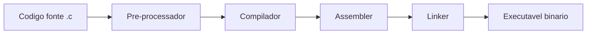
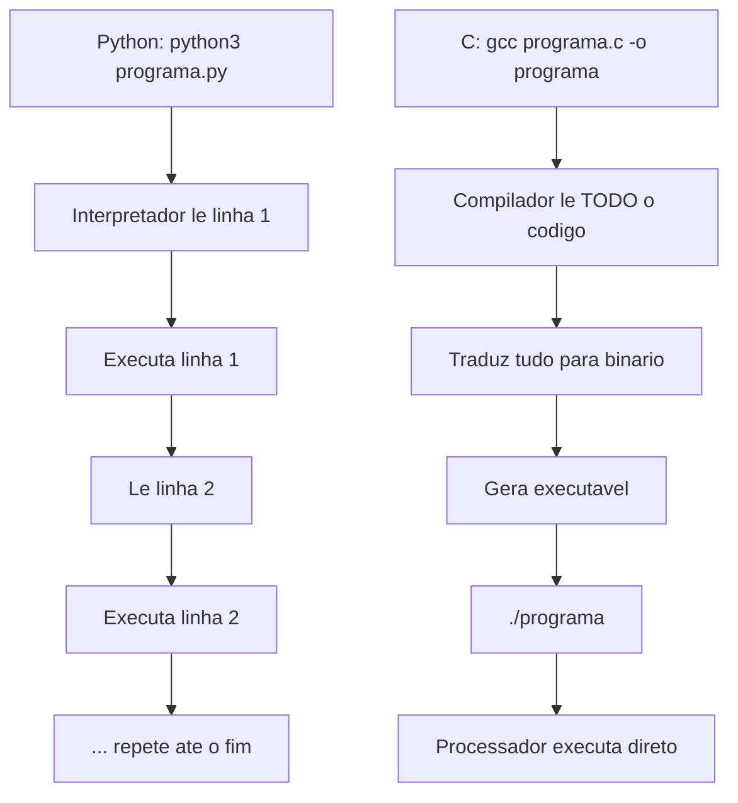

# 7.2 — Ambiente C: Compilador, Compilação e Execução

[← Anterior: Por que Aprender C?](cap07-mod01-porque-c-conteudo.md) · [Próximo: Variáveis e Memória em C →](cap07-mod03-variaveis-memoria-c-conteudo.md)

---

## Introdução

No módulo anterior, você entendeu por que C existe, sua história e por que vale a pena aprender essa linguagem mesmo já sabendo Python. Vimos que C é a base de quase toda a tecnologia moderna — do kernel do Linux ao interpretador Python.

Agora é hora de colocar a mão na massa. Neste módulo, vamos preparar o ambiente para programar em C, entender o processo de compilação em detalhes e escrever nossos primeiros programas.

Lembra da analogia do carro manual? No módulo anterior, explicamos por que vale a pena aprender a dirigir manual. Agora vamos sentar no banco do motorista, ajustar os espelhos e dar a primeira volta no quarteirão.

---

## Como Executar os Exemplos Deste Módulo

Para acompanhar este módulo, você vai precisar de:

1. **Um terminal Linux** (ou macOS) — o mesmo que você usa desde o capítulo 2
2. **O compilador GCC** — vamos instalar agora

### Instalando o GCC

O **GCC** (GNU Compiler Collection) é o compilador de C mais usado no mundo. Ele é gratuito, open source e vem instalado na maioria das distribuições Linux.

**No Ubuntu/Debian:**
```bash
# Atualiza a lista de pacotes
sudo apt update

# Instala o GCC e ferramentas de compilacao
sudo apt install build-essential
```

Saída esperada:
```
Reading package lists... Done
Building dependency tree... Done
build-essential is already the newest version.
0 upgraded, 0 newly installed, 0 to remove and 0 not upgraded.
```

Se aparecer "is already the newest version", significa que já está instalado.

**No macOS:**
```bash
# Instala as ferramentas de linha de comando da Apple
# (inclui o compilador clang, compativel com GCC)
xcode-select --install
```

No macOS, o compilador padrão é o **Clang**, mas ele é compatível com GCC para tudo que vamos fazer neste curso. Quando você digitar `gcc`, o macOS vai usar o Clang automaticamente.

**Verificando a instalação:**
```bash
# Verifica se o GCC esta instalado e mostra a versao
gcc --version
```

Saída esperada (pode variar):
```
gcc (Ubuntu 13.2.0-23ubuntu4) 13.2.0
Copyright (C) 2023 Free Software Foundation, Inc.
```

Se aparecer a versão, está tudo pronto. Se aparecer "command not found", revise os passos de instalação.

### Organizando seus Arquivos

Crie uma pasta para os exercícios deste capítulo:

```bash
# Cria a pasta para o capitulo 7
mkdir -p ~/meus-projetos/curso/cap07

# Entra na pasta
cd ~/meus-projetos/curso/cap07
```

Todos os arquivos C deste capítulo serão criados nesta pasta.

---

## O Processo de Compilação: Do Código ao Executável

No capítulo 5, quando você queria rodar um programa Python, bastava executar `python3 programa.py`. O interpretador lia seu código e executava na hora. Simples e direto.

Em C, o processo tem uma etapa a mais: a **compilação**. Antes de executar, seu código precisa ser traduzido para linguagem de máquina — os 0s e 1s que o processador entende diretamente.

### As Etapas da Compilação

O que parece ser uma única etapa (`gcc programa.c -o programa`) na verdade envolve quatro fases internas:



**1. Pré-processamento** — O pré-processador processa as diretivas que começam com `#` (como `#include`). Quando você escreve `#include <stdio.h>`, o pré-processador copia o conteúdo inteiro do arquivo `stdio.h` para dentro do seu código. É como se ele fizesse um "copiar e colar" automático.

**2. Compilação** — O compilador traduz o código C para **Assembly** — a linguagem de baixo nível do processador. Cada instrução C vira uma ou mais instruções Assembly.

**3. Montagem (Assembly)** — O assembler traduz o código Assembly para **código de máquina** — os bytes binários que o processador executa. O resultado é um arquivo chamado "objeto" (`.o`).

**4. Ligação (Linking)** — O linker junta o seu código objeto com as bibliotecas que você usou (como `stdio.h` para `printf`). O resultado final é o **executável** — o arquivo que você pode rodar.

Na prática, você não precisa se preocupar com essas etapas separadamente. O comando `gcc` faz tudo de uma vez. Mas é importante saber que elas existem, porque mensagens de erro podem vir de qualquer uma dessas fases.

### Compilação vs Interpretação: Visualizando a Diferença



A diferença fundamental: Python traduz e executa ao mesmo tempo (uma linha por vez). C traduz tudo primeiro, e só depois executa. É como a diferença entre um tradutor simultâneo (Python) e um livro já traduzido (C).

---

## Seu Primeiro Programa em C: Hello World

Todo programador começa com o "Hello World" — um programa que simplesmente imprime uma mensagem na tela. Vamos criar o nosso.

### Criando o Arquivo

Abra o VSCode (ou seu editor preferido) e crie um arquivo chamado `hello.c`:

```c
// hello.c — Primeiro programa em C
// Imprime "Ola, mundo!" na tela

#include <stdio.h>  // Inclui a biblioteca de entrada e saida (Standard I/O)

// Funcao principal — todo programa C comeca aqui
int main() {
    // printf = "print formatted" — imprime texto formatado na tela
    // \n = quebra de linha (igual ao \n do Python)
    printf("Ola, mundo!\n");

    // return 0 = indica que o programa terminou com sucesso
    // 0 significa "sem erros"
    return 0;
}
```

### Compilando e Executando

```bash
# Compila o programa
# gcc = compilador
# hello.c = arquivo fonte
# -o hello = nome do executavel de saida ("output")
gcc hello.c -o hello

# Executa o programa
./hello
```

Saída esperada:
```
Ola, mundo!
```

Parabéns — você acabou de compilar e executar seu primeiro programa em C.

### Entendendo Cada Parte

Vamos analisar o programa linha por linha:

**`#include <stdio.h>`**

Esta linha diz ao pré-processador: "inclua o conteúdo do arquivo `stdio.h`". O `stdio.h` é a biblioteca padrão de entrada e saída (Standard Input/Output). Ela contém a definição da função `printf` que usamos para imprimir na tela.

Em Python, o equivalente seria `import` — mas com uma diferença importante: em Python, `print()` está disponível sem importar nada. Em C, você precisa incluir a biblioteca explicitamente.

| Python | C |
|--------|---|
| `print()` disponível sem import | `printf()` precisa de `#include <stdio.h>` |
| `import math` para funções matematicas | `#include <math.h>` para funções matematicas |
| `import string` para manipulação de strings | `#include <string.h>` para manipulação de strings |

**`int main()`**

Esta é a **função principal** do programa. Todo programa C precisa ter uma função chamada `main` — é por onde a execução começa. O `int` antes de `main` indica que a função retorna um número inteiro.

Em Python, o código começa a executar da primeira linha do arquivo. Em C, o código começa a executar a partir da função `main()`, independente de onde ela está no arquivo.

**`printf("Ola, mundo!\n");`**

`printf` é a função que imprime texto na tela. O nome vem de "print formatted" (impressão formatada). O `\n` no final é o caractere de nova linha — sem ele, o próximo texto seria impresso na mesma linha.

Diferenças importantes entre `printf` e `print`:

| Python `print()` | C `printf()` |
|-------------------|-------------|
| Adiciona `\n` automaticamente | Você precisa colocar `\n` manualmente |
| Aceita qualquer tipo diretamente | Precisa de codigos de formato (%d, %s, %f) |
| `print(42)` funciona | `printf("%d", 42)` — precisa do %d |
| `print("Ola", nome)` | `printf("Ola %s", nome)` — precisa do %s |

**`return 0;`**

Indica que o programa terminou com sucesso. Por convenção, `0` significa "sem erros" e qualquer outro número indica um erro. O sistema operacional usa esse valor para saber se o programa funcionou corretamente.

Em Python, o programa simplesmente termina quando chega ao final do arquivo. Em C, você precisa retornar explicitamente um valor.

**Ponto e vírgula `;`**

Em C, toda instrução termina com ponto e vírgula. Esquecer o `;` é o erro mais comum de iniciantes — e o compilador vai reclamar com uma mensagem de erro.

Em Python, o final da linha indica o final da instrução. Em C, o final da instrução é marcado pelo `;`. Isso significa que em C você pode escrever uma instrução em várias linhas:

```c
// Isso e valido em C — uma instrucao em duas linhas
printf("Esta e uma mensagem "
       "muito longa\n");
```

**Chaves `{}`**

Em C, blocos de código são delimitados por chaves `{}`. Em Python, blocos são delimitados por indentação. Ambos servem para o mesmo propósito — agrupar instruções que pertencem juntas.

| Python | C |
|--------|---|
| Indentacao define o bloco | Chaves `{}` definem o bloco |
| Erro se indentar errado | Indentacao e opcional (mas recomendada) |
| Mais limpo visualmente | Mais explicito |

---

## Variáveis e Tipos Básicos em C

Em Python, você cria uma variável simplesmente atribuindo um valor:

```python
# Python — tipo e descoberto automaticamente
age = 25          # int
name = "Maria"    # str
price = 19.90     # float
```

Em C, você precisa declarar o tipo antes de usar a variável:

```c
// C — tipo e declarado explicitamente
int age = 25;           // "age" = idade, tipo inteiro
char name[] = "Maria";  // "name" = nome, array de caracteres
float price = 19.90;    // "price" = preco, tipo decimal
```

### Os Tipos Básicos de C

| Tipo | Tamanho | O que guarda | Faixa de valores | Exemplo |
|------|---------|-------------|-------------------|---------|
| `char` | 1 byte | Um caractere ou número pequeno | -128 a 127 | `char letra = 'A';` |
| `int` | 4 bytes | Número inteiro | -2.147.483.648 a 2.147.483.647 | `int idade = 25;` |
| `float` | 4 bytes | Número decimal (precisao simples) | 6-7 digitos significativos | `float preco = 19.90;` |
| `double` | 8 bytes | Número decimal (precisao dupla) | 15-16 digitos significativos | `double pi = 3.14159265;` |
| `long` | 8 bytes | Número inteiro grande | -9.2 quintilhoes a +9.2 quintilhoes | `long população = 8000000000;` |

Vamos ver cada um na prática:

```c
// tipos.c — Demonstracao dos tipos basicos de C
#include <stdio.h>

int main() {
    // Tipo char — 1 byte — um caractere
    char letra = 'A';           // "letra" = letter
    char inicial = 'M';         // "inicial" = initial

    // Tipo int — 4 bytes — numero inteiro
    int idade = 25;             // "idade" = age
    int ano = 2026;             // "ano" = year
    int temperatura = -5;       // "temperatura" = temperature (pode ser negativo)

    // Tipo float — 4 bytes — numero decimal (precisao simples)
    float preco = 19.90;        // "preco" = price
    float nota = 8.5;           // "nota" = grade

    // Tipo double — 8 bytes — numero decimal (precisao dupla)
    double pi = 3.14159265358979;  // "pi" = pi (mais preciso que float)
    double saldo = 1234567.89;     // "saldo" = balance

    // Tipo long — 8 bytes — numero inteiro grande
    long populacao = 8000000000;   // "populacao" = population

    // Imprimindo cada tipo
    printf("Letra: %c\n", letra);           // %c = caractere
    printf("Idade: %d anos\n", idade);      // %d = inteiro decimal
    printf("Preco: %.2f reais\n", preco);   // %.2f = float com 2 casas decimais
    printf("Pi: %.10f\n", pi);              // %.10f = double com 10 casas decimais
    printf("Populacao: %ld pessoas\n", populacao);  // %ld = long decimal

    return 0;
}
```

Saída esperada:
```
Letra: A
Idade: 25 anos
Preco: 19.90 reais
Pi: 3.1415926536
Populacao: 8000000000 pessoas
```

### Códigos de Formato do printf

O `printf` usa códigos especiais (começando com `%`) para indicar onde e como imprimir cada variável:

| Código | Tipo | Exemplo | Resultado |
|--------|------|---------|-----------|
| `%c` | char (caractere) | `printf("%c", 'A')` | `A` |
| `%d` | int (inteiro) | `printf("%d", 42)` | `42` |
| `%f` | float/double (decimal) | `printf("%f", 3.14)` | `3.140000` |
| `%.2f` | float com 2 casas | `printf("%.2f", 3.14)` | `3.14` |
| `%s` | string (texto) | `printf("%s", "Ola")` | `Ola` |
| `%ld` | long (inteiro grande) | `printf("%ld", 8000000000)` | `8000000000` |
| `%x` | int em hexadecimal | `printf("%x", 255)` | `ff` |
| `%%` | o caractere % literal | `printf("100%%")` | `100%` |

Em Python, você usa f-strings: `f"Idade: {idade}"`. Em C, você usa códigos de formato: `printf("Idade: %d", idade)`. O conceito é o mesmo — inserir valores dentro de um texto — mas a sintaxe é diferente.

---

## Entrada de Dados: scanf

Em Python, você usa `input()` para ler dados do teclado. Em C, a função equivalente é `scanf`:

```c
// entrada.c — Lendo dados do teclado
#include <stdio.h>

int main() {
    int idade;      // "idade" = age — declara sem valor inicial
    float altura;   // "altura" = height

    // Pede a idade ao usuario
    printf("Digite sua idade: ");
    scanf("%d", &idade);  // Le um inteiro e guarda em "idade"
    // O & significa "endereco de" — vamos entender isso no modulo 7.4

    // Pede a altura ao usuario
    printf("Digite sua altura (ex: 1.75): ");
    scanf("%f", &altura);  // Le um float e guarda em "altura"

    // Mostra os dados
    printf("\nVoce tem %d anos e %.2f metros de altura.\n", idade, altura);

    return 0;
}
```

Compilando e executando:
```bash
gcc entrada.c -o entrada
./entrada
```

Saída esperada (com entrada do usuário):
```
Digite sua idade: 25
Digite sua altura (ex: 1.75): 1.75

Voce tem 25 anos e 1.75 metros de altura.
```

### O Misterioso `&` no scanf

Você deve ter notado o `&` antes do nome da variável no `scanf`: `scanf("%d", &idade)`. Esse `&` significa "endereço de" — ele diz ao `scanf` onde na memória guardar o valor lido.

Por enquanto, apenas lembre: **sempre use `&` antes da variável no `scanf`** (exceto para strings, que veremos depois). No módulo 7.4, quando estudarmos ponteiros, você vai entender exatamente por que isso é necessário.

Comparação com Python:

| Python | C |
|--------|---|
| `idade = int(input("Idade: "))` | `scanf("%d", &idade);` |
| Converte o tipo explicitamente | O tipo ja esta definido na declaracao |
| Retorna o valor | Guarda direto na variável (via endereco) |

---

## Estruturas de Controle: if, for, while

A boa notícia: as estruturas de controle em C são muito parecidas com Python. A lógica é a mesma — só a sintaxe muda.

### Condicionais (if/else)

**Python:**
```python
# Python — condicionais
age = 18
if age >= 18:
    print("Maior de idade")
else:
    print("Menor de idade")
```

**C:**
```c
// condicionais.c — if/else em C
#include <stdio.h>

int main() {
    int age = 18;  // "age" = idade

    // if em C usa parenteses na condicao e chaves no bloco
    if (age >= 18) {
        printf("Maior de idade\n");
    } else {
        printf("Menor de idade\n");
    }

    return 0;
}
```

Saída esperada:
```
Maior de idade
```

Diferenças:
- C usa `()` ao redor da condição (obrigatório)
- C usa `{}` para delimitar blocos (em vez de indentação)
- C usa `&&` para "e" e `||` para "ou" (Python usa `and` e `or`)

```c
// Operadores logicos em C vs Python
// Python: if age >= 18 and age <= 65:
// C:
if (age >= 18 && age <= 65) {
    printf("Idade ativa\n");
}

// Python: if age < 18 or age > 65:
// C:
if (age < 18 || age > 65) {
    printf("Fora da faixa ativa\n");
}
```

### Loop for

**Python:**
```python
# Python — loop for
for i in range(5):
    print(f"Numero: {i}")
```

**C:**
```c
// loop_for.c — loop for em C
#include <stdio.h>

int main() {
    int i;  // "i" = contador (index)

    // for em C tem 3 partes: inicializacao; condicao; incremento
    // for (i = 0;   i < 5;   i++)
    //      ^         ^        ^
    //      inicio    enquanto  a cada volta
    for (i = 0; i < 5; i++) {
        printf("Numero: %d\n", i);
    }

    return 0;
}
```

Saída esperada:
```
Numero: 0
Numero: 1
Numero: 2
Numero: 3
Numero: 4
```

O `for` em C tem três partes separadas por `;`:
1. **Inicialização**: `i = 0` — executada uma vez, antes do loop começar
2. **Condição**: `i < 5` — verificada antes de cada volta. Se falsa, o loop para
3. **Incremento**: `i++` — executado no final de cada volta. `i++` é o mesmo que `i = i + 1`

O operador `++` é exclusivo de C (e linguagens derivadas). Ele incrementa a variável em 1. Da mesma forma, `--` decrementa em 1. Python não tem esses operadores.

| Operador C | Equivalente Python | Significado |
|-----------|-------------------|-------------|
| `i++` | `i += 1` ou `i = i + 1` | Incrementa 1 |
| `i--` | `i -= 1` ou `i = i - 1` | Decrementa 1 |
| `i += 5` | `i += 5` | Incrementa 5 |
| `i *= 2` | `i *= 2` | Multiplica por 2 |

### Loop while

**Python:**
```python
# Python — loop while
count = 0
while count < 5:
    print(f"Contagem: {count}")
    count += 1
```

**C:**
```c
// loop_while.c — loop while em C
#include <stdio.h>

int main() {
    int count = 0;  // "count" = contagem

    while (count < 5) {
        printf("Contagem: %d\n", count);
        count++;  // Mesmo que count = count + 1
    }

    return 0;
}
```

Saída esperada:
```
Contagem: 0
Contagem: 1
Contagem: 2
Contagem: 3
Contagem: 4
```

O `while` em C é praticamente idêntico ao de Python — a única diferença é a sintaxe (parênteses na condição, chaves no bloco).

---

## Funções em C

Funções em C funcionam como em Python, mas com uma diferença importante: você precisa declarar o tipo de retorno e o tipo de cada parâmetro.

**Python:**
```python
# Python — funcao que soma dois numeros
def somar(a, b):
    return a + b

resultado = somar(3, 7)
print(f"Resultado: {resultado}")
```

**C:**
```c
// funcoes.c — funcoes em C
#include <stdio.h>

// Funcao que soma dois numeros inteiros
// int = tipo de retorno
// int a, int b = tipos dos parametros
int somar(int a, int b) {
    return a + b;
}

// Funcao que nao retorna nada (void = vazio)
void saudacao(char nome[]) {
    printf("Ola, %s! Bem-vindo ao curso de C.\n", nome);
}

int main() {
    int resultado = somar(3, 7);  // "resultado" = result
    printf("Resultado: %d\n", resultado);

    saudacao("Maria");

    return 0;
}
```

Saída esperada:
```
Resultado: 10
Ola, Maria! Bem-vindo ao curso de C.
```

Diferenças importantes:

| Aspecto | Python | C |
|---------|--------|---|
| Declaracao | `def somar(a, b):` | `int somar(int a, int b)` |
| Tipo de retorno | Não declarado | Declarado antes do nome (`int`) |
| Tipo dos parametros | Não declarado | Declarado para cada um (`int a, int b`) |
| Sem retorno | Não precisa de nada | Usa `void` como tipo de retorno |
| Ordem | Pode chamar antes de definir | Precisa definir antes de chamar (ou declarar protótipo) |

### Protótipos de Função

Em C, uma função precisa ser definida **antes** de ser chamada. Se `main` vem antes de `somar` no arquivo, o compilador não sabe que `somar` existe quando encontra a chamada.

A solução é usar um **protótipo** — uma declaração da função sem o corpo:

```c
// prototipos.c — usando prototipos de funcao
#include <stdio.h>

// Prototipos — declaram que as funcoes existem
// O compilador sabe os tipos, mesmo sem ver o codigo ainda
int somar(int a, int b);
void saudacao(char nome[]);

// main pode vir primeiro agora
int main() {
    int resultado = somar(3, 7);
    printf("Resultado: %d\n", resultado);
    saudacao("Maria");
    return 0;
}

// Implementacoes vem depois
int somar(int a, int b) {
    return a + b;
}

void saudacao(char nome[]) {
    printf("Ola, %s!\n", nome);
}
```

Saída esperada:
```
Resultado: 10
Ola, Maria!
```

Na prática, protótipos são colocados em **arquivos de cabeçalho** (`.h`) — é exatamente isso que `stdio.h` é: um arquivo cheio de protótipos das funções de entrada e saída.

---

## Erros de Compilação: Seu Novo Melhor Amigo

Em Python, erros aparecem quando você executa o programa. Em C, muitos erros aparecem na compilação — antes de executar. Isso é uma vantagem: o compilador pega problemas antes que eles causem bugs em tempo de execução.

Vamos ver os erros mais comuns de iniciantes:

### Erro 1: Esquecer o ponto e vírgula

```c
// ERRO — falta ponto e virgula
#include <stdio.h>

int main() {
    printf("Ola mundo\n")  // FALTA o ; aqui
    return 0;
}
```

Mensagem do compilador:
```
erro.c:5:28: error: expected ';' before 'return'
    5 |     printf("Ola mundo\n")
      |                            ^
      |                            ;
    6 |     return 0;
```

O compilador aponta exatamente onde está o problema e até sugere a correção. Com o tempo, você vai ler essas mensagens naturalmente.

### Erro 2: Tipo incompatível

```c
// ERRO — tipo incompativel
#include <stdio.h>

int main() {
    int idade = "vinte e cinco";  // ERRO: string em variavel int
    printf("%d\n", idade);
    return 0;
}
```

Mensagem do compilador:
```
erro.c:5:17: warning: initialization of 'int' from 'char *' makes integer from pointer without a cast
```

O compilador avisa que você está tentando colocar um texto (ponteiro para char) em uma variável inteira. Em Python, isso só daria erro quando tentasse fazer uma operação matemática com a variável.

### Erro 3: Esquecer o #include

```c
// ERRO — falta o #include
int main() {
    printf("Ola mundo\n");  // ERRO: printf nao foi declarado
    return 0;
}
```

Mensagem do compilador:
```
erro.c:3:5: warning: implicit declaration of function 'printf'
```

Sem o `#include <stdio.h>`, o compilador não sabe o que é `printf`.

### Dica: Flags Úteis do GCC

O GCC tem flags que ajudam a encontrar problemas:

```bash
# Compilacao basica
gcc programa.c -o programa

# Com avisos extras (RECOMENDADO — use sempre)
gcc -Wall programa.c -o programa

# Com avisos extras e tratando avisos como erros
gcc -Wall -Werror programa.c -o programa

# Com informacoes de debug (util para debugar com gdb)
gcc -g programa.c -o programa
```

| Flag | Significado | Quando usar |
|------|------------|-------------|
| `-o nome` | Define o nome do executavel | Sempre |
| `-Wall` | Ativa todos os avisos (Warnings All) | Sempre — ajuda a encontrar problemas |
| `-Werror` | Trata avisos como erros | Quando quiser código mais rigoroso |
| `-g` | Inclui informações de debug | Quando precisar debugar |
| `-std=c99` | Usa o padrão C99 | Quando quiser recursos do C99 |

Recomendação: **sempre compile com `-Wall`**. Os avisos extras ajudam a encontrar problemas que poderiam causar bugs difíceis de debugar.

---

## Um Programa Completo: Calculadora Simples

Vamos juntar tudo que aprendemos em um programa mais completo — uma calculadora que lê dois números e uma operação:

```c
// calculadora.c — Calculadora simples em C
#include <stdio.h>

int main() {
    float num1, num2, resultado;  // "num" = numero, "resultado" = result
    char operacao;                 // "operacao" = operation

    // Pede o primeiro numero
    printf("Digite o primeiro numero: ");
    scanf("%f", &num1);

    // Pede a operacao
    printf("Digite a operacao (+, -, *, /): ");
    scanf(" %c", &operacao);  // Espaco antes de %c ignora o Enter anterior

    // Pede o segundo numero
    printf("Digite o segundo numero: ");
    scanf("%f", &num2);

    // Realiza a operacao usando if/else if
    if (operacao == '+') {
        resultado = num1 + num2;
        printf("%.2f + %.2f = %.2f\n", num1, num2, resultado);
    } else if (operacao == '-') {
        resultado = num1 - num2;
        printf("%.2f - %.2f = %.2f\n", num1, num2, resultado);
    } else if (operacao == '*') {
        resultado = num1 * num2;
        printf("%.2f * %.2f = %.2f\n", num1, num2, resultado);
    } else if (operacao == '/') {
        // Verifica divisao por zero
        if (num2 == 0) {
            printf("Erro: divisao por zero!\n");
        } else {
            resultado = num1 / num2;
            printf("%.2f / %.2f = %.2f\n", num1, num2, resultado);
        }
    } else {
        printf("Operacao invalida: %c\n", operacao);
    }

    return 0;
}
```

Compilando e executando:
```bash
gcc -Wall calculadora.c -o calculadora
./calculadora
```

Saída esperada (com entrada do usuário):
```
Digite o primeiro numero: 10
Digite a operacao (+, -, *, /): *
Digite o segundo numero: 3
10.00 * 3.00 = 30.00
```

### Comparação com Python

O mesmo programa em Python seria:

```python
# calculadora.py — Calculadora simples em Python
num1 = float(input("Digite o primeiro numero: "))
operacao = input("Digite a operacao (+, -, *, /): ")
num2 = float(input("Digite o segundo numero: "))

if operacao == '+':
    print(f"{num1} + {num2} = {num1 + num2}")
elif operacao == '-':
    print(f"{num1} - {num2} = {num1 - num2}")
elif operacao == '*':
    print(f"{num1} * {num2} = {num1 * num2}")
elif operacao == '/':
    if num2 == 0:
        print("Erro: divisao por zero!")
    else:
        print(f"{num1} / {num2} = {num1 / num2}")
else:
    print(f"Operacao invalida: {operacao}")
```

A lógica é idêntica. A versão C tem mais linhas porque precisa declarar tipos, usar `printf` com códigos de formato e incluir a biblioteca. Mas a estrutura do programa é a mesma.

---

## Tabela de Referência Rápida: Python vs C

Esta tabela vai ser sua companheira ao longo de todo o capítulo. Consulte-a sempre que precisar lembrar como fazer algo em C:

| O que fazer | Python | C |
|-------------|--------|---|
| Imprimir texto | `print("Ola")` | `printf("Ola\n");` |
| Imprimir variável int | `print(x)` | `printf("%d", x);` |
| Imprimir variável float | `print(x)` | `printf("%.2f", x);` |
| Ler inteiro do teclado | `x = int(input())` | `scanf("%d", &x);` |
| Ler float do teclado | `x = float(input())` | `scanf("%f", &x);` |
| Declarar inteiro | `x = 42` | `int x = 42;` |
| Declarar float | `x = 3.14` | `float x = 3.14;` |
| Declarar string | `s = "Ola"` | `char s[] = "Ola";` |
| if/else | `if x > 0:` | `if (x > 0) {` |
| for | `for i in range(10):` | `for (i = 0; i < 10; i++) {` |
| while | `while x > 0:` | `while (x > 0) {` |
| Função | `def soma(a, b):` | `int soma(int a, int b) {` |
| E logico | `and` | `&&` |
| OU logico | `or` | `\|\|` |
| NAO logico | `not` | `!` |
| Comentário | `# comentário` | `// comentário` |
| Comentário multilinha | `""" ... """` | `/* ... */` |

---

## Como a IA pode te ajudar aqui
**Prompt 1 — Aprofundar o tema:**
> "Converta este código Python para C"

**Prompt 2 — Entender erros comuns:**
> "O que significa esta mensagem de erro do GCC?"

**Prompt 3 — Explorar o conceito:**
> "Explique os códigos de formato do printf (%d, %f, %s, %c)"

---

## Casos de Uso no Mundo Real

### 1. Compilação no Desenvolvimento de Jogos

Quando uma equipe de desenvolvimento de jogos trabalha em uma engine como a Unreal Engine (escrita em C++, que é uma extensão de C), o processo de compilação é parte fundamental do fluxo de trabalho. Cada vez que um programador muda o código, precisa compilar para testar. Em projetos grandes, a compilação pode levar minutos — por isso empresas investem em servidores de compilação distribuída que dividem o trabalho entre múltiplas máquinas. A Epic Games (criadora da Unreal Engine) usa sistemas que compilam o código em dezenas de máquinas simultaneamente para reduzir o tempo de espera.

### 2. GCC no Kernel do Linux

O kernel do Linux é compilado com GCC — o mesmo compilador que você acabou de instalar. Quando Linus Torvalds ou qualquer contribuidor faz uma mudança no kernel, o código é compilado com `gcc` e as flags `-Wall -Werror` (entre outras). Isso significa que qualquer aviso do compilador é tratado como erro — o código não compila se tiver avisos. Essa rigidez garante a qualidade do código que roda em bilhões de dispositivos. O kernel do Linux tem mais de 27 milhões de linhas de C, e cada uma delas passou pelo GCC.

### 3. Firmware de Dispositivos IoT

Empresas que fabricam dispositivos IoT (Internet das Coisas) — como sensores de temperatura, câmeras de segurança ou medidores de energia — usam C para programar o firmware desses dispositivos. O processo é: escrever o código em C, compilar com um compilador específico para o processador do dispositivo (cross-compilation), e gravar o executável no chip. O compilador GCC suporta dezenas de arquiteturas de processadores diferentes, o que permite usar o mesmo código C em dispositivos com processadores completamente diferentes.

---

## Resumo do Módulo

| Conceito | Definição |
|----------|-----------|
| GCC | GNU Compiler Collection — compilador de C mais usado em Linux |
| Compilação | Traducao do código fonte para linguagem de máquina |
| Pre-processador | Fase que processa diretivas #include e #define |
| Linker | Fase que junta seu código com as bibliotecas |
| Executavel | Arquivo binário gerado pela compilação, pronto para rodar |
| #include | Diretiva que inclui o conteúdo de um arquivo de cabecalho |
| stdio.h | Biblioteca padrão de entrada e saida (printf, scanf) |
| printf | Função que imprime texto formatado na tela |
| scanf | Função que le dados do teclado |
| main | Função principal — ponto de entrada de todo programa C |
| return 0 | Indica que o programa terminou com sucesso |
| Prototipo | Declaracao de função sem corpo, usada antes da implementação |
| -Wall | Flag do GCC que ativa todos os avisos |

---

## Glossário do Módulo

| Termo | Definição |
|-------|-----------|
| Assembler | Programa que traduz Assembly para código de máquina |
| Assembly | Linguagem de baixo nível com mnemonicos para instruções do processador |
| Build-essential | Pacote Linux que inclui GCC e ferramentas de compilação |
| Char | Tipo de dado em C que ocupa 1 byte, guarda um caractere |
| Clang | Compilador de C alternativo ao GCC, padrão no macOS |
| Código de formato | Sequência como %d, %f, %s usada no printf para indicar o tipo |
| Código de máquina | Instruções binarias que o processador executa diretamente |
| Código fonte | Arquivo de texto com o programa escrito pelo programador |
| Código objeto | Arquivo intermediario gerado pelo compilador antes do linking |
| Compilador | Programa que traduz código fonte para código de máquina |
| Cross-compilation | Compilar código para um processador diferente do que esta sendo usado |
| Double | Tipo de dado em C com 8 bytes para números decimais de alta precisao |
| Executavel | Arquivo binário que pode ser rodado pelo sistema operacional |
| Flag | Opcao passada na linha de comando para modificar o comportamento |
| Float | Tipo de dado em C com 4 bytes para números decimais |
| GCC | GNU Compiler Collection — compilador open source de C |
| Header file | Arquivo .h com prototipos de funções e definições |
| Int | Tipo de dado em C com 4 bytes para números inteiros |
| Linker | Programa que junta codigos objeto e bibliotecas no executavel final |
| Long | Tipo de dado em C com 8 bytes para números inteiros grandes |
| Operador ++ | Operador de incremento em C, equivalente a i = i + 1 |
| Operador -- | Operador de decremento em C, equivalente a i = i - 1 |
| Pre-processador | Fase da compilação que processa diretivas # |
| Printf | Função de saida formatada da biblioteca stdio.h |
| Prototipo | Declaracao de função sem implementação, usada para informar o compilador |
| Scanf | Função de entrada formatada da biblioteca stdio.h |
| Stdio.h | Standard Input Output — biblioteca padrão de entrada e saida de C |
| Void | Tipo especial que indica ausência de valor ou retorno |

---

## Na Cultura Popular

- **O Jogo da Imitação** (filme, 2014) — Mostra Alan Turing construindo uma das primeiras máquinas de computação. O processo de "programar" a máquina de Turing era essencialmente compilação manual — traduzir instruções lógicas para configurações físicas da máquina. O conceito de compilação que usamos hoje é uma evolução direta dessas ideias.

- **Mr. Robot** (série, 2015-2019) — O protagonista Elliot frequentemente usa o terminal Linux e compila programas. Em várias cenas, ele escreve código C e usa GCC para compilar exploits (programas que exploram vulnerabilidades). A série mostra o ambiente real de um programador que trabalha com C no dia a dia.

---

## Para Saber Mais

- [Learn C](https://www.learn-c.org/) — *Tutorial interativo de C no navegador — escreva e execute código C sem instalar nada, perfeito para praticar os conceitos deste módulo*

- [CS50 — Harvard](https://cs50.harvard.edu/x/) — *O curso de Harvard usa C nas primeiras semanas. As aulas sobre compilação e tipos são excelentes e complementam este módulo*

- [Programação Descomplicada — C](https://www.youtube.com/@progdescomplicada) — *Canal brasileiro com aulas de C desde o básico, incluindo compilação e tipos de dados*

- [GCC Online Documentation](https://gcc.gnu.org/onlinedocs/) — *Documentação oficial do GCC — referência completa de todas as flags e opções*

- [Compiler Explorer (Godbolt)](https://godbolt.org/) — *Ferramenta online que mostra o Assembly gerado pelo compilador para cada linha de C — fascinante para entender o que a compilação realmente faz*

---

## Perguntas Frequentes (FAQ)

**P: Preciso decorar todos os códigos de formato do printf (%d, %f, %s)?**
R: Não precisa decorar — com a prática, os mais comuns (%d para int, %f para float, %s para string, %c para char) ficam naturais. Para os menos comuns, consulte a tabela de referência deste módulo ou pesquise "printf format specifiers".

**P: O que acontece se eu usar o código de formato errado no printf?**
R: O resultado é imprevisível. Se você usar `%d` para imprimir um float, vai aparecer um número estranho (ou zero). Se usar `%s` para imprimir um int, o programa pode travar. O compilador com `-Wall` avisa sobre esses erros.

**P: Por que C precisa de ponto e vírgula e Python não?**
R: Em Python, o final da linha indica o final da instrução. Em C, o ponto e vírgula indica o final da instrução, independente de onde está na linha. Isso permite escrever múltiplas instruções na mesma linha (`int a = 1; int b = 2;`) ou uma instrução em várias linhas. É uma escolha de design — cada abordagem tem vantagens.

**P: Posso usar acentos em strings no printf?**
R: Depende da configuração do terminal e do encoding do arquivo. Em geral, se seu terminal suporta UTF-8 (a maioria dos terminais modernos suporta), acentos funcionam normalmente em strings. Mas nomes de variáveis e funções em C devem usar apenas ASCII (sem acentos).

**P: O que é o `build-essential` que instalamos?**
R: É um meta-pacote do Ubuntu/Debian que instala o GCC, o G++ (compilador C++), o `make` (ferramenta de automação de compilação) e outras ferramentas necessárias para compilar programas em C e C++. É o "kit básico" de desenvolvimento.

**P: Posso usar outro editor além do VSCode para escrever C?**
R: Sim, qualquer editor de texto funciona. Vim, Nano, Sublime Text, Notepad++ — todos servem. O importante é salvar o arquivo com extensão `.c`. O VSCode tem a vantagem de ter extensões que ajudam com syntax highlighting e autocompletar para C.

**P: O que é o `./` antes do nome do programa quando executo?**
R: O `./` significa "no diretório atual". No Linux, por segurança, o sistema não procura executáveis no diretório atual automaticamente (diferente do Windows). O `./programa` diz explicitamente: "execute o arquivo `programa` que está aqui nesta pasta".

**P: Posso compilar um programa C no Windows?**
R: Sim, usando o MinGW (que inclui o GCC para Windows) ou o WSL (Windows Subsystem for Linux). No WSL, o processo é idêntico ao Linux. Também existe o Visual Studio da Microsoft, que tem seu próprio compilador C (MSVC).

**P: O que acontece se eu compilar mas não executar?**
R: Nada — o executável fica salvo no disco até você executar ou deletar. Compilar e executar são etapas independentes. Você pode compilar agora e executar amanhã, ou compilar uma vez e executar mil vezes.

**P: Por que o executável gerado pelo GCC não tem extensão (.exe)?**
R: No Linux e macOS, executáveis não precisam de extensão. O sistema identifica um arquivo como executável pela permissão de execução (o `x` que você vê com `ls -l`), não pela extensão. No Windows, executáveis têm extensão `.exe` por convenção.

**P: O que é `void` em C?**
R: `void` significa "vazio" ou "nenhum". Quando uma função tem `void` como tipo de retorno (`void saudacao()`), significa que ela não retorna nenhum valor. Em Python, funções que não têm `return` retornam `None` implicitamente. Em C, você precisa declarar explicitamente que a função não retorna nada usando `void`.

**P: Posso declarar variáveis no meio do código ou só no início?**
R: No padrão C89 (antigo), variáveis precisavam ser declaradas no início do bloco (logo após a `{`). A partir do C99, você pode declarar variáveis em qualquer lugar, como em Python. Como usamos compiladores modernos, pode declarar onde fizer mais sentido para a legibilidade.

---

## Exercícios Práticos

### Exercício 1 — Hello World Personalizado

Modifique o programa `hello.c` para imprimir seu nome e uma mensagem personalizada. Use pelo menos 3 chamadas a `printf` com diferentes códigos de formato (%s, %d, %f).

### Exercício 2 — Conversor de Temperatura

Crie um programa em C que leia uma temperatura em Celsius e converta para Fahrenheit. A fórmula é: `F = C * 9/5 + 32`. Use `float` para as variáveis e `%.1f` para imprimir com uma casa decimal.

### Exercício 3 — Comparação Python vs C

Escolha um dos programas que você criou no capítulo 5 (pode ser simples — um que use variáveis, if/else e um loop) e reescreva em C. Compare as duas versões: quantas linhas cada uma tem? Quais são as diferenças de sintaxe?

---

[← Anterior: Por que Aprender C?](cap07-mod01-porque-c-conteudo.md) · [Próximo: Variáveis e Memória em C →](cap07-mod03-variaveis-memoria-c-conteudo.md)
