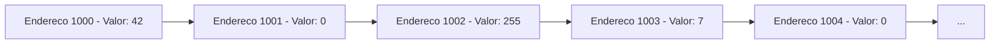
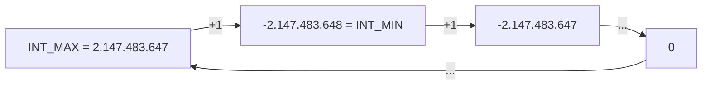
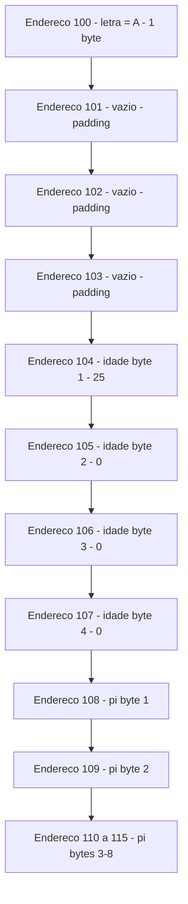
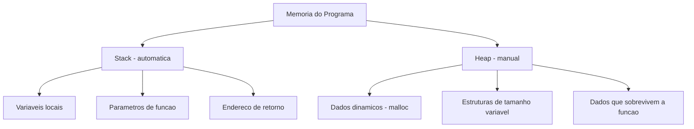
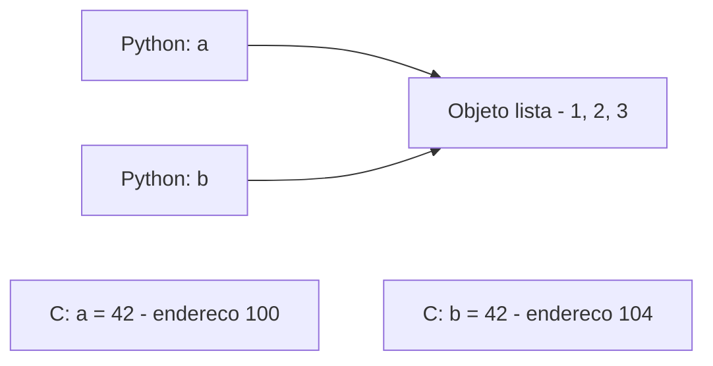

# 7.3 — Variáveis, Tipos e Alocação de Memória em C

[← Anterior: Ambiente C](cap07-mod02-ambiente-c-conteudo.md) · [Próximo: Ponteiros →](cap07-mod04-ponteiros-conteudo.md)

---

## Introdução

No módulo anterior, você instalou o GCC, compilou seus primeiros programas em C e viu que a sintaxe é parecida com Python — variáveis, if/else, loops e funções existem nas duas linguagens. A diferença é que em C você precisa ser mais explícito: declarar tipos, usar ponto e vírgula, incluir bibliotecas.

Agora vamos entrar no assunto mais importante deste capítulo inteiro. Se você tiver que escolher apenas um módulo para estudar com profundidade, escolha este. Tudo que vem depois — ponteiros, arrays, listas encadeadas, filas, pilhas — depende do que vamos aprender aqui.

Vamos entender **como a memória do computador funciona** e **o que realmente acontece quando você cria uma variável**. Em Python, quando você escreve `x = 42`, a linguagem cuida de tudo: aloca memória, guarda o valor, gerência o tipo. Você nunca precisa pensar em onde o `42` está guardado nem quantos bytes ele ocupa.

Em C, você vai ver tudo isso acontecendo. E quando entender, vai olhar para Python com outros olhos — porque vai saber o que Python faz por você automaticamente.

---

## Como Executar os Exemplos Deste Módulo

Todos os exemplos deste módulo são programas C completos. Para cada um:

```bash
# Crie o arquivo na pasta do capitulo 7
cd ~/meus-projetos/curso/cap07

# Compile com avisos ativados
gcc -Wall programa.c -o programa

# Execute
./programa
```

Alguns exemplos usam a função `sizeof()` para mostrar o tamanho de variáveis na memória. Os valores podem variar ligeiramente dependendo do sistema operacional e da arquitetura do processador, mas os conceitos são os mesmos.

---

## A Memória do Computador: Uma Rua com Casas Numeradas

No módulo 1.2, você aprendeu que a **RAM** (Random Access Memory) é a memória de trabalho do computador — a "bancada" onde o processador coloca os dados que está usando no momento. Agora vamos olhar para essa memória com muito mais detalhe.

### Como a Memória é Organizada

A memória RAM do seu computador é uma sequência enorme de **bytes**. Cada byte tem um **endereço** — um número que identifica sua posição na memória.

Pense na memória como uma rua muito longa, com milhões de casas. Cada casa:
- Tem um **número** (o endereço)
- Tem **espaço para guardar um valor** (o conteúdo — 1 byte)
- É do **mesmo tamanho** que todas as outras (1 byte = 8 bits)



Se o seu computador tem 8GB de RAM, ele tem aproximadamente **8 bilhões de bytes** — ou seja, 8 bilhões de "casas" numeradas, cada uma guardando um valor entre 0 e 255.

### Endereços de Memória

Cada byte na memória tem um endereço único. Na prática, endereços são números muito grandes, geralmente escritos em **hexadecimal** (base 16) para ficar mais curto:

| Formato | Exemplo | Significado |
|---------|---------|-------------|
| Decimal | 140.737.488.355.328 | Número grande, difícil de ler |
| Hexadecimal | 0x7FFEEFBFF400 | Mais curto, padrão em programação |

Você não precisa decorar endereços — o sistema operacional gerência isso. Mas precisa entender que **toda variável que você cria em C ocupa um ou mais bytes na memória, e cada byte tem um endereço**.

### A Analogia Completa

Vamos expandir a analogia da rua:

| Conceito de memória | Analogia da rua |
|---------------------|-----------------|
| 1 byte | 1 casa |
| Endereco | Número da casa |
| Valor armazenado | O que esta dentro da casa |
| Variável `int` (4 bytes) | 4 casas vizinhas reservadas juntas |
| Variável `char` (1 byte) | 1 casa reservada |
| Variável `double` (8 bytes) | 8 casas vizinhas reservadas juntas |
| Alocar memória | Reservar casas para uso |
| Liberar memória | Devolver as casas (ficam disponiveis para outros) |

---

## O que Acontece Quando Você Cria uma Variável

Em Python, criar uma variável é simples:

```python
x = 42
```

O que Python faz por baixo (sem você saber):
1. Cria um objeto inteiro com o valor 42 em algum lugar da memória
2. Faz a variável `x` apontar para esse objeto
3. Gerência o tipo automaticamente
4. Quando `x` não for mais usado, o garbage collector libera a memória

Em C, o processo é mais explícito:

```c
int x = 42;
```

O que acontece:
1. O compilador vê que `x` é do tipo `int` (4 bytes)
2. Reserva 4 bytes consecutivos na memória (na stack)
3. Escreve o valor 42 nesses 4 bytes
4. Associa o nome `x` ao endereço do primeiro byte

Vamos ver isso na prática:

```c
// memoria_basica.c — Vendo variaveis na memoria
#include <stdio.h>

int main() {
    int idade = 25;        // "idade" = age — 4 bytes
    char letra = 'A';      // "letra" = letter — 1 byte
    float preco = 19.90;   // "preco" = price — 4 bytes
    double pi = 3.14159;   // "pi" = pi — 8 bytes

    // Imprime o VALOR de cada variavel
    printf("=== Valores ===\n");
    printf("idade: %d\n", idade);
    printf("letra: %c\n", letra);
    printf("preco: %.2f\n", preco);
    printf("pi:    %.5f\n", pi);

    // Imprime o TAMANHO de cada variavel (em bytes)
    printf("\n=== Tamanhos (sizeof) ===\n");
    printf("sizeof(idade): %lu bytes\n", sizeof(idade));
    printf("sizeof(letra): %lu bytes\n", sizeof(letra));
    printf("sizeof(preco): %lu bytes\n", sizeof(preco));
    printf("sizeof(pi):    %lu bytes\n", sizeof(pi));

    // Imprime o ENDERECO de cada variavel na memoria
    printf("\n=== Enderecos ===\n");
    printf("endereco de idade: %p\n", (void*)&idade);
    printf("endereco de letra: %p\n", (void*)&letra);
    printf("endereco de preco: %p\n", (void*)&preco);
    printf("endereco de pi:    %p\n", (void*)&pi);

    return 0;
}
```

Saída esperada (endereços variam a cada execução):
```
=== Valores ===
idade: 25
letra: A
preco: 19.90
pi:    3.14159

=== Tamanhos (sizeof) ===
sizeof(idade): 4 bytes
sizeof(letra): 1 bytes
sizeof(preco): 4 bytes
sizeof(pi):    8 bytes

=== Enderecos ===
endereco de idade: 0x7ffeefbff3fc
endereco de letra: 0x7ffeefbff3fb
endereco de preco: 0x7ffeefbff3f4
endereco de pi:    0x7ffeefbff3e8
```

### Analisando a Saída

Três informações fundamentais sobre cada variável:

1. **Valor**: o dado que você guardou (25, 'A', 19.90, 3.14159)
2. **Tamanho**: quantos bytes a variável ocupa na memória (4, 1, 4, 8)
3. **Endereço**: onde na memória a variável está guardada (0x7ffeefbff3fc, etc.)

Em Python, você só tem acesso ao valor. Em C, você tem acesso aos três. E isso é o que torna C tão poderosa — e tão perigosa.

### O Operador `sizeof`

A função `sizeof()` retorna o tamanho em bytes de uma variável ou tipo. É uma das ferramentas mais úteis em C:

```c
// sizeof_tipos.c — Tamanho de cada tipo em C
#include <stdio.h>

int main() {
    printf("=== Tamanho dos tipos basicos ===\n");
    printf("char:   %lu byte\n", sizeof(char));
    printf("int:    %lu bytes\n", sizeof(int));
    printf("float:  %lu bytes\n", sizeof(float));
    printf("double: %lu bytes\n", sizeof(double));
    printf("long:   %lu bytes\n", sizeof(long));

    printf("\n=== Quantos valores cabem? ===\n");
    printf("char:   -128 a 127 (ou 0 a 255 sem sinal)\n");
    printf("int:    -2.147.483.648 a 2.147.483.647\n");
    printf("float:  ~6-7 digitos significativos\n");
    printf("double: ~15-16 digitos significativos\n");
    printf("long:   -9.2 quintilhoes a +9.2 quintilhoes\n");

    return 0;
}
```

Saída esperada:
```
=== Tamanho dos tipos basicos ===
char:   1 byte
int:    4 bytes
float:  4 bytes
double: 8 bytes
long:   8 bytes

=== Quantos valores cabem? ===
char:   -128 a 127 (ou 0 a 255 sem sinal)
int:    -2.147.483.648 a 2.147.483.647
float:  ~6-7 digitos significativos
double: ~15-16 digitos significativos
long:   -9.2 quintilhoes a +9.2 quintilhoes
```

### O Operador `&` (Endereço de)

O operador `&` retorna o endereço de memória de uma variável. Quando você escreve `&idade`, está perguntando: "em qual endereço da memória a variável `idade` está guardada?"

```c
int idade = 25;
printf("Valor: %d\n", idade);     // Imprime 25
printf("Endereco: %p\n", (void*)&idade);  // Imprime o endereco (ex: 0x7ffeefbff3fc)
```

Pense assim:
- `idade` = "o que está dentro da casa" (o valor 25)
- `&idade` = "o número da casa" (o endereço 0x7ffeefbff3fc)

No módulo 7.4, vamos aprender sobre **ponteiros** — variáveis que guardam endereços. Mas por enquanto, o importante é entender que toda variável tem um endereço e que o `&` permite acessá-lo.

Lembra do `scanf` do módulo anterior?

```c
scanf("%d", &idade);  // O & diz ao scanf ONDE guardar o valor lido
```

Agora faz sentido: o `scanf` precisa saber o **endereço** da variável para poder escrever o valor lá. Sem o `&`, ele não saberia onde guardar o número que o usuário digitou.

---

## Tipos de Dados em Profundidade

No módulo 7.2, vimos os tipos básicos de C rapidamente. Agora vamos entender cada um em profundidade — por que existem, como funcionam na memória e quando usar cada um.

### Por que Tipos Existem?

Em Python, você não precisa declarar tipos. Escreve `x = 42` e Python descobre sozinho que é um inteiro. Escreve `x = "hello"` e Python muda o tipo para string. Isso é conveniente, mas tem um custo: Python precisa guardar informações extras sobre cada variável (qual é o tipo, quantas referências existem, etc.), o que consome mais memória e mais tempo de processamento.

Em C, quando você declara `int x = 42;`, o compilador sabe exatamente:
- Quantos bytes reservar (4 para int)
- Como interpretar os bits (como número inteiro com sinal)
- Quais operações são válidas (soma, subtração, multiplicação, divisão inteira)

Isso permite que o compilador gere código muito mais eficiente. Não há surpresas em tempo de execução — tudo é decidido na compilação.

### char — 1 Byte

O tipo `char` ocupa exatamente **1 byte** (8 bits). Pode guardar:
- Um caractere (letra, número, símbolo) usando a tabela ASCII
- Um número pequeno de -128 a 127 (com sinal) ou 0 a 255 (sem sinal)

```c
// tipo_char.c — O tipo char
#include <stdio.h>

int main() {
    char letra = 'A';       // Guarda o caractere 'A'
    char numero = 65;        // Tambem guarda 'A' (65 e o codigo ASCII de 'A')
    char espaco = ' ';       // Espaco em branco (codigo ASCII 32)
    char newline = '\n';     // Caractere de nova linha (codigo ASCII 10)

    printf("letra como caractere: %c\n", letra);    // Imprime: A
    printf("letra como numero:    %d\n", letra);     // Imprime: 65
    printf("numero como caractere: %c\n", numero);   // Imprime: A
    printf("numero como numero:    %d\n", numero);    // Imprime: 65

    // Caracteres sao numeros! Podemos fazer aritmetica
    char proxima = letra + 1;  // 'A' + 1 = 'B' (65 + 1 = 66)
    printf("Proxima letra: %c\n", proxima);  // Imprime: B

    // Converter minuscula para maiuscula
    char minuscula = 'a';           // codigo ASCII 97
    char maiuscula = minuscula - 32; // 97 - 32 = 65 = 'A'
    printf("%c maiuscula: %c\n", minuscula, maiuscula);  // Imprime: a maiuscula: A

    return 0;
}
```

Saída esperada:
```
letra como caractere: A
letra como numero:    65
numero como caractere: A
numero como numero:    65
Proxima letra: B
a maiuscula: A
```

O conceito-chave aqui é: **em C, caracteres são números**. A letra 'A' é apenas o número 65 interpretado como caractere pela tabela ASCII. Isso é diferente de Python, onde `str` e `int` são tipos completamente separados.

A tabela ASCII (American Standard Code for Information Interchange) mapeia números de 0 a 127 para caracteres:

| Faixa | Caracteres | Exemplo |
|-------|-----------|---------|
| 0-31 | Caracteres de controle | 10 = nova linha, 13 = retorno de carro |
| 32-47 | Símbolos e espaco | 32 = espaco, 33 = !, 43 = + |
| 48-57 | Digitos 0-9 | 48 = '0', 49 = '1', 57 = '9' |
| 65-90 | Letras maiusculas A-Z | 65 = 'A', 66 = 'B', 90 = 'Z' |
| 97-122 | Letras minusculas a-z | 97 = 'a', 98 = 'b', 122 = 'z' |

Perceba que a diferença entre maiúscula e minúscula é sempre 32: 'A' (65) e 'a' (97), 'B' (66) e 'b' (98). Isso não é coincidência — foi projetado assim para facilitar a conversão.

### int — 4 Bytes

O tipo `int` ocupa **4 bytes** (32 bits) e guarda números inteiros com sinal:

```c
// tipo_int.c — O tipo int e seus limites
#include <stdio.h>
#include <limits.h>  // Contem as constantes de limites dos tipos

int main() {
    int positivo = 2000000000;   // 2 bilhoes
    int negativo = -2000000000;  // -2 bilhoes
    int zero = 0;

    printf("Positivo: %d\n", positivo);
    printf("Negativo: %d\n", negativo);
    printf("Zero: %d\n", zero);

    // Limites do tipo int (definidos em limits.h)
    printf("\nLimites do int:\n");
    printf("Minimo: %d\n", INT_MIN);   // -2.147.483.648
    printf("Maximo: %d\n", INT_MAX);   // 2.147.483.647

    // O que acontece se ultrapassar o limite? OVERFLOW!
    int maximo = INT_MAX;
    printf("\nMaximo:     %d\n", maximo);
    printf("Maximo + 1: %d\n", maximo + 1);  // OVERFLOW — vira negativo!

    return 0;
}
```

Saída esperada:
```
Positivo: 2000000000
Negativo: -2000000000
Zero: 0

Limites do int:
Minimo: -2147483648
Maximo: 2147483647

Maximo:     2147483647
Maximo + 1: -2147483648
```

### Overflow: Quando o Número Transborda

Observe a última linha: `2.147.483.647 + 1` resulta em `-2.147.483.648`. Isso é **overflow** (transbordamento) — o número ultrapassou o limite máximo e "deu a volta", voltando para o valor mínimo.

Imagine um velocímetro de carro que vai de 0 a 999.999 km. Quando chega em 999.999 e roda mais 1 km, ele volta para 000.000. É o mesmo princípio.

Em Python, isso nunca acontece — inteiros podem ser tão grandes quanto a memória permitir. Em C, inteiros têm tamanho fixo, e ultrapassar o limite causa overflow. Isso é uma fonte comum de bugs em programas C.



### float e double — Números Decimais

`float` (4 bytes) e `double` (8 bytes) guardam números com casas decimais. A diferença é a **precisão**:

```c
// tipo_float_double.c — Diferenca entre float e double
#include <stdio.h>

int main() {
    float f = 1.0 / 3.0;    // 1 dividido por 3
    double d = 1.0 / 3.0;   // 1 dividido por 3

    // float tem ~7 digitos de precisao
    printf("float:  %.20f\n", f);
    // double tem ~15 digitos de precisao
    printf("double: %.20f\n", d);

    // Demonstrando perda de precisao com float
    float soma_float = 0.0;
    double soma_double = 0.0;
    int i;

    // Soma 0.1 dez mil vezes
    for (i = 0; i < 10000; i++) {
        soma_float += 0.1;
        soma_double += 0.1;
    }

    printf("\nSomando 0.1 dez mil vezes:\n");
    printf("float:  %.10f (esperado: 1000.0)\n", soma_float);
    printf("double: %.10f (esperado: 1000.0)\n", soma_double);

    return 0;
}
```

Saída esperada:
```
float:  0.33333334326744079590
double: 0.33333333333333331483

Somando 0.1 dez mil vezes:
float:  999.9028930664 (esperado: 1000.0)
double: 1000.0000000016 (esperado: 1000.0)
```

Perceba: nem `float` nem `double` conseguem representar 1/3 exatamente. E ao somar 0.1 dez mil vezes, o `float` erra por quase 1 unidade, enquanto o `double` erra por uma fração minúscula.

Isso acontece porque computadores usam **representação binária** para números decimais, e muitas frações decimais (como 0.1) não têm representação exata em binário — assim como 1/3 não tem representação exata em decimal (0.333333...).

**Regra prática**: use `double` quando precisar de precisão (cálculos financeiros, científicos). Use `float` quando a memória for muito limitada (sistemas embarcados) e a precisão menor for aceitável.

### long — 8 Bytes

O tipo `long` ocupa **8 bytes** (64 bits) e guarda números inteiros muito grandes:

```c
// tipo_long.c — Numeros grandes com long
#include <stdio.h>
#include <limits.h>

int main() {
    long populacao_mundial = 8000000000;    // 8 bilhoes
    long distancia_sol = 149597870700;       // 149 bilhoes de metros
    long bytes_em_1tb = 1099511627776;       // 1 trilhao de bytes

    printf("Populacao mundial: %ld\n", populacao_mundial);
    printf("Distancia ate o Sol: %ld metros\n", distancia_sol);
    printf("Bytes em 1TB: %ld\n", bytes_em_1tb);

    printf("\nLimites do long:\n");
    printf("Minimo: %ld\n", LONG_MIN);
    printf("Maximo: %ld\n", LONG_MAX);

    return 0;
}
```

Saída esperada:
```
Populacao mundial: 8000000000
Distancia ate o Sol: 149597870700 metros
Bytes em 1TB: 1099511627776

Limites do long:
Minimo: -9223372036854775808
Maximo: 9223372036854775807
```

O `long` pode guardar números até aproximadamente 9.2 quintilhões — mais que suficiente para a maioria das aplicações.

### Tipos com e sem Sinal (signed e unsigned)

Por padrão, tipos inteiros em C são **com sinal** (signed) — podem ser positivos ou negativos. Se você sabe que um valor nunca será negativo, pode usar **unsigned** para dobrar a faixa positiva:

| Tipo | Tamanho | Com sinal (signed) | Sem sinal (unsigned) |
|------|---------|--------------------|--------------------|
| `char` | 1 byte | -128 a 127 | 0 a 255 |
| `int` | 4 bytes | -2.147.483.648 a 2.147.483.647 | 0 a 4.294.967.295 |
| `long` | 8 bytes | -9.2 quintilhoes a +9.2 quintilhoes | 0 a 18.4 quintilhoes |

```c
// unsigned_demo.c — Tipos sem sinal
#include <stdio.h>

int main() {
    unsigned int idade = 25;           // Idade nunca e negativa
    unsigned char byte_valor = 200;    // Valor de byte (0-255)
    unsigned long tamanho = 5000000000; // Tamanho de arquivo grande

    printf("Idade: %u\n", idade);           // %u = unsigned int
    printf("Byte: %u\n", byte_valor);       // %u para unsigned
    printf("Tamanho: %lu\n", tamanho);      // %lu = unsigned long

    return 0;
}
```

Saída esperada:
```
Idade: 25
Byte: 200
Tamanho: 5000000000
```

---

## Visualizando a Memória: Diagramas

Para realmente entender o que acontece na memória, vamos visualizar. Quando você declara:

```c
int idade = 25;
char letra = 'A';
double pi = 3.14;
```

A memória fica assim (endereços simplificados):



Observe alguns detalhes importantes:

1. **`letra` ocupa 1 byte** (endereço 100), mas os endereços 101-103 ficam vazios. Isso é chamado de **padding** (preenchimento) — o compilador alinha variáveis em endereços múltiplos de 4 para que o processador acesse mais rápido.

2. **`idade` ocupa 4 bytes** (endereços 104-107). O valor 25 cabe em 1 byte, mas como `int` tem 4 bytes, os outros 3 ficam com zero.

3. **`pi` ocupa 8 bytes** (endereços 108-115). O número 3.14 é codificado em formato IEEE 754 de ponto flutuante — uma representação binária complexa que não vamos detalhar aqui.

### Vendo os Bytes na Prática

Podemos escrever um programa que mostra os bytes individuais de uma variável:

```c
// ver_bytes.c — Mostra os bytes de uma variavel na memoria
#include <stdio.h>

int main() {
    int numero = 25;
    unsigned char *bytes = (unsigned char*)&numero;  // Ponteiro para os bytes
    int i;

    printf("Valor: %d\n", numero);
    printf("Tamanho: %lu bytes\n", sizeof(numero));
    printf("Endereco: %p\n", (void*)&numero);
    printf("Bytes individuais: ");

    for (i = 0; i < (int)sizeof(numero); i++) {
        printf("%02x ", bytes[i]);  // %02x = hexadecimal com 2 digitos
    }
    printf("\n");

    // Agora com um numero maior
    int grande = 100000;
    bytes = (unsigned char*)&grande;

    printf("\nValor: %d\n", grande);
    printf("Bytes individuais: ");
    for (i = 0; i < (int)sizeof(grande); i++) {
        printf("%02x ", bytes[i]);
    }
    printf("\n");

    return 0;
}
```

Saída esperada:
```
Valor: 25
Tamanho: 4 bytes
Endereco: 0x7ffeefbff3fc
Bytes individuais: 19 00 00 00

Valor: 100000
Bytes individuais: a0 86 01 00
```

O valor 25 em hexadecimal é `19` (1×16 + 9 = 25). Como `int` tem 4 bytes, os outros 3 são `00`. O valor 100000 em hexadecimal é `186a0`, que distribuído em 4 bytes (little-endian) fica `a0 86 01 00`.

Não se preocupe em entender a representação hexadecimal em detalhes agora. O importante é visualizar que **um `int` realmente ocupa 4 bytes na memória** e que o valor é distribuído entre esses bytes.

---

## Stack e Heap: Dois Tipos de Memória

Quando um programa C roda, ele usa duas regiões diferentes de memória: a **stack** (pilha) e o **heap** (monte). Entender a diferença é fundamental para tudo que vem depois neste capítulo.

### Stack (Pilha de Execução)

A **stack** é a memória automática. Quando você declara uma variável dentro de uma função, ela é criada na stack:

```c
int main() {
    int x = 42;      // x e criado na stack
    float y = 3.14;  // y e criado na stack
    char c = 'A';    // c e criado na stack
    return 0;
}   // Quando main termina, x, y e c sao destruidos automaticamente
```

Características da stack:
- **Automática**: variáveis são criadas quando a função começa e destruídas quando termina
- **Rápida**: alocar na stack é extremamente rápido (apenas mover um ponteiro)
- **Limitada**: a stack tem tamanho fixo (geralmente 1-8MB)
- **Organizada**: funciona como uma pilha de pratos — o último a entrar é o primeiro a sair (LIFO)

A analogia perfeita: a stack é como uma pilha de bandejas em um restaurante self-service. Cada vez que uma função é chamada, uma bandeja nova é colocada no topo. Quando a função termina, a bandeja é removida. Você só pode acessar a bandeja do topo.

### Heap (Memória Dinâmica)

O **heap** é a memória que você controla manualmente. Você pede memória ao sistema com `malloc()` e devolve com `free()`:

```c
#include <stdlib.h>  // Para malloc e free

int main() {
    // Pede 4 bytes ao sistema (tamanho de um int)
    int *ptr = (int*)malloc(sizeof(int));

    *ptr = 42;  // Guarda 42 no espaco alocado

    printf("Valor: %d\n", *ptr);

    free(ptr);  // Devolve a memoria ao sistema
    return 0;
}
```

Não se preocupe com a sintaxe de ponteiros (`int *ptr`, `*ptr`) — vamos detalhar isso no módulo 7.4. Por enquanto, entenda o conceito:

Características do heap:
- **Manual**: você decide quando alocar e quando liberar
- **Mais lento**: alocar no heap é mais lento que na stack (precisa procurar espaço livre)
- **Grande**: o heap pode usar toda a memória disponível do sistema
- **Flexível**: o tamanho pode ser decidido em tempo de execução

A analogia: o heap é como um estacionamento. Você chega, procura uma vaga (malloc), estaciona (usa a memória), e quando termina, libera a vaga (free). Se esquecer de liberar, a vaga fica ocupada sem ninguém usar — isso é um **memory leak**.

### Stack vs Heap: Comparação

| Aspecto | Stack | Heap |
|---------|-------|------|
| Gerenciamento | Automático | Manual (malloc/free) |
| Velocidade | Muito rápida | Mais lenta |
| Tamanho | Limitado (1-8MB) | Limitado pela RAM total |
| Quando usar | Variáveis locais de tamanho conhecido | Dados de tamanho dinâmico |
| Risco | Stack overflow (estouro) | Memory leak (vazamento) |
| Tempo de vida | Até a função terminar | Até você chamar free() |



### Stack Overflow: Quando a Pilha Estoura

Se você criar variáveis demais na stack ou fizer recursão infinita, a stack estoura — isso é o famoso **stack overflow**:

```c
// CUIDADO — este programa causa stack overflow
// NAO execute — e apenas para ilustrar o conceito
void funcao_infinita() {
    int array_grande[1000000];  // 4MB na stack!
    funcao_infinita();           // Chama a si mesma infinitamente
}
```

O nome do site **Stack Overflow** (stackoverflow.com) vem exatamente desse erro — é um dos problemas mais comuns em programação.

---

## Variáveis em Python vs C: A Diferença Fundamental

Agora que você entende memória, vamos ver a diferença mais importante entre variáveis em Python e em C.

### Em C: Variáveis SÃO Espaços de Memória

Quando você escreve `int x = 42;` em C:
- `x` **é** um espaço de 4 bytes na memória
- O valor 42 está **dentro** desse espaço
- `x` tem um endereço fixo que não muda

```c
int x = 42;
x = 100;  // Muda o VALOR dentro do mesmo espaco de memoria
// O endereco de x NAO muda — so o conteudo muda
```

### Em Python: Variáveis SÃO Referências a Objetos

Quando você escreve `x = 42` em Python:
- Python cria um **objeto** inteiro com valor 42 em algum lugar da memória
- `x` é uma **referência** (um ponteiro escondido) que aponta para esse objeto
- Quando você faz `x = 100`, Python cria um **novo** objeto com valor 100 e faz `x` apontar para ele

```python
x = 42    # x aponta para o objeto 42
x = 100   # x agora aponta para o objeto 100
          # O objeto 42 pode ser destruido pelo garbage collector
```

Essa diferença tem consequências práticas importantes:

```python
# Python — a e b apontam para o MESMO objeto
a = [1, 2, 3]
b = a           # b aponta para a mesma lista que a
b.append(4)     # Modifica a lista
print(a)        # [1, 2, 3, 4] — a tambem mudou!
```

```c
// C — a e b sao espacos de memoria SEPARADOS
int a = 42;
int b = a;   // Copia o VALOR de a para b
b = 100;     // Muda apenas b
// a continua sendo 42 — sao espacos independentes
```



Em Python, `a` e `b` são dois nomes para o mesmo objeto. Em C, `a` e `b` são dois espaços de memória independentes que por acaso têm o mesmo valor.

Esse conceito vai ser crucial quando estudarmos ponteiros no próximo módulo — ponteiros em C são o equivalente explícito das referências implícitas de Python.

---

## Conversão de Tipos (Casting)

Em Python, a conversão de tipos é explícita e segura:

```python
x = int("42")      # String para inteiro
y = float(42)       # Inteiro para float
z = str(42)         # Inteiro para string
```

Em C, existem conversões **implícitas** (automáticas) e **explícitas** (casting):

```c
// conversao.c — Conversao de tipos em C
#include <stdio.h>

int main() {
    // Conversao IMPLICITA — o compilador faz automaticamente
    int inteiro = 42;
    float decimal = inteiro;  // int -> float (seguro, sem perda)
    printf("int -> float: %d -> %.2f\n", inteiro, decimal);

    // Conversao IMPLICITA com perda
    float pi = 3.14159;
    int truncado = pi;  // float -> int (PERDE as casas decimais!)
    printf("float -> int: %.5f -> %d\n", pi, truncado);

    // Conversao EXPLICITA (casting) — voce diz ao compilador
    int a = 7, b = 2;
    float divisao_inteira = a / b;          // 7/2 = 3 (divisao inteira!)
    float divisao_real = (float)a / b;      // 7.0/2 = 3.5 (casting para float)
    printf("7/2 sem cast:  %.2f\n", divisao_inteira);
    printf("7/2 com cast:  %.2f\n", divisao_real);

    // Conversao char <-> int
    char letra = 'A';
    int codigo = letra;  // char -> int (pega o codigo ASCII)
    printf("'%c' = %d em ASCII\n", letra, codigo);

    return 0;
}
```

Saída esperada:
```
int -> float: 42 -> 42.00
float -> int: 3.14159 -> 3
7/2 sem cast:  3.00
7/2 com cast:  3.50
'A' = 65 em ASCII
```

O caso mais perigoso é a **divisão inteira**: `7 / 2` em C resulta em `3`, não em `3.5`. Isso acontece porque ambos os operandos são `int`, então C faz divisão inteira. Para obter o resultado decimal, pelo menos um dos operandos precisa ser `float` ou `double` — daí o casting `(float)a / b`.

Em Python 3, `7 / 2` sempre resulta em `3.5` (divisão real). Para divisão inteira em Python, você usa `7 // 2`. Em C, a divisão entre inteiros é sempre inteira — não existe o operador `//`.

---

## Constantes

Às vezes você quer criar um valor que nunca muda — como o valor de PI ou o número máximo de tentativas. Em C, existem duas formas:

### const

```c
// constantes.c — Valores que nao mudam
#include <stdio.h>

int main() {
    const float PI = 3.14159;       // "PI" = pi — constante
    const int MAX_TENTATIVAS = 3;   // "MAX_TENTATIVAS" = max attempts

    float raio = 5.0;  // "raio" = radius
    float area = PI * raio * raio;  // "area" = area

    printf("Area do circulo: %.2f\n", area);
    printf("Tentativas maximas: %d\n", MAX_TENTATIVAS);

    // PI = 3.0;  // ERRO! Nao pode mudar uma constante

    return 0;
}
```

Saída esperada:
```
Area do circulo: 78.54
Tentativas maximas: 3
```

### #define

Outra forma de criar constantes é com `#define`, que é processado pelo pré-processador:

```c
#define PI 3.14159
#define MAX_TENTATIVAS 3

// O pre-processador substitui PI por 3.14159 em todo o codigo
// antes da compilacao
float area = PI * raio * raio;
// Vira: float area = 3.14159 * raio * raio;
```

A diferença: `const` cria uma variável real na memória (que não pode ser alterada). `#define` faz uma substituição de texto antes da compilação — não cria variável, apenas troca o nome pelo valor.

| Aspecto | const | #define |
|---------|-------|---------|
| Tipo | Tem tipo definido | Sem tipo (substituição de texto) |
| Memória | Ocupa espaco na memória | Não ocupa (substituido antes de compilar) |
| Escopo | Respeita escopo de bloco | Global (vale em todo o arquivo) |
| Debug | Aparece no debugger | Não aparece (ja foi substituido) |
| Convencao | `const float PI = 3.14;` | `#define PI 3.14` |

---

## Escopo de Variáveis

Em Python, o escopo de variáveis é relativamente simples. Em C, é parecido mas com algumas diferenças:

```c
// escopo.c — Escopo de variaveis em C
#include <stdio.h>

int global = 100;  // Variavel GLOBAL — acessivel em todo o arquivo

void funcao() {
    int local = 50;  // Variavel LOCAL — so existe dentro desta funcao
    printf("Dentro da funcao: global=%d, local=%d\n", global, local);
}

int main() {
    int x = 10;  // LOCAL a main

    printf("Em main: global=%d, x=%d\n", global, x);

    funcao();

    // printf("local=%d\n", local);  // ERRO! local nao existe aqui

    // Escopo de bloco
    if (x > 5) {
        int y = 20;  // LOCAL ao bloco if
        printf("Dentro do if: x=%d, y=%d\n", x, y);
    }
    // printf("y=%d\n", y);  // ERRO! y nao existe fora do if

    // Escopo de loop
    for (int i = 0; i < 3; i++) {
        printf("Loop: i=%d\n", i);
    }
    // printf("i=%d\n", i);  // ERRO! i nao existe fora do for

    return 0;
}
```

Saída esperada:
```
Em main: global=100, x=10
Dentro da funcao: global=100, local=50
Dentro do if: x=10, y=20
Loop: i=0
Loop: i=1
Loop: i=2
```

Regras de escopo em C:
1. **Variáveis globais**: declaradas fora de qualquer função, acessíveis em todo o arquivo
2. **Variáveis locais**: declaradas dentro de uma função, existem apenas naquela função
3. **Variáveis de bloco**: declaradas dentro de `{}`, existem apenas naquele bloco
4. **Variáveis de loop**: declaradas no `for`, existem apenas no loop

Isso é muito parecido com Python — a diferença principal é que em C, variáveis declaradas dentro de um `if` ou `for` não existem fora dele, enquanto em Python elas continuam existindo.

---

## Variáveis Não Inicializadas: O Perigo Silencioso

Em Python, se você tentar usar uma variável que não foi definida, recebe um erro claro:

```python
print(x)  # NameError: name 'x' is not defined
```

Em C, se você declarar uma variável sem dar um valor inicial, ela contém **lixo** — qualquer valor que estava naquele espaço de memória antes:

```c
// lixo.c — Variaveis nao inicializadas
#include <stdio.h>

int main() {
    int x;  // Declarada mas NAO inicializada
    printf("Valor de x: %d\n", x);  // Imprime LIXO — valor imprevisivel

    // Sempre inicialize suas variaveis!
    int y = 0;  // Inicializada com zero — seguro
    printf("Valor de y: %d\n", y);  // Imprime 0 — previsivel

    return 0;
}
```

Saída esperada (o valor de x varia):
```
Valor de x: 32767
Valor de y: 0
```

O valor de `x` pode ser qualquer coisa — 0, 32767, -1234567, ou qualquer outro número. Depende do que estava naquele espaço de memória antes. Isso é um dos bugs mais comuns e mais difíceis de encontrar em C.

**Regra de ouro: sempre inicialize suas variáveis.** Mesmo que vá atribuir um valor logo depois, inicializar com 0 evita surpresas.

---

## Como a IA pode te ajudar aqui

**Prompt 1 — Criar diagramas:**
> "Desenhe o estado da memória após executar este código C"

**Prompt 2 — Comparar alternativas:**
> "Qual é a diferença entre stack e heap? Quando devo usar cada um?"

**Prompt 3 — Entender o porquê:**
> "O que acontece na memória quando eu faço `int x = 42;` em C vs `x = 42` em Python?"

---

## Casos de Uso no Mundo Real

### 1. Tipos de Dados em Bancos de Dados

Quando você cria uma tabela em um banco de dados (como o SQLite que vai usar no capítulo 8), precisa definir o tipo de cada coluna: `INTEGER`, `REAL`, `TEXT`. Esses tipos existem pelo mesmo motivo que os tipos em C — o banco de dados precisa saber quantos bytes reservar para cada valor e como interpretá-los. Um campo `INTEGER` ocupa menos espaço que um `TEXT`, e buscas em campos numéricos são mais rápidas porque o banco pode comparar bytes diretamente em vez de comparar caracteres um a um. Entender tipos em C ajuda a fazer escolhas melhores ao modelar bancos de dados.

### 2. Overflow em Sistemas Reais

Em 2014, o jogo Gangnam Style do PSY ultrapassou 2.147.483.647 visualizações no YouTube — exatamente o valor máximo de um `int` de 32 bits. O contador de views do YouTube usava um inteiro de 32 bits e sofreu overflow. O Google precisou atualizar o sistema para usar inteiros de 64 bits (`long`). Esse é um exemplo real de como entender os limites dos tipos de dados é importante — um bug que parece teórico pode afetar sistemas usados por bilhões de pessoas.

### 3. Memória em Sistemas Embarcados

Um microcontrolador Arduino Uno tem apenas **2KB de RAM** — 2.048 bytes. Quando você programa para Arduino (em C), cada byte conta. Usar `int` (4 bytes) quando `char` (1 byte) seria suficiente desperdiça memória preciosa. Engenheiros de sistemas embarcados pensam constantemente sobre tipos e tamanhos — exatamente o que você está aprendendo neste módulo. Em um dispositivo com 2KB de RAM, a diferença entre usar `int` e `char` para 100 variáveis é 300 bytes — 15% da memória total.

---

## Resumo do Módulo

| Conceito | Definição |
|----------|-----------|
| Byte | Unidade básica de memória, 8 bits, guarda um valor de 0 a 255 |
| Endereco de memória | Número único que identifica a posição de cada byte na RAM |
| sizeof | Operador que retorna o tamanho em bytes de um tipo ou variável |
| Operador & | Retorna o endereco de memória de uma variável |
| Stack | Memória automática para variáveis locais, rápida e limitada |
| Heap | Memória manual controlada com malloc/free, grande e flexível |
| Overflow | Quando um valor ultrapassa o limite do tipo e transborda |
| Padding | Bytes vazios inseridos pelo compilador para alinhar variáveis |
| Casting | Conversao explicita de um tipo para outro |
| Variável não inicializada | Variável que contem lixo da memória por não ter recebido valor |
| const | Modificador que impede a alteração do valor de uma variável |
| unsigned | Modificador que remove o sinal, dobrando a faixa positiva |

---

## Glossário do Módulo

| Termo | Definição |
|-------|-----------|
| ANSI C | Padrão oficial da linguagem C publicado em 1989 |
| ASCII | American Standard Code for Information Interchange — tabela que mapeia números a caracteres |
| Bit | Menor unidade de informação, pode ser 0 ou 1 |
| Byte | Conjunto de 8 bits, unidade básica de armazenamento |
| Casting | Conversao explicita de tipo usando a sintaxe (tipo)valor |
| Char | Tipo de dado em C que ocupa 1 byte |
| Const | Modificador que torna uma variável somente leitura |
| Define | Diretiva do pre-processador que substitui texto antes da compilação |
| Double | Tipo de dado em C com 8 bytes para números decimais de alta precisao |
| Endereco | Número único que identifica a posição de um byte na memória |
| Escopo | Regiao do código onde uma variável e acessível |
| Float | Tipo de dado em C com 4 bytes para números decimais |
| Garbage collector | Mecanismo automático de liberacao de memória presente em Python |
| Heap | Regiao de memória para alocação dinâmica controlada pelo programador |
| Hexadecimal | Sistema numerico de base 16 usado para representar enderecos |
| IEEE 754 | Padrão para representacao de números de ponto flutuante em binário |
| Int | Tipo de dado em C com 4 bytes para números inteiros |
| INT_MAX | Constante que define o valor máximo de um int |
| INT_MIN | Constante que define o valor mínimo de um int |
| Limits.h | Biblioteca C que contem constantes de limites dos tipos |
| Little-endian | Ordem de bytes onde o byte menos significativo vem primeiro |
| Long | Tipo de dado em C com 8 bytes para números inteiros grandes |
| Malloc | Função que aloca memória no heap |
| Memory leak | Vazamento de memória quando se esquece de liberar memória alocada |
| Overflow | Transbordamento quando um valor excede o limite do tipo |
| Padding | Bytes de preenchimento inseridos pelo compilador para alinhamento |
| RAM | Random Access Memory — memória de trabalho do computador |
| Signed | Tipo com sinal que aceita valores negativos e positivos |
| Sizeof | Operador que retorna o tamanho em bytes de um tipo ou variável |
| Stack | Regiao de memória automática para variáveis locais e chamadas de função |
| Stack overflow | Estouro da pilha de execução por excesso de dados ou recursao |
| Unsigned | Tipo sem sinal que aceita apenas valores positivos |
| Variável global | Variável declarada fora de funções, acessível em todo o arquivo |
| Variável local | Variável declarada dentro de uma função, acessível apenas nela |

---

## Na Cultura Popular

- **Matrix** (filme, 1999) — O mundo da Matrix é uma simulação computacional onde tudo é representado como dados na memória. Quando Neo "vê" o código da Matrix caindo na tela, ele está vendo a representação dos dados que compõem a realidade simulada. A ideia de que tudo — pessoas, objetos, lugares — é apenas dados organizados na memória é exatamente o que estamos aprendendo neste módulo.

- **O Jogo da Imitação** (filme, 2014) — Alan Turing trabalhou com os conceitos fundamentais de como informação é armazenada e processada. A máquina Enigma que ele ajudou a decifrar operava com representações binárias de dados — o mesmo princípio que usamos quando guardamos um `int` de 4 bytes na memória.

---

## Para Saber Mais

- [Python Tutor](https://pythontutor.com/) — *Visualize a execução de código C passo a passo, vendo como variáveis são criadas na memória. Suporta C além de Python*

- [Visualgo](https://visualgo.net/) — *Visualizações animadas de como dados são organizados na memória — excelente para entender arrays e estruturas*

- [CS50 — Harvard: Memory](https://cs50.harvard.edu/x/) — *As aulas do CS50 sobre memória em C são excelentes e complementam este módulo com animações e exemplos visuais*

- [Compiler Explorer (Godbolt)](https://godbolt.org/) — *Veja o Assembly gerado para cada declaração de variável — fascinante para entender o que o compilador faz com seus tipos*

- [Programação Descomplicada — Tipos de Dados em C](https://www.youtube.com/@progdescomplicada) — *Canal brasileiro com explicações claras sobre tipos, memória e variáveis em C*

---

## Perguntas Frequentes (FAQ)

**P: Por que C tem tantos tipos diferentes (char, int, float, double, long)?**
R: Porque cada tipo ocupa um tamanho diferente na memória e tem uma faixa de valores diferente. Se você só precisa guardar um número de 0 a 100, usar `char` (1 byte) é mais eficiente que `int` (4 bytes). Em sistemas com memória limitada (como microcontroladores), essa diferença importa muito. Python esconde essa complexidade usando tipos genéricos que se adaptam automaticamente.

**P: O que acontece se eu declarar uma variável e nunca usar?**
R: O compilador com `-Wall` vai avisar: "warning: unused variable". O programa compila e funciona, mas a variável ocupa espaço na stack sem necessidade. É boa prática remover variáveis não usadas.

**P: Posso mudar o tipo de uma variável em C, como faço em Python?**
R: Não. Em C, o tipo é fixo — declarou como `int`, será `int` para sempre. Você pode converter o valor para outro tipo (casting), mas a variável original não muda. Em Python, `x = 42` seguido de `x = "hello"` funciona porque `x` é apenas um nome que aponta para objetos diferentes. Em C, `x` é um espaço fixo de memória com tipo definido.

**P: O que é "lixo" na memória?**
R: Quando você declara uma variável sem inicializar (`int x;`), o espaço de memória reservado para `x` contém qualquer valor que estava lá antes — restos de variáveis de programas anteriores ou de funções que já terminaram. Esse valor residual é chamado de "lixo". Pode ser 0, pode ser 42, pode ser -999999 — é imprevisível.

**P: Stack overflow é perigoso?**
R: O programa trava imediatamente com um erro "Segmentation fault" (no Linux) ou similar. Não danifica o computador, mas o programa para de funcionar. As causas mais comuns são: recursão infinita (função que chama a si mesma sem parar) e arrays muito grandes na stack.

**P: Quanto de memória a stack tem?**
R: Depende do sistema operacional, mas geralmente entre 1MB e 8MB. No Linux, o padrão é 8MB. Parece pouco, mas é suficiente para a maioria dos programas — variáveis locais raramente ocupam mais que alguns KB. Se precisar de mais memória, use o heap (malloc).

**P: Por que 0.1 + 0.2 não é exatamente 0.3 em C (e em Python)?**
R: Porque 0.1 e 0.2 não têm representação exata em binário — assim como 1/3 não tem representação exata em decimal (0.333...). O computador armazena a aproximação mais próxima possível. Isso afeta todas as linguagens que usam ponto flutuante IEEE 754, incluindo C, Python, Java e JavaScript. Para cálculos financeiros, use inteiros (centavos em vez de reais) ou bibliotecas de precisão arbitrária.

**P: O que é little-endian e big-endian?**
R: São as duas formas de ordenar os bytes de um número na memória. Em little-endian (usado por processadores Intel/AMD), o byte menos significativo vem primeiro. Em big-endian (usado por alguns processadores ARM e em protocolos de rede), o byte mais significativo vem primeiro. Na prática, você raramente precisa se preocupar com isso — o compilador cuida da ordem correta.

**P: Posso ver a memória do meu programa enquanto ele roda?**
R: Sim, usando um debugger como o GDB. Com `gcc -g programa.c -o programa` e depois `gdb ./programa`, você pode pausar a execução e inspecionar o valor e o endereço de qualquer variável. Isso é extremamente útil para entender o que está acontecendo na memória.

**P: Por que o endereço de memória muda toda vez que executo o programa?**
R: Por segurança. O sistema operacional usa uma técnica chamada ASLR (Address Space Layout Randomization) que coloca o programa em endereços diferentes a cada execução. Isso dificulta ataques que dependem de saber onde os dados estão na memória.

**P: Em Python, `id(x)` mostra o endereço de um objeto. É a mesma coisa que `&x` em C?**
R: Conceitualmente sim — ambos mostram onde o dado está na memória. Mas em Python, `id(x)` mostra o endereço do objeto para o qual `x` aponta. Em C, `&x` mostra o endereço do espaço de memória que É `x`. A diferença reflete o modelo fundamental: em Python, variáveis são referências a objetos; em C, variáveis são os espaços de memória.

**P: O que é alinhamento de memória (padding)?**
R: O processador acessa a memória de forma mais eficiente quando os dados estão em endereços múltiplos do seu tamanho. Um `int` (4 bytes) é acessado mais rápido se estiver no endereço 100 (múltiplo de 4) do que no endereço 101. O compilador insere bytes vazios (padding) entre variáveis para garantir esse alinhamento. Isso pode fazer uma struct ocupar mais memória do que a soma dos seus campos.

---

## Exercícios Práticos

### Exercício 1 — Explorando sizeof

Crie um programa que use `sizeof` para mostrar o tamanho de todos os tipos básicos de C (char, int, float, double, long, unsigned int, unsigned char). Imprima em formato de tabela.

### Exercício 2 — Endereços de Memória

Declare 5 variáveis de tipos diferentes e imprima o valor, o tamanho e o endereço de cada uma. Observe: os endereços são consecutivos? A diferença entre endereços corresponde ao tamanho das variáveis?

### Exercício 3 — Overflow na Prática

Crie um programa que demonstre overflow: comece com `INT_MAX`, some 1 e mostre o resultado. Faça o mesmo com `CHAR_MAX` (127 + 1). Explique em um comentário o que aconteceu.

---

[← Anterior: Ambiente C](cap07-mod02-ambiente-c-conteudo.md) · [Próximo: Ponteiros →](cap07-mod04-ponteiros-conteudo.md)
